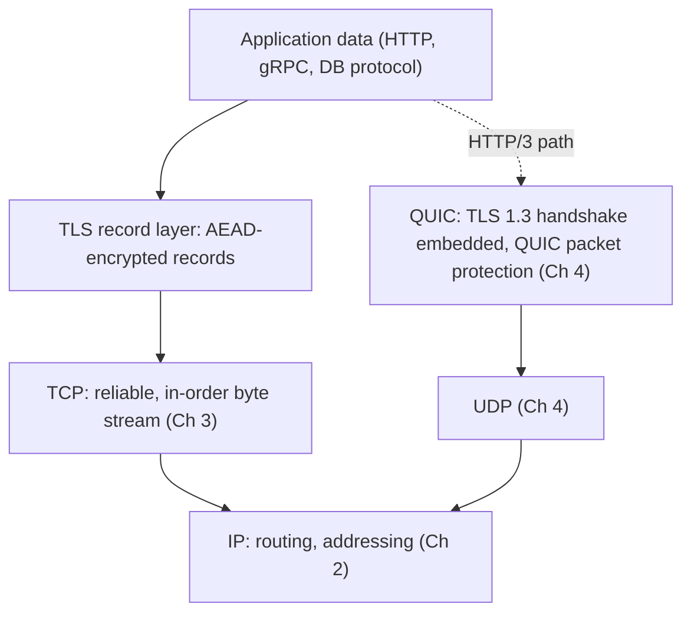
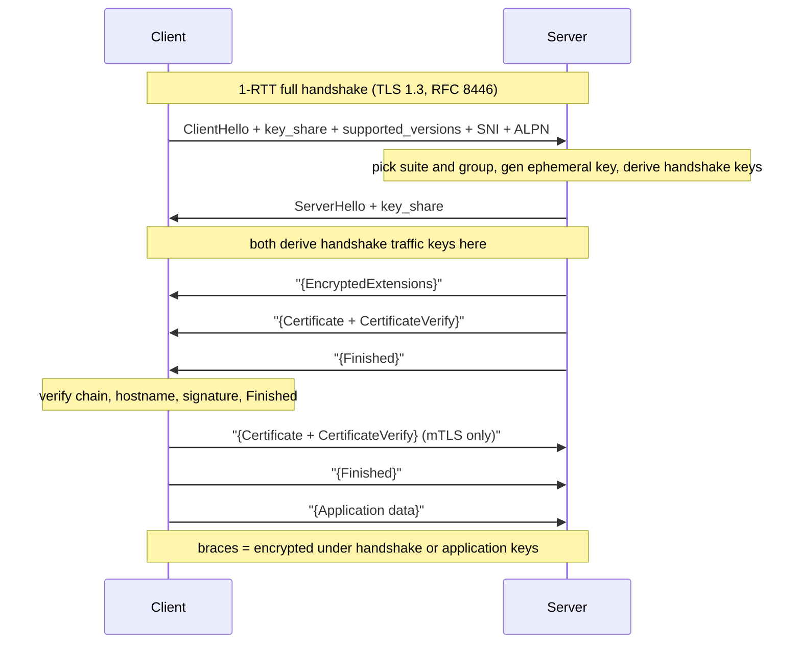
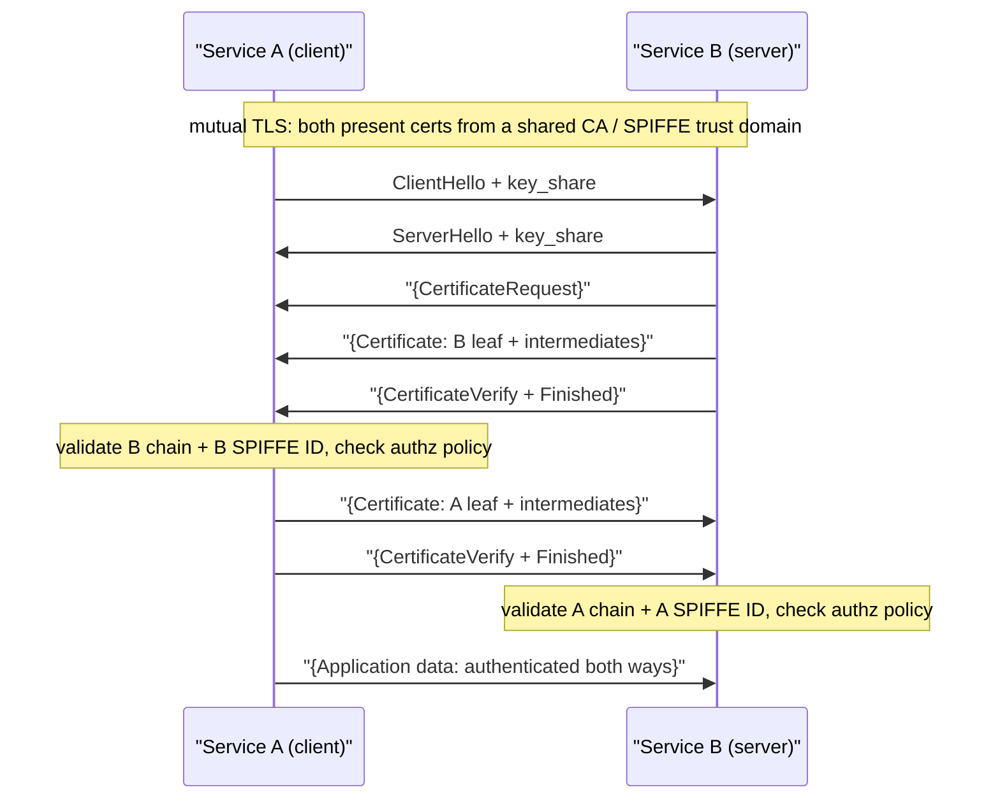
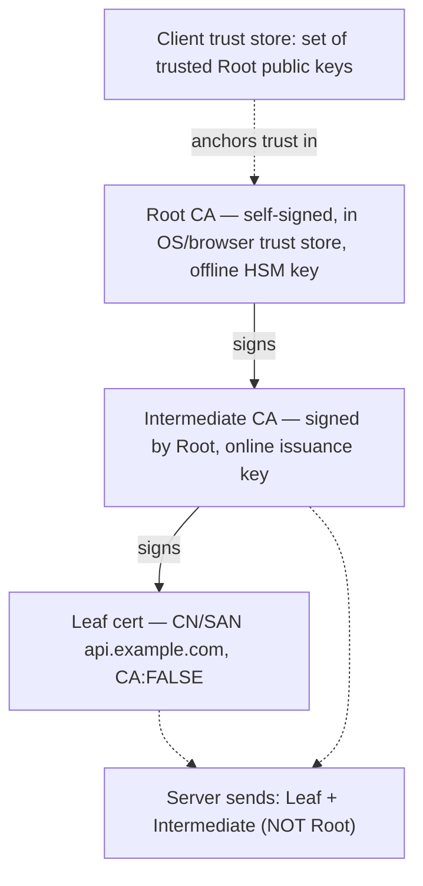

# Chapter 6 — TLS 1.3 and the Web PKI

**What this chapter covers.** Every previous chapter in this volume delivered bytes: Chapter 1
followed a packet down the stack, Chapters 2 and 3 gave us routable, reliable byte streams over
IP and TCP, and Chapter 4 rebuilt reliability in user space with QUIC. None of them said
anything about *who* you are talking to or whether anyone in the middle can read or alter the
conversation. That is this chapter. Transport Layer Security is the layer that turns an
authenticated-by-nobody, readable-by-everybody byte pipe into a channel that is confidential,
integrity-protected, and — this is the hard part — *authenticated* against a real-world
identity. The cryptographic primitives underneath (AEAD constructions, elliptic-curve
Diffie-Hellman, signature schemes, hash functions) were covered in Book 5, Chapter 1; this
chapter deliberately does not re-derive them. Instead it treats TLS as a *protocol* and the Web
PKI as a *system of trust*: how the TLS 1.3 handshake actually works on the wire, why version
1.3 is both simpler and safer than everything before it, how X.509 certificates and certificate
authorities let a client decide that a public key really belongs to `api.example.com`, and how
that whole apparatus is operated — automated, rotated, revoked, logged, and occasionally allowed
to expire and take production down. TLS is the most important security protocol a backend engineer
runs, and mutual TLS is the foundation of every zero-trust service mesh you will build, so we treat
it at mechanism depth throughout.

Learning goals — after this chapter you should be able to:

## What TLS provides, and where it sits

TLS delivers three properties over an insecure transport, and it is worth being pedantic about
each because engineers routinely assume one when they have another.

**Confidentiality** means a passive observer on the path — a compromised router, a mirrored switch
port, a tap on a submarine cable — cannot read the application data. In TLS 1.3 this is provided by
an authenticated-encryption cipher (AEAD) keyed by material only the two endpoints possess. Modern
TLS confidentiality also includes *forward secrecy*: an adversary who records the ciphertext today
and later steals the server's long-term private key still cannot decrypt the session, because its
keys were derived from ephemeral values discarded when the connection ended.

**Integrity** means an active attacker who can modify bytes in flight cannot alter the plaintext
without detection. Every AEAD record carries an authentication tag; a single flipped bit fails the tag
check and tears down the connection. Integrity is not a separate MAC bolted on afterward — in an AEAD
construction encryption and authentication are one operation, part of why TLS 1.3 could delete the
older, fragile MAC-then-encrypt constructions entirely.

**Authentication** is the property engineers most often get wrong. TLS authenticates the
*server's identity* by having the server prove possession of the private key corresponding to a
public key that a trusted certificate authority has vouched for, and by checking that the
certificate names the host you intended to reach. It does *not*, by default, authenticate the
client — that is mutual TLS, an opt-in. And it authenticates identity only as strongly as the
weakest link in the certificate-issuance chain: TLS's cryptography can be flawless and you can
still be talking to an attacker if a CA was tricked into issuing a certificate for your domain.
That is why the PKI half of this chapter matters as much as the handshake.

TLS sits directly on top of a reliable byte-stream transport, which in practice means TCP
(Chapter 3): the application (HTTP, gRPC, a database wire protocol) hands plaintext to the TLS
layer, which frames it into *records*, encrypts each record, and writes the ciphertext to the
socket. Because TLS assumes an in-order, reliable, lossless stream underneath, it cannot run
directly on UDP — which is exactly why QUIC (Chapter 4) does not layer TLS records over a datagram
but *embeds the TLS 1.3 handshake and key schedule directly into the QUIC transport*, using TLS to
produce keys and QUIC's own packet protection to encrypt. Read "QUIC uses TLS 1.3" (RFC 9001) as:
same handshake state machine, same key schedule, different record layer. Everything here about the
handshake and the PKI applies to HTTP/3 as much as to HTTPS-over-TCP; only the framing differs.

One historical note that clears up decades of confusion: the protocol was called SSL through
versions 2.0 and 3.0, then renamed and published as TLS 1.0 in 1999. SSL 2.0/3.0 are both broken and
long disabled; "SSL certificate" and "SSL termination" are just vernacular for TLS. TLS 1.0 and 1.1
were formally deprecated in 2021 (RFC 8996). The live versions are TLS 1.2 (RFC 5246, 2008) and TLS
1.3 (RFC 8446, 2018), and the gap between them is the subject of the next several sections.



## The TLS 1.3 handshake in depth

The handshake is the main event. It must accomplish four things before a single byte of application
data flows: agree on a version and cipher, perform an authenticated key exchange so both sides share
secret keys no eavesdropper can derive, authenticate the server (and optionally the client), and
confirm both parties computed the same keys over the same unmodified set of messages. TLS 1.3 does all
four in **one round trip** for a fresh connection — halving the setup latency of TLS 1.2's
two-round-trip handshake, which is why 1.3 adoption was driven as hard by latency-obsessed frontends as
by security teams.

### The 1-RTT full handshake

Here is the full handshake, message by message. The client speaks first.

The server picks a cipher suite and a named group from the client's `key_share` entries and generates
its *own* ephemeral key pair in that group. It now has everything it needs for the shared secret: its
ephemeral private key and the client's ephemeral public key. It replies with a **ServerHello** carrying
the selected suite, its own nonce, and its `key_share`. From the moment the ServerHello is sent, both
sides can compute the ECDHE shared secret and derive the *handshake traffic keys*, so **everything the
server sends after the ServerHello is already encrypted** — a defining property of TLS 1.3 and a sharp
break from 1.2, where the server's certificate flew in cleartext.

Under that handshake encryption, the server sends, in one flight:

- **EncryptedExtensions** — negotiated parameters that need not be in the clear (the ALPN result and
  so on).
- **Certificate** — the server's X.509 chain: the leaf for the hostname plus the intermediates needed
  to build a path to a trusted root. (The root is *not* sent; the client must already have it.)
- **CertificateVerify** — a signature, made with the private key for the leaf's public key, over a
  transcript hash of every handshake message so far. This is the step that authenticates the server:
  it proves the server holds the private key, and binds that proof to *this* handshake so a signature
  cannot be replayed.
- **Finished** — an HMAC over the entire transcript, keyed from the handshake keys. It proves the
  server computed the same keys over the same messages — a downgrade and tamper check covering the
  whole exchange, including the plaintext ClientHello.

The client verifies the certificate chain (the PKI algorithm of the next sections), the
CertificateVerify signature, and the server's Finished. If all pass it sends its own **Finished** —
preceded, in mutual TLS, by its own Certificate and CertificateVerify. That single client flight
completes the handshake, and the client can begin sending application data *immediately after* its
Finished, in the same flight, so useful data leaves after one round trip.



### Ephemeral ECDHE and forward secrecy

The reason the shared secret is safe against a future key compromise is that the Diffie-Hellman
keys are *ephemeral*: generated fresh for this handshake and destroyed when it ends. Both sides
compute the same shared secret from the standard Diffie-Hellman operation over their ephemeral key
pairs, but neither ephemeral private key ever touches the wire, and the certificate's long-term
private key is used *only to sign the transcript*, never to encrypt or transport key material.

This separation is the whole game. In TLS 1.2's RSA key-transport mode (now removed), the client
encrypted a pre-master secret to the server's long-term RSA public key; anyone who recorded that
handshake and later obtained the RSA private key — via a breach, a subpoena, a Heartbleed-class memory
disclosure — could decrypt the entire session retroactively. There was no forward secrecy. TLS 1.3
mandates ephemeral (EC)DHE for every handshake, so the long-term key can only ever *impersonate the
server going forward*, never *decrypt the past*. Named groups in practice are X25519 (fast,
side-channel-friendly) and the NIST curves secp256r1/secp384r1; finite-field DHE groups exist but are
rarely used.

### The key schedule and HKDF

TLS 1.3 derives every key it needs from a single **key schedule** built on HKDF, the
HMAC-based key-derivation function (RFC 5869), covered mechanically in Book 5, Chapter 1. You do
not need to implement it, but you should understand its shape because it explains several
security properties. HKDF has two operations: `HKDF-Extract`, which takes a salt and some input
keying material and produces a fixed-length pseudorandom secret, and `HKDF-Expand`, which takes a
secret and a context label and produces as many bytes of output key as you ask for.

The schedule chains three inputs through a sequence of Extract/Expand steps: a **PSK** (present only
for resumption; zero otherwise), the **ECDHE shared secret**, and a final `0` input. Along the way it
derives, via `HKDF-Expand-Label`, purpose-specific secrets — the client and server *handshake traffic
secrets* (used the moment the ServerHello lands, to encrypt the certificate flight), the *application
traffic secrets* (for data after Finished), an *exporter secret* (for channel binding), and a
*resumption master secret* (for future PSK resumption). Because every secret is bound by its label and
by the running transcript hash to the exact messages exchanged, and each traffic secret can be
ratcheted forward with `key_update`, compromise of one key does not trivially yield the others. The
takeaway: TLS 1.3 has *one* clean derivation tree with clear separation between handshake-protecting
and data-protecting keys, replacing TLS 1.2's ad-hoc PRF and blurrier key separation.

## What TLS 1.3 removed, and why it is safer

The most important design decision in TLS 1.3 was subtractive. A decade of attacks against TLS 1.2 —
BEAST, CRIME, Lucky 13, POODLE, FREAK, Logjam, ROBOT, Sweet32 — nearly all exploited a *legacy option
or a negotiable weakness*, not the strong modern configuration. TLS 1.2 was secure if you configured
it perfectly and catastrophic otherwise, and negotiation itself was an attack surface. TLS 1.3's
response was to delete the options.

| Removed in TLS 1.3 | The attack class it closed |
|---|---|
| RSA key transport (static key exchange) | No forward secrecy; retroactive decryption after key compromise; ROBOT (Bleichenbacher oracle) |
| CBC-mode ciphers with MAC-then-encrypt | Padding-oracle attacks: Lucky 13, POODLE (over the SSLv3 fallback) |
| RC4 stream cipher | Biased-keystream statistical recovery |
| Static/anonymous DH, export-grade ciphers | FREAK, Logjam (downgrade to breakable 512-bit key exchange) |
| TLS-level compression | CRIME, BREACH-style compression side channels |
| Renegotiation | Renegotiation-based request injection and DoS |
| Custom/weak DH groups | Logjam (precomputation against common weak groups) |
| MD5/SHA-1 signature hashes in the handshake | Collision-based forgery |

What remains is a small, opinionated set. Key exchange is **only** ephemeral (EC)DHE. Bulk
encryption is **only** AEAD. Signatures use modern schemes (ECDSA, RSA-PSS, EdDSA) over strong
hashes. Renegotiation is gone, replaced by the cleaner `key_update` and post-handshake
authentication messages. Compression is gone. The consequence is that a TLS 1.3 handshake has
dramatically fewer knobs to misconfigure and dramatically fewer downgrade paths to exploit. A
telling detail: TLS 1.3 deliberately injects specific *downgrade-detection sentinels* into the
server random so that a 1.3-capable client and server cannot be tricked by an active attacker into
silently negotiating 1.2. The design assumes the network is hostile and that negotiation itself
must be authenticated — which the final Finished-message transcript check enforces end to end.

### Cipher suites in TLS 1.3

TLS 1.2 cipher suite names were a mouthful because a single suite named *four* choices at once:
key exchange, authentication, bulk cipher, and MAC (for example
`TLS_ECDHE_RSA_WITH_AES_128_GCM_SHA256`). TLS 1.3 decouples these. Key exchange and the signature
algorithm are negotiated separately (via `supported_groups`, `key_share`, and
`signature_algorithms`), so a "cipher suite" in 1.3 names only the **AEAD algorithm and the hash
for the key-derivation function**. There are exactly five, and in practice you will see three:

```
TLS_AES_128_GCM_SHA256          # the mandatory-to-implement default
TLS_AES_256_GCM_SHA384          # larger AEAD key, larger KDF hash
TLS_CHACHA20_POLY1305_SHA256    # preferred where AES hardware is absent (mobile, some ARM)
TLS_AES_128_CCM_SHA256          # CCM mode; niche, common in constrained/IoT
TLS_AES_128_CCM_8_SHA256        # CCM with an 8-byte tag; IoT
```

Every one of these is an AEAD — AES-GCM, ChaCha20-Poly1305, or AES-CCM — with no separate MAC because
the AEAD authenticates as it encrypts. AES-GCM is fastest on any CPU with AES-NI (essentially all
server-class x86 and modern ARM); ChaCha20-Poly1305 runs in constant time in software without hardware
support, so it is preferred on devices lacking AES acceleration (where a software AES-GCM
implementation risks cache-timing side channels) and as an algorithmic-diversity hedge. A common
server policy offers AES-GCM first but honors a client's ChaCha preference.

## 0-RTT resumption and its replay caveat

TLS 1.3 can go faster than one round trip for a *returning* client. During a prior connection the
server can send the client one or more **NewSessionTicket** messages, each carrying an opaque
ticket that encodes (or references) a pre-shared key derived from that session's resumption master
secret. On a later connection the client includes the ticket in a `pre_shared_key` extension in
its ClientHello, and both sides can resume using the PSK — skipping the certificate exchange and
signature entirely, because the PSK already proves continuity of identity. This is 1-RTT
resumption, and it is strictly a latency and CPU win.

**0-RTT** goes one step further and is where you must be careful. Along with the resumption PSK,
the client may attach **early data** — actual application bytes — *in the very first flight,
before the server has responded at all*. The bytes are encrypted under a key derived solely from
the PSK. If the server accepts, the client has sent a request in zero round trips: the request
rides along with the ClientHello, eliminating a visible fraction of load time for a client on a
high-latency link.

The catch is fundamental and unfixable at the protocol level: **0-RTT early data is
replayable.** Because the early data is not part of an interactive exchange — the server has
contributed no fresh randomness yet when the client sends it — an attacker who captures the first
flight can *replay the entire flight* to the same or another server in the cluster, and the early
data will be accepted again. TLS 1.3 provides anti-replay mechanisms (single-use tickets,
per-server strike registers of seen tickets, freshness windows using the ticket age), but these
are best-effort and, crucially, hard to make reliable across a *fleet* of load-balanced servers
that do not share a synchronous replay cache. RFC 8446 is explicit about this: the protocol
cannot guarantee non-replay, so the *application* must only send 0-RTT data that is safe to
execute more than once.

The operational rule is simple and strict: **only idempotent requests may go in 0-RTT.** An HTTP `GET`
with no side effects is fine; a `POST` that charges a card, increments a counter, or sends an email is
not. Well-behaved stacks enforce this — NGINX passes early data upstream only for safe methods under
`ssl_early_data`, and deployments add an `Early-Data: 1` header so the origin can reject or re-drive a
non-idempotent request. If you cannot reason confidently about idempotency across your whole request
surface, leave 0-RTT off; the 1-RTT resumption path is already fast and carries none of this risk.

## Server TLS versus mutual TLS

In the handshake above, only the server presented a certificate — "one-way" or server-authenticated
TLS, the overwhelming common case. It fits the web: a browser needs to know it reached the real
`bank.example.com`, but the bank authenticates the *user* by a separate mechanism (a password, a
passkey) layered over the confidential channel, not by a client certificate.

**Mutual TLS (mTLS)** turns on client authentication at the TLS layer itself. The server includes a
**CertificateRequest** in its flight; the client responds with its own Certificate and a
CertificateVerify signature proving it holds the private key. Now *both* peers have cryptographically
authenticated identities before any application data flows, each having validated the other's
certificate against its own trust store. mTLS does not replace server TLS; it adds the symmetric half.



## Certificates and the Web PKI

The handshake proved the server holds a private key. The Web PKI is the answer to the far harder
question: *why should the client believe the public key in that certificate belongs to the
hostname it wanted?* The answer is a **chain of trust** rooted in a set of certificate authorities
the client has decided, out of band, to trust.

### X.509 certificates

A TLS certificate is an X.509 (v3) structure — DER-encoded ASN.1, usually shown to humans in
PEM (base64) form. The fields that matter operationally:

You will read these constantly with `openssl`:

```bash
# Fetch and decode the leaf certificate a server presents for a given SNI
openssl s_client -connect api.example.com:443 -servername api.example.com </dev/null 2>/dev/null \
  | openssl x509 -noout -text

# Just the fields you check most: subject, issuer, validity, SANs
openssl x509 -in leaf.pem -noout -subject -issuer -dates -ext subjectAltName
```

### The chain of trust

Trust is delegated, not asserted directly. A **root CA** has a self-signed certificate whose public
key is embedded in *trust stores* — the curated root lists shipped by operating systems (the
Microsoft, Apple, and Linux `ca-certificates` stores) and browsers (Mozilla's is the de facto
reference for Firefox and much of the Linux and language ecosystem; Chrome now ships its own Chrome
Root Store). Root private keys are kept offline in HSMs and used rarely, because a compromised root is
catastrophic and effectively unrevocable in the short term.

A root does not sign leaves directly. It signs one or more **intermediate CA** certificates whose keys
live in the CA's online issuance infrastructure and do the day-to-day signing, and the intermediate
signs your **leaf** (end-entity) certificate. So a real chain is leaf ← intermediate ← root: the leaf
and intermediates travel in the handshake's Certificate message, the root must already be in the
client's trust store. This two-tier structure exists precisely so a compromised intermediate can be
revoked and replaced without touching the root that anchors billions of clients.



### How a client validates a certificate

When the client receives the server's Certificate message, it runs a validation algorithm that is
worth committing to memory because misconfigurations map directly onto its steps:

Only if all six pass is the CertificateVerify signature checked against the now-trusted public key. The
intuition: the PKI establishes that *this public key is authorized for this hostname*, and
CertificateVerify establishes that *the peer holds the matching private key right now*. You need both.

## SNI and Encrypted Client Hello

Because one IP address routinely serves thousands of TLS virtual hosts (any CDN, any shared hosting,
any Kubernetes ingress), the server must know *which* certificate to present before it can send one —
but the certificate is chosen by hostname, which is application-layer information. **Server Name
Indication (SNI)** solves this by carrying the target hostname as a cleartext extension in the
ClientHello, so the server (or a TLS-terminating load balancer) selects the right certificate and
backend. SNI is why virtual hosting over HTTPS works at all.

The cost is a privacy leak: SNI is in the clear, so a passive observer learns exactly which hostname
you are visiting even though everything else is encrypted, and censors and corporate middleboxes
routinely filter on it. **Encrypted Client Hello (ECH)** closes this gap. A service publishes an ECH
public key in DNS (an `HTTPS`/`SVCB` record); the client encrypts the sensitive parts of its
ClientHello — including the real SNI — to that key and sends an *outer* ClientHello bearing only a
public, non-identifying "cover" name shared by all tenants of the fronting provider, which decrypts the
inner hello and routes to the true backend. The observer sees only the cover name. ECH is deployed by
Cloudflare and supported by recent Firefox and Chrome, but it depends on encrypted DNS (DoH/DoT,
Chapter 5) to fetch the key without leaking the name there instead, and remains an evolving standard
(`draft-ietf-tls-esni`) rather than a finished RFC — promising and partially deployed, not universal.

## Revocation: the genuinely hard problem

Certificates have expiry dates, but sometimes a certificate must be killed *before* it expires — a
private key was leaked, a server was decommissioned, a CA discovers it mis-issued. Revocation is
the mechanism for that, and it is, honestly, the part of the Web PKI that works least well. The
core difficulty was covered from the trust-model side in Book 5, Chapter 1; here is the protocol
reality.

**Certificate Revocation Lists (CRLs)** are the original design: each CA publishes a signed list
of the serial numbers it has revoked, and clients download and consult it. CRLs do not scale —
lists for large CAs grow to megabytes, they are cached and thus stale, and downloading them on the
hot path is intolerable, so in practice browsers largely stopped hard-checking them.

**OCSP (Online Certificate Status Protocol)** replaced the bulk list with a point query: the client
asks the CA's responder "is serial N still valid?" and gets a signed, short-lived answer. This fixes
the size problem and creates three others. **Latency**: an extra round trip to a third party on every
new connection. **Privacy**: the responder — the CA — learns every site every user visits. And
decisively, **soft-fail**: because responders have outages, browsers treat a *failure to reach the
responder* as "assume valid," so an attacker who can *block* the OCSP query defeats revocation
entirely. A revocation check an attacker can suppress is not a revocation check.

**OCSP stapling** fixes the latency and privacy problems, though not soft-fail. Here the *server*
periodically fetches a signed OCSP response for its own certificate and *staples* it into the TLS
handshake (a `status_request` extension), so the client gets fresh revocation status with no extra
round trip and no privacy leak to the CA. Stapling is a genuine improvement and widely deployed
(`ssl_stapling on;` in NGINX), but the client still soft-fails if the staple is absent. The
**Must-Staple** extension was meant to close that by telling clients to *hard*-fail without a staple,
but it saw little adoption and browser support has waned.

## Certificate Transparency

Revocation answers "this specific certificate is now bad." **Certificate Transparency (CT)** answers
a systemic question: "did a CA — any CA — issue a certificate for my domain that I never asked for?"
Before CT, a mis-issued or maliciously-issued certificate (a compromised or coerced CA signing
`google.com` for an attacker) was essentially undetectable until someone stumbled on it in the wild.
The 2011 DigiNotar breach — a compromised Dutch CA issuing fraudulent certificates used to intercept
Gmail traffic in Iran — was the galvanizing incident.

CT, covered from the supply-chain-transparency angle in Book 5, Chapter 5, requires every issued
certificate to be recorded in **public, append-only, cryptographically verifiable logs** built on
Merkle trees. A CA submits the certificate to several independent logs; each returns a **Signed
Certificate Timestamp (SCT)** promising to include it. Clients — Chrome and Apple most strictly —
*require* a certificate to carry enough SCTs from qualifying logs or they reject it. The SCTs ride in
the certificate itself (via a precertificate flow), in a TLS extension, or in a stapled OCSP response.

The property CT provides is not prevention but **detection**: because every usable certificate must
be publicly logged, a domain owner (or an automated monitor, or services like crt.sh) can *see* every
certificate ever issued for their names and alarm on any they did not authorize. It converts CA
mis-issuance from an invisible catastrophe into a loud, auditable event, and has directly caused the
distrust and removal of several CAs caught mis-issuing. The practical action for a backend engineer is
to monitor CT logs for your own domains — a free, high-signal control that costs a webhook and catches
both attacks and your own teams' shadow certificates.

## ACME and Let's Encrypt

ACME issuance works as an automated proof-of-control protocol between your **ACME client** (Certbot,
`acme.sh`, Caddy's built-in client, cert-manager, Traefik) and the CA:

1. **Account.** The client generates an account key pair and registers with the CA.
2. **Order.** It requests a certificate for a set of identifiers (`api.example.com`, `*.example.com`).
3. **Challenge.** For each identifier the CA issues a challenge proving control of that name. The two
   common types:
   - **HTTP-01**: the client serves a token at
     `http://api.example.com/.well-known/acme-challenge/<token>` and the CA fetches it from multiple
     network vantage points. Proves control of the web server; cannot issue wildcards.
   - **DNS-01**: the client publishes a TXT record `_acme-challenge.api.example.com` derived from the
     token and account key. Proves control of DNS, which is what lets DNS-01 issue **wildcards**;
     requires programmatic access to your DNS provider's API.
4. **Validation.** The CA checks the challenge from multiple perspectives (added to harden against
   BGP-hijack-based domain-control fraud).
5. **Finalize.** The client submits a CSR with the certificate's public key; the CA issues, and the
   client downloads the leaf-plus-intermediate chain.
6. **Renew.** Long before expiry the client repeats the flow automatically. With Let's Encrypt's 90-day
   certificates, renewal is a cron job, not a calendar reminder — which is the whole point.

```mermaid
sequenceDiagram
  participant Cl as "ACME client (cert-manager / Certbot)"
  participant CA as "ACME CA (Let's Encrypt)"
  participant DNS as "DNS / web server for api.example.com"
  Cl->>CA: newOrder for api.example.com, *.example.com
  CA->>Cl: challenges (HTTP-01 and/or DNS-01) + tokens
  Cl->>DNS: publish TXT _acme-challenge  (DNS-01) or token file (HTTP-01)
  Cl->>CA: challenge ready, please validate
  CA->>DNS: fetch token from multiple vantage points
  CA->>Cl: challenges valid
  Cl->>CA: finalize with CSR (public key)
  CA->>Cl: issued certificate: leaf + intermediate chain
  Note over Cl: install cert; schedule auto-renew well before 90-day expiry
```

### cert-manager in Kubernetes

In Kubernetes the canonical ACME automation is **cert-manager**, which turns certificate lifecycle
into declarative custom resources reconciled by a controller. You declare an `Issuer`/`ClusterIssuer`
pointing at an ACME endpoint and a solver, and a `Certificate` naming the DNS names and target
`Secret`; the controller runs the ACME dance, stores the key and certificate in the Secret, and
*renews automatically* before expiry — the same self-healing reconciliation model as the rest of
Kubernetes.

```yaml
apiVersion: cert-manager.io/v1
kind: ClusterIssuer
metadata:
  name: letsencrypt-prod
spec:
  acme:
    server: https://acme-v02.api.letsencrypt.org/directory
    email: platform-oncall@example.com
    privateKeySecretRef:
      name: letsencrypt-prod-account-key
    solvers:
      - dns01:                     # DNS-01 so we can issue a wildcard
          route53:
            region: us-east-1      # IAM via IRSA; no static credentials
---
apiVersion: cert-manager.io/v1
kind: Certificate
metadata:
  name: api-example-com
  namespace: edge
spec:
  secretName: api-example-com-tls   # k8s Secret the Ingress/Gateway mounts
  duration: 2160h                   # 90d
  renewBefore: 720h                 # start renewing 30d before expiry
  issuerRef:
    name: letsencrypt-prod
    kind: ClusterIssuer
  dnsNames:
    - api.example.com
    - "*.example.com"
```

The `renewBefore` window is not decoration — it is the buffer that turns a failed renewal into a
paged alert with days of runway instead of an instant outage. We will insist on that margin in the
operations section.

## Operational TLS at fleet scale

The cryptography is the easy part. The failures that take down real backends are operational, and
they cluster into a few well-known shapes.

### The expired-certificate outage

The single most common self-inflicted TLS outage is a certificate that expired because nobody renewed
it. It has taken down major payment networks, telecom providers, cloud consoles, and countless
internal services; the pattern is always the same — a certificate provisioned manually years ago, an
owner who changed teams, a monitoring gap, and a `notAfter` date that arrived on a weekend. The
failure is total and instantaneous: at the stroke of expiry, every client's validity check fails and
every connection is refused.

The defenses are unglamorous and non-negotiable:

- **Automate issuance and renewal** so no human is on the critical path — ACME/cert-manager, or an
  internal CA with the same automation. A certificate you renew by hand is a future outage with a
  scheduled date.
- **Monitor expiry independently of the renewal system** — an external probe that reads `notAfter` and
  alerts at, say, 21 and 7 days out. Monitor the *actually-served* certificate on every endpoint, not
  the one you believe you deployed; the gap between those two is where outages live.
- **Renew with a wide margin** (the `renewBefore` above), so a broken renewal is an alert with days of
  slack, not an outage.
- **Watch intermediates and roots, not just your leaf.** The 2021 global outage triggered by the expiry
  of Let's Encrypt's cross-signed `DST Root CA X3` broke a long tail of older clients — a reminder that
  the *whole chain* has expiry dates, some outside your control.

```bash
# A dead-simple external expiry probe you can wire into monitoring
host=api.example.com
end=$(openssl s_client -connect "$host:443" -servername "$host" </dev/null 2>/dev/null \
      | openssl x509 -noout -enddate | cut -d= -f2)
echo "$host expires: $end  ($(( ($(date -d "$end" +%s) - $(date +%s)) / 86400 )) days)"
```

### Wildcard versus SAN certificates

Two ways to cover many names, with a real trade-off. A **wildcard** (`*.example.com`) covers every
single-label subdomain with one certificate and key — convenient, but it concentrates risk: one leaked
key compromises every subdomain, wildcards require DNS-01 (not HTTP-01), and they cannot span two
levels (`*.example.com` does not cover `a.b.example.com`). A **multi-SAN** certificate lists each name
explicitly — more precise and easier to scope and revoke per-name, but the list is public in CT logs
and every name change means reissuing. At fleet scale the common pattern is per-service SAN
certificates issued automatically (so any one key's blast radius is one service), with wildcards
reserved for genuinely dynamic subdomain spaces. Automation erases the "reissue on every change" cost
of SANs, tilting the modern trade-off toward narrowly-scoped, per-service certificates.

### Termination architecture: edge, mesh, or end-to-end

*Where* TLS terminates is one of the more consequential design decisions in a backend system, and
there is no single right answer — only trade-offs to make deliberately.

### Performance: handshakes, resumption, offload

A TLS 1.3 full handshake costs one network round trip plus asymmetric-crypto work (an ECDHE key
agreement on both sides, a signature by the server, a signature verification and chain validation
by the client). The round trip dominates latency; the asymmetric operations dominate server CPU
under connection churn. Three levers matter at scale:

- **Session resumption (1-RTT PSK)** skips the certificate and signature entirely on reconnect — the
  biggest single win for services with many short connections, moving the server's cost from expensive
  signatures to cheap symmetric key derivation. In a fleet, tickets must be decryptable across servers,
  so the ticket-encryption key (STEK) is *shared and rotated*: rotate too slowly and a stolen key
  threatens the forward secrecy of resumed sessions; rotate too aggressively and you invalidate
  outstanding tickets — a real tuning knob.
- **Connection reuse and keep-alive** avoid the handshake altogether. HTTP/2 and HTTP/3 multiplex many
  requests over one long-lived connection, so the handshake amortizes over thousands of requests. The
  highest-leverage TLS performance fix is often "stop opening new connections."
- **Hardware and kernel offload.** AES-NI makes AES-GCM nearly free on the bulk path; kTLS lets the
  kernel do record encryption and enables `sendfile` zero-copy for encrypted static content; at very
  high scale, dedicated TLS hardware or SmartNIC offload moves handshakes off the application CPU.

## The distributed-systems lens

Everything above compounds when you multiply it by thousands of services and millions of
connections. Five threads matter for a senior backend engineer.

**mTLS is the foundation of zero-trust service-to-service security.** In a monolith, "who is calling
this function?" is answered by the call stack; in a distributed system it must be answered on the
wire, and mTLS is the only widely-deployed mechanism that answers it *cryptographically* on *every*
call, independent of network topology. An authorization policy ("`payments` may call `ledger`,
`fraud` may not") is only meaningful if the identities it names are cryptographically authenticated,
and mTLS is what replaces the network-position answer ("it came from inside the VPC") — the very
assumption a breach's lateral movement exploits — with a key the attacker does not hold. This is the
substrate under the service mesh (Chapter 10; Volume 6) and the workload-identity systems of Volume 9.

**Certificate-lifecycle automation is what prevents expiry outages across thousands of services.**
A single manually-managed certificate is a manageable risk; ten thousand across hundreds of teams is
a statistical certainty of outages. The only scalable answer is to make issuance a protocol and
renewal a reconciliation loop — ACME/cert-manager at the edge, SPIFFE/SPIRE for workload identity
(Book 5, Chapter 4), a mesh CA (Istio's istiod, Linkerd's identity) inside — so that *nobody's
calendar* is on the critical path. The move to sub-50-day CA/Browser-Forum lifetimes is only
survivable because of this automation.

**Short-lived certificates plus Certificate Transparency strengthen the whole trust model.** The
supply-chain volume (Book 5, Chapters 1 and 5) argues that short-lived, auto-rotated credentials and
public transparency logs beat long-lived secrets and private issuance. TLS is the largest production
instance of that thesis: a 90-day (soon shorter) publicly-logged, auto-renewed certificate makes
revocation nearly irrelevant and CA mis-issuance detectable. Treat CT-log monitoring of your own
domains as a standard detection control, and prefer the shortest lifetime your automation comfortably
supports.

**Termination architecture is a first-class design decision.** Where TLS terminates determines your
plaintext blast radius, your L7 inspection and routing options, your certificate-management surface,
and your handshake-CPU distribution. Edge termination is simplest, mesh-wide mTLS is the zero-trust
ideal, and end-to-end re-encryption is the compliance-driven middle. Decide it explicitly per tier,
and never let "plaintext behind the load balancer" persist by accident in a system that claims zero
trust.

**Handshake economics shape tail latency at fleet scale.** TLS 1.3's 1-RTT handshake, PSK resumption,
and connection reuse are not micro-optimizations when you serve billions of requests across
high-latency mobile and edge clients — they move p99 measurably. 0-RTT can shave the last round trip
for returning clients, but its replay caveat is a distributed-systems problem in miniature: non-replay
is hard to guarantee precisely *because* your fleet is many machines that do not share a synchronous
replay cache. Enabling 0-RTT is a fleet-wide bet about request idempotency; make it deliberately or
not at all.

## Key takeaways

- **TLS provides confidentiality, integrity, and server authentication** over a reliable transport;
  it authenticates the *client* only in mTLS, and identity only as strongly as the weakest CA in the
  chain. It runs over TCP and is embedded (same handshake, different record layer) in QUIC/HTTP-3.
- **The TLS 1.3 handshake is 1-RTT**: the ClientHello speculatively carries ephemeral `key_share`
  values, so both sides derive keys after the ServerHello and *the certificate flight is already
  encrypted*. ECDHE gives forward secrecy; CertificateVerify authenticates the server; Finished
  authenticates the whole transcript.
- **TLS 1.3 is safer mainly by subtraction**: no RSA key transport, CBC/RC4, renegotiation,
  compression, or weak DH — deleting the options deleted BEAST, POODLE, Lucky 13, FREAK, Logjam,
  CRIME, and ROBOT. Bulk encryption is AEAD-only (AES-GCM, ChaCha20-Poly1305).
- **0-RTT early data is replayable and unfixable at the protocol level**; send only idempotent
  requests in it, or leave it off. 1-RTT PSK resumption keeps the latency win without the replay risk.
- **mTLS is the cryptographic basis of zero-trust service-to-service auth** — an authz policy's
  identity is only meaningful if mTLS authenticated it. It is the substrate of the service mesh and of
  SPIFFE/SPIRE workload identity (Book 5, Chapter 4; Volume 9).
- **The Web PKI is a delegated chain of trust**: root (offline, in trust stores) signs intermediate
  (online) signs leaf. Clients validate path, signatures, validity window, constraints, hostname/SAN,
  and revocation before trusting a key.
- **Revocation is the PKI's weakest link**: CRLs don't scale, OCSP soft-fails and leaks privacy,
  stapling helps but doesn't fix soft-fail. The real fix is short-lived automated certificates, and
  Certificate Transparency makes CA mis-issuance *detectable* even when it can't be prevented.
- **ACME automates issuance** (HTTP-01 for control-of-server, DNS-01 for control-of-DNS and
  wildcards); Let's Encrypt made it free and 90-day; cert-manager makes it a Kubernetes reconciliation
  loop. Automation is what makes short lifetimes and expiry-free operation possible.
- **Operational TLS is where systems actually fail**: automate renewal with a wide margin, monitor the
  *served* certificate's expiry independently (including intermediates), choose termination architecture
  deliberately, and use resumption plus connection reuse to control handshake cost at scale.

## Further reading

- RFC 8446, *The Transport Layer Security (TLS) Protocol Version 1.3* (August 2018) — the
  authoritative specification: the handshake state machine, the key schedule, 0-RTT, and Appendix E's
  security analysis. The single most important document behind this chapter.
- RFC 5246, *TLS 1.2* (2008), and RFC 8996, *Deprecating TLS 1.0 and TLS 1.1* (2021) — the version
  TLS 1.3 replaced and the formal retirement of its predecessors; useful to see what changed.
- RFC 5869, *HMAC-based Extract-and-Expand Key Derivation Function (HKDF)*, and the IANA TLS
  parameter registries — the KDF underneath the TLS 1.3 key schedule (mechanics in Book 5, Chapter 1)
  and the live list of cipher suites, groups, and extensions.
- RFC 5280, *Internet X.509 PKI Certificate and CRL Profile* — the definitive X.509 profile:
  certificate fields, path validation, name constraints, CRLs.
- RFC 6960, *OCSP*, and RFC 6066 (`status_request`, i.e. OCSP stapling) — the online revocation
  protocol and the stapling extension.
- RFC 6962, *Certificate Transparency* — the Merkle-tree log design, precertificates, and SCTs. See
  Book 5, Chapter 5 for the supply-chain-transparency framing.
- RFC 8555, *Automatic Certificate Management Environment (ACME)* — the issuance-automation protocol
  behind Let's Encrypt, Certbot, Caddy, and cert-manager.
- RFC 9001, *Using TLS to Secure QUIC* — how the TLS 1.3 handshake and key schedule are embedded in
  QUIC; read alongside Chapter 4 of this volume.
- `draft-ietf-tls-esni`, *TLS Encrypted Client Hello* — the evolving ECH specification; pair with
  the DNS `HTTPS`/`SVCB` records (RFC 9460) that carry ECH keys.
- The CA/Browser Forum *Baseline Requirements* and the 2025 ballot reducing maximum certificate
  validity toward roughly 47 days by 2029 — the policy driving short-lived, automated certificates.
- Ivan Ristić, *Bulletproof TLS and PKI* (2nd ed.) — the standard practitioner reference for
  configuration, attacks, and operations; and the associated SSL Labs *SSL/TLS Deployment Best
  Practices* and server test.
- The SPIFFE and SPIRE specifications (spiffe.io) and the Istio and Linkerd security documentation —
  workload identity and mesh mTLS in practice; see Book 5, Chapter 4, Chapter 10 of this volume, and
  Volume 6.
- cert-manager documentation (cert-manager.io) — the reference for ACME automation in Kubernetes,
  including DNS-01 solvers and renewal tuning.
