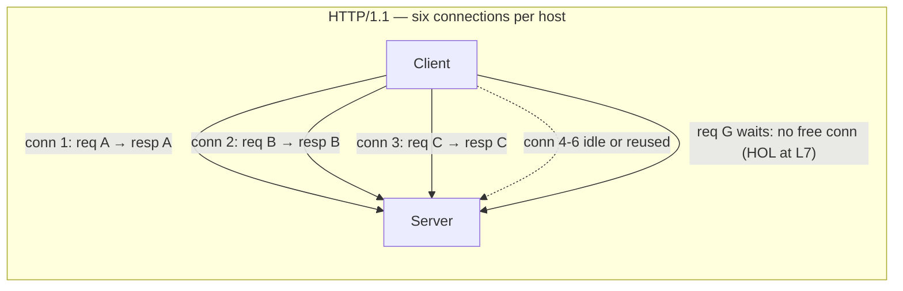
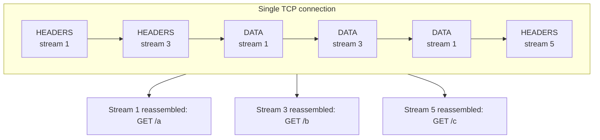
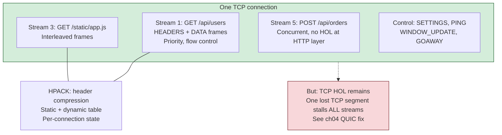
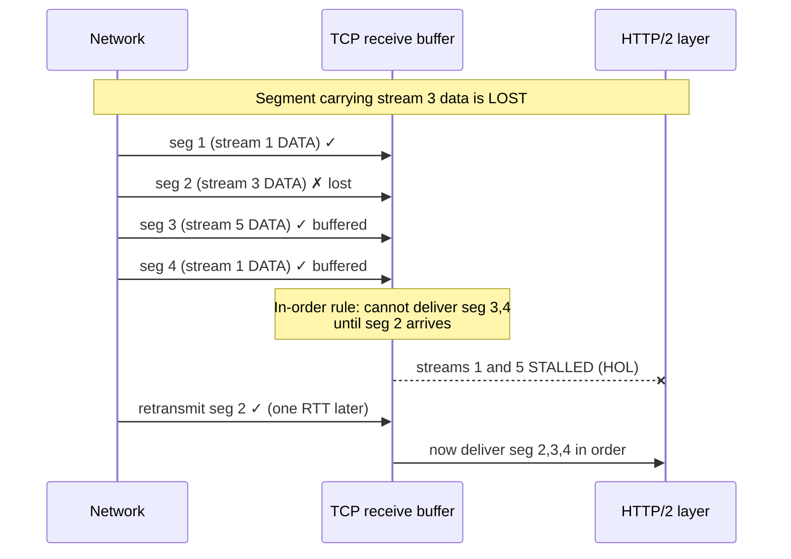
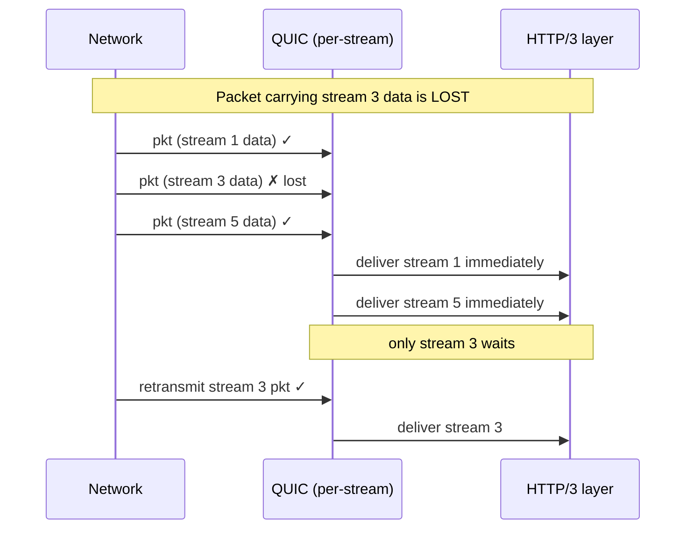
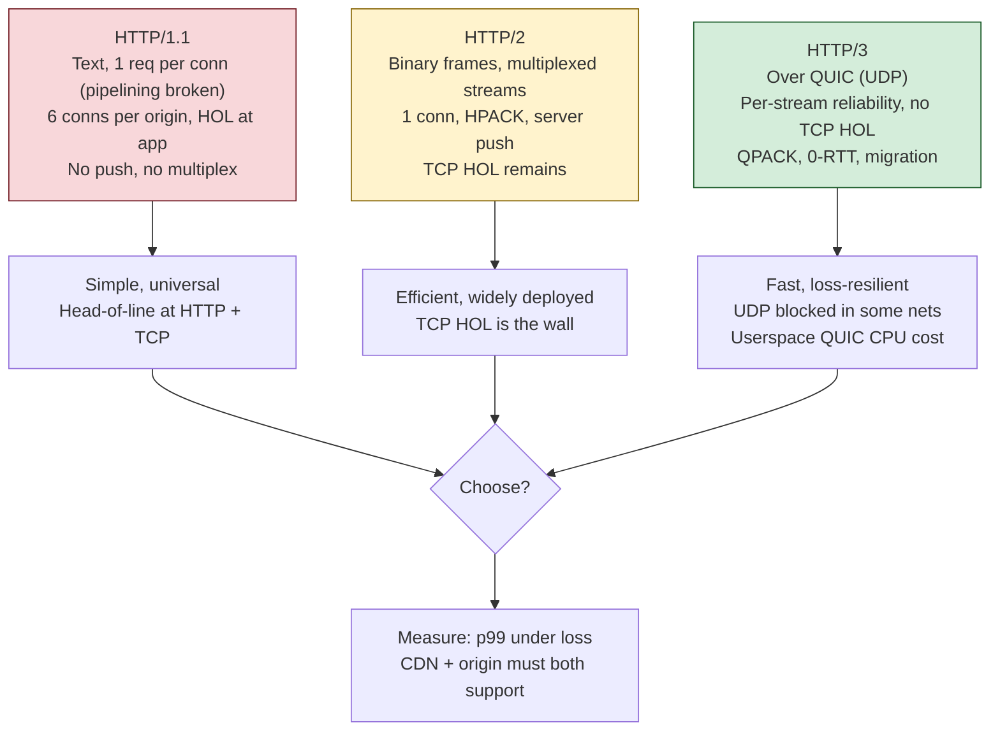
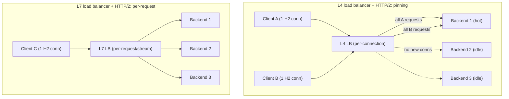

# Chapter 7 — HTTP/1.1, HTTP/2, and HTTP/3

**What this chapter covers.** HTTP is the application protocol your fleet speaks more than
any other. Your REST APIs, your gRPC services (Chapter 8), your health checks, your service
mesh sidecars, your CDN edge (Chapter 10), your webhooks, your object storage clients — nearly
all of it is HTTP, and most of it is HTTP you did not write by hand but whose behavior you are
nonetheless responsible for when latency spikes or a load balancer distributes traffic
unevenly. This chapter treats HTTP the way a backend engineer must: not as a request-and-a-JSON-body
but as three distinct wire protocols — HTTP/1.1, HTTP/2, and HTTP/3 — sharing one *semantic*
model, each solving a head-of-line-blocking problem the previous one left open, and each with
concrete operational consequences for connection management, load balancing, and tail latency.
We will insist on mechanism throughout. Not "HTTP/2 is faster," but *which* frame, on *which*
stream, compressed by *which* header table, and *why* one lost TCP segment still stalls all of
it until HTTP/3 moves the stream state into QUIC (Chapter 4).

Learning goals — after this chapter you should be able to:

- Separate HTTP *semantics* (methods, status codes, header fields, caching, content
  negotiation — RFC 9110) from the *wire format* of a specific version (RFC 9112, 9113, 9114),
  and explain why the same API works unchanged across all three versions.
- Explain HTTP/1.1 persistent connections, chunked transfer-encoding, and why pipelining
  failed — the L7 head-of-line blocking that forced browsers into six connections per host.
- Describe HTTP/2's binary framing layer, stream multiplexing, HPACK header compression, flow
  control, and prioritization in mechanism, and state precisely why HTTP/2 still suffers
  *TCP-level* head-of-line blocking that no amount of L7 multiplexing can remove.
- Explain how HTTP/3 over QUIC gives each stream independent reliability, replaces HPACK with
  QPACK, and cuts connection-setup latency, and what it costs.
- Reason about connection pooling and keep-alive for HTTP/1.1 versus HTTP/2, and diagnose the
  HTTP/2-single-connection backend-pinning problem that makes L4 load balancing distribute
  traffic unevenly and forces L7 load balancing (Chapter 9).
- Apply the semantics that matter operationally: idempotency and safe retries (Chapter 11),
  caching headers, compression, range requests, the `Host` header and virtual hosting.

## Semantics versus wire format: the split that RFC 9110 made explicit

The most important conceptual move you can make about HTTP is to stop thinking of it as one
protocol. Since June 2022, the IETF has published HTTP as a deliberately layered set of
documents, and the layering is the point. **RFC 9110, "HTTP Semantics,"** defines the things
that are true of HTTP regardless of version: the request/response exchange, methods, status
codes, the meaning of header fields, content negotiation, caching, conditional requests, range
requests, authentication. **RFC 9111** defines caching. Then three separate documents define
three *wire formats* that all carry those same semantics: **RFC 9112 (HTTP/1.1)** describes the
text-based message syntax; **RFC 9113 (HTTP/2)** describes the binary framing; **RFC 9114
(HTTP/3)** describes the mapping onto QUIC. RFC 7540 (the original HTTP/2) and RFC 7230–7235
(the older HTTP/1.1 set) are obsoleted by this reorganization.

This is not bureaucratic tidiness; it is why your architecture survives version churn. When
your service exposes `GET /v2/orders/1234` returning `200 OK` with a JSON body and an `ETag`,
those semantics — the method's safety and idempotency, the status code's meaning, the
validator for conditional requests — are identical whether a client reaches you over HTTP/1.1,
HTTP/2, or HTTP/3. A load balancer can terminate HTTP/3 from a mobile client at the edge and
re-originate HTTP/1.1 to your backend, and the *message* is preserved even though the *bytes on
the wire* are completely different — one is UTF-8 text with CRLF line endings, another is
HPACK-compressed HEADERS frames, the third is QPACK inside QUIC STREAM frames. The semantic
message is the contract; the wire format is an implementation detail of a hop. Internalize this
and most "should we migrate to HTTP/2?" questions become answerable: you are changing transport
efficiency, not application behavior.

A **message** in RFC 9110 terms is a set of header fields plus an optional body, in a request
addressed to a *target resource* by method, or a response bearing a *status code*. The methods
carry two properties that dominate distributed-systems correctness. A method is **safe** if it
is read-only in intent (`GET`, `HEAD`, `OPTIONS`, `TRACE`); a client, cache, or prefetcher may
issue it speculatively. A method is **idempotent** if issuing it N times has the same effect on
server state as issuing it once (`GET`, `HEAD`, `OPTIONS`, `TRACE`, `PUT`, `DELETE` — but *not*
`POST`, and not, in general, `PATCH`). This is a semantic property, invariant across versions,
and it is precisely the property a retry layer depends on. We return to it under retries below;
hold the thought that idempotency lives in RFC 9110, not in any wire format.

Status codes are grouped by class — 1xx informational, 2xx success, 3xx redirection, 4xx client
error, 5xx server error — and the class boundary is load-bearing for automated behavior. A
generic client treats an unknown `287` like `200` and an unknown `499` like `400`, because the
first digit is the contract. The distinction between `4xx` (do not retry unchanged; you did
something wrong) and `5xx` / `502` / `503` / `504` (the server or an intermediary failed; a
retry may succeed) is the backbone of every resilience library.

Header fields carry the metadata that makes HTTP more than a byte pipe: `Content-Type` and
`Accept` for content negotiation, `Content-Encoding` and `Accept-Encoding` for compression,
`Cache-Control` and `ETag` for caching, `Range` for partial transfers, `Host` for virtual
hosting, `Authorization` for credentials. All of this is version-independent semantics. What
changes across HTTP/1.1, HTTP/2, and HTTP/3 is only *how those fields and bodies are encoded
and framed on the connection* — and that encoding is where every performance problem of the
last twenty years lives.

## HTTP/1.0 to HTTP/1.1: persistence, chunking, and the pipelining dead end

HTTP/1.0 established the text format we still recognize: a request line, header lines, a blank
line, an optional body — all ASCII, CRLF-delimited, human-readable. Its fatal operational flaw
was the connection model. By default each request/response used a fresh TCP connection, opened
and then closed. On a network with meaningful round-trip time, this is ruinous: every request
pays a full TCP three-way handshake (Chapter 3) before a single byte of HTTP flows, and if TLS
is involved, the TLS handshake on top of that. For a page pulling dozens of resources, the
connection setup cost dominated everything else.

**HTTP/1.1 (1997, now RFC 9112)** made **persistent connections** the default. The TCP
connection stays open after a response completes and is reused for the next request. The
`Connection: close` header opts out; `Connection: keep-alive` was the HTTP/1.0 opt-*in* to the
same behavior. This one change amortizes the handshake across many requests and lets TCP's
congestion window (Chapter 3) grow warm instead of restarting from the initial window on every
request. It is the single most important performance property of HTTP/1.1 and the reason
connection *pooling*, discussed later, exists at all.

Persistence created a framing problem. If the connection stays open, the receiver must know
where one response ends and the next begins. With a known body size, `Content-Length` suffices.
But servers often generate responses incrementally — streaming a large report, proxying an
upstream — and cannot know the length up front. HTTP/1.1's answer is **chunked transfer
encoding**: `Transfer-Encoding: chunked` tells the receiver the body arrives as a series of
size-prefixed chunks, each a hex length line followed by that many bytes, terminated by a
zero-length chunk. This is what lets a server flush data as it produces it and still delimit the
message on a reused connection.

```
HTTP/1.1 200 OK
Content-Type: application/json
Transfer-Encoding: chunked

1c
{"status":"processing","id":
13
"a1b2c3d4e5f6a7b8"}
0

```

The ambiguity between `Content-Length` and `Transfer-Encoding`, and the disagreements between
proxies about which one wins, is the mechanism behind **HTTP request smuggling** — a class of
attack where a front-end and back-end parse the same byte stream into different request
boundaries. RFC 9112 tightens the rules (a message with both headers must have `Content-Length`
removed, and chunked must be the final encoding), but the vulnerability class persists in
misconfigured proxy chains and is worth knowing exists.

Now the crucial failure. HTTP/1.1's persistent connection still handles **one request/response
at a time, in order**. You send request A, and you cannot use that connection for request B
until A's full response has come back. **HTTP pipelining** was the spec's attempt to fix this:
a client may send A, B, C back-to-back without waiting, and the server must return their
responses *in the same order*. In principle this fills the pipe. In practice it failed
completely and is disabled in every mainstream browser. The reason is **head-of-line (HOL)
blocking at layer 7**: because responses must come back in request order, a single slow response
at the head of the line stalls every response queued behind it, even if those were ready first.
Send a cheap `GET /style.css` behind an expensive `GET /report.pdf` and the CSS waits for the
PDF. Buggy proxies that mis-ordered or dropped pipelined responses made it worse, and there was
no safe way for a client to know whether an intermediary supported pipelining correctly. So the
industry abandoned pipelining and reached for the only other lever available.

That lever was **parallel connections**. If one connection does one request at a time, open
several. Browsers converged on a limit of roughly **six TCP connections per host** (the exact
number varied by browser but six became the de facto standard). Six connections means up to six
requests genuinely in flight at once, at the cost of six TCP handshakes, six congestion windows
that each start cold and compete with each other, six times the memory on the server, and — for
pages with more than six resources — the same serialization problem shifted to whichever
requests exceed the connection count. Sharding assets across multiple hostnames ("domain
sharding") to multiply the six-per-host budget became a standard, ugly optimization. HTTP/1.1's
concurrency story is fundamentally *you cannot multiplex on one connection, so you pay for
several and hope six is enough.* Every subsequent HTTP version is, at its core, an attempt to
get real multiplexing over a single connection.



## HTTP/2: real multiplexing over one connection

**HTTP/2 (2015, RFC 7540, now RFC 9113)** grew out of Google's SPDY experiment and keeps
HTTP/1.1's semantics exactly while replacing the wire format wholesale. Where HTTP/1.1 is text,
HTTP/2 is **binary**, and where HTTP/1.1 does one request at a time per connection, HTTP/2
multiplexes many concurrent requests over a **single TCP connection**. Almost everything about
HTTP/2 follows from four mechanisms: the binary framing layer, streams, HPACK, and flow
control.

### The binary framing layer and streams

HTTP/2 slices the connection into **frames**. Every frame has a fixed 9-byte header — a 24-bit
length, an 8-bit type, an 8-bit flags field, and a reserved bit followed by a 31-bit **stream
identifier** (32 bits together) — followed by a type-specific payload. The frame types you care about are `HEADERS` (carries the
HPACK-compressed request or response header block), `DATA` (carries body bytes), `SETTINGS`
(negotiates connection parameters), `WINDOW_UPDATE` (flow control), `RST_STREAM` (abort one
stream), `PRIORITY`, `PING`, `GOAWAY`, and `PUSH_PROMISE`.

A **stream** is an independent, bidirectional sequence of frames that all share one stream ID.
Each request/response exchange gets its own stream. Client-initiated streams use odd IDs
(1, 3, 5, …), server-initiated streams use even IDs, and IDs only increase. Because every frame
is tagged with its stream ID, the sender can **interleave** frames from many streams on the wire
in any order, and the receiver reassembles each stream from the tagged frames. A `HEADERS` frame
on stream 3 followed by a `DATA` frame on stream 5 followed by more `DATA` on stream 3 is
perfectly legal. This is the multiplexing: dozens of requests share one connection, their frames
interleaved, none blocking another *at the HTTP layer*. HTTP/1.1's L7 head-of-line blocking is
gone — a slow response no longer stalls the ready ones, because their `DATA` frames simply
interleave on the wire.



Concurrency is bounded by `SETTINGS_MAX_CONCURRENT_STREAMS`, which each peer advertises;
100 is a common default. This is what lets one HTTP/2 connection replace the browser's six
HTTP/1.1 connections — and, in the backend world, lets a service mesh hold *one* long-lived
connection between two services and run hundreds of concurrent RPCs over it. That property is
the foundation of gRPC's efficiency (Chapter 8): gRPC is defined *on top of* HTTP/2 precisely so
that many concurrent streaming RPCs share a single connection with no per-call handshake.

### HPACK: header compression that had to be stateful and careful

HTTP headers are repetitive and verbose. Every request to your API likely repeats the same
`user-agent`, `accept`, `authorization`, `cookie`, and host information, often hundreds of bytes,
on every one of hundreds of multiplexed requests. HTTP/1.1 sent all of it, uncompressed, every
time. HTTP/2 introduces **HPACK (RFC 7541)**, a header compression scheme built specifically for
this workload.

HPACK combines three things. First, a **static table** of 61 common header field entries
(`:method GET`, `:status 200`, `accept-encoding gzip, deflate`, and so on) that both peers know
by index, so a common header becomes a single byte. Second, a **dynamic table**: as headers are
sent, the encoder may insert field name/value pairs into a per-connection table that both sides
maintain identically, so a repeated custom header (say a bearer token or a trace ID) is sent in
full once and thereafter referenced by index. Third, **Huffman coding** of the literal strings
that must be sent verbatim.

HPACK was deliberately designed *not* to use general-purpose compression like DEFLATE, and the
reason is a security lesson worth carrying. SPDY originally compressed headers with DEFLATE, and
that enabled **CRIME** (2012), an attack that recovered secret cookies by observing how
compressed size changed when attacker-controlled request data matched the secret. HPACK's
fixed-table-plus-Huffman design avoids the adaptive, cross-secret compression that CRIME
exploited. This is a recurring theme: compression that mixes attacker-controlled and secret data
in one context is dangerous, and HPACK is what careful looks like.

### Flow control and prioritization

Because many streams share one TCP connection, HTTP/2 needs its own **flow control** so that one
stream (or the connection as a whole) cannot exhaust a receiver's buffers and stall the others.
Flow control is credit-based and applies to `DATA` frames only. Each receiver advertises a
window per stream and a window for the whole connection; a sender may only send `DATA` up to the
smaller remaining window, and the receiver replenishes credit by sending `WINDOW_UPDATE` frames
as it consumes data. Misconfigured HTTP/2 flow-control windows are a real and subtle source of
throughput problems: a default 65,535-byte window over a high-bandwidth-delay-product path
throttles a single stream badly until the window is enlarged, exactly analogous to TCP's own
window-scaling story from Chapter 3, but now duplicated at layer 7.

HTTP/2 also defined a **prioritization** scheme — a dependency tree with weights, letting a
client say "load the CSS before the images." In practice this proved complex, inconsistently
implemented, and often actively counterproductive; RFC 9113 deprecates the original priority
signaling, and the ecosystem has moved to the simpler **RFC 9218 Extensible Prioritization
Scheme** (the `priority` header field with `urgency` and `incremental` parameters), which HTTP/3
also uses. Treat original HTTP/2 priorities as a historical mistake.

### Server push, and why it was deprecated

HTTP/2 included **server push**: via a `PUSH_PROMISE` frame, a server could proactively send a
resource the client had not yet requested, on the theory that a server rendering `index.html`
knows the client will next want `app.css` and could push it to save a round trip. In practice
push was a persistent disappointment. Servers routinely pushed resources the client already had
cached, wasting bandwidth; the interaction with the browser cache was hard to get right; and the
latency benefit was marginal versus the simpler `103 Early Hints` / preload-link approach.
Chrome removed HTTP/2 server push support in 2022; HTTP/3 (RFC 9114) does define a push
mechanism, but it saw essentially no adoption. Server push is effectively dead; do not design
around it. The lesson — that speculative pushing
without knowing the client's cache state loses more than it wins — echoes the server-push-style
deprecations elsewhere in the stack.




## The wall HTTP/2 cannot climb: TCP head-of-line blocking

HTTP/2 eliminated head-of-line blocking *at the HTTP layer*. It could not eliminate it at the
*transport* layer, and understanding exactly why is the single most important idea connecting
this chapter to Chapters 3 and 4.

HTTP/2 multiplexes its streams over **one TCP connection**. TCP presents the application with a
single, strictly **ordered byte stream**. TCP does not know anything about HTTP/2 streams — to
TCP, the interleaved frames of streams 1, 3, and 5 are just one contiguous sequence of bytes
with sequence numbers. TCP guarantees that it delivers those bytes to the application *in order*
and *with no gaps*. That guarantee is the trap. If one TCP segment is lost — say the segment
carrying bytes for stream 3's `DATA` — TCP will *not* deliver any subsequent bytes to the
application until that lost segment is retransmitted and arrives, **even though the later bytes
belong to entirely different, healthy streams**. The kernel is holding stream 1's and stream 5's
data in its receive buffer, complete and correct, but it cannot hand them up because doing so
would violate in-order delivery of the byte stream, and it has no idea those bytes are logically
independent.

So a single packet loss stalls *every* multiplexed HTTP/2 stream until one retransmission
completes a round trip. On a clean datacenter link this is rare and cheap. On a lossy mobile or
long-haul path it is devastating, and — this is the cruel part — it gets *worse* the more you
multiplex, because more streams are riding the one connection that just stalled. HTTP/1.1's six
separate connections actually isolated loss: a lost packet on connection 2 stalled only
connection 2. HTTP/2 traded that isolation for multiplexing efficiency, and on lossy paths the
trade can lose. This is **TCP-level head-of-line blocking**, and no change to HTTP/2 can fix it,
because the problem is not in HTTP/2 at all — it is in the transport's single-ordered-stream
abstraction that HTTP/2 is obligated to sit on top of.



This is the exact problem QUIC was built to solve, and it is why HTTP/3 exists.

## HTTP/3: HTTP over QUIC, with per-stream reliability

**HTTP/3 (2022, RFC 9114)** is HTTP semantics carried over **QUIC** (Chapter 4) instead of
TCP+TLS. It keeps HTTP/2's conceptual model — binary frames, multiplexed streams, header
compression, request/response mapping — but relocates the stream machinery from the HTTP layer
into the transport, and that relocation is the whole game.

QUIC runs over UDP and implements reliability, ordering, congestion control, and TLS 1.3
encryption in user space, but critically it makes **streams first-class in the transport**. QUIC
knows about streams; TCP does not. QUIC guarantees reliable, ordered delivery **within each
stream independently**, and imposes no ordering *between* streams. So when a UDP packet carrying
stream 3's data is lost, QUIC retransmits it and stalls *only stream 3*. Streams 1 and 5, whose
packets arrived, are delivered to the HTTP/3 layer immediately, because QUIC knows they are
independent and there is no cross-stream in-order rule to violate. **Per-stream reliability
eliminates the transport-level head-of-line blocking** that HTTP/2 could never escape. This is
the single most important reason HTTP/3 exists, and everything else it offers is a bonus.



The other HTTP/3 improvements follow from QUIC's design, covered in depth in Chapter 4, so we
summarize their HTTP relevance:

- **Faster connection setup.** QUIC integrates the transport and TLS 1.3 handshakes into one, so
  a new connection reaches encrypted data in a single round trip (1-RTT), and a resumed
  connection can send data in **0-RTT** with the first packet. TCP+TLS costs a TCP handshake
  *then* a TLS handshake — two round trips before HTTP/2 data flows on a fresh connection. For a
  mobile client with 100 ms RTT opening a connection to a CDN edge, this is a visible latency
  win on the first request.

- **Connection migration.** A QUIC connection is identified by a **connection ID**, not by the
  4-tuple of IP addresses and ports. When a phone moves from Wi-Fi to cellular and its source IP
  changes, the QUIC connection survives — the client keeps using the same connection ID and the
  server recognizes it — where a TCP connection would have broken and forced a full reconnect. For
  long-lived HTTP/3 connections to mobile clients this removes a whole category of reconnection
  latency.

- **QPACK instead of HPACK.** HTTP/3 cannot use HPACK, and the reason is instructive. HPACK's
  dynamic table assumes headers arrive in the exact order they were encoded, because both sides
  mutate the table in lockstep — an assumption TCP's total ordering guarantees. But QUIC delivers
  streams out of order relative to each other, so a `HEADERS` block on stream 7 might arrive
  before the block on stream 3 that added the dynamic-table entry stream 7 references. **QPACK
  (RFC 9204)** solves this by carrying dynamic-table updates on a dedicated unidirectional stream
  and letting each header block declare the table state it depends on, blocking that one block if
  the referenced insertions have not yet arrived. It is HPACK adapted to a world without global
  ordering — the same design tension, resolved for a transport that no longer serializes
  everything.

HTTP/3 is negotiated not by ALPN-on-a-known-port (there is no prior TCP connection to run ALPN
over) but via the **`Alt-Svc` header** or the **HTTPS DNS record (SVCB)**: a server reachable
over HTTP/1.1 or HTTP/2 advertises `Alt-Svc: h3=":443"`, and the client, having connected over
TCP first, upgrades subsequent connections to HTTP/3 over UDP. The costs are QUIC's costs from
Chapter 4: UDP is sometimes blocked or deprioritized by middleboxes and firewalls, and a
user-space transport burns more CPU per byte than the kernel's TCP, which matters at fleet scale.

## The three versions side by side

| Property | HTTP/1.1 (RFC 9112) | HTTP/2 (RFC 9113) | HTTP/3 (RFC 9114) |
|---|---|---|---|
| Wire format | Text, CRLF | Binary frames | Binary frames over QUIC |
| Transport | TCP | TCP | QUIC over UDP |
| Encryption | TLS optional (separate) | TLS in practice (ALPN `h2`) | TLS 1.3 integral to QUIC |
| Multiplexing | No (1 req/conn at a time) | Yes, over 1 TCP connection | Yes, over 1 QUIC connection |
| L7 head-of-line blocking | Yes (pipelining) | No | No |
| Transport head-of-line blocking | Per-connection | **Yes (TCP, all streams)** | **No (per-stream)** |
| Header compression | None | HPACK (RFC 7541) | QPACK (RFC 9204) |
| Connection setup RTTs | TCP + TLS (~2–3) | TCP + TLS (~2–3) | 1-RTT, 0-RTT on resume |
| Connection migration | No | No | Yes (connection ID) |
| Server push | No | Yes (deprecated/removed) | Not carried forward |
| Concurrency workaround | ~6 connections/host | 1 connection | 1 connection |




## Practical backend concern: connection management and pooling

The version you speak changes your connection-management strategy completely, and getting it
wrong wastes fleet resources or adds tail latency.

**HTTP/1.1 needs a pool of connections.** Because one HTTP/1.1 connection carries one request at
a time, a client that wants concurrency must hold *many* connections open to each upstream. Every
HTTP client library exposes this: Go's `http.Transport` has `MaxIdleConnsPerHost` (default 2,
almost always too low for a busy service — raise it) and `MaxConnsPerHost`; a JVM connection pool
has a max-per-route; a Python `requests` session backed by `urllib3` has `pool_maxsize`.

```go
// Go: tune the pool so the client — not a middlebox — reaps idle conns first.
// IdleConnTimeout (client) < server's ReadIdleTimeout avoids the close-vs-request race.
// For HTTP/2, this single Transport multiplexes all streams over one TCP connection;
// pair it with L7 or client-side balancing — see Ch. 9 — to avoid the single-connection
// pinning trap discussed below (also Ch. 11 for retry/idempotency).
tr := &http.Transport{
    MaxIdleConnsPerHost: 64,              // default 2 is pool-too-small under load
    IdleConnTimeout:     60 * time.Second, // keep below server/middlebox idle timeout
    MaxConnsPerHost:     0,                // 0 = no hard cap; bound via concurrency instead
    // ForceAttemptHTTP2 is true by default; the same Transport negotiates h2 via ALPN.
}
client := &http.Client{Transport: tr, Timeout: 5 * time.Second}
```

The pool
exists to amortize TCP and TLS handshakes and keep warm congestion windows. Three failure modes
dominate. First, **pool too small**: requests queue waiting for a free connection, adding latency
invisible in server-side metrics because the request has not left the client yet. Second, **idle
connections reaped by a middlebox**: a stateful firewall or L4 load balancer silently drops an
idle TCP flow after some timeout, and the *next* request on that pooled connection fails with a
connection reset because the client thought it was still open — this is the classic "works fine
under load, fails after a quiet period" bug, fixed by setting the client's idle timeout *below*
the network's and enabling TCP keep-alives. Third, **keep-alive timeout races**: the server
closes an idle connection at the same instant the client sends a request on it, producing a
sporadic reset; the fix is to make the client's idle timeout comfortably shorter than the
server's, so the client always initiates the close.

**HTTP/2 collapses the pool to one connection — and that is the gotcha.** Because one HTTP/2
connection multiplexes up to `MAX_CONCURRENT_STREAMS` requests, a client typically opens *one*
connection per upstream and runs everything over it. For microservices and gRPC this is a huge
win: no per-call handshake, warm window, minimal memory. But it collides violently with **layer-4
(connection-level) load balancing.**

An L4 load balancer distributes *connections*, not requests. It picks a backend when the TCP
connection is established and pins every byte of that connection to that backend. With HTTP/1.1
and a pool of, say, 20 connections, those 20 connections spread across 20 backends and traffic is
roughly even. With HTTP/2 and its **single** connection, *all* of that client's requests — the
entire multiplexed stream of them — ride one TCP connection and therefore land on **one**
backend. The L4 load balancer, seeing one connection, has nothing to balance. Ten client
instances each open one HTTP/2 connection and you get at most ten backends receiving traffic no
matter how many backends exist, and if the balancer's hashing is uneven, some backends get
hammered while others idle. Worse, a backend that just started (autoscaling up) receives no
traffic because no *new connections* are being made — existing clients keep using their
long-lived connections to the old backends. This is **HTTP/2 connection pinning**, and it is one
of the most common production surprises when teams adopt gRPC.



There are three standard fixes, and you will meet all of them (see Chapter 9 on load balancing).
First and best: **use an L7 (application-aware) load balancer** — Envoy, an Ingress controller, a
service-mesh sidecar — that terminates HTTP/2, sees individual *streams/requests*, and load-
balances each request across backends. This is the primary reason gRPC deployments require L7
proxies, not just an L4 TCP passthrough. Second: **client-side load balancing**, where the client
resolves all backend endpoints and itself opens one HTTP/2 connection *per backend*, spreading
requests across them — gRPC's `round_robin` policy over a `dns:///` or xDS resolver does exactly
this. Third: bound connection lifetime with `MAX_CONNECTION_AGE` (gRPC server-side) so backends
periodically send `GOAWAY` and clients re-resolve and reconnect, letting new backends enter
rotation and preventing indefinite pinning. The `GOAWAY` frame is the graceful-drain primitive
here: it tells the peer "finish your in-flight streams but open no new ones on this connection,"
which is exactly what you want during a rolling deploy so no request is cut off mid-flight.

For **HTTP/3** the connection model is HTTP/2's — one multiplexed connection — so the same L4
pinning logic applies, with the additional wrinkle that QUIC connections are keyed by connection
ID, not 4-tuple, so an L4 balancer that hashes on the 4-tuple will misroute migrated connections
unless it is QUIC-aware and routes on connection ID.

## HTTP semantics that matter operationally

The version wars are about transport efficiency. The semantics below (RFC 9110/9111) are
version-independent and are where your API's correctness and cacheability actually live.

### Idempotency, retries, and the transport interaction

A resilience layer retries failed requests, and it may only *safely* retry **idempotent** ones
(Chapter 11). `GET`, `PUT`, and `DELETE` are idempotent by definition; retrying them cannot
corrupt state. `POST` is not idempotent — a retried `POST /payments` may charge a card twice —
so a blind retry layer must either exclude `POST` or require an **idempotency key** (a
client-generated unique header the server uses to deduplicate, the pattern every serious payments
API uses). There is a subtle transport interaction: even an idempotent request is unsafe to retry
if you cannot tell whether the server *processed* it before the connection broke. HTTP's method
semantics let the *client* decide retry-safety, but the *ambiguity* of a mid-flight failure —
did the `DELETE` land before the reset? — is what idempotency keys and careful `4xx`/`5xx`
handling exist to resolve. The `Retry-After` header (on `429` and `503`) is the server telling
the client how long to back off; honoring it is the difference between a retry storm that
deepens an outage and a controlled recovery.

### Caching and conditional requests

`Cache-Control` is the primary caching directive: `max-age`, `no-store`, `no-cache` (revalidate
before use, *not* "don't cache"), `private` versus `public`, `s-maxage` for shared caches like
CDNs. **Validators** enable conditional requests: an `ETag` (an opaque version tag) or
`Last-Modified` on a response lets a client later send `If-None-Match` / `If-Modified-Since`, and
the server answers `304 Not Modified` with no body if the cached copy is still fresh — saving the
payload but not the round trip. This machinery is what makes a CDN (Chapter 10) effective and is
identical across all three HTTP versions; the transport carries the same `ETag`, whether as a
text header or an HPACK/QPACK-compressed field.

### Content negotiation and compression

`Accept`, `Accept-Language`, and `Accept-Encoding` let a client state preferences and the server
select a representation, echoing its choice in `Content-Type`, `Content-Language`, and
`Content-Encoding`, and declaring `Vary` so caches key correctly on the negotiated dimension.
Compression via `Content-Encoding: gzip` (or `br` for Brotli, or `zstd`) is negotiated this way
and is orthogonal to HTTP/2's *header* compression — HPACK compresses headers, `Content-Encoding`
compresses bodies. Be aware that body compression over TLS reintroduces the CRIME/BREACH risk
when secret and attacker-controlled data share a compressed body; mitigations exist but the
interaction is worth knowing.

### Range requests, Host, and cookies

`Range: bytes=0-1023` requests a partial representation; the server answers `206 Partial Content`
with a `Content-Range`, or `416` if the range is unsatisfiable. This underpins resumable
downloads, video seeking, and parallel chunked fetches from object storage. The **`Host` header**
(mandatory in HTTP/1.1; the `:authority` pseudo-header in HTTP/2 and HTTP/3) enables **virtual
hosting** — many domains served from one IP, the server routing by `Host` — and is what lets an
Ingress or reverse proxy route `api.example.com` and `www.example.com` on the same listener; it
is also, via the `:authority`, how an L7 proxy decides where a request goes. **Cookies**
(`Set-Cookie` / `Cookie`, RFC 6265) carry session state; their operational relevance here is
that they are large, sent on every request, and thus a prime beneficiary of HPACK/QPACK dynamic-
table compression — and a prime source of request bloat when they are not.

## Distributed-systems lens

Zoom out to the fleet, and the through-line is that **HTTP version choice is a transport
decision with architectural consequences, made safe by the semantics-versus-transport split.**

**HTTP/2 multiplexing is why gRPC is efficient (Chapter 8).** gRPC is not "HTTP with protobuf";
it is a protocol *defined on HTTP/2 streams*, one RPC per stream, using HTTP/2's multiplexing to
run hundreds of concurrent and streaming calls over a single connection with no per-call
handshake. Take away HTTP/2's binary framing and multiplexing and gRPC's efficiency evaporates.
This is the clearest example of an application protocol being co-designed with the HTTP version
beneath it.

**The HTTP/2 pinning problem forces L7 load balancing (Chapter 9).** The single long-lived
connection that makes HTTP/2 efficient is exactly what defeats connection-level load balancing.
At fleet scale this is not a curiosity — it is the reason your gRPC mesh needs Envoy sidecars or
client-side load balancing, the reason a naive "put gRPC behind an L4 TCP load balancer" produces
one hot backend and an autoscaler that never scales because new pods get no connections. Every
mature microservice platform has made this decision consciously.

**Connection pooling strategy is a fleet-latency and resource lever.** Multiply a suboptimal
pool setting by thousands of instances and the effect is enormous: pools too small add invisible
client-side queuing latency to your p99; pools too large exhaust file descriptors and ephemeral
ports and multiply server memory. The idle-timeout-versus-middlebox-timeout mismatch is one of
the most common sources of intermittent 502s and connection resets in production, and it is
purely a connection-management problem, not an application bug.

**HTTP/3 and QUIC benefit edge and mobile clients most (Chapter 10).** In a datacenter with
sub-millisecond RTT and near-zero loss, HTTP/3's advantages — no transport HOL blocking, faster
setup, migration — are marginal, and QUIC's user-space CPU cost may not be worth it for
service-to-service traffic; HTTP/2 over TCP is usually the right internal choice. HTTP/3's wins
concentrate at the **edge**: mobile clients on lossy, changing networks talking to a CDN, where
per-stream reliability and connection migration turn a jittery, reconnecting experience into a
smooth one. This is why CDNs and consumer front doors adopted HTTP/3 aggressively while internal
service meshes largely did not — different RTT and loss regimes justify different transports for
the *same* semantics.

**The semantics-versus-transport split is what makes all of this safe.** Because RFC 9110
semantics are invariant, an edge proxy can terminate HTTP/3 from a phone and speak HTTP/2 to a
sidecar and HTTP/1.1 to a legacy backend, each hop choosing the transport that fits its network,
and the *application message* is preserved end to end. Your service code, written against
methods, status codes, and headers, does not know or care which wire format delivered it. That
is the payoff of the layering: you get to change transports per hop, per network regime, per
year, without touching the API contract.

## Key takeaways

- **Semantics (RFC 9110) are separate from wire format (9112/9113/9114).** Methods, status codes,
  headers, caching, idempotency are version-independent; the same API runs unchanged over
  HTTP/1.1, HTTP/2, and HTTP/3, and hops may use different transports.
- **HTTP/1.1 cannot multiplex on one connection.** Pipelining failed to L7 head-of-line blocking
  (in-order responses), so browsers use ~6 connections per host and backends use connection pools.
- **HTTP/2 multiplexes many streams over one TCP connection** via a binary framing layer, with
  HPACK header compression and per-stream/connection flow control. Server push and the original
  priority scheme are deprecated/removed.
- **HTTP/2 still suffers TCP-level head-of-line blocking**: one lost segment stalls *all*
  multiplexed streams, because TCP delivers a single ordered byte stream and cannot know the
  streams are independent. This is unfixable within HTTP/2.
- **HTTP/3 over QUIC gives each stream independent reliability**, eliminating transport HOL
  blocking, plus 1-RTT/0-RTT setup, connection migration, and QPACK (HPACK adapted to out-of-order
  streams). Its wins concentrate on lossy/mobile/edge paths.
- **HTTP/2's single connection collides with L4 load balancing** (connection pinning → hot
  backends, no traffic to new pods). Fix with L7 load balancing, client-side load balancing, or
  bounded connection age with `GOAWAY`.
- **Connection pooling and keep-alive timeouts are a fleet-scale lever**: too-small pools add
  invisible client latency; idle-timeout-versus-middlebox mismatches cause intermittent resets.
- **Only idempotent methods are safely retryable**; use idempotency keys for `POST`, honor
  `Retry-After`, and distinguish `4xx` (don't retry) from `5xx` (may retry).

## Further reading

- RFC 9110 — *HTTP Semantics* (2022), the version-independent core. https://www.rfc-editor.org/rfc/rfc9110
- RFC 9111 — *HTTP Caching* (2022). https://www.rfc-editor.org/rfc/rfc9111
- RFC 9112 — *HTTP/1.1* (2022, message syntax). https://www.rfc-editor.org/rfc/rfc9112
- RFC 9113 — *HTTP/2* (2022, obsoletes RFC 7540). https://www.rfc-editor.org/rfc/rfc9113
- RFC 9114 — *HTTP/3* (2022). https://www.rfc-editor.org/rfc/rfc9114
- RFC 7541 — *HPACK: Header Compression for HTTP/2*. https://www.rfc-editor.org/rfc/rfc7541
- RFC 9204 — *QPACK: Field Compression for HTTP/3*. https://www.rfc-editor.org/rfc/rfc9204
- RFC 9218 — *Extensible Prioritization Scheme for HTTP*. https://www.rfc-editor.org/rfc/rfc9218
- RFC 9000 — *QUIC: A UDP-Based Multiplexed and Secure Transport* (see also Chapter 4). https://www.rfc-editor.org/rfc/rfc9000
- RFC 6265 — *HTTP State Management Mechanism* (cookies); RFC 8446 — *TLS 1.3*.
- Ilya Grigorik, *High Performance Browser Networking*, O'Reilly, 2013 — free online at
  https://hpbn.co; the chapters on HTTP/1.x, HTTP/2, and connection management remain an
  excellent mechanism-level treatment.
- Daniel Stenberg, "HTTP/3 Explained" — https://http3-explained.haxx.se — an open,
  maintained explainer of HTTP/3 and QUIC by the curl author and community.
- Envoy Proxy documentation on HTTP/2 upstream connection management and load balancing
  (https://www.envoyproxy.io/docs) and the gRPC blog post "gRPC Load Balancing"
  (https://grpc.io/blog/grpc-load-balancing/) — the authoritative operational treatment of the
  HTTP/2 pinning problem and its fixes.
- J. Kelsey, "Compression and Information Leakage of Plaintext," FSE 2002, and the CRIME/BREACH
  disclosures — the background for why HPACK avoids general-purpose header compression.
