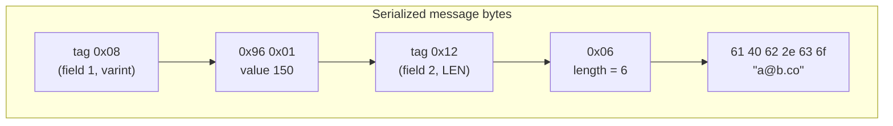
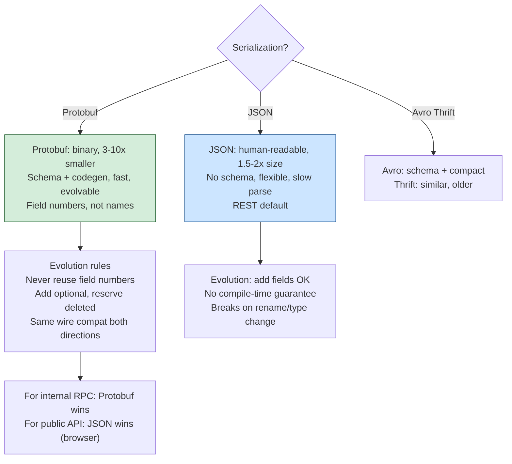
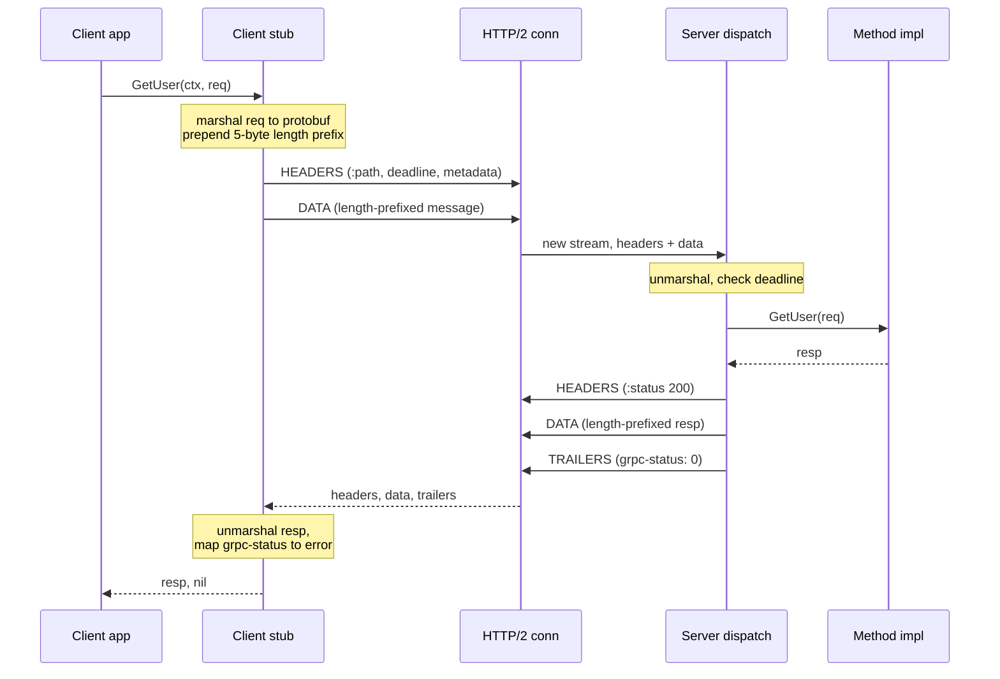
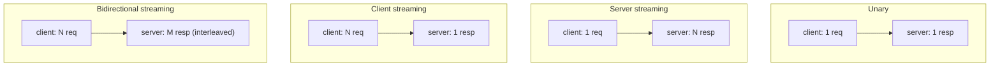
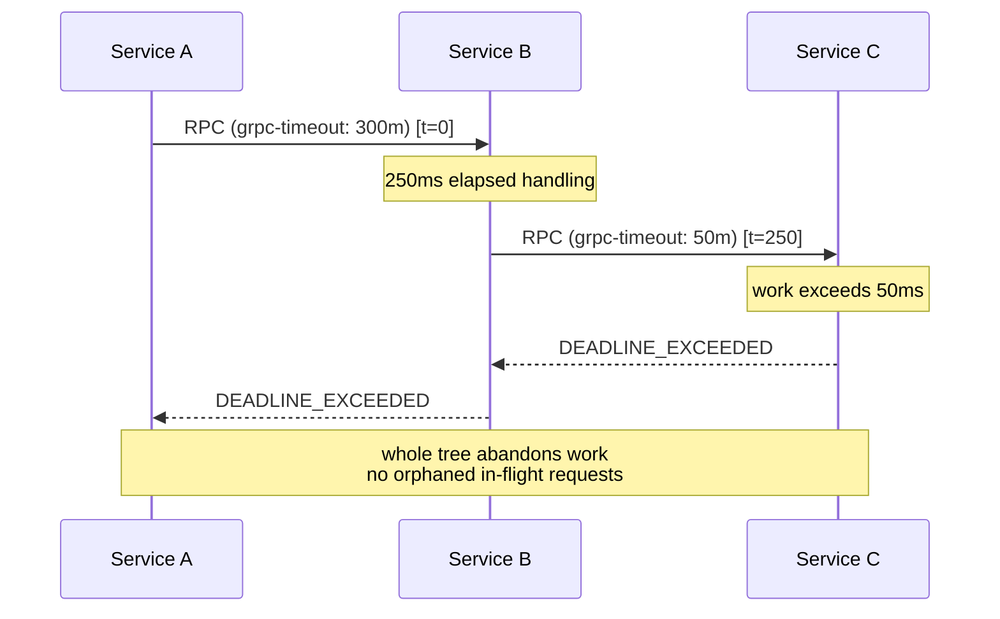
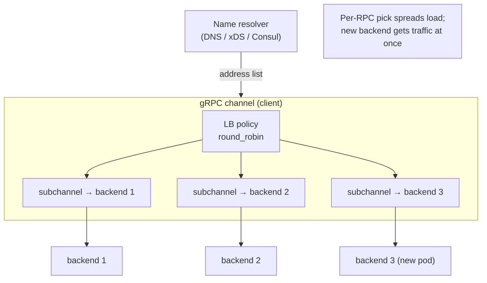
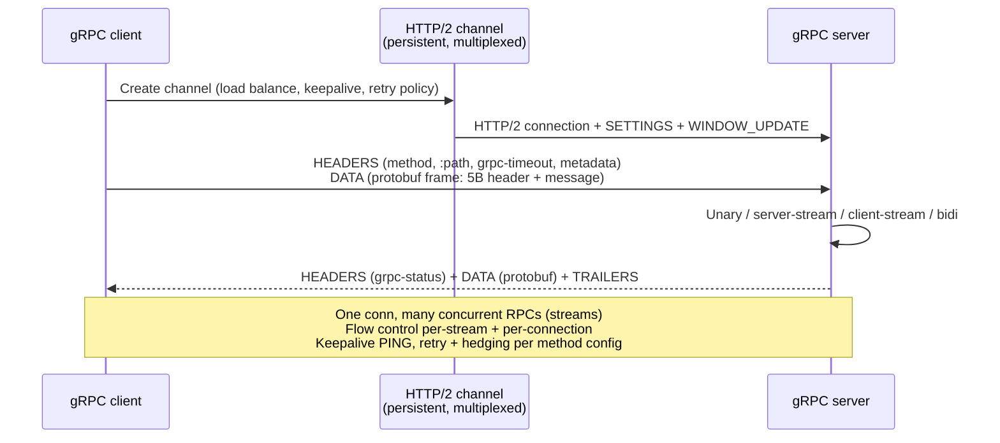
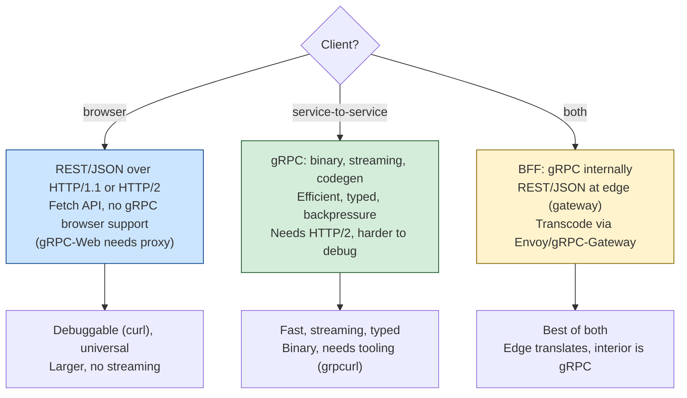

# Chapter 8 — gRPC and RPC Framework Internals

**What this chapter covers.** When one of your services calls another, it almost never opens a
raw socket and speaks a hand-rolled protocol. It calls a *stub* — a generated object with the
same method signatures as the remote service — and the stub does the unglamorous work of turning
a function call into bytes, pushing those bytes across the network, and turning the reply back
into a return value. That machinery is a Remote Procedure Call framework, and at scale the
default one is gRPC over HTTP/2 carrying Protocol Buffers. This chapter is about what actually
happens underneath that stub. We will take the RPC idea apart — its history, its recurring
appeal, and the lie at its center (that a remote call resembles a local one). We will go deep on
serialization, because the wire format *is* the performance story and the schema *is* the service
contract: Protocol Buffers' tag-length-value encoding, varints, and the compatibility rules that
let a hundred teams evolve a hundred services independently. Then gRPC proper: why it sits on
HTTP/2 (Chapter 7), the four call shapes, metadata and status codes, the deadline propagation
and cancellation that keep tail latency and cascading failures in check (Chapter 11), interceptors,
channels, and the client-side and subchannel load balancing that resolve the HTTP/2 connection-pinning
problem (Chapters 7 and 9). We will place gRPC against REST-over-JSON honestly, cover the browser
gap and the newer frameworks (Connect, Twirp, tRPC), and treat schema evolution as the operational
discipline it is (Volume 8).

Learning goals — after this chapter you should be able to:

- Explain the RPC model, its lineage (Sun RPC, DCE, CORBA, Thrift, gRPC), and why the
  "make-remote-look-local" abstraction is both the reason RPC keeps returning and the reason it
  keeps hurting people — grounded in the Fallacies of Distributed Computing.
- Read and reason about the Protocol Buffers wire format at the byte level: field tags, wire
  types, varint encoding, length-delimited fields, and the exact rules that make a change
  backward- and forward-compatible.
- Describe gRPC's mapping onto HTTP/2 — one stream per call, HEADERS/DATA/trailers, length-prefixed
  message framing — and why HTTP/2 multiplexing, streaming, and binary framing are what make gRPC efficient.
- Distinguish the four call types (unary, server-streaming, client-streaming, bidirectional) and
  choose correctly among them.
- Configure deadlines, propagation, cancellation, retries, and hedging, and explain why each is
  load-bearing for a healthy fleet.
- Solve gRPC load balancing: name resolution, client-side vs look-aside LB, and subchannel/L7
  balancing as the fix for HTTP/2 backend pinning.
- Decide between gRPC and REST/JSON for a given surface, and know what gRPC-Web and Connect do
  about the browser.

## The RPC model and why it keeps coming back

A Remote Procedure Call framework exists to make a call to another process — usually on another
machine — look, in your source code, like a call to a local function. You write `user, err :=
client.GetUser(ctx, &GetUserRequest{Id: 42})` and something on the other side of a network runs
`GetUser` and sends back a `User`. The framework generates a **client stub** that presents the
local-looking signature, **marshals** (serializes) the arguments into a byte stream, ships them
over a transport, and on the far side a **server skeleton** (or dispatcher) **unmarshals** them,
invokes the real method, marshals the return value, and sends it back. The stub then unmarshals
the response and returns it to your call site. The whole apparatus is a productivity argument:
distributed systems are made of many small request/response interactions, and forcing every one
of them to be hand-serialized and hand-dispatched would be intolerable.

The idea is old and has been reinvented repeatedly. The canonical academic statement is Birrell
and Nelson's 1984 paper "Implementing Remote Procedure Calls," which introduced the stub/binding
model that everything since has followed. Sun's ONC RPC (the machinery under NFS, standardized as
RFC 1057 and later RFC 5531) gave the industry a widely deployed implementation with its own IDL,
XDR (External Data Representation), for describing the wire encoding. DCE/RPC in the early 1990s
generalized it; Microsoft's DCOM and the Open Group's CORBA pushed RPC into object-oriented,
cross-language, cross-vendor territory with heavyweight IDLs and ORBs (Object Request Brokers).
CORBA's IIOP was a genuine binary RPC protocol, but the ecosystem collapsed under its own
complexity and vendor incompatibility. The 2000s brought a reaction toward text and simplicity —
XML-RPC, then SOAP (still RPC, now drowning in XML and WS-\* specifications), then the pendulum
swung hard to REST, which is deliberately *not* RPC. Meanwhile, inside large companies, binary RPC
never left: Facebook built and open-sourced **Thrift** (2007, later Apache Thrift) with its own
IDL, serializer, and pluggable transports; Google built **Stubby** internally and, in 2015, open-sourced
a cleaned-up successor as **gRPC**. Twitter built **Finagle**. The names change; the stub/IDL/marshal
skeleton does not.

Why does RPC keep returning? Because the alternative — every team inventing an ad-hoc HTTP-plus-JSON
convention per endpoint — has real costs that a framework amortizes: no shared contract, no
generated clients, hand-written (and inconsistent) serialization, no uniform deadline/retry/auth
handling, and no schema to catch a breaking change before it reaches production. RPC frameworks
package all of that. The mistake is to conclude that because the *ergonomics* are local, the
*semantics* are local. They are not, and the gap between the two is where most distributed-systems
pain lives.

### The fallacy at the center: RPC is not a local call

A local function call cannot partially fail. It returns, it panics/throws, or the process dies —
but it does not sit in an ambiguous state for 900 milliseconds and then maybe return, maybe not,
while you have no way to know whether the callee ran. A remote call can do exactly that. The
network between caller and callee is a first-class, misbehaving component, and pretending otherwise
is the original sin of RPC. This is precisely the territory of the **Fallacies of Distributed
Computing** — the list attributed to Peter Deutsch and colleagues at Sun in the mid-1990s (with
the eighth added by James Gosling): *the network is reliable; latency is zero; bandwidth is
infinite; the network is secure; topology doesn't change; there is one administrator; transport
cost is zero; the network is homogeneous.* Every one of these is a way that a remote call differs
from a local one, and every one of them is a way that a naive RPC abstraction lies to you.

The consequences are concrete. Because the network is unreliable, an RPC has *three* outcomes, not
two: success, definite failure, and **unknown** — the request may have been fully processed while
the response was lost. That third outcome is why idempotency and idempotency keys matter (Chapter
7) and why retries are dangerous for non-idempotent operations (Chapter 11). Because latency is
not zero, a call that is trivial locally (a getter) becomes a network round trip, and a loop that
makes one call per item becomes an N+1 latency disaster; RPC's local-looking syntax actively hides
this, which is why chatty RPC interfaces are a recurring performance anti-pattern. Because the
network is not secure, every hop needs authentication and usually encryption (TLS, Chapter 6),
which a local call never needed. A good RPC framework does not hide these realities — it gives you
first-class tools to manage them: explicit deadlines, explicit cancellation, status codes that
distinguish "I definitely failed" from "I timed out and don't know," and retry policies you
configure rather than get by accident. The rest of this chapter is, in large part, about those
tools.

## Serialization and the IDL: the contract is the schema

Before a call can cross a network, its arguments must become bytes, and the two processes must
agree on how to read those bytes back. That agreement is the **serialization format**, and the
machine-readable description of the messages and services is the **Interface Definition Language**.
The IDL is not a convenience; in a fleet of hundreds of services owned by dozens of teams, the IDL
*is* the contract between producer and consumer. It is the thing that a build can check, that a
linter can gate on for breaking changes, and that generates the client so consumers cannot
accidentally send a malformed request. Getting the serialization and IDL right is therefore not a
micro-optimization — it determines whether services can evolve independently (the central theme of
Volume 8, APIs and contracts).

### Protocol Buffers in depth

Protocol Buffers ("protobuf") is Google's schema-driven binary serialization format and the default
payload for gRPC. You describe messages and services in a `.proto` file; a compiler (`protoc`, or
language-specific plugins) generates types and (de)serialization code. Here is a realistic schema
in proto3, the current dialect:

```protobuf
syntax = "proto3";

package acme.users.v1;

option go_package = "github.com/acme/apis/gen/users/v1;usersv1";

import "google/protobuf/timestamp.proto";

// A user record. Field numbers are the wire identity — never reuse them.
message User {
  int64  id           = 1;
  string email        = 2;
  string display_name = 3;
  Status status       = 4;
  google.protobuf.Timestamp created_at = 5;

  repeated string roles = 6;   // 0..N values

  reserved 7, 8;               // retired fields; numbers must never be reused
  reserved "legacy_handle";    // retired field name

  enum Status {
    STATUS_UNSPECIFIED = 0;    // proto3 requires a zero default
    STATUS_ACTIVE      = 1;
    STATUS_SUSPENDED   = 2;
  }
}

message GetUserRequest  { int64 id = 1; }
message GetUserResponse { User user = 1; }

service UserService {
  rpc GetUser(GetUserRequest) returns (GetUserResponse);
}
```

The thing to internalize is that the **field number**, not the field name, is what goes on the wire.
The name `email` exists only in source; the byte stream identifies that field as number 2. This is
the whole basis of protobuf's compatibility model, so it is worth understanding the encoding
exactly.

#### The wire format: tag-length-value and varints

A serialized protobuf message is a flat concatenation of fields, each written as a **key (tag)**
followed by a **value**. The key is a single varint that packs two things: `key = (field_number <<
3) | wire_type`. The low three bits are the **wire type**, which tells a parser how to read the
value that follows; the remaining bits are the field number. There are six wire types in current
protobuf, but the ones you meet constantly are:

| Wire type | Number | Used for |
|-----------|--------|----------|
| VARINT | 0 | `int32`, `int64`, `uint32`, `uint64`, `bool`, `enum`, `sint*` |
| I64 | 1 | `fixed64`, `sfixed64`, `double` |
| LEN | 2 | `string`, `bytes`, embedded messages, packed repeated fields |
| I32 | 5 | `fixed32`, `sfixed32`, `float` |

A **varint** (variable-length integer) is protobuf's core trick for making small numbers cheap.
Each byte uses its low seven bits for data and its high bit as a "more bytes follow" continuation
flag; bytes are little-endian in group order. So the value 1 is one byte (`0x01`); values up to 127
fit in one byte; 128–16383 in two; and so on. This is why field numbers 1–15 are precious: their
tag fits in a single byte (the tag is itself a varint), so you assign 1–15 to the fields that
appear most often. The number 150 encodes as two bytes: `0x96 0x01`. Working it through — 150 in
binary is `1001 0110`; you take the low 7 bits (`001 0110` = 0x16) and set the continuation bit
(→ 0x96), then the next 7 bits (`0000001` = 0x01) with the continuation bit clear (→ 0x01).

Putting a whole message on the wire: consider a message with `int64 id = 1` set to 150 and `string
email = 2` set to `"a@b.co"`. The bytes are:

```text
08 96 01            field 1, wire type 0 (varint): 0x08 = (1<<3)|0, value 150 = 96 01
12 06 61 40 62 2e 63 6f   field 2, wire type 2 (LEN): 0x12 = (2<<3)|2, length 6, "a@b.co"
```

Two properties fall out immediately and matter enormously in practice. First, **fields that are
unset are simply absent** — there is no null marker, no key, nothing. A message with three unset
fields is zero bytes. In proto3 this also means a scalar field set to its zero value (0, empty
string, false) is, by default, indistinguishable on the wire from an unset field; both are absent.
(If you need to tell "explicitly zero" from "unset," you use the `optional` keyword, which brings
back explicit presence tracking, or a wrapper message.) Second, **a parser that encounters an
unknown field number can skip it**, because the wire type in the tag tells it exactly how many
bytes to consume — a varint (read until the continuation bit clears), a fixed 4 or 8 bytes, or a
length-prefixed blob whose length it just read. This skip-the-unknown property is the mechanical
basis of forward compatibility: an old binary can parse a message written by a newer schema,
ignoring fields it does not understand, and (crucially) re-serialize them intact if it preserves
unknown fields, which most implementations do.

The diagram below shows the byte layout for one length-delimited and one varint field.



#### Compatibility rules: the discipline that lets services evolve

Because the wire identity is the field number and unknown fields are skippable, protobuf gives you
a precise, enforceable set of rules for evolving a schema without breaking either older readers
(backward compatibility) or newer readers reading older data (forward compatibility). Learn these
as rules, because your CI should enforce them:

- **Never change a field's number**, and **never reuse a retired number** for a different meaning.
  Reusing a number means old serialized data (in a queue, a log, a database column) will be
  misinterpreted by new code as the new field, silently corrupting data. When you delete a field,
  add its number (and ideally its name) to a `reserved` clause so the compiler forbids anyone from
  reusing it.
- **Adding a field is safe** as long as it gets a new number. Old readers skip it; new readers see
  it, or see its default if an old writer did not set it.
- **Renaming a field is free on the wire** (the name is not transmitted) but breaks source code and
  JSON mappings, so treat it as a source-level change, not a wire change.
- **Changing a field's type is usually breaking.** Some pairs are wire-compatible because they share
  a wire type (e.g., `int32`, `int64`, `uint32`, `uint64`, `bool`, and `enum` are all varints and
  interconvert with defined truncation semantics; `sint32`/`sint64` use zigzag and are *not*
  compatible with the plain int types). Most changes are not safe; assume breaking unless you have
  checked the spec.
- **Enums are open in proto3**: an unknown enum value is preserved as its integer, so adding enum
  values is backward-compatible — but code must handle the unknown/`UNSPECIFIED` case, which is why
  the zero value is conventionally `*_UNSPECIFIED`.

These rules are what let a producer team add a field on Monday and a dozen consumer teams pick it
up whenever they redeploy, with no coordinated release. That decoupling is the entire economic
argument for schema-driven RPC at scale, and tools like Buf (`buf breaking`) exist to fail a pull
request that violates any of the above.

### Protobuf versus JSON, and the other binary formats

JSON is the format you reach for when a human needs to read the payload or when the consumer is a
browser or a third party with no build-time schema. Its costs relative to protobuf are real:
it is **schemaless on the wire** (every message re-transmits field names as strings, so it is
larger), it is **text** (numbers are ASCII, requiring parse/format, and there is no native binary
type — bytes must be base64-encoded, inflating them ~33%), and it has **no built-in evolution
contract** (nothing stops a producer from renaming a field and breaking consumers). Its virtues are
equally real: it is human-readable, universally supported, debuggable with `curl` and `jq`, and
needs no code generation. For a rough sense of scale, a typical structured record is often
several times smaller in protobuf than in JSON and parses meaningfully faster, but treat any
specific multiplier as workload-dependent and measure your own payloads rather than trusting a
headline number.

The other binary formats each occupy a niche:

| Format | IDL/schema | Distinguishing property | Fits when |
|--------|-----------|-------------------------|-----------|
| Protocol Buffers | required (`.proto`) | compact TLV, strong evolution rules, gRPC-native | internal service RPC, durable messages |
| Apache Thrift | required (`.thrift`) | serializer + transport + server all in one stack | polyglot RPC where you want the whole stack from one project |
| Apache Avro | schema (JSON) travels or is registered | schema resolution at read time; great for data files/streams | Kafka + Schema Registry, analytics/columnar pipelines |
| Cap'n Proto | required | zero-copy: in-memory layout *is* the wire layout, no parse step | ultra-low-latency, mmap'd data, RPC with promise pipelining |
| FlatBuffers | required | zero-copy random access without unpacking | games, mobile, reading one field of a huge message |

The dividing line worth remembering: protobuf and Thrift **parse** into language objects (a copy
and allocation step); Cap'n Proto and FlatBuffers are **zero-copy**, letting you read fields
directly out of the received buffer with no deserialization pass, which trades a rigid,
pointer-based layout and larger encoded size for eliminating parse cost and allocation. Avro is the
odd one out: it is optimized for data-at-rest and streaming where a **schema registry** stores
schemas out of band and readers resolve a writer's schema against their own — which is exactly what
you want for Kafka topics (Volume 4/5 territory) and exactly the wrong shape for per-call RPC.




## gRPC in depth

gRPC is Google's open-source RPC framework: protobuf messages (by default) carried over HTTP/2,
with a well-specified mapping of calls, metadata, status, deadlines, and streaming onto HTTP/2's
primitives. Understanding gRPC is largely understanding that mapping.

### Why HTTP/2 is the substrate

Recall from Chapter 7 that HTTP/2 replaced HTTP/1.1's text protocol with a **binary framing layer**
in which a single TCP connection carries many independent **streams**, each a bidirectional
sequence of frames (HEADERS, DATA, and others), multiplexed so that one slow request does not block
others at the application layer. gRPC maps cleanly onto exactly these features, and that mapping is
why gRPC is efficient rather than merely convenient:

- **One RPC = one HTTP/2 stream.** The request is a `POST` whose `:path` is `/package.Service/Method`.
  Because HTTP/2 multiplexes streams over one connection, thousands of concurrent RPCs share a
  single TCP+TLS connection with no per-call connection setup — you pay the TLS handshake once and
  amortize it across the life of the channel.
- **Streaming is native.** HTTP/2 streams are already bidirectional frame sequences, so gRPC's
  streaming call types are not a bolt-on; a server-streaming call is simply multiple DATA frames
  flowing back on the one stream before it closes.
- **Binary framing and HPACK header compression** mean the request/response envelope is small and
  the headers (which in gRPC carry metadata) are compressed against a dynamic table rather than
  re-sent as text each time.
- **Flow control and prioritization** come from HTTP/2, giving gRPC per-stream backpressure for
  free — a slow consumer of a server stream naturally throttles the producer.

Inside a stream, gRPC frames each protobuf message with a tiny **5-byte length prefix**: one byte
for a compression flag (0 = uncompressed, 1 = compressed with the message-encoding named in
metadata) and a 4-byte big-endian length, followed by the serialized message. So a DATA frame's
payload is `[1 byte flag][4 byte length][message bytes]`, possibly several such frames coalesced or
one message split across frames. The response's HTTP status is always `200 OK` if the *HTTP* layer
succeeded; the *gRPC* status rides in trailers (a trailing HEADERS frame) as `grpc-status` and
`grpc-message`. This trailer-based status is essential for streaming: the server can send a full
stream of DATA frames and only at the very end, in trailers, report that the operation ultimately
failed — something a single up-front status code could not express.



### The four call types

gRPC defines four call shapes, distinguished by whether the client and server sides are single
messages or streams. All four ride on a single HTTP/2 stream; the difference is how many DATA
frames flow each way.



- **Unary** (`rpc GetUser(Req) returns (Resp)`) is the ordinary request/response and covers the vast
  majority of RPCs. Use it unless you have a concrete reason not to.
- **Server streaming** (`returns (stream Resp)`) sends one request and receives a sequence of
  responses — server-side pagination, tailing a log, subscribing to a feed, streaming a large
  result set so the client can start processing before it is complete.
- **Client streaming** (`(stream Req)`) sends a sequence of requests and gets one response — bulk
  upload, ingesting a metrics batch, aggregating many events into a single summary.
- **Bidirectional streaming** (`(stream Req) returns (stream Resp)`) has both sides send sequences
  over the one stream, interleaved in whatever order the application logic dictates — chat, live
  telemetry with acks, an interactive session. Because it is fully duplex, the two directions are
  independent: neither side must wait for the other, and either side closes its half when done.

Streaming is powerful but not free of hazards. A long-lived stream **pins itself to one backend**
(its HTTP/2 stream cannot migrate mid-flight), which interacts badly with rebalancing and rolling
deploys; a server draining for deployment must send HTTP/2 `GOAWAY` and let long streams finish or
be cancelled. Streams also hold server-side resources (a goroutine, buffers) for their whole
lifetime, so an unbounded number of idle streams is a resource leak. Prefer unary unless streaming
buys you something specific.

### Defining and implementing a service

The `.proto` declares streaming with the `stream` keyword on either side:

```protobuf
service Telemetry {
  rpc GetSummary(SummaryRequest) returns (Summary);                 // unary
  rpc Tail(TailRequest) returns (stream Event);                     // server streaming
  rpc Ingest(stream Metric) returns (IngestAck);                    // client streaming
  rpc Session(stream ClientMsg) returns (stream ServerMsg);         // bidirectional
}
```

A Go server implementation of the unary and server-streaming methods shows where deadlines,
context, and status codes surface:

```go
func (s *server) GetSummary(ctx context.Context, req *pb.SummaryRequest) (*pb.Summary, error) {
    if req.GetWindowSeconds() <= 0 {
        // Semantic errors use gRPC status codes, not HTTP codes.
        return nil, status.Errorf(codes.InvalidArgument, "window_seconds must be positive")
    }
    // ctx already carries the client's deadline; pass it downstream so the
    // deadline propagates to every dependency call.
    sum, err := s.store.Summarize(ctx, req.GetWindowSeconds())
    if err != nil {
        if errors.Is(err, context.DeadlineExceeded) {
            return nil, status.Error(codes.DeadlineExceeded, "summarize timed out")
        }
        return nil, status.Errorf(codes.Internal, "summarize: %v", err)
    }
    return &pb.Summary{Count: sum.Count, P99Ms: sum.P99Ms}, nil
}

func (s *server) Tail(req *pb.TailRequest, stream pb.Telemetry_TailServer) error {
    events := s.bus.Subscribe(req.GetTopic())
    defer s.bus.Unsubscribe(events)
    for {
        select {
        case <-stream.Context().Done():          // client cancelled or deadline hit
            return status.FromContextError(stream.Context().Err()).Err()
        case ev := <-events:
            if err := stream.Send(toProto(ev)); err != nil {
                return err                         // transport error; stream is dead
            }
        }
    }
}
```

The client side of a server-streaming call loops on `Recv` until `io.EOF`:

```go
stream, err := client.Tail(ctx, &pb.TailRequest{Topic: "orders"})
for {
    ev, err := stream.Recv()
    if err == io.EOF { break }              // clean end of stream
    if err != nil { return err }            // includes grpc-status from trailers
    handle(ev)
}
```

### Metadata, status codes, and errors

**Metadata** is gRPC's name for key/value pairs carried in HTTP/2 headers (request-initial and
response-trailing). It is where you put things that are not the message body: an auth token
(`authorization: Bearer ...`), a request/trace ID for distributed tracing, tenant identifiers,
API-version hints. Keys ending in `-bin` carry base64-encoded binary values; everything else is
ASCII. Metadata is exactly the seam interceptors hook into. Do not smuggle large payloads through
metadata — it rides in HPACK-compressed headers, not flow-controlled DATA frames, and bloats every
call.

gRPC defines its own **status codes**, a closed set of ~17 values, *not* HTTP status codes, because
HTTP status has the wrong vocabulary for RPC. `OK` (0) is success; the ones you will handle
constantly are `INVALID_ARGUMENT` (client sent something malformed — do not retry), `NOT_FOUND`,
`ALREADY_EXISTS`, `PERMISSION_DENIED` and `UNAUTHENTICATED`, `RESOURCE_EXHAUSTED` (rate/quota — back
off), `FAILED_PRECONDITION` vs `ABORTED` (the latter signals a concurrency conflict the client may
retry, e.g., a transaction abort), `UNIMPLEMENTED`, `INTERNAL`, `UNAVAILABLE` (transient — the
canonical retryable code, e.g., server draining or connection lost), and `DEADLINE_EXCEEDED`. The
distinction that matters operationally is **retryability**: `UNAVAILABLE` and often `ABORTED` and
`RESOURCE_EXHAUSTED` are retryable; `INVALID_ARGUMENT`, `NOT_FOUND`, `PERMISSION_DENIED`,
`UNIMPLEMENTED` are not — retrying them just wastes work and can amplify load. Rich, structured
error details (beyond a code and string) travel via the `google.rpc.Status` message and the
`grpc-status-details-bin` trailer, letting you attach typed payloads like `RetryInfo`,
`QuotaFailure`, or `BadRequest.FieldViolation`.

### Deadlines, propagation, and cancellation

This is the single most important operational feature of gRPC, and the one teams most often
under-use. A gRPC call carries a **deadline** — an absolute point in time by which the call must
complete — transmitted as the `grpc-timeout` request header. It is a *deadline*, not a per-hop
*timeout*, and the distinction is the whole point: because it is absolute, it **propagates**. When
service A calls B with a 300 ms deadline, and B must call C to answer, B passes the *same* deadline
context to C. If 250 ms have already elapsed, C sees an effective ~50 ms remaining, not a fresh
300. Each hop subtracts the time already spent, so the entire call tree shares one budget and the
work is abandoned everywhere the instant the budget is blown.



Deadline propagation is a primary defense against **cascading failure** (Chapter 11). Without it, a
slow leaf service causes callers to pile up waiting, each holding a goroutine/thread and a
connection, until the caller itself exhausts resources and fails — the failure climbs the call
graph. With propagated deadlines, work that cannot finish in the budget is cancelled *everywhere*
promptly, freeing resources instead of stacking them. Cancellation is the mechanism: when a client
cancels a call (explicitly, or because its own context was cancelled, or its deadline fired), gRPC
sends an HTTP/2 `RST_STREAM`, and on the server the handler's `ctx.Done()` (Go) or equivalent fires
so it can stop work and, critically, stop its own downstream calls. In Go this is automatic and
free if — and only if — you thread the incoming `ctx` through every downstream call, which is why
"pass ctx everywhere" is not a style nit but a correctness requirement. Setting a deadline is
one line:

```go
ctx, cancel := context.WithTimeout(ctx, 300*time.Millisecond)
defer cancel()
resp, err := client.GetSummary(ctx, req)   // grpc-timeout: 300m goes on the wire
```

A call with *no* deadline is a latent outage: it can hang indefinitely, holding resources through
any downstream stall. Treat an unbounded gRPC call the way you treat a query with no `LIMIT`.

### Interceptors: middleware for RPC

**Interceptors** are gRPC's middleware: functions that wrap every call to add cross-cutting behavior
without touching business logic. On the client, an interceptor sees the outgoing call before it is
sent and the result after; on the server, it wraps the handler. This is where authentication (parse
and verify the token from metadata), authorization, request logging, metrics (count calls, record
latency histograms, tag by `grpc-status`), distributed tracing (extract/inject the trace context
in metadata — OpenTelemetry ships gRPC interceptors that do exactly this), rate limiting, panic
recovery, and payload validation live. There are unary and streaming variants; you chain them.

```go
func authUnary(ctx context.Context, req any, info *grpc.UnaryServerInfo,
    handler grpc.UnaryHandler) (any, error) {
    md, _ := metadata.FromIncomingContext(ctx)
    tok := firstOrEmpty(md.Get("authorization"))
    claims, err := verify(tok)
    if err != nil {
        return nil, status.Error(codes.Unauthenticated, "invalid token")
    }
    ctx = context.WithValue(ctx, claimsKey{}, claims)
    return handler(ctx, req)          // proceed to the actual method
}

srv := grpc.NewServer(
    grpc.ChainUnaryInterceptor(recoverUnary, tracingUnary, metricsUnary, authUnary),
)
```

Interceptors are the reason a fleet can enforce "every service emits the same latency metric,
propagates the same trace headers, and rejects unauthenticated calls the same way" from a shared
library rather than per-team reimplementation.

### Channels, connection management, and load balancing

A gRPC **channel** is the client-side abstraction of a virtual connection to a *logical* service
(e.g., `dns:///users.svc.cluster.local:8443`). Under the channel, gRPC maintains one or more
**subchannels**, each a real HTTP/2 connection to one backend endpoint. The channel owns the name
resolution → connectivity → load-balancing pipeline, and it is here that gRPC solves a problem
Chapter 7 raised and Chapter 9 develops.

The problem is **HTTP/2 connection pinning**. HTTP/2 multiplexes everything over one long-lived TCP
connection, so a naive L4 (connection-level) load balancer sees a client establish *one* connection
and pins it to *one* backend for its lifetime. All of that client's thousands of RPCs then hammer a
single backend; new backends brought up by autoscaling or a deploy receive *no* traffic because no
new connections are being made. L4 load balancing and HTTP/2 are fundamentally mismatched for gRPC.

gRPC's answer is to move load balancing up to **L7, per-RPC, on the client**. The channel resolves
the service name to a *set* of backend addresses (via a **name resolver** — DNS by default, but
pluggable: `xds:///` for the xDS/service-mesh control plane, custom resolvers for Consul/etcd),
opens a subchannel to each, and a **load-balancing policy** picks a subchannel *per RPC*. The
default policies are `pick_first` (try addresses in order, stick to the first that connects — fine
for a single stable backend) and `round_robin` (open subchannels to *all* resolved backends and
rotate RPCs across them). With `round_robin`, because each RPC is independently assigned, adding a
backend immediately starts receiving its share as soon as the resolver reports it — the pinning
problem dissolves. This is configured with a service config, often delivered via the resolver:

```go
conn, err := grpc.NewClient(
    "dns:///users.acme.svc.cluster.local:8443",
    grpc.WithDefaultServiceConfig(`{"loadBalancingConfig":[{"round_robin":{}}]}`),
    grpc.WithTransportCredentials(creds),
)
```

Client-side round-robin works well when the client can see every backend directly (typical in
Kubernetes with a headless service so DNS returns all pod IPs). It scales poorly when there are
tens of thousands of clients and backends — every client holding a connection to every backend is
O(clients × backends) connections. The alternatives:

- **Look-aside (external) load balancing**: clients ask a dedicated LB service ("which backends
  should I use, and how should I weight them?") over a side channel (gRPC-LB historically, now the
  **xDS** APIs pioneered by Envoy). The data plane is still direct client→backend, but the *decision*
  is centralized and can use global load information. This is what a service mesh control plane
  (Istio, or any xDS server) provides, and gRPC has a native xDS client so a proxyless mesh can
  drive gRPC's LB directly.
- **Proxy (in-band) load balancing**: put an L7 proxy (Envoy, a mesh sidecar) between client and
  backends; the proxy terminates HTTP/2 and re-balances per stream. Simpler clients, an extra hop,
  and the proxy must itself be scaled and made HA.



Chapter 9 treats load balancing in general; the gRPC-specific lesson is that **gRPC needs L7 or
subchannel-aware load balancing** — you cannot just put a classic L4 balancer in front of it and
expect even distribution.

### Retries and hedging

gRPC supports declarative retry policy in the service config, so you do not hand-roll retry loops
(and their bugs) at every call site. A retry policy names which status codes are retryable, a cap,
and exponential backoff parameters:

```json
{
  "methodConfig": [{
    "name": [{"service": "acme.users.v1.UserService"}],
    "retryPolicy": {
      "maxAttempts": 4,
      "initialBackoff": "0.1s",
      "maxBackoff": "1s",
      "backoffMultiplier": 2,
      "retryableStatusCodes": ["UNAVAILABLE"]
    }
  }]
}
```

Two safety rules are built into the design. First, only failures the server signals as *not yet
processed* are transparently retried — gRPC will not blindly retry a call it might have executed —
and you should still confine retries to idempotent methods or use idempotency keys (Chapter 7),
because the "unknown" outcome always exists. Second, gRPC implements **retry throttling** (a token
bucket per channel) so that when a backend is broadly failing, retries are automatically damped
rather than doubling the load on an already-struggling service — the classic retry-storm that turns
a blip into an outage (Chapter 11).

**Hedging** is the more aggressive cousin: instead of waiting for a failure, send the same request
to multiple backends after short delays and take the first response, cancelling the rest. This
attacks *tail latency* — the occasional slow backend — by racing a second attempt before the first
has failed. It costs extra load (you may do the work more than once) and is therefore only safe for
idempotent, side-effect-free reads, but for latency-critical read paths it is a powerful lever and,
again, configured declaratively:

```json
{"hedgingPolicy": {"maxAttempts": 3, "hedgingDelay": "0.05s"}}
```

Deadlines, propagation, retries with throttling, and hedging together are gRPC's toolkit for the
Fallacies: they acknowledge that the network is unreliable and slow, and give you bounded,
load-aware, tail-tolerant ways to cope. Chapter 11 develops the reliability theory; gRPC is where a
lot of it becomes concrete configuration.




## gRPC versus REST/JSON, and the browser gap

The real question is rarely "is gRPC better than REST?" but "which surface is this?" The honest
comparison:

| Dimension | gRPC (+ protobuf, HTTP/2) | REST / JSON over HTTP |
|-----------|--------------------------|-----------------------|
| Payload | compact binary TLV | verbose text |
| Contract | enforced schema (`.proto`) with evolution rules | usually OpenAPI or nothing; weaker enforcement |
| Streaming | first-class (4 call types) | awkward (SSE, long-poll, WebSocket) |
| Codegen | strong, multi-language, idiomatic stubs | possible via OpenAPI, less uniform |
| Browser support | not direct (needs gRPC-Web/Connect) | native everywhere |
| Debuggability | needs `grpcurl`/reflection; not human-readable | `curl` + `jq`, readable in any tool |
| Caching (HTTP) | not via HTTP caches | rich HTTP caching (Chapter 7) |
| Best fit | internal service-to-service RPC at scale | public APIs, browser clients, third parties |

Use gRPC for **internal, high-volume, latency-sensitive service-to-service** traffic where both
ends are yours, you want generated clients and enforced contracts, and you benefit from streaming
and deadline propagation. Use REST/JSON for **public APIs, browser-facing endpoints, webhooks, and
third-party integrations** where ubiquity, HTTP caching, human-debuggability, and zero client
tooling matter more than bytes on the wire. Many organizations run both: gRPC in the mesh, a
JSON/REST gateway at the edge (grpc-gateway transcodes JSON↔gRPC from the same `.proto`, giving one
contract two front doors).

The **browser gap** is a hard constraint, not a preference. A browser cannot make an arbitrary
gRPC call, because JavaScript has no access to HTTP/2 trailers or raw frames — the Fetch/XHR APIs
do not expose them, and gRPC's status lives in trailers. **gRPC-Web** is the workaround: a variant
protocol (and a required proxy, historically Envoy's gRPC-Web filter) that encodes the trailers
*into the response body* so a browser can read them, at the cost of losing client-side and
bidirectional streaming (only unary and server-streaming are supported). **Connect** (from Buf) is
the more modern answer: a family of libraries (ConnectRPC) that speak gRPC, gRPC-Web, *and* a
simpler Connect protocol that is plain HTTP/1.1-or-2 with JSON *or* protobuf bodies, so the same
handler is callable by a gRPC client, a gRPC-Web browser client, or literally `curl` — no proxy
required. Connect has largely become the pragmatic choice when you need one service reachable by
both meshed gRPC clients and browsers.

Other RPC frameworks worth situating: **Twirp** (Twitch) is deliberately minimal — protobuf
messages over plain HTTP/1.1, unary-only, JSON or binary, no HTTP/2 dependency and no streaming —
trading gRPC's features for radical simplicity and debuggability. **tRPC** is a TypeScript-only
framework that shares types between a TS server and TS client *without codegen or a separate IDL*,
inferring the contract from the server's types; it is superb for a single TypeScript monorepo and
irrelevant to a polyglot fleet. The pattern across all of them is the same trade you now recognize:
how much of gRPC's power (streaming, HTTP/2, strict schema) you are willing to give up for
simplicity, browser reach, or single-language ergonomics.




## Distributed-systems lens

At the scale this book assumes — hundreds of services, dozens of teams, many repositories, deploys
all day — gRPC-over-HTTP/2-with-protobuf is the default internal RPC substrate for concrete,
compounding reasons. The **binary protobuf payload and HTTP/2 multiplexing** mean a service can
sustain very high RPC throughput on a small, stable pool of connections, so connection setup and
serialization stop being the fleet's dominant cost. **Schema-enforced contracts** turn the IDL into
the interface between teams: the `.proto` is checked in, code-reviewed, breaking-change-linted, and
generates every client, so a producer can add a field and consumers adopt it on their own schedule —
the independent evolution that Volume 8 treats as the core discipline of API governance. This is
not a nicety; it is what makes a large service graph changeable at all. Without an enforced,
evolvable contract, every cross-team change becomes a lockstep release.

The operational features map one-to-one onto the failure modes of distributed systems. **Deadline
propagation** is the fleet's shared clock for giving up: because deadlines are absolute and flow
down the call tree, a single latency budget governs an entire request fan-out, and blown budgets
free resources everywhere at once instead of pooling into the cascading failure that Chapter 11
anatomizes. **Retries with throttling and hedging** let you trade a little extra load for a lot of
tail-latency and transient-failure tolerance, while the built-in retry budget prevents the
retry-storm that converts a minor degradation into an outage. **Client-side and subchannel load
balancing** are the answer to the HTTP/2 pinning problem (Chapters 7 and 9): because gRPC balances
per-RPC over subchannels — directly with `round_robin`, or via xDS/look-aside for very large
fanouts — new capacity gets traffic immediately and hot backends are avoided, which a classic L4
balancer in front of HTTP/2 could never achieve. And because the whole thing rests on TLS (Chapter
6) with mTLS common in a mesh, the "network is not secure" fallacy is handled at the transport
where it belongs.

Two costs deserve to be kept in view rather than assumed away. **Serialization is not free**:
protobuf marshalling and unmarshalling consume CPU, and for very hot paths with large messages it
can become the bottleneck — which is when zero-copy formats (Cap'n Proto, FlatBuffers) or careful
message design (avoid re-serializing giant nested messages you only pass through) start to matter.
And **connection management shapes fleet efficiency**: long-lived HTTP/2 connections must be aged
out and rebalanced (via `GOAWAY` and max-connection-age) so that a topology change is actually
absorbed, and a design that opens O(clients × backends) subchannels will drown a large deployment
in connections and memory — the reason look-aside/xDS balancing exists. The framework gives you the
right primitives; using them well is an ongoing engineering responsibility, not a default you get
for importing a library.

## Key takeaways

- **RPC makes a remote call *look* local but it is not**: it can partially fail (success, failure,
  or *unknown*), it is slow, and it is insecure. A good RPC framework surfaces those realities
  (deadlines, status codes, cancellation) rather than hiding them; the Fallacies of Distributed
  Computing are the checklist of what "not local" means.
- **The schema is the contract.** Protobuf's wire identity is the *field number*, encoded as a
  varint tag with a wire type; unknown fields are skippable, which is the mechanical basis of
  forward/backward compatibility. Never reuse a field number, `reserve` retired ones, add fields
  freely, and gate breaking changes in CI (`buf breaking`).
- **gRPC is protobuf over HTTP/2**: one RPC per stream, 5-byte length-prefixed messages in DATA
  frames, status in trailers. HTTP/2 multiplexing, streaming, binary framing, and HPACK are exactly
  what make gRPC efficient.
- **Four call types** — unary (default), server-streaming, client-streaming, bidirectional. Prefer
  unary unless streaming buys something; long streams pin to a backend and hold resources.
- **Deadlines propagate.** An absolute deadline flows down the call tree, each hop spending from one
  shared budget; this is the primary structural defense against cascading failure. A call with no
  deadline is a latent outage. Thread `ctx` everywhere so cancellation reaches downstream calls.
- **gRPC needs L7/subchannel load balancing.** A classic L4 balancer pins HTTP/2 to one backend;
  `round_robin` over resolved subchannels, or look-aside/xDS balancing for large fanouts, spreads
  load per-RPC and lets new backends receive traffic immediately.
- **Retries and hedging are declarative and load-aware** (retry throttling prevents storms); confine
  retries to idempotent operations, and hedge only side-effect-free reads.
- **Choose the surface, not the winner**: gRPC for internal high-volume service-to-service RPC;
  REST/JSON for public, browser, and third-party APIs. The browser gap is real — use gRPC-Web or,
  better, Connect, which serves gRPC, gRPC-Web, and plain HTTP/JSON from one handler.

## Further reading

- gRPC official documentation and concepts — https://grpc.io/docs/ — including the "Core concepts"
  and "gRPC over HTTP/2" pages that specify the request/response framing, trailers, and status model.
- "gRPC over HTTP/2" protocol specification — https://github.com/grpc/grpc/blob/master/doc/PROTOCOL-HTTP2.md
  — the authoritative mapping of calls, `grpc-timeout`, `grpc-status`, and length-prefixed messages.
- Protocol Buffers documentation: language guide (proto3) and **Encoding** reference —
  https://protobuf.dev/programming-guides/encoding/ — the definitive description of varints, wire
  types, and tag-length-value; and the "Proto Best Practices" / compatibility guide.
- A. D. Birrell and B. J. Nelson, "Implementing Remote Procedure Calls," *ACM Transactions on
  Computer Systems*, 2(1), 1984 — the foundational stub/binding RPC paper.
- "Fallacies of Distributed Computing" — attributed to Peter Deutsch and colleagues at Sun
  Microsystems (with the eighth by James Gosling); Arnon Rotem-Gal-Oz's essay is a widely cited
  explanation. See also the Wikipedia summary for the canonical list.
- RFC 9113 — *HTTP/2* (2022) — the substrate; and Chapter 7 of this volume for framing, multiplexing,
  and the pinning problem.
- The gRPC blog, "gRPC Load Balancing" — https://grpc.io/blog/grpc-load-balancing/ — client-side,
  look-aside, and proxy balancing, and why L4 fails for HTTP/2.
- gRPC retry and hedging design — gRFC A6 ("client retries") in the grpc/proposal repository, which
  specifies the retry and hedging policies and the retry-throttling token bucket —
  https://github.com/grpc/proposal/blob/master/A6-client-retries.md; the service-config schema
  itself lives in the grpc/grpc repository.
- Buf documentation — https://buf.build/docs/ — schema management, `buf breaking` for compatibility
  enforcement, and the ConnectRPC framework (https://connectrpc.com) for the gRPC/gRPC-Web/HTTP-JSON
  triple protocol.
- Apache Thrift (https://thrift.apache.org), Apache Avro (https://avro.apache.org), Cap'n Proto
  (https://capnproto.org), and FlatBuffers (https://flatbuffers.dev) official docs for the
  serialization-format comparison; Twirp (https://github.com/twitchtv/twirp) and tRPC
  (https://trpc.io) for the minimal-RPC and TypeScript-native alternatives.
- Sam Newman, *Building Microservices* (2nd ed., O'Reilly, 2021) — the inter-service communication
  chapters place RPC-versus-REST trade-offs in an organizational context.
