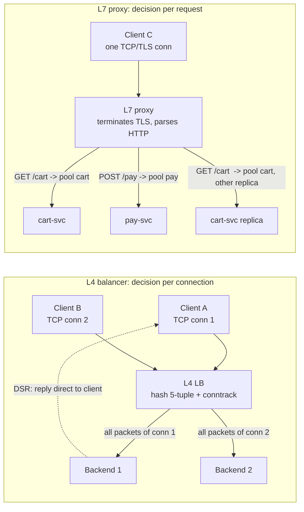
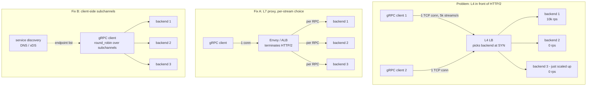
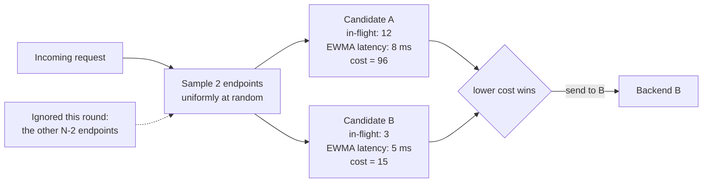
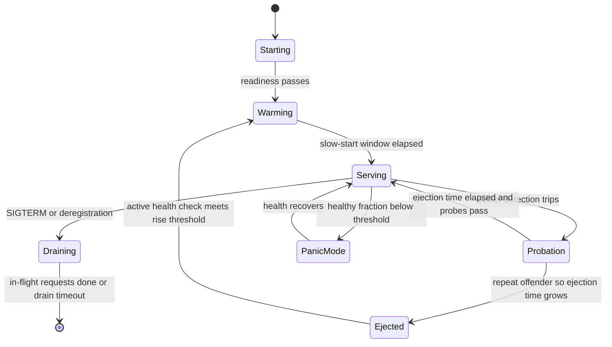
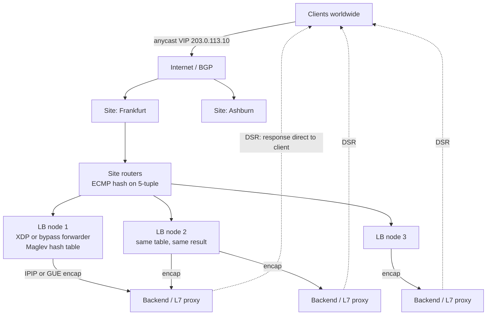

# Chapter 9 — Load Balancing: L4, L7, and Algorithms

**What this chapter covers.** A load balancer is the piece of infrastructure that decides, for
every connection or every request, which of your replicas will do the work. That decision looks
trivial — pick one of N — and it is where a surprising share of production incidents are born.
This chapter takes load balancing apart from the bottom up. We start with the transport layer:
what an L4 balancer actually does to a packet, and the three forwarding modes (NAT, direct server
return, tunneling) that determine your throughput ceiling and your network topology. Then the
application layer: what you buy by terminating the connection and parsing HTTP, and what you pay
in CPU, latency, and failure-domain size. In between sits the single most consequential
interaction in modern service networking: an L4 balancer distributes *connections*, HTTP/2
multiplexes many requests onto *one* connection (Chapter 7), and so a naive L4 tier in front of
a gRPC fleet (Chapter 8) pins each client to one backend and produces load imbalance that no
amount of capacity fixes. We then go deep on the algorithms — round robin, weighted round robin,
least-connections, least-request, latency EWMA, random, and power-of-two-choices, with the reason
P2C beats both random and naive least-loaded — and on the hashing family: consistent hashing
(Volume 14, Chapter 5) and Maglev hashing (Google, NSDI 2016). Health checking gets a long
treatment because bad health checks are a leading cause of *correlated* failure. Finally the
topologies: software proxies, cloud balancers, DNS-based distribution (Chapter 5), BGP anycast
with ECMP and XDP/eBPF forwarders (Volume 2, Chapter 10), and the client-side model where there
is no middle proxy at all.

Learning goals — after this chapter you should be able to:

- Explain precisely what an L4 balancer rewrites and what it does not, and choose between NAT
  mode, DSR, and IPIP/GRE tunneling based on return-path bandwidth, L2 adjacency, and MTU.
- Explain what terminating a connection buys at L7 — per-request routing, retries, rewriting,
  observability, protocol translation — and quantify the costs.
- Diagnose and fix HTTP/2 and gRPC connection pinning behind an L4 tier, using L7 proxies,
  client-side/subchannel balancing, or bounded connection lifetimes.
- Reason about load-balancing algorithms from first principles: why round robin fails under
  heterogeneous request cost, why global least-loaded herds, and why power-of-two-choices with
  an EWMA cost estimate is the modern default for meshes.
- Implement and configure consistent hashing and Maglev hashing, and state their disruption and
  balance properties.
- Design health checking that degrades safely: active vs passive detection, hysteresis, panic
  thresholds, slow start, and health endpoints that do not couple your whole fleet to one
  dependency.
- Drain connections correctly during a deploy so that a rollout does not show up as errors.
- Choose an ingress topology — cloud LB, anycast + ECMP + Maglev/Katran, DNS, or client-side —
  and explain its failure modes.

## Why load balance at all

There are four distinct reasons, and conflating them leads to bad designs.

**Horizontal scale.** A single process has a ceiling — cores, memory bandwidth, file descriptors,
connection table size, GC behavior — and beyond it you add replicas that something must feed. This
is the reason people usually name and the least interesting one, because it says nothing about
*how* work should be spread.

**Failure tolerance.** Replicas die: kernel panics, OOM kills, bad deploys, hypervisor migrations,
a rack losing power. The balancer notices and stops sending work to the corpse. This is the reason
with the most operational subtlety, because the detection mechanism — health checking — is itself
a distributed system with false positives, false negatives, and the ability to take down a healthy
fleet.

**Deployability.** Rolling deploys, blue/green, and canaries (Volume 11, Chapter 9) all reduce to
"shift traffic away from these instances, replace them, shift traffic back." Without a traffic
control point you cannot deploy without dropping requests.

**Utilization.** Two backends at 30% and 90% cost the same as two at 60% and 60%, but the second
arrangement has twice the headroom before the first timeout. Tail latency in a fanout service is
governed by the *worst* replica you touch, so with a fanout of 50 a p99-slow backend is a
near-certainty on every request. Balancing quality translates directly into p99 and into capacity
you must buy.

A useful reframing for the rest of the chapter: the load balancer is not a box, it is the
**traffic-distribution control plane of a fleet**. It holds a view of which endpoints exist
(service discovery), a view of which are healthy (health checking), and a policy for choosing
among them (the algorithm). Where those three live — in a hardware appliance, in a proxy, in a
sidecar, or in the client library — is a topology choice, and it is largely independent of the
algorithms themselves.

## L4: balancing at the transport layer

An L4 load balancer forwards TCP connections and UDP flows without looking at, or understanding,
the bytes they carry. Its unit of decision is the **flow**, keyed by the 5-tuple: source IP,
source port, destination IP, destination port, protocol. The first packet of a flow (a TCP SYN,
or the first datagram of a UDP flow) triggers a backend selection; every subsequent packet of
that flow must go to the same backend, because the backend holds the TCP state machine (Chapter
3). An L4 balancer therefore needs either a **connection tracking table** mapping flows to
backends, or a **deterministic hash** that yields the same answer for the same 5-tuple, or — in
the best designs — both.

Because it never parses a payload, an L4 balancer is protocol-agnostic (TCP, UDP, QUIC, the
PostgreSQL wire protocol, Redis, SMTP — it does not care), does not need your TLS private keys,
and costs very little per packet: a hash, a table lookup, a header rewrite. Millions of packets
per second per host is routine for a kernel-bypass or XDP-based implementation.

### The three forwarding modes

How the packet actually reaches the backend, and how the reply reaches the client, is the single
most important L4 design decision.

**NAT mode (masquerading).** The balancer rewrites the destination IP (and possibly port) from the
virtual IP (VIP) to the real server. For the reply to be un-NATed correctly it *must* traverse the
balancer again — either because the balancer is the backend's default gateway, or because the
balancer also rewrote the source IP (SNAT), making itself the apparent client. NAT mode is simple
and works across L3 boundaries, but it puts both directions through the balancer. Since HTTP
responses dwarf requests, the return path dominates and the balancer's bandwidth becomes the
fleet's bandwidth. SNAT additionally destroys the client IP (recover it via `X-Forwarded-For` or
the PROXY protocol) and consumes a source-port keyspace per backend — the classic ephemeral port
exhaustion failure at roughly 64K concurrent flows per source-IP/backend-IP/backend-port tuple.

**Direct server return (DSR / direct routing).** The balancer rewrites only the destination MAC
address and puts the frame back on the wire; the IP header is untouched. The backend owns the VIP
on a loopback interface with ARP suppressed, and replies to the client *directly*, bypassing the
balancer — asymmetric routing by design. The balancer sees only inbound packets, typically 10–20%
of the byte volume, so a small tier can front an enormous fleet. The costs: balancer and backends
must share an L2 segment (usually impossible in cloud VPCs); ports cannot be rewritten; and the
balancer never sees responses, so passive health detection is impossible.

**Tunneling (IPIP or GRE, or GUE over UDP).** The balancer encapsulates the original packet in an
outer IP header addressed to the backend, and the backend decapsulates and processes the inner
packet, then replies directly to the client — DSR semantics without the L2 adjacency requirement.
This is what hyperscale L4 balancers use: Maglev encapsulates with GRE, Meta's Katran uses IPIP,
GitHub's GLB and Cloudflare's Unimog use GUE (Generic UDP Encapsulation), whose UDP source port
can carry entropy so that intermediate routers' ECMP hashing still spreads tunneled traffic. The
price is MTU: 20 bytes for IPIP, 24 for GRE, 28+ for GUE, which means you must either lower the
backend's advertised MSS or accept fragmentation and PMTUD pain (Chapter 2).



### L4 in practice: IPVS

Linux's in-kernel L4 balancer, IPVS, is worth knowing because it is what `kube-proxy` uses in
IPVS mode and what most on-prem L4 tiers are built from. It exposes forwarding mode and scheduler
as orthogonal knobs:

```bash
# VIP 203.0.113.10:443, Maglev hashing scheduler (kernel >= 4.18)
ipvsadm -A -t 203.0.113.10:443 -s mh

# Add real servers in direct-routing (DSR) mode:  -g gatewaying, -i ipip, -m masquerade/NAT
ipvsadm -a -t 203.0.113.10:443 -r 10.0.1.11:443 -g -w 100
ipvsadm -a -t 203.0.113.10:443 -r 10.0.1.12:443 -g -w 100

ipvsadm -Ln --stats
```

On each DSR backend the VIP must exist but stay invisible to ARP:

```bash
ip addr add 203.0.113.10/32 dev lo
sysctl -w net.ipv4.conf.all.arp_ignore=1     # answer ARP only for addresses on the target iface
sysctl -w net.ipv4.conf.all.arp_announce=2   # use the best local address as ARP source
```

Get `arp_ignore`/`arp_announce` wrong and multiple hosts answer ARP for the VIP; the switch's MAC
table flaps and traffic goes to a random member. This is the canonical DSR bring-up bug.

## L7: balancing at the application layer

An L7 balancer is a **terminating proxy**. It completes the TCP handshake and the TLS handshake
with the client (Chapter 6), reads and parses the application protocol — HTTP/1.1, HTTP/2, HTTP/3,
gRPC, sometimes Redis or Kafka or Postgres — and then opens or reuses its *own* connections to
backends. There are two connections, not one, and the proxy is a full participant in both.

That single structural change unlocks everything an L4 balancer cannot do:

- **Per-request routing.** Route `/api/v2/*` to one pool and `/static/*` to another; route
  `:method = POST` differently from `GET`; route on `Host`, on a header, on a cookie, on a gRPC
  service and method name (`/checkout.v1.Checkout/PlaceOrder`). This is what makes an L7 tier the
  natural place for API gateways, canary splits by header, and per-tenant routing.
- **Per-request load balancing.** The decision is made per request, not per connection. This is
  the property that saves you under HTTP/2 (next section).
- **Retries, timeouts, hedging, and circuit breaking** (Chapter 11) applied uniformly, in one
  place, without touching application code.
- **Rewriting**: paths, headers, adding `X-Forwarded-For` and `X-Request-Id`, injecting trace
  context (Volume 11, Chapter 4), stripping internal headers on the way out.
- **Protocol translation**: HTTP/1.1 clients to HTTP/2 backends, HTTP/3 at the edge to HTTP/1.1
  internally, gRPC-Web to gRPC, WebSocket upgrade handling.
- **Rich observability**: per-route status-code distributions, upstream latency histograms,
  per-backend success rates — the raw material for passive health detection.

The costs are equally structural. TLS termination and HTTP parsing cost CPU (asymmetric handshake
crypto being the expensive part; use session resumption and keepalive aggressively). The proxy
adds a hop with its own queueing — typically sub-millisecond for a well-tuned Envoy or HAProxy on
the same network, but the tail matters and buffering policy matters more. It holds state
(connection pools, buffers, HTTP/2 stream tables) and so has its own memory ceiling. And because
it understands your protocol, it can be broken by your protocol: request smuggling, header size
limits, misparsed chunked encodings.

| Dimension | L4 | L7 |
| --- | --- | --- |
| Decision unit | Flow / connection | Request (or HTTP/2 stream) |
| Protocol awareness | None | Full (HTTP, gRPC, sometimes DB protocols) |
| TLS keys required | No (pass-through) | Yes (unless SNI-based pass-through routing) |
| Cost per unit work | Very low (per packet) | Moderate (parse, buffer, re-emit) |
| Client IP preservation | Native (DSR/tunnel) or lost (SNAT) | Lost at IP level; carried in `X-Forwarded-For`/PROXY protocol |
| Retries | Impossible | Native, per request |
| Passive health signals | None (no response visibility) | Yes (status codes, latencies, resets) |
| HTTP/2 behavior | Pins whole connection to one backend | Balances every stream independently |
| Typical scale unit | Millions of pps per node | Tens of thousands of RPS per core-ish |

A large fleet usually runs both: an L4 tier for raw ingress scale, DDoS absorption, and VIP
distribution, and an L7 tier behind it for routing and per-request policy. That is not redundancy;
they solve different problems.

## The HTTP/2 pinning problem

This deserves its own section because it is the most common load-balancing bug in modern
service-to-service architectures, and it is invisible until you look at per-backend request rates.

Recall from Chapter 7 that HTTP/2 multiplexes many concurrent requests as **streams** over a
single long-lived TCP connection, and that clients are strongly encouraged to use exactly one
connection per origin. gRPC (Chapter 8) inherits this: a `grpc.ClientConn` maintains a persistent
HTTP/2 connection and issues every RPC as a stream on it.

Now place an L4 balancer in front. It picks a backend once, at connection establishment, and every
stream on that connection — thousands of RPCs per second, for hours — lands on that one backend.
The consequences compound:

- **Load is distributed per client, not per request.** With 10 clients and 20 backends, at most 10
  backends receive traffic, no matter how much capacity you provision.
- **New backends receive nothing.** Scale up during an incident and the new replicas sit empty,
  because no client has a reason to open a new connection. The autoscaler adds pods, the metrics
  do not move, and the on-call engineer concludes autoscaling is broken.
- **Imbalance is sticky.** A client assigned to a degraded backend stays there until the connection
  breaks, and request-cost heterogeneity across clients (a batch job vs. a UI service) projects
  directly onto backends.
- **Deploys are lumpy.** Draining a backend forces all its clients to reconnect at once.

There are three real fixes, and one non-fix.

**Fix 1 — terminate HTTP/2 at an L7 proxy.** Envoy, NGINX, HAProxy, and cloud ALBs parse HTTP/2
and make a fresh upstream selection per stream, multiplexing your streams across their own backend
connection pool. This is the standard answer for north-south ingress and for east-west traffic in
a sidecar mesh (Chapter 10), where the "proxy" is a localhost hop.

**Fix 2 — client-side / subchannel balancing.** Let the client resolve *all* backend addresses
and maintain a subchannel (one HTTP/2 connection) to each, choosing per RPC. In gRPC this is a
one-line service-config change:

```go
conn, err := grpc.NewClient(
    "dns:///checkout.svc.cluster.local:8080",
    grpc.WithDefaultServiceConfig(`{"loadBalancingConfig":[{"round_robin":{}}]}`),
    grpc.WithTransportCredentials(insecure.NewCredentials()),
)
```

The default policy is `pick_first`, which connects to one resolved address and stays there —
exactly the pinned behavior, without a middlebox to blame. `round_robin` (or an xDS-supplied policy
such as `weighted_round_robin`) opens a subchannel per endpoint and chooses per RPC. The address
set is only as fresh as the resolver: grpc-go's DNS resolver re-resolves on a minimum interval
(30 seconds by default) and on connection failure, which is why headless Services (Chapter 5) with
a short TTL are the usual Kubernetes pairing.

**Fix 3 — bound connection lifetime.** Even with L7 in the path, connections that live forever
prevent rebalancing after a scale-up. Servers should periodically retire connections with a
graceful `GOAWAY`, forcing clients to re-resolve and redistribute:

```go
s := grpc.NewServer(grpc.KeepaliveParams(keepalive.ServerParameters{
    MaxConnectionAge:      30 * time.Minute, // send GOAWAY after this
    MaxConnectionAgeGrace: 5 * time.Minute,  // then hard-close
}))
```

gRPC jitters `MaxConnectionAge` by roughly ±10% precisely so that a fleet of clients does not
reconnect in a synchronized wave. Envoy's equivalent is `max_connection_duration` on the HTTP
connection manager; NGINX has `keepalive_time`.

**The non-fix**: "just add more replicas." Capacity does not redistribute a pinned connection.



The same argument applies to any long-lived multiplexed transport: HTTP/3 over QUIC (Chapter 4),
WebSocket fanout, database connection pools, and Kafka client connections all pin at L4.

## Algorithms

Everything above is mechanism. This section is policy: given a set of healthy endpoints, which
one gets this request?

### Round robin

Rotate through the endpoint list. It is O(1), needs no state beyond an index, and produces
perfectly equal *request counts*. That is exactly its weakness: equal request counts are the goal
only when every request costs the same and every backend has the same capacity. Neither holds in
practice. A `GET /users/me` and a `POST /reports/generate` can differ by three orders of magnitude
in service time; a fleet running on mixed instance types or noisy-neighbor hypervisors differs by
2× in throughput. Round robin will happily keep feeding a backend that is stuck in a stop-the-world
GC pause, because it counts requests sent, not work outstanding.

It is also subtly bad in a mesh where M clients round-robin independently over N backends: the
rotations are uncorrelated, so the aggregate arrival process at each backend is closer to Poisson
than to smooth, and queueing variance is higher than the "perfectly fair" framing suggests. The
Google SRE book's datacenter load-balancing chapter accordingly treats round robin as a baseline
to improve on, not a target.

### Weighted round robin

Attach a weight to each endpoint and give it proportional share. The naive implementation — emit
`w` consecutive picks for weight `w` — produces bursts; a backend with weight 10 gets 10
back-to-back requests. Production implementations smooth the sequence. NGINX uses *smooth weighted
round robin*, which maintains a current-weight accumulator per peer and selects the maximum,
producing interleaved sequences like `A B A C A B A` rather than `A A A A B B C`. Envoy uses an
**earliest-deadline-first (EDF) scheduler**: each host is inserted into a priority queue with a
deadline of `1/weight`, the earliest is popped and re-inserted with its deadline advanced. EDF
generalizes cleanly to dynamic weights, which matters for slow start and for utilization-based
weighting.

Where do weights come from? Static configuration (instance size), locality (prefer same-zone
endpoints to avoid cross-AZ charges and latency), canary percentages, or — most interestingly —
backend-reported load. gRPC and Envoy both support **ORCA** (Open Request Cost Aggregation), in
which the backend attaches utilization metrics (CPU, application-defined QPS or memory pressure)
to responses or to out-of-band reports, and the client's `weighted_round_robin` policy converts
them into weights. This is the closest thing to "true" load-aware balancing that does not require
a global coordinator, and it directly addresses the heterogeneous-hardware case.

### Least connections and least request

Track outstanding work per backend and send to the minimum. HAProxy's `leastconn` counts open
connections; Envoy's `LEAST_REQUEST` counts active requests, which is the right unit for
multiplexed protocols where one connection carries many in-flight requests.

Outstanding-request count is a good proxy for load because it is *self-correcting*: a backend that
slows down accumulates in-flight requests and is automatically avoided, without anyone measuring
its latency. It handles heterogeneous request cost far better than round robin.

But global least-loaded has a well-known pathology, and it is not subtle. Whenever the load view
is shared and slightly stale, every chooser sees the same minimum and sends to it simultaneously.
The "least loaded" backend receives a stampede, becomes the *most* loaded, and the herd swings to
the next victim. The system oscillates instead of converging. With one balancer process this is
avoidable (the counter is updated synchronously on dispatch), but in a mesh with hundreds of
independent clients, or a balancer tier with dozens of nodes, there is no shared synchronous
counter. Each client sees only its own in-flight requests to each backend, which is a partial and
biased view. Naive least-loaded, applied to a partial view, is not obviously better than random.

### Random, and why sampling saves it

Pure random assignment needs no state at all and is trivially parallel. Its problem is variance.
The classic balls-into-bins result: throwing `n` balls into `n` bins uniformly at random gives a
maximum load of roughly `ln n / ln ln n` — a meaningful multiple of the average even for modest
`n`. Some backend always gets unlucky, and in a fanout system the unlucky backend is on the
critical path of most requests.

### Power of two choices (P2C)

Pick **two** endpoints uniformly at random, query only those two for their load, and send to the
less loaded. This is the "power of two choices" result of Azar, Broder, Karlin, and Upfal
("Balanced Allocations", STOC 1994) and Mitzenmacher's thesis and subsequent paper: the maximum
load drops from `Θ(ln n / ln ln n)` to `ln ln n / ln 2 + Θ(1)`. That is an *exponential*
improvement from one extra sample — and taking `d = 3` or more buys only a further constant
factor. Two samples is the knee of the curve.

P2C is the right answer for distributed balancing for three reasons that matter more than the
asymptotics:

1. **No global state.** Each chooser needs load information for exactly the two endpoints it
   sampled — or, in practice, its own local estimate of those two. There is no cluster-wide
   counter to maintain, no gossip, no consistency problem.
2. **No herding.** Because the candidate pair is random per decision, two clients deciding at the
   same instant almost certainly consider different pairs. The "everyone dogpiles the idle
   backend" failure of global least-loaded simply cannot occur.
3. **It degrades gracefully with stale data.** Even if load estimates are seconds old, picking the
   better of two random candidates still avoids the worst backends most of the time.



### P2C with EWMA cost (peak-EWMA)

The refinement that makes P2C excellent rather than merely good is what you compare. Counting
in-flight requests treats all requests as equal. Instead, maintain per-endpoint an
exponentially-weighted moving average of observed response latency, and score each candidate as
roughly `EWMA_latency × (outstanding_requests + 1)` — an estimate of the queueing delay a new
request would experience there. This is Finagle's "peak EWMA" balancer and Linkerd's default
proxy algorithm, and it is why a mesh sidecar notices a backend entering a GC pause within
milliseconds: latency spikes, the EWMA rises, and the endpoint loses nearly every comparison until
it recovers. Two implementation details matter: decay the EWMA on *time*, not on request count,
or an endpoint receiving no traffic keeps a stale score forever; and treat an endpoint with zero
observations optimistically enough to get sampled, but not so optimistically that it is flooded —
which is precisely what slow start (below) is for.

Configuring P2C is usually a single knob. Envoy:

```yaml
lb_policy: LEAST_REQUEST
least_request_lb_config:
  choice_count: 2          # P2C; this is the default
  active_request_bias:     # exponent applied to active requests when hosts have unequal weights
    default_value: 1.0
    runtime_key: cluster.checkout.active_request_bias
```

With equal host weights Envoy's `LEAST_REQUEST` *is* P2C on active request count. With unequal
weights it falls back to the EDF scheduler using a dynamic weight of
`weight / (active_requests + 1)^active_request_bias`, so a bias of 0 disables load-awareness and
higher values make it more aggressive.

NGINX (open source, since 1.15.1) and HAProxy both expose P2C directly:

```nginx
upstream checkout {
    zone checkout 64k;            # shared memory required for random/least_conn state
    random two least_conn;        # sample 2, pick the one with fewer connections
    server 10.0.1.11:8080 max_fails=3 fail_timeout=10s;
    server 10.0.1.12:8080 max_fails=3 fail_timeout=10s;
    keepalive 64;                 # upstream keepalive pool; essential to avoid per-request handshakes
}
```

```haproxy
backend checkout
    balance random(2)             # two draws, least-loaded of the two
    option redispatch
    server c1 10.0.1.11:8080 check maxconn 200
    server c2 10.0.1.12:8080 check maxconn 200
```

### Hashing: consistent hashing and Maglev

Everything so far distributes work *evenly*. Sometimes you want to distribute it *stably*: the
same key must reach the same backend, so that the backend's local cache is warm, or so that a
session lives in one process, or so that per-key ordering is preserved.

Naive `hash(key) mod N` is catastrophic under membership change: adding one backend to a fleet of
20 remaps roughly 95% of keys. **Consistent hashing** (Karger et al., STOC 1997; Volume 14,
Chapter 5 for the full treatment) places keys and backends on a ring and assigns each key to the
next backend clockwise, so a membership change moves only about `1/N` of keys. Acceptable balance
requires many **virtual nodes** per backend — typically hundreds — because the variance of a few
random ring positions is large; Envoy's `RING_HASH` exposes this as `minimum_ring_size` (default
1024).

**Maglev hashing** (Eisenbud et al., *Maglev: A Fast and Reliable Software Network Load Balancer*,
NSDI 2016) instead precomputes a fixed lookup table of size `M` (a prime, e.g. 65537) whose entries
name backends, and looks up `table[hash(key) mod M]`. Each backend derives a preference permutation
over slots from two hashes of its name, and backends take turns claiming their most-preferred free
slot until the table is full. The result is *near-perfect* balance — every backend gets `M/N`
entries, ±1 — with minimal, though not strictly optimal, disruption on membership change. Lookup
is a single array index, which is why it suits a packet-rate datapath.

```python
def maglev_populate(backends, M=65537):
    """Maglev table generation (NSDI 2016, section 3.4). Returns a list of length M
    whose entries are indices into `backends`."""
    N = len(backends)
    offset = [h1(b) % M for b in backends]
    skip   = [h2(b) % (M - 1) + 1 for b in backends]   # coprime with prime M
    nxt    = [0] * N
    entry  = [-1] * M
    filled = 0
    while True:
        for i in range(N):
            c = (offset[i] + nxt[i] * skip[i]) % M      # backend i's next preference
            while entry[c] != -1:                       # skip slots already taken
                nxt[i] += 1
                c = (offset[i] + nxt[i] * skip[i]) % M
            entry[c] = i
            nxt[i] += 1
            filled += 1
            if filled == M:
                return entry
```

Both are one line of config in Envoy, combined with a route-level hash policy that names the key:

```yaml
# Cluster
- name: session_cache
  connect_timeout: 0.25s
  lb_policy: MAGLEV
  maglev_lb_config:
    table_size: 65537
  common_lb_config:
    consistent_hashing_lb_config:
      hash_balance_factor: 125   # bounded loads: no host may exceed 1.25x the mean
```

```yaml
# Route: choose the hash key
route:
  cluster: session_cache
  hash_policy:
    - header:
        header_name: x-user-id
    # alternatives: cookie (with ttl, to have Envoy mint one), connection_properties (source IP),
    # query_parameter, filter_state
```

That `hash_balance_factor` is **consistent hashing with bounded loads** (Mirrokni, Thorup, and
Zadimoghaddam; arXiv 2016, SODA 2018), and it fixes hashing's fundamental weakness: a hot key or a
skewed key distribution overloads one backend and pure hashing has no escape valve. With a bound of
`c × mean`, an overloaded target spills the key to the next host on the ring, preserving most
affinity while capping the damage. Use it whenever your key space might be skewed — that is,
almost always. (Kubernetes note: `kube-proxy` in IPVS mode can use the `mh` scheduler, which is
how you get consistent-hash behavior for ClusterIP Services without a userspace proxy.)

## Health checking

The algorithm chooses among *healthy* endpoints. Deciding which endpoints are healthy is where
load balancers cause outages.

### Active health checks

The balancer periodically probes each backend out-of-band. Layers matter:

- **L3** (ICMP echo): tells you the host is up. Nearly useless.
- **L4** (TCP connect): tells you something is listening. Also nearly useless — a process stuck in
  a GC pause or deadlocked on a lock still accepts connections, because the kernel completes the
  handshake and queues the socket in the accept backlog.
- **L7** (HTTP GET, gRPC health check): actually executes application code and observes a status.
  This is the only kind worth relying on. For gRPC, use the standard `grpc.health.v1.Health`
  service — `Check` for polling, `Watch` for streaming updates — which both Envoy and Kubernetes
  can drive natively.

```haproxy
backend checkout
    balance random(2)
    option httpchk
    http-check send meth GET uri /healthz ver HTTP/1.1 hdr Host checkout.internal
    http-check expect status 200
    # inter: normal interval; fastinter: when transitioning; downinter: while down
    # rise/fall: hysteresis; slowstart: ramp weight from 0 over 60s after coming up
    default-server inter 3s fastinter 500ms downinter 5s rise 2 fall 3 slowstart 60s maxconn 200
    server c1 10.0.1.11:8080 check
    server c2 10.0.1.12:8080 check
```

Two design constants deserve attention. **Hysteresis** (`rise`/`fall`, or Envoy's
`healthy_threshold`/`unhealthy_threshold`) prevents flapping: one dropped probe on a lossy link
should not eject a healthy backend, and one successful probe should not readmit a crashing one.
Asymmetric thresholds are correct — quick to eject, slow to readmit — because sending traffic to a
dead backend costs more than briefly under-using a live one. **Jitter** matters at scale: a
200-node balancer tier probing 5,000 backends every second is a million probes per second, and
unjittered intervals synchronize into periodic spikes. This is why large fleets often aggregate
health through a discovery service instead of probing point-to-point.

### Passive health checks and outlier detection

Active probes ask "are you well?" on a synthetic path. Passive detection watches *real* traffic and
ejects endpoints failing actual requests, catching what probes miss: a backend that serves
`/healthz` fine but 500s on one route, a partial dependency failure, a bad canary.

Envoy's `outlier_detection` is the reference implementation:

```yaml
outlier_detection:
  # consecutive-error detector
  consecutive_5xx: 5
  enforcing_consecutive_5xx: 100          # percent of the time the ejection is actually enforced
  consecutive_gateway_failure: 5
  # statistical detector: eject hosts whose success rate is an outlier vs the cluster mean
  success_rate_minimum_hosts: 5           # need this many hosts before the stat is meaningful
  success_rate_request_volume: 100        # per host, per interval
  success_rate_stdev_factor: 1900         # divided by 1000 => 1.9 standard deviations
  interval: 10s
  base_ejection_time: 30s                 # multiplied by the number of consecutive ejections
  max_ejection_percent: 10                # never eject more than 10% of the cluster
```

Note the two safety properties. Ejection time grows with repeated ejections, so a chronically bad
host is removed for longer while a transiently bad one returns quickly. And `max_ejection_percent`
caps the blast radius — because the single most dangerous behavior a health system can have is
*ejecting everything*.

### The panic threshold, or: how to survive being wrong

Suppose your backends all check a shared database in `/healthz`, and the database has a 30-second
blip. Every backend fails its probe simultaneously. A naive balancer removes every endpoint and
serves 100% errors — turning a degraded dependency into a total outage. Worse, the backends were
probably still capable of serving cached reads.

Envoy's answer is the **panic threshold**: if the fraction of healthy hosts in a cluster falls
below a configured percentage (default 50%), Envoy *disregards health status entirely* and load
balances across all hosts, healthy or not.

```yaml
common_lb_config:
  healthy_panic_threshold:
    value: 50.0    # below 50% healthy, ignore health and use the whole pool
```

The reasoning: when most of your fleet looks unhealthy, the likeliest explanation is that the
health signal is wrong or the failure is global — and in either case concentrating all traffic on
the remaining "healthy" minority will immediately overload and kill it. This is the *fail-static*
principle, and it belongs in any health system you design: **when the health data becomes
implausible, stop trusting it.** AWS's load balancers behave comparably, routing to all targets
when none pass health checks.

The corresponding backend-side discipline is to keep health endpoints **shallow**. A liveness
check should answer "is this process able to serve?" — not "is every downstream dependency
reachable?" If the database is down, every replica returning 503 destroys your ability to serve
cached content or a useful error. Separate the concerns: liveness (restart me — in Kubernetes this
literally kills the container), readiness (route to me), startup (still warming). Dependency checks
belong at most in readiness, ideally with a minimum-healthy floor, and never in liveness.

Second: health checks must be served *under overload*. A backend that queues its probe behind
10,000 real requests will time out, be ejected, and dump its load on peers — which then do the
same. That is a textbook cascading failure (Chapter 11; Volume 11, Chapter 10), and the trigger is
a health check sharing a queue with production traffic. Serve health on a separate
listener or thread, on a path load shedding never touches.

### Slow start / warm-up

A newly-started backend is slow: cold JIT profiles, empty caches, unwarmed connection pools, no
JVM code cache, an empty page cache. Send it a full share of traffic immediately and it will
respond slowly, accumulate a queue, possibly fail health checks, be ejected, restart the cycle —
and in a load-aware algorithm it looks *idle*, so least-request and P2C will actively favor it,
making the problem worse. This is the "new pod gets stampeded and crash-loops" pattern.

Slow start ramps the endpoint's effective weight from near zero to full over a window:

```yaml
lb_policy: LEAST_REQUEST
least_request_lb_config:
  choice_count: 2
  slow_start_config:
    slow_start_window: 60s
    aggression:                # weight grows as (elapsed/window)^(1/aggression)
      default_value: 2.0       # >1 ramps faster early; 1.0 is linear
      runtime_key: cluster.checkout.slow_start_aggression
    min_weight_percent: 10
```

HAProxy spells it `slowstart 60s` on the server line; NGINX Plus has `slow_start=60s`. If your
balancer has no slow-start support, approximate it with a readiness probe that does not pass until
the process has self-warmed (pre-populate caches, run a few synthetic requests, force JIT
compilation of hot paths).



## Session affinity

Affinity (stickiness) makes repeated requests from the same client reach the same backend. There
are three mechanisms and one strong recommendation.

**Cookie-based affinity (L7).** The balancer inserts a cookie naming the chosen backend and honors
it on subsequent requests. It is the most precise mechanism — surviving NAT, mobile IP changes,
and intermediate proxies — and it is under your control.

```haproxy
backend app
    balance random(2)
    cookie SRVID insert indirect nocache httponly secure
    server a1 10.0.1.11:8080 check cookie a1
    server a2 10.0.1.12:8080 check cookie a2
```

`insert` adds the cookie, `indirect` strips it before the request reaches the server, `nocache`
prevents a shared cache from storing a response with a `Set-Cookie` that would then be served to
other users — an omission that has caused real cross-user session leaks. AWS ALB offers both a
balancer-managed cookie (`AWSALB`) and application-cookie stickiness.

**IP hash / source affinity (L3/L4).** Hash the client IP. It needs no protocol awareness and
works at L4, but it is badly behaved: carrier-grade NAT and corporate egress collapse thousands of
users onto one address (creating a hot backend), mobile clients change address mid-session, and
you get no per-user control. NGINX's `ip_hash` is the classic example; use it only when you have
no L7 option.

**Consistent hash on a key.** Hash a header, cookie, or path segment with ring/Maglev hashing and
bounded loads. This is strictly better than IP hash because you choose the key, and it is the right
tool for *cache affinity* — routing all requests for `object_id` to the replica most likely to
have it cached. It is a performance optimization, not a correctness mechanism, and should be built
so that a wrong answer merely costs a cache miss.

**The recommendation: prefer stateless backends.** Affinity for *correctness* — because session
state lives only in one process's memory — shows up later as uneven load no algorithm can fix,
deploys that log every user out, a backend failure that is a data-loss event rather than a retry,
and an inability to scale out because existing users cannot move. Put session state in a shared
store (Redis, a signed cookie, a JWT) and keep affinity as a locality optimization you can disable
at any time.

## Connection draining and graceful shutdown

A rolling deploy replaces every instance in your fleet. If that shows up as a spike of 502s, your
draining is broken. The correct sequence for a backend behind an L7 balancer:

1. **Announce departure before dying.** The instance starts failing readiness checks (or is
   deregistered from discovery) *while continuing to serve*. This is the critical inversion: fail
   the probe first, keep working second.
2. **Wait for the balancer to notice** — at least one probe interval times the unhealthy threshold,
   plus discovery propagation. In Kubernetes, endpoint removal is eventually consistent across
   every kubelet and proxy, so a pod may receive traffic for seconds after `SIGTERM`.
3. **Stop accepting new work, finish in-flight work.** For HTTP/1.1, respond with
   `Connection: close`. For HTTP/2, send `GOAWAY` — Envoy and gRPC servers implement the two-stage
   variant: a first `GOAWAY` with a maximal last-stream-ID as a "stop sending me new streams" hint,
   then after a drain interval a real `GOAWAY` that closes.
4. **Hard-close after a drain timeout** so a hung request cannot block the deploy forever.

In Kubernetes the race in step 2 is the usual bug, and the standard mitigation is a `preStop` hook
that delays `SIGTERM` long enough for endpoint removal to propagate:

```yaml
spec:
  terminationGracePeriodSeconds: 60      # must exceed preStop + longest expected request
  containers:
    - name: api
      lifecycle:
        preStop:
          exec:
            command: ["/bin/sh", "-c", "sleep 15"]
      readinessProbe:
        httpGet: { path: /readyz, port: 8080 }
        periodSeconds: 2
        failureThreshold: 2
```

On the balancer side, the corresponding setting is the deregistration/drain timeout: AWS ALB and
NLB use `deregistration_delay.timeout_seconds` (300 seconds by default — often far too long for a
fast rollout, and worth tuning down to something like your p999 request duration plus margin).
Envoy exposes an admin endpoint (`POST /healthcheck/fail`) that makes it fail its own health
checks so an upstream tier drains it, plus `drain_time_s` and `drain_strategy` for its own
shutdown. For L4 tiers there is no request boundary to drain on, so draining means: stop hashing
new flows to this backend while keeping its existing conntrack entries alive until they expire.

## Topologies

### Software proxies

**HAProxy** is a mature, very fast L4/L7 proxy with a multi-threaded event loop and excellent
observability (the runtime API and stats socket). It is the default choice for a dedicated LB tier
when you do not need dynamic, control-plane-driven configuration.

**NGINX** is a reverse proxy and web server; its balancing is good but the open source build omits
features (active health checks, `slow_start`, `sticky` cookies) that require NGINX Plus, and
configuration is file-based.

**Envoy** is the proxy designed for dynamic environments: clusters, endpoints, routes, listeners,
and secrets can all be pushed at runtime over the **xDS** APIs from a control plane, which is what
makes service meshes possible (Chapter 10). Its balancing feature set — locality-aware routing
with priorities and zone weighting, subsetting, outlier detection, panic thresholds, per-retry
timeouts and budgets — is the most complete in open source, which is why this chapter uses it for
most examples.

### Cloud load balancers

AWS **NLB** is L4: flow-hash based, preserves the client IP for instance-registered targets,
supports TCP/UDP/TLS listeners, and scales without pre-warming. AWS **ALB** is L7: it parses
HTTP/1.1, HTTP/2, and gRPC, routes on host, path, header, method, query string, and source IP, and
terminates TLS — so it balances HTTP/2 per request rather than per connection. Google's global
external Application Load Balancer is architecturally different: a single **anycast** IP announced
worldwide, connections terminated at the nearest Google Front End, and forwarding over Google's
backbone to backends chosen by capacity and proximity — collapsing geo-routing and load balancing
into one system.

### DNS-based distribution

Returning multiple A/AAAA records, or weighted records, is the cheapest possible "load balancer"
and the one with the least control (Chapter 5). Its problems are structural: TTLs are advisory and
recursive resolvers and stub resolvers cache aggressively; client libraries vary wildly in whether
they try all returned addresses or only the first; there is no health awareness unless the DNS
provider does its own checking (Route 53 health checks with failover records); and you cannot
shift traffic faster than caches expire. DNS is a good tool for coarse-grained distribution — send
Europe to the Frankfurt VIP — and a bad tool for per-request balancing or fast failover.

### Anycast, ECMP, and hyperscale L4

The hyperscale ingress pattern composes three mechanisms:

1. **BGP anycast** — the same VIP is announced from many sites. Internet routing delivers each
   client to (approximately) the topologically nearest site. Draining a site is a BGP withdrawal.
   See RFC 4786 for the operational guidance.
2. **ECMP** — inside the site, the routers see multiple next-hops for the VIP (one per balancer
   node, which announces the VIP over BGP from the host itself) and hash each packet's 5-tuple
   across them. This spreads traffic across the balancer tier with no balancer in front of the
   balancers.
3. **A consistent-hashing L4 forwarder** — Maglev, Katran, GLB, Unimog — on each balancer node,
   which maps the 5-tuple to a backend and encapsulates.

The composition is what makes it work. ECMP's hash is *stateless per router*, so when a balancer
node joins or leaves, routers rehash and existing flows may land on a *different* balancer node
than the one holding their conntrack entry. If that node chose backends by a plain hash over a
changing backend set, the flow would break. Because every node runs the *same deterministic
consistent hash over the same backend set*, a rerouted packet lands on the same backend anyway.
Connection tracking becomes an optimization for correctness during backend-set changes rather than
a hard requirement. GitHub's GLB added a further refinement: encode a *second* candidate backend in
the GUE header, so a backend that does not recognize the flow forwards it to the alternate rather
than resetting it — surviving simultaneous balancer and backend changes.

Katran (Meta) implements this datapath as an **XDP/eBPF** program attached at the driver level, so
packets are classified, hashed, and encapsulated before the kernel allocates an `sk_buff` — a
substantial saving at multi-million-pps rates (Volume 2, Chapter 10 for the Linux network stack;
Volume 2, Chapter 11 for eBPF tooling). Maglev instead used a userspace kernel-bypass forwarder
with a NIC-shared packet pool and lock-free rings between the steering and processing threads.



### Client-side load balancing

The final topology removes the middlebox: the client resolves the endpoint set from service
discovery and picks an endpoint itself, connecting directly. gRPC does this natively (name
resolver plus LB policy, optionally driven by an xDS control plane); a service mesh achieves the
same effect with a sidecar proxy on localhost, which is client-side balancing with the policy
implemented out-of-process (Chapter 10).

What you gain: one fewer network hop and one fewer queue on every request; no shared balancer to
saturate or to become a correlated failure domain; the client's own latency observations feed the
algorithm directly (which is what makes P2C+EWMA possible).

What you pay:

- **A fat client per language.** Discovery, health, retries, and balancing logic must be
  implemented and kept consistent in Go, Java, Python, Node, and Rust. This is the single biggest
  organizational argument for a sidecar mesh instead.
- **Connection count.** M clients × N backends connections. At M = 2,000 and N = 500 that is a
  million TCP connections, each with kernel memory, TLS state, and health-check overhead.
- **Discovery load.** Every client watches every endpoint set it uses.

The standard fix for the second and third problems is **subsetting**: each client connects to a
deterministically chosen subset of, say, 20–50 backends rather than all of them. The Google SRE
book's datacenter load-balancing chapter describes a deterministic subsetting algorithm that
assigns subsets so that backends receive close to equal client counts; Envoy and gRPC's xDS
integration expose equivalent controls. Subsetting is a genuine trade-off: smaller subsets mean
fewer connections and worse balance, and a subset that shrinks below roughly 20 endpoints starts
to lose P2C's benefits and to make single-backend failures visible to specific clients.

## Distributed-systems lens

**The balancer is a control plane, and its inputs are the risk.** Endpoint discovery, health state,
and policy are three separate data flows, each with its own staleness. A correct algorithm on a
stale endpoint set produces a confidently wrong answer. When debugging a balancing problem, check
the inputs before the algorithm: is the endpoint list current, is health state plausible, is the
running config the one you think it is (`envoy config_dump`, `haproxy -c`, the ALB target-health
API)?

**L4-vs-L7 and proxy-vs-client-side are latency, cost, and blast-radius decisions.** Each L7 hop
adds a queue and a parse; each shared proxy tier adds a correlated failure domain; each client-side
implementation adds language surface area. Meshes won east-west traffic because a localhost sidecar
gives L7 policy with client-side topology, at the cost of one process per pod. L4 tiers persist at
the edge because nothing else forwards tens of millions of packets per second per host.

**P2C plus EWMA is the modern mesh default precisely because it needs no global state.** With
hundreds of independent choosers, any algorithm requiring a consistent global view of load is
either stale (and herds) or expensive (and becomes a coordination bottleneck). P2C's guarantee
holds under purely local information. If you take one algorithmic idea from this chapter into
design reviews, take this one: *sampling two and comparing beats both global optimization and naive
randomness, and it scales without coordination.*

**Health checking is the mechanism by which load balancers cause correlated failure.** Eject
aggressively and you convert a transient blip into a capacity crisis; eject conservatively and you
serve errors from dead backends. The asymmetry to internalize is that *ejecting too little is
bounded and ejecting too much is not*: a conservative check costs you the error rate of the broken
fraction, while an aggressive one can take the service to zero. Hence `max_ejection_percent`, hence
panic thresholds, hence shallow health endpoints. Combine bad health checks with retries (Chapter
11) and you get the full cascade: ejections shrink capacity, survivors overload, retries multiply
load, more backends are ejected. Retry budgets, circuit breakers, and ejection caps are the same
defense — bounding the amplification factor of a feedback loop.

**Consistent hashing turns a fleet's caches into one cache.** With N replicas and random balancing,
every replica caches the full hot set and your effective cache is one replica's memory. Hash on the
cache key and each replica caches 1/N of the key space, making the effective cache N times larger.
This is why cache tiers, CDN mid-tiers (Chapter 10), and shard-aware clients all hash — always with
bounded loads, because real key distributions are Zipfian.

**Anycast + ECMP + Maglev is the hyperscale ingress pattern**, and its elegance is that every layer
is stateless and independently scalable: BGP handles geography, ECMP handles balancer-tier
distribution, deterministic hashing handles backend selection, encapsulation handles the return
path. No layer needs to know what the others decided, and any layer can lose members without
breaking flows.

## Key takeaways

- **L4 balances flows, L7 balances requests.** That one sentence predicts most behavioral
  differences, including the HTTP/2 pinning problem.
- **Choose the forwarding mode deliberately.** NAT is simple but puts the response path through
  the balancer; DSR is fast but demands L2 adjacency and blinds the balancer to responses;
  IPIP/GRE/GUE tunneling gives DSR semantics across L3 at an MTU cost.
- **HTTP/2 and gRPC break naive L4 balancing.** Fix it with an L7 proxy, client-side/subchannel
  balancing (`round_robin` or xDS policies, not the default `pick_first`), and bounded connection
  lifetimes so that scale-ups actually receive traffic.
- **Round robin optimizes the wrong quantity** when request cost or backend capacity varies.
  Outstanding-work metrics are self-correcting; global least-loaded herds; **power-of-two-choices
  gets nearly all the benefit with none of the coordination**, and P2C scored by
  `EWMA latency × outstanding` is the strongest general-purpose default.
- **Hash when you need locality, not balance** — and use bounded-load consistent hashing or Maglev
  so that a hot key cannot melt one backend. Maglev's table gives near-perfect balance and O(1)
  lookup; ring hashing gives strictly minimal disruption.
- **Health checks must fail safe.** Shallow liveness, dependency checks only in readiness,
  hysteresis and jitter on probes, `max_ejection_percent` caps, and a panic threshold that
  disregards health data when it becomes implausible.
- **Slow-start new backends**, or load-aware algorithms will preferentially stampede the coldest,
  least-ready replica in your fleet.
- **Affinity is an optimization, not an architecture.** Stateless backends plus a shared session
  store beat stickiness on every axis except the first day of implementation.
- **Draining is a sequence, not a setting**: fail readiness while still serving, wait for
  propagation, refuse new work (`Connection: close` / `GOAWAY`), finish in-flight, hard-close on a
  timeout.
- **Topology follows traffic direction.** Anycast + ECMP + a consistent-hashing XDP forwarder for
  edge ingress; L7 proxies for routing and policy; client-side or sidecar balancing with
  subsetting for east-west RPC.

## Further reading

- D. E. Eisenbud et al., "Maglev: A Fast and Reliable Software Network Load Balancer," *USENIX
  NSDI 2016* — <https://www.usenix.org/conference/nsdi16/technical-sessions/presentation/eisenbud>
  — the ECMP + consistent-hashing + kernel-bypass design, including the table-population algorithm
  reproduced in this chapter.
- Y. Azar, A. Z. Broder, A. R. Karlin, E. Upfal, "Balanced Allocations," *STOC 1994*; and M.
  Mitzenmacher, "The Power of Two Choices in Randomized Load Balancing," *IEEE Transactions on
  Parallel and Distributed Systems* 12(10), 2001 (from his 1996 Berkeley thesis) — the theory
  behind P2C.
- D. Karger et al., "Consistent Hashing and Random Trees: Distributed Caching Protocols for
  Relieving Hot Spots on the World Wide Web," *STOC 1997* — the original consistent hashing paper.
  See Volume 14, Chapter 5 for the full treatment including rendezvous hashing.
- V. Mirrokni, M. Thorup, M. Zadimoghaddam, "Consistent Hashing with Bounded Loads" — arXiv
  <https://arxiv.org/abs/1608.01350> (2016), later *SODA 2018*; and the Google Research blog post
  of the same name describing the Vimeo deployment.
- *Site Reliability Engineering* (Beyer, Jones, Petoff, Murphy; O'Reilly, 2016), Chapter 19 "Load
  Balancing at the Frontend" and Chapter 20 "Load Balancing in the Datacenter" —
  <https://sre.google/sre-book/load-balancing-datacenter/> — deterministic subsetting, weighted
  round robin with backend-reported utilization, and why simple least-loaded misbehaves.
- Envoy documentation: "Supported load balancers"
  <https://www.envoyproxy.io/docs/envoy/latest/intro/arch_overview/upstream/load_balancing/load_balancers>,
  "Outlier detection"
  <https://www.envoyproxy.io/docs/envoy/latest/intro/arch_overview/upstream/outlier>, and the
  panic-threshold and slow-start sections of the same architecture overview.
- HAProxy configuration manual — <https://docs.haproxy.org/> — `balance`, `hash-type`,
  `option httpchk` / `http-check`, `cookie`, `slowstart`, and the runtime API.
- NGINX `ngx_http_upstream_module` documentation —
  <https://nginx.org/en/docs/http/ngx_http_upstream_module.html> — `least_conn`, `ip_hash`,
  `hash ... consistent`, and `random two [least_conn]`.
- gRPC blog, "gRPC Load Balancing" — <https://grpc.io/blog/grpc-load-balancing/> — proxy vs.
  client-side vs. look-aside, and why L4 fails for HTTP/2; plus the load-balancing and
  service-config gRFCs in <https://github.com/grpc/proposal> (including the ORCA-driven
  weighted round robin policy).
- Katran — <https://github.com/facebookincubator/katran> — Meta's XDP/eBPF L4 balancer, with the
  accompanying engineering blog post announcing its open-sourcing (2018).
- GitHub Engineering, "GLB: GitHub's open source load balancer" (2018) and the `github/glb-director`
  repository — the second-chance GUE forwarding design that survives simultaneous balancer and
  backend membership changes.
- Cloudflare's blog posts on Unimog, their edge L4 load balancer built on eBPF with GUE
  encapsulation — <https://blog.cloudflare.com/unimog-cloudflares-edge-load-balancer/>.
- Linkerd documentation on proxy load balancing — <https://linkerd.io/2/features/load-balancing/> —
  and Finagle's client documentation <https://twitter.github.io/finagle/guide/Clients.html> for the
  P2C and peak-EWMA balancers.
- RFC 4786 (BCP 126), *Operation of Anycast Services* (2006) — the operational model behind anycast
  VIPs and site draining via BGP.
- Linux Virtual Server / IPVS documentation and `ipvsadm(8)`, plus the kernel's `mh` (Maglev
  hashing) scheduler introduced in Linux 4.18; and Volume 2, Chapter 10 for where these sit in the
  Linux network stack.
- AWS documentation for Application and Network Load Balancers — target groups, health check
  parameters, `deregistration_delay.timeout_seconds`, stickiness — and Google Cloud's external
  Application Load Balancer overview for the anycast/GFE architecture.

Load balancing rewards precision. The algorithms are simple enough to implement in an afternoon,
but the interactions are where systems fail: a multiplexed protocol meeting a per-connection
balancer, a dependency check inside a liveness probe, a cold replica meeting a load-aware
algorithm, a retry policy meeting an aggressive ejector. Chapter 10 places these balancers into
proxy, mesh, and CDN topologies, and Chapter 11 supplies the timeout, retry, and hedging policies
that decide whether a slow backend is a blip or an outage.
