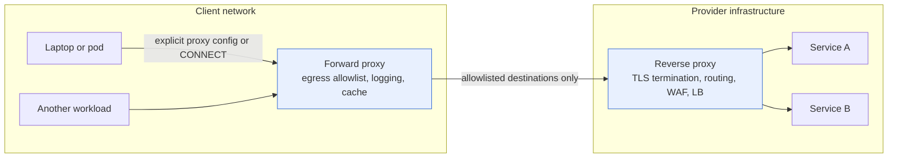
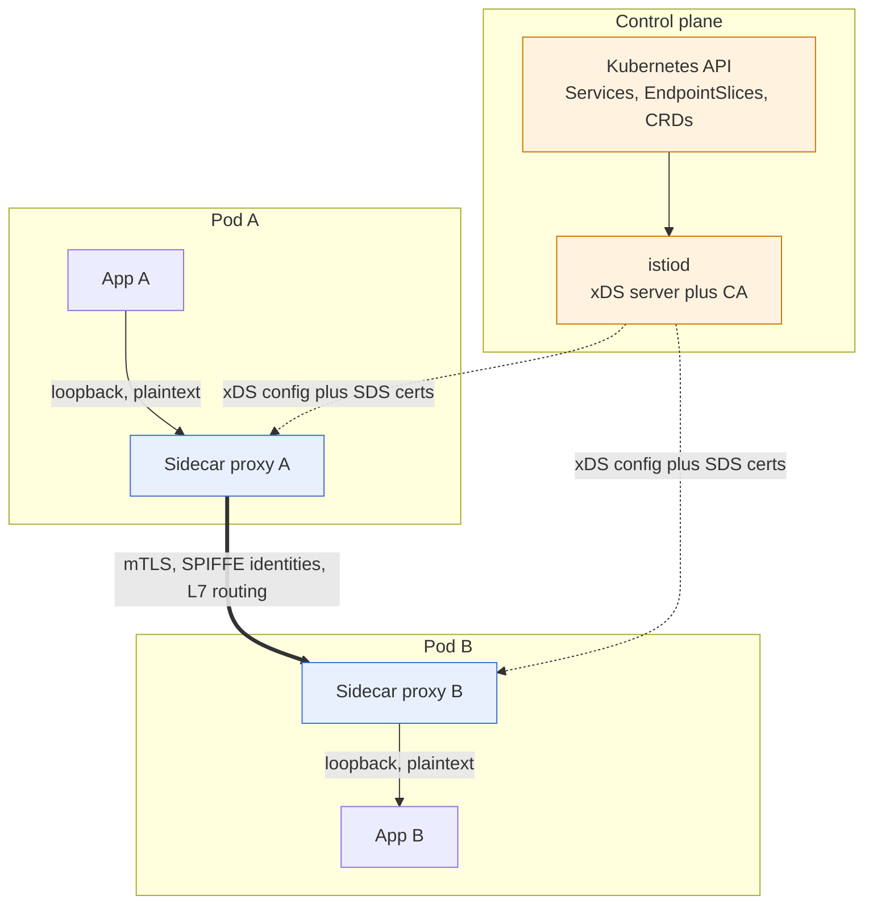
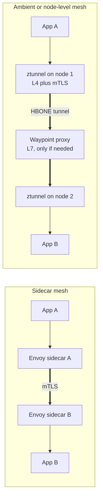
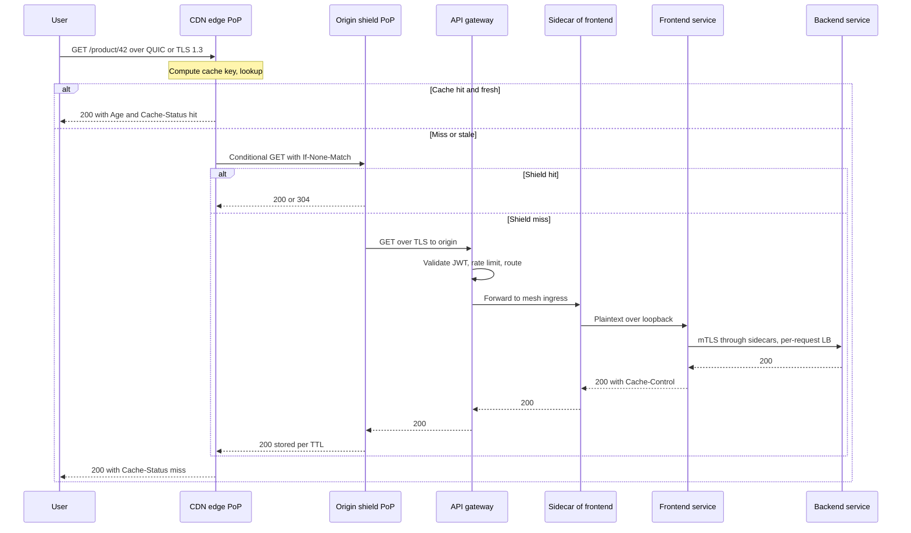

# Chapter 10 — Proxies, Reverse Proxies, Service Mesh, and CDNs

**What this chapter covers.** Almost nothing in a modern backend talks directly to anything
else. Between a browser and your handler there is a CDN edge, an anycast load balancer, a TLS
terminator, an API gateway, an ingress proxy, and — if you run a mesh — a sidecar on each end of
every internal hop. Each of these is a *proxy*: a process that terminates one connection, makes
a policy decision, and originates another. This chapter is about that layer. We start with the
taxonomy that people routinely muddle — forward proxies (client-side egress control) versus
reverse proxies (server-side ingress) — and then treat the reverse proxy as what it has become:
the universal front door where TLS termination (Chapter 6), HTTP routing (Chapter 7), load
balancing (Chapter 9), buffering, timeouts, and observability are implemented once instead of a
hundred times. We go deep on Envoy, because its listener/filter/cluster model and its xDS
dynamic-configuration APIs are the reason the service mesh became buildable at all. Then the
main event: the service mesh — the problem it solves (mTLS, retries, timeouts, load balancing,
and telemetry re-implemented inconsistently in every language's client library), the mechanism
(a sidecar data plane, transparent interception, a control plane pushing xDS), what it buys you,
and — honestly — what it costs, including the sidecar-less designs (Istio ambient, Cilium's eBPF
data plane) built to reduce that cost. Finally, CDNs: PoPs and anycast (Chapter 2), cache
hierarchies and origin shielding, cache keys and `Cache-Control` semantics (Chapter 7), purging,
edge compute, and TLS/QUIC termination at the edge (Chapters 4 and 6).

Learning goals — after this chapter you should be able to:

- Distinguish forward from reverse proxying precisely, and explain what each buys operationally
  (egress control and DLP versus ingress policy and offload).
- Configure a reverse proxy correctly for a production HTTP service: timeouts at every stage,
  buffering choices, connection reuse, client-IP preservation, and failure semantics.
- Describe Envoy's architecture — listeners, filter chains, HTTP filters, routes, clusters,
  endpoints — and explain the xDS protocol including ACK/NACK, versioning, ADS, and delta xDS.
- Explain what an API gateway adds over a plain reverse proxy, and where those concerns belong.
- Explain, mechanically, how a sidecar mesh intercepts traffic, how identity is issued and
  rotated, and how the control plane programs the data plane.
- Decide whether your organization needs a mesh, using latency, resource, and operational cost
  as inputs rather than fashion.
- Describe sidecar-less mesh designs and their trade-offs accurately and without overclaiming.
- Reason about CDN behavior: cache key composition, TTL and revalidation semantics, request
  collapsing, invalidation strategies, origin shield topology, and what edge compute is for.

## One idea, two directions

A proxy is an intermediary that terminates a connection from one party and opens a connection to
another on its behalf. That is the whole idea. Everything interesting follows from a single
question: *on whose behalf does it act, and who chose it?*

A **forward proxy** acts for the client and is configured by the client (or imposed transparently
by the network). In HTTP terms, an explicitly configured forward proxy receives requests with an
*absolute-form* request target — `GET http://example.com/api HTTP/1.1` — rather than the
origin-form path a server sees, and for TLS it receives `CONNECT example.com:443 HTTP/1.1` and
then blindly tunnels bytes. That `CONNECT` tunnel is why forward proxies see so little of
encrypted traffic: unless they perform TLS interception with a private CA installed on every
client (a "MITM proxy", used by corporate DLP stacks and by tools like mitmproxy), all they
observe is the SNI in the ClientHello, the destination address, and byte counts. Encrypted
ClientHello (ECH, Chapter 6) removes even the SNI where deployed.

Backend engineers meet forward proxies mostly as **egress control**. In a serious production
network, workloads have no default route to the internet. Outbound traffic goes through an egress
proxy or NAT gateway that enforces an allowlist of destinations, logs every connection, and
applies per-destination rate limits. The security value is containment: if an attacker achieves
code execution in a pod, an egress allowlist is the difference between quiet exfiltration and a
blocked connection with an alert (this is the network half of the supply-chain story in Book 4
and Book 7 — a compromised build step that cannot reach an arbitrary host cannot ship your
secrets to it). The operational value is dependency management: one place that knows every
external service your fleet depends on. `HTTP_PROXY`, `HTTPS_PROXY`, and `NO_PROXY` environment
variables are the lingua franca; most HTTP clients honor them, which is both convenient and a
trap — `NO_PROXY` matching semantics differ subtly between runtimes, and a service that silently
bypasses the proxy on one platform but not another produces genuinely baffling incidents.

A **reverse proxy** acts for the server and is chosen by the server operator. Clients believe
they are talking to the origin; they address `api.example.com` and the proxy answers. This
inversion is what makes the reverse proxy the natural place to put every cross-cutting concern:
it is on the path of every request, it is operated by the platform team, and it can be changed
without touching application code. TLS termination, HTTP version negotiation, routing,
authentication, rate limiting, compression, caching, request logging, and load balancing all
migrate there because that is the only place they can be done once.



The symmetry is worth internalizing: a forward proxy hides many clients behind one identity and
enforces *what may be reached*; a reverse proxy hides many servers behind one name and enforces
*what may be served*. In a mesh, one sidecar is simultaneously both.

## The reverse proxy as universal front door

Once you accept that a reverse proxy sits in front of everything, the question becomes what it
should do. The honest answer is: quite a lot, because each of these things is done badly when
scattered across services.

**TLS termination and origination.** The proxy holds the certificates, negotiates TLS 1.3,
selects ALPN (`h2`, `http/1.1`, and for QUIC `h3`), and pins the cipher policy fleet-wide.
Rotating a certificate or disabling a protocol version becomes a config change instead of a
fleet-wide redeploy. The proxy may then re-encrypt to the backend (mTLS in a mesh) or speak
cleartext inside a trusted segment — decide that explicitly, not by accident.

**Protocol translation.** Clients speak HTTP/2 or HTTP/3 to the edge; backends often speak
HTTP/1.1. The proxy demultiplexes streams into separate upstream requests, which is what makes
HTTP/2's connection pinning problem tractable (Chapters 7 and 9). A well-configured proxy also
maintains long-lived keepalive pools upstream, sparing backends the connection churn that would
otherwise arrive from the internet.

**Routing.** Host, path, header, method, query, and weight-based matching. This is where a
monolith gets carved up: `/checkout/*` goes to the new service while everything else keeps hitting
the legacy app, and neither client nor legacy app knows.

**Buffering and flow control.** Whether the proxy buffers a request body before contacting the
upstream is one of the most consequential and least-understood settings on the box. Buffering
protects slow backends from slow clients — the classic slowloris defense — by absorbing a
trickled request and delivering it upstream in one burst, freeing an application worker that
would otherwise sit blocked. It also breaks streaming uploads and adds latency and memory
pressure. NGINX buffers request bodies by default (`proxy_request_buffering on`); Envoy streams
by default, which is right for gRPC and long-lived streams but leaves slow-client defense to
timeouts and connection limits.

**Timeouts.** A reverse proxy has at least four independent clocks: connect timeout to upstream,
time to receive request headers from the client, time waiting for the upstream response, and an
overall route timeout. Getting these wrong is a leading cause of resource exhaustion; getting
them right is Chapter 11's material, but the proxy is where most of them are configured.

**Header manipulation and client-IP preservation.** The moment you add a proxy, `REMOTE_ADDR` at
the application is the proxy's address. `X-Forwarded-For` is the de facto convention, `Forwarded`
(RFC 7239) the standardized one, and both are *client-controlled* unless the proxy overwrites
rather than appends them at the trust boundary. Get this wrong and your rate limiter and audit
log become forgeable by anyone who sets a header. For L4 proxies that cannot rewrite HTTP, the
PROXY protocol (v1 text, v2 binary) prepends the original source address to the TCP stream —
supported by NGINX, Envoy, HAProxy, and every major cloud NLB.

**Compression, caching, and observability.** Content-encoding negotiation, a local response cache,
and a uniform access log carrying latency, upstream selection, retry counts, and failure reason
codes. That last item matters more than people expect: a proxy's structured access log is often
the highest-fidelity telemetry in the system, because it sees every request — including the ones
that never reached an application.

### The field

| Proxy | Config model | Strengths | Notable limits |
|---|---|---|---|
| NGINX | Static file, reload on change | Ubiquitous, fast, excellent static/file serving, huge module ecosystem | Dynamic upstream reconfiguration API is a commercial feature; no native xDS |
| HAProxy | Static file plus Runtime API | Outstanding L4 and L7 balancing, deep health checking, mature observability | Configuration language is idiosyncratic; less extensible in-process |
| Envoy | Static bootstrap plus xDS | Fully dynamic config, rich L7 filter chain, first-class gRPC and observability | Heavier memory and CPU footprint; configuration surface is large |
| Caddy | Caddyfile or JSON API | Automatic HTTPS via ACME, simple defaults | Smaller ecosystem for exotic L7 needs |
| Traefik | Dynamic providers from Kubernetes, Docker labels, files | Auto-discovery in container platforms | Fewer low-level knobs than Envoy or HAProxy |

A concrete NGINX front door, with every timeout named:

```nginx
upstream checkout {
    zone checkout 64k;
    least_conn;
    keepalive 64;
    server 10.0.3.11:8080 max_fails=3 fail_timeout=10s;
    server 10.0.3.12:8080 max_fails=3 fail_timeout=10s;
}

server {
    listen 443 ssl;
    http2 on;
    server_name api.example.com;

    ssl_certificate     /etc/ssl/api.example.com.crt;
    ssl_certificate_key /etc/ssl/api.example.com.key;
    ssl_protocols       TLSv1.2 TLSv1.3;

    client_header_timeout 5s;
    client_body_timeout   10s;

    location /checkout/ {
        proxy_pass         http://checkout;
        proxy_http_version 1.1;
        proxy_set_header   Connection "";          # enable upstream keepalive
        proxy_set_header   Host $host;
        proxy_set_header   X-Forwarded-For $proxy_add_x_forwarded_for;
        proxy_set_header   X-Forwarded-Proto $scheme;

        proxy_connect_timeout 2s;
        proxy_send_timeout    10s;
        proxy_read_timeout    10s;

        proxy_next_upstream   error timeout http_502 http_503;
        proxy_next_upstream_tries 2;
        proxy_request_buffering off;               # stream uploads through
    }
}
```

Two details deserve emphasis. `proxy_set_header Connection ""` is required for upstream keepalive
to work at all with HTTP/1.1, because NGINX otherwise forwards `Connection: close`. And
`proxy_next_upstream` is a *retry* policy hiding in plain sight — retrying `http_503` on a
non-idempotent POST is a duplicate-order bug waiting to happen (Chapter 11). The HAProxy
equivalent, showing its health-check model:

```haproxy
defaults
    mode http
    timeout connect 2s
    timeout client  30s
    timeout server  30s
    option httplog
    option redispatch
    retries 2

frontend fe_api
    bind :443 ssl crt /etc/haproxy/certs/api.pem alpn h2,http/1.1
    http-request set-header X-Forwarded-Proto https
    http-request del-header X-Forwarded-For        # drop client-supplied value
    option forwardfor                              # then set it ourselves
    acl is_checkout path_beg /checkout/
    use_backend be_checkout if is_checkout
    default_backend be_web

backend be_checkout
    balance leastconn
    option httpchk GET /healthz
    http-check expect status 200
    server c1 10.0.3.11:8080 check inter 2s fall 3 rise 2 maxconn 200
    server c2 10.0.3.12:8080 check inter 2s fall 3 rise 2 maxconn 200
```

The `del-header` followed by `option forwardfor` is the trust-boundary pattern: destroy whatever
the client claimed, then assert the truth.

## Envoy in depth: the programmable proxy

Envoy, originally built at Lyft and open-sourced in 2016 (a CNCF graduated project since 2018),
matters here for two reasons: its configuration model is a clean decomposition of what a proxy
actually does, and it was designed from the start to be configured by a remote control plane
rather than by a file. The second point is the load-bearing one — without it there is no mesh.

### The object model

- **Listener** — a bound address and port plus a chain of **network filters**.
- **Filter chain** — an ordered list of L4 filters selected by a *filter chain match* (SNI,
  transport protocol, source/destination IP, ALPN), terminating in something that either proxies
  bytes (`tcp_proxy`) or parses HTTP (`http_connection_manager`, universally "HCM").
- **HTTP filters** — inside HCM, an ordered chain of L7 filters: JWT authentication, external
  authorization, rate limiting, CORS, fault injection, compression, WASM or Lua extensions, and
  finally the terminal `router` filter. Ordering is semantic; the router must be last.
- **Route configuration** — virtual hosts matched by `:authority`, each with routes matched by
  path/header/query, each naming a cluster (or a weighted set), a timeout, a retry policy, header
  mutations, and hedging.
- **Cluster** — a logical upstream: a discovery type (STATIC, STRICT_DNS, LOGICAL_DNS, EDS,
  ORIGINAL_DST), a load-balancing policy, circuit-breaker thresholds, outlier detection, health
  checks, and a transport socket for upstream TLS.
- **Endpoints** — a cluster's host:port members with locality, weight, and health status. In a
  mesh these arrive by EDS and change constantly.

A static bootstrap that terminates TLS, routes, and gets its endpoints dynamically:

```yaml
node:
  id: edge-proxy-1
  cluster: edge

static_resources:
  listeners:
  - name: ingress_https
    address:
      socket_address: { address: 0.0.0.0, port_value: 8443 }
    filter_chains:
    - transport_socket:
        name: envoy.transport_sockets.tls
        typed_config:
          "@type": type.googleapis.com/envoy.extensions.transport_sockets.tls.v3.DownstreamTlsContext
          common_tls_context:
            alpn_protocols: ["h2", "http/1.1"]
            tls_certificates:
            - certificate_chain: { filename: "/etc/envoy/certs/api.crt" }
              private_key:       { filename: "/etc/envoy/certs/api.key" }
      filters:
      - name: envoy.filters.network.http_connection_manager
        typed_config:
          "@type": type.googleapis.com/envoy.extensions.filters.network.http_connection_manager.v3.HttpConnectionManager
          stat_prefix: ingress_http
          use_remote_address: true
          xff_num_trusted_hops: 1
          request_timeout: 15s
          route_config:
            name: local_route
            virtual_hosts:
            - name: api
              domains: ["api.example.com"]
              routes:
              - match: { prefix: "/checkout/" }
                route:
                  cluster: checkout
                  timeout: 10s
                  retry_policy:
                    retry_on: "5xx,reset,connect-failure"
                    num_retries: 2
                    per_try_timeout: 3s
          http_filters:
          - name: envoy.filters.http.router
            typed_config:
              "@type": type.googleapis.com/envoy.extensions.filters.http.router.v3.Router

  clusters:
  - name: checkout
    connect_timeout: 2s
    lb_policy: LEAST_REQUEST
    type: EDS
    eds_cluster_config:
      eds_config:
        resource_api_version: V3
        api_config_source:
          api_type: GRPC
          transport_api_version: V3
          grpc_services:
          - envoy_grpc: { cluster_name: xds_cluster }
    circuit_breakers:
      thresholds:
      - priority: DEFAULT
        max_connections: 1024
        max_pending_requests: 128
        max_requests: 1024
        max_retries: 32
    outlier_detection:
      consecutive_5xx: 5
      interval: 10s
      base_ejection_time: 30s
      max_ejection_percent: 50

  - name: xds_cluster
    connect_timeout: 1s
    type: STRICT_DNS
    typed_extension_protocol_options:
      envoy.extensions.upstreams.http.v3.HttpProtocolOptions:
        "@type": type.googleapis.com/envoy.extensions.upstreams.http.v3.HttpProtocolOptions
        explicit_http_config:
          http2_protocol_options: {}
    load_assignment:
      cluster_name: xds_cluster
      endpoints:
      - lb_endpoints:
        - endpoint:
            address:
              socket_address: { address: control-plane.mesh.svc, port_value: 15010 }

admin:
  address:
    socket_address: { address: 127.0.0.1, port_value: 15000 }
```

Note `use_remote_address: true` with `xff_num_trusted_hops: 1`: this tells Envoy how many
trusted proxies sit in front of it so it can compute the real client address correctly rather than
trusting an arbitrary XFF chain.

### xDS: configuration as an eventually-consistent subscription

The x Discovery Service protocol is a family of gRPC (or REST-polling) APIs by which a control
plane streams configuration to a proxy. Each resource type has its own service:

| API | Resource | Answers the question |
|---|---|---|
| LDS | Listener | What should I listen on, with which filter chains? |
| RDS | RouteConfiguration | For this HCM, how do I map requests to clusters? |
| CDS | Cluster | What upstream services exist and how do I talk to them? |
| EDS | ClusterLoadAssignment | Which endpoints are in this cluster right now? |
| SDS | Secret | What certificates and trust bundles should I use? |
| Others | VHDS, SRDS, ECDS, RTDS | On-demand virtual hosts, scoped routes, extension configs, runtime flags |

Mechanically, the proxy opens a bidirectional gRPC stream and sends a `DiscoveryRequest` naming a
type URL (for example `type.googleapis.com/envoy.config.cluster.v3.Cluster`), the resource names
it wants (empty means "all", a wildcard subscription), and the last `version_info` and
`response_nonce` it accepted. The server replies with a `DiscoveryResponse` containing a
`version_info`, a `nonce`, and the resources. The proxy then **ACKs** by sending a new request
echoing that version and nonce, or **NACKs** by echoing the *previous* good version along with an
`error_detail`. This is the single most useful fact about xDS for debugging: a proxy that rejects
bad config keeps running the last good config, and the rejection shows up as a NACK on the control
plane, not as an outage — but also not as a visible change, which is why "I pushed the config and
nothing happened" is nearly always a NACK you have not looked for.

Two refinements matter in practice. **ADS (Aggregated Discovery Service)** multiplexes all
resource types onto one stream to one management server, which is the only way to get ordering
guarantees: because Envoy will not accept a route referencing an unknown cluster, or a cluster
whose endpoints have not arrived, updates must be sequenced (make-before-break: CDS then EDS then
LDS then RDS on the way in, reverse on the way out). Separate streams to separate servers cannot
provide that. **Delta (incremental) xDS** sends only changed resources and explicit removals
rather than the full state of the world on every update. For a mesh with tens of thousands of
endpoints churning constantly, state-of-the-world pushes are the dominant cost on both control
plane CPU and proxy CPU; delta is what keeps large meshes affordable.

This is why xDS made the mesh possible. Every prior generation of proxy needed a config file and
a reload to learn that an endpoint appeared or vanished; in a cluster where pods churn
continuously, a reload-based proxy is either always stale or always reloading. xDS turns
configuration into a *subscription to a stream of changes* — the correct model for an environment
whose topology is itself a stream of changes. It is also deliberately a universal API: gRPC
clients implement xDS directly, giving client-side balancing with no proxy at all (Chapter 9).

One runtime note. Envoy uses a small number of worker threads, each running an independent event
loop over its own connection set; configuration updates reach workers without locking the data
path, and listeners drain gracefully. This share-nothing design is why Envoy scales with cores —
and why its per-instance memory is dominated by the *size of its configuration*. A sidecar told
about every service in the cluster costs far more than one scoped to what its application
actually calls, which is why config scoping (Istio's `Sidecar` resource, ambient's waypoint
model) is among the most effective mesh optimizations available.

## API gateways: a reverse proxy with product concerns

An API gateway is a reverse proxy, plus a set of concerns that are about the *API as a product*
rather than about transport. The distinction is fuzzy by design — most gateways are Envoy or NGINX
underneath — but the concerns are real:

- **Authentication and authorization at the edge.** Validating JWTs against a JWKS endpoint,
  introspecting opaque tokens, verifying mTLS client certs, mapping API keys to consumers.
  Terminating authentication here means backends can trust a verified identity header — provided
  the gateway strips any client-supplied version of that header.
- **Rate limiting and quotas.** Per-consumer, per-plan, per-route limits, usually enforced against
  a shared counter service so limits are global rather than per-proxy-instance. Envoy's design is
  instructive: the local rate limit filter is fast and per-instance; the global one calls an
  external service over gRPC per request, trading latency for correctness.
- **Transformation and aggregation.** Rewriting between external and internal schemas, protocol
  bridging (JSON/HTTP to gRPC transcoding), and fan-out aggregation for clients that cannot make
  five round trips. Aggregation at the gateway slides easily into business logic in the proxy;
  keep it mechanical and prefer a backend-for-frontend service once the logic grows.
- **Lifecycle concerns**: API versioning, deprecation headers, developer portals, usage metering.

Authorization policy, token formats, and least privilege connect to Volume 7's identity material
and Volume 8's governance material; the gateway is the enforcement point, not the policy source.
Below, Envoy validates JWTs and calls an external authorizer, as HTTP filters ahead of the router:

```yaml
http_filters:
- name: envoy.filters.http.jwt_authn
  typed_config:
    "@type": type.googleapis.com/envoy.extensions.filters.http.jwt_authn.v3.JwtAuthentication
    providers:
      idp:
        issuer: https://idp.example.com/
        audiences: ["api.example.com"]
        remote_jwks:
          http_uri:
            uri: https://idp.example.com/.well-known/jwks.json
            cluster: idp_jwks
            timeout: 3s
          cache_duration: 600s
        forward_payload_header: x-jwt-claims
    rules:
    - match: { prefix: "/public/" }          # no requirement
    - match: { prefix: "/" }
      requires: { provider_name: idp }
- name: envoy.filters.http.ext_authz
  typed_config:
    "@type": type.googleapis.com/envoy.extensions.filters.http.ext_authz.v3.ExtAuthz
    transport_api_version: V3
    grpc_service:
      envoy_grpc: { cluster_name: authz }
      timeout: 0.2s
    failure_mode_allow: false
- name: envoy.filters.http.router
  typed_config:
    "@type": type.googleapis.com/envoy.extensions.filters.http.router.v3.Router
```

`failure_mode_allow` is the fail-open/fail-closed switch, and a genuine architectural decision:
fail-closed makes an authorizer outage a total outage; fail-open makes it an authorization bypass.
For most systems the answer is fail-closed with an aggressively cached decision layer — but say it
out loud in a design review rather than letting a default decide.

The industry is converging on the Kubernetes **Gateway API** (`gateway.networking.k8s.io`) as the
portable expression of this layer — `GatewayClass`, `Gateway`, `HTTPRoute`, `GRPCRoute` — with
implementations including Envoy Gateway, Istio, Contour, NGINX, and cloud load balancers. It
replaces the underspecified `Ingress` resource and its annotation sprawl, and its role-oriented
split matches how platform teams actually divide responsibility.

## The service mesh: the problem before the solution

Consider what a *correct* service-to-service call requires in a large fleet. It must discover
healthy instances and balance across them per request, not per connection. It must apply a
deadline and propagate it. It must retry idempotent failures with jittered backoff and a retry
budget, and must not retry anything else. It must shed load when the upstream is saturated and
eject hosts that are failing. It must authenticate both ends cryptographically and authorize the
call. It must emit request-rate, error-rate, and latency-distribution metrics with consistent
labels, and propagate trace context.

Now consider the pre-mesh way to get all that: a client library. Twitter's Finagle, Netflix's
Ribbon/Hystrix/Eureka stack, and Google's internal Stubby all did exactly this, and did it well —
in one language. The moment your fleet has Java, Go, Python, Node, and Rust services, you need
five implementations that agree on retry semantics, load-balancing behavior, metric names, header
formats, and certificate handling. They will not agree. Worse, changing any of them — tightening
a default timeout, fixing a retry-storm bug, rotating a trust anchor — requires every team to
upgrade a dependency and redeploy, which in a fleet of hundreds of services is a quarter-long
migration you will run repeatedly. The cross-cutting concern is not the hard part; the *uniform,
independently-upgradable rollout* of the cross-cutting concern is the hard part.

The mesh's proposition is: move that logic out of the process and into a proxy that sits beside
it, and control all such proxies from one place. The application then makes a plain, naive HTTP or
gRPC call to a service name, and the proxy on the way out does the discovery, balancing, retrying,
encrypting, and measuring.

## Data plane and control plane

The **data plane** is the set of proxies on the request path. In the classic design there is one
per workload instance — a *sidecar* container in the same pod, sharing the pod's network namespace
and therefore its loopback interface and IP. The sidecar is normally Envoy (Istio, Consul, most
commercial meshes) or a purpose-built proxy (Linkerd's `linkerd2-proxy`, written in Rust and
deliberately minimal — it does not aim for Envoy's extensibility, which is precisely how it stays
small and fast).

Interception is the mechanical crux. The application is not modified and does not know the proxy
exists, so its traffic must be redirected. Istio's default approach installs iptables rules in the
pod's network namespace at startup, either from an init container with `NET_ADMIN` or, preferably,
from a node-level CNI plugin that avoids granting that capability to every workload. Abridged, the
`nat` table looks like this:

```text
# Inbound: everything arriving at the pod goes to the sidecar's inbound port
-A PREROUTING  -p tcp -j ISTIO_INBOUND
-A ISTIO_INBOUND -p tcp --dport 15008 -j RETURN     # HBONE / tunnel port
-A ISTIO_INBOUND -p tcp --dport 15020 -j RETURN     # agent, merged metrics
-A ISTIO_INBOUND -p tcp --dport 15021 -j RETURN     # health probes
-A ISTIO_INBOUND -p tcp -j ISTIO_IN_REDIRECT
-A ISTIO_IN_REDIRECT -p tcp -j REDIRECT --to-ports 15006

# Outbound: everything the app sends goes to the sidecar's outbound port
-A OUTPUT -p tcp -j ISTIO_OUTPUT
-A ISTIO_OUTPUT -m owner --uid-owner 1337 -j RETURN # traffic from the proxy itself
-A ISTIO_OUTPUT -d 127.0.0.1/32 -j RETURN           # loopback stays local
-A ISTIO_OUTPUT -j ISTIO_REDIRECT
-A ISTIO_REDIRECT -p tcp -j REDIRECT --to-ports 15001
```

The `--uid-owner 1337` exclusion is what prevents an infinite redirect loop: the proxy runs as
that UID, so its own outbound connections are not re-captured. `REDIRECT` rewrites the destination
to the local port while the kernel preserves the original destination, retrievable via
`SO_ORIGINAL_DST` — that is how Envoy's `ORIGINAL_DST` listener knows where the application was
actually trying to go, and can therefore apply the right route and cluster.

The **control plane** computes configuration and pushes it via xDS. In Istio this is `istiod`, a
single binary that absorbed the older Pilot/Citadel/Galley split. It watches the Kubernetes API
(Services, EndpointSlices, Pods) plus Istio's own CRDs, translates that model into Envoy listeners,
routes, clusters, and endpoints, and streams it to every sidecar over ADS. It is also the
certificate authority: workloads request certificates over the SDS API on the same channel, and
the agent alongside each proxy handles key generation and rotation without ever writing a private
key to disk. Linkerd's control plane is architecturally similar in intent (a destination service, an
identity service, and a policy controller) while pushing a much smaller configuration surface to a
much smaller proxy.



The dotted lines are the control path and the doubled line is the data path — and the separation is
the whole point. A control-plane outage stops *changes* from propagating; it does not, in a
correctly designed mesh, stop traffic, because each proxy keeps serving its last known-good
configuration. Verify that property in your own mesh with a game day rather than assuming it.

## What the mesh actually gives you

### Identity and mutual TLS

This is the strongest single argument for a mesh. Each workload receives a short-lived X.509
certificate whose SAN is a **SPIFFE ID** URI — for example
`spiffe://cluster.local/ns/payments/sa/checkout` — derived from its Kubernetes namespace and
service account. This is a *workload* identity, not a network identity: it does not depend on IP
addresses, which are ephemeral and reassigned, and it survives rescheduling. The SPIFFE
specification defines the ID format and the X.509-SVID document; SPIRE is the reference issuing
implementation, and Istio's built-in CA issues SPIFFE-compatible SVIDs directly. Book 5, Chapter 4
covers the identity and attestation model in depth; the relevant point here is that certificates
are issued automatically on workload startup, are short-lived (Istio's default workload
certificate lifetime is on the order of a day, rotated well before expiry), and are delivered over
SDS into proxy memory rather than mounted as secrets.

With that in place, mTLS between every pair of workloads is a policy toggle rather than a project,
and authorization becomes identity-based rather than IP-based:

```yaml
apiVersion: security.istio.io/v1
kind: PeerAuthentication
metadata:
  name: default
  namespace: payments
spec:
  mtls:
    mode: STRICT          # reject plaintext; PERMISSIVE accepts both during migration
---
apiVersion: security.istio.io/v1
kind: AuthorizationPolicy
metadata:
  name: checkout-callers
  namespace: payments
spec:
  selector:
    matchLabels: { app: checkout }
  action: ALLOW
  rules:
  - from:
    - source:
        principals: ["cluster.local/ns/storefront/sa/web"]
    to:
    - operation:
        methods: ["POST"]
        paths: ["/v1/checkout"]
```

`PERMISSIVE` mode is the migration mechanism and deserves respect: it lets a service accept both
plaintext and mTLS while callers are converted, and forgetting to move to `STRICT` afterwards is
the most common way organizations end up with a mesh that provides *encryption in principle* and
plaintext in practice. Audit it.

### Traffic management

Per-request L7 load balancing (Chapter 9) comes free, including the fix for HTTP/2 and gRPC
connection pinning, since the sidecar balances individual streams across endpoints. Retries,
timeouts, and outlier-detection-based circuit breaking (Chapter 11) become declarative. Traffic
splitting enables canary and blue/green releases without a deployment-tool-specific hack
(Volume 11):

```yaml
apiVersion: networking.istio.io/v1
kind: VirtualService
metadata:
  name: checkout
spec:
  hosts: ["checkout.payments.svc.cluster.local"]
  http:
  - match:
    - headers:
        x-canary: { exact: "true" }
    route:
    - destination: { host: checkout, subset: v2 }
  - route:
    - destination: { host: checkout, subset: v1 }
      weight: 95
    - destination: { host: checkout, subset: v2 }
      weight: 5
    timeout: 3s
    retries:
      attempts: 2
      perTryTimeout: 1s
      retryOn: connect-failure,refused-stream,unavailable
---
apiVersion: networking.istio.io/v1
kind: DestinationRule
metadata:
  name: checkout
spec:
  host: checkout
  trafficPolicy:
    connectionPool:
      http: { http2MaxRequests: 1000, maxRequestsPerConnection: 0 }
    outlierDetection:
      consecutive5xxErrors: 5
      interval: 10s
      baseEjectionTime: 30s
      maxEjectionPercent: 50
  subsets:
  - name: v1
    labels: { version: v1 }
  - name: v2
    labels: { version: v2 }
```

Note the header-based override *before* the weighted split: that ordering gives you deterministic
canary testing (send `x-canary: true` and always hit v2) alongside probabilistic rollout. The
Gateway API's GAMMA initiative is standardizing an equivalent expression of east-west routing, so
expect this to become portable across meshes.

### Telemetry

Every sidecar emits the same metrics with the same labels for every service, regardless of
language: request count, error count by response code, request duration histograms, TCP bytes,
and connection counts, all dimensioned by source and destination workload, namespace, and service.
That uniformity is worth more than any individual metric, because it makes fleet-wide SLO
dashboards and a service dependency graph derivable rather than hand-built (Volume 11). One
critical caveat, stated plainly because it is routinely misunderstood: **a mesh cannot give you
distributed tracing for free.** The sidecar can generate and forward spans, but it cannot know
that inbound request X caused outbound request Y unless the application copies the trace context
headers (`traceparent`, or the B3 family) from the request it is handling to the requests it
makes. Without in-process propagation you get disconnected single-hop spans, not traces.

## The costs, honestly

**Latency.** Every meshed call traverses two extra proxies — the caller's sidecar and the
callee's. Each hop adds a kernel-crossing pair, a userspace parse and policy evaluation, and TLS
processing. Vendor benchmarks generally report per-hop overhead in the sub-millisecond to
low-single-digit-millisecond range at moderate load, and both Istio and Linkerd publish their
methodology; treat every published number as approximate and specific to a version and workload,
and measure your own. What is not approximate is the structure: the tax is per hop, so a
call graph seven services deep pays it fourteen times, and it lands hardest on services whose own
p50 is a few hundred microseconds. Meshing a chatty, ultra-low-latency internal path is where
meshes disappoint people.

**Resources.** A sidecar's memory is dominated by its configuration — the number of clusters,
routes, and endpoints it knows about — and its CPU scales with request rate and TLS work. In a
cluster with thousands of pods and no scoping, every sidecar holding config for every service is a
real, avoidable expense. Istio's `Sidecar` resource, which restricts a workload's config to a
declared set of dependencies, routinely produces large reductions; so does turning on delta xDS.
Multiply the residual per-pod cost by pod count before you sign off.

**Operational complexity.** The mesh is a distributed system you now operate in addition to your
own. Version skew between control plane and data plane must be managed (both Istio and Linkerd
publish supported skew windows and canary-upgrade procedures). Certificate expiry in the mesh CA
is a fleet-wide outage class that did not previously exist. And container lifecycle interacts
badly with sidecars in ways that generated years of workarounds: an application container that
starts before the sidecar is ready sees connection failures, and a `Job` whose sidecar never exits
never completes. Kubernetes' native sidecar support — init containers with `restartPolicy: Always`,
which start before and terminate after regular containers — addresses this properly; it went beta
and on by default in Kubernetes 1.29 and has since stabilized, and meshes have adopted it. If you
are on older versions you are living with the workarounds (`holdApplicationUntilProxyStarts`,
lifecycle-hook shutdown hacks).

**Debuggability.** A mesh inserts hops that engineers cannot see with the tools they know. A
`503` may originate at the application, at the callee sidecar, or at the caller sidecar, and only
the proxy's response flags distinguish them: `UF` upstream connection failure, `UO` upstream
overflow (circuit breaker tripped), `NR` no route configured, `URX` retry limit exceeded, `UAEX`
external authorization denied. Teach these to your on-call engineers, and make the following
commands muscle memory:

```bash
# Which proxies are in sync with the control plane?
istioctl proxy-status

# What does this specific proxy actually believe about routes and endpoints?
istioctl proxy-config routes    deploy/checkout.payments -o json
istioctl proxy-config endpoints deploy/checkout.payments --cluster \
  "outbound|8080|v2|inventory.catalog.svc.cluster.local"

# Straight from the proxy's admin interface
kubectl exec deploy/checkout -c istio-proxy -- \
  curl -s localhost:15000/clusters | grep health_flags
kubectl exec deploy/checkout -c istio-proxy -- \
  curl -s localhost:15000/config_dump > dump.json
```

**So do you need one?** A defensible decision rule: you probably want a mesh when you have enough
services that per-language libraries have become a coordination problem (say, dozens of services
across three or more languages), when you have a hard requirement for encryption in transit and
identity-based authorization between internal workloads (regulatory or zero-trust mandates), and
when you have a platform team that can own it as a product. You probably do not want one when you
have a handful of services in one language — a good library, or gRPC's built-in xDS support, gets
you most of the value at a fraction of the cost — or when your latency budget cannot absorb two
extra hops, or when nobody is funded to operate it. "We might need it later" is not a reason;
adopting a mesh incrementally (start with mTLS and telemetry in one namespace; add traffic
policy later) is entirely possible and is the right sequencing when you do adopt.

## Sidecar-less designs: ambient and eBPF

The sidecar tax — one proxy per pod, its memory, its CPU, its lifecycle coupling — motivated a
generation of designs that keep the mesh's guarantees while moving the proxy out of the pod.
This area is evolving; the descriptions below reflect the architecture as documented by the
projects, and specific performance claims should be verified against current releases.

**Istio ambient mode** splits the data plane into two layers. A per-node `ztunnel` (a Rust proxy
running as a DaemonSet) handles the L4 layer for all pods on that node: it holds each local
workload's identity, establishes mutual TLS, and carries traffic inside **HBONE** — an
HTTP/2 `CONNECT` tunnel over TLS on port 15008 — to the ztunnel on the destination node. Because
ztunnel handles only L4 and mTLS, it is far smaller than an Envoy sidecar and shared across the
node. Workloads that need L7 features — HTTP routing, header-based canaries, per-request
authorization policy, retries — are additionally routed through a **waypoint proxy**, a real Envoy
deployed per namespace or per service and configured via the Gateway API with an
`istio-waypoint` gateway class. The trade is explicit: you pay for L7 only where you use it, at
the cost of an extra network hop through the waypoint when you do. Ambient mode was declared
production-ready in Istio 1.24 (late 2024) and continues to evolve.

**Cilium** approaches it from the kernel. Its dataplane is eBPF programs attached at the socket,
tc, and XDP layers, which lets it implement service load balancing, network policy, and
observability without iptables and — for pods on the same node — without traversing the full
network stack at all (socket-level load balancing rewrites the destination at `connect()` time,
eliminating per-packet NAT). Encryption between nodes is provided transparently by WireGuard or
IPsec rather than by per-connection TLS, which is a different trust model: it secures the
node-to-node path rather than authenticating individual workloads end-to-end. Cilium's service
mesh adds a per-node Envoy for L7 features, and its mutual authentication feature integrates
SPIFFE/SPIRE identities; check current documentation for the maturity of each piece, as this has
been moving quickly.



The honest summary: sidecar-less designs move cost rather than deleting it, and they change the
failure domain. A crashing sidecar affects one pod; a crashing node-level proxy affects every pod
on that node. A sidecar upgrade is a pod restart; a node proxy upgrade touches everything
scheduled there. In exchange you get dramatically lower aggregate overhead, no per-pod lifecycle
coupling, and the ability to enroll workloads without restarting them. Both models are defensible;
choose with your blast-radius tolerance in mind.

## CDNs: pushing the work outward

A CDN is a globally distributed reverse-proxy fleet operated by someone else. The mechanism is
the same one this chapter has been describing, applied at planetary scale with caching as the
first-class concern.

### Getting to the nearest PoP

A CDN operates points of presence (PoPs) in many metros, each a cluster of proxy servers and
caches. Two mechanisms steer a client to one. **Anycast** (Chapter 2) announces the same IP prefix
from every PoP via BGP, so the internet's own routing delivers each client to a topologically near
PoP — no client logic, instant failover when a PoP withdraws its announcement, and inherent DDoS
dispersion because an attack splits across every site announcing the prefix. Its weakness is that
BGP optimizes for AS-path length, not latency, and a routing change can in principle move a client
mid-connection (a non-issue for short HTTP connections, and mitigated for QUIC by connection IDs
that survive path changes, Chapter 4). **DNS-based steering** resolves a hostname to different
addresses per client, using resolver location or ECS (EDNS Client Subnet, Chapter 5) as a hint; it
offers finer policy control at the cost of TTL-bound agility and resolver-location error. Most
large CDNs use both.

### The cache hierarchy and origin shield

Within a PoP, a request is hashed — usually with consistent hashing on the cache key — to one of
several cache servers, so each object lives on a predictable subset of machines rather than being
replicated across all of them. On a miss, the naive design fetches from origin; with hundreds of
PoPs, a cold object or a purge then produces hundreds of simultaneous origin requests for the same
resource.

Two mechanisms fix it. **Request collapsing** (Varnish's term; also called coalescing) turns
concurrent misses for the same key within one cache into a single upstream fetch, with the other
requests waiting on its result — the most important stampede defense a cache has. **Origin
shield** (Fastly's and CloudFront's term; Akamai calls the equivalent tiered distribution)
designates a PoP, usually near your origin, as a mid-tier cache that all edge PoPs fetch through,
so the origin sees at most one request per object per shield rather than one per PoP. It
substantially cuts origin load and egress for cacheable workloads, at the cost of an extra hop on
genuine misses.



### Cache keys, TTLs, and the semantics that matter

The **cache key** determines what counts as "the same object". By default it is roughly scheme +
host + path + query string, and every part of that default is a hazard. Marketing query
parameters (`utm_source` and friends) fragment the cache into thousands of identical copies unless
you strip them; a key that *omits* a parameter your origin varies on serves the wrong content to
everybody. The `Vary` response header extends the key by named request headers — `Vary:
Accept-Encoding` is correct and necessary, `Vary: User-Agent` is a cache-destroying mistake given
the cardinality of that header, and `Vary: Cookie` on a page with a per-user session cookie means
a hit rate of approximately zero. Modern CDNs let you write the key explicitly (normalize the
`Accept-Encoding` header to a small set, include a device-class variable, include a currency,
exclude everything else); do it deliberately.

Freshness is governed by HTTP caching semantics (RFC 9111, Chapter 7), and the split between
browser and CDN is what most people get wrong:

```http
HTTP/1.1 200 OK
Cache-Control: public, max-age=60, s-maxage=600, stale-while-revalidate=30, stale-if-error=86400
CDN-Cache-Control: max-age=3600
Surrogate-Key: product-42 catalog
ETag: "9f2c1a-1c7"
Vary: Accept-Encoding
```

`max-age` binds private caches (the browser); `s-maxage` overrides it for shared caches;
`CDN-Cache-Control` (a targeted cache-control field, per RFC 9213) overrides both for the CDN
specifically, letting you keep an object for an hour at the edge while telling browsers to
recheck every minute. `stale-while-revalidate` (RFC 5861) permits the cache to serve a stale copy
immediately while it refreshes asynchronously — a latency win that also decouples user-visible
latency from origin latency. `stale-if-error` permits serving stale content when the origin
returns 5xx or is unreachable, which is one of the cheapest availability improvements available to
any web system: your origin can be down and your catalog pages still render. Distinguish
`no-cache` (may store, must revalidate before reuse) from `no-store` (must not persist at all);
they are not synonyms, and using `no-store` where you meant `no-cache` throws away all
revalidation benefit. Diagnostics are increasingly standardized too: the `Cache-Status` response
header (RFC 9211) reports hit/miss and remaining TTL per cache in the chain, e.g.
`Cache-Status: ExampleCDN; hit; ttl=376`.

### Invalidation

Two hard problems in computer science, and this is one of them. Three strategies, in increasing
order of sophistication:

1. **Versioned URLs.** Put a content hash in the path (`/static/app.4f9c2a.js`) and cache
   immutably (`Cache-Control: public, max-age=31536000, immutable`). Never invalidate; publish a
   new URL. This is correct for build artifacts and should be the default for anything your
   bundler produces.
2. **Purge by URL.** Explicit, exact, and unusable at scale when one data change affects a hundred
   URLs.
3. **Purge by surrogate key / cache tag.** Tag responses with content identifiers on the way out
   and purge by tag when the underlying entity changes. A product page, the category listing that
   embeds it, and the API response that serves it all carry `product-42`; one purge invalidates
   all three:

```bash
# Fastly: purge everything tagged product-42, service-wide
curl -X POST -H "Fastly-Key: $FASTLY_API_TOKEN" \
  "https://api.fastly.com/service/$SERVICE_ID/purge/product-42"

# "Soft" purge marks objects stale rather than removing them, so
# stale-while-revalidate and stale-if-error still protect the origin
curl -X POST -H "Fastly-Key: $FASTLY_API_TOKEN" \
  -H "Fastly-Soft-Purge: 1" \
  "https://api.fastly.com/service/$SERVICE_ID/purge/product-42"
```

Soft purge deserves emphasis: hard-purging a hot object across a global fleet converts a cache hit
into a synchronized global miss — a self-inflicted stampede. Soft purge marks the object stale so
the first request triggers revalidation while everyone else is served the old copy for a moment.
Cache-tag purging is offered by most major CDNs (Fastly's `Surrogate-Key`, Cloudflare's cache tags
on higher plans, Akamai's cache tags); check availability for your plan before designing around it.

### Dynamic content, edge compute, and what the backend gets

Uncacheable responses still benefit from a CDN. Terminating TLS and TCP/QUIC at a PoP 10 ms away
instead of 150 ms away removes most of the handshake cost from the critical path: the expensive
round trips happen over the short leg, while the long leg to origin rides a pre-warmed,
congestion-window-open, persistent connection the CDN maintains. TLS 1.3 (Chapter 6) and QUIC
(Chapter 4) amplify this — 1-RTT handshakes, 0-RTT resumption for repeat visitors, and no
head-of-line blocking on lossy mobile paths. If you enable 0-RTT, understand the replay exposure:
early data can be replayed by an attacker, so it must be restricted to safe, idempotent requests
(RFC 8470 defines the HTTP handling, including the `425 Too Early` status).

**Edge compute** — Cloudflare Workers, Fastly Compute, AWS Lambda@Edge and CloudFront Functions,
Akamai EdgeWorkers — runs your code in the PoP. The good use cases are those where running at the
edge changes the network shape rather than merely relocating logic: request normalization and
cache-key rewriting, A/B bucketing and personalization that would otherwise make a page
uncacheable, token validation before a request costs an origin hop, redirects, signed-URL checks,
and response assembly from cached fragments. The bad use case is business logic that needs your
database, which lives in one region: you have moved compute away from its data.

Summarizing what the backend gets: **origin offload** (a well-tuned cache removes the large
majority of requests from origin — directly a capacity argument), **latency reduction** for cached
and uncached traffic alike, **DDoS absorption** because volumetric attacks land on anycast capacity
rather than your origin, and a natural home for **WAF and bot management**. In exchange you accept
a third party in the request path, a cache that serves wrong content if you misconfigure keys, and
the discipline of **origin locking** — if your origin stays directly reachable, attackers will find
it and bypass every edge control. Lock it with mTLS from the CDN, a shared secret header, or IP
allowlists of the CDN's published ranges.

Caches are also attack surface. **Web cache poisoning** exploits *unkeyed inputs* — a header that
influences the response but is not part of the cache key — to store an attacker-controlled
response that is then served to everyone; James Kettle's 2018 PortSwigger research popularized the
technique and it remains a live bug class. **Cache deception** works the other way: trick the
origin into treating a private response as a static asset (`/account/settings.css`) so the cache
stores it. One discipline prevents both: keys must include every input the response varies on, and
nothing whose content depends on an authenticated session may be cached unless the session is part
of the key.

## The distributed-systems lens

**The proxy layer is where the paved road is paved.** In an organization with hundreds of services
and dozens of teams, any policy you cannot enforce in shared infrastructure is a policy you have
merely recommended. Mandating TLS 1.3, a maximum request timeout, a standard access log schema,
or per-tenant rate limits by asking teams to update libraries is a multi-quarter negotiation with
a long tail of non-compliance. Implementing it in the proxy layer is a config rollout with a
canary and a rollback. This is the single most valuable property of the entire layer, and it is an
organizational property as much as a technical one.

**The mesh relocates reliability primitives from N libraries to one data plane.** Every pattern in
Chapter 11 — timeouts, budgeted retries with jitter, circuit breaking, outlier ejection, load
shedding — exists because networks fail partially. Implemented per-language, they diverge and
decay; a retry bug in one library becomes a retry storm that takes down a shared dependency, and
fixing it requires everyone to upgrade. Implemented in the data plane, semantics are uniform and
upgradable centrally. The caveat is real, though: the mesh cannot fix what it cannot see. It does
not know which of your operations are idempotent, so an incorrectly configured retry policy will
happily duplicate a payment; and it cannot propagate trace context or deadlines *through* your
application code. The mesh handles the transport; correctness at the application boundary remains
yours.

**Every proxy hop is latency and a failure domain.** Count the hops in the CDN sequence diagram
above: edge, shield, gateway, ingress, caller sidecar, callee sidecar, application. Each adds
latency (small individually, compounding across a deep call graph, and disproportionately visible
at p99 where queuing at any single hop dominates), and each is a component that can fail, be
misconfigured, exhaust a connection pool, or hold a stale certificate. Mesh control-plane outages,
sidecar bugs, and CDN configuration errors are all real incident classes with public postmortems
behind them. The correct posture is neither avoidance nor faith: measure the added latency at p99
rather than p50, design so that control-plane unavailability degrades change-propagation rather
than traffic, run game days that kill the control plane and the sidecars, and hold the layer to
the same SLO scrutiny as any service you write.

**CDNs move work to where the users are.** Every request answered at an edge PoP is a request your
origin never sees, a database query never executed, and roughly a hundred milliseconds of
round-trip time never spent. Caching is the cheapest scaling mechanism in existence when the
content model permits it — and the work of making it permit it (stable cache keys, correct
`Cache-Control`, tag-based invalidation, `stale-if-error` as an availability layer) is
application design work, not a CDN vendor's setting. Volume 12's material on operating systems at
scale and Volume 11's on observability both apply here: you cannot manage a cache you do not
measure, so treat hit ratio, `Age` distribution, origin offload percentage, and purge rate as
first-class SLIs.

## Key takeaways

- Forward proxies act for clients and enforce *what may be reached* (egress control, filtering,
  caching); reverse proxies act for servers and enforce *what may be served*. Same machinery,
  opposite direction, different threat model.
- The reverse proxy is the correct home for TLS termination, protocol translation, routing,
  compression, buffering, timeouts, client-IP normalization, and uniform access logging — because
  those are the things that must be identical everywhere.
- Destroy client-supplied `X-Forwarded-For`/`Forwarded` at the trust boundary and set them
  yourself, or your rate limiting and audit logs are forgeable.
- Envoy's model — listeners, filter chains, HTTP filters, routes, clusters, endpoints — plus xDS
  turned proxy configuration into a streaming subscription. ADS gives ordering, delta xDS gives
  scale, and NACKs mean a bad push leaves the last good config running (and silently ignored).
- A service mesh exists because cross-cutting concerns implemented in N language-specific
  libraries cannot be kept consistent or upgraded in lockstep. The sidecar plus control plane
  moves them into infrastructure.
- Automatic mTLS with SPIFFE workload identity is the mesh's strongest single benefit; per-request
  L7 balancing, declarative retries and circuit breaking, traffic splitting, and uniform golden
  signals follow. Trace *propagation* still requires application cooperation.
- The costs are per-hop latency, per-sidecar resources, operational complexity (version skew,
  CA expiry, container lifecycle), and harder debugging. Learn the proxy response flags and the
  config-inspection commands before the incident, not during it.
- Ambient and eBPF data planes reduce the sidecar tax by moving proxies to the node and paying for
  L7 only where used — trading a smaller per-pod cost for a larger per-node blast radius.
- CDNs combine anycast reach, a cache hierarchy with origin shielding, and request collapsing to
  remove most traffic from your origin. Cache keys and `Cache-Control` are application design
  decisions; `stale-while-revalidate` and `stale-if-error` are availability features.
- Prefer versioned immutable URLs, use surrogate-key (tag) purging with soft purge for the rest,
  and lock your origin so the edge cannot be bypassed.

## Further reading

- Envoy documentation — <https://www.envoyproxy.io/docs/envoy/latest/> — particularly the
  architecture overview (listeners, filters, clusters) and the xDS protocol reference at
  <https://www.envoyproxy.io/docs/envoy/latest/api-docs/xds_protocol>, which specifies ACK/NACK,
  versioning, ADS, and incremental xDS.
- Matt Klein, "Introducing Envoy" and the follow-on Lyft engineering posts — background on why
  Envoy was built as a universal, dynamically configurable data plane.
- Istio documentation — <https://istio.io/latest/docs/> — the architecture, security (identity and
  mTLS), traffic-management, and performance-and-scalability pages; and the ambient-mode
  documentation at <https://istio.io/latest/docs/ambient/> for ztunnel, HBONE, and waypoints.
- Linkerd documentation — <https://linkerd.io/2/overview/> — and the project's writing on why it
  built a purpose-specific Rust micro-proxy instead of adopting Envoy.
- SPIFFE and SPIRE — <https://spiffe.io/docs/latest/spiffe-about/overview/> — the SPIFFE ID and
  X.509-SVID specifications; see also Book 5, Chapter 4 of this suite for workload identity and
  attestation.
- Kubernetes Gateway API — <https://gateway-api.sigs.k8s.io/> — including the GAMMA initiative for
  expressing east-west (mesh) routing with the same resources.
- Cilium documentation — <https://docs.cilium.io/> — eBPF datapath, socket-level load balancing,
  transparent encryption with WireGuard or IPsec, and the service-mesh and mutual-authentication
  features.
- RFC 9110 (*HTTP Semantics*) and RFC 9111 (*HTTP Caching*) — the normative caching model;
  RFC 5861 (`stale-while-revalidate`, `stale-if-error`), RFC 9211 (`Cache-Status`), and RFC 9213
  (targeted cache-control fields such as `CDN-Cache-Control`).
- RFC 7239 — *Forwarded HTTP Extension* — the standardized alternative to `X-Forwarded-For`; and
  the PROXY protocol specification published by HAProxy Technologies for L4 client-IP preservation.
- RFC 8470 — *Using Early Data in HTTP* — the replay considerations and `425 Too Early` status for
  TLS 1.3 and QUIC 0-RTT at the edge.
- NGINX documentation (<https://nginx.org/en/docs/>) and the HAProxy configuration manual
  (<https://docs.haproxy.org/>) — authoritative references for the directives used above.
- Fastly and Cloudflare developer documentation on cache keys, surrogate keys/cache tags, soft
  purge, origin shielding, and edge compute — the clearest public writing on CDN cache mechanics.
- James Kettle, "Practical Web Cache Poisoning" (PortSwigger Research, 2018) — the definitive
  treatment of unkeyed inputs, and the companion research on web cache deception.
- Chapter 2 (anycast and BGP), Chapter 6 (TLS and PKI), Chapter 7 (HTTP semantics and caching),
  Chapter 9 (load-balancing algorithms), and Chapter 11 (timeouts, retries, hedging) of this
  volume supply the primitives this chapter assembles.
