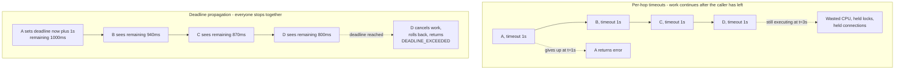
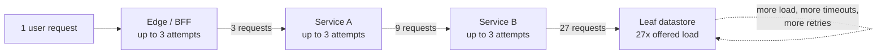
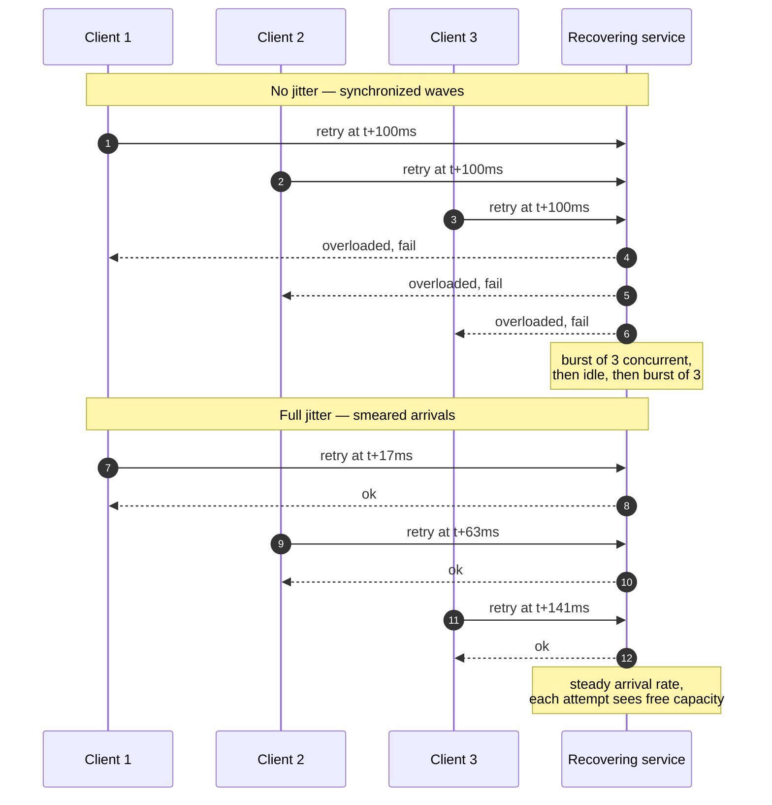
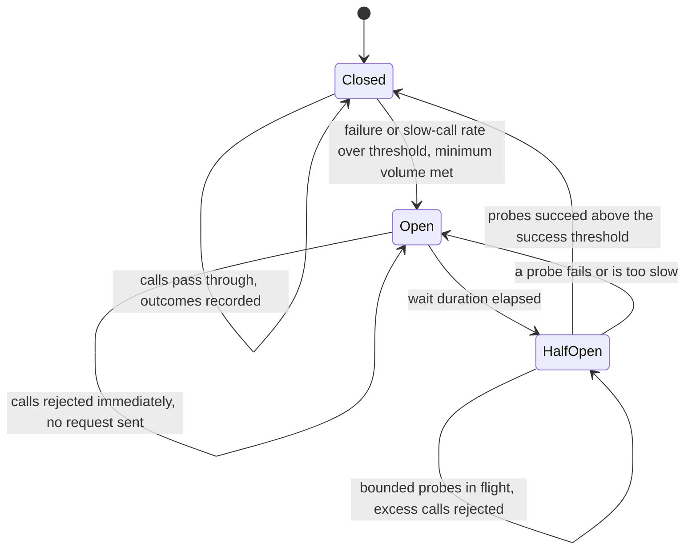
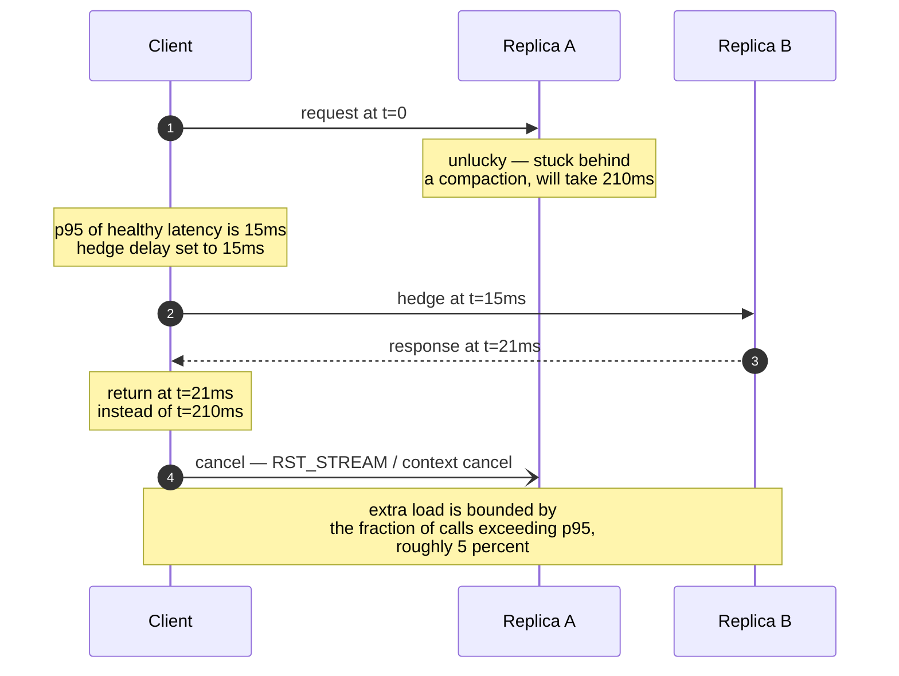

# Chapter 11 — Network Reliability: Timeouts, Retries, Backoff, and Hedging

**What this chapter covers.** Every chapter before this one built a mechanism: packets and routing,
TCP and QUIC, DNS, TLS, HTTP, gRPC, load balancers, proxies and meshes. This chapter is about what
you do when those mechanisms fail — which they do constantly, at a rate invisible in one service and
unavoidable across a fleet. The subject is the small set of policies that decide whether a partial
failure stays partial: timeouts and deadlines, retries and retry budgets, backoff and jitter, circuit
breakers, hedged requests, load shedding, and graceful degradation. These are not independent knobs.
Configured in isolation they interact catastrophically — the classic outage is a latency blip that
naive retries amplify into a fleet-wide meltdown and then keep pinned long after the trigger is gone.
Throughout we work from mechanism to real configuration for gRPC, Envoy, Go, and resilience4j, tied
to gRPC deadlines (Chapter 8), outlier detection and balancing (Chapter 9), and the mesh as the place
to implement all of it once (Chapter 10).

Learning goals — after this chapter you should be able to:

- Explain why an unbounded remote call is a resource leak, and use Little's Law to turn a timeout
  into a pool-sizing decision.
- Choose connect, TLS, per-attempt, and total timeouts from an observed latency distribution, and
  know which transport-layer timeouts you must also set.
- Implement deadline propagation, including clock-skew handling and deadline-aware queue eviction,
  and say why it dominates per-hop timeouts.
- Classify errors as retryable, non-retryable, or ambiguous, and state the idempotency precondition
  for each.
- Compute retry amplification for a call graph and design against it with budgets, a
  single-retry-layer rule, and circuit breaking.
- Implement exponential backoff with full, equal, and decorrelated jitter, and name the failure mode
  each addresses.
- Specify a circuit breaker, and distinguish it from Envoy-style concurrency limits and from outlier
  ejection.
- Decide when hedged requests are safe, size the hedge delay, and bound their cost.
- Build an admission-control path that sheds by queue delay and criticality, and assemble the set
  into one per-dependency policy.

## The fallacies, and what they actually cost

Quoting the list is easy; the useful move is converting each fallacy into the line of code it
invalidates. "The network is reliable" invalidates any call site without an error path — and, more
subtly, any error path that assumes the call *didn't happen*. "Latency is zero" invalidates any call
without a bound, because "eventually" here means "possibly never, while holding a thread". "Topology
doesn't change" invalidates cached DNS results and pinned connections (Chapters 5 and 9).

These are not rare events. In a fleet of a few hundred services doing tens of thousands of RPCs per
second, a per-call failure probability of one in ten thousand is a continuous stream of failures, all
day, forever. Reliability at the call site is not exception handling; it is the normal operating
mode.

## Timeouts: the load-bearing primitive

Everything else in this chapter depends on timeouts, so we start there.

### An unbounded call is a resource leak

Now the dependency degrades to 2 seconds: no errors, no crashes, nothing a health check notices. The
same 200 threads now sustain 100 requests per second, so from the outside your service is down — pool
fully occupied, queue growing without bound. If the call has no timeout at all and the downstream has
stopped responding entirely, the threads are gone permanently.

### The timeout ladder: connect, TLS, per-attempt, total

"A timeout" is not one thing. A single HTTP request over a fresh connection has at least these
phases, each able to hang independently:

| Phase | What hangs | Typical bound |
|---|---|---|
| DNS resolution | Resolver unreachable, UDP loss, slow recursive lookup (Ch. 5) | 1–5 s, with a resolver-level retry |
| TCP connect | SYN blackholed by a dead host or a stale NAT/firewall entry (Ch. 2, 3) | 100–500 ms in-datacenter |
| TLS handshake | Slow OCSP fetch on the server, CPU-starved peer (Ch. 6) | 200 ms – 2 s |
| Request write | Peer's receive window at zero, socket buffers full (Ch. 3) | Bounded by total |
| Response headers | Server accepted but is stuck in the handler | The interesting one |
| Response body | Slow streaming, stalled after headers | Bounded by total, or by a rate |
| Total / end-to-end | All of the above plus retries | The deadline |

Two mistakes are near universal. Setting *only* a total timeout means a host that blackholes SYNs
consumes the entire budget before you can try another. Setting *only* a per-attempt timeout means
retries multiply latency: three attempts at 1 s each is a 3-second worst case your caller never
agreed to.

A correctly configured Go HTTP client — `http.Client.Timeout` is the *total* bound including body
read; the transport-level bounds are separate:

```go
dialer := &net.Dialer{
    Timeout:   200 * time.Millisecond, // TCP connect, per address
    KeepAlive: 30 * time.Second,       // TCP keepalive probes on idle conns
}

transport := &http.Transport{
    DialContext:           dialer.DialContext,
    TLSHandshakeTimeout:   400 * time.Millisecond,
    ResponseHeaderTimeout: 800 * time.Millisecond, // server think-time bound
    ExpectContinueTimeout: 100 * time.Millisecond,
    IdleConnTimeout:       90 * time.Second,
    MaxIdleConnsPerHost:   64,  // default is 2 — always raise it
    MaxConnsPerHost:       256, // a bulkhead: bounds concurrency per dependency
    ForceAttemptHTTP2:     true,
}

client := &http.Client{
    Transport: transport,
    Timeout:   1500 * time.Millisecond, // total, including body
    CheckRedirect: func(*http.Request, []*http.Request) error {
        return http.ErrUseLastResponse // redirects silently multiply latency
    },
}
```

`MaxIdleConnsPerHost` defaulting to 2 is one of the most consequential defaults in the Go standard
library: leave it and a high-throughput client churns connections, paying TCP and TLS handshakes on
most requests (Chapter 6). `MaxConnsPerHost` doubles as a bulkhead. The server needs the mirror
image, or a slow client does to you what a slow server does to your callers:

```go
srv := &http.Server{
    Addr:              ":8080",
    ReadHeaderTimeout: 2 * time.Second,  // Slowloris defense
    ReadTimeout:       10 * time.Second,
    WriteTimeout:      10 * time.Second,
    IdleTimeout:       120 * time.Second, // must exceed LB idle timeout, see Ch. 9
    MaxHeaderBytes:    1 << 16,
}
```

The `IdleTimeout` relationship matters: if the server's is shorter than the load balancer's, the LB
occasionally hands a request to a connection the server just closed — a race that surfaces as
sporadic, unexplained 502s. Keep it longer than every proxy in front of you.

### Timeouts the application layer cannot see

An application read timeout does not help if the kernel never gives up:

```bash
# How many times Linux retransmits unacknowledged data before giving up on an
# established connection. This is a retry count, not a duration: the effective
# timeout depends on the RTO and its exponential growth.
sysctl net.ipv4.tcp_retries2   # default 15 -> roughly 13-30 minutes per tcp(7)
```

Thirteen minutes is not a timeout; it is an outage. The per-socket override is `TCP_USER_TIMEOUT`
(milliseconds), which bounds how long unacknowledged data may sit before the kernel tears the
connection down — set it in Go via a `Control` function on the dialer, and combine it with keepalives
so an *idle* connection to a vanished peer is also detected (Chapter 3). For HTTP/2 and gRPC the
equivalent is keepalive pings — one broken multiplexed connection fails hundreds of RPCs at once:

```go
conn, err := grpc.NewClient(target,
    grpc.WithKeepaliveParams(keepalive.ClientParameters{
        Time:                20 * time.Second, // ping when idle this long
        Timeout:             5 * time.Second,  // ping must be answered within
        PermitWithoutStream: false,            // don't ping with no active RPCs
    }),
)
```

Servers enforce a minimum ping interval (`keepalive.EnforcementPolicy`) and send `GOAWAY` carrying
`ENHANCE_YOUR_CALM` and the debug data `too_many_pings` to clients that ping too aggressively. The
grpc-go server default `MinTime` is five minutes, so the client above will be disconnected by a stock
server. Configure the two ends as a pair, or you get mysterious resets under load.

### Choosing the number

Then check the arithmetic in three directions. **Capacity floor:** with `N` slots and timeout `T` the
throughput floor is `N/T`, and if that is below your traffic a full stall takes you down regardless.
**Budget fit:** if your handler makes four sequential calls under a 300 ms p99 target, no single call
gets 500 ms. **Retry fit:** three attempts at `T` plus backoff must fit inside the deadline you were
given, or the retries are theater — the caller has already left.

A concrete example. A dependency shows p50 = 8 ms, p99 = 45 ms, p99.9 = 120 ms. A 150 ms per-attempt
timeout cuts off roughly the slowest 0.1 % of healthy calls, which retries mostly recover, and a
400 ms budget allows two attempts plus jittered backoff. With 512 concurrent slots the throughput
floor during a full stall is `512 / 0.15 s ≈ 3,400 rps`; at 2,000 rps peak, a stalled dependency
degrades this service without wedging it. Every number came from data.

Two caveats. Percentiles are not additive: a service that fans out to 20 backends and waits for all
of them sees its p99 driven by the *slowest* of 20 draws — the "tail at scale" effect that motivates
hedging below. And steady-state numbers are wrong during cold start, when JIT warmup and empty caches
inflate latency for tens of seconds, so either warm up before taking traffic (Chapter 9's slow start)
or your timeouts fire in a wave on every rollout.

## Deadlines beat timeouts

A timeout is a per-hop duration. A **deadline** is a point in time that belongs to the whole
operation, established once at the entry point and propagated to every hop. The difference sounds
cosmetic; it is the single highest-leverage change most call chains can make.

### Why per-hop timeouts multiply

That waste is the mechanism of collapse. Every abandoned-but-still-running request occupies capacity
a live request could use, so useful work falls, so more requests time out, so more work is
abandoned-but-running — the positive feedback that lets an overloaded system sit at 100 % CPU while
completing almost nothing. It is *congestion collapse* (Chapter 3), transplanted into the application
tier.



### The mechanism

In Go this is `context.Context`, and the discipline is mechanical:

```go
func (s *Server) GetFeed(ctx context.Context, req *pb.GetFeedRequest) (*pb.GetFeedResponse, error) {
    // ctx already carries the deadline the caller propagated.

    // Reserve a slice of the remaining budget for local work and the response
    // write, so we never return DEADLINE_EXCEEDED to our caller when we could
    // have returned a partial-but-useful answer.
    if dl, ok := ctx.Deadline(); ok {
        remaining := time.Until(dl)
        if remaining < 30*time.Millisecond {
            // Not enough budget left to be useful — fail fast instead of
            // consuming capacity on work that is already doomed.
            return nil, status.Error(codes.DeadlineExceeded, "insufficient budget on arrival")
        }
    }

    // Sub-deadline for a non-critical enrichment call: it may use at most 40ms
    // of our budget, and its failure must not fail the request.
    enrichCtx, cancel := context.WithTimeout(ctx, 40*time.Millisecond)
    defer cancel()
    ads, err := s.ads.Fetch(enrichCtx, req.UserId)
    if err != nil {
        ads = nil // graceful degradation, see below
        s.metrics.Degraded.WithLabelValues("ads").Inc()
    }

    // The critical call inherits the full remaining budget.
    posts, err := s.posts.Query(ctx, req.UserId)
    if err != nil {
        return nil, err
    }
    return assemble(posts, ads), nil
}
```

Three rules follow:

Plain HTTP has no standardized deadline header, which is a real gap. Adopt a `grpc-timeout`-style
relative header fleet-wide, or lean on the mesh — Envoy sets `x-envoy-expected-rq-timeout-ms` on
upstream requests and honors `x-envoy-upstream-rq-timeout-ms` from clients (Chapter 10). What you
must not have is a fleet where half the services propagate deadlines and half reset them; that is how
a request A abandoned five seconds ago is still mutating rows in D.

### Deadline-aware queueing

The second payoff is on the *server* side: propagated deadlines let you throw away work you know is
worthless. A request that has sat in the accept queue for 900 ms with a 1-second deadline cannot
complete, and serving it is strictly worse than dropping it. An overloaded server's first move,
before dispatch, is therefore to evict expired items from the queue.

## Retries

Retries are the most valuable and most dangerous tool in this chapter: valuable because most failures
in a healthy system are transient and uncorrelated — a dropped packet, a host being drained, a GC
pause, a reset from a proxy that just got new config — and dangerous because they add load precisely
when load is the problem.

### Idempotency is the precondition, and failure is ambiguous

Everyone knows to retry only idempotent operations. The subtlety is *why*: **a timeout tells you
nothing about whether the operation executed.** The request may never have arrived, may have arrived
and been rejected, may have executed fully with the response lost, or may still be executing —
distinguishing these from the client is impossible in general, the ambiguity that makes exactly-once
delivery a fiction at the network layer (Volume 6, Chapter 9; Volume 10, Chapter 2).

So the practical taxonomy has three buckets, not two:

RFC 9110 defines GET, HEAD, PUT, DELETE, OPTIONS, and TRACE as idempotent and POST as not, so a
generic client may auto-retry the former only. The application-level answer is an **idempotency
key**: a unique key per logical operation, sent on every attempt and stored server-side with the
result, so a duplicate returns the original outcome instead of re-executing (Volume 8, Chapter 6).
With a key, POST becomes retryable; without one, retrying an authorization double-charges a customer.

A status taxonomy you can encode directly in a client:

| Signal | Retry? | Notes |
|---|---|---|
| TCP connect refused / DNS failure | Yes | Not executed. Prefer a different host. |
| TLS handshake failure | Usually | Not executed; but a cert error is deterministic — do not retry. |
| HTTP/2 `REFUSED_STREAM`, `GOAWAY` above last-stream-id | Yes | Protocol guarantees not processed. |
| Timeout before response headers | Only if idempotent | Ambiguous. |
| HTTP 408, 429, 502, 503, 504 | Yes, with backoff | 429/503 should carry `Retry-After` — honor it. |
| HTTP 500 | Cautiously | Often a deterministic application bug; retrying multiplies load for nothing. |
| HTTP 400/401/403/404/409/422 | No | Deterministic. Retrying is a client bug. |
| gRPC `UNAVAILABLE` (14) | Yes | The canonical retryable code. |
| gRPC `DEADLINE_EXCEEDED` (4) | Only if budget remains | Usually the budget is already gone. |
| gRPC `RESOURCE_EXHAUSTED` (8) | Only with backoff and a budget | The server is telling you it is overloaded. |
| gRPC `INTERNAL` (13), `INVALID_ARGUMENT` (3), `FAILED_PRECONDITION` (9) | No | Deterministic. |

`RESOURCE_EXHAUSTED` and 429 mean "I am rejecting you deliberately", and retrying them quickly is
what turns a working rate limiter into an outage: rejected load returns as new load. Honor
`Retry-After`; gRPC's equivalent is the `RetryInfo` message in `google.rpc.Status` details, carrying
a `retry_delay`. If you emit such rejections, send the hint; if you consume them, obey it.

### Retry amplification

Now the arithmetic that ruins fleets. Consider a four-tier chain where each tier retries up to 3
times (one initial attempt plus two retries).



Three layers of 3 attempts is 27× amplification at the leaf; four layers is 81×. The crucial property
is that **amplification is near 1× when everything is healthy and near maximum exactly when things
are failing**, because retries only fire on failure. The leaf sees normal load right up until it
starts to struggle, at which point offered load jumps by an order of magnitude or two. No capacity
plan survives that.

And amplification is usually counted in requests per second when the more dangerous multiplication is
in **concurrency**: a retry after a timeout means the client held a slot for the full timeout and
then took another. Connection pools, not just CPUs, run out.

### Mitigation 1: retry budgets

The fix is making the retry rate a *bounded fraction of the request rate* instead of a per-request
multiplier. If retries never exceed 10 % of traffic, worst-case amplification is 1.1× no matter how
bad things get, while still recovering every transient failure in a healthy system.

A complete gRPC service config, shippable as a channel default:

```json
{
  "methodConfig": [
    {
      "name": [{ "service": "payments.v1.Payments", "method": "Authorize" }],
      "timeout": "1.2s",
      "retryPolicy": {
        "maxAttempts": 3,
        "initialBackoff": "0.05s",
        "maxBackoff": "0.5s",
        "backoffMultiplier": 2,
        "retryableStatusCodes": ["UNAVAILABLE"]
      }
    },
    {
      "name": [{ "service": "payments.v1.Payments" }],
      "timeout": "2s",
      "retryPolicy": {
        "maxAttempts": 2,
        "initialBackoff": "0.1s",
        "maxBackoff": "1s",
        "backoffMultiplier": 2,
        "retryableStatusCodes": ["UNAVAILABLE"]
      }
    }
  ],
  "retryThrottling": {
    "maxTokens": 100,
    "tokenRatio": 0.1
  }
}
```

```go
conn, err := grpc.NewClient(
    "dns:///payments.prod.svc.cluster.local:443",
    grpc.WithTransportCredentials(creds),
    grpc.WithDefaultServiceConfig(serviceConfigJSON),
    grpc.WithDefaultCallOptions(grpc.WaitForReady(false)),
)
```

Envoy implements the same idea as a **retry budget** on the cluster, expressed as a percentage of
active requests:

```yaml
clusters:
- name: payments
  connect_timeout: 0.25s
  type: EDS
  eds_cluster_config: { eds_config: { ads: {} } }
  circuit_breakers:
    thresholds:
    - priority: DEFAULT
      max_connections: 1024
      max_pending_requests: 256   # bound the queue, not just the in-flight set
      max_requests: 1024
      retry_budget:
        budget_percent: { value: 20.0 }   # retries <= 20% of active requests
        min_retry_concurrency: 3          # ...but always allow a few
  outlier_detection:                       # see Chapter 9
    consecutive_5xx: 5
    interval: 10s
    base_ejection_time: 30s
    max_ejection_percent: 30
```

```yaml
routes:
- match: { prefix: "/payments.v1.Payments/" }
  route:
    cluster: payments
    timeout: 1.2s                 # total, across all attempts
    retry_policy:
      retry_on: "unavailable,connect-failure,refused-stream,reset"
      num_retries: 2
      per_try_timeout: 0.35s      # attempts x per_try + backoff must fit inside timeout
      retry_back_off:
        base_interval: 0.025s
        max_interval: 0.25s
      retry_host_predicate:
      - name: envoy.retry_host_predicates.previous_hosts
        typed_config:
          "@type": type.googleapis.com/envoy.extensions.retry.host.previous_hosts.v3.PreviousHostsPredicate
      host_selection_retry_max_attempts: 3
```

Note the `previous_hosts` retry predicate: without it a retry may land on the very host that just
failed. Combined with outlier detection from Chapter 9, it makes retries do what people imagine they
do — route around a bad host. Envoy's retry backoff is fully jittered exponential, defaulting to a
25 ms base interval and a max interval of ten times that. One sharp edge: Envoy matches gRPC retry
conditions against the status in *response headers*, so a failure delivered only in trailers does not
trigger a retry.

A terminology trap: Envoy's `circuit_breakers` block is **not** the circuit-breaker state machine
described later, but a set of hard concurrency limits — bulkheads — that reject immediately when
exceeded. Different mechanisms, unfortunately shared name.

### Mitigation 2: retry at exactly one layer

Even with budgets, retrying at every layer wastes budget and multiplies latency. The rule: **for any
call-chain segment, exactly one layer owns retries**; everyone else propagates the failure. The
strongest default is the layer closest to the failure that can change the outcome — the one that can
pick a different backend, which is almost always the client-side load balancer or sidecar
(Chapters 9 and 10), since it holds the endpoint list and the health signal. Higher layers just
re-drive the same selection; lower layers cannot see alternatives.

Making it stick requires a signal, because a service that has exhausted its retries and returns
`UNAVAILABLE` looks to its caller exactly like a transient failure worth retrying. Either **downgrade
the status on exhaustion** to something the caller treats as non-retryable, or **propagate the
attempt count** — Envoy can add `x-envoy-attempt-count`, and a server seeing an elevated count knows
amplification is under way. Write it down as a fleet-wide contract, or retry behavior remains an
emergent property of every layer's independent choices.

## Backoff and jitter

Retrying immediately is close to useless: whatever transient condition caused the failure — a GC
pause, a leader election, a saturated queue — has not cleared in the microsecond it takes to loop.
Retrying immediately *and in lockstep with thousands of peers* is actively harmful.

### Exponential backoff, and why it is not enough



### The jitter variants

The reference treatment is Marc Brooker's AWS Architecture Blog post *Exponential Backoff And Jitter*
(2015), which simulates several strategies against a contended resource. The variants as that post
defines them:

```python
import random

BASE = 0.020   # 20 ms
CAP  = 2.000   # 2 s

def no_jitter(attempt):
    return min(CAP, BASE * 2 ** attempt)

def full_jitter(attempt):
    return random.uniform(0, min(CAP, BASE * 2 ** attempt))

def equal_jitter(attempt):
    t = min(CAP, BASE * 2 ** attempt)
    return t / 2 + random.uniform(0, t / 2)

def decorrelated_jitter(prev_sleep):
    # Stateful: the next delay is drawn from [BASE, prev_sleep * 3]
    return min(CAP, random.uniform(BASE, prev_sleep * 3))
```

### Jitter everything periodic, not just retries

Synchronization is not a retry problem; it is a *timing* problem, arising anywhere many processes
share a schedule.

## Circuit breakers

Backoff limits the rate of retries to one dependency. A circuit breaker goes further: when a
dependency is clearly broken, stop calling it at all for a while. The purpose is symmetric. For the
**caller**, failing fast preserves the thread pool, connection pool, and latency budget. For the
**callee**, removing load is what permits recovery: a service pinned at 27× capacity by retries never
gets the headroom to drain its queue, rebuild caches, and start succeeding.

### The state machine



- **Closed** — normal. Calls pass through; outcomes feed a rolling window.
- **Open** — tripped. Calls are rejected immediately with a local error and no network I/O at all.
- **Half-open** — probing. After a wait duration a *bounded* number of trial calls are permitted;
  success closes the breaker, failure reopens it and restarts the wait. The bound is the point:
  returning straight to full traffic re-breaks a service that has just come back.

### What to count, and over what window

```yaml
resilience4j.circuitbreaker:
  instances:
    payments:
      slidingWindowType: TIME_BASED
      slidingWindowSize: 60                     # seconds
      minimumNumberOfCalls: 50                  # don't judge on thin data
      failureRateThreshold: 50                  # percent
      slowCallRateThreshold: 60                 # percent
      slowCallDurationThreshold: 400ms          # "slow" == near our timeout
      waitDurationInOpenState: 10s
      permittedNumberOfCallsInHalfOpenState: 10
      automaticTransitionFromOpenToHalfOpenEnabled: true
      recordExceptions:
        - java.io.IOException
        - java.util.concurrent.TimeoutException
      ignoreExceptions:
        - com.example.ValidationException        # 4xx must not trip the breaker
```

`ignoreExceptions` is not a detail. If validation failures count toward the failure rate, one client
sending malformed requests trips your breaker for every other client. Count only failures that
indicate *the dependency* is unhealthy.

### Scope, and the failure modes of breakers

Scope the breaker per (service, endpoint), so one broken endpoint does not cut off healthy ones.
Per-*host* breakers are the wrong tool; that job belongs to outlier detection in the load balancer
(Chapter 9). The two compose: ejection handles "one host is bad", the breaker handles "the dependency
is bad".

Netflix's Hystrix popularized the pattern and has been in maintenance mode since roughly 2018, its
README pointing users toward resilience4j; Envoy, Istio, and Linkerd provide mesh-layer equivalents.
The pattern predates all of them — Michael Nygard's *Release It!* (2007) is canonical.

## Hedged requests: buying tail latency



The paper also describes **tied requests**: send to two replicas immediately, each tagged with the
identity of the other, and have whichever server *dequeues* the request first cancel its counterpart.
That removes the hedge delay entirely, at the cost of server-side support, and attacks queueing delay
specifically.

### When hedging is safe, and when it is a loaded gun

Hedging is retrying before failure, so every retry precondition applies, plus more:

gRPC supports hedging natively in the service config (hedging and retry are mutually exclusive per
method):

```json
{
  "methodConfig": [{
    "name": [{ "service": "search.v1.Index", "method": "Lookup" }],
    "timeout": "0.25s",
    "hedgingPolicy": {
      "maxAttempts": 2,
      "hedgingDelay": "0.015s",
      "nonFatalStatusCodes": ["UNAVAILABLE", "DEADLINE_EXCEEDED"]
    }
  }],
  "retryThrottling": { "maxTokens": 100, "tokenRatio": 0.1 }
}
```

Envoy's `hedge_policy` offers `hedge_on_per_try_timeout`, which fires a hedged attempt when a per-try
timeout expires while leaving the original in flight — a good approximation when the per-try timeout
is already near p95.

Rolling your own in Go, with the refinement that a *fast failure* promotes the hedge immediately:

```go
// Declared at package scope: Go does not permit type declarations that
// reference type parameters inside a generic function body.
type hedgeResult[T any] struct {
    val T
    err error
}

// Hedge issues attempt 0 immediately and attempt 1 after delay, returning the
// first success. do must be idempotent and must respect ctx cancellation.
func Hedge[T any](
    ctx context.Context,
    delay time.Duration,
    maxAttempts int,
    do func(ctx context.Context, attempt int) (T, error),
) (T, error) {
    ctx, cancel := context.WithCancel(ctx)
    defer cancel() // cancels every straggler on return

    results := make(chan hedgeResult[T], maxAttempts)

    launched := 0
    launch := func() {
        n := launched
        launched++
        go func() {
            v, err := do(ctx, n)
            results <- hedgeResult[T]{v, err}
        }()
    }

    launch()
    hedgeAt := time.After(delay)
    outstanding := 1
    var lastErr error
    var zero T

    for {
        select {
        case <-hedgeAt:
            hedgeAt = nil // fire once
            if launched < maxAttempts {
                launch()
                outstanding++
            }
        case r := <-results:
            outstanding--
            if r.err == nil {
                return r.val, nil
            }
            lastErr = r.err
            if launched < maxAttempts {
                // Fast failure: don't wait out the hedge delay, retry now.
                hedgeAt = time.After(0)
                continue
            }
            if outstanding == 0 {
                return zero, lastErr
            }
        case <-ctx.Done():
            return zero, ctx.Err()
        }
    }
}
```

The `defer cancel()` is the load-bearing line: it guarantees the losing attempt is cancelled the
moment a winner returns. Omit it and you have built a request doubler.

## Load shedding, admission control, and backpressure

Everything above is client-side. The server's obligation is simple to state: **never accept more work
than you can complete within the deadline.** Accepting more is not generous; it is a lie that costs
both parties.

### The queue is the enemy

When arrival rate exceeds service rate a queue grows, and latency for everything in it grows with it.
Past a point every queued request exceeds its deadline before dispatch, so the server spends all its
work on answers that will be discarded: useful throughput goes to zero while CPU stays pinned. Hence
unbounded queues — a default-constructed `LinkedBlockingQueue`, an accept backlog of 65535, an
executor with an unbounded work channel — are a reliability anti-pattern (Volume 7, Chapter 11;
Volume 10, Chapter 7).

### Prioritize, don't just reject

A user-facing read outranks a batch backfill, and a first attempt outranks a retry. Google's internal
RPC system carries a **criticality** level on every request (`CRITICAL_PLUS`, `CRITICAL`,
`SHEDDABLE_PLUS`, `SHEDDABLE`), propagated through the call tree the same way deadlines are, and sheds
from the bottom up. The propagation is what matters: if a `SHEDDABLE` batch job's downstream calls
arrive unlabeled, the backend cannot protect user traffic from them.

Deadline-aware eviction, queue-delay shedding, and criticality in one Go admission controller:

```go
type Admission struct {
    sem         chan struct{}  // concurrency limit
    targetDelay time.Duration  // CoDel-style queue delay target
}

var ErrShed = errors.New("shed: server overloaded")

func (a *Admission) Admit(ctx context.Context, crit Criticality) (release func(), err error) {
    // 1. Drop work that is already doomed: no point queueing it.
    if dl, ok := ctx.Deadline(); ok && time.Until(dl) < a.targetDelay {
        return nil, ErrShed
    }

    enqueued := time.Now()

    // 2. Low-criticality work gets no queueing at all under contention.
    if crit >= Sheddable {
        select {
        case a.sem <- struct{}{}:
        default:
            return nil, ErrShed
        }
    } else {
        select {
        case a.sem <- struct{}{}:
        case <-ctx.Done():
            return nil, ctx.Err()
        }
    }

    // 3. If we waited too long, the queue is too deep — give the slot back.
    if waited := time.Since(enqueued); waited > a.targetDelay {
        <-a.sem
        return nil, ErrShed
    }
    return func() { <-a.sem }, nil
}
```

And the HTTP boundary, which must reject *cheaply* and tell the client what to do:

```go
func Shedding(a *Admission, next http.Handler) http.Handler {
    return http.HandlerFunc(func(w http.ResponseWriter, r *http.Request) {
        release, err := a.Admit(r.Context(), criticalityOf(r))
        if errors.Is(err, ErrShed) {
            // Retry-After tells a well-behaved client to back off; without it,
            // rejected load returns immediately as new load.
            w.Header().Set("Retry-After", "1")
            http.Error(w, "overloaded", http.StatusServiceUnavailable)
            sheddedTotal.Inc()
            return
        }
        if err != nil {
            // The caller's context is already done; nothing will read this.
            // 499 is nginx's non-standard "client closed request" code, used
            // here only so the access log distinguishes it from a real 5xx.
            http.Error(w, "cancelled", 499)
            return
        }
        defer release()
        next.ServeHTTP(w, r)
    })
}
```

Two properties make this work. Rejection must be **cheap** — do it before deserialization, before
auth, before any I/O — or shedding becomes its own overload. And it must be **honest**: return a
status the client's policy treats as "back off", paired with `Retry-After` or gRPC `RetryInfo`.

### Adaptive throttling: the client's half

A matching client-side technique from Google's SRE book deserves more adoption. Each client tracks,
over a rolling window, `requests` (attempts made) and `accepts` (requests the backend actually
served), then rejects new requests locally with probability:

```text
p_reject = max(0, (requests - K * accepts) / (requests + 1))     # K is typically 2
```

While the backend accepts most requests, `K * accepts` exceeds `requests` and `p_reject` is zero. As
the backend starts rejecting, the ratio inverts and clients self-throttle *before* sending, so
rejected load never reaches the network. Unlike a circuit breaker this degrades continuously rather
than snapping between all and nothing; `K = 2` lets clients send up to twice what the backend is
accepting, leaving room to discover recovery.

## Graceful degradation, and the trouble with fallbacks

When a call fails after all of this you have three choices: fail the request, degrade, or fall back.

**Degrade** where the product allows. A feed without the personalization service renders in recency
order; a product page without recommendations is still a product page. Two things make this real: the
degraded path must be a first-class code path with its own metrics, so you can alert on degraded rate
rather than only on error rate, and it must be exercised continuously — a path that runs once a
quarter during an incident does not work (Volume 11, Chapter 8).

**Serving stale is usually the best degradation available.** Data ten minutes old during an outage
beats an error, and `stale-while-revalidate` and `stale-if-error` (RFC 5861) express that at the HTTP
layer without writing code (Chapter 10).

## Composing one coherent policy

Written as a per-dependency specification — the artifact that should live next to the code and be
reviewed like an API:

| Parameter | Critical read | Non-critical enrichment | Write |
|---|---|---|---|
| Total budget (from caller) | 400 ms | 40 ms | 1,200 ms |
| Connect timeout | 100 ms | 50 ms | 100 ms |
| Per-attempt timeout | 150 ms | 40 ms | 500 ms |
| Max attempts | 3 | 1 | 2, idempotency key required |
| Retryable | `UNAVAILABLE`, connect-failure, refused-stream | none | same, plus timeout if key present |
| Backoff | 25 ms base, full jitter, 250 ms cap | n/a | 100 ms base, full jitter, 1 s cap |
| Retry budget | 20 % / min 3 concurrent | n/a | 10 % / min 3 |
| Circuit breaker | 50 % failure or 60 % slow over 60 s | none — fail open, degrade | 50 % over 60 s |
| Hedging | after 60 ms, max 2 | no | no |
| On failure | serve stale cache, else 503 | omit the section | 503, client must retry with key |

Then make it observable, because an unobserved policy is a guess. The minimum, all labeled by
dependency and outcome: attempts versus logical requests, so amplification is a graph rather than a
theory; retry-budget exhaustion and breaker transitions, both alertable; deadline-exceeded counts
split by *where* the deadline was set, since expiry on arrival means an upstream hop is overspending;
shed counts by criticality; and hedge rate alongside hedge win rate. Without per-dependency
attribution, all you learn during an incident is that *something* is retrying.

## Distributed-systems lens

These patterns are, more than anything else in this volume, the difference between a fleet that
degrades and one that collapses.

**Amplification, not the trigger, is what makes an outage large.** The trigger is usually mundane;
retry storms and thundering herds are the amplifier that converts a localized, brief problem into a
fleet-wide, prolonged one. The signature is a system that does not recover when the trigger is
removed. Such systems are **metastable**: a stable healthy state and a stable failed state, with
enough of a shove moving them permanently from one to the other, usually requiring an operator to
break the loop by hand — shed everything, restart cold, ramp slowly. Retry budgets, breakers, and
shedding exist to prevent the second stable state from existing.

**Deadline propagation is the highest-value cross-cutting change most fleets can make**, because it
converts wasted work into cancelled work; during an incident, capacity spent on requests whose
callers have already given up can be most of the fleet's CPU. Its prerequisite is uniformity — one
hop that resets the deadline breaks the chain below it — so it belongs in the shared framework rather
than in each service.

**Hedging and retries are one mechanism with two triggers** — elapsed time versus observed failure —
which is why they share a budget: they compete for the same headroom, and neither creates capacity.
Paired with Chapter 9's power-of-two-choices, which reduces the chance of landing on a slow server in
the first place, they are the whole tail-latency toolkit.

**Implement it once, in the mesh or the shared library.** Re-implemented per service in five
languages you get five behaviors, several dangerous, and no way to change any of them mid-incident.
In the sidecar or a shared client (Chapter 10) you get uniform semantics, uniform metrics, and the
ability to push policy fleet-wide — dropping `num_retries` to zero everywhere in seconds is a
standard lever for breaking a storm. The Chapter 10 caveat stands: the mesh cannot know whether an
operation is idempotent, so retry-safety remains an application-level assertion.

**All of this is admission control on the whole system.** Timeouts bound how much of your capacity a
dependency may borrow; budgets bound how much extra load you may impose; shedding bounds how much
work you accept. Each is a statement about finite resources under contention, which is why the shape
recurs at every layer — TCP congestion control (Chapter 3), HTTP/2 flow control (Chapter 7), Kafka
consumer backpressure (Volume 10, Chapter 7), database connection pools (Volume 5, Chapter 14).

**Test them, or you do not have them.** Every mechanism here is dormant in normal operation and
decays silently. Fault injection — Envoy's fault filter, mesh-level delay and abort injection, chaos
experiments (Volume 11, Chapter 8) — is how you discover that a breaker threshold was never
reachable, or that the "1-second" timeout is really sixty because an SDK default overrode your
config. And load tests must run *past* the knee of the curve: a system never pushed into shedding has
an untested shedding path.

## Key takeaways

- An unbounded call is a resource leak with a computable cost: with `N` slots and timeout `T` the
  throughput floor is `N/T`, so a timeout is a capacity decision, not a hygiene setting.
- Set the whole ladder — connect, TLS, response-header, total — plus transport bounds
  (`TCP_USER_TIMEOUT`, keepalives, HTTP/2 pings), deriving per-attempt values from observed
  p99–p99.9 client-side latency.
- Deadlines beat per-hop timeouts: propagate remaining *duration* to sidestep clock skew, cancel
  downstream on expiry, refuse work that arrives with too little budget, and evict expired work from
  queues before dispatch.
- Failure is ambiguous, so retries require idempotency. Retry transport-level "not processed" signals
  freely; retry ambiguous failures only with idempotency keys; never retry validation errors.
- Three retrying layers is 27× amplification at the leaf, arriving exactly when capacity is shortest.
  Bound retries as a *fraction of traffic* (gRPC `retryThrottling`, Envoy `retry_budget`), retry at
  exactly one layer, and route retries away from the failed host.
- Unjittered backoff builds synchronized waves that keep a recovering service pinned. Default to full
  jitter, and jitter cache TTLs, cron, health checks, and reconnects too.
- Circuit breakers count slow calls as failures over a time-based window with a minimum call count,
  exclude client errors, and bound half-open probes. They compose with, but do not replace, per-host
  outlier ejection.
- Hedge idempotent reads after roughly the p95, sharing the retry budget, targeting a different
  replica, and cancelling the loser.
- Servers must shed: bound every queue, evict expired work, shed on queue delay, prioritize by
  criticality, and reject cheaply with `Retry-After`. Client-side adaptive throttling stops rejected
  load before it is sent.
- Prefer degradation and stale data to fallbacks, which are rarely exercised and frequently
  correlated with the failure they are meant to absorb.
- Write the composed policy down per dependency, instrument it, and implement it once in the mesh or
  shared library so it can be changed fleet-wide mid-incident.

## Further reading

- Arnon Rotem-Gal-Oz, *Fallacies of Distributed Computing Explained* — the standard write-up of the
  list.
- Marc Brooker, "Exponential Backoff And Jitter", AWS Architecture Blog, 2015 —
  <https://aws.amazon.com/blogs/architecture/exponential-backoff-and-jitter/> — the definitions and
  simulations of full, equal, and decorrelated jitter used here.
- Amazon Builders' Library — <https://aws.amazon.com/builders-library/> — especially "Timeouts,
  retries, and backoff with jitter", "Using load shedding to avoid overload", and "Avoiding fallback
  in distributed systems".
- Jeffrey Dean and Luiz André Barroso, "The Tail at Scale", *Communications of the ACM*, Vol. 56
  No. 2, February 2013 — <https://cacm.acm.org/research/the-tail-at-scale/> — hedged and tied
  requests.
- Betsy Beyer et al. (eds.), *Site Reliability Engineering*, O'Reilly, 2016 —
  <https://sre.google/sre-book/table-of-contents/> — Chapter 21 "Handling Overload" (criticality,
  adaptive throttling, the `requests`/`accepts` formula) and Chapter 22 "Addressing Cascading
  Failures".
- gRFC A6: *gRPC Retry Design* —
  <https://github.com/grpc/proposal/blob/master/A6-client-retries.md> — normative for `retryPolicy`,
  `hedgingPolicy`, and `retryThrottling`; and <https://grpc.io/docs/guides/deadlines/> for
  `grpc-timeout`.
- Envoy architecture documentation on routing and retries
  (<https://www.envoyproxy.io/docs/envoy/latest/intro/arch_overview/http/http_routing>), circuit
  breaking (<https://www.envoyproxy.io/docs/envoy/latest/intro/arch_overview/upstream/circuit_breaking>),
  and outlier detection
  (<https://www.envoyproxy.io/docs/envoy/latest/intro/arch_overview/upstream/outlier>).
- Ben Maurer, "Fail at Scale: Reliability in the face of rapid change", *ACM Queue*, 2015 —
  <https://queue.acm.org/detail.cfm?id=2839461> — controlled-delay queueing and adaptive LIFO; the
  underlying algorithm is Kathleen Nichols and Van Jacobson, "Controlling Queue Delay", *ACM Queue*,
  2012.
- Michael T. Nygard, *Release It!*, 2nd edition, Pragmatic Bookshelf, 2018 — the origin of the
  circuit-breaker and bulkhead vocabulary. resilience4j (<https://resilience4j.readme.io/>) is the
  current reference implementation; for adaptive server-side limits, Netflix `concurrency-limits`
  (<https://github.com/Netflix/concurrency-limits>).
- RFC 9110 (*HTTP Semantics*) on idempotent methods and `Retry-After`; RFC 5861
  (`stale-while-revalidate`, `stale-if-error`); RFC 9113 (HTTP/2) on `REFUSED_STREAM` and `GOAWAY`.
- AWS post-event summaries for the April 2011 EC2/EBS disruption and the September 2015 DynamoDB
  disruption in US-East — public write-ups of self-sustaining retry and re-mirroring storms.
- Nathan Bronson, Abutalib Aghayev, Aleksey Charapko, and Timothy Zhu, "Metastable Failures in
  Distributed Systems", HotOS 2021 — the formal framing of the "does not recover when the trigger is
  removed" failure mode.
- Within this volume: Chapters 3, 7, 8, 9, 10, and 12. Across volumes: Volume 6, Chapter 9
  (idempotency and exactly-once), Volume 7, Chapter 11 (bulkheads, breakers, shedding), Volume 10,
  Chapter 7 (backpressure), and Volume 11, Chapters 1, 4, and 8 (SLOs, tracing, chaos).
