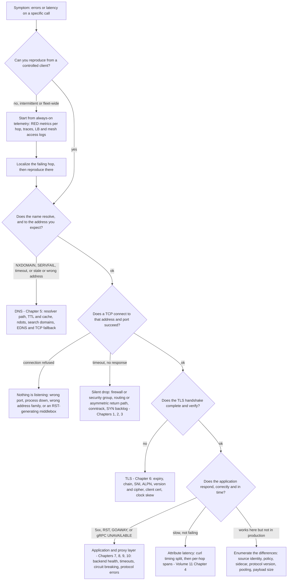
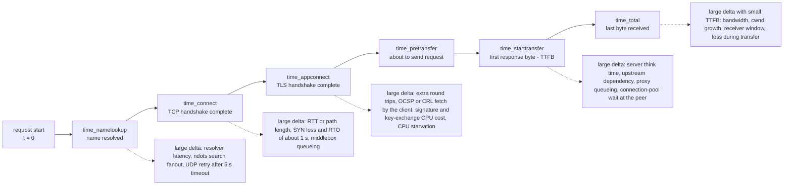
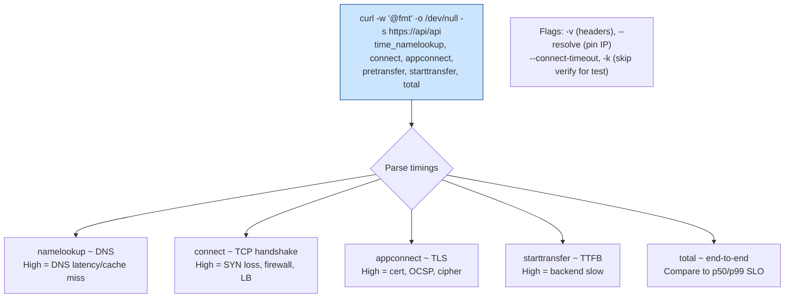
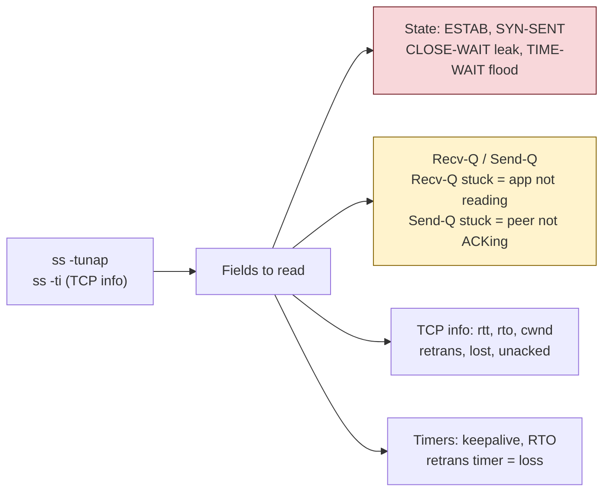
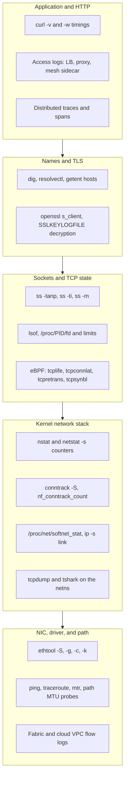
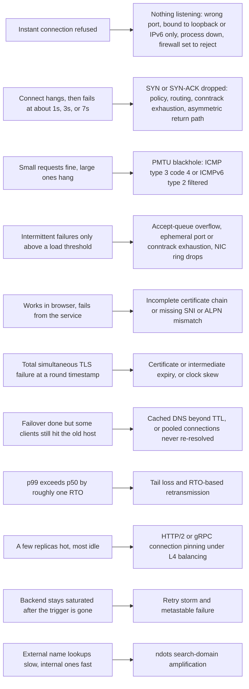
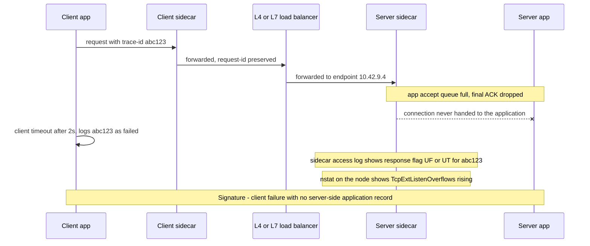

# Chapter 12 — Debugging and Observing Networks

**What this chapter covers.** This is the practitioner's capstone of the volume. Chapters 1 through
11 built a model of each layer in turn — the packet path, IP and NAT, TCP, UDP and QUIC, DNS, TLS,
HTTP, gRPC, load balancing, proxies and mesh, and the reliability patterns that wrap remote calls.
Production does not hand you a layer; it hands you "checkout p99 went from 40 ms to 4 s at 14:02"
or "about 0.3% of gRPC calls fail with `UNAVAILABLE`, but only from the eu-west cluster." This
chapter is the translation: a method for turning a symptom into a falsifiable hypothesis about a
specific layer at a specific hop, the tools that test those hypotheses, a catalog of failure
*signatures* worth memorizing, and the fleet-scale reality that you cannot SSH into a box and run
`tcpdump` when the failure is one hop out of six across ten thousand pods. The through-line:
capture is the last resort, not the first move.

Learning goals — after this chapter you should be able to:

- Run a layered triage — resolution, connectivity, transport, TLS, application — and bisect client
  versus network versus server, stating at each step what a result would *falsify*.
- Read `curl`'s `--write-out` timing breakdown as a protocol-phase oscilloscope, and interrogate
  DNS with `dig`, `resolvectl`, and `getent` while knowing why those paths differ from your
  application's.
- Explain the mechanism behind `ping`, `traceroute`, and `mtr`, and the ways ECMP, anycast, ICMP
  rate limiting, and asymmetric paths make their output misleading.
- Read `ss -ti` as a window into the per-connection TCP control block, and kernel and NIC counters
  (`nstat`, `ethtool -S`, `conntrack -S`) as proof or disproof of drop hypotheses without a capture.
- Write correct BPF filters, capture safely in production including inside container network
  namespaces, and decrypt TLS with `SSLKEYLOGFILE`.
- Recognize the classic signatures on sight: refused versus timeout, accept-queue overflow, PMTU
  blackholes, certificate and SNI failures, stale DNS, port and conntrack exhaustion, asymmetric
  routing, `ndots` amplification, retry storms, and HTTP/2 connection pinning.
- Design always-on telemetry that localizes the failing hop before anyone reaches for a capture.

## Debugging is hypothesis testing, not tool trivia

The engineers who are fast at this are not the ones who have memorized the most flags. They keep an
explicit list of candidate explanations and pick the next command by which candidate it eliminates.
The method has three parts.

**Work the layers, in dependency order.** A request must resolve a name, route packets to an
address, complete a transport handshake, complete a TLS handshake, and exchange application
messages. Each stage depends on all the previous ones, so a failure at stage *n* makes every test
at stage *n+1* meaningless. Testing HTTP semantics while DNS returns a decommissioned address is
not debugging; it is generating noise. Test in order, and stop at the first stage that misbehaves.

**Bisect the path.** A modern request crosses many hops: client → resolver → CDN edge → anycast L4
LB → L7 proxy → sidecar → server sidecar → server → database. The layered method tells you *which
protocol stage* fails; bisection tells you *where*. Run the same test from progressively closer
vantage points — your laptop, a pod in the same cluster, the node hosting the server, the server's
own network namespace, `localhost` on the server. The first vantage point at which the failure
disappears brackets the fault between it and the previous one. That turns "checkout is broken" into
"checkout is broken from eu-west but not from the same-zone canary, and not from the node itself" —
most of a root cause.

**Change one variable.** When a test differs from production in five ways — different source IP,
different DNS path, no mesh sidecar, HTTP/1.1 instead of HTTP/2, no client certificate — a negative
result proves nothing. `curl` from your laptop is not your Java service: different resolver,
different TLS library and trust store, different connection pool, different timeouts, no sidecar
interception. Bring the test as close to the real client as you can afford — a debug container in
the same pod shares the pod's network namespace, resolver configuration, and sidecar interception,
the highest-fidelity vantage point Kubernetes offers — and when you cannot, list the differences
before you interpret the result.



### "It's always DNS" — why the joke keeps being true

DNS sits on the critical path of every call while being the layer with the most independent caches,
the loosest failure semantics, and the least visibility. Three structural reasons keep it at the top
of the suspect list.

First, **caching is layered and none of it is yours**. An answer may be cached in the application
process (JVM `networkaddress.cache.ttl`, a client library's own cache; Go's resolver does not cache
at all), in a node-local cache (NodeLocal DNSCache, `nscd`, `systemd-resolved`), in the cluster
resolver (CoreDNS), and in an upstream recursive resolver — each with its own TTL accounting.
Changing a record does not change behavior; it starts a countdown whose length you control only
partly, and any layer that ignores or floors TTLs extends it. The resulting failure is usually
latency or staleness rather than an error: a resolver answering in 5 seconds instead of 5
milliseconds produces "the service is slow," not "DNS is broken."

Second, **the transport is fragile in ways that hide**. Classic DNS is UDP-first; a response larger
than the advertised EDNS(0) buffer comes back truncated with the TC bit set and the resolver retries
over TCP. If a firewall permits UDP/53 and quietly drops TCP/53 — a common misconfiguration —
resolution works until a zone grows a record or DNSSEC signatures push a response past the limit,
and then it fails for a subset of names, intermittently. The symptom looks nothing like "DNS."

Third, **the tooling lies to you by default**: `dig` and your application take different resolver
paths, as a later section explains, and when they disagree the difference is the bug.

The correct response to the cliché is not to assume DNS but to *falsify* it in under a minute, from
the affected host at the affected moment, and move on.

## Triage in sixty seconds: `curl` as an oscilloscope

Almost every HTTP-ish problem should start with `curl`, not because it is powerful but because a
single invocation splits end-to-end latency into protocol phases — the fastest layer attribution
available.

```bash
curl -sS -o /dev/null \
  -w 'dns=%{time_namelookup} tcp=%{time_connect} tls=%{time_appconnect} pre=%{time_pretransfer} ttfb=%{time_starttransfer} total=%{time_total} code=%{http_code} ver=%{http_version} ip=%{remote_ip}:%{remote_port} conns=%{num_connects} verify=%{ssl_verify_result}\n' \
  https://api.internal.example.com/v1/health
```

```
dns=0.004132 tcp=0.005871 tls=0.031004 pre=0.031120 ttfb=0.284517 total=0.284790 code=200 ver=2 ip=10.42.7.19:443 conns=1 verify=0
```

Every `time_*` variable is **cumulative from the start of the request**, so the phases are
*differences*, not the raw numbers — the single most common misreading. Here: DNS 4.1 ms, TCP
handshake 1.7 ms, TLS handshake 25.1 ms, request send ~0.1 ms, then **253 ms waiting for the first
response byte**, with the body arriving in the following 0.3 ms. That is a server-side (or
downstream-of-server) latency problem; no amount of network work will fix it. Had `tcp - dns` been
200 ms instead, you would be looking at handshake latency: an over-long path, a SYN retransmit
(Linux's initial RTO is 1 s, so a lost SYN produces a suspiciously round ~1 s or ~3 s step), or a
saturated middlebox.

Keep the format string in a file (`-w "@$HOME/curl-format.txt"`) so it is readable and reusable.
curl 7.70.0 and later also accept `-w '%{json}'`, which dumps every write-out variable as a JSON
object — ideal when scripting a probe loop and feeding the results to `jq`.



Three more `curl` habits worth building.

**Pin the address to separate DNS from everything else.** `--resolve` overrides resolution for one
host/port pair while leaving `Host:`, SNI, and certificate verification intact:

```bash
curl -sS -o /dev/null -w '%{http_code} %{remote_ip}\n' \
  --resolve api.internal.example.com:443:10.42.7.31 \
  https://api.internal.example.com/v1/health
```

Loop that over every endpoint address and you have per-backend health with correct TLS semantics —
the fastest way to find the one bad replica behind a name. `--connect-to HOST1:PORT1:HOST2:PORT2`
does the same when you also need to redirect the port.

**Pin the protocol.** `--http1.1`, `--http2`, `--http2-prior-knowledge`, and — in curl builds with
a QUIC-capable backend — `--http3`. If a request succeeds over HTTP/1.1 and fails over HTTP/2, you
have implicated ALPN negotiation, an intermediary's HTTP/2 handling, header-size limits, or
`GOAWAY` behavior rather than the application. If HTTP/3 fails while HTTP/2 works from the same
host, suspect UDP blocked or rate-limited on the path (Chapter 4).

**Read the exit code.** curl's exit codes are a coarse but instant layer classifier: `6` could not
resolve host, `7` failed to connect, `28` timed out, `35` TLS connect error, `52` empty reply,
`56` failure receiving data (often a mid-stream reset), `60` peer certificate verification failure
(this code absorbed the older `CURLE_SSL_CACERT` in curl 7.62.0), `92` an HTTP/2 stream error. `-v`
gives the narrative and `--trace-time` timestamps every trace line, which is how you see *where* a
stall sits without a capture; `--trace-ascii -` dumps the bytes.




## DNS: ask precisely, and ask what the application asks

`dig` is the instrument, but use it deliberately.

```bash
# What does the resolver the application uses actually return, with TTL?
dig +noall +answer api.internal.example.com

# Ask one specific server, bypassing the local resolver entirely
dig @10.96.0.10 api.internal.example.com A +stats

# Full delegation walk from the root, one label at a time
dig +trace api.internal.example.com

# What the zone actually says, straight from an authoritative server (expect the aa flag)
dig @ns1.example.net api.internal.example.com +norecurse

# Does my recursive resolver already hold a cached answer? No aa flag, and a TTL below the zone's
dig @10.96.0.10 api.internal.example.com +norecurse
```

Two nuances matter in incidents. First, **`+trace` deliberately bypasses your recursive resolver**:
it starts at the root hints and follows delegations itself, which makes it excellent for proving the
*authoritative* data is correct and useless for reproducing what your application sees. A `+trace`
that looks perfect while users fail is the signature of a caching or resolver problem, not a zone
problem. Second, the TTL in a cached answer counts *down*; two consecutive `dig`s against a
recursive resolver showing 300 then 297 tell you the answer is cached and how long ago it was
fetched. A TTL that never decreases means an authoritative answer, or a forwarder that rewrites
TTLs.

To identify *which* instance of an anycast resolver answered, NSID (RFC 5001) is the tool:

```bash
dig +nsid @9.9.9.9 example.com | grep -A1 NSID
```

To reproduce the *application's* view, stop using `dig`. It speaks DNS on the wire; your process
goes through the C library's name service switch, which consults `/etc/hosts`, possibly `nscd` or
`systemd-resolved`, and applies `search` and `ndots` from `/etc/resolv.conf`:

```bash
getent hosts api.internal.example.com     # what glibc NSS returns, hosts file included
cat /etc/resolv.conf                      # nameserver, search, options ndots:N, timeout, attempts
resolvectl status                         # per-link DNS config under systemd-resolved
resolvectl query api.internal.example.com # resolve through the stub resolver, with cache info
resolvectl statistics                     # cache hits/misses, transactions
resolvectl flush-caches                   # prove or disprove "it's a stale cache"
```

Alpine images complicate this further: musl's resolver has historically differed from glibc's —
notably the absence of TCP fallback for truncated responses (added only in musl 1.2.4, released in
2023) and querying the configured nameservers in parallel rather than in order. If a bug reproduces
on Alpine and not on Debian with the same code, suspect the resolver implementation.

Finally, the `ndots:5` trap from Chapter 5: in Kubernetes, `example.com` (one dot, fewer than five)
is tried against every search domain — `example.com.<ns>.svc.cluster.local`,
`example.com.svc.cluster.local`, `example.com.cluster.local`, and any node domains — before being
tried as-is. With A and AAAA for each, a single external lookup can become ten queries. The
signature is a large `time_namelookup` for external names only, and a CoreDNS query rate several
times your request rate. `dig` will not reproduce it, because it does not apply the search list the
way an application does; `getent hosts` and a capture of UDP/53 will.

## Connectivity and path: what `ping` and `traceroute` really tell you

`ping` sends ICMP Echo Requests and times the Echo Replies. It answers exactly one question: *does
this address respond to ICMP right now, and with what round-trip time and loss?* It says nothing
about service reachability, because firewalls, security groups, and load balancers treat ICMP and
TCP by different rules — an anycast VIP that answers ping may have no healthy backend, and a
perfectly healthy host may drop ICMP by policy. ICMP loss is also weak evidence of data-plane loss:
routers handle ICMP directed at *themselves* on a slow control-plane path and rate-limit it hard.

Where `ping` earns its place is as a *baseline RTT* and as a **path MTU probe**:

```bash
# 1472 bytes of payload + 8 ICMP header + 20 IP header = 1500 bytes, DF set
ping -M do -s 1472 -c 3 db.internal.example.com
# If this fails but -s 1400 succeeds, the path cannot carry 1500-byte frames.
```

`traceroute` exploits TTL: it sends probes with TTL=1, 2, 3, …; each router that decrements the TTL
to zero discards the packet and returns an ICMP Time Exceeded, revealing its address. The
destination announces itself differently by probe type — a UDP probe to a high unused port elicits
ICMP Port Unreachable, an ICMP Echo probe an Echo Reply, a TCP SYN probe a SYN/ACK or RST. Linux
`traceroute` defaults to UDP with destination ports starting at 33434 and incrementing per probe.

That default is a problem in modern networks, and understanding why is the difference between
reading a traceroute correctly and being fooled by one:

- **ECMP hashes on the 5-tuple.** Because classic traceroute varies the destination port per probe,
  consecutive probes hash to *different* paths, so the output is a superposition of several.
  `paris-traceroute` and `dublin-traceroute` hold the flow identifier constant so you trace one
  path; `traceroute -T -p 443` gets closer to the real flow, but its source port still varies.
- **ICMP generation is rate-limited and deprioritized.** A middle hop showing 40% loss while every
  subsequent hop shows 0% is not losing your traffic; it is declining to generate ICMP as fast as
  you are asking. Loss is meaningful only if it persists at that hop **and all hops after it**.
- **Anycast means "the hop" is not one machine.** Successive probes may be answered by different
  routers or PoPs (Chapters 2 and 10).
- **The return path is invisible.** Traceroute conflates the forward path with the return path of
  the ICMP errors, and asymmetric routing is normal.
- **MPLS and layer-2 clouds hide hops.** A "hop" that appears to add 30 ms may be a label-switched
  path crossing a continent.

`mtr` is traceroute run continuously with per-hop statistics, which distinguishes steady loss from
a blip:

```bash
mtr --report --report-cycles 100 --tcp --port 443 --no-dns api.internal.example.com
```

```
Start: 2026-08-13T09:14:02+0000
HOST: probe-a-7f9c                Loss%   Snt   Last   Avg  Best  Wrst StDev
  1.|-- 10.42.0.1                  0.0%   100    0.4   0.5   0.3   1.9   0.2
  2.|-- 10.0.30.1                  0.0%   100    1.1   1.3   0.9   9.8   0.9
  3.|-- 100.65.4.18               38.0%   100    9.7   9.9   9.1  17.2   1.1
  4.|-- 100.65.9.2                 0.0%   100   10.1  10.3   9.6  19.4   1.3
  5.|-- 10.42.7.19                 0.0%   100   10.4  10.6   9.9  21.0   1.4
```

Hop 3's 38% "loss" is an artifact: hops 4 and 5 are clean, so nothing was dropped. Had hops 3, 4,
and 5 all shown ~38%, that would be real loss entering at hop 3.

For plain port reachability, `nc` is the blunt instrument; `-w` is mandatory so it cannot hang:

```bash
nc -vz -w 3 db.internal.example.com 5432
# Connection to db.internal.example.com (10.42.9.4) 5432 port [tcp/postgresql] succeeded!
```

A refusal returns immediately; a silent drop hangs until the timeout. That distinction is the most
informative single bit in network debugging; the field guide below makes it precise.

For TLS reachability and certificate inspection, `openssl s_client` is the equivalent:

```bash
openssl s_client -connect api.internal.example.com:443 \
  -servername api.internal.example.com -alpn h2 -showcerts </dev/null 2>&1 | head -40
```

```
CONNECTED(00000003)
depth=2 C = US, O = Internal Root, CN = Internal Root CA X1
verify return:1
depth=1 C = US, O = Internal Root, CN = Internal Issuing CA 3
verify return:1
depth=0 CN = api.internal.example.com
verify return:1
---
ALPN protocol: h2
New, TLSv1.3, Cipher is TLS_AES_128_GCM_SHA256
Verify return code: 0 (ok)
```

`-servername` is not optional: omit it and a virtual-hosted server or shared L7 proxy hands you a
default certificate, and you will "reproduce" a certificate bug that does not exist. The `Verify
return code` is the punchline — `0 (ok)`, `10 (certificate has expired)`, `18 (self signed
certificate)`, `19 (self signed certificate in certificate chain)`, `21 (unable to verify the first
certificate)`. To check expiry in one line:

```bash
openssl s_client -connect api.internal.example.com:443 -servername api.internal.example.com \
  </dev/null 2>/dev/null | openssl x509 -noout -subject -issuer -dates
```

## Sockets: `ss` is the X-ray

`ss` reads socket state from the kernel via netlink (`sock_diag`), which is why it stays fast on a
machine with 200,000 sockets and why it can expose per-connection TCP internals `netstat` never
could.

```bash
ss -tanp state established '( dport = :5432 or sport = :5432 )'
ss -tlnp                        # listeners with owning process
ss -s                           # summary by state and family
ss -tan state time-wait | wc -l # TIME_WAIT population
```

On a **listening** socket, `ss` overloads the queue columns in a way you must know cold: `Recv-Q`
is the number of established connections **waiting to be accepted**, and `Send-Q` is the **maximum
accept-queue length**, `min(listen backlog, net.core.somaxconn)`. It is a direct read-out of the
mechanism from Volume 2, Chapter 10:

```
$ ss -tlnp
State   Recv-Q  Send-Q  Local Address:Port  Peer Address:Port  Process
LISTEN  129     128           0.0.0.0:8080        0.0.0.0:*      users:(("app",pid=1041,fd=8))
```

`Recv-Q` at or above `Send-Q` means the application is not calling `accept()` fast enough, so the
kernel silently drops the final ACK of new handshakes — invisible on the client except as a
connection that stalls at 1 s, 3 s, 7 s (SYN-ACK retransmits) and then either succeeds or times
out. On an **established** socket the same columns mean the ordinary thing: bytes queued in the
receive buffer not yet read, and bytes queued for transmission not yet acknowledged. A persistently
large `Recv-Q` on an established server socket says the application is not reading — a thread-pool
or event-loop stall masquerading as a network problem.

The real power is `-i` (with `-m` for socket memory, `-e` for extended info):

```bash
ss -tim state established '( dport = :443 )'
```

```
ESTAB 0 0  10.42.7.19:51234  10.42.9.4:443
     skmem:(r0,rb131072,t0,tb262144,f4096,w0,o0,bl0,d17)
     cubic wscale:7,7 rto:236 rtt:33.412/2.107 ato:40 mss:1448 pmtu:1500 rcvmss:1448
     advmss:1448 cwnd:12 ssthresh:12 bytes_sent:918273 bytes_retrans:41940
     bytes_acked:876333 bytes_received:2044112 segs_out:1204 segs_in:1789
     data_segs_out:1191 send 4.2Mbps lastsnd:12 lastrcv:8 lastack:8
     pacing_rate 5.0Mbps delivery_rate 3.9Mbps app_limited busy:14231ms
     retrans:0/31 dsack_dups:2 reordering:6 rcv_rtt:34.1 rcv_space:65535 minrtt:31.9
```

Read it as the TCP control block from Chapter 3:

- `cubic` — the congestion control algorithm actually in use for this socket.
- `rtt:33.412/2.107` — smoothed RTT and its mean deviation (`rttvar`), in milliseconds; `minrtt` is
  the lowest RTT seen, the closest thing to the propagation floor. `rtt` much larger than `minrtt`
  means queueing somewhere (bufferbloat, an overloaded middlebox, or a busy receiver).
- `cwnd:12` with `ssthresh:12` — the congestion window has been cut and is in congestion avoidance.
  A cwnd stuck near the initial window (10 segments on Linux) on a long-lived, high-throughput
  connection means repeated loss.
- `retrans:0/31` — currently outstanding / total retransmits on this socket. `bytes_retrans:41940`
  against `bytes_sent:918273` is a ~4.6% retransmission rate, which is severe.
- `send 4.2Mbps` is derived, roughly `cwnd × mss × 8 / rtt`: what the congestion window permits,
  not what happened. `delivery_rate` is what the kernel measured by rate sampling (the mechanism
  BBR is built on). `app_limited` is crucial — the connection was *not* limited by the network but
  by the application not supplying data, so do not diagnose bandwidth on an app-limited socket.
- `skmem:(...,d17)` — the `d` field is `sk_drops`: packets dropped on this socket, usually because
  the receive buffer was full. Non-zero `d` on a UDP socket is the canonical "my UDP receiver is
  too slow" evidence.
- `pmtu:1500` and `mss:1448` — the path MTU the stack believes in and the resulting MSS (1500 less
  20 bytes of IPv4 header, 20 of TCP header, and 12 for the timestamp option). A low `pmtu` on a
  tunnelled path is normal; watching `pmtu` collapse mid-connection is the fingerprint of PMTU
  discovery reacting to an ICMP "fragmentation needed" or ICMPv6 "Packet Too Big."

`lsof` answers the inverse question — which process owns a socket, and what else it has open — and
catches file-descriptor exhaustion, which presents as connection failures that are not network
failures at all:

```bash
lsof -nP -iTCP -sTCP:ESTABLISHED -a -p 1041 | wc -l
cat /proc/1041/limits | grep 'open files'
ls /proc/1041/fd | wc -l
```




## Kernel and NIC counters: proving drops without a capture

Counters are the cheapest evidence in the toolkit and most engineers under-use them. `nstat` reads
the same SNMP-style counters as `netstat -s` but prints **deltas since its last invocation**, which
makes causality obvious. It keeps history in a file (overridable via `NSTAT_HISTORY`); `-a` prints
absolutes, `-z` includes zeroes, `-s` leaves history untouched.

```bash
nstat -n            # zero the baseline quietly
sleep 60
nstat               # deltas over the last 60 seconds
```

```
#kernel
TcpActiveOpens                  18422              0.0
TcpPassiveOpens                 19110              0.0
TcpAttemptFails                   214              0.0
TcpEstabResets                    902              0.0
TcpRetransSegs                   3341              0.0
TcpOutRsts                       1187              0.0
TcpExtListenOverflows             486              0.0
TcpExtListenDrops                 486              0.0
TcpExtTCPSynRetrans              1904              0.0
TcpExtTCPTimeouts                 621              0.0
TcpExtTCPBacklogDrop               33              0.0
TcpExtTCPZeroWindowDrop             4              0.0
```

The counters worth knowing by name, and what each implicates:

| Counter | Meaning | Implicates |
| --- | --- | --- |
| `TcpExtListenOverflows` / `TcpExtListenDrops` | accept queue full when a handshake completed | app not accepting fast enough; backlog/`somaxconn` too small (Vol 2 Ch10) |
| `TcpExtTCPReqQFullDrop` / `...DoCookies` | SYN queue full | SYN flood or handshake rate above capacity; enable/observe SYN cookies |
| `TcpExtTCPSynRetrans` | SYNs retransmitted | SYN or SYN-ACK loss: path drop, firewall, overloaded peer |
| `TcpRetransSegs`, `TcpExtTCPLostRetransmit` | data retransmission, retransmits themselves lost | genuine path loss or extreme congestion |
| `TcpExtTCPTimeouts` | RTO fired (not fast retransmit) | tail loss or heavy loss; expect ~200 ms+ latency spikes |
| `TcpExtTCPBacklogDrop` | socket backlog full while socket was locked | receiver CPU starvation |
| `TcpExtTCPZeroWindowDrop` | data dropped when receive window was zero | slow application reader |
| `TcpExtPruneCalled`, `TcpExtRcvPruned` | receive queue memory pressure | `tcp_rmem` too small or reader too slow |
| `TcpExtTW`, `TcpExtPAWSEstab` | TIME_WAIT churn, timestamp rejections | port reuse pressure, NAT with rewritten timestamps |
| `TcpOutRsts` | resets we sent | closing sockets with unread data, or connections to closed ports |
| `UdpInErrors`, `UdpRcvbufErrors` | UDP receive drops | receiver buffer too small / too slow (DNS, QUIC, syslog) |
| `IpExtInNoRoutes` | packets with no route | routing or policy-routing misconfiguration |

Below TCP, the NIC and the softirq path have their own counters. Drops here never appear in TCP
statistics as anything but loss:

```bash
ethtool -S eth0 | grep -Ei 'drop|err|miss|discard|fifo|no_buf'
#      rx_dropped: 0
#      rx_missed_errors: 21734        <- ring buffer overrun; NIC had nowhere to put frames
#      tx_dropped: 0
ethtool -g eth0        # ring sizes; raising RX ring is the usual fix for rx_missed_errors
ethtool -c eth0        # interrupt coalescing
ethtool -k eth0        # offloads: gro, gso, tso, lro  (see the capture caveat below)

cat /proc/net/softnet_stat   # col 1 processed, col 2 dropped (backlog full), col 3 time_squeeze
ip -s link show eth0         # per-interface RX/TX errors, drops, overruns
```

And for connection tracking (Chapter 2), an invisible capacity limit in Kubernetes and on NAT
gateways:

```bash
conntrack -S            # per-CPU: found, invalid, insert_failed, drop, early_drop, ...
conntrack -C            # current entry count
sysctl net.netfilter.nf_conntrack_count net.netfilter.nf_conntrack_max
dmesg | grep -i 'nf_conntrack: table full'
```

Rising `insert_failed` is the signature of source-port collisions under heavy SNAT; rising `drop`
with `nf_conntrack_count` pinned at `max` is table exhaustion. Both surface to applications as
random connection timeouts under load, never as a clean error.

## Packet capture: correct, safe, and last

Capture once counters and logs have narrowed the question to something only bytes on the wire can
answer: who sent the RST, was the SYN ever transmitted, what did the peer's ClientHello offer, is
the retransmission the same segment or a different one.

```bash
# Interface selection matters more than anything else.
tcpdump -D                       # list capturable interfaces
tcpdump -i any -nn -c 200 -w /var/tmp/cap.pcap 'tcp port 5432 and host 10.42.9.4'
```

`-nn` disables name and port resolution (never let tcpdump do DNS during a DNS incident); `-i any`
uses Linux "cooked" capture across all interfaces, convenient but lossy on link-layer detail and
prone to double-counting packets that traverse veth pairs. Modern libpcap defaults to a snap length
of 262144 bytes, effectively full-packet; reduce it (`-s 128`) when you only need headers on a busy
link.

BPF filter syntax is worth learning; the primitives compose:

```bash
# Only handshake and reset packets — tiny capture, huge signal
tcpdump -i eth0 -nn 'tcp[tcpflags] & (tcp-syn|tcp-rst|tcp-fin) != 0'

# ICMP "fragmentation needed" — the PMTU signal
tcpdump -i eth0 -nn 'icmp[icmptype] == 3 and icmp[icmpcode] == 4'

# IPv6 equivalent: Packet Too Big
tcpdump -i eth0 -nn 'icmp6 and ip6[40] == 2'

# DNS in both directions, while excluding the SSH session you are typing into
tcpdump -i any -nn '(udp port 53 or tcp port 53) and not tcp port 22'

# VLAN-tagged traffic needs the vlan keyword before the rest of the filter
tcpdump -i eth0 -nn 'vlan and host 10.42.9.4'
```

In production, capture to a bounded ring so you cannot fill the disk, and drop privileges:

```bash
tcpdump -i eth0 -nn -s 128 -W 10 -C 100 -Z tcpdump -w /var/tmp/inc-4412.pcap 'port 443'
# 10 files of 100 MB each, rotating; runs as user "tcpdump" after opening the socket
```

Two capture caveats that regularly produce false conclusions:

**Offloads distort what you see.** The `AF_PACKET` tap `tcpdump` uses sits on the kernel side of
segmentation: with GRO/LRO on receive and TSO/GSO on transmit, you will see multi-kilobyte "TCP
segments" that never existed on the wire, and your packet and retransmission counts will be wrong.
When segment-level truth matters, temporarily disable the offloads
(`ethtool -K eth0 gro off lro off gso off tso off`) or capture on the peer or a tap/SPAN port —
noting the throughput and CPU cost before doing so on a hot machine.

**Capture where the traffic actually is.** In Kubernetes the pod's traffic is in the pod's network
namespace, not the node's root namespace. Prefer an ephemeral debug container, which shares that
namespace, so `tcpdump` inside it sees the pod's traffic; otherwise enter the namespace from the
node:

```bash
kubectl debug -it pod/checkout-7f9c --image=nicolaka/netshoot --profile=netadmin -- tcpdump -i eth0 -nn -c 100

# From the node, for a container whose PID you have:
pid=$(crictl inspect --output go-template --template '{{.info.pid}}' "$CID")
nsenter -t "$pid" -n tcpdump -i eth0 -nn -c 100 'port 443'
```

Capture *both sides* whenever an "it never arrived" claim is in play. A packet present on the
sender's capture and absent on the receiver's localizes the drop between them, which no single-side
capture can do.

For analysis, Wireshark (or `tshark` for headless work) turns bytes into narrative. Three features
pay for themselves:

- **Follow TCP/TLS/HTTP stream** to reconstruct one conversation out of thousands.
- **Expert Information** and the analysis filters: `tcp.analysis.retransmission`,
  `tcp.analysis.fast_retransmission`, `tcp.analysis.duplicate_ack`,
  `tcp.analysis.zero_window`, `tcp.analysis.out_of_order`, `tcp.flags.reset == 1`.
- **TLS decryption via key logging.** TLS 1.3 forward secrecy means the server's private key cannot
  decrypt a capture; you need the ephemeral secrets. Most TLS libraries export them when
  `SSLKEYLOGFILE` is set (curl, Chrome, Firefox, Go's `tls.Config.KeyLogWriter`, NSS, OpenSSL-based
  apps that opt in). This works for QUIC too:

```bash
export SSLKEYLOGFILE=/var/tmp/keys.log
curl -sS --http2 -o /dev/null https://api.internal.example.com/v1/health
tshark -r /var/tmp/cap.pcap -o "tls.keylog_file:/var/tmp/keys.log" -Y http2 -V | head -50
```

  Treat the keylog file as a secret: it decrypts everything captured in that window.

A `tshark` one-liner for a quick per-stream latency scan:

```bash
tshark -r cap.pcap -q -z conv,tcp | head -20
tshark -r cap.pcap -Y 'tcp.analysis.retransmission' -T fields \
  -e frame.time_relative -e ip.src -e ip.dst -e tcp.seq | head
```

## Always-on: eBPF and flow-level network observability

Everything above is *reactive*: you must be present while the problem happens, on the right machine.
eBPF (Volume 2, Chapter 11) changes the economics — attach to kernel tracepoints and kprobes at
negligible overhead and leave it running. The BCC/libbpf tool set covers most network questions
directly (on Debian and Ubuntu the BCC builds are suffixed, e.g. `tcplife-bpfcc`):

```bash
# Every TCP session that closes: endpoints, bytes, and lifetime
tcplife
# PID   COMM       LADDR        LPORT RADDR        RPORT TX_KB RX_KB  MS
# 1041  app        10.42.7.19   51234 10.42.9.4     5432    12   340  8.9
# 1041  app        10.42.7.19   51236 10.42.9.4     5432     0     0  3002.1

# Connect latency — separates "slow DNS" from "slow handshake" at the syscall level
tcpconnlat
# PID   COMM    IP SADDR       DADDR        DPORT LAT(ms)
# 1041  app     4  10.42.7.19  10.42.9.4     5432    0.42
# 1041  app     4  10.42.7.19  10.42.9.7     5432 1002.11

# Every retransmission, with the socket state at the time
tcpretrans
# TIME     PID   IP LADDR:LPORT          T> RADDR:RPORT          STATE
# 09:21:04 0     4  10.42.7.19:51234     R> 10.42.9.4:5432       ESTABLISHED
# 09:21:05 0     4  10.42.7.19:51240     R> 10.42.9.4:5432       SYN_SENT
```

Those three answer, respectively: "which connections are short-lived or hung," "is connect latency
bimodal with a ~1 s or ~3 s cluster" (SYN retransmission — handshake loss), and "who is
retransmitting, in which state." `tcpconnect`, `tcpaccept`, and `tcpsynbl` (SYN backlog occupancy
histogram) round out the set. Since Linux 5.17 the `skb:kfree_skb` tracepoint carries a drop
*reason*, which turns "a packet disappeared" into a named cause:

```bash
bpftrace -e 'tracepoint:skb:kfree_skb { @[args->reason] = count(); }'
```

At cluster scale, the same idea is productized. Cilium's Hubble records flow-level events from the
eBPF datapath — including *verdicts* — so policy drops and connection failures are queryable
without touching a node:

```bash
hubble observe --namespace checkout --verdict DROPPED --last 100
# Aug 13 09:22:01  checkout/api-7f9c:51234  ->  payments/api-55d8:8443  policy-denied  DROPPED (TCP Flags: SYN)
hubble observe --to-pod payments/api-55d8 --protocol tcp --follow
cilium monitor --type drop        # node-local view of datapath drops with reasons
```

The value is not the tool but the property: a `policy-denied` verdict, recorded automatically,
converts the most confusing symptom in Kubernetes — a connection that times out with no error
anywhere — into a one-line answer.



## A field guide to failure signatures

Most production network incidents are instances of a modest number of patterns; recognizing them by
their *shape* is what makes senior engineers fast.

### Connection refused versus connection timeout

This is the highest-information distinction in the discipline, so be precise about the mechanism.
**Refused** means a TCP RST came back: a host received your SYN, had no listener on that port (or a
firewall configured to reject rather than drop), and said so. Something is reachable and alive; your
address is right and your port or process is wrong. Diagnosis is local: is the process up, is it
bound to `0.0.0.0` or only `127.0.0.1`, is it bound to IPv6 only while the client resolved an A
record, did the container port mapping change?

**Timeout** means silence: your SYN vanished, or the SYN-ACK vanished on the way back. Silence is
the fingerprint of a *policy drop* or a *routing problem* — security groups, NetworkPolicy, iptables
`DROP`, conntrack exhaustion, a blackholed route, an asymmetric return path. The timing is itself
evidence: the client retransmits the SYN with exponential backoff (cumulatively about 1 s, 3 s, 7 s,
15 s on Linux, up to `tcp_syn_retries`, which defaults to 6), so connect latencies piling up at ~1 s
and ~3 s are SYN loss, not a slow server.

A third case fools people: **connection succeeds, then resets mid-stream**, which is not a
connectivity problem at all. Candidates: an idle timeout on a stateful device that dropped the
flow's state and now rejects its packets; a proxy enforcing a request timeout; an application
crashing or calling `close()` with unread data, which forces an RST rather than a FIN; or an
aggressive `SO_LINGER`. Cloud NAT gateways and LBs commonly expire idle flows after a few minutes,
many of them *silently*, so the first packet after the idle period is dropped or reset. The fix is
keepalives shorter than the middlebox's idle timeout, at the TCP level (`TCP_KEEPIDLE`) or the
application level (HTTP/2 PING, gRPC keepalive).

### Intermittent timeouts under load: accept-queue overflow

Symptom: at low traffic everything is fine; above some request rate a small fraction of connections
take ~1 s or ~3 s and some fail, while the application logs show no slow request — from its point of
view those connections were never accepted. Evidence: `ss -tlnp` shows `Recv-Q` at `Send-Q`, and
`nstat` shows `TcpExtListenOverflows` and `TcpExtListenDrops` climbing in lockstep. Mechanism
(Volume 2, Chapter 10): the handshake completed in the kernel, the accept queue was full, so the
kernel dropped the client's final ACK. Fixes, in order of correctness: make the application accept
faster (it is stalled, often on a lock, a GC pause, or a synchronous dependency); raise
`net.core.somaxconn` *and* the `backlog` the runtime passes to `listen()`, since raising one without
the other does nothing; add capacity. `net.ipv4.tcp_abort_on_overflow=1` converts silent drops into
resets — worse for users, better for diagnosis, so use it as a temporary instrument.

### Retransmissions and real packet loss

Retransmissions are normal in small quantities; the question is always *rate* and *kind*. Fast
retransmit (triggered by duplicate ACKs and SACK) costs a fraction of an RTT and is barely visible.
RTO-based retransmission (`TcpExtTCPTimeouts`) costs at least the RTO — Linux clamps the minimum at
200 ms — and is the mechanism behind the classic "p99 is 200 ms above p50 for no reason." Tail loss
is especially punishing because no later packets exist to generate duplicate ACKs; the tail loss
probe (RFC 8985) mitigates it. Localize loss by comparing `nstat` retransmit deltas at the two
endpoints and looking for an `mtr` hop whose loss persists through the destination. Do not forget
the boring causes: a NIC ring overrun (`rx_missed_errors`), a saturated link, a duplex mismatch.

### The MTU/PMTU blackhole

The signature is unmistakable once you know it: **small requests succeed, large ones hang**. A
health check returns instantly; a 4 KB POST or a large response body stalls and eventually times
out. TLS handshakes may fail specifically at the certificate message, because that is the first
large flight.

The mechanism: the sender emits a full-size segment with the IPv4 Don't Fragment bit set (Linux
sets DF by default because it does Path MTU Discovery). Somewhere on the path — a VXLAN or GENEVE
overlay, a WireGuard or IPsec tunnel, a PPPoE link — the effective MTU is smaller. That router drops
the packet and returns ICMP Type 3 Code 4 ("fragmentation needed and DF set") carrying the next-hop
MTU; IPv6 routers do not fragment at all, and the equivalent is ICMPv6 Type 2 ("Packet Too Big").
If a firewall blocks that ICMP — a depressingly common "hardening" choice — the sender never learns
and retransmits the same oversized segment forever. Small packets fit, so everything *looks* healthy.

Confirm and fix:

```bash
# Confirm the path MTU empirically
ping -M do -s 1472 -c 3 peer   # 1500-byte total; fails on a 1450-byte path
ping -M do -s 1422 -c 3 peer   # 1450-byte total; succeeds

# Are the ICMP messages arriving at all?
tcpdump -i any -nn 'icmp[icmptype] == 3 and icmp[icmpcode] == 4'

# See what the stack believes per destination
ip route get 10.42.9.4
ss -ti dst 10.42.9.4 | grep -o 'pmtu:[0-9]*'
```

Mitigations, best first: **allow the ICMP** (Type 3 Code 4 and ICMPv6 Type 2 are part of IP, not an
optional extra). **Clamp MSS** at the tunnel ingress: `iptables -t mangle -A FORWARD -p tcp
--tcp-flags SYN,RST SYN -j TCPMSS --clamp-mss-to-pmtu`. **Enable packetization-layer PMTUD**
(`net.ipv4.tcp_mtu_probing=1` probes when a blackhole is suspected, `=2` always) — RFC 4821's
approach of discovering MTU from TCP's own behavior rather than from ICMP; QUIC (Chapter 4) uses
DPLPMTUD (RFC 8899) for the same reason. And set consistent MTUs on overlay interfaces rather than
discovering the mismatch in production.

### TLS handshake and certificate failures

The families are few and each has a distinct fingerprint:

- **Expired certificate** — sudden, total, simultaneous across all clients, at a round timestamp.
  `Verify return code: 10`. The subtle variant is a *root* expiring: IdenTrust's DST Root CA X3, the
  root that cross-signed Let's Encrypt's ISRG Root X1, expired on 30 September 2021, breaking
  clients with old trust stores or old path-building code (OpenSSL 1.0.2 was the notorious case)
  while up-to-date clients were unaffected. "Fails on *some* clients" is much harder to read than a
  uniform outage.
- **Incomplete chain** — the server does not send intermediates. Browsers often paper over this by
  fetching the issuer via the certificate's AIA extension; most server-side clients (Go, Java,
  Python) do not. Signature: "works in my browser, fails from the service." `openssl s_client
  -showcerts` shows a chain of length one; `Verify return code: 21`.
- **SNI mismatch** — the client sent no SNI, or the wrong name, and a shared L7 endpoint returned a
  default certificate or routed to the wrong virtual host. Always test with `-servername` or
  `--resolve`.
- **Version or cipher mismatch** — an old client against a TLS-1.2-minimum server, or a server
  requiring a curve or cipher the client lacks: alert `handshake_failure` (40) or
  `protocol_version` (70).
- **ALPN mismatch** — `no_application_protocol` (120): the client offered only `h2` and the server
  only `http/1.1`.
- **mTLS client-certificate problems** — expired workload identities, clock skew larger than the
  certificate's validity window (mesh certificates often live only hours, so minutes of skew are
  fatal), or an untrusted issuing CA after a root rotation. Check `timedatectl` before theorizing.

Under TLS 1.3 the certificate is encrypted, so a capture no longer shows the chain; the ClientHello
(including SNI, unless ECH is in use) and the alert codes remain visible, and the alert alone
usually tells you which family you are in.

### Stale DNS and failover that did not fail over

Symptom: a database or service failover "completed," but a fraction of clients keep hitting the old
address for minutes or hours. Mechanism: some caching layer ignored or floored the TTL. The classic
offender is the JVM, which historically cached successful lookups **forever** when a security
manager was installed (`networkaddress.cache.ttl=-1`); modern JDKs default to a finite value
(commonly 30 seconds), but pin it explicitly anyway. Connection pools are the other half: a pooled
connection is *never* re-resolved, so even a perfect TTL story leaves long-lived connections pinned
to the dead address until they close. Evidence: `dig` on the affected host shows the new address
while `ss -tanp` shows established connections to the old one. The fix is protocol-level, not
DNS-level — bounded connection lifetime, health-check-driven eviction, and, for gRPC,
name-resolution-aware load balancing (Chapters 8 and 9).

### Ephemeral port and conntrack exhaustion

A client making many short-lived outbound connections to the *same* destination consumes 4-tuples.
The ephemeral range (`net.ipv4.ip_local_port_range`, typically 32768–60999, about 28,000 ports)
bounds concurrent connections to one destination address and port, and `TIME_WAIT` holds each tuple
for 60 seconds after close on Linux. Signature: connection setup fails at a suspiciously consistent
rate, `ss -s` shows tens of thousands of `TIME_WAIT`, and `nstat` shows `TcpExtTW` churn. Real
fixes: connection reuse (keep-alive and a properly sized pool — the actual bug is almost always
that the client library is not pooling), spreading across more destination addresses, widening
`ip_local_port_range`, and `net.ipv4.tcp_tw_reuse=1` where timestamps are available. Do not go
looking for `tcp_tw_recycle`: it was dangerous with NAT and was removed in Linux 4.12.

Behind a shared SNAT device — a cloud NAT gateway, or a node masquerading pod traffic — the same
limit applies to the *aggregate* of all clients sharing that source address, one of the most common
invisible ceilings in container platforms.

### Asymmetric routing and stateful firewalls

If packets leave via path A and return via path B, and a stateful device sits on B without having
seen the SYN on A, it drops the return traffic. Signature: connections work in one direction, or
from one subnet but not another, or after a routing change that "shouldn't matter." Evidence: the
server's capture shows the SYN arriving and the SYN-ACK being sent while the client's capture shows
only its own SYNs — sent on one side, absent on the other, which is exactly what dual-sided capture
is for. Related: Linux reverse-path filtering (`net.ipv4.conf.all.rp_filter`) itself drops packets
arriving on an interface the routing table would not use to reply.

### Retry storms and metastable failure

Signature: a brief backend slowdown becomes a total outage that does not recover once the original
trigger is gone. Mechanism (Chapter 11): every layer retries and the multiplier compounds — a client
retrying 3 times through a gateway retrying 3 times through a mesh sidecar retrying 3 times is up
to 27 requests per user action. Once the backend is saturated, retries keep it saturated: a
metastable failure sustained by its own load. Evidence: server-side request rate several times the
client-side rate; a spike in `URX` or `UO` response flags in mesh access logs; load that does not
fall when upstream traffic does. Remediation is architectural — retry budgets rather than fixed
counts, retries at one layer only, jittered exponential backoff, circuit breaking, load shedding.

### HTTP/2 connection pinning imbalance

Signature: a fleet of identical backends where a few replicas run hot and the rest idle, and scaling
out does not help. Mechanism (Chapters 7, 8, 9): HTTP/2 and gRPC multiplex many requests over one
long-lived TCP connection, and an L4 load balancer balances *connections* — so once a client's
connection lands on a backend, every request on it lands there too for the life of the connection.
Add a client fleet that opens connections at startup and never rotates them and the assignment
freezes, including across a scale-out, since new replicas receive no existing connections. Fixes:
balance at L7, so a proxy distributes individual streams; force rebalancing with server-side
connection age limits (gRPC's `MAX_CONNECTION_AGE` plus `MAX_CONNECTION_AGE_GRACE` sends `GOAWAY`
and lets clients re-resolve); or use client-side, xDS-driven balancing so the client knows all
endpoints.



## Distributed-systems lens: debugging a fleet you cannot log into

Everything above assumes a shell on the machine where the problem is happening. At fleet scale that
assumption fails three ways at once: the failure is a fraction of a percent, so by the time you
attach it has moved; there are thousands of candidate machines; and pods are ephemeral, so the
container that failed was replaced before you finished typing. Interactive debugging does not
scale. Make the network *continuously observable*, so the interactive step, when it comes, is aimed.

**Instrument every hop, not just the ends.** The minimum viable network telemetry is RED metrics
(rate, errors, duration) *per hop*, emitted by the intermediaries themselves — CDN, edge LB, API
gateway, ingress proxy, sidecars on both sides of every internal call — plus USE-style saturation
signals for the resources that silently drop traffic (accept queues, conntrack tables, connection
pools, NIC rings). The point is arithmetic: when hop *n* reports 12,000 rps and hop *n+1* reports
11,400, you have localized 600 lost requests to one link in seconds, without a capture.

**The proxy layer is your richest per-hop telemetry, and it is free.** A mesh sidecar or L7 proxy
sees, for every request, the upstream it chose, whether the connection was reused, TLS details,
per-phase timing, and — critically — a *reason code* when things go wrong. Envoy's access-log
response flags encode exactly the distinctions this chapter has been drawing: `UF` upstream
connection failure, `UH` no healthy upstream, `UO` upstream overflow (circuit breaking), `UT`
upstream request timeout, `URX` retry limit exceeded, `NR` no route configured, `DC` downstream
connection termination, `SI` stream idle timeout, `LH` local service failed health check. With
`%RESPONSE_CODE_DETAILS%` you often get the root cause verbatim:

```yaml
access_log:
  - name: envoy.access_loggers.file
    typed_config:
      "@type": type.googleapis.com/envoy.extensions.access_loggers.file.v3.FileAccessLog
      path: /dev/stdout
      log_format:
        json_format:
          start_time: "%START_TIME%"
          method: "%REQ(:METHOD)%"
          path: "%REQ(X-ENVOY-ORIGINAL-PATH?:PATH)%"
          protocol: "%PROTOCOL%"
          response_code: "%RESPONSE_CODE%"
          response_flags: "%RESPONSE_FLAGS%"
          response_code_details: "%RESPONSE_CODE_DETAILS%"
          connection_termination_details: "%CONNECTION_TERMINATION_DETAILS%"
          duration_ms: "%DURATION%"
          upstream_service_time: "%REQ(X-ENVOY-UPSTREAM-SERVICE-TIME)%"
          upstream_host: "%UPSTREAM_HOST%"
          upstream_cluster: "%UPSTREAM_CLUSTER%"
          upstream_transport_failure_reason: "%UPSTREAM_TRANSPORT_FAILURE_REASON%"
          trace_id: "%REQ(X-B3-TRACEID)%"
          request_id: "%REQ(X-REQUEST-ID)%"
```

`UPSTREAM_TRANSPORT_FAILURE_REASON` alone will hand you TLS verification errors in production that
would otherwise take an afternoon of `openssl s_client`.

**Attribute latency with traces, not guesses.** A distributed trace (Volume 11, Chapter 4) is the
only artifact that decomposes end-to-end latency across hops owned by different teams. Two practices
make traces far more useful here. First, emit a client-side span for *connection acquisition*
separately from the request: an `http.connect` span or a `pool.wait` attribute distinguishes "the
server was slow" from "we waited 300 ms for a free connection in our own pool." Second, ensure both
the client-side and the server-side span exist for each hop; the *difference* between them is, by
definition, the network plus queueing on both sides. Beware clock skew: durations are trustworthy,
cross-host instants are not.

**Correlate the two sides.** The most useful cross-cutting question in a distributed network
incident is: *does the server have any record of this request?* Propagate a request ID (or reuse
the trace ID) and log it on both sides. Then:

- Client timed out, server logged a fast success → the response was lost or delayed on the return
  path, or the client's event loop was blocked. Look at return-path drops, client GC and scheduling,
  and — very commonly — a proxy that timed out earlier than the client and swallowed the response.
- Client timed out, server has no record at all → the request never reached the application. It
  died before `accept()` (accept-queue overflow), in the network (policy drop, conntrack, PMTU), or
  at a proxy that never routed it (`NR`, `UH`).
- Server logged it slow, client saw it fast → sampling or clock issues in your telemetry; fix the
  instrument before trusting it.



**Keep a capture capability you can trigger, but treat it as a scalpel.** The mature setup is
on-demand: a debug image (`netshoot` or an internal equivalent) in every namespace, a pre-approved
procedure for capturing into a pod's network namespace, ring-buffered writes to a bounded location,
and a policy that treats captures as sensitive data. Captures contain customer payloads unless TLS
protects them, and the `SSLKEYLOGFILE` trick that makes TLS readable makes them radioactive: short
retention, restricted access, never a shared bucket.

**Instrument the client, not just the server.** The most under-observed component in most
architectures is the client library: pool size and wait time, resolution latency, retry counts,
circuit-breaker state, per-*attempt* rather than per-call latency. Without these, pool exhaustion,
resolution stalls, and retry amplification are invisible from both ends at once.

Finally, a cultural note that matters more than any tool. The layered method works only because
someone wrote down what the layers *are* for your system: the real hop list from browser to
database, the timeout at each hop, the telemetry each hop emits. Teams that maintain that document
localize failures in minutes; teams that do not rediscover their own topology during every incident,
under pressure — exactly when the "it's always DNS" reflex replaces thinking. Write the hop list
down, keep each hop's timeout shorter than its caller's (Chapter 11), and make every hop emit a
reason code when it fails.

## Key takeaways

- Debug by layer in dependency order, stopping at the first stage that misbehaves; then bisect the
  path by moving your vantage point closer to the server until the failure disappears.
- `curl -w` splits latency into DNS, TCP, TLS, TTFB, and transfer, cumulatively — read the
  *deltas*. `--resolve` tests one backend at a time with correct SNI and `Host`.
- `dig` speaks DNS; your application speaks NSS. Use `getent hosts` and `resolvectl` to reproduce
  what the process sees, and remember `+trace` validates the zone, not your cache.
- `ping` and `traceroute` measure ICMP, which routers rate-limit and deprioritize. Middle-hop loss
  that does not persist to the destination is an artifact, and ECMP and anycast mean traceroute
  often shows a superposition of paths.
- `ss -ti` is a direct read of the TCP control block: `rtt` versus `minrtt` reveals queueing,
  `bytes_retrans` quantifies loss, `app_limited` tells you not to blame the network, `skmem`'s `d`
  field counts socket drops. On listeners, `Recv-Q`/`Send-Q` are accept-queue depth and its limit.
- Counters beat captures for proving drops: `TcpExtListenOverflows`, `TcpExtTCPSynRetrans`,
  `TcpExtTCPTimeouts`, `rx_missed_errors`, and `conntrack -S`.
- Capture last and capture correctly: right interface and namespace, bounded BPF filters, offloads
  accounted for, both sides when the question is "did it arrive?" Decrypt with `SSLKEYLOGFILE`,
  then treat the capture as a secret. eBPF tools and flow observability give the same evidence
  continuously and fleet-wide.
- Learn the signatures: refused means "reachable, wrong port"; timeout means "silently dropped";
  small-works/large-hangs means PMTU blackhole; browser-works/service-fails means an incomplete
  chain; a few hot replicas means HTTP/2 pinning; load that will not subside means a retry storm.
- At fleet scale, per-hop RED metrics, proxy access logs with reason codes, and distributed traces
  localize the failing hop before you reach for a shell. A client-side failure with no server-side
  record is the highest-signal observation in distributed debugging.

## Further reading

- `tcpdump` and `pcap-filter` manual pages — https://www.tcpdump.org/manpages/ — the
  authoritative BPF filter syntax reference.
- Wireshark User's Guide — https://www.wireshark.org/docs/ — TCP analysis flags, Expert
  Information, and TLS decryption with a key log file.
- `ss(8)`, `nstat(8)`, and `ip-route(8)` from iproute2 —
  https://man7.org/linux/man-pages/man8/ss.8.html.
- Linux kernel networking documentation — https://docs.kernel.org/networking/ — especially
  `snmp_counter.rst`, which documents what each `nstat`/`netstat -s` counter increments on.
- Brendan Gregg, *BPF Performance Tools* (Addison-Wesley, 2019), Chapter 10, for the networking
  eBPF tools; the BCC repository is at https://github.com/iovisor/bcc.
- curl documentation — https://curl.se/docs/manpage.html — with the exit-code list at
  https://curl.se/libcurl/c/libcurl-errors.html.
- BIND `dig` documentation — https://bind9.readthedocs.io/ — and RFC 5001 (NSID).
- RFC 1191 (*Path MTU Discovery*), RFC 8201 (*Path MTU Discovery for IP version 6*), RFC 4821
  (*Packetization Layer Path MTU Discovery*), and RFC 8899 (*Datagram PLPMTUD*, used by QUIC).
- RFC 4443 (*ICMPv6*) and RFC 4890 (*Recommendations for Filtering ICMPv6 Messages in Firewalls*).
- RFC 8985 (*RACK-TLP*) — the loss detection behind Linux's tail loss probe.
- Brice Augustin et al., "Avoiding traceroute anomalies with Paris traceroute" (IMC 2006).
- Envoy access logging — https://www.envoyproxy.io/docs/envoy/latest/configuration/observability/access_log/usage
  — the response-flag table and `RESPONSE_CODE_DETAILS`.
- Cilium and Hubble documentation — https://docs.cilium.io/ — flow verdicts and drop reasons.
- Nathan Bronson et al., "Metastable Failures in Distributed Systems" (HotOS 2021).
- Volume 2, Chapter 10 (*The Linux Network Stack*) for the SYN and accept queues and the receive
  path; Volume 2, Chapter 11 (*Performance Analysis: perf, ftrace, and eBPF*) for the tracing
  infrastructure these tools are built on.
- Volume 11, Chapter 2 (*Metrics and the Golden Signals*), Chapter 4 (*Distributed Tracing and
  OpenTelemetry*), and Chapter 5 (*Incident Response and On-Call*).
- Chapters 1 through 11 of this volume are the model this chapter tests against. Debugging is
  nothing more than applying those models one layer at a time until the observations stop matching
  the model — and that mismatch is always where the bug lives.
