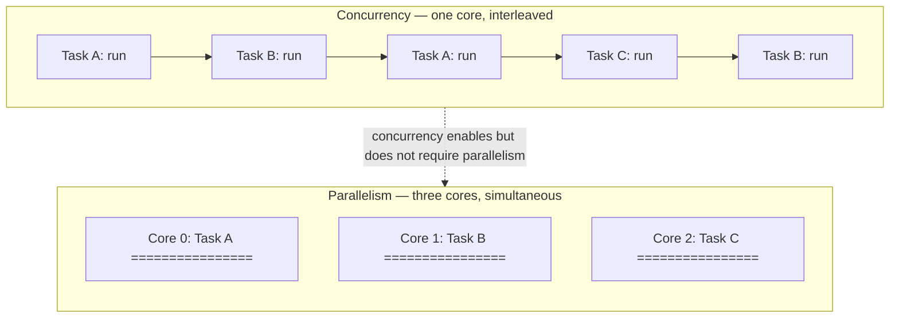
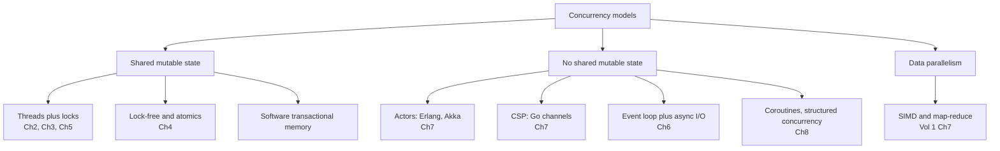
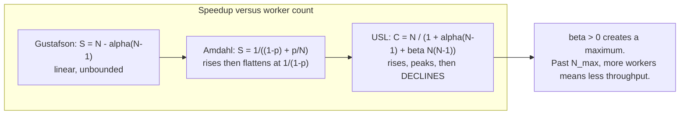
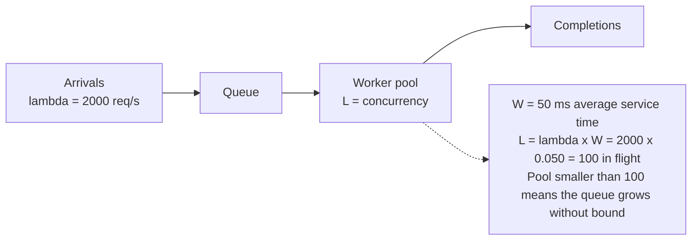

# Chapter 1 — Models of Concurrency: A Map of the Territory

**What this chapter covers.** This volume spends nine subsequent chapters dissecting mutexes and
futexes, memory models and happens-before edges, lock-free queues, event loops, actors, channels,
and structured concurrency. Before any of that, we need a map — a single frame that tells you
which of those mechanisms is even relevant to a problem in front of you, and which hazards you
have signed up for by choosing it. That is this chapter's job. We start with the distinction that
organizes everything else: concurrency is not parallelism. We then survey the models available to
you, each with an honest account of what it costs, preview the four families of hazard that the
rest of the volume exists to defeat, and develop the small body of quantitative law — Amdahl,
Gustafson, the Universal Scalability Law, and Little's Law — that lets you reason about scaling
with arithmetic rather than folklore. The chapter is deliberately broad and forward-references
aggressively; the goal is not mastery of any one model but the ability to *place* a concurrency
problem correctly, because choosing the wrong model is a mistake no amount of careful locking
later will repair.

The distributed-systems lens is unusually load-bearing here. A distributed system is concurrency
writ large: the same four hazards reappear across machines, with weaker guarantees and no shared
memory to fall back on. Nearly every idea in this volume has a twin in Volume 6, and I will point
at the twins as we go.

Learning goals — after this chapter you should be able to:

- State the concurrency/parallelism distinction precisely, and explain why backend services are
  overwhelmingly concurrency-bound rather than compute-parallel.
- Place the major concurrency models — shared memory, lock-free, actors, CSP, event loops,
  coroutines, data parallelism, STM — on a single map, and name the trade-off each makes.
- Distinguish a **data race** from a **race condition** with precision, and explain why a
  data-race-free program can still be badly broken.
- State Amdahl's Law and Gustafson's Law correctly, explain what question each actually answers,
  and stop misapplying one to the other's question.
- Use the Universal Scalability Law to explain why throughput can *decrease* as you add threads,
  and apply it to thread-pool and connection-pool sizing.
- Apply Little's Law (L = λW) to size a pool from measured arrival rate and service time.
- Choose a model deliberately for I/O-bound, CPU-bound, and coordination-heavy workloads.

## Concurrency is not parallelism

The single most useful distinction in this volume was given its canonical formulation by Rob Pike
in his 2012 talk *Concurrency Is Not Parallelism*:

> Concurrency is about *dealing with* lots of things at once. Parallelism is about *doing* lots of
> things at once.

These are not two words for one idea, and they are not points on a spectrum. They are answers to
different questions.

**Concurrency is a property of a program's structure.** It is a way of decomposing a problem into
independently executing tasks whose lifetimes overlap. A concurrent program is one that is
*composed* of activities that could, in principle, proceed independently — a request handler, a
background flusher, a health-check loop, a metrics reporter. Concurrency is about composition:
how you carve a problem into parts that can make progress without waiting for each other, and how
those parts communicate. It is a design-time property, and it is meaningful even on a machine with
exactly one core.

**Parallelism is a property of a program's execution.** It is the simultaneous execution of
multiple computations on multiple physical execution units. Parallelism is about throughput on
real hardware: two cores retiring instructions in the same cycle, eight lanes of a SIMD register
being multiplied at once, a thousand GPU threads in lockstep. It requires hardware that can do
more than one thing at an instant, and it is measured in wall-clock speedup.

The relationship between them is asymmetric, and getting the direction right matters. Concurrency
*enables* parallelism: if you have decomposed your program into independent tasks, a runtime can
schedule them onto multiple cores. But concurrency does not *require* parallelism — a concurrent
program runs perfectly well on one core by interleaving its tasks — and parallelism does not
require the kind of concurrency we mostly care about in this volume. A vectorized dot product is
parallel with no concurrent structure at all: there are no independently-progressing tasks, just
one operation applied across many data elements at once.



The practical payoff of the distinction is that it tells you what a given change can possibly buy
you. Adding cores to a program with no concurrent structure buys nothing. Adding concurrent
structure to a program that is already saturating its cores buys nothing but overhead. And — the
case that dominates backend engineering — adding concurrent structure to a program that spends its
life *waiting* buys you nearly everything, on any number of cores.

### Why backend services are concurrency-bound, not compute-bound

Consider what a typical request handler in a backend service actually does. It parses a request,
issues a query to a database, waits. It calls two internal services over gRPC, waits. It reads a
value from a cache, waits. It serializes a response and writes it to a socket, waits. Between
those waits it performs a few microseconds of actual computation: field validation, a permission
check, some JSON marshaling.

The ratio is brutal. A local NVMe read is on the order of 100 microseconds; a database query
across a data-center network is single-digit milliseconds; a call to a third-party API over the
public Internet can be hundreds of milliseconds. Against those numbers, the handler's own CPU work
— call it 50 microseconds — is a rounding error. Volume 2, Chapter 7 develops the latency
hierarchy in detail; the summary is that the gap between "compute" and "wait" in a backend service
spans four to six orders of magnitude.

This has a direct consequence for how you should think about concurrency. If a request spends 99%
of its wall-clock time blocked on I/O, then a single core can, in principle, service roughly 100
concurrent requests before the CPU is the constraint. The scarce resource is not compute — it is
the *ability to have many outstanding waits at once*. That is a concurrency problem, not a
parallelism problem. It is why an event loop on one thread (Chapter 6) can outperform a
thread-per-request server on eight cores for I/O-heavy workloads, and why "we added more cores and
nothing got faster" is such a common and predictable disappointment.

The corollary matters too: the minority of backend work that genuinely is compute-bound — image
transcoding, compression, cryptography, analytics aggregation, model inference — is a *parallelism*
problem, and should be handled with the parallelism tools (a bounded worker pool sized to cores,
data-parallel decomposition, SIMD; see Volume 1, Chapter 7) rather than with the concurrency tools.
Mixing the two up in one pool is a classic source of latency disasters: a handful of CPU-bound
tasks will occupy every worker and starve hundreds of cheap I/O-bound ones behind them.

## A taxonomy of models

There is no single concurrency model, and the choice among them is the most consequential
architectural decision in this volume. Here is the map. Each entry gets an honest statement of what
it buys and what it costs; each gets a full chapter later.



### Shared memory with locks

Threads share an address space and mutate shared data structures under mutual exclusion. This is
the default model in C, C++, Java, C#, and Rust, and the one every backend engineer must
understand whether or not they choose it, because it underlies the runtimes of the models that
claim to have escaped it.

*Buys:* Directness. Shared state is simply there — no copying, no serialization, no message
plumbing. It maps cleanly onto how the hardware actually works (Volume 1, Chapter 4), so it is
efficient when contention is low. Every language has it, every engineer has some fluency in it.

*Costs:* Every hazard in this volume. Data races if you forget to synchronize; deadlock if you
take locks in inconsistent orders; convoy effects and priority inversion under contention; and a
composability problem that is more serious than it first appears — two individually thread-safe
operations composed together are generally *not* thread-safe, so correctness does not compose the
way abstractions are supposed to. Chapters 2, 3, and 5 are largely about paying this bill.

### Lock-free and atomics

Coordination via atomic read-modify-write instructions — compare-and-swap and friends — rather than
mutual exclusion, with algorithms designed so that some thread always makes progress.

*Buys:* Immunity to the pathologies of blocking. No thread's stall, preemption, or page fault can
block all others, which makes tail latency far more predictable and makes concurrency usable in
contexts where blocking is forbidden (signal handlers, real-time paths). Under very high contention
on a small hot structure, it can also be substantially faster.

*Costs:* Difficulty that is hard to overstate. Correctness depends on memory-model fluency
(Chapter 3), the ABA problem lies in wait, and safe memory reclamation in non-GC languages is a
research-grade problem in its own right. Note carefully that lock-free does **not** mean "faster" —
it is a *progress* guarantee, not a performance one. Chapter 4 is the deep dive, and its practical
advice is to use battle-tested library implementations rather than writing your own.

### Message passing: actors and CSP

Eliminate shared mutable state entirely. Concurrent entities own their state privately and
communicate by sending messages. Two major variants:

- **Actors** (Erlang/OTP, Akka): each actor has an identity and a mailbox; you send to an actor.
  Communication is asynchronous and typically location-transparent, which is what makes the model
  scale across machines as naturally as across cores.
- **CSP** (Hoare's Communicating Sequential Processes; Go's goroutines and channels): processes are
  anonymous and you send to a *channel*. Classical CSP rendezvous is synchronous — sender and
  receiver meet — though Go offers buffered channels as well.

*Buys:* The data-race hazard is eliminated by construction, since there is no shared mutable state
to race on. Failure isolation is dramatically better — Erlang's "let it crash" plus supervision
trees is the strongest fault-tolerance story in mainstream concurrent programming. And the model
extends across the network essentially unchanged.

*Costs:* Copying overhead, message-plumbing boilerplate, and the fact that eliminating data races
does not eliminate *race conditions* — you can still have ordering bugs, and you gain some new
failure modes: unbounded mailbox growth, deadlock via cyclic waits on channels, and the difficulty
of reasoning about a system whose control flow is scattered across dozens of mailboxes. Chapter 7.

### Event-driven: the event loop

A single thread (or a small number) runs a loop that multiplexes over many non-blocking file
descriptors with `epoll`/`kqueue`/`io_uring`, dispatching callbacks as I/O becomes ready. Node.js,
nginx, and Redis are the canonical examples.

*Buys:* Enormous I/O concurrency at very low per-connection cost — a few kilobytes of heap per
connection instead of a thread stack — and, because the handler thread is single-threaded, no data
races on application state at all. That last property is why Redis can offer atomic operations
without any locking.

*Costs:* The cardinal rule is that you must never block the loop; one slow CPU-bound handler stalls
every connection, converting a throughput problem into a total outage. Callback-based control flow
is awkward (hence async/await, Chapter 8), and a single loop uses exactly one core, so you need
multiple processes or loops to use the machine. Chapter 6.

### Coroutines and structured concurrency

Lightweight, cooperatively-scheduled tasks that can suspend and resume — goroutines, Kotlin
coroutines, Python `asyncio` tasks, Java virtual threads — combined with the discipline of
*structured concurrency*: every task has a bounded lifetime tied to a lexical scope, so no task can
outlive the scope that spawned it.

*Buys:* Sequential-looking code with event-loop efficiency, and a genuine advance in reliability:
structured concurrency makes task leaks and lost errors structurally impossible rather than merely
discouraged, and gives cancellation a coherent story. Chapter 8.

*Costs:* Runtime complexity, coloring problems in some languages (async functions being callable
only from async contexts), and debugging tools that lag behind those for threads.

### Data parallelism

Apply the same operation across many data elements simultaneously: SIMD instructions, GPU kernels,
map-reduce, vectorized columnar query execution.

*Buys:* The best speedups available, when the problem fits. *Costs:* The problem must actually fit
— regular, independent, uniform work over bulk data. Most backend request-handling does not. See
Volume 1, Chapter 7.

### Software transactional memory, and why it did not take over

STM lets you mark a block as atomic and have the runtime handle it — optimistically execute,
detect conflicts, roll back and retry. It is genuinely elegant: it *composes*, which is precisely
what locks do not do, and Haskell's STM remains its best realization.

It never displaced locks, for reasons worth understanding because they recur elsewhere. The
bookkeeping overhead of tracking every read and write is high. Transactions containing side effects
that cannot be rolled back — I/O, in particular — are a fundamental problem, and Haskell's solution
(use the type system to forbid I/O inside transactions) is unavailable in most languages. Under
high contention, repeated rollback and retry wastes enormous work. Hardware support (Intel TSX)
arrived, was repeatedly found to have errata, and was eventually disabled on most parts. The lesson
generalizes: optimistic concurrency control is excellent when conflicts are rare and rollback is
cheap, and poor otherwise — the same calculus that governs optimistic versus pessimistic locking in
databases (Volume 5, Chapter 6).

## The four families of hazard

Every concurrency bug you will meet belongs to one of four families. Naming them precisely is
worth the effort, because the fixes differ.

### Data races versus race conditions

These are constantly conflated, including in otherwise careful writing, and the conflation causes
real harm. They are different things.

A **data race** is a precisely-defined, mechanical property: two threads access the same memory
location concurrently, at least one access is a write, and the accesses are not ordered by
synchronization. That is it. It is a property of an *execution* with respect to a memory model
(Chapter 3), it is machine-checkable — this is exactly what ThreadSanitizer detects (Chapter 10) —
and in C and C++ it is undefined behavior, meaning the compiler is entitled to do anything at all.

A **race condition** is a semantic property: the correctness of the program depends on the relative
timing or interleaving of operations, and some interleavings produce wrong answers. It is a bug in
your *logic*, not in your memory access discipline.

The crucial point is that neither implies the other, and the direction people miss is this one:

> **A program can be entirely free of data races and still be riddled with race conditions.**

Consider a check-then-act on a perfectly thread-safe map:

```java
// map is a ConcurrentHashMap. Every individual operation is atomic and
// thread-safe. There is no data race anywhere in this code.
if (!map.containsKey(key)) {     // thread A and thread B both observe absent
    map.put(key, computeValue()); // both compute, both put; one silently wins
}
```

Every operation here is atomic. ThreadSanitizer will report nothing. And the code is still wrong:
two threads can both pass the check, both compute, and one result is silently discarded — which
matters a great deal if `computeValue()` is expensive, or allocates a resource, or increments a
counter. The fix is not more synchronization primitives but a genuinely atomic
compound operation: `map.computeIfAbsent(key, k -> computeValue())`.

This is why "we ran the race detector and it was clean" is a much weaker statement than teams
usually take it to be. Race detectors find data races. They do not find race conditions.

### Atomicity violations

A generalization of the above: an operation that *must* be indivisible is implemented as several
steps, and another thread interleaves between them. The classic is `count++`, which is three
operations — load, add, store — and loses updates under concurrency. But the more damaging
instances are at the application level: read a balance, validate it, write a new balance; check a
quota, then consume it; read-modify-write of a config structure. Each is individually
synchronized and collectively broken. Chapter 2 covers the primitives; Chapter 9 covers the
patterns that avoid needing them.

### Ordering and visibility

The subtlest family, and the subject of Chapter 3. A write performed by one thread may not become
visible to another for an unbounded time, and the *order* in which writes become visible need not
match the order in which they were issued. This is not a hardware defect; it is the deliberate
consequence of compiler optimization, store buffers, and out-of-order execution (Volume 1,
Chapters 2 and 4). Code that is obviously correct when read sequentially can observe states that
appear impossible. Reasoning about this requires the formal machinery of happens-before, and it is
the reason Chapter 3 is the hardest chapter in this volume.

### Liveness failures: deadlock, livelock, starvation

Not wrong answers but *no* answers.

- **Deadlock:** a cycle of threads each holding a resource the next needs. Nobody proceeds, ever.
- **Livelock:** threads are actively executing and repeatedly reacting to each other, but no useful
  work completes — the two-people-in-a-corridor problem.
- **Starvation:** some thread is perpetually denied a resource it needs while others make progress;
  usually an unfairness problem rather than a cycle.

Chapter 5 treats these, including Coffman's four necessary conditions for deadlock and the
strategies that break each one.

## The quantitative laws

Concurrency discussions collapse into folklore without arithmetic. Four results do most of the
practical work.

### Amdahl's Law: the ceiling imposed by serial work

Amdahl's Law (Gene Amdahl, 1967) answers this question: *for a problem of fixed size, how much
faster does it get as I add processors?*

If a fraction **p** of the work is parallelizable and **(1 − p)** is inherently serial, then with
**N** processors the speedup is:

```
             1
S(N) = ─────────────────
        (1 − p) + p / N
```

Take the limit as N → ∞ and the parallel term vanishes:

```
S(∞) = 1 / (1 − p)
```

This is a brutal result. If 5% of your work is serial, your maximum possible speedup is 20× — no
matter how many cores you buy. At 10% serial, the ceiling is 10×. Doubling from 64 to 128 cores at
p = 0.95 moves speedup from about 15.4× to about 16.6×: you doubled the hardware for an 8% gain.

The serial fraction in a real service is rarely a single identifiable section. It is the sum of
many small things: lock acquisition, the single-threaded portion of request parsing, allocation
under a shared allocator lock, logging to one file descriptor, a shared counter's cache line. This
is why profiling for contention (Volume 2, Chapter 11) is the highest-leverage scaling work
available.

### Gustafson's Law: the answer to a different question

Amdahl is frequently quoted as proving parallelism is futile. That reading misapplies it, and
Gustafson's Law (John Gustafson and Edwin Barsis, 1988) explains why.

Amdahl fixes the *problem size* and asks how much time shrinks. Gustafson observes that in
practice people do not use bigger machines to solve the same problem faster — they use them to
solve *bigger problems in the same time*. If you fix the execution time and let the problem scale
with N, and α is the serial fraction of the *parallel* execution, the scaled speedup is:

```
S(N) = N − α(N − 1)
```

This is linear in N, not asymptotically bounded. The two laws do not contradict each other; they
answer different questions, and each is correct for its own. **Amdahl governs latency**: how much
faster can this one request get? **Gustafson governs throughput**: how much more work can I do per
unit time? For backend services the Gustafson framing is usually the relevant one — you rarely
need one request served eight times faster, you need to serve eight times as many requests — which
is exactly why horizontal scaling works as well as it does despite Amdahl's ceiling.

### The Universal Scalability Law: why more can be worse

Both Amdahl and Gustafson are optimistic in the same way: they assume that adding capacity is at
worst neutral. Reality is harsher. Neil Gunther's **Universal Scalability Law** adds a second
penalty term:

```
                     N
C(N) = ─────────────────────────────
        1 + α(N − 1) + β·N(N − 1)
```

where **α** is the *contention* coefficient (serialization — queueing for a shared resource, the
Amdahl term) and **β** is the *coherency* coefficient (crosstalk — the cost of keeping N workers'
views of shared state consistent).

The β term is the important one, and it is quadratic. Contention flattens the curve; coherency
*bends it back down*. With β > 0, C(N) has a maximum, after which **adding workers reduces
throughput**. That is not a theoretical curiosity — it is the single most commonly observed
scaling behavior in production backend systems, and it has a concrete physical cause: cache-line
ping-pong between cores (Volume 1, Chapters 4 and 8), lock convoys, and the O(N²) communication
implied by N workers coordinating pairwise.



The operational lesson is direct: **there is an optimal pool size, and it is not "as many as
possible."** Thread pools, database connection pools, and worker fleets all exhibit this. The
canonical demonstration is connection pooling — teams routinely discover that a pool of 300
database connections delivers *lower* throughput and far worse tail latency than a pool of 20,
because the database is a shared resource whose contention and coherency costs grow with
concurrent clients. You find the peak by measurement, not by intuition, and the USL gives you a
model to fit measurements to.

### Little's Law: the sizing identity

The most practically useful queueing result, and one of the most general — Little's Law (John
Little, 1961) holds for any stable queueing system regardless of arrival distribution, service
distribution, or scheduling discipline:

```
L = λ · W
```

where **L** is the average number of items in the system, **λ** the average arrival rate, and **W**
the average time an item spends in the system. Stated for a service: *the average number of
requests in flight equals the arrival rate times the average latency.*

Its power is that you usually know two of the three and want the third.



Worked example: your service receives 2,000 requests per second and each takes 50 ms end to end.
Then L = 2000 × 0.050 = **100 requests in flight on average**. If your thread pool has 100 workers,
you are exactly at capacity with no headroom for variance — a bad place to be. If it has 40, the
queue grows without bound and latency diverges. If it has 5,000, you have provisioned 50× the
memory and context-switching overhead you need, and you are likely past the USL peak.

Run it the other direction to derive a latency budget: if you have 200 workers and want to hold
p50 latency at 20 ms, your sustainable arrival rate is λ = L/W = 200/0.020 = 10,000 req/s.

Two cautions. First, the law applies to a *stable* system — one where arrival rate does not exceed
service capacity. Applying it to an overloaded system produces nonsense, because W is diverging.
Second, it describes averages, not tails; the tail behavior that actually determines your SLO
requires the queueing-theory machinery in Volume 11.

Used together, the laws form a coherent method: **Little's Law sizes the pool, and the USL tells
you whether that size is past the point where more workers hurt.** If Little's Law says you need
300 concurrent workers but the USL peak for your workload is at 80, you do not have a pool-sizing
problem — you have an architecture problem, and the answer is to reduce W (make requests faster) or
to shard the contended resource, not to add workers.

## Choosing a model

The decision is mostly determined by the workload, and the errors are predictable.

| Workload | Fitting model | Why |
|---|---|---|
| High-volume I/O-bound request serving | Event loop, coroutines, virtual threads | Waits dominate; per-task cost must be tiny |
| CPU-bound work (transcode, compress, infer) | Bounded pool sized to cores; data parallelism | Compute dominates; more tasks than cores only adds overhead |
| Stateful coordination (sessions, game state, devices) | Actors | State partitions naturally per entity; serial mailbox removes races |
| Pipeline / fan-out-fan-in dataflow | CSP channels | Composition and backpressure are first-class |
| Shared in-process cache or index | Shared memory, sharded locks or lock-free | Genuinely shared data; copying is unaffordable |
| Bulk numeric transformation | SIMD, GPU, map-reduce | Regular, independent, uniform work |

Three failure modes account for most real-world grief:

1. **Blocking calls inside an event loop or coroutine runtime.** One synchronous JDBC call or
   `time.sleep` in an async handler stalls everything sharing that loop. This is the most common
   async bug in production, and it is why runtimes provide separate blocking-work pools.
2. **Mixing CPU-bound and I/O-bound work in one pool.** A few expensive tasks occupy every worker
   and starve hundreds of cheap ones. Separate the pools; give each a bulkhead (Chapter 9).
3. **Sizing pools by intuition.** "More threads means more throughput" is false past the USL peak,
   and the failure is silent: throughput degrades gradually while latency tails explode.

## The distributed-systems lens

Here is the claim that should reframe the rest of this volume: **a distributed system is a
concurrent system whose threads run on separate machines, communicate only by messages, and can
fail independently.** Every hazard in this chapter reappears at that scale, with weaker guarantees
and worse tools.

The correspondences are close to exact:

| In-process concurrency | Distributed equivalent | Where |
|---|---|---|
| Mutual exclusion (mutex) | Distributed lock, leader election, consensus | Vol 6 Ch6, Ch8 |
| Happens-before (Chapter 3) | Lamport clocks, vector clocks, causal consistency | Vol 6 Ch2 |
| Memory consistency models | Linearizability, sequential and eventual consistency | Vol 6 Ch3, Ch4 |
| Cache coherence between cores | Replication and invalidation between nodes | Vol 6 Ch4 |
| Compare-and-swap (Chapter 4) | Conditional writes, ETags, MVCC, optimistic transactions | Vol 5 Ch6 |
| Actor mailbox | Service endpoint, message queue | Vol 6 Ch9 |
| Deadlock | Distributed deadlock, cyclic RPC waits | Vol 5 Ch6 |
| Lock striping / sharding | Partitioning and sharding | Vol 6 Ch5 |
| Thread starvation | Metastable failure, retry storms | Vol 11 |

That happens-before appears in both columns is not an analogy: it is *literally the same relation*.
Lamport's 1978 paper "Time, Clocks, and the Ordering of Events in a Distributed System" defined
happens-before for distributed systems, and the Java Memory Model adopted the same formalism for
shared memory two decades later. Learning it once in Chapter 3 pays twice.

The differences are what make distribution harder, and they are worth stating precisely. Within a
process, a "thread failure" that leaves shared state half-updated generally takes the whole process
down with it — you fail together. Across machines, **partial failure** is the normal case: one node
dies while others continue, holding a lock nobody will release, or worse, is merely *slow* and
indistinguishable from dead. Message delivery is unreliable and unordered where memory access is
not. There is no shared clock. These are why a distributed mutex needs fencing tokens and lease
expiry where an in-process mutex needs neither (Chapter 2 closes on exactly this point), and why
consensus is a research field while `pthread_mutex_lock` is a library call.

Finally, the USL explains a phenomenon at both scales with one model. Adding threads past the peak
reduces throughput because of coherency traffic between cores; adding *nodes* past the peak reduces
throughput because of coordination traffic between machines. It is the same β term. This is the
quantitative reason that shared-nothing architectures dominate at scale: driving β toward zero by
eliminating coordination is the only way to make the curve keep rising, and every technique you
will meet in Volume 6 for doing so — partitioning, eventual consistency, CRDTs, caching — is an
attack on that one coefficient.

## Key takeaways

- **Concurrency is structure; parallelism is execution.** Concurrency is about composing
  independently-progressing tasks and is meaningful on one core; parallelism is simultaneous
  execution on multiple units. Concurrency enables parallelism but does not require it.
- **Backend services are overwhelmingly concurrency-bound.** Requests spend the vast majority of
  their wall-clock time waiting on I/O, so the scarce resource is outstanding waits, not compute.
  Adding cores to a waiting program buys nothing.
- **A data race and a race condition are different bugs.** A data race is unsynchronized concurrent
  access with at least one write — mechanical, detectable by ThreadSanitizer, undefined behavior in
  C/C++. A race condition is a logic-level timing dependency. Data-race-free code can still be
  thoroughly broken, so a clean race-detector run proves much less than teams assume.
- **The four hazard families** are races (data and logical), atomicity violations, ordering and
  visibility failures, and liveness failures (deadlock, livelock, starvation).
- **Amdahl and Gustafson answer different questions.** Amdahl fixes problem size and bounds latency
  speedup at 1/(1 − p); Gustafson scales the problem with the machine and yields linear throughput
  growth. Backend scaling is usually a Gustafson question.
- **The USL is the law that matches production reality.** Its quadratic coherency term β means
  throughput peaks and then *declines* — there is an optimal pool size and it is not "as many as
  possible."
- **Little's Law (L = λW) sizes pools from measurements.** 2,000 req/s at 50 ms means 100 requests
  in flight. Use it with the USL: Little's Law tells you the size you need, the USL tells you
  whether that size is achievable or whether you must fix the architecture instead.
- **Choose the model from the workload**, and avoid the three classic errors: blocking inside an
  event loop, mixing CPU-bound and I/O-bound work in one pool, and sizing pools by intuition.
- **A distributed system is concurrency writ large.** The same hazards recur across machines with
  partial failure, unreliable messaging, and no shared clock. Happens-before is literally the same
  relation in both settings.

## Further reading

- Pike, R., *Concurrency Is Not Parallelism* (Heroku Waza, 2012) — the talk that fixed the
  distinction in the profession's vocabulary. <https://go.dev/blog/waza-talk>
- Amdahl, G., "Validity of the Single Processor Approach to Achieving Large Scale Computing
  Capabilities," *AFIPS Conference Proceedings*, 1967 — the original statement of the ceiling.
- Gustafson, J., "Reevaluating Amdahl's Law," *Communications of the ACM* 31(5), 1988 — the
  scaled-speedup counterpoint. <https://dl.acm.org/doi/10.1145/42411.42415>
- Gunther, N., *Guerrilla Capacity Planning* (Springer, 2007) — the Universal Scalability Law, its
  derivation, and how to fit α and β to measured data.
- Little, J. D. C., "A Proof for the Queuing Formula L = λW," *Operations Research* 9(3), 1961.
- Herlihy, M. and Shavit, N., *The Art of Multiprocessor Programming*, 2nd ed. (Morgan Kaufmann,
  2020) — the standard rigorous text on progress conditions and concurrent data structures.
- Goetz, B. et al., *Java Concurrency in Practice* (Addison-Wesley, 2006) — still the best
  practical treatment of the shared-memory model and its hazards.
- Hoare, C. A. R., "Communicating Sequential Processes," *Communications of the ACM* 21(8), 1978 —
  the foundation of the CSP model. <https://dl.acm.org/doi/10.1145/359576.359585>
- Armstrong, J., *Making Reliable Distributed Systems in the Presence of Software Errors* (PhD
  thesis, KTH, 2003) — the actor model and "let it crash" as realized in Erlang/OTP.
- Lamport, L., "Time, Clocks, and the Ordering of Events in a Distributed System," *CACM* 21(7),
  1978 — happens-before, and the bridge between this volume and Volume 6.
- Shavit, N. and Touitou, D., "Software Transactional Memory," *PODC*, 1995; and Harris, T. et al.,
  "Composable Memory Transactions," *PPoPP*, 2005 — STM and the composability argument.
- Volume 1, Chapter 4 — Caches and Cache Coherence — the hardware source of the USL's β term.
- Volume 2, Chapter 7 — The Latency Hierarchy — the numbers behind "backend work is I/O-bound."
- Volume 11 — Queueing theory and tail latency, where Little's Law is developed properly.
