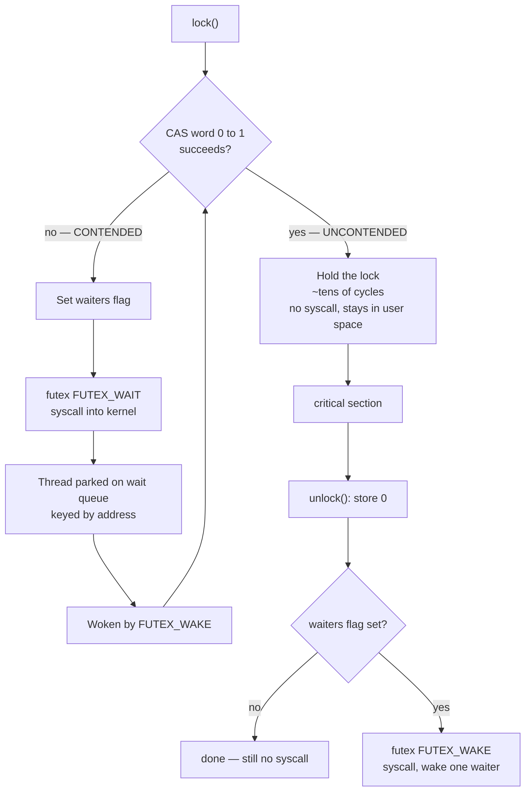
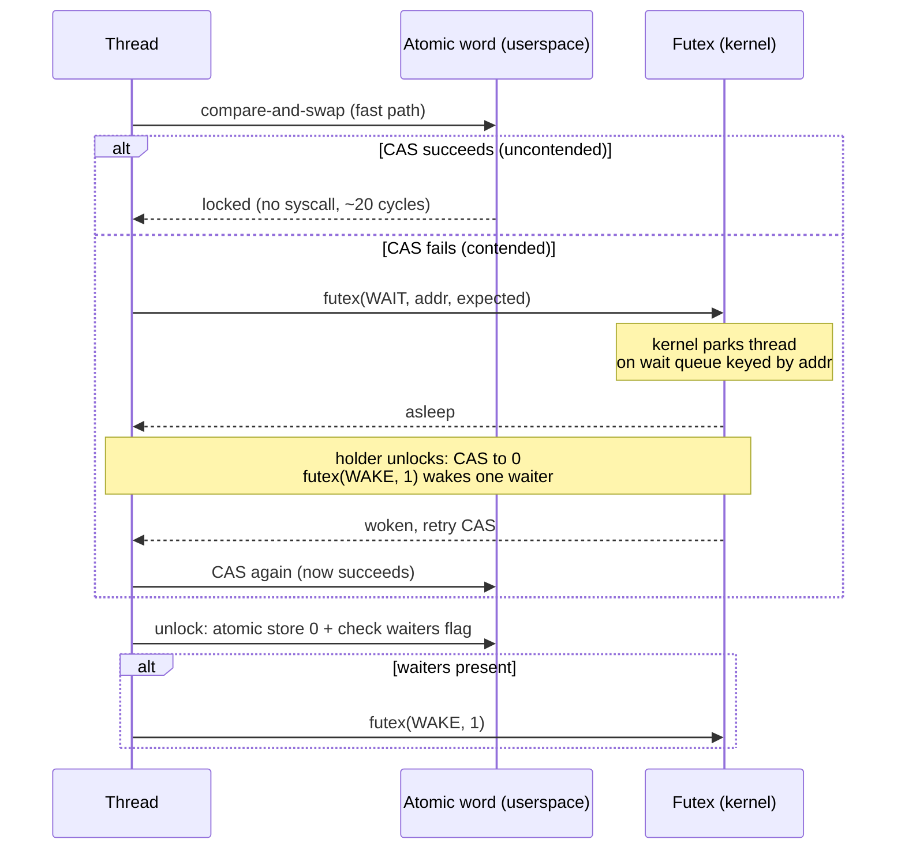
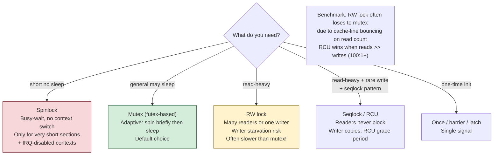
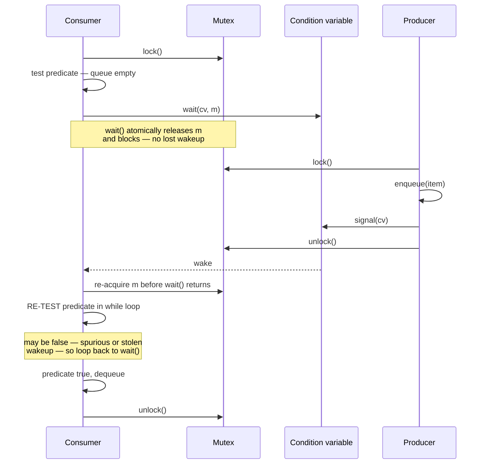
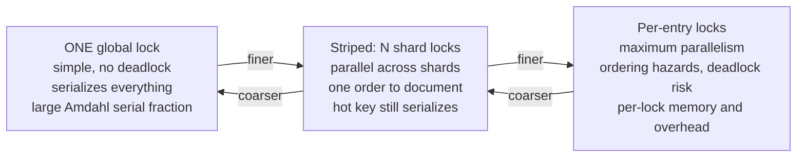
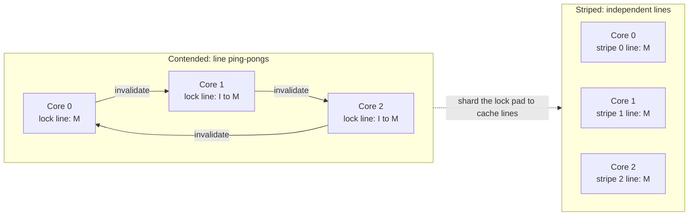
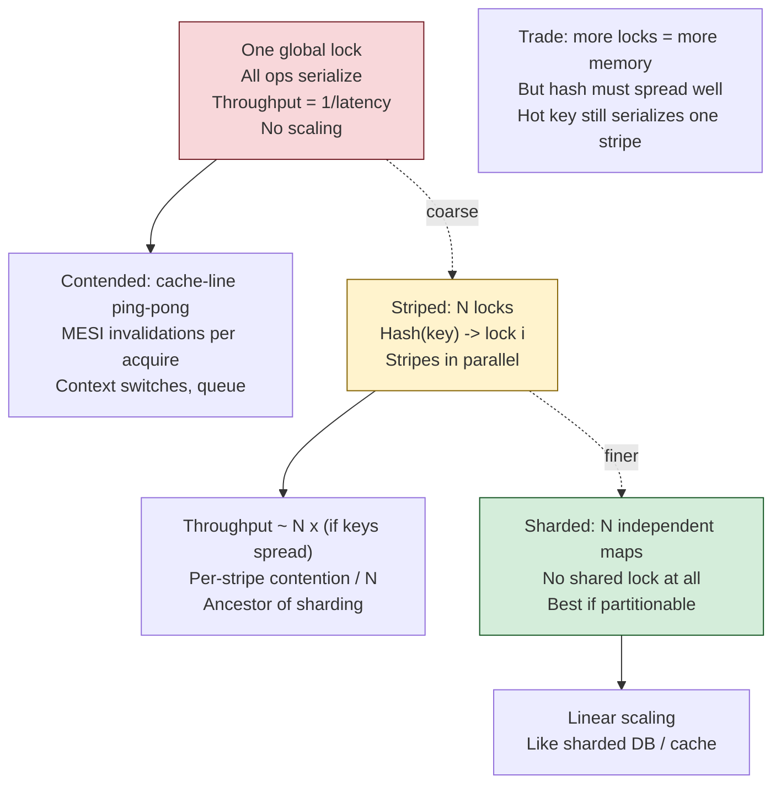

# Chapter 2 — Threads, Mutual Exclusion, and Locks

**What this chapter covers.** Chapter 1 placed shared-memory-with-locks on the map and noted that
you must understand it whether or not you choose it, because it underlies the runtimes of every
model that claims to have escaped it. This chapter is that understanding, done rigorously. We
begin with the critical-section problem and the three properties any correct solution must have.
We then open up a mutex and look at what is actually inside one on Linux — an atomic operation on
a word in user space for the uncontended case, and a `futex` syscall to park the thread when
contended — because that fast-path/slow-path split explains almost every performance behavior
locks exhibit. From there we survey the full family of locking primitives and say honestly when
each is appropriate, including the several that are more often wrong than right. We cover
condition variables and the mandatory `while` loop that everyone eventually learns the hard way,
semaphores, barriers, and latches. Finally we develop the cost model — what contention actually
costs in cache-coherence traffic and context switches — and the granularity trade-off that leads
to lock striping, which is the in-process ancestor of sharding.

This chapter is about *mechanism*. Chapter 3 supplies the formal memory-model reasoning that
explains why these primitives give the visibility guarantees they do; Chapter 5 covers what
happens when locking goes wrong in the liveness dimension. Read this one first, but do not
consider the topic closed until you have read Chapter 3.

Learning goals — after this chapter you should be able to:

- State the three requirements of a correct mutual-exclusion solution and recognize violations.
- Explain the futex fast-path/slow-path design and predict from it why an uncontended lock costs
  tens of cycles while a contended one can cost microseconds.
- Choose correctly among spinlocks, adaptive mutexes, reader-writer locks, seqlocks, and RCU, and
  explain why reader-writer locks so often disappoint.
- Write correct condition-variable code, and explain precisely why the `while` loop is mandatory.
- Distinguish a semaphore from a mutex on the basis of ownership, and know when each fits.
- Reason quantitatively about lock contention in terms of cache-line ping-pong and context
  switches, and apply lock striping to reduce it.
- Explain why a distributed lock is a fundamentally harder object than an in-process mutex, and
  what fencing tokens are for.

## The critical-section problem

The problem is stated the same way it was in 1965, when Dijkstra formalized it. Multiple threads
each have a section of code — the *critical section* — that accesses shared data. We need a
protocol governing entry and exit such that three properties hold:

1. **Mutual exclusion.** At most one thread is in the critical section at a time. This is the
   safety property, and it is the one everyone remembers.
2. **Progress.** If no thread is in the critical section and some threads want to enter, one of
   them must be able to. The selection cannot be postponed indefinitely, and threads *not*
   attempting entry must not participate in the decision. This rules out protocols that deadlock
   when a thread outside the critical section stalls.
3. **Bounded waiting.** There is a bound on the number of times other threads can enter the
   critical section after a thread has requested entry and before that request is granted. This is
   the fairness property that prevents starvation (Chapter 5).

Most bugs in hand-rolled synchronization violate 2 or 3 while satisfying 1, which is why they pass
casual testing — the program is *correct*, it just occasionally stops making progress or starves a
thread under load. That is also why you should not hand-roll synchronization: Dekker's and
Peterson's algorithms are worth studying for insight, but they are wrong on modern hardware unless
decorated with memory barriers (Chapter 3), and they are strictly worse than the primitives your
platform provides.

## What is actually inside a mutex

A mutex is not a kernel object that you call into on every acquisition. If it were, every lock
would cost a syscall — hundreds of nanoseconds minimum (Volume 2, Chapter 5) — and shared-memory
concurrency would be unusable. The design that makes locks cheap is the **fast path / slow path**
split, and on Linux the slow path is built on `futex` (fast userspace mutex).

The mutex is a word in ordinary user memory. Acquisition works like this:

- **Fast path (uncontended).** Atomically compare-and-swap the word from 0 (unlocked) to 1
  (locked). If the CAS succeeds, you hold the lock. That is the entire operation: **one atomic
  instruction, no syscall, no context switch.** It costs on the order of tens of cycles — roughly
  the cost of an L1 or L2 access plus the atomic's overhead — because the cache line holding the
  word is already in your core's cache in exclusive state.
- **Slow path (contended).** The CAS fails, meaning someone else holds the lock. Rather than spin
  forever, the thread marks the word to indicate waiters exist and calls
  `futex(FUTEX_WAIT, addr, expected)`. The kernel atomically re-checks that the word still holds
  `expected` — closing the race where the lock was released between the failed CAS and the syscall
  — and if so, puts the thread to sleep on a wait queue keyed by the address. On release, the
  holder sees the waiters flag and calls `futex(FUTEX_WAKE, addr, 1)` to wake one waiter.



The consequences of this design are worth stating explicitly, because they drive practical
guidance throughout this volume:

- **Uncontended locks are nearly free.** The common advice to "avoid locks because they are slow"
  is wrong as stated. An uncontended mutex acquisition is a single atomic operation. If your locks
  are uncontended, they are not your problem.
- **Contended locks are expensive by a factor of hundreds to thousands.** The contended path costs
  two syscalls plus a context switch out and back — call it several microseconds against tens of
  nanoseconds. This is why contention, not locking per se, is the thing to measure and attack.
- **The cost is bimodal, not gradual.** As contention rises you do not see a smooth degradation;
  you see a cliff as acquisitions shift from the fast path to the slow path. This is one reason
  latency distributions under load develop such ugly tails.

The same architecture appears under other names elsewhere: Windows uses `SRWLOCK` and
`WaitOnAddress`, and the JVM's `synchronized` uses a related escalation from thin (CAS-based) to
inflated (OS-monitor) locks. The details differ; the fast-path/slow-path principle does not.




## The family of locks

### Spinlocks

A spinlock busy-waits — repeatedly testing the word in a loop — rather than parking the thread.
The trade-off is simple to state and easy to get wrong: **spin when the expected hold time is
shorter than the cost of a context switch; park otherwise.** A context switch costs on the order
of a microsecond once you count the direct cost plus the cache and TLB pollution that follows
(Volume 2, Chapters 1 and 2), so spinning wins only for critical sections measured in tens or
hundreds of nanoseconds.

Two rules matter in practice. First, a naive spinlock that hammers an atomic CAS in a tight loop
generates continuous cache-line invalidation traffic and can slow down the very thread holding the
lock; the standard fix is *test-and-test-and-set* — spin on an ordinary read, and only attempt the
atomic when the read suggests the lock is free — plus a CPU pause hint (`PAUSE` on x86, `YIELD` on
ARM) in the loop body.

Second, and more important for backend engineers: **never spin on an oversubscribed core.** If
more runnable threads exist than cores, the thread you are spinning to wait for may itself be
descheduled, and you will burn your entire time slice waiting for a thread that cannot run until
you stop. This is why spinlocks are appropriate in kernels and in carefully-pinned latency-critical
code, and are almost always the wrong choice in an application running in a container with a CPU
quota — where the scheduler can and will deschedule your lock holder at the worst moment (Volume 2,
Chapter 2).

### Adaptive mutexes

The pragmatic synthesis: spin briefly, then park. Most implementations spin for a bounded number of
iterations on the theory that short critical sections will release quickly, and fall back to the
futex path if that fails. Some adapt the spin count based on observed history or on whether the
lock holder is currently running on another core. This is the default behavior of
`pthread_mutex_t` on glibc under contention and of the JVM's monitors, and it is the right default
for application code.

### Recursive (reentrant) locks

A recursive lock may be acquired repeatedly by the thread that already holds it, maintaining a
count and releasing only when the count reaches zero. Java's `synchronized` and `ReentrantLock` are
recursive; `pthread_mutex_t` is not unless you set `PTHREAD_MUTEX_RECURSIVE`.

Recursion is occasionally necessary, but it is more often a signal that you have lost track of your
locking discipline. If a function must work both when called with the lock held and when called
without, you generally have two functions fighting to be one; the cleaner structure is a public
method that acquires the lock and a private `_locked` variant that assumes it, with the invariant
documented. Recursive locks also interact badly with condition variables — waiting on a condition
releases the lock only once, not the full recursion count, which deadlocks — and they make it much
harder to reason about the invariants that hold at lock-acquisition boundaries.

### Reader-writer locks, and why they disappoint

An RW lock permits either many concurrent readers or one exclusive writer. The intuition is
obvious: reads do not conflict with each other, so let them proceed in parallel. For
read-heavy workloads this should be a large win.

It frequently is not, and the reason is worth understanding because it generalizes. To admit
multiple readers, the lock must track *how many* readers are active — which means every reader
must atomically modify a shared counter on acquisition and again on release. That counter lives in
one cache line. Every reader on every core therefore performs a read-modify-write on the same cache
line, forcing it to bounce between cores in exclusive state (Volume 1, Chapter 4). The readers do
not conflict logically, but their *bookkeeping* conflicts physically on every single operation.

The result is that under high read concurrency with short critical sections, a reader-writer lock
can be **slower than a plain mutex**, because a plain mutex touches the same one cache line but
does strictly less work per operation. RW locks pay off when critical sections are long enough that
genuine reader parallelism outweighs the coherence traffic on the counter — think milliseconds of
work under the lock, not nanoseconds.

There is a second problem: **writer starvation**. A steady stream of readers can keep the lock
perpetually in read mode, and a waiting writer never gets in. Implementations respond with policy
knobs — reader-preferring (maximum read throughput, writers can starve), writer-preferring (new
readers block once a writer is waiting, which risks reader starvation and convoying), or fair FIFO
queueing (no starvation, but loses much of the concurrency benefit). Know which policy your
implementation uses; the default varies by platform and the failure modes are quite different.

Practical guidance: reach for an RW lock only when you have *measured* a read-dominated workload
with substantial time under the lock, and measure again afterward. For the common case of a hot
in-memory map, sharded plain mutexes or a concurrent map implementation will usually beat an RW
lock (Chapter 9).

### Seqlocks

A sequence lock optimizes for the case where reads vastly outnumber writes and readers must never
block writers. A counter is incremented before and after each write, making it odd during a write
and even at rest. A reader snapshots the counter, reads the data, then re-reads the counter: if it
changed or was odd, the read was torn and the reader retries.

The properties are unusual. Readers take no locks and perform no writes at all, so there is no
coherence traffic from reading — this is the key advantage over an RW lock. Writers are never
blocked by readers. The costs: readers may retry indefinitely under write pressure, the protocol
requires careful memory barriers to be correct (Chapter 3), and the data being read must tolerate
being observed in a torn state and discarded — so it must not contain pointers the reader will
dereference. The Linux kernel uses seqlocks for exactly the right sort of thing: reading the system
time, which is written rarely and read constantly.

### RCU, conceptually

Read-Copy-Update is the Linux kernel's most aggressive answer to the read-mostly problem, and it is
worth understanding conceptually even if you never write kernel code, because its idea recurs in
user space.

Readers execute with essentially **zero synchronization overhead** — no atomics, no barriers on
strongly-ordered architectures, just an ordinary pointer dereference bracketed by markers that
delimit a read-side critical section. A writer never mutates data in place. Instead it copies the
structure, modifies the copy, and atomically publishes a new pointer. Readers that started before
the update continue to see the old version, which remains valid; readers that start after see the
new one.

The hard part is reclamation: when can the old version be freed? Only once every reader that might
still hold a reference has finished. RCU answers this with the notion of a *grace period* — a
wait until every CPU has passed through a quiescent state, guaranteeing no pre-existing reader
remains. That deferred-reclamation problem is exactly the one Chapter 4 confronts for lock-free
structures, where it is solved with hazard pointers and epoch-based reclamation. Note that garbage-
collected languages get this for free, which is a large part of why lock-free and RCU-like patterns
are so much easier in Java and Go than in C.

### Comparison

| Primitive | Reader cost | Writer cost | Blocks readers? | Best fit |
|---|---|---|---|---|
| Mutex | Full exclusion | Full exclusion | Yes | General purpose; short critical sections |
| Spinlock | Busy-wait | Busy-wait | Yes | Very short sections, pinned threads, no oversubscription |
| RW lock | Atomic on shared counter | Exclusive | Yes | Long read sections, measured read-dominance |
| Seqlock | Two counter reads, may retry | Increment, write, increment | No | Read-mostly small data, e.g. timekeeping |
| RCU | Essentially free | Copy, publish, wait for grace period | No | Extremely read-dominated; needs reclamation scheme |




## Condition variables and monitors

A lock provides mutual exclusion. It does not provide a way to *wait for a condition* — "wait until
the queue is non-empty," "wait until the connection pool has a free slot." That is what condition
variables are for, and together with a mutex they form what Hoare and Brinch Hansen called a
**monitor**.

The protocol has three operations. `wait(cv, mutex)` atomically releases the mutex and blocks the
calling thread; when it returns, the mutex has been re-acquired. `signal`/`notify` wakes one waiter;
`broadcast`/`notifyAll` wakes all of them. The atomicity of release-and-block in `wait` is
essential: if the release and the block were separate steps, a signal arriving between them would
be lost forever — the **lost wakeup** problem.

### The `while` loop is mandatory

Every condition-variable wait must be inside a loop that re-tests the predicate. Not an `if`. A
`while`.

```c
pthread_mutex_lock(&m);
while (queue_is_empty(&q)) {        // WHILE, never IF
    pthread_cond_wait(&cv, &m);     // atomically unlocks m and blocks;
}                                   // re-locks m before returning
item = queue_pop(&q);
pthread_mutex_unlock(&m);
```

There are three independent reasons, and each alone is sufficient:

1. **Spurious wakeups.** POSIX explicitly permits `pthread_cond_wait` to return without any
   corresponding signal. This is not a defect — allowing it makes the implementation
   simpler and faster on some platforms, and the specification makes the allowance precisely so
   that correct code must already be robust to it. Java says the same of `Object.wait`.
2. **Stolen wakeups.** Between the signal and your thread actually running, a third thread may
   acquire the mutex and consume the item you were woken for. You wake, you hold the lock, and the
   condition is false again.
3. **`broadcast` semantics.** If the code ever uses `notifyAll` — or if multiple distinct
   conditions share one condition variable — most woken threads will find their predicate false and
   must go back to sleep.

The `while` loop makes all three harmless with one line, which is why the rule is absolute rather
than situational. The equivalent Java is identical in structure:

```java
synchronized (lock) {
    while (queue.isEmpty()) {   // WHILE
        lock.wait();
    }
    item = queue.poll();
}
```



A further subtlety: whether you signal while holding the mutex or after releasing it is a
performance question, not a correctness one. Signaling while holding can cause the woken thread to
immediately block again on the mutex you still hold — the "hurry up and wait" pattern. Modern
implementations largely optimize this away with wait-queue transfer, so signal wherever it makes
the code clearer, and measure if it matters.

## Semaphores, barriers, and latches

A **counting semaphore** holds a non-negative count with two operations: `acquire` (P/wait)
decrements, blocking while the count is zero, and `release` (V/post) increments and wakes a waiter.
It is a permit dispenser, and it is the natural primitive for bounding access to a pool of N
interchangeable resources — connections, buffers, in-flight requests.

The distinction from a mutex is **ownership**, and it is not pedantry. A mutex has an owner: the
thread that locked it is the thread that must unlock it, which lets the implementation support
recursion, priority inheritance, and error checking. A semaphore has no owner — one thread may
acquire and a completely different thread release. That makes a binary semaphore *not* a drop-in
mutex, and it makes semaphores the right tool for signaling between threads, which is what people
usually build them for.

The most useful backend application is the bulkhead: a semaphore with N permits caps concurrent
calls to a downstream dependency, so a slow dependency consumes at most N of your threads instead
of all of them. Chapter 9 develops this pattern.

**Barriers** synchronize a group: every participant blocks at the barrier until all have arrived,
then all proceed. This fits phase-structured parallel computation — iterate, synchronize, iterate —
and is common in data-parallel work and rare in request handling.

**Latches** are the one-shot cousin: a counter that counts down to zero and then releases everyone
permanently. Java's `CountDownLatch` is the canonical form, and the usual backend use is startup
coordination — hold the readiness probe until N subsystems have initialized.

## Granularity, striping, and the cost of contention

### The granularity trade-off

**Coarse-grained** locking uses one lock for a large body of state. It is simple, easy to reason
about, and nearly impossible to deadlock with a single lock — but it serializes everything, and by
Amdahl's Law (Chapter 1) that serial fraction caps your scaling.

**Fine-grained** locking uses many locks over smaller regions. It permits genuine parallelism, but
it multiplies the number of locks a given operation must hold, which invites deadlock through
inconsistent acquisition order (Chapter 5) and adds per-lock overhead that can exceed the
parallelism gained.



### Lock striping

The standard resolution for hash-based structures is **striping**: partition the data into N
independent shards, each with its own lock, and route each key to a shard by its hash. Operations
on different shards proceed in parallel; only same-shard operations contend. This was the design of
Java's `ConcurrentHashMap` before Java 8 (which moved to per-bin CAS plus synchronized bins, a
finer-grained variant of the same idea).

```java
final class StripedMap<K, V> {
    private static final int STRIPES = 64;   // power of two
    private final Object[] locks = new Object[STRIPES];
    @SuppressWarnings("unchecked")
    private final Map<K, V>[] shards = new HashMap[STRIPES];

    StripedMap() {
        for (int i = 0; i < STRIPES; i++) {
            locks[i]  = new Object();
            shards[i] = new HashMap<>();
        }
    }

    private int stripeFor(Object key) {
        // spread the hash so that poor hashCode implementations do not
        // collapse onto one stripe
        int h = key.hashCode();
        h ^= (h >>> 16);
        return h & (STRIPES - 1);
    }

    V get(K key) {
        int i = stripeFor(key);
        synchronized (locks[i]) { return shards[i].get(key); }
    }

    V put(K key, V value) {
        int i = stripeFor(key);
        synchronized (locks[i]) { return shards[i].put(key, value); }
    }
}
```

Two caveats travel with striping. First, operations that must span all shards — `size()`, `clear()`,
iteration — either take every lock (expensive, and an ordering hazard) or return an approximate
answer. Concurrent collections generally choose approximation, which is why `ConcurrentHashMap.size()`
is documented as an estimate. Second, striping only helps if keys distribute evenly; a hot key
concentrates all its traffic on one stripe and you are back to a single lock. That is exactly the
hot-partition problem in distributed sharding (Volume 6, Chapter 5) — the same failure at a
different scale.

### What contention actually costs

The cost model has two components, and only one is the syscall.

**Cache-line ping-pong.** A lock word touched by threads on different cores must migrate between
their caches. Under the MESI protocol (Volume 1, Chapter 4), each acquisition requires the line in
Exclusive/Modified state, invalidating every other copy. On a multi-socket machine, crossing the
interconnect costs on the order of 100+ nanoseconds *per transfer*, and the line transfers on every
acquisition and release. This cost is paid even when the lock is technically uncontended in the
sense that no one blocked — merely being touched by multiple cores is enough.

This is also where **false sharing** bites (Volume 1, Chapter 8): if two independent locks land in
the same 64-byte cache line, threads contending for entirely unrelated locks will invalidate each
other's line, producing contention that does not exist in the source code. The fix is padding, and
in striped designs it is essential — an array of 64 lock objects that share cache lines will
perform far worse than the same array padded to a line each.

**Context switches.** Once a thread parks, you pay the direct switch cost plus the indirect cost of
a cold cache and TLB on resumption. This is what turns the contended path from "somewhat slower"
into "hundreds of times slower."



The Universal Scalability Law from Chapter 1 now has a concrete physical referent: **α is the
serialization from mutual exclusion, and β is this cache-coherence traffic.** That is why adding
threads past a point reduces throughput, and why the fix is to eliminate sharing rather than to
lock it more cleverly.




## Practical guidance

Rules that survive contact with production:

- **Hold locks briefly.** The duration of the critical section is the direct determinant of
  contention. Compute outside the lock, mutate inside it.
- **Never perform I/O under a lock.** A network call under a mutex converts a millisecond of
  latency into a millisecond of blocked threads, and it is the fastest route to a lock convoy.
- **Never call unknown code under a lock.** Invoking a user-supplied callback, a listener, or an
  overridable method while holding a lock means you have no idea what locks that code will take —
  it is an open invitation to deadlock (Chapter 5). Java's documented practice of calling listeners
  outside the lock exists for this reason.
- **Establish and document a lock ordering.** If a code path can hold two locks, there must be a
  global order and it must be written down. This is the single most effective deadlock prevention.
- **Prefer not sharing at all.** Immutability, thread confinement, and per-thread state eliminate
  the problem instead of managing it. An immutable object needs no synchronization to be safely
  read by any number of threads (with the safe-publication caveat of Chapter 3).
- **Measure contention, do not guess at it.** `perf lock`, JFR lock profiling, Go's mutex profiler,
  and `/proc/lock_stat` will tell you which locks actually block and for how long (Volume 2,
  Chapter 11). Intuition about which lock is hot is reliably wrong.

**Priority inversion** deserves a note. A low-priority thread holding a lock can block a
high-priority thread, and if a medium-priority thread then preempts the low-priority holder, the
high-priority thread waits behind work strictly less important than itself. The Mars Pathfinder
lander famously suffered repeated resets from exactly this in 1997. The standard fix is *priority
inheritance*: the lock holder temporarily inherits the priority of the highest-priority waiter.
This matters in real-time systems; in a normal backend service on CFS it rarely does, but the
analogous phenomenon — a low-importance background job holding a lock that request handlers need —
is very real, and the fix is the same in spirit: do not let low-priority work hold resources that
latency-critical work depends on.

## The distributed-systems lens

A mutex provides mutual exclusion among threads sharing memory in one process. The distributed
equivalent — mutual exclusion among processes on different machines, implemented with etcd,
ZooKeeper, or Redis — looks superficially like the same object and is fundamentally harder. The
reasons are exactly the differences catalogued at the end of Chapter 1.

**Partial failure.** If a thread holding an in-process mutex dies, the process generally dies with
it, so the question of an orphaned lock rarely arises. If a *node* holding a distributed lock dies,
everyone else is left waiting on a lock that will never be released. The standard answer is a
**lease**: the lock expires automatically after a TTL, and the holder must renew it. This trades a
liveness failure for a safety hazard, which brings us to the central problem.

**You cannot distinguish a dead node from a slow one.** A lock holder that is merely paused — GC
pause, page fault storm, a descheduled container, a network blip — may believe it still holds the
lock long after its lease expired and another node acquired it. Now two nodes believe they hold
mutual exclusion, and if both write to shared storage, the invariant the lock existed to protect is
violated.

The fix is a **fencing token**: the lock service issues a monotonically increasing number with each
grant, the holder attaches it to every write, and the storage system rejects any write bearing a
token lower than the highest it has seen. A stale holder's writes are then refused even if it never
learns it lost the lock. Note that this requires the *storage system* to participate — the lock
service alone cannot provide the guarantee.

This is the substance of Martin Kleppmann's 2016 critique of the Redlock algorithm. His argument is
that Redlock's safety depends on bounded clock drift and bounded pauses — timing assumptions that
an asynchronous system cannot guarantee — and that without fencing tokens no lock service can
provide mutual exclusion for a resource it does not itself control. Antirez responded defending
Redlock's assumptions, and the exchange is worth reading in full; the practical takeaway is
uncontroversial regardless of where you land: **if correctness depends on a distributed lock, you
need fencing at the resource, and you should prefer a system with a real consensus protocol
(Volume 6, Chapter 6) over one built on timeouts.** Chapter 8 of Volume 6 treats this properly.

The second correspondence is scaling. Lock contention is the classic vertical-scaling wall — the α
and β terms that cap a single process's throughput. The answer within a process is to partition the
contended structure into stripes. The answer across a fleet is to partition the contended data into
shards. **These are the same move**, they fail in the same way (hot keys concentrate load on one
partition), and they are mitigated the same way (better key distribution, splitting hot partitions,
replicating read-heavy ones). If you understand why `ConcurrentHashMap` stripes its locks, you
already understand why your database is sharded.

## Key takeaways

- Correct mutual exclusion requires **mutual exclusion, progress, and bounded waiting**. Most
  hand-rolled synchronization satisfies the first and quietly violates the others.
- A mutex is a word in user memory with a **fast path** (one atomic CAS, no syscall, tens of
  cycles) and a **slow path** (`futex` wait, syscall plus context switch, microseconds). Locking is
  not slow; *contention* is slow, and the transition between the two is a cliff rather than a
  slope.
- **Spin only when the hold time is shorter than a context switch, and never when oversubscribed** —
  which in a CPU-quota'd container means almost never.
- **Reader-writer locks frequently disappoint**, because every reader writes the shared reader
  counter and that cache line ping-pongs. They pay off only for genuinely long read sections. Watch
  for writer starvation and know your implementation's policy.
- **Seqlocks and RCU** give readers near-zero overhead by never having them write; the price is
  retry-on-torn-read for seqlocks and a deferred-reclamation scheme for RCU.
- **Condition-variable waits must sit inside a `while` loop** — spurious wakeups, stolen wakeups,
  and broadcast semantics each independently require it.
- A **semaphore has no owner**, which distinguishes it from a mutex and makes it the right tool for
  permits and bulkheads rather than for exclusion.
- **Contention costs cache-line ping-pong plus context switches.** These are the physical referents
  of the USL's α and β. Lock striping reduces both; padding to cache lines prevents false sharing
  from re-creating them.
- **Never hold a lock across I/O or a call into unknown code**, always document a global lock
  order, and prefer immutability and confinement to locking at all.
- A **distributed lock is a different object** from a mutex: partial failure forces leases, and
  leases plus unbounded pauses force **fencing tokens** enforced at the resource. Lock striping and
  database sharding are the same idea at different scales.

## Further reading

- Dijkstra, E. W., "Solution of a Problem in Concurrent Programming Control," *CACM* 8(9), 1965 —
  the origin of the critical-section problem.
- Franke, H., Russell, R., and Kirkwood, M., "Fuss, Futexes and Furwocks: Fast Userlevel Locking in
  Linux," *Ottawa Linux Symposium*, 2002 — the futex design paper.
- Drepper, U., *Futexes Are Tricky* (2011) — the correct-usage reference for building locks on
  futexes. https://www.akkadia.org/drepper/futex.pdf
- `man 2 futex`, `man 7 pthreads`, `man 3 pthread_cond_wait` — the normative specifications,
  including the explicit allowance for spurious wakeups.
- Hoare, C. A. R., "Monitors: An Operating System Structuring Concept," *CACM* 17(10), 1974 — the
  origin of the monitor and condition variables.
- Goetz, B. et al., *Java Concurrency in Practice* (Addison-Wesley, 2006), Chapters 11 and 13 —
  contention, lock striping, and the `ConcurrentHashMap` design.
- Herlihy, M. and Shavit, N., *The Art of Multiprocessor Programming*, 2nd ed. (Morgan Kaufmann,
  2020) — rigorous treatment of spinlock variants and their scaling behavior.
- McKenney, P., *Is Parallel Programming Hard, And, If So, What Can You Do About It?* — the
  definitive free treatment of RCU by its principal author.
  https://mirrors.edge.kernel.org/pub/linux/kernel/people/paulmck/perfbook/perfbook.html
- Kleppmann, M., "How to do distributed locking" (2016) — the fencing-token argument and the
  Redlock critique. https://martin.kleppmann.com/2016/02/08/how-to-do-distributed-locking.html
- Sanfilippo, S., "Is Redlock safe?" (2016) — the response; read both.
  <http://antirez.com/news/101>
- Volume 1, Chapter 4 — Caches and Cache Coherence — the mechanics of the ping-pong described here.
- Volume 2, Chapter 5 — System Calls — why avoiding the syscall on the fast path matters so much.
- Volume 6, Chapter 8 — Distributed Coordination — leases, fencing, and lock services done properly.
