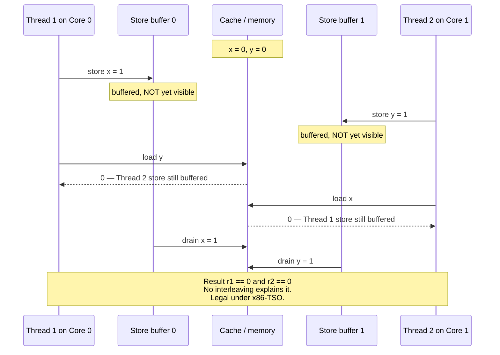
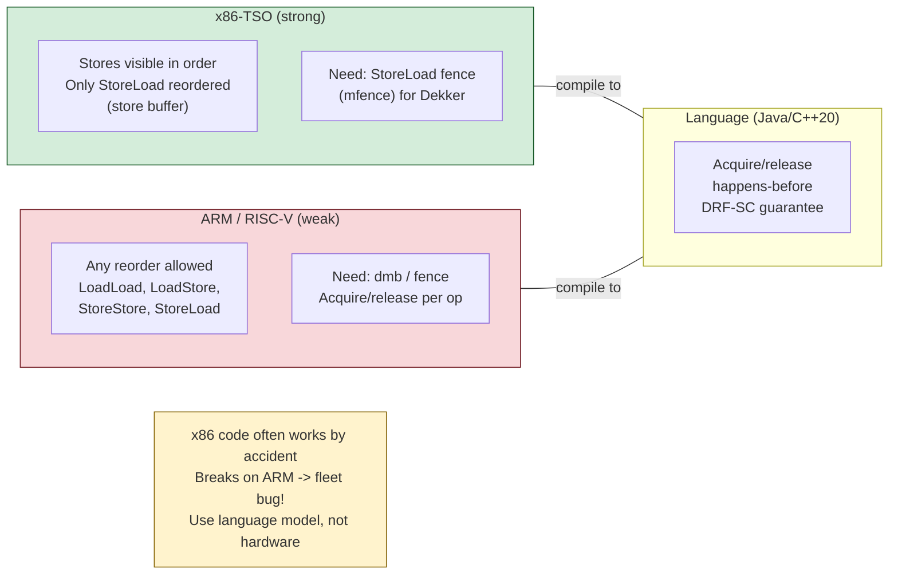
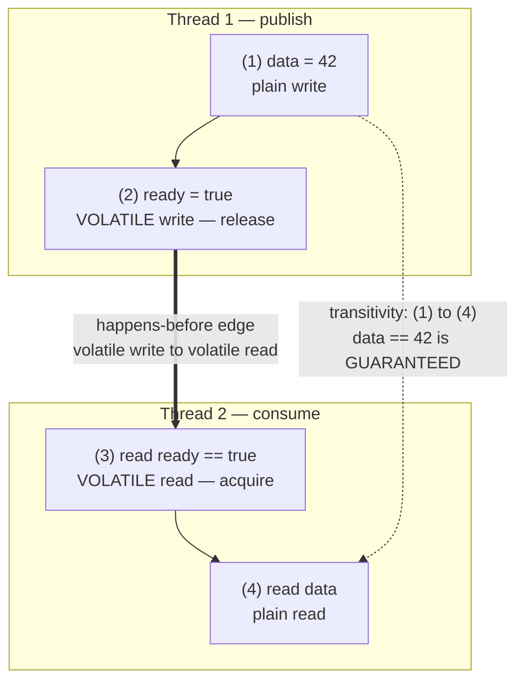
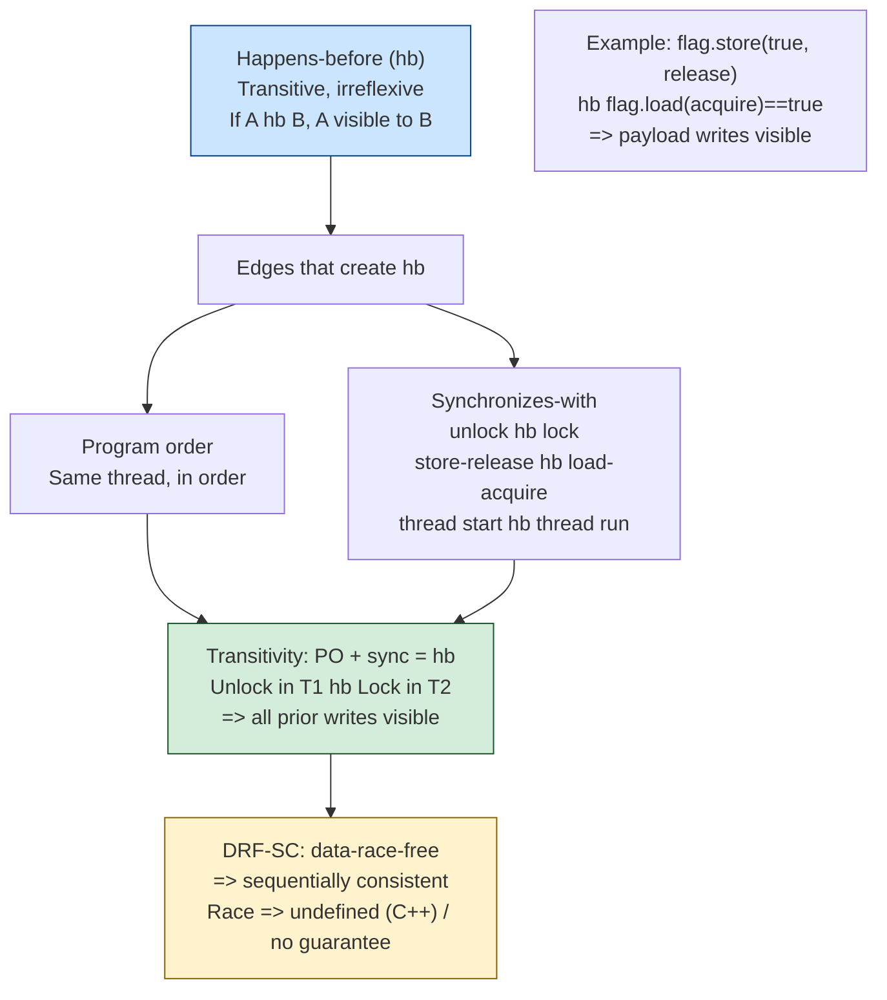
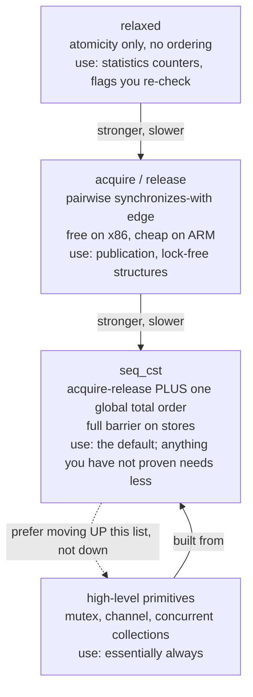
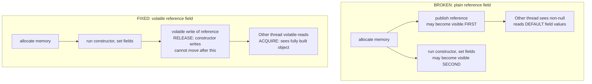

# Chapter 3 — Memory Models and Happens-Before

**What this chapter covers.** This is the hardest chapter in the volume, and the most important.
Chapter 2 showed you the primitives; this chapter explains why they work, and — more urgently —
why code that omits them can observe states that appear logically impossible. The central fact is
that **the order you wrote is not the order that executes, and the order that executes is not the
order other threads observe.** Compilers reorder, processors reorder, and stores become visible to
other cores at different times. None of this is a defect; all of it is deliberate, and all of it is
invisible to a single-threaded program by construction. It becomes visible the moment a second
thread looks.

We start with why reordering happens at both the compiler and hardware levels, then work the
canonical store-buffer litmus test that demonstrates an outcome most engineers initially insist is
impossible. We define sequential consistency as the model people wrongly assume they have, compare
the hardware models they actually have (x86-TSO versus ARM/POWER), and then move to the practical
core: the *language* memory models — Java's, C++'s, and Go's — which are the contracts you actually
program against. The unifying concept throughout is **happens-before**, a partial order over
memory operations that is the single most valuable formalism in concurrent programming, and one you
will meet again, unchanged, in distributed systems.

Learning goals — after this chapter you should be able to:

- Explain the sources of reordering — compiler optimization, store buffers, out-of-order execution,
  and coherence delays — and why each is invisible to single-threaded code.
- Work the store-buffer litmus test and explain why `r1 == 0 && r2 == 0` is legal on x86.
- Define sequential consistency, and state precisely how x86-TSO and ARM/POWER depart from it.
- Use happens-before correctly: name the edges the Java Memory Model provides and reason about
  visibility from them.
- State the DRF-SC guarantee precisely, and explain what it does and does not promise.
- Choose C++ memory orders deliberately, and explain what acquire/release actually guarantees.
- Recognize broken double-checked locking and fix it, and apply safe-publication patterns.
- Connect memory consistency to distributed consistency, and happens-before to Lamport clocks.

## The problem: your source order is a fiction

Consider this, with `x` and `y` initially zero and no synchronization of any kind:

```java
// Thread 1              // Thread 2
x = 1;                   y = 1;
r1 = y;                  r2 = x;
```

Enumerate the interleavings. If Thread 1 runs entirely first, `r1 == 0` and `r2 == 1`. If Thread 2
runs first, `r1 == 1` and `r2 == 0`. If they interleave, both stores precede both loads, so
`r1 == 1 && r2 == 1`. Every interleaving yields at least one register holding 1.

**The outcome `r1 == 0 && r2 == 0` is nonetheless observable on real hardware, including x86.** Run
this in a loop on a multi-core machine and you will see it. No interleaving of the program's
statements explains it, which means the executed program is not the program you wrote.

Two independent mechanisms produce this.

### Compiler reordering

A compiler optimizes under the **as-if rule**: it may perform any transformation that preserves the
observable behavior of a *single-threaded* program. Since `x = 1` and `r1 = y` touch different
locations and neither depends on the other, swapping them is invisible single-threaded and
therefore permitted. Register allocation is more aggressive still: a compiler may hoist a load out
of a loop entirely, so that

```c
while (!done) { /* spin */ }     // done is a plain non-atomic global
```

becomes an infinite loop, because the compiler proves nothing in the loop body writes `done` and
caches it in a register. This is not a bug — it is a correct optimization under the as-if rule, and
it is why `done` must be `volatile` (Java), `std::atomic` (C++), or accessed through
`sync/atomic` (Go). Note that C's `volatile` is *not* a synchronization primitive: it suppresses
compiler caching but provides no ordering or atomicity guarantees against other threads. Java's
`volatile` is a completely different keyword that does provide them.

### Hardware reordering

Even with reordering suppressed in the compiler, the processor reorders. The dominant mechanism for
our litmus test is the **store buffer**. A store to memory is slow — potentially hundreds of cycles
if the line must be fetched in exclusive state — so rather than stall, the core writes into a small
FIFO queue and continues executing. The store drains to cache later. Meanwhile, subsequent *loads*
execute immediately, and a load may complete before an earlier store in the same thread has become
visible to anyone else.

That is exactly our litmus test. Both cores buffer their store and proceed to their load; each load
misses the other's still-buffered store; both read 0.

Additional mechanisms compound this: out-of-order execution issues instructions as operands become
available rather than in program order; speculative execution runs both sides of a branch;
invalidation queues delay the processing of coherence messages so a core may read stale data
briefly. Cache coherence (Volume 1, Chapter 4) guarantees that all cores eventually agree on the
value of each location, and that writes to a *single* location are seen in a consistent order. It
says nothing about the relative order of writes to *different* locations, which is precisely what
the litmus test exposes.



## Sequential consistency: the model you assume you have

Leslie Lamport defined **sequential consistency** in 1979:

> ... the result of any execution is the same as if the operations of all the processors were
> executed in some sequential order, and the operations of each individual processor appear in this
> sequence in the order specified by its program.

Two requirements: there exists *some* single global total order of all memory operations, and each
thread's operations appear in that order consistently with its own program order. This is the model
everyone reasons with intuitively — memory as a single shared object that threads take turns
touching — and under it, `r1 == 0 && r2 == 0` is impossible.

No mainstream processor provides it, because enforcing it would require draining the store buffer
before every load and largely abandoning out-of-order execution. The cost is far too high, so
hardware provides something weaker and gives you instructions to recover the ordering you actually
need, where you actually need it.

## Hardware memory models

### x86-TSO

x86 and x86-64 implement **Total Store Order**, which is comparatively strong. Under TSO:

- Loads are **not** reordered with other loads.
- Stores are **not** reordered with other stores.
- Loads are **not** reordered with earlier stores *to the same location*.
- **Stores may be reordered with later loads to different locations.** This one reordering is
  permitted, and it is precisely the store-buffer effect.

So x86 permits exactly one of the four possible reorderings, which is why the litmus test above is
the *only* simple way to observe reordering on x86 — and why a great deal of subtly incorrect code
appears to work fine when developed and tested exclusively on x86.

### ARM, POWER, and RISC-V

These are **weakly ordered**. Essentially any pair of independent memory operations may be
reordered: load-load, load-store, store-load, and store-store. ARM additionally does not guarantee
multi-copy atomicity in all its variants, meaning two observer cores can disagree about the order
in which two stores became visible.

The practical consequence is now a mainstream portability problem rather than an exotic one. AWS
Graviton, Ampere, and Apple Silicon are ordinary deployment and development targets. **Code that
has been correct in production on x86 for years can fail on ARM**, and it fails rarely, under load,
in ways that look like data corruption rather than like a memory-ordering bug. The reordering was
always permitted by the language's memory model; x86 simply happened not to exercise it.

The rule follows: **reason from the language memory model, never from the hardware you happen to be
testing on.** If your code is correct under the JMM or the C++ model, it is correct everywhere the
compiler targets. If it is merely correct on x86, you have a latent bug with a hardware-refresh
trigger.

### The message-passing litmus test: where x86 code breaks on ARM

The store-buffer test is the classic, but it is not the one that breaks production code, because
few programs depend on that particular pattern. The one that does is **message passing** — the
publication idiom every codebase contains somewhere:

```c
int  data  = 0;      // plain
int  ready = 0;      // plain — this is the bug

// Thread 1 (producer)        // Thread 2 (consumer)
data  = 42;    // (a)         while (ready == 0) { }   // (c)
ready = 1;     // (b)         r = data;                // (d)
```

The intent is obvious: the consumer spins until the flag is set, then reads the payload. The
question is whether `r == 0` is possible at (d).

On **x86-TSO**, no — at the hardware level. Stores are not reordered with stores, so (a) becomes
visible before (b); loads are not reordered with loads, so (c) precedes (d). The hardware happens
to give you exactly the two orderings this idiom needs. (The *compiler* can still break it by
hoisting the load of `ready` out of the loop, which is why this code is wrong even on x86 — but
with optimization defeated, the hardware cooperates.)

On **ARM or POWER**, yes, and by two independent routes. Store-store reordering lets (b) become
visible before (a), so the consumer sees `ready == 1` while `data` is still 0. Independently,
load-load reordering lets (d) execute before (c) completes, so the consumer reads `data`
speculatively before it has confirmed the flag. Either alone produces `r == 0`.

This is the concrete shape of "it worked for three years and then we moved to Graviton." The idiom
is everywhere — lazy initialization, a worker publishing a completed result, a config pointer
swapped in at runtime — and on x86 the hardware silently covered for the missing annotations. The
fix is to make the ordering explicit rather than inherited from the ISA: `ready` becomes
`volatile` in Java, `std::atomic<int>` with release/acquire in C++, or `atomic.Store`/`atomic.Load`
in Go. On x86 those annotations compile to the same plain `MOV` instructions the broken code
already emitted — you pay nothing — while on ARM they emit `STLR`/`LDAR` and the code becomes
correct.

A third pattern, **independent reads of independent writes** (IRIW), is worth knowing exists: four
threads, two writing different locations and two reading both in opposite orders. On a
multi-copy-atomic machine all observers agree on the order the two writes became visible; on some
ARM variants they need not, so two readers can disagree about which write happened first. This is
the deepest departure from intuition in commodity hardware, and it is the reason `seq_cst` costs
more than release/acquire: `seq_cst` restores a single global order that the machine does not
natively provide.

### Fences

Hardware provides barrier instructions to recover ordering: on x86 `MFENCE` (full), `LFENCE`, and
`SFENCE`, though on x86 a locked read-modify-write instruction acts as a full barrier and is what
compilers usually emit; on ARM `DMB`, `DSB`, and the load-acquire/store-release forms `LDAR`/`STLR`.
The important categories are:

- **Acquire**: no memory operation after the acquire may be reordered before it. Used on lock
  acquisition and on reads that publish-check a flag.
- **Release**: no memory operation before the release may be reordered after it. Used on lock
  release and on the write that publishes a flag.
- **Full barrier**: nothing crosses in either direction.

Acquire and release are the natural pair: a release-store followed by an acquire-load of the same
location creates an ordering edge between the two threads, which is the hardware realization of
happens-before.




## Happens-before: the central formalism

You should almost never reason about store buffers directly. Language memory models give you a
better tool: a partial order called **happens-before**, written `→`. The rule that matters is:

> If action A happens-before action B, then the effects of A are visible to B. If neither
> A → B nor B → A, they are *concurrent*, and if they touch the same location with at least one
> write, that is a **data race**.

This is the same relation Lamport defined for distributed systems in 1978, adopted for shared memory
by JSR-133 two decades later. It is a partial order: transitive, so edges chain, but not total —
plenty of pairs are simply unordered, and that is the point.

### The edges the Java Memory Model gives you

JSR-133, which fixed the broken original JMM in Java 5, specifies these happens-before edges:

1. **Program order.** Within a single thread, each action happens-before every action later in
   program order. (Note: this constrains *observed semantics*, not the actual execution order — the
   compiler and CPU may still reorder as long as the thread cannot tell.)
2. **Monitor lock.** An unlock of a monitor happens-before every subsequent lock of that same
   monitor.
3. **Volatile.** A write to a `volatile` field happens-before every subsequent read of that field.
4. **Thread start.** A call to `Thread.start()` happens-before any action in the started thread.
5. **Thread join.** All actions in a thread happen-before any other thread returns from `join()` on
   it.
6. **Interruption.** A thread calling `interrupt()` happens-before the interrupted thread detecting
   it.
7. **Finalizer.** The end of a constructor happens-before the start of that object's finalizer.

Plus transitivity, which is what makes the relation useful: if A → B via program order and B → C
via a volatile write/read, then A → C. This is the mechanism by which a volatile flag publishes
*everything written before it*, not merely the flag itself:

```java
class Publisher {
    private int data;                 // plain field, NOT volatile
    private volatile boolean ready;   // volatile

    void publish() {
        data = 42;        // (1)
        ready = true;     // (2) volatile write — release
    }

    void consume() {
        if (ready) {      // (3) volatile read — acquire
            assert data == 42;  // (4) GUARANTEED to see 42
        }
    }
}
```

The chain is (1) → (2) by program order, (2) → (3) by the volatile rule, (3) → (4) by program order.
Transitivity gives (1) → (4), so the read of `data` must observe 42 even though `data` is not itself
volatile. Remove `volatile` from `ready` and the chain breaks: there is no edge, the accesses to
`data` are concurrent, and the assert can fail — on ARM, routinely.



### The DRF-SC guarantee

Here is the theorem that makes all of this tractable, and it deserves to be stated precisely:

> **If a program is data-race-free — every pair of conflicting accesses is ordered by
> happens-before — then every execution of that program is sequentially consistent.**

This is the **DRF-SC** guarantee, and it is the central bargain of modern memory models. It says:
synchronize properly, and you may go back to reasoning with the simple interleaving model from the
start of this chapter. All the store-buffer and reordering complexity is confined to programs that
have data races.

Read the guarantee carefully for what it does *not* say. It says nothing about programs that *do*
have races, and the consequences there differ sharply by language:

- **C and C++**: a data race is **undefined behavior**. Not "an unpredictable value" — undefined.
  The compiler may assume races do not occur and optimize accordingly, and the resulting program
  may do anything at all.
- **Java**: races are not undefined behavior, because the JVM must remain memory-safe for untrusted
  code. Instead the JMM bounds the damage: you may observe stale or unexpected values, but there
  are no "out-of-thin-air" values — a read must return a value some write actually wrote. The
  outcome is weird but not unbounded.
- **Go**: since the 2022 memory model revision, races on most types have implementation-defined but
  bounded behavior, though races on multiword values such as interfaces and slices can corrupt
  memory outright.

And note again the point from Chapter 1: DRF-SC gives you sequential consistency, which eliminates
*data races* — it does nothing about *race conditions*. A properly synchronized check-then-act is
still a bug.




## Language memory models in practice

### C++11 and C11: explicit memory orders

C++11 introduced the first rigorous memory model for the language, with `std::atomic` and explicit
`memory_order` arguments. The orders, from weakest:

| Order | Guarantee |
|---|---|
| `relaxed` | Atomicity only. No ordering with respect to other locations. |
| `consume` | Ordering along data-dependency chains only. Discouraged — see below. |
| `acquire` | On a load: no later access is reordered before it. Pairs with `release`. |
| `release` | On a store: no earlier access is reordered after it. Pairs with `acquire`. |
| `acq_rel` | Both, for read-modify-write operations. |
| `seq_cst` | Acquire/release plus a single global total order over all `seq_cst` operations. Default. |

`memory_order_consume` deserves its own note: it was intended to expose the fact that most hardware
respects data dependencies for free, making it cheaper than `acquire` on weak architectures. No
compiler implements it as specified — they all promote it to `acquire` — and its specification has
been under revision for years. Treat it as effectively deprecated and do not use it.

The release/acquire pair is the workhorse:

```cpp
#include <atomic>
#include <cassert>

int data = 0;                                 // plain
std::atomic<bool> ready{false};

void producer() {
    data = 42;                                          // plain write
    ready.store(true, std::memory_order_release);       // release
}

void consumer() {
    while (!ready.load(std::memory_order_acquire)) {     // acquire
        /* spin — a real implementation should back off */
    }
    assert(data == 42);   // guaranteed: release/acquire synchronizes-with
}
```

The release store guarantees `data = 42` is not reordered after it; the acquire load guarantees the
read of `data` is not reordered before it; and the pairing establishes a *synchronizes-with* edge,
which contributes to happens-before. On x86 both compile to plain `MOV` instructions — the hardware
already provides these guarantees — so the annotations cost nothing there while remaining necessary
for correctness on ARM. That asymmetry is exactly why testing on x86 does not validate your memory
ordering.

`seq_cst` is the default because it is the easiest to reason about; it is also the most expensive,
typically requiring a full barrier or a locked instruction on stores. Use it unless you have
measured a reason not to.

### Go

Go's memory model is deliberately minimal, and its guiding advice is worth quoting: *if you must
read the rest of this document to understand the behavior of your program, you are being too
clever.* The happens-before edges are:

- A send on a channel happens-before the corresponding receive completes.
- A receive from an unbuffered channel happens-before the send completes. (This is the rendezvous
  property, and it surprises people.)
- The *k*th receive on a channel of capacity *C* happens-before the *(k+C)*th send completes — the
  rule that makes a buffered channel usable as a semaphore.
- Unlock of a `sync.Mutex` happens-before any subsequent lock.
- `once.Do(f)` — the return of `f()` happens-before any `Do` call returns.
- Goroutine creation happens-before the goroutine starts; a goroutine's exit is *not* ordered with
  anything by itself.

The 2022 revision of the memory model made an important clarification: the `sync/atomic` operations
are now explicitly specified as **sequentially consistent**, aligning Go with the C++
`seq_cst` semantics. Before that, the ordering guarantees of Go's atomics were left informal, and
code relying on them was relying on implementation behavior. The revision also formally documented
that Go programs with data races have bounded, non-undefined behavior for word-sized types, while
warning that races on multiword values can corrupt memory.

### The ordering ladder



## Publication and safe initialization

Getting an object safely from the thread that constructs it to threads that use it is the most
common place these rules bite.

### Double-checked locking

The classic broken idiom, intended to avoid locking on every access to a lazily-initialized
singleton:

```java
// BROKEN — do not use
class Broken {
    private static Resource instance;   // not volatile

    static Resource get() {
        if (instance == null) {                 // (1) unsynchronized read
            synchronized (Broken.class) {
                if (instance == null) {
                    instance = new Resource();  // (2) construct and publish
                }
            }
        }
        return instance;                        // (3) may return a half-built object
    }
}
```

The bug is at (2). `new Resource()` is not atomic — it allocates memory, runs the constructor, and
assigns the reference. The compiler and hardware are permitted to make the reference assignment
visible *before* the constructor's writes are visible, since within the constructing thread nothing
can tell the difference. Another thread executing (1) can therefore observe a non-null `instance`
and return at (3) an object whose fields are still default-valued. The failure is rare,
timing-dependent, and appears as an inexplicable null or zero field.

Declaring the field `volatile` fixes it under JSR-133: the volatile write at (2) is a release that
prevents the constructor's writes from being reordered after it, and the volatile read at (1) is an
acquire. Before Java 5 the JMM did not provide this and the idiom was simply unfixable.

```java
// Correct, if you insist on DCL
class Correct {
    private static volatile Resource instance;   // volatile is REQUIRED

    static Resource get() {
        Resource r = instance;          // one volatile read on the fast path
        if (r == null) {
            synchronized (Correct.class) {
                r = instance;
                if (r == null) {
                    r = new Resource();
                    instance = r;       // volatile write — release
                }
            }
        }
        return r;
    }
}
```



But note that in Java the better answer is usually to avoid DCL entirely. The **initialization-on-
demand holder** idiom gets laziness and thread safety from the class-initialization rules, which the
JVM already guarantees, with no volatile and no synchronization on the fast path:

```java
class Better {
    private Better() {}
    private static class Holder {                 // not initialized until first use
        static final Resource INSTANCE = new Resource();
    }
    static Resource get() { return Holder.INSTANCE; }   // JVM guarantees safe publication
}
```

### Safe publication and final fields

The general problem is **safe publication**: making an object visible to other threads such that
they see it fully constructed. The safe mechanisms in Java are:

- Initialize it from a static initializer (the class-initialization guarantee above).
- Store the reference into a `volatile` field or `AtomicReference`.
- Store it into a field guarded by a lock, and read it under the same lock.
- Store it into a properly-constructed concurrent collection.

There is one more, and it is the best: **immutability**. JSR-133 gives `final` fields a special
guarantee — if an object's fields are all `final` and the constructor does not let `this` escape
before completing, then any thread that obtains a reference to the object sees the correctly-
initialized final fields **even if the reference was published unsafely**. This is why immutable
objects can be shared freely with no synchronization at all, and why "make it immutable" is the
best available answer to most visibility problems.

The escape caveat is important and easy to violate: registering a listener, starting a thread, or
passing `this` to anything from inside a constructor publishes a partially-constructed object and
forfeits the guarantee.


```mermaid
sequenceDiagram
    participant Pub as Publisher thread
    participant Sub as Subscriber thread
    Note over Pub,Sub: UNSAFE: plain store/load<br/>Subscriber may see half-constructed object
    Pub->>Pub: obj = new Obj(42)  (writes fields)
    Pub->>Pub: ptr = obj  (plain store)
    Sub->>Sub: p = ptr  (plain load)
    Sub->>Sub: p->field  -- may be 0! (reordered)
    Note over Pub,Sub: SAFE: release/acquire
    Pub->>Pub: obj = new Obj(42)
    Pub->>Sub: ptr.store(obj, release) -- hb
    Sub->>Sub: p = ptr.load(acquire)
    alt p != null
        Sub->>Sub: p->field == 42 guaranteed<br/>(release hb acquire)
    end
    Note over Pub,Sub: Alternatives: mutex, once_flag, static init<br/>All create hb; pick simplest that fits
```

## Practical rules

- **Prefer high-level primitives.** A mutex, a channel, or a concurrent collection gives you the
  happens-before edges you need, and its author has already reasoned about the memory model.
  Descending to raw atomics should be a measured decision, not a default.
- **If you write lock-free code, acquire/release is the right default.** `relaxed` is for cases
  where you genuinely need only atomicity — an approximate statistics counter — and every use of it
  should carry a comment justifying why no ordering is required.
- **Never reason from x86 behavior.** Correctness is defined by the language model. Test on ARM.
- **Immutability is the cheapest correct answer.** No synchronization, no visibility question, and
  in Java the final-field guarantee makes even unsafe publication safe.
- **Use the tools.** ThreadSanitizer, the Go race detector, and Java's jcstress exist because human
  review does not reliably find these bugs (Chapter 10). Run them in CI, not once.

### Why these bugs are so hard to find

It is worth being explicit about why memory-ordering bugs have such a bad reputation, because it
shapes how you must hunt them.

They are **probabilistic and load-dependent**. The reordering window is a few instructions wide, so
the bad interleaving requires two threads to arrive within nanoseconds of each other. That happens
rarely at low load and constantly at high load, which is why these bugs reach production: the test
suite never reproduces them and the incident does.

They are **erased by observation**. Adding a log statement, attaching a debugger, or compiling at
`-O0` inserts work and barriers that close the window. A bug that vanishes under instrumentation is
a strong signal you are looking at a memory-ordering or race problem rather than a logic error.

They **present as impossible states**. The symptom is not a crash at the racy line; it is a
downstream `NullPointerException` on a field that is assigned in a constructor, or a counter with a
value no code path could produce. Engineers reasonably conclude the hardware is faulty or the JVM
has a bug. It is neither.

They are **defeated by tools, not by review**. ThreadSanitizer instruments every memory access and
maintains a happens-before graph, so it finds races on the interleavings that *did* execute even
when they did not produce a visible failure — which is why a TSan run over a normal test suite
routinely surfaces bugs that have hidden for years. jcstress goes further for the JVM, running
carefully-constructed litmus tests billions of times and recording the observed outcome
distribution, which is the only practical way to check claims about the JMM. Use them, and
re-read the caution from Chapter 1: they find data races, not race conditions.

## The distributed-systems lens

Memory consistency models are the shared-memory ancestor of distributed consistency models. This is
not an analogy — it is the same design space one layer up, with the same trade-offs and, in several
cases, the same formalism.

| Shared memory | Distributed systems |
|---|---|
| Sequential consistency (Lamport 1979) | Sequential consistency; linearizability (Herlihy & Wing 1990) |
| Cache coherence per location | Per-object linearizability, single-key consistency |
| Weak ordering, ARM/POWER | Eventual consistency, causal consistency |
| Memory barriers | Quorum reads/writes, read-your-writes sessions |
| Happens-before (JSR-133) | Happens-before (Lamport 1978), vector clocks |
| Store buffer delaying visibility | Asynchronous replication lag |
| DRF-SC bargain | "Use transactions and you may reason serially" |

The happens-before row is literal identity. Lamport's 1978 paper defined `→` for distributed
systems — an event happens-before another if it precedes it in the same process, or if it is a
message send whose receive is the other, plus transitivity — and that is structurally the same
definition JSR-133 uses with "message send/receive" replaced by "volatile write/read" or
"unlock/lock." Vector clocks are the mechanism for *tracking* this relation across machines; a
mutex or volatile field is the mechanism for *establishing* it within one. Learn the relation once
and it serves in both places (Volume 6, Chapter 2).

The transferable intuitions are the ones worth internalizing:

**Stronger consistency costs performance; weaker consistency costs sanity.** `seq_cst` requires
barriers that stall the pipeline, exactly as linearizable distributed reads require quorum
round-trips or leader leases. Relaxed atomics are fast and treacherous, exactly as eventually-
consistent replicas are fast and treacherous. In both settings the engineering discipline is the
same: default to the strong model, and weaken only where you have measured a need and can state the
invariant that survives.

**The store buffer is replication lag.** A write sitting in a store buffer, invisible to other
cores, is the same phenomenon as a write committed on a primary and not yet applied to a read
replica. "I wrote it and then read it back and it was not there" is the same complaint in both
settings, and read-your-writes session consistency is the distributed analogue of the rule that a
thread always observes its own writes in program order.

**The DRF-SC bargain reappears as the transaction bargain.** Both say: adopt this discipline, and
you may reason with the simple sequential model; violate it, and you are exposed to the full
complexity of the underlying system. Serializable transactions are the database's DRF-SC.

Where the analogy breaks is instructive. Shared memory has no partial failure — cores do not
independently crash and leave memory half-updated — and no message loss. Distributed systems have
both, which is why they need consensus, fencing tokens (Chapter 2), and failure detectors, and why
Volume 6 is considerably longer than this chapter.

## Key takeaways

- **Source order is not execution order is not observation order.** Compilers reorder under the
  as-if rule; hardware reorders via store buffers and out-of-order execution. Both are invisible to
  single-threaded code and both become visible the moment another thread observes.
- The **store-buffer litmus test** produces `r1 == 0 && r2 == 0`, an outcome no interleaving
  explains, on real x86 hardware.
- **Sequential consistency** is the model you intuitively assume and no mainstream processor
  provides. **x86-TSO** permits only store-load reordering; **ARM/POWER are weakly ordered** and
  permit essentially everything. Code correct-on-x86 is not code correct-on-ARM, and ARM servers are
  now mainstream.
- **Happens-before is the tool to reason with**, not store buffers. Learn the JMM's edges — program
  order, monitor unlock/lock, volatile write/read, thread start/join — and use transitivity, which
  is what lets a volatile flag publish everything written before it.
- **DRF-SC**: a data-race-free program executes sequentially consistently. This is the bargain that
  makes concurrency tractable. It says nothing about racy programs — undefined behavior in C/C++,
  bounded weirdness in Java — and nothing about race conditions.
- **C++ memory orders** run relaxed → acquire/release → seq_cst; `consume` is effectively
  deprecated and should not be used. Acquire/release is the right default for lock-free code and is
  free on x86.
- **Go's model** is intentionally minimal and channel-centric; the 2022 revision specified
  `sync/atomic` as sequentially consistent.
- **Double-checked locking without `volatile` is broken** because reference publication can be
  reordered before constructor writes. Prefer the holder idiom in Java.
- **Immutability is the best answer to visibility.** Java's final-field guarantee makes fully-final
  objects safe to publish even through a data race — provided `this` never escapes the constructor.
- **Memory consistency and distributed consistency are the same design space.** Happens-before is
  literally Lamport's relation; the store buffer is replication lag; DRF-SC is the transaction
  bargain.

## Further reading

- Lamport, L., "Time, Clocks, and the Ordering of Events in a Distributed System," *CACM* 21(7),
  1978 — the origin of happens-before. https://dl.acm.org/doi/10.1145/359545.359563
- Lamport, L., "How to Make a Multiprocessor Computer That Correctly Executes Multiprocess
  Programs," *IEEE Trans. Computers* C-28(9), 1979 — the definition of sequential consistency.
- Manson, J., Pugh, W., and Adve, S., "The Java Memory Model," *POPL*, 2005 — the JSR-133 model.
  https://dl.acm.org/doi/10.1145/1040305.1040336
- *JSR-133: Java Memory Model and Thread Specification Revision*, and Pugh's FAQ —
  https://www.cs.umd.edu/~pugh/java/memoryModel/jsr-133-faq.html, still the clearest informal
  explanation of the Java model, including double-checked locking and final-field semantics.
- Adve, S. and Boehm, H.-J., "Memory Models: A Case for Rethinking Parallel Languages and
  Hardware," *CACM* 53(8), 2010 — why DRF-SC became the industry consensus.
- Boehm, H.-J. and Adve, S., "Foundations of the C++ Concurrency Memory Model," *PLDI*, 2008 — the
  basis of the C++11 model.
- Sewell, P. et al., "x86-TSO: A Rigorous and Usable Programmer's Model for x86 Multiprocessors,"
  *CACM* 53(7), 2010 — the formalization of x86's actual guarantees.
- *The Go Memory Model* — https://go.dev/ref/mem — including the 2022 revision specifying
  `sync/atomic` as sequentially consistent.
- cppreference, *std::memory_order* — https://en.cppreference.com/w/cpp/atomic/memory_order —
  the practical reference, with the litmus examples.
- Preshing, J., *Preshing on Programming* — https://preshing.com/ — the best informal writing on
  memory ordering, acquire/release, and lock-free correctness.
- Volume 1, Chapters 2 and 4 — Out-of-Order Execution, and Caches and Cache Coherence — the hardware
  underneath this chapter.
- Volume 6, Chapters 2, 3, and 4 — logical clocks, consistency models, and replication — where every
  idea here reappears across machines.
