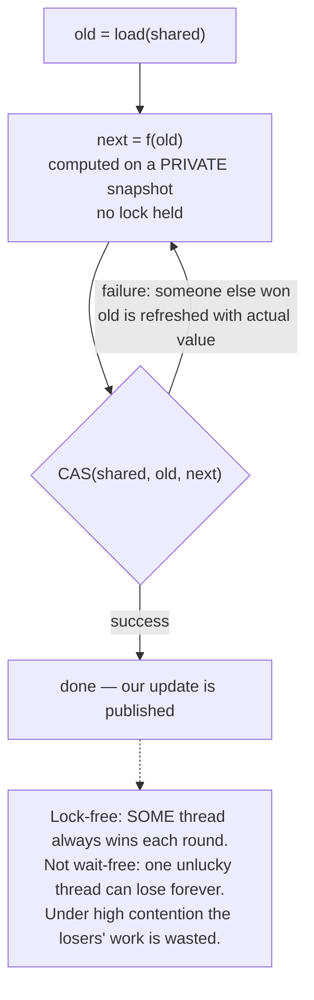
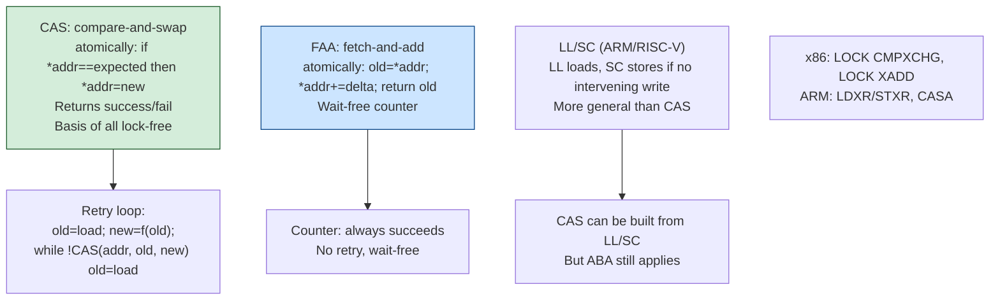
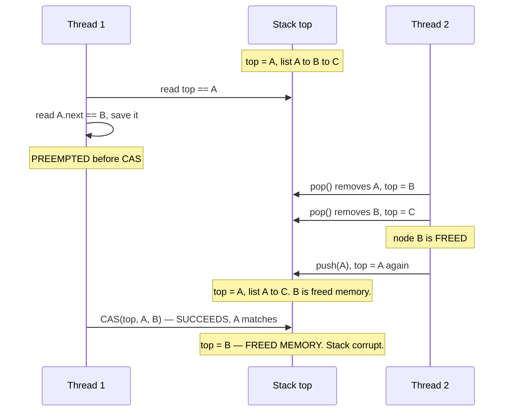
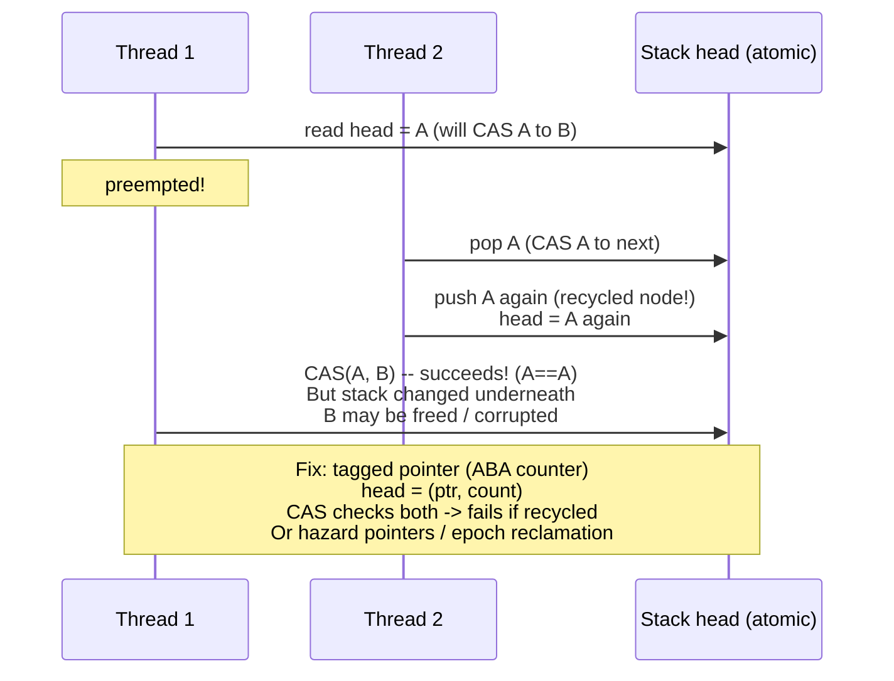
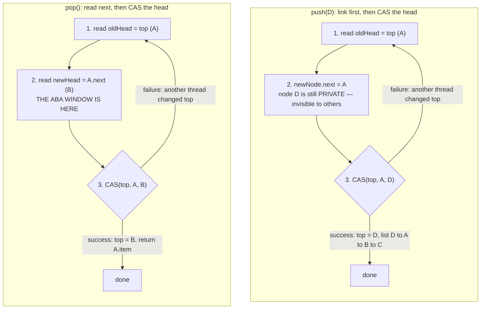
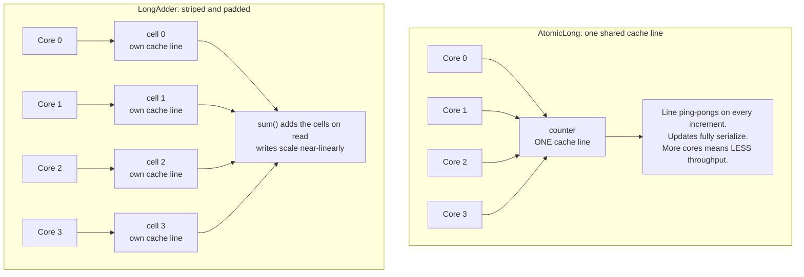
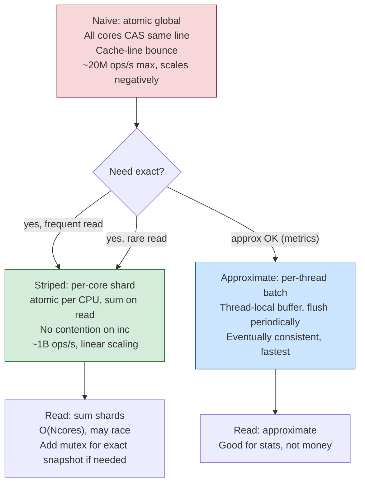

# Chapter 4 — Atomics, CAS, and Lock-Free Data Structures

**What this chapter covers.** Chapter 2 built concurrency on mutual exclusion: threads take turns,
and a thread that cannot take its turn blocks. This chapter covers the alternative — algorithms
that coordinate through atomic read-modify-write instructions and are designed so that *no thread's
stall can prevent others from progressing*. We define the progress hierarchy precisely, because
"lock-free" is a technical term that is constantly misused as a synonym for "fast." We cover the
hardware primitives — atomic RMW operations, compare-and-swap, and the LL/SC pair on ARM and POWER
— and the CAS retry loop that is the fundamental idiom. We then confront the two problems that make
lock-free programming genuinely hard rather than merely fiddly: the **ABA problem**, and **safe
memory reclamation**, which is the real reason lock-free structures are so much harder in C++ than
in Java. We work through the classic structures — the Treiber stack, the Michael-Scott queue, and
the bounded ring buffer as realized in the LMAX Disruptor — and close with the most practically
valuable lesson in the chapter, which is about counters.

A warning belongs up front. Lock-free programming demands complete fluency with Chapter 3; if
happens-before and acquire/release are not solid, this material will read as plausible and you will
write subtly broken code. The honest recommendation for nearly all backend work is to *use* the
library implementations described here and not to write your own.

Learning goals — after this chapter you should be able to:

- State the progress hierarchy — blocking, obstruction-free, lock-free, wait-free — and explain why
  lock-free is a progress guarantee rather than a performance one.
- Write a correct CAS retry loop and explain each memory-order choice in it.
- Explain the ABA problem with a concrete failure trace, and name the standard mitigations.
- Explain why memory reclamation is the hard part of lock-free structures, and describe hazard
  pointers and epoch-based reclamation.
- Describe the Treiber stack and Michael-Scott queue and their limitations.
- Explain why a shared atomic counter is a scalability disaster and what to do instead.
- Decide, with reasons, when lock-free is worth it and when a mutex is the better engineering call.

## The progress hierarchy

These terms have precise definitions from the theory of concurrent objects, and the precision
matters because the marketing usage is wrong.

- **Blocking.** A thread's delay can delay others indefinitely. Any mutex-based algorithm is
  blocking: if the lock holder is preempted, descheduled, or page-faults, every waiter is stuck
  until it runs again. Note that this is a statement about *possible* delay, not about typical
  behavior.
- **Obstruction-free.** A thread makes progress if it runs in isolation for long enough — that is,
  if contention ceases. This is the weakest non-blocking guarantee; it permits livelock, since two
  threads may repeatedly abort each other forever.
- **Lock-free.** *Some* thread makes progress in a bounded number of system-wide steps. The system
  as a whole always advances, but any *individual* thread may starve indefinitely, repeatedly losing
  its CAS to more fortunate threads.
- **Wait-free.** *Every* thread completes its operation in a bounded number of its own steps. The
  strongest guarantee, and it eliminates starvation entirely. It is also the hardest to achieve;
  wait-free versions of common structures exist but are usually slower in the common case, which is
  why they are rare outside real-time systems.

The essential misunderstanding to clear up:

> **Lock-free does not mean fast. It means no thread's stall can block all others.**

A lock-free algorithm can be *slower* than a mutex-based one under most conditions. The CAS retry
loop does redundant work under contention — every losing thread throws away its computation and
starts over — while a mutex queues waiters and does each unit of work exactly once. What lock-free
buys is a *guarantee about the tail*: a thread that is preempted while holding a mutex stalls
everyone for a scheduling quantum, and that shows up as a multi-millisecond spike at p99.9. In a
lock-free structure, a preempted thread inconveniences only itself.

That property is decisive in three situations: latency-critical paths where tail behavior dominates
the SLO; contexts where blocking is *forbidden* rather than merely undesirable — a signal handler
cannot take a mutex, because it may have interrupted the thread that holds it, deadlocking
instantly; and real-time systems with hard deadlines. Outside those, the case for lock-free is a
performance case that must be made with measurements.

## The hardware primitives

All of this rests on atomic read-modify-write instructions: operations that read a location, compute
a new value, and write it back **indivisibly**, with no window for another core to interleave.

The common ones are atomic exchange (swap), test-and-set, fetch-and-add, and fetch-and-{or,and,xor}.
`fetch_add` is worth singling out because it is *unconditional* — it always succeeds in one
operation, with no retry loop — which makes it substantially cheaper than CAS under contention and
is the reason a `fetch_add` counter beats a CAS-loop counter.

### Compare-and-swap

The universal primitive is **compare-and-swap**: atomically, *if* the location holds `expected`,
store `desired` and report success; otherwise report failure and (in the C++ form) write back what
was actually found.

```cpp
bool compare_exchange_strong(T& expected, T desired);
```

CAS is theoretically special: Herlihy's 1991 consensus-number result shows CAS has consensus number
∞, meaning it can implement a wait-free version of *any* concurrent object for any number of
threads, whereas atomic read/write alone has consensus number 1 and fetch-and-add has 2. Every
lock-free structure in practice is built on CAS, and this is why.

On x86 it is `LOCK CMPXCHG`. On ARM and POWER it is built from a **load-linked/store-conditional**
pair: `LDREX`/`STREX` or `LDAXR`/`STLXR` monitor an address, and the store succeeds only if nothing
wrote it since the load. LL/SC is strictly more expressive than CAS — it detects *any* intervening
write, not merely a changed value, which as we will see makes it immune to ABA — but it can fail
spuriously due to cache-line events, context switches, or interrupts, so it must always sit in a
retry loop. This is why C++ offers both `compare_exchange_strong` (retries internally to hide
spurious failure) and `compare_exchange_weak` (may fail spuriously, cheaper, correct only inside a
loop). **Use `_weak` inside a retry loop and `_strong` when you are not already looping.**

### The CAS retry loop

The fundamental idiom of lock-free programming: read the current value, compute the new one, attempt
to swap it in, and retry from the top if someone beat you.

```cpp
// Atomically apply an arbitrary function to a shared value.
template <typename T, typename F>
void atomic_update(std::atomic<T>& val, F fn) {
    T old = val.load(std::memory_order_relaxed);   // relaxed: the CAS validates it
    T next;
    do {
        next = fn(old);                            // compute on a private snapshot
    } while (!val.compare_exchange_weak(
                 old, next,
                 std::memory_order_release,        // on success: publish our writes
                 std::memory_order_relaxed));      // on failure: just reload, no ordering
    // On failure compare_exchange_weak writes the observed value into `old`,
    // so the loop re-computes from fresh data automatically.
}
```

Three details are load-bearing. The initial load can be `relaxed` because the CAS itself validates
the value — if it changed, we retry. The success order is `release` so that writes we performed
before publishing become visible to whoever later acquires this value. And `compare_exchange_weak`
updates `old` in place on failure, which is what makes the loop re-read for free.



Notice the shape of the cost. Under low contention this is one atomic operation, cheaper than a
mutex. Under high contention, N threads each compute and N−1 discard the work — throughput
collapses toward the serialized case while burning CPU on all cores. This is the USL's β term from
Chapter 1 in its purest form, and it is why lock-free is not a general-purpose speedup.




## The ABA problem

The subtle hazard that makes naive CAS insufficient. CAS answers the question *"is this location's
value still X?"* — but the question you actually needed answered is *"is this location
unchanged?"* Those differ when a value can return to a previous state.

Consider a Treiber stack holding A → B → C, with `top` pointing at A.

1. Thread 1 begins `pop()`. It reads `top == A`, reads `A.next == B`, and is preempted just before
   its CAS.
2. Thread 2 runs to completion: it pops A, pops B, then pushes A back. The stack is now A → C, and
   node B has been **freed**.
3. Thread 1 resumes and executes `CAS(top, A, B)`. The comparison succeeds — `top` really is A
   again — so `top` is set to **B**, a node that has been freed and may hold arbitrary reused
   memory.

The stack is now corrupt, pointing at freed memory. No individual operation was incorrect; the CAS
did exactly what it promised. The flaw is that the pointer value A was reused, and CAS cannot
distinguish "unchanged" from "changed back."



Mitigations, in rough order of practicality:

- **Tagged / versioned pointers.** Pack a monotonically increasing counter alongside the pointer and
  CAS both together, so any modification bumps the version and a stale CAS fails. Requires a
  double-width CAS (`CMPXCHG16B` on x86-64) or stealing unused pointer bits — on x86-64 the top 16
  bits are unused by current implementations, which is a portability bet rather than a guarantee.
  This is the most common fix.
- **LL/SC.** On ARM and POWER, store-conditional fails on *any* intervening write, so ABA cannot
  occur. This is a genuine architectural advantage, and it means an algorithm can be ABA-safe on ARM
  and ABA-broken on x86 — the reverse of the usual portability direction from Chapter 3.
- **Deferred reclamation.** Hazard pointers or epoch-based reclamation, below. If a node is never
  freed while a reader might hold it, it cannot be reused, and ABA on that pointer disappears.
- **Garbage collection.** In Java or Go the collector will not reclaim a node any thread still
  references, so the "freed and reused" step cannot happen. ABA can still occur logically if you
  reuse *values*, but the memory-corruption form is eliminated.




## Memory reclamation: the genuinely hard part

Here is the problem that separates lock-free programming from merely difficult programming, and it
is the one most treatments underweight.

In a lock-free structure, a thread can hold a pointer to a node it read from the structure. Another
thread may concurrently remove that node. **When is it safe to free it?** There is no lock to tell
you no readers remain, and no bound on how long a reader might be descheduled while holding the
pointer. Free too early and you have a use-after-free — the most exploitable class of memory bug.
Never free and you have a leak.

This is the same question RCU answers with grace periods (Chapter 2), and the two standard solutions
are:

**Hazard pointers** (Maged Michael, 2004). Each thread publishes, in a per-thread slot, the pointers
it is currently dereferencing — its "hazards." Before freeing a node, a thread scans all published
hazard pointers; if any thread has published this node, the free is deferred to a retire list and
retried later. The properties are good: bounded memory (each thread protects a fixed number of
nodes) and wait-free reads. The costs are a store and a memory barrier on every read to publish the
hazard, and an O(threads) scan on every reclamation attempt. C++26 standardizes them as
`std::hazard_pointer`; before that, folly and libcds are the practical sources.

**Epoch-based reclamation.** A global epoch counter advances periodically. Each thread announces the
epoch it entered when starting an operation. A node retired in epoch *e* may be freed once every
thread has been observed in an epoch later than *e*, which proves no thread can still hold a
pre-retirement reference. Reads are much cheaper than with hazard pointers — typically one relaxed
store to announce the epoch, no per-pointer bookkeeping — but memory usage is unbounded in the
presence of a stalled thread: a single thread that stops in an epoch and never advances prevents all
reclamation, and memory grows without limit. Crossbeam in Rust and much of the Java ecosystem's
internals use this approach.

| Scheme | Read cost | Memory bound | Failure mode |
|---|---|---|---|
| Hazard pointers | Store + barrier per pointer | Bounded | Slower reads; O(N) reclaim scan |
| Epoch-based | One relaxed store per operation | **Unbounded** | A stalled thread blocks all reclamation |
| RCU | Near zero | Bounded by grace-period latency | Long grace periods under load |
| GC (Java, Go) | Zero | Managed by collector | GC pauses; no manual control |

The practical conclusion is the one that should shape your engineering: **in a garbage-collected
language, lock-free programming is dramatically easier**, because the hardest problem is solved for
you by the runtime. This is a substantial and underappreciated argument for Java and Go in
concurrency-heavy systems, and it explains why `java.util.concurrent` offers a rich set of lock-free
structures while equivalent C++ code generally lives in specialized libraries.

## The classic structures

### Treiber stack

The simplest lock-free structure (R. K. Treiber, 1986): a singly-linked list where push and pop both
CAS the head pointer.

```java
public class TreiberStack<E> {
    private static final class Node<E> {
        final E item; Node<E> next;
        Node(E item) { this.item = item; }
    }
    private final AtomicReference<Node<E>> top = new AtomicReference<>();

    public void push(E item) {
        Node<E> newHead = new Node<>(item);
        Node<E> oldHead;
        do {
            oldHead = top.get();
            newHead.next = oldHead;
        } while (!top.compareAndSet(oldHead, newHead));
    }

    public E pop() {
        Node<E> oldHead, newHead;
        do {
            oldHead = top.get();
            if (oldHead == null) return null;
            newHead = oldHead.next;
        } while (!top.compareAndSet(oldHead, newHead));
        return oldHead.item;
    }
}
```



Note where the danger sits. In `push`, the new node is private until the CAS publishes it, so the
window between reading `top` and swapping is harmless — a losing CAS simply retries. In `pop`, the
thread reads `A.next` *before* the CAS and then acts on that stale reading, which is precisely the
window the ABA trace above exploits. Asymmetries like this are typical: in lock-free code, the
correctness argument usually turns on exactly which values were read before the commit point and
whether anything could have invalidated them.

This is correct in Java because the GC handles reclamation. The same code in C++ requires a full ABA
and reclamation strategy. Its practical limitation is that **every operation contends on one
pointer**, so it scales poorly — it is a demonstration piece, not a high-throughput structure. Real
implementations add an *elimination array*, where a push and a pop that collide can cancel each other
out and both leave without touching `top` at all — a neat inversion of the usual goal, since it
turns contention into an opportunity rather than a cost.

### Michael-Scott queue

The standard lock-free MPMC (multi-producer, multi-consumer) FIFO queue (Michael and Scott, 1996),
and the basis of `java.util.concurrent.ConcurrentLinkedQueue`. It uses separate head and tail
pointers with a sentinel node, so producers and consumers contend on different cache lines rather
than a single hot pointer.

Its defining trick is **helping**, and it is the idea worth taking away. Enqueue is logically two
steps — link the new node to the current tail, then advance the tail pointer — and a thread can be
preempted between them, leaving the queue in an intermediate state with the tail lagging. Rather
than wait, any thread that observes a lagging tail **completes the other thread's operation** before
proceeding with its own. This is how the algorithm achieves lock-freedom: a stalled thread never
blocks the structure, because whoever arrives next finishes its work. Helping is a general technique
in non-blocking algorithms and the reason they can tolerate arbitrary preemption.

The caveat: linked-node queues allocate per element and scatter nodes across memory, so every
traversal is a potential cache miss. For high-throughput pipelines a bounded array-based queue
usually wins on raw numbers despite being algorithmically less interesting.

### Bounded ring buffers and the LMAX Disruptor

The highest-throughput designs in practice are usually **bounded ring buffers** over a pre-allocated
array, and the canonical example is the LMAX Disruptor. Its lesson is that *mechanical sympathy
matters as much as the algorithm*:

- **Pre-allocated array of fixed power-of-two size.** No per-operation allocation, no GC pressure,
  and the modulo becomes a bitmask. Entries are contiguous, so traversal is prefetcher-friendly
  (Volume 1, Chapter 3).
- **Sequence numbers rather than pointers.** Producers and consumers publish monotonically
  increasing sequences; a consumer may read up to the published producer sequence. No CAS on a
  shared head pointer in the single-producer configuration — just a store.
- **Single-writer principle.** If exactly one thread writes a given sequence counter, it needs no
  CAS at all, only an ordered store. Eliminating contention beats optimizing it.
- **Cache-line padding everywhere.** Producer and consumer sequence counters are padded so they
  occupy separate cache lines. Without padding, the producer's writes invalidate the line the
  consumer is reading on every single publish — false sharing (Volume 1, Chapter 8) — and throughput
  falls by an order of magnitude. **This padding, not the algorithm, is often the difference between
  good and terrible numbers.**

The Disruptor's reported throughput advantage over `ArrayBlockingQueue` came substantially from
these memory-layout decisions rather than from lock-freedom as such. That is the durable lesson: on
modern hardware, data layout frequently dominates algorithmic cleverness.

## Counters: the lesson that pays for the chapter

If you take one practical thing from this chapter, take this.

A shared counter incremented by many threads is the single most common scalability disaster in
backend services — metrics, request counts, bytes transferred, cache hits. The naive
implementations are:

```java
// (1) BROKEN under concurrency: ++ is load, add, store — lost updates
long count;  count++;

// (2) CORRECT but a scalability disaster
AtomicLong count;  count.incrementAndGet();
```

Version (2) is correct. It is also, under high concurrency, catastrophically slow — and the reason
is physical, not algorithmic. The counter lives in one cache line. Every increment from every core
requires that line in Modified state, so it must be invalidated in every other core's cache and
transferred. With N cores incrementing, the line ping-pongs continuously; each transfer costs on the
order of 100 nanoseconds on a multi-socket machine, and the operations serialize completely. Adding
cores makes it *worse*, not better — the retrograde region of the USL curve from Chapter 1, observed
in the wild.

The fix is to stop sharing the cache line: give each thread (or each core, or each of N stripes) its
own padded counter, and sum them only when someone reads the total.

```java
// (3) The right answer: striped, padded, contention-free
LongAdder count;  count.increment();      // ... count.sum() to read
```

`LongAdder` maintains an array of `Cell` objects, each padded with `@Contended` to occupy its own
cache line, and routes each thread to a cell by a thread-local probe. Under contention it
dynamically grows the cell array. Writes become effectively contention-free and scale nearly
linearly with cores; `sum()` walks the cells and is therefore approximate if concurrent updates are
in flight — which is exactly the right trade for metrics, where you need a fast writer and an
occasional reader.



The same pattern appears throughout systems programming under different names: per-CPU counters in
the Linux kernel, sharded counters in distributed databases, `prometheus` client libraries batching
per-thread. The principle generalizes past counters: **when a write-heavy shared value becomes hot,
partition it and aggregate on read.** Note the trade you are making — you exchange a
strongly-consistent value readable at any instant for an eventually-consistent one that is exact
only at rest. For metrics that is free; for a value that gates a decision, such as a quota, it is
not, and you need the exact primitive or a different design.




## When to use lock-free, and when not to

**Reach for lock-free when:**

- Contention is very high on a small, hot structure and you have measured a mutex as the bottleneck.
- Tail latency dominates your SLO and lock-holder preemption spikes are visible at p99.9.
- Blocking is prohibited: signal handlers, interrupt contexts, hard real-time deadlines.
- A well-tested library implementation already exists — which is the case for the overwhelming
  majority of real needs.

**Prefer a mutex when:**

- Contention is low. An uncontended mutex is one atomic operation (Chapter 2); you are optimizing
  nothing.
- The critical section is complex or touches multiple objects. Composing lock-free operations into a
  larger atomic operation is not generally possible, and attempting it is where correctness usually
  dies.
- The code must be maintained by a team. A mutex is legible to everyone; a hand-rolled lock-free
  structure is legible to its author, on a good day.
- You have not measured. This is the common case, and a mutex is the correct default.

The honest summary: **the expected value of writing your own lock-free data structure is negative
for almost all backend work.** These algorithms have a track record of published, peer-reviewed
versions containing bugs found years later. Correctness depends on memory-model details that vary by
architecture, the failure modes are rare and catastrophic, and testing requires specialized tools —
jcstress, `loom` in Rust, TSan, and model checkers (Chapter 10) — because ordinary tests will not
exercise the interleavings that break. Use `java.util.concurrent`, `crossbeam`, `folly`, or your
platform's equivalent, and spend your cleverness on the parts of the system that are actually
yours.

## The distributed-systems lens

CAS is **optimistic concurrency control**, and once you see that, the same pattern is visible at
every layer of a distributed system.

The read-compute-CAS-retry loop from earlier in this chapter is structurally identical to an
optimistic distributed transaction: read a value with its version, compute a new value locally,
attempt to commit conditionally on the version being unchanged, and retry the whole transaction if
it moved. The correspondences are direct:

| In-process | Distributed |
|---|---|
| `compare_exchange(ptr, old, new)` | Conditional write on version — etcd `mod_revision`, DynamoDB condition expressions |
| ABA problem | Stale write from a partitioned or paused client |
| Version-tagged pointer | ETag, `If-Match`, fencing token, row version |
| CAS retry loop | Optimistic transaction retry (Volume 5, Chapter 6) |
| Hazard pointer | Lease or pin held on a resource |
| Epoch-based reclamation | Grace period before dropping an old replica or schema version |
| Contended atomic counter | Hot key or hot partition |
| `LongAdder` striping | Sharded counters, per-replica aggregation, CRDT counters |

The ABA correspondence is the most instructive. ABA is what happens when identity is confused with
state — the pointer is the same, so the CAS assumes nothing changed. The fix is to add a version
that increases monotonically, so that "changed and changed back" is distinguishable from
"unchanged." That is *exactly* the fencing-token argument from Chapter 2 and Kleppmann's Redlock
critique: a paused node holding a stale lease is the distributed ABA, and a monotonic token attached
to every write is the same version-tagging fix. Conditional writes with ETags, MVCC row versions,
and etcd's revision numbers are all the same idea, and they exist for the same reason.

The optimistic/pessimistic calculus also transfers whole. CAS retry loops win when conflicts are
rare, because the common path is one atomic operation with no blocking; they lose badly when
conflicts are frequent, because wasted work grows with contention. Optimistic distributed
transactions have exactly this profile, which is why databases offer both optimistic and pessimistic
modes and why the right choice depends on your conflict rate rather than on principle. This is also
why STM failed to displace locks (Chapter 1) — the same calculus, decided by the same measurement.

Finally, `LongAdder` is the in-process form of a CRDT counter. Both replace a single contended value
with per-participant values summed on read; both trade instantaneous exactness for
contention-freedom; both are exact only once updates quiesce. Volume 6 develops CRDTs properly, but
the intuition is already in your hands: if a value is hot and writes dominate, stop sharing it.

**Where to go next.** Throughput and latency numbers for these structures under contention, and the jcstress/loom/TSan methodology for testing them, are in Chapter 10; the false-sharing physics that makes `LongAdder`'s padding matter is Volume 1, Chapter 8.

## Key takeaways

- The **progress hierarchy** — blocking, obstruction-free, lock-free, wait-free — is precise.
  Lock-free means *some* thread progresses system-wide; wait-free means *every* thread progresses in
  bounded steps.
- **Lock-free is a progress guarantee, not a performance one.** It can be slower than a mutex. What
  it buys is immunity to lock-holder preemption, which is a tail-latency and no-blocking-allowed
  property.
- **CAS is the universal primitive** (consensus number ∞) and the CAS retry loop is the fundamental
  idiom. On ARM and POWER it is built from LL/SC, which may fail spuriously and so must always sit
  in a loop — hence `compare_exchange_weak` inside loops.
- The **ABA problem**: CAS tests whether a value is unchanged, not whether the structure is
  unchanged. Fixed by version-tagged pointers, LL/SC, deferred reclamation, or garbage collection.
- **Safe memory reclamation is the hard part** in non-GC languages. Hazard pointers give bounded
  memory at the cost of per-read publication; epoch-based reclamation gives cheap reads but
  unbounded memory if a thread stalls. GC languages get this for free, which is a real argument for
  Java and Go in concurrency-heavy systems.
- **Classic structures**: the Treiber stack is simple but contends on one pointer; the Michael-Scott
  queue is the standard lock-free MPMC FIFO and introduces *helping*; bounded ring buffers like the
  Disruptor usually win on throughput, largely through pre-allocation, the single-writer principle,
  and **cache-line padding**.
- **A contended `AtomicLong` is a scalability disaster** because one cache line ping-pongs between
  cores. Use `LongAdder` or per-CPU striping: partition the hot value and aggregate on read,
  accepting an approximate instantaneous total.
- **Do not write your own lock-free structures.** Published algorithms have shipped with bugs found
  years later. Use library implementations and reserve the technique for measured, narrow needs.
- **CAS is optimistic concurrency control**, and ABA's version-tag fix is the same idea as fencing
  tokens, ETags, and MVCC versions one layer up.

## Further reading

- Herlihy, M., "Wait-Free Synchronization," *ACM TOPLAS* 13(1), 1991 — consensus numbers and why CAS
  is universal. https://dl.acm.org/doi/10.1145/114005.102808
- Herlihy, M. and Shavit, N., *The Art of Multiprocessor Programming*, 2nd ed. (Morgan Kaufmann,
  2020) — the standard text; progress conditions, the Treiber stack, elimination, and the M-S queue.
- Michael, M. and Scott, M., "Simple, Fast, and Practical Non-Blocking and Blocking Concurrent Queue
  Algorithms," *PODC*, 1996 — the Michael-Scott queue.
  https://www.cs.rochester.edu/~scott/papers/1996_PODC_queues.pdf
- Treiber, R. K., *Systems Programming: Coping with Parallelism*, IBM Research Report RJ5118, 1986 —
  the original lock-free stack.
- Michael, M., "Hazard Pointers: Safe Memory Reclamation for Lock-Free Objects," *IEEE TPDS* 15(6),
  2004 — the standard reclamation scheme.
- Fraser, K., *Practical Lock-Freedom* (PhD thesis, Cambridge, 2004) — epoch-based reclamation.
- Thompson, M. et al., *The LMAX Architecture* and the Disruptor technical paper — mechanical
  sympathy, the single-writer principle, and cache-line padding.
  https://martinfowler.com/articles/lmax.html
- Lea, D., and the `java.util.concurrent` API documentation for `LongAdder`, `AtomicReference`, and
  `ConcurrentLinkedQueue` — read the `LongAdder` class javadoc in particular; it states the
  contention argument concisely.
- Preshing, J., "An Introduction to Lock-Free Programming" — https://preshing.com/20120612/an-introduction-to-lock-free-programming/
- Volume 1, Chapters 4 and 8 — cache coherence and false sharing — the physics behind the counter
  lesson and the Disruptor's padding.
- Chapter 3 — Memory Models and Happens-Before — mandatory prerequisite for writing any of this
  correctly.
- Chapter 10 — Testing and Debugging Concurrent Systems — jcstress, TSan, and model checking.
- Volume 5, Chapter 6 — Concurrency Control — MVCC and optimistic transactions, the distributed twin
  of the CAS loop.
