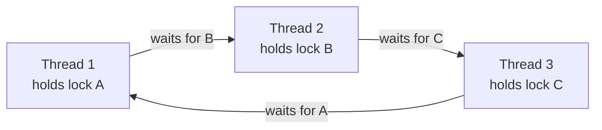
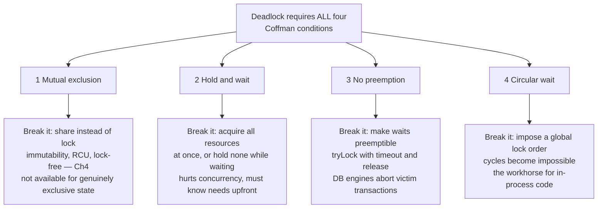
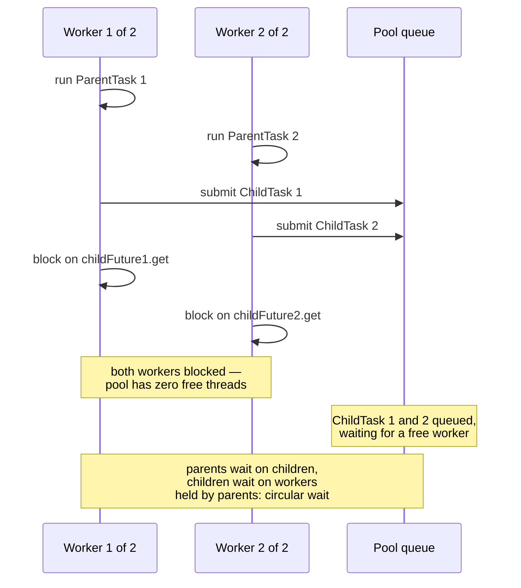
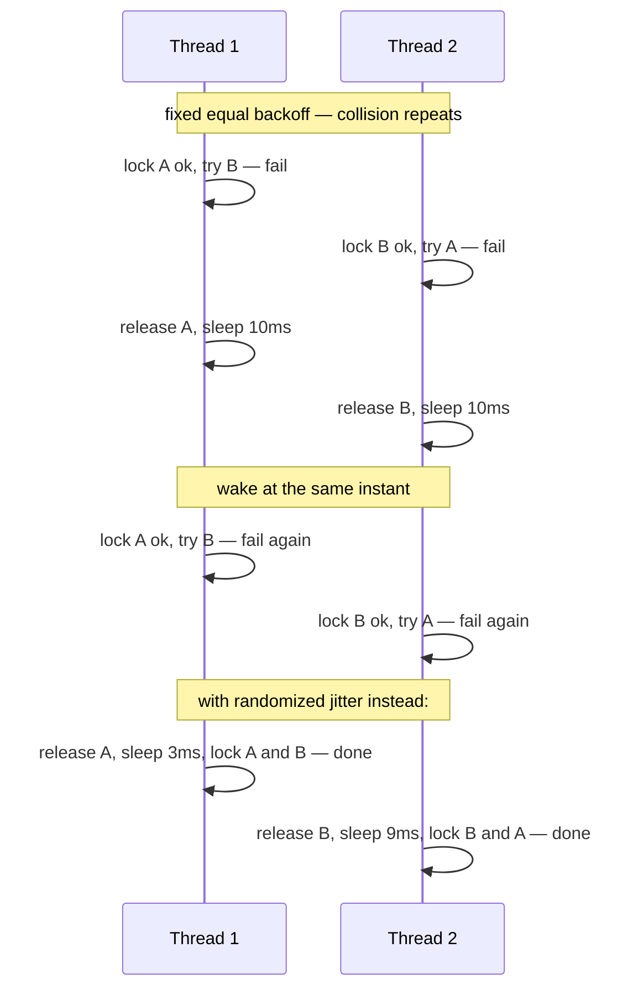

# Chapter 5 — Deadlock, Livelock, and Starvation

**What this chapter covers.** Chapters 1 through 4 were mostly about *safety* — making sure
concurrent code never computes a wrong answer. This chapter is about *liveness* — making sure it
computes an answer at all. The two failure classes are fundamentally different: a safety violation
produces a wrong result you might catch in a test, while a liveness violation produces silence — a
process that is still running, consuming memory, holding connections, passing health checks, and
doing nothing. We treat deadlock rigorously: the four Coffman conditions that are jointly necessary
for it, wait-for graphs and cycle detection as the formal tool, and the four strategic responses —
prevention, avoidance, detection-and-recovery, and deliberate ignorance — compared honestly,
including where each is actually used in production systems. We then build a taxonomy of real
deadlocks that goes well beyond the textbook two-mutex example: lock-ordering deadlocks smeared
across module boundaries by callbacks, the thread-pool submit-and-wait deadlock that has taken down
more services than any other entry in this chapter, bounded-queue resource deadlocks, and
single-thread self-deadlock. Livelock and starvation get the same treatment — definition, mechanism,
production form, and fix — because they fail the same liveness property by different routes.
Finally, we cover how you actually find these failures in a running system, and what happens to all
of this reasoning when the wait-for cycle spans services that share no memory and no global view.

Learning goals — after this chapter you should be able to:

- Distinguish safety from liveness failures, and explain why liveness failures systematically
  escape testing.
- State the four Coffman conditions, explain why all four are necessary, and map each prevention
  technique to the condition it breaks.
- Draw the wait-for graph for a stuck system and find the cycle.
- Apply lock ordering as the primary in-process prevention technique, and write a correct
  tryLock-with-backoff fallback when no order can be imposed.
- Explain why the Banker's algorithm is taught everywhere and deployed almost nowhere, and why
  database engines instead detect deadlocks and kill a victim.
- Recognize the thread-pool submit-and-wait deadlock and its async cousin on sight, in code review,
  before it ships.
- Define livelock precisely, explain why synchronized retry produces it, and justify exponential
  backoff with jitter as the fix.
- Reason about fairness: what unfair locks buy in throughput, what they cost in starvation, and
  when to pay for fairness.
- Interpret a `jstack` deadlock report, Go's runtime deadlock panic, and the concept behind
  lockdep-style order checkers.
- Explain why distributed systems mostly replace deadlock detection with timeouts, retries, and
  idempotency, and what that trade accepts.

## Liveness failures are a different class of bug

A safety property says "nothing bad ever happens": no lost update, no torn read, no two threads in
the critical section. A liveness property says "something good eventually happens": every request
eventually gets a response, every thread that wants the lock eventually gets it. The distinction is
due to Lamport, and it matters operationally, not just formally, because the two classes fail
differently in every way that affects an on-call engineer.

A safety failure leaves evidence. The corrupted row, the double-charged card, the impossible
counter value — there is an artifact, and you can work backward from it. A liveness failure leaves
an absence. The process is alive by every cheap signal: the PID exists, the liveness probe answers
(it runs on a thread that is not the stuck one), CPU may even be busy (livelock burns CPU by
definition). What is missing is progress, and progress is much harder to probe than existence. This
is why mature services monitor *throughput and queue depth per pool*, not just process health —
a topic Volume 11 returns to.

Liveness failures also escape testing systematically, and for a structural reason. A deadlock
requires a particular interleaving: thread 1 must acquire A and be preempted at exactly the point
where thread 2 has acquired B. Under light test load, the window is nanoseconds wide and the
schedule rarely lands in it. Under production load — more threads, more preemption, GC pauses
stretching hold times — the window is hit daily. The bug was present all along; the schedule that
expresses it was not. Chapter 10 covers the tools that hunt schedules deliberately; this chapter
gives you the theory to design the bug out instead.

One more framing point. Chapter 2 stated the three requirements of correct mutual exclusion:
mutual exclusion, progress, bounded waiting. This chapter is what the second and third
requirements look like when violated at system scale. Deadlock and livelock violate progress.
Starvation violates bounded waiting. The chapter is organized around exactly that split.

## Deadlock, rigorously

### The Coffman conditions

Coffman, Elphick, and Shoshani's 1971 survey distilled deadlock into four conditions that must
*all* hold simultaneously. This is the single most useful theoretical result in the chapter,
because "all four are necessary" means "break any one and deadlock is impossible" — every
prevention technique ever devised is an attack on one of the four.

1. **Mutual exclusion.** The resources involved cannot be shared; holding one excludes others.
   Mutexes by definition; also database row locks, a connection from a bounded pool, a slot in a
   bounded queue.
2. **Hold and wait.** A thread holds at least one resource while waiting to acquire another. The
   dangerous pattern is not holding locks, and not waiting — it is doing both at once.
3. **No preemption.** Resources cannot be forcibly taken from their holder; they are released only
   voluntarily. True of mutexes in every mainstream runtime — there is no safe way to rip a lock
   out of a thread's hands mid-critical-section, because the invariants inside are broken.
4. **Circular wait.** A cycle of threads exists in which each waits for a resource held by the
   next.

Note what is *not* on the list: nothing about two threads, nothing about two locks, nothing about
mutexes specifically. Any resource that is exclusively held, waited for while holding, and not
preemptible qualifies — which is why the taxonomy later in this chapter includes thread-pool
workers and queue slots, and why Volume 5's database transactions deadlock on row locks in exactly
the same formal structure.

### Wait-for graphs

The formal tool for reasoning about condition 4 is the **wait-for graph**: one node per thread, and
an edge from T1 to T2 when T1 is blocked waiting for a resource T2 currently holds. The theorem is
clean: with single-instance resources (a mutex is a resource with exactly one instance), **the
system is deadlocked if and only if the wait-for graph contains a cycle**. Deadlock detection is
therefore cycle detection, which is linear-time graph traversal — cheap enough that database
engines run it routinely, as we will see.



The three-party cycle above is worth staring at, because it defeats the intuition trained on
two-thread examples. No pair of these threads is in conflict — T1 and T3 never touch a common
lock-pair in conflicting order between just the two of them. The deadlock only exists as a property
of the whole graph, which is why code review of any single module cannot find it, and why the
ordering discipline described below must be *global*.

The generalization to resources with multiple interchangeable instances — a pool of 20 connections,
a semaphore with N permits — is the **resource-allocation graph**, with nodes for both threads and
resources, assignment edges (resource to holder) and request edges (thread to resource). There the
theorem weakens: a cycle is necessary for deadlock but not sufficient, because a waiting thread
might be satisfied by an instance held outside the cycle. Detection then requires a
reduction-style algorithm rather than plain cycle finding. The practical consequence: deadlocks
involving pools are *harder to detect and harder to see* than mutex deadlocks, which is one reason
the pool-based entries in our taxonomy have such long production careers.

### Four strategies, honestly compared

The literature offers four responses to deadlock. All four are used in production software today —
but in very different niches, and pretending otherwise is how textbooks mislead.



#### Prevention: break a condition

**Breaking mutual exclusion** means not using exclusive resources at all: immutable data, thread
confinement, the lock-free structures of Chapter 4, RCU from Chapter 2. Where it applies it is the
best answer — you cannot deadlock on locks you do not hold — but some state is irreducibly
exclusive, so this is a strategy for shrinking the problem, not eliminating it.

**Breaking hold-and-wait** means acquiring everything you need in one atomic step, or releasing
what you hold before waiting. Havender described this discipline for OS/360 in 1968. It works when
resource needs are known up front, and you will see it below as the "acquire both locks or
neither" structure of the ordered transfer. Its cost is pessimism: you hold resources for the whole
operation even if you would only have needed them briefly, and layered software often *cannot* know
its full resource needs up front — the callee's locks are the callee's business.

**Breaking no-preemption** means making waits abortable: acquire with `tryLock` and a timeout, and
on failure release everything you hold and retry. Note the honest framing — nobody preempts the
*holder*; the *waiter* preempts itself. This is the fallback when ordering cannot be imposed, shown
in code below, and it is also the philosophical basis of detection-and-recovery: aborting a
database transaction is preemption of every lock it holds, made safe by rollback.

**Breaking circular wait — lock ordering — is the workhorse.** Impose a total order on all locks;
require that any thread holding lock L acquires only locks greater than L. Then every edge in the
wait-for graph points "upward" in the order, and a cycle would require an edge pointing downward —
impossible. This is Chapter 2's "establish and document a lock ordering" rule, now with its proof.

The canonical demonstration is the account transfer. The naive version deadlocks: transfer(a, b)
and a concurrent transfer(b, a) each take their first lock and wait forever for the second. The fix
orders acquisition by an intrinsic property of the accounts:

```java
final class Account {
    private final long id;            // unique, orderable — this is the lock order
    private long balanceCents;

    Account(long id, long initialCents) { this.id = id; this.balanceCents = initialCents; }
    long id() { return id; }

    // Callers must hold this account's monitor.
    void depositLocked(long cents)  { balanceCents += cents; }
    void withdrawLocked(long cents) {
        if (balanceCents < cents) throw new IllegalStateException("insufficient funds");
        balanceCents -= cents;
    }
}

static void transfer(Account from, Account to, long cents) {
    if (from.id() == to.id()) throw new IllegalArgumentException("same account");
    // Always lock the lower id first, regardless of transfer direction.
    Account first  = from.id() < to.id() ? from : to;
    Account second = from.id() < to.id() ? to   : from;
    synchronized (first) {
        synchronized (second) {
            from.withdrawLocked(cents);
            to.depositLocked(cents);
        }
    }
}
```

Every thread now locks accounts in ascending id order, so no cycle can form no matter how transfers
are directed or interleaved. When objects lack a natural key, `System.identityHashCode` plus a
single global tie-breaker lock for the rare collision is the standard Java idiom (Goetz et al. give
the full version). Three practical notes. First, the order must be *documented* — in a comment at
the lock's declaration at minimum, because the next engineer cannot obey an order they cannot see.
Second, the ordering must be *stable*: ordering by a mutable field is a deadlock deferred. Third,
ordering has a real cost in API design — it forbids "acquire as you go" and forces call sites to
know all locks up front, which is precisely what layered software makes hard. That difficulty is
the subject of the taxonomy below.

When no order can be imposed — the locks are acquired in an order dictated by external events, or
they belong to different subsystems that cannot know about each other — the fallback is **tryLock
with backoff**, which breaks no-preemption instead:

```java
static void transferWithBackoff(ReentrantLock fromLock, ReentrantLock toLock,
                                Runnable moveMoney) throws InterruptedException {
    long backoffNanos = TimeUnit.MICROSECONDS.toNanos(50);
    while (true) {
        if (fromLock.tryLock()) {
            try {
                if (toLock.tryLock()) {
                    try { moveMoney.run(); return; }
                    finally { toLock.unlock(); }
                }
            } finally { fromLock.unlock(); }
        }
        // Failed to get both: hold NOTHING while waiting, and randomize the retry
        // delay so two symmetric contenders cannot collide forever (livelock).
        long jittered = ThreadLocalRandom.current().nextLong(backoffNanos);
        TimeUnit.NANOSECONDS.sleep(1 + jittered);
        backoffNanos = Math.min(backoffNanos * 2, TimeUnit.MILLISECONDS.toNanos(10));
    }
}
```

The two load-bearing details are in the comment: on failure the thread releases *everything* before
sleeping (no hold-and-wait during the retry), and the sleep is *randomized*. Deterministic backoff
would have two symmetric threads acquire, collide, release, sleep the same interval, and collide
again indefinitely — which is livelock, and we will return to exactly this failure shape.

#### Avoidance: the Banker's algorithm, and why you will never use it

Dijkstra's Banker's algorithm — named for a banker deciding which loan requests to grant — sits
between prevention and detection: grant a resource request only if the resulting state is *safe*,
meaning there exists some order in which all threads can run to completion even if each demands its
declared maximum. On each request, the algorithm simulates: could the remaining pool satisfy some
thread's worst case? Retire it, reclaim its resources, repeat. If every thread can be retired, the
state is safe and the request is granted; otherwise the requester waits even though resources are
free right now.

It is a genuinely beautiful algorithm, and it is almost never used in general-purpose software, for
reasons worth being precise about. It requires every thread to **declare its maximum resource needs
in advance** — unknowable in layered software where a method call may take locks its caller has
never heard of. It requires a **fixed population** of threads and resources, while servers create
both dynamically. It requires **central mediation of every acquisition**, putting a global
bookkeeping step on what Chapter 2 worked hard to make a single CAS. And it is conservative:
it blocks requests that would in fact have completed fine, paying real concurrency for hypothetical
safety. Where the preconditions do hold — closed embedded systems, some real-time schedulers,
admission control against a fixed pool — the idea survives. As advice for the readers of this book:
know it, cite it, do not wait for a chance to deploy it.

#### Detection and recovery: where deadlock is handled for real

The strategy that *is* deployed at scale inverts the problem: let deadlocks happen, detect the
cycle, and kill a participant. This requires the ability to preempt safely — to take resources back
from a victim without corrupting state — and that is exactly what database transactions provide.
Rollback restores the pre-transaction state, releases every lock, and leaves the world consistent.
The transaction machinery of Volume 5, Chapter 5 is, among other things, a licence to preempt.

So database engines are the one place most backend engineers encounter formal deadlock detection
running in production. InnoDB maintains a wait-for graph over transactions blocked on row locks and
checks for cycles when a wait begins; on finding one it rolls back a victim — preferring the
transaction that has modified fewer rows, i.e. the cheaper rollback — which fails with
`ER_LOCK_DEADLOCK`. (InnoDB even lets you disable detection with `innodb_deadlock_detect` and fall
back to plain lock-wait timeouts, a documented trade for very high-contention workloads where graph
maintenance itself becomes a cost.) PostgreSQL waits `deadlock_timeout` — one second by default —
before bothering to run detection on the theory that most waits resolve themselves, then aborts a
waiting transaction with SQLSTATE `40P01` if it finds a cycle.

Two consequences for the application engineer. First, **victim selection is policy, not justice**:
the engine kills whichever transaction is cheapest to roll back, which may be yours, repeatedly —
a transaction that is always the cheapest victim can be starved by this mechanism, deadlock
recovery producing starvation. Second, and this is the part teams get wrong constantly: a deadlock
error from the database is a *retryable* error by design. The engine broke the cycle precisely so
that the survivors and the retried victim can proceed. Application code must catch the deadlock
error class and retry the whole transaction — with backoff and jitter, and only if the transaction
is safe to re-execute, which is an idempotency obligation the application owns. An application that
surfaces `40P01` to the end user has implemented half of detection-and-recovery. Reducing deadlock
*frequency* remains worthwhile — and the technique is the same lock ordering as above: touch rows
and tables in a consistent order across your transactions, exactly the transfer example wearing SQL
clothing. Volume 5, Chapter 6 shows how MVCC removes many read-write conflicts entirely, shrinking
the lock footprint that deadlocks feed on.

#### The ostrich strategy, stated without embarrassment

The fourth strategy is to do nothing. This is not always negligence; it is an expected-cost
judgment: probability of the deadlock times cost per occurrence, against the engineering cost of
the fix. Operating systems make this choice deliberately — Linux does not run deadlock avoidance
over application mutexes, because the cost would be universal and the benefit rare. A stateless
service replica that might deadlock once a quarter, gets killed by its health-check-driven restart,
and loses nothing that a retry does not recover, may be entirely rationally left alone.

The honest version of the strategy has three preconditions people skip: the probability estimate
must be real rather than hopeful (a deadlock whose window widens with load will find you at the
worst time); the *blast radius* must be bounded (a deadlocked replica behind a load balancer is an
annoyance; a deadlocked singleton holding leadership is an outage — and note the restart is doing
informal detection-and-recovery, so something must detect stuckness, typically a liveness probe
that actually exercises the stuck path); and the decision must be written down, because an
undocumented ostrich is indistinguishable from ignorance.

## A taxonomy of real deadlocks

The two-mutex example is the fruit fly of deadlock: ideal for study, rarely what actually bites.
Production deadlocks come in recurring shapes, and recognizing the shape in code review is worth
more than any amount of theory.

### Lock-ordering deadlock across module boundaries

Within one module, lock ordering is a discipline problem. Across modules, it is a *visibility*
problem: each module's locking is correct in isolation, and the cycle only exists in composition.
The classic vector is the callback. Module A holds its lock while invoking a listener; the listener,
living in module B, takes B's lock. Elsewhere, a thread in B holds B's lock and calls into A's
public API, which takes A's lock. Each module locks consistently *by its own lights*; the wait-for
cycle crosses the boundary where neither can see it. This is Chapter 2's rule — **never call
unknown code while holding a lock** — with the mechanism spelled out: a callback invoked under a
lock silently makes your lock part of every caller's lock order, without their knowledge or
consent. The fix is mechanical: snapshot the listener list under the lock, release, then invoke.
More generally, treat "which locks may be held when this function is called" as part of an API's
contract; the observers, GUI toolkits, and cache-invalidation hooks of the world are where these
deadlocks breed.

### Thread-pool submit-and-wait: the classic production outage

This one deserves its diagram, because it involves no mutexes at all and therefore evades every
lock-oriented review habit. The resource is a **worker thread** in a bounded pool.

A task running *on* the pool submits a subtask *to the same pool* and blocks waiting for its
result. Under light load there are free workers and the subtask runs; the code works for months.
Then a traffic spike fills the pool with parent tasks — every worker is occupied by a parent
blocked waiting for a child, and every child is in the queue waiting for a worker. Check the
Coffman conditions: workers are exclusively held (1), parents hold a worker while waiting for
another (2), nothing preempts a blocked worker (3), and parents wait on children who wait on the
workers the parents hold (4). The pool is deadlocked at exactly its configured size, forever.



The insidious property is load dependence: the deadlock requires the pool to be saturated with
parents, so it appears only at peak — the worst possible time — and vanishes when you restart the
service and load drops, destroying the evidence. Fixes, in rough order of preference: **never block
a pool worker on work scheduled on the same bounded pool** — restructure as a continuation
(`thenCompose` and friends) so the parent releases its worker instead of holding it; run subtasks
on a *separate* pool, sizing the dependency DAG of pools such that waits only point "downward"
(this is lock ordering again, with pools as the locks); or use a pool designed for the pattern —
Java's `ForkJoinPool` exists substantially because its work-stealing and `ManagedBlocker`
machinery let a blocked worker be compensated for, which ordinary fixed pools do not.

The **async variant** is the same graph with different nouns, and it is rampant. On an event loop
(Chapter 6), code that *synchronously blocks* the loop's thread waiting for a future that can only
be completed *by* that loop — `future.get()` in a Netty handler, `.Result` on a .NET UI context,
`runBlocking` inside a coroutine on the same single-threaded dispatcher (Chapter 8) — deadlocks
with a pool of size one, immediately and deterministically. The single-threaded case is at least
easy to reproduce; the small-pool case, like the thread pool above, waits for saturation.

### Resource deadlock on bounded queues

Two services, each with a bounded request queue, each calling the other. A's queue is full of
requests that need responses from B; B's queue is full of requests that need responses from A;
each service's workers are all blocked producing into the other's full queue. No locks anywhere —
the exclusively-held resource is a *queue slot* — but all four Coffman conditions hold, with
"queue slot" substituted for "mutex." The same shape appears entirely in-process with two stages of
a pipeline connected by bounded channels in both directions.

Bounded queues are not the villain here — unbounded queues merely replace visible deadlock with
invisible memory exhaustion. The bound is doing its job: surfacing the fact that the *topology*
contains a cycle. The real fixes are cycle-aware: break the request cycle in the service graph,
make one direction non-blocking (drop or shed rather than wait when the queue is full), or bound
the *wait* rather than the queue. This is the doorstep of backpressure design, which Volume 10
treats properly; note for now that "everything blocks politely" composes into deadlock when the
blocking relation has a cycle.

### Self-deadlock: one thread, one lock

The minimal deadlock needs one thread. A thread holding a non-reentrant mutex calls — usually via
some indirection that obscures it — a function that acquires the same mutex. The wait-for graph is
a self-loop: the thread waits for itself. `pthread_mutex_t` in its default mode will deadlock this
way ( `PTHREAD_MUTEX_ERRORCHECK` turns it into an `EDEADLK` error instead, which is strictly
kinder); a Go `sync.Mutex` will too, and Go's philosophy explicitly rejects reentrancy. Java's
`synchronized` and `ReentrantLock` are reentrant and silently absorb the re-acquisition — which
prevents this deadlock at the cost Chapter 2 discussed: reentrancy usually papers over a layering
confusion about which functions assume the lock is held. Either way the underlying bug is the same,
and the `_locked`-suffix convention from Chapter 2 is the cure. The re-acquisition is almost never
written in one visible function; it arrives through a callback, a signal handler, or an override.

### Distributed deadlock

The fifth family — wait-for cycles spanning processes and machines — changes the problem
qualitatively enough that it gets the distributed-systems lens section to itself below.

## Livelock

Deadlock is silent stillness; **livelock** is furious motion without progress. The threads are not
blocked — they run, change state, consume CPU — but the system as a whole gets nowhere, because
each participant's reaction to the others perpetually re-creates the conflict. The canonical image
is two people meeting in a corridor, each stepping aside in the same direction, repeatedly and
forever. Formally the progress property is violated just as surely as in deadlock; operationally
livelock is *worse to diagnose*, because every cheap signal reads healthy — CPU busy, threads
runnable, no thread parked for a suspicious duration. Nothing looks stuck except the throughput
graph.

The mechanism that manufactures livelock is **symmetric retry with correlated timing**. Take the
tryLock loop from earlier and remove the jitter: two threads attempt their lock pairs in opposite
orders, each gets its first lock, each fails its second, each releases and sleeps *the same fixed
interval*, and each wakes at the same instant to collide again. The collision is not bad luck; the
protocol's determinism guarantees it recurs. The same shape appears wherever contenders share a
retry policy: optimistic-concurrency retries against a hot row, CAS loops under extreme contention
(Chapter 4's note on livelock in lock-free algorithms — lock-freedom guarantees *some* thread
progresses, but obstruction-free designs can livelock), and, at the largest scale, fleets of
clients retrying a struggling service on identical schedules.



The fix is to **break the symmetry**, and the standard tool is **randomized exponential backoff**:
on the Nth consecutive failure, wait a *random* duration drawn from a window that grows
(typically doubles) with N. The randomness decorrelates the contenders so collisions stop
repeating; the exponential growth adapts the retry rate to the observed level of contention. This
is old, battle-proven engineering: classic Ethernet's CSMA/CD resolved collisions on a shared
coaxial medium with truncated binary exponential backoff — after a collision each station waits a
random number of slot times drawn from a window that doubles per attempt — and it worked well
enough to carry the protocol from Metcalfe and Boggs's 1976 paper into decades of deployment. The
same analysis reappears in Marc Brooker's widely-cited AWS write-up on backoff and jitter for
distributed retries, whose simulations show "full jitter" — sleep a uniform random duration between
zero and the exponentially-growing cap — beating both plain exponential backoff and half-jittered
variants on total work and time-to-completion under contention. An alternative symmetry-breaker is
hierarchy: give one contender priority (by id, by role) so conflicts always resolve the same
direction. That trades livelock risk for starvation risk, which is our next topic.

## Starvation and fairness

**Starvation** is the third liveness failure: the system as a whole makes progress, but some
particular thread never does — bounded waiting, the third requirement from Chapter 2, is violated.
It is subtler than deadlock and livelock because the aggregate metrics look fine; throughput is
healthy, and the victim's requests are quietly rotting in a corner of the latency distribution.

### Unfair locks, barging, and why the defaults are unfair

The purest source of starvation is the lock itself. An **unfair** lock hands itself to whichever
thread grabs it first at release time — and the thread most likely to win is the one already
running on a warm core, quite possibly the previous holder back for more. A newly arriving thread
can **barge** past a queue of parked waiters: they must be woken, scheduled, and migrated to a warm
cache before they can even attempt the acquisition (the futex slow path of Chapter 2), while the
barger is already executing with the lock's cache line resident. A **fair** (FIFO) lock grants
strictly in arrival order, which eliminates starvation and costs real throughput: every handoff to
a parked thread pays wakeup latency during which the lock sits idle, and under contention the
convoy of forced handoffs can cost an order of magnitude in throughput versus barging.

This is why the defaults across the industry are unfair. Java's `ReentrantLock` documents the
choice explicitly: the default is non-fair; `new ReentrantLock(true)` buys FIFO fairness at a
documented throughput cost; and even a fair lock's untimed `tryLock()` is documented to barge past
waiters — an escape hatch that exists precisely because barging is cheap. Pthread mutexes make no
fairness promise at all, and futex wakeups do not guarantee FIFO order. The engineering judgment
underneath: starvation under an unfair lock is *probabilistic* — statistically, everyone gets in
eventually under normal load — and the pathological case (one thread repeatedly losing for seconds)
is rare enough that paying the fairness tax on every operation is a bad trade. Reach for a fair
lock when you have *observed* starvation or when tail latency of the slowest waiter matters more
than aggregate throughput; measure both before and after.

### Where else starvation lives

**Reader-writer locks** are the classic policy trap, covered in Chapter 2: reader-preferring
policies starve writers under a steady reader stream; writer-preferring policies can starve
readers. The starvation is not a bug in the lock — it is the documented consequence of a policy
choice, and you must know which policy your platform's default is.

**Priority scheduling** starves structurally: a strict-priority scheduler runs a lower-priority
thread only when no higher-priority thread is runnable, so sustained high-priority load means
*never*. Real-time schedulers accept this by design (Volume 2, Chapters 1–2); general-purpose
schedulers refuse it — Linux's CFS and its EEVDF successor allocate weighted fairness, so low
`nice` values dilute rather than eliminate a thread's share. Related but distinct is **priority
inversion** — a low-priority thread *holding a lock* a high-priority thread needs, with
medium-priority work preempting the holder — treated in Chapter 2 with the Mars Pathfinder story
and the priority-inheritance fix; recall that its backend analogue, background jobs holding
resources request handlers need, is alive and well in systems with no explicit priorities at all.

And note the earlier example from the database world: deadlock **victim selection** is a starvation
mechanism when the same cheap transaction is repeatedly chosen for rollback. Fairness questions
follow deadlock recovery around; any policy that resolves contention by consistently sacrificing
the same party converts a liveness mechanism into a targeted denial of progress.

## Seeing it in production

Theory tells you deadlock is a cycle; operations requires you to find it at 3 a.m. The tools are
better than most engineers realize.

**JVM: thread dumps.** The JVM ships a deadlock detector. `jstack <pid>` (or `kill -3`, or
`ThreadMXBean.findDeadlockedThreads`) walks the monitor wait-for graph and reports cycles
explicitly — including, with `jstack -l`, `java.util.concurrent` locks, not just `synchronized`
monitors:

```text
Found one Java-level deadlock:
=============================
"transfer-2":
  waiting to lock monitor 0x00007f8a1c004e00 (object 0x000000076ab3c8f0, an Account),
  which is held by "transfer-1"
"transfer-1":
  waiting to lock monitor 0x00007f8a1c006190 (object 0x000000076ab3c940, an Account),
  which is held by "transfer-2"

Java stack information for the threads listed above:
...
Found 1 deadlock.
```

That is the wait-for cycle of this chapter, printed by the runtime, with stack traces attached.
Every JVM engineer should have triggered and read one on purpose before reading one under duress.
Note what it does *not* find: pool deadlocks and queue deadlocks, where the waiting is on futures
and queue slots the JVM does not model as locks. For those, the diagnostic is a full thread dump
read by a human: every pool worker parked in `future.get` or `queue.put`, none runnable — a pattern
you now know by name.

**Native code.** `pstack <pid>` or `gdb -p <pid>` plus `thread apply all bt` gives the same raw
material: all threads blocked in `__lll_lock_wait` (glibc's futex wait), and cross-referencing who
holds what from the mutex owner fields reconstructs the cycle by hand.

**Go.** The runtime panics with `fatal error: all goroutines are asleep - deadlock!` plus all
goroutine stacks — but only when *every* goroutine is blocked. One background ticker goroutine
keeps the process "live" and mutes the detector, so partial deadlocks — the common kind in a server
that always has an HTTP listener parked in `accept` — produce no panic. There the tools are
`net/http/pprof`'s goroutine profile (thousands of goroutines parked at the same
`chan send`/`mutex.Lock` line is the smoking gun) and the mutex/block profiles for contention and
wait attribution.

**Lock-order checkers.** The most interesting tool class does not wait for the deadlock. The Linux
kernel's **lockdep** records, at runtime, the order in which lock *classes* are acquired, building
the "held while acquiring" relation across all executions — and complains the first time any pair
of classes is ever seen in both orders, *even though no deadlock occurred on that run*. That is the
crucial property: it converts a probabilistic schedule-dependent failure into a deterministic one —
any single execution of both code paths, in any interleaving, exposes the inversion. It validates
the ordering discipline rather than hunting the unlucky schedule. The idea transfers: ThreadSanitizer
reports lock-order inversions in user code, and an afternoon's work wrapping your project's lock
type with a debug-build order-tracking layer pays for itself the first time it fires in CI.
Chapter 10 covers these tools, and schedule-exploration testing generally, in depth.

## The distributed-systems lens

Everything so far assumed a wait-for graph *somebody can see* — a runtime, an engine, a debugger
with all threads in one address space. The defining feature of distributed deadlock is that **no
such observer exists**. Service A's threads wait on RPCs to B, B's transactions wait on row locks
held by C's requests, C waits on A — each system sees only its outgoing edges, and the cycle exists
only in the composition. Local detectors are structurally blind to it: every participant looks
"slow, waiting on a dependency," which is indistinguishable from ordinary congestion. The
cross-service bounded-queue deadlock from the taxonomy is the two-node case; real service graphs
offer much longer cycles, often through a shared database that neither service team thinks of as
part of "their" call graph.

The theory exists. Chandy, Misra, and Haas's 1983 **edge-chasing** algorithm detects distributed
cycles without assembling a global graph: a blocked process sends a *probe* stamped with its
identity along its wait-for edges; each blocked recipient forwards the probe along its own waiting
edges; if your own probe comes back to you, you are on a cycle, and (in the standard formulation)
the detecting initiator aborts as the victim. Knapp's 1987 survey catalogues this and the other
families — and also catalogues the failure modes, chiefly *phantom deadlocks*: with no global
snapshot, a probe can traverse edges that no longer coexist, detecting a cycle that never existed
at any single instant and aborting an innocent victim. Edge-chasing is real in tightly-coupled
distributed databases that own both the locks and the messaging. It is essentially absent from
general microservice architectures, because the preconditions fail: waits happen in a dozen
runtimes and protocols with no common notion of a wait-for edge, and no channel exists to chase
edges across team and vendor boundaries.

What the industry does instead is honest and unglamorous: **timeouts, retries, and idempotency**
(Volume 6, Chapter 9). A timeout is crude preemption — it breaks Coffman condition 3 without ever
identifying a cycle. It cannot distinguish deadlock from slowness, so it will sometimes abort work
that would have finished (the phantom-victim problem again, accepted rather than solved), which is
exactly why the retry must exist, and why the retried operation must be idempotent for the
combination to be safe. Read that stack as this chapter's strategy table transplanted: timeout =
preemption, retry = recovery, idempotency = the rollback-equivalent that makes preemption safe,
jittered backoff = the livelock guard. Nothing in the distributed toolkit is new; it is
detection-and-recovery with the detection replaced by a deadline, because a deadline is the only
detector that needs no global view.

Two distributed pathologies deserve naming. **Two-phase commit blocking** (Volume 5, Chapter 10):
a participant that has voted yes must hold its locks until the coordinator's verdict; if the
coordinator dies at that moment, participants hold locks — blocking an arbitrary set of unrelated
transactions — until it recovers. Not a cycle, but the same operational signature as deadlock
(locks held indefinitely by a party that cannot proceed), and the reason 2PC is called a blocking
protocol and consensus-based commit exists.

And **metastable failure / retry storms** are livelock's distributed cousin. A fleet of clients
retrying an overloaded service adds retry load on top of organic load; the extra load slows the
service further, causing more timeouts, causing more retries. Past a tipping point the system
enters a state that is self-sustaining *even after the original trigger is gone* — everything
running hot, useful throughput near zero, exactly livelock's signature at datacenter scale.
Bronson, Aghayev, Charapko, and Zhu's HotOS 2021 paper named this class "metastable failures" and
observed that the sustaining feedback loop is usually a well-intentioned mechanism — retries,
failovers, cache-miss storms. The mitigations are the livelock fixes writ large: jittered
exponential backoff, retry budgets that cap amplification, circuit breakers that convert retry
pressure into fast failure, and load shedding to break the feedback loop (Volume 11).

## Key takeaways

- **Liveness failures give no answer rather than a wrong answer.** They leave no artifact, pass
  health checks, and escape testing because they require a specific schedule; monitor progress and
  queue depth, not just process existence.
- **Deadlock requires all four Coffman conditions** — mutual exclusion, hold-and-wait, no
  preemption, circular wait. Every countermeasure breaks exactly one; know which one yours breaks.
- **Deadlock is a cycle in the wait-for graph.** With single-instance resources the equivalence is
  exact; with pools, cycles are necessary but not sufficient, which makes pool deadlocks harder to
  see.
- **Lock ordering is the workhorse of prevention**: a global acquisition order makes cycles
  impossible. It must be total, stable, and written down — and its enemy is the callback invoked
  under a lock, which drafts your lock into orders you never agreed to.
- **tryLock-with-backoff is the fallback** when ordering is infeasible: release everything on
  failure, and randomize the backoff, or you will trade deadlock for livelock.
- **The Banker's algorithm is instructive, not deployable** in general software: it needs declared
  maximum demands, a fixed population, and centrally mediated acquisition. **Detection-and-recovery
  is what actually ships** — in database engines, whose transactions make preemption safe via
  rollback. Treat database deadlock errors as retryable; that retry is your half of the protocol.
- **The thread-pool submit-and-wait deadlock** needs no mutexes: parents hold all the workers and
  wait for children who need a worker. It fires only at saturation. Never block a bounded pool's
  worker on work scheduled on the same pool; the event-loop `future.get()` is the same bug with
  pool size one.
- **Livelock is motion without progress**, manufactured by symmetric retries with correlated
  timing; the fix, from Ethernet to cloud SDKs, is randomized exponential backoff or an explicit
  symmetry-breaking hierarchy.
- **Fairness costs throughput** — barging beats FIFO handoff because wakeups are expensive — which
  is why locks default unfair and why `ReentrantLock(true)` is opt-in. Starvation also arrives via
  RW-lock policy, strict priorities, and repeated deadlock-victim selection.
- **Runtimes will show you the cycle**: `jstack` prints Java-level deadlocks, Go panics when all
  goroutines sleep (and only then), and lockdep-style order checkers find inversions before any
  deadlock occurs — the rare tool that makes a probabilistic bug deterministic.
- **Distributed systems replace detection with deadlines**: no global wait-for graph exists, so
  timeouts (crude preemption) + retries (recovery) + idempotency (safe re-execution) + jitter
  (livelock guard) is the pragmatic stack; edge-chasing lives on inside distributed databases.
  2PC's blocking window and metastable retry storms are the distributed relatives of deadlock and
  livelock respectively.

## Further reading

- Coffman, E. G., Elphick, M., and Shoshani, A., "System Deadlocks," *ACM Computing Surveys* 3(2),
  1971 — the four conditions and the original survey of strategies.
- Havender, J. W., "Avoiding deadlock in multitasking systems," *IBM Systems Journal* 7(2), 1968 —
  ordered and all-at-once acquisition as OS/360 operating discipline.
- Dijkstra, E. W., "Cooperating Sequential Processes" (EWD 123, 1965) — the Banker's algorithm and
  the "deadly embrace"; available in the E. W. Dijkstra Archive, University of Texas.
  https://www.cs.utexas.edu/users/EWD/
- Chandy, K. M., Misra, J., and Haas, L. M., "Distributed Deadlock Detection," *ACM Transactions on
  Computer Systems* 1(2), 1983 — the edge-chasing probe algorithm.
- Knapp, E., "Deadlock Detection in Distributed Databases," *ACM Computing Surveys* 19(4), 1987 —
  the survey, including phantom deadlocks.
- Goetz, B. et al., *Java Concurrency in Practice* (Addison-Wesley, 2006), Chapter 10 — lock-ordering
  deadlocks, open calls, and the tie-breaking idiom for ordering by identity hash.
- Herlihy, M. and Shavit, N., *The Art of Multiprocessor Programming*, 2nd ed. (Morgan Kaufmann,
  2020) — progress conditions: wait-freedom, lock-freedom, obstruction-freedom, and starvation.
- Metcalfe, R. M. and Boggs, D. R., "Ethernet: Distributed Packet Switching for Local Computer
  Networks," *CACM* 19(7), 1976 — the origin of exponential backoff as a collision-resolution
  discipline.
- Brooker, M., "Exponential Backoff and Jitter," AWS Architecture Blog, 2015 — the simulation-backed
  case for full jitter. https://aws.amazon.com/blogs/architecture/exponential-backoff-and-jitter/
- Bronson, N., Aghayev, A., Charapko, A., and Zhu, T., "Metastable Failures in Distributed
  Systems," *HotOS* 2021 — retry storms and sustaining feedback loops as a failure class.
- Linux kernel documentation, "Runtime locking correctness validator" — the lockdep design.
  https://www.kernel.org/doc/html/latest/locking/lockdep-design.html
- MySQL 8.0 Reference Manual, "InnoDB Deadlock Detection" — wait-for graph, victim choice, and the
  `innodb_deadlock_detect` trade-off.
  https://dev.mysql.com/doc/refman/8.0/en/innodb-deadlock-detection.html
- PostgreSQL documentation, "Deadlocks" and `deadlock_timeout` — detection policy and the ordering
  advice for applications. https://www.postgresql.org/docs/current/explicit-locking.html
- Java Platform API, `java.util.concurrent.locks.ReentrantLock` — the fairness contract, the
  throughput caveat, and barging `tryLock()`.
- Volume 5, Chapters 5–6 — transactions and MVCC: why databases can preempt safely, and how MVCC
  shrinks the lock footprint.
- Volume 6, Chapters 8–9 — coordination, and the timeout/retry/idempotency stack this chapter
  leans on.
