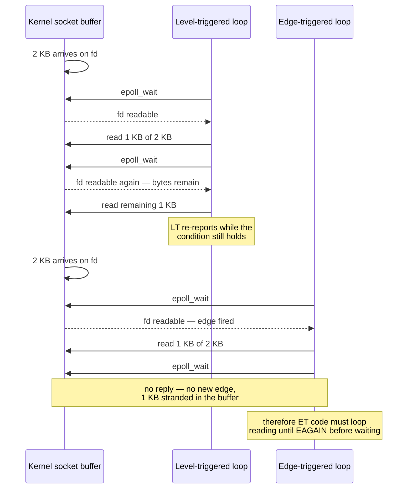
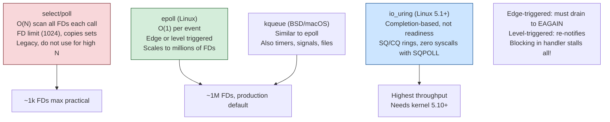
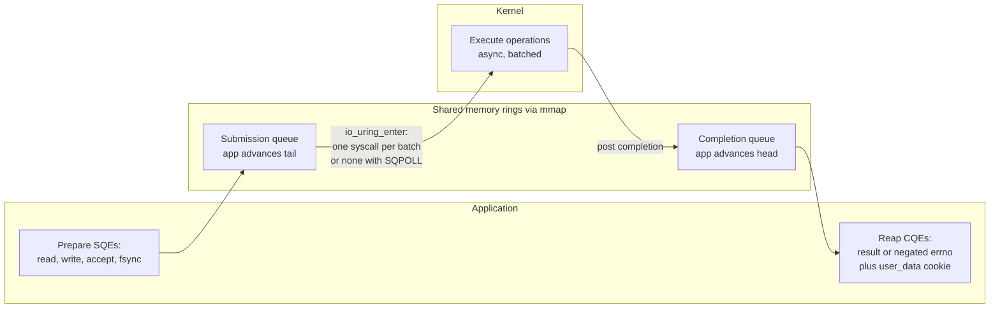
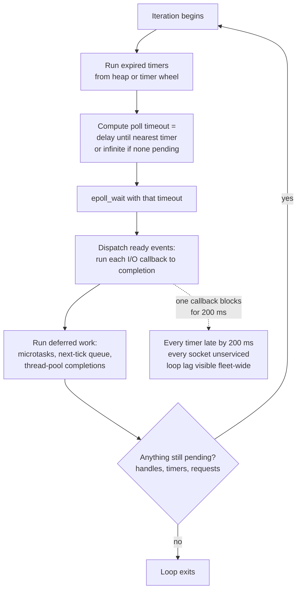
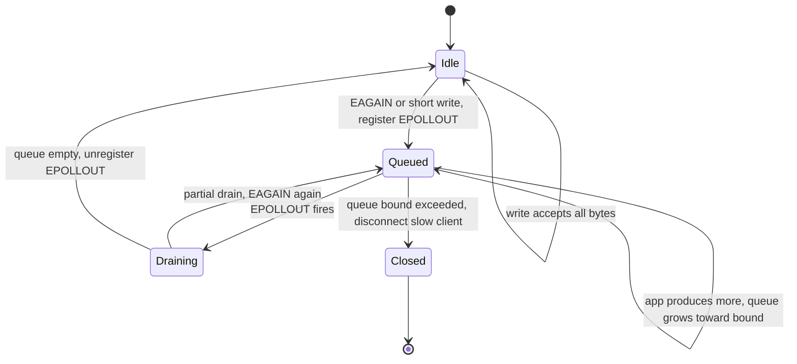
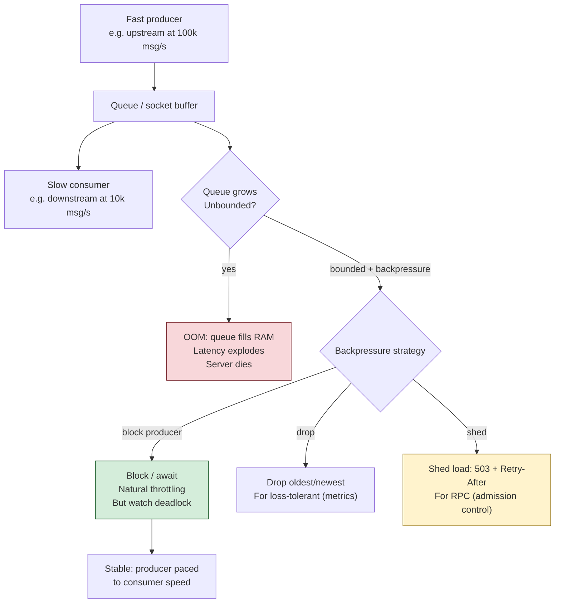

# Chapter 6 — Asynchronous I/O and Event Loops

**What this chapter covers.** Chapter 1 mapped the models of concurrency and observed that for
I/O-bound workloads — which is to say, for most backend services — the event loop is one of the
two dominant answers, the other being lightweight threads (Chapter 8). This chapter opens up the
event loop and examines every layer of it: why thread-per-connection stops scaling and what
exactly runs out; what a non-blocking file descriptor actually is and what `EAGAIN` means; the
thirty-year evolution of the multiplexing syscalls from `select` through `poll` to `epoll` and
`kqueue`, including the level-triggered/edge-triggered distinction that is responsible for a
whole genre of production bugs; `io_uring` and the completion-based model, which is not an
incremental improvement on `epoll` but a different paradigm — you submit operations rather than
register interest; and the anatomy of a real event loop, with its timers, its deferred callbacks,
its thread pool for the work that cannot be made non-blocking, and its one inviolable rule. We
then do three case studies mechanically — nginx, Node.js, Redis — and treat two problems every
event-loop server eventually meets: write-side backpressure and the thundering herd on shared
accept. The distributed-systems lens closes the loop: the reactor you build inside one process is
the same object that sits at the heart of every proxy and sidecar in your fleet, and event-loop
lag is queueing delay in exactly the sense of Little's Law from Chapter 1.

This chapter assumes you know what a file descriptor and a syscall are (Volume 2, Chapter 5),
and how a TCP socket's buffers behave (Volume 3; Volume 2, Chapter 10 for the kernel side).
Chapter 8 builds on this one: coroutines and async/await are, underneath, a compiler-assisted
way to write programs against exactly the machinery described here.

Learning goals — after this chapter you should be able to:

- Explain quantitatively why thread-per-connection hits a wall — which resources are exhausted,
  in what order — and what readiness-based multiplexing changes.
- Describe `O_NONBLOCK` and the `EAGAIN`/`EWOULDBLOCK` contract precisely, and explain why every
  fd owned by an event loop must be non-blocking.
- Compare `select`, `poll`, and `epoll` in terms of what crosses the user/kernel boundary per
  call, and explain why epoll's persistent interest list changes the complexity class.
- State the level-triggered and edge-triggered contracts exactly; write a correct edge-triggered
  drain loop; and explain both failure modes of getting it wrong — the lost-wakeup hang and the
  hot-fd starvation of every other connection.
- Explain io_uring's submission/completion ring architecture, how a completion model differs
  fundamentally from a readiness model, and why some fleets restrict io_uring anyway.
- Draw the phases of a production event loop, state the "never block the loop" rule and its
  consequences, and explain why file I/O gets offloaded to a thread pool even in a
  "fully async" runtime.
- Implement socket-level backpressure correctly: bounded write queues, `EPOLLOUT` watched only
  while the queue is non-empty, and a policy for slow clients.
- Use event-loop lag as the primary health metric of an async service, and connect it to
  queueing delay and fleet-wide tail latency.

## Why thread-per-connection hits a wall

The natural first architecture for a network server is one thread (or, earlier, one process) per
connection: accept, hand the socket to a thread, and let that thread issue ordinary blocking
`read` and `write` calls. The code reads exactly like its own control flow — sequential,
imperative, obvious — which is a genuine and underrated virtue. Through the 1990s this was the
dominant design, and for servers handling hundreds of concurrent connections it remains a
perfectly defensible one today.

The trouble begins when concurrency rises into the thousands, and it was named by Dan Kegel in
his widely circulated "C10K problem" page, first written in 1999: web servers of the day fell
over far below the ten thousand concurrent connections that the hardware — even 1999 hardware —
should have handled comfortably. The bottleneck was not bandwidth or CPU cycles spent on useful
work. It was the per-connection cost of the threading model itself, and it comes in three parts.

**Memory.** Each thread needs a stack. On Linux the default is 8 MiB of virtual address space
per thread; physical pages are committed lazily, so the real cost is typically tens of kilobytes
of touched stack plus the kernel's per-thread structures — but "tens of KiB times ten thousand"
is already hundreds of megabytes of memory doing nothing except remembering where ten thousand
mostly-idle conversations left off. And it is the *worst-touched* page count that sticks: a
single deep call chain (a logging library, a TLS handshake) permanently commits stack pages that
idle connections never give back. Compare the alternative: an event-driven server represents an
idle connection as a small heap object — a few hundred bytes of state machine — instead of a
stack.

**Scheduling and context switches.** A blocking read that completes wakes a thread; the kernel
must schedule it, switch to it, and later switch away. Volume 2, Chapters 1 and 2 costed this
out: a context switch runs on the order of a microsecond directly, and its indirect cost — the
cache and TLB pollution afterward — is often larger. A server with ten thousand threads
processing small messages spends a startling fraction of its cycles switching rather than
working, and the scheduler's own bookkeeping over enormous run queues adds to it. Worse, the
switches are *involuntary* concurrency: threads are preempted mid-operation, which is what
forces all the locking of Chapter 2 onto every shared structure the connections touch.

**The cliff is bimodal, not gradual.** While every thread fits in memory and the run queue is
short, thread-per-connection performs beautifully. As it saturates, throughput does not plateau —
it degrades, because switch overhead and memory pressure grow with concurrency while useful work
does not. This is the USL's β term (Chapter 1) with an operating-system referent.

The insight behind the alternative is that ten thousand connections do not represent ten
thousand things *happening* — at any instant almost all of them are idle, waiting for bytes.
What we need is not ten thousand call stacks; it is one loop that can efficiently ask the
kernel, "of these ten thousand file descriptors, which have something for me *right now*?" —
and a way to structure the program so that each answer is handled without blocking. That
question is **readiness-based I/O multiplexing**, and the structure is the **event loop**. The
price, stated honestly up front: control flow is inverted. Your program is no longer a sequence
of operations that happens to wait; it is a pile of callbacks (or, with Chapter 8's machinery,
suspended coroutines) that the loop invokes when the kernel says the world has changed.

## Non-blocking file descriptors: the contract

Everything downstream depends on one flag and one errno, so we state the contract precisely.

By default a socket fd is **blocking**: `read` on an empty socket buffer sleeps the calling
thread until data arrives; `write` to a full send buffer sleeps until space frees; `accept` on
an empty accept queue sleeps until a connection completes. Setting `O_NONBLOCK` — via
`fcntl(fd, F_SETFL, ...)`, or at creation with `SOCK_NONBLOCK`/`accept4` — changes exactly one
thing: **any operation that would have slept instead returns -1 immediately with `errno` set to
`EAGAIN`** (or `EWOULDBLOCK`; on Linux they are the same value, but portable code checks both).

`EAGAIN` is not an error. It is the kernel saying "not now — come back when I tell you." A
non-blocking fd plus a multiplexer is a complete protocol: try the operation; on `EAGAIN`,
register interest and go do something else; when the multiplexer reports readiness, try again.
Two consequences follow immediately:

- **Every fd an event loop owns must be non-blocking, without exception.** Readiness
  notification is a hint, not a guarantee — POSIX permits spurious readiness (a checksummed-bad
  packet can be discarded after `select` said readable; `man 2 select` documents this), and with
  multiple consumers another thread may drain the socket first. A blocking `read` after a stale
  readiness report hangs the entire loop. The rule is the moral twin of Chapter 2's mandatory
  `while` around a condition wait: readiness, like a wakeup, may be spurious, so the operation
  itself must be safe to attempt and fail.
- **Short operations are normal.** A non-blocking `write` of 64 KiB may accept 11 KiB and return
  11; the remaining bytes are your problem. Handling that correctly is the backpressure section
  later in this chapter.

One scope note that surprises people: `O_NONBLOCK` does approximately nothing for **regular
files**. A read from a file on disk never returns `EAGAIN`; it blocks in the kernel for as long
as the I/O takes, flag or no flag. Readiness semantics simply do not apply — a file is always
"ready" in the sense the interface can express, even when the bytes are milliseconds of seek
away. Hold that thought; it explains a structural feature of every event-loop runtime, and it is
one of the problems io_uring exists to solve.

## The multiplexers: select, poll, epoll, kqueue

### select and poll: stateless, O(n) per call

`select(2)` is the original (4.2BSD, 1983). You pass three bitmaps of fds — readable, writable,
exceptional — and the kernel returns with the bitmaps overwritten to show which are ready. Its
limits are structural. The bitmap is a fixed-size array: `FD_SETSIZE` is 1024 on Linux glibc,
and it is a limit on the *numeric value* of the fd, not the count — one long-lived server that
leaks its way past fd 1023 is undefined behavior territory. The sets are destroyed by each call,
so you rebuild them every iteration. And the cost is O(n) three times over: userspace builds
bitmaps over all n fds, the kernel scans all n to poll their state, and userspace scans the
results — every iteration, even if one fd of the ten thousand is ready.

`poll(2)` fixes the interface but not the algorithm: an array of `struct pollfd` replaces the
bitmaps, so there is no `FD_SETSIZE` ceiling and no per-call destruction of your interest set.
But the array still crosses into the kernel on every call, the kernel still walks all n entries,
and you still scan n `revents` fields to find the k ready ones. With ten thousand mostly-idle
connections, both syscalls do work proportional to the ten thousand to discover the dozen. This
per-call O(n) is precisely the C10K bottleneck on the multiplexing side.

### epoll: a persistent interest list in the kernel

`epoll` (Linux 2.5.44 era, stabilized in 2.6) restructures the problem by making the interest
set a **kernel object with state**, so you stop retransmitting it:

- `epoll_create1(0)` creates the epoll instance — itself an fd, so instances compose and can be
  monitored.
- `epoll_ctl(epfd, EPOLL_CTL_ADD | MOD | DEL, fd, &ev)` mutates the persistent interest list:
  which fds, which event mask (`EPOLLIN`, `EPOLLOUT`, `EPOLLET`, …), and a 64-bit `epoll_data_t`
  cookie of your choosing — typically a pointer to your per-connection state — returned to you
  with each event.
- `epoll_wait(epfd, events, maxevents, timeout)` blocks until at least one event is available
  and returns *only the ready ones*.

The mechanism is the inversion that matters: when you `EPOLL_CTL_ADD` an fd, epoll hooks that
file's kernel wait queue. When data arrives — in interrupt/softirq context, as the network
stack delivers into the socket buffer (Volume 2, Chapter 10) — the callback pushes the fd onto
the epoll instance's **ready list**. `epoll_wait` merely drains that list. Nobody scans the
interest set; readiness is pushed to the ready list at the moment it occurs, and retrieval costs
O(ready), not O(interested). Registration is paid once per fd lifetime instead of once per loop
iteration. This is the difference between "ask ten thousand sockets how they are doing" and
"read the list of sockets that raised their hand," and it is why epoll's cost is flat in the
number of idle connections.

`kqueue` (FreeBSD 2000, inherited by macOS and the other BSDs) is the same idea with a more
general and arguably cleaner interface: a single `kevent()` call both submits changes and
retrieves events, and the "filter" abstraction covers not just sockets but vnodes, signals,
timers, and process events. Windows' answer, IOCP, belongs to the next section because it is not
a readiness model at all. Portable loop libraries — libuv, libevent — exist precisely to paper
over this per-OS divergence.

### Level-triggered versus edge-triggered, precisely

Epoll offers two notification contracts, and the difference is the sharpest correctness edge in
this chapter.

**Level-triggered (LT, the default).** `epoll_wait` reports an fd whenever its condition
*currently holds* — readable while any bytes remain unread, writable while buffer space remains.
Read half the data and call `epoll_wait` again, and the fd is reported again. LT is
forgiving: leftover work re-announces itself every iteration.

**Edge-triggered (ET, `EPOLLET`).** `epoll_wait` reports an fd only on a *transition* — when
new data arrives on a socket, not while data merely sits there. Read half the data and call
`epoll_wait` again, and you get nothing: no new edge has occurred. The remaining bytes wait in
the buffer, silently, forever — or until the peer happens to send more, which for many
protocols it will not do, because it is waiting for your reply to the request whose tail you
never read. This is the classic ET hang: a distributed deadlock manufactured from one missing
loop, and it appears under load and in integration, rarely at the desk.



The ET contract is therefore: **on every event, drain the fd — loop the operation until it
returns `EAGAIN` — before returning to `epoll_wait`.** (This is also why ET plus a blocking fd
is doubly wrong: the drain loop's final read would hang.) But the fix creates the opposite
hazard. Draining means doing *unbounded* work per event: a peer that streams data as fast as you
read — a fast producer on a fat pipe — keeps the drain loop spinning on one fd while every
other connection in the loop starves. One hot connection becomes a livelock-flavored starvation
of thousands (Chapter 5's vocabulary applies exactly). Production ET code therefore bounds the
work — read at most N buffers per event, and if not yet at `EAGAIN`, put the fd on an
application-level ready list to resume after one full pass over the other ready fds. At which
point you have reimplemented, in userspace, the fairness that LT gives you for free. This is why
the honest guidance is: **use LT until you have a measured reason not to**; ET saves wakeups and
syscalls for high-throughput streaming workloads, and nginx uses it, but it moves two
correctness obligations (drain-to-EAGAIN, fairness) from the kernel into your code.

Why ET exists at all: LT has a multi-consumer problem. If several threads wait on one epoll fd
in LT mode, a single readable socket can wake more than one of them, and both race into the same
`read`. **`EPOLLONESHOT`** is the targeted fix — after delivering one event the fd is disarmed,
delivering nothing further until a thread explicitly re-arms it with `EPOLL_CTL_MOD` when its
processing is done. That makes "exactly one thread owns this fd's event at a time" a kernel
guarantee, at the cost of one extra syscall per event. Multi-threaded epoll designs essentially
require it; single-threaded loops never need it.

### A minimal, correct epoll echo server

The following is complete and compilable, and it exhibits the three disciplines just derived:
every fd non-blocking, accept drained to `EAGAIN`, reads drained to `EAGAIN` (connections are
registered ET to make the drain obligation visible).

```c
#include <errno.h>
#include <netinet/in.h>
#include <stdio.h>
#include <stdlib.h>
#include <string.h>
#include <sys/epoll.h>
#include <sys/socket.h>
#include <unistd.h>

#define MAX_EVENTS 64

int main(void) {
    int listen_fd = socket(AF_INET, SOCK_STREAM | SOCK_NONBLOCK, 0);
    int one = 1;
    setsockopt(listen_fd, SOL_SOCKET, SO_REUSEADDR, &one, sizeof one);

    struct sockaddr_in addr = {0};
    addr.sin_family      = AF_INET;
    addr.sin_addr.s_addr = htonl(INADDR_ANY);
    addr.sin_port        = htons(9000);
    if (bind(listen_fd, (struct sockaddr *)&addr, sizeof addr) < 0 ||
        listen(listen_fd, SOMAXCONN) < 0) {
        perror("bind/listen");
        exit(1);
    }

    int epfd = epoll_create1(0);
    struct epoll_event ev = { .events = EPOLLIN, .data = { .fd = listen_fd } };
    epoll_ctl(epfd, EPOLL_CTL_ADD, listen_fd, &ev);

    struct epoll_event events[MAX_EVENTS];
    for (;;) {
        int n = epoll_wait(epfd, events, MAX_EVENTS, -1);
        if (n < 0) {
            if (errno == EINTR) continue;
            perror("epoll_wait");
            exit(1);
        }

        for (int i = 0; i < n; i++) {
            int fd = events[i].data.fd;

            if (fd == listen_fd) {
                /* Drain the accept queue to EAGAIN: several connections
                 * may sit behind a single readiness report. */
                for (;;) {
                    int conn = accept4(listen_fd, NULL, NULL, SOCK_NONBLOCK);
                    if (conn < 0) {
                        if (errno == EAGAIN || errno == EWOULDBLOCK) break;
                        if (errno == EINTR) continue;
                        perror("accept4");
                        break;
                    }
                    struct epoll_event cev = {
                        .events = EPOLLIN | EPOLLET,
                        .data   = { .fd = conn }
                    };
                    epoll_ctl(epfd, EPOLL_CTL_ADD, conn, &cev);
                }
                continue;
            }

            /* Connection fd, registered edge-triggered:
             * read until EAGAIN or the edge is lost. */
            for (;;) {
                char buf[4096];
                ssize_t r = read(fd, buf, sizeof buf);
                if (r > 0) {
                    /* Echo back. write may accept fewer bytes than
                     * offered; a real server must queue the remainder
                     * and watch EPOLLOUT — see the backpressure
                     * section. This demo drops what will not fit. */
                    ssize_t off = 0;
                    while (off < r) {
                        ssize_t w = write(fd, buf + off, (size_t)(r - off));
                        if (w > 0) { off += w; continue; }
                        if (w < 0 && errno == EINTR) continue;
                        break;                      /* EAGAIN */
                    }
                } else if (r == 0) {                /* peer closed */
                    close(fd);   /* close also removes fd from epoll */
                    break;
                } else if (errno == EAGAIN || errno == EWOULDBLOCK) {
                    break;                          /* drained */
                } else if (errno == EINTR) {
                    continue;
                } else {
                    close(fd);
                    break;
                }
            }
        }
    }
}
```

Note what per-connection state this server carries: none beyond the fd itself, because echo is
stateless between events. A real protocol handler attaches a state machine — parse position,
partial frame, write queue — via `epoll_data_t`'s pointer form, and that heap object *is* the
connection, in the same sense that a stack was the connection in thread-per-connection.




## Completion-based I/O: io_uring, IOCP, and the proactor

Everything so far is a **readiness** model: the kernel tells you an operation *would now
succeed*, and you then perform it yourself. The alternative is a **completion** model: you tell
the kernel to *perform the operation* — here is the fd, the buffer, the length — and it
notifies you when the operation has finished, results in hand. Design-pattern literature names
the two **Reactor** and **Proactor** (Schmidt et al., *Pattern-Oriented Software Architecture*
vol. 2); Windows has been completion-based for three decades via I/O Completion Ports, where
threads block on `GetQueuedCompletionStatus` and pull finished operations off a queue — IOCP is
the design Windows-native servers and the .NET runtime are built on. Linux's historical attempts
at completion I/O (POSIX AIO, the old `io_submit` interface) were limited and little-loved;
the modern answer is `io_uring`.

### io_uring: two rings of shared memory

`io_uring`, merged in Linux 5.1 (2019, Jens Axboe), is built around two circular buffers
**mapped into shared memory** between the application and the kernel:

- The **submission queue (SQ)** holds submission queue entries (SQEs). An SQE describes one
  operation: an opcode (`READ`, `WRITE`, `ACCEPT`, `RECV`, `SEND`, `FSYNC`, `TIMEOUT`,
  `OPENAT`, and by now dozens more), an fd, buffer, length, offset, flags, and a `user_data`
  cookie returned with the completion.
- The **completion queue (CQ)** holds completion queue entries (CQEs): the `user_data` cookie
  plus a result field carrying the return value or negated errno — exactly what the equivalent
  syscall would have returned.

The application writes SQEs and advances the SQ tail with an ordinary atomic store; the kernel
consumes them and posts CQEs; the application reaps CQEs by advancing the CQ head. Because the
rings are shared memory, **the syscall boundary decouples from the operation count**: one
`io_uring_enter` call submits an entire batch of SQEs and can simultaneously wait for
completions. With `IORING_SETUP_SQPOLL`, a kernel-side polling thread watches the SQ and
submission requires *no syscall at all* while the thread is awake; reaping completions is
likewise just reading shared memory. Against the backdrop of Volume 2, Chapter 5 — syscalls
costing hundreds of nanoseconds, more in the post-Spectre-mitigation world — amortizing or
eliminating per-operation syscalls is a large fraction of io_uring's performance story. The rest
comes from pre-registration: `io_uring_register` lets you register buffers and fd sets once, so
the kernel skips per-operation pinning and fd-table lookups.



The programming model, via the `liburing` helper library:

```c
struct io_uring ring;
io_uring_queue_init(256, &ring, 0);

/* Submit: describe the operation, do not perform it. */
struct io_uring_sqe *sqe = io_uring_get_sqe(&ring);
io_uring_prep_read(sqe, conn_fd, buf, sizeof buf, 0);
io_uring_sqe_set_data(sqe, conn_state);        /* our cookie */
io_uring_submit(&ring);                        /* batch boundary */

/* ... later, in the loop ... */
struct io_uring_cqe *cqe;
io_uring_wait_cqe(&ring, &cqe);
struct conn *c = io_uring_cqe_get_data(cqe);
int res = cqe->res;            /* bytes read, 0 on EOF, or -errno */
io_uring_cqe_seen(&ring, cqe);
/* the data is already in buf — no read call to make */
```

Contrast this with the epoll server above and the paradigm difference is visible in the code
shape. With epoll you register *interest* and the I/O calls stay in your program; readiness is
advice. With io_uring you submit *operations*; when the CQE arrives, the read has already
happened — the bytes are in your buffer. Three consequences follow. First, the drain-to-EAGAIN
discipline and the LT/ET distinction simply do not exist here; in their place is management of
in-flight operations and their buffer lifetimes (a buffer lent to the kernel must stay valid
until its CQE — a new class of use-after-free if you get it wrong). Second, **regular files
work**: since you are asking for completion rather than readiness, the "a file is always ready"
problem dissolves, and disk I/O joins network I/O in the same uniform loop — the gap that
forced event-loop runtimes to bolt on thread pools, as the next section shows. Third, operations
can be chained (`IOSQE_IO_LINK`) so that, e.g., a write completes before a linked fsync starts,
pushing small state machines into the kernel.

**The caveats, stated plainly.** io_uring's implementation is large, complex, and it has been a
prolific source of kernel vulnerabilities — Google reported in 2023 that io_uring bugs accounted
for a majority of recent exploit submissions to their kernel bug-bounty programs, and
consequently restricted or disabled it on ChromeOS, on Android for apps, and on much of their
production fleet. Docker's default seccomp profile blocks the io_uring syscalls, and many
managed/multi-tenant environments do likewise. None of this means io_uring is wrong for your
dedicated database host — high-performance storage engines and runtimes adopt it where the wins
are real — but check what your platform actually permits before designing around it, and expect
the security posture to keep evolving. Meanwhile epoll remains the default substrate of nearly
every mainstream event-loop runtime, so the readiness model is the one you will operate for
years yet.

## Anatomy of a production event loop

A multiplexer is not yet an event loop. A production loop — libuv, libevent, Netty's
`EventLoop`, Tokio's reactor+executor, Envoy's `Dispatcher` — wraps the poll call in a repeating
structure with a small number of universal parts.



**Timers.** Every loop needs "call me in 30 s" — connect timeouts, keepalives, retries. The
poll timeout is simply the delay until the earliest timer, so timers cost nothing while the loop
sleeps. Two data structures dominate: a **binary min-heap** (O(log n) insert/expire, exact
ordering — libuv, most runtimes) and the **hashed/hierarchical timer wheel** (buckets per tick;
O(1) insert and cancel at the price of coarser granularity — the classic Varghese–Lauck design,
used by the kernel itself and by Netty and Kafka). Wheels win when timers are numerous and
usually *cancelled* — which describes I/O timeouts exactly: millions armed, almost none fire.

**Deferred callbacks and microtasks.** Every mature loop grows a "run this after the current
callback, before polling again" queue — libuv's check/idle handles, JavaScript's microtask
queue and `process.nextTick`, Netty's task queue. Two subtleties matter operationally. Ordering:
these queues run *before* the loop returns to polling, so they express "finish this logical
operation atomically with respect to I/O." Starvation: precisely because they run before
polling, a callback that endlessly schedules more deferred work starves the poll — in Node, a
recursive `process.nextTick` freezes all I/O in a way a recursive `setImmediate` does not,
because `setImmediate` yields to the poll phase each iteration.

**The rule: never block the loop.** Everything in this design amortizes one thread across
thousands of connections; therefore that thread's time is the shared resource, and any callback
that occupies it — a synchronous file read, a blocking DNS lookup, a call into a library that
takes a contended lock (Chapter 2), a 300 ms JSON parse of a pathological payload, an
accidental synchronous `write` to a blocking log fd — stops *every* connection, not just its
own. This is the trade Chapter 1 described when you chose this model: you gave up preemption.
The scheduler cannot rescue you from a hogging callback the way it rescues other threads from a
hogging thread, because scheduling is now cooperative and the unit of yielding is the callback.
Latency SLOs on an event-loop service are therefore SLOs on the *longest callback*, and the
p99.9 of "callback duration" is a metric worth having.

**The escape hatch: the thread pool.** Work that is CPU-bound or unavoidably blocking gets
handed to a pool of worker threads, with completion marshalled back to the loop as an event
(typically by writing to a pipe or `eventfd` that the loop polls, so the loop wakes through the
same mechanism as any I/O). libuv is the canonical example, and the *reason* it has a pool is
the fact flagged earlier: **regular-file I/O has no useful readiness semantics on Linux** —
epoll will not even accept a regular-file fd (`epoll_ctl` returns `EPERM`). So every `fs.*`
operation in Node, plus `getaddrinfo` DNS lookups and some crypto, executes as a blocking call
on a libuv pool thread (default 4, `UV_THREADPOOL_SIZE` to raise it), and only the *completion*
flows through the loop. The "async" file API is threads in a trench coat — not a criticism, but
a fact with operational teeth: four pool threads shared by file I/O and DNS means four slow disk
reads make DNS resolution mysteriously slow. The same pattern under different names: Netty's
`blockingTaskExecutor` conventions, Tokio's `spawn_blocking`, Go's runtime quietly parking a
thread per blocking file syscall. io_uring is the first Linux interface that could retire this
hack, and libuv has experimental io_uring support for exactly this reason.

## Case studies, done mechanically

### nginx: N loops, share nothing

nginx's architecture is a **master process** (configuration, binding sockets, supervising) plus
N **worker processes**, each running one single-threaded event loop over epoll (kqueue on BSD),
with `worker_processes auto` defaulting N to the core count. Each worker handles thousands of
connections; a connection lives on one worker for its lifetime. Why one worker per core works:
each loop saturates at most one core, so N cores want N loops; more than N adds context
switching without adding capacity; fewer leaves cores idle. Because workers are separate
*processes* sharing almost nothing, there are no locks on the request path and a worker crash
takes only its own connections — Chapter 1's "share nothing" answer, applied within one machine.
The workers share only the listening sockets, which is where the thundering-herd section below
picks up the story; with `listen ... reuseport`, each worker instead gets its own listening
socket and the kernel distributes connections among them. nginx uses edge-triggered epoll and
carries the drain-and-fairness obligations that entails; its origin is explicitly C10K-era —
Igor Sysoev began it in 2002 in substantial part to solve exactly the problem Kegel described.

### Node.js: one loop, phases, and two kinds of task

Node is V8 (execution) plus libuv (the loop) plus bindings. The libuv loop proceeds in
**phases** per iteration — approximately: timers (`setTimeout`/`setInterval` whose deadline has
passed), pending callbacks, poll (the epoll_wait, plus running I/O callbacks), check
(`setImmediate`), close callbacks. Distinct from all of these are the **microtask queues** —
`process.nextTick` and resolved-promise jobs — which drain after the currently running callback
completes, before the loop proceeds; this is the macrotask/microtask distinction, and it means
an `await` chain continues with minimal latency but also that promise-heavy CPU work can crowd
the loop just like any other callback. Everything from the previous section applies verbatim:
one thread runs all JavaScript; blocking it blocks every request; file I/O and DNS ride the
threadpool. The canonical self-inflicted outage:

```js
const { createServer } = require('node:http');
const { monitorEventLoopDelay } = require('node:perf_hooks');

const h = monitorEventLoopDelay({ resolution: 10 });
h.enable();

createServer((req, res) => {
  if (req.url === '/report') {
    // Synchronous CPU work: nothing else runs until this returns.
    const until = Date.now() + 2000;
    while (Date.now() < until) { /* render a big report, badly */ }
    res.end('report\n');
  } else {
    res.end('ok\n');            // normally sub-millisecond
  }
}).listen(8080);

setInterval(() => {
  console.log(`loop delay p99 = ${(h.percentile(99) / 1e6).toFixed(1)} ms`);
  h.reset();
}, 5000);
```

While `/report` spins, every concurrent `/ok` request — already accepted, bytes already in the
socket buffer — waits the full two seconds, and `monitorEventLoopDelay` records it. One request
paid for the work; every request paid the latency. The remedies are the standard three: chunk
the work and yield (`setImmediate`), move it to `worker_threads`, or move it out of the process.

### Redis: the event loop as a concurrency-control mechanism

Redis runs its own small loop (`ae.c`, epoll/kqueue/select behind one interface) and executes
**every command on a single thread**. This is a correctness decision as much as a performance
one: commands are naturally serialized, so `INCR`, `LPUSH`+`LTRIM`, Lua scripts — each runs
atomically with respect to all others *with zero locks*, none of Chapter 2's machinery, because
mutual exclusion is enforced by there being only one executor. The event loop here *is* the
concurrency control. The costs are the model's usual ones: a slow command (`KEYS` on a big
keyspace, a huge `SMEMBERS`, a long Lua script) stalls every client — the single-loop HOL
problem with a database attached — and one instance uses one core, which is why Redis scales by
running more instances (Cluster), not more threads.

Be precise about what later versions changed, because it is commonly misstated. Redis has long
run a few background threads (`bio`) for slow housekeeping — fsync, closing files, and lazy
free (`UNLINK`) since Redis 4. Redis 6 added **I/O threads** (`io-threads N`), which parallelize
only the syscall-and-serialization edge: writing replies to sockets, and optionally reading and
parsing requests (`io-threads-do-reads yes`). **Command execution remains single-threaded.**
The atomicity story is untouched; what scales is the part that was measured to dominate —
moving bytes to and from thousands of sockets.

## Backpressure: the write side is where servers die

Reads are self-limiting — you read at your own pace, TCP's receive window pushes back on the
sender (Volume 3). Writes are where event-loop servers grow their classic memory bug.

The kernel buffers your writes: a non-blocking `write` copies into the socket's send buffer
(size governed by `SO_SNDBUF` and autotuning) and returns; TCP drains it at whatever rate the
network and *the receiver* allow. Write to a slow client — a phone on bad radio, a stalled
consumer, a victim of your own 10 Gbps enthusiasm — and the buffer fills. Then `write` returns
a **short count**, and eventually `EAGAIN`. Both mean the same thing: *the kernel will not take
more; the remainder is your problem.*

The correct protocol is a small state machine per connection:

1. Try the write directly. If everything is accepted, done — this is the common case, and you
   never touch epoll's write machinery.
2. On a short write or `EAGAIN`, queue the remaining bytes in userspace **and only now add
   `EPOLLOUT` to the fd's interest set**.
3. When `EPOLLOUT` fires, drain the queue into the socket until empty or `EAGAIN` again.
4. When the queue empties, **remove `EPOLLOUT` from the interest set**.

Step 4 is not an optimization nicety, it is required for a level-triggered loop to function: a
mostly-empty send buffer means the socket is *almost always writable*, so a permanently
registered LT `EPOLLOUT` fires on every single `epoll_wait` — a busy loop burning a core to
learn nothing. Watch writability only while you have something queued.



The remaining question is the queue's bound, and here is the classic bug: **the unbounded write
queue.** The application produces data at its own rate — a pub/sub fanout, a log tail, a big
query result — while the socket drains at the client's rate. Any gap accumulates in your heap.
One stalled client on a high-volume feed grows its queue without limit; a few hundred of them
OOM the process, taking down every healthy client with them. The signature in the postmortem is
memory growth proportional to the *slowest* consumers, not to load. The defenses are policy, and
they must be chosen, not defaulted: **bound the queue** and then either disconnect the slow
client (Redis's `client-output-buffer-limit` does exactly this for pub/sub clients), drop or
coalesce intermediate updates (fine for market data ticks or metrics, where the latest value
supersedes), or **propagate the stall backward** — stop reading from whatever source feeds this
connection, so the pressure transmits upstream link by link. Propagation is what
`stream.pipe`/`pipeline` implement in Node (a `write` returning `false` pauses the readable
side until `'drain'`) and what TCP itself does with its windows. The same three options —
disconnect, drop, or propagate — reappear at fleet scale in messaging systems, and Volume 10,
Chapter 7 treats backpressure there; the socket-level version here is the atom from which those
designs are built.




## The thundering herd, and sharing accept

Run N workers for N cores and one question remains: who accepts new connections? Let all N poll
the same listening fd and you meet the **thundering herd**: a single incoming connection makes
the fd readable, all N workers wake, all N call `accept`, one wins, and N−1 burned a wakeup, a
scheduling round, and a cache refill for an `EAGAIN`. At high accept rates this is real work —
and it is the same shape as Chapter 2's futex-wake storms and Chapter 5's contention parades.
(For processes blocked in plain `accept` the kernel has done wake-one for decades; the herd
survives in the epoll formulation, because *readiness* notification historically meant notifying
everyone interested.)

Three mitigations, in historical order:

- **Userspace serialization.** nginx's classic `accept_mutex`: workers take turns holding the
  right to register the listen fd. Works, adds latency and its own small contention.
- **`EPOLLEXCLUSIVE`** (Linux 4.5): register the listen fd with this flag in every worker's
  epoll set, and the kernel wakes only one (or at least fewer — the contract is "one or more")
  of the waiters per event. Simple, effective, keeps one shared accept queue, so load balances
  naturally to whichever worker is free.
- **`SO_REUSEPORT`** (Linux 3.9): each worker binds its *own* listening socket to the same
  address and port; the kernel hashes each incoming connection's 4-tuple to pick exactly one
  socket. No shared fd, no herd at all, and the accept path itself scales across cores. Two
  costs worth knowing. First, balance: the hash distributes *connections*, not load — long-lived
  heavy connections can pile onto one worker; nginx added `reuseport` and Envoy supports the
  same for these wins and with these caveats. Second, drain: when a worker dies or you remove a
  socket during a reload, connections already queued on that socket's accept queue but not yet
  accepted are reset — a small but real error blip on every restart, which schedulers and
  runtimes mitigate with careful drain sequencing (Volume 11's deployment chapters touch the
  operational side).

## The distributed-systems lens

**The event loop is the atom of your data plane.** Every proxy, gateway, and sidecar in a
modern fleet is a reactor of exactly this chapter's shape. Envoy's threading model is the
cleanest statement: a main thread for config and control (the xDS machinery, Volume 3's service
mesh discussion), plus N worker threads, each running one non-blocking event-loop dispatcher;
every connection is pinned to one worker for its lifetime, so the request path takes no locks
and cross-thread interaction happens by posting callbacks to another loop's queue. That is
nginx's architecture with threads instead of processes, and it is HAProxy's, and it is the shape
of most load balancers you will ever operate. Understanding this chapter *is* understanding what
the p99 of your mesh does when someone's Lua/Wasm filter blocks, or why one worker at 100% CPU
manifests as tail latency on a fraction of connections rather than uniform slowdown.

**Readiness versus completion recurs as polling versus push.** The epoll/io_uring distinction —
"tell me when I could act" versus "act and tell me when it is done" — is the same design axis
as consumer polling versus broker push in messaging (Volume 10), and short-poll versus
long-poll versus server push in APIs (Volume 8). The trade-offs transfer with surprising
fidelity: readiness/polling keeps the consumer in control of pacing and buffer ownership and
makes backpressure trivial (you simply do not poll); completion/push minimizes latency and
per-event overhead but forces an explicit story for in-flight limits and buffer lifetime —
exactly the discipline io_uring demands with its submitted-buffer ownership rules.

**Head-of-line blocking is scale-free.** One slow callback delaying every connection in its
loop is the same phenomenon as one slow request delaying every response behind it on an HTTP/1.1
pipelined connection, or one lost TCP segment stalling every multiplexed HTTP/2 stream above it
(Volume 3) — a single serialized resource with mixed traffic. The mitigations rhyme at every
scale: bound the unit of work (chunked callbacks / frame limits), isolate classes of traffic
(separate loops or pools / separate connections), or move scheduling below the point of loss
(QUIC's per-stream delivery).

**Loop lag is queueing delay, and it is THE health metric.** Chapter 1 gave us Little's Law and
the utilization-delay curve; an event loop is a single-server queue in exactly that formalism.
Event-loop delay — the gap between when a timer or event *should* have run and when it did — is
the wait time W of work sitting in the ready queue, and it inflates every response time on the
process, uniformly, before any of your application code runs. That is why mature async services
export it directly (Node's `monitorEventLoopDelay`; comparable dispatcher-latency stats in
Envoy and Netty-based stacks) and alert on it rather than on CPU: a loop can be badly lagged at
modest CPU (blocked on the "async" disk write it wasn't supposed to make) and healthy at high
CPU (many small callbacks, none long). And because callers stack timeouts and retries on top
(Volume 11), a lagged loop in one tier does not stay local: it becomes retry amplification
upstream and tail latency two hops away. Fleet-wide p99 investigations end at somebody's
blocked event loop often enough that loop-lag dashboards should be the first tab, not the last.

## Key takeaways

- Thread-per-connection fails at high concurrency because per-connection cost — stack memory,
  context switches, scheduler load — grows with connections rather than with useful work.
  C10K's answer: represent idle connections as small state objects and ask the kernel which fds
  are ready *now*.
- `O_NONBLOCK` turns "would sleep" into `EAGAIN`, and `EAGAIN` is a protocol, not an error.
  Every fd in an event loop must be non-blocking, because readiness reports can be stale or
  spurious — the moral twin of the mandatory `while` around a condition wait.
- `select` and `poll` retransmit and rescan the whole interest set every call — O(n) per
  iteration. epoll keeps the interest list in the kernel and returns only the ready list;
  registration is paid once, retrieval costs O(ready). kqueue is the BSD equivalent.
- **Level-triggered** reports while the condition holds; **edge-triggered** reports only
  transitions. ET therefore requires draining every event to `EAGAIN` — miss it and data
  strands forever — and bounding the drain, or one hot fd starves the loop. Use LT until
  measurement says otherwise; use `EPOLLONESHOT` when multiple threads share an epoll set.
- io_uring is a **completion** model: submit operations through a shared-memory ring, reap
  results from another, batching or eliminating syscalls, and covering regular files uniformly.
  It is a different paradigm from epoll's readiness, with different obligations (in-flight ops,
  buffer lifetime) — and enough kernel-security history that several major fleets restrict it;
  verify your platform allows it before designing around it.
- A production loop = poll + timers (heap or timer wheel) + deferred queues + a thread pool for
  blocking work. libuv's pool exists because regular-file I/O has no readiness semantics on
  Linux — "async" file APIs are threads underneath.
- **Never block the loop.** One stalled callback stalls every connection; your latency SLO is
  an SLO on your longest callback. nginx, Node, and Redis are all one-loop-per-core designs,
  and Redis's single executor is *why* its commands are atomic without locks.
- Writes to slow clients fill the send buffer, then short-write, then `EAGAIN`. Queue the
  remainder, watch `EPOLLOUT` *only while the queue is non-empty*, and **bound the queue** with
  an explicit policy — disconnect, drop, or propagate. Unbounded write queues are the classic
  event-loop OOM.
- Shared accept wakes herds; serialize it, use `EPOLLEXCLUSIVE`, or give each worker its own
  socket with `SO_REUSEPORT` — knowing reuseport balances connections, not load, and resets
  queued connections on worker death.
- Event-loop lag is queueing delay in Little's Law terms and the single best health metric of
  an async service; it inflates every request on the process and amplifies through retries into
  fleet-wide tail latency.

## Further reading

- Kegel, D., "The C10K problem" — the page that named the era and catalogued the strategies.
  <http://www.kegel.com/c10k.html>
- `man 7 epoll` — the authoritative description of LT/ET semantics, `EPOLLEXCLUSIVE`,
  `EPOLLONESHOT`, and the documented pitfalls; also `man 2 select`, `man 2 poll`,
  `man 2 accept4`, `man 7 socket`.
- Lemon, J., "Kqueue: A generic and scalable event notification facility," *USENIX Annual
  Technical Conference (FREENIX Track)*, 2001 — the kqueue design paper.
- Axboe, J., "Efficient IO with io_uring" — the original design document; and the `liburing`
  repository and man pages (`io_uring_setup(2)`, `io_uring_enter(2)`, `io_uring_register(2)`).
  https://kernel.dk/io_uring.pdf
- Google Security Blog, "Learning to navigate the risks of io_uring" and related kCTF
  disclosures (2023) — the security posture behind fleet restrictions on io_uring.
- Schmidt, D., Stal, M., Rohnert, H., Buschmann, F., *Pattern-Oriented Software Architecture,
  Volume 2: Patterns for Concurrent and Networked Objects* (Wiley, 2000) — Reactor and
  Proactor, defined.
- Varghese, G. and Lauck, T., "Hashed and Hierarchical Timing Wheels: Data Structures for the
  Efficient Implementation of a Timer Facility," *SOSP*, 1987 — the timer-wheel paper.
- libuv documentation, "Design overview" — the loop phases and the thread pool, from the
  source. https://docs.libuv.org/en/v1.x/design.html
- Node.js documentation, "The Node.js Event Loop" guide and `perf_hooks.monitorEventLoopDelay`
  — phases, microtasks, and measuring loop delay.
- nginx documentation, "Inside NGINX: How We Designed for Performance & Scale" and the
  `listen ... reuseport` directive documentation.
- Redis documentation and `redis.conf` comments on `io-threads`, `io-threads-do-reads`, and
  `client-output-buffer-limit` — what is and is not threaded, and output-buffer policy.
- Envoy documentation, "Threading model" — one non-blocking dispatcher per worker, connections
  pinned to workers.
- Volume 2, Chapter 5 — System Calls — why batching and avoiding syscalls matters; Volume 2,
  Chapter 10 — the network stack that delivers into the buffers epoll watches.
- Volume 10, Chapter 7 — backpressure in messaging systems: the fleet-scale version of this
  chapter's write-queue problem.
