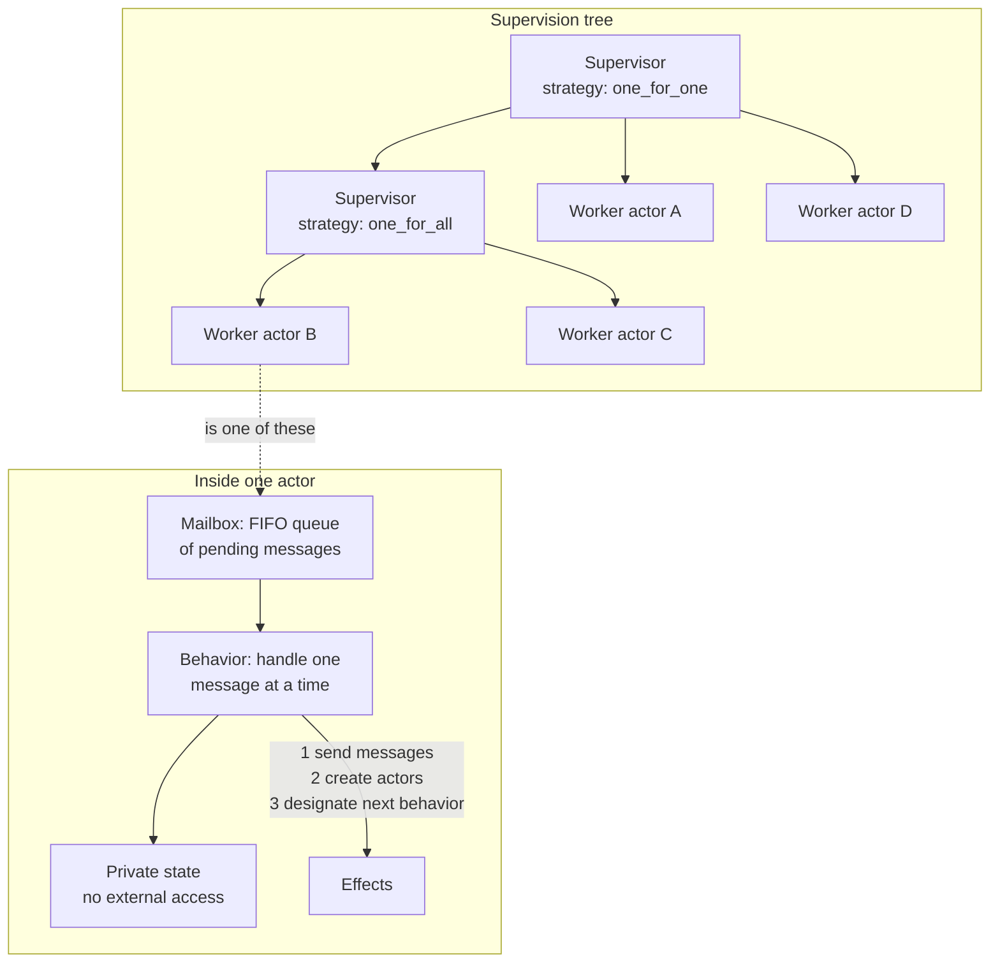
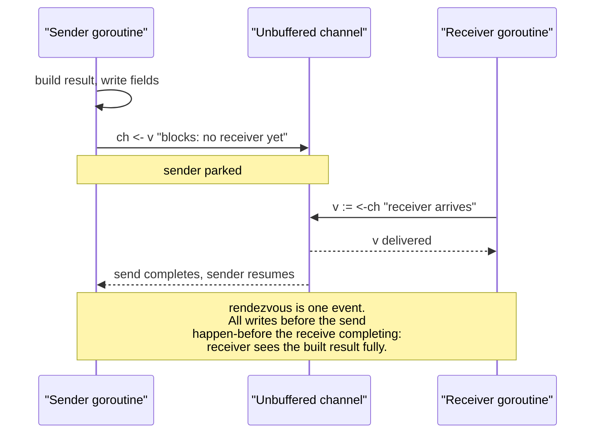
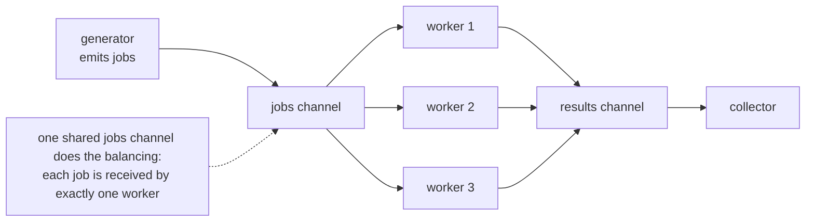
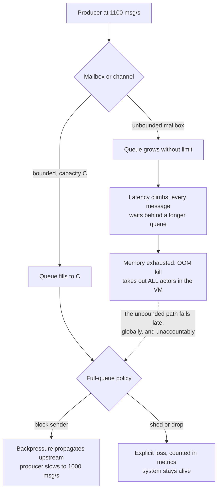

# Chapter 7 — The Actor Model, CSP, and Channels

**What this chapter covers.** Chapter 1's taxonomy split the world into models that share
mutable state and models that refuse to; Chapters 2 through 5 paid the bill for sharing.
This chapter develops the refusal seriously. Message passing is not one idea but two,
older and more different from each other than the folklore suggests. The **actor model**
(Hewitt, 1973) gives every concurrent entity an identity and an asynchronous mailbox, and
— in its Erlang/OTP realization — the strongest fault-tolerance story in mainstream
software. **CSP** (Hoare, 1978) makes the processes anonymous and the *channels* named,
with a synchronous rendezvous at every communication, and is the direct ancestor of Go's
goroutines and channels. We treat both rigorously — the actor axioms, supervision trees
and why "let it crash" actually works, Go channel semantics down to the happens-before
edges and the nil-channel idiom, the standard channel patterns — and then catalogue the
failure modes honestly: unbounded mailboxes, goroutine leaks, channel deadlocks, and the
race conditions message passing conspicuously does not eliminate. The chapter closes by
comparing the two models head to head and connecting both to distributed systems, where
message passing is not a design choice but the physics of the situation.

Learning goals — after this chapter you should be able to:

- State the three actor axioms precisely and explain what asynchronous sends and location
  transparency buy — and what they cost.
- Explain how Erlang/OTP turns the actor model into a reliability discipline: process
  isolation, links versus monitors, supervision trees, restart strategies, and the actual
  argument behind "let it crash."
- State classical CSP's core commitments — anonymous processes, named channels,
  synchronous rendezvous — and trace their lineage into occam and Go.
- Give the precise semantics of Go channels: unbuffered rendezvous and its happens-before
  edge, the buffered-channel capacity rule, `select`'s pseudo-random choice, and the exact
  behavior of nil and closed channels.
- Build and recognize the standard channel patterns: pipeline, fan-out/fan-in, worker
  pool, cancellation via done channel or `context`, and semaphore-via-buffered-channel.
- Enumerate the failure modes message passing does *not* remove — memory exhaustion,
  leaks, deadlock, ordering surprises, logical races — and know the mitigation for each.
- Choose between actors, CSP, and shared memory from workload characteristics rather than
  fashion.

## Message passing: the other half of the map

Recall the split from Chapter 1's taxonomy. Shared-memory models let threads mutate common
data structures and then spend three chapters' worth of machinery — mutexes, memory
barriers, atomics — making that safe. Message-passing models take the other branch:
concurrent entities own their state privately, and the *only* way information moves
between them is by sending messages. There is no shared mutable state, so there is nothing
to race on. The data-race hazard from Chapter 1 is not mitigated; it is eliminated by
construction.

The Go proverb states the design stance in one line:

> Do not communicate by sharing memory; instead, share memory by communicating.

Unpack it, because it is denser than it looks. "Communicate by sharing memory" is the
shared-state pattern: threads coordinate by writing flags and structures that other
threads read, with synchronization bolted on to make the writes visible and atomic. "Share
memory by communicating" inverts the ownership: at any moment, exactly one goroutine owns
a piece of data, and when another goroutine needs it, the *data itself* (or a reference,
with ownership conventionally transferred) travels through a channel. Synchronization is
not an annotation on the data; it is the communication. The transfer of the value and the
transfer of the right to touch it are the same event.

Two consequences follow immediately, and they frame everything in this chapter. First,
correctness reasoning becomes local: an actor or a CSP process is *sequential code*. You
can read its receive loop top to bottom and reason about it the way you reason about a
single-threaded program, because within one entity there is no interleaving. The global
concurrency is confined to the message layer, where it is visible and explicit. Second —
and this is the honest part — the hazards do not vanish; they migrate. Races on memory
become races on *message ordering*. Deadlocks on locks become deadlocks on cyclic channel
waits. Unbounded queues replace unbounded lock convoys. We will meet each migration in its
own section.

The two message-passing traditions differ on three axes, and holding the axes in mind
makes both models easier to learn:

| Axis | Actor model | Classical CSP |
|---|---|---|
| What has a name | The process (actor identity, PID) | The channel |
| Send semantics | Asynchronous, fire-and-forget, mailbox buffers | Synchronous rendezvous, sender and receiver meet |
| Natural habitat | Distributed by design (location transparency) | In-process coordination |

## The actor model

### Origins and axioms

The actor model was introduced by Carl Hewitt, Peter Bishop, and Richard Steiger in a 1973
IJCAI paper, *A Universal Modular ACTOR Formalism for Artificial Intelligence*, and given
its rigorous semantics by Gul Agha's 1986 monograph *Actors: A Model of Concurrent
Computation in Distributed Systems*. It predates nearly everything else in this volume; it
was conceived when "many communicating machines" was a research vision, which is exactly
why it fits that world so well now that the vision is the default deployment topology.

An **actor** is the unification of three things:

- **State** — private, encapsulated, touchable by no one else. There is no operation, in
  the model, by which one actor reads another's state.
- **Behavior** — the code that runs when a message is received; conceptually a function
  from (state, message) to a new state and a set of effects.
- **Mailbox** — a queue of messages sent to this actor and not yet processed. The actor
  processes messages one at a time; while it is handling one message, others simply wait.

The model's semantics fit in one sentence, traditionally stated as three axioms. **In
response to a message it receives, an actor may:**

1. **send** a finite number of messages to other actors (whose addresses it knows);
2. **create** a finite number of new actors;
3. **designate the behavior** to be used for the next message it receives.

Axiom 3 is the one people skate past, and it is where the state lives. "Designate the
behavior for the next message" is how an actor changes state without mutation: a counter
actor holding 4, upon receiving `increment`, designates "the counter behavior holding 5"
as its successor. In Erlang this is literally a tail-recursive call with a new argument;
in object-flavored actor systems it is assignment to fields that no other thread can see.
Either way, the axiom guarantees the property that makes actors easy to reason about:
**state transitions are serialized by the mailbox**. One message, one transition, no
interleaving. An actor is a tiny single-threaded server, and the whole system is a society
of them.

Two further commitments complete the model:

**Sends are asynchronous and fire-and-forget.** `send` deposits a message and returns.
There is no acknowledgment, no return value, no blocking. If you want a reply, you include
your own address in the message and the recipient sends one back — request/response is a
*pattern built on top of* one-way sends, not a primitive. This is a deliberate mirror of
physical reality: messages between machines are one-way datagrams at the bottom, and a
model whose primitive matches the substrate distributes without translation.

**Addresses are location-transparent.** You send to an actor's address; whether that actor
lives on your core, another core, or another continent is not visible in the sending code.
This is the model's boldest promise and — as the distributed-systems lens will argue — its
most dangerous one. Hold the skepticism; the mechanics first.



### Erlang/OTP: the model taken seriously

Erlang is the deepest industrial realization of the actor model, and studying it repays
the effort even if you never deploy a BEAM system, because OTP is a twenty-plus-year
distillation of what actor systems need in production. Erlang was developed at Ericsson in
the late 1980s for telephone switches — systems that must run for years, be upgraded
without stopping, and keep most calls up when parts of the software fail. Joe Armstrong's
2003 PhD thesis, *Making Reliable Distributed Systems in the Presence of Software Errors*,
is the definitive statement of the design and the best single document in the actor
literature; its title is the thesis: the errors are coming, and reliability must be built
in their presence, not on the assumption of their absence.

**Processes, not threads.** Erlang's actors are called processes, and the name is earned:
each has its **own heap**, its own stack, and its own garbage collector. There is no
shared mutable memory between processes at the language level — message sends copy the
data (with a carve-out for large binaries, which are reference-counted and shared
immutably). The consequences are structural. A process's GC pause pauses only that
process. A process's crash cannot corrupt another's state, because it cannot *reach*
another's state — the isolation that an OS gives processes at megabyte cost, BEAM gives at
a few hundred words of initial footprint. Processes are preemptively scheduled by the VM's
own schedulers (one per core), so running hundreds of thousands or millions of them is
routine, and one process looping forever cannot starve the rest. This is the property
list that "lightweight process" ought to mean, and most runtimes that borrow the phrase
deliver only part of it.

**Links and monitors: failure as an event.** Erlang's second foundational move is to make
failure *observable* rather than exceptional. Two primitives:

- A **link** is bidirectional: if either linked process dies abnormally, an exit signal
  propagates to the other, killing it too by default. A process that sets `trap_exit`
  instead receives the exit signal as an ordinary message `{'EXIT', Pid, Reason}` in its
  mailbox and can react programmatically.
- A **monitor** is unidirectional and non-lethal: the watcher receives a
  `{'DOWN', Ref, process, Pid, Reason}` message when the watched process dies, and nothing
  propagates back.

Links express "we live and die together" — the natural relation among the pieces of one
logical task. Monitors express "I want to know" — the natural relation for a
request/response caller awaiting a server that might die mid-request. Everything above is
built from these two.

**Supervision trees.** A **supervisor** is a process whose only job is to start child
processes, link to them, trap exits, and *restart children according to a declared
strategy* when they die. Supervisors supervise workers and other supervisors, so a system
forms a tree in which every process has a parent responsible for its failure. The classic
OTP restart strategies:

- **one_for_one** — a dead child is restarted alone; siblings are untouched. For children
  that are independent.
- **one_for_all** — one child's death causes the supervisor to terminate and restart *all*
  children. For children whose states are interdependent enough that a survivor holding
  references to a dead sibling is itself corrupt.
- **rest_for_one** — the dead child and every child started *after* it are restarted, in
  order. For children with a startup dependency chain: each child depends on those started
  before it.

Each supervisor also declares a **restart intensity**: at most *N* restarts within *T*
seconds. If a child exceeds that — it is crashing in a loop, so restarting is not fixing
it — the supervisor gives up and terminates itself, escalating the failure to *its*
supervisor, which applies its own strategy. Failures thus climb the tree until some
ancestor's restart genuinely clears the fault, or the root is reached and the node
restarts. Recovery is not a code path someone remembered to write; it is a property of the
tree's shape, declared in data.

**Why "let it crash" actually works.** The philosophy is routinely quoted and rarely
argued, so here is the argument. When a process encounters a state it was not written to
handle — a pattern match fails, an invariant is violated, a dependency returns garbage —
there are two options. Defensive programming tries to handle the anomaly in place: catch
it, log it, guess a corrective action, continue. But by hypothesis the process is now in a
state *its author did not anticipate*; code written from inside that state is guessing,
and a wrong guess continues execution with corrupted state, converting a loud, local,
immediate failure into a quiet, spreading, delayed one. The Erlang position: the process
should die at the first sign of anomaly, and its supervisor should restart it **from its
initial, known-good state**. A restart is a transition from an *unknown* state to a
*known* one — that is the entire trick, and it is the same reason "turn it off and on
again" genuinely works for most equipment.

Three preconditions make the trick sound, and each maps to an Erlang design decision.
The failing unit must be *small*, so a crash loses one request's worth of work, not the
node's — hence ultra-lightweight processes. The crash must be *contained*, unable to
corrupt survivors — hence heap isolation and no shared mutable state. And restart must be
*cheap and lead to a good state* — hence supervisors that respawn a process in
microseconds from declared initial arguments. Remove any leg and the stool falls: crashing
a 4 GB shared-heap JVM to clear one request's bad state is not "let it crash," it is an
outage. Armstrong's thesis adds an empirical observation worth internalizing: a large
fraction of production failures are *transient* — triggered by a rare interleaving, a
peculiar input, a momentary resource state — and for transient faults a clean retry from a
fresh state is not a workaround but a genuine cure. Chapter 5's deadlock discussion and
Volume 11's metastable-failure material both echo this: the cheapest path out of a bad
state is often not repair but rebirth.

**Behaviours.** OTP factors the actor patterns that recur — a server processing
request/response (`gen_server`), a finite state machine (`gen_statem`), event handling,
supervision itself — into **behaviours**: library modules that own the generic machinery
(the receive loop, timeouts, system messages, debug tracing, code-change hooks) and call
your module back for the domain logic. A `gen_server` implementation supplies `init/1`,
`handle_call/3` for synchronous requests, `handle_cast/2` for asynchronous ones, and the
behaviour does the rest. The division matters beyond convenience: the hard, subtle code —
the code that must interact correctly with supervision, shutdown, and upgrades — is
written once, by experts, and *your* code is a set of pure-ish callbacks that are trivial
to test. Here is the essence of what a gen_server is, stripped to a hand-rolled receive
loop with the same shape:

```erlang
-module(counter).
-export([start_link/0, increment/1, value/1]).

%% --- API (runs in the caller's process) ---

start_link() ->
    {ok, spawn_link(fun() -> loop(0) end)}.

increment(Pid) ->
    Pid ! {increment},                     % async: fire-and-forget cast
    ok.

value(Pid) ->
    Ref = make_ref(),
    Pid ! {value, self(), Ref},            % sync: a call is two sends
    receive
        {reply, Ref, N} -> N
    after 5000 ->
        exit(timeout)
    end.

%% --- Server loop (runs in the counter's process) ---

loop(N) ->
    receive
        {increment} ->
            loop(N + 1);                   % axiom 3: next behavior holds N+1
        {value, From, Ref} ->
            From ! {reply, Ref, N},        % axiom 1: send a message
            loop(N)
    end.
```

Note the anatomy: the "synchronous call" is two asynchronous sends plus a unique reference
to match the reply, with a timeout because in this model *the server might be dead* — and
the API functions hide the protocol from callers. That is `gen_server:call/2` in miniature.

**Hot code loading**, briefly: BEAM can hold two versions of a module simultaneously, and
a process switches to the new version at its next fully-qualified call — which is why OTP
loops make their recursive call as `?MODULE:loop(State)` and why behaviours define a
`code_change` callback to migrate state across versions. Telecom systems upgrade without
dropping calls this way. It is a niche capability, but it completes the picture: OTP
treats *software change itself* as an event the running system must survive, exactly as it
treats crashes.

**The reliability record, stated honestly.** The number that follows Erlang everywhere is
"nine nines": Armstrong's thesis reports that Ericsson's AXD301 ATM switch achieved
99.9999999% availability in a trial deployment carrying live traffic in a British
telecom network. Treat the figure as what it is — a reported result for one system,
over a specific measurement window, achieved by redundant hardware *and* OTP design
together, not a property of the language — and it stops being marketing. What generalizes
is not the number but the mechanism: systems built as supervision trees of small isolated
restartable processes degrade gracefully and recover automatically from the transient
faults that dominate production failure, and multiple decades of systems on this platform
(telecom switches, RabbitMQ, WhatsApp's messaging servers, ejabberd) constitute real
evidence that the mechanism holds up under load.

### Akka and actors on shared-memory runtimes

Akka (JVM; and its .NET port Akka.NET, plus post-license-change forks such as Apache
Pekko) demonstrates both that the actor model transplants and what is lost in transit.
The model is recognizable: actors with mailboxes, `tell` for fire-and-forget, parent
supervision, cluster support with location-transparent `ActorRef`s. Akka Typed improved
on a long-standing weakness by giving `ActorRef[T]` a message-type parameter, so sending
an actor a message it cannot handle is a compile error rather than a dead letter. Actors
are multiplexed onto a small thread pool by **dispatchers**, so the lightweight-process
economics broadly hold.

The caveat is the runtime underneath. The JVM is a shared-memory machine, and Akka's
isolation is a *convention*, not a guarantee. Messages are passed by reference, not
copied. Send a mutable object and keep a reference to it, and two actors now share
mutable state — every hazard of Chapters 2 and 3 walks back in through a door the model
claims not to have, and it is worse than plain shared-memory code because *nobody is
locking*, since the programming model promised locks were unnecessary. The same accident
happens by closing over the actor's own mutable state in a `Future` callback or a message
lambda: the closure executes on some pool thread concurrently with the actor processing
its next message. The discipline is well known — messages must be immutable, never close
over `this` or mutable fields, use `pipeTo`-style patterns to re-enter the actor —
but it is a discipline, enforced by review rather than by the runtime. Erlang enforces it
with per-process heaps and immutable terms; that enforcement, more than any single
feature, is the gap between the two. There is no free path to actor safety on a
shared-memory runtime: you buy it with copying, with immutability, or with vigilance.

## CSP: Communicating Sequential Processes

### Hoare, 1978

Tony Hoare's 1978 CACM paper *Communicating Sequential Processes* proposed, with unusual
directness, that input, output, and parallel composition be treated as *primitive*
programming constructs — as fundamental as assignment and iteration — rather than as
library calls layered over shared memory. The paper's model, refined in Hoare's 1985 book
into a full process algebra with a formal theory of refinement and deadlock analysis,
makes three commitments that jointly distinguish it from actors:

- **Processes are anonymous.** No PIDs, no addresses. A process cannot be sent to; it can
  only communicate through channels it holds.
- **Channels are the named entities.** Communication topology is a graph of channels
  wired between processes, fixed by whoever composed them — visible from outside, in the
  plumbing, rather than buried inside processes as knowledge of each other's addresses.
- **Communication is a synchronous rendezvous.** A send and its matching receive are *one
  event*. The sender waits until a receiver is ready, and vice versa; then the value
  passes, and both proceed. There is no buffer in the primitive, hence no mailbox, no
  queue, and no question of what happens when the queue is full — the "queue" is the
  blocked sender itself.

The rendezvous is the deepest difference from actors, and its consequence is
**backpressure by default**. An actor-model sender outrunning its receiver grows a
mailbox; a CSP sender outrunning its receiver *stops*. Flow control is not a feature to
add but a property of the primitive. The cost is coupling in time: sender and receiver
must both be alive and ready at the same moment, which is exactly the coupling a mailbox
exists to remove. Neither choice dominates; they trade availability of the sender against
boundedness of the system, a trade we re-litigate at network scale in the lens section.

Hoare's model also contributed **alternation** — a construct that waits on several
possible communications at once and takes whichever becomes ready — which is the direct
ancestor of Go's `select`, and the piece that makes rendezvous programming practical: a
process can serve multiple channels without committing to a blocking order.

CSP escaped the paper twice. In the 1980s it became **occam**, the language of the INMOS
transputer, where channel rendezvous was implemented in hardware between processors —
CSP as an instruction set. And through a lineage of languages Rob Pike worked on at Bell
Labs (Newsqueak, Alef, Limbo), it became **Go**, where the channel is a first-class,
typed, garbage-collected value — and, in a significant departure from the classical
model, channels can carry *channels*, so the communication topology can be rewired at
runtime by sending someone the channel to reply on. The `Ref` in our Erlang example and
the reply-channel-in-the-message pattern in Go are the same idea wearing different
clothes.

### Go channels, precisely

Go's channel semantics are specified tightly, and a senior engineer should know them at
the level of the specification and *The Go Memory Model*, because the corner cases —
nil, closed, buffered-capacity — are exactly where production bugs live.

**Unbuffered channels are a rendezvous.** `ch := make(chan T)` has capacity zero. A send
blocks until a receiver is ready; a receive blocks until a sender is ready; the handoff is
their joint event. This is classical CSP, and it carries a memory-model guarantee that
ties directly to Chapter 3: **a send on a channel happens-before the completion of the
corresponding receive** — everything the sender did before the send is visible to the
receiver after the receive. For unbuffered channels the guarantee is even symmetric: the
receive happens-before the completion of the send, so the *sender*, once its send returns,
also sees everything the receiver did before its receive began. The channel is not merely
a data conduit; it is a synchronization edge, which is why transferring ownership of a
pointer through a channel is safe: the happens-before edge publishes the pointee's state
along with the pointer.



**Buffered channels decouple, up to capacity.** `make(chan T, C)` holds up to C elements;
sends block only when the buffer is full, receives only when it is empty. The memory-model
rule generalizes with a precision worth quoting: **the k-th receive on a channel with
capacity C happens-before the (k+C)-th send completes.** Set C = 0 and you recover the
rendezvous. The rule is exactly what makes a buffered channel a correct counting
semaphore: with capacity 3, the 4th send cannot complete until the 1st receive has — at
most 3 senders are ever "inside." A buffered channel is therefore two tools in one: a
FIFO queue for values and a bounded permit-counter for control, and the semaphore pattern
below uses only the second half.

**`select` chooses among ready cases uniformly pseudo-randomly.** A `select` blocks until
at least one case can proceed; if *multiple* are ready, the specification says one is
chosen "via a uniform pseudo-random selection." The randomness is a deliberate fairness
device: if `select` favored, say, the first listed case, a busy channel in that position
would starve the others forever, and — worse — the starvation would be invisible in tests
and deterministic in exactly the way that makes bugs reproduce never. Randomization
converts "case B is never served" into "case B is served about half the time," at the cost
of a guarantee people persistently assume they have: **`select` provides no priority**.
The common attempt to prioritize cancellation by listing `<-ctx.Done()` first does
nothing; the idiomatic fix is a nested re-check (`select` on the done channel alone,
with `default`, before or after the main select) when priority genuinely matters.

**Nil and closed channels have exact, asymmetric semantics.** Learn this table; every
line is a production incident somewhere:

| Operation | Nil channel | Open channel | Closed channel |
|---|---|---|---|
| Send `ch <- v` | Blocks forever | Blocks until receiver/space | **Panics** |
| Receive `<-ch` | Blocks forever | Blocks until value/close | Returns zero value immediately, `ok = false` |
| `close(ch)` | Panics | Closes it | Panics (double close) |

The design is coherent once you see the intent. Close is a *broadcast of completion* from
sender to receivers: after close, every pending and future receive completes — draining
any buffered values first, then yielding zero values with `ok == false` — which is why
`for v := range ch` terminates on close and why a done-channel (below) works: closing it
releases *every* waiter at once, the only broadcast primitive channels have. From that
intent the rules follow: only senders know when sending is finished, so **only the sender
side may close**; a send on a closed channel is a protocol violation with no sane meaning,
so it panics loudly rather than silently discarding data. And the nil channel's
block-forever behavior, which looks like a footgun, is a load-bearing idiom: **a nil
channel in a `select` disables that case**, since a case that can never proceed is simply
never chosen. Setting a channel variable to nil after it closes is the standard way to
take a finished input out of a multi-source merge loop without restructuring the select —
we use it in the fan-in below.

**Directional channel types** round out the toolkit: `chan<- T` is send-only, `<-chan T`
receive-only, and a bidirectional channel converts implicitly to either. The conversion is
one-way — you cannot recover a bidirectional channel from a directional one — so function
signatures like `func producer(out chan<- int)` and `func consumer(in <-chan int)` are
compiler-checked statements of protocol role: the producer *cannot* receive from its own
output or, usefully, be closed by the wrong side, because `close` is disallowed on a
receive-only channel. Cheap, local, static protocol enforcement; use it everywhere.

## Channel patterns

A small vocabulary of shapes covers most real Go concurrency. The canonical exposition is
the Go blog's *Go Concurrency Patterns: Pipelines and cancellation*; here is the
distillation, with the reasoning attached.

**Pipeline.** Stages connected by channels: each stage receives from an inbound channel,
transforms, sends outbound, and closes its outbound channel when its inbound is drained —
the close propagating downstream as each `range` loop ends. Unbuffered links give a
pipeline lockstep flow control; a small buffer between stages smooths bursty stages
without unbounding anything.

**Fan-out, fan-in.** Fan-out: N goroutines receive from *one shared channel*, and the
channel's own semantics distribute work — each value is received exactly once, by exactly
one of them. No dispatcher, no index arithmetic, no work-stealing machinery; the channel
is the load balancer, and slow workers naturally take fewer items. Fan-in: one goroutine
(or a `WaitGroup`-closed merge) multiplexes several channels back into one. This is also
the honest **worker pool**: fan-out over a jobs channel, fan-in of results, bounded
concurrency equal to the number of workers.



**Cancellation: the done channel and `context`.** A pipeline must be able to stop early —
the consumer errored, the request timed out — and here the CSP coupling bites: a producer
blocked on a send to an abandoned channel blocks *forever*, leaking the goroutine and
everything it holds. The remedy is a second channel carrying no data, only the event of
its own closing: every send and receive is wrapped in a `select` that also watches
`done`, so closing `done` unblocks every participant at once. `context.Context` is this
pattern institutionalized — `ctx.Done()` returns exactly such a channel, adds deadline
propagation and a cancellation *tree* mirroring the call tree — and Chapter 8 treats it
properly as the backbone of structured concurrency. The rule to carry out of this chapter
is narrower and absolute: **any goroutine that sends or receives on a channel whose other
side might abandon it must select on a done channel too.** The following program is the
whole pattern vocabulary in one runnable piece:

```go
package main

import (
	"context"
	"fmt"
	"sync"
	"time"
)

// generate emits the integers [1, n] until cancelled.
func generate(ctx context.Context, n int) <-chan int {
	out := make(chan int)
	go func() {
		defer close(out) // close propagates completion downstream
		for i := 1; i <= n; i++ {
			select {
			case out <- i:
			case <-ctx.Done(): // never send without a cancellation escape
				return
			}
		}
	}()
	return out
}

// square is one pipeline stage; run several for fan-out.
func square(ctx context.Context, in <-chan int) <-chan int {
	out := make(chan int)
	go func() {
		defer close(out)
		for v := range in { // range ends when 'in' is closed and drained
			time.Sleep(10 * time.Millisecond) // simulate real work
			select {
			case out <- v * v:
			case <-ctx.Done():
				return
			}
		}
	}()
	return out
}

// merge fans multiple channels back into one (fan-in).
func merge(ctx context.Context, ins ...<-chan int) <-chan int {
	out := make(chan int)
	var wg sync.WaitGroup
	wg.Add(len(ins))
	for _, in := range ins {
		go func(in <-chan int) {
			defer wg.Done()
			for v := range in {
				select {
				case out <- v:
				case <-ctx.Done():
					return
				}
			}
		}(in)
	}
	go func() {
		wg.Wait() // close 'out' only after every input is drained
		close(out)
	}()
	return out
}

func main() {
	ctx, cancel := context.WithTimeout(context.Background(), 200*time.Millisecond)
	defer cancel() // releases the whole pipeline even on early return

	nums := generate(ctx, 100)

	// Fan out: three workers share one inbound channel.
	c1, c2, c3 := square(ctx, nums), square(ctx, nums), square(ctx, nums)

	sum := 0
	for v := range merge(ctx, c1, c2, c3) {
		sum += v
	}
	fmt.Println("partial sum before timeout:", sum)
}
```

Every send in that program sits inside a `select` with `ctx.Done()`; delete any one of
those selects and you have manufactured a goroutine leak that fires only when
cancellation races a full channel — precisely the kind of bug Chapter 10's leak detection
(`goleak`, blocked-goroutine profiles) exists to catch.

**Semaphore via buffered channel.** Bounding concurrency without a worker pool: a
buffered channel of capacity N where acquiring a permit is a send and releasing is a
receive. The capacity-C happens-before rule is what makes this correct, not just
plausible:

```go
sem := make(chan struct{}, 8) // at most 8 concurrent fetches

var wg sync.WaitGroup
for _, u := range urls {
	wg.Add(1)
	go func(u string) {
		defer wg.Done()
		sem <- struct{}{}        // acquire: blocks when 8 are in flight
		defer func() { <-sem }() // release
		fetch(u)
	}(u)
}
wg.Wait()
```

(`golang.org/x/sync/semaphore` offers a weighted, context-aware version; the channel form
is the idiom to recognize in review.)

**or-done and errgroup**, conceptually. The *or-done* wrapper takes a channel and a done
channel and returns a channel that closes when either does — it factors the
select-on-done boilerplate out of consumer loops so they can `range` plainly.
`errgroup.Group` (in `golang.org/x/sync`) packages the dominant fan-out termination
policy: run N goroutines, wait for all, return the first error, and — via
`errgroup.WithContext` — cancel the shared context the moment any member fails, so
siblings stop doing doomed work. It is structured concurrency in miniature, and Chapter 8
generalizes it.

## What message passing does not fix

Both models are routinely oversold. Here is the honest ledger; each entry names the
migration of a Chapter 1 hazard, not a new species.

**Unbounded mailboxes are unbounded memory.** The actor model's asynchronous send has a
hidden operand: the mailbox that absorbs the send is a queue, and in Erlang and Akka it is
*unbounded by default*. A producer that outruns its consumer by even a few percent grows
that queue without limit — and the failure is doubly vicious because it is slow (minutes
or hours of creep before the OOM) and self-worsening (in Erlang, a `receive` with
selective pattern matching scans the mailbox, so a long mailbox makes the consumer
*slower*, which grows the mailbox faster). The remedies are the standard flow-control
ones: bound the queue and choose a policy for the full case — block the sender
(backpressure, the CSP default recovered), shed load, or drop with a metric — or move to
credit/pull-based schemes where consumers grant send permission. This is the in-process
shadow of Volume 10, Chapter 7's backpressure story, and the design pressure is identical.



Go's buffered channels are always bounded, so Go fails the *other* way:

**Goroutine leaks from blocked communication.** A goroutine parked on a channel operation
that will never complete — sending to a channel nobody will drain, receiving from one
nobody will close — leaks its stack, its captured references, and its slot in every
resource it holds, forever; the runtime cannot collect a blocked goroutine, because
blocked-forever is not distinguishable from blocked-so-far. The classic instances: a
pipeline abandoned mid-stream by a consumer that returned early (the cancellation section
above); the losing goroutines of a "first response wins" race sending into an unbuffered
channel that the winner's receiver has left (fix: buffer of size N, or a done channel);
timeouts wrapped around channel receives that abandon the sender. At a few kilobytes each,
leaked goroutines can bleed a server for weeks before anyone looks at
`runtime.NumGoroutine()`. Chapter 10 covers detection — `goleak` in tests, the goroutine
profile's "blocked for N minutes" annotations in production.

**Deadlock did not stay behind with the locks.** Chapter 5's Coffman conditions apply to
any exclusively-held, waited-for resource, and "the other party's readiness to
communicate" qualifies. Two goroutines each blocked sending to the other; a gen_server
that calls another gen_server which, handling that call, calls back into the first
(caller is blocked in its own receive, so the reply never comes — a classic OTP deadline
for `gen_server:call` timeouts); a pipeline stage that consumes its own downstream. Cyclic
waits are cyclic waits. Go's runtime detects the *global* case — every goroutine asleep —
and panics helpfully (`fatal error: all goroutines are asleep - deadlock!`), but a partial
deadlock among some goroutines while others serve traffic detects nothing. The
mitigations are Chapter 5's, translated: acyclic communication topology (pipelines are
DAGs by construction — one reason the pattern is so durable), timeouts on synchronous
calls (OTP's default 5-second call timeout is this, institutionalized), and `select` with
done channels as the escape hatch.

**Ordering is guaranteed less than you assume.** What you get: a Go channel is a FIFO
queue — values are received in the order sent. Erlang guarantees that messages between one
sender and one receiver arrive in send order — **per-pair FIFO**. What you do not get, in
either model: any ordering across *pairs*. If A sends to C and then, afterward, B sends to
C, C may still receive B's message first — nothing ordered the two senders. If A sends to
B and then to C, nothing constrains which lands first. Two goroutines receiving from one
channel may be scheduled such that the later value is *processed* first even though it was
received second. Any protocol that needs cross-source ordering must build it — sequence
numbers, a single serializing actor, an explicit barrier — and the "must build it" clause
is Volume 6's causality material (Lamport clocks, vector clocks) making its first
appearance at millimeter scale.

**Race conditions survive in full.** Chapter 1 was emphatic that data races and race
conditions are different bugs, and message passing eliminates only the former. Every
check-then-act split across two messages is still a race: read an actor's value with one
message, decide, write with another — and another client's write lands between them; the
fix is the same as ever, make the compound operation *one message* (compare-and-set as a
message type — the actor's serial mailbox then gives you atomicity for free, which is
genuinely one of the model's best gifts). Two services double-reserving inventory via
polite non-overlapping messages race exactly as two threads do. TOCTOU, lost updates,
ordering-dependent outcomes: all present, now spread across mailboxes where no
ThreadSanitizer can see them. Message passing moves the interleaving problem up a level
of abstraction — which is a real improvement, because protocol-level interleavings are
coarser and more enumerable than instruction-level ones — but "fewer, more visible races"
is the honest claim, not "no races."

## Actors and CSP, head to head

| Dimension | Actors (Erlang/OTP, Akka) | CSP (Go channels) |
|---|---|---|
| Named entity | Process (identity, address) | Channel (process is anonymous) |
| Send semantics | Asynchronous, mailbox-buffered | Synchronous rendezvous (or bounded buffer) |
| Backpressure | Opt-in; unbounded mailbox is the default trap | Default; blocking send *is* flow control |
| Topology | Implicit, inside actors' address knowledge | Explicit, in the channel wiring |
| Selective wait | Selective receive on message patterns | `select` over channel cases |
| Failure handling | Links, monitors, supervision trees — first-class | None; explicit `error` values, `errgroup`, panics kill the process |
| Distribution | Native; the same send crosses machines | In-process; crossing machines means changing tools |
| Enforcement of isolation | Erlang: by the runtime. Akka: by convention | By convention (sharing via closures/pointers is possible) |

Two rows deserve emphasis. **Distribution** is the actor model's structural advantage:
because sends were *always* asynchronous, failable-in-principle, and addressed to an
opaque identity, the same primitive extends across a network — Erlang's `Pid ! Msg` is
the same expression whether `Pid` is local or on another node, and OTP's distribution
layer has worked this way for decades. A Go channel, by contrast, is a memory object;
there is no "remote channel," and moving a CSP design across machines means re-plumbing
onto gRPC streams or a message broker — at which point you have rebuilt asynchronous
addressed messaging, i.e., actors. **Supervision** is the other asymmetry: OTP has a
complete, declarative failure-recovery architecture, while Go offers `if err != nil`,
`recover` at goroutine top-level (an unrecovered panic in any goroutine kills the whole
process — there is no blast-radius containment), and conventions like errgroup. That is
not an oversight so much as a difference in ambition — Go builds servers whose
orchestrator (systemd, Kubernetes) is the supervisor — but within the process, the
Erlang story is simply richer.

**Choosing, from the workload** — extending Chapter 1's table rather than replacing it.
Reach for **actors** when the domain decomposes into many long-lived stateful identities
— sessions, devices, accounts, game entities, connection handlers — because per-entity
serial mailboxes give you race-free state machines, and supervision gives each entity an
independent failure domain; and reach for them decisively when the system must span
nodes or survive partial failure as a design requirement. Reach for **CSP channels** when
the problem is *dataflow* — pipelines, fan-out/fan-in, bounded work distribution,
in-process coordination — where explicit topology and default backpressure are exactly
the properties you want, and process identity is noise. And reach past both, back to
**shared memory**, when the data is genuinely shared, large, and hot — a big in-process
cache or index that every request reads — because copying it through messages or
serializing all access through one owner's mailbox makes the single owner a USL-style
serialization point (Chapter 1's α term) that a sharded RWMutex or a lock-free structure
would not be. The models compose in one program, and well-built Go services do compose
them: channels for lifecycle and work distribution, a mutex around the hot map, an
actor-shaped "owner goroutine" for the piece of state with the nastiest invariants.

## The distributed-systems lens

Every chapter in this volume ends by walking its topic across the network. This chapter
barely has to walk: **a distributed system is a message-passing concurrent system whether
you like it or not**. There is no shared memory between nodes; there are only one-way,
failable, reorderable messages between named endpoints. That is the actor model's
substrate, described exactly. A service endpoint is an actor mailbox — an addressed queue
draining into sequential-ish handlers. A message queue is a channel with persistence and
weaker delivery guarantees (Volume 10, Chapter 1 makes this correspondence precise). The
request/response-with-timeout you write against any RPC framework is `gen_server:call` —
two one-way sends, a correlation ID, a deadline — reinvented with worse defaults. When
Chapter 1 said the models that eliminate shared state "extend across the network
essentially unchanged," this is the mechanism: they were built on the network's actual
primitive, so there is nothing to translate.

Erlang, seen this way, is a preview that arrived decades early. A supervision tree
restarting crashed processes from known-good initial state, with escalation when restarts
exceed a rate limit, is a Kubernetes controller restarting crashed pods from a declared
spec, with `CrashLoopBackOff` as the restart-intensity policy (Volume 12). "Let it crash"
is the philosophy behind every orchestrator's decision to kill and reschedule rather than
heal in place. Microservices-with-an-orchestrator is a supervision tree whose processes
got heavier and whose supervisor moved out of process; the reliability argument — small
isolated restartable units beat defensive in-place recovery — transferred intact, because
it never depended on Erlang, only on isolation, cheap restart, and known-good initial
state.

But the network also sharpens every honest caveat from this chapter, and this is where
**location transparency** must be read critically. The promise — local and remote sends
look identical — is genuinely valuable for topology flexibility, and genuinely dangerous
as a semantic claim, for the reasons catalogued in the *fallacies of distributed
computing* (the list compiled at Sun by Peter Deutsch and colleagues, with Gosling's
addition: the network is reliable, latency is zero, bandwidth is infinite, the network is
secure, topology doesn't change, there is one administrator, transport cost is zero, the
network is homogeneous). A local send costs nanoseconds and fails only if the process is
dead; a remote send costs a network round trip's worth of tail latency and can fail
*silently* — and, crucially, **indistinguishably**: a timeout does not tell you whether
the message was lost before processing, lost after, or processed slowly (Volume 6,
Chapter 1). Erlang is more honest than its imitators here — monitors deliver explicit
`DOWN`/`noconnection` signals, and the literature never claimed remote sends were
reliable, only that they were *addressable* the same way — but any abstraction that makes
the remote look local invites code that treats it as local, and that code is wrong in the
tails. Retrying the ambiguous timeout means possible duplication; hence exactly-once
delivery is unachievable as a transport guarantee, and the real contract is at-least-once
plus **idempotent handlers** — deduplication by message ID, natural idempotency, or
version preconditions (Volume 6, Chapter 9). The actor axioms quietly assumed reliable
delivery for the local case; across the network, that assumption is the first casualty,
and your protocol design inherits the obligation.

Finally, the flow-control story completes across the network unchanged. An overloaded
service with an unbounded accept queue is an actor with an unbounded mailbox, and it dies
the same death — slow latency creep, then collapse — at bigger scale; every
production-grade RPC stack's answer (bounded queues, load shedding, deadline propagation,
HTTP/2 flow-control windows, broker consumer credits) is one of the bounded-mailbox
policies from the flowchart above, applied between machines. Backpressure, like
happens-before in Chapter 3, is one concept you learn once and bill twice.

## Key takeaways

- **Message passing eliminates data races by construction, not race conditions.** State
  is private; interleaving moves to the message layer, where races are coarser and more
  visible but fully alive. Check-then-act across two messages is still check-then-act.
- **The actor axioms are: on receiving a message, an actor may send messages, create
  actors, and designate its next behavior.** The third axiom serializes state transitions
  through the mailbox — an actor is a small single-threaded server, which is why its
  internals need no synchronization.
- **Erlang/OTP is the model taken seriously**: per-process heaps enforce isolation,
  links and monitors make failure an observable event, and supervision trees with
  declared restart strategies (one_for_one, one_for_all, rest_for_one, plus restart
  intensity and escalation) make recovery a property of system shape.
- **"Let it crash" works because a restart is a transition from unknown state to
  known-good state** — and it is sound only when failing units are small, isolated, and
  cheap to restart. On shared-memory runtimes (Akka), isolation is a convention:
  immutable messages or nothing.
- **CSP names the channels, not the processes, and communicates by synchronous
  rendezvous** — so backpressure is the default, not a feature. Actors buy sender
  availability with unbounded queues; CSP buys boundedness with temporal coupling.
- **Know the Go channel rules cold**: send happens-before receive completes; the k-th
  receive happens-before the (k+C)-th send on capacity C (which is why a buffered channel
  is a correct semaphore); `select` picks among ready cases uniformly at random (no
  priority); send on closed panics; receive on closed yields zero immediately; nil blocks
  forever — and a nil channel in `select` deliberately disables a case.
- **Every channel send or receive whose counterparty might abandon it must select on a
  done/context channel.** This one rule prevents the goroutine-leak class; Chapter 10
  shows how to detect the survivors.
- **The failure modes are migrations, not novelties**: unbounded mailboxes are memory
  exhaustion (bound the queue, pick a full-queue policy — Vol 10 Ch7); cyclic channel or
  call waits are deadlock (Chapter 5's conditions apply verbatim); ordering is FIFO
  per-channel or per-sender-pair only — nothing is ordered across sources.
- **Actors distribute; channels don't.** Asynchronous addressed sends are the network's
  native primitive, so actor designs cross machines unchanged, while CSP designs get
  re-plumbed onto RPC or brokers. But location transparency is leaky — remote sends have
  latency, ambiguous failure, and duplication, so idempotency is mandatory (Vol 6 Ch9) —
  and supervision trees anticipated orchestrator restart policies (Vol 12) by decades.

## Further reading

- Hewitt, C., Bishop, P., and Steiger, R., "A Universal Modular ACTOR Formalism for
  Artificial Intelligence," *IJCAI*, 1973 — the origin of the actor model.
- Agha, G., *Actors: A Model of Concurrent Computation in Distributed Systems* (MIT
  Press, 1986) — the rigorous semantics; the standard theoretical reference.
- Hoare, C. A. R., "Communicating Sequential Processes," *Communications of the ACM*
  21(8), 1978 — the paper. https://dl.acm.org/doi/10.1145/359576.359585 The 1985 book
  of the same name develops the full process algebra and is freely available at
  <http://www.usingcsp.com/>.
- Armstrong, J., *Making Reliable Distributed Systems in the Presence of Software Errors*
  (PhD thesis, KTH, 2003) — supervision, "let it crash," and the AXD301 story from the
  source; the single best document on building reliable actor systems.
- Armstrong, J., *Programming Erlang: Software for a Concurrent World*, 2nd ed.
  (Pragmatic Bookshelf, 2013) — the practical companion to the thesis.
- Erlang/OTP documentation, *OTP Design Principles* — supervision trees, behaviours, and
  gen_server as actually specified. https://www.erlang.org/doc/system/design_principles.html
- The Go Programming Language Specification — channel types, send/receive/close
  semantics, and `select`'s uniform pseudo-random choice. https://go.dev/ref/spec
- *The Go Memory Model* — the happens-before guarantees for unbuffered and buffered
  channels stated precisely. https://go.dev/ref/mem
- "Go Concurrency Patterns: Pipelines and cancellation" (Go blog, 2014) — the canonical
  treatment of pipeline, fan-out/fan-in, and done-channel cancellation.
  https://go.dev/blog/pipelines
- Cox-Buday, K., *Concurrency in Go* (O'Reilly, 2017) — or-done, fan-in, and the pattern
  vocabulary developed at book length.
- Deutsch, P. et al., "The Eight Fallacies of Distributed Computing" — the checklist
  against which every location-transparency claim should be tested.
- Vernon, V., *Reactive Messaging Patterns with the Actor Model* (Addison-Wesley, 2015) —
  actor patterns on the JVM, including the discipline needed on a shared-memory runtime.
- Chapter 5 — Deadlock — the Coffman conditions that channel cycles satisfy; Chapter 8 —
  Coroutines and Structured Concurrency — where `context` and errgroup get their full
  treatment; Chapter 10 — Testing Concurrency — goroutine-leak detection.
- Volume 10, Chapter 1 — messaging systems as durable channels; Volume 10, Chapter 7 —
  backpressure across services; Volume 6, Chapter 9 — delivery guarantees and idempotency.
