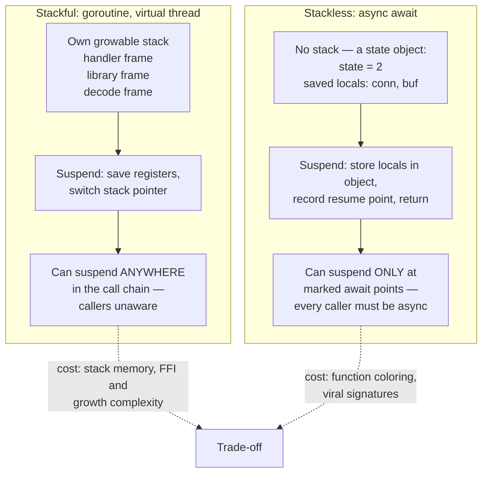
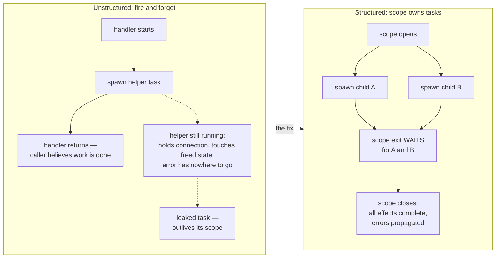
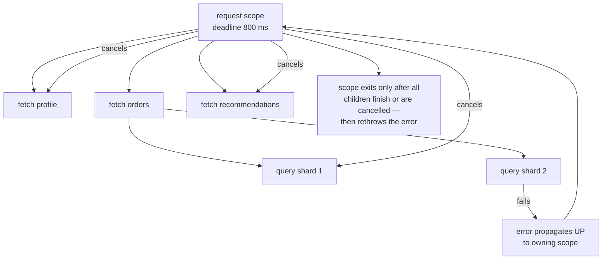
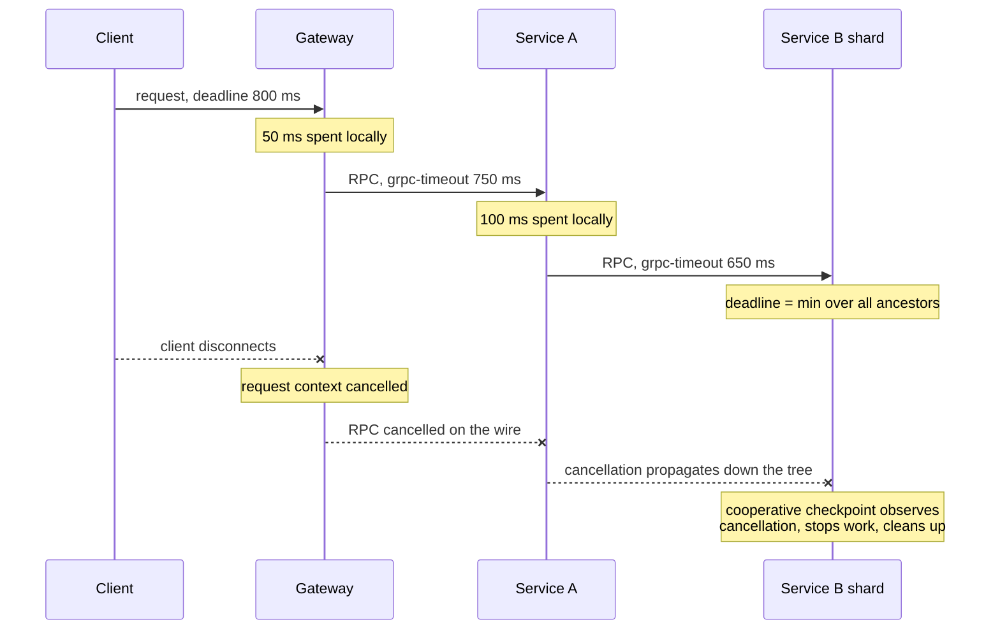

# Chapter 8 — Coroutines and Structured Concurrency

**What this chapter covers.** Chapter 6 showed how an event loop turns a thread's blocking waits
into a multiplexed stream of readiness events, and paid the price in inverted, callback-shaped
control flow. This chapter covers the two ideas that fixed that. The first is the *coroutine* — a
task that can suspend mid-execution and resume later, cheap enough to have a million of. We treat
the mechanics precisely: stackful versus stackless suspension, what an `async/await` compiler
actually generates, why the "function coloring" problem exists and how Go, Java, Rust, and Kotlin
each answer it, and how M:N runtime schedulers place these tasks onto OS threads. The second idea
is the discipline that makes a million tasks manageable: **structured concurrency**, the rule that
every task is owned by a lexical scope that cannot exit until the task completes, that errors
propagate to the owner, and that cancelling the owner cancels everything it owns. The claim —
made explicitly by its originators — is that unrestricted task spawning is to concurrency what
`goto` was to sequential control flow, and that abolishing it changes what you can rely on
everywhere else. We compare the real implementations (Trio, Kotlin, Java, Go's conventional
version), work through cancellation and error propagation carefully, and close with the
distributed-systems lens: a request fanning out across services is a distributed task tree, and
deadline propagation, cross-wire cancellation, and orphaned work are this chapter's ideas wearing
network protocols.

Learning goals — after this chapter you should be able to:

- Explain the difference between stackful and stackless coroutines at the level of mechanism —
  what is saved at suspension, where it lives, and where suspension is permitted — and state the
  cost/capability trade-off each makes.
- Sketch the state machine an `async/await` compiler generates from a suspending function.
- State the function-coloring problem and classify the mainstream ecosystems by how they answer
  it: dissolve it (Go, Java virtual threads), accept it (Rust, JavaScript, Python), or hide it
  (Kotlin).
- Describe M:N scheduling and work stealing conceptually, and explain why purely cooperative
  scheduling needs a preemption story — including what Go actually did about it.
- Make the structured-concurrency argument from first principles: why `go`/`Thread.start`/detached
  tasks break local reasoning, and what the scope-owns-tasks invariant restores.
- Use nurseries, `coroutineScope`, `errgroup`+`context`, or `StructuredTaskScope` to run
  concurrent subtasks with correct error propagation and cancellation.
- Implement cooperative cancellation correctly: checkpoints, shielded cleanup, and deadlines that
  compose as the minimum over ancestors.
- Extend the task-tree model across service boundaries: deadline propagation over RPC,
  client-disconnect cancellation, and the orphaned-work problem.

## Coroutine mechanics: two ways to suspend

A coroutine is a function that can *suspend* — return control to a scheduler while remembering
where it was — and later *resume* from exactly that point. Every async runtime in production is
built on one of two implementations of "remember where it was," and almost every visible property
of an ecosystem's concurrency — its syntax, its per-task memory cost, its FFI story, its library
compatibility rules — follows from which one it chose.

### Stackful: a real stack per task

A **stackful** coroutine owns a genuine call stack, allocated by the runtime rather than the OS.
Goroutines, Java virtual threads (Project Loom), and Lua coroutines work this way. To suspend, the
runtime does what an OS context switch does, minus the kernel: it saves the registers (stack
pointer, program counter, callee-saved registers) into the task's control block and switches the
stack pointer to another task's stack. Because the entire call chain lives on the coroutine's own
stack, suspension can happen *anywhere* — ten frames deep inside a library that has never heard of
concurrency. A goroutine blocked on a channel receive inside `json.Decode` inside your handler
suspends the whole chain as a unit; nothing in the chain needed to be marked, transformed, or
recompiled.

The costs are the stack itself and the machinery to manage it. A fixed large stack per task (the
classic 1 MB thread default) would cap you at thousands of tasks, so stackful runtimes make stacks
small and growable: Go starts each goroutine at 2 KB and grows the stack by copying it to a larger
allocation when a function prologue detects insufficient space — which is why Go pointers into
stacks must be precisely tracked by the runtime, and why calling into C via cgo requires switching
to a separate C-sized stack that foreign code can treat conventionally. Java virtual threads take
a different route to the same end: a virtual thread's frames are ordinary JVM frames that the JVM
*unmounts* — copies from the carrier thread's stack into a heap object — at a blocking point, and
remounts later, possibly onto a different carrier. Both designs mean per-task memory is
proportional to actual call depth, typically a few kilobytes, but both pay ongoing complexity at
the boundary with code that assumes conventional stacks: FFI, stack-walking profilers, and (in
Loom's case, historically) frames pinned by `synchronized` blocks or native calls that could not
be unmounted.

### Stackless: the function becomes a state machine

A **stackless** coroutine has no stack of its own. Instead, the *compiler* transforms the function
into an object — a state machine — whose fields are the local variables that must survive a
suspension, plus an integer recording which suspension point comes next. C++20 coroutines, Rust
`async fn`, Python `async def`, JavaScript `async function`, and Kotlin `suspend fun` all work
this way. Suspension is only possible at syntactically marked points (`await`, `.await`,
`co_await`, or a call to another suspending function), because those are the only places the
compiler has arranged to save state. An ordinary function called from a coroutine cannot suspend;
if a suspension is needed five frames down, all five frames must be async, each one a state
machine holding the one below it as a field — the "stack" is a linked (or in Rust, flattened and
inlined) chain of heap or future objects rather than a contiguous memory region.

The payoff is footprint and transparency. A stackless task's memory is exactly the live variables
across its suspension points — often well under a hundred bytes — computed at compile time, with
no guessing at stack sizes and no growth machinery. Rust leans on this hard: an `async fn`
compiles to an anonymous type implementing `Future`, sized precisely, allocated wherever you put
it, and the runtime need not exist until you poll it. The cost is that suspension is a property of
the function's *type*, visible in every signature from the leaf I/O call up to `main` — which is
the door through which the function-coloring problem enters.



The comparison in one table:

| Property | Stackful | Stackless |
|---|---|---|
| Where can it suspend | Anywhere in the call chain | Only at marked points in async functions |
| Per-task memory | KBs, proportional to call depth | Bytes to hundreds of bytes, exact at compile time |
| Existing blocking libraries | Work unchanged | Must be wrapped or rewritten |
| Function signatures | Unchanged | Async-ness is viral through the type system |
| FFI / native interop | Complicated by movable, growable stacks | Trivial — no special stacks exist |
| Examples | Go, Java virtual threads, Lua | Rust, C++20, Python, JS, Kotlin, C# |

### What the compiler generates for `async/await`

`async/await` is syntactic sugar over the state-machine transform — equivalently, over
continuation-passing style with the continuations reified as an object. It is worth seeing the
desugaring once, concretely, because it demystifies most async "gotchas." Take a small Rust
function:

```rust
async fn fetch_user(id: u64) -> Result<User, Error> {
    let conn = pool.acquire().await?;      // suspension point 1
    let row = conn.query_one(id).await?;   // suspension point 2
    Ok(User::from(row))
}
```

The compiler generates, conceptually, an enum with one variant per region between suspension
points, holding exactly the locals live in that region, and a `poll` method that is one big state
switch:

```rust
// Conceptual — what rustc generates in spirit, simplified.
enum FetchUser {
    Start { id: u64 },
    AwaitingAcquire { id: u64, fut: AcquireFuture },
    AwaitingQuery { fut: QueryFuture },        // conn moved into fut; id no longer live
    Done,
}

impl Future for FetchUser {
    type Output = Result<User, Error>;
    fn poll(mut self: Pin<&mut Self>, cx: &mut Context) -> Poll<Self::Output> {
        loop {
            match &mut *self {
                FetchUser::Start { id } => {
                    let fut = pool.acquire();
                    *self = FetchUser::AwaitingAcquire { id: *id, fut };
                }
                FetchUser::AwaitingAcquire { id, fut } => {
                    match Pin::new(fut).poll(cx) {
                        Poll::Pending => return Poll::Pending,   // suspend: state saved
                        Poll::Ready(Err(e)) => { *self = FetchUser::Done; return Poll::Ready(Err(e.into())); }
                        Poll::Ready(Ok(conn)) => {
                            let fut = conn.into_query_one(*id);
                            *self = FetchUser::AwaitingQuery { fut };
                        }
                    }
                }
                FetchUser::AwaitingQuery { fut } => {
                    match Pin::new(fut).poll(cx) {
                        Poll::Pending => return Poll::Pending,
                        Poll::Ready(Err(e)) => { *self = FetchUser::Done; return Poll::Ready(Err(e.into())); }
                        Poll::Ready(Ok(row)) => { *self = FetchUser::Done; return Poll::Ready(Ok(User::from(row))); }
                    }
                }
                FetchUser::Done => panic!("polled after completion"),
            }
        }
    }
}
```

Every mainstream stackless implementation is a variation on this shape. Kotlin's compiler adds a
hidden `Continuation` parameter to every `suspend fun` and compiles the body into a state machine
keyed by a label field; C# and JavaScript generate an equivalent `MoveNext`-style method; Python
generators (`yield`-based, which is what `async def` compiles down to) keep the frame object alive
between `send()` calls, which is the interpreter's version of the same trick. Three practical
consequences fall out of the transform. First, `Pending`/suspension is just a *return* — the
"blocked" task consumes no thread; it is a small object waiting for someone to call `poll`
(or `resume`) again. Second, in poll-based Rust, a future does nothing until polled — async
functions are lazy, and forgetting to `.await` a call is a no-op bug the compiler warns about.
Third, the size of a task is the size of its worst suspension point: holding a large buffer as a
local across an `await` embeds that buffer in every instance of the state machine.

## The function-coloring problem

In 2015, Bob Nystrom's essay *What Color Is Your Function?* gave the stackless cost its lasting
name. Imagine every function is either red (async) or blue (sync), with rules: red can call blue,
but blue cannot call red (or can only call it in a degraded, fire-and-forget way); and you can
only *await* red from within red. The colors are viral — making one leaf function red forces
redness up the entire call chain — and they bifurcate the ecosystem: every combinator, every
interface, every library exists twice or works for only one color. This is not an aesthetic
complaint. It shows up as concrete engineering costs: `Iterator` versus `Stream`, sync and async
versions of database drivers, trait methods that could not be async (Rust stabilized async fn in
traits only in late 2023, and object-safety wrinkles remained), and the perennial hazard of
calling a blocking function from async context and stalling an executor thread (Chapter 6's
cardinal sin, now hidden behind an innocent-looking signature).

The interesting part is that the industry did not converge on one answer. There are three:

**Dissolve the problem — make blocking cheap.** Go's position from the start, and Java's position
since Project Loom: there is only one color, and it looks blocking. A goroutine or virtual thread
that "blocks" on I/O merely suspends a cheap stackful task; the runtime intercepts the blocking
operation (Go through its scheduler-integrated netpoller; the JDK by retrofitting its blocking I/O
and `java.util.concurrent` internals to unmount virtual threads) and the OS thread moves on.
JEP 444 made virtual threads final in Java 21 (September 2023), and its explicit pitch was
Nystrom's argument inverted: keep the thread-per-request style, the debugger, the stack traces,
and the entire existing synchronous library ecosystem, and make the thread cheap instead of making
the code async. One vintage-specific caveat: in the initial releases, a virtual thread blocking
inside a `synchronized` block *pinned* its carrier thread; JEP 491 (JDK 24, March 2025) removed
that limitation for the common cases, leaving certain native-frame situations as the remaining
pinning source. If you run Java 21–23, monitor pinning (`-Djdk.tracePinnedThreads`) is still an
operational concern.

**Accept the colors.** Rust, JavaScript, and Python keep the distinction explicit and ask the
programmer to manage it. Rust's justification is the strongest: it refuses both a runtime and
garbage collection, so movable growable stacks are off the table, and in exchange the type system
makes async cost-transparent — a task's memory is a `size_of` you can print. JavaScript never had
threads to block, so async was the only game. Python has both worlds (threads and `asyncio`) and
suffers the bifurcation most visibly: the sync and async halves of its ecosystem are separate
library universes.

**Hide the colors.** Kotlin's `suspend` is technically a color — `suspend fun` compiles to CPS and
cannot be called from ordinary functions — but the language works to make it fade: the call syntax
is identical (no `await` keyword; calling a suspend function from a suspend function just works),
the compiler makes suspension points visible in the gutter rather than the code, and
`withContext(Dispatchers.IO)` gives a sanctioned way to wrap blocking calls. The color remains in
signatures and in interop, but day-to-day it imposes little of JavaScript's ceremony.

There is no free lunch among the three. Dissolving the color costs runtime complexity and a per-task
footprint measured in kilobytes rather than bytes; accepting it costs ecosystem bifurcation;
hiding it costs a compiler transform whose seams show at interop boundaries. What you should *not*
do is treat the coloring debate as settled folklore in either direction — it is a genuine
trade-off, and the right side of it depends on whether your constraint is per-task memory (proxies
and routers holding a million idle connections favor stackless) or library compatibility and
developer throughput (typical service backends favor the Go/Loom answer).

## Runtime schedulers: putting M tasks on N threads

Whichever suspension mechanism a runtime uses, it needs a scheduler: something that maps M
runnable tasks onto N OS threads, where M may be six orders of magnitude larger than N. The
dominant design is **M:N scheduling with work stealing**. Each OS worker thread keeps a local
run queue of tasks; a worker that empties its own queue *steals* a batch from a randomly chosen
victim's queue. Local queues keep the hot path free of global contention and preserve cache
locality (a task tends to resume on the core that last ran it); stealing repairs imbalance without
central coordination. Go's scheduler is the canonical production example — its G-M-P model
(goroutines, machine threads, and per-thread processor contexts holding the run queues) is
dissected in Volume 13, Chapter 2, and we will not duplicate that here. Tokio, Rust's dominant
async runtime, implements the same shape for stackless tasks: a multi-threaded work-stealing
executor in which a `poll` returning `Pending` parks the task and frees the worker, and wakers
re-enqueue tasks when their I/O completes. The JDK schedules virtual threads on a work-stealing
`ForkJoinPool` of carrier threads.

The structural hazard of all these schedulers is that they are **cooperative**: a task yields the
worker only at suspension points. A task that computes for 500 ms without suspending — parsing a
huge JSON document, a tight numeric loop, an accidental `O(n²)` — holds its worker hostage, and if
a handful of such tasks land together they starve every peer on the runtime (the event-loop
blocking problem of Chapter 6, reborn at M:N scale). Runtimes answer with varying force. Tokio
answers with *budgets*: a task that keeps polling ready resources is forced Pending after a fixed
budget of operations, giving the scheduler a chance to run others — but a genuine compute loop
that never touches a resource evades this, which is why Tokio provides `spawn_blocking` and
`block_in_place` for CPU-bound work. Go's answer evolved instructively. Before Go 1.14, preemption
happened only at function-call sites (piggybacking on the stack-growth check in function
prologues), so a call-free loop was unpreemptible — the background `sysmon` thread would *mark*
any goroutine running longer than about 10 ms for preemption, but the mark took effect only at the
next call. Go 1.14 (February 2020) added **asynchronous preemption**: sysmon sends the hogging
thread a signal (SIGURG on Unix), whose handler suspends the goroutine at the next safe point
regardless of calls. The general lesson survives the details: a cooperative runtime either grows a
preemption mechanism, or it must give you a blocking-pool escape hatch and the discipline to use
it — and usually both.

## Structured concurrency: the go statement considered harmful

Everything so far makes tasks *cheap*. Cheap tasks make a new problem acute: what governs their
*lifetimes*? The primitive every runtime hands you — `go func(...)`, `Thread.start()`,
`asyncio.create_task`, `tokio::spawn`, `GlobalScope.launch` — takes a function and starts it
running, detached, with no further relationship to the code that spawned it. Call this
*unstructured spawn*.

The critique of unstructured spawn has two named sources. Martin Sústrik — of ZeroMQ, and author
of the C coroutine libraries libmill and libdill — coined the term **structured concurrency**
around 2016 to describe libdill's discipline: coroutine lifetimes must nest, a coroutine never
outlives its parent, and cancellation is a first-class, ordinary operation. Nathaniel J. Smith's
2018 essay *Notes on Structured Concurrency, or: Go Statement Considered Harmful* made the
argument general and gave it its edge. Smith's observation: every spawn primitive is a directed
jump — control flow splits, and one branch leaves the scope entirely — which is exactly the
property that made `goto` destructive. Dijkstra's case against `goto` was not aesthetic; it was
that `goto` destroys the correspondence between the program text and its execution, so you cannot
reason locally. If control can arrive from anywhere and leave to anywhere, then no function
boundary means anything: you cannot look at `f(); g();` and know that `f` finished before `g`
began. Structured programming won because restricting control flow to nested blocks — sequence,
selection, iteration, call/return — made *black-box abstraction* possible: a function's effects
are over when it returns.

Unstructured spawn breaks that abstraction in precisely the same way, and the damage is not
hypothetical. Four failure classes recur in every codebase that spawns freely:

1. **Tasks outlive their scope.** A handler spawns a helper and returns; the helper is still
   running, holding a database connection from a pool that will be exhausted by lunchtime, or
   touching request state that the framework has already recycled. The function returned, but its
   effects are not over — the black box leaks.
2. **Errors vanish.** The spawned task throws. Into what? There is no caller on its (logical)
   stack. Runtimes log it, invoke a global "unhandled exception" hook, or — as with a raw Go
   goroutine panic — take down the process. The one thing that cannot happen is the natural thing:
   propagation to the code responsible for the work. Result: background failures that page no one
   and surface weeks later as data gaps.
3. **Cancellation has no path.** The client disconnected; the request's work should stop. Which
   tasks belong to this request? Nobody recorded that. Unstructured systems reconstruct the
   answer with ad-hoc registries and flags, and miss some.
4. **Leaks accumulate.** Each of the above, times uptime. Task leaks are the async era's memory
   leaks — invisible in code review, cumulative in production, diagnosed at 3 a.m. via a task-dump
   showing forty thousand goroutines blocked on channels nobody will ever write to (Chapter 10
   covers the tooling).



### The fix: scopes own tasks

Structured concurrency is one rule with three corollaries. **The rule:** concurrency may only be
introduced inside a *scope* — a syntactic block — and every task spawned in the scope is owned by
it; the scope cannot be exited until every owned task has completed. **The corollaries:** (a) a
child task's error propagates to the scope, where the surrounding code can catch it with ordinary
`try`/`catch` or error returns; (b) cancelling the scope cancels all its children, transitively;
(c) since scopes nest lexically and tasks are confined to scopes, the tasks of a program form a
**tree** at runtime, mirroring the block structure of the source.

That tree is the core invariant, and each edge of it carries three obligations downward and one
upward: the parent awaits the child (completion flows up), the parent's cancellation reaches the
child (cancellation flows down), the parent's deadline bounds the child (time flows down), and the
child's failure reaches the parent (errors flow up). Restore the tree and the four failure classes
close by construction: nothing outlives its scope, every error has a propagation path, every task
has a cancellation path from the root, and a leak would require escaping the tree — which the API
no longer offers. Just as removing `goto` made "what can control flow do here?" locally
answerable, removing unstructured spawn makes "what is running right now, on whose behalf, and
until when?" answerable by reading the enclosing scopes. And, exactly as with `goto`, the point is
what the restriction *enables*: because the runtime knows the tree, it can give you accurate
cross-task stack traces (Kotlin and Trio print the logical parent chain, not the scheduler's call
stack), meaningful task dumps, and resource cleanup tied to scope exit.



## Realizations: four ecosystems, one tree

### Trio nurseries — the pattern at its purest

Nathaniel Smith's Python library **Trio** is where the pattern was first realized as the *only*
way to spawn, and it remains the reference implementation of the idea. Trio has no detached
spawn. The sole way to start a task is inside a nursery:

```python
import trio
import httpx

async def fetch_all(urls: list[str]) -> dict[str, str]:
    results: dict[str, str] = {}

    async def fetch(client: httpx.AsyncClient, url: str) -> None:
        resp = await client.get(url)
        resp.raise_for_status()
        results[url] = resp.text

    async with httpx.AsyncClient() as client:
        async with trio.open_nursery() as nursery:
            for url in urls:
                nursery.start_soon(fetch, client, url)
        # The nursery block does not exit until every fetch has finished.
        # If any fetch raises, the nursery cancels the others, waits for
        # them to actually stop, and re-raises here — an ordinary exception
        # in ordinary control flow.
    return results

async def main() -> None:
    with trio.move_on_after(2.0):          # cancel scope: a deadline
        data = await fetch_all(["https://example.com/a", "https://example.com/b"])
        print({k: len(v) for k, v in data.items()})

trio.run(main)
```

Two details deserve attention. First, `fetch_all` is a black box again: when it returns, all its
concurrency is over — the caller cannot tell, and need not care, that it was internally
concurrent. Second, `move_on_after` shows Trio's other contribution, the **cancel scope**:
cancellation and timeouts are properties of *scopes*, not of individual tasks or of call sites,
and they apply to everything the scope dynamically contains. Trio's design directly shaped the
`asyncio.TaskGroup` added to the standard library in Python 3.11, which brings the
nursery-with-error-propagation shape (though not Trio's full cancel-scope semantics) to stock
`asyncio`.

### Kotlin — structured concurrency as the default

Kotlin coroutines bake the tree into the runtime as the **Job hierarchy**: every coroutine has a
`Job`; launching from within a `CoroutineScope` makes the new job a child of the scope's job;
failure of a child cancels the parent, which cancels the siblings; a parent job does not complete
until its children do. The scope function `coroutineScope { }` gives fail-fast semantics:

```kotlin
import kotlinx.coroutines.*

data class Dashboard(val profile: Profile, val orders: List<Order>)

suspend fun loadDashboard(userId: String): Dashboard = coroutineScope {
    val profile = async { profileService.fetch(userId) }   // child 1
    val orders  = async { orderService.list(userId) }      // child 2
    // If orderService.list throws, the coroutineScope cancels the
    // profile child, waits for it to finish cancelling, and rethrows
    // the original exception to our caller. No leak, no lost error.
    Dashboard(profile.await(), orders.await())
}

suspend fun loadDashboardWithTimeout(userId: String): Dashboard =
    withTimeout(800) {           // deadline applies to the whole subtree
        loadDashboard(userId)
    }
```

`supervisorScope { }` (and `SupervisorJob`) inverts the error policy: a child's failure is
delivered to that child's handler but does *not* cancel siblings — the collect-all/supervision
policy discussed below. Kotlin also demonstrates the ecosystem's learning curve: the escape hatch
`GlobalScope.launch` — an unstructured spawn — was so reliably a bug (leaked work, swallowed
errors) that the library marked it `@DelicateCoroutinesApi` to force an explicit opt-in.

### Java — StructuredTaskScope

Loom's second act applies the same discipline to virtual threads. Fair warning on vintage: this
API has had a long preview run — incubating as JEP 428 (Java 19) and JEP 437 (20), preview as
JEP 453 (21), re-previewed in 22–24, and re-previewed again with a substantially redesigned API in
JEP 505 (Java 25, September 2025), which replaced the `new StructuredTaskScope.ShutdownOnFailure()`
constructor idiom with a static `StructuredTaskScope.open(...)` accepting pluggable `Joiner`
policies. As of this writing (early 2026) it had not yet been finalized; check the current JEP
status before committing to the exact API shape. The JEP 453-era form, which conveys the
semantics:

```java
Response handle(String userId) throws ExecutionException, InterruptedException {
    try (var scope = new StructuredTaskScope.ShutdownOnFailure()) {
        Subtask<Profile> profile = scope.fork(() -> profileService.fetch(userId));
        Subtask<List<Order>> orders = scope.fork(() -> orderService.list(userId));

        scope.join()            // block (cheaply — we're on a virtual thread)
             .throwIfFailed();  // first failure cancels the other and rethrows here

        return new Response(profile.get(), orders.get());
    }   // close() guarantees no subtask outlives this block
}
```

The load-bearing line is the last one: `close()` (via try-with-resources) *cannot return* until
every forked subtask has terminated, even on the exceptional path. The lexical block and the task
lifetimes coincide, enforced by the API rather than by convention.

### Go — errgroup and context: the conventional version

Go is the instructive partial case: the language's spawn primitive is maximally unstructured — the
`go` statement is fire-and-forget by design, with panics in a goroutine killing the process and no
built-in way to wait or propagate errors — and the community answer is a pair of conventions so
entrenched they are effectively language features. **`context.Context`** carries the
cancellation-tree state: `context.WithCancel(parent)` and `context.WithTimeout(parent, d)` derive
a child context whose `Done()` channel closes when it is cancelled *or when any ancestor is* —
cancellation flows down the tree, and a derived deadline can only tighten, never loosen, the
parent's. The `select`-on-`ctx.Done()` idiom (Chapter 7's channel machinery) is the cooperative
checkpoint. **`golang.org/x/sync/errgroup`** supplies the scope: a `Group` waits for all its
goroutines, captures the first error, and — via `errgroup.WithContext` — cancels the shared
context on first failure, giving fail-fast sibling cancellation:

```go
package dashboard

import (
	"context"
	"time"

	"golang.org/x/sync/errgroup"
)

func Load(ctx context.Context, userID string) (*Dashboard, error) {
	// Deadline for the whole subtree; min() with ancestors is automatic.
	ctx, cancel := context.WithTimeout(ctx, 800*time.Millisecond)
	defer cancel() // release the timer and the subtree, on every path

	g, ctx := errgroup.WithContext(ctx)

	var profile *Profile
	var orders []Order

	g.Go(func() error {
		p, err := profileSvc.Fetch(ctx, userID) // honors ctx internally
		if err != nil {
			return err // first error cancels ctx → siblings see Done()
		}
		profile = p
		return nil
	})
	g.Go(func() error {
		o, err := orderSvc.List(ctx, userID)
		if err != nil {
			return err
		}
		orders = o
		return nil
	})

	if err := g.Wait(); err != nil { // the scope: waits for ALL goroutines
		return nil, err
	}
	return &Dashboard{Profile: profile, Orders: orders}, nil
}
```

This is real structured concurrency in effect — scope, propagation, cancellation, deadline
composition — but it is *conventional*, not enforced. Nothing stops a bare `go` inside the
closure from escaping the group; nothing makes a library accept a `Context`; a function that
drops `ctx` on the floor silently severs the cancellation tree below it. The context-plumbing
discipline — first parameter, always passed, never stored in a struct — is the tax Go pays for
keeping the language small. It mostly works, and its failures are exactly the four classes above,
one forgotten plumb at a time.

## Cancellation done properly

Cancellation is where structured concurrency earns its complexity budget, and the first principle
is negative: **forced termination is unsound**. Java learned this publicly. `Thread.stop()` —
which asynchronously flung a `ThreadDeath` error into a thread at an arbitrary instruction — was
deprecated in JDK 1.2 (1998) with an unusually direct explanation: a stopped thread releases its
monitors *while the data they protect is mid-update*, leaving every invariant those locks guarded
(Chapter 2) silently broken for every future observer. The method spent two decades deprecated and
was finally defanged in JDK 20 (2023), where it throws `UnsupportedOperationException`. The same
argument condemns killing tasks at arbitrary points in any runtime: a task cancelled between "debit
account A" and "credit account B," or while holding a mutex, or halfway through writing a file, has
corrupted state that outlives it.

The sound alternative is **cooperative cancellation**: cancellation is a *request*, delivered as
state the task can observe, and the task exits at a **checkpoint** — a point where its invariants
hold. The ecosystems differ only in surface. In Go, the checkpoint is explicit: `select` on
`ctx.Done()`, or `if ctx.Err() != nil` in loops, and every well-behaved blocking API takes a
`Context` and returns early when it fires. In Kotlin, every suspension point is implicitly a
checkpoint: cancellation surfaces as a `CancellationException` thrown from the suspend call, which
unwinds normally — running `finally` blocks — and which you must not swallow (catching and
discarding it un-cancels the task, a classic bug). Trio is the same, with `Cancelled` raised at
checkpoints. Java virtual threads reuse interruption: cancellation of a `StructuredTaskScope`
interrupts its subtasks, and blocking JDK calls throw `InterruptedException`. The shared
consequence: a compute loop with no checkpoints is uncancellable — the same code that starves a
cooperative scheduler also ignores cancellation, one bug in two costumes — so long CPU-bound loops
should poll for cancellation explicitly.

Two refinements complete the model. First, **shielded cleanup**: cleanup code often must perform
cancellable operations (send a rollback, close a connection gracefully) *after* cancellation has
been delivered — and would be instantly re-cancelled without protection. Runtimes provide a scoped
shield: Kotlin's `withContext(NonCancellable) { ... }` inside a `finally`, Trio's
`CancelScope(shield=True)`, Go's convention of `context.WithoutCancel(ctx)` (added in Go 1.21) or
a fresh short-deadline context for cleanup RPCs. Shields must be small and bounded — an unbounded
shielded region is an uncancellable task with extra steps. Second, **deadline composition**: in a
tree, the effective deadline of any task is the *minimum over its ancestors*, and correct APIs
enforce this automatically — `context.WithTimeout` derived from an already-tighter parent keeps
the parent's deadline; Kotlin's nested `withTimeout` and Trio's nested cancel scopes fire
whichever expires first. This is what makes timeouts *composable*: a library can impose its own
internal timeout without ever extending the caller's budget.

## Errors across task boundaries

A scope with N children needs a policy for the moment child 3 fails while 1, 2, and 4 are still
running. There are two defensible policies, and good APIs let you choose per scope:

- **Fail-fast:** the first failure cancels the remaining siblings, the scope waits for them to
  terminate, and the original error propagates to the caller. This is the right default for
  *co-dependent* work — a fan-out gather where a missing part makes the whole useless. It is what
  `coroutineScope`, Trio nurseries, `errgroup.WithContext`, and `ShutdownOnFailure` (JEP 505:
  `Joiner.allSuccessfulOrThrow`-style policies) all implement. Note the subtlety that fail-fast is
  still *wait-then-propagate*: siblings are cancelled and **awaited**, not abandoned — otherwise
  the scope would itself be a leak factory on the error path.
- **Supervision / collect-all:** children are independent; one failure should not kill the others.
  The scope runs everything to completion (or per-child restart, in the Erlang tradition —
  Chapter 7) and reports the outcomes together. Kotlin's `supervisorScope`, Trio patterns that
  catch per-task, Go groups that collect into an error slice rather than cancelling, and Java
  joiners that gather all subtask results implement this. Python 3.11's `ExceptionGroup` (and
  `except*`) exists precisely because a collect-all scope can complete with *several* failures
  that all deserve to propagate.

Panics and their kin deserve a policy too, because they do not respect task boundaries on their
own. A panic in a bare goroutine kills the entire process — `errgroup` (since 2023-era releases)
propagates a child's panic to the `Wait` caller rather than letting it escape unrelated; Kotlin
delivers a child's unexpected exception through the job hierarchy to the scope (or the
`CoroutineExceptionHandler` at the root); a Rust task panic is captured by the runtime and
surfaces as a `JoinError` where the task is awaited. The structured rule generalizes: *any*
abnormal outcome of a child — error, panic, cancellation — must become an ordinary value or
exception at the scope, because the scope is the only place with enough context to decide what it
means.

## Practical guidance

**Bound concurrency inside scopes.** A scope makes it trivially easy to spawn one task per item of
an unbounded collection — one per URL, per row, per queue message — which is an unbounded-resource
bug with pleasant syntax (and a USL lesson from Chapter 1 besides). Bound it at the scope:
`errgroup`'s `SetLimit(n)`, a semaphore acquired inside each child (Chapter 2's primitive;
Chapter 9's bulkhead pattern), Kotlin's `Semaphore` or a fixed dispatcher, Trio's
`CapacityLimiter`. The scope guarantees the tasks end; the limiter guarantees how many exist at
once. You need both.

**Treat fire-and-forget as a code smell with a named owner.** Genuine background work —
metrics flushing, cache refresh, connection reaping — does exist, but "background" should mean
*owned by a longer-lived scope*, not *owned by nobody*: an application-lifetime scope created in
`main`, cancelled and drained on shutdown. The difference is visible exactly when you need it —
at shutdown and in task dumps.

**Drain on shutdown.** Graceful shutdown is structured concurrency applied at the service level:
stop admitting new work (close the listener, fail readiness probes), cancel or await the
request-scope subtree with a deadline, then run shielded cleanup (flush buffers, checkpoint
offsets, close connections), then exit. A process whose tasks all live in one tree rooted in
`main` can implement this in a dozen lines; a process full of detached tasks cannot implement it
at all — it can only `kill -9` itself politely. Chapter 9 develops the pattern; Volume 11 covers
its operational side (SIGTERM handling, termination grace periods, load-balancer drain).

## The distributed-systems lens: the tree crosses the wire

Now widen the frame. A user request enters an edge gateway, which calls three services, one of
which fans out to four shards and a downstream vendor API. Squint, and this is exactly the task
tree of this chapter — except the edges are RPCs and the nodes are processes on different
machines. Every structured-concurrency concern reappears, and the in-process discipline is what
makes the distributed version implementable.

**Deadline propagation is timeout composition over RPC.** The client gives the gateway 800 ms.
The gateway spends 50 ms and calls service A — which should be told it has *at most* 750 ms, not
be left to its configured default of 30 s that lets it labor uselessly for a caller long gone.
gRPC builds this in: the client's deadline travels in the `grpc-timeout` request header, each
server sees the remaining budget in its handler context, and Go's gRPC integration surfaces it as
— precisely — a `context.Context` with the deadline set, so `context.WithTimeout` composes across
the wire exactly as it does across function calls: the effective deadline at any node is the
minimum over its ancestors, network hops included. (Volume 8, Chapter 3 covers the mechanics;
budget your hops so downstream services get useful slices, and subtract expected network time.)



**Cancellation crosses the wire — if the tree is intact.** When the client disconnects, the
gateway's server framework cancels the request context; because the outbound RPCs were made *with
that context*, gRPC signals cancellation to service A (HTTP/2 `RST_STREAM`), whose handler context
fires, cancelling its calls to the shards. One disconnect drains an entire subtree of work across
four machines — but only if every process kept its internal tree connected: one service that
launched its downstream call from a fresh `context.Background()` severs the chain, and everything
below it becomes orphaned work, burning capacity for a response nobody will read. Under load this
is not waste but amplification: timeouts fire, callers retry, and the retries spawn *duplicate*
subtrees while the orphans still run — the retry-storm ingredient of metastable failure
(Volume 11), and the reason retried work must be idempotent (Volume 6, Chapter 9): in a
distributed tree you cannot guarantee an orphan died before its replacement started.

**Sagas are supervision with compensation.** A workflow that debits one service and credits
another cannot "cancel" the debit once committed — cancellation in the distributed tree has a
horizon, past which undo becomes *compensation*: explicitly programmed inverse actions, run in a
supervised sequence. The saga pattern (Volume 5, Chapter 10) is recognizably this chapter's
structure at workflow timescale — a parent scope that owns steps, observes a child's failure, and
runs a policy (compensate completed siblings) instead of a cancel — and workflow engines like
Temporal are, in essence, durable structured-concurrency runtimes whose scopes survive process
restarts.

**Deploys are shutdown at fleet scale.** Rolling deploys terminate instances mid-tree constantly.
The drain sequence above — stop admitting, cancel with deadline, shielded cleanup — is exactly
what a well-behaved pod does between SIGTERM and SIGKILL, and it works only if the instance's work
is a drainable tree (Volumes 11 and 12). The through-line of the whole lens: **request-scoped work
should form one tree from the edge to the leaves, in-process scopes linked by
deadline-and-cancellation-propagating RPCs.** Every break in that tree is somewhere latency hides,
capacity leaks, and shutdown hangs.

## Key takeaways

- **Coroutines suspend one of two ways.** Stackful coroutines (Go, Java virtual threads) own a
  growable stack and can suspend anywhere in the call chain, at the cost of KB-scale footprint and
  FFI/stack-management complexity. Stackless coroutines (Rust, C++, Python, JS, Kotlin) are
  compiler-generated state machines that suspend only at marked points, with byte-scale footprint
  at the cost of viral async signatures.
- **`async/await` is sugar over a state machine**: locals live across suspension become object
  fields, suspension is a return, resumption is a dispatch on a saved state index. Task size is
  determined by the worst suspension point.
- **Function coloring is a real trade-off with three answers**: dissolve it by making blocking
  cheap (Go; Java 21's virtual threads, JEP 444), accept it for cost transparency (Rust, JS,
  Python), or hide it behind a compiler transform (Kotlin).
- **M:N work-stealing schedulers are cooperative**, so compute-heavy tasks starve peers and ignore
  cancellation alike; runtimes answer with preemption (Go 1.14's signal-based async preemption),
  poll budgets (Tokio), and blocking pools — and you answer with checkpoints in long loops.
- **Unstructured spawn is the concurrency `goto`** (Sústrik; N. J. Smith): it breaks black-box
  abstraction, so tasks outlive scopes, errors vanish, cancellation has no path, and leaks
  accumulate.
- **Structured concurrency restores a tree**: every task is owned by a lexical scope that waits
  for it; errors flow up; cancellation and deadlines flow down. Trio nurseries, Kotlin
  `coroutineScope`, Java `StructuredTaskScope` (still preview as of early 2026), and Go's
  `errgroup`+`context` conventions all realize it, with decreasing degrees of enforcement.
- **Cancellation must be cooperative.** Forced termination (`Thread.stop`) breaks lock-guarded
  invariants; sound cancellation is a request observed at checkpoints, with shielded, bounded
  cleanup and deadlines that compose as the minimum over ancestors.
- **Choose an error policy per scope**: fail-fast (cancel-and-*await* siblings, propagate first
  error) for co-dependent work; supervision/collect-all for independent work — and route panics
  through the scope like any other outcome.
- **Bound concurrency within scopes, name an owner for background work, and drain the tree on
  shutdown** — graceful shutdown is structured concurrency at the service level.
- **A request across services is a distributed task tree.** Propagate deadlines over RPC
  (`grpc-timeout`), let cancellation cross the wire, keep the tree connected inside every process,
  and treat orphaned work as the capacity leak and retry-amplifier it is.

## Further reading

- Smith, N. J., *Notes on Structured Concurrency, or: Go Statement Considered Harmful* (2018) —
  the essay that made the argument general.
  <https://vorpus.org/blog/notes-on-structured-concurrency-or-go-statement-considered-harmful/>
- Sústrik, M., *Structured Concurrency* (2016) and the libdill documentation — the origin of the
  term and the earliest deliberate implementation. <http://libdill.org/structured-concurrency.html>
- Nystrom, B., *What Color Is Your Function?* (2015) — the canonical statement of the coloring
  problem. <https://journal.stuffwithstuff.com/2015/02/01/what-color-is-your-function/>
- Trio documentation, *Tasks and Cancellation* — nurseries and cancel scopes from their source.
  <https://trio.readthedocs.io/en/stable/reference-core.html>
- Elizarov, R., *Structured Concurrency* (2018) — the Kotlin team's account of adopting the model
  and deprecating unstructured launch. <https://elizarov.medium.com/structured-concurrency-722d765aa952>
- Kotlin coroutines guide, *Coroutine Context and Jobs*, *Exception Handling* — the Job hierarchy
  and supervisor semantics. <https://kotlinlang.org/docs/coroutines-guide.html>
- JEP 444: *Virtual Threads* (final, Java 21); JEP 453 / JEP 505: *Structured Concurrency*
  (preview line); JEP 491: *Synchronize Virtual Threads without Pinning* (JDK 24).
  <https://openjdk.org/jeps/444>, <https://openjdk.org/jeps/505>
- Go blog: *Go Concurrency Patterns: Context* (2014) — the context-plumbing discipline from its
  authors. <https://go.dev/blog/context>; `errgroup` package docs:
  <https://pkg.go.dev/golang.org/x/sync/errgroup>
- Clements, A., *Proposal: Non-cooperative goroutine preemption* (Go proposal 24543) — the design
  behind Go 1.14's signal-based preemption. <https://go.googlesource.com/proposal/+/master/design/24543-non-cooperative-preemption.md>
- Tokio documentation, *Tutorial* and the `tokio::task` module — a work-stealing stackless
  executor in production form. <https://tokio.rs/tokio/tutorial>
- gRPC documentation, *Deadlines* — deadline propagation across services.
  <https://grpc.io/docs/guides/deadlines/>
- Volume 4, Chapter 6 — Async I/O and Event Loops — the substrate coroutines schedule onto.
- Volume 13, Chapter 2 — The Go Runtime — the G-M-P scheduler in full depth.
