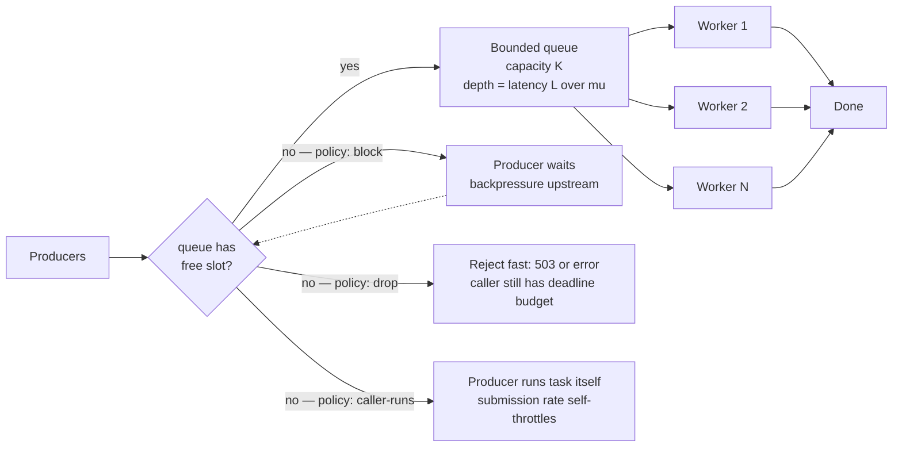
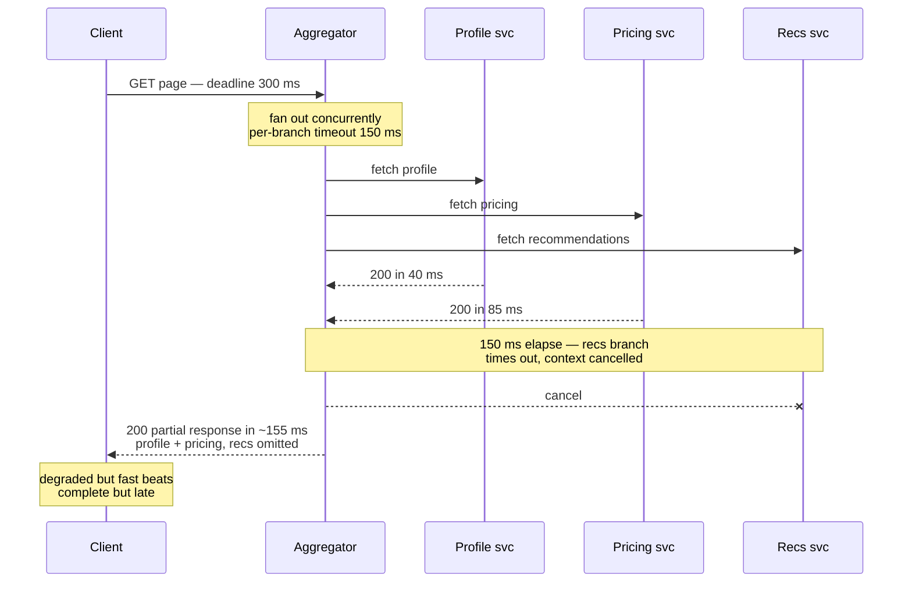
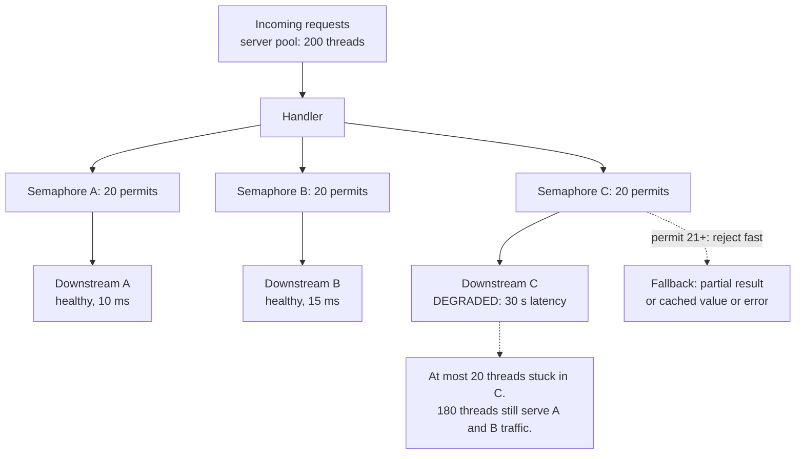
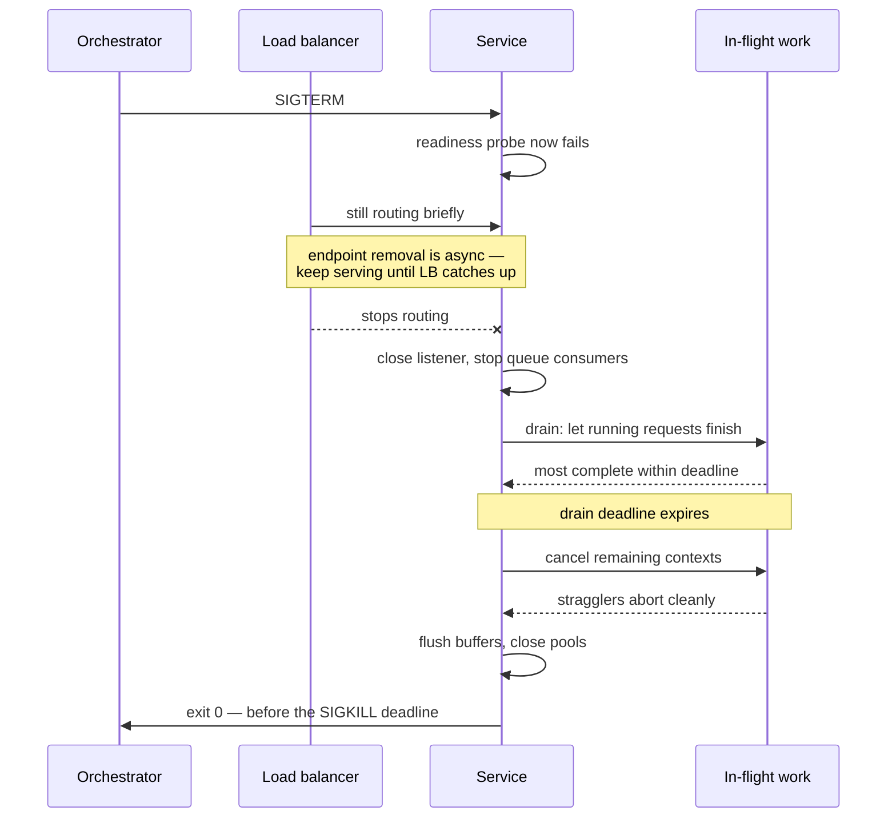

# Chapter 9 — Concurrency Patterns for Backend Services

**What this chapter covers.** Chapters 1 through 8 built the machinery: models and the scaling
laws that govern them, locks and their cost model, memory visibility, lock-free structures,
liveness failures, asynchronous I/O, actors and channels, and structured concurrency with
cancellation. This chapter is the synthesis — the dozen or so patterns that working backend
engineers actually deploy, each grounded in that machinery rather than presented as folklore. We
size worker pools quantitatively instead of by superstition, using Little's Law and the USL from
Chapter 1. We insist — with reasons — that every queue be bounded and every blocking call carry a
timeout. We work through producer–consumer, pipelines, fan-out/fan-in with partial results,
request coalescing, in-process rate limiting and load shedding, bulkheads, graceful shutdown,
background work, concurrency-safe caching, state confinement, and idempotency. We close with an
anti-patterns catalog — the recurring shapes of production incidents — and with the observation
that ties this volume to the rest of the suite: every pattern here has a fleet-scale twin, and
fleet pathologies are usually process pathologies amplified.

Learning goals — after this chapter you should be able to:

- Size a worker pool from measured arrival rate, service time, and wait/compute ratio, and explain
  why the bounded queue in front of it is where latency hides.
- Choose a rejection policy — block, drop, or caller-runs — and state the backpressure property of
  each.
- Build producer–consumer stages and pipelines, and predict pipeline throughput from the slowest
  stage.
- Implement fan-out/fan-in with concurrency limits, per-call timeouts, and partial results, and say
  when hedged requests are worth their cost.
- Deduplicate concurrent identical work with singleflight and defend a cache against stampedes.
- Apply token-bucket rate limiting and front-door load shedding, and explain why rejecting cheap
  beats failing expensive.
- Isolate dependencies with bulkheads so one slow downstream cannot consume every thread.
- Implement graceful shutdown in the correct order: stop accepting, drain with a deadline, cancel
  stragglers, flush, exit.
- Recognize the anti-patterns — unbounded anything, retries without jitter, blocking in async
  context, sleep-based coordination — before they page you.

## Worker pools, done quantitatively

The worker pool is the oldest pattern in this chapter and the one most often deployed with the
least thought. A pool has three parameters — worker count, queue capacity, and rejection policy —
and all three have quantitative answers.

### Sizing the workers

Start with the workload class, because the two classes have different answers.

**CPU-bound work** wants roughly one worker per core. More workers than cores adds context-switch
and cache-pollution overhead (Volume 2, Chapters 1 and 2) without adding compute; by the USL
(Chapter 1), the coherency term β guarantees that throughput eventually *falls* as you add
threads. `N = cores` or `cores + 1` is the standard answer, the `+1` covering the occasional page
fault or minor stall. In a container, "cores" means the effective CPU quota, not the host's core
count — a pool sized to 64 hardware threads inside a 2-CPU cgroup is a throttling machine (Volume
2, Chapter 2).

**I/O-bound work** spends most of its wall-clock time waiting, so each core can serve many
workers. The classic starting heuristic, from Goetz's *Java Concurrency in Practice*, is:

```
N_threads ≈ N_cores × target_utilization × (1 + wait_time / compute_time)
```

A handler that computes for 2 ms and waits 48 ms on downstream calls has a wait/compute ratio of
24, so 8 cores at full utilization support on the order of 8 × 25 = 200 threads. This is a
starting point, not an answer — it assumes the waiting consumes no CPU and that nothing else
bounds you (memory per thread, downstream connection limits, the USL peak).

Then refine with **Little's Law** (Chapter 1): `L = λW`. If the service must sustain λ = 2,000
requests/s at W = 50 ms mean residence time, there will be L = 100 requests in flight at
steady state, and the pool must hold at least that many workers or the excess waits in the queue —
which lengthens W, which by the same law grows L further. Little's Law tells you the concurrency
the load *demands*; the USL tells you the concurrency the system can *profitably supply*. If the
demanded number exceeds the USL peak measured for your workload, no pool size fixes it — you need
to reduce the serial fraction, shed load, or scale out.

Two structural rules complete the picture. First, **separate pools per workload class**. Mixing
2 ms CPU-bound jobs and 5 s report generations in one pool means the reports occupy workers for
seconds at a time and the cheap jobs queue behind them — a head-of-line blocking problem you
created yourself. Give each class its own pool sized for its own wait/compute profile. This is the
bulkhead pattern, developed fully below, applied to workload classes rather than dependencies.
Second, **never detach the pool from observability**: export queue depth, active workers, task
latency, and rejection count. Queue depth is the single most predictive signal of impending
latency trouble, for the reason the next section makes precise.

### The queue must be bounded

An unbounded queue in front of a pool is one of the most reliably harmful defaults in backend
engineering, and it *is* a default: Java's `Executors.newFixedThreadPool` uses an unbounded
`LinkedBlockingQueue`, and an unbuffered-channel-fed goroutine spawner has the same effect if you
spawn per item.

A bounded queue converts this silent failure into an explicit, immediate decision: the queue is
full, an arrival cannot be accepted — now what? That decision is the **rejection policy**, and
there are three honest answers:

Java's `ThreadPoolExecutor` ships all of these (`AbortPolicy`, `DiscardPolicy`,
`DiscardOldestPolicy`, `CallerRunsPolicy`); in Go you build them from channel operations — a
blocking send blocks, a `select` with `default` drops, and caller-runs is a `select` whose default
branch invokes the function inline.



How big should the bound be? Small enough that the latency it implies is one you are willing to
serve: a queue of K items in front of a pool draining μ items/s adds up to K/μ of waiting.
If your latency budget for queueing is 100 ms and the pool drains 1,000 items/s, the queue bound
is about 100 — not 10,000. Sizing the queue from the latency budget rather than from a vague
desire for slack is the discipline that makes the rest of this chapter's timeout arithmetic work.

### A bounded pool with graceful shutdown, in Go

The following is a complete, honest worker pool: bounded queue, explicit rejection, context
cancellation, and a drain-then-exit shutdown (the shutdown ordering is treated in its own section
below).

```go
package pool

import (
	"context"
	"errors"
	"sync"
)

var ErrQueueFull = errors.New("pool: queue full")
var ErrShutdown = errors.New("pool: shutting down")

type Task func(ctx context.Context)

type Pool struct {
	queue  chan Task
	ctx    context.Context // cancelled to abort stragglers
	cancel context.CancelFunc
	wg     sync.WaitGroup

	mu     sync.Mutex
	closed bool
}

func New(workers, queueCap int) *Pool {
	ctx, cancel := context.WithCancel(context.Background())
	p := &Pool{
		queue:  make(chan Task, queueCap),
		ctx:    ctx,
		cancel: cancel,
	}
	p.wg.Add(workers)
	for i := 0; i < workers; i++ {
		go func() {
			defer p.wg.Done()
			for task := range p.queue { // exits when queue is closed and drained
				task(p.ctx) // task must honor ctx cancellation
			}
		}()
	}
	return p
}

// Submit rejects immediately when the queue is full: load shedding
// at the pool boundary, while the caller's deadline still has budget.
func (p *Pool) Submit(t Task) error {
	p.mu.Lock()
	defer p.mu.Unlock()
	if p.closed {
		return ErrShutdown
	}
	select {
	case p.queue <- t:
		return nil
	default:
		return ErrQueueFull
	}
}

// Shutdown stops intake, drains queued and in-flight work until
// gracePeriod expires, then cancels the context to abort stragglers.
func (p *Pool) Shutdown(grace context.Context) {
	p.mu.Lock()
	if !p.closed {
		p.closed = true
		close(p.queue) // no more intake; workers drain what remains
	}
	p.mu.Unlock()

	done := make(chan struct{})
	go func() { p.wg.Wait(); close(done) }()

	select {
	case <-done: // drained cleanly
	case <-grace.Done(): // out of patience: cancel in-flight tasks
		p.cancel()
		<-done // workers observe cancellation and exit
	}
}
```

The Java equivalent is `ExecutorService` with an explicit
`new ThreadPoolExecutor(n, n, 0, MILLISECONDS, new ArrayBlockingQueue<>(cap), policy)`, and
shutdown via `shutdown()` → `awaitTermination(grace)` → `shutdownNow()` — the same three beats:
stop intake, drain with a deadline, cancel stragglers.

## Producer–consumer: the fundamental pattern

Strip any concurrency architecture to its skeleton and you find producer–consumer with a bounded
buffer: some threads generate work, some threads consume it, and a bounded queue between them
decouples their rates while limiting how far they may diverge. The worker pool is
producer–consumer where consumers are homogeneous. The pipeline is producer–consumer chained. The
event loop's ready queue, the actor's mailbox (Chapter 7), the socket's kernel buffer — all
instances.

The classical implementation is the **blocking bounded queue**, and it is exactly the
condition-variable monitor of Chapter 2: a mutex protecting the buffer, one condvar for "not
empty" (consumers wait on it), one for "not full" (producers wait on it), and the mandatory
`while` loop around each wait. `put` appends and signals not-empty; `take` removes and signals
not-full. Every mainstream runtime ships this — `ArrayBlockingQueue`, Go's buffered channel
(implemented with a lock and wait queues in the runtime, not with a condvar API, but the same
monitor logically), Python's `queue.Queue`. When a colleague asks why the condvar chapter matters
when nobody writes condvars anymore, the answer is: every buffered channel and blocking queue
*is* one, and its behavior under contention — who wakes, in what order, at what cost — is
Chapter 2's behavior.

One design rule carries over from the pool discussion: **the buffer's bound is a latency policy,
not a tuning knob.** Deep buffers absorb bursts but hide sustained rate mismatch; by Little's Law
the hiding shows up as residence time. Prefer a small bound plus an explicit policy at the full
edge — block, drop, or shed — over a deep bound and hope.

## Pipelines: chained stages, slowest stage wins

When work naturally decomposes into stages — parse, validate, enrich, persist — you can run each
stage as its own pool of workers connected by bounded queues. This is **pipeline parallelism**,
and it is the CSP style of Chapter 7 made concrete: stages share nothing and communicate only
through channels, so each stage reasons about its own state single-threadedly.

Two laws govern pipelines. First, **throughput is the throughput of the slowest stage.** A
five-stage pipeline whose stages process 10k, 8k, 2k, 9k, 12k items/s runs at 2k items/s, and the
bounded queues upstream of the slow stage fill while those downstream run empty. This makes
bottleneck diagnosis wonderfully mechanical: look at the queue depths; the full queue points at
the bottleneck stage. (This is the Theory-of-Constraints view, and it is also exactly how you read
a distributed pipeline's consumer lag — Volume 10.) The fix is to parallelize the slow stage —
give it more workers — not to enlarge its input queue, which changes nothing except latency.

Second, **latency is the sum of stage residence times**, so pipelining helps throughput but never
helps, and usually hurts, single-item latency: each queue hop adds handoff cost. Pipelines earn
their keep when stages have genuinely different resource profiles (a CPU-heavy stage and an
I/O-heavy stage overlap beautifully) or different scaling needs; a pipeline of stages with
identical profiles is usually better collapsed into one pool of workers that each do the whole
job, avoiding the handoff cost entirely.

Cancellation must propagate both directions: downstream (a cancelled request's items should be
dropped, not processed), and upstream (when a consumer stops consuming, producers must learn or
they block forever on full queues — in Go the idiom is closing a `done` channel that every stage
selects on; Chapter 8's structured concurrency gives the general discipline). The Go blog's
"Pipelines and cancellation" post remains the best short treatment of the mechanics.

## Fan-out/fan-in: scatter-gather with limits and timeouts

A request needs data from several sources — profile service, pricing service, recommendations. Do
the calls concurrently (fan-out), collect the responses (fan-in), assemble. Total latency drops
from the sum of the call latencies toward the max. Three disciplines separate the production
version from the tutorial version.

**Bound the fan-out.** Fanning out to N sub-calls per request multiplies your in-flight
concurrency by N; under load this multiplies connection counts, memory, and pressure on each
downstream. Use a semaphore (Chapter 2) or a bounded worker pool to cap concurrent sub-calls —
per request if N is large (fetch 500 objects, but at most 16 at a time), and globally per
downstream (the bulkhead, below).

**Hedged requests**, from the same paper, address the tail more aggressively: send the request to
one replica; if no reply arrives within a threshold (say, the observed 95th-percentile latency),
send a second copy to a different replica and take whichever answers first. Because only the
slowest ~5% of calls hedge, the added load is a few percent, but the tail collapses — the paper
reports a Google benchmark reading 1,000 keys across 100 servers in which hedging after a 10 ms
delay cut 99.9th-percentile latency from 1,800 ms to 74 ms while adding roughly 2% more requests.
Hedge only idempotent operations (a hedged non-idempotent write is a duplicate write — see the
idempotency section), and cancel the loser once a winner returns, or you pay the duplicate work
anyway.



In Go the shape is `errgroup.WithContext` plus `golang.org/x/sync/semaphore` (or
`errgroup.SetLimit`) for the concurrency cap; in Java, `CompletableFuture.allOf` with per-future
`orTimeout`, or structured concurrency's scopes in recent JDKs (Chapter 8).

## Request coalescing: singleflight

A cache entry for a hot key expires. Five hundred concurrent requests miss simultaneously, and all
five hundred independently issue the same expensive database query. The database, sized for a
cache in front of it, buckles; queries slow; more requests pile up behind the missing key. This is
the **cache stampede** (also "dog-pile"), and it is a concurrency bug, not a capacity bug: the
system performed five hundred units of work when one was needed.

The fix is **request coalescing**: when a request for key K is already in flight, subsequent
requests for K wait for that flight's result instead of launching their own. Go's
`golang.org/x/sync/singleflight` is the canonical implementation — a map from key to in-flight
call, a mutex, and a `WaitGroup` per call that latecomers wait on:

```go
import "golang.org/x/sync/singleflight"

var group singleflight.Group

func (s *Store) GetUser(ctx context.Context, id string) (*User, error) {
	if u, ok := s.cache.Get(id); ok {
		return u.(*User), nil
	}
	// All concurrent callers with the same key share ONE fetch;
	// the others block until it completes and receive the same result.
	v, err, shared := group.Do("user:"+id, func() (any, error) {
		u, err := s.db.FetchUser(ctx, id)
		if err != nil {
			return nil, err
		}
		s.cache.Set(id, u, s.ttlWithJitter())
		return u, nil
	})
	if err != nil {
		return nil, err
	}
	_ = shared // true when this caller received another flight's result
	return v.(*User), nil
}
```

Java has no standard-library equivalent, but Caffeine's `LoadingCache` provides the same guarantee
per key — concurrent `get`s for a missing key block on a single load — and a
`ConcurrentHashMap<K, CompletableFuture<V>>` with `computeIfAbsent` builds it in a dozen lines.

Two sharp edges. First, **error propagation is amplified**: one failed flight delivers its error
to every coalesced waiter, so a single transient failure becomes five hundred failures. Decide
deliberately whether waiters should retry (singleflight's `Forget` drops the key so the next
caller starts fresh). Second, **a slow flight holds everyone**: coalesced callers inherit the
flight's latency, so the underlying call still needs its own timeout. Note also that the
in-flight call typically should *not* be cancelled just because one waiter's context is — others
still want the result; detach the fetch's context deliberately.

Coalescing composes with two other stampede defenses covered in the caching section below — TTL
jitter and early refresh — and its distributed twin is the cache lock/lease (Volume 6, Chapter 8;
Volume 7, Chapter 3 treats caching strategy end to end).

## Rate limiting and admission control in-process

A service that accepts every request accepts its own death. Two mechanisms guard the front door:
rate limiting (bound the *rate* of admitted work) and load shedding (refuse work when the system
is unhealthy regardless of rate). They are different tools; you usually want both.

### Token bucket and leaky bucket

The **token bucket** is the workhorse. A bucket holds up to B tokens; tokens drip in at rate r per
second; each admitted request removes one (or `cost` many); a request arriving to an empty bucket
is rejected or delayed. The two parameters map directly onto policy: r is the sustained rate, B is
the burst allowance. Implementation is a few lines, because you do not need a background filler
goroutine — refill lazily from the elapsed time on each call:

```go
type TokenBucket struct {
	mu     sync.Mutex
	rate   float64 // tokens per second
	burst  float64 // bucket capacity B
	tokens float64
	last   time.Time
}

func NewTokenBucket(rate, burst float64) *TokenBucket {
	return &TokenBucket{rate: rate, burst: burst, tokens: burst, last: time.Now()}
}

func (b *TokenBucket) Allow() bool {
	b.mu.Lock()
	defer b.mu.Unlock()
	now := time.Now()
	b.tokens = math.Min(b.burst, b.tokens+now.Sub(b.last).Seconds()*b.rate)
	b.last = now
	if b.tokens >= 1 {
		b.tokens--
		return true
	}
	return false
}
```

Production code should use the library form — Go's `golang.org/x/time/rate.Limiter`, Guava's
`RateLimiter`, resilience4j's `RateLimiter` — which add waiting-with-deadline (`Wait(ctx)`),
reservation, and multi-token costs, but the mechanics are exactly the sketch above.

The **leaky bucket** is the token bucket's dual: requests enter a bounded queue that drains at a
fixed rate, so the *output* is perfectly smooth regardless of input burstiness. Use it when the
protected resource genuinely cannot absorb bursts (a downstream with strict pacing requirements);
prefer the token bucket when short bursts are fine and you only care about the sustained rate,
which is the common case. Volume 7, Chapter 9 covers rate-limiter placement at the API gateway and
Volume 14, Chapter 8 the algorithm family (fixed and sliding windows, GCRA) in depth; the
in-process forms here are the same algorithms an inch from the code they protect.

### Load shedding: reject cheap, early

Rate limiting enforces a policy; **load shedding** defends survival. When the system is beyond its
capacity — queue depths climbing, latency past SLO, memory pressure — the correct move is to
reject some work *immediately at the front door*, before spending anything on it. Two principles
govern the design:

**Shed early.** The worst place to fail a request is at the end: after it has consumed queue
slots, worker time, and downstream calls, failing it wastes everything already spent — the
negative work of the unbounded-queue discussion. A rejection at admission costs microseconds and
returns a clear signal (HTTP 429/503, with `Retry-After` when you can estimate it) while the
client's own deadline still has budget to back off or fail over. **Prefer rejecting cheap over
failing expensive** — a shed request costs almost nothing; a timed-out request costs everything it
consumed plus a retry.

## Bulkheads: isolating the blast radius

The term is naval: a ship's hull is partitioned so one flooded compartment does not sink the
vessel. The software version: **partition your concurrency so one misbehaving dependency cannot
consume it all.**

The failure it prevents is depressingly standard. A service calls three downstreams from one
shared pool of 200 threads. Downstream C develops a 30-second latency (it is not down — down would
be cheap; it is *slow*, the expensive kind of failure). Every thread that touches C now blocks for
30 s. At a modest rate of requests touching C, the shared pool drains in seconds — and now
requests needing only the healthy A and B find no threads. One slow dependency has taken the whole
service, which is how latency cascades between tiers (Volume 7, Chapter 11).

The bulkhead gives each dependency its own bounded concurrency: a dedicated pool per downstream,
or — cheaper — a semaphore (Chapter 2) of N permits guarding calls to it. When C slows, at most N
threads are stuck in C; the (N+1)th call fails fast with "bulkhead full," which is precisely the
load-shedding signal, scoped to one dependency. The service degrades — C's data is missing, a
partial result — instead of dying. Sizing is Little's Law yet again: expected calls/s to C times
its timeout bounds worst-case in-flight; permits somewhat above the *healthy* steady state
(λ × normal latency) with headroom, but far below "all the threads," give the isolation without
throttling normal operation.



Choose pools over semaphores when the calls must also be *timed out from outside* (a thread pool
lets you abandon a stuck call via future timeout; a semaphore-guarded synchronous call is only as
bounded as its own timeout — which the next section insists exists anyway) or when the dependency
work deserves different sizing and queuing. Semaphores are lighter — no extra threads, no handoff —
and are the right default in async runtimes where "threads" are not the resource being protected,
in-flight count is.

The **circuit breaker** is the bulkhead's temporal partner: where the bulkhead limits how much
concurrency a bad dependency can consume, the breaker notices the dependency is failing (error
rate or latency over a window), *opens*, and fails calls immediately without attempting them —
then periodically lets a probe through (half-open) and closes again on success. Its contributions
are recovery time for the downstream (no longer hammered by doomed calls) and fast failure for
callers. Netflix's Hystrix codified bulkhead-plus-breaker for a generation (now in maintenance,
its documentation remains an excellent design rationale); resilience4j is the maintained
successor on the JVM. The breaker's state machine, tuning, and its subtleties — per-endpoint vs
per-host granularity, thundering probes on half-open — are Volume 11, Chapter 10's subject; here
it suffices that breaker and bulkhead compose: the bulkhead caps the damage while the breaker is
still deciding.

## Timeouts everywhere

Every blocking operation in a backend service must be bounded in time. Not most — every. An
unbounded blocking call is a latent permanent thread leak: the code that "cannot hang" will hang
the week the switch firmware drops your TCP session without an RST, and each hung call permanently
subtracts one worker (a bulkhead delays the bleed-out; only a timeout stops it). This means
connect timeouts *and* read/write timeouts on every socket; query timeouts on every database call;
acquisition timeouts on every pool and semaphore; `Wait(ctx)` rather than `Wait()` on every
limiter. Java's historical default of infinite socket timeouts has caused more stuck fleets than
any exotic failure mode; Go's `context` makes deadlines pervasive but only if you actually pass
the context down and honor it.

Two structural refinements turn scattered timeouts into a system.

**Deadline propagation.** A request should carry one *deadline* — an absolute point in time by
which the response is useful — rather than each layer inventing independent timeouts. Each
downstream call gets the *remaining* budget: entered with 300 ms, spent 120 ms, the next call gets
at most 180 ms. Go's `context.WithDeadline`/`WithTimeout` flows this automatically through call
chains, and gRPC propagates it on the wire (`grpc-timeout` header); Chapter 8 covered the
mechanics and the cancellation tree that makes a missed deadline actually *stop* the work rather
than merely stop waiting for it. The alternative — fixed per-layer timeouts that ignore time
already spent — produces the classic pathology of a layer faithfully working on a request whose
caller gave up 200 ms ago.

**Timeout hierarchies.** Budgets must nest: the client's timeout should exceed the gateway's,
which should exceed the service's, which should exceed the sum of its sequential downstream
budgets — with margin at each level for the response to travel back. Invert the hierarchy and you
get systematic orphaned work: if the service allows itself 5 s but its caller gives up at 2 s,
every slow request is completed for nobody, and — worse — the caller's retry arrives while the
original is still running, doubling load exactly when the system is slow (see retry storms,
below). Write the budget tree down; it is a contract between teams, not an implementation detail.

Choose timeout values from measured latency distributions (e.g., a healthy p99 plus margin), not
round numbers — a timeout at the p50 sheds half your good traffic; a 30 s timeout on a 50 ms call
is not a bound, it is a rumor. And treat a timeout as an *ambiguous* outcome: the work may have
happened. That single fact is why idempotency, treated below, is not optional.

## Graceful shutdown as a first-class pattern

Every process dies. Deploys, autoscaling, node drains, and spot reclamation mean a healthy fleet
kills processes *constantly* — a service that drops in-flight work on exit turns every deploy into
an incident. Graceful shutdown is not cleanup code; it is a pattern with a strict ordering, and
the ordering is the point.



The `Pool.Shutdown` in the worker-pool code above is beats 2–4 in miniature: close intake, drain
with deadline, cancel. Note the interlock with retries and idempotency: even a perfect drain
cancels *some* work sometimes, so clients must retry, so retried work must be safe to repeat.
Graceful shutdown, retries, and idempotency are one mechanism seen from three sides.

## Background work patterns

Not all concurrency serves a request. Cache refreshers, metric flushers, cleanup sweeps, and
deferred processing have their own pattern vocabulary.

**Periodic tasks, with jitter.** The naive periodic task — `every 60s: refresh` — has a fleet
bug: all N instances deployed at the same moment tick at the same moment, and the shared
dependency they refresh from receives N simultaneous requests every minute — a self-inflicted
**thundering herd**, invisible at N=1 and proportional to fleet size. The fix costs one line:
randomize each instance's phase (initial delay uniform in [0, period)) and, better, jitter each
interval (e.g., uniform in [0.5, 1.5] × period), so the fleet's ticks decorrelate and stay
decorrelated even after synchronized restarts. The same jitter principle reappears in retry
backoff below, and for the same reason: synchronized fleets are load spikes.

**Async handoff to durable queues.** An in-memory queue dies with the process; "graceful"
shutdown narrows the window but cannot close it (kernel panics do not drain). Work that must
survive — the order confirmation email, the billing event — must be handed off to storage that
outlives the process *before* you acknowledge the request: a message broker or a database table
consumed by workers. The in-process pattern reaches its honest limit here, and the baton passes to
Volume 10 — including the outbox pattern (Volume 10, Chapter 6), which makes the
"write the business row and enqueue the work" step atomic instead of a two-writes race.

## Concurrency-safe caching in-process

An in-process cache is a shared mutable map read by every request thread — a concentrated dose of
everything Chapters 2–4 warned about, so the pattern deserves its own treatment.

## State machines under concurrency: confine or lock

Much backend state is a state machine — an order moving through `created → paid → shipped`, a
connection through a protocol handshake, a saga through its steps. Concurrent access to a state
machine is where lock-based code gets genuinely hard, because the invariants span *transitions*,
not just fields: check-then-act sequences must be atomic, callbacks fire mid-transition, and the
lock must cover exactly the right extent (Chapter 2's "never call unknown code under a lock"
bites hardest here).

The alternative is Chapter 7's move: **confine the state to one goroutine/actor and serialize
commands to it.** The state machine's data is owned by a single goroutine; everyone else sends
commands over a channel (with replies over per-command response channels); the owner processes
commands one at a time. There is no lock because there is no sharing — transitions are atomic by
construction, the owner can safely fire callbacks and do I/O mid-command without holding anything,
and the command channel gives ordering, a natural audit log, and a bounded mailbox for
backpressure. This is the actor pattern stripped to one actor.

## Idempotency as a concurrency property

Timeouts are ambiguous (the work may have happened), shutdowns cancel mid-flight (the client will
retry), hedges duplicate requests, and at-least-once queues redeliver. Every pattern in this
chapter therefore manufactures the same phenomenon: **the same logical operation arriving more
than once, possibly concurrently.** A system built from these patterns must make re-execution
safe — idempotency is not a distributed-systems nicety bolted on later; it is a local consequence
of retries plus ambiguity.

## Anti-patterns: a field catalog

Each of these recurs in postmortems because each works fine in testing and fails under production
load — usually by violating a bound this chapter insisted on.

- **Unbounded anything.** Unbounded queues (deferred OOM plus hidden latency, as above), unbounded
  goroutine/thread spawn (accept loop spawns per connection with no cap; a slow downstream makes
  each one long-lived; memory and scheduler collapse), unbounded retries, unbounded fan-out,
  unbounded caches without eviction. The audit question for any code review: *what bounds this?*
  If the answer is "traffic is never that high," the bound is your users' patience.
- **Per-request thread spawn.** The pre-pool design: create a thread per request, destroy it
  after. Thread creation costs a syscall and stacks cost memory (Volume 2); under a spike you
  create thousands of threads precisely when you can least afford to, and the scheduler thrashes.
  Pools exist to amortize creation and — more importantly — to *bound* concurrency. (Goroutines
  and virtual threads make creation cheap but do not repeal the bound: a million goroutines
  blocked on one slow downstream still hold a million requests' memory and a million downstream
  intents. Cheap threads change the constant, not the pattern.)
- **Retry without jitter or budget.** A dependency blips for 2 s; every caller times out and
  retries in lockstep; the dependency recovers into a synchronized wave of double load and goes
  down again — the **retry storm**, a self-sustaining oscillation that is the systems-scale
  cousin of Chapter 5's livelock: everyone is busy, nobody progresses. The fixes are mechanical:
  exponential backoff *with jitter* (decorrelate the fleet — the same fix as periodic-task
  jitter), a retry *budget* (e.g., retries may add at most 10% extra load, enforced with a token
  bucket over retries), retry only retryable errors, and never retry on top of a layer that also
  retries — multiplied across three layers, three retries each become 27 attempts. And respect
  the timeout hierarchy: a retry issued after the caller's own deadline has expired is pure waste.
- **Blocking in async context.** A synchronous database driver call, an uninstrumented DNS
  lookup, or a `synchronized` block on an event-loop thread stalls every connection multiplexed
  onto that thread — the cardinal sin of Chapter 6. Symptom: p99 latency spikes across *all*
  endpoints when one endpoint's dependency slows. Fix: bounded worker pool for the blocking work
  (with all of this chapter's rules), or an actually-async driver.
- **Shared mutable singletons.** The lazily-initialized global — a config object, a client, a
  `SimpleDateFormat` (famously not thread-safe), a shared `Random` — reached from every request
  thread. Unsafe publication (Chapter 3), check-then-act races on initialization, and hidden
  contention on what looks like a stateless helper. Fix: immutable after construction, eager or
  `once`-guarded init (`sync.Once`, class-init idiom), or per-thread/request instances.
- **Sleep-based coordination.** `sleep(100ms)` after starting a dependency "so it's ready";
  polling a flag with sleeps instead of a condvar/channel; a test that sleeps and asserts. Every
  such sleep encodes a timing assumption that load, CI, or a slow VM will falsify — the flaky
  test is the honest version of the pattern telling you it is broken (Chapter 10). Fix: wait on
  the actual condition — readiness check, channel receive, `CountDownLatch` — with a deadline.
- **Ignoring cancellation.** Accepting a `context.Context` and never checking it; catching
  `InterruptedException`, swallowing it, and looping. The deadline-propagation machinery is
  end-to-end: one layer that ignores cancellation converts every timeout above it into orphaned
  running work below it, and makes graceful shutdown's "cancel stragglers" step a no-op. Check
  cancellation at loop boundaries and before expensive steps; pass the context all the way down.

## The distributed-systems lens

The claim made at the start — that these are load-bearing patterns — has a second half: **every
pattern in this chapter has a fleet-scale twin**, because the constraints that produced it
(bounded resources, rate mismatch, partial failure, tail latency) do not care about process
boundaries.

| In-process pattern | Fleet-scale twin | Where |
|---|---|---|
| Worker pool with bounded queue | Autoscaled consumer group on a partitioned topic | Volume 10 |
| Bounded queue + rejection policy | Broker with retention limits and producer backpressure | Volume 10 |
| Pipeline stages with queues | Stream-processing topology; stage lag = full queue | Volume 10 |
| Singleflight | Distributed lock/lease or cache lock on the shared cache | Volume 6 Ch. 8; Volume 7 Ch. 3 |
| Token bucket / load shedding | API-gateway rate limiting and admission control | Volume 7 Ch. 9 |
| Bulkhead + circuit breaker | Per-dependency quotas; mesh outlier ejection | Volume 11 Ch. 10 |
| Deadline propagation | Request deadlines on the wire, e.g. gRPC | Volume 8 |
| Graceful shutdown | Rolling deploys and connection draining | Volume 12 |
| Idempotency keys | Exactly-once-effect processing over at-least-once delivery | Volume 6 Ch. 9 |

The correspondences are not analogies; they are the same mathematics re-hosted. Little's Law does
not know whether the queue is an `ArrayBlockingQueue` or a Kafka partition — consumer lag *is*
queue depth, and lag × drain rate *is* the latency hiding in it. A retry storm between services
is the in-process retry storm with network hops added. A fleet's synchronized cron jobs are the
unjittered ticker at N instances. A stampede onto Redis is a stampede onto a `HashMap`, at scale.

Which yields the meta-point, and it is the reason this chapter sits in the concurrency volume
rather than the system-design one: **get the single-process version right first, because fleet
pathologies are usually process pathologies amplified.** A service that ships unbounded queues,
unjittered retries, and missing deadlines does not become a well-behaved distributed system when
you run 50 replicas of it — it becomes 50 correlated copies of the same failure, synchronized by
the shared dependencies between them. The distributed patterns of Volumes 6–12 assume disciplined
processes underneath; this chapter is that discipline.

## Key takeaways

- **Size pools from measurement, not vibes.** CPU-bound: ≈ cores (the container quota, not the
  host). I/O-bound: cores × (1 + wait/compute) as a start, then Little's Law (L = λW) for demanded
  concurrency and the USL for supplied. Separate pools per workload class.
- **Bound every queue.** An unbounded queue is deferred OOM plus hidden latency — the queue is
  where latency hides (W = L/μ). Size the bound from the latency budget, and choose the rejection
  policy deliberately: block (backpressure), drop (shed early), or caller-runs (self-throttling).
- **Producer–consumer with a bounded buffer is the fundamental pattern** — the blocking queue is
  Chapter 2's monitor; the ring buffer is Chapter 4's escalation. Pipelines chain it, and pipeline
  throughput is the slowest stage — read the full queue to find the bottleneck.
- **Fan-out amplifies the tail.** Cap the fan-out, put a timeout on every branch, design partial
  results with product intent, and hedge only idempotent calls (The Tail at Scale).
- **Coalesce duplicate work.** Singleflight turns N concurrent identical misses into one call;
  with TTL jitter and early refresh it makes cache stampedes a solved problem.
- **Guard the front door.** Token buckets bound admitted rate; load shedding rejects cheap and
  early — before the request consumes anything — instead of failing expensive at the end.
- **Bulkhead every dependency.** A semaphore or pool per downstream caps how many threads a slow
  dependency can take; circuit breakers add fast failure and recovery time (Volume 11, Chapter 10).
- **Every blocking call carries a timeout**, deadlines propagate with remaining budget, and
  budgets nest: client > gateway > service > downstream. A timeout is an ambiguous outcome —
  which is why idempotency is mandatory, not optional.
- **Shutdown is ordered:** fail readiness, keep serving until the LB notices, stop intake, drain
  with a deadline, cancel stragglers, flush, exit 0 — inside the orchestrator's grace period.
- **Jitter everything periodic** — tickers, TTLs, retry backoff — because synchronized fleets are
  load spikes. Batch on size *or* time, never just one.
- **Confine state machines to an owner; lock plain data.** Commands over a bounded channel buy
  atomic transitions and ordering; locks buy latency. Know which you are buying.
- **The anti-patterns are bound violations:** unbounded anything, retry without jitter/budget,
  blocking the event loop, shared mutable singletons, per-request spawn, sleep-based
  coordination, ignored cancellation. Ask of every mechanism: *what bounds this?*
- **Fleet pathologies are process pathologies amplified.** Every pattern here has a distributed
  twin governed by the same math; get the process right first.

## Further reading

- Dean, J. and Barroso, L. A., "The Tail at Scale," *Communications of the ACM* 56(2), 2013 —
  tail-latency amplification under fan-out, hedged and tied requests.
  <https://cacm.acm.org/research/the-tail-at-scale/>
- Goetz, B. et al., *Java Concurrency in Practice* (Addison-Wesley, 2006) — Chapter 6 (task
  execution), Chapter 8 (thread-pool sizing, the wait/compute formula, saturation policies).
- Little, J. D. C., "A Proof for the Queuing Formula L = λW," *Operations Research* 9(3), 1961 —
  the identity behind every sizing argument in this chapter (see Chapter 1 of this volume).
- Ajmani, S., "Go Concurrency Patterns: Pipelines and cancellation," The Go Blog, 2014.
  <https://go.dev/blog/pipelines>
- "Go Concurrency Patterns: Context," The Go Blog, 2014 — deadline propagation as an API
  discipline. <https://go.dev/blog/context>
- `golang.org/x/sync/singleflight` — package documentation; the canonical coalescing
  implementation. <https://pkg.go.dev/golang.org/x/sync/singleflight>
- `golang.org/x/time/rate` — the production token bucket for Go.
  <https://pkg.go.dev/golang.org/x/time/rate>
- Netflix Hystrix wiki, "How it Works" — bulkheads, circuit breaking, and fallbacks; in
  maintenance mode but the design rationale remains a reference.
  <https://github.com/Netflix/Hystrix/wiki/How-it-Works>
- resilience4j documentation — the maintained JVM implementations of bulkhead, rate limiter,
  circuit breaker, and time limiter. <https://resilience4j.readme.io/>
- Beyer, B. et al. (eds.), *Site Reliability Engineering* (O'Reilly, 2016) — Chapter 21 "Handling
  Overload" and Chapter 22 "Addressing Cascading Failures."
  <https://sre.google/sre-book/handling-overload/>
- Brooker, M., "Timeouts, retries, and backoff with jitter," *Amazon Builders' Library* — retry
  budgets and jitter, quantitatively.
  <https://aws.amazon.com/builders-library/timeouts-retries-and-backoff-with-jitter/>
- Thompson, M. et al., "Disruptor: High performance alternative to bounded queues" (LMAX
  technical paper, 2011) — the ring-buffer design referenced in the producer–consumer section.
- Chapter 1 of this volume — Little's Law and the USL; Chapter 2 — condition variables,
  semaphores, striping; Chapter 5 — livelock and starvation; Chapter 7 — actors and CSP;
  Chapter 8 — structured concurrency and cancellation; Chapter 10 — testing what this chapter
  builds.
