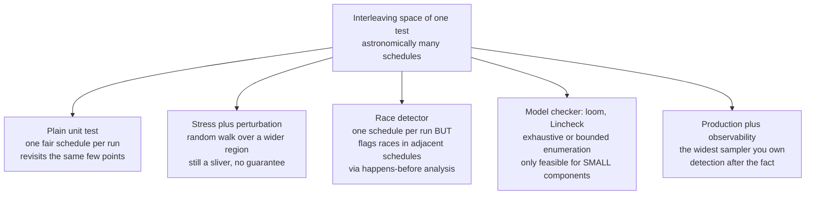
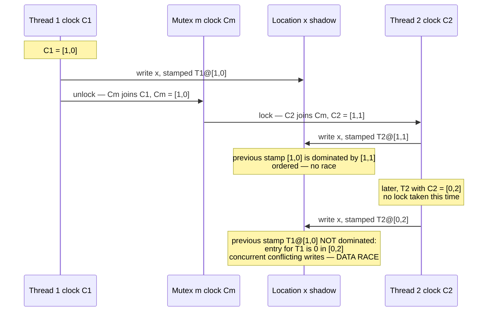
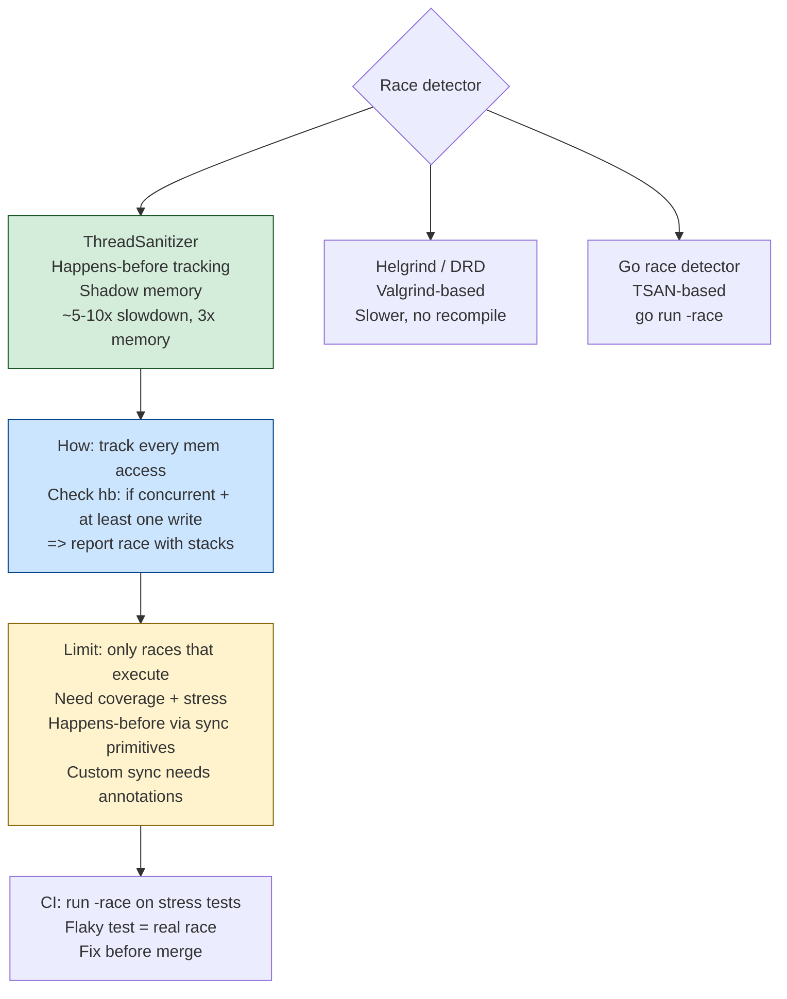
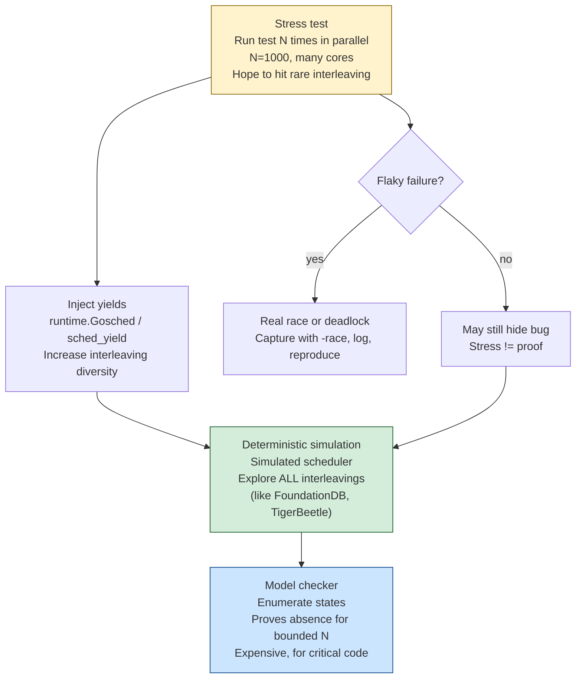
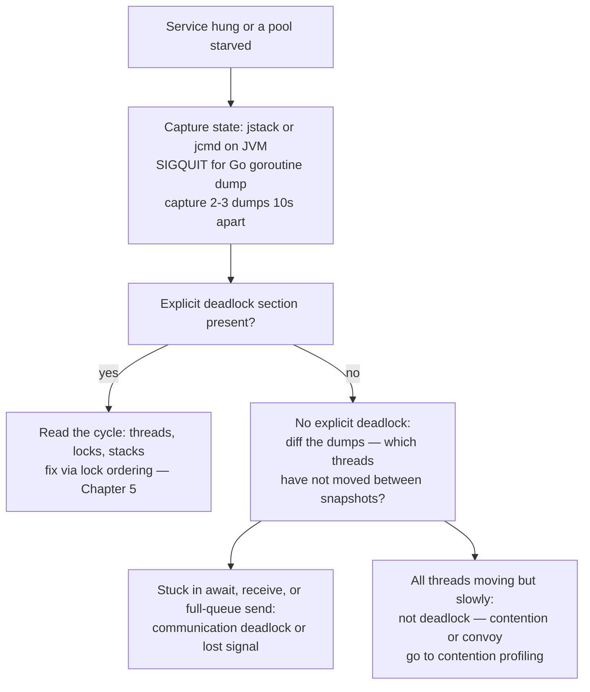
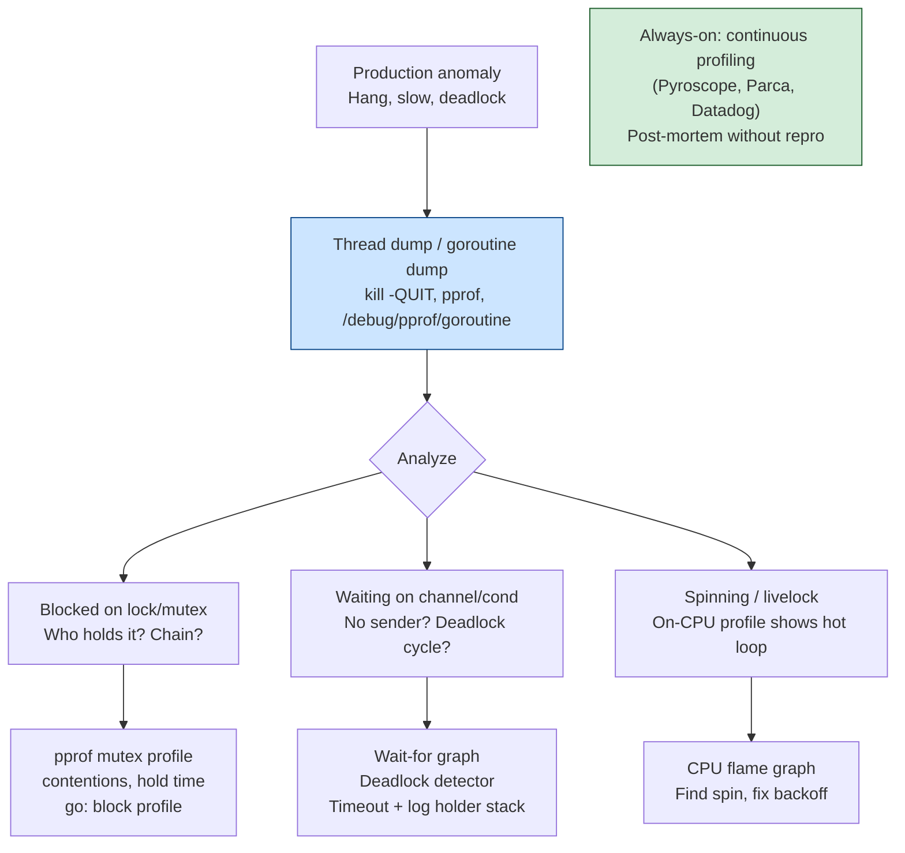
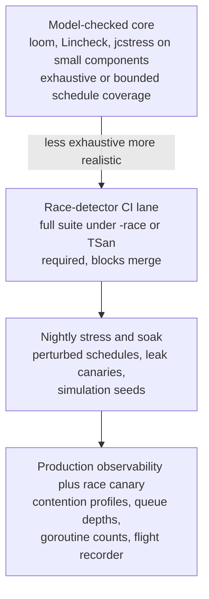

# Chapter 10 — Testing and Debugging Concurrent Systems

**What this chapter covers.** Every chapter in this volume has ended with some version of the same
warning: this class of bug will not be found by ordinary testing. This closing chapter is about what
*does* find them. The honest starting point is a negative result — the interleaving space of even a
small concurrent program is astronomically large, a conventional test suite explores a sliver of it,
and the sliver it explores is biased toward the boring schedules. Everything that works in this
domain works by attacking that fact directly: race detectors that extract evidence from a single
observed execution rather than waiting for a failing one, schedule-exploration tools that take
control of the scheduler and enumerate interleavings, stress harnesses that widen the sliver,
observability that lets production itself act as the test fleet, and — most important — designs that
shrink the space that needs exploring in the first place.

We build a taxonomy of concurrency defects, then treat dynamic race detection in depth: the
vector-clock machinery underneath ThreadSanitizer and the Go race detector, what these tools
guarantee, what they cost, and what they can never find. We then cover schedule exploration —
stress, perturbation, and true model checking with Lincheck, loom, and their ancestor CHESS —
and deterministic simulation in the FoundationDB style. The second half is diagnostic: deadlock and
leak detection, the observability a concurrent system must export before it misbehaves, and a
disciplined reproduction strategy for the bug that so far exists only in an incident report. The
distributed sibling of every technique here appears in Volume 6, Chapter 12 — Testing Distributed
Systems; this chapter stays on one machine.

Learning goals — after this chapter you should be able to:

- Explain why the interleaving space defeats naive testing, and classify a concurrency defect as a
  data race, atomicity violation, ordering bug, deadlock, leak, or performance pathology.
- Describe how happens-before race detection works — vector clocks, shadow memory, TSan's
  instrumentation — and state its guarantees and costs honestly.
- Run the Go race detector and TSan appropriately in CI and canaries, and read their reports.
- Use jcstress for memory-model conformance and Lincheck or loom for model-checked testing of small
  concurrent components, including linearizability checking against a sequential specification.
- Diagnose a deadlock from a thread dump and a leak from goroutine/thread counts, and use goleak
  and lockdep-style ordering checks preventively.
- Specify the observability a concurrent system needs in production, and execute a reproduction
  strategy for a suspected concurrency bug.
- Design components so that their concurrency is confined and exhaustively testable, and structure
  CI lanes to spend the sanitizer budget where it pays.

## Why ordinary testing does not work

Recall the diagnosis from Chapter 3. Concurrency bugs are **probabilistic and load-dependent**: the
bad interleaving needs two threads to arrive within a window that may be a few instructions wide,
so it essentially never fires at test-suite load and fires routinely at production load. They are
**erased by observation**: a log statement, a debugger, or a `-O0` build inserts enough work and
enough incidental barriers to close the window, which is why the term *heisenbug* was coined for
exactly this class. And they **present as impossible states** — a field that is assigned in every
constructor observed as null, a counter holding a value no code path produces — so the initial
investigation usually heads in the wrong direction entirely.

Add to that the arithmetic. For *n* threads each executing *k* atomic steps, the number of
interleavings is the multinomial coefficient (nk)!/(k!)ⁿ. Two threads of ten steps each already
give 184,756 interleavings; three threads of ten steps give on the order of 10¹²; realistic
components are beyond enumeration in any direct sense. A deterministic unit test explores exactly
one point in this space per run — and not a uniformly random point. Production OS schedulers are
boringly fair: they run each thread for a full quantum, so context switches land at quantum
boundaries, not inside your four-instruction race window. Running the test ten thousand times
mostly revisits the same few schedules.

The consequence is worth stating as a principle, because it shapes everything in this chapter:
**a passing concurrent test is weak evidence.** It certifies one schedule. The techniques below are
all ways of buying stronger evidence — either by extracting more information per execution (race
detection), by visiting more of the space per unit of effort (schedule exploration and model
checking), or by shrinking the space until visiting all of it is feasible (design for testability).



## A taxonomy of the prey

Different defects yield to different tools, so the first diagnostic step is knowing which species
you are hunting.

| Defect | Definition | Chapter | Best-fit tools |
|---|---|---|---|
| Data race | Two unordered accesses to one location, at least one a write | Ch. 3 | TSan, Go `-race` |
| Atomicity violation | Individually-synchronized steps composing a non-atomic whole (check-then-act, read-modify-write) | Ch. 1, 2 | Lincheck/loom, code review, stress |
| Ordering bug | Correct operations, missing happens-before edge between them (unsafe publication, missed signal) | Ch. 3 | TSan, jcstress, loom |
| Deadlock / livelock | Circular wait on locks or messages; or perpetual mutual retreat | Ch. 5 | Thread dumps, lockdep-style checks, Go runtime |
| Leak | Threads, goroutines, or tasks that never terminate; unbounded queues | Ch. 6, 8 | goleak, thread/goroutine metrics |
| Performance pathology | Contention, lock convoys, false sharing, event-loop stalls | Ch. 2, 6, 9 | Contention profiles, latency histograms (Vol. 2, Ch. 11) |

Two distinctions from earlier chapters must stay sharp here. First, Chapter 1's distinction between
a **data race** (a memory-model concept: unordered conflicting accesses) and a **race condition**
(a logic concept: correctness depending on timing). A data race is mechanically detectable, and the
tools in the next section detect it with remarkable reliability. A race condition — a perfectly
synchronized check-then-act on a bank balance — involves no unordered memory access at all, and no
race detector will ever flag it. Second, atomicity violations and ordering bugs frequently *involve*
no data race either, once every access goes through a lock or an atomic; they are bugs in the
composition, not the accesses, which is why linearizability checking (below) exists as a separate
discipline from race detection.

## Dynamic race detection

### Happens-before detection with vector clocks

The dominant approach to race detection is beautifully direct: implement Chapter 3's happens-before
relation at runtime and check every memory access against it. The mechanism is the **vector clock**,
the same device Volume 6, Chapter 2 uses across machines.

Each thread carries a vector clock — one logical-clock entry per thread — and increments its own
entry at each synchronization operation. Each synchronization object (mutex, atomic variable,
channel) also carries a clock. On a *release* operation (unlock, atomic store, channel send), the
thread's clock is joined into the object's clock. On an *acquire* (lock, atomic load, channel
receive), the object's clock is joined into the thread's. The result is that thread B's clock
dominates thread A's entry precisely when everything A did before its release happens-before what B
does after its acquire — the relation, computed incrementally.

For each memory location, the detector keeps a record of recent accesses, each stamped with the
accessing thread and that thread's clock value at the time. On every new access, it checks the new
access against the stored ones: if a previous *conflicting* access (write-write, write-read, or
read-write) is not ordered before the current one under the recorded clocks, the two accesses are
concurrent, and that is a data race — by definition, not by heuristic.



Full vector clocks on every access are expensive, and the practical detectors descend from the
**FastTrack** insight (Flanagan and Freund, 2009): the vast majority of locations are accessed in an
already-ordered fashion, so a single (thread, clock) *epoch* suffices to represent the last write,
and the full vector is materialized only for the read-shared minority. This is what makes
happens-before detection affordable enough to run on real programs.

Two properties follow from the construction and both matter operationally. First, **no false
positives** for the synchronization idioms the tool understands: a report means two accesses really
were unordered under the language's happens-before rules. (The caveat is idioms the tool cannot
see — hand-rolled synchronization through `epoll`, memory-mapped concurrency with another process,
or lock-free tricks expressed in ways the instrumentation misses — which can produce reports you
must then adjudicate. The older *lockset* approach of Eraser, which flagged any location not
consistently protected by one lock, produced far more false alarms and lost.) Second, and less
obvious: the detector finds races **beyond the schedule that executed**. It does not require the
racy accesses to collide in time — only to occur, in any order, without a happens-before edge
between them. A race that would corrupt memory only in a one-in-a-million interleaving is reported
on the millionth-of-the-way-there interleaving where the two accesses happened seconds apart. This
is the property that makes running a race detector over an ordinary, single-schedule test suite so
much more powerful than the suite itself: one execution testifies about a whole neighborhood of
adjacent schedules. The limit is equally important — it testifies only about the code paths that
*ran*. A race on an error path your tests never enter is invisible. Race detection multiplies the
value of coverage; it does not substitute for it.

### ThreadSanitizer

**ThreadSanitizer (TSan)** is the production implementation of this idea for C, C++, and (via the
same runtime) Go and Swift. It has two halves. The compiler half — enabled with
`-fsanitize=thread` in Clang and GCC — instruments every memory access and every atomic operation
with a call into the runtime. The runtime half maintains the vector clocks and, for every 8 bytes
of application memory, a block of **shadow memory** recording the most recent accesses: for each, a
thread identifier, an epoch, the access size and offset, and whether it was a write. In the classic
v2 design this was four shadow cells per 8-byte word — a small ring of access history — with an
application address mapping to its shadow by pure address arithmetic, no locks on the fast path.
Each new access is compared against the stored cells under the happens-before clocks; an unordered
conflict is reported with both stacks, which is why TSan reports are so unusually actionable — you
get the current access's stack *and* the previous access's stack, plus where each thread was
created.

The costs are significant and should be planned for, not discovered. The published figures are
roughly **5–15× slowdown and 5–10× memory overhead**, and Go's documentation for the same runtime
quotes a similar range (memory roughly 5–10×, execution commonly 2–20× depending on workload).
Shadow memory reserves a large virtual address range up front. These numbers mean TSan is a *test
and canary* configuration, not a production default — but they are also far cheaper than the
alternative, which is a week of incident archaeology per escaped race.

### The Go race detector

Go ships the same TSan runtime behind a single flag:

```bash
go test -race ./...
go build -race ./cmd/server   # a race-enabled binary for canary deployment
```

The compiler instruments memory accesses and the runtime maps Go's synchronization — mutexes,
channels, `sync/atomic`, `WaitGroup`, goroutine creation — onto acquire/release events for the
vector clocks. A minimal racy test and its report:

```go
package cache

import (
	"sync"
	"testing"
)

type Cache struct {
	entries map[string]string // written without synchronization — the bug
}

func (c *Cache) Set(k, v string) { c.entries[k] = v }
func (c *Cache) Get(k string) string { return c.entries[k] }

func TestConcurrentSet(t *testing.T) {
	c := &Cache{entries: make(map[string]string)}
	var wg sync.WaitGroup
	for i := 0; i < 2; i++ {
		wg.Add(1)
		go func() {
			defer wg.Done()
			c.Set("k", "v")
			_ = c.Get("k")
		}()
	}
	wg.Wait()
}
```

```text
$ go test -race ./cache
==================
WARNING: DATA RACE
Write at 0x00c000110270 by goroutine 8:
  runtime.mapassign_faststr()
      /usr/local/go/src/runtime/map_faststr.go:203 +0x0
  example.com/cache.(*Cache).Set()
      /home/user/cache/cache.go:12 +0x4a
  example.com/cache.TestConcurrentSet.func1()
      /home/user/cache/cache_test.go:21 +0x38

Previous write at 0x00c000110270 by goroutine 7:
  runtime.mapassign_faststr()
      /usr/local/go/src/runtime/map_faststr.go:203 +0x0
  example.com/cache.(*Cache).Set()
      /home/user/cache/cache.go:12 +0x4a
  [... trimmed ...]

Goroutine 8 (running) created at:
  example.com/cache.TestConcurrentSet()
      /home/user/cache/cache_test.go:19 +0xec
==================
--- FAIL: TestConcurrentSet (0.01s)
    testing.go:1399: race detected during execution of test
FAIL
```

Note what the report gives you: both stacks, down to the runtime map-assign both goroutines raced
through, and the creation site of the racing goroutine. Note also that the test *passed
functionally* — two writes of the same value to a map usually don't corrupt anything observable in
one run — and the detector failed it anyway, because the accesses were unordered. That is the
extract-more-evidence-per-execution property in action.

Operational guidance, in order of value: run `-race` on the **entire test suite in CI as a required
lane** (the roughly 10× cost on test time is almost always affordable; if it is not, run it on every
merge to main rather than every push, never less). Run a `-race` build as a **canary** — one
instance of the real service, taking a slice of real traffic, sized for the overhead — because
production traffic exercises paths and interleavings tests never will. Set
`GORACE="halt_on_error=1"` in CI so the first report fails fast, and treat every report as a bug:
because false positives are essentially absent, "it's benign" is nearly always wrong and was
covered as such in Chapter 3.

### Java: jcstress and the JMM-conformance approach

Java has no TSan; instrumenting the JVM's memory accesses from outside is impractical, and no
happens-before race detector ships with the platform. (Research systems exist, and IntelliJ's
debugger, async-profiler, and JFR form the practical diagnostic ecosystem — but there is no
`-race` flag.) What Java has instead is the sharpest instrument anywhere for a *different*
question: **jcstress**, the OpenJDK harness for memory-model conformance.

A jcstress test is a tiny litmus test — typically two or three methods touching two or three
fields — which the harness runs across **billions of iterations**, deliberately varying thread
placement, compilation, and timing, and records a **histogram of observed outcomes** checked
against annotations declaring which outcomes the JMM permits:

```java
@JCStressTest
@Outcome(id = {"1, 1", "1, 0", "0, 1"}, expect = ACCEPTABLE,
         desc = "Some interleaving of the stores and loads.")
@Outcome(id = "0, 0", expect = ACCEPTABLE_INTERESTING,
         desc = "Store-load reordering: legal without volatile.")
@State
public class StoreBufferTest {
    int x, y;

    @Actor void thread1(II_Result r) { x = 1; r.r1 = y; }
    @Actor void thread2(II_Result r) { y = 1; r.r2 = x; }
}
```

```text
  [OK] com.example.StoreBufferTest
    (JVM args: [-server])
  Observed state   Occurrences              Expectation  Interpretation
            0, 0         2,481   ACCEPTABLE_INTERESTING  Store-load reordering: legal...
            0, 1    98,177,270               ACCEPTABLE  Some interleaving...
            1, 0    97,442,118               ACCEPTABLE  Some interleaving...
            1, 1       310,655               ACCEPTABLE  Some interleaving...
  [... trimmed ...]
```

That 2,481 count is Chapter 3's store-buffer litmus test observed empirically — the outcome no
interleaving explains, occurring a few thousand times in two hundred million runs. This is the only
practical way to *check* a claim about the JMM ("this idiom is safe without volatile") rather than
argue about it, and it is how OpenJDK itself validates JIT and runtime changes against the model.
Use it when you write anything clever enough to depend on memory-model details — and note the
scope: jcstress validates small idioms, not applications. For application-level Java concurrency
testing, the model-checking tools of the next section are the right instrument.

### What race detectors do not find

Worth its own subsection, because over-trusting a clean TSan run is a common failure mode:

- **Race conditions without data races.** The synchronized check-then-act, the two correctly-locked
  updates that must be atomic together, the TOCTOU against a file system. No unordered access, no
  report. This is Chapter 1's distinction, load-bearing again.
- **Races on paths not executed.** The detector sees only the coverage your workload achieves.
  Error paths, timeouts, and shutdown sequences — precisely where concurrency bugs cluster, because
  they run rarely and interleave with everything — need deliberate exercise.
- **Deadlocks, leaks, and performance pathologies.** Different species, different tools, below.
- **Some synchronization the tool cannot model** — cross-process shared memory, custom futex use —
  where you may get noise or silence, neither trustworthy.




## Stress testing and schedule exploration

### Stress alone is weaker than it feels

The obvious response to "one schedule per run" is many threads, many iterations, many runs — and
every mature concurrent codebase has a stress suite. It has genuine value: it widens the sampled
region, and combined with a race detector it drives coverage into contention paths. But understand
why it saturates. The scheduler is fair and quantized; heavy stress mostly generates *more* samples
from the *same* well-trodden distribution of schedules. Bugs that need a context switch inside a
specific five-instruction window can survive years of overnight stress runs. Empirically, stress
finds the shallow half of the interleaving space quickly and then flatlines.

Two escalations attack the distribution itself.

### Schedule perturbation

Inject noise at synchronization points: a randomized `Thread.yield()`, `sched_yield()`, or
microsecond sleep just before or after lock operations, atomic accesses, and queue operations —
either by hand at suspicious points or via instrumentation. This moves context switches off quantum
boundaries and into the windows where races live, and it is cheap: no new framework, works in any
language, composes with `-race`. It remains probabilistic — better dice, same game.

### Systematic exploration: model checking the scheduler

The rigorous escalation is to *take control of* the scheduler and enumerate schedules
systematically. The ancestor is Microsoft Research's **CHESS** (Musuvathi et al., OSDI 2008), which
established the key empirical fact making this tractable: most concurrency bugs are exposed by
schedules with a **small number of preemptions** — context switches at *non*-voluntary points. By
bounding preemptions at two or three and enumerating within that bound, CHESS turned an
intractable space into an exhaustive search that found and — critically — *deterministically
reproduced* long-standing heisenbugs.

Its practical descendants:

**Lincheck** (JetBrains, for JVM code) is the tool of choice for concurrent data structures on the
JVM. You declare the operations; Lincheck generates concurrent scenarios, runs them under either a
stress strategy or a **managed model-checking strategy** (it controls all switch points, exploring
interleavings under a preemption bound in the CHESS lineage), and verifies every observed outcome
against the *sequential* behavior of the same class — a linearizability check, discussed below.

```kotlin
class CounterTest {
    private val c = Counter()          // the class under test

    @Operation fun inc() = c.inc()
    @Operation fun get() = c.get()

    @Test
    fun modelCheck() = ModelCheckingOptions()
        .iterations(100)               // scenarios to generate
        .invocationsPerIteration(10_000)
        .check(this::class)
}
```

When it fails, Lincheck prints the minimal failing scenario *and the interleaving trace* — which
thread executed which line in which order — turning a heisenbug into a deterministic, reviewable
counterexample. That reproducibility, common to all the model-checking tools and impossible for
plain stress, is half their value.

**loom** (Rust) goes further for small tests: within a bounded test body, it explores the
interleavings *exhaustively*, including the weak-memory behaviors of the C11 model that a real x86
machine would never show you — Chapter 3's argument about testing on x86, answered in software. You
write the test against `loom::sync` types instead of `std::sync`, wrap it in
`loom::model(|| { ... })`, and loom re-executes the closure under every meaningfully distinct
schedule, using state-space reduction to prune equivalent ones. The constraint is honest and hard:
state space explodes with test size, so loom tests are necessarily *tiny* — two or three threads, a
handful of operations. This is not a weakness to engineer around; it is the design pressure to
build concurrent components small enough to model-check, which is the theme of the
design-for-testability section. Loom is how the core of `tokio` is tested.

### Linearizability checking: testing against a sequential specification

Lincheck's verification step deserves independent attention, because it is the most general answer
to "what does *correct* even mean for a concurrent structure?" The answer, from Chapter 4:
**linearizability** — every operation appears to take effect atomically at some instant between its
invocation and its response, consistent with the sequential specification. That definition is
directly checkable: record a concurrent *history* (invocations and responses with their overlap),
then search for a legal sequential ordering that respects real-time order and matches the
sequential spec. If none exists, the history is a correctness violation, whatever the internals did.

This is property-based testing lifted to concurrency: instead of asserting specific outcomes, you
supply the sequential model and let the checker generate scenarios and validate all outcomes
against it. The search is NP-hard in general and exponential in practice, which is why checkers
work on short histories — and why the same shape reappears at the distributed layer as **Jepsen**
driving real databases and **Knossos** checking the recorded histories for linearizability
(Volume 6, Chapter 12, where it properly belongs).

### Deterministic simulation

The most radical position: if nondeterminism is the enemy, remove it. **FoundationDB** wrote its
database in Flow, a C++ dialect providing actor-style concurrency that compiles to a
*single-threaded* event loop. In test mode the entire cluster — every "machine," the network, the
disks, the clocks — runs inside one process, driven by a seeded PRNG; concurrency is simulated,
time is virtual, and every run is exactly reproducible from its seed. On top of this the simulator
injects faults — message delay and reorder, partitions, disk corruption, machine crashes, even
coordinated "buggify" misbehaviors the code deliberately enables in simulation — at rates no real
environment approaches. A nightly fleet runs enormous numbers of seeds; any failure is re-runnable,
bisectable, and debuggable forever, because the seed *is* the bug report.

The trade is severe and explicit: you must build on the simulable substrate from day one —
retrofitting is close to impossible — and the simulator only tests what it models. But it converts
the worst property of concurrency bugs (irreproducibility) into a non-issue, and it is the
intellectual ancestor of the deterministic-simulation and Antithesis-style testing covered for
distributed systems in Volume 6, Chapter 12.




## Deadlock and leak detection

### Reading the deadlock out of a thread dump

Deadlocks (Chapter 5) are the friendliest concurrency bug: once entered, they persist, so a
post-hoc snapshot contains the whole story. The JVM's thread-dump machinery (`jstack <pid>`, or
`jcmd <pid> Thread.print`, or SIGQUIT) runs a cycle detector over the monitor and
`java.util.concurrent` lock graphs and reports findings explicitly:

```text
Found one Java-level deadlock:
=============================
"pool-1-thread-1":
  waiting to lock monitor 0x00007f3a1c0062c8 (object 0x000000076b8a2d10,
  a java.lang.Object), which is held by "pool-1-thread-2"
"pool-1-thread-2":
  waiting to lock monitor 0x00007f3a1c004e18 (object 0x000000076b8a2d20,
  a java.lang.Object), which is held by "pool-1-thread-1"

Java stack information for the threads listed above:
===================================================
"pool-1-thread-1":
        at com.example.transfer.Account.transferTo(Account.java:41)
        - waiting to lock <0x000000076b8a2d10> (a java.lang.Object)
        - locked <0x000000076b8a2d20> (a java.lang.Object)
        [... trimmed ...]

Found 1 deadlock.
```

Both threads, both locks, both stacks, and the cycle stated outright — from here the fix is
Chapter 5's lock-ordering discipline. The detector only sees waits it can model: it will not flag a
cycle that runs through a condition-variable wait, a full bounded queue, or an external resource,
so a hung service with *no* reported deadlock still warrants reading the dump for clusters of
threads parked in `await` or `poll` — a "communication deadlock" the cycle detector cannot see.



Go's runtime panics with `fatal error: all goroutines are asleep - deadlock!` and full stacks when
*every* goroutine is blocked — invaluable, but only for total deadlock; a partial deadlock among
some goroutines while others serve traffic triggers nothing. For those, SIGQUIT dumps every
goroutine's stack, and the same diff-two-snapshots technique applies. Capturing multiple dumps a
few seconds apart is the single most useful habit here: a deadlocked thread is identical in every
snapshot, and that invariance is what separates "stuck" from "slow" at a glance.

The *preventive* counterpart is **lock-order checking** in the style of the Linux kernel's
lockdep: record the order in which lock classes are acquired, build the acquired-before graph, and
report any cycle — flagging a *potential* deadlock the first time the inconsistent order executes,
even though no deadlock occurred on that run. This is the same extract-evidence-per-execution move
as happens-before race detection, applied to deadlocks, and libraries exist for most ecosystems
(and are cheap to hand-roll for the handful of locks that matter in one service).

### Leak detection

Thread, goroutine, and task leaks (Chapters 6 and 8) kill slowly — each leaked goroutine pins its
stack and everything it references — and the detection story has a test half and a production half.
In Go tests, **uber-go/goleak** asserts at test end that no unexpected goroutines survive:

```go
import "go.uber.org/goleak"

func TestMain(m *testing.M) {
	goleak.VerifyTestMain(m)         // fails the package if goroutines leak
}

// or, per test:
func TestWorkerShutdown(t *testing.T) {
	defer goleak.VerifyNone(t)
	w := StartWorker()
	w.Stop()                         // if Stop fails to reap the worker, this test fails
}
```

A goleak failure prints the leaked goroutine's stack — usually a goroutine parked forever on a
channel nobody will ever close, which is Chapter 8's argument for structured concurrency made
empirical: ownership that guarantees children terminate makes this class of test pass by
construction. The production half is a metric: export thread count, goroutine count
(`runtime.NumGoroutine()`), and pending-task counts, and alert on trend, not threshold. A goroutine
count that climbs and never descends across a load cycle is a leak announcing itself weeks before
the OOM.

## Debugging in production

### The observability you need before the incident

You do not get to instrument a concurrent system *after* it misbehaves; the evidence is gone and
the heisenbug rules apply. The kit below is decided at design time:

- **Per-pool saturation and queue depth.** For every thread pool and worker pool: active workers,
  queue length, and time-in-queue. Chapter 9's argument: queue depth is the earliest warning of
  every downstream concurrency pathology.
- **Event-loop lag** for async runtimes — the scheduling delay of a no-op task (Chapter 6). It is
  the single metric that catches loop-blocking, and it must be measured continuously, not sampled
  during incidents.
- **Lock-contention profiles.** Go: `runtime.SetMutexProfileFraction` plus
  `go tool pprof http://.../debug/pprof/mutex` attributes wait time to contended acquisition
  sites. JVM: JFR's monitor-blocked and park events do the same with stacks. System-wide:
  `perf lock` (Volume 2, Chapter 11 covers the tooling in depth). Contention profiles are how you
  find the convoy before the latency graph does.
- **Thread and goroutine counts** as leak canaries, per the previous section.
- **Causal logging.** A log line without a request identifier is nearly useless in a concurrent
  service, because interleaved output from a thousand requests is noise. Propagate a request/trace
  ID through every context and include it in every line; then a single request's story can be
  reassembled in order, which is a poor-man's happens-before reconstruction. Distributed tracing
  generalizes this across services (Volume 11, Chapter 4).
- **Flight recording.** JFR is designed for always-on use (its steady-state overhead is targeted
  at roughly one percent): a continuous ring buffer of scheduling, contention, and allocation
  events, dumpable *after* something odd happens. Continuous profilers serve the same role
  elsewhere. This is the closest production gets to a time machine, and it costs almost nothing.

Two tools traditionally reached for deserve honest deflation. **Core dumps** capture one instant —
excellent for deadlocks (the cycle is sitting there) and post-crash state, nearly useless for
races, whose evidence is an *ordering* of events that no snapshot contains. **Interactive
debuggers** are worse than useless for races: stopping one thread reshapes every schedule, and the
observer effect is maximal. Both remain fine tools for the non-concurrent majority of bugs; know
which bug you have.

### Reproduction strategy

When production symptoms smell like concurrency — impossible states, load correlation,
disappearance under instrumentation — reproduce methodically rather than by rerunning the test
suite and hoping:

1. **Increase pressure.** More concurrent load than production, on fewer cores' worth of capacity,
   with the suspected operations forced to overlap. You are trying to widen and repeatedly hit the
   window.
2. **Change the parallelism, both directions.** Pin the process to one core (`taskset -c 0`) or set
   `GOMAXPROCS=1`: if the bug *vanishes*, true parallelism is implicated — memory ordering or a
   tight data race; if it *persists*, it lives in logical interleaving and will be far easier to
   catch deterministically. Then raise thread counts well past core count to force preemption at
   unusual points. Both outcomes of every experiment are signal.
3. **Run the detector builds** against the reproduction workload — `-race`, TSan, with schedule
   perturbation if needed. A race report obtained this way is usually endgame.
4. **Bisect with the detector**, not with the symptom. `git bisect` where the test is "does the
   race detector report under the reproduction workload" converges fast precisely because the
   detector does not need the failure to manifest, only the racy accesses to execute.




## Designing for testability

The strongest position in this chapter is the one that needs the least tooling: **arrange the code
so that its concurrency is small enough to verify exhaustively, and everything else is sequential.**

- **Confine concurrency** (Chapter 9). A service whose shared mutable state lives behind a handful
  of small, explicit components — a concurrent cache, a work queue, an actor mailbox — has a
  handful of things to test with Lincheck or loom, and a large sequential remainder testable the
  ordinary way. A service where any handler may touch any state has an untestable everything.
- **Inject the clock and the executor.** Code that calls `time.Now()` or spawns onto a global pool
  cannot be scheduled by a test. Take the clock and the executor as dependencies, and a test can
  use a fake clock (fire the timeout *now*) and a deterministic single-threaded executor (run the
  continuations in a chosen order). Every serious async runtime provides these hooks; use them.
- **Never sleep in tests.** `sleep(100ms)` before an assertion is a bet that the concurrent work
  finishes in time — lost on loaded CI machines (flaky) while wasting 100 ms on fast ones (slow),
  and *no* sleep length fixes both. Replace every sleep with an explicit synchronization point:
  a `CountDownLatch` or channel the worker signals (Chapter 2), a completion future the test
  awaits. A flaky-test dashboard dominated by sleeps is a solved problem being tolerated.
- **Make shutdown a first-class tested path.** Leaks and deadlocks cluster in teardown because it
  runs concurrently with everything and is tested by nothing. goleak plus an explicit
  start/stop/start test per component covers a disproportionate share of real incidents.

### CI strategy: spending the sanitizer budget

The lanes, in priority order — the pyramid mirrors the classic testing pyramid, with schedule
coverage decreasing and realism increasing as you rise:

1. **Required on every change:** unit tests, plus race-detector builds (`-race`, TSan) over the
   full suite. Non-negotiable and affordable; a race report blocks merge.
2. **Required for concurrent components:** their Lincheck/loom/jcstress suites — these are fast
   *because* the components are small, which is the design pressure working as intended.
3. **Nightly:** stress lanes with schedule perturbation under the race detector, long-running
   soak tests watching leak canaries, and (where you have it) simulation seeds. Nightly because the
   cost is hours, and because these lanes find bugs *statistically* — their value is cumulative
   schedule coverage, not per-run verdicts.
4. **Continuous:** a race-enabled canary in production, and the observability of the previous
   section, which is the widest schedule-sampler you will ever own.



## The distributed-systems lens

Every technique in this chapter has a distributed sibling, and Volume 6, Chapter 12 is that
sibling's chapter; the mapping is worth internalizing now because the *reasoning* transfers even
where the mechanisms cannot.

| This chapter | Volume 6, Chapter 12 |
|---|---|
| Happens-before race detection, vector clocks in TSan | Jepsen-style history checking; the same vector clocks, now tracking messages |
| Schedule exploration, preemption bounding | Fault injection: partitions, message delay and reorder, clock skew |
| Deterministic simulation of threads | FoundationDB/Antithesis-style simulation of whole clusters |
| Linearizability checking with Lincheck | Linearizability checking with Knossos over Jepsen histories |
| Goroutine leak detection | Orphaned-workflow and stuck-saga detection |
| Thread dump of one process | Consistent-ish snapshot of a fleet — much harder, often impossible |

One asymmetry drives most of the differences: a race detector works because it can instrument
*every* access to shared memory through a compiler; no such chokepoint exists across machines,
where state is shared by messages traversing infrastructure you do not control. So the distributed
tools shift from *instrumenting the mechanism* to *checking the history*: record every operation's
invocation and response at the boundary, then validate the history against a consistency model —
which is exactly the Lincheck verification step, minus the managed scheduler. And where this
chapter perturbs schedules, Jepsen perturbs the network, because in a distributed system the
network *is* the scheduler: partitions, delays, and reorders are its context switches.

The shared moral is the one this volume has been building toward: **you cannot test correctness
into a concurrent system — at either scale.** The interleaving space (or failure space) is too
large for any test regime to certify by sampling. What actually works is the pincer this chapter
described: *design* the system so its correctness argument is small — confined concurrency,
happens-before discipline, structured ownership, and their distributed analogues — and then
*verify aggressively* with tools that extract maximal evidence per execution. Testing validates
the design's argument; it cannot substitute for the design having one.

## Key takeaways

- **A passing concurrent test certifies one schedule** out of an astronomical space, sampled by a
  boringly fair scheduler. All effective techniques either extract more evidence per run, explore
  schedules systematically, or shrink the space by design.
- **Know your prey.** Data races, atomicity violations, ordering bugs, deadlocks, leaks, and
  contention pathologies are different species found by different tools. Race detectors find data
  races only — never race conditions, and never bugs on unexecuted paths.
- **Happens-before race detection is the workhorse.** Vector clocks plus shadow memory let TSan and
  Go's `-race` report races that never manifested as failures, with essentially no false positives
  for supported idioms, at roughly 5–15× CPU and 5–10× memory — a price that belongs in CI and
  canaries, not production defaults.
- **Java's instrument is jcstress**: billions of iterations of litmus tests, outcome histograms
  checked against the JMM — conformance testing for memory-model claims, not application testing.
- **Stress alone flatlines**; schedule perturbation improves the dice; **model checking changes
  the game** — Lincheck and loom enumerate interleavings and hand you deterministic
  counterexamples, but only for components small enough to enumerate. Build components that small.
- **Linearizability checking** — validating concurrent histories against a sequential spec — is
  the general correctness test for concurrent structures, and reappears intact as Jepsen/Knossos.
- **Deterministic simulation** (FoundationDB) removes nondeterminism entirely: seeded, replayable
  universes with aggressive fault injection, bought by building on a simulable substrate from
  day one.
- **Deadlocks are snapshot-debuggable** — jstack names the cycle; diff repeated dumps for what the
  detector cannot see. **Leaks are trend-debuggable** — goleak in tests, goroutine/thread counts
  as production canaries.
- **Production observability is decided at design time**: queue depths, event-loop lag, contention
  profiles, causal request IDs, flight recorders. Core dumps and debuggers are deadlock tools, not
  race tools.
- **Reproduce methodically**: raise pressure, vary core counts in both directions (either result
  is signal), then let a detector build plus bisection finish the job.
- **Design for testability**: confined concurrency, injected clocks and executors, latches instead
  of sleeps, tested shutdown. Then spend the sanitizer budget: race lane required, model-checked
  cores required, stress nightly, canary always.

## Further reading

- Serebryany, K. and Iskhodzhanov, T., "ThreadSanitizer — Data Race Detection in Practice,"
  *WBIA*, 2009 — the original TSan design and the case against lockset detection.
  https://research.google/pubs/threadsanitizer-data-race-detection-in-practice/
- Clang documentation, *ThreadSanitizer* — https://clang.llvm.org/docs/ThreadSanitizer.html —
  supported platforms, flags, and the published overhead ranges.
- Flanagan, C. and Freund, S., "FastTrack: Efficient and Precise Dynamic Race Detection," *PLDI*,
  2009 — the epoch optimization that makes happens-before detection affordable.
- Vyukov, D. and Gerrand, A., "Introducing the Go Race Detector," Go blog, 2013 —
  https://go.dev/blog/race-detector — and the reference page https://go.dev/doc/articles/race_detector.
- Savage, S. et al., "Eraser: A Dynamic Data Race Detector for Multithreaded Programs," *ACM TOCS*,
  1997 — the lockset approach; historically important, and instructive on false positives.
- The jcstress project and wiki — https://github.com/openjdk/jcstress — samples are the best
  tutorial on JMM litmus testing.
- Koval, N., Fedorov, A., et al., "Lincheck: A Practical Framework for Testing Concurrent Data
  Structures on JVM," *CAV*, 2023 — and the project docs at
  https://github.com/JetBrains/lincheck.
- The loom crate documentation — https://docs.rs/loom — including its honest discussion of state
  explosion and test-size limits.
- Musuvathi, M. et al., "Finding and Reproducing Heisenbugs in Concurrent Programs," *OSDI*, 2008 —
  CHESS and iterative context bounding, the foundation of managed-schedule testing.
- Wilson, W., "Testing Distributed Systems with Deterministic Simulation," Strange Loop, 2014 —
  the FoundationDB testing story; see also https://apple.github.io/foundationdb/testing.html.
- uber-go/goleak — https://github.com/uber-go/goleak — goroutine leak assertions for Go tests.
- Kleppmann-adjacent but essential: Jepsen analyses and the Knossos checker —
  https://jepsen.io/analyses — the distributed continuation, with Volume 6, Chapter 12.
- Volume 2, Chapter 11 — the profiling and tracing tools referenced throughout the production
  section; Volume 15, Chapter 1 — where these lanes fit an overall testing strategy.
