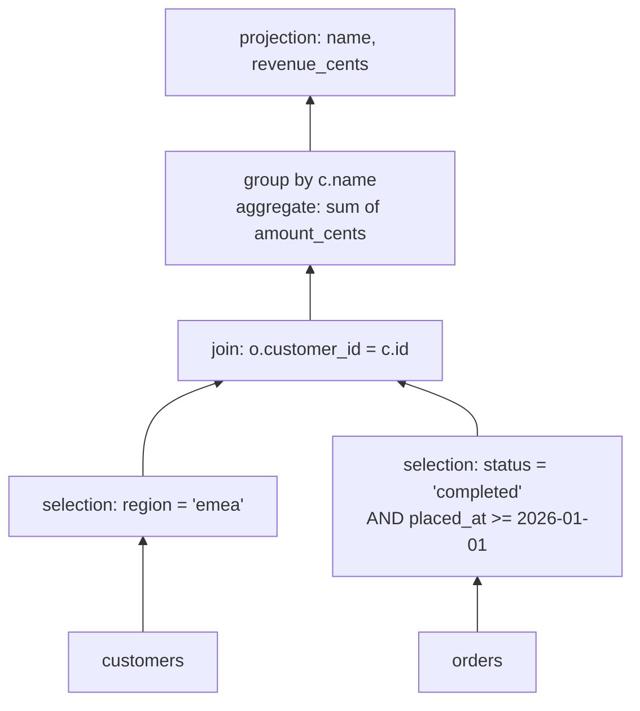
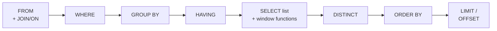
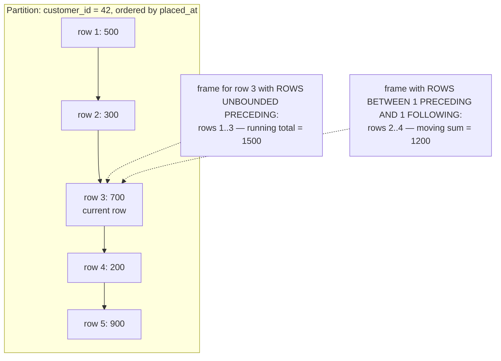
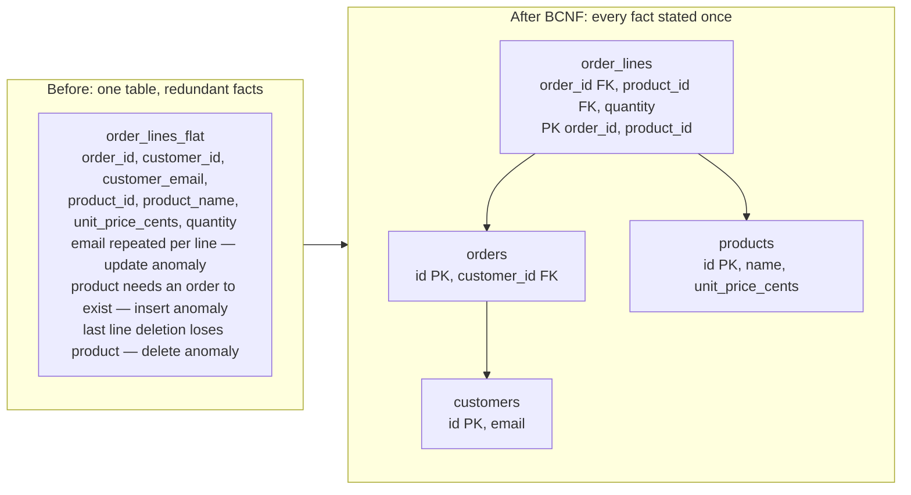
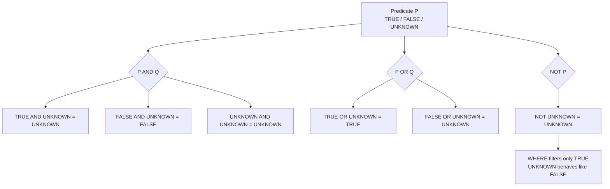
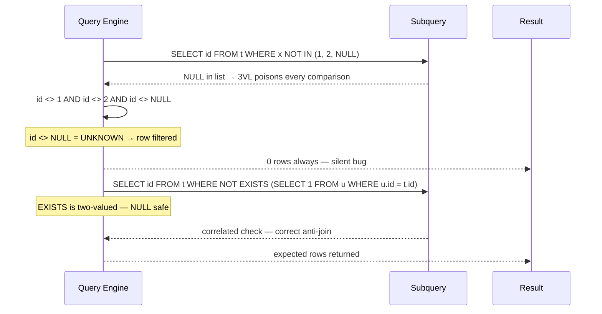
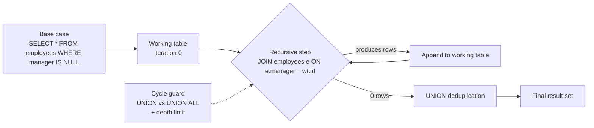

# Chapter 1 — The Relational Model and SQL Semantics

**What this chapter covers.** This volume descends, over fourteen chapters, from the logical
surface of a database to its physical depths — storage engines, indexes, query optimizers,
transactions, replication, sharding — and then back up to the distributed SQL systems that
reassemble all of it across machines. Before any of that, we need the surface itself, stated
precisely. This chapter is about the relational model as Codd actually defined it in 1970, and
about SQL as it actually behaves — which differs from the model in ways that produce real
production bugs. We start with the one idea that made everything else in this volume possible:
the separation of the logical data model from physical storage. We then work through the parts
of SQL that senior engineers most often get subtly wrong: NULL and three-valued logic, bag
versus set semantics, the logical evaluation order of a SELECT, grouping correctness, the
NULL-poisoned difference between `NOT IN` and `NOT EXISTS`, window frames, and recursive
queries. We treat relational algebra not as theory for its own sake but as the vocabulary of
query plans — every `EXPLAIN` output you will read in Chapter 4 is an algebra tree, and you
cannot read plans fluently without it. We close with normalization as a pragmatic engineering
discipline rather than a purity contest, and with the distributed-systems lens: the schema
decisions this chapter teaches you to make are precisely the decisions that determine, years
later, whether your database can be sharded at all.

Learning goals — after this chapter you should be able to:

- State the relational model precisely: relations as sets of tuples over typed attributes, and
  why *data independence* is the foundational idea rather than an implementation detail.
- Define candidate, primary, and foreign keys, and the four constraint families — entity,
  referential, domain, and CHECK — including how each treats NULL.
- Reason in three-valued logic: predict the result of any predicate over NULLs, and identify
  the four classic 3VL bug patterns in real queries.
- Translate between SQL and relational algebra — selection, projection, the join varieties
  including semi and anti joins, and aggregation — well enough to read a query plan.
- Recite the logical evaluation order of a SELECT and use it to explain concrete errors, such
  as why a SELECT alias is invisible to WHERE.
- Use window functions with explicit frames, and explain why `ROWS` and `RANGE` frames differ
  in the presence of ties.
- Write a correct `WITH RECURSIVE` query and explain its working-table semantics.
- Carry a schema from unnormalized to BCNF via functional dependencies, name the anomaly each
  step removes, and argue honestly about when to denormalize.

## Codd's model: relations, tuples, and the great separation

E. F. Codd's 1970 paper, *A Relational Model of Data for Large Shared Data Banks*, is nine
pages long and is plausibly the highest-leverage systems paper ever published. To see why, you
have to see what it was written against. The databases of 1970 — IBM's hierarchical IMS, the
CODASYL network model — exposed physical structure directly to applications. A program
navigated from record to record by following pointers; queries were expressed as traversal
code. If the database administrator changed an access path, added an index, or reordered
records, application code broke. Codd names this failure precisely in the paper's opening: the
data dependencies of ordering, indexing, and access path. His proposal was to eliminate all
three at once.

The model itself is austere. A **relation** is a *set* of **tuples**. Each tuple assigns a
value to each of a fixed collection of named, typed **attributes**; the type of an attribute —
its **domain** — is the set of values it may take. Three consequences of the word "set" do all
the work, and each one is a promise the model makes to the optimizer:

1. **No duplicate tuples.** A relation cannot contain the same tuple twice; a fact stated
   twice is the same fact.
2. **No tuple ordering.** A relation has no first row. Any order you observe is an accident of
   physical storage, and you may not depend on it.
3. **No positional attributes.** Attributes are identified by name, not position. There is no
   "third column."

Every value in a tuple is atomic with respect to the model — the model gives you no way to
reach inside a value and address its parts relationally. (This is the seed of first normal
form, which we return to later.)

The payoff of this austerity is **data independence**, and it is the single most important
idea in this volume. Because the application speaks only in terms of relations, attributes,
and predicates — never in terms of files, pages, pointers, or indexes — the physical layer
underneath is free to change without breaking anything above it. Codd distinguished what we
now call *physical* data independence (storage layout, access paths, and indexes can change
under a fixed schema) from *logical* data independence (the schema itself can evolve, with
views insulating applications from the change).

It is worth pausing on how much rode on this bet, because we live in its consequences.
Everything in Chapters 2 through 4 of this volume — heap files versus clustered B-trees versus
LSM-trees, every index type, every join algorithm, cost-based optimization itself — exists
*below* the line Codd drew, and could therefore be invented, deployed, and replaced for five
decades without applications changing a line of SQL. Your query from 1995 runs against a
storage engine designed in 2020. Row stores became column stores for analytics; nested-loop
joins became hash joins; single machines became clusters — and the interface held. No other
interface in computing has absorbed this much implementation churn. When Chapter 12 shows you
distributed SQL systems executing ordinary SQL across dozens of sharded nodes, that is not a
new idea succeeding; it is the 1970 idea being cashed out one more time.

### Keys

The model identifies tuples by value, not by pointer or position, so it needs a vocabulary for
identifying values.

A **superkey** is any set of attributes whose values uniquely identify a tuple within the
relation. A **candidate key** is a *minimal* superkey — remove any attribute and uniqueness is
lost. A relation can have several candidate keys: an `employees` relation might be uniquely
identified by `employee_id` and also by `email`. The **primary key** is the candidate key you
designate as the relation's canonical identifier; the others become **alternate keys**,
typically enforced with UNIQUE constraints. A **foreign key** is a set of attributes in one
relation whose values must appear as a candidate key value in another (or be NULL) — it is how
the relational model expresses relationships without pointers: by shared values.

The distinction between *natural* keys (attributes with real-world meaning, like `email`) and
*surrogate* keys (synthetic identifiers, like a `bigint` from a sequence or a UUID) is an
engineering decision the model is silent on. The working consensus for OLTP systems is
surrogate primary keys with natural keys enforced as UNIQUE — real-world identifiers change
(emails, usernames, even national ID numbers), and a primary key that changes propagates
updates through every referencing foreign key. The choice *between* surrogate types
(sequential versus random UUID) is a physical-layer question with real consequences for B-tree
insertion patterns, and Chapter 3 takes it up.

### Integrity constraints

Constraints are the model's mechanism for making the database, rather than every application
that writes to it, the enforcer of invariants. Four families:

- **Entity integrity:** no component of a primary key may be NULL. A tuple you cannot
  identify is not a fact.
- **Referential integrity:** every non-NULL foreign key value must match an existing
  referenced key. SQL lets you choose what happens on violation-by-deletion: `ON DELETE
  RESTRICT` (refuse), `CASCADE` (propagate), `SET NULL` (orphan explicitly). Treat `CASCADE`
  with suspicion in large systems — a delete that fans out across tables is a foot-gun at
  scale, and an invisible one in code review.
- **Domain constraints:** attribute values come from the declared type — and SQL types are
  coarse domains at best. `NOT NULL` belongs here; so do enumerated types.
- **CHECK constraints:** arbitrary row-level predicates — `CHECK (price_cents >= 0)`,
  `CHECK (starts_at < ends_at)`.

One asymmetry deserves a flag now, because it foreshadows the next section: a WHERE clause
keeps a row only when its predicate is TRUE, but a CHECK constraint rejects a row only when
its predicate is FALSE. A CHECK that evaluates to UNKNOWN — because some operand is NULL —
*passes*. `CHECK (price_cents >= 0)` happily admits a NULL price. If you meant to forbid that,
you needed `NOT NULL` too. This is not a quirk; it is your first encounter with three-valued
logic, which has a whole section below because it has earned one.

The engineering argument for declaring constraints in the database rather than only in
application code is the same argument as for types: the invariant is enforced at the last
possible moment, against *all* writers — every service, every migration script, every
engineer with a psql prompt — not just the well-behaved ones. In a multi-service organization
the database constraint is frequently the only invariant that is actually true.

## NULL and three-valued logic, honestly

NULL is the most bug-productive feature in SQL, and the bugs are not caused by NULL itself but
by engineers reasoning in two-valued logic about a three-valued system. The rules are small.
Learn them once, properly.

NULL is not a value. It is a marker meaning *no value here* — absent, unknown, inapplicable
(SQL deliberately refuses to distinguish these). Because NULL is not a value, comparing
anything to it — including another NULL — cannot yield TRUE or FALSE. It yields the third
truth value, **UNKNOWN**:

```sql
SELECT NULL = NULL;    -- NULL (i.e., UNKNOWN — not TRUE)
SELECT NULL <> NULL;   -- NULL
SELECT 1 = NULL;       -- NULL
```

The connectives extend to three values the way "unknown" intuitively should: `NOT UNKNOWN` is
UNKNOWN; `UNKNOWN AND TRUE` is UNKNOWN but `UNKNOWN AND FALSE` is FALSE (a conjunction with a
false conjunct is false no matter what the unknown turns out to be); `UNKNOWN OR TRUE` is TRUE
but `UNKNOWN OR FALSE` is UNKNOWN. To *test* for NULL you must leave ordinary comparison and
use the dedicated predicates `IS NULL` / `IS NOT NULL`, or the two-valued comparison
`IS [NOT] DISTINCT FROM`, which treats two NULLs as equal and never returns UNKNOWN.

That is the entire theory. The damage comes from four places where UNKNOWN silently changes
query results. Each of the following is a bug I have seen shipped.

**Trap 1: WHERE eliminates UNKNOWN rows.** WHERE keeps rows whose predicate is TRUE. Rows
evaluating to FALSE *or UNKNOWN* are dropped. The consequence: a filter and its negation do
not partition the table.

```sql
CREATE TABLE tickets (
  id         bigint PRIMARY KEY,
  severity   int,          -- NULL until triaged
  title      text NOT NULL
);
INSERT INTO tickets VALUES (1, 1, 'db down'), (2, 3, 'typo'), (3, NULL, 'untriaged');

SELECT count(*) FROM tickets WHERE severity >= 2;   -- 1  (ticket 2)
SELECT count(*) FROM tickets WHERE severity < 2;    -- 1  (ticket 1)
-- Ticket 3 appears in NEITHER. "Everything is either >= 2 or < 2" is
-- two-valued reasoning, and it is false here.
```

The real-world version is a dashboard that splits traffic into "EU" and "non-EU" and quietly
loses every row with a NULL region — the two panels no longer sum to the total, and nobody
notices for a quarter.

**Trap 2: `NOT IN` with a NULL in the list returns nothing.** This is the classic, and it is
worth deriving rather than memorizing. `x NOT IN (a, b, c)` means `x <> a AND x <> b AND
x <> c`. If any list element is NULL, that conjunct is UNKNOWN, so the whole conjunction is
either FALSE (if x matches some element) or UNKNOWN (if it doesn't) — it can never be TRUE.
WHERE keeps only TRUE. Result: zero rows, always.

```sql
CREATE TABLE customers (id bigint PRIMARY KEY, referrer_id bigint);  -- NULLable
INSERT INTO customers VALUES (1, NULL), (2, 1), (3, 1);

-- "Customers who never referred anyone":
SELECT id FROM customers
WHERE id NOT IN (SELECT referrer_id FROM customers);
-- Returns ZERO rows: the subquery yields {NULL, 1}, and NOT IN over a
-- set containing NULL cannot be TRUE for any id.

-- Correct: NOT EXISTS is a genuine anti-join and is NULL-safe.
SELECT c.id FROM customers c
WHERE NOT EXISTS (
  SELECT 1 FROM customers r WHERE r.referrer_id = c.id
);
-- Returns 2 and 3.
```

The insidious part is the failure mode over time: the query is *correct* while the subquery
column happens to contain no NULLs, then returns empty forever after the first NULL row is
inserted. The rule of thumb is blunt: never write `NOT IN (subquery)` against a nullable
column; write `NOT EXISTS`.

**Trap 3: aggregates skip NULLs — except `COUNT(*)`.** All standard aggregates (`SUM`, `AVG`,
`MIN`, `MAX`, `COUNT(expr)`) ignore NULL inputs. `COUNT(*)` counts rows regardless.

```sql
CREATE TABLE reviews (id bigint PRIMARY KEY, rating int);  -- NULL = no rating left
INSERT INTO reviews VALUES (1, 5), (2, 4), (3, NULL), (4, NULL);

SELECT count(*)      AS rows,          -- 4
       count(rating) AS rated,         -- 2
       avg(rating)   AS avg_rating     -- 4.5  (not 2.25!)
FROM reviews;
```

Whether 4.5 or 2.25 is "the average rating" is a product question, but the database has
silently answered it for you. Note also that aggregates over an *empty* input yield NULL, not
zero — `SUM` of no rows is NULL — which then feeds Trap 1 in any enclosing predicate;
`COALESCE(SUM(x), 0)` is the standard antidote.

**Trap 4: comparisons in joins.** Join predicates are predicates: a NULL join key matches
nothing, including another NULL. Rows with NULL keys silently vanish from inner joins. When
Chapter 8's replication and Chapter 11's service-merging patterns have you combining data from
multiple sources — where "field not populated by that source" is routine — this is the trap
that multiplies. Two datasets that each look complete produce a join that is quietly missing
every row either side left NULL.

Two final notes for calibration. First, `GROUP BY`, `DISTINCT`, and `ORDER BY` do *not* use
UNKNOWN-producing comparison — they treat NULLs as a single group / duplicate class, and sort
them together (last by default in Postgres ascending order; `NULLS FIRST/LAST` controls it).
SQL is not even consistently three-valued, which is part of why it is hard. Second, the
standard's own committee has been ambivalent about NULL for forty years, and C. J. Date has
argued for decades that 3VL was a mistake. You do not get to relitigate it; you get to declare
`NOT NULL` wherever a value is genuinely required — the cheapest bug-prevention available in a
schema — and reach for `IS DISTINCT FROM` when you need two-valued comparison.

## Relational algebra: the vocabulary of query plans

Codd gave the model two equivalent query languages: relational *calculus* (declarative —
describe the tuples you want) and relational *algebra* (operational — a set of operators that
each take relations and produce a relation). SQL descends from the calculus side, but the
algebra is what you must know, for one compelling reason: **query plans are algebra trees.**
When Chapter 4 shows the optimizer parsing your SQL, rewriting it, and choosing among physical
plans, every intermediate form is relational algebra. `EXPLAIN` is printed algebra. Learn the
operators and plans stop being wall-of-text and start being sentences.

The operators, with their SQL correspondences:

| Algebra | Symbol | SQL surface |
|---|---|---|
| Selection | σ | `WHERE` — filter rows by predicate |
| Projection | π | `SELECT` column list — keep named attributes (set semantics: dedup) |
| Cartesian product | × | `CROSS JOIN` |
| Inner join | ⋈ | `JOIN … ON` — product plus selection, fused |
| Outer joins | ⟕ ⟖ ⟗ | `LEFT/RIGHT/FULL JOIN` — preserve unmatched rows, NULL-padded |
| Semi join | ⋉ | `WHERE EXISTS (…)` / `IN (…)` — filter left by existence of a match |
| Anti join | ▷ | `WHERE NOT EXISTS (…)` — filter left by absence of a match |
| Union / Intersect / Except | ∪ ∩ − | `UNION` / `INTERSECT` / `EXCEPT` |
| Rename | ρ | `AS` aliases |
| Grouping/aggregation | γ | `GROUP BY` with aggregates (an extension beyond Codd's original set) |

Semi and anti joins deserve emphasis because they exist in every optimizer and in almost no
SQL textbooks. A **semi join** returns each left row at most once if *any* matching right row
exists — it never duplicates left rows and never produces right columns, which is exactly the
semantics of `EXISTS`. An **anti join** returns left rows with *no* match — the semantics of
`NOT EXISTS`. When you write `EXISTS`, the optimizer does not run the subquery per row like a
naive interpreter; it plans a semi join and picks a physical algorithm (hash, merge, indexed
nested loop) like any other join. This is also where Trap 2 comes home: the optimizer can
convert `NOT IN` to an anti join *only* when it can prove the relevant columns are NOT NULL —
otherwise it must preserve the deranged 3VL semantics with a slower plan. Your `NOT NULL`
declarations are optimizer input.

The property that makes the algebra an algebra is **closure**: every operator consumes
relations and produces a relation. Closure is why operators compose into arbitrary trees, why
a view or CTE can be substituted anywhere a table can, and why the optimizer may legally
rewrite your tree into any equivalent one — pushing a selection below a join, reordering
joins, splitting an aggregation. Hold onto closure; the distributed-systems lens at the end of
this chapter rests on it.

Here is the correspondence made concrete. The query: revenue per customer for large completed
orders since a date, for customers in a given region.

```sql
SELECT c.name, sum(o.amount_cents) AS revenue_cents
FROM customers c
JOIN orders o ON o.customer_id = c.id
WHERE o.status = 'completed'
  AND o.placed_at >= DATE '2026-01-01'
  AND c.region = 'emea'
GROUP BY c.name;
```



Read bottom-up: base relations at the leaves, result at the root. Notice the tree already
shows one rewrite the optimizer will always make — the selections have been *pushed down*
below the join, so the join sees only EMEA customers and completed recent orders rather than
filtering after a full join. Chapter 4 develops the full rewrite repertoire; the point here is
that the rewrites are *provable* precisely because both trees denote the same algebra
expression.

## SQL semantics that bite

SQL is not the relational algebra, and the deviations are exactly where production bugs live.

### Bags, not sets

SQL tables and query results are **bags** (multisets): duplicates are allowed and ordinary
operations preserve them. This was a pragmatic choice — eliminating duplicates costs a sort or
hash over the whole result, and users often want duplicate-preserving behavior for aggregation
— but it means the model's "no duplicate tuples" promise holds only where you enforce it with
keys. The operational consequences:

- `SELECT` (projection) does not deduplicate; `SELECT DISTINCT` does, at the cost of a
  hash/sort you should notice in plans.
- `UNION` deduplicates (set semantics); `UNION ALL` does not (bag semantics) and is therefore
  cheaper. The number of times `UNION` appears in a codebase where `UNION ALL` was meant is
  large, and each one is a silent sort of the combined result. Default to `UNION ALL` unless
  you specifically need dedup — and if inputs are disjoint by construction, dedup is pure
  waste.
- Duplicates interact with aggregation: `count(x)` versus `count(DISTINCT x)` answer different
  questions, and a join that fans out rows (one-to-many) before an aggregate silently inflates
  sums — the classic "revenue doubled after we joined in shipments" bug. Aggregate first in a
  subquery or use `DISTINCT` deliberately, but know which question you are answering.

### The logical evaluation order of a SELECT

A SELECT statement is written in one order and *means* another. The standard defines a logical
evaluation order — every conforming implementation must behave *as if* it evaluated clauses in
this sequence (the optimizer will do something cleverer, but observably equivalent):



This one diagram resolves a whole family of "why won't SQL let me…" questions mechanically:

- **Why can't WHERE see a SELECT alias?** `SELECT price * qty AS total … WHERE total > 100`
  fails because WHERE runs before the SELECT list exists. Repeat the expression, or compute it
  in a subquery/CTE and filter outside. (`ORDER BY` runs *after* SELECT, which is why it *can*
  use the alias.)
- **Why HAVING at all?** WHERE filters rows before grouping; HAVING filters *groups* after
  aggregation. `WHERE count(*) > 5` is meaningless — there are no groups yet — and
  `HAVING price > 100` on a non-grouped column is equally confused in the other direction.
- **Why can't WHERE contain a window function?** Windows are computed with the SELECT list,
  after WHERE. Filtering on `row_number()` requires wrapping the query and filtering the
  outer level — the top-N-per-group idiom below.
- **Why does `ON` versus `WHERE` matter for outer joins?** For an inner join, a predicate in
  `ON` and the same predicate in `WHERE` are equivalent. For a `LEFT JOIN` they are not: `ON`
  decides *what matches* (unmatched left rows survive, NULL-padded), while `WHERE` filters the
  joined result — and a WHERE predicate on right-side columns silently turns your left join
  back into an inner join, because the NULL-padded rows evaluate to UNKNOWN and are dropped
  (Trap 1 again, wearing a join costume).
- **Why is `LIMIT` without `ORDER BY` nondeterministic?** LIMIT runs last, over a result whose
  order is — per the model — undefined. It cuts *some* N rows. The order you observed in
  development was a physical accident (a sequential scan of a fresh heap); the different order
  in production (an index scan, a parallel scan, post-vacuum layout) is equally legal.
  Relatedly, `OFFSET`-based pagination without a total order over a *unique* key skips or
  repeats rows across pages; keyset pagination (`WHERE (placed_at, id) > (:last_at, :last_id)
  ORDER BY placed_at, id LIMIT 50`) fixes both correctness and the O(offset) cost.

### GROUP BY correctness

Once rows are grouped, each output row represents a *group*, and the SELECT list may only
reference things that are single-valued per group: the grouping columns, aggregates, and —
this is the subtle part — columns *functionally dependent* on the grouping columns. The
standard (since SQL:1999) permits the functional-dependence case; Postgres implements the most
useful instance — group by a table's primary key and you may select any column of that table:

```sql
-- Legal in Postgres: c.id is the primary key, so c.name is
-- functionally dependent on the grouping column.
SELECT c.id, c.name, count(o.id)
FROM customers c LEFT JOIN orders o ON o.customer_id = c.id
GROUP BY c.id;
```

MySQL's history here is instructive. For years it accepted *any* non-grouped column and
returned a value from some arbitrary row of the group — nondeterministic results, silently.
Since 5.7 the `ONLY_FULL_GROUP_BY` SQL mode is on by default and it now enforces the rule
(with its own functional-dependence analysis). If you operate an older or laxer-configured
MySQL, every such query is a latent wrong-answer bug that will surface when the optimizer
changes its access path.

### Subqueries: correlated, uncorrelated, and the EXISTS/IN split

An **uncorrelated** subquery references nothing from the outer query; logically it runs once.
A **correlated** subquery references outer columns; logically it runs per outer row — though,
per data independence, the optimizer is free to *decorrelate* it into a join, and good
optimizers usually do. The semantics you must actually memorize is the NULL behavior:

- `x IN (subquery)`: TRUE if x equals some result value; FALSE only if the subquery result is
  NULL-free and contains no match; otherwise UNKNOWN.
- `x = ANY (…)` is identical to IN. `x <> ALL (…)` is identical to NOT IN — and inherits its
  NULL pathology.
- `EXISTS (subquery)`: TRUE or FALSE, *never UNKNOWN*. It asks only "is the result nonempty,"
  so NULLs inside the subquery are irrelevant.

Hence the working rule from Trap 2, now fully justified: `EXISTS`/`NOT EXISTS` are the
two-valued, optimizer-friendly, NULL-safe way to express semi and anti joins; `IN` is
acceptable sugar for the positive case; `NOT IN` is safe only against provably NOT NULL
columns, and your reviewer should not have to prove it.

## Window functions

Window functions, standardized in SQL:2003, compute a value for each row using a *window* of
related rows — without collapsing rows the way GROUP BY does. They replaced a generation of
self-join gymnastics: before them, "running total" meant joining a table to itself on
`t2.date <= t1.date` and aggregating — an O(n²) construction that optimizers struggled with
and juniors got wrong; "top 3 per group" meant a correlated count subquery. Window functions
express both directly, and the engine computes them in a single pass over sorted partitions.

A window specification has three parts, each defaulting sensibly and each worth making
explicit:

- **PARTITION BY** — splits rows into independent groups; the function restarts per
  partition. Omitted: one partition of everything.
- **ORDER BY** — orders rows *within* the partition, defining "before" for running
  computations and rank.
- **Frame** — for aggregate windows, which rows around the current row are aggregated:
  `ROWS`/`RANGE`/`GROUPS BETWEEN … AND …`.

```sql
SELECT
  customer_id,
  placed_at,
  amount_cents,
  sum(amount_cents) OVER (
    PARTITION BY customer_id
    ORDER BY placed_at
    ROWS BETWEEN UNBOUNDED PRECEDING AND CURRENT ROW
  ) AS running_total_cents,
  row_number() OVER (PARTITION BY customer_id ORDER BY placed_at) AS order_seq
FROM orders;
```



The frame is where the bites are. When you write `ORDER BY` in a window and *omit* the frame,
the default is `RANGE BETWEEN UNBOUNDED PRECEDING AND CURRENT ROW` — and `RANGE` includes all
*peers* of the current row (rows equal under the ORDER BY). If two orders share a timestamp,
both get the running total *including both*, which is rarely what a "running total" means, and
the bug only manifests when ties exist — i.e., not in your test data. `ROWS` counts physical
rows and does what you almost always mean; write the frame explicitly. (`GROUPS`, added in
SQL:2011 and available in Postgres, frames by peer groups — occasionally exactly right,
mostly a curiosity.)

The ranking trio differ only on ties, and the difference is a one-line table:

| Input scores | `row_number()` | `rank()` | `dense_rank()` |
|---|---|---|---|
| 95 | 1 | 1 | 1 |
| 90 | 2 | 2 | 2 |
| 90 | 3 | 2 | 2 |
| 85 | 4 | 4 | 3 |

`row_number` breaks ties arbitrarily (nondeterministically, unless the ORDER BY is total —
another accidental-order trap); `rank` leaves gaps; `dense_rank` does not. The canonical
top-N-per-group, exploiting the evaluation order (windows compute after WHERE, so the filter
must sit outside):

```sql
SELECT *
FROM (
  SELECT o.*,
         row_number() OVER (PARTITION BY customer_id
                            ORDER BY amount_cents DESC, id) AS rn
  FROM orders o
) ranked
WHERE rn <= 3;
```

Note the `, id` tiebreaker making the ordering total and the result deterministic. Chapter 4
discusses how engines evaluate windows (sort per partition specification, shared between
compatible windows) and Chapter 3 shows when an index can supply the order for free.

## CTEs, recursion, and LATERAL

A common table expression — `WITH name AS (…)` — names a subquery for reuse and readability;
by closure, it can stand anywhere a table can. One dialect note that matters operationally:
Postgres before version 12 always materialized CTEs (an optimization fence — predicates could
not be pushed into them); since 12 they inline by default, with `MATERIALIZED` /
`NOT MATERIALIZED` as explicit overrides. Old advice about CTEs being slow in Postgres, and
old code relying on the fence, both need rechecking.

`WITH RECURSIVE` (SQL:1999) is the real power tool: it computes a fixpoint, which is how SQL —
whose plain algebra cannot express transitive closure — walks graphs and hierarchies. The
semantics is precise and worth stating exactly, because mental models like "the CTE calls
itself" predict wrong results. The engine maintains a **working table**:

1. Evaluate the non-recursive term; its rows become both the working table and the first
   slice of the result.
2. Evaluate the recursive term with the recursive self-reference bound to the *current
   working table only* — not the accumulated result. Its output becomes the new working table
   and is appended to the result.
3. Repeat step 2 until the working table is empty.

So the recursion is breadth-first iteration by levels, and the self-reference sees exactly one
level back. A real hierarchy walk — services and the services they depend on, with depth and
path, plus the cycle guard you must never omit on real (i.e., dirty) data:

```sql
CREATE TABLE service_deps (
  service    text NOT NULL,
  depends_on text NOT NULL,
  PRIMARY KEY (service, depends_on)
);

-- Everything 'checkout' transitively depends on:
WITH RECURSIVE reachable AS (
  SELECT d.depends_on,
         1 AS depth,
         ARRAY['checkout', d.depends_on] AS path
  FROM service_deps d
  WHERE d.service = 'checkout'

  UNION ALL

  SELECT d.depends_on,
         r.depth + 1,
         r.path || d.depends_on
  FROM reachable r
  JOIN service_deps d ON d.service = r.depends_on
  WHERE NOT d.depends_on = ANY (r.path)   -- cycle guard
)
SELECT DISTINCT depends_on, min(depth) AS min_depth
FROM reachable
GROUP BY depends_on
ORDER BY min_depth;
```

Without the guard, one cycle in the data (service A depends on B depends on A — which
*happens*, that's why you're writing this query) makes the working table never empty and the
query run until it exhausts memory or a timeout kills it. `UNION` instead of `UNION ALL`
deduplicates each level against the whole result and can terminate some cyclic queries, but
carrying the path is the honest approach when you need it anyway. Postgres 14 added `CYCLE`
and `SEARCH` clauses that generate this machinery for you.

**LATERAL**, briefly, because it completes the subquery story: a `LATERAL` subquery in the
FROM clause may reference columns of tables to its left — it is a correlated subquery promoted
to a full table expression, evaluated per left row. Its killer application is top-N-per-group
when the groups come from another table, where it often beats the window formulation by doing
N index probes instead of scanning and ranking everything:

```sql
SELECT c.name, recent.placed_at, recent.amount_cents
FROM customers c
CROSS JOIN LATERAL (
  SELECT o.placed_at, o.amount_cents
  FROM orders o
  WHERE o.customer_id = c.id
  ORDER BY o.placed_at DESC
  LIMIT 3
) recent;
```

## Normalization, pragmatically

Normalization has a reputation as academic hair-splitting. It is not. It is the discipline of
making a schema unable to contradict itself, and the anomalies it prevents are concrete
production bugs. The theory rests on one concept: a **functional dependency** (FD) X → Y holds
when tuples agreeing on attributes X must agree on attributes Y — X determines Y. FDs are
facts about the *domain*, not the data you happen to have; you elicit them by asking "can this
ever differ?" of the people who own the semantics.

Start with the failure. A team stores order lines in one wide table:

```sql
CREATE TABLE order_lines_flat (
  order_id       bigint,
  customer_id    bigint,
  customer_email text,
  product_id     bigint,
  product_name   text,
  unit_price_cents int,
  quantity       int,
  PRIMARY KEY (order_id, product_id)
);
```

The FDs: `order_id → customer_id` (an order belongs to one customer), `customer_id →
customer_email`, `product_id → product_name, unit_price_cents`. Three anomaly families follow
directly, and each is a real bug class:

- **Update anomaly:** a customer's email is stored once per order line. Changing it means
  updating many rows; miss one (a partial failure, a concurrent writer — Chapter 5) and the
  database now asserts two emails for one customer. Which is correct? The schema cannot say.
- **Insert anomaly:** you cannot record a new product's name and price until someone orders
  it — there is no row to put it in. Teams "solve" this with dummy orders, manufacturing fake
  facts to store real ones.
- **Delete anomaly:** deleting the last order line that references a product deletes your
  only record of its name and price. Removing one fact destroyed an unrelated one.

The normal forms are increasingly strict rules about where FDs may point; informally: **1NF**
— atomic values, no repeating groups (the model's baseline); **2NF** — no non-key attribute
depends on a *proper subset* of a composite key (`product_name` depends on `product_id` alone,
violating it above); **3NF** — no non-key attribute depends on another non-key attribute
(`customer_email` depends on `customer_id`, which depends on `order_id` — a transitive
dependency); **BCNF** — the clean unifying statement: *for every nontrivial FD X → Y, X is a
superkey*. Every arrow comes from a key. The decomposition, guided by the FDs — one relation
per determinant:



```sql
CREATE TABLE customers (
  id    bigint GENERATED ALWAYS AS IDENTITY PRIMARY KEY,
  email text NOT NULL UNIQUE
);
CREATE TABLE products (
  id               bigint GENERATED ALWAYS AS IDENTITY PRIMARY KEY,
  name             text NOT NULL,
  unit_price_cents int  NOT NULL CHECK (unit_price_cents >= 0)
);
CREATE TABLE orders (
  id          bigint GENERATED ALWAYS AS IDENTITY PRIMARY KEY,
  customer_id bigint NOT NULL REFERENCES customers(id),
  placed_at   timestamptz NOT NULL DEFAULT now()
);
CREATE TABLE order_lines (
  order_id   bigint NOT NULL REFERENCES orders(id),
  product_id bigint NOT NULL REFERENCES products(id),
  quantity   int    NOT NULL CHECK (quantity > 0),
  PRIMARY KEY (order_id, product_id)
);
```

Every fact now lives in exactly one place; the anomalies are structurally impossible rather
than procedurally avoided. (One deliberate wrinkle: if order lines must record the price *as
sold* — a temporal fact distinct from the product's current price — then `sold_price_cents` on
`order_lines` is not denormalization, it is a different fact. Knowing your FDs is what lets
you make that distinction confidently.)

Two honest caveats before the pragmatics. First, BCNF and dependency preservation can
genuinely conflict: the textbook case is a relation like `assignments(customer, product,
engineer)` with FDs `{customer, product} → engineer` and `engineer → product` — 3NF but not
BCNF, and the BCNF decomposition into `(engineer, product)` and `(customer, engineer)` can no
longer enforce the first FD with keys alone. When this arises (rarely), 3NF plus a documented
constraint is a defensible stopping point. Second, higher forms (4NF, 5NF) address multivalued
and join dependencies; they matter occasionally, mostly when someone crams two independent
many-to-many relationships into one table, and we leave them to the references.

Now the guidance, stated plainly. **Normalization is about write correctness; denormalization
is about read performance.** A normalized schema makes updates cheap and safe (touch one row)
and reads potentially expensive (joins); a denormalized one inverts the deal, buying join-free
reads at the price of redundancy that some mechanism — triggers, application code, an async
pipeline — must now keep consistent, and that mechanism *is* the update anomaly, readmitted
deliberately and hopefully managed. Sometimes that trade is right: read-heavy paths at scale,
precomputed aggregates, the fan-out patterns of Chapter 9, and the read-model side of CQRS
designs (Volume 7, Chapter 5 — Data Modeling — treats this in design terms). The modern answer
is a sequenced policy, not a side in a war: **normalize until it hurts — as the default, in
the system of record, because correctness bugs compound and storage-layer reads are cheaper
than your intuition says (Chapters 2–3) — then denormalize where measured**, deliberately,
with the consistency mechanism written down and owned. Denormalizing up front, on anticipated
performance grounds, buys real anomalies today against hypothetical latency tomorrow; it is
premature optimization applied to the one layer where mistakes are hardest to unwind — as
Chapter 14 will show, schema migrations at scale are among the most dangerous operations in
production databases.

## Declarative SQL and the optimizer's bargain

SQL is declarative: you state *what* — a predicate over relations — and the system chooses
*how*: which indexes, which join algorithms, which order. This is data independence applied to
computation, and it is a bargain with two faces.

The bright face: fifty years of physical innovation arrived without application rewrites, and
the optimizer applies plan-quality expertise at every query, every time, adapting to data
statistics as tables grow — something no hand-written imperative traversal does.

The dark face: the abstraction leaks under pressure, and it leaks in performance, not
correctness. Two semantically equivalent formulations can differ by orders of magnitude — the
`NOT IN` versus `NOT EXISTS` pair above is exactly such a case (one is anti-joinable, the
other must preserve 3VL semantics); so is a filter the optimizer can push into an index versus
one wrapped in a function call that blinds it; so is the correlated subquery a given engine
happens not to decorrelate; so is a stale statistics estimate flipping a hash join to a nested
loop, turning a 10 ms query into a 10 s one — a 1000× swing with zero code change. The
practitioner's response is not to memorize incantations, which rot as optimizers evolve, but
to understand the model well enough to read the plan: know the algebra, know what rewrites are
legal, know what information the optimizer has (constraints, statistics, your NOT NULLs) and
what you have denied it. `EXPLAIN` is the conversation; Chapter 4 teaches you to hold up your
end. Everything in this chapter — algebra trees, semi/anti joins, functional dependencies,
NULL-ability — is precisely the vocabulary that conversation is conducted in.

## Standard SQL and the dialects you actually run

"SQL" is ISO/IEC 9075, a multi-part standard — Part 1 (Framework) and Part 2 (Foundation,
the several-thousand-page core that defines everything in this chapter), plus parts you will
meet later such as Part 11 (information schema) and, in SQL:2023, Part 16 (property-graph
queries). Editions are named by year: SQL:1999 brought recursion; SQL:2003 brought window
functions; SQL:2016 brought JSON; SQL:2023 is current as of this writing. No engine implements
all of it, every engine extends it, and portability is a spectrum. The divergences worth
carrying in your head for the two engines you most likely run:

| Concern | Postgres | MySQL |
|---|---|---|
| Identifier quoting | `"double quotes"` (standard); folds unquoted to lowercase | `` `backticks` `` (unless ANSI_QUOTES); case sensitivity of table names varies by OS/filesystem |
| String literals | `'single quotes'` only | `'single'` and, non-standard, `"double"` by default |
| Upsert | `INSERT … ON CONFLICT (col) DO UPDATE SET …` (also standard `MERGE` since PG 15) | `INSERT … ON DUPLICATE KEY UPDATE …` (fires on *any* unique key, not a named target) |
| Returning modified rows | `RETURNING *` on INSERT/UPDATE/DELETE | Not in MySQL (MariaDB has `RETURNING`); use `LAST_INSERT_ID()` and a re-read |
| Text comparison | Case-sensitive by default | Default collations are case-insensitive: `'a' = 'A'` is true |
| GROUP BY laxity | FD-based (primary key) per standard | `ONLY_FULL_GROUP_BY` on by default since 5.7; historically returned arbitrary rows |

The upsert row deserves one concrete example because everyone writes one eventually and the
dialects genuinely differ in semantics, not just spelling — `ON CONFLICT` names its arbiter
constraint, `ON DUPLICATE KEY` triggers on any unique violation:

```sql
-- Postgres: idempotent counter bump keyed on a named constraint,
-- returning the resulting row in the same round trip.
INSERT INTO page_views (page_id, day, views)
VALUES (:page_id, current_date, 1)
ON CONFLICT (page_id, day)
DO UPDATE SET views = page_views.views + 1
RETURNING views;
```

The pragmatic posture: write standard SQL where the standard suffices, use extensions
deliberately and knowingly (an ORM will not save you — it merely picks a dialect for you), and
when a query must be portable, test it on every engine it must be portable *to*, because the
silent divergences (collation, GROUP BY laxity, quoting) are worse than the loud ones.

## The distributed-systems lens

Everything in this chapter was defined for one node. All of it bears on many nodes, and the
connections are structural, not analogical.

**Data independence is the abstraction distributed SQL exploits.** Your application speaks
predicates over relations and never names a page, a file — or a *node*. That last omission is
the entire opening that Chapter 12's NewSQL systems (Spanner, CockroachDB, and kin) walk
through: partitioning, replica placement, and distributed execution are just more physical
decisions below Codd's line, and the line was drawn in 1970 wide enough to hide them. The same
SQL runs; the "storage engine" now spans a fleet. This is not a coincidence; it is the payout
of the model's central bet, and it is why SQL — pronounced dead in 2009 — is the interface
that distributed transactional systems converged back to.

**Closure is why queries can be split across nodes.** Because every algebra operator yields a
relation, a plan tree can be *cut* at any edge: evaluate the subtree below the cut on the node
that holds the data, ship the resulting relation, continue above the cut elsewhere. Predicate
pushdown to a shard, partial aggregation on each partition followed by a merge aggregate,
shipping semi-join filters — every distributed execution strategy in Chapters 9 and 12 is an
application of the closure property plus the rewrite rules of Chapter 4. An algebra without
closure could not be partitioned this way; you would be shipping opaque program state instead
of relations.

**Constraints stop at the shard boundary.** A foreign key is cheap when the referencing and
referenced rows share a node: check an index, done. When a shard key splits them, every
referential check becomes a cross-node round trip, and enforcing it transactionally requires
the distributed-transaction machinery of Chapter 10 — so sharded systems commonly downgrade
FKs to advisory or drop them entirely, and uniqueness on anything but the shard key becomes a
global-index problem (Chapter 9). Read the implication in the correct direction: the *logical*
schema decisions you make today — which relationships are enforced by keys, which invariants
span rows, which candidate key you choose — determine which shard keys are even *available*
later. Co-locate what must be transactionally consistent; a schema whose critical invariants
all cross any plausible partition boundary is a schema that cannot be sharded without being
redesigned. Chapter 9 makes this concrete; Volume 7, Chapter 5 treats it as a design method.

**NULL bugs multiply when data is merged.** Within one schema you can fight NULL with NOT
NULL. But federate data — join replicas mid-catchup, merge per-service extracts in a
warehouse, stitch API responses where "field absent" became NULL — and you reintroduce NULLs
at every seam: the outer joins that combine sources *manufacture* NULLs for every unmatched
row by design. Every trap in this chapter then fires at once: `NOT IN` against a column that
is NULL-free in service A but not in the merged view; two-panel dashboards that no longer sum
to the total; aggregates silently skipping the rows one source failed to populate. Teams that
merge data across systems relearn three-valued logic empirically, in production, at the seams.
The cheaper path is the one this chapter taught: know the 3VL rules cold, and treat every
merged dataset as maximally nullable until proven otherwise.

## Key takeaways

- **The relational model is a set of promises to the layers below.** Relations are sets of
  tuples over typed, named attributes: no duplicates, no order, no positions. Applications
  speak predicates; storage is free to change. That data independence is why fifty years of
  storage and optimizer innovation — and now distributed execution — arrived without breaking
  applications.
- **Constraints make the database the enforcer of invariants** against all writers, not just
  well-behaved ones. Know the asymmetry: WHERE keeps only TRUE, but CHECK rejects only FALSE —
  a CHECK evaluating to UNKNOWN passes, so CHECK does not imply NOT NULL.
- **SQL logic is three-valued, and the four traps are mechanical:** WHERE drops UNKNOWN rows
  (filters and their negations don't partition a table); `NOT IN` over a list containing NULL
  returns nothing, ever; aggregates skip NULLs and return NULL on empty input; NULL join keys
  match nothing. Declare NOT NULL wherever true; write `NOT EXISTS`, never `NOT IN`, against
  nullable columns.
- **Relational algebra is the language of query plans.** Selection, projection, joins —
  including the semi and anti joins that EXISTS/NOT EXISTS denote — and aggregation compose
  into trees because of closure, and `EXPLAIN` is printed algebra. Your NOT NULL declarations
  are optimizer input.
- **SQL is bags, evaluated in a fixed logical order:** FROM → WHERE → GROUP BY → HAVING →
  SELECT → DISTINCT → ORDER BY → LIMIT. This one fact explains alias visibility, HAVING's
  existence, why window filters need a wrapper, why WHERE on a left join's right side makes it
  inner, and why LIMIT without ORDER BY is nondeterministic. UNION ALL unless you mean UNION.
- **Window functions need explicit frames.** The implicit frame with ORDER BY is `RANGE …
  CURRENT ROW`, which includes peers and corrupts running totals under ties; write `ROWS`
  explicitly. ROW_NUMBER breaks ties arbitrarily, RANK gaps, DENSE_RANK doesn't.
- **WITH RECURSIVE iterates a working table level by level** — the self-reference sees one
  level back, not the accumulated result — and on real data it needs a cycle guard.
- **Normalize by functional dependencies until BCNF** ("every arrow from a key"), because the
  anomalies are real bug classes; **denormalize where measured**, knowing you are readmitting
  the update anomaly and must own the mechanism that manages it. Normalization is write
  correctness; denormalization is read performance.
- **Equivalent queries can differ 1000×.** SQL states what, the optimizer picks how, and the
  leaks are in performance, not correctness. Understanding the model — and reading plans —
  beats memorizing dialect tricks that rot.
- **Schema design is shard design, years early.** Constraints and invariants that span
  partition boundaries become expensive or impossible; the logical layer determines later
  shardability.








## Further reading

- Codd, E. F., "A Relational Model of Data for Large Shared Data Banks," *Communications of
  the ACM* 13(6), June 1970 — the nine pages this volume stands on.
  https://dl.acm.org/doi/10.1145/362384.362685
- ISO/IEC 9075, *Information technology — Database languages — SQL* — the standard; Part 2
  (Foundation) defines the semantics in this chapter. Latest edition SQL:2023. (Paywalled by
  ISO; the PostgreSQL documentation's conformance appendix is the practical index to it.)
- PostgreSQL documentation — the best free SQL-semantics reference in existence, dialect
  notwithstanding: queries and SELECT evaluation
  (https://www.postgresql.org/docs/current/sql-select.html), window functions
  (https://www.postgresql.org/docs/current/tutorial-window.html), `WITH` queries
  (https://www.postgresql.org/docs/current/queries-with.html).
- Date, C. J., *SQL and Relational Theory: How to Write Accurate SQL Code*, 3rd ed. (O'Reilly,
  2015) — the sharpest available treatment of where SQL deviates from the model, including a
  sustained argument against NULL that will vaccinate you even if you don't accept it.
- Date, C. J., *An Introduction to Database Systems*, 8th ed. (Addison-Wesley, 2003) — the
  standard comprehensive text on the model, dependencies, and normal forms.
- Chamberlin, D. and Boyce, R., "SEQUEL: A Structured English Query Language," *SIGFIDET*,
  1974 — where SQL itself began, at IBM San Jose alongside System R.
- Melton, J. and Simon, A. R., *SQL:1999 — Understanding Relational Language Components*
  (Morgan Kaufmann, 2001) — dated but honest standardese-to-English translation, by the
  standard's longtime editor.
- Winand, M., *Modern SQL* — a well-maintained site tracking which standard features
  (window functions, recursion, LATERAL, and beyond) each engine actually implements.
  https://modern-sql.com
- Chapter 4 — Query Processing and Optimization — where the algebra trees of this chapter
  meet cost models and become physical plans.
- Chapter 9 — Partitioning and Sharding — what happens to keys and constraints at the shard
  boundary; and Chapter 12 — NewSQL — data independence cashed out across a fleet.
- Volume 7, Chapter 5 — Data Modeling — the design-method view of normalization and
  denormalization in system design.
