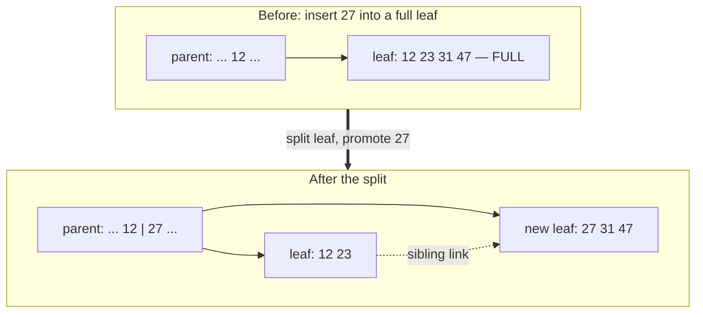
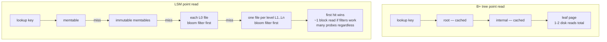
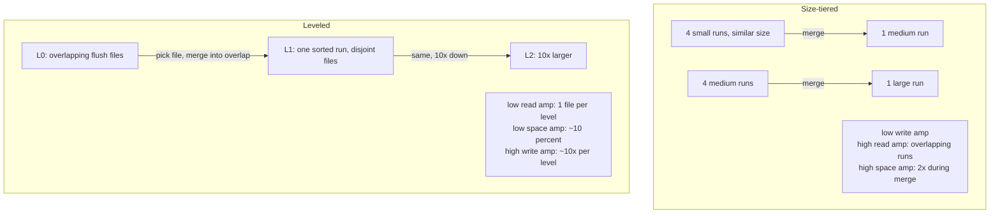

# Chapter 2 — Storage Engines: B-Trees vs LSM-Trees

**What this chapter covers.** Chapter 1 ended with Codd's promise: the application sees relations
and predicates, and the physical layout of bytes on disk is somebody else's problem. This chapter
is about the somebody else. The storage engine is the layer that maps logical rows onto pages on a
device, and everything above it — indexing (Chapter 3), query execution (Chapter 4), transactions
(Chapters 5–7) — inherits its cost structure. Two designs dominate the field, and they are close
to duals of each other. The **B+ tree** keeps data sorted in place and updates it in place; it has
been the default answer since the 1970s and still is, in Postgres, InnoDB, WiredTiger, and SQL
Server. The **log-structured merge tree** never updates anything in place; it accumulates sorted
immutable files and continuously merges them in the background; it is the engine inside LevelDB,
RocksDB, Cassandra, ScyllaDB, and, through RocksDB's embedding, a surprising fraction of modern
infrastructure. We develop both in mechanism-level detail — the fanout arithmetic that makes a
B+ tree four levels deep for a hundred billion rows, the buffer pool and latch protocols around
it, the memtable/SSTable/compaction machinery of the LSM and the write-stall failure mode that
machinery produces in real fleets — and then compare them honestly, using read, write, and space
amplification as the framework. We close by mapping the theory onto the engines you actually run,
examining why memory-mapped I/O keeps tempting engine authors and keeps disappointing them, and
tracing the LSM's central trick — immutability — out into distributed systems, where the same move
shows up as Kafka log segments and lakehouse files.

Learning goals — after this chapter you should be able to:

- Explain why the page is the unit of I/O, and derive from device characteristics — HDD seek
  costs, SSD erase blocks and the FTL — why both major engine designs look the way they do.
- Describe slotted pages, heap files, and tuple layout, including how oversized values are
  handled by TOAST-style overflow.
- Walk a search, an insert, and a page split through a B+ tree; do the fanout arithmetic that
  predicts tree height; and explain fill factor, deferred deletion, buffer-pool pinning, and
  latch coupling.
- Trace a write and a read through an LSM tree — WAL, memtable, SSTable levels — and explain
  what bloom filters buy on the read path and what they cannot buy.
- Compare size-tiered and leveled compaction in terms of read, write, and space amplification,
  and explain tombstones, resurrection hazards, and write stalls as operational realities.
- Choose between a B-tree and an LSM engine for a given workload using measured characteristics
  rather than slogans, and state the caveats on "LSM writes faster, B-tree reads faster."
- Explain the mmap argument from the CIDR 2022 paper accurately, and why most serious engines
  manage their own buffer pool.

## The engine beneath the SQL

Strip away the parser, the planner, the transaction manager, and what remains is a component with
a brutally simple contract: store key-value-ish records durably, find them again by key, scan them
in key order, and do all of this faster than the underlying device's naive cost model would
suggest is possible. That component is the storage engine. In MySQL it is literally pluggable —
InnoDB, MyRocks, and (historically) MyISAM implement the same handler API. In Postgres it is the
heap plus the index access methods. In MongoDB it is WiredTiger. In half the distributed databases
built in the last decade it is an embedded RocksDB with a replication layer glued on top.

The reason this layer deserves a chapter of mechanism rather than a paragraph of names is that its
data structure choice is not an implementation detail — it determines the shape of the whole
system's performance envelope. Whether your p99 write latency degrades smoothly or in cliffs,
whether a bulk load is cheap or generates a week of background I/O debt, whether disk usage is
predictable or breathes by tens of percent: these are storage-engine properties, and you cannot
tune them away from above.

## Disks dictate the design

Both designs are answers to the same question: given what durable storage devices actually charge
for, how should we arrange bytes? Volume 1 covered the storage hierarchy and SSD internals and
Volume 2 covered the page cache and fsync; here is the summary that matters for engine design.

**Rotating disks charge for seeks.** A random read on a 7,200 rpm disk costs a head seek plus
rotational latency — several milliseconds, call it on the order of 100–200 random operations per
second — while sequential transfer runs at a couple of hundred megabytes per second. The ratio
between sequential and random throughput is roughly four orders of magnitude. Every structure in
this chapter descends from that ratio: B-trees exist to bound the number of random reads per
lookup, and log-structured storage exists to convert random writes into sequential ones.

**SSDs abolish the seek but not the asymmetry.** Flash reads any page in tens of microseconds
regardless of location, so random *reads* are cheap — this is what makes LSM read amplification
survivable at all. But flash cannot overwrite in place: data is written in pages (a few KiB) and
erased only in much larger erase blocks (megabytes). The flash translation layer hides this by
remapping writes and garbage-collecting erase blocks, and small scattered writes fragment the
blocks, forcing the FTL to copy live data around — **device-level write amplification** that costs
throughput and flash lifetime (Volume 1, Chapter 6). Large sequential writes are the friendliest
possible pattern for the FTL. So even on SSDs, the log-structured write pattern is not obsolete;
it moved from "necessary for performance" to "kind to the device."

**The page is the unit of I/O.** Devices and kernels transfer blocks, not bytes; a database
adopts a fixed page size — 8 KiB in Postgres, 16 KiB in InnoDB, variable-but-page-shaped in
others — and does all I/O, caching, and locking accounting in pages. Reading one 100-byte row
costs a page. Dirtying one 100-byte row costs writing a page. Every amplification factor in this
chapter is measured against that granularity.

## Pages, slots, and heap files

Before either tree structure, the humblest layout: the **heap file**, an unordered bag of pages,
each page holding whatever tuples were placed there. This is Postgres's table storage — the "heap"
in its documentation is exactly this, with B-tree indexes layered on as separate structures
(Chapter 3 develops the consequences).

Within a page, nearly every engine uses the **slotted page** layout. A header at the front holds
metadata and a *slot array* — an array of (offset, length) pointers that grows forward — while
tuple data grows backward from the end of the page; the free space in the middle is consumed from
both sides. The indirection is the point: a tuple is addressed externally as (page number, slot
number), so the engine can compact the page — sliding tuples around to defragment free space —
without invalidating any external reference, because only the slot array entries change. Postgres
calls these addresses TIDs, or ctids; a tuple's identity is `(page, slot)`, and indexes store
exactly that.

Tuples themselves are a header (transaction visibility information — Chapter 6 will make heavy
use of it), a null bitmap, and the attribute values serialized per the catalog's column order,
with alignment padding. Variable-length values carry a length word. The interesting edge case is
the value that does not fit: a page must hold at least a handful of tuples for the structure to
work, so engines cap in-page tuple size and spill oversized attributes elsewhere. Postgres's
mechanism is **TOAST**: when a tuple exceeds roughly 2 KiB, the engine first tries compressing
wide values in place, then moves them out of line into a companion TOAST table, chunked, leaving
an 18-byte pointer in the main tuple. InnoDB does the analogous thing with overflow pages for
long `VARCHAR`/`BLOB` values — the row in the B-tree leaf holds a 20-byte pointer to an overflow
chain. The operational consequence is the same in both: queries that never touch the wide column
never pay for it, and queries that do pay extra page fetches per row.

A heap file alone supports `INSERT` (append to a page with room) and full scans. What it cannot do
is find a key without scanning, or return rows in order. Everything else in this chapter is about
adding order.

## B+ trees

### Structure, and the arithmetic of fanout

The B-tree family, introduced by Bayer and McCreight in 1970, is the ordered structure designed
for page-granular storage. What databases actually use is the **B+ tree** variant, with three
defining properties:

1. **All data lives in the leaves.** Internal pages hold only separator keys and child pointers —
   they are pure routing information. This is what makes fanout high.
2. **High fanout, uniform shallow depth.** Every leaf sits at the same depth, and each internal
   page has hundreds to a thousand-plus children, so the depth is tiny.
3. **Leaves are chained to their siblings.** Once a range scan finds its starting leaf, it walks
   sibling links in key order without touching the upper tree again.

The fanout arithmetic is worth doing once with real numbers, because it explains why B-trees won
the last fifty years. Take InnoDB: 16 KiB pages, a `BIGINT` primary key. An internal page entry is
an 8-byte key plus a ~6-byte page pointer plus record overhead — call it 16–20 bytes, so an
internal page holds on the order of **1,000 separators** after headers and slack. Suppose rows are
160 bytes, so a leaf holds about 100 rows. Then:

- Height 2 (root → leaf): 1,000 leaves × 100 rows ≈ **100 thousand rows**.
- Height 3: 1,000 × 1,000 leaves × 100 ≈ **100 million rows**.
- Height 4: 1,000³ leaves × 100 ≈ **100 billion rows**.

Four levels covers any table you will ever host on one machine. Better: the root is one page and
the second level is ~1,000 pages — a few tens of megabytes — so the top two levels are effectively
always in the buffer pool, and often the third as well. A point lookup on a multi-billion-row
table costs **one or two actual disk reads**. That logarithm with base ~1,000 rather than base 2
is the entire reason we do not use binary search trees on disk: a binary tree over a billion keys
is 30 levels — 30 random reads — deep.

### Search, insert, and the split

Search is the obvious descent: binary-search the root's separators to pick a child, repeat until a
leaf, binary-search the leaf. Insert is search plus placement — and the interesting case is the
full leaf.

Work a small example with toy fanout (four keys per page). A leaf holds `[12, 23, 31, 47]`, its
parent routes to it via separator 12. Insert key 27:

1. Descend to the leaf; it is full.
2. **Split**: allocate a new page, move the upper half there. Old leaf: `[12, 23]`; new leaf:
   `[27, 31, 47]`. Wire the new leaf into the sibling chain.
3. **Promote** a separator — the new leaf's low key, 27 — into the parent, with a pointer to the
   new page.
4. If the parent is now over-full, it splits the same way, promoting a separator to *its* parent.
   Splits propagate upward; if the root itself splits, a new root is created above it, and this is
   the only way a B+ tree ever grows taller. Growth at the root is why every leaf stays at the
   same depth — the tree is self-balancing by construction.



Amortized, splits are rare — with fanout 100+, fewer than a percent of inserts split — but they
are not free, and their placement is workload-dependent. Monotonically increasing keys (an
auto-increment ID, a timestamp) always split the rightmost leaf, which engines special-case into
an efficient append pattern. Random keys (UUIDv4) splash inserts across the whole key space,
splitting everywhere, touching cold pages, and leaving every leaf half-full immediately after its
split. Chapter 3 turns this into concrete primary-key guidance.

**Fill factor** is the knob that pre-arranges slack: build pages only N% full so future inserts
land in existing pages instead of splitting immediately. Postgres B-tree indexes default to
`fillfactor = 90`; a table rewritten by `VACUUM FULL` or bulk-loaded can set table fillfactor
below 100 to leave room for updates on the same page (which matters for HOT updates, below).

```sql
-- Postgres: leave 10% slack in index pages, 20% in the heap
CREATE INDEX orders_created_idx ON orders (created_at) WITH (fillfactor = 90);
ALTER TABLE orders SET (fillfactor = 80);
```

### Deletion, and what real engines actually do

Textbook B-tree deletion mirrors insertion: if a deletion leaves a page under half full, borrow
from a sibling or merge with it, possibly propagating merges upward. Real engines mostly do not
bother. Merging is complex under concurrency, and workloads that delete heavily often re-insert
into the same key range soon after. So production engines **defer or skip rebalancing**: a delete
marks the entry dead; a page that becomes completely empty is unlinked and put on a free list for
reuse; pages that are merely sparse simply stay sparse. Postgres's B-trees never merge partially
empty pages — `VACUUM` reclaims wholly-empty ones — and InnoDB merges only when a page falls below
a threshold, with page reuse doing most of the work. The consequence is familiar to every
operator: a B-tree index on a table with churning keys accumulates bloat — low-density pages that
inflate the index's size and cache footprint — and the honest fix is periodic reindexing, not
faith in the deletion algorithm. Graefe's survey (Further reading) documents just how far
production B-trees diverge from the textbook on this point.

### The buffer pool

The tree lives on disk; the engine works on it through a **buffer pool** — a cache of page frames
in memory that the engine manages itself rather than delegating to the OS page cache (the reasons
to insist on managing it are the subject of the mmap section below). The protocol around it:

- A page needed by an operation is fetched into a frame and **pinned** — the pin count prevents
  eviction while any operator holds a reference. Unpin when done.
- A modified page is marked **dirty** in the frame; the write to disk happens later. Crucially,
  the WAL rule — log record describing the change must reach disk before the dirty page does —
  is what makes "later" safe; Chapter 7 builds crash recovery on exactly this.
- Eviction picks unpinned victims by an approximate-LRU policy (CLOCK variants, or InnoDB's
  midpoint-insertion LRU, which resists a table scan flushing the whole pool).
- A **checkpoint** periodically forces dirty pages out so that recovery does not need to replay
  the entire log; the tension between checkpoint I/O bursts and steady-state latency is a Chapter
  7 topic, but note it now as the B-tree's version of background-work interference — the same
  role compaction plays for LSMs.

The buffer pool is why the fanout arithmetic above translates into real latency: the hit rate on
the tree's upper levels is effectively 100%, so tree height minus cached levels equals disk reads
per lookup.

### Latches, briefly

Concurrent threads descending and splitting the same tree need coordination, and database
literature uses a terminology split worth internalizing: **locks** protect logical database
content on behalf of transactions and are held for transaction-scale durations (Chapters 5–6);
**latches** are the short-duration mutexes protecting in-memory structures like buffer frames —
exactly the primitives of Volume 4, Chapter 2, under a different name.

The classic protocol is **latch coupling** (crabbing): latch the child before releasing the
parent, so a splitting page can never be yanked out from under a descent. Read descents take
shared latches; inserts take exclusive latches only where a split might propagate, which is rare,
so optimistic variants first descend assuming no split and restart if wrong. Postgres uses the
Lehman–Yao B-link design, where every page carries a high key and a right-sibling pointer, letting
a reader that lands on a just-split page simply chase the right-link instead of holding multiple
latches — a lock-free-flavored trick that trades a little read-path work for much better
concurrency. The details are engine-specific; the point is that a production B-tree's concurrency
control is a substantial fraction of its code and a real source of contention on hot pages —
rightmost-leaf contention under append-heavy insert load being the canonical case.

### Write amplification and torn pages

Now the B-tree's structural cost. An in-place engine that changes one 100-byte row must eventually
write the whole 16 KiB page: **~160× write amplification at the page level** for that single-row
update, before the device's own FTL amplification stacks on top. A well-behaved workload amortizes
this — many rows changed per page between flushes — but a random-update workload over a large
working set approaches the worst case, with every logical write costing a full-page physical
write to a random location.

It gets worse at the crash boundary. A 16 KiB page write is not atomic on devices whose atomic
unit is 4 KiB or 512 bytes: a crash mid-write leaves a **torn page** — half old, half new,
checksum-invalid, and unrecoverable from the WAL alone if the WAL records only the small logical
change. Engines pay for protection: Postgres's `full_page_writes` logs the entire page image the
first time a page is dirtied after each checkpoint (so recovery can restore a known-good base
before replaying logical changes), and InnoDB's **doublewrite buffer** writes pages first to a
sequential staging area, syncs, then writes them home — a torn home-location write can be repaired
from the staging copy. Both mechanisms are pure write amplification purchased for crash
atomicity; Chapter 7 treats them fully. Keep the shape in mind: it is precisely the cost the LSM
design will avoid by never overwriting anything.

## LSM trees

The log-structured merge tree, formalized by O'Neil, Cheng, Gawlick, and O'Neil in 1996 and
popularized in its modern form by Google's Bigtable and LevelDB, starts from the opposite premise:
**never update in place**. All writes are sequential appends; sorted order is restored later, in
bulk, in the background.

### The write path

A write — put or delete alike — touches two structures:

1. **Append to the WAL.** Durability first: the record goes to a sequential log and (per the
   configured sync policy) is fsynced. This is the only I/O on the write path, and it is an
   append.
2. **Insert into the memtable.** An in-memory sorted structure — typically a skiplist, chosen
   because it supports concurrent sorted insertion without rebalancing (Volume 14 covers the
   structure) — absorbs the write. The write is now done, from the client's perspective:
   **no page read, no tree descent, no random I/O**.

When the memtable reaches its size limit (RocksDB default: 64 MiB), it is made immutable, a fresh
memtable takes over, and a background thread **flushes** the immutable memtable to disk as an
**SSTable** — a Sorted String Table, an immutable file of key-ordered entries — into level 0. The
WAL segment covering that memtable can then be discarded.


Note what the design bought: every byte of I/O on the write path is sequential, writes are batched
by the memtable into large flushes, and a burst of writes to the same key collapses into one entry
at flush time. This — not magic — is why LSM ingest throughput embarrasses B-trees.

### SSTables

An SSTable is more than a sorted dump. A RocksDB block-based table contains:

- **Data blocks** (~4 KiB default), each holding a run of key-value entries, prefix-compressed
  and then block-compressed (immutable sorted data compresses very well — adjacent keys share
  structure — which is a real, measurable LSM advantage).
- A **block index**: the last key of each block, so a point lookup binary-searches the index
  (cached) and reads exactly one data block.
- A **bloom filter** over the file's keys (Volume 14, Chapter 4). At the common sizing of ~10
  bits per key, the false-positive rate is about 1%, meaning a lookup for a key *not* in this
  file skips the file entirely 99% of the time at the cost of a few hash probes in memory.
- Footer metadata, properties, and per-block checksums.

Immutability is what makes all of this cheap: the filter and index are computed once at file
creation and never maintained, and the file can be cached, copied, or shipped over a network with
no coordination whatsoever. Hold that thought for the distributed-systems lens.

### The read path

The price appears on reads. A point lookup must consult, in recency order: the active memtable,
any immutable memtables awaiting flush, **every** L0 file (L0 files come straight from memtable
flushes, so their key ranges overlap), and then at most one file per deeper level (within L1+,
compaction maintains disjoint key ranges, so binary search over file metadata finds the one
candidate). The first hit wins — recency order *is* the versioning.

That is **read amplification**: one logical read fans out into many structure probes. Bloom
filters are what make it survivable for point reads: each SSTable probe first consults the
filter, so the expected number of data-block reads stays near one even with dozens of files in
scope. Range scans get no such rescue — a filter cannot answer "what keys exist between a and b" —
so a range read must open a **merging iterator** across the memtable and every relevant file in
every level, doing a heap-merge as it advances. Range-heavy workloads feel LSM read amplification
with full force; prefix bloom filters (RocksDB `prefix_extractor`) claw some of it back for
prefix-bounded scans.



### Compaction: the heart of the machine

Left alone, flushes would pile up files forever and reads would drown. **Compaction** is the
background process that merges SSTables into fewer, larger, sorted runs, dropping overwritten
versions and (eventually) tombstones. It is not a maintenance chore bolted on; it is the other
half of the design — the deferred sorting work the write path skipped. Two strategies dominate.

**Size-tiered compaction** (Cassandra's STCS default; RocksDB's "universal" style) collects runs
of similar size and merges them into one run of the next size class. Each key is rewritten roughly
once per size class it passes through — logarithmically few times — so **write amplification is
low**. The costs: many runs of overlapping key ranges exist simultaneously, so **read
amplification is high**; and merging N similar-size runs needs scratch space for the output while
inputs still exist, so **space amplification is high** — transiently up to ~2× for a full-overlap
merge, and steady-state disk usage carries obsolete versions across tiers. Cassandra operators
budget headroom (the classic guidance: keep ~50% free for worst-case STCS) for exactly this.

**Leveled compaction** (LevelDB/RocksDB default; Cassandra's LCS option) organizes each level
L1+ as a single sorted run — many fixed-size files (RocksDB `target_file_size_base`, 64 MiB) with
disjoint key ranges — with each level capped at ~10× the previous (`max_bytes_for_level_base` =
256 MiB for L1, `max_bytes_for_level_multiplier` = 10). When a level overflows, one file is merged
into the overlapping files of the next level down. Reads touch at most one file per level and few
levels exist, and obsolete versions are purged aggressively: **read and space amplification are
low** (steady-state space overhead around 10%, since ~90% of data sits in the last level). The
cost: a file pushed into the next level overlaps ~10 files there and rewrites them all, so each
key is rewritten roughly the multiplier per level transit — **write amplification on the order of
the multiplier times the level count**, commonly cited in the tens for a large store.



This three-way tension is not an artifact of these two algorithms; it is the **RUM conjecture**
(Athanassoulis et al., 2016): for Read, Update (write), and Memory/space overheads, an access
method can be excellent on two only by paying on the third. B-trees minimize read amplification
and pay in write amplification; size-tiered LSMs minimize write amplification and pay in read and
space; leveled LSMs buy read and space back and re-pay in writes. There is no fourth quadrant.
Engine selection and compaction tuning are the act of choosing which overhead your workload can
best afford.

The knobs are real and worth seeing. RocksDB, leveled defaults with a bloom filter:

```cpp
rocksdb::Options opts;
opts.write_buffer_size = 64 << 20;                 // memtable size
opts.max_write_buffer_number = 4;                  // memtables before write stall
opts.compaction_style = rocksdb::kCompactionStyleLevel;
opts.level0_file_num_compaction_trigger = 4;       // L0 files that trigger compaction
opts.level0_slowdown_writes_trigger = 20;          // L0 files: begin throttling writes
opts.level0_stop_writes_trigger = 36;              // L0 files: block writes entirely
opts.max_bytes_for_level_base = 256 << 20;         // L1 target size
opts.max_bytes_for_level_multiplier = 10;          // each level 10x the previous
opts.target_file_size_base = 64 << 20;             // SSTable file size at L1
opts.max_background_jobs = 4;                      // flush + compaction parallelism

rocksdb::BlockBasedTableOptions table;
table.filter_policy.reset(rocksdb::NewBloomFilterPolicy(10.0));  // ~1% FP
table.block_size = 4 * 1024;
opts.table_factory.reset(rocksdb::NewBlockBasedTableFactory(table));
```

### Tombstones: deletes are writes

An immutable-file design cannot remove a key by touching the files that contain it. So a delete
**writes a tombstone** — a marker record that shadows older versions on the read path. The key's
space is reclaimed only when compaction merges the tombstone down far enough to have provably met
every older version beneath it; only at the bottom level can the tombstone itself finally be
dropped. Three operational consequences follow. Deletes cost write bandwidth like any other
write — a mass delete is a mass *ingest*, followed by a compaction bill. Read performance can
*degrade* after bulk deletes, because scans must stream past tombstones to find live data —
range-scan-over-a-graveyard is a classic Cassandra incident pattern. And tombstone garbage
collection is genuinely hazardous in replicated systems: Cassandra retains tombstones for
`gc_grace_seconds` (default ten days) so that anti-entropy repair can propagate the delete to
replicas that missed it; if a replica stays unrepaired past that window, the tombstone is
collected while the stale replica still holds the old value, and repair then happily copies the
value back — **resurrection of deleted data**. Chapter 8 and Volume 6 return to this class of
problem; note here only that it is a storage-engine GC policy interacting with a replication
protocol, and neither layer can see the whole hazard alone.

### Write stalls: the failure mode

Compaction is a debt system: the foreground accepts writes cheaply by borrowing sorting work from
the future. When sustained ingest exceeds compaction throughput, the debt compounds — L0 files
accumulate, read amplification climbs — and the engine must eventually force the foreground to
slow down. RocksDB does this in stages: at 20 L0 files (`level0_slowdown_writes_trigger`) it
throttles write throughput; at 36 (`level0_stop_writes_trigger`) it **blocks writes entirely**
until compaction catches up; parallel triggers exist for pending-compaction bytes and for running
out of memtables while flushes are behind. This is the LSM's signature production failure: a
system that benchmarked beautifully absorbs a traffic spike or a bulk load, then minutes later —
when the memtables and L0 fill — p99 write latency goes from microseconds to seconds, not
gradually but at a trigger threshold. The B-tree's background-work interference (checkpoint
flushing) is comparatively gentle; the LSM's is a cliff. Monitoring L0 file count and
pending-compaction bytes is not optional for anyone operating an LSM in anger, and the deepest
tuning insight is that stall triggers are not the problem — they are the *messenger* announcing
that steady-state ingest exceeds what compaction, as configured, can digest.

## The comparison, honestly

The slogan — **LSMs write faster, B-trees read faster** — is directionally right and numerically
useless. The defensible version:

| Dimension | B+ tree | LSM tree |
|---|---|---|
| Point read | 1–2 page reads; upper levels cached; **stable latency** | Multi-structure probe; bloom filters make it ~1 block read typical, worse on misses/cold cache |
| Range scan | Find leaf, walk sibling links — near-optimal | Merging iterator across levels; tombstones and overlap tax it |
| Write path | Read-modify-write of pages; random I/O on random keys | Sequential append + memory insert; batched flushes |
| Write amplification | Page-size ÷ row-size per touched page, plus full-page/doublewrite protection | Compaction-driven: low (size-tiered) to tens of × (leveled) |
| Space | Fragmentation and bloat from splits/sparse pages; predictable otherwise | Leveled: ~10% overhead; size-tiered: large and breathing |
| Compression | Per-page, modest — in-place updates fight it | Excellent — immutable sorted files compress at will |
| Background load | Checkpoint flushing, vacuum/purge | Compaction: continuous CPU + I/O, cliff-shaped stalls |
| Tail latency | Steady; degrades smoothly under pressure | Good until stall triggers; then a cliff |
| Concurrency hot spots | Rightmost-leaf latch contention on append workloads | Foreground writes rarely contend; compaction competes for the device |

The caveats that keep the slogan honest:

- **A B-tree with a big enough buffer pool reads from memory**, at which point the LSM's read
  amplification is also mostly memory probes and the read gap narrows sharply. The comparison
  bites hardest when the working set exceeds RAM.
- **An LSM's write advantage is measured at the foreground**, but the compaction bill is paid on
  the same device. Total device writes per logical write can *exceed* the B-tree's under leveled
  compaction; what the LSM buys is that the foreground write never waits for a random read, and
  the deferred work is sequential and schedulable.
- **Deletes and overwrites shift the balance.** Update-heavy and delete-heavy workloads inflate
  LSM read paths (versions, tombstones) until compaction digests them; the B-tree handles them
  in place.
- **Space accounting differs in kind.** A B-tree's disk usage is boring; a size-tiered LSM's
  disk usage has *dynamics*, and capacity planning must budget for the worst compaction
  transient, not the average.

Measured workloads beat slogans. If your choice matters, benchmark with your key distribution,
your value sizes, your read/write/scan/delete mix, at your working-set-to-RAM ratio, for long
enough that compaction reaches steady state — an LSM benchmark that ends before compaction debt
comes due is fiction.

## The engines you actually run

**InnoDB (MySQL)** is a B+ tree engine in which the table *is* a B+ tree, clustered by primary
key: leaf pages hold full rows in PK order. Secondary indexes are separate B+ trees whose leaves
hold the primary key as the row pointer — so every secondary lookup is two tree descents, and a
fat primary key physically inflates every secondary index. Chapter 3 turns this into design
rules. The doublewrite buffer (above) handles torn pages; the change buffer batches secondary
index maintenance for pages not in memory.

**PostgreSQL** stores tables as heap files, unclustered; all indexes, including on the primary
key, are secondary structures pointing at `(page, slot)` TIDs. Because MVCC (Chapter 6) writes a
new tuple version for every update, an update would normally require touching every index; the
**HOT** (heap-only tuple) optimization avoids exactly that when no indexed column changed and the
new version fits on the same page — which is what table fillfactor below 100 is buying room for.

**RocksDB** (Facebook's fork of Google's LevelDB) is the LSM described throughout this chapter,
and its importance is mostly as an *embedded* engine: MyRocks puts it behind MySQL's handler API
(built for Facebook's write-heavy, space-sensitive UDB tier), Kafka Streams and Flink use it for
local state stores, and CockroachDB (historically), TiKV, and YugabyteDB build distributed
databases over it or over engines patterned on it. When you operate "a modern distributed
database," you are very often operating a fleet of RocksDB instances with a consensus protocol on
top.

**WiredTiger** is MongoDB's default engine since 3.2: a B-tree engine (an LSM mode exists but is
not the default), with checkpoints plus a journal for durability, and per-record MVCC rather than
page-level versioning.

**Cassandra and ScyllaDB** are LSM engines at distributed scale — memtables, SSTables, and
pluggable compaction (size-tiered default, leveled and time-window options; time-window
compaction exists because time-series data expires in bulk, and dropping a whole SSTable whose
window has expired is infinitely cheaper than compacting tombstones). ScyllaDB reimplements the
same design in C++ with a shard-per-core architecture, which changes the constant factors, not
the storage theory.

## The mmap temptation

Every few years an engine is built on `mmap`: map the data files, let the OS page cache be the
buffer pool, dereference pointers instead of calling `read()`. The appeal is obvious — the buffer
pool, eviction policy, and I/O scheduling come free. Crotty, Leis, and Pavlo's CIDR 2022 paper
("Are You Sure You Want to Use MMAP in Your DBMS?") catalogs why serious engines keep abandoning
it, and the argument deserves accurate summary because each point is a mechanism, not a taste:

1. **Transactional safety.** The OS may flush a dirty mapped page *at any time*, in any order.
   The engine's WAL discipline requires that no dirty page reach disk before its log records; with
   mmap the engine has surrendered control of exactly that ordering, and must reclaim it with
   copy-on-write tricks, shadow paging, or OS-specific pinning — at which point the "free" buffer
   pool is no longer free.
2. **I/O stalls the engine cannot see.** A page miss is a page fault: the faulting thread blocks
   inside a memory access, with no opportunity for async I/O, prefetch hints beyond `madvise`, or
   scheduling another task meanwhile. A query touching a cold page stalls a worker thread
   invisibly.
3. **Error handling.** Explicit `read()` returns an error code at a known call site; a failed
   mapped read delivers `SIGBUS` at an arbitrary instruction. Checksumming pages on read — routine
   in buffer-pool engines — has no natural hook when any dereference may transparently re-fetch
   from disk.
4. **Performance at modern device speeds.** The paper's microbenchmarks show mmap-based access
   falling well behind explicit I/O on fast NVMe under concurrency, bottlenecked on kernel-side
   costs: page-table contention, TLB shootdowns during eviction, and single-threaded kernel
   reclaim machinery.

The history matches: MongoDB retired its mmap-based MMAPv1 engine in favor of WiredTiger;
InfluxDB and others hit the stalls and moved off. LMDB is the honest counterexample — a
copy-on-write B-tree deliberately designed around mmap's constraints, single-writer by design —
which shows the approach can work when the entire architecture bends around it. The paper's
conclusion, and this book's, is that for a general-purpose engine the answer to the title
question is no: a real buffer pool is the price of controlling write ordering, I/O scheduling,
and error handling — which is to say, of controlling the things Chapter 7 is about.

## The distributed-systems lens

The storage engine looks like the most single-node topic imaginable. It is not; its design
decisions propagate to fleet scale along at least four paths.

**Immutability is the same move everywhere.** An SSTable is a sorted, immutable, checksummed,
self-describing file. So is a Kafka log segment (Volume 10, Chapter 3). So is a Parquet file in
an object-store lakehouse. The property being purchased is identical in all three: an immutable
file can be **replicated by copying, cached without invalidation protocol, and tiered to cheaper
storage** — you ship files, not diffs, and a receiver needs no merge logic, no locks, and no
conversation to trust what it received. Cassandra streams SSTables between replicas during
bootstrap and repair; RocksDB-based systems ship snapshot files to bring new replicas online;
"zero-copy" backup of an LSM is a hard link. A B-tree, mutating pages in place, offers no such
unit — backing it up or replicating it means either a coordinated snapshot or shipping the WAL —
which is a large part of why log-structured designs keep winning inside distributed systems even
where a B-tree would serve single-node performance equally well.

**Compaction debt is a capacity-planning input, not a tuning detail.** A bulk load — a
migration, a backfill, a region failover doubling traffic — deposits compaction debt on *every
replica of every shard simultaneously*, and the fleet pays it back concurrently: a
**compaction storm** of background I/O and CPU across the cluster, hours after the event that
caused it, competing with foreground reads precisely when the system is recovering. Fleet
capacity models for LSM-based systems must reserve headroom for compaction throughput, not just
foreground QPS, and operational runbooks for bulk ingest (throttling, pre-splitting, temporarily
switching compaction strategy) exist because this bill always comes due.

**Write stalls couple to replication and backpressure.** When a follower's engine hits its stall
trigger, the follower stops absorbing the replication stream; lag grows (Volume 6's consistency
implications follow), quorum writes slow or fail, and — if the system lacks end-to-end
backpressure (Volume 10, Chapter 7) — queues upstream absorb the difference until they do not. A
single node's `level0_stop_writes_trigger` firing can thus surface as cluster-wide tail latency.
The engine's flow-control behavior is part of the distributed system's flow-control behavior,
whether the architecture acknowledges it or not.

**Storage–compute separation splits the engine across a network.** Aurora's design takes the
page/WAL layering of this chapter and Chapter 7 and cuts it at the interface: the compute node
runs the B-tree and buffer pool but ships only WAL records to a distributed storage service,
which materializes pages, replicates six ways, and serves page reads back on buffer-pool miss —
"the log is the database." Disaggregated LSM systems do the analogous split by putting SSTables
in object storage with local caches. Both are only possible because the engine layer already had
a clean page/log seam to cut along; Chapters 8 and 12 develop these architectures. When you read
them, you will be reading this chapter's diagrams with a network drawn through the middle.

## Key takeaways

- The storage engine maps rows onto **pages**, the unit of I/O; device economics — HDD seeks,
  SSD erase-block/FTL behavior — are the design forces behind both major engine families.
- **Slotted pages** buy tuple movability via slot indirection; heap files hold unordered tuples;
  oversized values spill to TOAST/overflow storage so the page structure survives.
- A **B+ tree** routes through high-fanout internal pages to leaves holding all data, chained
  for range scans. Fanout ~1,000 makes it 3–4 levels for millions to billions of rows, and with
  upper levels cached, a point read costs 1–2 disk reads.
- Real B-trees **split eagerly and merge lazily** — deferred deletion and page reuse mean bloat
  is normal and reindexing is a legitimate maintenance operation, not an admission of failure.
- B-tree costs: **page-granular write amplification** on small updates, torn-page protection
  (full-page writes, doublewrite), buffer-pool checkpointing, and latch contention on hot pages.
- An **LSM tree** writes via WAL append plus memtable insert — purely sequential I/O — and
  restores sorted order later through **compaction** of immutable SSTables carrying block
  indexes and bloom filters.
- The LSM read path fans out across memtables, L0, and one file per deeper level; **bloom
  filters rescue point reads; nothing rescues range scans**, which must merge iterators.
- **Size-tiered vs leveled compaction** is the RUM conjecture in the flesh: low write amp with
  high read/space amp, or the reverse. You choose which amplification to pay; you do not choose
  whether.
- **Deletes are writes** (tombstones), tombstone GC races replication repair (resurrection), and
  **write stalls** are the LSM's signature cliff — monitor L0 counts and compaction debt.
- "LSM writes faster, B-tree reads faster" survives only with caveats about working-set-to-RAM
  ratio, total device writes, and steady-state compaction. **Benchmark your workload past
  compaction steady state or not at all.**
- **mmap is not a buffer pool**: uncontrolled flush ordering, invisible stalls, SIGBUS error
  delivery, and kernel-side scaling limits are why engines that tried it retreated.
- Immutable SSTables generalize: **ship files, not diffs** is the same design move as Kafka
  segments and lakehouse files, and compaction debt and stall behavior are fleet-level
  operational inputs, not node-level trivia.

## Further reading

- O'Neil, P., Cheng, E., Gawlick, D., and O'Neil, E., "The Log-Structured Merge-Tree
  (LSM-Tree)," *Acta Informatica* 33(4), 1996 — the original formulation.
- Bayer, R. and McCreight, E., "Organization and Maintenance of Large Ordered Indices," *Acta
  Informatica* 1, 1972 — the B-tree's origin.
- Graefe, G., "Modern B-Tree Techniques," *Foundations and Trends in Databases* 3(4), 2011 — the
  definitive survey of how production B-trees differ from textbook ones: latching, deferred
  maintenance, logging interactions.
- Lehman, P. and Yao, S. B., "Efficient Locking for Concurrent Operations on B-Trees," *ACM
  TODS* 6(4), 1981 — the B-link design Postgres uses.
- Athanassoulis, M. et al., "Designing Access Methods: The RUM Conjecture," *EDBT* 2016 — the
  read/update/memory trade-off framework used in this chapter.
- Crotty, A., Leis, V., and Pavlo, A., "Are You Sure You Want to Use MMAP in Your DBMS?,"
  *CIDR* 2022 — the mmap argument, with microbenchmarks.
  https://db.cs.cmu.edu/mmap-cidr2022/
- Chang, F. et al., "Bigtable: A Distributed Storage System for Structured Data," *OSDI* 2006 —
  the paper that gave us memtables and SSTables by name.
- The RocksDB Wiki — compaction styles, write stalls, tuning; the most detailed public
  documentation of a production LSM. https://github.com/facebook/rocksdb/wiki
- Dong, S. et al., "RocksDB: Evolution of Development Priorities in a Key-Value Store Serving
  Large-Scale Applications," *ACM TOS* 2021 — write amplification vs space amplification
  priorities, from the engine's authors.
- PostgreSQL documentation, "Database Physical Storage" — page layout, TOAST, fillfactor.
  https://www.postgresql.org/docs/current/storage.html
- MySQL 8.4 Reference Manual, "InnoDB On-Disk Structures" — clustered indexes, doublewrite
  buffer, change buffering.
- Kleppmann, M., *Designing Data-Intensive Applications* (O'Reilly, 2017), Chapter 3 — a
  complementary treatment of the same comparison.
- Volume 1, Chapter 6 — SSD internals: the FTL and device-level write amplification.
- Volume 2 — the page cache, `fsync`, and mmap semantics this chapter's I/O discussion rests on.
- Volume 4, Chapter 2 — the latch primitives beneath latch coupling.
- Chapter 7 — WAL, checkpoints, full-page writes, and crash recovery done properly.
