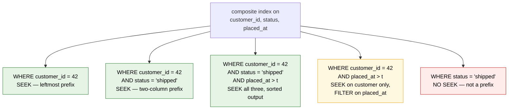
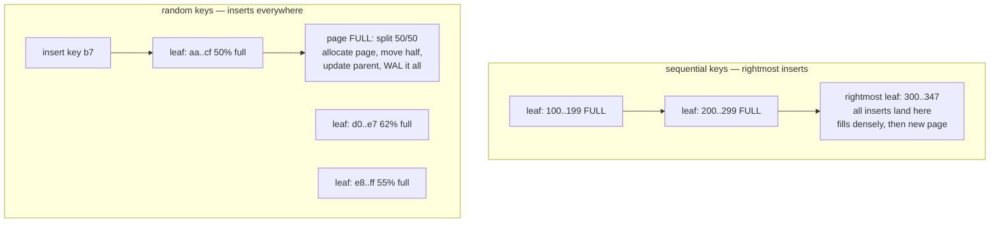
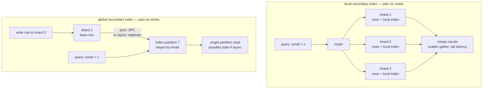

# Chapter 3 — Indexing in Depth

**What this chapter covers.** Chapter 2 built the storage engines — the B+ trees and LSM trees
that hold table data on disk. This chapter is about the structures we layer on top of them to make
queries fast, and about the price we pay for doing so. An index is a redundant, derived copy of
part of your data, maintained in an order the base table does not have, and every one of them
taxes every write to the table forever after. We begin with that accounting, because it is the
frame in which every other decision sits. We then get precise about the two physical models that
dominate practice — InnoDB's clustered primary key, where the row *is* a B+ tree entry, versus
Postgres's heap, where every index is secondary — because the model determines the cost of a
lookup, the cost of an update, and even which primary keys are safe to choose. From there we work
through composite indexes and the leftmost-prefix rule, covering indexes and index-only scans,
selectivity and why the optimizer ignores indexes you were sure it would use, and the full variety
of index types beyond the B-tree: hash, partial, expression, GiST, GIN, BRIN, and bitmap. We then
face the maintenance realities — page splits, MVCC bloat, online index builds and their failure
modes — and close with a method: design indexes from queries, not from tables, and verify with
`EXPLAIN`. The distributed-systems lens examines what happens to secondary indexes when the table
is sharded, which is where indexing stops being a local data-structure problem and becomes a
distributed-consistency problem.

Learning goals — after this chapter you should be able to:

- State precisely what an index is and account for its cost on every `INSERT`, `UPDATE`, and
  `DELETE`, not just its benefit on reads.
- Explain the difference between a clustered index and a secondary index, trace a lookup through
  each, and predict from the model why a fat or random primary key hurts InnoDB in ways it does
  not hurt Postgres.
- Apply the leftmost-prefix rule to decide which predicates a composite index can serve, and order
  columns correctly: equality first, then range, then sort.
- Design covering indexes that serve queries without touching the table, and explain why a
  Postgres index-only scan sometimes still fetches heap pages.
- Choose among B-tree, hash, partial, expression, GiST, GIN, and BRIN indexes based on the query
  shape and data distribution, and explain what a bitmap index scan is doing.
- Build indexes online with `CREATE INDEX CONCURRENTLY`, know its failure modes, and detect the
  invalid indexes it can leave behind.
- Explain why secondary indexes become fundamentally harder under sharding, and compare local
  scatter-gather indexes with global asynchronously-maintained ones — with DynamoDB GSIs as the
  worked example.

## What an index actually is

Strip away the syntax and an index is three things at once:

1. **A redundant copy.** The indexed column values exist twice: once in the table, once in the
   index. Some indexes copy more (a covering index may duplicate half the row); none copy less
   than the key plus a pointer back to the row.
2. **A derived ordering.** The copy is arranged in an order the table does not have — sorted by
   key in a B-tree, hashed into buckets, inverted into posting lists. The ordering is the entire
   point: it converts an O(N) scan into an O(log N) descent, or an O(1) probe, or a merge of
   pre-sorted lists.
3. **A maintained invariant.** The database promises that the copy is consistent with the table
   within the transaction semantics of the engine. That promise is kept by doing extra work on
   every write, inside the same transaction, holding the same locks, generating the same WAL
   (Chapter 7).

The third property is where the accounting lives, and it is the one that engineers who think of
indexes as free speedups forget. Every `INSERT` into a table with five indexes performs six
structure modifications: one heap or clustered-tree insertion, plus five index insertions, each of
which is a B-tree descent, possibly a page split, and always WAL. Every `DELETE` marks entries
dead in every index (immediately or deferred to vacuum, depending on the engine). Every `UPDATE`
is the interesting case: in the worst case it is a delete-plus-insert in every index; in the best
case — an update that touches no indexed column, in an engine with an optimization for that
case — it can skip index maintenance entirely. We will see below that whether you get the best
case or the worst is a property of your physical model and your schema, not of luck.

So the fundamental trade is: **an index spends write throughput, storage, and cache space to buy
read latency.** All three costs are real:

- **Write amplification.** One logical row write becomes 1 + K physical structure writes for K
  indexes touched. On a write-heavy table, index count is often the dominant term in write cost.
- **Space.** Indexes on a heavily-indexed OLTP table routinely exceed the size of the table
  itself. That space is not just disk — it is backup size, replication volume, and restore time.
- **Buffer-pool dilution.** Index pages compete with table pages for the same cache (Volume 1
  treats the memory hierarchy generally; Chapter 2 covered the buffer pool). Ten indexes on a hot
  table mean ten sets of hot internal pages resident in memory. An index that is rarely used still
  evicts pages that would have served real queries.

The corollary is a discipline: **measure before adding, and account for the write side.** An index
is justified by the queries it serves, quantitatively — how often they run, how much they improve —
against the writes it taxes. The end of this chapter shows how to find indexes that lost that
bargain.

One more framing note. This chapter is mostly about B-trees because most indexes are B-trees, but
"index" is broader than "B-tree." The structural details of B+ trees themselves — node layout,
fanout arithmetic, why fanout of a few hundred makes trees three or four levels deep at a billion
keys — are in Chapter 2 and Volume 14. Here we take the structure as given and study how it is
*used*.

## Clustered versus secondary: two physical models

The single most consequential fact about an index is what its leaf entries point at. There are two
mainstream answers, and they produce systems with different performance characteristics, different
failure modes, and different rules for choosing primary keys.

### The clustered model: InnoDB

In InnoDB (MySQL's default engine), the table *is* an index. Rows are stored in the leaf pages of
a B+ tree ordered by primary key — the **clustered index**. There is no separate heap; asking
"where is the row?" and "where is the primary-key entry?" is the same question. If you declare no
primary key, InnoDB uses the first unique non-null index, and failing that generates a hidden
6-byte row ID — so the clustering always happens, with or without your participation.

Every other index on the table is a **secondary index**, and here is the critical design decision:
InnoDB secondary leaf entries do not store a physical row address. They store the row's **primary
key value**. A lookup through a secondary index is therefore *two* B-tree descents: one down the
secondary index to find the PK, then one down the clustered index to find the row. This indirection
is deliberate — because rows move when clustered-index pages split, a physical pointer would need
updating in every secondary index on every split, whereas a logical PK reference never goes stale.

Two practical consequences fall straight out of this design:

- **Fat primary keys inflate every secondary index.** The PK value is stored in every leaf entry
  of every secondary index. A 4-byte integer PK adds 4 bytes per secondary entry; a 36-character
  UUID string adds 36. On a table with six secondary indexes, the difference is paid six times per
  row, in disk, in cache, and in every backup.
- **Primary-key insertion order is a first-class performance concern.** Rows physically live in PK
  order, so *where* new rows land in the tree is determined by the PK you generate — which brings
  us to page splits and the UUID problem, treated in the maintenance section below. The short
  version: monotonically increasing PKs (`AUTO_INCREMENT`, UUIDv7) append to the rightmost leaf
  and pack pages tightly; random PKs (UUIDv4) insert uniformly across the whole tree, splitting
  pages everywhere and dragging the entire tree through the buffer pool.

### The heap model: PostgreSQL

Postgres stores rows in a **heap**: pages of rows in no particular order, addressed by **TID**
(tuple identifier — a page number and a slot within the page, displayed as `(block, offset)`).
Every index, including the one backing the primary key, is a secondary structure whose leaf
entries map key values to TIDs. There is no clustered index; `CLUSTER` physically rewrites the
table in index order once, but nothing maintains that order afterward.

A lookup is one B-tree descent to a TID, then one heap-page fetch — flatter than InnoDB's
double descent, and the PK's width is nobody's business but the PK index's own. But the heap
model interacts with Postgres's MVCC design (Chapter 6) in ways that create its own distinctive
costs, and two of them matter enough to name here.

**HOT updates.** In Postgres, an `UPDATE` never modifies a row in place; it writes a new row
version and leaves the old one for vacuum (Chapter 6). Naively, that means every update must
insert a new entry into *every* index, because the new version has a new TID — even if no indexed
column changed. The **HOT** (heap-only tuple) optimization avoids this: if the update changes no
indexed column *and* the new version fits on the same heap page, the old version simply points to
the new one in a chain within the page, and no index is touched at all. Index scans land on the
chain head and walk to the live version.

HOT is why "just index it, updates are cheap" is false in Postgres in a specific, measurable way:
**indexing a frequently-updated column disqualifies every update to that column from HOT**, which
converts a cheap same-page update into a new-TID update that must insert into every index on the
table — not just the new one. The `n_tup_hot_upd` versus `n_tup_upd` columns of
`pg_stat_user_tables` tell you your HOT ratio; a common operational trick is lowering a hot
table's `fillfactor` so pages retain the free space HOT needs.

**Index-only scans and the visibility map.** If a query needs only columns present in the index,
the engine would like to answer it from the index alone. In Postgres there is a complication:
index entries carry no visibility information — you cannot tell from the index whether a tuple is
visible to your snapshot (Chapter 6). Checking would require fetching the heap tuple, defeating
the purpose. The escape hatch is the **visibility map**, a bitmap with one bit per heap page
meaning "every tuple on this page is visible to all transactions." Vacuum sets the bit; any
subsequent write to the page clears it. An index-only scan consults the map: pages marked
all-visible are skipped entirely; others force a heap fetch for that tuple. This is why `EXPLAIN
ANALYZE` reports `Heap Fetches` for an index-only scan, and why an index-only scan on a
freshly-loaded, never-vacuumed table performs like a plain index scan: the visibility map is
empty until vacuum runs. If you are counting on index-only scans, you are also counting on vacuum
keeping up.


### Which model when

Neither model dominates. Clustering makes PK-range scans superb — `WHERE user_id = ? ORDER BY
created_at` on a PK of `(user_id, created_at)` reads physically contiguous pages, which is why
InnoDB schemas often deliberately design composite PKs around the dominant access path. The heap
model makes secondary lookups one hop shorter, makes PK choice a non-event for storage, and (via
HOT) makes non-indexed-column updates cheap — while paying for MVCC with vacuum and visibility
machinery. SQL Server offers both (clustered and nonclustered indexes on the same table, plus
heaps), and its guidance — narrow, static, ever-increasing clustering keys — is exactly the
guidance the InnoDB analysis above predicts. What you must not do is carry intuitions from one
model to the other unexamined: "UUIDs are fine as PKs" and "adding an index only slows writes to
that column" are each true in one model and false in the other.

## Composite indexes and the leftmost-prefix rule

A composite (multi-column) index on `(a, b, c)` is a B-tree sorted by `a`, then by `b` within
equal `a`, then by `c` within equal `(a, b)` — exactly the ordering of a three-column `ORDER BY`,
or of a phone book sorted by last name, then first name, then street. Everything about which
queries the index can serve follows from that one fact, and it is worth deriving rather than
memorizing, because the derived version handles the cases the memorized rule mangles.

A B-tree can efficiently find the *starting point* of any contiguous range of its sort order and
scan forward. So the question "can this index serve this predicate?" becomes: **does the predicate
describe a contiguous range of the index's sort order?**

Consider `CREATE INDEX ON orders (customer_id, status, placed_at)`:

| Predicate | Contiguous in index order? | What the index can do |
|---|---|---|
| `customer_id = 42` | Yes — one run of entries | Seek, scan the run |
| `customer_id = 42 AND status = 'shipped'` | Yes | Seek deeper, smaller run |
| `customer_id = 42 AND status = 'shipped' AND placed_at > now() - '7 days'` | Yes | Seek on all three, tight run |
| `customer_id = 42 AND placed_at > ...` (no `status`) | No — matching entries are scattered across all statuses within customer 42 | Seek on `customer_id`, scan its whole run, *filter* on `placed_at` |
| `status = 'shipped'` alone | No — scattered across all customers | Cannot seek; useless (barring skip scan, below) |
| `customer_id > 100 AND status = 'shipped'` | No — range on the first column, so `status` order restarts within each customer | Seek to `customer_id = 100`, scan the range, filter on `status` |

Three rules crystallize out of the table:

1. **The leftmost-prefix rule.** The index serves seeks on `(a)`, `(a,b)`, `(a,b,c)` — prefixes —
   not on `(b)`, `(c)`, or `(b,c)`. An index on `(a,b,c)` is a strictly better version of an index
   on `(a)` and largely subsumes `(a,b)`; separate indexes on those prefixes are usually redundant
   (an anti-pattern we return to).
2. **A range predicate stops the seek.** Columns after the first range-compared column can no
   longer narrow the descent; they can only filter entries already being scanned. (Postgres will
   still pass later-column conditions into the index scan as filter conditions — cheaper than heap
   filtering — but the run being scanned is sized by the columns up to and including the range.)
3. **Therefore: equality columns first, then the range column, then sort columns.** For `WHERE
   customer_id = ? AND status = ? AND placed_at > ? ORDER BY placed_at`, the right index is
   `(customer_id, status, placed_at)`: two equality columns narrow the run, and within that run
   entries are already sorted by `placed_at` — the range and the `ORDER BY` are served by the same
   trailing column, and the sort disappears from the plan entirely. Put `placed_at` second and you
   get a larger scan plus a filter; put it first and the index barely helps at all.

The equality/range/sort ordering heuristic resolves most composite-index design questions, but
note the tension it hides: when different queries need different orders, one index cannot serve
both seek shapes, and you must decide whether the second query merits a second index — which is a
write-cost question, not an indexing question.



**Skip scans, briefly.** The "not a prefix, therefore useless" verdict has a qualified exception.
If the leading column has very few distinct values, the engine can iterate over each distinct
value of `a` and perform a seek on `(a, b)` for each — logically rewriting `WHERE b = ?` into "for
each a: WHERE a = :a AND b = ?". Oracle has done this for years as the *index skip scan*; MySQL
8.0 added a skip-scan optimization; PostgreSQL 18 (2025) added B-tree skip scan for omitted
low-cardinality prefix columns. It is a genuine improvement and a poor thing to design around: it
pays one descent per distinct leading value, so it only wins when that cardinality is tiny. Treat
it as a safety net, not a license to put the wrong column first.

## Covering indexes and index-only scans

If the index contains every column a query reads — predicate columns *and* selected columns — the
engine never needs the table at all. That is a **covering index** serving an **index-only scan**
(MySQL calls it "using index" in `EXPLAIN`), and it is the single biggest lever on read-heavy hot
paths, because it eliminates the per-row heap or clustered-index hop, which is where most of the
random I/O in an index lookup lives.

You can cover by widening the key, but key columns cost comparisons on every descent and, past a
point, tree depth. Postgres 11+ and SQL Server offer the cleaner tool: **`INCLUDE` columns**,
stored in leaf entries only, not part of the key, not sorted, not usable for seeking — pure
payload.

```sql
-- The query to serve, thousands of times per second:
--   SELECT order_id, total_cents FROM orders
--   WHERE customer_id = $1 AND status = 'shipped'
--   ORDER BY placed_at DESC LIMIT 20;

CREATE INDEX orders_cust_status_placed_cover
    ON orders (customer_id, status, placed_at)
    INCLUDE (order_id, total_cents);
```

```
Limit  (cost=0.43..26.10 rows=20 width=24)
       (actual time=0.031..0.074 rows=20 loops=1)
  ->  Index Only Scan Backward using orders_cust_status_placed_cover on orders
        (cost=0.43..318.42 rows=248 width=24)
        (actual time=0.030..0.068 rows=20 loops=1)
        Index Cond: ((customer_id = 41972) AND (status = 'shipped'))
        Heap Fetches: 2
        Buffers: shared hit=7
Planning Time: 0.198 ms
Execution Time: 0.096 ms
-- (trimmed)
```

Read the plan: `Index Only Scan Backward` serves both the predicate and the descending sort from
the index; seven buffer hits total; and `Heap Fetches: 2` is the visibility map earning its keep —
two tuples sat on pages not yet marked all-visible and forced heap checks. On a table where vacuum
is behind, that number climbs and the "index-only" scan quietly degrades into an ordinary one.

In InnoDB, remember, every secondary index implicitly includes the primary key columns — so an
index on `(customer_id, status, placed_at)` on a table with PK `order_id` already covers the query
above (minus `total_cents`). Covering design in MySQL means widening the key, and the implicit PK
suffix is part of your budget whether you wanted it or not.

The cost side is the usual one, amplified: an `INCLUDE`d column is one more column whose update
disqualifies HOT and forces index maintenance. Cover the two or three hot queries that dominate
your read traffic; do not cover speculatively.

## Selectivity, cardinality, and why the optimizer ignores your index

An index is only worth using when the predicate is **selective** — when it matches a small
fraction of the table. The reasoning is mechanical, not aesthetic. A secondary-index lookup costs
a descent plus, per matching row, a heap or clustered hop that is effectively a random page read.
A sequential scan costs one pass of sequential reads, which per page is far cheaper. There is a
crossover: match 0.1% of rows and the index wins enormously; match 30% and the index's per-row
random I/O costs more than scanning everything. The optimizer estimates the matched fraction from
statistics — histograms, most-common-value lists, distinct counts (`n_distinct`) — and chooses by
cost. Chapter 4 covers the machinery; what matters here is the design consequence:

**Low-cardinality columns make poor B-tree index keys on their own.** An index on
`status` when 95% of orders are `'delivered'` will be used for `status = 'refunded'` and correctly
ignored for `status = 'delivered'` — and if the statistics are stale, misused for both. Such
columns earn their keep as *leading equality columns of composite indexes* (where they narrow a
run that later columns subdivide) or as *partial-index predicates* (next section), not as
standalone indexes.

A subtler statistic is **correlation**: how closely the index's logical order tracks the heap's
physical order. Postgres tracks this per column (`pg_stats.correlation`). Scanning an index range
over a well-correlated column (say, `created_at` on an append-only table) touches a few contiguous
heap pages; the same range over an uncorrelated column touches a scattered page per row. The
planner costs these very differently, and it is one reason two indexes of identical selectivity
can have wildly different observed value — and the entire premise of BRIN indexes below.

## The index bestiary

The B-tree is the default for a reason: it serves equality, ranges, prefixes, and ordering, all
from one structure. The remaining varieties exist because some query shapes fit it badly.

### Hash indexes

A hash index buckets entries by hash of the key: O(1) equality probes, and *nothing else* — no
ranges, no ordering, no prefixes, because hashing deliberately destroys order. In practice their
niche in general-purpose engines is narrow: Postgres hash indexes have been crash-safe
(WAL-logged) only since Postgres 10 and win over B-trees mainly for equality on long keys, where
storing a 4-byte hash code per entry beats storing the key. The places hashing genuinely dominates
are elsewhere: in-memory stores (Redis's keyspace), hash-organized memory-optimized tables (SQL
Server Hekaton), LSM memtables and their bloom filters (Chapter 2), and InnoDB's *adaptive hash
index* — an automatic in-memory hash layer that InnoDB builds over hot B-tree pages on its own.
Default to B-trees; let the engine hash where hashing helps.

### Partial (filtered) indexes

A partial index indexes only rows matching a predicate:

```sql
-- 97% of rows are soft-deleted history; queries only ever touch live rows.
CREATE INDEX users_live_email ON users (email) WHERE deleted_at IS NULL;

-- Only pending jobs are polled; the queue table is 99% completed rows.
CREATE INDEX jobs_pending ON jobs (queued_at) WHERE state = 'pending';
```

The wins compound: the index is a fraction of the full size (better cache residency, faster
descents), writes to non-matching rows skip it entirely, and it can express things a full index
cannot — `CREATE UNIQUE INDEX ... ON users (email) WHERE deleted_at IS NULL` enforces "one live
account per email" while permitting any number of deleted ones. The planner uses a partial index
only when it can *prove* the query's predicate implies the index's, so keep the predicate simple
and literally matched in queries. Postgres and SQL Server (filtered indexes) support these; MySQL
does not — the closest MySQL idiom is indexing a generated column or accepting a full index. The
soft-delete pattern above is the canonical use, and if your tables carry `deleted_at`, most of
your indexes probably want to be partial.

### Expression (functional) indexes

An index normally stores column values, so `WHERE lower(email) = lower($1)` cannot use a plain
index on `email` — the index is sorted by `email`, not by `lower(email)`, and the function's
output order need not match. This is a systematic trap: **any function or type cast wrapped
around an indexed column in a predicate silently discards the index**, and it appears constantly
in the wild — `lower()` for case-insensitive matching, `date(created_at) = '2026-08-14'`,
implicit casts when a string parameter meets an integer column. Two fixes: rewrite the predicate
to leave the column bare (`created_at >= '2026-08-14' AND created_at < '2026-08-15'`), or index
the expression itself:

```sql
CREATE INDEX users_email_lower ON users (lower(email));
-- Now: WHERE lower(email) = lower($1)   -- matches the indexed expression, uses the index
```

The expression in the query must match the indexed expression as the planner sees it. MySQL 8.0
supports functional index parts directly; before that, the idiom was an indexed generated column.
Postgres additionally gathers statistics on the indexed expression, which can improve estimates
for such predicates.

### GiST and R-tree ideas: multi-dimensional data

B-trees need a total order, and multi-dimensional data has none that respects proximity — sort
points by longitude and nearby latitudes scatter. The R-tree family answers with a tree of
*bounding rectangles*: each node covers a region containing all its children, and a query
descends only into subtrees whose regions intersect the search region. Postgres's **GiST**
(Generalized Search Tree) is a framework generalizing exactly this — the access method supplies
the tree mechanics; an operator class supplies "consistent," "union," and "penalty" functions per
data type — which is how one structure serves PostGIS geometries, range types ("find bookings
overlapping this interval," including exclusion constraints that forbid overlapping rows), and
nearest-neighbor ordering. MySQL implements R-tree `SPATIAL` indexes on geometry columns.

### GIN and inverted indexes: containment

For "which rows *contain* X" — an array element, a JSONB key, a word in a document — the right
structure is inverted: a B-tree of *elements*, each pointing to a **posting list** of the rows
containing it. That is Postgres's **GIN** (Generalized Inverted Index), and it is the standard
index for `jsonb` containment (`@>`), array overlap, and full-text `tsvector` matching:

```sql
CREATE INDEX docs_body_fts ON docs USING gin (to_tsvector('english', body));
CREATE INDEX events_payload ON events USING gin (payload jsonb_path_ops);

-- served: WHERE payload @> '{"type": "refund", "region": "eu"}'
```

The cost profile is distinctive: one row insert updates one posting list *per element the row
contains* — a 40-word document touches ~40 lists — so GIN writes are expensive, and GIN mitigates
this with a *pending list* of recent entries merged in batches (the `fastupdate` option), trading
some lookup work for write throughput. This is a small preview of a large topic: dedicated search
engines are, architecturally, freestanding inverted indexes with their own storage and scoring;
Chapter 13 treats them properly.

### BRIN: block-range indexes

A BRIN index stores, for each *range of table blocks* (128 pages by default), only the min and max
of the indexed column in that range — a few bytes summarizing a megabyte. A query prunes ranges
whose min/max exclude the predicate and scans the survivors. The entire bet is **physical
correlation**: on an append-only events table where `created_at` increases with page number, each
range's min/max window is tight and pruning is near-perfect — a multi-terabyte table indexed in
megabytes, with negligible write cost. On an uncorrelated column, every range's window spans the
whole domain, nothing prunes, and the index is worthless. BRIN is the cheapest index that ever
works and the most workload-dependent: check `pg_stats.correlation` before relying on one, and
remember that updates and deletes erode the correlation BRIN depends on.

### Bitmap indexes and bitmap scans

A **bitmap index** materializes, per distinct value, a bit array with one bit per row. Bitwise
AND/OR across values and columns is extremely fast, which suits analytic queries combining many
low-cardinality predicates; Oracle offers persistent bitmap indexes for exactly that warehouse
niche. The write costs are severe (concurrent OLTP writes on bitmap-indexed columns serialize
badly), so no OLTP-first engine stores them persistently.

Postgres instead builds bitmaps *transiently, at query time*: a **bitmap index scan** walks an
ordinary B-tree and constructs an in-memory bitmap of matching TIDs; `BitmapAnd`/`BitmapOr` nodes
combine bitmaps from *multiple separate indexes*; then a **bitmap heap scan** visits matching heap
pages in physical order — turning scattered random I/O into a sequential-ish sweep. If the bitmap
outgrows `work_mem` it degrades to page granularity (lossy), and the heap scan rechecks the
predicate per row (the `Recheck Cond` line):

```
Bitmap Heap Scan on orders  (cost=41.2..1180.6 rows=312 width=64)
  Recheck Cond: ((status = 'refunded') AND (region = 'eu'))
  Heap Blocks: exact=214
  ->  BitmapAnd  (cost=41.2..41.2 rows=312 width=0)
        ->  Bitmap Index Scan on orders_status_idx
              Index Cond: (status = 'refunded')
        ->  Bitmap Index Scan on orders_region_idx
              Index Cond: (region = 'eu')
-- (trimmed)
```

This is how single-column indexes get combined when no composite index matches — useful, but a
purpose-built composite index still beats it for a hot query, because the bitmap machinery costs
setup time and loses the index's ordering (no cheap `ORDER BY ... LIMIT` from a bitmap).

| Index type | Serves | Refuses | Distinctive cost |
|---|---|---|---|
| B-tree | Equality, range, prefix, ordering | Containment, similarity | The default; per-write descent + possible split |
| Hash | Equality only | Everything else | Niche in disk engines; no ordering ever |
| Partial B-tree | Predicate-matching subset | Rows outside predicate | Near-zero for non-matching writes |
| Expression | Function-wrapped predicates | Bare-column predicates on same data | Function evaluated per write |
| GiST / R-tree | Overlap, containment, nearest-neighbor, ranges | Total-order semantics | Looser structure; heavier maintenance |
| GIN | Element containment, full-text | Ranges over the whole value | One update per contained element; pending list |
| BRIN | Ranges over physically-correlated columns | Anything uncorrelated | Almost free; value collapses without correlation |
| Bitmap (scan) | AND/OR of several indexes | Ordered limited output | Built per-query; lossy past work_mem |

## Maintenance realities

Indexes are not write-once. They are long-lived mutable structures whose health degrades in
predictable ways, and several of the worst production database incidents are index-maintenance
incidents.

### Page splits, fill factor, and the UUID problem

A B-tree page that must accept an entry but has no room **splits**: allocate a new page, move half
the entries, update the parent (which may itself split, recursively). Splits are the mechanism by
which trees grow, and they are fine in moderation; the pathology is in *where* inserts land.

**Sequential keys** — auto-increment IDs, timestamps, UUIDv7 — always insert at the rightmost
leaf. Engines special-case this: rather than wastefully splitting the rightmost page 50/50
(the left half would never receive another insert), they split lopsidedly or just allocate a fresh
page, yielding densely packed pages. Only the right edge of the tree is hot, so the working set
for inserts is a handful of pages.

**Random keys** — UUIDv4, hashes — land uniformly across the entire key space. Every leaf page is
eventually the insertion target, so every leaf page eventually splits 50/50, leaving the tree at
roughly 50–70% page density: the same data occupies up to twice the pages, halving the effective
value of every buffer-pool megabyte. Worse, the insert working set is *the whole tree*: with a
clustered InnoDB PK, that means the whole table must be cache-resident to insert without read
I/O, and a table that outgrows the buffer pool hits a throughput cliff — each insert becomes a
random disk read (to fetch the target leaf) plus dirty-page writeback. This failure mode is
gradual, then sudden, and it has a name in most InnoDB shops: "we used UUIDv4 primary keys."



Mitigations, in order of preference: use sequential keys (**UUIDv7** gives you a time-ordered
prefix with UUID's coordination-free generation — the practical best-of-both since its 2024
standardization in RFC 9562); if random keys are imposed, keep them *out of the InnoDB PK* (make
them a unique secondary; splits then afflict one narrow index, not the table); and tune
**fillfactor** — the fraction of each page filled at build time (Postgres B-tree default 90%,
InnoDB fills ~15/16) — to pre-reserve split headroom, at a permanent density cost. Note the
inversion for the heap model: in Postgres a random UUID PK bloats *one index*, not the table, so
the same choice that is severe in InnoDB is merely wasteful in Postgres.

### Bloat: MVCC's tax on indexes

In MVCC engines (Chapter 6), deleted and updated rows leave dead versions behind, and dead heap
tuples imply dead index entries pointing at them. Postgres indexes shed dead entries in three
ways: opportunistically, when a scan discovers a dead tuple and sets a hint (the `LP_DEAD` "killed
tuple" bit) so future scans skip it; in bulk, when `VACUUM` scans each index and removes entries
for the dead TIDs it collected (often the dominant cost of vacuuming a big table); and
structurally never — **B-tree pages do not merge**. A page emptied by deletes can be recycled
whole, but a tree that once held 500M rows and now holds 50M retains its inflated structure,
half-empty pages and all. That persistent inflation is **bloat**, it degrades cache efficiency
and scan cost, and the fix is a rebuild: `REINDEX CONCURRENTLY` (Postgres 12+) or, in MySQL,
rebuilding via `OPTIMIZE TABLE`/online DDL. Postgres 13's B-tree deduplication and 14's bottom-up
deletion substantially blunted the classic version-churn bloat, but did not repeal it: a
monitoring page for index bloat (via `pgstattuple` or the community bloat queries) belongs in any
serious Postgres operation. High-churn queue tables — small, hot, constantly inserted and
deleted — are the classic worst case, sometimes carrying indexes a hundred times larger than
their live data.

### Building indexes online — and the invalid-index failure mode

A plain `CREATE INDEX` takes a lock that blocks all writes to the table for the duration of the
build — unacceptable on a large production table. **`CREATE INDEX CONCURRENTLY`** (CIC) is the
Postgres answer, and its mechanics explain its failure modes. It builds in phases: register the
index as not-ready so concurrent writes begin maintaining it; scan and build from a snapshot; then
a second pass to insert rows that arrived during the build; with waits in between for every
transaction that might hold an older snapshot to finish. The costs follow directly: roughly two
table scans instead of one, and progress gated on the *oldest running transaction* — a
long-running analytics query or an idle-in-transaction connection stalls CIC indefinitely.

The failure mode every operator learns eventually: **if CIC fails or is cancelled — deadlock,
statement timeout, a unique violation discovered mid-build, an operator's Ctrl-C — it leaves
behind an `INVALID` index.** The invalid index is never used by the planner, but it is *still
maintained by every write*: you keep the entire write tax and receive none of the read benefit,
silently, until someone notices. Check for them (`\d` marks them `INVALID`; programmatically,
`pg_index.indisvalid = false`), then `DROP INDEX` and retry — re-running CIC does not repair the
existing invalid one. MySQL's equivalent story is InnoDB online DDL (`ALGORITHM=INPLACE,
LOCK=NONE`), which logs concurrent DML during the build and applies it at the end; different
mechanics, same theme — online index builds trade doubled work and operational sharp edges for
availability, and you should treat them as long-running migrations with monitoring, not as DDL
that happens to be slow.

### The cost of too many indexes

The failure mode at the portfolio level is accumulation. Indexes are added by many hands over
years — one per incident, one per ORM annotation, one per "just in case" — and almost never
removed, because removal feels risky and benefit is invisible. The compounding costs are the ones
from the opening accounting: write amplification (every write touches every index — twelve
indexes means a single-row insert performs twelve tree descents and up to twelve splits),
buffer-pool dilution (each index's hot pages evict something else's), doubled vacuum work in
Postgres, and — less obviously — **optimizer confusion**: more indexes mean more plans to
consider, more near-tie decisions made on estimated costs, and more opportunities for a plan to
flip to a subtly worse index after a statistics refresh (Chapter 4). Redundant near-duplicates —
`(a)` alongside `(a, b)` alongside `(a) INCLUDE (b)` — are pure waste on the write side and
plan-instability fuel on the read side. Index count is a budget; spend it on evidence.

## Designing indexes from queries, not tables

Everything above converges on one method, and it inverts the way indexes are usually created.
Indexes designed by staring at the schema — "customers will be looked up by email, index email" —
accumulate into the portfolio problem just described. Indexes designed from the *query workload*
stay few and earn their keep. The method:

1. **Extract the access patterns.** From `pg_stat_statements`, MySQL's performance schema
   digests, or your APM: the queries that dominate load or matter for latency, with their real
   predicate shapes, sorts, and limits. Ten queries usually cover the great majority of load.
2. **Design composite keys around the critical predicate + sort.** Per query: equality columns
   first, then the range column, then sort columns; then decide whether covering (INCLUDE or a
   wider key) is worth the write cost for that path. Then *merge*: find the smallest index set
   where one index serves several queries via prefixes, and delete every index another subsumes.
3. **Verify with `EXPLAIN`, then with `EXPLAIN (ANALYZE, BUFFERS)`** — first that the plan uses
   the index as designed (seek, not filter; sort absorbed, not re-sorted), then that the actual
   row counts and buffer touches match the theory. Chapter 4 teaches plan-reading in earnest; the
   two lines that matter here are `Index Cond` (predicates that narrowed the descent — your seek)
   versus `Filter` (predicates applied per-row after the fact — index not helping), and the
   presence or absence of a `Sort` node above the scan.
4. **Audit continuously for unused indexes.** The database counts index usage for you:

```sql
-- Postgres: indexes never or rarely used since stats reset
SELECT schemaname, relname, indexrelname, idx_scan,
       pg_size_pretty(pg_relation_size(indexrelid)) AS size
FROM pg_stat_user_indexes
WHERE idx_scan = 0
ORDER BY pg_relation_size(indexrelid) DESC;

-- MySQL:
-- SELECT * FROM sys.schema_unused_indexes;
```

Before dropping, mind the caveats: stats reset on `pg_stat_reset()` and (before Postgres 15's
persistence improvements) on crash; check replicas, which serve different traffic; and remember
that unique indexes enforcing constraints are load-bearing at zero scans. Postgres 14+ lets you
de-risk the drop entirely: `ALTER INDEX ... NO INHERIT`—no— the safe idiom is marking the index
invisible to the planner first (MySQL 8.0 `ALTER TABLE ... ALTER INDEX ... INVISIBLE`; in
Postgres, no built-in equivalent short of dropping, so rely on scan counts over a long window and
keep the DDL to recreate it).

The anti-patterns to hunt during the audit are the mirror images of the rules: an index per
column ("index everything, let the optimizer sort it out" — it cannot combine them better than a
designed composite, and each one taxes writes); redundant prefixes (`(a)` next to `(a,b)`);
indexes on low-cardinality columns alone; expression-blind indexes that no production predicate
can ever match; and the unused residue of queries that no longer exist.

## The distributed-systems lens: indexes meet sharding

Everything so far assumed the index and the table live on the same node, maintained in the same
transaction, by the same engine. Shard the table (Chapter 9) and that assumption breaks, because
an index is *an alternative ordering of the data* — and a table can only be physically
partitioned by one key. Rows are placed by the shard key; a secondary index is precisely a query
path that ignores the shard key. Something has to give, and there are exactly two places to put
the pain.

**Local secondary indexes** (per-shard): each shard indexes its own rows. Writes stay
single-shard — row and index entries co-located, one local transaction, no coordination — but a
query on the indexed column alone cannot know which shards hold matches, so it must
**scatter-gather**: query every shard, merge the results. Read cost scales with shard count, not
result size; tail latency is the max over N shards (Volume 6 treats this amplification); and a
`LIMIT 20 ORDER BY` must fetch candidates from every shard to merge. This is the model of most
sharded SQL deployments and of Cassandra's native secondary indexes — and it is why Cassandra's
documentation warns against them for high-cardinality columns on large clusters.

**Global secondary indexes** (partitioned by the *indexed* value): the index is itself a
distributed table, sharded by indexed column. Reads become single-shard again — a targeted lookup
lands on exactly the index partition holding the value. The pain moves to writes: a row on shard
3 whose indexed value maps to index partition 7 requires a **cross-node write**. Keep it
synchronous and you have bought a distributed transaction — two-phase commit on every base-table
write (Chapter 10). Make it asynchronous and the index is maintained eventually, meaning it can
return stale or phantom results.



**DynamoDB's GSIs are the canonical async design, and worth describing precisely.** A DynamoDB
global secondary index is a separate physical table with its own partition (and optional sort)
key and its own provisioned throughput. Writes to the base table are replicated to each GSI
*asynchronously*; consequently GSI queries support only eventually consistent reads — the
strongly-consistent read option that exists for base tables and for *local* secondary indexes is
not offered on GSIs, because there is no moment when the GSI is guaranteed current. A GSI can
briefly miss a row just written, or return one just deleted (queries fetch non-projected
attributes from the base item, so a dangling GSI entry resolves against the source of truth).
And the coupling runs backward too: if a GSI has insufficient write capacity, *base-table writes
are throttled* — the async index can backpressure the table it indexes. DynamoDB's LSIs make the
opposite choice: same partition key as the base table, hence co-located, hence synchronously
maintained and strongly-consistent-readable — at the price of only re-sorting within a partition
and a 10 GB cap per partition-key value. The two features are the two branches of the design
space, shipped side by side.

Two broader patterns complete the lens. First, **a search system is an externalized global
secondary index**: Elasticsearch or OpenSearch alongside your OLTP database is exactly the
async-GSI architecture with the index in a different engine — fed by CDC or an outbox (Volume 10,
Chapter 6, for why dual-writing without one loses updates), eventually consistent by
construction, and subject to the same read-your-own-writes surprises as any async index
(Chapter 13 covers search engines themselves). Second, **index locality explains NoSQL's design
constraints**. Cassandra's data-modeling doctrine — model tables per query, denormalize, repeat
the data — is what you get when a system refuses global indexes and distrusts scatter-gather:
every query must be answerable within one partition, so you build one hand-maintained
"materialized index" (a table) per access path, and application code or materialized views take
over the maintenance job the database's indexing subsystem does in a single-node SQL engine. The
constraint is not arbitrary; it is the cost accounting of this chapter, applied at cluster scale.

## Key takeaways

- An index is a **redundant, ordered, derived copy** whose consistency is maintained on every
  write. Its benefit accrues to specific queries; its cost — write amplification, space,
  buffer-pool dilution — accrues to every write and every cache miss, forever. Measure both sides.
- **Clustered (InnoDB) vs heap (Postgres) is the load-bearing distinction.** InnoDB: rows live in
  the PK B+ tree, secondaries store PK values (double descent, fat PKs inflate every index), PK
  insertion order determines table-wide split behavior. Postgres: all indexes point at heap TIDs;
  HOT makes non-indexed-column updates cheap and indexing a hot column disqualifies them;
  index-only scans depend on vacuum maintaining the visibility map.
- **Composite indexes serve leftmost prefixes**; a range predicate ends the seek; therefore order
  columns **equality, then range, then sort**. Skip scans soften the prefix rule only for tiny
  leading cardinalities.
- **Covering indexes eliminate the heap/clustered hop** — the biggest read lever — via `INCLUDE`
  or a wider key; every included column widens the write tax and narrows HOT eligibility.
- The optimizer uses an index only when the predicate is **selective enough** to beat a scan;
  low-cardinality columns belong in composites or partial-index predicates, not standalone
  indexes. Physical **correlation** decides between B-tree range-scan efficiency and BRIN
  viability.
- Beyond B-trees: **hash** for pure equality (mostly in-memory), **partial** for hot subsets
  (soft deletes, queues), **expression** for function-wrapped predicates (which otherwise
  silently miss plain indexes), **GiST/R-tree** for spatial and ranges, **GIN** for containment
  via posting lists, **BRIN** for huge physically-ordered tables, **bitmap scans** to combine
  single-column indexes at query time.
- Maintenance is where indexes hurt: **random keys split pages everywhere** (UUIDv4 in a
  clustered PK is the classic self-inflicted wound; UUIDv7 fixes it), **MVCC leaves dead entries**
  that vacuum must prune and only REINDEX truly compacts, and **CREATE INDEX CONCURRENTLY can
  fail into an INVALID index** that taxes writes while serving nothing.
- **Design from queries, not tables**: extract real access patterns, build the minimal composite
  set, verify seeks with `EXPLAIN`, and audit `pg_stat_user_indexes` / `sys.schema_unused_indexes`
  for indexes that lost the bargain.
- Under sharding, secondary indexes force a choice: **local indexes make reads scatter-gather;
  global indexes make writes distributed** — synchronous (2PC) or asynchronous (eventual
  consistency, as in DynamoDB GSIs, which can also backpressure base writes). Search clusters are
  externalized global indexes; Cassandra's query-driven modeling is this trade-off adopted as
  doctrine.

## Further reading

- PostgreSQL documentation, Chapter 11 "Indexes" — index types, partial and expression indexes,
  index-only scans and the visibility map, `CREATE INDEX CONCURRENTLY` and its recovery notes.
  <https://www.postgresql.org/docs/current/indexes.html>
- MySQL 8.4 Reference Manual, "InnoDB Index Types" and "How MySQL Uses Indexes" — clustered index
  behavior, secondary indexes storing PK values, multiple-column indexes and leftmost prefixes.
  <https://dev.mysql.com/doc/refman/8.4/en/innodb-index-types.html>
- Winand, M., *SQL Performance Explained* / *Use The Index, Luke!* — the best sustained treatment
  of index design from the query's point of view, across Oracle, SQL Server, Postgres, and MySQL.
  <https://use-the-index-luke.com/>
- Graefe, G., "Modern B-Tree Techniques," *Foundations and Trends in Databases* 3(4), 2011 — the
  comprehensive survey: page structure, splits, fence keys, online index building, maintenance.
- Amazon DynamoDB Developer Guide, "Using Global Secondary Indexes" — the authoritative statement
  of GSI eventual consistency, projections, and throughput coupling with the base table.
  <https://docs.aws.amazon.com/amazondynamodb/latest/developerguide/GSI.html>
- PostgreSQL documentation, "GIN Indexes" and "BRIN Indexes" internals chapters — posting trees,
  the pending list, block-range summarization.
  <https://www.postgresql.org/docs/current/gin.html>
- Davoudian, A., Chen, L., and Liu, M., "A Survey on NoSQL Stores," *ACM Computing Surveys* 50(2),
  2018 — context for secondary-index strategies across distributed stores.
- RFC 9562, "Universally Unique IDentifiers" (2024) — UUIDv7 and the time-ordered layout that
  makes UUIDs index-friendly. <https://www.rfc-editor.org/rfc/rfc9562>
- Chapter 2 — Storage Engines — B+ tree and LSM mechanics beneath everything here; Chapter 4 —
  Query Processing and Optimization — how the planner costs and chooses among these indexes;
  Chapter 6 — Isolation and MVCC — the versioning machinery behind HOT, vacuum, and the
  visibility map; Chapter 9 — Partitioning and Sharding — the placement decisions that make
  secondary indexes hard.
