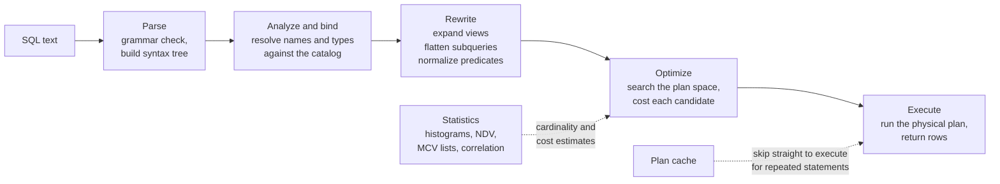
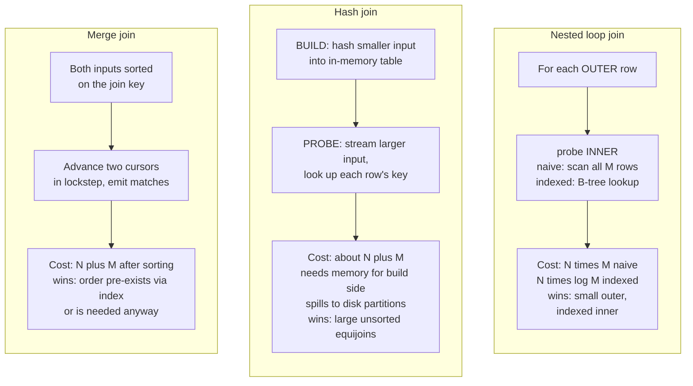
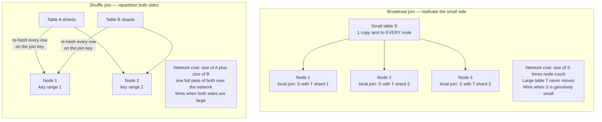

# Chapter 4 — Query Processing and Optimization

**What this chapter covers.** Chapters 1 through 3 gave you the declarative surface (the
relational model and SQL), the physical substrate (B-trees and LSM-trees), and the access
structures (indexes). This chapter covers the machinery in between: how a database turns the
sentence you wrote into the program it actually runs. That machinery is a compiler with an unusual
property — it must choose among semantically equivalent programs whose runtimes differ by factors
of a thousand or more, and it must choose using *guesses* about your data. We walk the pipeline
from parse through rewrite to plan search, dissect the physical operators (scans, the three join
algorithms, aggregation, sorting) with their cost profiles, and then confront the honest truth of
the field: cost-based optimization works remarkably well most of the time and fails
catastrophically some of the time, and the failures are almost always cardinality-estimation
failures. Because of that, the most valuable skill this chapter teaches is not theory — it is
reading `EXPLAIN ANALYZE` output, finding the node where estimated rows diverged from actual rows,
and knowing the ranked list of fixes. Examples are PostgreSQL-flavored because its planner is
open, well-documented, and representative; the concepts transfer directly to MySQL, SQL Server,
and Oracle, and — as the closing section shows — to distributed engines, where the same estimation
errors get amplified by network data movement.

Learning goals — after this chapter you should be able to:

- Trace a query through parse → rewrite → optimize → execute, and say what each stage is
  responsible for and what can go wrong in it.
- Explain why a sequential scan beats an index scan above a surprisingly low selectivity
  fraction, in terms of random versus sequential I/O.
- Describe the mechanics and cost profiles of nested-loop, hash, and merge joins, and predict
  which one an optimizer should pick for a given input shape.
- Explain the Volcano iterator model, identify blocking operators, and say why vectorized and
  JIT-compiled execution exist.
- Describe what statistics an optimizer keeps (histograms, NDV, MCVs, correlation), how the
  independence assumption breaks cardinality estimates on correlated predicates, and how errors
  compound up a plan tree.
- Diagnose a bad plan from `EXPLAIN ANALYZE` by comparing estimated to actual rows, and apply
  fixes in the right order: statistics first, indexes second, rewrites third, hints last.
- Explain parameter sniffing, why plan caching makes it inevitable, and the standard mitigations.
- Extend all of the above to distributed engines: pushdown, broadcast versus shuffle joins, and
  why misestimates that cost milliseconds on one node cost minutes across a cluster.

## The pipeline: from text to executable plan

Every mature SQL engine processes a query in the same four stages. The names vary by vendor; the
structure does not.



**Parse** is ordinary compiler front-end work: tokenize, check the grammar, build a syntax tree.
The only decisions here are syntactic. Binding (PostgreSQL calls this *analysis*) then resolves
every name against the catalog — which table is `orders`, what type is `created_at`, does the
user have permission — producing a fully typed query tree. Errors up to this point are cheap and
deterministic; nothing interesting has happened yet.

**Rewrite** is where semantics-preserving transformations begin, and it matters more than its
obscurity suggests. Three families dominate:

- *View expansion.* A reference to a view is replaced by the view's definition, inline. This is
  why a query over a view can be optimized as a whole — the planner sees one big tree, not an
  opaque call. It is also why stacking five views on top of each other can produce a query tree
  the optimizer struggles with: each layer looked innocent alone.
- *Subquery flattening and decorrelation.* `WHERE x IN (SELECT …)` becomes a semi-join;
  `EXISTS` becomes a semi-join; a scalar subquery in the select list may become an outer join. A
  **correlated** subquery — one that references the outer row — naively means re-executing the
  subquery once per outer row, which is a nested loop in disguise. Decorrelation transforms it
  into an ordinary join that the optimizer can then reorder and implement however it likes. When
  the rewriter *cannot* decorrelate (and every engine has constructs it gives up on), you get the
  classic per-row-subquery plan, and the fix is to decorrelate by hand — we return to this in the
  tuning section.
- *Predicate normalization.* Push predicates toward the tables they constrain (so filtering
  happens before joining, not after), derive implied predicates through equivalence classes
  (`a.id = b.id AND a.id = 5` implies `b.id = 5`), fold constants, simplify boolean structure.

The output of rewrite is still a *logical* query — relational algebra, in the sense of Chapter 1:
a tree of selects, projects, joins, and aggregates that says *what* to compute with no commitment
to *how*.

**Optimize** turns that logical tree into a physical plan: a specific join order, a specific
algorithm for each join, a specific access path for each table, specific placements of sorts and
aggregates. This is a search over a space that Chapter 1's algebra makes precise — joins commute
and associate, so an n-way join has a number of orderings that grows factorially, and each
ordering multiplies by the choices of join algorithm and access path. The optimizer navigates
this space with cost estimates, and the bulk of this chapter is about how that goes right and
wrong.

**Execute** runs the winning plan. The executor is where the physical operators live, so we start
there — you cannot judge an optimizer's choices until you know what it is choosing between.

## Physical operators

### Access paths: how to read one table

For a single table with a filter, the executor has a small menu, and the interesting question is
the crossover between the options.

A **sequential scan** reads every page of the table (its heap, in PostgreSQL terms) front to
back, applying the filter to each row. It does the maximum number of page reads — but every one
of them is sequential I/O, which the storage stack rewards heavily: read-ahead in the kernel and
the drive, large request sizes, no seek or flash-translation overhead per page (Volume 1,
Chapter 5). A sequential scan's cost is honest and flat: proportional to the table size,
regardless of how many rows match.

An **index scan** walks a B-tree (Chapter 3) to the first matching key, then follows matching
entries, fetching the corresponding heap page for each row to get the remaining columns and — in
MVCC systems — to check visibility. Each of those heap fetches is potentially a *random* page
read, and matching rows are scattered across the heap unless the table happens to be physically
ordered by the indexed column. This is the crux: **an index scan does fewer page reads, but a
worse kind.**

The crossover follows directly. If the filter matches 0.1% of a large table, the index scan
touches a few thousand scattered pages while the sequential scan reads millions; the index wins
enormously. If the filter matches 20% of the table, the index scan may touch nearly *every* heap
page anyway — in random order, possibly more than once — while the sequential scan reads each
page exactly once, in order, with read-ahead. The sequential scan wins, often by a large margin.
The break-even point is workload- and hardware-dependent, but it is far lower than intuition
suggests: on spinning disks the rule of thumb was that an index stops paying above roughly 1–5%
selectivity for large tables; on SSDs the gap between random and sequential reads narrowed but
did not close (and per-page CPU and buffer-management costs remain), so sequential scans still
win at moderate selectivities. When you see a sequential scan in a plan, the correct first
reaction is not "missing index" — it is "the planner believes a large fraction of this table
qualifies." Sometimes that belief is wrong, which is a statistics problem; often it is right, and
the seq scan is the fastest available plan.

Two refinements fill the middle ground:

- An **index-only scan** answers the query from the index alone, never visiting the heap, when
  every referenced column is in the index (a *covering* index, Chapter 3). In PostgreSQL this has
  a catch: index entries carry no visibility information, so the executor consults the
  *visibility map* and must still fetch heap pages for any page not marked all-visible. An
  index-only scan on a heavily updated, under-vacuumed table silently degrades into an ordinary
  index scan — `EXPLAIN ANALYZE` exposes this as a high `Heap Fetches` count.
- A **bitmap scan** splits the difference. A bitmap *index* scan walks the index and collects
  matching row locations into an in-memory bitmap; a bitmap *heap* scan then sorts those
  locations and visits the heap pages **in physical order**, each page once. You pay index
  traversal plus one pass over just the relevant pages, in sequential-ish order — the right tool
  for the awkward 1–20% selectivity band. Bitmaps also compose: the executor can AND and OR the
  bitmaps of several single-column indexes to serve a multi-column predicate without a dedicated
  compound index. If the bitmap outgrows `work_mem` it degrades to one bit per *page* rather than
  per row ("lossy" in the plan output), and the filter is rechecked on each fetched page.

| Access path | I/O pattern | Wins when |
|---|---|---|
| Sequential scan | All pages, sequential | Large fraction of rows qualifies; small tables |
| Index scan | Few index pages + scattered heap pages, random | Tiny fraction qualifies; correlated physical order |
| Index-only scan | Index pages only (if visibility map allows) | Covering index; well-vacuumed table |
| Bitmap scan | Index pages + relevant heap pages in physical order | Moderate selectivity; combining multiple indexes |

### Join algorithms: the big three

Every relational engine implements essentially three join algorithms. Each has a shape of input
for which it is clearly best, which is precisely why the optimizer's choice — driven by row-count
estimates — matters so much.



**Nested loop join** is the simplest and, in its naive form, the worst: for each of N outer rows,
scan all M inner rows — O(N·M), which at 10⁵ × 10⁵ is 10¹⁰ comparisons and a query that never
comes back. The redeemed form is the **indexed nested loop**: for each outer row, probe an index
on the inner table's join key — O(N · log M). For a *small* outer input this is unbeatable: five
outer rows means five index lookups, microseconds of work, no setup cost, and the first output
row appears almost immediately. The entire hazard of the nested loop is that its cost is linear
in the outer cardinality, so it is exquisitely sensitive to the optimizer's estimate of N. A plan
built on "N will be about 40" that meets N = 800,000 at runtime performs 800,000 index probes —
the single most common way a misestimate becomes an incident, and the centerpiece of our
`EXPLAIN` walk-through below. (PostgreSQL 14+ can interpose a **memoize** node that caches inner
lookups by key, which softens — but does not repair — this failure when the outer side has many
duplicate keys.)

**Hash join** handles the case nested loops cannot: two large inputs, no useful indexes, an
equality join condition. It runs in two phases. The **build** phase reads the smaller input once
and builds an in-memory hash table keyed on the join columns. The **probe** phase streams the
larger input once, hashing each row's key and checking the table. Total cost is roughly one pass
over each input — O(N + M) — which is asymptotically as good as a join can be. The costs are in
the fine print. First, the build side must fit in the operator's memory budget (`work_mem` per
node in PostgreSQL; a *memory grant* negotiated at plan time in SQL Server — itself computed from
cardinality estimates, so a misestimate here means either a wasteful over-grant or a spilling
under-grant). Second, when the build side does not fit, the join **spills**: both inputs are
hash-partitioned into batches on disk such that each build partition fits in memory, and the join
runs partition by partition. This is **Grace hash join** (from the GRACE database machine
project, Kitsuregawa et al., 1983); the *hybrid* variant keeps the first partition in memory to
save I/O. A spilling hash join still completes in near-linear time, but with an extra write and
read of both inputs — visible in plans as `Batches: 16` (PostgreSQL) or hash spill warnings (SQL
Server), and one of the first things to look for when a formerly fast query slows down as data
grows. Third, hash joins require equality predicates; they cannot serve `<` or range conditions.

**Merge join** requires both inputs sorted on the join key, then advances two cursors in
lockstep, emitting matches — one pass over each input, O(N + M), with mark-and-restore rewinds
when duplicate keys appear on both sides. Sorting two large inputs just to merge-join them
rarely beats a hash join, so merge join wins when the order is *free or wanted*: an index scan
already delivers rows in key order; the input is the output of a previous sort; or the query's
`ORDER BY`/`GROUP BY` needs that order anyway, letting one sort serve two purposes. Merge join
also handles some non-equality band conditions and degrades more gracefully than hash join at
very large scale, which is why analytics engines love sort orders (Chapter 13).

| | Nested loop (indexed) | Hash join | Merge join |
|---|---|---|---|
| Asymptotic cost | O(N log M) | O(N + M) | O(N + M) after sorting |
| Setup cost | None | Build hash table | Sort inputs (unless pre-sorted) |
| Memory | Tiny | Build side (spills via partitioning) | Sort space (spills to disk) |
| Join conditions | Any (index permitting) | Equality only | Equality and bands |
| First row latency | Immediate | After build completes | After sorts complete |
| Sweet spot | Small outer, indexed inner | Large unsorted equijoin | Order pre-exists or is needed |
| Failure mode | Outer misestimated small | Build side misestimated small → spill/OOM | Pointless sorts |

### Aggregation and sorting

Grouped aggregation mirrors the join dichotomy. **Hash aggregation** builds a hash table keyed on
the grouping columns, updating each group's running state as rows stream in — one pass, no order
required, but memory proportional to the number of *groups* (another quantity the optimizer must
estimate: NDV again). **Sorted aggregation** (`GroupAggregate`) requires input ordered by the
grouping columns and emits each group as it completes — trivial memory, and free if the order
pre-exists from an index or a merge join. The estimation dependence has real teeth: before
PostgreSQL 13, hash aggregation could not spill, so the planner refused it when it *estimated*
the groups would exceed `work_mem` — and when it estimated wrong in the other direction, the
executor blew through the budget and could take the process into out-of-memory territory. Modern
PostgreSQL spills hash aggregation to disk like a hash join, converting the failure from an OOM
into a slowdown.

Sorting itself is the executor's other memory-hungry operation. In-memory sorts use quicksort (or
a top-N heapsort when a `LIMIT` bounds the output — the plan says `Sort Method: top-N heapsort`,
and it is dramatically cheaper because it never materializes the full ordering). When the input
exceeds `work_mem`, the executor switches to **external merge sort**: produce sorted runs the
size of memory, write them to temporary files, then merge the runs — the classic external-memory
algorithm, analyzed properly in Volume 14, Chapter 6. The plan output is explicit about it:

```
Sort Method: external merge  Disk: 138880kB
```

That line — a sort that wrote 135 MB of temporary file — is one of the highest-value strings to
grep for in a slow query's plan. The fix is usually one of: raise `work_mem` (cautiously — it is
a *per-operation* budget, and a busy server runs many operations), add an index that provides the
order, or reduce the sorted row width by projecting fewer columns before the sort.

### Pipelining, materialization, and the Volcano model

How do these operators compose into a running plan? The answer in nearly every row-store since
the early 1990s is the **iterator model**, canonized by Goetz Graefe's Volcano system: every
operator implements `open()` / `next()` / `close()`, and each `next()` call returns one tuple,
pulled from the operator's children by calling *their* `next()`. The plan tree executes by the
root pulling from its children, demand propagating down to the scans.

The model's virtue is composability and **pipelining**: a filter over a scan processes one row at
a time with no intermediate storage; rows flow from disk to client touching each operator once. A
`LIMIT 10` at the root pulls exactly as much work as ten output rows require, then stops.

But not every operator can pipeline. A sort cannot emit its first row until it has consumed its
*last* input row; the build phase of a hash join must complete before probing begins; an explicit
`Materialize` node buffers its input for rescanning. These **blocking** (pipeline-breaking)
operators partition the plan into pipeline stages, and they are where memory is consumed and
where spills happen — which is why they are where your eyes should go first in a plan.

The iterator model's vice is per-tuple overhead: one or more virtual function calls per row per
operator, catastrophic branch misprediction, poor cache locality — tolerable when queries were
I/O-bound, painful now that analytical scans run from memory. Two modern answers, both previewed
here and developed in Chapter 13: **vectorized execution** (MonetDB/X100 lineage; DuckDB,
ClickHouse, and most analytics engines) keeps the pull-based structure but passes *batches* of a
few thousand column values per call, amortizing interpretation overhead and enabling SIMD
(Volume 1, Chapter 7); and **JIT compilation** (HyPer lineage; Neumann's 2011 paper) compiles the
plan — or, in PostgreSQL's more modest implementation, expression evaluation within it — to
native code, eliminating interpretation entirely. For OLTP row stores the tuple-at-a-time model
remains defensible; for scanning billions of rows it is not, which is a large part of why the
OLTP/OLAP engine split (Chapter 13) exists.

## Cost-based optimization

The executor gives the optimizer a menu; statistics and a cost model let it price the menu. The
architecture every mainstream optimizer descends from is Selinger et al.'s 1979 System R paper:
estimate the cardinality of each intermediate result from statistics, cost each physical
alternative from those cardinalities, search join orders with dynamic programming, keep the
cheapest. Forty-five years of refinement have improved every component — and left the weak point
exactly where it was.

### Statistics: what the optimizer knows

Statistics are collected by a background or manual sampling pass (`ANALYZE` in PostgreSQL, which
samples 300 × `default_statistics_target` rows — 30,000 at the default target of 100). Per
column, the standard inventory is:

- **NDV** (number of distinct values, `n_distinct`): drives equality selectivity — with no
  better information, `col = ?` is assumed to match 1/NDV of the rows — and group-count
  estimates for aggregation. Estimating NDV from a sample is provably hard, and it is routinely
  wrong on skewed data; PostgreSQL lets you override it per column when you know better.
- **MCV list** (most common values): the top values with their measured frequencies. This is the
  defense against skew — `status = 'shipped'` uses the *measured* frequency of `'shipped'` if it
  is in the list, rather than the 1/NDV fiction.
- **Histogram**: equi-depth bucket boundaries over the non-MCV values, driving range selectivity
  (`created_at >= …` matches the fraction of buckets past the cutoff).
- **Correlation**: the correlation between a column's values and the physical row order. This
  feeds the *cost* model, not cardinality: an index range scan over a column with correlation
  near 1.0 (say, an append-ordered timestamp) fetches heap pages nearly sequentially and is
  cheap; the same scan at correlation near 0 is a random-I/O storm.
- **Null fraction** and average width, for completeness of arithmetic and memory estimates.

Multiply these per-column numbers together up the tree and you get every cardinality in the plan.
Which brings us to the load-bearing problem.

### Cardinality estimation: the weak point

Here is the claim this chapter most wants you to retain: **when a plan is bad, it is almost
always because a cardinality estimate was bad** — not the cost model, not the search algorithm.
This is not folklore; it is the measured conclusion of Leis et al.'s "How Good Are Query
Optimizers, Really?" (VLDB 2015), which evaluated the estimators of several production systems on
a real-world dataset (IMDB) and found join-size estimates off by orders of magnitude as a routine
occurrence, growing worse with each additional join — and found that feeding *true* cardinalities
into the same optimizers fixed most bad plans, while improving the cost model without fixing
cardinalities helped little.

The root cause is the **independence assumption**. Given `WHERE a = 1 AND b = 2`, the optimizer
knows sel(a = 1) and sel(b = 2) individually and — knowing nothing about their joint
distribution — multiplies them. If the predicates are correlated, the product can be wrong by the
full strength of the correlation. The canonical example: `city = 'San Francisco' AND state =
'CA'`. Suppose each predicate individually matches 1% of an addresses table. Independence says
the conjunction matches 0.01%. In reality every San Francisco row is a California row, so the
true answer is 1% — a 100× underestimate, from two innocent-looking filters. Real schemas are
full of these: warehouse and region, product and category, status and terminal-timestamp
(`status = 'completed' AND completed_at IS NOT NULL` — near-perfectly correlated, estimated as
independent).

Joins make it worse, twice over. First, join selectivity estimation is intrinsically harder than
filter estimation — the standard formula for an equijoin (|N × M| / max(NDV_n, NDV_m)) assumes
uniformity and containment of key domains, both fragile. Second, and more damaging, **errors
compound multiplicatively up the plan tree**: the output estimate of one join is the input
estimate of the next, so a 20× error at the bottom becomes 400× two joins later. This is why
optimizer misbehavior is disproportionately a many-join phenomenon, and why the estimates at the
*leaves* of a plan deserve your scrutiny first — an error there poisons everything above it.

And the plan consequences are discontinuous. Recall the join table above: the indexed nested loop
is optimal at N = 40 and catastrophic at N = 800,000. A cardinality error does not make the
chosen plan proportionally slower — it makes the optimizer *choose a different plan*, on the
wrong side of a cliff. This is the anatomy of the classic incident, "why did it pick a nested
loop for 10 million rows": correlated predicates → underestimate at a scan → nested loop chosen
for a "tiny" outer → millions of inner index probes → a query that ran in 200 ms yesterday runs
in 20 minutes today, with no code change, because last night's data crossed a statistics
boundary.

Partial fixes exist and you should use them. **Extended (multi-column) statistics** let you tell
the collector which column combinations to measure jointly — PostgreSQL's `CREATE STATISTICS`
supports functional-dependency coefficients, multi-column NDV, and multi-column MCV lists;
SQL Server creates multi-column statistics with compound indexes and by hand; Oracle has column
groups. These repair the specific correlations you name, at the cost of knowing in advance which
ones matter. They do not generalize: the space of possible column combinations is combinatorial,
join-crossing correlations (between columns of *different* tables) remain largely uncovered, and
so estimation remains, honestly, the open wound of the field — which current research attacks
with runtime feedback and learned models, none of it yet standard equipment.

### The cost model

Given cardinalities, costing is arithmetic. PostgreSQL's model is representative and usefully
transparent: a plan's cost is a unitless sum of page fetches and CPU work —
`seq_page_cost` (1.0 by reference definition) per sequential page, `random_page_cost` per random
page, `cpu_tuple_cost` (0.01) per row processed, plus smaller terms for index entries and
operator evaluations. The single most consequential knob is **`random_page_cost`**, the ratio of
random to sequential page cost. Its default of 4.0 encodes a disk-era compromise (raw spinning
disks were more like 40× worse; caching pulled the effective ratio down). On SSD and NVMe
storage, and on databases whose working set is mostly cached, the honest value is near 1.1 — and
running the default 4.0 on flash systematically biases the planner *against* index scans and
toward sequential scans. Lowering it on SSD-backed systems is one of the few configuration
changes that reliably improves plan quality across a whole workload. The broader lesson from
Leis et al. applies, though: cost-model tuning is second-order. A perfect cost model fed 400×-off
cardinalities produces garbage with more decimal places.

### Searching the plan space

Join ordering is the combinatorial heart of the search. The logical algebra of Chapter 1 says
joins commute and associate; the number of orderings of an n-way join grows factorially (and the
shape choice — left-deep chains versus bushy trees — multiplies it further). Selinger's answer,
still the backbone: **dynamic programming** over subsets — compute the best plan for every pair
of relations, then every triple reusing the pairs, upward until the full set is planned, pruning
dominated alternatives at each level while retaining plans with useful "interesting orders"
(sort orders a later merge join or ORDER BY could exploit). This finds the optimal order — with
respect to the estimates — at exponential-in-n cost, fine for the 5–10 table joins of typical
OLTP.

Past a threshold, exhaustive search is unaffordable, and engines switch to heuristics.
PostgreSQL's cutover is explicit: at `geqo_threshold` (default 12) tables, the planner abandons
dynamic programming for **GEQO**, a genetic algorithm that evolves a population of join orders —
faster to plan, no optimality claim, and (unless seeded deterministically) capable of producing
*different plans for the same query on different days*, which is exactly the kind of
nondeterminism that makes 15-way-join reporting queries erratically slow. Related knobs
(`join_collapse_limit`, `from_collapse_limit`, default 8) bound how many relations the planner
will even consider reordering — which, read from the other side, means explicit `JOIN` syntax
order *becomes* the join order beyond that limit: a blunt but sometimes deliberate way to pin an
order. The deeper point: a query joining 15 tables is not just linearly harder to plan than one
joining 5 — it is exponentially harder, *and* its estimates are compounded-ly worse. Very wide
joins are a design smell worth fixing upstream.

### Plan caching and parameter sniffing

Planning costs milliseconds; an OLTP system executing the same statement thousands of times per
second cannot re-plan every execution. So plans are cached — per prepared statement in
PostgreSQL, in a shared plan cache keyed by statement text in SQL Server and Oracle. And caching
creates a new failure class with a memorable name.

A cached plan must serve *all* future parameter values, but it was chosen by looking at *some*
value. **Parameter sniffing** (SQL Server's term; Oracle calls the mechanism bind peeking) is
that look: optimize the statement using the first execution's actual parameters. Usually this is
strictly better than optimizing blind. But consider `WHERE customer_id = $1` on a skewed
distribution — most customers have a handful of orders, one aggregator account has four million.
Sniff a small customer and you cache an indexed nested-loop plan that is perfect for millions of
executions — until the aggregator arrives and the plan runs four million index probes. Sniff the
aggregator first and you cache a hash-join-with-scan plan that makes every small-customer lookup
do a table scan. Neither plan is wrong for the value it was built for; the *cache* is wrong to
assume one plan fits all values. This is a certified production-incident classic, with a
signature worth memorizing: a query is fast for weeks, then instantly and persistently slow after
a restart, failover, or cache eviction re-sniffed it with an unlucky first parameter — "it got
slow and `DBCC FREEPROCCACHE` / re-preparing fixed it" is parameter sniffing until proven
otherwise.

PostgreSQL's variant is more polite but the same disease: a prepared statement's first five
executions use custom per-parameter plans; the planner then compares their average cost to a
**generic plan** (built with selectivity defaults instead of actual values) and, if the generic
plan looks no worse *by estimated cost*, locks it in from execution six onward. When the generic
estimate is optimistic, the symptom is uncanny: the statement runs fast exactly five times, then
degrades. `plan_cache_mode = force_custom_plan` is the escape hatch.

Mitigations, in rough order of preference: **re-plan the sensitive statements** (SQL Server
`OPTION (RECOMPILE)`, PostgreSQL custom-plan mode — paying planning cost per execution to buy
plan correctness); **plan invalidation and variability tooling** (Oracle's adaptive cursor
sharing marks statements bind-sensitive and keeps multiple plans; SQL Server 2022's Parameter
Sensitive Plan optimization caches per-band plans); **forced plans** (Query Store plan forcing,
plan baselines) to pin the known-good plan; and schema-level fixes — sometimes the honest answer
is that one logical query serves two different workloads and should be two queries.

## Reading plans: EXPLAIN and EXPLAIN ANALYZE

Everything so far becomes practical through one skill: reading a plan, and specifically reading
the *divergence between estimated and actual rows*. `EXPLAIN` shows the plan with estimates;
`EXPLAIN ANALYZE` executes the query and annotates every node with what actually happened. The
diagnostic method is one sentence: **walk the tree bottom-up, find the deepest node where
estimated rows and actual rows diverge badly — that node is where the plan went wrong, and
everything above it is collateral damage.**

A worked example. Schema: `orders` (50M rows), `customers` (2M rows), `order_items` (200M rows).
The query: last 30 days of shipped orders from warehouse 9, revenue by customer region.

```sql
SELECT c.region,
       count(DISTINCT o.id)      AS orders,
       sum(oi.qty * oi.unit_price) AS revenue
FROM   orders o
JOIN   customers   c  ON c.id = o.customer_id
JOIN   order_items oi ON oi.order_id = o.id
WHERE  o.status = 'shipped'
  AND  o.warehouse_id = 9
  AND  o.created_at >= now() - interval '30 days'
GROUP  BY c.region;
```

The trap is baked in: warehouse 9 is the high-volume fulfillment center, so `status = 'shipped'`
and `warehouse_id = 9` are strongly correlated. Individually, `shipped` matches ~20% of orders
and `warehouse_id = 9` matches ~2%; independence predicts 0.4%, but nearly everything warehouse 9
touches gets shipped, so the true joint fraction is closer to 2%. The `EXPLAIN ANALYZE` output,
trimmed to the fields that matter:

```
 HashAggregate  (cost=91427.18..91427.24 rows=6 width=48)
                (actual time=712140.63..712140.66 rows=6 loops=1)
   Group Key: c.region
   ->  Nested Loop  (cost=1.14..91302.55 rows=4982 width=26)
                    (actual time=4.11..708341.02 rows=3945648 loops=1)
         ->  Nested Loop  (cost=0.57..38214.90 rows=1246 width=22)
                          (actual time=0.35..14872.89 rows=986412 loops=1)
               ->  Index Scan using orders_created_at_idx on orders o
                     (cost=0.44..29655.17 rows=1246 width=18)
                     (actual time=0.29..9531.44 rows=986412 loops=1)
                     Index Cond: (created_at >= (now() - '30 days'::interval))
                     Filter: ((status = 'shipped') AND (warehouse_id = 9))
                     Rows Removed by Filter: 2113588
               ->  Index Scan using customers_pkey on customers c
                     (cost=0.13..6.87 rows=1 width=12)
                     (actual time=0.004..0.004 rows=1 loops=986412)
         ->  Index Scan using order_items_order_id_idx on order_items oi
               (cost=0.57..41.12 rows=4 width=16)
               (actual time=0.42..0.70 rows=4 loops=986412)
 Planning Time: 1.9 ms
 Execution Time: 712302.51 ms
```

Read it bottom-up:

1. **The scan on `orders` is the crime scene.** Estimated `rows=1246`, actual `rows=986412` — a
   **792× underestimate**, and the `Filter` line tells you why: the correlated pair
   `status/warehouse_id` was multiplied as independent. Everything else in this plan is a
   *rational response to a wrong number*.
2. **The join choices were correct for the estimate.** For 1,246 outer rows, two indexed nested
   loops are exactly right — cheap probes, no setup. For 986,412 outer rows they mean roughly two
   million index probes (`loops=986412` on *both* inner scans — always multiply an inner node's
   cost by its `loops`). The per-probe times look innocent (0.004 ms, 0.70 ms); the multiplication
   is the disaster: 986,412 × 0.70 ms ≈ 690 s, which is the query.
3. **The estimate error propagated upward**: the top join estimated 4,982 rows, actual 3.9
   million — the leaf error times four items per order, compounding exactly as the theory said.

The fix is not an index — every scan here already uses one. The fix is the estimate:

```sql
CREATE STATISTICS orders_wh_status (dependencies, mcv)
  ON status, warehouse_id FROM orders;
ANALYZE orders;
```

Re-planned with a truthful ~980k-row estimate, the planner does what you would do by hand:

```
 Finalize HashAggregate  (rows=6) (actual time=8912.44..8912.47 rows=6 loops=1)
   ->  Gather  (workers launched: 4)
     ->  Partial HashAggregate
       ->  Parallel Hash Join  (hash cond: oi.order_id = o.id)
             (est rows=1004890) (actual rows=789130 loops=5)
             ->  Parallel Seq Scan on order_items oi
             ->  Parallel Hash  (build: orders join customers, 986412 rows)
 Execution Time: 8944.07 ms
```

Hash joins, parallel scans, 712 seconds down to 9. Same data, same indexes, same SQL — one
repaired statistic.

### The ranked fix list

When a plan is wrong, apply remedies in this order — cheapest and most durable first:

1. **Refresh or strengthen statistics.** Run `ANALYZE` (autovacuum's analyze can lag on
   fast-growing or recently bulk-loaded tables — stale statistics after a big import is the most
   boring and most common cause of bad plans). Raise the per-column statistics target where
   histograms or MCV lists are too coarse for skew. Add extended statistics for correlated
   predicate pairs, as above.
2. **Fix the indexing.** Add the missing index the plan is compensating for; make a hot index
   covering to unlock index-only scans; and remove the self-inflicted wounds from Chapter 3 —
   a function wrapped around a column (`WHERE date_trunc('day', created_at) = …`, `WHERE
   lower(email) = …`) defeats both the index *and* the statistics on that column, so rewrite the
   predicate as a range or create the matching expression index (expression indexes get their own
   statistics, repairing estimation too).
3. **Rewrite the query.** Decorrelate the subqueries the rewriter could not: turn a per-row
   scalar subquery into a `LEFT JOIN` on a grouped derived table, or use a lateral join
   deliberately. Split `OR`s across different columns into a `UNION` of two indexable branches —
   `WHERE a = 1 OR b = 2` cannot use single-column indexes as one predicate, but the union of two
   single-predicate queries can (bitmap-OR handles some of these automatically; not all). Break a
   15-way join into temp-table stages so estimation errors cannot compound end to end.
4. **Hints, last.** PostgreSQL core famously refuses them (`pg_hint_plan` exists as an
   extension); SQL Server, Oracle, and MySQL embrace them. Use a hint when a plan must be
   stabilized *now*; then treat it as technical debt. A hint encodes today's data shape into the
   query text — silently wrong when the data grows, invisible to the optimizer's improvements
   after an upgrade, and scattered across a codebase where nobody re-audits it. Prefer the
   engine's managed pinning machinery (next section) to ad-hoc hint sprinkling.

## What the optimizer cannot see — and stability versus optimality

Two limits are worth stating plainly, because they shape production practice.

**The optimizer's world ends at the statement boundary.** It cannot see application semantics:
that you will iterate the cursor and stop after the first row anyway (tell it — `LIMIT`), that
this "one query" is actually executed in an N+1 loop by an ORM and should be a join, that two
queries run back-to-back and the second could reuse the first's work, that the parameter is
always the current tenant and never the aggregator. It optimizes each statement in isolation
against a statistical sketch of the data. Every fix in the previous section is, at bottom, a way
of telling the optimizer something true that it could not know.

**Optimality and stability are different goals, and production often wants the second.** The
optimizer re-decides on every planning event: after an `ANALYZE` shifts a boundary, after an
upgrade changes costing, after a failover empties the cache. Each re-decision is a chance to find
a better plan — and a chance to regress a critical query at 3 a.m. with no code change. A plan
that is 20% worse than optimal but *always the same* is, for a hot OLTP path, often the better
engineering choice; the cliff-edge discontinuity of plan choices means "slightly different
estimate" can mean "50× slower plan". Hence **plan pinning** as a production discipline:
SQL Server's Query Store records plan history per query and lets you force a known-good plan;
Oracle's SQL Plan Baselines only admit *verified* new plans; and even in PostgreSQL —
philosophically committed to re-planning — prepared-statement generic plans and
`plan_cache_mode` are a crude form of the same trade. The cost of pinning is symmetrical: a
pinned plan is a hint with better bookkeeping, and it too rots as data grows. Pin deliberately,
record why, and revisit.

## The distributed-systems lens: optimization when data has a location

Everything above assumed the data is on one machine. Distributed SQL engines — the NewSQL
systems of Chapter 12, the analytics engines of Chapter 13 (Trino, Spark SQL, BigQuery), sharded
PostgreSQL via Citus — keep the entire pipeline and add one new decision dimension: **where**.
Every operator now has a location, every edge between operators potentially crosses the network,
and data movement joins I/O and CPU as a first-class cost term — usually the *dominant* one.

The new decisions:

- **Pushdown.** Execute predicates, projections, and partial aggregations on the nodes that hold
  the data, so what crosses the network is the filtered, projected, pre-aggregated residue rather
  than raw rows. A `count(*) GROUP BY region` over 64 shards should move 64 small partial-result
  sets, not 200 million rows; the coordinator merges partial aggregates (note the
  `Partial`/`Finalize` aggregate split in the parallel plan above — single-node parallelism and
  distribution use the same decomposition, a **scatter-gather aggregation tree**).
- **Distribution strategy for joins.** When the join's two inputs are not partitioned on the join
  key, rows must move, and there are two ways to move them:



  A **broadcast** join replicates the smaller input to every node holding the larger one; cost is
  |S| × number of nodes, and the big table never moves. A **shuffle** (repartition) join re-hashes
  *both* inputs on the join key so matching rows land on the same node; cost is |A| + |B| crossing
  the network once. The choice is a cardinality-driven threshold — and that should make you
  nervous, because you now know what cardinality estimates are worth.

- **Misestimate amplification.** On one node, underestimating a "small" input by 100× costs you a
  spilling hash join — minutes. In a distributed plan, the same underestimate makes the engine
  *broadcast* a table that is not actually small: 100× the expected bytes, multiplied by the node
  count, pushed through the network and into every worker's memory simultaneously — the classic
  cluster-wide incident where one query's bad broadcast decision inflicts memory pressure and
  network saturation on every other query's workers. (This failure is common enough that engines
  grew guardrails: broadcast size caps, and Spark's adaptive query execution, which re-plans the
  join strategy mid-query using the *observed* size of the completed stage — runtime feedback
  standing in for estimates, exactly the research direction single-node optimizers are slower to
  adopt.) Join-order errors amplify the same way: a wrong order that materializes a huge
  intermediate result now materializes it *across the network*.

- **The same reading skill applies.** Distributed `EXPLAIN` output arrives as a tree of
  **fragments** or **stages** (Trino fragments, Spark stages, Citus per-shard subplans) connected
  by exchange operators — and the method is unchanged: find the exchange moving orders of
  magnitude more bytes than estimated, find the leaf estimate that caused it, fix the estimate or
  the partitioning. The vocabulary is new; the diagnosis is this chapter's.

The deep continuity: distribution does not change what query optimization *is* — it raises the
stakes on the same weak point. The cost cliff between good and bad plans gets taller (network
bytes dwarf local I/O the way random I/O dwarfs CPU), while the estimates driving the choice get
no better. That is why every serious distributed engine invests in pushdown (shrink data before
it moves), co-located partitioning (Chapter 9 — make the shuffle unnecessary), and runtime
adaptivity (stop trusting estimates once real numbers exist).

## Key takeaways

- **The pipeline is parse → rewrite → optimize → execute.** Rewrite does semantics-preserving
  surgery (view expansion, subquery decorrelation, predicate pushdown); optimization searches the
  physical plan space of the relational algebra from Chapter 1; execution runs Volcano-style
  iterators.
- **Sequential scans win more often than intuition says.** Index scans buy fewer page reads at
  the price of random I/O; above single-digit-percent selectivity on large tables, reading
  everything sequentially is often cheaper. Bitmap scans and index-only scans fill the middle.
- **Three join algorithms, three sweet spots.** Indexed nested loop for a small outer with an
  indexed inner; hash join for large unsorted equijoins (build/probe, spilling by Grace
  partitioning when the build side exceeds memory); merge join when sort order pre-exists or is
  needed anyway. The optimizer's choice among them sits on cost cliffs driven entirely by row
  estimates.
- **Blocking operators — sorts, hash builds — are where memory lives and spills happen.** Grep
  plans for external sorts and multi-batch hashes. Vectorized execution and JIT compilation are
  the modern answers to the iterator model's per-tuple overhead.
- **Cardinality estimation is the weak point — the Leis et al. result.** The independence
  assumption multiplies selectivities of correlated predicates into order-of-magnitude errors,
  and errors compound multiplicatively up the join tree. Bad plans are almost never cost-model
  failures; they are estimate failures. Extended statistics repair the correlations you name.
- **Read plans bottom-up, hunting estimate-versus-actual divergence.** The deepest badly wrong
  node is the cause; everything above is consequence. Multiply inner-node times by `loops`. The
  792×-underestimated scan that chose a million-probe nested loop is the canonical incident.
- **Fixes in order: statistics, indexes, rewrites, hints.** ANALYZE and extended statistics
  first; covering/expression indexes and unwrapping function-mangled predicates second;
  decorrelation and OR→UNION rewrites third; hints last, as recorded technical debt.
- **Plan caching trades correctness-per-parameter for planning cost — parameter sniffing is the
  bill.** A plan sniffed for one parameter can be catastrophic for another; mitigate with
  recompilation, adaptive plan machinery, or managed plan forcing. In production, plan
  *stability* is often worth more than plan optimality.
- **Distribution adds "where" to every decision and amplifies every misestimate.** Pushdown
  shrinks data before it moves; broadcast versus shuffle is a cardinality-driven choice whose
  failure mode — broadcasting a "small" table that isn't — takes down clusters, not queries. The
  same EXPLAIN-reading skill applies to fragments and stages.

## Further reading

- Selinger, P. G., Astrahan, M. M., Chamberlin, D. D., Lorie, R. A., and Price, T. G., "Access
  Path Selection in a Relational Database Management System," *SIGMOD*, 1979 — the System R
  paper: statistics, cost estimation, and dynamic-programming join enumeration; the ancestor of
  every optimizer discussed here. <https://dl.acm.org/doi/10.1145/582095.582099>
- Graefe, G., "Volcano — An Extensible and Parallel Query Evaluation System," *IEEE Transactions
  on Knowledge and Data Engineering* 6(1), 1994 — the iterator model canonized. His survey "Query
  Evaluation Techniques for Large Databases," *ACM Computing Surveys* 25(2), 1993, remains the
  most complete treatment of the physical operators in this chapter.
- Leis, V., Gubichev, A., Mirchev, A., Boncz, P., Kemper, A., and Neumann, T., "How Good Are
  Query Optimizers, Really?", *PVLDB* 9(3), 2015 — the empirical demonstration that cardinality
  estimation, not cost modeling or search, is where plans go wrong.
  <https://www.vldb.org/pvldb/vol9/p204-leis.pdf>
- Neumann, T., "Efficiently Compiling Efficient Query Plans for Modern Hardware," *PVLDB* 4(9),
  2011 — the HyPer JIT-compilation paper. Boncz, P., Zukowski, M., and Nes, N., "MonetDB/X100:
  Hyper-Pipelining Query Execution," *CIDR*, 2005 — the vectorized-execution counterpart.
- Kitsuregawa, M., Tanaka, H., and Moto-Oka, T., "Application of Hash to Data Base Machine and
  Its Architecture," *New Generation Computing* 1(1), 1983 — Grace hash join.
- PostgreSQL documentation: "Using EXPLAIN," "Planner Statistics" (including extended statistics
  via `CREATE STATISTICS`), "Genetic Query Optimizer," and the `runtime-config-query` planner
  cost constants. <https://www.postgresql.org/docs/current/using-explain.html>
- Lahdenmäki, T. and Leach, M., *Relational Database Index Design and the Optimizers* (Wiley,
  2005) — the practitioner's treatment of access-path economics, complementing Chapter 3.
- Volume 5, Chapter 2 — Storage Engines — the random-versus-sequential I/O economics beneath the
  access-path crossover; Chapter 3 — Indexing — covering indexes, expression indexes, and the
  predicates that defeat them; Chapter 12 — NewSQL — distributed planning in full.
- Volume 14, Chapter 6 — external merge sort, analyzed properly.
- Volume 1, Chapter 5 — Storage Hardware — why `random_page_cost` exists and how SSDs changed it.
