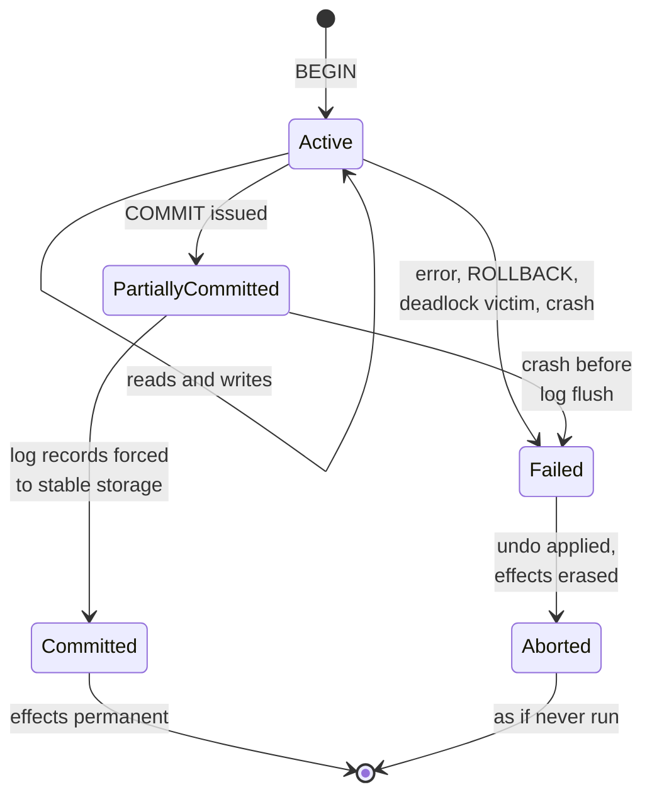
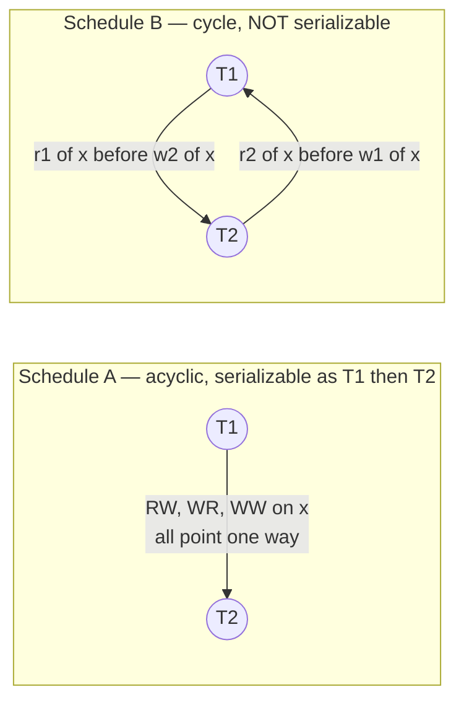
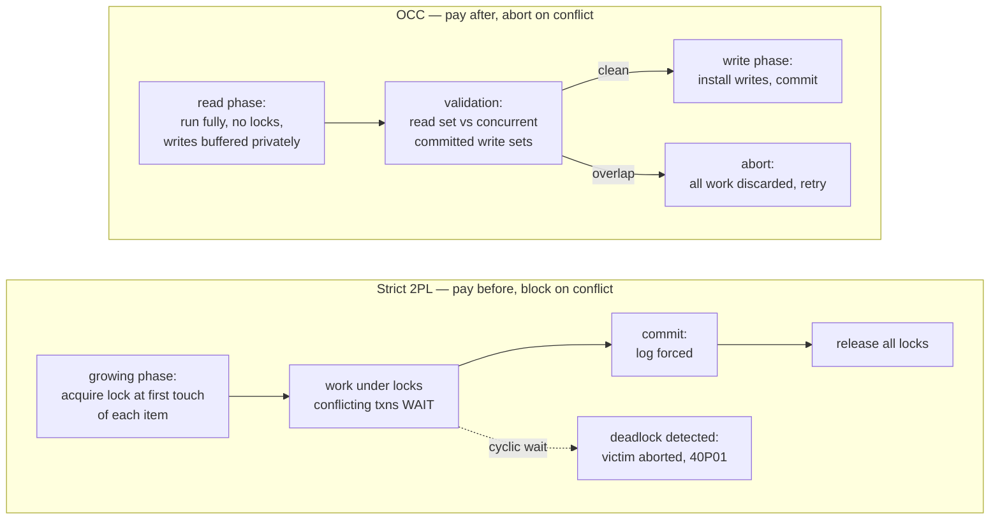
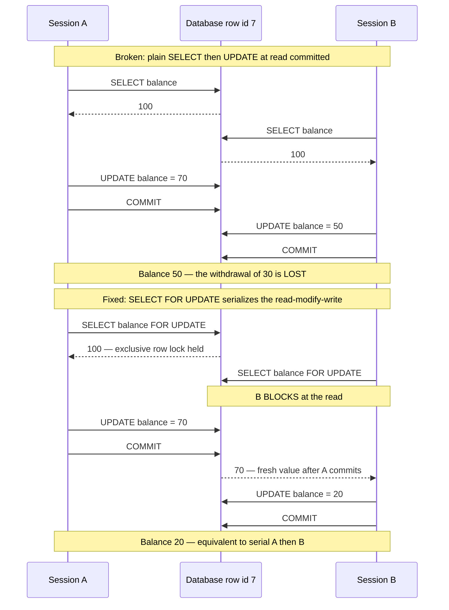
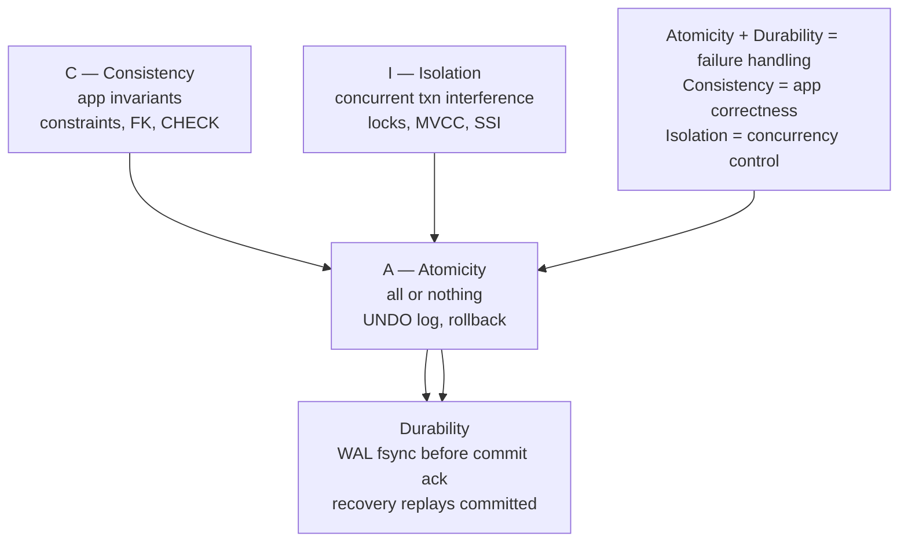
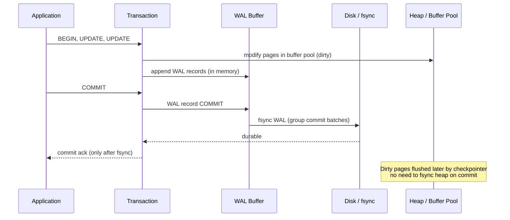
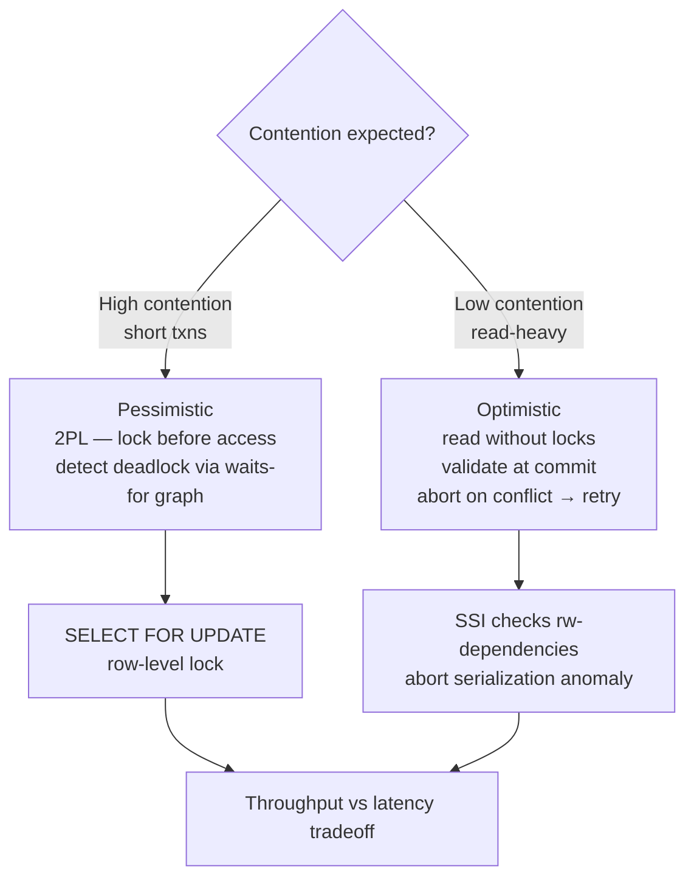

# Chapter 5 — Transactions and ACID

**What this chapter covers.** The previous four chapters treated the database as a machine for
storing and finding data. This chapter is about the machine's central promise: the **transaction**,
the unit within which your application may pretend the world is simple. Inside a transaction, your
code reasons as if it were the only client and as if failure did not exist; the engine absorbs the
interleaving of hundreds of concurrent clients and the possibility of a crash at any instruction.
This is the same bargain Volume 4, Chapter 3 called DRF-SC — adopt a discipline, and you may reason
with the naive sequential model — offered one layer up, and it is arguably the single most valuable
abstraction in systems software.

We define ACID precisely, and spend as much effort un-teaching folklore as teaching the substance:
atomicity is about failure, not concurrency; consistency is not a database property at all in the
sense the other three are; isolation's gold standard — serializability — has a precise definition
that most engineers misremember. We then make serializability theory practical: schedules,
conflicts, and the precedence-graph test you can run on paper. We tour the anomaly zoo that weaker
isolation admits, survey the three concurrency-control families (two-phase locking, optimistic
concurrency, and multiversion concurrency), and then get pragmatic: how to scope transactions, how
to retry them, how to avoid the read-modify-write trap, and how long-running transactions quietly
poison an MVCC system. Chapter 6 takes isolation levels and MVCC internals to full depth; Chapter 7
does the same for logging and recovery. This chapter is the frame both of those hang on.

Learning goals — after this chapter you should be able to:

- Explain what the transaction abstraction actually buys an application, and state its parallel to
  the DRF-SC bargain of Volume 4, Chapter 3.
- Define each ACID property precisely, including what atomicity is *not* about, why consistency is
  the odd one out, and what the durability spectrum really promises at each setting.
- Define serializability correctly — equivalence to *some* serial order — and test a schedule for
  conflict-serializability with a precedence graph.
- Recognize the standard anomalies — dirty read, dirty write, non-repeatable read, phantom, lost
  update, write skew — from symptoms in production.
- Compare strict 2PL, OCC, and MVCC: what each blocks, what each aborts, and where each wins.
- Write application code that uses transactions well: tight scope, correct retry on 40001/40P01,
  `FOR UPDATE` where it is needed, savepoints where they help.
- Explain why the transaction boundary becomes a design decision the moment data spans services,
  and what the outbox pattern and sagas are compensating for.

## The transaction: the abstraction that lets you reason sequentially

A transaction is a group of reads and writes that the database promises to execute as a unit:
either all of its effects become durable, or none of them do, and while it runs, other transactions
do not interfere with it. The application states *what* must happen together; the engine handles
*everything else* — the interleaving of concurrent clients, the buffer pool page that was half
flushed when the power failed, the replica that was mid-apply, the operating system that lied about
`write()` reaching the platter.

Consider what your code would have to do without this. A transfer between two account rows is two
`UPDATE`s. Without transactions, a crash between them leaves money destroyed or created; a
concurrent reader between them observes a state that never logically existed; two concurrent
transfers touching the same account can interleave their read-modify-write cycles and silently lose
one. Every application would carry its own crash-recovery protocol and its own concurrency-control
protocol, and Volume 4 spent ten chapters showing how reliably engineers get the second of those
wrong even with the full toolbox in hand.

The transaction removes both problems by contract. Volume 4, Chapter 3 closed with the observation
that **serializable transactions are the database's DRF-SC**, and it is worth spelling the parallel
out, because it is exact:

| DRF-SC (shared memory) | Transactions (databases) |
|---|---|
| Discipline: order all conflicting accesses with synchronization | Discipline: put related reads/writes inside one transaction |
| Reward: every execution is sequentially consistent | Reward: every execution is equivalent to some serial order |
| You may reason with naive interleaving semantics | You may reason as if transactions ran one at a time |
| Violate it: reordering, stale reads, "impossible" states | Weaken it: the anomaly zoo of this chapter |
| The compiler/CPU may reorder freely underneath | The engine may interleave freely underneath |

Both bargains have the same fine print, too. DRF-SC holds only if you actually synchronize;
the transaction bargain holds at full strength only at the **serializable** isolation level, and —
as Chapter 6 will show in detail — most databases do not run there by default. PostgreSQL defaults
to read committed; MySQL/InnoDB to repeatable read; both admit anomalies that serializability
forbids. The engineer who "uses transactions" and assumes serial reasoning is in exactly the
position of the engineer who uses threads and assumes sequential consistency: right most of the
time, wrong under load, and wrong in ways that look like impossible states.

One more framing point before ACID. The transaction is the database's unit of *three* different
things at once: the unit of **atomicity** (all-or-nothing under failure), the unit of **isolation**
(the granularity at which concurrency is hidden), and — as we will argue in the application
sections — the natural unit of **retry and idempotency**. Keeping those three roles aligned is most
of what "using transactions well" means.

## ACID, precisely

The acronym comes from Theo Härder and Andreas Reuter's 1983 survey "Principles of
Transaction-Oriented Database Recovery," which packaged concepts Jim Gray and colleagues had
developed at IBM System R through the 1970s. The four letters are not four parallel guarantees —
two are about failure, one is about concurrency, and one is a statement about your application —
and collapsing them into a vague aura of "safety" is the root of most transaction folklore. Take
them one at a time.

### Atomicity: all or nothing — under *failure*

Atomicity says: either every write of the transaction takes effect, or none does. If the
transaction aborts — because your code issued `ROLLBACK`, because a constraint fired, because the
engine chose it as a deadlock victim, or because the server lost power mid-flight — the database
ends up as if the transaction had never started.

The most common misreading is that atomicity is about concurrency — that "atomic" means other
transactions can't observe the intermediate state. It does not. Whether others can see your
uncommitted writes is an **isolation** question. Atomicity in the ACID sense is entirely about
**abort and crash**: the guarantee that partial effects can always be erased. A better name, as
Kleppmann and others have suggested, would be *abortability*.

The mechanism is **undo**. The engine must be able to reverse every write of an uncommitted
transaction: via a rollback log or undo segments (InnoDB, Oracle), or — the MVCC variant Postgres
uses — by never updating in place at all, so that "undo" is simply marking the new row versions as
belonging to an aborted transaction and letting visibility rules ignore them. After a crash, the
recovery procedure must finish the job for every transaction that was in flight: redo the committed
work, undo the uncommitted. Chapter 7 — WAL and Crash Recovery — is the full treatment of that
machinery (write-ahead logging, ARIES, and Postgres's redo-only variant); here it is enough to know
that atomicity is a *recovery* property with a *logging* mechanism.

Atomicity is also what makes abort a **feature** rather than a failure mode. Because the engine can
always erase a transaction cleanly, it is free to abort transactions as a concurrency-control
tactic — deadlock victims, serialization-failure losers, OCC validation failures all lean on it.
And your application gets the same power: a transaction that throws an exception halfway through
leaves nothing behind to clean up. That guarantee is precisely what makes the retry loops later in
this chapter safe to write.

### Consistency: the odd one out

Härder and Reuter's C says: a transaction, run alone against a consistent database, produces a
consistent database — where "consistent" means "all integrity constraints hold." Read that
carefully: it is a property of the *transaction's program logic*, i.e., of your application. If
your transfer procedure debits 30 and credits 50, the database will atomically, durably, in
isolation, execute your bug. The engine cannot know that money should be conserved unless you tell
it.

So consistency is not a guarantee the engine makes the way it makes A, I, and D. It is the
*conclusion* of an inductive argument in which A, I, and D are the machinery: **if** each
transaction individually preserves the invariants (your obligation), **then** atomicity ensures no
half-applied transaction breaks them, isolation ensures no interleaving breaks them (serial
equivalence means you only need to reason about transactions running alone — exactly the
precondition of the C definition), and durability ensures a crash does not silently revert to a
state your logic never produced. A + I + D turn per-transaction correctness into whole-database
correctness. That is the actual content of the C, and it is why several authors have observed,
only half-jokingly, that it is in the acronym mostly to make the acronym work.

The database's genuine contribution to consistency is **declared constraints**: primary keys,
foreign keys, `UNIQUE`, `NOT NULL`, `CHECK`, exclusion constraints. These move a class of
invariants from "every code path must remember" to "the engine refuses to violate," and a senior
engineer should push as many invariants as possible into that form — a constraint is an invariant
enforced against every writer, including tomorrow's batch job and next year's second service.
But most business invariants ("an account's balance never goes below its credit limit minus pending
holds," "every published article has at least one reviewer approval") are not expressible as row-
or table-level constraints, and for those the C is entirely on you. Note the term collision, and
keep the concepts apart: this C has nothing to do with *replica consistency* in the CAP sense
(Volume 6) or *memory consistency* (Volume 4). Three fields, three unrelated meanings, one
overloaded word.

### Isolation: the freedom to ignore concurrency

Isolation says: concurrent transactions do not interfere — each behaves as if it were alone. The
precise gold standard is **serializability**:

> An execution of a set of transactions is *serializable* if its outcome — the final database
> state and the values every read returned — is equal to the outcome of *some* serial execution of
> those same transactions, one at a time in some order.

Two details in that definition do the work. First, **some** order, not a specific one: the engine
may pick any serial order it likes, including one that differs from wall-clock arrival order. If
that surprises you, you are thinking of *strict serializability* (serializability plus real-time
ordering), which single-node databases running serializable mode do in practice give you, and
which becomes an expensive, separate guarantee in distributed databases (Volume 6). Second,
serializable does **not** mean serial. The engine's entire job is to interleave transactions as
aggressively as possible while preserving equivalence to a serial order — concurrency is the point;
serializability is the constraint on it. The next section makes "equivalent" precise.

Serializability at full strength costs performance, so the SQL standard defines weaker isolation
levels — read uncommitted, read committed, repeatable read — that permit specific anomalies in
exchange for less blocking or aborting, and real engines add snapshot isolation, which the standard
never anticipated. That entire topic — what each level actually guarantees in each engine, which
is emphatically not what the standard's table implies — is Chapter 6. This chapter needs only the
frame: isolation is a *spectrum*, serializability is its top, and everything below the top is a
negotiated exposure to the anomalies cataloged below.

### Durability: committed means survives

Durability says: once the database acknowledges `COMMIT`, the transaction's effects survive a
crash — process kill, kernel panic, power loss. The mechanism is the **write-ahead log** plus
`fsync`: before acknowledging, the engine appends the transaction's log records to the WAL and
forces them to stable storage; the data pages themselves can be flushed lazily, because after a
crash the log replays the lost work. Chapter 7 covers the mechanics (and the ugly corners, like
`fsync` error reporting and disks that lie about their write caches). What belongs here is the
**durability spectrum**, because it is a knob you will actually be asked to set, and each position
should be described honestly:

| Setting | On commit | Crash risk | Honest description |
|---|---|---|---|
| `fsync`-per-commit (PG `synchronous_commit=on`, InnoDB `innodb_flush_log_at_trx_commit=1`) | WAL forced to disk before ack | None (single node) | The default. Commit latency includes a device flush. |
| Group commit | One flush amortized over many commits | None | Concurrent commits share a single `fsync`; throughput scales without weakening the guarantee. Free lunch — this is why default durability is affordable under load. |
| PG `synchronous_commit=off` | Ack immediately; WAL flushed in background (~every 200 ms) | Lose up to a few hundred ms of *acknowledged* commits | No corruption, no partial transactions — atomicity and ordering survive; recently acknowledged work may vanish as a unit. Legitimate for data you can afford to lose (metrics, sessions); indefensible for money. Settable per-transaction, which is the right way to use it. |
| InnoDB `innodb_flush_log_at_trx_commit=2` | Write to OS cache; flush per second | Lose ~1 s on OS/power crash; nothing on process crash | Similar honest trade, coarser knob. |
| `fsync=off` (PG) | Never force | **Corruption** on crash | Not a durability trade — a correctness forfeit. The recovery protocol's assumptions are void. Test rigs only. |

The spectrum extends upward, too: `synchronous_commit=remote_write/on/remote_apply` in Postgres
makes commit wait for replication, buying durability against whole-node loss at the price of a
network round trip — Chapter 8's territory. The engineering point is that "durable" is not a
boolean; it is a question — *durable against what, acknowledged when* — and the defaults answer it
sensibly while the knobs let you trade honestly when a workload justifies it.

### The transaction's life

The classical state machine ties A and D together and is worth having in your head, because every
error your driver surfaces corresponds to an edge in it:



The interesting state is *partially committed*: `COMMIT` has been issued but the log is not yet on
disk. A crash there aborts the transaction — which is correct, because the client never received
the acknowledgment. The commit *point* is the instant the commit record reaches stable storage;
everything before it is revocable, everything after it is not. (A client that sent `COMMIT` and
lost its connection before the reply genuinely cannot know which side of the point it landed on —
a small preview of Chapter 10, where that ambiguity becomes the central problem.)

## Serializability made practical

"Equivalent to some serial order" needs a workable definition of *equivalent*. The theory —
developed in the 1970s and covered exhaustively in Bernstein, Hadzilacos, and Goodman — gives one
that is both checkable and the actual basis of real schedulers.

A **schedule** is the interleaved sequence of operations from a set of transactions, as the engine
actually executed them: `r1(x)` is transaction T1 reading item x, `w2(y)` is T2 writing y. Two
operations **conflict** if they belong to different transactions, touch the same item, and at least
one is a write. That yields exactly three conflict shapes, and they are the atoms everything else
in this chapter is built from:

- **RW** (read then write): T1 reads x, then T2 writes x. T1 read the *old* value — so in any
  equivalent serial order, T1 must come before T2.
- **WR** (write then read): T1 writes x, then T2 reads x. T2 saw T1's value — T1 must come first.
- **WW** (write then write): both write x; the final value is T2's — T1 must come first.

Two schedules are **conflict-equivalent** if they order every conflicting pair the same way;
non-conflicting operations may be reordered freely, exactly as independent memory operations could
be in Volume 4, Chapter 3. A schedule is **conflict-serializable** if it is conflict-equivalent to
some serial schedule. And there is a clean test: build the **precedence graph** — one node per
committed transaction, an edge Ti → Tj for every conflict in which Ti's operation came first.

> **The theorem:** a schedule is conflict-serializable **iff its precedence graph is acyclic.**
> If it is, any topological sort of the graph is an equivalent serial order.

Intuition: each edge says "Ti must precede Tj in any serial equivalent." A cycle says T1 must
precede T2 *and* T2 must precede T1 — no serial order can satisfy both, so none exists.

### Worked example

Two transactions each increment the same counter: Ti reads x, computes, writes x.

**Schedule A** — T2 slots in after T1 is done with x, while T1 continues on y:

```text
r1(x) w1(x) r2(x) w2(x) r1(y) w1(y)
```

Conflicts on x: `r1(x)→w2(x)` (RW), `w1(x)→r2(x)` (WR), `w1(x)→w2(x)` (WW) — every edge is
T1 → T2. T2 never touches y. The graph is acyclic; the schedule is interleaved (T2 ran in the
middle of T1) yet equivalent to serial T1, T2. This is the "serializable ≠ serial" point made
concrete: the interleaving is harmless because every conflict points the same way.

**Schedule B** — the classic lost-update interleaving:

```text
r1(x) r2(x) w1(x) w2(x)
```

Now `r1(x)→w2(x)` gives T1 → T2, but `r2(x)→w1(x)` gives T2 → T1. Cycle. In serial order T1, T2,
T2 would have read T1's write; in serial order T2, T1, vice versa; in this schedule *each read the
initial value*, which no serial order produces. Two increments, counter goes up by one.



Two caveats to keep you honest. Conflict-serializability is *sufficient*, not *necessary*: a
strictly larger class (view-serializability) exists but is NP-hard to test, so every practical
scheduler enforces the conflict flavor and cheerfully rejects a few schedules that were actually
fine. And the precedence graph is an *after-the-fact* test on a complete schedule; a live scheduler
must prevent or detect cycles as they form. The three families below are three strategies for
exactly that — and Postgres's serializable implementation (SSI, Chapter 6) is quite literally a
runtime that watches for dangerous edge structures in this graph and aborts a transaction to break
them. When you see error 40001, an engine just told you: "committing you would have closed a
cycle."

## The anomaly zoo

Below serializability, specific cycles and specific reads-of-wrong-values are permitted, and they
have names. Chapter 6 maps each anomaly to the isolation levels that allow it in each engine; here
is the field guide — one crisp example each, because you will meet these in incident reviews, not
textbooks.

**Dirty read** — reading uncommitted data. T1 debits an account; T2 reads the debited balance and
sends a low-balance alert; T1 aborts. T2 acted on a state that, per atomicity, *never existed*.
Essentially no production engine permits this by default (even "read uncommitted" in Postgres
behaves as read committed).

**Dirty write** — overwriting uncommitted data. T1 writes `order.buyer = A`; before T1 commits, T2
writes `order.buyer = B`; each then writes the matching `invoice` row. Interleaved, order and
invoice can end up naming *different* buyers. Dirty writes also make rollback ill-defined (undo of
T1 clobbers T2's committed value), which is why every serious engine excludes them at every level,
typically by having writers hold row write-locks until commit even when everything else is MVCC.

**Non-repeatable read** — T1 reads a row, T2 commits an update to it, T1 reads it again and gets a
different value. A report that sums balances twice for a consistency check fails its own check with
no bug anywhere. Permitted at read committed; this is the anomaly snapshot reads exist to kill.

**Phantom** — the predicate version. T1 runs `SELECT count(*) FROM bookings WHERE room = 7 AND
day = ...`, sees zero, and inserts a booking; concurrently T2 does the same. Neither's read saw the
other's *new row* — locking the rows you read cannot help, because the conflict is with a row that
did not exist yet. Phantoms are why serializable engines need predicate-based techniques —
next-key/gap locking in InnoDB, predicate read tracking in Postgres SSI (Chapter 6) — not just row
locks. The problem was identified, along with 2PL itself, in Eswaran et al. 1976.

**Lost update** — Schedule B above, in application clothing: two clients read-modify-write the same
row and the second write silently swallows the first. Two `+1`s become one; two inventory
decrements become one. This is the anomaly you personally will cause; a full section below is
devoted to it.

**Write skew** — the subtle one. Invariant: at least one doctor on call. T1 and T2 each run
`SELECT count(*) FROM oncall WHERE ward = 3` — both see 2 — and each takes a *different* doctor off
call. Both reads were of a consistent snapshot; the two writes touch *disjoint rows*, so there is
no WW conflict for a lock or first-writer-wins rule to catch; and yet the combined outcome (zero on
call) satisfies neither serial order. Write skew is the signature anomaly of snapshot isolation —
the level that many engineers believe "is basically serializable" — and it is the standing proof
that it is not. Chapter 6 dissects it; Postgres's SSI exists to catch precisely this shape.

Note the pattern across the zoo: every anomaly is a precedence-graph cycle that the isolation level
in force failed to prevent, viewed from the application's side. The names are just the recurring
shapes.

## Concurrency control: three families

An engine that wants (conflict-)serializability must keep cycles out of the precedence graph. The
three strategies map exactly onto the pessimistic/optimistic axis of Volume 4, Chapters 2 and 4 —
block conflicts before they happen, or let them happen and abort on detection.

### Pessimistic: two-phase locking

**2PL** attaches locks to data items: shared locks for reads (compatible with each other),
exclusive locks for writes (compatible with nothing). The protocol's rule is the *two phases*: a
**growing phase** in which the transaction acquires locks and a **shrinking phase** in which it
releases them — and once it has released any lock, it may never acquire another. The theorem
(Eswaran, Gray, Lorie, Traiger, 1976): all-2PL transactions produce only serializable schedules,
with the serial order given by the order of *lock points* (each transaction's moment of maximum
lock holding). The proof is a two-line induction on the precedence graph: every conflict edge
Ti → Tj means Tj acquired a lock Ti released, so Ti's lock point precedes Tj's; a cycle would make
a lock point precede itself.

Pure 2PL, though, allows a transaction to release locks before committing, and that breaks
something *other* than serializability: **recoverability**. If T2 reads data T1 wrote and released
early, and T1 then aborts, T2 must abort too — and anything that read from T2, transitively: a
**cascading abort**. Worse, if T2 already committed, durability and atomicity are now in direct
contradiction. So real systems use **strict 2PL**: hold exclusive locks until commit or abort (in
practice, engines hold *all* locks to the end — "rigorous" 2PL, which also makes the serialization
order match commit order). Nobody reads uncommitted data, aborts never cascade, and undo is always
safe. Every lock-based engine you will meet — InnoDB's write path, SQL Server's default engine,
DB2 — is strict 2PL at heart.

The price is **deadlock**, and it is not an edge case but a structural consequence: transactions
acquire locks incrementally in data-driven order, so cyclic waits *will* occur. This is the same
phenomenon as Volume 4, Chapter 5, with the same theory (a cycle in the waits-for graph) and one
big difference: the database can do what a pthreads program cannot — detect the cycle and **abort a
victim**, leaning on atomicity to erase it cleanly. InnoDB detects immediately on lock wait;
Postgres checks after `deadlock_timeout` (1 s default); the victim's client sees an error
(`40P01` in Postgres) and is expected to retry. Application-side, the Volume 4, Chapter 5
disciplines still pay: touch rows in a consistent order (e.g., always lock the lower account id
first) and you starve the cycle of its raw material.

### Optimistic: OCC

Kung and Robinson's 1981 alternative bets that conflicts are rare and locking is therefore mostly
wasted overhead. A transaction runs in three phases: a **read phase** — execute fully, reads
tracked in a read set, writes buffered privately, no locks; a **validation phase** — at commit,
check whether any concurrently committed transaction's write set intersects this transaction's read
set; a **write phase** — if validation passes, install the buffered writes and commit; if not,
abort and rerun. This is Volume 4, Chapter 4's CAS loop promoted to transaction granularity:
"proceed assuming no interference; at the last instant, verify; on failure, retry" — validation
plays exactly the role of the compare in compare-and-swap, and the retry loop moves from your code
into the transaction machinery.

The trade is the mirror image of 2PL's. No blocking, no deadlock, negligible overhead when
transactions do not collide — and under contention, an **abort storm**: work is done in full and
then thrown away, repeatedly, precisely when the system is busiest. Pessimism pays a constant tax
and degrades by queueing; optimism is free until it degrades by burning CPU on discarded work.
You also run OCC yourself, at application level, whenever you use a version-column
(`UPDATE ... WHERE id = ? AND version = ?`, checking the row count) — the "optimistic locking" of
ORMs — which is OCC with the database's own update atomicity as the validator.



### Multiversion: MVCC

The dominant modern design — Postgres, InnoDB, Oracle, and most newcomers — refuses the premise
that readers and writers must fight at all. Writers never overwrite: each write creates a new
**version** of the row, stamped with its creator transaction. Each transaction reads from a
**snapshot** — the set of versions committed as of some instant — so **readers never block writers
and writers never block readers**. A long analytics query and a stream of updates coexist without a
single read lock; the pure-2PL cost of reads simply vanishes. Writes still conflict with writes,
so every MVCC engine pairs versioning with something for its write path — row write locks
(InnoDB, Postgres), first-committer-wins aborts, or SSI's validation — which is why MVCC is best
understood not as a third family but as a substrate that makes reads free and lets the engine
choose pessimism or optimism for writes only.

The catch, and it is the theme of two later sections: old versions must be kept as long as *any*
snapshot might need them, and reclaimed afterward — Postgres's VACUUM, InnoDB's purge. That garbage
collection is gated by the *oldest live snapshot*, which hands every long-running transaction a
lever over system-wide storage health. Snapshot construction, visibility rules, and what snapshot
isolation does and does not guarantee are Chapter 6's core material.

## Using transactions well

Everything above is the engine's side of the contract. Your side is scope, retry, and a few
disciplines that separate codebases that hum from codebases that page you.

### Scope discipline: short, and never across the outside world

A transaction, while open, holds: a pooled connection; every lock it has taken; and — in MVCC — a
pin on its snapshot, which blocks version garbage-collection for the *entire cluster*, not just the
rows it touched. All three costs scale with wall-clock duration, so the rule is the one from
Volume 4, Chapter 2 — **no I/O under a lock** — applied at the next layer up, where it becomes:

> **Never hold a transaction across user think-time or a call to another system.**

The classic sins: opening a transaction when a form is displayed and committing when the user
submits (your lock hold time is now a coffee break); calling a payment gateway, an email API, or
another microservice between `BEGIN` and `COMMIT` (your lock hold time is now their p99, and their
outage is now your database outage). Run the arithmetic that Volume 4 ran for locks: a pool of 50
connections and transactions held open 2 s caps you at 25 transactions/s regardless of how fast the
database is; row locks held for seconds turn hot-row workloads into convoys; and a snapshot pinned
for minutes forces every MVCC table in the system to retain minutes of dead versions. The correct
shape is always: gather inputs first, then one short transaction that does all the reads and writes
back-to-back, then act on the outside world *after* commit (and if that outside action must be
reliable, see the outbox pattern below — that ordering problem has a name and a solution).

### Retry: serialization failures and deadlocks are not errors, they are the protocol

Run at serializable (or hit a deadlock at any level) and the engine will sometimes abort you by
design: SQLSTATE `40001` (`serialization_failure`) means SSI or first-committer-wins broke a
would-be cycle through you; `40P01` (`deadlock_detected`) means you were the victim. Neither means
your code is wrong. They mean the concurrency control worked, and the contract obliges you to
**retry the whole transaction**. Three rules make retry correct:

1. **Retry the transaction, not the statement.** The failed transaction's snapshot and partial
   logic are void; re-execute from the top so all reads are fresh.
2. **The transaction is the idempotency unit.** Atomicity guarantees an aborted attempt left
   *nothing* behind — so re-running it is safe *if and only if* every effect lives inside the
   transaction. Any side effect that escaped it (an HTTP call, a file write, a published message,
   mutated application state) will be duplicated by the retry. This is the scope discipline again,
   now load-bearing for correctness rather than just performance.
3. **Bound and back off.** Cap attempts, back off exponentially with jitter — the same herd logic
   as Volume 4, Chapter 5 — because serialization failures correlate: the conflicting workload that
   aborted you is still running.

```python
import random
import time

import psycopg
from psycopg import errors

RETRYABLE = (
    errors.SerializationFailure,  # SQLSTATE 40001
    errors.DeadlockDetected,      # SQLSTATE 40P01
)

def transfer(pool, src: int, dst: int, amount: int, max_attempts: int = 5):
    for attempt in range(max_attempts):
        try:
            with pool.connection() as conn:
                conn.execute(
                    "SET TRANSACTION ISOLATION LEVEL SERIALIZABLE")
                with conn.transaction():  # BEGIN; commit/rollback on exit
                    row = conn.execute(
                        "UPDATE accounts SET balance = balance - %s "
                        "WHERE id = %s AND balance >= %s "
                        "RETURNING balance",
                        (amount, src, amount)).fetchone()
                    if row is None:
                        raise InsufficientFunds(src)   # clean abort, no retry
                    conn.execute(
                        "UPDATE accounts SET balance = balance + %s "
                        "WHERE id = %s", (amount, dst))
            return  # committed durably; NOW do external effects (email, events)
        except RETRYABLE:
            # Whole transaction rolled back; atomicity makes re-running safe.
            time.sleep(0.05 * (2 ** attempt) + random.uniform(0, 0.05))
    raise TransferContention(src, dst)
```

Note the shape: no external calls inside the `with conn.transaction():` block; business-rule
failures (insufficient funds) raise *distinct* exceptions that abort without retry; the retryable
set is exactly the two SQLSTATEs the engine defines for "try again."

### The read-modify-write trap

The most common transaction bug in application code is Schedule B, written by hand:

```sql
-- Session A                          -- Session B
BEGIN;                                BEGIN;
SELECT balance FROM accounts          SELECT balance FROM accounts
  WHERE id = 7;    -- sees 100          WHERE id = 7;    -- also sees 100
-- app computes 100 - 30              -- app computes 100 - 50
UPDATE accounts SET balance = 70      UPDATE accounts SET balance = 50
  WHERE id = 7;                         WHERE id = 7;    -- blocks on A's row lock...
COMMIT;                               -- ...unblocks, overwrites
                                      COMMIT;
-- Final balance: 50.  A's withdrawal of 30 has vanished.
```

At read committed — the Postgres default — this is not a bug in the database. Both `SELECT`s took
no locks; B's `UPDATE` waited for A's row lock, then re-read the *current* row and applied a value
computed from a stale one. "I used a transaction" did not help, because the transaction faithfully
executed a non-serializable interleaving that read committed permits. The fixes, in order of
preference:

1. **Push the computation into the write.** `UPDATE accounts SET balance = balance - 30 WHERE id =
   7 AND balance >= 30` is a single atomic read-modify-write inside the engine; the row lock covers
   the read and the write together. When the new value is a function of the old, this is the whole
   fix, at any isolation level, in one statement.
2. **`SELECT ... FOR UPDATE`** when the application genuinely needs the value in hand before
   deciding (multi-row logic, branching): take the exclusive row lock at *read* time, so the
   concurrent reader blocks *before* seeing the stale value — converting the optimistic interleaving
   into strict-2PL behavior for exactly these rows. (`FOR NO KEY UPDATE` is the politer Postgres
   variant when you won't touch key columns; `FOR UPDATE SKIP LOCKED` turns the same primitive into
   a work queue — Chapter 14.)
3. **Raise isolation.** At `REPEATABLE READ` in Postgres, B's `UPDATE` fails with `40001` instead
   of proceeding on a stale snapshot (first-updater-wins); at `SERIALIZABLE`, all such patterns are
   caught. The retry loop above becomes mandatory equipment.
4. **Version-column OCC** when the read and write are separated by user think-time — the one case
   where you *cannot* hold a transaction (or its locks) across the gap, so you detect staleness at
   write time instead: `UPDATE ... SET ..., version = version + 1 WHERE id = ? AND version = ?` and
   treat zero rows updated as "someone else got there first."



### Savepoints: partial rollback inside the unit

Atomicity is all-or-nothing at transaction granularity, but **savepoints** let you mark points
within a transaction and roll back to them without abandoning the whole:

```sql
BEGIN;
INSERT INTO orders (id, customer_id, total) VALUES (9001, 42, 129.00);

SAVEPOINT before_promo;
INSERT INTO promo_redemptions (order_id, code) VALUES (9001, 'SUMMER25');
-- unique violation: code already redeemed by this customer
ROLLBACK TO SAVEPOINT before_promo;
-- the order INSERT is intact; only the redemption attempt is undone

UPDATE orders SET total = 129.00 WHERE id = 9001;  -- price without promo
COMMIT;
```

In Postgres, savepoints have a second, more important role: after *any* statement error, the whole
transaction enters an aborted state and rejects every subsequent statement until rollback — so a
savepoint before a statement that may legitimately fail (a speculative insert, a best-effort
constraint probe) is the only way to absorb the error and continue. That is precisely what drivers
and ORMs are doing when you see `SAVEPOINT`s in your query logs. Use them deliberately, not
reflexively: each savepoint in Postgres opens a subtransaction, and thousands of subtransactions
per transaction (a savepoint-per-statement ORM habit) degrade performance measurably — a Chapter 14
operational story.

### Autocommit and transaction hygiene

Every mainstream driver defaults to **autocommit**: each statement is its own transaction. Both
directions of confusion hurt. Engineers who don't notice autocommit write two `UPDATE`s in a row
and believe they are atomic — they are not; a crash or a concurrent reader can fall between them.
Engineers whose driver *disables* autocommit (psycopg2's historical behavior, Java with
`setAutoCommit(false)`) get the opposite failure: the driver silently opened a transaction at the
first statement, nobody ever commits, and the connection sits **idle in transaction** — holding its
snapshot and locks — for hours. That state is the classic silent killer of MVCC systems, which is
why Postgres grew `idle_in_transaction_session_timeout`; set it in every production config. The
hygiene rules are short: know your driver's autocommit mode; make transaction boundaries explicit
and visible in the code (a `with`-block or a decorator, not connection state mutated at a
distance); and never let a transaction's lifetime be controlled by anything other than the code
inside it.

### The long transaction as a systemic hazard

Combine the MVCC section with the scope section and you get the most under-appreciated fact in this
chapter: in an MVCC engine, a long-running transaction damages the *whole system*, not just its own
latency. Its snapshot defines the horizon behind which no dead version may be reclaimed. One
forgotten `BEGIN` on a psql prompt, one analytics query wedged for six hours, one idle-in-
transaction connection — and VACUUM (or InnoDB purge) silently stops reclaiming *every* table's
dead versions cluster-wide. Update-heavy tables bloat; queries slow as they wade through dead
versions; indexes swell; in Postgres, the transaction-ID wraparound clock ticks toward forced
shutdown. The failure is insidious because the symptom (bloat, slow queries, autovacuum warnings)
appears far from the cause (one old snapshot) and hours later. Chapter 6 explains the mechanism
precisely; Chapter 14 covers monitoring and the timeouts that bound the damage. The design
consequence belongs here: batch jobs should chunk their work into many short transactions, and
anything that must read a consistent view for a long time should do so on a replica or an export,
not on the primary's MVCC horizon.

## The distributed-systems lens

Everything in this chapter shares one silent assumption: **one node**. One WAL to force, one lock
table to check, one commit point that is a single atomic disk write. That assumption is what makes
ACID cheap, and senior engineers should be clear-eyed that single-node ACID is the *easy case* —
the moment data spans shards or services, each guarantee has to be re-earned against partial
failure, and the price changes qualitatively.

The canonical failure is the **dual write**. Your service commits an order to its database and
publishes an `OrderPlaced` event to Kafka — two systems, two writes, no shared transaction. Crash
between them and the two systems permanently disagree; no retry policy fixes it, because each
retry can itself half-fail. Notice this is just the transaction-scope discipline from the previous
section, promoted to an architectural rule: "don't call another system inside a transaction" was a
performance rule at one node; across systems it becomes the recognition that *there is no
transaction that spans both*, and pretending otherwise is the bug.

You have two honest ways out. The first is to **buy distributed atomicity**: two-phase commit, in
which a coordinator collects prepare votes and then broadcasts the decision. It works, and XA,
distributed SQL engines, and every NewSQL system (Chapter 12) rest on it — but it converts the
commit point from a local disk write into a multi-round-trip consensus-adjacent protocol that
*blocks* while a coordinator is unreachable, with participants holding locks the whole time.
Chapter 10 is the full accounting. The second is to **restructure so that every transaction is
local** and cross-system effects flow asynchronously. The **outbox pattern** (Volume 10, Chapter 6)
solves the dual write with tools from this chapter: write the business rows *and* a message row
into the same local transaction — atomicity now covers both — and let a relay publish from the
outbox table afterward, at-least-once. **Sagas** (Chapter 10) extend the idea to multi-step
workflows: a sequence of local transactions with *compensating* transactions for rollback —
manually re-implementing atomicity's undo at business granularity, with the crucial weakness that
intermediate states are visible (there is no distributed isolation) and compensations must be
written and tested like the safety-critical code they are. Choosing where the local-transaction
boundaries fall — which invariants get real ACID and which get eventual convergence — is one of
the highest-leverage design decisions in a service architecture, and it should be made explicitly,
invariant by invariant, not inherited from whatever the first schema happened to look like.

Which brings us to **BASE** — "Basically Available, Soft state, Eventually consistent," the 2008-era
banner (Pritchett's ACM Queue article is the standard citation) under which first-generation NoSQL
systems dropped multi-object transactions. Stated honestly: BASE is not an alternative guarantee,
it is the *absence* of one, renamed. The anomalies in this chapter's zoo do not disappear in a BASE
system — they are re-delivered to your application code, which must now detect lost updates, merge
divergent writes, and reason about read skew, using tools (vector clocks, CRDTs, reconciliation
jobs — Volume 6) that are strictly harder to wield than `BEGIN`/`COMMIT`. Sometimes that trade is
right: availability under partition and horizontal write scale are real requirements the
single-node transaction cannot meet, and Chapters 10–12 take them seriously. But the trade should
be *purchased*, deliberately, for named invariants — never accepted as the default because
transactions were assumed slow or old-fashioned. The industry's own trajectory is the tell: a
decade of NewSQL (Spanner, CockroachDB — Chapter 12) has been one long, expensive effort to give
the transaction abstraction *back* to engineers at distributed scale. The abstraction was never the
problem. It was, and remains, the thing worth paying for.

## Key takeaways

- **The transaction is the database's DRF-SC bargain**: put related operations inside one, run at a
  strong isolation level, and reason as if transactions execute one at a time; the engine owns
  interleaving and failure. The bargain is at full strength only at serializable — defaults are
  weaker, and the difference is the anomaly zoo.
- **Atomicity is about failure, not concurrency**: all-or-nothing under abort and crash, mechanized
  by undo/rollback (Chapter 7). It is what makes abort-and-retry a safe, load-bearing tool.
- **Consistency is the odd one out**: an application property — each transaction preserves the
  invariants — which A, I, and D lift inductively to the whole database. Declared constraints are
  the engine's contribution; declare every invariant you can express.
- **Serializability = equivalent to *some* serial order**, and serializable ≠ serial: interleaving
  is fine when conflict-free. Test with the precedence graph — RW/WR/WW conflict edges, cycle
  means non-serializable — and read 40001 as "the engine broke a cycle through you."
- **Durability is a spectrum, not a boolean**: fsync-per-commit with group commit is the sane
  default; `synchronous_commit=off` trades a bounded window of acknowledged commits for latency,
  honestly and per-transaction; `fsync=off` trades away correctness and is never a durability
  setting.
- **Three concurrency-control families**: strict 2PL blocks conflicts and pays with deadlocks
  (victim abort, `40P01`); OCC runs first and validates at commit, paying with abort storms under
  contention — CAS at transaction granularity; MVCC makes reads free via snapshots and is the
  modern substrate, at the price of version garbage-collection (Chapter 6).
- **Scope discipline is "no I/O under a lock," one layer up**: transactions hold a connection,
  locks, and an MVCC snapshot — never span user think-time or external calls; do outside-world
  effects after commit.
- **Retry the transaction, not the statement**, on 40001/40P01, with bounded exponential backoff —
  and keep every effect inside the transaction, because the transaction is the idempotency unit.
- **`SELECT` then `UPDATE` without `FOR UPDATE` is a lost update waiting to happen** at default
  isolation. Prefer a single atomic `UPDATE`; else `FOR UPDATE`; else serializable-plus-retry; use
  version columns across user think-time.
- **Long transactions are a cluster-wide hazard in MVCC**: one old snapshot blocks dead-version
  reclamation everywhere. Chunk batch work; set `idle_in_transaction_session_timeout`.
- **Across services there is no transaction unless you build one**: 2PC buys distributed atomicity
  at blocking cost (Chapter 10); the outbox and sagas restructure around local transactions. BASE
  is the honest name for "the anomalies are now your application's job" — sometimes the right
  purchase, never a free one.








## Further reading

- Härder, T. and Reuter, A., "Principles of Transaction-Oriented Database Recovery," *ACM Computing
  Surveys* 15(4), 1983 — the paper that coined ACID; the definitions of A, C, I, D in their
  original form. https://dl.acm.org/doi/10.1145/289.291
- Gray, J., "The Transaction Concept: Virtues and Limitations," *VLDB*, 1981 — Gray's own framing
  of the transaction as an abstraction, including its limits, a decade before it was folklore.
- Gray, J. and Reuter, A., *Transaction Processing: Concepts and Techniques*, Morgan Kaufmann,
  1993 — the encyclopedic reference for everything in this chapter and Chapters 6–7.
- Eswaran, K., Gray, J., Lorie, R., and Traiger, I., "The Notions of Consistency and Predicate
  Locks in a Database System," *CACM* 19(11), 1976 — two-phase locking, the 2PL theorem, and the
  first identification of phantoms. https://dl.acm.org/doi/10.1145/360363.360369
- Kung, H.T. and Robinson, J., "On Optimistic Methods for Concurrency Control," *ACM TODS* 6(2),
  1981 — the original OCC read/validate/write design.
- Bernstein, P., Hadzilacos, V., and Goodman, N., *Concurrency Control and Recovery in Database
  Systems*, Addison-Wesley, 1987 — the rigorous treatment of serializability theory; freely
  available. https://www.microsoft.com/en-us/research/people/philbe/book/
- Berenson, H. et al., "A Critique of ANSI SQL Isolation Levels," *SIGMOD*, 1995 — the anomaly
  definitions used here (including write skew), and the bridge into Chapter 6.
- PostgreSQL documentation: *Transaction Isolation*
  (https://www.postgresql.org/docs/current/transaction-iso.html), *Explicit Locking*
  (https://www.postgresql.org/docs/current/explicit-locking.html), and the
  `synchronous_commit` discussion in *Write-Ahead Log* configuration
  (https://www.postgresql.org/docs/current/wal-async-commit.html) — precise, honest, and the
  ground truth for the Postgres behaviors cited in this chapter.
- Pritchett, D., "BASE: An ACID Alternative," *ACM Queue* 6(3), 2008 — the origin of the BASE
  framing, worth reading in the original before judging it.
  https://queue.acm.org/detail.cfm?id=1394128
- Volume 4, Chapters 2–5 — locks and I/O discipline, memory models and DRF-SC, optimistic
  concurrency and CAS, deadlock theory — the shared-memory versions of every idea here.
- Chapter 6 — Isolation Levels and MVCC, and Chapter 7 — WAL and Crash Recovery — the two deep
  dives this chapter frames; Chapter 10 — Distributed Transactions — where the single-node
  assumption is finally dropped.
