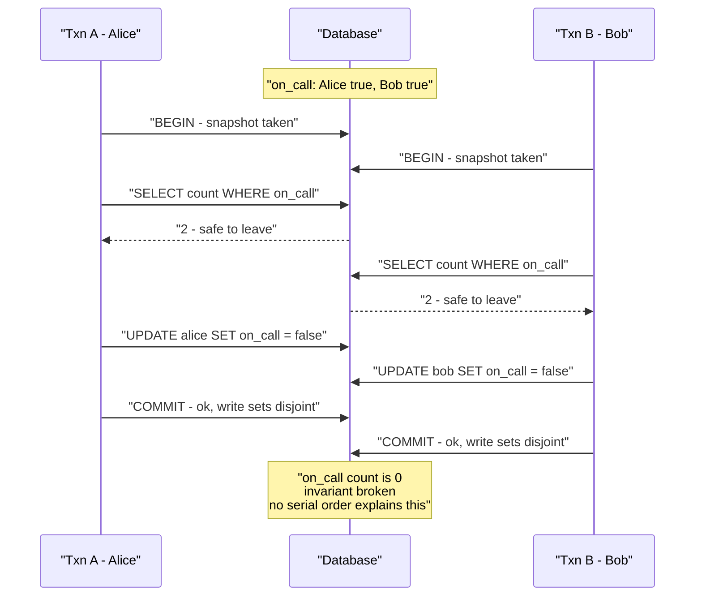
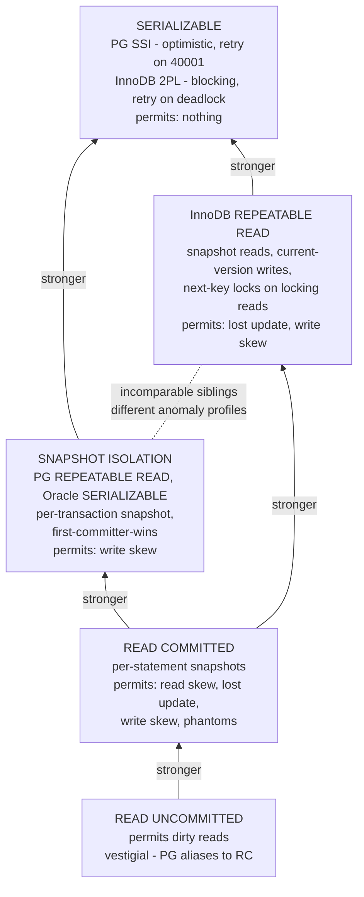
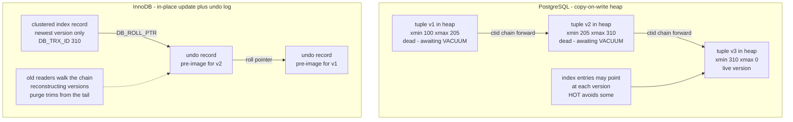
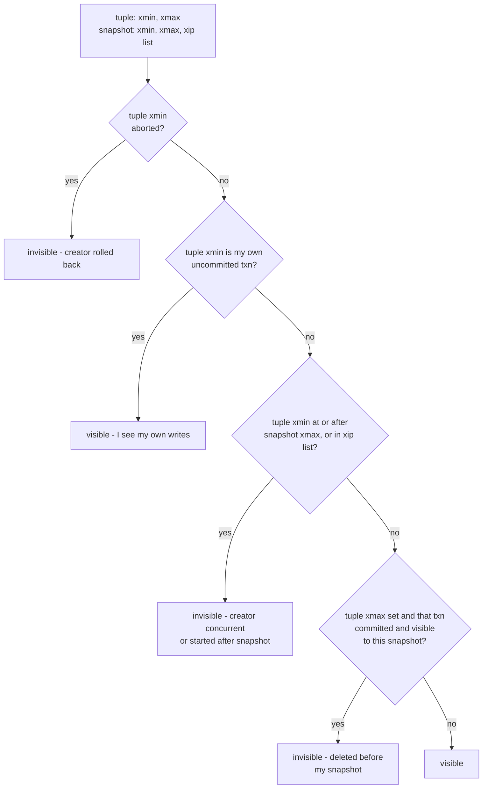

# Chapter 6 — Isolation Levels and MVCC

**What this chapter covers.** Chapter 5 introduced transactions and the ACID contract; this
chapter goes deep on the I, which is the letter engineers misunderstand most expensively. The
central fact is that **almost no production database runs serializable transactions by default,
and the levels they do run permit specific, nameable anomalies that will corrupt your invariants
while every individual statement returns correct-looking results.** Isolation levels are the
database's weak memory models: if you read Volume 4, Chapter 3 — Memory Models and Happens-Before,
this chapter will feel like déjà vu, deliberately. The same bargain reappears one layer up —
strong is easy to reason about and slow; weak is fast and treacherous; and the vendor's default
is weak.

We start by making that parallel explicit, then examine the ANSI SQL isolation levels and the
famous 1995 Berkeley critique that demonstrated the standard's definitions were broken — they
missed entire anomalies and could not even describe snapshot isolation, the level half the
industry actually runs. We work each anomaly with a concrete two-transaction example, then survey
the real landscape engine by engine, where the trap is that **the same level name means different
guarantees in different engines**. The second half opens the hood on MVCC — versioned tuples,
snapshots, visibility rules, and garbage collection, contrasting PostgreSQL's copy-on-write heap
with InnoDB's undo-log architecture — because you cannot operate these systems well without
understanding why old versions accumulate and what makes them go away. We close with locking
reads, a practical decision framework, and the distributed-systems lens, where this vocabulary
reappears yet again across replicas.

Learning goals — after this chapter you should be able to:

- Map isolation levels onto the memory-model framework from Volume 4, Chapter 3: serializable as
  the DRF-SC analogue, weaker levels as weak memory models with named litmus tests.
- Define each anomaly — dirty read, dirty write, non-repeatable read, read skew, phantom, lost
  update, write skew — with a two-transaction example, and state which levels permit which.
- Explain why the ANSI SQL definitions were inadequate, per Berenson et al. 1995.
- Define snapshot isolation precisely, including first-committer-wins, and explain why write skew
  survives it.
- State what READ COMMITTED, REPEATABLE READ, and SERIALIZABLE actually guarantee in PostgreSQL
  versus MySQL/InnoDB, and why the shared names are misleading.
- Walk the MVCC mechanics: xmin/xmax versioning and snapshot visibility in PostgreSQL; undo logs,
  roll pointers, and ReadView in InnoDB; and the garbage-collection consequences of each.
- Diagnose the long-running-transaction disease in both engines: VACUUM's xmin horizon and bloat;
  InnoDB's history list growth.
- Choose an isolation level or an explicit locking strategy for a given invariant, and write
  correct retry logic for serialization failures.

## Isolation levels are the database's memory models

Volume 4, Chapter 3 established a pattern you should now recognize on sight. Programmers assume
sequential consistency — one global interleaving of operations — and no mainstream processor
provides it, because it is too expensive. Instead, hardware and languages provide *weak* models
that permit specific reorderings, document them via litmus tests, and offer tools (fences,
volatile, atomics) to buy back ordering where you need it. The bargain is DRF-SC: follow the
discipline and you may reason with the simple model; skip it and you are exposed to the machine.

Databases made exactly the same trade, a decade earlier, for exactly the same reason.

Programmers assume **serializability**: the result of running transactions concurrently is the
same as *some* serial, one-at-a-time execution. That is the transactional analogue of sequential
consistency — a single global order that explains everything you observed. And almost no database
gives it to you by default, because enforcing it costs throughput: either pessimistic locking
that serializes conflicting work and invites deadlock, or optimistic validation that aborts
transactions and demands retries. So the vendors ship weaker levels — READ COMMITTED, REPEATABLE
READ — that permit specific, documented anomalies, exactly as x86-TSO permits store-load
reordering and documents it.

The correspondence is close enough to use as a study aid:

| Memory models (Vol 4, Ch 3) | Isolation levels (this chapter) |
|---|---|
| Sequential consistency | Serializability |
| x86-TSO, ARM/POWER weak models | READ COMMITTED, snapshot isolation |
| Litmus tests: store buffering, message passing | Anomalies: write skew, lost update, read skew |
| Reordering invisible single-threaded | Anomalies invisible to a lone transaction |
| Fences, volatile, atomics | `SELECT ... FOR UPDATE`, explicit locks |
| DRF-SC: synchronize and reason serially | Run serializable and reason serially |
| "It worked on x86" | "It worked at READ COMMITTED under low load" |

Every row transfers. An anomaly, like a reordering, is invisible to a transaction running alone —
it appears only when a second transaction observes overlapping state, and only in a narrow timing
window, which is why these bugs pass every test and surface in production under load. The named
anomalies are litmus tests: minimal two-transaction programs that distinguish levels, exactly as
store-buffering distinguishes TSO from sequential consistency. And the practical discipline is
the same: know precisely which model your engine gives you, reason from the documented contract
rather than from observed behavior, and buy back strength surgically where an invariant demands
it.

One difference is worth flagging early. Memory models are about *visibility ordering* of
individual loads and stores; isolation levels are about *entire multi-statement transactions*
whose reads and writes are supposed to behave as an atomic unit. That makes the database problem
in one way harder — the units are bigger and hold state longer — and in one way easier: the
database is a single arbiter that sees every access, so it can detect conflicts and abort, an
option shared-memory hardware does not have. Optimistic concurrency control (Volume 4, Chapter 4)
is exactly this abort-and-retry option, and serializable-via-SSI below is its most sophisticated
production form.

## The ANSI levels and why their definitions failed

The SQL standard (SQL-92 onward) defines four isolation levels by way of three *phenomena* each
level must exclude:

- **P1 — dirty read**: transaction T1 reads data written by a concurrent, uncommitted T2. If T2
  aborts, T1 has read data that never existed.
- **P2 — non-repeatable read (fuzzy read)**: T1 reads a row; T2 modifies or deletes it and
  commits; T1 reads the row again and sees a different value, or nothing.
- **P3 — phantom**: T1 reads a *set* of rows matching a predicate; T2 inserts or modifies rows so
  that new rows match; T1 re-runs the query and the set has changed.

The levels are then defined subtractively: READ UNCOMMITTED permits all three; READ COMMITTED
excludes P1; REPEATABLE READ excludes P1 and P2; SERIALIZABLE excludes all three.

This framework is broken, and the definitive demolition is **Berenson, Bernstein, Gray, Melton,
O'Neil, and O'Neil, "A Critique of ANSI SQL Isolation Levels" (SIGMOD 1995)** — one of the most
consequential systems papers of the decade, and short enough that you should actually read it.
Its arguments:

**The definitions are ambiguous.** Read strictly (the "anomaly interpretation"), the English
phenomena describe only specific completed histories, and excluding those exact histories still
admits closely related bad ones. The paper shows the phenomena must be read broadly — as
constraints on the *possibility* of interleavings, not on particular outcomes — or the levels
they define are weaker than everyone intended.

**The list of anomalies is incomplete.** The standard never mentions **dirty writes** (T1
overwrites T2's uncommitted write — every real level excludes this, and the standard forgot to
require it), **lost updates**, **read skew**, or **write skew**. A level can exclude P1–P3 as
literally written and still permit all of these.

**Serializable is defined wrong.** ANSI says SERIALIZABLE is the level that excludes P1–P3. But
excluding those three phenomena does not imply serializability — write skew slips through. This
is not a pedantic gap: Oracle read the standard exactly this way, implemented snapshot isolation,
observed that it excludes P1–P3, and to this day sells it under the name `SERIALIZABLE`. An
Oracle transaction at the highest available level can exhibit write skew, which no serial
execution could produce. The standard's own definition licensed this.

**A real, important level is missing entirely.** The paper introduced and named **snapshot
isolation** — the level that DB2's competitors, Oracle, and later PostgreSQL and countless MVCC
engines actually implemented — and showed it is *incomparable* with ANSI REPEATABLE READ: SI
excludes phantoms-on-read (a snapshot never changes) but permits write skew; classic
lock-based REPEATABLE READ prevents write skew on read rows but permits phantoms. Neither is
strictly stronger. The ANSI ladder is not a ladder; it is a partial order, and the standard drew
it as a line.

The lesson generalizes beyond SQL: **defining consistency by listing prohibited anomalies is
fragile, because the list is never complete.** The modern approach — Adya's 1999 thesis, and the
formal definitions used by Jepsen — defines levels by constraints on the dependency graph of
committed transactions, from which the anomalies fall out as consequences. You do not need that
formalism day to day, but you do need the corrected anomaly vocabulary, so we build it next.

## The anomaly bestiary, worked

Each anomaly below is a two-transaction litmus test. Timelines run downward; both transactions
begin before either commits.

### Dirty read and dirty write

Dirty read: T2 writes `balance = 900` and has not committed; T1 reads 900 and acts on it; T2
rolls back. T1 has consumed data that never existed. Dirty write: T1 and T2 both update the same
row before either commits, interleaving their writes; whatever commit order follows, one
transaction's update is entangled with the other's, and rollback becomes incoherent — which is
why even READ UNCOMMITTED excludes dirty writes in every real engine (first writer takes a row
lock; the second blocks). You will essentially never observe either anomaly in a modern MVCC
database; they matter as the floor of the hierarchy, not as practical risks.

### Non-repeatable read and read skew

Non-repeatable read is the single-row form: T1 reads a row, T2 updates it and commits, T1 reads
it again and gets a different answer within one transaction. **Read skew** is the multi-row form
the ANSI standard missed, and it is the one that actually burns people: T1 reads row X, then T2
updates X and Y together (preserving an invariant between them) and commits, then T1 reads Y. T1
has seen X's old value and Y's new value — a combination that never existed at any instant.

Concretely: accounts A and B each hold 500, invariant `A + B = 1000`. T1 reads A = 500. T2
transfers 100 (A := 400, B := 600) and commits. T1 reads B = 600 and concludes the pair sums to
1100. Every read returned genuinely committed data; the *combination* is fictional. This is
precisely why a long analytics query or a backup taken at READ COMMITTED can observe a state that
violates invariants the application never violated — and why per-transaction snapshots exist.

### Lost update

T1 and T2 both execute read-modify-write on the same row: read counter = 10, compute 11, write
11. Both commit; one increment vanished. No dirty read occurred — both read committed data — and
no dirty write — the writes were serialized by row locking. The *interleaving* is the problem:
T2's read happened before T1's write, so T2's write clobbers it. Any pattern that reads a value
into the application, computes, and writes back is exposed: counters, "append to a JSON column,"
read-check-update workflows. The fixes, previewed here and detailed below: an atomic single
statement (`UPDATE t SET n = n + 1`), a locking read (`SELECT ... FOR UPDATE`), an engine that
detects the conflict (PostgreSQL REPEATABLE READ and above), or compare-and-set
(`UPDATE ... WHERE n = 10`) with application retry — the same optimistic pattern as Volume 4,
Chapter 4.

### Write skew — the one that survives snapshot isolation

Write skew is the aristocrat of anomalies: it defeats snapshot isolation, it is the reason
"REPEATABLE READ" is not enough for constraint-like invariants, and the classic example (from the
literature on SI, popularized by Cahill's and Kleppmann's treatments) is the on-call roster.

Hospital rule: at least one doctor must be on call. Alice and Bob are both on call. Each,
simultaneously, requests to go off call. Each transaction runs the same logic:

```sql
BEGIN;
SELECT count(*) FROM doctors WHERE on_call;   -- returns 2: safe to leave
UPDATE doctors SET on_call = false WHERE name = 'alice';  -- (Bob updates his own row)
COMMIT;
```

Both transactions read from a snapshot in which the count is 2, both conclude the invariant
survives their own departure, and both commit — **their write sets are disjoint** (Alice's row
versus Bob's row), so no write-write conflict detection fires. The roster is now empty. No serial
execution could produce this: whichever transaction ran second would have counted 1 and refused.



The general shape: **read a predicate, decide based on it, write something the *other*
transaction's predicate depends on.** Each transaction's write invalidates the other's read, but
neither writes what the other wrote. Once you know the shape you see it everywhere: enforcing
"username unique" by select-then-insert; booking the last seat by counting bookings; spending
against a shared budget by summing spends; two workers each claiming a task after checking no one
has. Phantoms compound it — when the decision depends on the *absence* of rows, there is not even
a row for conflict detection to notice.

### Phantoms

A phantom is a predicate read invalidated by insertion: T1 counts rows `WHERE on_call`, T2
*inserts* a new matching row and commits, T1's re-read (or its decision) is stale. Under a
per-transaction snapshot the re-read within T1 is stable — SI has no phantoms *within* the
transaction's view — but the write-skew structure above shows the decision can still be
invalidated at commit time. Lock-based engines attack phantoms differently, by locking the
*predicate's key range* rather than existing rows; that is InnoDB's next-key locking, below.

## The real level landscape

With the vocabulary fixed, here is what the levels actually mean in the engines you run —
and the running theme is that **the same name buys different guarantees in different engines.**

### READ UNCOMMITTED — vestigial

Permits dirty reads. In the locking-scheduler world of the 1980s this was a real performance
tier: readers skipped shared locks. In an MVCC engine it buys nothing, because readers never
block on writers anyway. **PostgreSQL accepts the syntax and silently gives you READ COMMITTED**
— it does not implement a distinct level, and the documentation says so plainly. InnoDB does
implement it (reads skip the ReadView and read the newest uncommitted version); there is almost
no defensible modern use. Treat it as historical.

### READ COMMITTED — the default you are probably running

The default in PostgreSQL, Oracle, and SQL Server (in its read-committed-snapshot form on Azure
SQL). The MVCC implementation: **every statement gets a fresh snapshot** of the database as of
that statement's start. Each individual statement sees only committed data — no dirty reads —
but two statements in the same transaction can see different committed states.

What it therefore permits: non-repeatable reads and read skew (statement 2 runs against a newer
snapshot than statement 1); lost updates via application-level read-modify-write (your SELECT and
your UPDATE are different statements with different snapshots, and nothing checks that the row
you read is the row-version you overwrite); write skew, trivially. One subtlety worth knowing in
PostgreSQL: when an `UPDATE` at READ COMMITTED finds its target row locked by a concurrent
transaction, it waits; if that transaction commits, PostgreSQL re-evaluates the `WHERE` clause
against the *new* row version and proceeds. That re-check prevents blind overwrites within a
single UPDATE statement, but it does nothing for values your application read in an earlier
statement — the classic lost-update hole remains open.

READ COMMITTED is a reasonable default for workloads whose writes are single-statement and
atomic (`UPDATE ... SET n = n + 1`), whose invariants live in constraints the database checks
(`UNIQUE`, `CHECK`, foreign keys — these are enforced regardless of isolation level), and whose
multi-statement reads tolerate mild inconsistency. It is the wrong level for any
read-decide-write sequence, and most application code is full of them.

### REPEATABLE READ — one name, two different beasts

**PostgreSQL REPEATABLE READ is snapshot isolation.** One snapshot is taken at the transaction's
first query and every statement reads from it: no non-repeatable reads, no read skew, and no
phantoms within your view — the snapshot is frozen. Additionally, PostgreSQL enforces a
write-conflict rule: if you attempt to `UPDATE` or `DELETE` a row that a concurrent transaction
has modified since your snapshot, you block until that transaction resolves; if it commits, your
transaction aborts with `ERROR: could not serialize access due to concurrent update` (SQLSTATE
40001). This is **first-updater-wins**, the blocking variant of SI's classic
first-committer-wins, and it means lost updates are *detected* at this level — the second
read-modify-write aborts instead of clobbering. Write skew, of course, is still permitted:
disjoint write sets never trigger the check.

**MySQL/InnoDB REPEATABLE READ — the default level in MySQL — is a different animal.**
Non-locking `SELECT`s use a consistent snapshot established at the first read, so plain reads
behave like SI. But there is no first-committer/updater check: a concurrent transaction can
modify a row after your snapshot, and your subsequent `UPDATE` of that row simply proceeds
against the *current* committed version — **lost updates via read-modify-write are permitted at
InnoDB REPEATABLE READ**, where PostgreSQL's level of the same name aborts them. Furthermore,
your UPDATE reads and writes the current version, not your snapshot's, so a transaction can act
on data newer than what its SELECTs showed — a mind-bending mix of snapshot reads and current
writes. On the other hand, InnoDB's *locking* reads and writes take **next-key locks** — a lock
on the index record plus the gap before it — so a `SELECT ... FOR UPDATE` over a range prevents
concurrent inserts into that range: phantoms are blocked for locking reads, which is a guarantee
PostgreSQL SI does not express in locking terms at all.

Same words on the wire — `SET TRANSACTION ISOLATION LEVEL REPEATABLE READ` — and materially
different anomaly profiles. **Never port an application between engines, or reason about one from
experience with the other, on the assumption that the level names carry the semantics.** They
carry the syntax.

### Snapshot isolation, precisely

Since SI is the de facto standard level, define it exactly. A transaction T at snapshot
isolation:

1. Reads from a **snapshot**: the committed state as of T's start (its *start timestamp*). T also
   sees its own uncommitted writes. Nothing that commits after T's start is visible.
2. On commit, passes **first-committer-wins** validation: if any transaction that was concurrent
   with T (committed between T's start and T's commit) wrote to an item T also wrote, T aborts.
   Write-write conflicts on overlapping write sets are thus impossible; one of the pair dies.
   (Implementations often use the blocking first-*updater*-wins variant — detect at write time
   rather than commit time — with the same net guarantee.)

What follows from the definition: no dirty reads, no non-repeatable reads, no read skew, no
phantoms in the transaction's view, no lost updates. And one precise hole: **write skew**, plus
its phantom-flavored variants, because validation examines only *write-write* overlap. Two
transactions whose reads overlap but whose writes are disjoint sail through — the doctors
example. The read that justified the write is never validated. That asymmetry — writes checked,
reads not — is the entire gap between SI and serializability, and closing it is exactly what SSI
does.

### SERIALIZABLE — two implementations, two cost models

**PostgreSQL: Serializable Snapshot Isolation (SSI).** Based on Michael Cahill's work (Cahill,
Röhm, Fekete, SIGMOD 2008) and brought to PostgreSQL 9.1 by Dan Ports and Kevin Grittner (VLDB
2012). The theory: every SI anomaly requires a cycle in the transaction dependency graph
containing two consecutive **rw-antidependency** edges — T1 reads something T2 then overwrites
("T2 invalidates T1's read"), and T2's read is in turn invalidated by T3 (possibly T1 itself).
In the doctors example, A's count is invalidated by B's update and B's count by A's update: two
rw edges forming the dangerous structure. SSI runs transactions optimistically under plain SI,
tracks reads with in-memory **SIREAD locks** (including predicate/range information), watches for
pairs of consecutive rw-antidependencies, and aborts one transaction of any dangerous structure
with SQLSTATE 40001. The detection is conservative — dangerous structures do not always complete
a cycle, so **false-positive aborts happen by design** — but it never admits a non-serializable
execution. Costs: memory and CPU for read tracking, reduced concurrency from aborts, and a hard
requirement that **every serializable transaction be wrapped in a retry loop**, because any of
them can fail through no fault of its own. Readers never block writers and writers never block
readers — the MVCC property survives; conflict resolution happens by abort, not by waiting. Two
operational notes: SIREAD tracking can escalate from row to page to relation granularity under
memory pressure, raising false-positive rates; and `SELECT ... FOR UPDATE` inside serializable
transactions adds nothing to correctness — SSI already covers reads.

**MySQL/InnoDB: two-phase locking.** `SERIALIZABLE` in InnoDB converts plain `SELECT`s into
`SELECT ... FOR SHARE` — every read takes shared next-key locks, held to commit. This is
classical strict two-phase locking with range locking: correct, pessimistic, and blocking.
Readers block writers and writers block readers; the failure mode is deadlock (error 1213
`ER_LOCK_DEADLOCK`, victim chosen and rolled back) rather than optimistic abort — so you need a
retry loop here too, just triggered by a different error. Throughput under contention degrades by
queueing rather than by aborting. Neither cost model is free; they fail differently, and which is
cheaper depends on whether your conflicts are real (pessimism wastes less work) or rare
(optimism wastes less waiting) — the same trade-off as Volume 4, Chapter 4.

**Oracle: caveat emptor.** `SERIALIZABLE` is snapshot isolation. Write skew is possible at
Oracle's maximum level; if you carry an invariant of that shape, you need `SELECT ... FOR UPDATE`
or a materialized conflict, below.



## MVCC mechanics

Every level above READ UNCOMMITTED in a modern engine is built on **multi-version concurrency
control**: instead of updating data in place and making readers wait, the engine keeps multiple
versions of each row and shows each transaction the versions consistent with its snapshot.
Readers never block writers; writers never block readers; writers still block writers on the same
row. The design questions are where old versions live, how a reader decides which version to see,
and who cleans up — and PostgreSQL and InnoDB answer all three differently.

### Two architectures: copy-on-write heap versus in-place plus undo

**PostgreSQL: versions live in the table.** Every heap tuple carries system columns, chiefly
`xmin` — the transaction ID (XID) that created this version — and `xmax` — the XID that deleted
or superseded it (0 if live). An `UPDATE` is physically a delete-plus-insert: the old tuple gets
its `xmax` stamped, and a complete new tuple is written elsewhere in the heap with `xmin` set to
the updater. Old versions sit in the table proper, interleaved with live data, until VACUUM
removes them. Consequences: updates write a whole new row (mitigated by HOT — heap-only tuples —
which avoids new index entries when no indexed column changed and the new version fits on the
same page); rollback is trivially cheap (the new version simply remains invisible because its
creator aborted — nothing to undo); and dead versions inflate the table and its indexes until
vacuumed — **bloat**.

**InnoDB: versions live in the undo log.** The clustered index holds only the newest version,
updated in place. Each record carries `DB_TRX_ID` (last writer) and `DB_ROLL_PTR`, a pointer into
the **undo log**, where the pre-image needed to reconstruct the previous version was written
before the update. Old versions form a chain through undo: a reader needing an older version
follows roll pointers backward, applying undo records until it reaches a version visible to its
snapshot. Consequences: reads of hot current data are clean — the table contains exactly the live
rows; reads of *old* data pay per-version reconstruction cost that grows with the chain length;
rollback is expensive (undo records must actually be applied to restore the pre-image); and the
garbage problem moves from the table to the undo/history subsystem. Oracle pioneered this
architecture (undo segments); SQL Server's snapshot modes use a version store in tempdb, a
cousin.



Neither architecture dominates. PostgreSQL pays on the write path (full-row versions, index
amplification, VACUUM) and gets cheap aborts and simple reads; InnoDB pays on rollback and on
old-snapshot reads and keeps its tables compact. The operational failure modes below are the same
disease expressed in different organs.

### Snapshots and visibility

A snapshot answers one question: *which transactions' effects should I see?* PostgreSQL
represents it explicitly as three pieces: `xmin` — the oldest XID still running when the snapshot
was taken (everything before it is definitely resolved); `xmax` — the next XID to be assigned
(everything at or after it is definitely invisible, it started after us); and `xip[]`, the list
of XIDs in progress at snapshot time (in the gap between the two boundaries, these are the
concurrent transactions whose effects must be hidden even if they commit later). You can inspect
this live: `SELECT pg_current_snapshot();` returns something like `748:757:751,754`.

A tuple is visible to a snapshot roughly when: its creator (`xmin`) committed, was not in
progress at snapshot time, and is not from the future — and its deleter (`xmax`), if any, does
*not* pass those same tests. Commit status comes from the commit log (`pg_xact`), consulted once
and then cached on the tuple itself as **hint bits** so subsequent readers skip the lookup — one
reason the first scan after a bulk load is slow and writes pages. In full detail the rules run to
hundreds of lines (`heapam_visibility.c` repays reading), handling subtransactions, your own
uncommitted work, and in-progress edge cases, but the skeleton is this:



InnoDB's **ReadView** is the same idea with the same fields under different names: a low-water
mark (`up_limit_id`), a high-water mark (`low_limit_id`), and the list of active transaction IDs
at creation. The mechanical difference is what happens on a miss: PostgreSQL simply skips an
invisible heap tuple (the visible one is elsewhere in the heap), while InnoDB takes the current
record and walks its undo chain, applying pre-images until a version's `DB_TRX_ID` passes the
ReadView test. Same visibility logic; the storage architecture decides who does the work.

The levels now reduce to snapshot lifetime: READ COMMITTED takes a fresh snapshot per statement;
REPEATABLE READ/SI takes one per transaction (PostgreSQL at the first query, InnoDB at the first
consistent read, or at `START TRANSACTION WITH CONSISTENT SNAPSHOT`); SERIALIZABLE in PostgreSQL
is per-transaction snapshots plus SSI's conflict tracking. Commit itself is what flips
visibility atomically: writing the commit record makes every one of the transaction's tuples
visible to later snapshots at once — in PostgreSQL the XID's status changes in `pg_xact`; engines
with explicit commit timestamps (and every distributed SQL engine, Chapter 12) stamp the version
with commit time and compare timestamps instead of consulting XID sets.

### Garbage collection: the unavoidable tax

MVCC's contract is "keep old versions as long as someone might need them." The corollary defines
the operational pain of both engines: **the oldest snapshot in the system determines what can be
reclaimed, so one long-running transaction blocks cleanup for everyone.**

**PostgreSQL: VACUUM.** A dead tuple — superseded or deleted, and invisible to every current and
future snapshot — is reclaimable. VACUUM (normally autovacuum) scans for dead tuples, removes
them, updates indexes, and makes space reusable (it does not usually shrink files; that is
`VACUUM FULL`, which rewrites the table under an exclusive lock). The horizon rule: VACUUM may
only remove tuples deleted before the oldest `xmin` any active snapshot might use — the minimum
across all running transactions' snapshots (visible in `pg_stat_activity.backend_xmin`), held
prepared transactions, replication slots, and, with `hot_standby_feedback`, the standbys'
readers too. A single idle-in-transaction session holding a snapshot from six hours ago pins six
hours of dead versions *in every table in the database* — cleanup is blocked fleet-wide, tables
and indexes bloat, scans slow down as they wade through dead tuples, and the damage persists
after the culprit exits until vacuum catches up. Defenses: `idle_in_transaction_session_timeout`,
monitoring for old `backend_xmin`/`xact_start`, and treating long transactions as incidents.
Separately, XIDs are 32-bit and comparison is circular, so tuples must eventually be **frozen**
(marked as "committed in the infinite past") before the counter wraps; autovacuum does this on
schedule, and a cluster that cannot vacuum — often *because* of the same horizon problems —
marches toward wraparound protection, where PostgreSQL first warns and ultimately refuses new
writes. Every serious PostgreSQL operator eventually learns this the hard way; monitor
`datfrozenxid` age.

**InnoDB: purge and the history list.** Same disease, different organ. Undo records for
committed transactions cannot be purged while any ReadView might still need them; the pending
backlog is the **history list**, whose length is visible in `SHOW ENGINE INNODB STATUS` and
`information_schema.innodb_metrics` (`trx_rseg_history_len`). A long-running consistent-read
transaction pins the tail of the undo log: history list length climbs into the millions, undo
tablespaces grow (before MySQL 8.0's separate truncatable undo tablespaces, this permanently
grew the system tablespace), and — the InnoDB-specific symptom — reads get *slower*, because
every read of a hot row by an old snapshot walks an ever-longer version chain. Where PostgreSQL
bloat slows scans by volume, InnoDB history slows point reads by chain length. The operational
posture is identical: alert on history list length, kill long transactions, keep OLTP
transactions short and move analytics to a replica (where, note, long queries create the
analogous problem via replication conflict or feedback — Chapter 8).

The design lesson: **MVCC converts blocking into garbage.** You pay either way; MVCC's genius is
deferring the payment off the critical path, and its trap is that deferred payments compound.

## Locking reads: buying strength surgically

Inside an MVCC engine, plain reads are optimistic and lock-free. Sometimes you want one read to
be pessimistic — to say "I am reading this row *in order to write based on it*; hold it still."
That is `SELECT ... FOR UPDATE`: it reads the current committed version (not your snapshot's —
at READ COMMITTED in PostgreSQL it locks the newest version, waiting out concurrent writers) and
takes a row lock that conflicts with other locking reads and with writes, held to commit.

The lost-update fix is the canonical use:

```sql
BEGIN;
SELECT balance FROM accounts WHERE id = 42 FOR UPDATE;  -- row locked; concurrent RMWs queue here
-- application computes new balance
UPDATE accounts SET balance = 900 WHERE id = 42;
COMMIT;
```

And the write-skew fix, by forcing the disjoint-write-set structure into a real conflict — lock
the rows your *decision* depends on, not just the row you write:

```sql
BEGIN;
SELECT * FROM doctors WHERE on_call FOR UPDATE;  -- both txns try to lock BOTH rows
-- count them in the application; if > 1, proceed
UPDATE doctors SET on_call = false WHERE name = 'alice';
COMMIT;
```

Now Alice's and Bob's transactions collide on the locked rows; one waits, re-reads a count of 1,
and refuses. The limits: this only works when the rows embodying the invariant *exist to be
locked* — a select-then-insert uniqueness check has nothing to `FOR UPDATE` (the row that matters
is the one that does not exist yet), which is where you need a unique constraint, InnoDB's gap
locks, or **materializing the conflict**: keeping a row whose only job is to be locked (a
per-shift roster row, a per-bucket counter row) so the phantom becomes a row conflict.

The gradations, in PostgreSQL: `FOR UPDATE` (exclusive, "I will modify or delete");
`FOR NO KEY UPDATE` (slightly weaker — "I will modify non-key columns" — and crucially does not
conflict with `FOR KEY SHARE`, the lock foreign-key checks take on referenced rows, so
concurrent inserts of child rows are not blocked; prefer it when you are not deleting or
changing keys); `FOR SHARE` (shared — "hold this still but other readers may too"); and
`FOR KEY SHARE`. Modifiers `NOWAIT` (error instead of queueing) and `SKIP LOCKED` (skip
contended rows — the standard idiom for job-queue workers pulling tasks) complete the toolkit.

**Locking reads versus serializable** is a scoping decision. Explicit locks are targeted: you pay
contention only on the invariant you protect, you get blocking rather than aborts, and you carry
the burden of *finding every read-decide-write site and locking correctly* — miss one and it is
silently broken, which is exactly the "buy back ordering with fences by hand" discipline of Volume
4, with the same failure mode. Serializable is global: every invariant expressible in
transactions is protected without you identifying it, at the price of tracking overhead,
false-positive aborts, and mandatory retry loops. A defensible default: serializable for
workloads whose correctness is hard to enumerate; explicit locking for a small number of known
hot invariants inside an otherwise READ COMMITTED application.

## Reproducing and fixing anomalies: real SQL

Write skew, live, in PostgreSQL at REPEATABLE READ (snapshot isolation). Two `psql` sessions:

```sql
-- setup
CREATE TABLE doctors (name text PRIMARY KEY, on_call boolean NOT NULL);
INSERT INTO doctors VALUES ('alice', true), ('bob', true);

-- session 1                                  -- session 2
BEGIN ISOLATION LEVEL REPEATABLE READ;
SELECT count(*) FROM doctors WHERE on_call;
--> 2
                                              BEGIN ISOLATION LEVEL REPEATABLE READ;
                                              SELECT count(*) FROM doctors WHERE on_call;
                                              --> 2
UPDATE doctors SET on_call = false
  WHERE name = 'alice';
                                              UPDATE doctors SET on_call = false
                                                WHERE name = 'bob';
COMMIT;   -- succeeds
                                              COMMIT;   -- succeeds. Write sets disjoint.
SELECT count(*) FROM doctors WHERE on_call;
--> 0     -- invariant destroyed at "repeatable read"
```

Re-run the same script with `BEGIN ISOLATION LEVEL SERIALIZABLE;` and the second `COMMIT` fails:

```
ERROR:  could not serialize access due to read/write dependencies among transactions
DETAIL:  Reason code: Canceled on identification as a pivot, during commit attempt.
HINT:  The transaction might succeed if retried.
SQLSTATE: 40001
```

SSI tracked both transactions' predicate reads via SIREAD locks, saw each read invalidated by the
other's write — the dangerous pair of rw-antidependencies — and aborted the pivot. The `HINT` is
literal: retry it and it succeeds, because the conflict partner is gone. Which is why serializable
code must be structured as a retry loop; SQLSTATE `40001` (`serialization_failure`) and `40P01`
(`deadlock_detected`) are *expected outcomes*, not errors to page on:

```python
import random, time
import psycopg

RETRYABLE = {"40001", "40P01"}

def go_off_call(conn_str: str, doctor: str, max_attempts: int = 5) -> bool:
    for attempt in range(max_attempts):
        try:
            with psycopg.connect(conn_str) as conn:
                conn.execute("SET default_transaction_isolation = 'serializable'")
                with conn.transaction():
                    n = conn.execute(
                        "SELECT count(*) FROM doctors WHERE on_call"
                    ).fetchone()[0]
                    if n <= 1:
                        return False                      # invariant would break; refuse
                    conn.execute(
                        "UPDATE doctors SET on_call = false WHERE name = %s",
                        (doctor,),
                    )
                return True                               # committed
        except psycopg.errors.Error as e:
            if e.sqlstate in RETRYABLE and attempt < max_attempts - 1:
                time.sleep(random.uniform(0, 0.05 * 2**attempt))   # jittered backoff
                continue
            raise
```

The loop's obligations, per Chapter 5: the transaction body must be **safe to re-execute** (no
side effects outside the database before commit — no emails sent, no HTTP calls made mid-
transaction), retries must be bounded with backoff and jitter (contention plus tight retries is a
retry storm), and the whole unit — not individual statements — is what retries. The equivalent
loop for InnoDB at SERIALIZABLE catches MySQL error 1213 (deadlock) and 1205 (lock wait timeout).

## Choosing a level in practice

**Step one: audit your defaults.** Most teams have never explicitly chosen an isolation level,
which means the vendor chose: PostgreSQL and Oracle run READ COMMITTED, MySQL runs InnoDB
REPEATABLE READ, SQL Server runs locking READ COMMITTED (or RCSI where enabled). Write down what
your engine's default *permits* — for PostgreSQL READ COMMITTED: read skew, lost updates on
read-modify-write, write skew — and grep the codebase for read-decide-write sequences. Every one
is a potential anomaly site. This audit regularly finds real bugs; the anomalies are not
theoretical, they are merely rare, which is worse.

**Step two: classify your invariants.** Constraints the database enforces (unique, FK, check)
are safe at any level. Single-statement atomic writes (`UPDATE ... SET n = n + 1`,
`INSERT ... ON CONFLICT`) are safe at READ COMMITTED. Invariants that span a read and a write —
balances never negative, at least one doctor on call, at most N seats sold, no overlapping
bookings — are write-skew-shaped and are *not* protected below serializable; they need
serializable, an explicit locking read over the rows the decision depends on, or a materialized
conflict/constraint that turns the invariant into something the database checks.

**Step three: match the concurrency-control style to the conflict rate** — the Volume 4,
Chapter 4 rule. Rare conflicts favor optimism (serializable-SSI, or compare-and-set at lower
levels): almost every transaction commits without waiting. Frequent conflicts on hot rows favor
pessimism (`FOR UPDATE`, or InnoDB's locking serializable): waiting wastes less than repeated
aborted work. High-contention hot spots defeat both, and the fix is schema-level: shard the
counter, batch the updates, or queue the writes (Volume 10).

**Step four: if you adopt serializable, adopt the whole discipline.** Retry loops everywhere
(ideally in one shared transaction wrapper, not scattered), no external side effects inside
transactions, transactions kept short (long ones both aggravate SSI's false-positive rate and pin
the MVCC horizon), and monitoring for serialization-failure rates the way you monitor error
budgets. Serializable without retries is an availability bug; serializable with retries and long
transactions is a throughput bug.

## The distributed-systems lens

The isolation vocabulary is the distributed-consistency vocabulary one layer up — not by analogy
but by construction, and this volume keeps meeting it.

**A snapshot is a consistent cut.** The MVCC snapshot — "the committed state as of timestamp t"
— is exactly the consistent-snapshot concept of distributed systems: a cut of the global history
closed under happens-before. Within one node, PostgreSQL builds it from an XID array; across
nodes there is no shared XID counter, so distributed SQL engines must manufacture globally
comparable commit timestamps — Spanner's TrueTime intervals, or hybrid logical clocks in
CockroachDB and YugabyteDB — to give a cross-shard transaction one snapshot that is consistent on
every node (Chapter 12; Volume 6, Chapter 2). Same abstraction, harder clock.

**Replication adds an isolation dimension your level does not govern.** A perfectly serializable
primary with an asynchronous read replica gives readers of the replica stale data — effects of
committed transactions that have not yet applied. That is read skew *across replicas*, and no
`SET TRANSACTION ISOLATION LEVEL` fixes it, because the isolation level is a contract about
transactions on one consistent store, and the replica is a second store lagging the first. The
store-buffer-as-replication-lag identity from Volume 4, Chapter 3 lands here with money attached:
"I committed the write and my next request read the replica and it wasn't there" is the
read-your-writes problem, solved by session guarantees, primary-pinned reads after writes, or
causal tokens — Chapter 8 for the replication mechanics, Volume 6, Chapter 3 for the consistency
taxonomy. When you evaluate a system's guarantees, ask two separate questions: what isolation
between concurrent transactions, and what consistency between replicas. Jepsen analyses score
both axes, and real systems fail both independently.

**Write skew across services has no database fix.** The doctors anomaly assumed one database
noticing both transactions. Now let two *services*, each with its own database, each check an
invariant over data the other writes — the inventory service checks capacity while the booking
service checks inventory, each then writing its own store. This is write skew where no arbiter
sees both write sets, so no isolation level anywhere can detect the rw-antidependency. The
distributed answers are structural: put the invariant's data under one transactional authority;
serialize the decisions through a single writer or a log (Volume 10); or accept the anomaly and
compensate — sagas with compensating actions, reservation patterns, and the outbox pattern for
atomically publishing what you committed (Chapter 10; Volume 10). Choosing among these is most of
the craft of transactional microservice design, and it starts with recognizing the anomaly shape
you learned in this chapter.

**And the memory-model bargain closes the loop.** DRF-SC said: follow the synchronization
discipline and you may reason as if sequentially consistent. Serializable transactions say:
follow the transaction discipline and you may reason as if serial. Distributed strict
serializability (Spanner's guarantee) says it again across datacenters, paying with commit-wait
what SSI pays with aborts and 2PL pays with blocking. It is the same bargain at every scale:
**strength is bought, never free, and the only real choices are which currency and where to
spend it.**

## Key takeaways

- **Isolation levels are weak memory models for transactions.** Serializability is the sequential
  consistency you assume; your engine's default is weaker, its anomalies are litmus tests, and
  the discipline is to reason from the documented contract, not from behavior observed in testing.
- The **ANSI definitions are broken** (Berenson et al. 1995): ambiguous phenomena, missing
  anomalies (dirty write, lost update, read skew, write skew), a serializable definition that
  admits non-serializable executions, and no place for snapshot isolation — which is incomparable
  with REPEATABLE READ, not below it. Oracle's `SERIALIZABLE` is SI to this day.
- **Write skew is the anomaly to internalize**: read a predicate, decide, write disjoint rows;
  first-committer-wins validation never fires because write sets do not overlap. Any "check an
  aggregate condition, then write" invariant is exposed below serializable.
- **The same level name means different things per engine.** PostgreSQL REPEATABLE READ is
  snapshot isolation with first-updater-wins (lost updates abort); InnoDB REPEATABLE READ has
  snapshot reads but current-version writes (lost updates succeed) plus next-key locking on
  locking reads. Never port assumptions across engines by level name.
- **Serializable comes in two cost models**: PostgreSQL SSI is optimistic — rw-antidependency
  tracking, false-positive aborts, mandatory retry loops on SQLSTATE 40001; InnoDB is pessimistic
  2PL — blocking, deadlock victims, retry on error 1213. Both require retry logic; they differ in
  when and how you pay.
- **MVCC has two architectures**: PostgreSQL's copy-on-write heap (versions in the table, cheap
  aborts, VACUUM and bloat) versus InnoDB's in-place-plus-undo (compact tables, expensive
  rollback, version-chain walks and purge). Visibility is the same idea in both: a snapshot is a
  set of transaction IDs whose effects you may see.
- **Garbage collection is the tax, and long transactions are the disease.** One old snapshot pins
  dead versions everywhere: PostgreSQL bloat and, unchecked, wraparound pressure; InnoDB history-
  list growth and slowing version-chain reads. Monitor for it; treat long-running transactions as
  incidents.
- **Buy strength surgically with locking reads** — `FOR UPDATE` on the rows a decision depends
  on fixes lost update and write skew locally; materialize the conflict when the critical row
  does not exist to be locked; prefer `FOR NO KEY UPDATE` when not touching keys; `SKIP LOCKED`
  for queues. Or buy it globally with serializable and the retry discipline.
- **Replicas add an isolation dimension no level governs**: a serializable primary plus an async
  replica still serves stale reads. Isolation between transactions and consistency between
  replicas are separate axes — ask about both.

## Further reading

- Berenson, H., Bernstein, P., Gray, J., Melton, J., O'Neil, E., O'Neil, P., "A Critique of ANSI
  SQL Isolation Levels," *SIGMOD*, 1995 — the paper that fixed the vocabulary; still the best
  single read on this chapter's first half. <https://dl.acm.org/doi/10.1145/223784.223785>
- Adya, A., *Weak Consistency: A Generalized Theory and Optimistic Implementations for
  Distributed Transactions*, MIT PhD thesis, 1999 — the dependency-graph formalization of
  isolation levels that replaced the ANSI phenomena.
- Cahill, M., Röhm, U., Fekete, A., "Serializable Isolation for Snapshot Databases," *SIGMOD*,
  2008 — the SSI algorithm. <https://dl.acm.org/doi/10.1145/1376616.1376690>
- Ports, D. R. K., and Grittner, K., "Serializable Snapshot Isolation in PostgreSQL," *VLDB*,
  2012 — the production implementation, including SIREAD locks, granularity promotion, and
  safe snapshots. <https://arxiv.org/abs/1208.4179>
- Kleppmann, M., *Designing Data-Intensive Applications*, O'Reilly, 2017, Chapter 7 — the best
  book-length treatment of anomalies and levels for practitioners, including the doctors-on-call
  example this chapter uses.
- Jepsen, *Consistency Models* — <https://jepsen.io/consistency> — the clickable map of isolation
  and distributed-consistency levels and their relationships, with Adya-style definitions.
- PostgreSQL documentation: *Transaction Isolation* —
  <https://www.postgresql.org/docs/current/transaction-iso.html> — precise per-level semantics,
  including the READ UNCOMMITTED aliasing and SSI behavior; and *Routine Vacuuming* —
  <https://www.postgresql.org/docs/current/routine-vacuuming.html> — the horizon, bloat, and
  wraparound mechanics.
- MySQL 8.0 Reference Manual: *InnoDB Transaction Isolation Levels* —
  <https://dev.mysql.com/doc/refman/8.0/en/innodb-transaction-isolation-levels.html> — and
  *InnoDB Multi-Versioning* —
  <https://dev.mysql.com/doc/refman/8.0/en/innodb-multi-versioning.html> — undo logs, ReadViews,
  and purge.
- Fekete, A., Liarokapis, D., O'Neil, E., O'Neil, P., Shasha, D., "Making Snapshot Isolation
  Serializable," *ACM TODS* 30(2), 2005 — the static-analysis approach to finding write-skew-
  prone transaction pairs that SSI later automated at runtime.
- Volume 4, Chapter 3 — Memory Models and Happens-Before — the sibling chapter; and Volume 4,
  Chapter 4 — optimistic concurrency, the abort-and-retry pattern SSI industrializes.
- This volume: Chapter 5 — Transactions and ACID; Chapter 7 — WAL and crash recovery (where
  commit becomes durable); Chapter 8 — Replication (the second isolation dimension); Chapter 10
  — Distributed Transactions; Chapter 12 — NewSQL (global snapshots, TrueTime, HLC).
