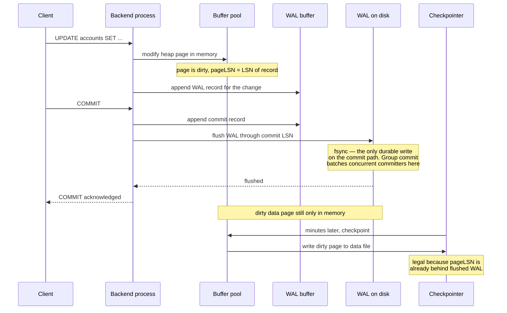
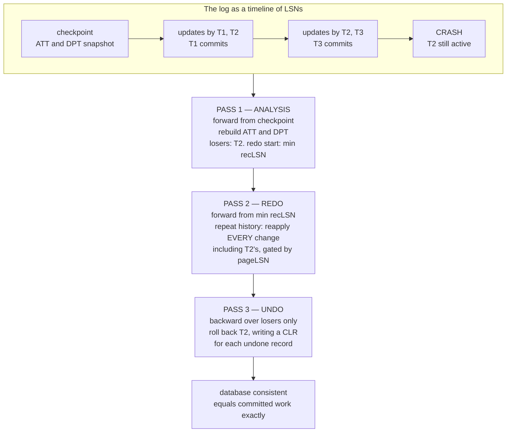
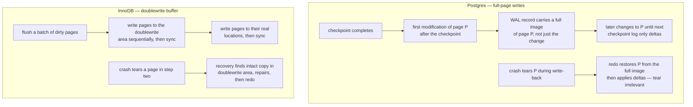
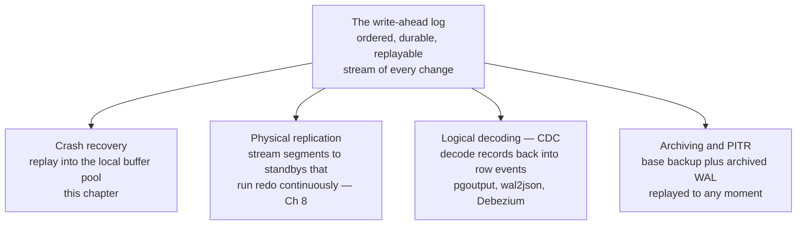

# Chapter 7 — Write-Ahead Logging and Crash Recovery

**What this chapter covers.** Chapter 5 promised that a committed transaction survives a crash —
the D in ACID — and deferred the mechanism. This chapter is the mechanism. The problem is created
by an optimization no serious engine can give up: data pages are modified in the buffer pool and
written back to disk lazily, so at any instant the on-disk state is a torn, partially-updated
mixture of old and new. The solution is the write-ahead log, and its central rule is small enough
to fit on an index card: *before* any change reaches a data page on disk, a log record describing
that change must already be durable, and *commit* means the log is flushed — not that any data page
has been written at all. Everything else in this chapter is the working-out of that rule. We make
the rule precise, examine what actually goes into log records (physical, logical, and the
physiological compromise that won), and descend into the fsync discipline — what `fsync` really
guarantees, the history of hardware that lied about it, and group commit, the batching trick that
makes one disk flush pay for many transactions. We then work through ARIES, the canonical recovery
algorithm, whose three passes — analysis, redo, undo — rest on one deep insight: on restart, first
*repeat history exactly*, including the work of transactions that will be rolled back. We cover
torn pages and the two production defenses (Postgres full-page writes, InnoDB's doublewrite
buffer), checkpointing as the operational dial between runtime overhead and recovery time, and then
widen the lens: the WAL is not just a recovery mechanism but an *interface* — replication ships it
(Chapter 8), change-data-capture decodes it, point-in-time recovery replays it. The
distributed-systems lens completes the thought: the log is the abstraction that distributed systems
generalize, from Raft to Kafka to event sourcing.

Learning goals — after this chapter you should be able to:

- State the WAL rule precisely — both halves of it — and explain why commit is a log flush, not a
  page write.
- Distinguish physical, logical, and physiological logging, and explain why real systems log
  page-oriented redo and logical undo.
- Explain what `fsync` guarantees, what it historically did not, and how group commit converts a
  per-commit flush into an amortized one.
- Walk through ARIES's three passes over a concrete log, explain why redo repeats uncommitted work,
  and explain how CLRs make undo safe against crashes during recovery.
- Explain the torn-page problem and the mechanics of full-page writes and the doublewrite buffer.
- Tune checkpointing consciously: what `checkpoint_timeout` and `max_wal_size` trade against
  recovery time and WAL volume.
- Describe how physical replication, logical decoding, and PITR are all consumers of the same log,
  and connect the WAL to the log abstraction underlying distributed systems.

## The problem: a buffer pool full of unwritten truth

Chapter 2 established the buffer pool: the engine keeps hot data pages in memory, applies every
modification there first, and writes dirty pages back to disk lazily — on eviction, or in the
background, on the checkpointer's schedule. This is not an optional optimization. A single `UPDATE`
may touch a heap page and three index pages; forcing all four to disk, at random offsets, before
acknowledging the statement would tie every transaction to several random writes and their
latencies (Volume 1, Chapter 6). Write-back caching turns that into sequential background I/O and
lets one page absorb hundreds of modifications between flushes.

The price is that the disk is perpetually stale and — worse — *inconsistently* stale. At the moment
of a crash, some dirty pages have been written back and some have not, in no meaningful order. The
on-disk image is a state that never existed logically: page A reflects a transaction whose change
to page B never made it out; half of a B-tree split is on disk and the other half evaporated with
the buffer pool. Two distinct disasters are lurking here, and it pays to name them separately,
because recovery must fix both:

1. **Committed work may be missing.** A transaction committed — the client was told so — but its
   dirty pages were still in memory when the power failed. Durability is violated unless something
   other than the data pages recorded the change.
2. **Uncommitted work may be present.** A transaction was mid-flight, and some of its dirty pages
   were flushed (perhaps evicted under memory pressure) before it aborted or before the crash.
   Atomicity is violated unless something can undo changes that are already on disk.

You could imagine solving both by brute force: never write a dirty page before its transaction
commits (avoiding disaster 2 — a *no-steal* policy), and force all of a transaction's pages to disk
at commit (avoiding disaster 1 — a *force* policy). A force/no-steal engine needs no recovery log
at all. It is also unusable: force reintroduces the random-write storm at every commit, and
no-steal means a large transaction's dirty pages are pinned in memory for its whole lifetime,
capping transaction size at RAM. Every serious engine therefore runs **steal/no-force** — dirty
pages may be written early *and* late — which is exactly the combination that makes both disasters
possible. The write-ahead log is what makes steal/no-force safe.

## The WAL principle, precisely

The idea: keep a separate, append-only file — the log — and record every change there *before* the
change reaches the data files. Appending to one sequential file is the cheapest write pattern
storage offers (Volume 1, Chapter 6), so we pay one cheap sequential write up front to earn the
right to do the expensive random writes lazily, or never before a crash. The discipline has two
halves, and both are load-bearing:

- **The WAL rule (undo half).** Before a dirty page is written to disk, all log records describing
  changes to that page must already be durable in the log. This guarantees that anything on disk
  can be undone: if an uncommitted change made it to a data page, the log record that describes it
  — and identifies the transaction responsible — is on disk too.
- **The commit rule (redo half).** A transaction is committed when its commit log record, and all
  records before it, are durably in the log. Not when its data pages are written — they may not be
  written for minutes. This guarantees that anything committed can be redone: the pages can be
  reconstructed from the log even if none of them were flushed.

Read the second half again, because it inverts the naive picture of what commit means. `COMMIT`
returns when a few hundred bytes have been appended to a sequential file and that file has been
flushed. The heap pages, the index pages, the TOAST pages — all of it may exist only in memory. The
database's authoritative state at any instant is *the log*; the data files are a lazily
materialized cache of it. This framing sounds like rhetoric but is operationally literal: replicas
are built by replaying the log (Chapter 8), backups are restored by replaying the log, and after a
crash the primary itself rebuilds current state by replaying the log. The log is the truth; pages
are an optimization for reading it.

The enforcement mechanism is bookkeeping on both objects. Every log record has a **log sequence
number (LSN)** — in practice a byte offset into the log, hence totally ordered and monotonic. Every
page carries a **pageLSN**: the LSN of the last record that modified it. The buffer manager
enforces the WAL rule with one comparison: a page may be written to disk only if
`pageLSN ≤ flushedLSN`, the durable frontier of the log. If not, flush the log first. This single
comparison is the entire coupling between the buffer pool and the log, and the same pageLSN will
reappear below as the key to making redo idempotent.

## What goes in a log record: physical, logical, physiological

What should a log record actually *say*? The design space has two pure poles and a hybrid, and the
hybrid won so decisively that its name — coined in Gray and Reuter's *Transaction Processing* — is
worth knowing.

**Physical logging** records bytes: "page 4711, offset 200, length 16, old value X, new value Y" —
or, at the extreme, before- and after-images of the whole page. Redo and undo are trivial and
blindly idempotent: overwrite the bytes. The costs are volume — an insert that shifts a slot array
physically changes half the page and must log everything it moved — and rigidity: the log records
where bytes landed, so replay must reproduce byte-identical layouts.

**Logical logging** records operations: "insert tuple T into table R." Compact and
layout-independent — one record covers the heap change and every index update. But redo becomes
treacherous. A logical record can only be replayed against a state where the operation makes sense,
and after a crash the disk holds a mixture: the heap page received the tuple before the crash, the
index page did not. Replaying "insert T" wholesale double-inserts in one place while fixing the
other. Logical redo forces recovery to determine, per structure, whether each operation happened —
exactly the ambiguity a recovery algorithm exists to avoid.

**Physiological logging** — *physical to a page, logical within it* — is the compromise every major
engine landed on. A record names one page physically ("heap page 4711") but describes the change
logically within that page ("insert tuple at slot 3"), letting the page reorganize its internals
freely. Crucially, redo becomes decidable with the pageLSN: because a record targets exactly one
page, and the page atomically carries the LSN of its last applied change, recovery compares
`pageLSN < recordLSN` and knows — per page, with certainty — whether to apply or skip. A
multi-structure operation becomes several physiological records, one per page touched.

Undo is the mirror image, and real systems make it *logical* at the operation level. The reason is
concurrency: after transaction A inserts a key into a B-tree page and aborts, that page may have
been split by transaction B. A physical undo — restore the old page image — would destroy B's
committed work. A logical undo — "delete the key you inserted, wherever it now lives" — navigates
the current tree and removes exactly A's effect. This pairing, **page-oriented physiological redo
plus logical undo**, is what ARIES specifies and what DB2, SQL Server, and InnoDB implement (InnoDB
logs physiological redo in its redo log via mini-transactions and keeps undo as logical
before-images in undo segments — which, as Chapter 6 showed, double as its MVCC version store).
PostgreSQL sits slightly apart in a way we will use below: its WAL carries physiological redo, but
it performs no undo at all — MVCC's old row versions and the commit-status log make uncommitted
data invisible rather than removed.

## The fsync discipline

The WAL rule says "durable in the log," and durability bottoms out in one syscall. Everything about
commit latency follows from what that syscall costs and how often you issue it.

### What fsync actually guarantees — and the lying-disk history

`fsync(fd)` requests that the file's modified data and metadata reach *stable storage* — not merely
the kernel's page cache — before returning (Volume 2, Chapter 6 covers the writeback machinery).
On a modern Linux with a mainstream filesystem, that includes issuing a cache-flush command (and
where useful, FUA — force-unit-access — writes) to the device, so that data sitting in the drive's
volatile write cache is pushed to media. Two honest caveats belong next to that sentence:

- **It was not always so.** For years, consumer drives acknowledged writes on arrival in their
  volatile caches, and parts of the stack failed to send cache-flush barriers — ext3 shipped with
  barriers off by default for a long time. The result was databases that called `fsync`, were told
  yes, and lost acknowledged commits on power failure. The modern stack is trustworthy when
  configured plainly, but the same class of bug reappears wherever a layer buffers and
  acknowledges: virtualized disks with unsafe cache modes, and RAID controllers whose write-back
  caches are only safe if the battery that protects them is actually healthy. Enterprise NVMe
  devices with power-loss-protected caches can honestly acknowledge flushes from cache — that is
  the legitimate version of the trick.
- **Error semantics bite.** In 2018 the PostgreSQL community discovered ("fsyncgate") that on
  Linux, a writeback error is reported to *one* `fsync` call and then cleared — pages are marked
  clean, and a retried `fsync` succeeds while the data was never written. Postgres had been
  retrying; it now PANICs on `fsync` failure and recovers from WAL, and the episode is the
  sharpest available lesson that durability code must treat a failed flush as a crash, not a
  retryable hiccup.

One more precision point that generalizes: durability of a *file* and durability of its *directory
entry* are separate. Creating a new WAL segment durably requires an `fsync` on the directory as
well. Every database and every write-ahead-logging library has a commit history containing this
lesson.

For the data files, engines differ on whether to route through the OS page cache at all. InnoDB
defaults to `O_DIRECT` for data files — the buffer pool is already a cache, and double-buffering
wastes memory and muddles writeback timing. PostgreSQL uses buffered I/O and consciously
cooperates with the page cache. Volume 2, Chapter 6 makes the general case; the point here is that
the WAL itself is almost always written sequentially and flushed explicitly (`fsync`/`fdatasync` or
`O_DSYNC`), because the log's durability, unlike the data files', is on the commit path.

### The log buffer, and when it flushes

Log records are not written to disk one at a time. They are appended to an in-memory **log buffer**
(`wal_buffers` in Postgres, `innodb_log_buffer_size` in InnoDB), which reaches disk on four
triggers:

1. **Commit.** A committing transaction flushes the buffer through its commit record — this is the
   commit rule, and it is the only trigger on the latency-critical path.
2. **Buffer full.** A background writer (Postgres's WAL writer) and foreground backends flush as
   the buffer fills.
3. **Timeout.** The background writer flushes on a short period regardless (`wal_writer_delay`),
   bounding how long records linger.
4. **The WAL rule itself.** Evicting a dirty page whose pageLSN exceeds the flushed LSN forces a
   log flush first, as above.

Trigger 1 is negotiable, and Postgres names the negotiation honestly: `synchronous_commit = off`
acknowledges commit *before* the flush; the WAL writer flushes within roughly three times
`wal_writer_delay`. What you risk is precisely bounded and worth stating without euphemism: a crash
can lose the last few hundred milliseconds of *acknowledged* commits, but — because the WAL rule
(trigger 4) still holds — the database recovers to a consistent state. You lose recent
transactions, never integrity. That trade is honest for high-volume telemetry and wrong for
payments, and it is per-transaction settable, which is the right granularity: `SET LOCAL
synchronous_commit = off` inside the sessions that can afford it. InnoDB's
`innodb_flush_log_at_trx_commit = 0|2` are the same dial with coarser semantics.

### Group commit: one flush, many transactions

An `fsync` costs on the order of tens of microseconds on a good local NVMe, hundreds of
microseconds to milliseconds on network-replicated cloud block storage. If every commit paid its
own flush, commits per second would be capped at flushes per second — a few hundred per second on
cloud disks — regardless of CPU count.

**Group commit** breaks the cap by amortization. When multiple transactions reach commit
concurrently, one flush suffices for all of them: the log is sequential, so flushing through the
*latest* commit record durabilizes every earlier one for free. Implementations elect a leader —
whichever backend initiates the flush — while followers whose commit records are already in the
buffer simply wait for the flushed LSN to pass their record, then acknowledge. Under load the
batching is self-reinforcing: while one flush is in flight, more committers queue behind it, so
the next flush covers a larger group. Throughput scales with concurrency while each transaction
still pays roughly one flush latency. Postgres does this implicitly (with `commit_delay` as a
rarely-needed knob to hold the leader briefly and grow the group); MySQL's binary log implements a
staged leader-follower group commit for the same reason.

Recognize the shape, because this book keeps meeting it: batching converts a fixed per-operation
cost into a shared per-batch cost, buying throughput with (at most bounded) latency. Nagle's
algorithm on the network (Volume 3), writeback coalescing in the OS (Volume 2), and — the direct
descendant — Kafka producer batching (Volume 10, Chapter 3) are the same trade wearing different
uniforms. A senior engineer who has internalized group commit already understands `linger.ms`.

## One commit, end to end

The pieces assemble into a sequence worth having fully explicit in your head. An `UPDATE` followed
by `COMMIT`, on a healthy single-node Postgres with default settings:



Three observations. First, the only synchronous disk write is the sequential log flush; the random
data-page write happens minutes later, off the critical path, and may cover hundreds of accumulated
changes to that page. Second, the WAL record was appended *before* commit but only *flushed* at
commit — the WAL rule constrains ordering relative to *page writes*, not wall-clock eagerness.
Third, if the machine dies between the acknowledgment and the checkpoint, the committed change
exists only in the log — which is exactly the situation recovery is built for.

## ARIES: recovery as three passes over the log

The canonical recovery algorithm is ARIES — *Algorithms for Recovery and Isolation Exploiting
Semantics* — published by C. Mohan and colleagues at IBM in 1992 after years inside DB2. Real
engines vary in detail, but ARIES is the reference frame in which every variation is explained,
including the engines that deviate from it. It assumes exactly the regime we have built:
steal/no-force buffering, physiological redo, logical undo, LSNs on every page.

Two in-memory tables and one humility about checkpoints complete the setup. The **active
transaction table (ATT)** tracks in-flight transactions and the LSN of each one's latest record.
The **dirty page table (DPT)** tracks pages that are dirty in the buffer pool; each entry carries a
**recLSN** — the LSN of the *first* record that dirtied the page since it was last clean, i.e., the
earliest log record whose effect might not be on disk for that page. And checkpoints are **fuzzy**:
a checkpoint cannot stop the world — quiescing all transactions and flushing every dirty page in a
large buffer pool would pause service for seconds to minutes, an availability cost no production
engine will pay. So an ARIES checkpoint flushes *nothing* and forbids *nothing*; it merely writes
the current ATT and DPT into the log between begin- and end-checkpoint records, and records the
checkpoint's location where recovery can find it. A checkpoint is not a promise that the disk is
clean; it is a photograph of exactly *how dirty* things were, so recovery can bound how far back it
must look.

Recovery after a crash makes three passes:



**Analysis** scans forward from the last checkpoint, replaying the *bookkeeping*: the checkpoint's
ATT and DPT snapshots are loaded, then updated per record — new transactions enter the ATT, commit
and abort records retire them, updates to pages absent from the DPT add entries. At the crash
point, analysis has reconstructed what the engine knew in memory at the moment of death: which
transactions were in flight (the **losers**) and which pages might be dirty. The minimum recLSN in
the reconstructed DPT is where redo must start.

**Redo** scans forward from that minimum recLSN and *repeats history*: it reapplies **every**
update — committed transactions, losers, everything — restoring the buffer pool and pages to
exactly the state at the instant of the crash. Idempotency comes from the pageLSN gate: for each
record, if the target page's pageLSN is already ≥ the record's LSN, the effect is on disk — skip;
otherwise apply and set the pageLSN. (The DPT provides a cheaper first-level skip: a page not in
the DPT, or with recLSN beyond this record, needs no read at all.)

Repeating history — including work that is about to be undone — is *the* ARIES insight, and it is
worth dwelling on why. The tempting shortcut is to redo only committed work. But loser transactions
interacted with the same pages as winners under fine-grained locking: a loser's insert may have
split a B-tree page that a winner then also modified. Selective redo would have to reconstruct
committed effects against page states those effects never actually occurred in — the logical-redo
swamp again. Repeating history sidesteps every such case: first return to the exact pre-crash
state, where every page is in a condition the logged operations were actually applied to; *then*
undo the losers as ordinary transaction rollbacks. Recovery-time undo becomes the same code path as
a normal runtime `ROLLBACK`, exercised on every abort rather than only in disasters — a reliability
property as valuable as the correctness one.

**Undo** rolls back the losers, walking each one's chain of log records backward (records carry a
prevLSN linking each transaction's records) and applying logical undo for each. And here ARIES
adds its second signature device: every undo action is itself logged, as a **compensation log
record (CLR)**. A CLR says "I undid record X," and carries an **undoNextLSN** pointing at the next
record *before* X still awaiting undo. CLRs are redo-only — they are never themselves undone — and
that closes the last failure window: a crash *during recovery*. On the next restart, redo repeats
history again, which now includes replaying the CLRs — so the partial undo is restored, not lost —
and the new undo pass resumes exactly where the last one died, following undoNextLSN past
everything already compensated. Undo never repeats an undo and never misses one; recovery is
idempotent no matter how many times it is interrupted. Progress made is progress kept — the log
records it, like everything else.

When undo completes, the database state equals: all committed work, no uncommitted work. Durability
and atomicity, delivered.

### What real engines actually do

InnoDB is close to the ARIES scheme: physiological redo in the redo log, logical undo from undo
segments, fuzzy checkpointing driven by the flushed-LSN horizon. PostgreSQL is the instructive
deviation: **redo only, no undo pass**. Analysis and redo proceed as above (from the last
checkpoint's redo pointer), but losers are simply *left in place* — their heap tuples remain on
disk, marked with their transaction IDs, and since `pg_xact` records those transactions as never
committed, MVCC visibility (Chapter 6) makes the tuples invisible to everyone forever. VACUUM
reclaims the space eventually. Postgres traded the undo machinery for MVCC bloat and vacuum debt —
a trade whose costs Chapter 6 already itemized, but which buys a dramatically simpler recovery
path. The lesson generalizes: *how much recovery you need depends on how destructive your writes
are.* Postgres never overwrites a live tuple, so it never needs to un-overwrite one. The LSM
engines below push the same idea to its endpoint.

## Torn pages, and two defenses

There is a hole in the story so far. Redo assumes the pageLSN is trustworthy — that a page on disk
is *some* consistent version of itself. But a database page (8 KB in Postgres, 16 KB in InnoDB) is
larger than the unit the hardware writes atomically — traditionally a 512-byte or 4 KB sector. A
crash mid-write can leave a **torn page**: the first sectors new, the rest old. Such a page is not
an old version — it is garbage with a plausible header. Its pageLSN might read as current while
half its contents are stale; per-record redo, applied to garbage, produces garbage. Checksums
(`data_checksums` in Postgres, mandatory page checksums in InnoDB) *detect* the tear; something
else must repair it. The two production answers bracket the design space:



**Postgres: full-page writes.** With `full_page_writes = on` (the default, and effectively
mandatory on ordinary storage), the *first* modification of each page after a checkpoint logs a
complete image of the page instead of a delta. Redo then never needs the on-disk page's prior
contents for that first touch — it overwrites wholesale from the image, and subsequent delta
records apply on top of a known-good base. The tear is simply never read. The cost is WAL volume,
and it has a characteristic signature every Postgres operator learns: **WAL output spikes sharply
just after each checkpoint**, when the working set's pages take their first post-checkpoint
touches, then decays as pages accumulate deltas instead. Shorter checkpoint intervals mean more
frequent spikes — the first concrete reason checkpoint frequency is a real cost dial.
`wal_compression = on` blunts the volume, spending CPU to compress the images.

**InnoDB: the doublewrite buffer.** InnoDB writes every flushed page *twice*: first into a small
dedicated doublewrite area (its own files since MySQL 8.0.20; a region of the system tablespace
before that) as a batch of sequential writes plus a sync, then to the pages' real locations. A tear
can now only exist in one of the two copies. On recovery, InnoDB scans the doublewrite area; any
page whose home copy fails its checksum is repaired from the doublewrite copy, and only then does
redo run. The cost is on the page-flush path — every data-page write is doubled — rather than in
the log, but the first copy is sequential and batched, so the practical overhead is modest (and it
is off the commit path entirely, since page flushing is background work). On storage that
guarantees atomic 16 KB writes, `innodb_doublewrite` can be disabled — the same class of hardware
assumption that lets Postgres operators consider `full_page_writes = off` on filesystems with
copy-on-write semantics like ZFS, and it should be believed only with the vendor's guarantee in
writing.

## Checkpoints as an operational dial

A checkpoint's job, in both engines, is to bound recovery: redo starts at (roughly) the
checkpoint's position, so the interval between checkpoints is the amount of log recovery may need
to replay. That makes checkpoint frequency a genuine two-sided dial, one of the few in a database
where the trade is clean:

- **Checkpoint more often** → less log to replay → faster crash recovery; but more full-page-write
  spikes (Postgres), more repeated flushing of the same hot pages, more background I/O competing
  with foreground work.
- **Checkpoint less often** → less runtime overhead and less WAL volume; but recovery replays
  more, and after a crash the database is down for the duration of that replay. Recovery time *is*
  availability: replaying twenty minutes of log is a twenty-minute outage appended to every crash.

Postgres exposes the dial directly, and the honest reading of each knob:

```ini
# postgresql.conf — WAL and checkpoint settings that matter, honestly annotated

wal_level = replica            # minimal: enough WAL for crash recovery only.
                               # replica: adds what physical standbys and PITR need
                               #   (the default, and the floor for any serious setup).
                               # logical: adds tuple metadata for logical decoding/CDC.
                               # Each step costs WAL volume; step up only for the
                               # consumers below.

synchronous_commit = on        # on: commit waits for local WAL flush — the durability
                               #   contract this chapter is about.
                               # off: ack before flush; can lose the last ~600ms of
                               #   acknowledged commits on crash, never consistency.
                               # remote_write / on / remote_apply also gate on a
                               #   synchronous standby — Chapter 8's territory.

checkpoint_timeout = 15min     # upper bound between checkpoints. The default 5min is
                               # conservative; longer intervals cut full-page-write
                               # volume at the price of longer crash recovery.

max_wal_size = 4GB             # soft cap on WAL between checkpoints; crossing it forces
                               # an early checkpoint. Size it so checkpoints are driven
                               # by the timeout, not by this — a WAL-size-triggered
                               # checkpoint arriving early is the classic cause of
                               # surprise I/O storms under write bursts. Watch for
                               # "checkpoints are occurring too frequently" in the log.

checkpoint_completion_target = 0.9   # spread the checkpoint's page write-back over 90%
                                     # of the interval instead of slamming it out at
                                     # once — a steady trickle, not a periodic cliff.

full_page_writes = on          # torn-page defense; see above. Leave on unless your
                               # storage atomically writes 8KB pages and you can prove it.
wal_compression = on           # compress full-page images; CPU for WAL volume.
```

The spreading knob deserves the extra sentence: early Postgres wrote each checkpoint's dirty pages
as fast as possible, producing a periodic latency cliff as the burst saturated the device and
fsync stalls rippled into commits. `checkpoint_completion_target` schedules the same writes as a
paced trickle across the interval. The pattern — replace periodic bursts with continuous paced
background work — recurs in LSM compaction scheduling (Chapter 2) and in every system that ever
had a "stop-the-world flush" phase it learned to regret.

What the log's contents actually look like is worth seeing once. `pg_waldump` decodes WAL segments
into one line per record — LSN, transaction, resource manager, and the physiological description:

```text
$ pg_waldump 000000010000000000000016 | head -8
rmgr: Heap   len (rec/tot):   54/   54, tx: 771, lsn: 0/16A2A18, prev 0/16A29D0,
  desc: INSERT off: 3, flags: 0x00, blkref #0: rel 1663/16384/16402 blk 9
rmgr: Btree  len (rec/tot):   53/   53, tx: 771, lsn: 0/16A2A50, prev 0/16A2A18,
  desc: INSERT_LEAF off: 42, blkref #0: rel 1663/16384/16408 blk 4
rmgr: Heap   len (rec/tot):   66/ 8250, tx: 772, lsn: 0/16A2A88, prev 0/16A2A50,
  desc: UPDATE off: 7 xmax: 772 flags: 0x10, blkref #0: rel 1663/16384/16402 blk 12 FPW
rmgr: Transaction len (rec/tot): 34/ 34, tx: 771, lsn: 0/16A4AD0, prev 0/16A2A88,
  desc: COMMIT 2026-08-14 09:41:07.114 UTC
```

Every concept in this chapter is on display: one logical `INSERT` became two physiological records
(heap page, then B-tree leaf page), each naming exactly one block; LSNs are byte positions with
`prev` back-links forming each transaction's chain; the `UPDATE` at `0/16A2A88` happened to be the
first touch of block 12 after a checkpoint, so its record carries a full-page image — note the
`FPW` flag and the total length jumping to 8250 bytes for a 66-byte logical change; and the commit
record for transaction 771 is just another entry in the stream, whose flush was the moment 771's
durability became fact.

## The log as an interface

Everything so far treats the WAL as a crash-recovery mechanism. But look at what the engine has
been forced to build in order to recover: a totally ordered, durable, replayable stream of every
change to the database. That artifact is too useful to leave to crashes, and mature systems expose
it in four directions:



**Physical replication is recovery, running forever.** A streaming standby is a server that starts
in recovery mode and never leaves it: the primary ships WAL as it is generated, and the standby's
apply process is the same redo loop this chapter described, running continuously against a live
buffer pool. Synchronous replication reuses the commit rule with a wider definition of "durable":
`synchronous_commit = remote_write` or `on` makes the commit flush wait for a standby's
acknowledgment too. Chapter 8 takes this up properly; note here only that no new machinery was
invented — replication is the recovery subsystem pointed at another machine.

**Logical decoding turns the WAL into an event stream.** The physiological records were written
for redo, but with `wal_level = logical` they carry enough metadata to be decoded *backward* into
the row-level changes that produced them — "insert into `orders`, columns (…)", grouped by
transaction, in commit order. Postgres exposes this through replication slots and output plugins
(`pgoutput` feeds built-in logical replication; `wal2json` emits JSON), and change-data-capture
platforms — Debezium is the canonical one — sit on this interface to publish every committed
change into Kafka. This is the honest solution to the dual-write problem that Chapter 5 flagged
and Volume 10, Chapter 6 develops as the outbox/CDC pattern: instead of writing to the database
*and* separately to a message bus (two non-atomic writes that will eventually disagree), write
only the transaction, and let the log — which already totally orders and durably records every
commit — be the bus's source of truth. One caution from operations: a replication slot pins WAL
until its consumer confirms receipt, so a dead consumer causes unbounded WAL retention; monitor
slot lag or learn this during a disk-full incident.

**PITR: the backup that is actually a log replay.** Archive every completed WAL segment
(`archive_command`, or streaming via `pg_receivewal`), take periodic *base backups* — filesystem
copies of the data directory, taken online with no quiesce needed — and you can reconstruct the
database as of *any* moment between the base backup and now: restore the base backup, then replay
archived WAL up to a target. The base backup's internal inconsistency (pages copied at different
times while writes continued) is exactly the inconsistency crash recovery already fixes — replay
handles it, which is why online backups work at all. The restore, in sketch:

```bash
# 1. Restore the base backup into an empty data directory
tar -C /var/lib/postgresql/17/main -xf /backups/base/2026-08-13T02:00.tar

# 2. Tell recovery where archived WAL lives, and when to stop
cat >> /var/lib/postgresql/17/main/postgresql.auto.conf <<'EOF'
restore_command = 'cp /wal-archive/%f %p'
recovery_target_time = '2026-08-14 09:37:00+00'   # just before the bad deploy
recovery_target_action = 'promote'
EOF
touch /var/lib/postgresql/17/main/recovery.signal

# 3. Start postgres; it replays WAL to the target time, then promotes
```

This is the tool for the failure replication cannot fix: a bad `DELETE`, a botched migration, a
compromised credential. Replication faithfully replicates the disaster within seconds; PITR winds
time back to just before it. And the operational discipline matters more than the mechanism: **an
untested backup is a hope, not a backup.** Restore paths fail silently — an `archive_command` that
started erroring months ago, a base backup missing a tablespace, a target time in the wrong zone —
and the only way to know your recovery time and your recovery *works* is to run the restore on a
schedule, automatically, and fail loudly when it breaks. Volume 11 returns to this as a pillar of
operational readiness; the engineers who skip it find out during the incident.

## LSM engines: the same rule, a shorter story

Chapter 2's LSM-tree engines — RocksDB, Cassandra's storage layer, and kin — obey the identical
WAL principle with a strictly simpler recovery, and the contrast illuminates *why* ARIES is as
elaborate as it is. An LSM write goes to the memtable (in memory) and, first, to a WAL — same
rule: log durable before acknowledgment, commit is a log flush, group commit amortizes it.

But recovery is redo-only and trivial: replay the WAL into a fresh memtable, done. No analysis
pass reconstructing dirty-page state, no undo, no CLRs, no torn-page defense for data files. Every
complication in ARIES traces back to one property of B-tree engines: they **update pages in
place**, so the disk can hold half-applied, torn, or uncommitted states of shared structures. LSM
engines never update in place — SSTables are written once, immutably, and an incomplete SSTable
from a crash mid-flush is simply discarded and rebuilt from the WAL that still covers its
contents. Once flushed, an SSTable's WAL can be dropped; compaction (Chapter 2) rewrites data into
new immutable files rather than modifying old ones. The design bet is visible in the recovery
code: ARIES-class recovery is thousands of lines of subtle bookkeeping; LSM recovery is "replay
the tail of the log." Immutability didn't eliminate the WAL — nothing eliminates the WAL — but it
eliminated almost everything recovery had to be clever about.

## The distributed-systems lens: the log is the abstraction

Jay Kreps's 2013 essay "The Log: What every software engineer should know about real-time data's
unifying abstraction" made an argument this chapter has been quietly assembling: the write-ahead
log is not a database implementation detail — it is the fundamental primitive, and distributed
systems are largely the WAL, generalized. The correspondences are exact enough to be load-bearing:

**State-machine replication is log shipping.** The oldest theorem in distributed systems: if
deterministic replicas apply the same operations in the same order, they hold the same state. "The
same operations in the same order" *is* a log. Primary-replica database replication ships the WAL
(Chapter 8). Raft and Paxos-based systems (Volume 6, Chapter 6) are, at their core, protocols for
agreeing on the contents of a replicated log — Raft's central data structure is literally named
the log, with its own LSNs (term and index) and its own commit rule (an entry is committed when
replicated to a majority). Consensus is the WAL rule negotiated among peers who can fail
independently.

**Commit generalizes from one fsync to a quorum of logs.** On a single node, durable means "my log
is flushed." In a replicated system, durable means "the log entry exists in enough logs" — a
quorum — so that any surviving majority contains it. Postgres's `synchronous_commit =
remote_write` sits exactly on the boundary between the two worlds: one commit rule, progressively
widened. Volume 6 makes this the definition of durability in distributed storage.

**Kafka is a WAL as a service.** Strip the buffer pool, the B-trees, and the query engine from
this chapter, keep the append-only ordered durable log with offsets for LSNs and consumers running
redo at their own pace, and you have described a Kafka partition (Volume 10, Chapter 3). Consumer
offset tracking is the flushed-LSN frontier; log compaction is checkpointing's space-reclamation
role; producer batching (`linger.ms`, `batch.size`) is group commit re-invented at the client.
Kreps was a Kafka author; the essay is the design document.

**Event sourcing is the application-level WAL** (Volume 10, Chapter 5): persist the ordered log of
domain events as the source of truth and materialize current state as views derived by replay.
Every property this chapter established reappears — replay is recovery, snapshots are checkpoints
bounding replay time, and the CDC pipeline above is the bridge by which a conventional database's
WAL feeds such architectures without dual writes.

**Recovery-by-replay is the universal pattern.** A crashed Postgres redoes its WAL tail; a
rebooted Raft follower replays its log and fetches what it missed from the leader; a restarted
stream processor rewinds its Kafka offsets and reprocesses; a new cache node warms from the event
stream. In every case the durable log is authoritative and the queryable state is a disposable
materialization — which is precisely the "pages are a cache of the log" inversion from the start
of this chapter. Internalize it once, at the level of a single database's WAL, and you have the
mental model for most of Volumes 6 and 10: the systems differ in how many machines hold the log
and how they agree on its contents; they do not differ in what the log *is*.

## Key takeaways

- Buffer pools make on-disk state perpetually inconsistent; **steal/no-force** buffering is
  mandatory for performance and is exactly what makes crashes dangerous. The WAL makes it safe.
- **The WAL rule**: log records durable before the pages they describe (enables undo);
  **commit = log flushed**, not pages written (enables redo). The log is the authoritative state;
  data files are a materialized cache of it — literally, not rhetorically.
- Real systems log **physiological redo** (physical to a page, logical within it) because the
  pageLSN comparison makes replay decidable and idempotent, and **logical undo** because pages are
  shared with committed work that physical undo would destroy.
- `fsync` is the durability primitive: know its history (volatile caches, missing barriers), its
  error semantics (fsyncgate: a failed fsync is a crash, not a retry), and its cost — which
  **group commit** amortizes across concurrent transactions, the same batching trade as producer
  batching everywhere else. `synchronous_commit = off` risks the last moments of acknowledged
  commits, never consistency.
- **ARIES**: analysis rebuilds the transaction and dirty-page tables from a fuzzy checkpoint; redo
  **repeats history** from the minimum recLSN — including losers, so undo always runs against real
  states; undo rolls back losers writing **CLRs**, which make recovery idempotent under repeated
  crashes. Postgres skips undo entirely by letting MVCC visibility hide losers.
- Pages exceed the atomic write unit, so crashes **tear pages**; Postgres logs **full-page
  images** on first post-checkpoint touch (hence WAL spikes after checkpoints), InnoDB writes
  pages twice through the **doublewrite buffer**.
- **Checkpoint frequency is a dial**: recovery time (availability after a crash) versus runtime
  I/O and full-page-write volume. Spread checkpoints; size `max_wal_size` so the timeout, not the
  size cap, drives them.
- The WAL is an **interface**, not just a mechanism: physical replication is recovery running
  forever on another machine; logical decoding/CDC turns it into an event stream and solves the
  dual-write problem; PITR is base backup plus replay-to-timestamp — and **an untested backup is a
  hope, not a backup**.
- LSM engines keep the WAL rule but get **redo-only, trivial recovery** because immutable SSTables
  remove in-place updates — the source of everything ARIES has to be clever about.
- Distributed systems generalize the WAL: Raft replicates a log, quorum commit widens the fsync,
  Kafka serves the log as a product, event sourcing applies it at the application layer.
  Recovery-by-replay is the universal pattern.

## Further reading

- Mohan, C., Haderle, D., Lindsay, B., Pirahesh, H., and Schwarz, P., "ARIES: A Transaction
  Recovery Method Supporting Fine-Granularity Locking and Partial Rollbacks Using Write-Ahead
  Logging," *ACM Transactions on Database Systems* 17(1), 1992 — the canonical recovery paper;
  long, and worth the effort at least through the repeating-history and CLR sections.
- Gray, J. and Reuter, A., *Transaction Processing: Concepts and Techniques* (Morgan Kaufmann,
  1992) — the definitive treatment of logging, recovery, and the physiological-logging vocabulary
  used in this chapter.
- Kreps, J., "The Log: What every software engineer should know about real-time data's unifying
  abstraction" (LinkedIn Engineering, 2013) — the essay behind this chapter's distributed-systems
  lens. https://engineering.linkedin.com/distributed-systems/log-what-every-software-engineer-should-know-about-real-time-datas-unifying
- PostgreSQL documentation, "Reliability and the Write-Ahead Log" and "WAL Configuration" — the
  authoritative source for `wal_level`, `synchronous_commit`, checkpoint behavior, and
  full-page writes. https://www.postgresql.org/docs/current/wal.html
- PostgreSQL documentation, "Continuous Archiving and Point-in-Time Recovery" — the normative
  PITR procedure sketched above.
  https://www.postgresql.org/docs/current/continuous-archiving.html
- MySQL 8.x Reference Manual, "InnoDB On-Disk Structures: Doublewrite Buffer" and "InnoDB Recovery"
  — the doublewrite mechanics and InnoDB's redo/undo split.
- Hellerstein, J., Stonebraker, M., and Hamilton, J., "Architecture of a Database System,"
  *Foundations and Trends in Databases* 1(2), 2007 — a compact survey placing logging and recovery
  within whole-engine architecture.
- The PostgreSQL "fsyncgate" mailing-list thread and follow-up conference talks (2018–2019) on
  Linux fsync error semantics — the modern cautionary tale about what durability code may assume.
- Volume 2, Chapter 6 — the page cache, writeback, `fsync`, and `O_DIRECT` from the OS side.
- Chapter 2 of this volume — buffer pools and LSM engines; Chapter 8 — replication as WAL
  shipping; Volume 6, Chapter 6 — consensus and the replicated log; Volume 10 — Kafka and event
  sourcing, the log as a first-class system.
