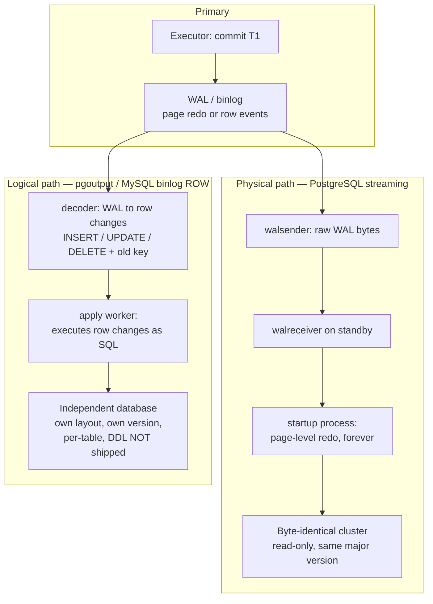
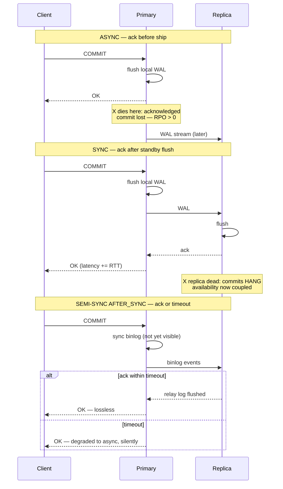
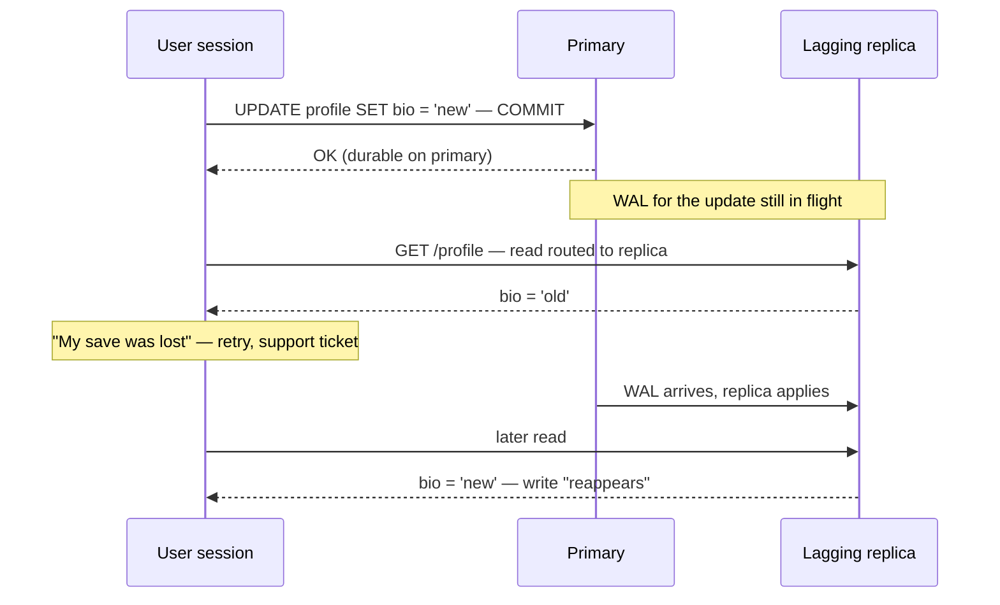
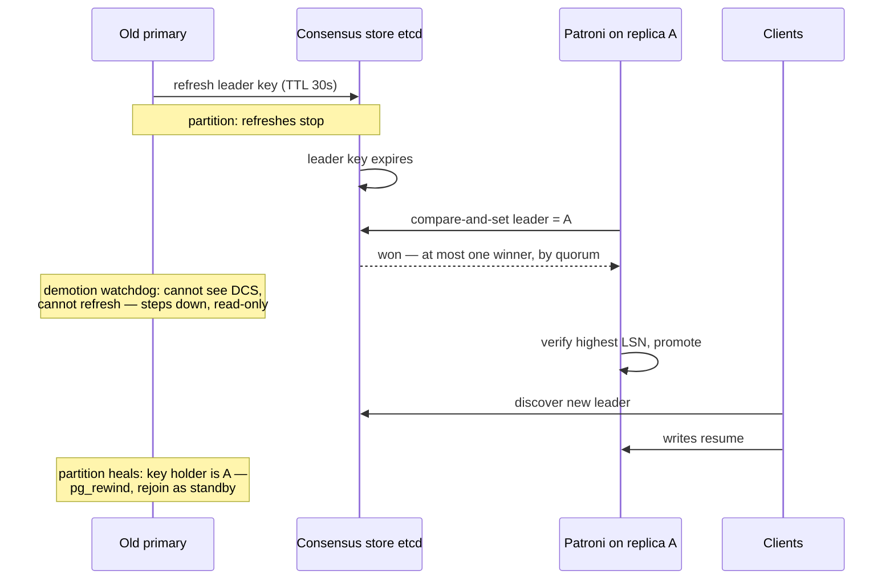

# Chapter 8 — Replication: Physical, Logical, Sync, and Async

**What this chapter covers.** Chapter 7 established that the write-ahead log is the database's
source of truth: the heap and indexes are just a cache of what the log says. This chapter follows
the log out of the machine. Replication is the practice of shipping a database's changes to other
machines so that more than one copy of the data exists, and every replication design answers two
independent questions: **what travels on the wire** (physical bytes of WAL, decoded logical row
changes, or — historically and disastrously — the SQL statements themselves) and **when the
primary acknowledges a commit** (before the copy exists anywhere else, or after). The first
question determines what your replicas can do; the second determines how much data you lose when
the primary dies and how much latency every commit pays while it lives.

The central fact of the chapter is that **an asynchronous replica is a store buffer one layer up**.
If you worked through Volume 4, Chapter 3 — Memory Models and Happens-Before, you already know the
shape of every anomaly here: a write acknowledged to its author but not yet visible to another
observer, and the whole family of "impossible" readings that follow. The mitigations will look
familiar too, because they are the same mitigations — ordering tokens, session guarantees, and
paying latency to buy back visibility. We cover the mechanics of physical and logical replication
in PostgreSQL and MySQL with real configuration, the sync/async/semi-sync spectrum and its exact
failure modes, replication lag as a production discipline (causes, honest monitoring, and the
anomaly catalogue), failover without the vendor gloss — including split brain and why serious
tooling delegates leader election to a consensus store — and a clear-eyed look at multi-primary.
Volume 6 generalizes all of it; this chapter is the single-system foundation.

Learning goals — after this chapter you should be able to:

- Separate the two axes of every replication design — what ships and when acks happen — and place
  any system you meet on both.
- Explain physical WAL shipping versus logical decoding: what each replica can and cannot do, the
  version and architecture constraints, and the DDL and replica-identity caveats of logical.
- Explain why statement-based replication lost to row-based, with the actual nondeterminism cases.
- Describe PostgreSQL `synchronous_commit` levels and `synchronous_standby_names` quorum syntax,
  and MySQL semi-synchronous replication including `AFTER_SYNC` versus `AFTER_COMMIT`, accurately.
- Diagnose replication lag: name its causes, monitor it without being lied to, and enumerate the
  read anomalies it produces.
- Implement read-your-writes routing with LSN waits (PostgreSQL) and GTID waits (MySQL).
- Run a failover honestly: detection false positives, choosing the most-advanced replica,
  `pg_rewind`, fencing, and why Patroni keeps its leader key in a consensus store.
- Argue for or against multi-primary for a given workload, and say what LWW actually costs.

## Why replicate, and what it costs

Four reasons justify nearly every replication deployment:

1. **Availability.** One machine is a single point of failure. A warm copy turns "restore from
   last night's backup" into "promote and repoint," shrinking recovery from hours to minutes.
2. **Read scaling.** Most OLTP workloads are read-heavy. Replicas multiply read capacity without
   touching the write path.
3. **Locality.** A replica in Frankfurt serves Frankfurt reads at 2 ms instead of 90 ms
   trans-Atlantic. (Multi-region architecture is Volume 7, Chapter 10; the replication substrate
   is this chapter.)
4. **Workload isolation.** Backups, analytics scans, and ad-hoc queries run against a replica so
   the primary's buffer pool and I/O budget serve production traffic.

The bill arrives in four currencies. **Lag**: a replica is always somewhat behind, and "somewhat"
has a heavy tail. **Anomalies**: readers of a lagging replica observe states of the database that
the primary's history never contained side by side — you post a comment, refresh, and it is gone.
**Failover complexity**: promotion is the most dangerous routine operation in database
administration, because doing it wrong loses data or splits the brain. **Operational surface**:
replication slots that fill disks, sync standbys that block commits, replicas that silently
drift. None of these are reasons not to replicate — running a serious system on one copy is
malpractice — but each one must be engineered for, not discovered.

Keep the two axes separate as you read. *What ships* — physical, logical, statement — is about
fidelity and flexibility. *When acks happen* — async, sync, semi-sync — is about durability and
latency. They compose freely: PostgreSQL physical replication can be async or quorum-sync;
MySQL's logical binlog stream can be async or semi-sync. Conflating the axes is the most common
source of confused replication discussions.

## What ships: physical, logical, statement

### Physical replication: shipping the WAL itself

Chapter 7's punchline was that the WAL fully determines the database state: replay the log from a
consistent base and you reconstruct every page. Physical replication weaponizes that. The primary
streams the **byte-identical WAL** to replicas, and each replica runs continuous crash recovery,
applying page-level redo records forever. A physical replica is not "a copy of your tables" — it
is a copy of your *cluster*, bit for bit: same pages, same bloat, same indexes, same everything.

In PostgreSQL this is **streaming replication**. A `walsender` process on the primary ships WAL
to a `walreceiver` on the standby; the standby's startup process applies it. Setup is a base
backup plus a handful of parameters:

```bash
# On the standby: clone the primary and configure streaming in one step
pg_basebackup -h primary.db.internal -U replicator -D /var/lib/postgresql/17/main \
    --wal-method=stream --write-recovery-conf --checkpoint=fast
# --write-recovery-conf creates standby.signal and sets primary_conninfo
```

```ini
# postgresql.conf on the primary
wal_level = replica            # the default since PostgreSQL 10
max_wal_senders = 10
# Replication slots make the primary retain WAL until this standby confirms it.
# Cap the retention or a dead standby fills the primary's disk:
max_slot_wal_keep_size = 100GB
```

```sql
-- On the primary: a slot per standby, so WAL is never recycled out from under it
SELECT pg_create_physical_replication_slot('standby_fra_1');
```

The properties all follow from "byte-identical":

- **Low overhead.** The primary was writing this WAL anyway (Chapter 7); replication adds a
  network send. No decoding, no per-row work.
- **Complete fidelity.** DDL, sequences, all of it — because none of it is special. It is all
  just pages.
- **Everything replicates, so nothing is optional.** You cannot replicate one database or one
  table; the unit is the whole cluster.
- **Same major version, same architecture.** WAL records address pages in an on-disk format that
  changes across major versions and differs by platform. A 16 primary cannot stream to a 17
  standby, which is why major-version upgrades under physical replication require logical
  methods or downtime.
- **Replicas are strictly read-only.** The standby's state *is* the replayed WAL; a local write
  would diverge from it. PostgreSQL's **hot standby** mode lets the standby serve read-only
  queries during replay — with a conflict problem we return to under lag.

MySQL has no equivalent of streaming physical replication in the server itself; its native
replication is logical (below). Physical copies in the MySQL world come from backup tooling
(Percona XtraBackup, MySQL Enterprise Backup) used for provisioning, not for continuous
replication.

### Logical replication: shipping decoded changes

Logical replication ships **row changes as data**, not page images: "in table `orders`, insert
this tuple; in `accounts`, update the row whose key is 42 from these values to those." The
stream is a sequence of typed change events, which decouples the replica's physical layout,
version, and even engine from the primary's.

PostgreSQL implements this as **logical decoding**: the same WAL is read, but a decoding plugin
reassembles page-level records into transactions of row changes. The built-in plugin, `pgoutput`,
drives the publication/subscription system (PostgreSQL 10+):

```sql
-- On the publisher
CREATE PUBLICATION billing_pub FOR TABLE invoices, payments;

-- On the subscriber (which may be a different major version)
CREATE SUBSCRIPTION billing_sub
    CONNECTION 'host=primary.db.internal dbname=billing user=replicator'
    PUBLICATION billing_pub;
-- Performs an initial table copy, then streams changes via a logical slot.
```

The flexibility is real: per-table granularity, cross-major-version streaming (the standard
low-downtime upgrade path), subscribers that also hold their own writable tables, fan-in from
multiple publishers, heterogeneous targets via the same decoding interface (Debezium reads
`pgoutput` into Kafka). The caveats are equally real and bite in production:

- **DDL is not replicated.** `ALTER TABLE` on the publisher is not sent; the subscriber's apply
  worker errors when row images stop matching the schema. Schema changes must be coordinated —
  applied on the subscriber first for additive changes, orchestrated carefully otherwise.
- **Replica identity.** To ship an `UPDATE` or `DELETE`, the publisher must know how to identify
  the row on the subscriber. By default that is the primary key (`REPLICA IDENTITY DEFAULT`);
  a published table with no key must be set to `REPLICA IDENTITY FULL` (whole old row in every
  change — expensive) or updates and deletes on it simply fail on the publisher.
- **Sequences do not replicate**, so after a failover-by-logical-replica, sequences must be
  advanced manually past the maximum used values. Large objects are likewise excluded.

MySQL's native replication has always been logical: the primary writes a **binary log** of
changes, replicas' I/O threads pull it into a relay log, and applier threads execute it. With
`binlog_format = ROW` (the default since 5.7.7), events carry before/after row images — the same
species of stream as `pgoutput`, and the reason the MySQL ecosystem grew change-data-capture
tooling a decade before PostgreSQL's became mainstream.



### Statement-based replication: the cautionary tale

The historically obvious design — replay the SQL text itself on each replica — was MySQL's
original and, until 5.7.7, default mode. It is compact and human-readable, and it is wrong,
because SQL statements are not deterministic functions of database state.

The famous examples are `NOW()` and `RAND()`, and the history is instructive: MySQL actually
*patched* both, shipping the statement's timestamp and the random seed alongside the event, so
the textbook examples eventually worked. What killed the approach was the unwinnable tail:
`UUID()`, `SYSDATE()`, user-defined and stored functions with side effects, `LIMIT` without a
deterministic `ORDER BY` (which rows did the primary delete?), concurrent transactions whose
apply order on the replica differs from commit order on the primary under anything weaker than
serializable. Each case produced *silent divergence*: no error, just a replica whose contents
drift from the primary's, discovered months later by a checksum run (`pt-table-checksum` exists
precisely because of this era). Row-based replication won because it replicates *effects*, which
are deterministic by construction. `binlog_format = STATEMENT` survives as a compatibility
setting; treat it as a historical artifact, and treat its lesson as general: **replicate
decisions, not the process that made them**, whenever the process can be nondeterministic.
(Consensus-based state machine replication makes the same choice for the same reason — Volume 6,
Chapter 5.)

## When acks happen: async, sync, and the honest middle

Everything above describes a pipeline; this axis decides where in the pipeline `COMMIT` returns.

### Asynchronous: fast, and lossy on the worst day

The default everywhere. The primary flushes its own WAL (Chapter 7's durability contract),
acknowledges the client, and ships the WAL to replicas *afterward*, on whatever schedule the
network allows. Commit latency is unchanged from a standalone server, and replicas can be slow,
distant, or down without affecting writes.

The cost is stated in one acronym: **RPO — recovery point objective — is greater than zero.** If
the primary's disk dies right now, every transaction acknowledged but not yet shipped is gone.
That window is exactly the replication lag: milliseconds in the happy case, minutes or hours
under the pathologies covered below. And the loss is invisible until failover, at which point
"we promoted the replica" quietly means "we deleted the last N seconds of acknowledged writes."
The companion term is **RTO — recovery time objective** — how long until service is restored;
async replication buys good RTO while leaving RPO exposed.

### Synchronous: durable, and coupled

Synchronous replication moves the acknowledgment after the replica confirms. PostgreSQL's
`synchronous_commit` setting names the exact confirmation point, and the levels are worth
knowing precisely because they are distinct promises:

| `synchronous_commit` | Commit returns when | Guarantee |
|---|---|---|
| `off` | WAL handed to the walwriter, not yet flushed locally | Can lose recent async-committed transactions on a *primary* crash (no corruption — Chapter 7) |
| `local` | Local WAL flushed to disk | Standalone durability; nothing about replicas |
| `remote_write` | Sync standby has *written* WAL to its OS | Survives standby postgres crash, not standby OS crash |
| `on` (default) | Sync standby has *flushed* WAL to disk | RPO = 0 for that standby |
| `remote_apply` | Sync standby has *applied* WAL | The commit is also *visible* to reads on the standby |

`remote_apply` is the interesting outlier: it is not about durability but visibility — after
commit, a read routed to that standby will see the write, which makes it a blunt (and
latency-expensive) read-your-writes mechanism.

The costs: every commit pays a network round trip to the slowest required standby, and —
the part people forget — **availability couples to the standby**. With a single named
synchronous standby, that standby going down does not merely raise latency; commits *hang*,
waiting for an acknowledgment that will never come. Your durability guarantee has converted a
replica failure into a primary outage. (A canceled hanging commit is a special trap: the
transaction *is* committed locally — cancel only stops the waiting — so the client's "error"
does not mean rollback.)

Hence quorum syntax. PostgreSQL's `synchronous_standby_names` accepts:

```ini
# Priority-based: s1 and s2 are sync; s3 promotes to sync if one dies
synchronous_standby_names = 'FIRST 2 (s1, s2, s3)'
# Quorum-based: any one ack from the set suffices — survives any single standby failure
synchronous_standby_names = 'ANY 1 (s1, s2, s3)'
```

`ANY k (n)` is the sane production shape: `ANY 1 (s1, s2)` gives RPO = 0 as long as *some*
standby is alive, at the cost of the fastest standby's RTT rather than the slowest's. Note what
it does not give you: on failover you must promote a standby that actually holds the
acknowledged WAL — with `ANY 1` of two standbys, one of them may be behind — so promotion logic
must compare positions, not pick arbitrarily. This is a two-line preview of quorum intersection
reasoning, which Volume 6, Chapter 7 develops properly.

### Semi-synchronous: MySQL's negotiated settlement

MySQL's semi-synchronous plugin waits for a configurable number of replica acknowledgments
(`rpl_semi_sync_source_wait_for_replica_count`, default 1) that the transaction's binlog events
have been *received and flushed to the replica's relay log* — not applied. Two details matter.

First, the wait point. `rpl_semi_sync_source_wait_point = AFTER_SYNC` (the default since 5.7,
"lossless semi-sync") waits after the primary syncs its binlog but **before** the storage-engine
commit makes the transaction visible to other clients. If the primary dies during the wait, no
client ever observed the transaction, so failing over to the replica that lacks it loses nothing
anyone saw. The older `AFTER_COMMIT` waited after the transaction became visible, opening a
window where other sessions could read a transaction that then vanished in failover — a
committed read of data that never survived. The rename from "semi-sync" to "lossless semi-sync"
was this one-line change of wait point.

Second, the escape hatch: if no replica acknowledges within `rpl_semi_sync_source_timeout`
(default 10 000 ms), the primary **silently degrades to asynchronous** and keeps committing. This
is the deliberate opposite of PostgreSQL's hang: MySQL chooses availability, PostgreSQL chooses
durability, and both are defensible — but you must know which contract you hold. A semi-sync
deployment is only RPO = 0 *while the light is green*, so monitoring
`Rpl_semi_sync_source_status` is part of the durability story, not an optional nicety.



## Replication lag: the production discipline

Lag is not an edge case; it is the steady-state property that defines what an async replica is.
The question is never "is there lag" but "how much, how variable, and what does your application
do about it."

### Where lag comes from

**Single-threaded apply.** The primary executed transactions on dozens of cores; historically,
replicas replayed them on one. MySQL's SQL thread was strictly serial until 5.6, and useful
parallelism arrived with `replica_parallel_type = LOGICAL_CLOCK` (transactions that were in the
primary's group-commit window together are provably non-conflicting and can apply in parallel)
and, better, `binlog_transaction_dependency_tracking = WRITESET`, which tracks actual row-set
overlap and extracts far more parallelism from single-threaded primaries. PostgreSQL physical
replay is still a single startup process — mitigated by the fact that page-level redo is much
cheaper than re-executing SQL — and logical replication applies serially per subscription, with
PostgreSQL 16 adding parallel apply only for large in-progress ("streamed") transactions. The
structural rule: a replica must respect commit-order constraints that the primary discovered
dynamically, so the primary's parallelism is always an upper bound the replica approaches from
below.

**Long and large transactions.** A one-hour batch `UPDATE` on the primary commits as a wall of
log the replica must chew through; logical replication is worse because most decoders begin
shipping at commit, so the replica starts an hour behind by construction.

**Recovery conflicts on hot standby** — the PostgreSQL-specific classic. A long report query on
the standby holds a snapshot needing tuple versions that VACUUM on the primary has meanwhile
removed (Chapter 6's xmin-horizon disease, now spanning two machines). The standby's replay
reaches the VACUUM record and must choose: apply it and break the query, or wait and fall
behind. `max_standby_streaming_delay` (default 30 s) sets the choice — replay pauses up to this
long, then cancels the query with `ERROR: canceling statement due to conflict with recovery`.
Raise it and your analytics queries survive at the cost of unbounded lag; lower it and lag stays
tight while long queries become unrunnable. The third option, `hot_standby_feedback = on`, has
the standby report its oldest snapshot to the primary so VACUUM spares those tuples — exporting
the problem back to the primary as table bloat. There is no fourth option that costs nothing;
pick which resource pays.

### Monitoring without being lied to

PostgreSQL exposes per-standby positions in `pg_stat_replication` as LSNs — WAL byte positions —
which make lag a subtraction:

```sql
SELECT application_name,
       pg_wal_lsn_diff(pg_current_wal_lsn(), sent_lsn)   AS send_lag_bytes,
       pg_wal_lsn_diff(pg_current_wal_lsn(), replay_lsn) AS replay_lag_bytes,
       write_lag, flush_lag, replay_lag                  -- time-based, PG 10+
FROM pg_stat_replication;
```

Byte lag is the honest metric: it measures work outstanding. The standby-side time metric,
`now() - pg_last_xact_replay_timestamp()`, carries a classic lie — on an idle primary no new
transactions arrive, the last-replayed timestamp goes stale, and "lag" grows forever while the
replica is perfectly caught up.

MySQL's famous liar is `Seconds_Behind_Source`. It is computed from the timestamp of the event
the applier is currently executing versus the replica's clock, which means: it reads **0** when
the applier has caught up with the *relay log* even if the I/O thread has been unable to fetch
from the primary for ten minutes (a network partition shows as zero lag); it reads **NULL**,
not "very large," when a thread has stopped; and it jumps discontinuously across large events.
The industry answer is a **heartbeat table** — `pt-heartbeat` writes a wall-clock timestamp row
on the primary every interval, and the replica's lag is `now()` minus the replicated value:
an end-to-end measurement through the entire pipeline that cannot be fooled by any component's
private bookkeeping. The generalizable lesson: **measure lag as data through the pipe, not as a
component's self-report.**

### The anomalies lag causes

Route reads to a lagging replica and you have re-created Volume 4, Chapter 3 at datacenter
scale. The parallel is exact, not poetic: a commit applied on the primary but not on the replica
is a store sitting in a store buffer — acknowledged, durable, and invisible to another observer.
The anomalies even map one-to-one onto the session guarantees of Terry et al. (1994), which
Volume 6, Chapter 3 treats formally:

- **Read-your-writes violation.** You update your profile (write hits the primary), the
  confirmation page's read hits a replica 400 ms behind, your change is absent. Users interpret
  this as data loss and retry, sometimes creating duplicates.
- **Non-monotonic reads.** Two successive page loads hit two replicas with different lag; the
  second shows an *older* state than the first. Time runs backward. A comment appears, then
  vanishes, then reappears.
- **Causal violations.** User A posts a question (primary), user B reads it from a fresh replica
  and posts an answer (primary); user C reads from a stale replica and sees the answer to a
  question that does not exist. The write dependency — B read A's post before writing — is
  invisible to per-object replication.



### The mitigation toolkit

In escalating order of machinery:

**Route by semantics.** The oldest fix: reads that follow the user's own write, or that gate a
decision, go to the primary; browse traffic goes to replicas. Cheap, effective, and erodes as
every code path eventually acquires a "must be fresh" case.

**Session stickiness.** Pin a session to one replica to get monotonic reads (one replica's state
only advances), and pin to the primary for N seconds after any write to approximate
read-your-writes. Crude — the timer is a guess racing actual lag — but a large fraction of
production systems run exactly this.

**Causal tokens: wait for a position, not a duration.** The correct mechanism. The primary's log
position after your commit *names* the state your next read requires; carry it in the session
and make the replica wait until it has applied that far.

PostgreSQL, with LSNs:

```sql
-- After the write, on the primary:
SELECT pg_current_wal_insert_lsn();   -- e.g. '7D3/48A1B2F0' — the session token

-- Before the read, on the replica: proceed only when replay has passed the token
SELECT pg_last_wal_replay_lsn() >= '7D3/48A1B2F0'::pg_lsn;   -- poll, or:
CALL pg_wal_replay_wait('7D3/48A1B2F0', 200);                -- PostgreSQL 17+: block up to 200 ms
```

MySQL, with GTIDs (`gtid_mode = ON` gives every transaction a globally unique
`server_uuid:seqno` identifier):

```sql
-- After the write, on the primary:
SELECT @@global.gtid_executed;   -- token, e.g. '3e11fa47-…:1-77'

-- Before the read, on the replica:
SELECT WAIT_FOR_EXECUTED_GTID_SET('3e11fa47-…:1-77', 0.2);
-- returns 0 when the replica has applied the set, 1 on the 200 ms timeout
```

On timeout, fall back to the primary. This is precisely a happens-before edge established by
waiting: the write happens-before the read because the read refused to execute until the
replica's state included the write. The token plays the role the volatile write/read pair played
in Volume 4, Chapter 3 — and generalized tokens of this kind become session-guarantee vectors
and causal consistency in Volume 6, Chapter 3. `remote_apply` (above) achieves the same edge by
pushing the wait to commit time on the writer instead of read time on the reader — same
guarantee, opposite party pays.

## Failover, honestly

The availability story of leader-based replication rests on a maneuver — detect primary death,
promote a replica, repoint clients — in which every step can go wrong in a data-losing way.

**Detection is guessing.** You cannot distinguish "primary is dead" from "primary is slow" from
"the network between the monitor and the primary is partitioned" — this is the fundamental limit
of failure detection over asynchronous networks (Volume 6, Chapter 10). A timeout is a wager.
Declare death too eagerly and you promote while the old primary is alive and accepting writes
from clients on its side of the partition; too lazily and your RTO balloons. There is no correct
timeout, only a chosen trade.

**Promotion must choose the most-advanced replica.** Under async or `ANY k` sync replication,
replicas hold different prefixes of the log. Promote any but the furthest-ahead acknowledged
one and you discard committed work unnecessarily. Tooling compares `pg_last_wal_receive_lsn()`
across standbys, or GTID sets in MySQL — where GTIDs also give the elegant follow-up: point the
other replicas at the new primary with `SOURCE_AUTO_POSITION = 1` and each one negotiates, from
its own executed-GTID set, exactly where to resume. No manual coordinate arithmetic, which is
what failing over on legacy binlog file/position coordinates required, at 3 a.m., correctly.

**The old primary is now poison.** When it comes back, it likely holds transactions the new
primary never received — acknowledged writes now on the losing timeline. It cannot simply
re-join as a standby: its history *diverged*. PostgreSQL's `pg_rewind` handles this mechanically
— it finds the point where the timelines forked, rewinds the old primary's data directory to it
by copying back the blocks changed since (requiring `wal_log_hints = on` or data checksums),
and lets it re-sync as a standby. Note what that is: a tool for *discarding* the diverged
committed transactions. With async replication, some data loss at failover is not a bug in the
tooling; it is the contract you signed.

**Split brain is the catastrophic version.** If clients can still reach the un-dead old primary
while others write to the new one, you have two databases accepting conflicting writes under one
name. Recovery from a split brain is manual, application-specific, and sometimes impossible;
the discipline is prevention by **fencing** — making it *impossible*, not unlikely, for the old
primary to accept writes. STONITH ("shoot the other node in the head") powers off or
network-isolates the old primary before promotion; softer fences revoke its VIP, its
credentials, or its storage lease. This is the same reasoning as fencing tokens in Volume 4,
Chapter 2: a node that believes it holds a lease must be unable to act on that belief once the
lease has moved, because its belief cannot be corrected remotely.

**Why serious tooling uses a consensus store.** The failover decision — *who is primary now* —
is itself a distributed agreement problem, and solving it with the same ad-hoc timeouts that
caused the false detection just moves the split brain into the control plane (two monitors, each
promoting its own candidate). Patroni therefore keeps a leader key with a TTL in etcd,
ZooKeeper, Consul, or the Kubernetes API: a store that solves agreement *properly*, with
Raft or ZAB underneath. The primary holds the lease by refreshing the key; a candidate can
promote only by winning an atomic compare-and-set on it; the consensus store's own quorum
guarantees at most one winner even under arbitrary partitions. Orchestrator, on the MySQL side,
runs Raft among its own nodes for the same reason. The pattern to internalize: **the data plane
can remain plain leader-follower replication, but the decision of who leads is delegated to a
consensus system** — a small, rarely-written, strongly-consistent kernel governing a large,
fast, weakly-replicated body. Volume 6, Chapter 8 covers these coordination services in depth;
Chapters 5–6 cover the consensus protocols inside them.



One number closes the topic: with async replication, failover RPO is the lag at the moment of
death. Your steady-state p99 lag *is* your data-loss budget, which is why the lag graphs from
the previous section belong on the same dashboard as your durability SLO (Volume 11).

## Multi-primary, honestly

Accepting writes on more than one node at once is perennially attractive — write locality,
no failover — and the systems exist: MySQL Group Replication in multi-primary mode, Galera,
PostgreSQL's pglogical/BDR lineage, and every multi-leader geo-replication design. The physics
is unattractive: two primaries accepting writes concurrently *will* produce conflicting
histories, and someone must merge them.

The conflict classes: **write-write** (both sides update row 42's balance; whose update
survives?), **uniqueness** (both sides insert `alice@example.com`; the constraint held locally
on each and is violated globally), and **update-delete** (one side updates a row the other has
deleted — apply the update to what?). Certification-based systems like Galera detect the first
class at commit and abort one side; asynchronous multi-primary detects conflicts *after* both
sides have acknowledged, which is where resolution strategies come in:

- **Last-writer-wins**: pick the higher timestamp, discard the other. Simple, convergent, and a
  data-loss machine — the "loser" was an acknowledged, committed transaction, silently deleted,
  with clock skew choosing the victim. LWW is defensible only where any single value is
  acceptable (a heartbeat field, a cache); as a general policy it is the quiet destruction of
  writes.
- **Application-defined merge**: surface both versions to code that knows the semantics —
  add the two counter increments, union the two sets. Correct where the data type admits a
  merge; a per-type engineering effort forever after.
- **CRDTs** formalize exactly that: data types whose merge is commutative, associative, and
  idempotent, so all replicas converge without coordination regardless of delivery order.
  Volume 6, Chapter 11 develops them; note here only that they solve convergence, not
  invariants — no CRDT enforces "balance never negative" or global uniqueness, because those
  require the coordination CRDTs exist to avoid.

Hence the usual sane answer: **single writer per shard**. Partition the keyspace (Chapter 9),
give each partition one primary, and place partitions near their writers. You keep write
locality and horizontal write scaling while every individual key retains a single ordered write
history — no merges, no LWW, ordinary failover per shard. Cross-shard operations then need
distributed transactions, which is Chapter 10's problem, but that trade is at least explicit.
Reach for true multi-primary when disconnected operation is a requirement (offline-first sync,
multi-datacenter survival of full partitions with writes continuing on both sides) and the data
model has been designed for mergeability — not as a bolt-on availability upgrade for a schema
full of uniqueness constraints and balances.

## Topology variations worth knowing

**Cascading replication.** Replicas can feed replicas: PostgreSQL standbys accept downstream
`primary_conninfo` connections, MySQL intermediates run `log_replica_updates`. The win is
fan-out relief — a primary serving one cross-region stream while the remote intermediate feeds
five local replicas — at the cost of an added lag hop and a dependency: the intermediate's
failure orphans its subtree, and failover tooling must repair the tree, not just the head.

**Delayed replicas.** A replica configured to apply the stream on a fixed delay:

```ini
# PostgreSQL standby
recovery_min_apply_delay = '4h'
```

```sql
-- MySQL replica
CHANGE REPLICATION SOURCE TO SOURCE_DELAY = 14400;
```

This is an operator-error time machine. Replication faithfully propagates `DROP TABLE users` to
every up-to-date replica in milliseconds — redundancy protects against machine failure, never
against commands. A four-hour-delayed replica holds a pre-mistake state you can read the lost
rows from immediately, or roll forward to the second before the mistake — hours faster than a
backup restore (Chapter 7's PITR), at the price of one replica's hardware. Cheap insurance for
the most common cause of real data loss, which is not disk failure but a human with production
credentials.

## The distributed-systems lens

This chapter deliberately stayed inside one system: one database product, one primary at a time,
replication as a feature you configure. Volume 6 re-derives everything here from first
principles, and the mapping is worth previewing because you now hold the concrete half of it.

**Leader-based replication is the general pattern; election is the missing piece.** What Patroni
does with an etcd leader key, Raft (Volume 6, Chapter 6) integrates into the replication
protocol itself: leader election, log replication, and commit acknowledgment become one
mechanism, and "promote the most-advanced replica" stops being a script and becomes a safety
property the protocol proves. Your PostgreSQL failover stack is a hand-assembled consensus
system; Raft is the same machine with the invariants welded shut.

**Quorums dissolve the sync/async dichotomy.** This chapter treated "how many replicas ack"
as a binary with a patched middle. Quorum systems (Volume 6, Chapter 7) make it a dial:
W-of-N acks per write, R-of-N per read, with R + W > N guaranteeing read-write intersection.
PostgreSQL's `ANY 1 (s1, s2)` is a write quorum of 2-of-3 (primary plus one standby) with reads
served at R = 1 — which is exactly why a read from an arbitrary standby can miss an
acknowledged write, and why the promotion logic must find the intersection replica at failover.

**The anomaly catalogue becomes the consistency-model menagerie.** Read-your-writes,
monotonic reads, and causal ordering — patched here with stickiness and LSN waits — are named
consistency models with formal definitions in Volume 6, Chapter 3, arranged in the same
strong-slow-versus-weak-fast hierarchy as Chapter 6's isolation levels and Volume 4, Chapter 3's
memory models. This is the third time this book series has shown you the same picture, and it
is the same picture: acknowledged-but-not-visible writes, a partial order of what observers may
see, and a toolkit that trades latency for ordering edges.

**Every topology is a point on one triangle.** Latency, durability, availability: async is
fast and lossy; sync is durable and coupled; semi-sync buys durability until the timeout, then
quietly trades it back; quorums price the continuum per operation. There is no configuration
that maximizes all three, because the constraint is physical — information cannot be durable in
two places faster than the wire between them, and a guarantee that requires a peer is hostage to
that peer. Choose the vertex your business actually needs, write the choice down, and make sure
the failover runbook and the SLO document (Volume 11) describe the same triangle point your
configuration actually implements.

## Key takeaways

- Replication has **two independent axes**: what ships (physical WAL bytes, logical row changes,
  statements) and when the commit is acknowledged (async, sync, semi-sync). Keep them separate.
- **Physical replication** streams byte-identical WAL: cheap, complete, whole-cluster, read-only
  replicas, same major version and architecture. **Logical replication** ships decoded row
  changes: per-table, cross-version, flexible — but DDL does not replicate in PostgreSQL, and
  updates/deletes need a replica identity. **Statement-based** replication died of
  nondeterminism and silent divergence; replicate effects, not processes.
- **Async** means RPO > 0 and your steady-state lag *is* your data-loss budget at failover.
  **Sync** means RPO = 0 for the acked standby, commit latency += RTT, and a dead sync standby
  blocks writes — hence quorum forms: `synchronous_standby_names = 'ANY k (…)'`, and MySQL
  semi-sync with `AFTER_SYNC` — which silently degrades to async on timeout, so its durability
  guarantee is only as good as the monitoring on `Rpl_semi_sync_source_status`.
- **Lag** comes from single-threaded apply, large transactions, and (PostgreSQL) recovery
  conflicts, where `max_standby_streaming_delay` and `hot_standby_feedback` choose which
  resource pays. Monitor lag as bytes of outstanding WAL (`pg_stat_replication` LSN deltas) or
  end-to-end heartbeats; `Seconds_Behind_Source` reads 0 during a partition and NULL when
  broken.
- Lag reproduces the **store-buffer anomalies** one layer up: read-your-writes violations,
  non-monotonic reads, causal violations. The principled fix is a **position token** — LSN or
  GTID captured at commit, waited on before the read (`pg_wal_replay_wait`,
  `WAIT_FOR_EXECUTED_GTID_SET`) — a manufactured happens-before edge.
- **Failover**: detection is a wager against an asynchronous network; promotion must select the
  most-advanced replica; the old primary's diverged history must be discarded (`pg_rewind`) and
  the node **fenced** before anything else trusts the new primary. Auto-failover tooling puts
  the leader decision in a consensus store because "who is primary" is itself an agreement
  problem — solve it with a system that actually solves agreement.
- **Multi-primary** means conflicts: LWW silently destroys acknowledged writes; merges and CRDTs
  work where the data type admits them and enforce no global invariants. **Single writer per
  shard** keeps ordered per-key history and is the usual sane answer.
- A **delayed replica** is cheap insurance against the leading cause of data loss — humans —
  because normal replication propagates the mistake faithfully everywhere else.

## Further reading

- PostgreSQL documentation, *High Availability, Load Balancing, and Replication* — streaming
  replication, `synchronous_commit`, `synchronous_standby_names`, hot standby conflicts.
  <https://www.postgresql.org/docs/current/high-availability.html>
- PostgreSQL documentation, *Logical Replication* — publications, subscriptions, replica
  identity, and the restrictions list (DDL, sequences).
  <https://www.postgresql.org/docs/current/logical-replication.html>
- MySQL 8.4 Reference Manual, *Replication* — binlog formats, GTIDs and auto-positioning,
  semi-synchronous replication and `AFTER_SYNC`.
  <https://dev.mysql.com/doc/refman/8.4/en/replication.html>
- Patroni documentation — the leader-key/DCS architecture for PostgreSQL auto-failover.
  <https://patroni.readthedocs.io/>
- Kleppmann, M., *Designing Data-Intensive Applications*, O'Reilly, 2017 — Chapter 5,
  "Replication": the best single treatment of leader-based, multi-leader, and leaderless
  replication and their anomalies.
- Terry, D. et al., "Session Guarantees for Weakly Consistent Replicated Data," *PDIS*, 1994 —
  the origin of read-your-writes, monotonic reads, and the other session guarantees, from the
  Bayou project. <https://dl.acm.org/doi/10.1109/PDIS.1994.331722>
- Percona Toolkit documentation, `pt-heartbeat` and `pt-table-checksum` — honest lag measurement
  and replica-drift detection, born of the statement-based era.
  <https://docs.percona.com/percona-toolkit/>
- Chapter 7 — WAL and Crash Recovery — the log that this chapter ships; Chapter 9 —
  Partitioning — the single-writer-per-shard follow-through; Chapter 10 — Distributed
  Transactions — what cross-shard writes cost.
- Volume 4, Chapter 3 — Memory Models and Happens-Before — the store-buffer parallel; Volume 6,
  Chapters 3, 5–8, 10, 11 — consistency models, consensus, quorums, coordination services,
  failure detectors, and CRDTs: this chapter generalized.
