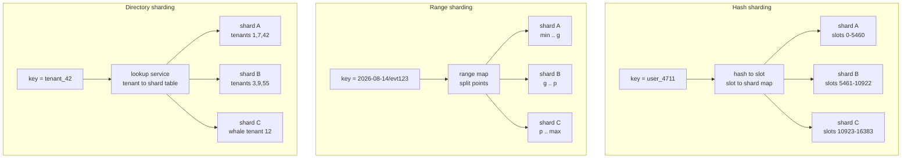
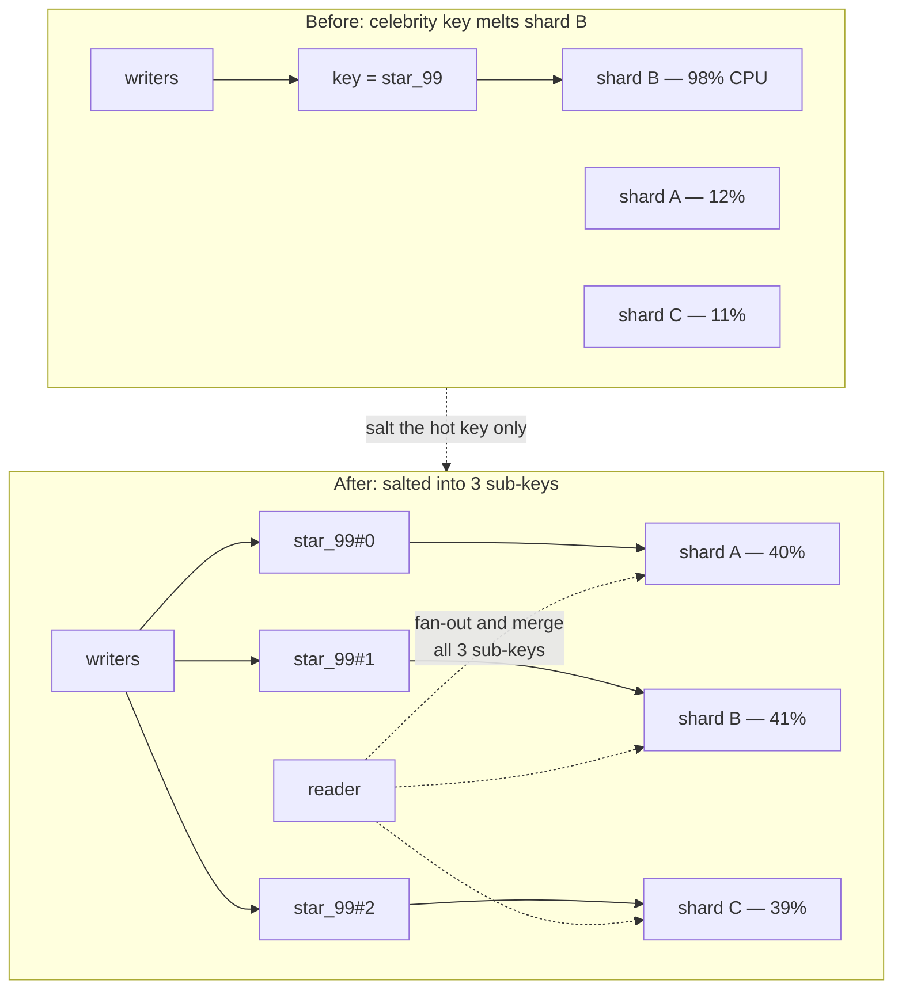
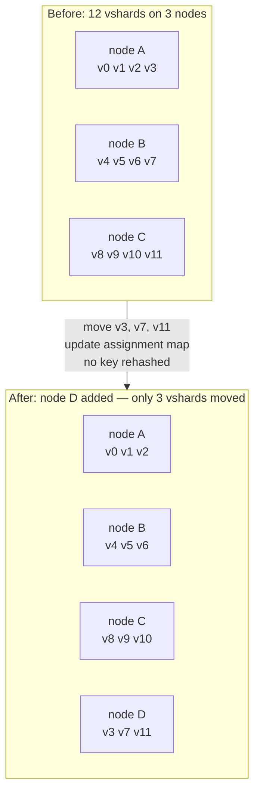
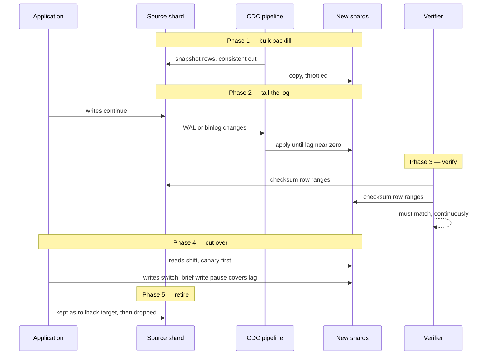

# Chapter 9 — Partitioning and Sharding

**What this chapter covers.** Chapter 8 ended at a wall: no matter how you replicate, a
single-primary system funnels every write through one machine, and replication does nothing to
increase the total amount of data one machine can hold. The answer to both limits is to split the
data itself. Unfortunately the industry uses one word — "partitioning" — for two different things,
and this chapter treats them separately and in order. The first is **single-node table
partitioning**: splitting one table into many physical child tables inside one database instance,
a technique whose biggest payoff is usually not query speed but data lifecycle — dropping a
partition is an O(1) alternative to a `DELETE` that would grind through vacuum and WAL for hours
(Chapters 2 and 7). The second is **distributed sharding**: splitting a dataset across machines,
which buys write scaling and blast-radius isolation at the cost of everything that quietly assumed
all the data lived in one place. For sharding, the shard-key decision is *the* decision, so we
work through hash, range, directory, and compound schemes and the failure mode each one invites.
We then confront skew and hot shards, the mechanics of rebalancing — why modulo-N is a
catastrophe, why every serious system moves fixed virtual shards instead, and how an online
resharding actually runs — and an honest catalogue of what sharding breaks: cross-shard queries,
transactions, secondary indexes, and uniqueness. The distributed-systems lens closes the loop
opened in Volume 4, Chapter 2: sharding is lock striping at planetary scale, with the same hot-key
failure and the same rebalancing pain.

Learning goals — after this chapter you should be able to:

- Distinguish single-node partitioning from distributed sharding, and know which problem each
  solves.
- Design a Postgres or MySQL partitioned table for a time-series workload, verify partition
  pruning with `EXPLAIN`, and use partition drop/attach for retention and bulk load.
- State the real limits of single-node partitioning: unique constraints that must include the
  partition key, and practical ceilings on partition count.
- Choose a shard key deliberately: hash for uniformity, range for locality, directory for control,
  compound keys for multi-tenant systems — and predict the failure mode of each.
- Detect and mitigate hot shards with per-shard metrics, key salting, request coalescing, caching,
  and whale isolation.
- Explain why fixed virtual shards make rebalancing tractable, and run the online resharding
  playbook: backfill, verify, cut over, retire.
- Enumerate what sharding breaks — scatter-gather queries, cross-shard joins and transactions,
  global secondary indexes, global uniqueness — and the standard design responses to each.
- Argue the build-vs-buy decision among application-level sharding, middleware such as Vitess and
  Citus, and natively distributed databases (Chapter 12), and defend the "design keys early, shard
  late" discipline.

## Two things sharing a word

The vocabulary is genuinely confused, so let us fix terms for this chapter. **Partitioning** will
mean splitting one logical table into multiple physical tables *within a single database
instance*, managed by the database itself, invisible to queries. **Sharding** will mean splitting
a dataset *across database instances on different machines*, where each instance holds a subset
and something — the application, a proxy, or the database's own distribution layer — routes each
request to the right one.

The confusion is not arbitrary: the underlying idea is the same (divide data by a key so that
operations touch only their division), and several systems blur the line — Cassandra calls its
unit of distribution a "partition," Kafka distributes "partitions" across brokers, and Citus turns
Postgres table partitioning machinery into a sharding layer. But the engineering consequences are
utterly different. Single-node partitioning changes almost nothing about your application: SQL
still works, transactions still work, unique constraints mostly still work, joins still work. It
is a storage-layout and lifecycle optimization. Sharding changes almost everything: it is an
architectural commitment that removes capabilities you have relied on since Chapter 1, and most of
this chapter is about the removals. Conflating the two leads teams to fear partitioning (which is
nearly free and they probably need) because they have heard horror stories about sharding (which
is expensive and they probably do not need yet).

## Single-node table partitioning

### Declarative partitioning in Postgres and MySQL

Modern relational databases support **declarative partitioning**: you state a partitioning method
and key in the DDL, and the database routes rows, maintains the children, and rewrites queries.
Postgres has had this since version 10 (range and list; hash arrived in 11); MySQL has supported
`PARTITION BY` on InnoDB tables for much longer. Three methods cover practice:

- **Range partitioning** assigns each row by which interval its key falls into. This is the
  workhorse, and time is the workhorse key: one partition per day, week, or month of a
  `created_at` column. Time-series and event data are range partitioning *par excellence*, because
  both the queries ("last 7 days") and the lifecycle ("retain 13 months") are expressed in the
  same dimension the table is cut on.
- **List partitioning** assigns by explicit value: one partition per region, per product line, per
  tenant tier. Useful when the divisions are few, named, and operationally meaningful — for
  instance when EU rows must live in a different tablespace than US rows.
- **Hash partitioning** assigns by hash of the key, modulo the partition count. It buys uniform
  spread and smaller per-partition indexes when there is no natural range or list dimension, at
  the price of making per-partition operations meaningless — no hash partition ever corresponds to
  "old data" or "tenant 7," so you lose the lifecycle payoff described below.

Here is the canonical time-series shape in Postgres:

```sql
CREATE TABLE events (
    event_id    bigint       NOT NULL,
    tenant_id   bigint       NOT NULL,
    created_at  timestamptz  NOT NULL,
    kind        text         NOT NULL,
    payload     jsonb,
    PRIMARY KEY (event_id, created_at)      -- must include the partition key; see below
) PARTITION BY RANGE (created_at);

CREATE TABLE events_2026_07 PARTITION OF events
    FOR VALUES FROM ('2026-07-01') TO ('2026-08-01');
CREATE TABLE events_2026_08 PARTITION OF events
    FOR VALUES FROM ('2026-08-01') TO ('2026-09-01');

CREATE INDEX ON events (tenant_id, created_at);   -- cascades to every partition
```

Each partition is a real table with its own files, its own indexes, its own statistics, its own
vacuum schedule. That physical independence is the source of every benefit that follows.

### Partition pruning

The query-side payoff is **pruning**: the planner proves from the `WHERE` clause that most
partitions cannot contain matching rows and never touches them.

```
=# EXPLAIN (COSTS OFF)
   SELECT count(*) FROM events
   WHERE created_at >= '2026-08-01' AND created_at < '2026-08-15';

                              QUERY PLAN
----------------------------------------------------------------------
 Aggregate
   ->  Seq Scan on events_2026_08 events
         Filter: ((created_at >= '2026-08-01 00:00:00+00'::timestamptz)
              AND (created_at <  '2026-08-15 00:00:00+00'::timestamptz))
```

One partition scanned, the rest never opened — with a year of monthly partitions, roughly 92% of
the table statically excluded. Pruning happens at **plan time** when the predicate compares the
partition key to constants, and since Postgres 11 also at **execution time**, when the comparison
value is a parameter, a subquery result, or the inner side of a join. Execution-time pruning shows
up in `EXPLAIN ANALYZE` as an `Append` node annotated `Subplans Removed: 11` — the plan carried
all partitions but skipped the impossible ones once the parameter value was known.

Two things defeat pruning, and both are common in the wild. First, any predicate that is not on
the partition key — pruning is not magic; a query filtered only on `tenant_id` scans an index in
*every* partition of the range-partitioned table above. Second, wrapping the key in a function or
a mismatched type (`created_at::date = '2026-08-01'`) can make the predicate opaque to the
pruning logic, exactly as it makes an index unusable (Chapter 3). A **default partition** — the
catch-all Postgres allows for rows that fit no declared range — is a third quiet hazard: for
open-ended predicates the planner often cannot exclude it, so it gets scanned every time. Verify
pruning with `EXPLAIN` the way you verify index usage: assume nothing.

Briefly on **partition-wise operations**: when two tables are partitioned identically, Postgres
can join them partition-by-partition and aggregate partition-by-partition
(`enable_partitionwise_join` and `enable_partitionwise_aggregate`, both off by default because
plan-time cost grows with partition count). These are worth knowing mostly because they are the
single-node rehearsal of a distributed idea — co-partitioned joins are precisely what makes some
cross-shard joins feasible later in this chapter.

### The payoff that actually matters: O(1) retention

Ask teams who run partitioned tables in production why, and the most common answer is not query
speed. It is `DROP`.

Consider deleting one month of data from a 2 TB unpartitioned events table. `DELETE FROM events
WHERE created_at < '2025-08-01'` must find every matching row, write a WAL record for every row it
kills (Chapter 7), and mark every row dead-but-present. The table does not get smaller; it fills
with dead tuples that vacuum must reclaim, generating a second wave of I/O, and the indexes bloat
identically (Chapters 2 and 3). Replicas replay all of that WAL, so the delete storm propagates
down the replication tree (Chapter 8). A month-sized delete on a large table is routinely an
hours-long, I/O-saturating event — and then vacuum runs.

Now the partitioned version:

```sql
ALTER TABLE events DETACH PARTITION events_2025_07;  -- CONCURRENTLY since PG 14
DROP TABLE events_2025_07;
```

This is a catalog update and a file unlink. Milliseconds, a few kilobytes of WAL, no dead tuples,
no vacuum, no index maintenance, no replica lag spike. The same asymmetry works in reverse for
bulk load: build tomorrow's partition offline — load it with `COPY`, index it, `ANALYZE` it,
validate it — and then `ATTACH PARTITION` makes it visible in one metadata operation. Detach and
re-attach is also the sane path for archiving a partition to cold storage, or for rewriting one
partition (compressing, re-clustering) without touching the rest of the table.

If your table has time-based retention and you are running periodic mass deletes against an
unpartitioned table, partitioning is not an optimization, it is the correction of a mistake.
Tooling like `pg_partman` (or TimescaleDB's automation, Chapter 13) exists to create future
partitions and drop expired ones on schedule, which is the part people forget until an insert
lands with no partition to accept it.

### Limits, stated honestly

Single-node partitioning has two limits you must design around rather than discover.

**Unique constraints must include the partition key.** A unique index in Postgres is a per-table
B-tree, and a partition is a table; there is no global index spanning partitions. Postgres
therefore refuses any `UNIQUE` or `PRIMARY KEY` constraint on a partitioned table that does not
include all partition-key columns — that is why the DDL above declares `PRIMARY KEY (event_id,
created_at)` rather than `event_id` alone. Uniqueness of `event_id` by itself is now *your*
problem: enforce it by construction (generate IDs from a sequence or an ID allocator, so
duplicates cannot arise) rather than by constraint. MySQL has the same rule in stricter form:
every unique key on a partitioned table, including the primary key, must contain every column in
the partitioning expression. This is the first appearance of a theme that dominates the sharding
half of this chapter: **partitioning by one key destroys global enforcement on every other key.**

**Partition counts have practical ceilings.** Every partition adds catalog entries, statistics,
relation-cache footprint, and planning work; operations that cannot be pruned touch every
partition and take a lock on each. Postgres handles thousands of partitions reasonably in current
versions — planning cost with good pruning is now sublinear in partition count, and the
documentation's guidance is that up to a few thousand is workable when queries prune well — but
tens of thousands is asking for pain in planning time, lock counts per query, and autovacuum
scheduling. MySQL enforces a hard limit of 8,192 partitions per table and gets uncomfortable well
before it. The practical rule: partition at the granularity your retention and queries need and no
finer. Daily partitions with 13-month retention is ~400 partitions and entirely comfortable;
hourly partitions "to be safe" is 9,500 and is not.

## Distributed sharding: why

Three pressures push a dataset off one machine, and it is worth being precise about them because
they have different remedies and sharding is only mandatory for the first two.

**Write throughput.** Chapter 8's conclusion stands: read replicas scale reads, but every write
still traverses the single primary — its WAL, its buffer pool, its vacuum, its CPU. When the write
workload exceeds what the biggest affordable machine can absorb, the only remaining move is to
have *multiple primaries, each owning a disjoint slice of the data*. That is sharding. (Multi-leader
replication of the *same* data is the other theoretical option, and Chapter 8 explained why its
conflict-resolution burden makes it the wrong default.)

**Dataset size.** When the working set outgrows one machine's storage or — more often and more
subtly — its RAM, so that the cache-hit economics of Chapter 2 collapse, splitting the data
restores locality: each shard's working set fits its machine again.

**Blast radius.** A single database is a single failure domain. Shard it twenty ways and a corrupt
index, a runaway query, a botched migration, or a hardware failure degrades 5% of customers
instead of 100%. For multi-tenant SaaS this isolation argument sometimes justifies sharding even
when raw capacity does not; it also gives you per-shard maintenance windows and canary shards for
risky schema changes (Chapter 14).

Be equally clear about what sharding does *not* buy: it does not reduce latency for single-row
operations (a lookup on one shard is the same B-tree descent it always was, now plus a routing
hop), and it does not improve availability by itself — each shard still needs the replication of
Chapter 8 underneath it. Sharding and replication are orthogonal and virtually always composed:
N shards × a primary and replicas per shard.

## The shard key: the decision

Everything about a sharded system follows from one choice: the **shard key**, the attribute of
each row that determines which shard owns it. Queries that include the key route to one shard and
stay cheap. Queries that do not include it must ask every shard. Transactions confined to one key
value stay ACID; transactions spanning key values become distributed transactions (Chapter 10).
The shard key is load-bearing for performance, correctness, and operations simultaneously, and it
is expensive to change — so it deserves more design scrutiny than any other schema decision you
make. There are four basic schemes.



### Hash sharding

Route each key by a hash of its value. The virtue is statistical: a decent hash spreads any key
population — sequential IDs, timestamps, hot prefixes — uniformly across shards, so you get even
data volume and, for most workloads, even load, with zero placement management. The cost is that
hashing destroys order. Adjacent keys land on unrelated shards, so **range queries over the key
become scatter-gather**: "events between Tuesday and Thursday" must ask every shard and merge.
Hash sharding is the right default when access is point-lookup dominated and the key population is
adversarially skewable — user IDs, session IDs, device IDs.

Two refinements matter. First, never hash straight into `mod N` where N is the live shard count —
the rebalancing section explains why this is a catastrophe. Hash into a **fixed, large slot
space** and map slots to shards, as Redis Cluster does with its 16,384 slots. Second, **consistent
hashing** arranges hashes on a ring so that adding a node moves only the keys adjacent to it, and
**virtual nodes** give each physical machine many ring positions to smooth the statistical
imbalance and spread a departed node's load across all survivors. Those two sentences are the
concepts; the algorithm, its variants (rendezvous hashing, jump hash), and its load-balance
mathematics are treated properly in Volume 14, Chapter 5, and Dynamo-style systems built on it in
Volume 6, Chapter 7.

### Range sharding

Divide the key space into contiguous ranges at chosen split points, one range per shard. This is
the Bigtable lineage — Bigtable range-partitions rows into tablets by key, and its descendants and
cousins (HBase, Spanner, CockroachDB, TiDB) kept the design. Range sharding preserves order, so
range scans touch one or a few shards, and it gives you **locality**: keys that sort together live
together, which composes beautifully with the clustered storage of Chapters 2 and 3.

Its characteristic failure is the **hot tail**. If the key is monotonic — an auto-increment ID, a
timestamp, a `ULID` — every insert lands in the *last* range, and one shard absorbs 100% of the
write load while the rest hold cold history. This is the same pathology as the rightmost-leaf
B-tree contention of Chapter 3, promoted from a page latch to an entire machine. The Bigtable
paper and every Bigtable-descendant's documentation warn about it, and it remains the most common
self-inflicted wound in range-sharded systems: schemas keyed by `(timestamp, ...)` hammer one
tablet forever, however aggressively the system splits it. The standard remedies are to lead the
key with something distributive — `(user_id, timestamp)` rather than `(timestamp, user_id)` — or
to explicitly prefix a hash bucket, which is the salting pattern discussed under hot spots.

### Directory sharding

Keep an explicit lookup table: key (or key group) → shard. A small metadata store — replicated,
cached, consistency-managed (Volume 6, Chapter 8) — answers routing queries. This trades the
elegance of computed placement for **control**: you can place tenant 12 alone on its own shard
because it is enormous, pin EU tenants to EU shards for residency, and migrate one tenant at a
time by updating one row. Multi-tenant SaaS platforms converge on directory sharding at the tenant
grain almost universally, precisely because tenant sizes are wildly skewed and law constrains
placement. The costs: the directory is a dependency on every request path (cache it hard), a
consistency problem during migrations (the playbook below), and a thing that can itself get large
if you foolishly track individual keys rather than key groups.

### Compound keys: the SaaS workhorse

Real shard keys are usually compound: a **routing component** that picks the shard and an
**ordering component** that arranges rows within it. The canonical example is `(tenant_id,
entity_id)`: shard by `tenant_id` — every query in a B2B product carries it, and a tenant's data
stays transactionally co-located — then order by entity or time within the tenant.

Cassandra makes this structure explicit and mandatory, and its terminology is worth learning even
if you never run Cassandra because it names the two roles precisely. The **partition key**
determines placement by hash; the **clustering key** determines sort order within the partition;
queries must supply the partition key and may range over clustering columns:

```sql
-- CQL: one partition per tenant; rows ordered newest-first within it.
CREATE TABLE orders_by_tenant (
    tenant_id    bigint,
    created_at   timeuuid,
    order_id     bigint,
    status       text,
    total_cents  bigint,
    PRIMARY KEY ((tenant_id), created_at, order_id)
) WITH CLUSTERING ORDER BY (created_at DESC, order_id ASC);

-- Served by one partition, one sequential read:
SELECT * FROM orders_by_tenant
 WHERE tenant_id = 42 AND created_at > minTimeuuid('2026-08-01');
```

This is **query-driven design**: the table exists to serve this access path, and other access
paths get other tables (Chapter 11 develops the philosophy). The same discipline applies verbatim
in a sharded relational system — every table carries `tenant_id`, every index leads with it, every
query filters on it — and a schema with that shape is what this chapter's final section calls
*shardable*, whether or not it is sharded yet.

## Hot spots and skew

Uniform hashing gives you uniform *keys*, not uniform *load*. Skew arrives in two forms.
**Celebrity keys**: one key value receives orders of magnitude more traffic than the median — the
viral post, the account with forty million followers, the tenant that is 30% of your revenue
running a batch import. Whatever the scheme, that key maps to one shard, and that shard melts.
**Temporal skew**: load migrates across the key space over time — monotonic keys hammering the
range tail, Monday-morning tenants in one timezone, a marketing campaign lighting up one region's
shard.

Detection is a measurement discipline, not an algorithm: export throughput, latency, CPU, and
queue depth **per shard**, not just in aggregate, and alert on dispersion (max/median) rather than
on totals — a fleet at 40% average CPU with one shard at 98% is an outage in progress that
aggregate dashboards will hide. Per-key top-K sampling (a count-min sketch or the database's own
statistics) tells you *which* key is responsible. Volume 11 treats the observability machinery;
the point here is that per-shard metrics are not optional in a sharded system, because the shard
is the unit at which the system fails.

Mitigations, in escalating order of invasiveness:

- **Cache the celebrity.** A read-hot key is the textbook case for a cache in front of the shard
  (Volume 7, Chapter 3); a handful of cache servers can absorb read traffic no database shard
  can.
- **Coalesce duplicate requests.** When ten thousand concurrent requests want the same hot key,
  let one fetch and the rest await its result — request coalescing / singleflight, the pattern
  from Volume 4, Chapter 9. This collapses read stampedes at the source.
- **Salt or split the key.** For write-hot keys, append a small random or derived suffix —
  `key#0` … `key#7` — so the hot key's writes spread across 8 shards. The price is paid at read
  time: reading the key now fans out to all 8 sub-keys and merges. Salting is therefore a
  targeted tool for identified hot keys (apply it to the celebrity, not the population), and the
  fan-out factor is a dial between write relief and read amplification.
- **Isolate the whale.** In directory-sharded systems, move the enormous tenant to dedicated
  hardware. This is skew management by placement rather than by key design, and it is often the
  operationally sanest answer: the whale gets its own capacity, its own SLO, and its own blast
  radius, and the shared shards return to statistics that hashing can handle.



If this section feels familiar, it should: it is the hot-stripe problem from Volume 4, Chapter 2,
where a striped lock degenerates to a global lock when one key dominates. The failure and every
mitigation have exact in-process ancestors.

## Rebalancing and resharding

Shards fill up; traffic grows; machines are added. Data must move. How gracefully it moves is
decided by a choice made on day one.

### Modulo-N is a catastrophe

The naive scheme — `shard = hash(key) mod N` — hard-codes the shard count into the placement of
every key. Grow from 4 shards to 5 and `hash(k) mod 5` disagrees with `hash(k) mod 4` for 80% of
keys: **nearly the entire dataset must move**, all at once, to add 25% capacity. During the move,
every key is potentially in transit, so routing is ambiguous everywhere and there is no
incremental path — it is a big-bang migration of the whole system, under load, or a maintenance
window sized in days. Any design whose placement function takes the live shard count as an input
has this defect. Never ship it.

### Fixed virtual shards: move whole units

The fix is a level of indirection: hash keys into a **fixed, permanent number of virtual shards**
(slots, chunks, tablets — the name varies), chosen once and generously, and separately maintain a
small **assignment map** from virtual shard to physical node. Rebalancing then never rehashes
anything: it picks whole virtual shards and moves them, updating one map entry per move. Adding a
node means transferring it a fair share of vshards from the others — each move is independent,
incremental, throttleable, and abortable, and routing stays unambiguous for every key not
currently in a moving vshard.



This design is ubiquitous because it is right:

- **Redis Cluster** fixes the slot space at **16,384 slots** (`CRC16(key) mod 16384`); every node
  owns a set of slots, resharding is slot migration, and the `{hash tag}` syntax lets related keys
  share a slot for multi-key operations. The Redis Cluster specification is a compact, readable
  description of the whole pattern, including how clients follow `MOVED`/`ASK` redirections during
  a live slot migration.
- **Bigtable/HBase-style tablets and CockroachDB/TiDB ranges** are the dynamic variant: instead of
  a fixed count, contiguous key ranges **split when they grow or run hot and merge when they
  shrink**, and a placement layer moves whole tablets between nodes (CockroachDB targets ranges of
  512 MiB by default; TiKV regions are ~96 MiB). Same indirection, with the vshard boundaries
  themselves adaptive — which is what finally tames range sharding's hot tail, by splitting the
  hot range and shipping half of it elsewhere.
- **Vitess** reshards MySQL by the same logic at coarser grain: shards own ranges of a keyspace-ID
  space, and a resharding workflow splits a shard by streaming its rows and then its binlog into
  new shards before atomically switching traffic — which is exactly the playbook we now make
  explicit.

Sizing note: pick the fixed count generously (it bounds your maximum node count and your
rebalancing granularity) but not absurdly, since each vshard carries metadata and per-unit
overhead — the same "ceilings, honestly" argument as single-node partition counts.

### The online resharding playbook

Whether you are splitting one shard into four or migrating a tenant between shards, every serious
online data migration is the same five-phase pipeline. The enabling technology is **change data
capture** — tailing the source's WAL or binlog as a stream of row changes (Chapter 7 built the
log; Volume 10, Chapter 6 treats CDC as infrastructure) — or, lacking that, application-level
dual-writes.



1. **Backfill.** Snapshot the source at a consistent point (an MVCC snapshot, Chapter 6) and bulk-
   copy rows to their new homes, throttled so the source's live traffic is not degraded.
2. **Tail.** Apply the change stream from the snapshot's log position forward, continuously, until
   replication lag to the new shards is near zero. The new shards are now a live, trailing copy.
3. **Verify.** Compare source and destination — row counts first, then range checksums, then
   sampled row-level diffs — and keep verifying while tailing continues. Skipping this phase is
   how silent row loss ships; every mature tool (Vitess's VDiff, for one) makes it a first-class
   step.
4. **Cut over.** Shift reads first (canary a fraction, compare results, watch error rates), then
   writes — typically with a seconds-long write pause or reject-and-retry window that lets the
   tail fully drain, so no write lands on the source after the destination takes over. Update the
   routing map (directory entry, slot assignment) atomically; this is where the coordination
   machinery of Volume 6, Chapter 8 earns its keep, because two routers disagreeing about
   ownership means split-brain writes.
5. **Retire.** Keep the source frozen as an instant-rollback target until confidence is earned —
   reverse-tailing destination changes back to it if you want true reversibility — then reclaim
   it.

A runbook checklist, compressed from the scars of teams who have done this under load:

```text
RESHARDING RUNBOOK — shard S -> shards S1..Sn
[ ] Capacity: destinations provisioned, replicated, backed up, in monitoring
[ ] Throttle plan: backfill rate cap agreed; source p99 SLO alarmed during copy
[ ] Lag budget: max acceptable tail lag at cutover defined (e.g. < 2 s)
[ ] Verification: checksum job green for N consecutive hours before cutover
[ ] Cutover drill: rehearsed on a staging shard, timed, rollback rehearsed too
[ ] Freeze window: schema migrations and other DDL frozen for the duration
[ ] Cutover: reads canaried -> reads switched -> writes paused -> lag drained
    -> routing map flipped -> writes resumed; each step has an owner and an abort
[ ] Rollback trigger: explicit error-rate/latency thresholds that reverse the flip
[ ] Retire: source kept read-only for X days, then decommissioned
```

The operational scar tissue behind that list: backfills that saturated the source's disks and
caused the outage they were meant to prevent (throttle, and copy from a replica); cutovers
attempted while lag was "only a few seconds" that lost the writes in flight (drain fully, pause
writes); verification skipped "because the pipeline is battle-tested" (it was not, for the one
table with a type the copier mishandled); DDL applied to the source mid-migration, which the
pipeline did not replicate, corrupting the copy silently. Resharding under load is routine at
organizations that have industrialized this playbook and a near-death experience everywhere else;
the difference is the checklist, not the tooling.

## What sharding breaks

Sharding is subtraction. Here is what you give up, catalogued honestly, with the standard
responses.

**Cross-shard queries become scatter-gather.** Any query not filtered by the shard key fans out to
all N shards and merges the results. Latency is the **maximum** of N shard latencies, not the
mean — with 100 shards, a query hits a shard's p99 with probability 1 − 0.99¹⁰⁰ ≈ 63%, so
"every query experiences somebody's bad moment." This is tail-latency amplification, the fan-out
pathology of Volume 4, Chapter 9, and it is intrinsic to the shape, mitigable only by hedged
requests, partial results, or not fanning out. Aggregations can push work down (sum per shard,
combine centrally — partition-wise aggregation again), but top-K, pagination, and joins across a
fan-out are genuinely painful.

**Cross-shard joins are mostly impossible.** A join between rows on different machines means
shipping data at query time, and OLTP systems do not do it (analytic engines do, Chapter 13, at
analytic latencies). The design responses, in order of preference: **co-partition** tables that
join (same shard key → join is local — the distributed twin of partition-wise join);
**denormalize** — store the joined shape you need, accepting redundancy, per the data-modeling
discipline of Volume 7, Chapter 5; **replicate small reference tables** to every shard so joins
against them are always local (Citus calls these reference tables).

**Cross-shard transactions stop being free.** Within one shard you retain everything Chapters 5–7
built: ACID, MVCC, fast commits. A transaction spanning shards needs two-phase commit or an
equivalent protocol, with its blocking window and coordinator failure modes — Chapter 10's
subject. The design response is to not need them: **choose the shard key so that the invariants
that must be transactional live inside one shard.** Order and its line items share the order's
shard; account and its ledger entries share the account's. If two entities must be atomically
consistent with each other and routinely land on different shards, the shard key is wrong, not the
transaction layer.

**Secondary indexes go local or go asynchronous.** Chapter 3 set up this dichotomy. A **local**
index lives on each shard, indexing only that shard's rows: cheap to maintain (same-shard, same
transaction) but useless for routing, so a secondary-key lookup is a scatter-gather. A **global**
index is itself sharded by the indexed value, so lookups route directly — but now an index update
is a cross-shard write, and systems that refuse to pay 2PC per index entry maintain it
**asynchronously**, buying performance with a window where the index lies. DynamoDB's global
secondary indexes are the honest, documented version: eventually consistent, full stop. Design
consequence: reads through async global indexes must tolerate staleness and verify against the
base row when it matters.

**Global uniqueness needs an allocator.** "Unique across the system" can no longer be a constraint
the database checks, because no single node sees all values — single-node partitioning already
previewed this. The answers: derive uniqueness from placement (unique within tenant, tenant in
the key); allocate IDs from a service handing out disjoint blocks to each node; or generate
**Snowflake-style IDs** — 64 bits composed of a millisecond timestamp, a worker ID, and a
per-worker sequence — unique by construction, roughly time-ordered, coordination-free at
generation time. The trade-offs (clock skew handling, the hot-tail interaction of time-ordered
IDs with range sharding) are real but well understood; what you must not do is pretend a unique
index still protects you.

## Application, middleware, or natively distributed

Who does the routing? Three architectures, in ascending order of what you delegate.

**Application-level sharding.** Your code computes the shard, holds a connection pool per shard,
and owns the directory, the fan-outs, and the migration tooling. Maximum control and no new
infrastructure, but the sharding logic smears into every service that touches the data, cross-
shard queries are hand-written, and resharding is a bespoke engineering project each time.
Reasonable at small shard counts with a clean tenant key; increasingly expensive as either grows.

**Sharding middleware** presents one logical database over many real ones. **Vitess** does this
for MySQL — a query proxy (vtgate) plans and routes against a sharding-aware schema, and
resharding workflows are built in; it ran YouTube and is now CNCF-graduated infrastructure behind
PlanetScale, Slack, and others. **Citus** does it as a Postgres extension: distributed tables
declared by shard key, reference tables, co-located joins, parallel cross-shard queries. Middleware
buys you the accumulated playbooks — the hard 20% (resharding, verification, cutover) is product,
not project — at the cost of a new critical-path component and a query surface that is *almost*
all of SQL, where the missing sliver is discovered by your application at runtime.

**Natively distributed databases** — Spanner, CockroachDB, TiDB, and kin — internalize sharding
entirely: automatic range splitting, placement, rebalancing, and distributed transactions behind a
SQL interface. That is Chapter 12's subject, including the prices (consensus latency per write,
different tail behaviors, operational novelty).

The guidance this volume stands behind: **shard late, but design keys early.** Sharding before
the single-node ceiling — after partitioning, read replicas, caching, and buying a bigger machine
are exhausted — is premature complexity with permanent costs. But the *schema* must be shardable
from early on, because retrofitting a tenant ID into two hundred tables and every query is the
multi-year project that makes sharding horror stories. The shardable-schema discipline is cheap
and concrete: every tenant-scoped table carries `tenant_id`; primary keys are `(tenant_id, ...)`
compounds or globally unique by construction, never bare auto-increments; no query joins across
tenants; no invariant spans tenants. A schema with those properties can adopt any of the three
architectures later. A schema without them cannot adopt any of them without a rewrite.

## The distributed-systems lens

**Sharding is lock striping at planetary scale.** Volume 4, Chapter 2 partitioned a hot map into
N stripes so threads contend only within a stripe; this chapter partitioned a hot dataset into N
shards so requests contend only within a shard. It is the same move with the same contract and
the same failure modes: the win depends entirely on key distribution; a hot key collapses either
design back to a serial bottleneck (the celebrity shard *is* the hot stripe); operations spanning
all divisions — `size()` across stripes, scatter-gather across shards — are disproportionately
expensive and weakly consistent; and changing the division count is the painful operation both
designs must plan for (resizing a striped map, resharding a fleet). If you understood why
`ConcurrentHashMap` stripes, and what its `size()` gives up, you already hold the mental model
for everything in this chapter — sharding adds partial failure and a network, which is why the
playbooks are longer, but subtracts no ideas.

**The partition is the unit of scaling and the unit of failure.** You add capacity one shard at a
time, and you fail one shard at a time. Take that seriously in your operational model: SLOs,
alerts, dashboards, capacity plans, and incident response should all be per-shard, because
"the database is up" is meaningless when shard 7 is down and 4% of tenants are hard-out while
aggregate success rate reads 96%. The blast-radius benefit of sharding is only realized if your
observability and routing can *see* shards; otherwise you have the failure isolation without the
operational isolation, which is the worst quadrant.

**The shard key is the physical embodiment of your consistency boundary.** Entities that must be
transactionally consistent with each other must hash together — which means the shard-key decision
is secretly a domain-modeling decision. Volume 15, Chapter 3 introduces the DDD *aggregate*: a
cluster of entities with an invariant, modified through one root, consistent within itself,
eventually consistent with everything outside. A well-chosen shard key and a well-drawn aggregate
boundary are the same boundary seen by an infrastructure engineer and a domain modeler; when the
two disagree, the database wins and the domain model discovers its "atomic" operation is now a
saga (Chapter 10). Draw the boundary once, deliberately, from the invariants.

**Placement is a coordination problem, and the pattern recurs everywhere.** The assignment map —
which node owns which vshard — is small, hot, and must be agreed upon: two routers with different
maps produce split-brain writes during migration. That is why serious systems keep it in a
consensus-backed store and fence ownership transfers (Volume 6, Chapter 8). And once you see the
pattern — fixed partitions, an assignment map, rebalancing by moving whole partitions, hot-
partition pathologies — you will recognize it far from databases: Kafka distributes topic
partitions across brokers and rebalances consumer groups with exactly these mechanics and exactly
these failure modes (Volume 10), and every stateful service you ever shard by hand will rebuild
it again. It is one idea, from `ConcurrentHashMap` to Spanner. This chapter's job was to make
sure you never mistake it for two.

## Key takeaways

- **Partitioning and sharding are different things.** Single-node partitioning is a nearly-free
  storage-layout and lifecycle tool; sharding is an architectural commitment that removes
  capabilities. Do not let fear of the second deprive you of the first.
- **Partition time-series tables by range on time, and verify pruning with `EXPLAIN`.** Pruning
  fails silently for non-key predicates, type mismatches, and default partitions.
- **The biggest partitioning payoff is O(1) retention**: `DETACH`/`DROP` replaces a WAL-storm,
  vacuum-debt `DELETE` with a metadata operation; `ATTACH` does the same for bulk load.
- **Partitioning by one key forfeits global enforcement on others** — unique constraints must
  include the partition key — and partition counts have honest ceilings (thousands, not tens of
  thousands; MySQL caps at 8,192).
- **Shard for write throughput past one primary, dataset size past one machine, or blast-radius
  isolation** — and for nothing else. Sharding does not reduce single-row latency or, by itself,
  improve availability.
- **The shard key is the decision.** Hash for uniformity (losing range queries), range for
  locality (risking the hot tail — never lead with a monotonic key), directory for control,
  compound `tenant + entity` keys for SaaS. Choose it from your queries and your invariants.
- **Skew is when sharding fails.** Watch per-shard dispersion, not aggregates; mitigate with
  caching, request coalescing, targeted key salting, and whale isolation.
- **Never place with `mod N`.** Hash into fixed virtual shards and rebalance by moving whole
  vshards with an assignment map — Redis slots, Bigtable tablets, CockroachDB/TiDB ranges, Vitess
  shards all embody this.
- **Online resharding is a playbook**: throttled backfill, CDC tail, continuous verification,
  canaried cutover with a drained write pause, rollback-ready retirement. The checklist is the
  difference between routine and near-death.
- **Sharding breaks** cross-shard queries (scatter-gather = slowest shard), joins (co-partition,
  denormalize, replicate reference data), transactions (keep invariants inside one shard; else
  Chapter 10), global indexes (local scatter-gather vs async global), and uniqueness (allocators,
  Snowflake IDs).
- **Shard late; design keys early.** A shardable schema — tenant ID everywhere, compound keys, no
  cross-tenant invariants — is cheap insurance; retrofitting one is the multi-year horror story.

## Further reading

- Kleppmann, M., *Designing Data-Intensive Applications* (O'Reilly, 2017), Chapter 6
  "Partitioning" — the best single treatment of shard-key schemes, skew, rebalancing, and
  secondary indexes under partitioning.
- Chang, F. et al., "Bigtable: A Distributed Storage System for Structured Data," *OSDI*, 2006 —
  the range-sharded tablet design, including the row-key locality model this chapter's range
  section descends from. <https://research.google/pubs/pub27898/>
- Corbett, J. C. et al., "Spanner: Google's Globally-Distributed Database," *OSDI*, 2012 —
  range sharding plus placement plus distributed transactions, previewing Chapters 10 and 12.
  <https://research.google/pubs/pub39966/>
- PostgreSQL documentation, "Table Partitioning" — declarative partitioning, pruning, the
  unique-constraint rule, and the project's own guidance on partition counts.
  <https://www.postgresql.org/docs/current/ddl-partitioning.html>
- MySQL 8.4 Reference Manual, "Partitioning" — including "Partitioning Keys, Primary Keys, and
  Unique Keys" for the every-unique-key rule.
  <https://dev.mysql.com/doc/refman/8.4/en/partitioning.html>
- Redis Cluster specification — the 16,384-slot design, hash tags, and live slot migration with
  `MOVED`/`ASK`. <https://redis.io/docs/latest/operate/oss_and_stack/reference/cluster-spec/>
- Vitess documentation, "Resharding" — the split-backfill-verify-switch workflow (VReplication,
  VDiff, SwitchTraffic) as productized playbook. <https://vitess.io/docs/reference/vreplication/>
- Citus documentation — distributed tables, reference tables, and co-located joins on Postgres.
  <https://docs.citusdata.com/>
- DynamoDB Developer Guide, "Global Secondary Indexes" — the canonical honest documentation of
  asynchronously-maintained global indexes and their consistency.
  <https://docs.aws.amazon.com/amazondynamodb/latest/developerguide/GSI.html>
- Twitter Engineering, "Announcing Snowflake" (2010) — the original coordination-free ID-allocator
  design this chapter sketches.
- Volume 4, Chapter 2 — Threads, Mutual Exclusion, and Locks — lock striping, the in-process
  ancestor of everything here.
- Volume 14, Chapter 5 — Consistent Hashing — the ring, virtual nodes, and the algorithmic depth
  deferred from this chapter.
