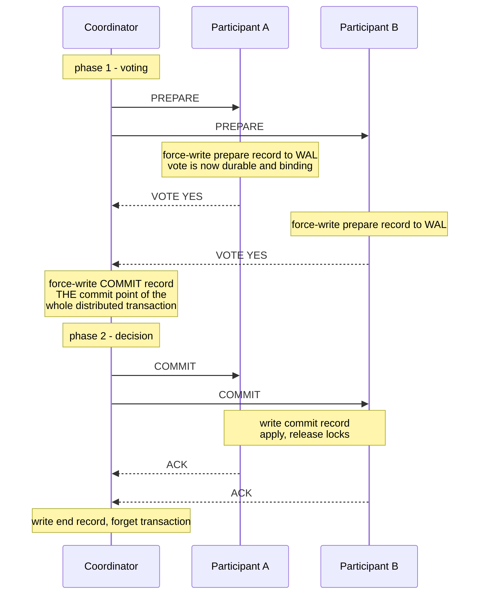
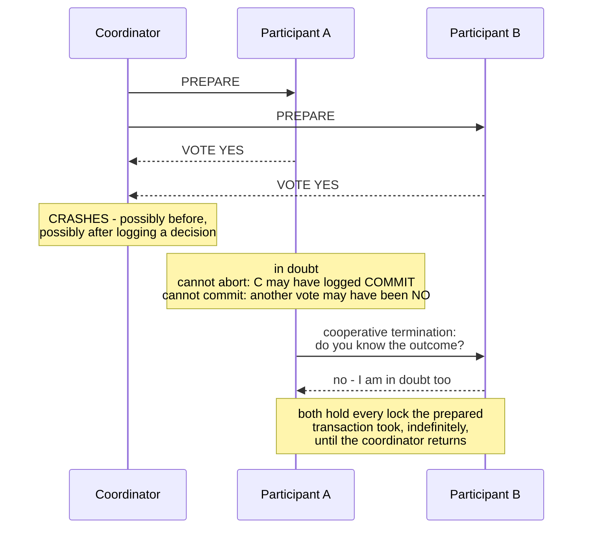
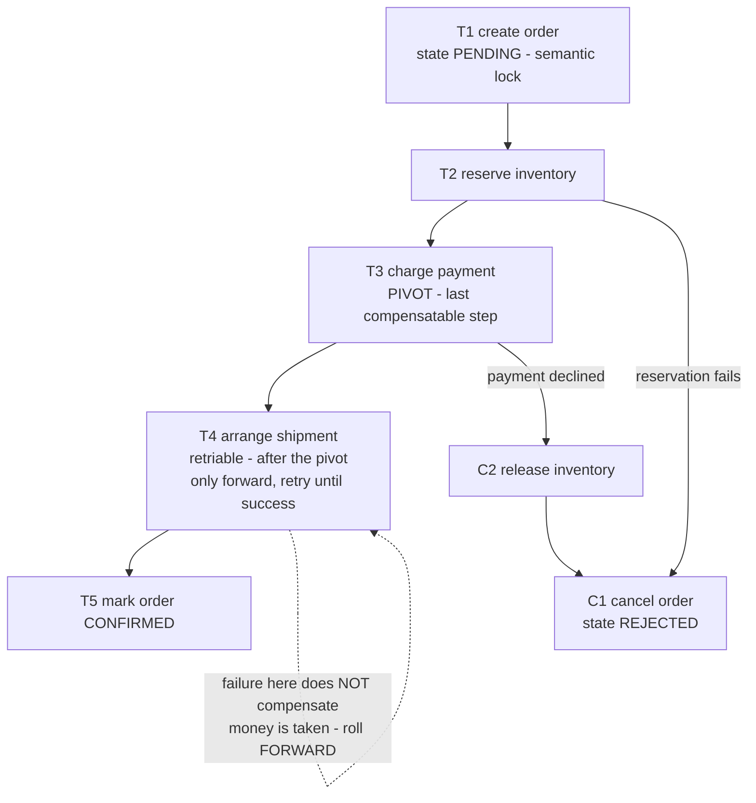
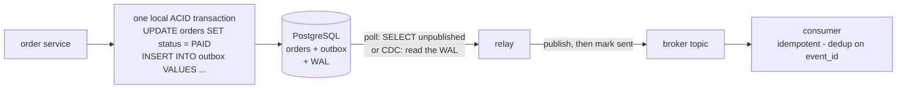
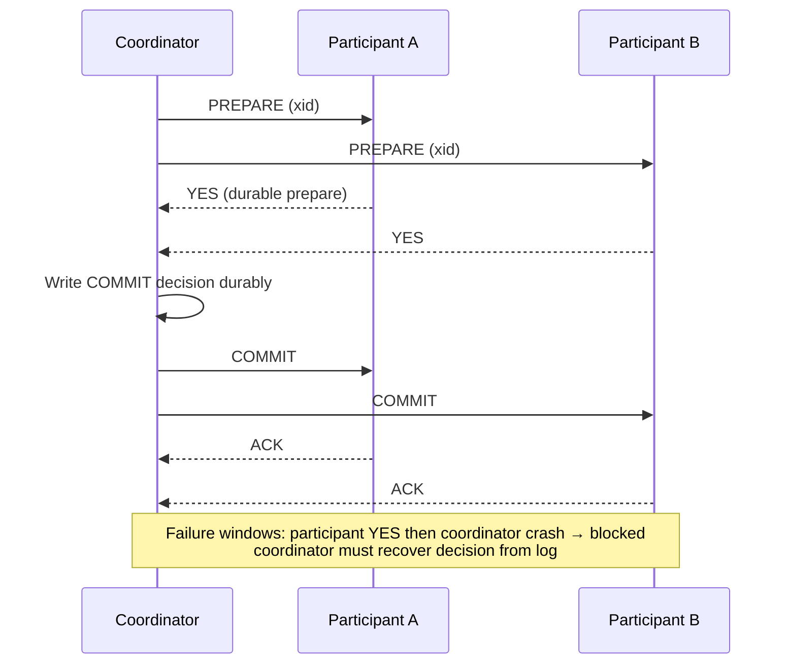
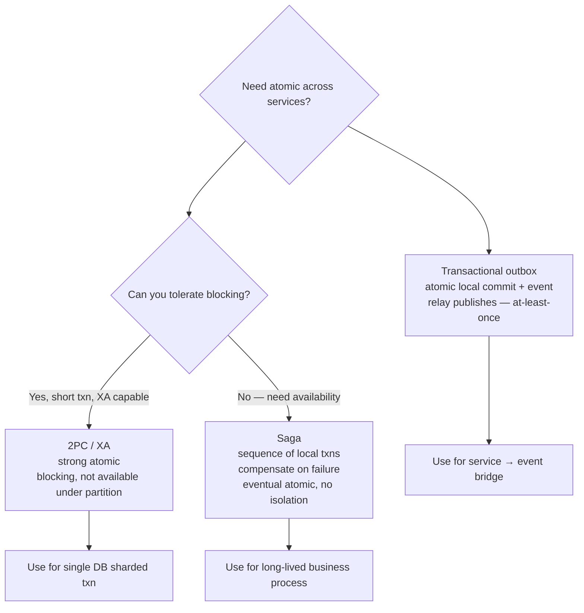
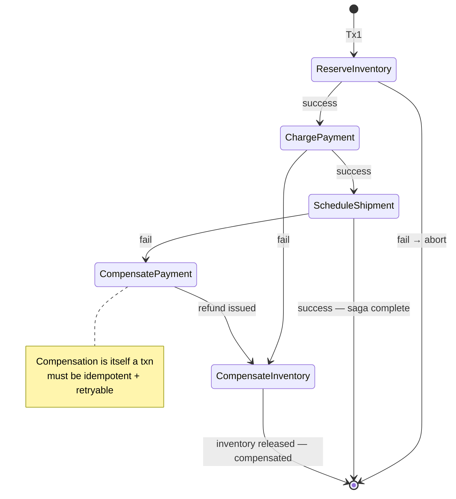

# Chapter 10 — Distributed Transactions: 2PC, Sagas, and Alternatives

**What this chapter covers.** Chapters 5 through 7 built up the machinery of the local
transaction: atomicity from the commit protocol, durability from the WAL, isolation from locking
or MVCC. All of that machinery shares one silent assumption — that there is a single log, in a
single engine, on a single machine, whose one forced write is the commit point. This chapter is
about what happens when that assumption breaks: when one *logical* operation must update two
databases, or a database and a message broker, or three services each owning their own store. The
central fact is that **local ACID does not compose.** Two systems that are each perfectly atomic
do not add up to one atomic system, and the gap between them is where a crash writes half of your
operation into permanent, durable existence.

We start with the canonical trap — the dual write — and show precisely why no ordering of "write
the database" and "publish the event" is safe. Then we treat two-phase commit rigorously: the
protocol, the durability obligations that make it correct, the recovery matrix, and the
fundamental flaw — blocking — that explains why an algorithm proven correct in 1978 is used so
sparingly today. We give sagas the same honest treatment: what they guarantee and, more
importantly, what they conspicuously do not (isolation), along with the design discipline that
makes compensation workable. We introduce the transactional outbox as the standard answer to the
dual write specifically, sketch Try-Confirm-Cancel, and close with a decision ladder whose first
rung is the one most engineers skip: redesign so you do not need a distributed transaction at
all.

Learning goals — after this chapter you should be able to:

- State the dual-write problem precisely and demonstrate the failure interleaving for *both*
  orderings of database write and event publish.
- Walk the two-phase commit protocol including every forced log write, and explain why a YES vote
  must be durable and binding before it is sent (Chapter 7 — WAL).
- Reconstruct the recovery matrix: what coordinator and participant each do after a crash at any
  point in the protocol, and why the coordinator's decision record is the ground truth.
- Explain blocking as 2PC's fundamental flaw — in-doubt transactions, held locks, heuristic
  outcomes — and why 3PC does not fix it under real network assumptions.
- State precisely how atomic commitment differs from consensus, and why making 2PC non-blocking
  requires consensus underneath it (Volume 6, Chapters 5–6; Spanner, Chapter 12).
- Define a saga per the 1987 paper, identify the pivot transaction, and apply countermeasures for
  the isolation a saga does not provide.
- Choose between orchestration and choreography with a defensible rule, and design compensations
  that are idempotent and semantically achievable.
- Apply the decision ladder: single-shard redesign, outbox plus idempotency, saga, and 2PC — in
  that order — and justify the ordering.

## The problem: local ACID does not compose

Everything in Chapter 5 rested on a single moment: the forced write of the commit record to the
WAL. Before that write, a crash means the transaction never happened; after it, recovery replays
it to completion. Atomicity is real because there is exactly one bit, in one place, whose
durable transition *is* the commit.

Now put a second transactional resource into the operation. An order service writes its
PostgreSQL database and publishes an `OrderPaid` event to Kafka. A payment flow debits one
bank's ledger and credits another's. A checkout updates the orders shard and the inventory shard
— which, after Chapter 9, may be two PostgreSQL clusters that merely look like one logical
database. Each resource still has its own commit point, its own log, its own recovery. But there
are now *two* bits in *two* places, and no machine instruction flips both at once. Any protocol
you build must issue two separate commits, and between them the process can crash, the network
can partition, or the second resource can simply say no.

This is not an edge case; it is the default condition of service-oriented architecture. The
moment you split data across services — each owning its store — every business operation that
touches two of them has this problem. The transaction machinery of Chapters 5 through 7 stops at
the edge of each database, and nothing outside it composes the pieces back together.

### The dual write: the canonical trap

The most common instance deserves to be worked in full, because nearly every backend system
contains it: **update the database and publish an event, such that both happen or neither does.**
The naive implementation writes one, then the other. There are only two orderings, and both are
broken.

```text
Ordering A — commit the database first, then publish:

  t1   BEGIN; UPDATE orders SET status = 'PAID' WHERE id = 42; COMMIT;   -- durable
  t2   *** process crashes: OOM-kill, deploy, kernel panic ***
  t3   producer.send(OrderPaid{order: 42})                               -- never executes

  Outcome: the database says PAID forever. No event is ever published.
  Shipping, notifications, analytics — every consumer — never learns the order was paid.

Ordering B — publish first, then commit the database:

  t1   producer.send(OrderPaid{order: 42})                               -- delivered, fanned out
  t2   BEGIN; UPDATE orders SET status = 'PAID' WHERE id = 42;
       COMMIT;  -- fails: crash before commit, serialization failure, constraint violation

  Outcome: consumers act on an order the system of record never marked paid.
  The warehouse ships goods for a payment that, as far as the database knows, did not happen.
```

Notice what does *not* fix this. A try/catch cannot help: in ordering A the process is dead
before `t3`, and in ordering B the event is already irrevocably fanned out before the failure at
`t2` — you cannot catch your way into un-publishing. Retries do not help ordering A, because the
process that knew a publish was owed no longer exists; the knowledge died with it. Doing the
publish "inside" the database transaction does not help either — the broker is not a participant
in the database's commit protocol, so the publish is just a side effect that commits and aborts
independently of the transaction wrapping it.

What the dual write actually needs is atomic commitment across two resources — precisely the
problem two-phase commit solves, and precisely the machinery your database and your broker do
not share. Kafka's transactions, for instance, are real but internal: they make writes to Kafka
partitions and consume-transform-produce cycles atomic *within Kafka*; they cannot enroll your
PostgreSQL commit. Keep the dual write in mind; the transactional outbox later in this chapter
is the standard resolution, and it works not by achieving atomic commitment but by cleverly
refusing to need it.

## Two-phase commit

Two-phase commit (2PC) is the classic atomic commitment protocol, described by Jim Gray in his
1978 "Notes on Data Base Operating Systems" and independently by Lampson and Sturgis. It is
worth learning rigorously because its guarantees and its flaw define the entire design space:
every alternative in this chapter is an answer to "2PC, but without the blocking."

The cast: one **coordinator** and N **participants** (resource managers), each participant being
a transactional resource that has done work on behalf of the distributed transaction and can
locally commit or abort it.

### The protocol

**Phase 1 — voting.** The coordinator sends `PREPARE` to every participant. Each participant
decides whether it can commit: it finishes all work, force-writes a *prepare record* to its WAL —
containing everything needed to either commit or roll back after a crash — and only then replies
`YES`. A participant that cannot commit (constraint violation, deadlock victim, disk full, or
simply too slow) replies `NO`, or the coordinator times out waiting, which counts as `NO`.

**Phase 2 — decision.** If and only if every participant voted `YES`, the coordinator
force-writes a *commit record* to its own log — **this write is the commit point of the entire
distributed transaction** — and then sends `COMMIT` to all participants. Any `NO` or timeout, and
it writes and sends `ABORT` instead. Each participant applies the decision locally, writes its
own outcome record, releases locks, and acknowledges. When all acknowledgments arrive, the
coordinator writes an *end* record and forgets the transaction.



### Prepared means promised: the durability obligations

The protocol's correctness hangs entirely on two forced writes, and it is worth dwelling on each
because both are Chapter 7 in action.

**The participant's prepare record.** A `YES` vote is not an opinion; it is a binding, permanent
promise: *I will commit this transaction if told to, no matter what happens to me in between.*
That promise must survive a crash, so before voting the participant must have the transaction's
redo and undo information durably on disk — force-written, `fsync` and all, exactly the WAL
discipline of Chapter 7 — such that after a restart it can still go either way. A prepared
transaction is a strange object in recovery: unlike ordinary in-flight transactions, which
recovery simply rolls back, it must be *reinstated* — locks re-acquired, state held — because
the participant gave away the right to decide its fate when it voted. The same logic binds a
live participant whose commit message is slow: unilaterally aborting would break the promise,
and unilaterally committing might contradict a coordinator that decided `ABORT` because some
*other* participant voted `NO`.

**The coordinator's decision record.** The coordinator force-writes `COMMIT` or `ABORT` *before*
sending any phase-2 message. That log record is the ground truth of the transaction's outcome —
the single bit we lacked at the start of the chapter, relocated into the coordinator's WAL. If
the coordinator crashes after writing it, recovery reads the log and re-sends the decision;
participants that already applied it treat the duplicate as a no-op. If it crashes before
writing it, no participant can have received a decision, so recovery may safely abort. That
asymmetry is the whole design: every possible crash lands on a well-defined side of one durable
write. (A standard refinement, *presumed abort*, exploits it: if recovery finds no record of a
transaction at all, the answer is abort — so abort decisions and their acknowledgments need not
be logged. Real implementations run presumed abort.)

### State machines and recovery

Both roles are small state machines, and writing them down makes the recovery rules mechanical
rather than mysterious.

| Coordinator state | Entered by | Durable record | On timeout | On crash + recovery |
|---|---|---|---|---|
| `INIT` | transaction begins | none | — | abort silently (presumed abort) |
| `WAITING` | sent `PREPARE` | none required | decide `ABORT` | abort: no decision was logged |
| `COMMITTED` | all voted YES | commit record, forced | re-send `COMMIT` | re-send `COMMIT` until all ack |
| `ABORTED` | any NO / timeout | abort record (lazy under presumed abort) | re-send `ABORT` | nothing owed; participants will ask |
| `DONE` | all acks received | end record | — | forget |

| Participant state | Entered by | Durable record | May unilaterally abort? | On crash + recovery |
|---|---|---|---|---|
| `WORKING` | doing the transaction's work | ordinary WAL | yes | roll back, as any in-flight txn |
| `PREPARED` | force-wrote prepare, voted YES | prepare record, forced | **no** | reinstate: hold locks, ask coordinator for outcome |
| `COMMITTED` | received `COMMIT` | commit record | — | nothing; ack if asked again |
| `ABORTED` | received `ABORT` or voted NO | abort record | — | nothing |

The recovery matrix falls straight out of the tables. Participant crashes before writing its
prepare record: recovery rolls the transaction back like any other in-flight work, and its
missing vote becomes a coordinator timeout, hence a global abort — safe, because it never
promised anything. Participant crashes after preparing: recovery reinstates the prepared
transaction and asks the coordinator how it ended. Coordinator crashes before logging a decision:
recovery aborts; no participant can have heard otherwise. Coordinator crashes after logging the
decision: recovery re-drives phase 2 from the log. Every cell is covered — as long as the
coordinator eventually comes back. That proviso is the next section.

### The fundamental flaw: blocking

Look again at the participant table, at the `PREPARED` row, at the word **no**. A prepared
participant has surrendered the right to decide. Now let the coordinator crash — or become
unreachable, which is indistinguishable — after the votes are in but before the decision reaches
anyone.



The prepared participants are **in doubt**. Each one reasons: "I voted YES, so the coordinator
*may* have logged COMMIT — I cannot abort. But some other participant *may* have voted NO — I
cannot commit." Both inferences are sound, so the participant can do nothing but wait.
Cooperative termination — asking the other participants — helps only if one of them actually
received the decision; if all are in doubt, the protocol is stuck. And "stuck" is not idle: a
prepared transaction holds its write locks (Chapter 6), so every ordinary local transaction
touching those rows queues behind a distributed transaction that cannot finish. In PostgreSQL an
orphaned prepared transaction (visible in `pg_prepared_xacts`) additionally pins the xmin
horizon, so VACUUM reclaims nothing newer — Chapter 6's long-running-transaction disease,
inflicted by a *dead* coordinator. A crashed coordinator does not just delay one transaction; it
degrades the participants for unrelated work.

This is not an implementation defect to be patched. It is the essential property of the protocol:
**2PC buys atomicity across resources by making every participant hostage to the coordinator's
availability during the prepare window.** Gray knew it in 1978; the literature calls 2PC a
*blocking* protocol for exactly this reason.

Practice could not always wait, so XA gave operators a hatch: **heuristic resolution.** A human
— or a resource manager configured with a timeout — unilaterally commits or rolls back an
in-doubt branch (`XA COMMIT`/`XA ROLLBACK` on a recovered branch in MySQL, `COMMIT PREPARED`/
`ROLLBACK PREPARED` in PostgreSQL). The word "heuristic" means *guess*. When the coordinator
finally returns with the real decision and it disagrees, the outcome is heuristic-mixed — some
branches committed, some rolled back — and atomicity, the one property the protocol existed to
provide, is silently gone. XA even has error codes for this (`XA_HEURCOM`, `XA_HEURRB`,
`XA_HEURMIX`), which tells you how routine it was. The damage is the worst kind: discovered
later, by reconciliation jobs or customers.

### What 2PC costs even when nothing fails

Set the crashes aside; the sunny-day protocol is expensive too.

**Latency.** Two sequential network round trips, plus at least two forced-write points on the
critical path: every participant's prepare record, then the coordinator's decision record —
each an `fsync` (Chapter 7 taught you what those cost). Each phase waits for the *slowest*
participant, so the distributed commit's p99 is roughly the max of the participants' p99s, plus
the coordinator's write, plus the round trips.

**Availability.** A 2PC transaction can commit only when the coordinator *and every participant*
are simultaneously up and reachable. Availability multiplies: five participants at 99.5% each,
with a 99.5% coordinator, yields roughly `0.995^6 ≈ 0.970` — about 2.6 days of unavailability a
year for the composed operation, an order of magnitude worse than any single component. This is
the precise sense in which distributed transactions "don't scale": each added participant
multiplies the failure probability and takes a max over latencies, while the blocking window
puts every participant at the mercy of any one of them.

### XA, and why app-server XA fell out of favor

X/Open XA (1991) standardized the interface between a *transaction manager* (the coordinator)
and *resource managers* (databases, queues), so that heterogeneous products could participate in
one 2PC. The Java mapping (JTA) put the transaction manager inside the application server —
WebLogic, WebSphere, JBoss — and for a decade enterprise architecture assumed a container
coordinating XA across Oracle and MQ Series.

It fell out of favor for reasons that follow directly from the analysis above, not from fashion.
The coordinator lived in the application server: a stateful, singular process embedded in the
tier that gets redeployed most often — the worst possible home for the one component whose crash
blocks everyone and whose log is needed for recovery. That log had to survive restarts and be
reattached to a recovering instance, which fit badly with stateless horizontal scaling and,
later, with containers that vanish rather than restart in place. Drivers' XA code paths were
less exercised and buggier than their local-transaction paths. Heuristic outcomes turned
"atomic" into "atomic, usually." And the newer resources people wanted to enroll — HTTP APIs,
Kafka, Redis, object stores — never spoke XA at all. None of this means 2PC is dead: it remains
alive and correct *inside* single administrative domains with purpose-built infrastructure —
cross-shard transactions in distributed SQL engines (Chapter 12), MySQL's internal 2PC between
InnoDB and the binlog, Kafka's transaction coordinator. What died was 2PC as *application
architecture* across heterogeneous, independently operated systems.

### 3PC, and the road that leads to consensus

The obvious question — can atomic commitment be made non-blocking? — was tackled by Dale Skeen
in 1981. Three-phase commit inserts a *pre-commit* round between voting and commit, so that no
participant ever commits while another could still be in a state that permits abort; surviving
participants can then always decide among themselves after a coordinator crash. It is a genuine
theoretical contribution, and it essentially never shipped, because its non-blocking guarantee
holds only under assumptions reality declines to provide: crash-stop failures, a synchronous
network with bounded delay, and reliable failure detection — no partitions. Under a real network
partition, 3PC can split into two groups that each "safely" terminate the protocol with opposite
decisions, which is strictly worse than blocking. A protocol that trades *stuck* for *wrong* is
not an upgrade.

The insight hiding in 3PC's failure is the segue to the modern answer: what 3PC was groping for —
a set of nodes reaching one durable decision that survives the failure of any minority — *is
consensus*, which is solvable under realistic assumptions with Paxos or Raft (Volume 6,
Chapters 5 and 6). Gray and Lamport made the connection exact in "Consensus on Transaction
Commit" (2006): 2PC is the degenerate case of Paxos Commit with a single acceptor — and that
single acceptor is exactly why it blocks. Replace the singular coordinator's decision with a
consensus decision among 2F+1 nodes and the protocol tolerates F failures without blocking. This
is precisely Spanner's architecture (Corbett et al., 2012; Chapter 12): each participant *and
the coordinator* is a Paxos-replicated group rather than a machine, so 2PC still runs between
groups, but "the coordinator crashed" stops being a singular event — the group elects a new
leader that reads the decision state from the replicated log and drives the protocol onward. The
blocking flaw was never about 2PC's message pattern; it was about unreplicated decision state.
Fix the replication and 2PC is rehabilitated — at the price of running consensus, which is
Volume 6's subject.

## Sagas

If 2PC's price is unacceptable and the operation still spans resources, the alternative is to
stop pretending the operation is one transaction and engineer it as several. Hector
Garcia-Molina and Kenneth Salem named this pattern **sagas** in 1987 — originally for
*long-lived transactions* inside a single database, where holding locks for a multi-hour batch
job was intolerable. The microservices world rediscovered the paper because its problem is
structurally identical: a multi-step business operation where holding cross-resource locks for
the duration is impossible.

A saga is a sequence of local transactions `T1, T2, …, Tn`, each atomic in its own resource,
where each step `Ti` (up to the last) has a **compensating transaction** `Ci` that semantically
undoes it. The guarantee: either the saga runs `T1 … Tn` to completion, or it runs
`T1 … Tj` followed by `Cj, Cj-1, …, C1` — forward to the end, or backward to the start, with
every step's effect eventually cancelled. (The paper also defines *forward recovery* — persist
enough state to retry onward from the failure point rather than unwinding — which is what modern
workflow engines call "just retry the activity.")



### What a saga is not: the missing I

Here is the sentence to tattoo somewhere visible: **a saga is not a transaction.** It preserves
a weak form of atomicity — eventually, all-or-compensated — and each step is individually
durable. It provides **no isolation whatsoever.** Between `T1` and the saga's end, every
intermediate state is committed and visible to the entire world: other transactions, other
sagas, users. Other work reads and *writes against* your intermediate states, and these are not
even dirty reads you could blame on an isolation level (Chapter 6) — every one of them is a
committed local transaction.

The anomalies are concrete. *Lost updates between steps*: the inventory your saga reserved in
`T2` is released by a concurrent cancellation saga that read stale order state, and your `T4`
ships inventory that no longer exists. *Reads of doomed state*: an analytics query counts the
order that `C1` will cancel two seconds later. *Interleaved sagas*: two sagas each complete
their first steps, then each fail on the other's intermediate state, then each compensate.

Since the database will not give a saga isolation, the application must buy back what it needs
with **countermeasures** (the term is Chris Richardson's, in *Microservices Patterns*):

- **Semantic locks / pending states.** `T1` writes `status = PENDING`, not `status = CONFIRMED`,
  and every other piece of code treats `PENDING` as "hands off, in flux" — declining to ship,
  count, or modify it. This is an application-level lock encoded as data, unlocked by the saga's
  completion or compensation. It is the single most important saga discipline, and it is why
  well-designed saga systems are full of statuses like `RESERVED` and `PENDING_SHIPMENT`.
- **Commutative updates.** Where possible, make steps commute so interleaving cannot corrupt:
  `balance = balance - 40` commutes with a concurrent `- 25`; `balance = 960` does not. Design
  for arithmetic, not assignment.
- **Re-read and verify.** A later step re-checks the invariant it depends on — optimistic
  concurrency at the workflow level — rather than trusting a value read three steps and four
  seconds ago.
- **Order the steps by risk — and know your pivot.** The **pivot transaction** is the step after
  which the saga can no longer compensate, because a step has no meaningful undo or a business
  commitment has escaped (money captured, goods shipped, email sent). Steps before the pivot are
  *compensatable*; steps after it must be **retriable** — designed to succeed eventually,
  retried forever if need be — because the only direction left is forward. Put the steps most
  likely to fail earliest and the pivot as late as possible: validate, reserve, and authorize
  before you capture, ship, or notify. A saga that puts "send confirmation email" before "charge
  card" has chosen its regret in advance.

### Designing compensations

Compensation is where saga designs are won or lost, and three properties are non-negotiable.

**Semantic undo, not restore.** `Ci` does not reset rows to their prior bytes — other
transactions have long since seen and built on `Ti`'s output, and a byte-level restore would be
a lost update against *them*. `Ci` is a new forward-moving business action that cancels `Ti`'s
*meaning*: a refund, not a deleted charge row; a reservation release, not a restored quantity
snapshot. And some actions have no semantic undo at all — you cannot un-send an email, un-ship a
package, or un-call a third-party API with no cancellation endpoint. Every such action is a
forced pivot: it must sit after the real pivot in the ordering, or the saga must accept
apology-based compensation ("we emailed you in error"), which is a business decision, not a
technical one.

**Idempotent.** The orchestrator will crash mid-compensation and re-run `Ci`; the network will
deliver its request twice. `Ci` must therefore be safe to apply repeatedly — refund *this charge
id* (a no-op the second time), not "refund $50." The same is true of every forward step `Ti`,
for the same reason: sagas live on retries, and retries demand idempotency keys end to end
(Volume 6, Chapter 9 treats idempotency fully).

**Must eventually succeed.** A compensation has no compensation. If `C2` fails, the saga cannot
"roll back the rollback" — it can only retry `C2` until it succeeds, which is why compensations
should be simple, dependency-light, and free of business-rule rejections (a refund that can be
*declined* is not a compensation, it is another step that can fail). When a compensation fails
persistently — the refund API is down for a day — the saga parks in a dead-letter state and
**escalates to a human**, with enough persisted context to resume. Every production saga system
has this drawer of stuck sagas; the only question is whether you built it deliberately, with
alerting, or are discovering it in an incident.

### Orchestration versus choreography

Someone has to know the saga's definition — the sequence, the compensations, the current
position. The two answers differ in where that knowledge lives.

**Orchestration** makes it explicit: a coordinator — a persistent state machine — invokes each
step, records the result durably, and decides what happens next. The saga's definition is code
you can read in one place, and the saga's *state* is a row you can query. This is conceptually
what Temporal and AWS Step Functions provide as infrastructure: the engine persists the state
machine's position (Temporal by durably logging the workflow's event history and replaying it to
reconstruct state; Step Functions as a managed state-machine execution), so the orchestrator is
not a singular process whose crash loses the saga — the pattern's own coordinator-death problem,
solved by making coordinator state durable and resumable rather than by consensus.

```python
# Orchestrated saga as a persisted state machine (conceptual pseudo-code).
# The framework guarantees: state transitions are durable before effects are
# visible, every step call carries an idempotency key, and a crashed
# orchestrator resumes from the last recorded transition.

class CreateOrderSaga:
    steps = [
        #     forward action          compensation
        Step(create_order,            cancel_order),        # writes status=PENDING
        Step(reserve_inventory,       release_inventory),
        Step(charge_payment,          None),                # PIVOT: capture; no undo past here
        Step(arrange_shipment,        None),                # retriable: retry until success
        Step(confirm_order,           None),                # writes status=CONFIRMED
    ]

    def run(self, ctx):
        for i, step in enumerate(self.steps):
            self.record(ctx, position=i, phase="attempting")      # durable BEFORE acting
            try:
                step.action(ctx, idempotency_key=(ctx.saga_id, i))
            except RetriableError:
                raise Retry(backoff=True)                          # same step, same key
            except BusinessFailure:
                if self.past_pivot(i):
                    raise Retry(backoff=True)   # no way back: forward-only, escalate on budget
                return self.compensate(ctx, from_step=i - 1)
        self.record(ctx, phase="completed")

    def compensate(self, ctx, from_step):
        for i in range(from_step, -1, -1):
            if self.steps[i].compensation is None:
                continue
            self.record(ctx, position=i, phase="compensating")
            retry_forever_then_escalate(
                self.steps[i].compensation, ctx,
                idempotency_key=(ctx.saga_id, i, "comp"),
                escalation="page team; park saga in NEEDS_ATTENTION")
        self.record(ctx, phase="compensated")
```

**Choreography** distributes the knowledge: there is no coordinator, and each service reacts to
events. Order service emits `OrderCreated`; inventory hears it, reserves, emits
`InventoryReserved`; payment hears that, charges, emits `PaymentCompleted` or `PaymentFailed`;
inventory hears `PaymentFailed` and releases. The saga *emerges* from the subscriptions. For a
short linear flow this is attractively decoupled. The costs arrive with scale and time. The
saga's definition exists nowhere; to learn what the checkout flow actually does, you grep event
subscriptions across a dozen repositories and reconstruct the graph by hand — archaeology, not
architecture. Failure paths are the worst of it: *who compensates?* Each service must subscribe
to the failure events of every step *after* its own and know to undo itself — a web of
reverse-direction couplings that is combinatorially worse than the forward flow, rarely tested,
and silently wrong when a new step is inserted and nobody updates the predecessors'
subscriptions. And there is no single place to observe a stuck saga, because no component knows
the saga exists.

The guidance follows from the failure modes, not from taste: **choreograph short, linear,
stable sagas — two or three steps whose compensation story is trivial. Orchestrate anything
long, branching, or evolving.** The moment you catch yourself drawing the event graph on a
whiteboard to answer "what happens if payment fails after partial shipment," the diagram is
telling you it wants to be code in an orchestrator.

### Timeouts, and the saga that never ends

A saga has no lock manager and no deadlock detector to kill it (Volume 4, Chapter 5's detector
has no distributed analogue here), and no coordinator timeout aborts it automatically. A saga
stalls silently — a step's request lost, a consumer down — and the order sits `PENDING` forever,
holding its semantic locks exactly as a prepared 2PC participant holds real ones. The
in-flight-forever saga is the pattern's version of the in-doubt transaction, softened only in
that the locks are advisory. Two disciplines close the gap: every saga carries a **deadline**,
after which the orchestrator (or a watchdog, for choreography) forces a decision — compensate if
before the pivot, escalate if after — and saga state is **observable**: a queryable table of
live sagas, their positions, and their ages, with an alert on age. If you cannot list your
in-flight sagas, you already have some you do not know about.

## The transactional outbox

Return now to the dual write, because the standard fix is elegant enough to state in one
sentence: **if you cannot atomically write two systems, write one system twice — atomically —
and let an asynchronous process convey the second write to the second system.**

The service writes the business row *and* a row describing the event into an `outbox` table **in
the same local ACID transaction** — one database, one commit point, Chapter 5 machinery, nothing
distributed. A separate **relay** then reads committed outbox rows and publishes them to the
broker, marking them as sent. If the process crashes after commit, the event is not lost — it is
sitting durably in the outbox, and the relay publishes it after recovery. If the transaction
aborts, the outbox row aborts with it and no event escapes. Both dual-write interleavings are
dead: the event and the state change share a single commit.



```sql
CREATE TABLE outbox (
    id              bigint GENERATED ALWAYS AS IDENTITY PRIMARY KEY,
    event_id        uuid        NOT NULL DEFAULT gen_random_uuid(),  -- consumer dedup key
    aggregate_type  text        NOT NULL,          -- 'order'
    aggregate_id    text        NOT NULL,          -- '42'  -> broker partition key
    event_type      text        NOT NULL,          -- 'OrderPaid'
    payload         jsonb       NOT NULL,
    created_at      timestamptz NOT NULL DEFAULT now(),
    published_at    timestamptz                    -- NULL = not yet relayed
);

-- Relay loop (polling variant), safe to run in one instance per aggregate hash:
BEGIN;
SELECT id, event_id, aggregate_id, event_type, payload
FROM   outbox
WHERE  published_at IS NULL
ORDER  BY id
LIMIT  100
FOR UPDATE SKIP LOCKED;          -- competing relays skip, not block (Chapter 6)
-- ... publish each row to the broker, keyed by aggregate_id ...
UPDATE outbox SET published_at = now() WHERE id = ANY (:published_ids);
COMMIT;
```

Two consequences are load-bearing. First, delivery is **at-least-once**, irreducibly: the relay
can crash after publishing and before marking `published_at`, and will re-publish on restart.
The outbox therefore *requires* its other half — **idempotent consumers** that deduplicate on
`event_id` (Volume 6, Chapter 9); deploying the outbox without consumer idempotency merely
trades missing events for duplicate ones. Second, ordering is per aggregate at best: publish
keyed by `aggregate_id` so one entity's events land in one partition in order, and note that
`SKIP LOCKED` with competing relays can reorder across batches — if per-aggregate order matters,
shard relays by aggregate rather than racing them.

The polling relay's tail latency and load have a sharper alternative: a **CDC-based relay**
(Debezium is the canonical one) tails the database's WAL through the replication protocol —
literally the logical-decoding interface of Chapters 7 and 8 — and streams committed outbox
inserts to the broker with no polling at all. The commit record in the WAL *is* the event's
release: the same forced write that made the transaction durable makes the event eligible for
publication. Relay operations, topic routing, and outbox hygiene get their full treatment in
Volume 10, Chapter 6; event sourcing — where the log stops being a side-channel and becomes the
store — is Volume 10, Chapter 5.

## Try-Confirm-Cancel, briefly

TCC recurs in payments architectures and deserves a short honest note. It is 2PC lifted out of
the database and into the business layer: **Try** executes a *reservation* — an application-level
prepare that sets aside resources in a business-visible pending state (an authorization hold on
a card, a seat hold with a 10-minute expiry) — then **Confirm** makes all reservations final, or
**Cancel** releases them. The improvement over XA is that the "prepared" state is not a database
lock but a first-class business object with a **timeout**: an unconfirmed hold expires on its
own, so a dead coordinator inconveniences rather than blocks. The costs: every participating
service must design and expose all three operations, Confirm and Cancel must be idempotent (the
coordinator retries them), and expiry races confirmation — the hold that expires just as Confirm
arrives must be handled explicitly. TCC is best understood as a saga whose first phase is
deliberately shaped like 2PC's prepare — reservations instead of locks, expiry instead of
blocking.

## Choosing honestly: the decision ladder

Given a business operation that appears to need a distributed transaction, work this ladder from
the top; each rung is strictly cheaper to operate than the one below it.

**Rung 1 — redesign so the invariant lives in one shard.** Most "distributed transaction
problems" are Chapter 9 shard-key problems wearing a disguise. If checkout must atomically touch
the order and its line items, the answer is not a cross-shard protocol; it is sharding by
`order_id` so they colocate. If a transfer must atomically touch two accounts, ask whether the
*invariant* is really per-pair, or whether an append-only ledger with balances derived
asynchronously serves the business — banks themselves settle asynchronously with
reconciliation, the world's oldest saga. Aggregate boundaries in the domain-driven-design sense
are exactly this: the unit within which invariants must hold transactionally, and therefore the
unit that must not be split across stores. The cheapest distributed transaction is the one your
data model made unnecessary.

**Rung 2 — outbox plus idempotent consumers, for database-plus-messaging.** If the second
"resource" is a broker — which covers the majority of real cases — the dual write is the actual
problem, and the outbox is its complete solution. No new infrastructure beyond a table and a
relay; failure modes are duplicates, not inconsistency.

**Rung 3 — a saga, for genuine multi-service workflows.** When distinct services must each
commit local state, model the flow as a saga — orchestrated unless it is trivially short — with
pending states, a consciously placed pivot, idempotent compensations, deadlines, and an
escalation drawer. Accept, explicitly and in writing, that intermediate states are visible and
that the anomaly countermeasures are now part of your domain model.

**Rung 4 — 2PC, within one administrative domain, on infrastructure built for it.** Cross-shard
transactions inside a distributed SQL engine whose commit protocol runs over replicated
coordinators (Chapter 12), or a mature XA deployment you operate yourself with tested recovery
runbooks. What earns 2PC its place on the ladder at all is strength: it *does* provide atomicity
across resources, which no rung above it does. What puts it last is everything this chapter
established — blocking, availability multiplication, heuristics — costs manageable inside one
team's blast radius and unmanageable across organizational boundaries.

## The distributed-systems lens

**Atomic commitment and consensus are different problems — be precise about which one 2PC
solves.** 2PC solves atomic commitment: *every* participant must agree, because any single
participant's NO is a veto — its local integrity constraint failed, and committing over a veto
would corrupt it. Consensus (Volume 6, Chapters 5–6) requires only a *majority*, and therefore
keeps deciding while a minority is down. The requirements shape the failure behavior: a protocol
that needs everyone can be stalled by anyone, which is 2PC's blocking; a protocol that needs a
majority tolerates a minority's silence, which is Paxos's liveness. They compose rather than
compete — Spanner runs atomic commitment *between* groups and consensus *within* them. The
slogan version: 2PC gets unanimity about a veto-able decision; consensus gets a fault-tolerant
decision. Confusing them is how 3PC happened.

**A saga is structured concurrency with compensation, at workflow scale.** Volume 4, Chapter 8's
discipline — every task has an owner; a scope does not exit until its children resolve; failure
of one child triggers deliberate cancellation of its siblings; nothing leaks — is exactly the
orchestrated saga's discipline with "task" replaced by "local transaction" and "cancel" replaced
by "compensate," because committed work cannot be cancelled, only counteracted. The orchestrator
is the scope; the in-flight-forever saga is the leaked goroutine. Choreography, in this frame,
is unstructured concurrency — fire-and-forget with the ownership question unanswered — and it
earns the same verdict for the same reasons.

**Exactly-once delivery is an end-to-end fiction; at-least-once plus idempotency is the real
contract.** Every hop in this chapter — 2PC's phase-2 retries, the saga's step retries, the
outbox relay's re-publish after crash — delivers duplicates under precisely the failures it is
designed to survive, because "did my effect land?" is unanswerable at the moment of timeout and
retrying is the only safe response. Systems that advertise exactly-once (Kafka transactions,
Temporal) achieve exactly-once *processing* within a boundary they control, by — look inside —
deduplicating at-least-once delivery with persistent identifiers. The contract worth writing
down: every effect carries an idempotency key, every consumer deduplicates, and delivery is
assumed repeated (Volume 6, Chapter 9).

**Atomicity across a partition boundary costs availability — so design the boundaries.** The
availability product and the blocking window are not implementation warts; they are the price
any protocol pays for refusing to complete until multiple failure domains agree. You choose
where to pay it when you choose where transactional boundaries fall: inside a shard, atomicity
is a forced log write; across shards, it is a protocol with hostages. This is Pat Helland's 2007
argument in "Life beyond Distributed Transactions": scale-out systems end up with *entities* —
single-shard units of atomicity — and *activities* between them that manage uncertainty with
messages, retries, and apologies. That is this chapter's ladder, derived from first principles:
atomicity is cheap inside a boundary and expensive across one, so put the boundaries where the
invariants are.

## Key takeaways

- **Local ACID does not compose.** Two resources means two commit points, and no instruction
  flips both. The dual write is the canonical trap: commit-then-publish loses events on crash;
  publish-then-commit emits events for state that never committed. Neither ordering is safe.
- **2PC relocates the commit point** into the coordinator's log: participants force-write
  prepare records that make their YES votes durable and binding (Chapter 7), and the
  coordinator's forced decision record is the ground truth. Every crash lands on a defined side
  of that one write.
- **2PC's fundamental flaw is blocking.** A prepared participant can neither commit nor abort
  unilaterally; a dead coordinator leaves participants in doubt, holding locks that stall
  unrelated work. XA's heuristic outcomes trade the stall for silently broken atomicity. Even
  sunny-day 2PC costs two round trips plus forced writes, and availability multiplies across
  participants.
- **3PC never shipped because it needs a synchronous, partition-free world.** Making atomic
  commitment non-blocking under real assumptions requires consensus — Gray and Lamport's Paxos
  Commit, realized in Spanner's 2PC-over-Paxos-groups (Volume 6, Chapters 5–6; Chapter 12).
- **A saga is a sequence of local transactions with compensations — and no isolation.**
  Intermediate states are committed and visible; buy back safety with pending states,
  commutative updates, re-verification, and a late, consciously placed pivot, after which the
  saga only rolls forward.
- **Compensations must be semantic, idempotent, and unable to be refused** — and some actions
  (sent email, shipped goods) have no undo, which makes them forced pivots. Failed compensations
  retry, then escalate to a human; build that drawer before the incident does.
- **Orchestrate long or branching sagas; choreograph only short, stable, linear ones.** Every
  saga needs a deadline and an observable state table.
- **The transactional outbox solves the dual write** by making event and state share one local
  commit, with a polling or CDC relay publishing afterward. Delivery becomes at-least-once by
  construction, so idempotent consumers are the other half of the pattern, not an option.
- **Work the ladder in order:** colocate the invariant in one shard (most distributed-transaction
  problems are shard-key problems); outbox plus idempotency for DB-plus-messaging; saga for real
  multi-service workflows; 2PC only inside one administrative domain on infrastructure built for
  it.
- **Atomic commitment is not consensus:** unanimity with vetoes versus majority with fault
  tolerance — different problems that compose. And exactly-once is a fiction at the boundary:
  the real contract everywhere is at-least-once delivery plus idempotent effects.








## Further reading

- Gray, J., "Notes on Data Base Operating Systems," in *Operating Systems: An Advanced Course*,
  Springer LNCS 60, 1978 — the original systematic treatment of transactions, recovery, and
  two-phase commit.
- Garcia-Molina, H. and Salem, K., "Sagas," *SIGMOD*, 1987 — the source, including compensation
  and forward/backward recovery; short and very readable.
  https://dl.acm.org/doi/10.1145/38713.38742
- Skeen, D., "Nonblocking Commit Protocols," *SIGMOD*, 1981 — three-phase commit and the formal
  analysis of blocking.
- Gray, J. and Lamport, L., "Consensus on Transaction Commit," *ACM TODS* 31(1), 2006 — the
  precise bridge between atomic commitment and consensus; 2PC as degenerate Paxos Commit.
  https://dl.acm.org/doi/10.1145/1132863.1132867
- Corbett, J. et al., "Spanner: Google's Globally-Distributed Database," *OSDI*, 2012 — 2PC
  layered over Paxos groups in production.
  https://research.google/pubs/spanner-googles-globally-distributed-database-2/
- Kleppmann, M., *Designing Data-Intensive Applications*, O'Reilly, 2017 — Chapter 9's treatment
  of 2PC, XA, and the commit/consensus relationship is the best short published account.
- Helland, P., "Life beyond Distributed Transactions: an Apostate's Opinion," *CIDR*, 2007 —
  entities, activities, and why scale-out systems abandon cross-entity transactions.
- Richardson, C., *Microservices Patterns*, Manning, 2018, and
  https://microservices.io/patterns/data/saga.html — sagas for services, the countermeasure
  vocabulary, orchestration versus choreography.
- X/Open, *Distributed Transaction Processing: The XA Specification*, 1991 — the interface
  underneath JTA and `XA PREPARE`/`XA COMMIT`, heuristic outcomes included.
- Temporal documentation — https://docs.temporal.io/ — durable-execution workflow orchestration;
  see the concepts section on workflows, activities, and retries for the modern orchestrator in
  practice.
- Debezium documentation, "Outbox Event Router" —
  https://debezium.io/documentation/reference/stable/transformations/outbox-event-router.html —
  the CDC-based outbox relay in deployable form (depth in Volume 10, Chapter 6).
- Volume 5: Chapter 7 — WAL (the forced writes this chapter leans on); Chapter 9 — Partitioning
  and Sharding (rung 1); Chapter 12 — NewSQL (Spanner and friends in full).
- Volume 6: Chapters 5–6 — consensus; Chapter 9 — idempotency and delivery semantics.
- Volume 4: Chapter 8 — structured concurrency, the single-process shape of the orchestrated saga.
