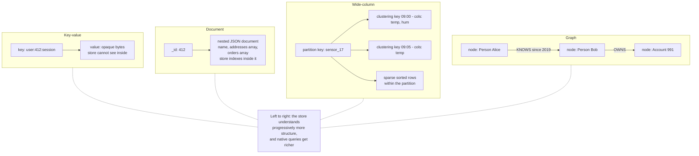
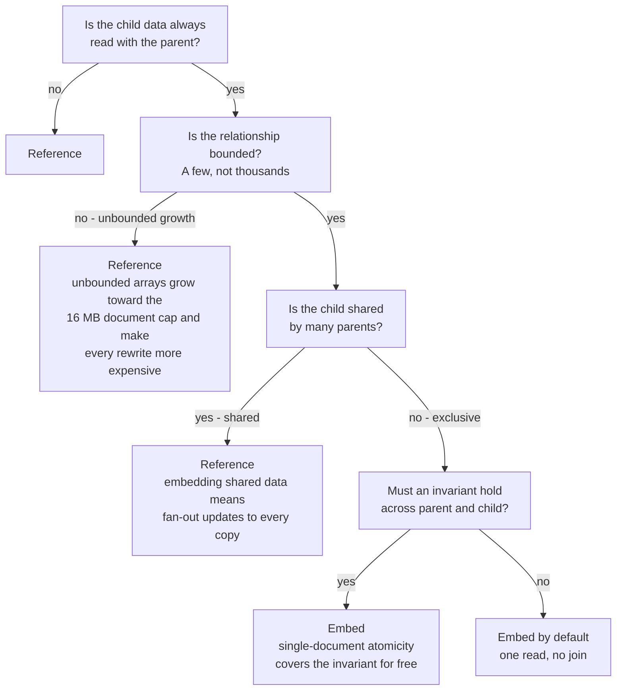
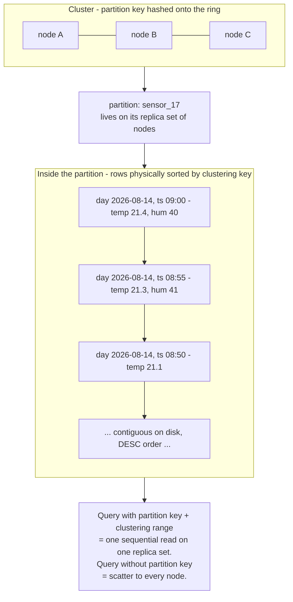
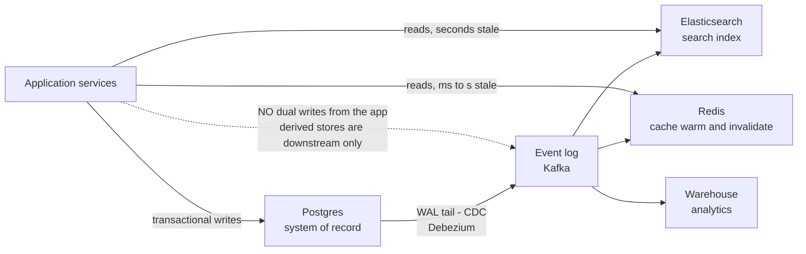

# Chapter 11 — NoSQL: Key-Value, Document, Wide-Column, and Graph

**What this chapter covers.** Ten chapters into this volume you have seen how a database stores
(Chapter 2), indexes (Chapter 3), isolates (Chapter 6), logs (Chapter 7), replicates (Chapter 8),
partitions (Chapter 9), and coordinates across partitions (Chapter 10). This chapter is about the
family of systems that, starting in the mid-2000s, deliberately gave up parts of that machinery to
buy scale, availability, or modeling flexibility — and about what two decades of production
experience have taught us about which of those trades were worth making. We take the history
seriously, because the history explains the designs: two papers, Google's Bigtable (2006) and
Amazon's Dynamo (2007), founded nearly every lineage in this space, and each system's behavior is
best predicted by knowing which parent it descends from. We then work through the four data models
— key-value, document, wide-column, graph — with real mechanics and real exemplars, not category
slogans. The stance throughout is the one worth internalizing: **these categories describe data
models and trade-off points, not tribes.** The interesting question about any store is never "is
it NoSQL?" but "what does it make cheap, what does it make expensive, and what does it hand back
to my application to solve?"

The distributed-systems lens is central rather than appended: the deepest thing NoSQL did was
surface the distributed trade-offs that the single-node RDBMS had hidden, and hand partition-key
design — which is distributed-systems design — to the application developer. Quorum mechanics get
their full treatment in Volume 6, Chapter 7; this chapter previews them only far enough to read a
Cassandra consistency level honestly.

Learning goals — after this chapter you should be able to:

- Explain *why* NoSQL happened — the operational misery of hand-sharded RDBMS at 2000s web scale —
  and trace the two founding lineages from the Bigtable and Dynamo papers to today's systems.
- Describe the mechanics of each of the four models, including Redis's persistence trade-offs,
  DynamoDB's capacity and partition model, Cassandra's partition/clustering layout, MongoDB's
  atomicity contract, and index-free adjacency in graph stores.
- Practice query-first modeling: design a Cassandra table or a DynamoDB key schema *from* an access
  pattern, and make the embed-versus-reference decision in a document store deliberately.
- State honestly what each model gives up — secondary indexing, ad-hoc aggregation, cross-entity
  invariants — and where those costs reappear in application code.
- Apply a decision framework that starts from access patterns and consistency invariants, treats
  "just use Postgres" as the default to be argued *against*, and prices polyglot persistence at its
  true integration cost.

## Why NoSQL happened

### The misery that motivated it

By the mid-2000s, the largest web properties had driven the single-node relational database past
its limits, and the standard escape — sharding by hand, exactly the technique dissected in
Chapter 9 — was operationally brutal. The application picked a shard key (usually user ID), a
routing layer mapped keys to one of N MySQL primaries, and from that moment the team owned every
problem the database used to own: cross-shard queries became application-level scatter-gather,
cross-shard transactions became either two-phase commit (Chapter 10) or a prayer, resharding meant
weeks of dual-write migration choreography, and every JOIN that crossed a shard boundary simply
died. Facebook, LiveJournal, Flickr, and YouTube all ran variants of this architecture, all built
substantial in-house tooling to survive it, and none would have described it as pleasant. Add the
era's second friction — `ALTER TABLE` on a multi-hundred-gigabyte MySQL table could lock writes for
hours, making schema evolution a scheduled outage — and the appetite for something else is easy to
understand.

Two papers turned that appetite into an industry.

**Bigtable (Chang et al., OSDI 2006)** described Google's storage system for crawl data, Google
Earth, and analytics: a sparse, distributed, persistent multi-dimensional sorted map, partitioned
into tablets, each tablet served by exactly one tablet server, with metadata coordinated through
Chubby (Google's lock service, a Paxos consumer). Bigtable chose consistency: a single master per
tablet means reads and writes for a row have one authoritative home, and a tablet is briefly
unavailable while it is reassigned after a failure. HBase is its open-source descendant almost
component-for-component; Cassandra took its *data model* (the wide, sparse, sorted row) while
rejecting its single-master architecture.

**Dynamo (DeCandia et al., SOSP 2007)** described Amazon's shopping-cart store and chose the
opposite corner: an always-writable key-value store with no master at all. Consistent hashing
spread keys across a ring; every write went to N replicas; sloppy quorums and hinted handoff kept
writes flowing during node failures; vector clocks tracked causality so that concurrent writes
produced *siblings* the application had to reconcile ("merge the carts") rather than a silently
lost update. Dynamo chose availability and pushed conflict resolution up the stack. Cassandra took
its *distribution* architecture, Riak implemented it nearly verbatim, and Amazon's later DynamoDB
service inherited the name and the partitioning philosophy while quietly walking back some of the
radicalism (DynamoDB offers strongly consistent reads and does not expose vector clocks).

Nearly everything in this chapter descends from one paper or the other, and the lineage predicts
behavior: Dynamo-lineage systems are leaderless, always-writable, and make you think about
read-repair and conflicts; Bigtable-lineage systems have a per-range leader, stronger ordering,
and a failover story. Keep the family tree in mind and few of these systems will surprise you.

### The wave, the retreat, and the honest frame

What followed the papers was a genuine engineering movement wrapped in a marketing wave. Roughly
2009–2013, "NoSQL" was pitched as a generational replacement — schemas were legacy, JOINs didn't
scale, SQL itself was the problem. The term's own history records the correction: it was quickly
rebranded from "no SQL" to "not only SQL" as it became clear that most adopters were not actually
Google, and that the things sacrificed — transactions, secondary indexes, ad-hoc queries, decades
of operational tooling — had been paying rent all along. Early MongoDB shipped with defaults tuned
for benchmark optics (unacknowledged writes) and a first-generation sharding and failover
implementation that taught a cohort of engineers hard lessons about what "eventually consistent"
means at 3 a.m.

The retreat was not a rout but a *re-convergence*, and it is still running in both directions.
Document stores grew up: MongoDB added multi-document ACID transactions (4.0 in 2018 on replica
sets, 4.2 across shards), a serious aggregation pipeline, and tunable read/write concerns that map
directly onto the replication vocabulary of Chapter 8. Cassandra grew CQL, a deliberately SQL-shaped
dialect. Meanwhile the relational world absorbed the other side's virtues: Postgres's `jsonb` with
GIN indexing (Chapter 3) gives you schema-on-read *inside* a transactional store, and the NewSQL
systems of Chapter 12 exist precisely to offer NoSQL's horizontal scale without surrendering SQL or
serializability. The SQL:2016 standard even added JSON operators.

So the honest frame, and the one this chapter uses: the categories that follow are **data models**
— what shape your data takes and what operations are native to that shape — bundled with
**trade-off points** — what the exemplar systems chose about consistency, distribution, and
indexing. They are not ideologies, and choosing among them is engineering, not tribal affiliation.



The ordering in the diagram is the useful mental model: from key-value to graph, the store
understands progressively more of your data's structure, and in exchange for that understanding it
can execute progressively richer queries natively — at the cost of progressively harder
distribution stories. A key-value store scales almost embarrassingly well precisely because it
understands nothing; a graph partitions badly precisely because its whole value is in the
connections that partitioning must cut.

## Key-value stores

The key-value model is the minimal contract: `get(key)`, `put(key, value)`, `delete(key)`, where
the value is opaque bytes. The store cannot query inside values, which sounds like poverty and is
actually the source of the model's power — with no structure to maintain, every operation touches
exactly one key, keys hash cleanly across partitions (Chapter 9), and there are no cross-key
invariants for the store to enforce or betray. Everything in Chapters 5 and 10 about transactional
coordination is simply out of scope by construction. The application inherits whatever coordination
it actually needed.

### Redis: the data-structure server

Redis is the most instructive key-value system because it deviates from the model in one direction
— values are not opaque but *typed data structures* — while staying radically simple in another:
command execution is single-threaded. One thread runs an event loop (the same `epoll`-based
architecture as Volume 4, Chapter 6) and executes commands strictly one at a time. Since Redis 6.0
network I/O can be spread across threads, but the command itself still executes serially, and this
is a feature, not a limitation: every command, and every Lua/`MULTI` block, is atomic with no
locking anywhere, because there is nothing to lock against. The costs follow just as directly: a
single slow command — `KEYS *` on a large keyspace, `SMEMBERS` on a ten-million-member set, a
long Lua script — stalls *every* client, which is Volume 4's "never block the event loop" rule
wearing a database costume. And one instance uses roughly one core for command work, so scaling
compute means Redis Cluster and hash-slot partitioning, at which point multi-key operations only
work when all keys share a slot (the `{hashtag}` convention) — Chapter 9's cross-partition
limitation, in miniature.

The typed values are why Redis absorbed so many use cases. Strings with `INCR` give you counters
and rate limiters; hashes give you compact objects; lists give you queues; sets give you tags and
deduplication; sorted sets — a hash table plus skiplist, ranked by score — give you leaderboards
and sliding-window rate limiting in one command family; streams (5.0+) give you an append-only log
with consumer groups, a lightweight Kafka-shaped tool. Each structure ships with operations that
would be a transaction elsewhere (`ZINCRBY`, `LPOS`, `SETNX`) and are atomic here for free.

Persistence is where honesty matters most, because Redis is memory-first and every durability
option is a compromise you must choose with open eyes:

```conf
# redis.conf — persistence, honestly annotated

# --- RDB: point-in-time snapshots ---
# Fork a child; child writes a compact binary snapshot via copy-on-write.
# "3600 1" = snapshot if >=1 change in 3600s; tighter rules for busier periods.
save 3600 1 300 100 60 10000
dbfilename dump.rdb
# What RDB loses: EVERYTHING since the last snapshot. With the rules above,
# a crash can discard minutes of acknowledged writes. Forking also costs:
# on a large heap under heavy writes, copy-on-write can briefly double RSS.

# --- AOF: append-only command log (Chapter 7's WAL idea, applied here) ---
appendonly yes
# fsync policy — the actual durability dial:
#   always   : fsync every command. ~No loss, but throughput drops to disk speed.
#   everysec : fsync once per second (default). Crash loses up to ~1s of
#              acknowledged writes. The pragmatic choice for most workloads.
#   no       : let the OS decide (typically ~30s exposure). Fastest, weakest.
appendfsync everysec
# AOF rewrite compacts the log in the background (fork again, same CoW cost).
auto-aof-rewrite-percentage 100
auto-aof-rewrite-min-size 64mb
```

Note what even `appendfsync always` does *not* buy: replication to a Redis replica is
asynchronous, so a failover can lose writes the primary acknowledged — Chapter 8's async-replication
window, and Redis documentation says so plainly. Which forces the question every team using Redis
must answer explicitly: **is this a cache or a store?** As a cache, eviction (`maxmemory` with an
LRU/LFU policy) is correct behavior, loss is harmless by definition, and the source of truth lives
elsewhere. As a store — session state, queues, counters that matter — eviction is data loss, and you
must run with `maxmemory-policy noeviction`, AOF on, and a tested failover story. The recurring
production disaster is the slow blur from the first mode into the second: a "cache" quietly becomes
the only home of session or queue state, nobody revisits the eviction policy or the durability
config, and a routine restart becomes an incident. Decide which one each Redis deployment is, write
it down, and configure accordingly.

Memcached deserves its paragraph as the contrast case: it is the key-value cache with *no*
ambitions — opaque values, multithreaded (unlike Redis) over a slab allocator with LRU eviction, no
persistence, no replication, no data structures. All distribution is client-side consistent
hashing. Its narrowness is the point: as a pure look-aside cache it is simple, fast, and has
decades of production mileage (Facebook's fleet, described in their 2013 NSDI paper "Scaling
Memcache at Facebook," remains the canonical study). If you need only a cache, its inability to be
anything else is protection.

### DynamoDB: partition-key design as a service contract

Amazon DynamoDB (the 2012 service, distinct from the 2007 paper) is the clearest illustration of
this chapter's central claim, because it makes the distributed-systems contract *explicit and
priced*. Every table has a **partition key**, hashed to spread items across physical partitions
(each partition capped at roughly 10 GB and a fixed throughput ceiling — on the order of 3,000 read
units and 1,000 write units per second), and optionally a **sort key** that orders items within a
partition, enabling `Query` to fetch ranges. That is the entire native query model: get by key, or
range-scan within one partition. `Scan` exists and is priced to discourage you.

Capacity is metered in units that force you to think in the store's terms: one **WCU** writes one
item up to 1 KB per second; one **RCU** performs one strongly consistent read up to 4 KB (an
eventually consistent read costs half). Because per-partition throughput is capped, a **hot key** —
one tenant, one celebrity, one "today" bucket receiving disproportionate traffic — throttles even
when the table's aggregate capacity is mostly idle: Chapter 9's skew problem, now with an invoice.
DynamoDB's *adaptive capacity* mitigates this by shifting throughput toward hot partitions and
isolating hot items, and it has improved markedly since launch, but it cannot repeal the ceiling —
a single item's traffic cannot exceed one partition's limit, ever. The fixes remain the ones from
Chapter 9: choose higher-cardinality keys, or shard the hot key yourself with a suffix
(`date#2026-08-14#7`) and fan-in on read.

Secondary access patterns come from **global secondary indexes**: each GSI is effectively a shadow
table with its own key schema and its own capacity, populated by *asynchronous* replication from
the base table. GSI reads are therefore always eventually consistent — the write you just made may
not be visible via the index for a moment — which is Chapter 3's index-maintenance cost restructured
as replication lag. (Local secondary indexes offer strong consistency but must be declared at table
creation and share the partition's 10 GB cap; they are used far less.)

The design culture that grew around these constraints is **single-table design**: because there are
no JOINs, you pre-join by *interleaving* related entities in one table with composite keys, so each
access pattern is one `Query`:

```text
Table: app_data          PK                      SK                    attributes
------------------------ ----------------------- --------------------- -------------------------
Customer profile         CUST#412                PROFILE               name, email, tier
Customer's orders        CUST#412                ORDER#2026-08-01#9871 total, status
                         CUST#412                ORDER#2026-08-11#9902 total, status
Order's line items       ORDER#9902              ITEM#1                sku, qty, price
                         ORDER#9902              ITEM#2                sku, qty, price
GSI1 (by status):        GSI1PK=STATUS#pending   GSI1SK=2026-08-11...  -> open orders, newest first

Access patterns served:
  profile + recent orders : Query PK=CUST#412, SK begins_with ORDER#  (one request)
  one order's items       : Query PK=ORDER#9902
  all pending orders      : Query GSI1PK=STATUS#pending (eventually consistent)
```

The trade is stark and should be stated as such: you get single-digit-millisecond reads at any
scale for the access patterns you designed, and near-total rigidity for the ones you didn't. A new
access pattern means a new GSI (with backfill) or a data migration. Single-table design is the
purest expression of query-first modeling — powerful when access patterns are stable and known,
punishing when the product is still discovering what it is. That conditionality, not the technique
itself, is the lesson.

## Document stores

The document model stores self-describing hierarchical records — JSON, or MongoDB's binary BSON —
retrievable and *queryable* by their contents, not just by key. The historical contract that
defined the category: **atomicity ends at the document boundary**. A write to one document — however
deeply nested, however many fields — is atomic; a write spanning two documents was, classically,
two writes with no isolation between them. That single line explains most document-database design:
if your invariant lives inside one document, you get Chapter 5's guarantees for free; if it spans
documents, you have left the contract and must either restructure until it fits or reach for the
newer, costlier machinery below.

MongoDB is the exemplar, and its architecture maps cleanly onto this volume's earlier chapters. A
**replica set** is Chapter 8's single-leader replication: one primary accepts writes and appends
them to the oplog (a logical WAL — Chapter 7), secondaries replay it, and an election (Raft-derived
since the 3.2-era protocol) chooses a new primary on failure. Durability and read semantics are
tunable per operation: `writeConcern: majority` waits for a majority of replicas to make the write
durable before acknowledging (survives failover; slower), `w: 1` acknowledges from the primary
alone (fast; a failover can lose it); `readConcern` similarly ranges from `local` to `majority` to
`linearizable`. **Sharding** is Chapter 9 with a router: collections are range- or hash-partitioned
on a shard key across replica sets, `mongos` routes queries, and a config-server replica set holds
the routing table. Every shard-key caution from Chapter 9 applies verbatim, including the classic
mistake of sharding on a monotonically increasing field and pinning all inserts to one shard.

Multi-document ACID transactions exist — since 4.0 (2018) within a replica set, 4.2 across shards —
and the accurate statement is that they are real but not free. They use snapshot isolation, hold
locks over their lifetime (with a default expiry of about 60 seconds), and their cross-shard form
is two-phase commit with everything Chapter 10 taught you about its latency and failure windows.
MongoDB's own guidance is honest here: model so that single-document atomicity covers your
invariants, and treat multi-document transactions as an escape hatch, not the default — the
opposite of relational habit, and the correct instinct for the architecture.

### Schema-on-read, and where the schema actually went

"Schemaless" was the marketing word; **schema-on-read** is the accurate one. The store enforces
almost nothing at write time, so records of different shapes coexist in one collection. The schema
did not disappear — schemas never disappear — it *moved into the application code that reads the
data*, which now must tolerate every shape ever written. This is genuinely valuable when shapes
vary intrinsically (product catalogs, event payloads, third-party documents) and during rapid
iteration, and it is genuinely dangerous without discipline, because the write path evolves faster
than old data does: five years of shape drift becomes five years of `if (doc.v === undefined)`
archaeology in every reader.

The working discipline is a version field and explicit migration policy: stamp every document with
`schemaVersion`, keep readers able to handle version N and N−1, and upgrade documents either
lazily (rewrite on next touch) or eagerly (background migration), retiring old-version code only
when the data says no old versions remain. MongoDB's optional JSON-schema validation can enforce a
floor at write time. Teams that skip this discipline have not escaped schema migrations; they have
distributed one migration across every reader, indefinitely.

### Embed versus reference: the decision

Modeling in a document store reduces to one recurring decision — embed the related data inside the
parent document, or reference it by ID and fetch separately — and it is the mirror image of
Chapter 1's normalization question. Embedding is denormalization: one read fetches everything, and
one atomic write updates it all, at the cost of duplication and growth. Referencing is
normalization: one copy of shared data, at the cost of application-side joins (`$lookup` exists
but is deliberately limited, especially across shards) and multi-document update surfaces.



The rules of thumb the tree encodes: data read together should live together; unbounded arrays
(comments on a viral post, events on a long-lived entity) must be referenced or bucketed, both
because of MongoDB's 16 MB document cap and because rewriting an ever-growing document gets
steadily more expensive; data shared across parents should be referenced unless it is immutable,
because embedded copies mean fan-out updates; and an invariant that must hold atomically is the
strongest argument *for* embedding, since it buys you Chapter 5's guarantees without Chapter 10's
machinery. Where the relational modeler asks "what is the normalized form?", the document modeler
asks "what does the application read and change together?" — which is query-first modeling again,
in milder form than Cassandra will demand next.

## Wide-column stores

The Bigtable data model, which Cassandra, HBase, and ScyllaDB share, is best described not as
"columns" but as a **sparse, sorted, two-level map**: a row key locates a partition; within it,
column families group columns; and a row stores only the columns it actually has — sparseness is
free, and two rows in one table can have entirely different columns. Bigtable kept versioned cells
(timestamps as a third dimension); Cassandra's CQL flattened the surface into something
deliberately table-shaped, and it is Cassandra's version of the model that most backend engineers
meet.

The two-part primary key is the entire mental model, and it is worth being precise. The
**partition key** is hashed (Murmur3, by default) to place the partition on the ring — Chapter 9's
hash partitioning, so partitions have no meaningful order across the cluster. The **clustering
columns** define the physical sort order of rows *within* the partition on disk. Consequently: any
query that supplies the partition key and a prefix or range of the clustering columns is a
sequential read of one contiguous region on a handful of replicas — this is the fast path, and it
is very fast. Any query that does not supply the partition key is a cluster-wide scatter
(`ALLOW FILTERING` — the clause whose name is a warning). The table *is* the index, and there is
exactly one of it per table.



This makes **query-first modeling** not a style preference but a discipline the architecture
enforces. You do not model your entities and then write queries; you enumerate your queries and
then create one table *per query*, denormalizing the same data into as many layouts as you have
access patterns, with the application writing every copy (or `BATCH` doing so with best-effort,
not isolated, semantics). Storage is spent to buy read locality; consistency between the copies is
the application's problem. Concretely:

```sql
-- Access pattern: "latest N readings for a sensor, newest first,
--                  optionally bounded by time range"
CREATE TABLE readings_by_sensor (
    sensor_id  text,
    day        date,          -- part of the partition key: buckets the
    ts         timestamp,     -- time series so one partition cannot grow forever
    temp       double,
    humidity   double,
    PRIMARY KEY ((sensor_id, day), ts)
) WITH CLUSTERING ORDER BY (ts DESC);

-- Served natively, as one contiguous read:
SELECT ts, temp FROM readings_by_sensor
 WHERE sensor_id = 'sensor_17' AND day = '2026-08-14'
   AND ts > '2026-08-14 08:00:00'
 LIMIT 100;

-- A different access pattern ("all sensors in a region, latest reading")
-- is a DIFFERENT TABLE, written in parallel by the application.
```

Note the `(sensor_id, day)` composite partition key: bucketing by day is the standard defense
against the unbounded-partition antipattern, because a partition that grows without limit
concentrates load and data on one replica set — the hot-partition problem of Chapter 9, plus
operational pain (repair, compaction, and read latency all degrade on multi-gigabyte partitions).

Underneath, Cassandra is Chapter 2's LSM tree at each replica: writes hit a commit log and
memtable, flush to immutable SSTables, and compaction merges them. Two consequences deserve
emphasis. First, writes are extraordinarily cheap — sequential appends, no read-before-write —
which is what makes tables-per-query denormalization affordable. Second, **deletes are writes**: a
delete inserts a tombstone that must persist for `gc_grace_seconds` (default ten days) so that
repair can propagate it to any replica that missed it — drop the tombstone too early and a
lagging replica resurrects the deleted data. The pathology at scale is the queue-shaped workload:
insert and delete at high volume in one partition, and reads must scan thousands of tombstones to
find live rows. Cassandra ships thresholds that warn and then abort such reads; the real fix is
modeling (TTL-and-bucket rather than delete, or a different store for queues). Using Cassandra as
a queue is a known antipattern for exactly this reason.

Cassandra's **tunable consistency** is the Dynamo inheritance and gets one honest paragraph here,
with the quorum mathematics deferred to Volume 6, Chapter 7. Every read and write names a
consistency level — `ONE`, `QUORUM`, `LOCAL_QUORUM`, `ALL` — which is the number of replicas (of
the replication factor N) that must respond. Writes at `QUORUM` and reads at `QUORUM` with
R + W > N give you reads that see the latest acknowledged write under normal operation; `ONE` on
both gives you the lowest latency and the real possibility of reading stale data until read repair
and anti-entropy catch up. The point to carry forward is that this dial exists *per operation* —
consistency became a request parameter, and the RDBMS's hidden constant became your explicit,
per-query choice.

HBase completes the contrast: same data model, opposite lineage — a faithful Bigtable descendant
with single-master RegionServers over HDFS, giving strongly consistent row operations and genuine
range scans over the *global* row-key order (Cassandra's hashing forfeits this), at the cost of a
region being briefly unavailable during failover: CP where Cassandra chose AP. ScyllaDB is
Cassandra's protocol-compatible C++ reimplementation on a thread-per-core, shard-per-core
architecture (Volume 4's ideas applied ruthlessly), delivering substantially better and more
predictable per-node performance with the same model and the same modeling discipline.

## Graph databases

The property-graph model makes relationships first-class: **nodes** and **edges**, both bearing
labels/types and arbitrary key-value properties, with edges directed and traversable in either
direction. Its claim to existence is a workload shape, not a scale story: queries where the answer
is defined by *traversal* — follow edges of these types, three or five or unknown-many hops out,
filtering as you go. Friends-of-friends recommendation, fraud-ring detection (accounts linked
through shared devices, addresses, and payment instruments), dependency and blast-radius analysis,
permission inheritance, network topology. What these share is that the join depth is high,
variable, or unknown at design time, and the touched set is a tiny neighborhood of a huge graph.

Neo4j is the reference implementation, and Cypher its query language — a pattern-matching syntax
in which you draw the traversal:

```cypher
// Fraud check: is this new account connected, within 4 hops through
// shared identifiers, to any account already flagged for fraud?
MATCH (a:Account {id: $newAccountId})
MATCH p = (a)-[:USED_DEVICE|USED_CARD|SHARES_ADDRESS*1..4]-(b:Account)
WHERE b.flagged = true
RETURN b.id, length(p) AS hops
ORDER BY hops
LIMIT 10;
```

The `*1..4` is the point: a variable-length traversal over three edge types, unspeakable in one
SQL query without recursive CTEs, natural here. (Cypher was opened as openCypher and is the main
input to ISO GQL, the graph query language standard published in 2024 — the first new ISO database
language since SQL.)

The performance claim behind native graph stores is **index-free adjacency**: each node holds
direct physical references to its edges, so following an edge is a pointer dereference — O(1) per
hop, independent of graph size — rather than an index lookup. Examined honestly, the claim is real
but narrower than the marketing. It is a statement about *traversal* cost only: finding your
*starting* nodes still requires ordinary property indexes (Chapter 3 lives here too); a pointer
chase over a disk-resident graph is random I/O with poor locality, so the O(1) constant varies
enormously with cache residency; and dense hubs — the celebrity with two million followers — make
"per hop" costs explode combinatorially regardless of representation. Index-free adjacency wins
where the workload is deep traversal over warm neighborhoods; it is not a general claim that graph
databases are faster.

Equally honest is the negative space, because graph databases are among the most over-adopted
categories. Data being "connected" is not the criterion — *all* relational data is connected;
that is what foreign keys are. If your traversals are one or two hops of known shape — user to
orders, order to items — that is a JOIN, the RDBMS executes it superbly with Chapter 4's machinery,
and a graph database buys you an unfamiliar query language and a thinner operational ecosystem for
nothing. The relational approach only genuinely breaks down as depth grows: an adjacency-list table
(`edges(src, dst)`) traversed k hops deep is k self-joins — with recursive CTEs it is expressible,
but each level is another join whose intermediate result can grow multiplicatively, and there is no
adjacency locality to exploit; at unknown depth the plans degrade badly. That O(depth) join
explosion, not connectedness, is the honest trigger for a graph store.

The model's structural weakness is distribution. Chapter 9's methods assume data that partitions
into independent shards; a graph's value *is* its edges, and any partitioning of a well-connected
graph cuts many of them, turning single-machine pointer chases into network hops mid-traversal.
Balanced graph partitioning that minimizes cut edges is NP-hard, and real social graphs resist
even good heuristics. This is why Neo4j's classic scaling story is replication for reads with the
full graph on each machine, why sharded deployments (Neo4j Fabric and kin) push partitioning
decisions back to you, and why you should treat "distributed graph database" claims with the
specific question: *what happens to a traversal that crosses a shard boundary?*

## Cross-cutting: what you actually give up

Three capabilities the relational world bundles are worth auditing across all four models, because
their absence is where budgets and pager rotations go.

**Secondary indexes** (Chapter 3). Postgres will index any column, expression, or `jsonb` path,
consistently, on the same node as the data. Across the NoSQL models the story ranges from "extra
tables you maintain" (key-value; Redis sorted sets *as* indexes), to "genuinely good but
watch write amplification" (MongoDB's B-tree secondary indexes, including on nested fields — the
strongest story in the group), to "asynchronous shadow tables" (DynamoDB GSIs, eventually
consistent), to "exists but scatter-gathers the cluster, prefer another denormalized table"
(Cassandra's secondary indexes and their SAI successor). The pattern: in distributed stores, a
global secondary index is itself a distributed-systems problem — either co-partitioned with the
data (scatter on read) or partitioned by the indexed value (coordinate on write) — and each system
has simply picked its poison.

**Aggregation.** MongoDB's aggregation pipeline is a real query engine — multi-stage, indexed,
spillable — and the honest exception. Cassandra and DynamoDB offer nearly nothing meaningful
server-side at scale; the intended pattern is maintaining running aggregates at write time
(counters, summary rows) or shipping data to an analytical store (Chapter 13, and Volume 10's
pipelines). Budget for that pipeline on day one, because "we can't answer sum-by-month without a
Spark job" arrives sooner than teams expect.

**Backup and consistency of backups.** A single-node RDBMS backup is a consistent snapshot almost
by accident (Chapter 7's WAL makes point-in-time recovery routine). A distributed store's backup is
per-node snapshots taken at *not-quite-the-same* instant — Cassandra snapshots are per-replica
SSTable hardlinks; a cluster-wide restore is only as consistent as your repair discipline. Managed
services (DynamoDB PITR, MongoDB Atlas continuous backup) have largely solved this for you, which
is a real and underweighted argument for them; self-hosted, the consistent-restore drill is part
of the total cost of ownership and must actually be rehearsed.

## Choosing: a decision framework

The framework, in the order the questions should be asked:

**1. Access patterns first.** Enumerate the queries — reads and writes, with rough rates and
latency needs — *before* choosing a store, because every system in this chapter is a bet on a
query shape: point lookups (key-value), retrieve-and-update an aggregate (document),
range-within-partition at high write volume (wide-column), deep traversal (graph), ad-hoc and
evolving (relational — this is precisely what the relational model's physical independence buys,
and none of the alternatives replicate it). If you cannot enumerate access patterns yet, that is
itself the answer: choose the model that tolerates not knowing, which is relational.

**2. Invariants second.** List what must be true — balances non-negative, usernames unique,
order-and-items consistent — and where each invariant lives. Invariants within one key or document
are cheap everywhere. Invariants *across* keys, documents, or partitions put you back into
Chapters 5 and 10: you will either pay for coordination (RDBMS transactions, MongoDB
multi-document transactions, DynamoDB's transactional API at double the capacity cost), restructure
the data until the invariant fits in one atom, or relax the invariant and reconcile — a business
decision wearing a technical costume, which Volume 6 treats properly.

**3. Scale, honestly assessed.** State it plainly: **most workloads fit in Postgres**, and fit
further than intuition suggests — a few terabytes and tens of thousands of transactions per second
on one well-tuned primary with read replicas is unremarkable on 2020s hardware. The honest
threshold for this chapter's systems is when a *specific, measured* pattern outgrows that — write
throughput beyond one primary, a working set beyond one machine, or multi-region active-active
writes (Chapter 8 explains why single-leader replication cannot give you that). Dan McKinley's
"Choose Boring Technology" argument formalizes the prior: every technology you operate consumes a
limited innovation budget in monitoring, backup, upgrade, and 3-a.m.-debugging competence; spend
those tokens on problems you actually have. Adopting Cassandra for a workload Postgres handles
converts a solved problem into an unsolved one.

**4. Operational maturity.** The steady-state cost of these systems is operational, not
intellectual: compactions and repairs to schedule, consistency levels to reason about during
incidents, capacity models to maintain. A managed service (DynamoDB, Atlas, managed Cassandra)
moves much of that cost onto the provider's ledger — often the decisive factor for a small team,
and a legitimate one.

**5. Polyglot persistence, priced honestly.** Real systems end up with several stores — Postgres
for transactional truth, Redis for caching, Elasticsearch for search, a warehouse for analytics —
and the architecture is sound *if* you price the integration tax: every pair of stores holding
overlapping data is a consistency problem you now own, with no transaction spanning them. The
disciplined pattern designates one store as the system of record and derives the rest
asynchronously via change data capture — tail the WAL (Chapter 7) with Debezium or equivalent,
publish to a log, and let each derived store consume at its own pace (Volume 10, Chapter 6 covers
the pipeline mechanics). This gives ordering, replayability, and a bounded-staleness story. The
undisciplined pattern — application code dual-writing to two stores — reliably produces silent
divergence, because the second write fails independently of the first and nothing reconciles them.
Cache invalidation is the same problem in miniature, and even the CDC-driven form only bounds the
inconsistency window; it never removes it. Every derived read is a stale read of some age, and the
age must be acceptable *by design*, not by luck.



## The distributed-systems lens

The deepest legacy of the NoSQL era is not any database; it is that **the trade-offs were always
there, and NoSQL made them visible**. A single-node RDBMS is a machine for hiding distributed
problems: one WAL provides total order, one buffer pool provides coherence, one lock manager
provides mutual exclusion, and the application sees the serene fiction of Chapter 5. The moment
data outgrows one node those problems return — Chapters 8 through 10 were the story of the
relational world fighting them — and the NoSQL systems, born distributed, simply stopped hiding
them. Cassandra's per-request consistency level is quorum arithmetic as an API parameter (the
mathematics in Volume 6, Chapter 7). The Dynamo lineage embraced availability under partition and
made the consequences explicit machinery: vector clocks to detect concurrent writes, sloppy
quorums and hinted handoff to keep accepting writes while nodes are down, read repair and
anti-entropy to converge afterward — each one a named, inspectable answer to a question the RDBMS
never let you ask. The Bigtable lineage answered the same question the other way: one master per
tablet or region preserves strong per-range consistency and accepts a window of unavailability at
failover. That is the CAP trade-off in the flesh — under a network partition, a system chooses
availability or consistency for the affected data, not both — stated here as preview and treated
with the care it needs (including what CAP does *not* say) in Volume 6, Chapter 4.

The second theme deserves its own paragraph, because it names who now owns the problem:
**partition-key design is distributed-systems design, delegated to the application developer.**
When you choose a DynamoDB partition key or a Cassandra partition key, you are choosing the unit
of data placement, the unit of load distribution, the boundary of cheap atomicity, and the
boundary beyond which Chapter 10's coordination costs begin — decisions a DBA and a query planner
once made behind your back, now made in your schema, permanently, and visible in your latency
histograms when made badly. Everything Chapter 9 taught about skew, hot keys, and resharding, and
everything Chapter 10 taught about cross-partition invariants, applies to a keyspace you now
design by hand. The teams that succeed with these systems are the ones that treat that design with
the seriousness the database formerly applied on their behalf; the incident reviews that mention
"hot partition" are written by the teams that did not. Volume 6 builds the theory — consistency
models, quorum mathematics, CRDTs (Chapter 11 there) for the conflicts the Dynamo lineage hands
you — and Volume 7, Chapter 5 returns to modeling with the full toolbox in hand.

## Key takeaways

- **NoSQL was a reaction to real misery**: hand-sharded RDBMS at 2000s web scale and
  lock-the-table schema migrations. Two papers founded the space — Bigtable (2006, CP lineage:
  single master per tablet, ordered rows) and Dynamo (2007, AP lineage: leaderless, always
  writable, conflicts surfaced to the application) — and a system's lineage predicts its behavior.
- **The categories are data models and trade-off points, not tribes.** The wave overclaimed, the
  retreat re-converged: document stores grew transactions and query engines; relational grew
  `jsonb`; NewSQL (Chapter 12) attacks the scale problem without abandoning SQL.
- **Key-value**: opaque values, perfect partitioning, no cross-key anything. Redis is a
  single-threaded data-structure server whose durability is a dial (RDB loses minutes; AOF
  `everysec` loses about a second; async replication can lose acknowledged writes on failover) —
  decide explicitly whether each deployment is a cache or a store, and configure accordingly.
- **DynamoDB prices the distributed contract**: per-partition throughput ceilings make hot keys a
  throttling event, GSIs are eventually consistent shadow tables, and single-table design buys
  guaranteed latency for known access patterns at the cost of rigidity toward new ones.
- **Document stores' contract is per-document atomicity.** Model so invariants fit inside one
  document; multi-document transactions (MongoDB 4.0/4.2+) are real but are the escape hatch, not
  the default. Schema-on-read moves the schema into reader code — version your documents or pay in
  archaeology. Embed versus reference is normalization's mirror: embed what is read and changed
  together, reference what is shared or unbounded.
- **Wide-column enforces query-first modeling**: partition key locates, clustering columns sort
  physically, one table per query, denormalization as discipline. LSM underneath makes writes
  cheap and deletes into tombstones — whose accumulation is the signature pathology. Tunable
  consistency makes the consistency/latency trade a per-request parameter (mathematics in
  Volume 6, Chapter 7).
- **Graph databases earn their place only when traversal dominates** — deep, variable-depth
  relationship queries where relational self-joins explode with depth. Index-free adjacency is a
  real but narrow claim, and graphs partition badly because cutting edges is the one thing a graph
  cannot afford.
- **Choose by access patterns, then invariants, then honestly-assessed scale.** Most workloads fit
  Postgres, and boring technology is an argument, not an insult. Polyglot persistence works when
  one store is the system of record and the rest derive via CDC; dual writes from the application
  are how stores silently diverge.
- **Partition-key design is distributed-systems design handed to you.** Everything from
  Chapters 9 and 10 — skew, hot keys, cross-partition invariants — now lives in your schema.

## Further reading

- Chang, F., et al., "Bigtable: A Distributed Storage System for Structured Data," *OSDI*, 2006 —
  the CP-lineage founding paper. https://research.google/pubs/bigtable-a-distributed-storage-system-for-structured-data/
- DeCandia, G., et al., "Dynamo: Amazon's Highly Available Key-value Store," *SOSP*, 2007 — the
  AP-lineage founding paper: consistent hashing, sloppy quorums, hinted handoff, vector clocks.
  https://www.allthingsdistributed.com/files/amazon-dynamo-sosp2007.pdf
- Kleppmann, M., *Designing Data-Intensive Applications* (O'Reilly, 2017), Chapter 2 — the best
  single treatment of data models, including the document/relational history and graph models.
- Redis documentation, "Redis persistence" — the RDB/AOF trade-offs from the source, including the
  honest statements about what each mode can lose. https://redis.io/docs/latest/operate/oss_and_stack/management/persistence/
- Amazon DynamoDB Developer Guide — partition behavior, capacity units, GSI consistency, and the
  single-table design guidance under "best practices." https://docs.aws.amazon.com/amazondynamodb/latest/developerguide/
- Elhemali, M., et al., "Amazon DynamoDB: A Scalable, Predictably Performant, and Fully Managed
  NoSQL Database Service," *USENIX ATC*, 2022 — the service's architecture ten years in, including
  adaptive capacity.
- Apache Cassandra documentation — data modeling and the CQL reference; the modeling section is an
  explicit statement of query-first discipline. https://cassandra.apache.org/doc/latest/
- MongoDB Manual — transactions, replication, and the data-modeling section on embedding versus
  referencing. https://www.mongodb.com/docs/manual/
- Lakshman, A. and Malik, P., "Cassandra — A Decentralized Structured Storage System," *ACM SIGOPS
  Operating Systems Review*, 2010 — Bigtable's data model on Dynamo's distribution, from the
  original authors.
- Nishtala, R., et al., "Scaling Memcache at Facebook," *NSDI*, 2013 — the canonical study of a
  cache tier at extreme scale, including invalidation and consistency machinery.
- Brewer, E., "CAP Twelve Years Later: How the 'Rules' Have Changed," *IEEE Computer*, 2012 — the
  CAP conjecture's author on what it does and does not claim; pairs with Gilbert and Lynch's 2002
  proof. Depth in Volume 6, Chapter 4.
- McKinley, D., "Choose Boring Technology," 2015 — the innovation-token argument referenced in the
  decision framework. https://mcfunley.com/choose-boring-technology
- Volume 5, Chapter 2 — Storage Engines — the LSM machinery under Cassandra; Chapter 9 —
  Partitioning and Sharding — the skew and hot-key theory this chapter applies.
- Volume 6, Chapter 7 — Dynamo-style quorums, read repair, and anti-entropy in full; Chapter 11 —
  CRDTs, for the conflicts the AP lineage surfaces.
