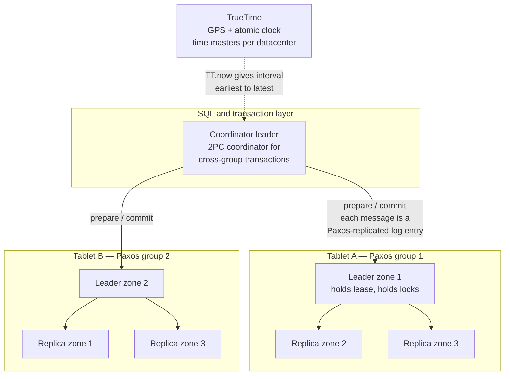
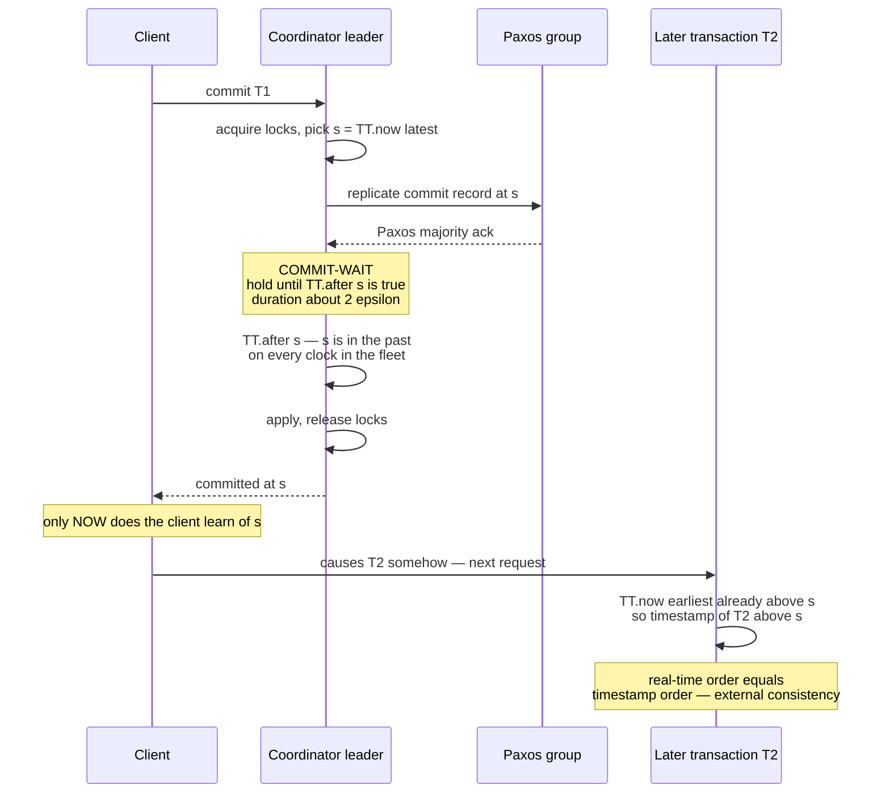
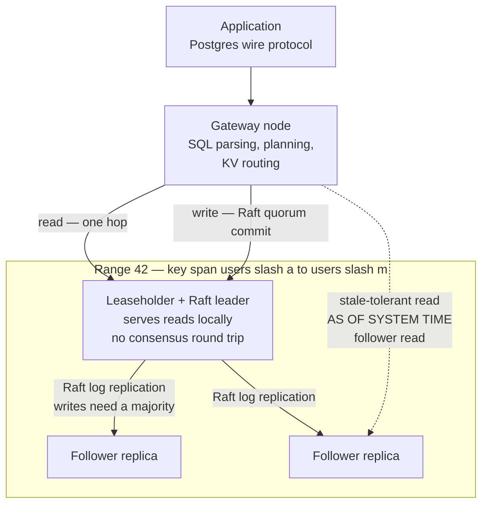
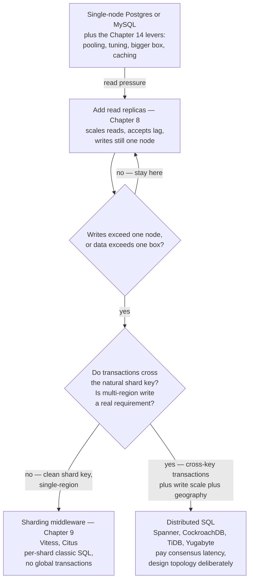

# Chapter 12 — NewSQL and Distributed SQL

**What this chapter covers.** Chapter 11 ended on an uncomfortable note: the NoSQL generation bought
horizontal scale by selling the two most valuable abstractions the database industry had ever built —
declarative SQL and ACID transactions — and a decade of application-level joins, fan-out reads, and
hand-rolled compensation logic was the price. This chapter examines the systems that asked whether
that sale was ever necessary. The NewSQL / distributed-SQL claim is that you can have full SQL,
serializable (in the best cases, externally consistent) transactions, *and* horizontal write scaling
in one system — and that the real price is not semantics but **latency floors and operational
complexity**. Every write pays a consensus round trip; every global guarantee is purchased with time
infrastructure or extra coordination; and someone has to operate the machinery.

We take Google Spanner as the archetype, because the 2012 paper is the clearest statement of the
architecture everyone else adapted: data in tablets, each tablet a Paxos group, two-phase commit
layered over Paxos groups, and TrueTime — bounded clock uncertainty from GPS and atomic clocks —
converted directly into external consistency via commit-wait. We then study CockroachDB as the
no-special-hardware answer: Raft-replicated ranges, hybrid logical clocks instead of TrueTime, and
the machinery (uncertainty windows, timestamp pushing, read refreshes) needed to get serializability
without bounded clock error. We survey the rest of the field honestly — TiDB, YugabyteDB, the
sharding-middleware path of Vitess and Citus, and Aurora, which is routinely miscategorized and
belongs to a different taxonomy entirely. Then we state the costs plainly, work the latency
arithmetic from RTTs rather than benchmarks, and close with a decision ladder that begins, as it
should, with a single Postgres node.

This is the chapter where Volume 5 and Volume 6 fuse. Almost nothing here is a new mechanism:
Paxos and Raft are Volume 6, Chapters 5–6; clocks are Volume 6, Chapter 2; quorums are Volume 6,
Chapter 7. What is new is seeing them *productized* behind a SQL prompt.

Learning goals — after this chapter you should be able to:

- State the NewSQL thesis precisely: which guarantees are retained, which costs are accepted, and
  why the NoSQL trade of Chapter 11 turned out to be contingent rather than fundamental.
- Describe Spanner's architecture: tablets as Paxos groups, replication-as-consensus, and 2PC over
  Paxos groups as the fault-tolerant version of Chapter 10's fragile coordinator.
- Explain TrueTime and commit-wait mechanically, and why bounded clock uncertainty converts into
  commit latency — and into external consistency.
- Distinguish external consistency (strict serializability) from plain serializability, using
  Chapter 6's vocabulary, and say why the difference is observable.
- Describe CockroachDB's design: ranges, Raft, leaseholders, HLCs, the uncertainty window, and how
  timestamp pushing and read refreshes substitute for commit-wait.
- Place TiDB, YugabyteDB, Vitess, Citus, Aurora, and Neon-style disaggregation correctly in the
  taxonomy, and say what each does *not* give you.
- Do honest latency arithmetic for single-region and multi-region deployments, and choose table
  localities and follower reads accordingly.
- Apply the decision ladder: when a single node, read replicas, sharding middleware, or a true
  distributed SQL engine is the right rung — and recognize the anti-pattern of paying consensus
  latency for a single-region CRUD app.

## The thesis: was the NoSQL trade necessary?

Recall the shape of Chapter 11's bargain. Dynamo-style and Bigtable-style systems scaled writes
horizontally by abandoning, in various combinations: the relational model and its declarative
queries, multi-object transactions, strong consistency, and secondary indexes as a first-class
feature. Applications inherited the abandoned work. Denormalization replaced joins; "read, modify,
hope" replaced transactions; and every team maintaining a fan-out-on-write timeline was doing, badly
and once per company, work a query planner does well and once per industry.

The historical justification was that the coordination required for cross-node transactions was
believed incompatible with scale and availability — a belief the CAP discussion of the era hardened
into slogan form. The NewSQL generation's contribution was to test the belief and find it
overstated. Three observations made the difference:

1. **Consensus makes replication and commit fault-tolerant, and it got fast enough.** Chapter 8
   treated replication and Chapter 10 treated atomic commit as separate problems with separate
   failure modes. Run replication *as* consensus — every shard a Paxos or Raft group — and both
   problems change character: replica failover becomes leader election, and the 2PC coordinator
   state, the fragile single point of Chapter 10, becomes a replicated, self-healing log entry.
2. **A partitioned keyspace under a SQL layer is still relational.** Chapter 9's hash- and
   range-partitioning did not stop working when transactions arrived; the hard part was never
   splitting data, it was coordinating across the splits.
3. **Time infrastructure can substitute for communication.** The deepest result, and the subject of
   most of this chapter: if you can bound clock error, you can order transactions globally without a
   global sequencer, paying with a small wait instead of a wide round trip.

So the honest restatement of the NewSQL claim is not "scale is free now." It is: **the semantics
were never the obstacle; coordination latency was, and remains, the true cost — so pay it in the
places you actually need it, and keep SQL and ACID everywhere.** Whether that cost is acceptable
depends on geography and workload, which is why this chapter ends with a ladder rather than a
recommendation.

A note on terms. "NewSQL" is the older marketing label and covered some single-node-fast systems
(VoltDB-style) that are out of scope here. "Distributed SQL" is the term the surviving systems use
for the specific architecture this chapter treats: shared-nothing, consensus-replicated shards under
a full SQL engine with distributed ACID transactions. We use the terms in that sense.

## Spanner: the archetype

Google published Spanner in 2012 (OSDI), and it remains the reference design: nearly every system in
this chapter is either an adaptation of it or defines itself against it. Spanner was built because
Google's own teams kept demonstrating Chapter 11's failure mode internally — the paper is blunt that
engineers were building consistency and transaction layers on top of Bigtable by hand, and that the
database should do it instead.

### Architecture: replication is consensus

A Spanner deployment (a *universe*) spans multiple datacenters organized into *zones*. Data lives in
**tablets** — contiguous key ranges, the descendants of Bigtable's tablets and the cousins of
Chapter 9's range partitions. The critical move is how tablets are replicated: **each tablet's
replicas form a Paxos group**, with one replica elected leader holding a time-based lease. There is
no separate replication subsystem in the Chapter 8 sense — no primary shipping WAL to standbys with
its attendant failover ambiguity. The Paxos log *is* the replication stream, and everything Chapter 8
made you worry about (split brain, lost acknowledged writes, failover data loss) is handled by the
consensus safety proof from Volume 6, Chapter 5. Placement — which zones hold replicas, how many,
which may vote — is policy configured per *directory* (a bucket of keys sharing a prefix), which is
also the unit the system moves around for load balancing.

A single-group transaction — one whose reads and writes all fall in one tablet's key range — commits
by replicating its writes through that group's Paxos log. No 2PC is involved, and well-designed
schemas (Spanner's interleaved tables exist precisely for this) keep most transactions in this fast
path.

Cross-group transactions layer **two-phase commit over the Paxos groups**. Each participating
group's leader acts as a participant; one is chosen as coordinator. This is exactly the resolution
that Chapter 10 promised when it called classic 2PC "a protocol whose coordinator is a single point
of blocking failure": here the coordinator's decision is itself a Paxos-replicated log entry, so a
coordinator machine crashing does not strand participants holding locks — the group elects a new
leader, which reads the decision (or its absence) from the replicated log and completes the
protocol. 2PC's atomicity structure survives; its availability defect is repaired by putting
consensus underneath every participant, coordinator included. The cost also survives: a cross-group
commit is 2PC's extra round trips, each leg itself a consensus commit.



### TrueTime: bounded uncertainty as an API

Every distributed database needs to order transactions. Chapter 10's systems used a coordinator;
TiDB (below) uses a centralized timestamp oracle; classic Lamport machinery (Volume 6, Chapter 2)
gives causal order but says nothing about real time. Spanner's answer is unique because it changes
the *hardware* question: Google equipped datacenters with time masters backed by GPS receivers and
atomic clocks, cross-checked against each other, with every machine's local daemon polling them and
tracking worst-case drift between polls.

The API is the insight. `TT.now()` does not return a timestamp; it returns an **interval**
`[earliest, latest]` with the guarantee that the absolute time at which the call executed lies
within it. The half-width of that interval, ε, is the instantaneous uncertainty: in the 2012 paper
it sawtooths between roughly 1 and 7 ms as clocks drift between synchronizations, averaging around
4 ms. Two derived predicates matter: `TT.after(t)` is true once `t` is definitely in the past
(`t < TT.now().earliest`), and `TT.before(t)` symmetrically.

Ordinary NTP gives you an estimate with unbounded, unreported error — Volume 6, Chapter 2's central
warning. TrueTime gives you a *bounded, reported* error, and every guarantee in the rest of this
section is manufactured from that bound. This is the sense in which Spanner's consistency is bought
with infrastructure: the guarantee is only as good as the bound, and the paper is explicit that a
TrueTime violation (uncertainty exceeding the reported interval) would break correctness, which is
why the clock fleet is engineered and monitored like the storage fleet.

### Commit-wait: turning clock uncertainty into latency, and latency into consistency

First, be precise about the guarantee being purchased, because it is stronger than Chapter 6's
serializability. **Serializability** says the outcome equals *some* serial order of the
transactions — but it does not promise that order respects real time. A serializable system may
legally order a transaction that committed at 12:00:01 *before* one that committed at 12:00:00, as
long as results are consistent with the chosen order; Chapter 6 flagged this when noting that a
serializable database may still serve you a stale-but-consistent snapshot. **External consistency**
closes that gap: if transaction T1 commits (in real, wall-clock time) before T2 begins, then T1's
commit timestamp is smaller than T2's, and T2 observes T1's effects. In Volume 6, Chapter 3's
vocabulary this is **strict serializability** — linearizability lifted from single operations to
whole transactions. The difference is observable by ordinary applications: commit an order in one
request, read it back in the next request through a different frontend, and external consistency is
exactly the promise that the read cannot miss the write — Chapter 8's replication-lag anomalies
ruled out globally, by contract.

Here is how TrueTime delivers it. When a read-write transaction commits, the coordinator leader
chooses a commit timestamp `s` no smaller than `TT.now().latest` at commit time (and above other
lower bounds such as prepare timestamps). Then comes the step everything else in this chapter orbits:

> **Commit-wait.** The leader holds the transaction — locks held, result not yet released — until
> `TT.after(s)` is true, i.e. until `s` is unambiguously in the past on every clock in the fleet.
> Only then does it apply the commit and reply to the client.

The wait is roughly 2ε in the worst case, a few milliseconds on average, and overlaps with Paxos
replication of the commit record, so much of it is hidden. But its logical effect is total: when the
client learns its transaction committed at `s`, real time is already past `s` everywhere. Any
transaction that starts afterward — anywhere on the planet, through any replica — will call
`TT.now()` and receive an interval entirely above `s`, so its own timestamp must exceed `s`, and the
real-time order and the timestamp order agree. No communication established that agreement. The
machines never exchanged a message to order these two transactions; they consulted physics.



Sit with the trade, because it is the profound one and this chapter's version of Volume 4,
Chapter 3's arc that stronger consistency costs performance: **clock uncertainty becomes commit
latency, linearly.** Better clocks (smaller ε) mean faster commits; degraded clocks mean Spanner
slows down but stays correct — the system's response to a time master failure is rising ε and rising
commit-wait, not corruption. Clock quality is a performance SLO, and consistency has a price
denominated in milliseconds-of-uncertainty. It is the cleanest example in this suite of buying a
semantic guarantee with an infrastructure investment.

### Reads without locks: snapshots at a timestamp

The other half of Spanner's design is what timestamps make cheap. Because every commit carries a
globally meaningful timestamp and storage is multi-versioned (Chapter 6's MVCC, keyed now by
TrueTime rather than by a local transaction counter), a **read-only transaction** needs no locks and
no 2PC: the system assigns it a timestamp — `TT.now().latest` for a fresh externally consistent
read — and every replica can answer from its versioned store *as of* that timestamp.

The replica-side mechanism is **safe time**: each replica tracks a timestamp `t_safe` below which it
has applied everything that could matter — bounded by the Paxos apply point and, crucially, by the
prepare timestamps of any transactions sitting in 2PC's in-doubt window (Chapter 10's uncertainty
period reappearing as a *read horizon*). A replica may serve a read at `t` iff `t ≤ t_safe`;
otherwise it waits or the read goes elsewhere. Any sufficiently caught-up replica can serve the
read — no leader round trip — which is what makes Spanner's snapshot reads scale and what
CockroachDB's follower reads (below) reproduce. Clients that can tolerate staleness may ask for a
bounded-staleness or exact past timestamp and get answered by the nearest replica; Chapter 8's lag
anomalies return here *by explicit, bounded contract* rather than by accident, which is the
difference between a feature and an incident.

## CockroachDB: distributed SQL without the atomic clocks

Spanner's obvious criticism was that it presumes Google's clock fleet. CockroachDB (open-sourced
2015 onward, from ex-Google engineers) is the direct test of whether the architecture survives on
commodity hardware and commodity NTP. Most of it does; the part that does not — bounded uncertainty —
is replaced by machinery worth understanding precisely because it shows what TrueTime was *for*.

### Ranges, Raft, leaseholders

The keyspace is one ordered map, split into **ranges** (default target on the order of hundreds of
megabytes in recent versions), each replicated — typically 3 or 5 ways — by its own **Raft group**
(Volume 6, Chapter 6; Raft rather than Paxos, same guarantees). Ranges split, merge, and rebalance
automatically as data and load shift; this is Chapter 9's range partitioning with the rebalancing
made autonomous. Every node can act as a SQL **gateway**: it parses and plans your Postgres-protocol
query and routes KV operations to the relevant ranges. Writes go through Raft on each affected
range; cross-range transactions use a 2PC-style protocol whose transaction record is itself
Raft-replicated — the same "consensus underneath the coordinator" repair as Spanner's, with a
parallel-commit optimization that shaves the extra consensus round from the common case.

One range replica holds the **lease** and is the *leaseholder*: the replica that serves reads and
coordinates writes for that range. The point of the lease is read latency: a leaseholder can answer
reads from local state *without a Raft round trip*, because the lease (time-bounded, and protected
against the clock-skew failure modes Volume 6, Chapter 2 warns about) guarantees no other replica
is concurrently committing writes it hasn't seen. This is the fencing-token discipline productized:
reads cost one machine, writes cost a Raft quorum.



### HLCs and the uncertainty window: honesty without TrueTime

CockroachDB timestamps transactions with **hybrid logical clocks** (Kulkarni et al., 2014). An HLC
is a physical clock reading welded to a logical counter: it stays close to wall time, but on every
message exchange it ratchets forward to exceed any timestamp it has seen, so it *always* respects
happens-before along communication paths — Lamport's relation from Volume 4, Chapter 3 and Volume 6,
Chapter 2, carried inside a timestamp that still roughly means "when."

Be precise about what that buys and what it does not. **HLCs guarantee causal ordering: if
information flowed from event A to event B, B's HLC exceeds A's.** They do **not** bound the gap
between the clock and real time — commodity NTP offers no honest bound — so two transactions on
*non-communicating* nodes can be timestamped in the opposite of their real-time order. That is
precisely the case TrueTime's commit-wait handled by waiting out the uncertainty, and it is the case
CockroachDB must handle differently.

Its approach, described conceptually and honestly:

- **A configured maximum offset.** The cluster assumes clock skew never exceeds `max_offset`
  (500 ms by default). This is an *assumption*, not a measurement: nodes that observe skew beyond
  the bound self-terminate to protect correctness (this is why clock health is an operational SLO on
  CockroachDB — a misbehaving NTP fleet takes nodes down by design). Contrast TrueTime, where the
  bound is measured and reported per call.
- **The uncertainty window on reads.** A transaction at timestamp `t` that encounters a committed
  value with timestamp in `(t, t + max_offset]` cannot tell whether that write really happened
  after it or merely carries a fast clock. To avoid reading a snapshot that excludes a write which
  in real time preceded it, the reader must assume the worst: it **pushes its own timestamp** above
  the offending value and retries the read at the new time. Spanner pays uncertainty on every
  commit; CockroachDB pays it only on actual close encounters — but pays it as restarts rather
  than as a fixed wait.
- **Read refreshes.** Pushing a transaction's timestamp forward (whether by uncertainty or by
  conflicts with later readers via the timestamp cache) would naively force a full retry. Instead
  the gateway tracks the transaction's read set and attempts a **refresh**: re-verify that nothing
  it read changed between the old and new timestamps. If nothing did, the transaction slides
  forward and commits at the pushed timestamp; if something did, it restarts for real — surfacing
  to the application as a retryable serialization error, for which your Chapter 6 retry loop is
  again mandatory equipment.

The resulting guarantee, stated honestly: CockroachDB is **serializable by default** (for years it
offered nothing weaker; recent versions added a READ COMMITTED mode — check current docs), and it
prevents stale reads on any given key. It does **not** claim Spanner's full external consistency:
without bounded uncertainty there is a narrow, known anomaly (the "causal reverse") in which two
transactions on disjoint keys, ordered in real time but communicating only outside the database, can
be timestamped in the wrong order. Serializability holds; strict serializability, in full
generality, is exactly the thing TrueTime's hardware was buying, and CockroachDB's documentation says
so plainly. For most applications the distinction never bites; for audit-ordering-critical ones it
is the honest fine print.

### The Postgres surface and its limits

CockroachDB speaks the PostgreSQL wire protocol and a large subset of its SQL dialect, which is a
genuinely consequential choice: drivers, ORMs, and muscle memory carry over. The limits matter too,
and they cluster predictably. Compatibility is with the dialect, not the engine: the extension
ecosystem (PostGIS as an extension, foreign data wrappers, custom C extensions) does not carry over,
though some functionality is reimplemented natively; historically stored procedures, triggers, and
event-driven features arrived late and partially; and performance intuition does not transfer — a
Postgres-tuned workload full of sequential-integer primary keys, `SELECT ... FOR UPDATE` hot spots,
or chatty multi-statement transactions runs headlong into range hot spots and per-statement
latencies that a single-node engine never showed you. Treat "Postgres-compatible" as "your tools
connect and most SQL runs," not "your database is interchangeable."

## The rest of the field, briefly and honestly

**TiDB** (PingCAP) has the same architectural skeleton with different choices: a stateless SQL layer
(TiDB servers) speaking the *MySQL* dialect, over **TiKV**, a Raft-replicated key-value store of
regions (ranges), with a Placement Driver cluster handling metadata and — the notable difference —
a centralized **timestamp oracle** (TSO) allocating transaction timestamps, in the lineage of
Google's Percolator rather than of TrueTime. A central TSO makes ordering trivial and uncertainty
windows unnecessary inside one deployment, at the cost of a round trip to the TSO's region — which
is why the design is most comfortable when writes concentrate near the PD leader, and why
multi-region TiDB involves explicit topology work. TiFlash adds columnar replicas for HTAP,
foreshadowing Chapter 13.

**YugabyteDB** is shaped like CockroachDB — tablets, Raft per tablet, HLCs — with one deliberate
divergence: rather than reimplement the SQL layer, it reuses PostgreSQL's actual query-engine code
atop its distributed storage layer (DocDB), which buys deeper PG feature compatibility at the price
of coupling to that codebase. It also exposes a Cassandra-like API alongside SQL.

**Vitess and Citus are the other path**, and the contrast is the instructive part. Vitess (built at
YouTube, now CNCF) is sharding middleware over stock MySQL: a routing proxy layer (vtgate) presents
one logical database over many independent MySQL shards. Citus is the same idea as a PostgreSQL
extension with a coordinator over worker PG nodes. Neither runs consensus per shard, and neither
gives you general serializable cross-shard transactions — single-shard transactions are ordinary
local ACID, cross-shard writes are limited, best-effort, or (in Vitess's optional 2PC) explicitly
discouraged. That sounds like a defect and is often precisely the right trade: if your workload
shards cleanly along a tenant or user key (Chapter 9's central design question), then virtually all
transactions are single-shard, each shard is a boring, mature, locally-fast MySQL or Postgres, and
you have scaled SQL *without* buying global coordination you would never use. The distributed-SQL
engines earn their complexity only when transactions genuinely cross the partition key.

**Aurora is a different beast entirely**, and the taxonomy point is worth making carefully because
"Aurora" and "Spanner" get said in the same breath constantly. Amazon Aurora (SIGMOD 2017 paper)
keeps a *single-writer* MySQL- or Postgres-compatible compute node and reinvents the layer *below*
it: the storage is a distributed, multi-tenant service holding six copies of every data segment
across three AZs, and the instance ships **only the redo log** to it — "the log is the database."
Writes are acknowledged at a 4-of-6 quorum (Chapter 7's WAL meeting Volume 6, Chapter 7's quorums);
pages are materialized from the log by the storage fleet, not flushed by the database. This buys
excellent durability, fast crash recovery, fast read-replica creation, and storage that scales
independently of compute. It does **not** buy horizontal *write* scaling or distributed
transactions: there is one writer, and the ceiling on write throughput is that node — Chapter 8's
single-primary model with a spectacular storage subsystem, operated for you (Chapter 14's theme).
Choosing Aurora because "we need to scale like Spanner" is a category error in both directions.

**AlloyDB and Neon** mark the emerging pattern this points to: storage–compute disaggregation for
*Postgres itself*. Neon, for instance, splits the engine into stateless compute, a small consensus
cluster durably receiving the WAL (safekeepers — Paxos again, guarding the log), and pageservers
that materialize versions from it, enabling copy-on-write branching and scale-to-zero; AlloyDB
applies a similar log-centric disaggregation inside Google Cloud. The taxonomy now has three
distinct columns, and conflating them causes real architectural mistakes:

| | Sharding middleware | Disaggregated single-writer | Distributed SQL |
|---|---|---|---|
| Examples | Vitess, Citus | Aurora, AlloyDB, Neon | Spanner, CockroachDB, TiDB, YugabyteDB |
| Write scaling | Yes, per shard key | No — one writer | Yes, per range/tablet |
| Cross-shard serializable txns | No / limited | N/A — one node | Yes |
| Consensus in the write path | No | Storage quorum / WAL consensus | Yes, per range |
| Failure/consistency model | Per-shard classic | Classic engine, better durability | Chapter 6 + Volume 6 fused |
| Latency floor per write | Local commit | Storage quorum, same-region | Raft/Paxos quorum RTT, + geography |

## The costs, stated plainly

### Latency floors: geography is physics

Reason from round trips, not vendor benchmarks. Within a region, inter-AZ RTT is on the order of
0.5–2 ms; across the continental US, roughly 60–70 ms; transatlantic, roughly 70–90 ms. A
consensus write commits after the leader hears from a majority, so its floor is the RTT to the
*nearest majority* of replicas — plus, for cross-range transactions, 2PC's additional consensus
round(s), plus (Spanner) commit-wait's few milliseconds.

Run the arithmetic for three deployments of a 3-replica range:

- **Single region, three AZs.** Quorum RTT ≈ 1–2 ms. Write latency floor: single-digit
  milliseconds. This is the benign case — and still several times a single-node local commit, which
  is why per-statement chatty transactions that were free on one Postgres node become visible here.
- **Three regions, US-East / US-Central / US-West, leader in the East.** Majority = leader plus one
  of Central (~30 ms RTT) — floor ≈ 30–35 ms per consensus commit, doubled-ish for cross-range
  2PC. Every write, forever, regardless of load.
- **Global — US / Europe / Asia.** Majority spans an ocean: 70–110 ms floors, and a transaction
  touching ranges whose leaders sit on different continents compounds them.

No implementation cleverness removes these floors; they are speed-of-light terms. The mitigations
are all *topology*: place leaders near writers, and declare which data needs which geography. The
system-level vocabulary (CockroachDB's is representative; Spanner's configurations are analogous) is
**global tables** (read everywhere fast, write slow), **regional tables** (fast in their home
region), and — the workhorse for user-partitioned data — **regional-by-row**, where each row homes
itself:

```sql
-- CockroachDB multi-region sketch
ALTER DATABASE app PRIMARY REGION "us-east1";
ALTER DATABASE app ADD REGION "eu-west1";
ALTER DATABASE app ADD REGION "ap-southeast1";

CREATE TABLE users (
    id         UUID PRIMARY KEY DEFAULT gen_random_uuid(),
    email      STRING UNIQUE NOT NULL,
    home       crdb_internal_region NOT NULL DEFAULT default_to_database_primary_region(gateway_region()),
    profile    JSONB
) LOCALITY REGIONAL BY ROW AS home;
-- each row's replicas and leaseholder follow its region column:
-- EU users commit against EU replicas at intra-region latency
```

This is Chapter 9's partition-key design decision returning at continental scale, and Volume 7,
Chapter 10 treats the full multi-region design space. The complementary read-side lever is the
**follower read**: explicitly stale, served by the nearest replica without touching the leaseholder —
Chapter 8's read-replica lag, reborn with a contract:

```sql
-- served by the closest replica; bounded staleness, no leaseholder round trip
SELECT balance
  FROM accounts AS OF SYSTEM TIME follower_read_timestamp()
 WHERE id = $1;
```

### Skew, operations, and money

**Distribution does not fix skew.** Chapter 9's hot-partition pathology transfers intact: a
monotonically increasing primary key turns the last range into a single-Raft-group bottleneck; a
celebrity row is hot no matter how many ranges surround it. The engines mitigate — automatic
load-based splitting, hash-sharded indexes — but a workload whose writes concentrate on one key gets
one Raft group's throughput, full stop.

**Operational complexity is real and novel.** You now operate a consensus fleet: rebalancing
churn, lease thrashing, snapshot transfer storms after node loss, upgrade orchestration across a
quorum — and, distinctively, *clock health as a first-class SLO* in HLC-based systems, where NTP
misbehavior doesn't degrade performance, it removes nodes. Managed offerings shift this work but not
the latency physics or the schema-design obligations.

**And it costs more.** 3× or 5× storage, cross-region egress on every replication message, and —
less visibly — engineering time spent on retry loops, hot-spot-aware schema design, and topology
configuration. Against this, weigh what it replaces: the sharding middleware, the fan-out services,
the reconciliation jobs, and the incident load of Chapter 11's hand-rolled consistency.

## Choosing: the honest ladder

The anti-pattern to name first, because it is now common: **a single-region CRUD application on a
distributed SQL engine**, paying quorum latency on every write, running retry loops it never needed,
and operating (or renting) a consensus fleet — for a workload one Postgres node with a replica would
serve with lower latency, richer features, and two decades of operational folklore. Distributed SQL
is a rung you climb *to*, under pressure, not a default.



Climb it in order. Chapter 14's operating levers first — a well-tuned single node with connection
pooling handles more than most teams believe, with the simplest possible semantics. Read replicas
next, accepting Chapter 8's documented anomalies for read scale. If write volume or data size
genuinely exceeds one node, ask Chapter 9's question — *is there a clean partition key that
transactions rarely cross?* — and if yes, sharding middleware keeps every component boring. The
distributed SQL engines are the correct rung when three requirements **coexist**: write scale beyond
one node, relational semantics with transactions that genuinely cross any shard key you could pick,
and (usually) multi-region presence with real consistency needs. When all three hold, these systems
are not over-engineering; they are the only honest answer, and everything else on the ladder is a
pile of application-level consistency code waiting to be written badly. Aurora-style disaggregation
sits *beside* the ladder, not on it: choose it for durability, recovery, and elasticity around a
single writer, not for write scale.

## The distributed-systems lens

Every prior chapter's lens section pointed outward from a database topic toward distributed systems.
This chapter *is* the meeting point, so the lens is a set of identifications rather than analogies.

**Every mechanism here is a Volume 6 topic productized.** Replication-as-consensus is Chapters 5–6
wearing a `CREATE TABLE` statement; leaseholder reads are leases and fencing from Chapter 2's
neighborhood; safe-time snapshot reads are watermarking; Aurora's 4-of-6 writes are Chapter 7's
quorum intersection; 2PC-over-Paxos is Chapter 10 of this volume repaired by Volume 6's machinery.
If you can read this chapter's architectures fluently, you have passed Volume 6's practical exam.

**TrueTime versus HLC is the definitive case study in buying consistency with time.** Volume 4,
Chapter 3 began an arc — stronger guarantees cost performance, and you choose where to pay — that
reaches its logical conclusion here. Spanner pays in hardware and a fixed commit-wait, and receives
external consistency: physics as a communication channel. CockroachDB pays nothing in hardware,
assumes a skew bound, and pays in occasional restarts and a documented edge-case anomaly. Neither is
wrong; together they are the cleanest demonstration in production systems that *time infrastructure
is interchangeable with coordination*, at an exchange rate set by clock quality. External
consistency itself is Volume 6, Chapter 3's linearizability, applied to transactions — one
vocabulary, one design space, from CPU store buffers to transatlantic commits.

**The meta-lesson is Codd's vindication.** Chapter 1 argued that the relational model's deepest
idea was data independence — programs state *what*, the system decides *how*. The NoSQL decade
seemed to refute it at scale; this chapter records the refutation failing. SQL and ACID crossed the
distribution transition intact: the *interface* survived while the *implementation* was rebuilt from
consensus groups and clock fleets, which is precisely what a good abstraction is for. The
applications atop Spanner do not know about Paxos, exactly as the applications of 1985 did not know
about B-trees. Abstractions that encode *what* rather than *how* are the ones that survive their
implementations — a lesson worth carrying well beyond databases.

## Key takeaways

- The NoSQL trade — semantics for scale — was contingent, not fundamental. Distributed SQL keeps
  full SQL and serializable transactions at horizontal scale; the real, permanent costs are
  **consensus latency floors and operational complexity**.
- Spanner's skeleton is the reference: tablets, **each a Paxos group** (replication *is*
  consensus), with **2PC layered over Paxos groups** so the coordinator of Chapter 10 is no longer
  a single point of blocking failure.
- **TrueTime** exposes bounded clock uncertainty as an interval; **commit-wait** holds each commit
  until its timestamp is unambiguously past, converting clock uncertainty directly into commit
  latency — and buying **external consistency** (strict serializability), which is strictly
  stronger than Chapter 6's serializability because it respects real-time order.
- Timestamps plus MVCC give **lock-free snapshot reads at any sufficiently old timestamp**, served
  by any replica past its safe time — the scalable read path of every system in this family.
- CockroachDB shows the no-special-hardware translation: ranges + Raft + leaseholders, **HLCs**
  (causal order, but *no bounded uncertainty*), an assumed `max_offset` with nodes self-evicting on
  violation, and uncertainty restarts / timestamp pushing / read refreshes in place of commit-wait.
  Serializable by default; honestly short of full external consistency.
- Taxonomy matters: **Vitess/Citus** scale SQL without global transactions (right when the shard
  key is clean); **Aurora/AlloyDB/Neon** disaggregate storage under a *single writer* ("the log is
  the database") and do not scale writes; only the Spanner family gives cross-shard serializable
  transactions.
- The costs are physics and skew: quorum RTT floors on every write, topology decisions
  (regional-by-row, leader placement, follower reads with contractual staleness), hot ranges that
  distribution cannot dissolve, and clock health as an SLO.
- Climb the ladder in order: tuned single node → read replicas → sharding middleware **or**
  distributed SQL — the latter only when write scale, cross-key transactions, and geography
  genuinely coexist. Paying global-consensus latency for a single-region CRUD app is the era's
  signature anti-pattern.
- The meta-lesson: SQL and ACID survived the distribution transition because they specify *what*,
  not *how* — data independence proved portable to planet scale.

## Further reading

- Corbett, J. C., Dean, J., et al., "Spanner: Google's Globally-Distributed Database," *OSDI*,
  2012 — the archetype paper: Paxos groups, TrueTime, commit-wait, external consistency.
  https://research.google/pubs/spanner-googles-globally-distributed-database/
- Kulkarni, S., Demirbas, M., Madappa, D., Avva, B., and Leone, M., "Logical Physical Clocks and
  Consistent Snapshots in Globally Distributed Databases" (Hybrid Logical Clocks), 2014 — the HLC
  design CockroachDB and YugabyteDB build on. https://cse.buffalo.edu/tech-reports/2014-04.pdf
- Taft, R., et al., "CockroachDB: The Resilient Geo-Distributed SQL Database," *SIGMOD*, 2020 —
  the peer-reviewed architecture description, including transactions, parallel commits, and clock
  handling.
- CockroachDB documentation and engineering blog — the architecture overview, "Living Without
  Atomic Clocks," and the multi-region and follower-reads guides.
  https://www.cockroachlabs.com/docs/ and https://www.cockroachlabs.com/blog/living-without-atomic-clocks/
- Verbitski, A., et al., "Amazon Aurora: Design Considerations for High Throughput Cloud-Native
  Relational Databases," *SIGMOD*, 2017 — "the log is the database," 6-way/4-of-6 quorum storage.
  https://dl.acm.org/doi/10.1145/3035918.3056101
- TiDB documentation — architecture (TiDB/TiKV/PD), the Percolator-derived transaction model, and
  the timestamp oracle. https://docs.pingcap.com/
- YugabyteDB documentation — DocDB architecture and the reuse of the PostgreSQL query layer.
  https://docs.yugabyte.com/
- Vitess documentation https://vitess.io/docs/ and Citus documentation
  https://docs.citusdata.com/ — the sharding-middleware path.
- Peng, D. and Dabek, F., "Large-scale Incremental Processing Using Distributed Transactions and
  Notifications" (Percolator), *OSDI*, 2010 — the ancestor of TiDB's transaction protocol.
- Volume 6, Chapters 2, 3, 5, 6, 7 — clocks, consistency models, Paxos, Raft, quorums: the
  mechanisms this chapter productized. Volume 7, Chapter 10 — multi-region architecture, where the
  topology decisions sketched here are treated in full.
