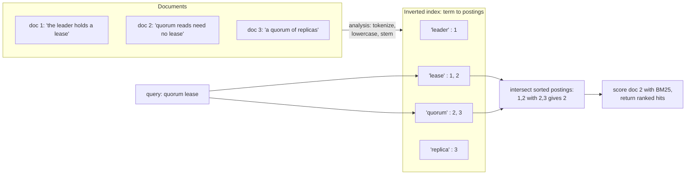
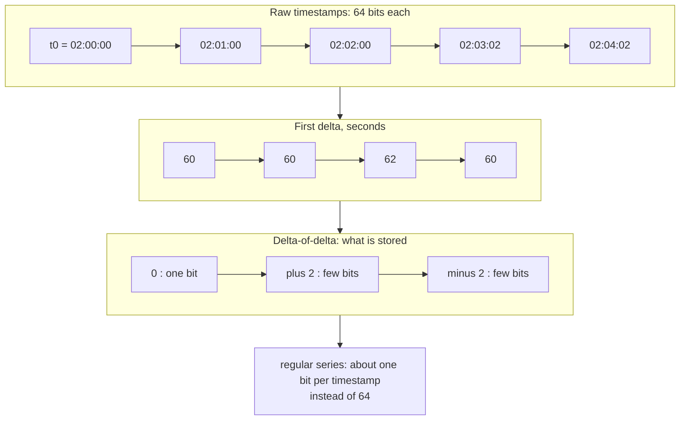
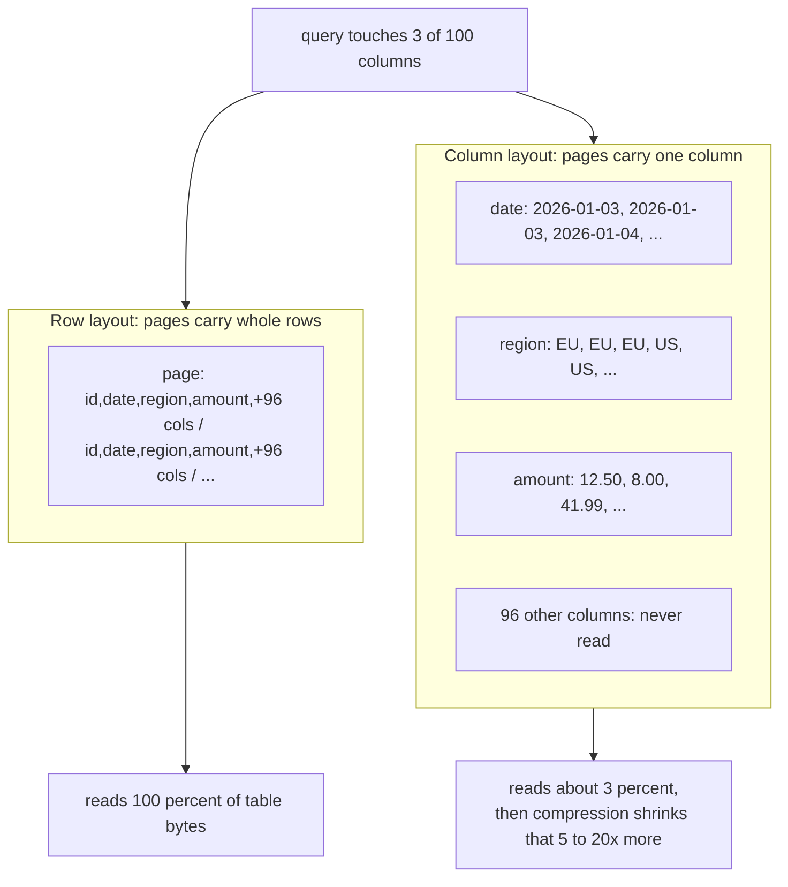
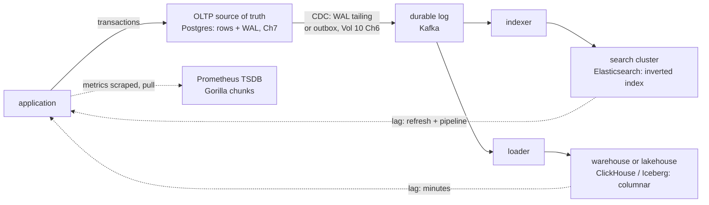

# Chapter 13 — Specialized Stores: Search, Time-Series, and Analytics

**What this chapter covers.** Chapters 1 through 12 built a complete picture of the
general-purpose database: B-tree and LSM storage engines (Chapter 2), secondary indexes
(Chapter 3), a query processor (Chapter 4), transactions and MVCC (Chapters 5–6), a WAL
(Chapter 7), replication (Chapter 8), and partitioning (Chapter 9). That machinery is tuned for
one workload shape: point and short-range reads and writes of rows, identified by key —
OLTP. This chapter is about three workload shapes different enough that a purpose-built
engine beats the general-purpose one by orders of magnitude: full-text relevance search,
high-cardinality append-heavy time series, and scan-heavy analytical aggregation. For each,
we work out *why* the row store loses from first principles, what structure the specialized
store substitutes, and what new failure modes you inherit in the trade. We close with the
architectural point that matters more than any individual store: these systems are almost
never the source of truth. They are **derived views**, fed from an OLTP system by
change-data-capture, and the properties that make that safe — rebuildability, idempotent
apply, tolerated lag — are design obligations, not defaults. The intellectual anchor is
Stonebraker's 2005 argument that "one size fits all" was over, plus the observation that
every specialized store is assembled from the *same* primitives you already know — LSM
structure, partitioning, replication, log-based recovery — tuned for a different access
pattern.

Learning goals — after this chapter you should be able to:

- Explain the inverted index and the analysis pipeline, and say precisely why
  `LIKE '%term%'` cannot be rescued by any B-tree index.
- Describe BM25's shape — what term-frequency saturation and length normalization each
  contribute — and read a relevance score without mysticism.
- Explain Lucene's immutable-segment architecture as an LSM variant, and derive
  Elasticsearch's near-real-time visibility semantics from it.
- Characterize the time-series workload shape, explain Gorilla-style delta-of-delta and
  XOR compression, and identify label cardinality as the operational hazard it is.
- Derive the columnar I/O advantage arithmetically, name the four compression families it
  unlocks, and explain zone maps, late materialization, and vectorized execution.
- Sketch the modern OLTP-to-analytics pipeline: CDC into a warehouse or lakehouse,
  Parquet's physical layout, and what Iceberg/Delta add on top.
- Argue for and against adding a specialized store, in terms of the pipeline and lag SLOs
  you will pay for it.

## One size does not fit all — and why

In 2005 Michael Stonebraker and Uğur Çetintemel published a paper with an unusually blunt
title: *"One Size Fits All": An Idea Whose Time Has Come and Gone*. The argument: the
commercial RDBMS of the day — row-oriented, B-tree-indexed, tuned over twenty-five years for
OLTP — was being sold for every workload, while for several major workloads a purpose-built
engine could beat it by one to two orders of magnitude. It was partly a research manifesto
(Stonebraker's own C-Store and StreamBase were the exhibits), but two decades later it reads
as simple description. Search runs on Lucene, not on `LIKE`. Metrics run on Prometheus or
InfluxDB, not on MySQL. Analytics runs on ClickHouse, BigQuery, or Snowflake, not on the
OLTP primary.

It is worth being precise about *why* specialization wins, because the reason is not magic.
A storage engine is a bundle of bets: what is contiguous on disk, what the unit of I/O is,
what is indexed, what is compressed against what, what stays hot in memory. Chapter 2's
B-tree row store bets that you read and write individual rows by key, that reads and writes
interleave, and that any column of a row is about as likely to be wanted as any other. Each
workload in this chapter violates those bets so thoroughly that honoring them becomes pure
overhead:

| Dimension | OLTP (Ch 1–12) | Full-text search | Time series | Analytics/OLAP |
|---|---|---|---|---|
| Unit of interest | Row by key | Documents ranked by relevance | Points in a series over a time range | Aggregates over columns of many rows |
| Write pattern | Update-in-place, random keys | Index-once, rarely update | Append-only, time-ordered | Bulk load, append |
| Read pattern | Point/short range | Top-k by score | Range scan of one series, aggregate | Full-column scans |
| Deletes | Individual rows | Rare; tombstoned | By retention window, in bulk | Rare; by partition |
| Data layout that wins | Row-major, B-tree | Term-major: inverted index | Series-major, time-chunked | Column-major |
| Compression leverage | Modest (heterogeneous rows) | Postings compression | Extreme (adjacent points similar) | Extreme (homogeneous columns) |

Read the last two rows together and the chapter's theme appears: **specialized stores win
by choosing a physical layout in which the data a query touches is contiguous and
compresses well, at the cost of making other access patterns awkward or impossible.** A
row store spreads a term's occurrences, a series' points, and a column's values across the
whole table; each specialized store gathers exactly one of those together. Nothing gathers
all three — which is why you end up running more than one store, and why this chapter ends
with the pipelines between them.

## Full-text search

### The inverted index

The problem: given a few query terms, return the documents most *relevant* to them, from a
corpus of millions, in tens of milliseconds. The structure that solves it is the inverted
index, and the name says what it is. A forward index maps document → terms (that is just
the document); an inverted index maps **term → postings list**: for every term in the
corpus, a sorted list of the IDs of documents containing it, usually with the term's
positions in each document and enough statistics to score matches.

A query for `quorum lease` becomes: fetch the two postings lists, intersect them (both are
sorted by document ID, so this is a linear merge — Chapter 4's merge join), and score the
survivors. The work is proportional to the lengths of two postings lists, not to the size
of the corpus.

Contrast the row store. `WHERE body LIKE '%quorum%'` cannot use a B-tree index on `body` at
all: Chapter 3 established that a B-tree serves prefixes and ranges of its sort order, and a
substring anchored nowhere has no prefix. The engine's only option is a full scan of every
row, running a substring search over every document — O(corpus) per query, plus it answers
the wrong question, because `LIKE` knows nothing about word boundaries ("quorums"?
"Quorum,"?), morphology ("leasing" vs "lease"), or ranking. The inverted index is not a
faster `LIKE`; it is a different question answered by a different structure.



### The analysis pipeline

Between raw text and the index sits the **analyzer**, and it is where most real-world search
quality problems live. Analysis turns a string into a token stream through a pipeline that
typically includes: tokenization (splitting on word boundaries — nontrivial for CJK
languages, code identifiers, or `IPv4` addresses), normalization (lowercasing, Unicode
folding so `café` matches `cafe`), stop-word removal (dropping `the`, `a`, `of` — less
fashionable than it was, since BM25's IDF term already down-weights them and removing them
breaks phrase queries like "to be or not to be"), and stemming or lemmatization (reducing
`leasing`, `leased`, `leases` to a common stem so they match each other). For
substring-within-word and autocomplete needs there are **n-gram** and edge-n-gram token
filters, which index every character window of a token — powerful, and an easy way to
multiply index size several-fold if applied carelessly.

The iron rule is that the query must be analyzed the same way as the documents, or matches
silently vanish: a document indexed with stemming and a query analyzed without it will miss
every inflected form. This — not the index structure — is the source of most "search is
broken" tickets.

A realistic Elasticsearch mapping makes the pipeline concrete. Note the standard idiom of
indexing one source field two ways: analyzed `text` for matching, and un-analyzed `keyword`
for exact filtering, sorting, and aggregation.

```json
PUT /articles
{
  "settings": {
    "analysis": {
      "analyzer": {
        "english_articles": {
          "tokenizer": "standard",
          "filter": ["lowercase", "asciifolding", "english_stemmer"]
        }
      },
      "filter": {
        "english_stemmer": { "type": "stemmer", "language": "english" }
      }
    }
  },
  "mappings": {
    "dynamic": "strict",
    "properties": {
      "title":     { "type": "text", "analyzer": "english_articles",
                     "fields": { "raw": { "type": "keyword" } } },
      "body":      { "type": "text", "analyzer": "english_articles" },
      "tags":      { "type": "keyword" },
      "published": { "type": "date" }
    }
  }
}
```

Two deliberate choices deserve comment. `"dynamic": "strict"` disables dynamic mapping —
by default Elasticsearch will add a field to the mapping for every new JSON key it sees,
and a service that logs documents with user-controlled or ever-growing key sets (per-customer
keys, timestamps as keys) will suffer a **mapping explosion**: thousands of fields, each with
index structures, ballooning cluster state that must be replicated to every node. And
`tags` is `keyword`, not `text`: running an aggregation on an analyzed field either fails or
aggregates on stems, a classic analyzer pitfall.

### Relevance: from TF-IDF to BM25

Boolean matching finds candidates; ranking decides what the user sees. The classical
intuition is **TF-IDF**: a document matters more for a term the more often the term occurs
in it (term frequency), and a term matters more the fewer documents it occurs in (inverse
document frequency — `lease` is informative, `the` is not). Multiply, sum over query terms,
sort.

Raw TF-IDF has two defects that the modern standard, **BM25** (the Okapi weighting function,
Robertson and Walker's line of work in the 1990s), repairs. The score of document *D* for
query *Q* is, per query term *qᵢ* with frequency *f(qᵢ, D)* in the document:

```
score(D, Q) = Σ  IDF(qᵢ) ·        f(qᵢ, D) · (k₁ + 1)
             qᵢ            ─────────────────────────────────────────
                           f(qᵢ, D) + k₁ · (1 − b + b · |D| / avgdl)
```

At concept level, honestly, each piece does one job:

- **IDF(qᵢ)** carries over the rare-terms-matter intuition (in a smoothed logarithmic form).
- **Term-frequency saturation.** In raw TF, a document saying `lease` 200 times scores
  twice one saying it 100 times. In BM25 the TF factor is `f·(k₁+1)/(f + k₁·…)` — a
  saturating curve that approaches an asymptote as *f* grows. The second occurrence of a
  term adds a lot of evidence; the fiftieth adds almost none. **k₁** (typically ~1.2)
  controls how fast saturation sets in; k₁ = 0 collapses TF to binary presence.
- **Length normalization.** Long documents contain more of everything, so raw TF favors
  them unfairly. The `(1 − b + b·|D|/avgdl)` factor in the denominator penalizes documents
  longer than the corpus average `avgdl`. **b** (typically ~0.75) sets how strongly:
  b = 0 ignores length entirely, b = 1 normalizes fully.

That is the whole formula's shape: rare terms weighted up, repeated terms with diminishing
returns, long documents handicapped. Lucene made BM25 its default similarity in version 6.0;
it remains the baseline that learned ranking models are measured against, and for most
applications it is what you should ship first.

**Phrase and proximity queries** are why postings lists store positions. `"leader lease"` as
a phrase requires not just that both terms appear in a document but that a position of
`lease` equals a position of `leader` plus one; the engine intersects postings and then
walks the two position lists. Proximity queries (`"leader lease"~5` — within five positions)
relax the offset check. Positions typically add substantially to index size, which is why
they are optional per field.

### Lucene: LSM for documents

Apache Lucene — the library inside Elasticsearch, OpenSearch, and Solr — has an architecture
you already know, because Chapter 2 taught it under another name. A Lucene index is a
collection of **immutable segments**. Incoming documents accumulate in an in-memory buffer;
a **flush** writes the buffer out as a new segment — a complete, self-contained mini-index
with its own term dictionary and postings. Background **merges** take several small segments
and rewrite them as one larger segment. Substitute *memtable* for buffer and *SSTable* for
segment and this is an LSM tree, adopted for the same reason: an inverted index is expensive
to update in place (an insert touches a postings list for every distinct term in the
document), and cheap to rebuild in bulk for a batch of documents. Sequential writes of
immutable files, deferred consolidation by merge — the same bet, made for search in the
early 2000s.

The consequences are the LSM consequences, translated:

- **Deletes are tombstones.** You cannot remove a document from an immutable segment, so a
  delete marks the document dead in a per-segment live-docs bitmap. Dead documents still
  occupy space and still appear in the statistics (skewing IDF slightly) until a merge
  rewrites the segment without them. An update is a delete plus a reinsert of the whole
  document.
- **Merges are the background tax.** Merge policy tuning in Elasticsearch is Chapter 2's
  compaction tuning with the serial numbers filed off, including the failure mode of merges
  falling behind under heavy indexing.
- **Visibility is decoupled from durability.** A newly indexed document is not searchable
  until a **refresh** opens a new point-in-time searcher over the current segment set
  (Elasticsearch refreshes every second by default); it is not durable in Lucene terms
  until a **commit** fsyncs the segment state (Elasticsearch layers its own translog —
  a WAL, Chapter 7 — so that acknowledged writes survive a crash between commits). This is
  the precise meaning of "near-real-time search": *visible after refresh, not after
  acknowledgment*. Index a document and immediately search for it and you will usually
  not find it. This is not a bug and cannot be configured away without destroying indexing
  throughput; applications must be written for it, a point we return to at the end of the
  chapter.

### Elasticsearch and OpenSearch: distributed Lucene

Elasticsearch (and its fork OpenSearch) wraps Lucene in the distribution machinery of
Chapters 8 and 9: an index is split into **primary shards** (each shard is one Lucene
index), documents are routed to a shard by hash of the document ID — Chapter 9's hash
partitioning — and each primary has zero or more **replica shards** that the primary feeds,
serving both durability and read throughput. A search fans out to one copy of every shard,
each shard returns its local top-k, and a coordinating node merges the per-shard results
into a global top-k — scatter-gather, with the usual tail-latency implication that the
query is as slow as the slowest shard.

Two honest caveats belong here. First, relevance scores are computed per shard by default,
from per-shard term statistics; with few documents or skewed routing, the same document can
score differently depending on which shard it landed on. Second, and more important:
**Elasticsearch is not your system of record.** Its consistency story is tuned for search
availability, not for the guarantees of Chapters 5–8; documents become visible on primaries
and replicas at different refresh moments, and the project's long public history of
resiliency issues (tracked for years against Jepsen findings) argues for keeping
authoritative data in a store with stronger promises and treating the search cluster as a
rebuildable view — which is how virtually every mature deployment uses it.

### The "good enough" tier: Postgres full-text search

Before operating a search cluster, check whether the database you already run suffices.
PostgreSQL ships genuine full-text search: `to_tsvector('english', body)` runs an analysis
pipeline (tokenization, stemming, stop words) producing a `tsvector` of lexemes and
positions; `@@ to_tsquery('quorum & lease')` matches; a **GIN index** on the tsvector —
Chapter 3's generalized inverted index, the same term-to-postings idea inside Postgres —
makes matching fast; `ts_rank` provides TF-style ranking (not BM25). You get all of it
inside your existing transactions, backups, and replication — the index is updated in the
same transaction as the row, so search is *consistent*, which Elasticsearch will never give
you.

The limits are equally real: ranking quality below BM25, no fuzziness or sophisticated
relevance tooling out of the box, analysis less rich than Lucene's, and — because GIN
updates amplify writes — indexing cost on hot tables. The honest engineering position: for
moderate corpus sizes and utilitarian search (admin panels, catalogs in the
hundreds-of-thousands of items, internal tools), Postgres FTS is the right answer, because
the best pipeline is the one you do not have to build. Reach for a dedicated engine when
relevance quality is a product surface, when the corpus or query load outgrows one node,
or when you need the analysis zoo.

## Time-series databases

### The workload shape

A time series is a sequence of (timestamp, value) points belonging to an identified series —
in the Prometheus data model, a metric name plus a set of label key-value pairs:
`http_requests_total{service="checkout", method="POST", status="500"}`. The workload has a
shape so consistent it can be listed:

- **Append-mostly, time-ordered.** New points arrive at "now," per series, at roughly
  regular intervals. Out-of-order arrivals exist but are the exception; updates and
  deletes of individual points essentially never happen.
- **High cardinality of series, small values.** Millions of active series, each point a
  timestamp and (usually) one float.
- **Recent-hot, old-cold.** Dashboards and alerts hammer the last hour; last month is
  occasionally queried; last year is compliance.
- **Aggregation-dominant reads.** Nobody reads one point. Queries are range scans over a
  time window of one or many series, folded through `rate`, `avg`, `max`, quantiles.
- **Retention as a first-class operation.** Data expires wholesale by age, and is often
  **downsampled** — replaced by lower-resolution rollups — on the way out.

Put this into Chapter 2's B-tree row store and everything grates. Each sample is a full row
with its key overhead, so a 16-byte fact costs perhaps 60–100 bytes on disk. Inserts keyed
by (series, time) all land at the right edge of each series' key range — fine — but with
millions of series the insertion points are scattered across the tree, so the working set of
dirty pages is enormous. Retention by `DELETE WHERE time < …` is Chapter 6's nightmare: it
churns MVCC versions and WAL for every expired row and leaves the vacuum system to reclaim
them. And an aggregation over one series reads pages that interleave many series' rows,
wasting most of every I/O.

TSDBs restructure around the shape with two moves: partition by time, and compress within
series.

### Time partitioning: retention as `drop`

Every serious TSDB stores data in **time-partitioned chunks** — Prometheus's two-hour
blocks, TimescaleDB's chunks, InfluxDB's shard groups. This is Chapter 9's range
partitioning on the time dimension, and it converts the workload's hardest operations into
trivial ones. Writes touch only the current ("head") chunk, so the hot working set is small
and the older chunks can be compressed, compacted, and made immutable — the LSM shape again.
Queries carry a time range, so the planner prunes to the overlapping chunks before reading
anything. And retention becomes **dropping whole chunks**: unlink files, no per-row deletes,
no MVCC churn, no vacuum debt. When TimescaleDB documentation tells you to use
`drop_chunks` instead of `DELETE`, it is this exact mechanism.

TimescaleDB is worth singling out as the "specialization as an extension" design point: a
**hypertable** is declarative time partitioning layered over ordinary PostgreSQL —
`create_hypertable('metrics', 'time')` and the extension creates and prunes chunk tables
automatically, adds native columnar compression within chunks, and provides continuous
aggregates for rollups — while keeping full SQL, joins against your business tables, and
your existing operational tooling. It is to time series roughly what Postgres FTS is to
search: the tier to exhaust before running a separate system.

### Gorilla compression: delta-of-delta and XOR

The second move is compression that exploits *similarity between adjacent points of one
series*, and the canonical description is Facebook's **Gorilla** paper (VLDB 2015),
describing the in-memory TSDB behind their monitoring. Its two techniques are now
everywhere — Prometheus's chunk encoding, InfluxDB's TSM engine, TimescaleDB's compressed
chunks, M3 — and both are simple enough to walk through honestly.

**Timestamps: delta-of-delta.** Scrape intervals are nearly constant, so consecutive deltas
between timestamps are nearly identical. Store the first timestamp; then for each point
compute the delta, and the delta between this delta and the previous one. For a series
scraped every 60 s, that second difference is almost always exactly zero — and Gorilla
encodes a zero delta-of-delta as a **single bit**. Nonzero values are encoded with a short
prefix code selecting a width bucket sized to hold them. In Facebook's measurements, about
96% of timestamps compressed to one bit.



**Values: XOR of adjacent floats.** Successive samples of one series are usually close in
value, so the IEEE-754 bit patterns share their sign, exponent, and high mantissa bits, and
`current XOR previous` is a word that is mostly zeros. If the XOR is exactly zero (value
unchanged — extremely common for gauges), store a single `0` bit. Otherwise store a control
bit and the nonzero "meaningful" middle of the XOR, described by its count of leading and
trailing zero bits — with a further optimization that if the meaningful bits fall inside
the same window as the previous value's, the window description can be reused. Across
Facebook's production data the two techniques together averaged **about 1.37 bytes per
point** — roughly 12× smaller than the naive 16 bytes, before any general-purpose
compression. That ratio is what makes "keep every point at full resolution for weeks, in
RAM or on NVMe" economically sane, and it is only available because the layout put each
series' points adjacent: compression leverage is a *consequence of layout*, a theme that
returns at full strength in the columnar section.

### Cardinality: the operational hazard

The failure mode that actually pages people is not compression or retention; it is
**cardinality**. Every distinct combination of metric name and label values is its own
series, with its own index entries, head-chunk memory, and per-series overhead. Total series
count is *multiplicative* in label values: a metric with 10 services × 50 endpoints ×
5 status classes × 200 pods is 500,000 series before you have measured anything twice.
Add one label with unbounded values — user ID, request ID, a raw URL path with embedded
IDs, an error message — and the series count goes vertical. Prometheus degrades in a
characteristic way: memory grows with active head series; **churn** (pods restarting with
new instance labels, deploys rolling) creates floods of new series whose old versions
linger in the head block until it is cut; queries that touch many series slow down long
before any one series is large.

```promql
# p99 request latency per service — a sane aggregation.
histogram_quantile(
  0.99,
  sum by (service, le) (rate(http_request_duration_seconds_bucket[5m]))
)
```

Two cardinality readings of that innocuous query. First, the `sum by (service, le)` is not
cosmetic: it aggregates away `instance`, `pod`, and `endpoint` *before* the quantile, so the
query's cost scales with services × buckets rather than with every underlying series — on a
large fleet the difference between milliseconds and a timed-out dashboard panel. Second,
the series the query reads exist per bucket (`le`) per label combination: a 12-bucket
histogram multiplies the metric's cardinality by 12. Histograms are the most common
accidental cardinality bomb. The rule to socialize on your team: **labels are for bounded,
low-cardinality dimensions you will actually `group by`; anything identifier-shaped belongs
in logs or traces, not labels.** Volume 11, Chapter 2 develops the operational side —
detection, per-team series budgets, and the remote-write ecosystem (Thanos, Mimir, M3) that
federates many Prometheus servers' data into long-term storage.

Prometheus itself makes an instructive design study in what the workload shape permits: it
**pulls** metrics by scraping targets (which gives it target-health knowledge for free and
puts load control in the collector), stores to a **local** TSDB with a WAL (Chapter 7's
recovery-by-replay, verbatim) and two-hour blocks, and deliberately refuses to be a
distributed or durable long-term store — clustering is delegated to running two identical
servers and to remote-write federation. It can refuse because monitoring data is a derived,
lossy-tolerable view; nobody's balance is in it. InfluxDB sits elsewhere on the
design spectrum — push ingest, its TSM storage engine (an LSM variant with Gorilla-style
encodings), and a history of cardinality being *the* scaling pain point in the 1.x/2.x
tag-index era, which its IOx columnar rewrite explicitly targeted.

**Downsampling and retention tiers** complete the picture: raw resolution for days,
5-minute rollups (min/max/avg/sum/count — keep the components, since you cannot average
averages) for months, hourly for years. TimescaleDB's continuous aggregates, Thanos/Mimir
compaction, and InfluxDB tasks all implement the same ladder, and the same caveat applies
everywhere: a rollup discards the tails, so any percentile computed from downsampled data
is an estimate resting on what the rollup preserved (store histogram buckets, not
pre-computed quantiles, if you need percentiles to survive downsampling).

## Analytics and OLAP

### Row versus column, from first principles

An analytical query touches few columns of many rows: `SELECT region, sum(amount) FROM
orders WHERE order_date >= '2026-01-01' GROUP BY region` reads three columns —
`order_date`, `region`, `amount` — of a table that may have a hundred. A row store lays
rows contiguously, so every page it reads carries all hundred columns; the query pays I/O
for 100 columns and uses 3. A **column store** lays each column contiguously, so the query
reads exactly the three columns it needs: a ~33× raw I/O reduction on this example before
compression is even mentioned — and analytical tables are routinely wider and the queried
subset routinely this narrow.



Compression is the second, larger win, and it falls out of homogeneity: a column is a run
of values of one type, often sorted or clustered, with low local entropy. Four encoding
families do most of the work. **Run-length encoding (RLE)**: a sorted or clustered column
like `region` stores `("EU", 41200), ("US", 78911)` instead of 120,111 strings.
**Dictionary encoding**: map each distinct string to a small integer and store the
integers — which also means predicates like `region = 'EU'` become integer comparisons.
**Bit-packing**: a dictionary code with 200 distinct values needs 8 bits, not 32.
**Delta encoding**: sorted numeric columns (IDs, timestamps) store small differences —
the Gorilla timestamp trick generalized. These compose (dictionary, then RLE on the codes,
then bit-pack), and 5–20× compression on real analytical data is routine. Row stores
cannot get this because interleaving heterogeneous columns destroys the homogeneity the
encodings feed on. The literature anchor is Stonebraker et al.'s **C-Store** paper
(VLDB 2005) — the academic column store that became Vertica and whose ideas (columnar
projections, compression-aware execution, a small write store merged into a read store)
are visible in every system below.

Three execution techniques complete the columnar story. **Vectorized execution** — Chapter
4 flagged this — processes values in batches of a few thousand per operator call rather
than one row at a time; on columnar data a batch is a contiguous array of one type, so the
loop is branch-light, cache-friendly, SIMD-izable, and amortizes interpretation overhead —
Volume 1's cache-behavior arguments doing query processing. Engines can often evaluate
predicates *directly on compressed data* (compare against the dictionary code; skip whole
RLE runs). **Late materialization**: keep working with column-and-position vectors as long
as possible, stitching values into row tuples only when the result demands it, so columns
irrelevant to the filter are fetched only for the rows that survive it. And **zone maps**:
per block of rows (per row group, per part granule), store min/max of each column; a query
with `order_date >= '2026-01-01'` skips every block whose max date is older. This is
Chapter 3's BRIN index generalized and made ubiquitous — it is why *sort order and
partitioning are the most important physical design decisions in a column store*: pruning
only works if the clustering makes block min/max ranges narrow for the columns you filter
on.

### Getting the data there: ETL, ELT, CDC

Analytics stores are loaded, not written to by applications, and the loading pipeline has
its own history. Classic **ETL** transformed data in flight — nightly batch jobs reshaping
OLTP rows into warehouse star schemas before loading — because warehouse compute was the
scarce resource. Cheap elastic warehouse compute inverted this into **ELT**: land raw data
in the warehouse first, transform it *inside* the warehouse with SQL (the dbt-style
workflow), keeping the raw layer replayable when transform logic changes. The freshness
frontier is **CDC streaming**: tail the OLTP system's WAL or binlog (Chapter 7's log,
read by an outsider; Debezium is the standard tool), publish row-change events to a log
(Volume 10, Chapter 6 covers CDC and the outbox pattern properly), and apply them
continuously to the warehouse, taking freshness from "yesterday" to minutes — at the
price of operating a pipeline that must handle schema changes, backfills, and exactly-once
apply (in practice: idempotent upserts keyed by primary key and log position).

### Parquet and the lakehouse

The columnar ideas escaped the database and became a file format. **Apache Parquet** is the
de facto columnar interchange format, and its layout is a column store in a file: a file
holds **row groups** (horizontal slices, typically 128 MB–1 GB); within a row group each
column is a **column chunk**, encoded (dictionary, RLE/bit-packing, delta) and compressed
in **pages**; and the file ends with a **footer** containing the schema, the offset of
every column chunk, and per-chunk min/max statistics. The footer-at-end design means a
reader fetches the footer first, then only the byte ranges of the columns and row groups
the query needs — projection and zone-map pruning against a dumb object store, no database
process required.

```text
orders.parquet
├── row group 0                      (rows 0 .. 999,999)
│     ├── column chunk: order_date   [delta-encoded]  min=2026-01-01 max=2026-01-09
│     ├── column chunk: region       [dictionary+RLE] min="APAC"     max="US"
│     ├── column chunk: amount       [dict/plain]     min=0.99       max=9410.00
│     └── ... one chunk per column, each in compressed pages
├── row group 1                      (rows 1,000,000 .. 1,999,999)
│     └── ...
└── footer: schema, chunk offsets, per-chunk min/max stats  ← read this first
```

A directory of Parquet files is not yet a table: there is no atomic multi-file commit, no
schema enforcement, no way to know which files constitute the current version. **Open table
formats** — Apache Iceberg and Delta Lake, similar in aim — add exactly that missing
metadata layer, and the result is called the **lakehouse**: warehouse-grade table semantics
over object-store files. Conceptually (Iceberg's vocabulary): a table's current state is a
metadata file pointing at a **snapshot**; a snapshot points, via manifest lists and
manifests, at the exact set of data files that are the table; a commit writes new data
files and swaps in a new snapshot with one atomic metadata operation. From that one design
you get: atomic appends and rewrites (readers see either the old or new snapshot, never a
half-written mix), **time travel** (query any retained snapshot by ID or timestamp),
**schema evolution** done safely (Iceberg tracks columns by ID, not by name or position,
so renames and drops do not silently corrupt old files), and pruning from manifest-level
column statistics before a single data file is opened. The strategic effect is real:
storage in an open format on S3/GCS, and Spark, Trino, Snowflake, BigQuery, and DuckDB all
reading *the same table* — the first credible unbundling of database storage from database
compute.

### Exemplars: ClickHouse, the cloud warehouses, DuckDB

**ClickHouse** is the open-source performance benchmark of the category, and its MergeTree
engine is — again — the LSM shape in columnar dress: inserts write immutable, sorted,
columnar **parts**; background merges consolidate them; a sparse primary index stores one
key entry per *granule* (8,192 rows by default), which is enough to prune granule ranges
for scan queries while remaining tiny. Note what the sparse index means: ClickHouse is not
built for point lookups — the "primary key" defines sort order and pruning, not uniqueness.

```sql
CREATE TABLE events
(
    event_date   Date,
    event_time   DateTime,
    service      LowCardinality(String),
    endpoint     LowCardinality(String),
    user_id      UInt64,
    latency_ms   UInt32
)
ENGINE = MergeTree
PARTITION BY toYYYYMM(event_date)          -- Ch9 range partitioning: retention = DROP PARTITION
ORDER BY (service, endpoint, event_time)   -- sort key: clustering for pruning + compression
TTL event_date + INTERVAL 90 DAY;          -- declarative retention

-- Pre-aggregated rollup maintained at insert time:
CREATE MATERIALIZED VIEW events_hourly
ENGINE = SummingMergeTree
ORDER BY (service, endpoint, hour) AS
SELECT service, endpoint, toStartOfHour(event_time) AS hour,
       count() AS requests, sum(latency_ms) AS latency_sum
FROM events GROUP BY service, endpoint, hour;
```

Every clause maps to a concept from this chapter or an earlier one: the partition key is
Chapter 9 (and makes retention a metadata drop, the TSDB trick); the `ORDER BY` is the
clustering that makes zone-map pruning and RLE effective; `LowCardinality` is explicit
dictionary encoding; the materialized view is the downsampling ladder, maintained
incrementally as parts are written and merged.

**BigQuery and Snowflake** define the cloud warehouse's architectural contribution:
**separation of storage and compute**. Data lives in replicated object storage in columnar
form (Snowflake's micro-partitions with min/max metadata; BigQuery on Colossus, descended
from the Dremel paper's architecture); compute is allocated per query or per "virtual
warehouse," scaled elastically, and billed by use. Note the contrast with Chapter 12's
Aurora, which also separates storage from compute but for OLTP — Aurora's storage tier
speaks *WAL* and serves *pages* to row-oriented engines for low-latency transactions,
while the warehouses' storage speaks *columnar files* to stateless scan workers for
throughput. Same slogan, different primitive, because the workload bet differs — the
chapter's thesis restated inside one architectural pattern.

**DuckDB** is the honest counterweight to all the distributed machinery: an in-process
analytical engine — the SQLite of analytics, linked into your program — with vectorized
columnar execution and native Parquet reading. Its existence forces a sizing question
teams skip: a single modern machine scans on the order of gigabytes per second per NVMe
device with hundreds of gigabytes of RAM available, so a "big data" workload of 200 GB —
which describes a great many companies' entire analytical estate — runs interactively on a
laptop with zero pipeline, zero cluster, zero vendor. Distributed warehouses earn their
complexity at terabytes-to-petabytes and high query concurrency, not before.

### HTAP, briefly and skeptically

Hybrid transactional/analytical processing promises one system for both workloads. The
credible designs concede this chapter's premise rather than refuting it: they keep **two
layouts of the same data** — TiDB's TiFlash maintains columnar replicas of row-store
regions (as Raft learners, so replication consistency is real); AlloyDB keeps an in-memory
columnar representation alongside the Postgres row store; SQL Server's columnstore indexes
are the same move in one box. You still pay for two representations in storage and
write-path work; the columnar copy still trails the row store, however slightly; and heavy
scans sharing hardware with OLTP tail latencies is a risk Chapter 12 should make you
respect. HTAP compresses the next section's pipeline into one vendor's replication layer —
genuinely valuable for freshness and simplicity at moderate scale — but it does not repeal
the layout dichotomy, and at large scale the separate, asynchronously fed warehouse remains
the norm.

## The integration architecture: derived views of a source of truth

Step back from the individual stores and one architectural fact organizes everything: **the
specialized stores are not sources of truth. They are derived views.** The catalog lives in
Postgres; the search index, the metrics, and the warehouse tables are *projections* of it,
maintained asynchronously. Volume 10, Chapter 6 supplies the machinery: CDC from the OLTP
WAL, or an outbox table written in the same transaction as the business write, published to
a durable log (Kafka), consumed by one pipeline per derived store. Dual-writing from the
application ("save to Postgres, then also POST to Elasticsearch") is the anti-pattern to
name and ban: the second write fails independently, ordering across writers is undefined,
and nothing reconciles the drift. The log gives every consumer the same ordered history and
an offset to resume from.



Two properties make the architecture safe rather than merely fashionable, and both are
design obligations on you:

**Rebuildability.** Every derived store must be reconstructible from the source of truth
plus the log: re-run the indexer over a snapshot and the retained log, and the search index
comes back. This is Chapter 7's recovery-by-replay promoted to system scale — *reindexing
is replay* — and it is what makes derived stores forgiving: a corrupted index, a botched
analyzer change, a warehouse schema migration are all handled the same way, by building the
new view alongside the old and cutting over (for search, atomically, behind an index
alias). The test is concrete: if losing the Elasticsearch cluster is an *incident*, you
have an architecture; if it is *data loss*, you have accidentally created a second source
of truth. Corollary: pipelines must be idempotent — replays deliver duplicates, so upsert
by primary key rather than append.

**Tolerated lag.** Every arrow in that diagram is asynchronous, so every derived view
answers questions about the recent past — search lags by refresh interval plus pipeline
latency; the warehouse by minutes. This must surface in two places. In the product: a
seller who saves a listing and immediately searches for it may not find it, so UIs
read-back from the source of truth for "your own" data — Chapter 8's read-your-writes
discipline, recurring one level up. And in operations: lag is an SLO — measured per
pipeline, ideally as end-to-end staleness via tracer records, with alerting — because a
silently stalled indexer serving week-old results is worse than a down one. Volume 11
treats pipeline observability; the design-time obligation is that *someone owns each
arrow*.

This, finally, is the honest accounting of polyglot persistence that Chapter 11 promised:
each specialized store is individually excellent, and the tax is paid *between* them — in
connectors, schema-evolution coordination, backfill tooling, lag monitoring, and the
on-call load of N stores plus N pipelines. The architecture above is what makes the tax
payable. The discipline of asking "does Postgres FTS / TimescaleDB / DuckDB suffice?"
before adding a store is what keeps it small.

## The distributed-systems lens

Three ideas from this chapter deserve their systems-level statement.

**"One size does not fit all" is a statement about layout, and layout is destiny.**
Every order-of-magnitude win in this chapter came from one decision: put the data a query
touches contiguously, and let compression exploit the resulting homogeneity. Term-major
for search, series-major for metrics, column-major for analytics. No single layout serves
all three, so at scale you *will* run multiple stores — and the interesting engineering
moves from the stores to the pipelines between them.

**Every specialized store is built from the primitives you already know — the same LEGO,
different builds.** Lucene segments, TSDB chunks, and MergeTree parts are all Chapter 2's
LSM bet: immutable sorted runs, background merges, tombstoned deletes. Elasticsearch
shards, Prometheus federation, and ClickHouse partitions are Chapter 9. Replica shards,
remote-write, and TiFlash learners are Chapter 8. Zone maps are Chapter 3's BRIN; the
translog and the Prometheus WAL are Chapter 7. What distinguishes the systems is not
novel mechanisms but which guarantees each *dropped* to buy throughput for its shape:
search dropped read-your-writes (refresh semantics); Prometheus dropped durable
distributed storage (monitoring tolerates loss); warehouses dropped write latency
(loading is batch or streaming, never a user's critical path). Reading a new store's
architecture page becomes a fast exercise: find the primitives, find the dropped
guarantees.

**Derived-data architecture is the log-centric worldview, applied.** Jay Kreps's essay
*The Log* argued that a durable, ordered log is the natural integration point of a data
ecosystem: the source of truth commits, the log carries history, and every specialized
store is a materialized view maintained by replaying it — Chapter 7's "the log is the
database; tables are caches of it," writ across systems. The properties that make
single-node recovery work — replay from a known position, idempotent application — are
exactly what makes cross-system pipelines safe; violating them (dual writes,
non-idempotent consumers, unmonitored lag) is this decade's most reliable generator of
"why does search disagree with the database" incidents. The lens matters organizationally
too: in a many-team company the log is the *interface* between the team owning the source
of truth and the teams owning the views, and lag SLOs are the contract between them.

## Key takeaways

- **Specialized stores win on layout, not magic.** OLTP engines bet on row-major,
  update-in-place, point access. Search, time series, and analytics each violate the bet
  badly enough that a purpose-built layout — term-major, series-major, column-major —
  wins by orders of magnitude, chiefly via contiguity and the compression it unlocks.
- **The inverted index maps term → postings; the analyzer decides what a term is.**
  `LIKE '%x%'` has no indexable prefix and answers the wrong question anyway. Most search
  quality bugs are analyzer bugs — documents and queries must be analyzed identically.
- **BM25 = IDF × saturating TF × length normalization.** Rare terms matter more, repeated
  terms have diminishing returns (k₁), long documents are handicapped (b). It is Lucene's
  default and the right first thing to ship.
- **Lucene is LSM for documents.** Immutable segments, background merges, bitmap-tombstoned
  deletes — and therefore *near-real-time* semantics: documents are visible after refresh,
  not after acknowledgment. Elasticsearch distributes it with Chapter 8/9 machinery but is
  not a system of record. Postgres tsvector+GIN is the legitimate "good enough" tier.
- **TSDBs = time partitioning + per-series compression.** Chunk-by-time makes retention a
  file drop and keeps the hot set small; Gorilla's delta-of-delta timestamps and XOR'd
  floats reach ~1.37 bytes/point. **Cardinality is the operational hazard**: series count
  is multiplicative in label values, so identifier-shaped labels are banned by rule.
- **Columnar wins twice: read only queried columns, then compress homogeneous data 5–20×**
  (RLE, dictionary, bit-packing, delta), executed vectorized with late materialization and
  zone-map pruning — so sort order and partitioning are the physical design decisions that
  matter.
- **Parquet is the columnar file; Iceberg/Delta make files a table** — atomic snapshot
  commits, schema evolution by field ID, time travel — enabling many engines over one
  copy in object storage. Storage-compute separation (BigQuery/Snowflake) is Aurora's
  slogan with a different primitive; DuckDB proves a laptop beats a cluster below the
  hundreds-of-gigabytes line. HTAP keeps two layouts of one dataset — useful, not a
  repeal of the dichotomy.
- **Specialized stores are derived views.** Feed them by CDC/outbox through a log, never
  by dual writes; require rebuildability (reindex = replay, Chapter 7 at system scale)
  and idempotent apply; treat lag as an SLO and design UIs to tolerate it. If losing the
  store is data loss rather than an incident, it has silently become a second source of
  truth.

## Further reading

- Stonebraker, M. and Çetintemel, U., "'One Size Fits All': An Idea Whose Time Has Come
  and Gone," *ICDE*, 2005 — the manifesto this chapter tests against reality.
- Stonebraker, M. et al., "C-Store: A Column-oriented DBMS," *VLDB*, 2005 — the academic
  column store behind Vertica; projections, compression-aware execution, write/read store
  split.
- Abadi, D., Boncz, P., Harizopoulos, S., Idreos, S., and Madden, S., *The Design and
  Implementation of Modern Column-Oriented Database Systems*, Foundations and Trends in
  Databases, 2013 — the definitive survey of the columnar techniques in this chapter.
- Pelkonen, T. et al., "Gorilla: A Fast, Scalable, In-Memory Time Series Database,"
  *VLDB*, 2015 — delta-of-delta timestamps, XOR value compression, and the 1.37
  bytes/point result. https://www.vldb.org/pvldb/vol8/p1816-teller.pdf
- Robertson, S. and Zaragoza, H., "The Probabilistic Relevance Framework: BM25 and
  Beyond," *Foundations and Trends in Information Retrieval*, 2009 — BM25 from its
  authors, with the reasoning behind k₁ and b.
- Apache Lucene documentation — segments, merge policies, and scoring.
  https://lucene.apache.org/core/documentation.html
- Elasticsearch reference: "Near real-time search," analysis, and mapping chapters.
  https://www.elastic.co/guide/en/elasticsearch/reference/current/near-real-time.html
- PostgreSQL documentation, Chapter "Full Text Search" — tsvector, tsquery, GIN.
  https://www.postgresql.org/docs/current/textsearch.html
- Prometheus documentation — data model, storage (TSDB internals), and the practices
  pages on label cardinality. https://prometheus.io/docs/
- Apache Parquet format specification — row groups, column chunks, pages, footer
  metadata and statistics. https://parquet.apache.org/docs/file-format/
- Apache Iceberg specification — snapshots, manifests, schema evolution by field ID.
  https://iceberg.apache.org/spec/
- Armbrust, M. et al., "Delta Lake: High-Performance ACID Table Storage over Cloud Object
  Stores," *VLDB*, 2020 — the Delta variant of the table-format design.
- Melnik, S. et al., "Dremel: Interactive Analysis of Web-Scale Datasets," *VLDB*, 2010 —
  the ancestry of BigQuery and of Parquet's nested columnar encoding.
- ClickHouse documentation — MergeTree engine family, sparse primary indexes,
  materialized views. https://clickhouse.com/docs/en/engines/table-engines/mergetree-family/mergetree
- Kreps, J., "The Log: What every software engineer should know about real-time data's
  unifying abstraction," LinkedIn Engineering blog, 2013 — the derived-data worldview.
- Raasveldt, M. and Mühleisen, H., "DuckDB: an Embeddable Analytical Database," *SIGMOD*
  demo, 2019 — in-process OLAP.
- Volume 10, Chapter 6 — CDC and the outbox pattern, the feed for every store here.
- Volume 11, Chapter 2 — metrics pipelines and cardinality management in production.
