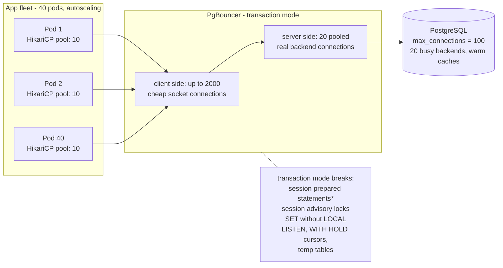
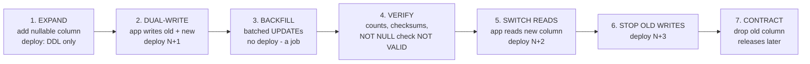
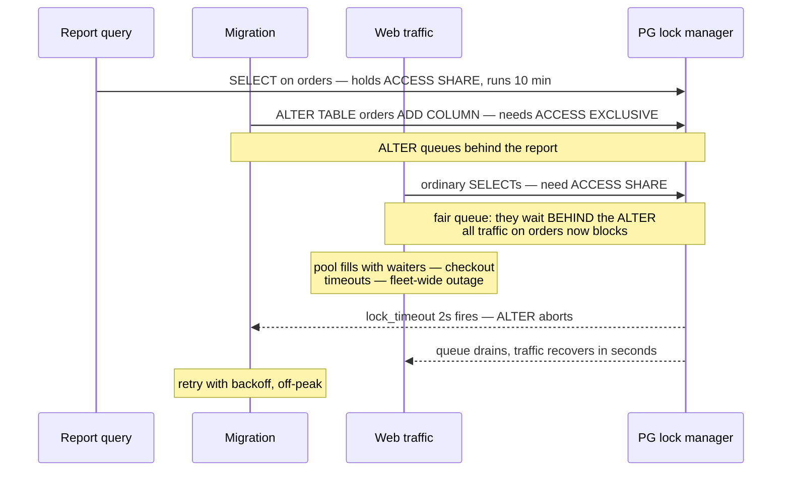
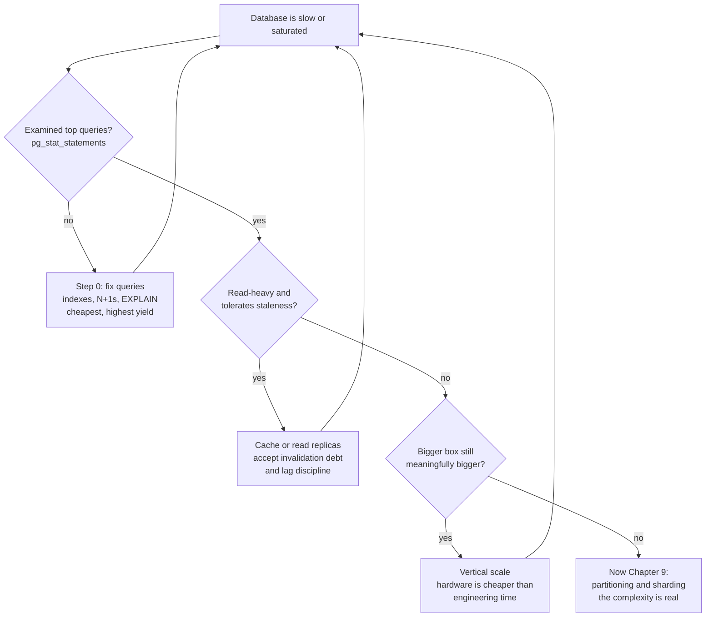
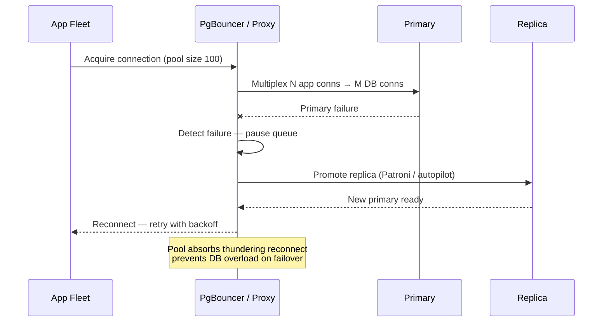
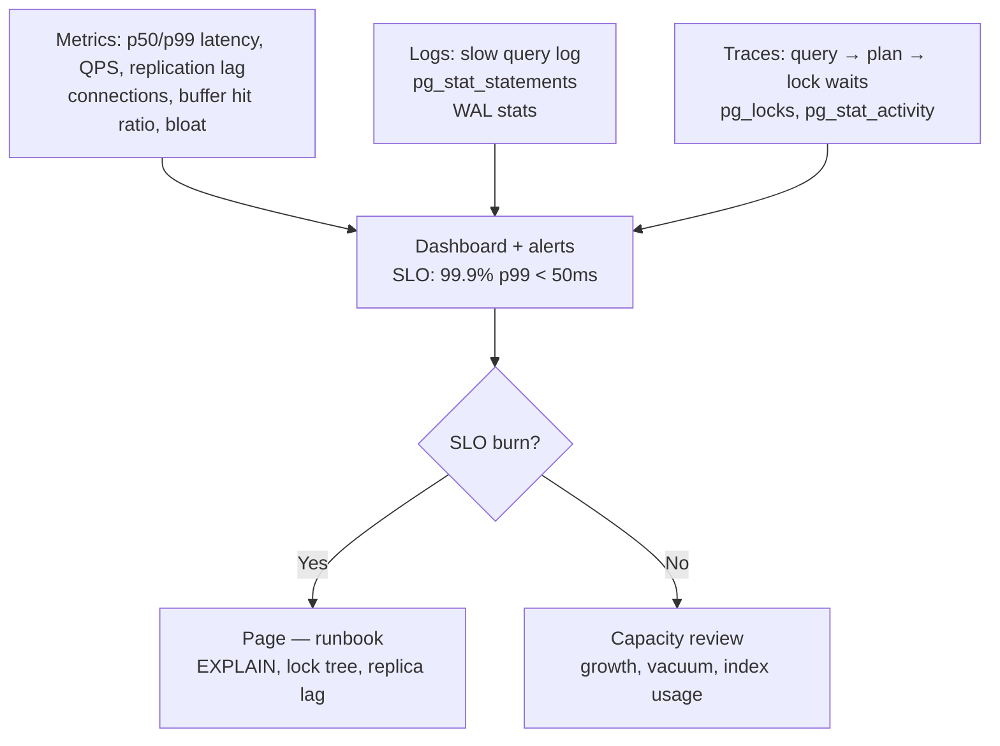

# Chapter 14 — Operating Databases: Pooling, Migrations, and Scaling

**What this chapter covers.** The previous thirteen chapters built the machine: relational
foundations, storage engines, indexes, query processing, transactions, MVCC, the WAL,
replication, partitioning, and the distributed variants. This closing chapter is about
*running* the machine, and its thesis is blunt: most database pain in production is
operational, not architectural. Teams migrate to exotic datastores to escape problems that
were actually a mis-sized connection pool, an unbatched migration, a missing index, or an
autovacuum that fell behind — problems with known, learnable fixes. We treat four
operational levers quantitatively: connection pooling (why Postgres connections are
expensive, why small pools beat big ones, and what each PgBouncer mode breaks), schema
migrations as an engineering discipline (expand-and-contract, the Postgres lock-hazard
catalogue, and the lock-queue pileup that turns a one-millisecond DDL into an outage),
the single-node scaling ladder you must climb before reaching for Chapter 9's sharding,
and the observability and backup practices that distinguish a database you operate from a
database you merely hope at. A short field guide to recurring incident shapes closes the
volume.

Learning goals — after this chapter you should be able to:

- Explain mechanically why a Postgres connection costs what it costs, and why
  `max_connections = 5000` degrades a server that would be healthy at 100.
- Size a connection pool from Little's law and the USL of Volume 4, Chapter 1, and defend
  a small number against the intuition that more connections mean more throughput.
- Choose between application-side pooling and a server-side pooler, select the right
  PgBouncer mode, and enumerate exactly what transaction pooling breaks.
- Design a zero-downtime schema change with expand-and-contract, batch a backfill safely,
  and wrap DDL in the `lock_timeout`-plus-retry pattern that prevents lock-queue pileups.
- Order the single-node scaling ladder correctly: query fixes, then caching, then read
  replicas, then vertical scaling, and only then partitioning.
- Translate the four golden signals into database terms and name the specific views and
  counters that measure each.
- State why replication is not a backup, and why a backup that has never been restored is
  a hope, not an artifact.

## Connection pooling

### Why connections are expensive in Postgres

PostgreSQL forks a dedicated operating-system **process** for every connection. That is
not a historical accident to be embarrassed about — it buys memory isolation between
sessions and predates robust threading — but it fixes the cost structure you operate
under. Each backend process carries several megabytes of private memory before it does
any work, and its working memory grows with activity: `work_mem` is not a per-connection
cap but a per-sort, per-hash-node budget, so a single complex query can consume several
multiples of it. A thousand mostly-idle connections can quietly hold gigabytes of RSS
that you provisioned for the buffer cache.

Memory is the visible cost. The subtler cost is that several core operations scale with
the *number of backends that exist*, not the number doing work. Taking an MVCC snapshot
(Chapter 6) historically required scanning the shared process array to determine which
transaction IDs were in flight — work proportional to connection count, performed at
every statement in read-committed mode. PostgreSQL 14's snapshot-scalability work
(Andres Freund's series of patches) dramatically reduced this penalty, and it is the
reason PG14+ tolerates large idle-connection counts far better than PG12 did — but
"tolerates better" is not "free": the shared lock table, the process array, and the
kernel's scheduler all still carry per-backend weight. At `max_connections = 5000` on a
32-core machine you have also promised the OS scheduler up to 5000 runnable processes
contending for 32 cores; when load arrives, throughput collapses into context-switch
thrash exactly as Volume 4, Chapter 1 predicts.

Connection *establishment* is expensive too — fork, TLS handshake, authentication,
catalog cache warm-up — comfortably milliseconds. An application that opens a connection
per request pays that tax on every request and hammers the postmaster with fork storms
under load. Pooling exists to amortize establishment cost and, more importantly, to cap
concurrency at the database.

### Small pools outperform big ones

The counterintuitive core of pool sizing: **a smaller pool is usually faster**, not just
safer. The connection pool is the canonical worked example of the Universal Scalability
Law from Volume 4, Chapter 1. A database server has a finite number of cores and a finite
number of I/O channels; past the point where those are saturated, each additional
concurrent query adds no throughput while adding contention (α — lock waits, buffer
partition locks) and coherence cost (β — cache-line traffic, context switches). The USL
curve does not plateau, it *turns down*. The HikariCP project's "About Pool Sizing" page
demonstrates this with an Oracle benchmark in which cutting a pool from 2,048 to 96
connections dropped query wait times from ~100 ms to ~2 ms — same hardware, same
workload, more than an order of magnitude better, purely by refusing to oversubscribe.

The classical starting formula, from the PostgreSQL community via the HikariCP wiki, is:

    pool_size ≈ core_count × 2 + effective_spindle_count

For a 16-core server on SSDs, that suggests something in the low tens — not hundreds.
The formula is a heuristic, not a law; its real content is that the right number is
proportional to the server's *parallel service capacity*, not to the client's *desire
for concurrency*.

Little's law (Volume 4, Chapter 1) gives you the demand-side check. If your service
issues λ = 2,000 queries/second and the mean time a connection is held per query is
W = 5 ms, then the average number of busy connections is L = λ × W = 10. A pool of 20
gives you 2× headroom for bursts and variance. Note what the arithmetic punishes: **W is
hold time, not query time.** A transaction that runs three 1 ms queries but holds the
connection for 200 ms while awaiting a downstream HTTP call has W = 200 ms, and your
pool requirement just went up 40×. This is why Chapter 5's discipline — keep transactions
short, never do external I/O inside one — is also pool-sizing discipline, and it is the
same rule as "never hold a lock across I/O" from Volume 4, Chapter 2, because a pooled
connection *is* a lock on a slice of the database's capacity.

When the pool is smaller than peak demand, excess requests queue at checkout. That is
correct behavior: a bounded queue in front of a saturated resource is admission control,
and the alternative — admitting everything — makes every request slow instead of making
a few requests wait. We return to this in the distributed-systems lens.

### Application-side pools: HikariCP as the exemplar

Every serious runtime has an in-process pool (HikariCP on the JVM, `pgxpool` in Go,
`asyncpg`/SQLAlchemy pools in Python). HikariCP's configuration surface is a good
checklist because each knob corresponds to a failure mode:

```properties
# HikariCP — the knobs that matter, annotated honestly
maximumPoolSize=10          # from Little's law + headroom, NOT from thread count.
minimumIdle=10              # equal to max: a fixed-size pool. Elastic pools re-pay
                            # connection setup exactly when load spikes — the worst time.
connectionTimeout=3000      # ms to wait at checkout before failing. Fail fast: a
                            # request that waits 30s for a connection times out
                            # upstream anyway and holds its own resources meanwhile.
maxLifetime=1740000         # 29 min. Retire connections BEFORE any external limit —
                            # server idle timeouts, LB/NAT flow expiry, failover DNS —
                            # kills them mid-query. Keep it below the smallest of those.
keepaliveTime=60000         # periodic liveness probe so a dead peer is noticed
                            # before a real query trips over it.
leakDetectionThreshold=10000  # log a stack trace when a connection is held >10s.
                            # Leak detection is not optional in a codebase where
                            # anyone can forget a close() on an error path.
```

The three decisions worth internalizing: fix the pool size rather than letting it flex
(elasticity adds connection-establishment latency precisely under load); make checkout
timeout short and treat it as backpressure, not as an error to retry immediately; and
run leak detection permanently, because a leaked connection is invisible until the day
traffic rises and the pool arithmetic stops working.

### Server-side poolers: PgBouncer and its modes

Application-side pools have a fleet-level flaw: they multiply. Forty pods with
`maximumPoolSize=10` is 400 server connections — each pod's pool is individually modest
and the sum still swamps the database, and autoscaling makes the sum a moving target.
The fix is a **server-side pooler** between the fleet and the database. PgBouncer is the
standard for Postgres: a single-threaded, event-driven proxy that speaks the Postgres
wire protocol, accepts thousands of client connections cheaply (each is just a socket
and a small struct, not a process), and multiplexes them onto a small set of real
server connections.



PgBouncer has three pooling modes, and the mode determines both the multiplexing win
and what it silently breaks:

- **Session pooling.** A client keeps one server connection from connect to disconnect.
  Nothing breaks — full session semantics — but the multiplexing benefit collapses to
  amortizing connection establishment. Idle clients still pin server connections.
- **Transaction pooling.** A server connection is assigned at `BEGIN` and returned at
  `COMMIT`/`ROLLBACK` (or after each autocommit statement). This is the mode that
  delivers the big ratios — thousands of clients over tens of backends — because real
  workloads hold transactions for a small fraction of wall time. The price: **anything
  with session-scoped state breaks**, because your next transaction runs on a different
  backend. Concretely: server-side prepared statements created with session lifetime
  (`PREPARE`, or driver-level prepared statements — though PgBouncer 1.21+ can track
  and replay protocol-level prepared statements via `max_prepared_statements`, closing
  the most common gap); session-level advisory locks (`pg_advisory_lock` — the
  transaction-scoped `pg_advisory_xact_lock` variants are safe); `SET` of session GUCs
  (`SET LOCAL` inside a transaction is safe; bare `SET` leaks onto whichever backend
  you happened to have, then vanishes); `LISTEN`/`NOTIFY`; `WITH HOLD` cursors; and
  temporary tables that outlive a transaction.
- **Statement pooling.** The connection is returned after every statement;
  multi-statement transactions are rejected outright. Useful for pure autocommit
  workloads behind sharding middleware; rarely what you want.

Transaction pooling is the production default for high-connection-count fleets, and the
breakage list above is not a footnote — it is a contract your application code must be
audited against. The most common wound is self-inflicted: a driver configured to use
server-side prepared statements against an old PgBouncer, producing sporadic
`prepared statement "S_1" does not exist` errors that only appear under load, when
transactions actually interleave across backends.

A minimal honest configuration:

```ini
[databases]
app = host=10.0.1.5 port=5432 dbname=app

[pgbouncer]
pool_mode = transaction
max_client_conn = 2000      ; cheap — sockets, not processes
default_pool_size = 20      ; the number that actually hits Postgres
reserve_pool_size = 5       ; burst headroom after reserve_pool_timeout
query_wait_timeout = 5      ; seconds a query may wait for a server conn;
                            ; fail fast instead of building an invisible queue
server_idle_timeout = 300
max_prepared_statements = 200  ; 1.21+: protocol-level prepared stmt support
```

PgBouncer's single-threaded design means one instance saturates one core; the standard
scale-out is multiple instances (per-AZ, or with `SO_REUSEPORT`). A newer generation
addresses this and adds features: **pgcat** (multi-core, sharding-aware, load-balances
across replicas), **Supavisor**, and cloud-managed poolers like **AWS RDS Proxy**, which
adds IAM auth and faster failover but behaves like transaction pooling with its own
"pinning" rules — session-state-touching queries pin a client to a backend and quietly
forfeit multiplexing. The architecture and the trade-offs are the same; read the pinning
rules of whichever proxy you adopt with the transaction-pooling breakage list in hand.

### Pool exhaustion and timeout layering

Pools fail in two characteristic ways. **Leaks**: a code path checks out a connection
and never returns it — typically an early return or exception path that skips the
close. The pool shrinks one connection at a time over days, invisibly, until a traffic
bump turns 100% utilization into an outage. Leak detection thresholds and metrics on
`active`/`idle`/`waiting` counts are the countermeasures. **Starvation by long
transactions**: a report query or an interactive session that runs `BEGIN` and then
waits — on a lock, on a human, on a downstream — holds a connection for minutes. Ten of
those in a pool of 20 halves your effective capacity. This is Chapter 5's transaction
discipline surfacing as an operational constraint, and Postgres provides the backstop:
`idle_in_transaction_session_timeout` kills sessions that sit inside an open
transaction doing nothing (which also protects vacuum — see below).

Timeouts must be layered coherently, shortest at the innermost scope:

| Layer | Knob (typical) | Guards against |
|---|---|---|
| TCP connect | driver `connect_timeout` | dead host, black-holed SYN |
| Pool checkout | `connectionTimeout` / `query_wait_timeout` | pool exhaustion; converts it to fast failure |
| Statement | `statement_timeout` (per-role or per-session) | runaway query holding a connection |
| Idle-in-transaction | `idle_in_transaction_session_timeout` | abandoned transactions starving pool and vacuum |
| Connection lifetime | `maxLifetime` / `server_lifetime` | stale connections outliving NAT/LB/failover |

An inner timeout longer than the outer one that wraps it is a lie: if the HTTP handler
deadline is 2 s, a 30 s `statement_timeout` guarantees orphaned queries that burn
database capacity for clients that already hung up.

## Schema migrations as an engineering discipline

### Tooling: versioned, forward, in VCS

The baseline is not controversial: every schema change is a versioned migration file,
committed to the same repository as the code that depends on it, applied by a tool that
records applied versions in the database (Flyway's `flyway_schema_history`, Liquibase's
changelog, or the framework-native equivalents in Rails, Django, and Alembic). Reviews
happen on the SQL, not on a DBA's terminal. Down-migrations are worth writing for
development, but production philosophy should be **forward-only in spirit**: you cannot
"roll back" a migration that dropped data, and a failed deploy is fixed by rolling
*forward* with a new migration, not by running `down` against a database that live
traffic has already written to.

The hard part is not the tooling. It is that a migration is a change to shared mutable
state that must be applied while N application versions are reading and writing it —
which makes every nontrivial migration a compatibility problem, and the solution a
choreography.

### Expand-and-contract

The universal pattern for zero-downtime change is **expand-and-contract**: make the
schema additively compatible with both old and new code, move the data and the traffic,
then remove the old shape. Each phase is a **separate deploy**, verified before the
next begins. Compressing phases is how zero-downtime migrations cause downtime.



Worked example — replacing a `numeric` money column with integer cents:

1. **Expand.** `ALTER TABLE orders ADD COLUMN total_cents bigint;` — nullable, no
   default. In Postgres this is a catalog-only change: it needs `ACCESS EXCLUSIVE` but
   holds it for milliseconds (the lock *hazard* is the queue, covered next).
2. **Dual-write.** Deploy code that writes both columns on insert and update. Old code
   still running elsewhere in the fleet writes only the old column — that is fine;
   backfill will catch those rows, which is why backfill comes *after* dual-write is
   fully rolled out, never before.
3. **Backfill, batched.** Never `UPDATE orders SET total_cents = ...` in one statement.
   A single-statement backfill of a large table (a) holds row locks and a transaction
   open for the duration, blocking writers and stalling vacuum's xmin horizon
   (Chapter 6), (b) generates the entire table's worth of WAL in one burst, spiking
   replication lag (Chapter 8), and (c) creates a dead tuple for every row at once,
   handing autovacuum a cliff. Batches bound all three:

```bash
#!/usr/bin/env bash
# Batched backfill: small transactions, lag-aware pacing.
set -euo pipefail
LAST_ID=0
while :; do
  LAST_ID=$(psql "$DB" -qtAX -c "
    WITH batch AS (
      SELECT id FROM orders
      WHERE id > ${LAST_ID} AND total_cents IS NULL
      ORDER BY id
      LIMIT 5000
    ),
    upd AS (
      UPDATE orders o
      SET total_cents = round(o.total * 100)::bigint
      FROM batch b WHERE o.id = b.id
      RETURNING o.id
    )
    SELECT coalesce(max(id), -1) FROM upd;")
  [ "${LAST_ID}" = "-1" ] && break          # nothing left to do

  # Pace against the replicas: do not outrun apply on the standbys.
  LAG=$(psql "$DB" -qtAX -c "
    SELECT coalesce(max(extract(epoch FROM replay_lag)), 0)::int
    FROM pg_stat_replication;")
  if [ "${LAG}" -gt 10 ]; then sleep 30; else sleep 0.5; fi
done
```

   Each batch is its own short transaction; the sleep yields to foreground load; the
   lag check is the difference between a backfill and a replication incident.
4. **Verify.** Count rows where the columns disagree; if the end state needs
   `NOT NULL`, add it as `ALTER TABLE orders ADD CONSTRAINT total_cents_nn CHECK
   (total_cents IS NOT NULL) NOT VALID;` then `VALIDATE CONSTRAINT` — validation scans
   the table under a lock that does not block reads or writes, and on PostgreSQL 12+
   a subsequent `SET NOT NULL` can use the validated constraint as proof and skip its
   own full-table scan.
5–7. **Switch reads, stop old writes, contract.** Each its own deploy; the drop waits
   until no deployable artifact references the old column — including ad-hoc analytics
   and that one cron job nobody remembers.

The pattern generalizes: splitting a table, moving a column between tables, changing a
type — all are expand, dual-write, backfill, verify, cut over, contract. It is slow by
design. The speed of a schema change is not the time the DDL takes; it is the number of
release cycles the choreography takes, and attempting to shortcut that is the single
most common cause of migration incidents.

### The Postgres lock-hazard catalogue

Every `ALTER TABLE` takes a lock; the operational question is which lock and **for how
long**. The taxonomy that matters:

| Operation | Lock | Duration | Notes |
|---|---|---|---|
| `ADD COLUMN` (nullable, no default) | ACCESS EXCLUSIVE | ms — catalog only | safe with `lock_timeout` |
| `ADD COLUMN ... DEFAULT <constant>` | ACCESS EXCLUSIVE | **PG11+: ms** (default stored as metadata) | pre-11: full table rewrite under the lock — a classic multi-hour outage |
| `ADD COLUMN ... DEFAULT <volatile fn>` | ACCESS EXCLUSIVE | full rewrite, even on PG11+ | e.g. `DEFAULT gen_random_uuid()` |
| `ALTER COLUMN TYPE` (non-binary-compatible) | ACCESS EXCLUSIVE | full rewrite + index rebuilds | use expand-and-contract instead |
| `SET NOT NULL` | ACCESS EXCLUSIVE | full scan (PG12+: skipped if a valid CHECK proves it) | use the NOT VALID two-step |
| `ADD FOREIGN KEY` | locks both tables | validation scan | `NOT VALID` + `VALIDATE CONSTRAINT` splits lock from scan |
| `CREATE INDEX` | SHARE | blocks all writes for the build | never on a live table |
| `CREATE INDEX CONCURRENTLY` | SHARE UPDATE EXCLUSIVE | writes proceed | see caveats below |
| `DROP COLUMN` | ACCESS EXCLUSIVE | ms — column is hidden, not erased | space reclaimed lazily by rewrites |

`CREATE INDEX CONCURRENTLY` (Chapter 3) is the tool for indexing live tables, with
three caveats that bite: it cannot run inside a transaction block (so your migration
tool needs its non-transactional mode); it is slower — two table scans plus waits for
every transaction that might use the index to finish; and **on failure it leaves behind
an `INVALID` index** that consumes space and write overhead while serving no queries —
you must `DROP INDEX CONCURRENTLY` and retry. Monitor for invalid indexes; they are a
silent tax.

The catalogue above understates the real hazard, though, because duration-of-lock-held
is not the whole story. The killer is duration-of-lock-*waited*:

### The lock-queue pileup

Postgres lock queues are fair: a requested `ACCESS EXCLUSIVE` lock waits behind
existing holders, and **everything requested after it waits behind it** — including
plain `SELECT`s that only need `ACCESS SHARE`. So a "safe," millisecond, catalog-only
`ADD COLUMN` deployed while one long-running report holds `ACCESS SHARE` becomes a
plug: the ALTER waits on the report, every query on the table queues behind the ALTER,
the connection pool fills with waiters, checkout timeouts fire fleet-wide, and you have
a full outage caused by a DDL that "doesn't lock anything." This is among the most
common self-inflicted database outages in industry.



The safety net is mechanical and should be baked into your migration tooling, not left
to memory: set a short `lock_timeout` for every DDL statement, and retry with backoff.

```bash
# lock_timeout + retry: the DDL either gets the lock fast or gets out of the way.
for attempt in 1 2 3 4 5; do
  if psql "$DB" -v ON_ERROR_STOP=1 -c "
       SET lock_timeout = '2s';
       ALTER TABLE orders ADD COLUMN total_cents bigint;"
  then
    break
  fi
  echo "lock_timeout hit, attempt ${attempt}; backing off"
  sleep $((attempt * 10))
done
```

With a 2-second `lock_timeout`, the worst case is a 2-second stall on the table, which
the retries repeat until a gap in long-running queries lets the DDL through. Pair it
with monitoring for long-running transactions before migrating, and with
`statement_timeout` kept separate — `lock_timeout` bounds waiting for the lock,
`statement_timeout` bounds the work after acquiring it, and rewriting DDL needs the
second one generous while the first stays tight.

### MySQL, briefly

InnoDB's online DDL landscape differs in mechanism but not in discipline. `ALTER TABLE`
declares an algorithm: `INSTANT` (metadata-only — adding a column, available since
8.0.12 and generalized in 8.0.29), `INPLACE` (the table is modified without a full
copy, often permitting concurrent DML), and `COPY` (full rebuild, blocking). When the
built-in algorithms are insufficient or the risk is too high, the ecosystem's answer is
the **shadow-table** approach: GitHub's `gh-ost` creates a ghost copy of the table,
copies rows in throttled batches while tailing the binlog to apply concurrent changes,
then performs an atomic rename cut-over; Percona's `pt-online-schema-change` does the
same with triggers instead of binlog tailing. Both are expand-and-contract automated at
the single-table level — the same idea, productized.

### Destructive changes are quarantined

Renames and drops get their own rule: **never rename in place**. There is no deploy
ordering under which `RENAME COLUMN` works with a fleet running two application
versions — old code breaks the instant the rename lands, or new code breaks until it
does. A rename is therefore always add-new → dual-write → migrate readers → drop-old:
a multi-release choreography for what feels like a one-line change. Drops deserve a
quarantine period even after code references reach zero — a release or two of the
column existing unused, plus a check of query logs, before the irreversible statement
runs. The cost of carrying a dead column for a month is nearly zero; the cost of
discovering a forgotten consumer after the drop is a restore drill you did not schedule.

Finally, migration testing: a migration validated only against a developer database or
a thin staging dataset has been tested for syntax, not for behavior. Lock duration,
rewrite time, backfill runtime, and autovacuum interaction are all functions of data
volume and shape. The staging-data-size lie — "it ran in 40 ms in staging" — is how
five-hour table rewrites reach production. Test destructive or rewriting migrations
against a restored production snapshot (which, usefully, doubles as your restore drill)
or a masked production-shaped dataset, and record expected durations in the migration's
review.

## Scaling the single node first

Chapters 9 through 12 exist, and this section's job is to delay your need for them. A
modern server — dozens of cores, hundreds of gigabytes of RAM, NVMe storage delivering
hundreds of thousands of IOPS — runs a well-tuned Postgres at tens of thousands of
transactions per second. Most systems that "outgrew Postgres" outgrew an untuned
Postgres, and bought distributed-systems complexity (Chapter 10's coordination costs,
Chapter 9's cross-shard queries) to avoid an afternoon of profiling. Climb the ladder
in order:



**Step zero is query optimization**, because it is the only step that *removes* load
rather than redistributing it. `pg_stat_statements` (MySQL: `performance_schema` /
`sys.statement_analysis`) aggregates every query by normalized fingerprint; the top ten
by `total_exec_time` almost always contain most of the answer:

```sql
SELECT queryid,
       calls,
       round(mean_exec_time::numeric, 2)  AS mean_ms,
       round(total_exec_time::numeric)    AS total_ms,
       rows,
       shared_blks_read                   -- actual disk-ish reads, not cache hits
FROM pg_stat_statements
ORDER BY total_exec_time DESC
LIMIT 10;
```

The recurring finds: a missing index turning a point lookup into a scan (Chapter 3), an
ORM-generated N+1 issuing ten thousand 1 ms queries where one join would do (the API
chattiness problem of Volume 8 in miniature — high `calls`, innocuous `mean_ms`,
dominant `total_ms`), and a query whose plan regressed after data growth crossed a
planner threshold (`EXPLAIN (ANALYZE, BUFFERS)` discipline — Chapter 4). A single fixed
query can return more capacity than a hardware generation.

**Caching** is powerful and should be adopted with honest accounting. An app-level
cache in front of the database converts read load into invalidation obligations —
Volume 7, Chapter 3's territory — and every cached read is a consistency decision made
implicitly. Two honest questions before caching a query: is this query *slow for a
fixable reason* (in which case the cache is hiding a bug you will meet again at
invalidation time), and what is the blast radius when this cache is cold (see the
thundering-herd pattern in the incident guide below)?

**Read replicas** (Chapter 8) scale reads nearly linearly for workloads that tolerate
replication lag, and the discipline is entirely about lag: read-your-writes violations
appear exactly when lag spikes, which is exactly when load is high, which is exactly
when the replicas are most needed. Route reads that require freshness to the primary
explicitly; treat "read from replica" as a per-query decision with a staleness budget,
not a global switch.

**Vertical scaling** is underrated by engineers and correctly rated by accountants.
Doubling memory so the working set fits in cache, or moving to NVMe, is often a
same-day change that buys years — and its fully-loaded cost is a fraction of one
engineer-year spent sharding. Its limits are real: the price curve turns convex at the
top of the instance range, failover of a huge single node is slower, and write
throughput eventually meets the WAL's serial ceiling (Chapter 7). When you can no
longer buy a meaningfully bigger box — *and* the top of `pg_stat_statements` is
clean — then partitioning and sharding (Chapter 9) and the NewSQL systems that
automate them (Chapter 12) are the honest next rung, with their costs now justified.

## Observability for databases

Volume 11's golden signals — latency, traffic, errors, saturation — translate directly;
the work is knowing which counters embody them.

**Saturation** is the signal databases die by, and it is multi-dimensional: connection
utilization (busy ÷ max, both at the pooler and at Postgres), CPU, I/O (device
utilization and queue depth), and **replication lag** (`pg_stat_replication.replay_lag`
on the primary, `pg_last_xact_replay_timestamp` deltas on standbys). Each has a
different failure signature and all deserve alerts at levels below catastrophe.

**Latency** must be per-query-fingerprint, not global — a global p99 is the average of
a bimodal distribution of cheap point reads and expensive reports, and it moves for
reasons that identify nothing. `pg_stat_statements.queryid` is the fingerprint;
exporting `mean_exec_time` and `calls` per fingerprint gives you per-query-shape
latency trends, which is the database equivalent of per-endpoint SLIs. Complement the
aggregates with **slow-query logging** — `log_min_duration_statement` set to a
meaningful threshold — and on busy systems use `log_min_duration_sample` with
`log_statement_sample_rate` (PG13+) so a latency regression does not turn the log
volume itself into an incident (see disk-full, below).

**Lock and wait-event monitoring.** `pg_stat_activity.wait_event_type`/`wait_event`
tell you what backends are waiting *on* — `Lock`, `IO`, `LWLock`, `Client` — and a
sudden shift in the wait-event mix diagnoses incidents faster than any latency graph.
For lock waits specifically, `pg_blocking_pids()` answers who-blocks-whom directly:

```sql
-- Who is blocked, on whom, and how old is the blocker's transaction?
SELECT w.pid                       AS waiting_pid,
       now() - w.query_start       AS waiting_for,
       left(w.query, 60)           AS waiting_query,
       b.pid                       AS blocking_pid,
       b.state                     AS blocking_state,
       now() - b.xact_start        AS blocking_xact_age,
       left(b.query, 60)           AS blocking_query
FROM pg_stat_activity w
JOIN LATERAL unnest(pg_blocking_pids(w.pid)) AS blk(pid) ON true
JOIN pg_stat_activity b ON b.pid = blk.pid
ORDER BY waiting_for DESC;
```

Run under pressure, this query names the idle-in-transaction session or the queued DDL
at the head of a pileup in one read. It belongs in a runbook, not in someone's memory.

**Vacuum and bloat.** Chapter 6 established that MVCC defers cleanup to vacuum; the
operational consequence is that vacuum health is a first-class signal.
`pg_stat_user_tables` exposes `n_dead_tup` and `last_autovacuum` per table; dead-tuple
counts trending up while `last_autovacuum` ages means autovacuum is losing. The default
`autovacuum_vacuum_scale_factor` of 0.2 means a billion-row table accumulates 200
million dead tuples before vacuum triggers — hot large tables need per-table overrides
(a small `autovacuum_vacuum_scale_factor` or a flat `autovacuum_vacuum_threshold`),
and a throttled cluster needs `autovacuum_vacuum_cost_limit` raised, because the
default cost limits were chosen for spinning disks and are far too shy for NVMe. The
**wraparound** scenario deserves sober description rather than panic: transaction IDs
are 32-bit and comparisons are circular, so tables must be frozen before their oldest
unfrozen XID falls ~2 billion transactions behind; autovacuum runs aggressive freezing
at `autovacuum_freeze_max_age` (default 200 million), modern versions add a failsafe
vacuum mode, and the database will refuse new writes rather than corrupt data if the
horizon is nearly exhausted. In practice wraparound emergencies are always preceded by
weeks of visible symptoms — `datfrozenxid` age climbing unbounded, usually because a
forgotten replication slot, a `prepared transaction`, or an eternal idle-in-transaction
session pinned the xmin horizon. Monitor XID age; the emergency is optional.

**Capacity trending** closes the loop: disk-space growth rate (with WAL and log
volumes tracked separately — each has its own leak modes), WAL bytes per second
(Chapter 7 — it predicts both replication bandwidth and backup size), and connection
counts over weeks. Databases rarely fail suddenly; they fail on trend lines nobody
plotted.

## Backup and restore: the discipline that actually matters

Everything else in this chapter degrades service; losing data ends it. The mechanics
follow directly from earlier chapters. **Logical backups** (`pg_dump`) serialize schema
and rows: portable across versions and architectures, selective, and human-auditable —
but restores rebuild every index and are far too slow for large databases' recovery
objectives, and a dump is a single point in time. **Physical backups** copy the data
directory (`pg_basebackup`, or tools like pgBackRest and WAL-G that add compression,
incrementals, and object-store targets) and pair with **continuous WAL archiving**
(Chapter 7). The pairing is what buys **point-in-time recovery**: restore the base
backup, replay archived WAL to any chosen instant — including the instant *before* the
bad deploy ran `UPDATE` without a `WHERE`. Your recovery-point objective is set by
archive frequency; your recovery-time objective by base-backup age (more WAL to replay)
and restore bandwidth.

Two principles carry more weight than all the tooling:

**Replication is not backup.** Chapter 8's replicas protect against hardware failure
and nothing else, because replication's entire purpose is to faithfully copy every
write — including `DROP TABLE`. A delayed replica (`recovery_min_apply_delay`) widens
the window for catching a mistake and can dramatically shorten recovery when caught in
time, and it is a genuinely useful tool — but it is a complement to PITR, not a
substitute, because the delay you configured is a bet about how fast you notice
mistakes.

**A backup you have not restored is a hope.** Backup jobs fail silently in every way
imaginable: credentials rot, object-store lifecycle rules delete what you meant to
keep, the archive is complete but the one WAL segment needed for consistency is not,
the restore works but takes nineteen hours against a four-hour RTO. The only test is a
**scheduled restore drill**: periodically restore the latest backup to a scratch
instance, replay WAL to a target time, run integrity checks, and *record the elapsed
time* as your measured RTO. Automate it — the restore-for-migration-testing practice
above and this drill can be the same pipeline — and alert when the drill fails or the
measured RTO drifts past the objective. Organizations discover their backups do not
work at exactly one of two times: during a drill, or during the incident.

## Incident patterns: a field guide

Database incidents cluster into a small number of shapes. Knowing them converts an
hour of confused dashboard-staring into minutes of pattern-matching — which is the
argument (Volume 11, Chapter 5) for writing each of these up as a runbook with the
diagnostic queries inline.

- **Connection-pool exhaustion cascade.** Something slows the database → hold times
  rise → Little's law fills the pool → checkouts queue and time out → app threads
  block → upstream health checks fail → retries add load. The pool is rarely the
  cause; it is the messenger. Diagnosis: pool wait metrics plus
  `pg_stat_activity` state counts — many `active` means the database is slow (find the
  query); many `idle in transaction` means the app is holding (find the code path).
- **Lock-queue pileup behind DDL.** The sequence diagram above. Signature: sudden
  fleet-wide blocking scoped to one table, `wait_event_type = Lock`, a migration in
  the deploy log. The who-blocks-whom query names it; killing the DDL (or the
  long-runner ahead of it) drains the queue instantly. Prevention: `lock_timeout` +
  retry, always.
- **Autovacuum death spiral.** Load rises → autovacuum throttled or cancelled by lock
  conflicts → dead tuples accumulate → scans read more pages for the same rows →
  queries slow → load rises. Slow-burn onset over days, visible in `n_dead_tup`
  trends. Recovery usually requires raising vacuum cost limits and letting it catch
  up during a quiet window — and finding the xmin-pinning session, if any.
- **Replication-lag spiral.** A WAL burst (bulk update, unbatched backfill, rewriting
  DDL) exceeds replica apply speed → lag grows → lag-sensitive reads fail over to the
  primary → primary load rises → more WAL. Prevention is the lag-aware pacing shown in
  the backfill loop; response is shedding read load or relaxing freshness requirements
  temporarily.
- **Disk full.** The database's uniquely unforgiving resource. Recurring causes: WAL
  retention leaks — an **orphaned replication slot** pins WAL forever (monitor
  `pg_replication_slots` for inactive slots; `max_slot_wal_keep_size` is the modern
  backstop), a broken `archive_command` blocks WAL recycling; and log spam — an error
  loop at thousands of lines per second can fill a volume in hours (which is why
  sampled logging matters). Postgres stops accepting writes when WAL space is gone;
  recovery under pressure risks the classic fatal error of deleting WAL files by hand.
  Runbook this one *before* you need it.
- **Thundering-herd cache expiry.** A popular cache key expires → every concurrent
  request misses simultaneously → the database absorbs the full read load of a query
  it had not seen in hours. The fixes are Volume 4, Chapter 9's singleflight (collapse
  concurrent identical misses into one loader), jittered TTLs, and
  serve-stale-while-revalidating. The database-side signature: a familiar fingerprint
  in `pg_stat_statements` whose `calls` graph is a vertical line.

## Managed databases: what "managed" actually covers

RDS, Cloud SQL, and their peers (Volume 12, Chapter 6 treats the platform side) own
real work: hardware, OS patching, minor-version upgrades, backup execution, failover
machinery, and replica provisioning. What they do not own is everything this chapter
discussed: your schema, your queries, your indexes, your pool sizing, your migration
choreography, your capacity planning, and — critically — **verifying that restores
meet your RTO**. The provider guarantees a backup exists; the drill is still yours.
"Managed" removes the operating system from your pager, not the database from your
engineering. Two managed-specific habits: keep parameter groups in infrastructure-as-
code, because console-edited parameters drift silently between environments and
"staging behaves differently" is frequently a parameter-group diff; and learn the
provider's failover behavior empirically (connection handling, DNS TTLs, typical
duration) *before* the first unplanned one.

## The distributed-systems lens

The database is usually the stateful heart of a service architecture — the one
component that cannot be made stateless, restarted casually, or trivially horizontally
scaled. That position makes its operational ceilings *fleet-wide* facts. When the
database saturates, the backpressure propagates outward through every service that
touches it (Volume 10, Chapter 7): pools fill, then request queues, then upstream
timeouts — one slow table can become an organization-wide brownout. This is why the
data tier's admission control matters so much: **a bounded connection pool is a
bulkhead** in exactly Volume 4, Chapter 9's sense, the same semaphore math applied at
the data tier, deciding *where* the queueing happens (at checkout, visibly, with a
timeout) rather than *whether* it happens.

Migrations, seen through the same lens, are distributed deployments. At any moment
during a rollout, one schema version must interoperate with N application versions —
plus canaries, plus the instance that failed to drain. That is precisely the
compatibility discipline Volume 8 applies to API and message-schema evolution
(Chapters 5 and 8): additive changes first, consumers before producers, destructive
changes only after every reader is gone. Expand-and-contract is not a database trick;
it is the universal protocol for changing a shared contract under rolling deployment,
and DDL is simply the case where the contract is enforced by a lock manager.

Finally, the organizational lesson (Volume 15's territory): none of these levers should
be rediscovered per-team. Mature platform organizations productize them — a golden
connection-pool configuration baked into service templates; migration linting in CI
that rejects `RENAME COLUMN`, un-`CONCURRENTLY` index builds, and DDL without
`lock_timeout`; automated restore drills with RTO dashboards; runbooks for the six
incident shapes above pre-written with the diagnostic queries inline. The difference
between an organization where databases are a recurring source of outages and one where
they are boring is rarely the database. It is whether these operational levers are
individual heroics or paved road.

## Key takeaways

- **Most production database pain is operational.** Pools, migrations, vacuum,
  observability, and backups are learnable levers; exhaust them before buying
  architectural complexity.
- Postgres connections are **processes**: per-backend memory plus per-backend costs in
  snapshots and shared structures. Huge `max_connections` degrades the whole server;
  cap concurrency with pools instead.
- **Small pools outperform big ones** — the connection pool is the canonical USL
  example. Size from Little's law (`connections ≈ λ × W`, with W as *hold* time) plus
  headroom, and treat checkout queueing as admission control, not failure.
- **PgBouncer transaction pooling** delivers the big multiplexing ratios and breaks
  session state: session prepared statements (pre-1.21), session advisory locks, bare
  `SET`, `LISTEN`, `WITH HOLD` cursors, temp tables. Audit code against that list.
- **Layer timeouts** — connect, checkout, statement, idle-in-transaction, lifetime —
  shortest innermost, and never let an inner timeout exceed the outer deadline.
- Zero-downtime schema change is **expand → dual-write → batched backfill → verify →
  switch reads → contract**, each phase a separate deploy. Backfills are batched
  because of lock scope, WAL/replication-lag bursts, and vacuum pressure.
- The DDL hazard is the **lock queue**, not the lock: a waiting ACCESS EXCLUSIVE
  blocks everything behind it. `lock_timeout` plus retry is mandatory, tool-enforced.
  Know the ALTER catalogue (PG11 made constant defaults metadata-only;
  `CREATE INDEX CONCURRENTLY` can leave INVALID indexes; `NOT VALID` + `VALIDATE`
  splits locks from scans). **Never rename in place.**
- Climb the **single-node ladder in order**: fix top queries (`pg_stat_statements`,
  N+1s, EXPLAIN), cache honestly, add read replicas with lag discipline, scale
  vertically — and only then shard.
- Database observability = golden signals translated: saturation is
  connections/CPU/IO/replication lag; latency is per-fingerprint; watch wait events,
  who-blocks-whom, dead tuples, XID age, and the capacity trend lines.
- **Replication is not backup** (deletes replicate), and **an unrestored backup is a
  hope**. PITR = base backup + WAL archive; scheduled restore drills measure the real
  RTO.
- Managed databases outsource the OS, not the engineering: schema, queries, pools,
  capacity, and restore verification remain yours.
- Pool limits are **bulkheads at the data tier**; migrations are **distributed
  deployments** governed by the same compatibility rules as APIs; platform teams
  should productize all of it as paved road.

```mermaid
gantt
    title Point-in-Time Recovery Timeline
    dateFormat X
    axisFormat %L
    section Backup
    Base backup Sun 00-00       :a1, 0, 2
    WAL segments continuous     :a2, 0, 14
    Incremental Mon             :a3, 3, 1
    Incremental Tue             :a4, 6, 1
    Crash Wed 14-00             :a5, 10, 1
    section Recovery
    Restore base backup         :b1, 11, 2
    Replay WAL to 13-59         :b2, 13, 2
    Consistent at target time   :b3, 15, 1
```








## Further reading

- Wooldridge, B., "About Pool Sizing," HikariCP wiki — the pool-sizing argument, the
  benchmark, and the `cores × 2 + spindles` heuristic.
  https://github.com/brettwooldridge/HikariCP/wiki/About-Pool-Sizing
- PgBouncer documentation — pooling modes and the features-per-mode compatibility
  table; read it before enabling transaction mode. https://www.pgbouncer.org/features.html
- PostgreSQL documentation, "Explicit Locking" — the lock-mode conflict matrix that
  underlies every DDL hazard in this chapter.
  https://www.postgresql.org/docs/current/explicit-locking.html
- PostgreSQL documentation, `ALTER TABLE` — notes on which forms rewrite the table and
  which are metadata-only. https://www.postgresql.org/docs/current/sql-altertable.html
- PostgreSQL documentation, "Routine Vacuuming" — autovacuum tuning, freeze ages, and
  the authoritative description of transaction-ID wraparound.
  https://www.postgresql.org/docs/current/routine-vacuuming.html
- PostgreSQL documentation, "Continuous Archiving and Point-in-Time Recovery" — the
  base-backup-plus-WAL model in full. https://www.postgresql.org/docs/current/continuous-archiving.html
- gh-ost documentation — the binlog-based shadow-table design and its cut-over
  algorithm; the clearest description of online schema change as a system.
  https://github.com/github/gh-ost/blob/master/doc/cheatsheet.md
- MySQL 8.0 Reference Manual, "Online DDL Operations" — the INSTANT/INPLACE/COPY
  algorithm tables. https://dev.mysql.com/doc/refman/8.0/en/innodb-online-ddl-operations.html
- Kreps, J., "The Log: What every software engineer should know about real-time data's
  unifying abstraction" (2013) — the conceptual frame behind WAL shipping, replication,
  and PITR alike. https://engineering.linkedin.com/distributed-systems/log-what-every-software-engineer-should-know-about-real-time-datas-unifying
- Beyer, B. et al., *Site Reliability Engineering* (O'Reilly, 2016), Chapter 6 — the
  golden signals this chapter translated into database terms.
- Volume 4, Chapter 1 — the USL and Little's law that pool sizing instantiates;
  Volume 4, Chapter 9 — bulkheads and singleflight.
- Chapter 6 — MVCC and vacuum; Chapter 7 — the WAL; Chapter 8 — replication and lag;
  Chapter 9 — partitioning, when the ladder truly runs out.
