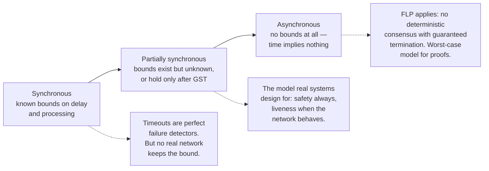
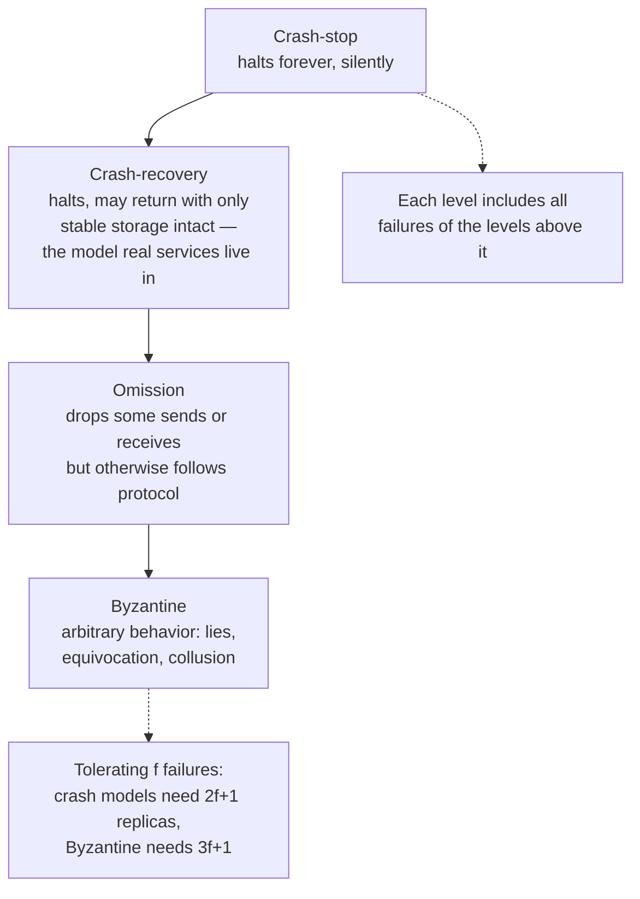
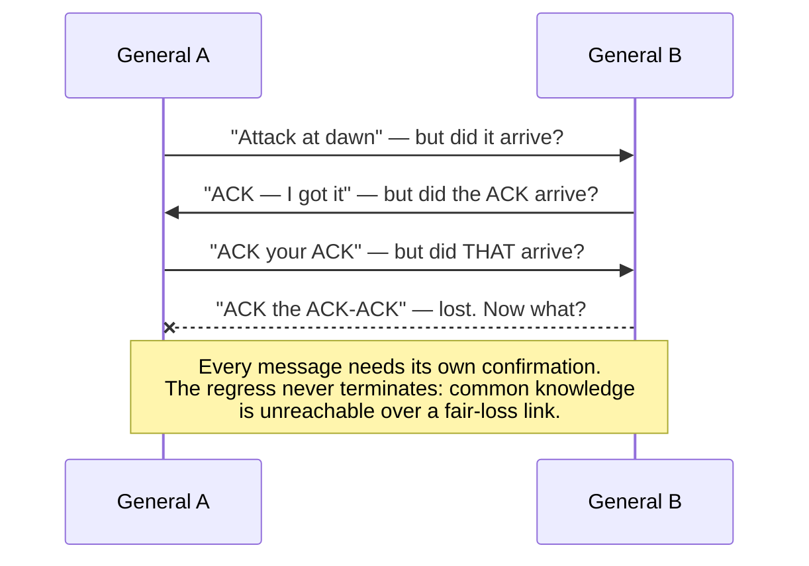
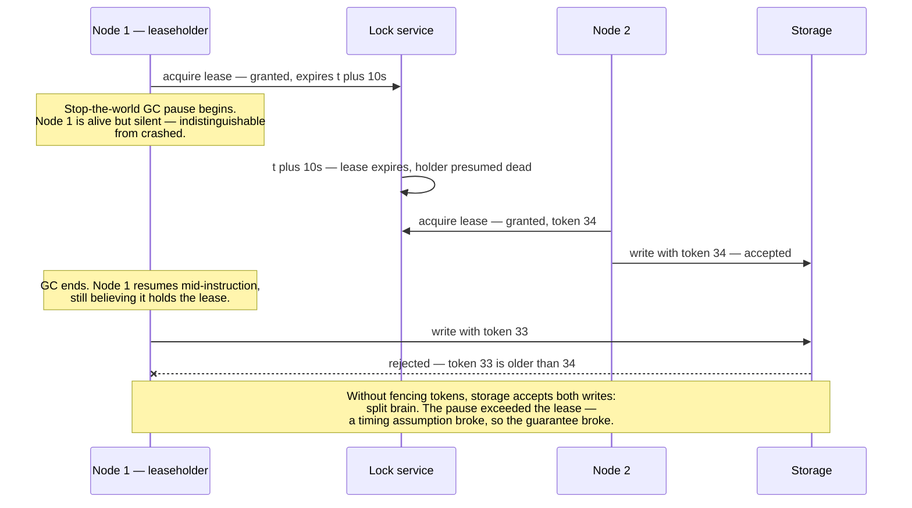
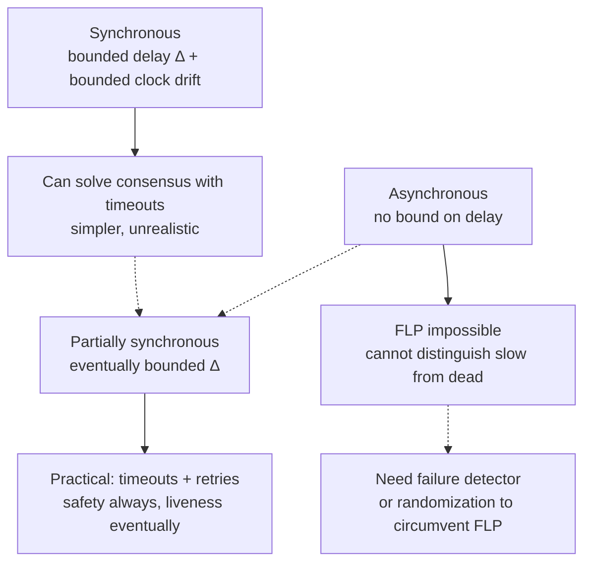
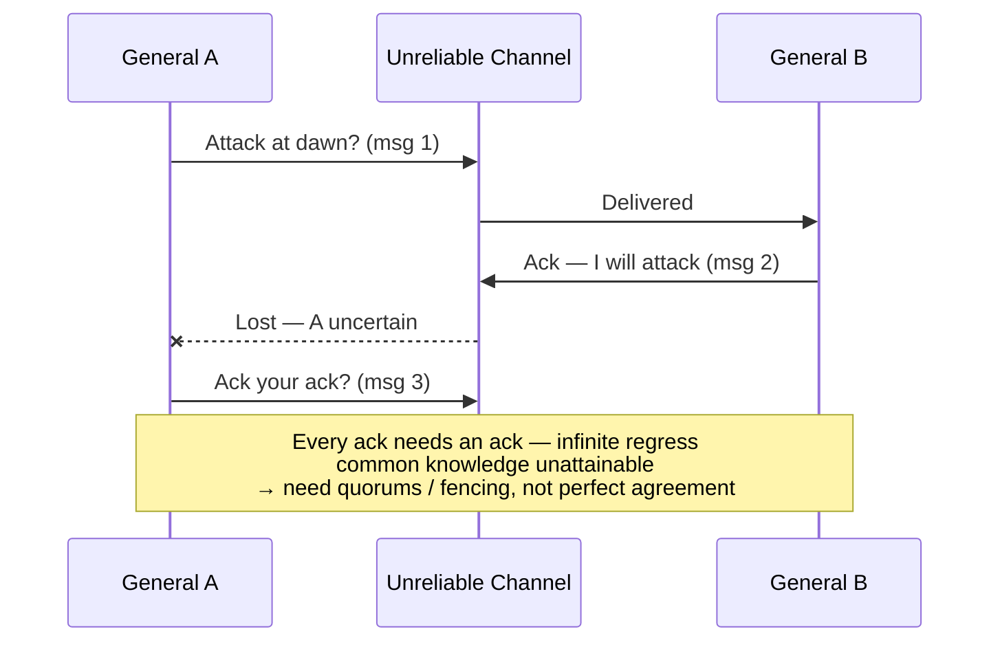
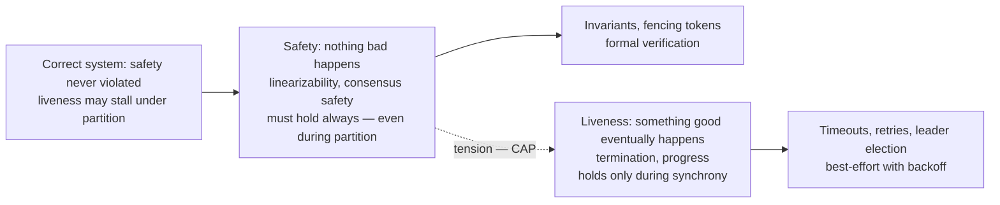

# Chapter 1 — Foundations: System Models, Failures, and Assumptions

**What this chapter covers.** Volume 4 opened with the claim that a distributed system is
concurrency writ large — the same hazards, replayed across machines, with weaker guarantees and no
shared memory to fall back on. This volume takes that claim seriously, and this chapter lays the
foundation everything else stands on. Before Paxos or Raft, before consistency models or CRDTs,
you need three things: a precise account of what makes a system "distributed" and why it is
qualitatively harder than concurrent-but-local (the one-word answer is *partial failure*); a
working command of **system models** — the timing, failure, and network assumptions that sit,
usually unstated, under every protocol and every proof; and an honest understanding of the
canonical impossibility results — Two Generals, FLP, and the crashed-versus-slow ambiguity — with
their exact preconditions, because knowing precisely what is impossible is what tells you what the
possible must cost. The chapter closes by setting the engineering stance for the whole volume:
protocols are machines for converting assumptions into guarantees, and when the assumptions break,
the guarantees break with them. We also introduce the volume's running example — a replicated
key-value store that each subsequent chapter upgrades — in its Chapter 1 form: a single node and a
prayer.

Learning goals — after this chapter you should be able to:

- Define a distributed system by its essential properties — partial failure, no shared memory, no
  shared clock, communication only by fallible messages — and explain why partial failure, not
  physical distribution, is the property that changes everything.
- Recite the eight fallacies of distributed computing and identify each one in a modern
  architecture review.
- State the three timing models (synchronous, asynchronous, partially synchronous) precisely, and
  explain why real systems are designed for partial synchrony: safety always, liveness when the
  network behaves.
- Place crash-stop, crash-recovery, omission, and Byzantine failures in a hierarchy, know which
  model real infrastructure assumes, and know when Byzantine tolerance is and is not worth 3f+1
  replicas.
- State the Two Generals result and the FLP impossibility theorem with their exact preconditions,
  and explain what each does *not* say.
- Explain why a crashed node and a slow node are indistinguishable in an asynchronous system, and
  trace that single ambiguity to split brain, fencing tokens, and leases.
- Describe how at-least-once delivery is built from fair-loss links, why "exactly-once delivery"
  is really at-least-once plus deduplication, and distinguish delivery from processing.

## What "distributed" actually means

Leslie Lamport, in a May 1987 email to his colleagues at DEC's Systems Research Center, gave the
definition that the field has never improved on:

> A distributed system is one in which the failure of a computer you didn't even know existed can
> render your own computer unusable.

The joke is precise. Lamport does not say a distributed system is one whose parts are far apart,
or one with many nodes, or one that uses a network. He identifies the property that actually
changes the engineering: **your fate is coupled to components you do not control, cannot observe
directly, and may not even know about — and those components fail independently of you.**

It is worth dwelling on why *partial failure* is the defining property, because the contrast with
everything you learned in Volume 4 is stark. In a concurrent-but-local program, failure is
all-or-nothing. If a thread dereferences a null pointer or the process runs out of memory, the
whole process dies — every thread, every lock, every half-updated data structure, all at once.
This sounds bad, and locally it is, but it makes *recovery* almost trivially simple: the operating
system reclaims everything, a supervisor restarts the process, and the process begins again from a
clean state (plus whatever it persisted). There is never a moment when thread 3 is dead but
thread 7 is still running and holding a mutex that thread 3 will never release. Crash semantics
inside one process are clean precisely because they are total.

Distribution breaks that totality. In a system of fifty nodes, one node crashing is not an event
that stops the system — it is Tuesday. The other forty-nine keep running, keep holding state, keep
making decisions, and must somehow cope with the fact that a participant vanished mid-protocol:
mid-transaction, mid-replication, holding a lease, having acknowledged some messages and not
others. Worse, as we will see, they cannot even be sure it vanished. Partial failure means the
system is *permanently* in a state where some components are up, some are down, some are slow, and
nobody has an authoritative list of which is which. Every protocol in this volume is, at bottom, a
way of making progress anyway.

Three further properties complete the definition, and each removes a tool you leaned on in
Volume 4:

- **No shared memory.** There is no address space in common, so there is nothing like a mutex,
  an atomic compare-and-swap, or a shared data structure. The only way node A can affect node B
  is to send it a message and hope. Every synchronization primitive you rely on in-process must be
  rebuilt out of messages, and the rebuilt versions are weaker, slower, and can fail partway.
- **No shared clock.** Each node has its own oscillator, its own drift, its own opinion of what
  time it is. There is no global "now," and — more subtly — no global ordering of events that all
  nodes agree on for free. Chapter 2 is devoted to what can be salvaged; the short version is
  *ordering* can be reconstructed (Lamport clocks, vector clocks) but *simultaneity* cannot.
- **Messages are the only channel, and messages are fallible.** A message may be lost, delayed
  arbitrarily, delivered more than once, or delivered out of order relative to other messages.
  Any of these, at any time, in any combination. Volume 3 explained the physical reasons — queue
  drops, retransmission, route changes, buffer bloat; here we take them as axioms and build on
  them.

A useful mental exercise: take any piece of concurrent code you trust and ask what happens if a
mutex acquisition could *silently fail to return*, if a write to a shared variable could be
*applied twice*, or if a thread could observe writes in an order no other thread observes. In a
single process these are absurdities. Across a network they are the baseline. That is the
qualitative gap this volume exists to cross.

## The eight fallacies

In 1994 L. Peter Deutsch, then at Sun Microsystems, codified seven assumptions that "essentially
everyone" makes when first building distributed applications, all false; James Gosling added the
eighth in 1997. (The list has roots in earlier observations by Bill Joy and Tom Lyon at Sun.)
Three decades later, every one of them still ships to production weekly. The list is worth
memorizing not as trivia but as a review checklist — each fallacy names a default assumption your
design must either avoid or explicitly pay to remove.

1. **The network is reliable.** It is not; packets and whole partitions of the network vanish.
   Modern instance: a service calls another service with no retry, no timeout, and no fallback,
   and a single dropped TCP connection during a top-of-rack switch reboot turns into a
   user-visible error. The entire discipline of retries, idempotency (Chapter 9), and circuit
   breaking exists because of this fallacy.
2. **Latency is zero.** A call across an availability zone costs on the order of a millisecond;
   across continents, tens to a couple hundred milliseconds — and unlike bandwidth, latency is
   bounded below by the speed of light in fiber and is not improving. Modern instance: an ORM
   issuing N+1 queries is annoying against a local database and catastrophic against one 60 ms
   away; a microservice decomposition that turns one request into a chain of twelve sequential
   RPCs has bought a 12× latency floor.
3. **Bandwidth is infinite.** Modern instance: a chatty gRPC service streaming full objects when
   deltas would do, or a Kafka consumer group re-reading a topic from offset zero, saturating the
   very links its neighbors need. Bandwidth has grown enormously, which makes this fallacy feel
   safe right up until an antique 1-Gb link between data centers becomes the bottleneck for a
   replication stream.
4. **The network is secure.** Modern instance: a service mesh rolled out with mTLS in permissive
   mode "temporarily," internal APIs that trust any caller inside the VPC, and then a single
   compromised pod can read everything. Volume 9 treats zero-trust properly; the fallacy here is
   assuming the network boundary does security work it cannot do.
5. **Topology doesn't change.** In the Kubernetes era this fallacy is almost charmingly obsolete
   in its original form — pods are rescheduled constantly, IPs are ephemeral, autoscalers add and
   remove nodes by the minute. Yet it survives in subtler forms: DNS results cached forever,
   connection pools that never re-resolve, clients pinned to a load balancer IP that moved.
6. **There is one administrator.** Modern instance: your service depends on a managed database, a
   third-party auth provider, a CDN, and a payments API — four organizations' change calendars,
   none of which consult yours. Even in-house, the team that owns the message broker will upgrade
   it on their schedule. Design implication: you cannot coordinate maintenance globally, so you
   must tolerate dependencies degrading without notice.
7. **Transport cost is zero.** Serialization burns CPU (Volume 8 quantifies this for JSON versus
   protobuf), and cloud providers bill for cross-AZ and egress traffic in real money. Modern
   instance: a data platform whose inter-AZ replication traffic quietly becomes one of the largest
   line items on the cloud bill.
8. **The network is homogeneous.** Different links have wildly different latency, loss, and MTU;
   different stacks speak subtly different dialects. Modern instance: a protocol tuned in a
   single-AZ test environment melting down over a VPN link with 2% loss, or path-MTU blackholes
   that only affect the one customer behind a misconfigured firewall.

The fallacies are the informal statement of this chapter's thesis. The formal statement is the
system model, to which we now turn.

## System models: the assumptions under every proof

Every claim of the form "this protocol guarantees X" is incomplete. The honest form is: "this
protocol guarantees X *in system model M*" — under stated assumptions about timing, about how
components fail, and about what the network does to messages. Change the model and the guarantee
can evaporate. This is not pedantry; it is the difference between knowing that Raft is safe and
knowing *under what circumstances* Raft is safe (and what happens to it when a GC pause violates
them — see below). A system model has three axes: timing, failure, and network.

### Timing models

The timing model states what may be assumed about how long things take — both message delivery and
processing steps.

**Synchronous.** There is a known upper bound Δ on message delay and a known bound on the relative
speed of processes (no step takes longer than some known time). In this model, distributed
computing is almost easy: if you send a request and hear nothing for Δ plus the processing bound,
you *know* the peer has failed. Timeouts are perfect failure detectors. Lock-step round-based
protocols work. The problem is that no real network is synchronous: any bound you pick will
eventually be violated by a congested link, a rebooting switch, or a stop-the-world GC pause — and
a protocol whose *safety* depends on the bound does something wrong at exactly that moment.

**Asynchronous.** No bounds at all. Messages take arbitrarily long (though, in the usual
formulation, messages sent are eventually delivered); processes run arbitrarily slowly; there are
no useful clocks. Nothing whatsoever may be assumed about timing, so nothing can be concluded from
the passage of time — a timeout tells you nothing, because "a long time" is not evidence of
anything in a model where delivery may take longer than any time you name. This model is not a
description of a real network; it is an *adversarial worst case*, and its value is exactly that:
anything that works in the asynchronous model works everywhere, and anything impossible in it (FLP,
below) marks a boundary that no amount of engineering can cross without adding assumptions.

**Partially synchronous.** The model of Dwork, Lynch, and Stockmeyer (1988), and the one real
systems actually live in. Two equivalent flavors: bounds Δ on message delay exist but are
*unknown*; or the bounds are known but hold only *eventually* — after some unknown Global
Stabilization Time (GST), the network behaves synchronously. Either way the operational content is
the same: **the network behaves well most of the time, misbehaves in bursts of unknown duration,
and you never know which regime you are currently in.** That is a recognizable description of a
production network: normally sub-millisecond within a rack, occasionally deranged for seconds or
minutes by congestion, failover, or a maintenance event.

Partial synchrony matters because it dictates the shape of every practical protocol in this
volume, via a split you should internalize now:

> **Safety must hold unconditionally — in all executions, even fully asynchronous ones. Liveness
> is only promised when the network behaves — after GST, during the good periods.**

A correct consensus protocol never, under any timing behavior, allows two nodes to decide
different values (safety). What it sacrifices during network chaos is *progress*: elections churn,
commits stall, clients time out — but nothing wrong is ever decided, and when the network calms
down, progress resumes. Raft and Paxos (Chapters 5 and 6) are built exactly this way, and when you
evaluate any distributed component, the first question to ask is which of its guarantees are
safety (unconditional) and which are liveness (conditional on timing) — vendors are chronically
vague about the difference.

### Failure models

The failure model states *how* components are allowed to fail. The models form a strict hierarchy —
each admits everything below it plus new misbehavior — and tolerating a stronger model costs more.

**Crash-stop (fail-stop).** A process executes its protocol faithfully and then, at an arbitrary
moment, halts forever. It never sends another message, never comes back. This is the cleanest
model and the one most textbook protocols are first stated in. Its unrealism is the "forever":
real processes restart.

**Crash-recovery.** A process may crash, losing everything in memory, and later recover, resuming
with whatever it had written to *stable storage* (fsync'd disk — Volume 5, Chapter 2, covers what
"stable" actually takes). This is the model real services live in, and the gap between it and
crash-stop is where a great deal of real engineering happens: a recovering node must rejoin the
protocol knowing only what it persisted, which is why consensus implementations are obsessive
about what gets written to the log *before* which message is sent. A useful reflex: whenever you
read a protocol described in crash-stop terms, ask what happens when a participant comes back from
the dead with stale in-memory state and a valid identity. (Half of the subtle bugs in Chapter 8's
coordination recipes live in that question.)

**Omission failures.** A process may fail to send messages it should have sent, or fail to receive
messages that arrived (full buffers, drops in the process's own stack). Crash-stop is the special
case of omitting *everything* after some point. In practice, omission on the network side is
usually folded into the link model (below), and process-side omission is folded into
crash-recovery; you will rarely design for it separately, but it appears in the literature and in
proofs.

**Byzantine (arbitrary) failures.** A faulty process may do *anything*: send contradictory
messages to different peers, lie about its state, collude with other faulty processes, actively
attempt to violate the protocol. The name comes from Lamport, Shostak, and Pease's 1982 framing of
the problem as Byzantine generals coordinating an attack with traitors among them. Tolerating f
Byzantine failures in a consensus protocol requires **3f+1** replicas (versus **2f+1** for crash
failures) plus substantially more communication and, typically, cryptographic authentication of
every message.

Honest guidance, and this volume's position: **nearly all infrastructure you will build or operate
assumes crash-recovery, and that is the right call.** Within a single organization's trust
boundary, machines do not lie strategically; they crash, they slow down, and occasionally they
corrupt data — and the corruption cases are better handled by checksums and end-to-end validation
than by Byzantine agreement. Byzantine fault tolerance earns its 3f+1 cost in genuinely
adversarial, multi-party settings: public blockchains, cross-organization consortia, systems where
some participants profit from cheating. There, protocols like PBFT and its descendants apply. This
volume goes no deeper into BFT than this paragraph; when you see it advertised for
single-organization infrastructure, the right response is skepticism about whether the threat
model justifies tripling the replica count.

### Network models

The third axis states what the links do to messages.

- **Reliable links:** every message sent is eventually delivered, exactly once. No real physical
  link is reliable, but reliable links can be *constructed* over unreliable ones — that
  construction is the subject of the communication-abstractions section below, and assuming
  reliable links in a protocol description is shorthand for "run this over such a construction."
- **Fair-loss links:** messages may be lost, duplicated, or reordered, but with a crucial
  non-triviality guarantee: if you send a message infinitely often, it is delivered infinitely
  often. The network is lossy but not a perfect censor — it cannot eat *every* retry forever.
  This is the standard honest model of a real IP network, and it is all you need: everything else
  is built on top.
- **FIFO versus unordered channels:** a FIFO channel delivers messages from a given sender in the
  order sent; an unordered channel makes no promise. Some protocols need FIFO and say so; others
  are explicitly designed to survive reordering.

Where does TCP sit? Volume 3, Chapters 4 and 5 covered the mechanics; the model-level summary is:
**TCP gives you a per-connection FIFO, reliable channel — until the connection breaks, at which
point you know nothing about in-flight data.** Within one healthy connection, bytes arrive in
order, without gaps or duplicates, and that is a genuinely strong guarantee worth building on. But
when the connection resets or times out, TCP tells you only that *some prefix* of what you sent
was delivered — not which prefix. The last write you made before the error may have been fully
received and processed, or never have left your kernel's send buffer, and nothing in the API can
tell you which. Every application-level retry-after-reconnect therefore risks duplication, which
is why the fair-loss model (loss *and* duplication) remains the right mental model even in an
all-TCP world, and why idempotency (Chapter 9) is not optional. Note also that TCP's ordering
guarantee is per-connection only: two messages sent on different connections, or before and after
a reconnect, may be observed in any order.

### The model is a load-bearing declaration

To restate the section's point as method: when you design or evaluate a distributed component,
write the model down. *Timing:* partially synchronous. *Failures:* crash-recovery with stable
storage, up to f of 2f+1 nodes. *Network:* fair-loss, unordered across connections. Every
guarantee the component claims should be traceable to those assumptions, and every assumption is a
thing that can be violated in production and should be monitored (the closing sections return to
this). A protocol whose model you cannot state is a protocol whose failure modes you have not
found yet.

## The canonical impossibility results

Three results bound what any distributed protocol can achieve. Each is frequently misquoted in
both directions — cited to claim things are impossible that are merely expensive, and waved away
as "theoretical" when they in fact explain production outages. We state each precisely, sketch why
it is true, and draw the engineering consequence.

### Two Generals: no certainty over a lossy link

The setup (posed by Akkoyunlu, Ekanadham, and Huber in 1975; named and popularized by Jim Gray in
1978): two generals on separate hills must attack a city simultaneously — attacking alone loses.
They communicate only by messengers who may be captured (a fair-loss link). Can they agree on an
attack time such that *both know the agreement is in force*?

**The result: no finite protocol can achieve this.** The proof is a short and beautiful
contradiction. Suppose a correct protocol exists; among all correct protocols take one using the
fewest messages, and consider its final message. Either that message matters or it does not. If it
does not, delete it — contradicting minimality. If it does matter, then the sender must attack
having *not observed* whether it arrived (nothing follows it to tell them), while the receiver's
behavior *depends* on it arriving; since it can be lost, there is an execution where one attacks
and the other does not — contradicting correctness. So no such protocol exists. Intuitively, every
acknowledgment needs its own acknowledgment: A cannot act until sure B knows, B cannot be sure A
knows B knows, ad infinitum. Common knowledge — I know, you know, I know you know, forever — is
unattainable over a link that can lose even one message.

What it means in practice — and what it does not. It does *not* mean reliable communication is
hopeless: retransmission gets a message through with probability approaching 1, and TCP works
fine. What it kills, permanently, is **certainty**: the sender of a message can never be certain
it was received, and no handshake of any finite length fixes this. Every "did my write commit?"
timeout you have ever handled is Two Generals wearing work clothes: the client that times out on a
payment API cannot know whether the charge happened. The engineering answer is not to seek the
impossible certainty but to make the uncertainty harmless: **retry until acknowledged, and make
the operation idempotent so that retries are safe.** That pairing — at-least-once delivery plus
idempotent processing — is the standard resolution, and Chapter 9 is devoted to doing it properly.
(Distributed transactions inherit the problem in sharper form: 2PC's coordinator crash window,
Volume 5, Chapter 10, is Two Generals with money on the table.)

### FLP: consensus cannot guarantee termination in an asynchronous world

The 1985 result of Fischer, Lynch, and Paterson is the most famous theorem in distributed
computing, and the most misquoted. Here is the precise statement:

> In an **asynchronous** system (no bounds on message delay or processing speed), with a
> **reliable** network (every message is eventually delivered), no **deterministic** protocol can
> solve consensus with **guaranteed termination** if even **one** process may **crash**.

Every qualifier is load-bearing. The network is reliable — the result is not about lost messages.
Only one crash, of the mildest kind — not Byzantine. And the impossibility targets *termination*:
for any deterministic protocol that never violates agreement, there exists at least one admissible
execution — one diabolical schedule of message deliveries — in which the protocol runs forever
without deciding. The intuition connects to the timeout dilemma below: in an asynchronous system a
protocol cannot distinguish "that process crashed, decide without it" from "that process is slow,
its vote is still coming," and the proof shows an adversarial scheduler can exploit that
ambiguity indefinitely, forever keeping the system in a state where the decision still hangs on a
message that has not yet arrived.

Now, what FLP does **not** say — this list matters more in practice than the theorem:

- It does **not** say consensus is impossible. Agreement and validity (the safety properties) are
  achievable, and achieved, unconditionally. Only guaranteed-in-all-executions termination is not.
- It does **not** say consensus is impractical. The non-terminating executions require an
  adversarial scheduler contriving infinite bad luck; real networks are not adversarial in that
  way, and real consensus systems decide in milliseconds essentially always.
- It does **not** apply once you strengthen the model. That is the escape hatch, and every
  practical system uses one of three:
  1. **Partial synchrony** — assume DLS instead of full asynchrony, use timeouts, and accept that
     liveness is conditional on the network eventually behaving. This is Raft's and (deployed)
     Paxos's choice; Chapters 5 and 6.
  2. **Randomization** — a coin flip breaks the adversary's schedule; randomized protocols (Ben-Or
     onward) terminate with probability 1, which FLP's determinism requirement does not forbid.
  3. **Failure detectors** — encapsulate the timing assumption in an oracle that suspects crashed
     processes (Chandra–Toueg, 1996); consensus becomes solvable given a sufficiently good
     detector, and the detector is where the impossibility is quarantined. Chapter 10.

So the honest reading of FLP: it is not a stop sign but a price list. It says *guaranteed*
termination is not on the menu in the asynchronous model, and therefore every real consensus
system has, somewhere inside it, a timing assumption — usually a timeout — on which its liveness
rests. Find that timeout and you have found the knob that determines how the system behaves during
network chaos, and the assumption whose violation explains its stalls. When your etcd cluster
churns through leader elections during a network incident and refuses writes, it is not broken —
it is being exactly as live as FLP permits a safe protocol to be.

### The timeout dilemma: crashed is indistinguishable from slow

The third result is not a named theorem but a direct corollary of asynchrony, and it does more
damage in production than the other two combined: **in an asynchronous or partially synchronous
system, no observation can distinguish a crashed process from a slow one.** Silence is the only
symptom of both. A node that has not responded for ten seconds might be dead, or partitioned, or
sitting in a stop-the-world GC pause, or descheduled by an oversubscribed hypervisor, or waiting
on a disk that is timing out internally — and from the outside these are one and the same
observation: no message.

Every practical system resolves the ambiguity the only way it can — a timeout — and a timeout is a
*decision*, not a *discovery*. Declaring a node dead after T seconds of silence is a bet, and both
ways of losing it hurt: declare too eagerly and you evict healthy-but-slow nodes (and if they held
leadership, you get churn, or worse, two nodes acting as leader); declare too lazily and the
system stalls behind a corpse. This single ambiguity is the root of a remarkable fraction of
distributed-systems machinery: it is why leadership is granted as a *lease* (a term that expires)
rather than a permanent title, why leases alone are insufficient, and why **fencing tokens**
exist — Volume 4, Chapter 2 closed on exactly this design, and here is the failure it prevents:

Read the diagram as a parable of the whole chapter. The lease protocol is safe *under the
assumption* that a live leaseholder renews before expiry — a timing assumption. A GC pause longer
than the lease violates the assumption; the guarantee ("at most one writer") evaporates at that
instant; and the fix is not a longer lease (any bound can be exceeded) but a mechanism — the
monotonically increasing fencing token, checked at the resource — that restores safety *without*
any timing assumption at all. This pattern, "make safety independent of timing, let timing govern
only liveness," is the partial-synchrony split made concrete, and you will see it in every
well-designed system in this volume. These are not hypothetical failures: multi-second GC pauses,
VM live-migrations, and laptop-lid-style suspensions of cloud instances all really occur, and each
one is a "crashed" node coming back to life convinced it is still the leader.

Chapter 10 formalizes the timeout side of this as **failure detectors**: modules that output a
list of suspected processes, characterized by their completeness (crashed processes are eventually
suspected) and accuracy (correct processes are not wrongly suspected — the hard part). The
practically important class is the **eventually perfect detector, ◇P**: it may make mistakes for
an arbitrary while — suspecting slow-but-alive nodes — but eventually it stops wrongly suspecting
correct processes and permanently suspects all crashed ones. ◇P is exactly what an
adaptive-timeout implementation converges to in a partially synchronous network after GST, which
is the theory's way of saying: your timeouts will be wrong sometimes, design so that wrongness
costs availability, never correctness.

## Building upward: communication abstractions

The impossibility results bound what cannot be done; this section shows the first constructive
steps — the standard ladder from fair-loss links up to the primitives that Chapters 5 through 7
assume. The treatment follows the layered style of Cachin, Guerraoui, and Rodrigues' textbook,
which this volume recommends as its formal companion.

**From fair-loss to at-least-once.** Given a fair-loss link, build a *stubborn* sender: retransmit
the message, on a timer, until an acknowledgment arrives. Fair loss guarantees that infinite
retries produce infinite deliveries, so the message eventually gets through and the ack eventually
gets back: every message sent is eventually delivered — possibly many times. This is
**at-least-once delivery**, and it is the honest native guarantee of every retrying system you
operate: HTTP clients with retry policies, message queues redelivering unacked messages, Kafka
producers with `retries` set. Note what was traded: duplication is now *designed in*. The retry
that makes delivery reliable is precisely the mechanism that makes delivery non-unique — you
cannot have the first without risking the second (Two Generals again: the ack for the original
may be the message that was lost).

**From at-least-once to the exactly-once illusion.** Layer deduplication on top: give every
message a unique identifier, have the receiver remember identifiers it has processed, and discard
repeats. The result behaves like **exactly-once delivery** — and it is important to say plainly
that this is at-least-once plus dedup wearing a trench coat, with real costs: the receiver must
persist the dedup state (crash-recovery model — forget the set on crash and duplicates walk right
in), must bound it somehow (time windows, sequence numbers per sender), and the guarantee is only
as strong as that state's durability. More important still is the distinction the marketing term
blurs: **delivery is not processing.** Exactly-once *delivery* to the process's doorstep says
nothing about what happens if the process crashes after performing the side effect but before
recording the message ID — on recovery, the redelivered message performs the side effect again.
End-to-end exactly-once *processing* requires the dedup record and the side effect to be committed
atomically (or the side effect to be idempotent), which is an application-level contract, not a
transport feature. Chapter 9 dissects this properly, including what Kafka's "exactly-once
semantics" actually promises and where its edges are.

**Broadcast.** Consensus and replication protocols are built not on point-to-point sends but on
broadcast primitives, of ascending strength:

- **Best-effort broadcast:** if the *sender* stays up, all correct processes receive the message.
  A crash mid-broadcast may leave some receivers with the message and others without — usually
  unacceptable, since it creates permanent disagreement about what was even said.
- **Reliable broadcast:** all *correct* processes agree on the set of delivered messages — if any
  correct process delivers m, every correct process eventually delivers m, even if the sender
  crashed mid-send. The standard construction: every receiver re-broadcasts what it delivers, so
  a message that reaches anyone correct reaches everyone correct.
- **Uniform reliable broadcast:** strengthens "any correct process" to "any process at all" — if
  *any* process delivers m, even one that crashes immediately after, all correct processes
  eventually deliver m. The distinction sounds fussy and is not: a non-uniform protocol allows a
  process to deliver a message, act on it (respond to a client, apply a write), and crash, leaving
  a system in which that message otherwise never happened. Uniformity is what you need when
  delivery triggers externally visible effects — which is to say, almost always in this volume;
  the commit rules of Paxos and Raft (Chapters 5 and 6) are, in this vocabulary, machinery for a
  uniform primitive, and Chapter 3's replication anomalies are what non-uniformity looks like from
  the client's seat.

None of these order messages; adding ordering yields FIFO, causal, and — the crown jewel — *total
order* broadcast, which is equivalent to consensus itself. That equivalence, and the whole
ordering story, is Chapter 2's business.

## The engineering stance, and the running example

This volume takes a definite stance, assembled from the pieces above; stated once here, it will be
implicit everywhere after.

**Distributed systems design is choosing which guarantees to buy, from whom, at what price.**
Guarantees are not free and not default; each one — at-most-one leader, reads see latest write,
message processed once — is purchased from some protocol at a price paid in latency (coordination
rounds before answering), availability (refusing to answer when the guarantee cannot be upheld),
or both. Chapters 3 and 4 price this out systematically; the stance here is simply that "what
guarantees does this component actually give, and what do they cost" is *the* engineering
question, and vague answers to it are how systems end up simultaneously slow and wrong.

**Protocols are machines for converting assumptions into guarantees.** Raft converts
"crash-recovery nodes, stable storage that honors fsync, partial synchrony, fair-loss links" into
"a replicated log with at most one leader per term and no committed entry ever lost, live whenever
a majority is up and the network is calm." Every protocol in this volume has this shape, and both
halves of the conversion deserve scrutiny: the guarantee you are buying, and the assumptions you
are being asked to supply.

**When assumptions break, guarantees break.** The lease diagram above is the canonical instance:
GC pause exceeds lease, at-most-one-writer evaporates. Others recur throughout the volume: a clock
that jumps backward under NTP step correction breaks anything that trusted monotonic timestamps
(Chapter 2); a disk that acknowledges writes it has not durably stored breaks the crash-recovery
model out from under a consensus log; a network that duplicates "impossible" messages breaks a
dedup window sized to assumptions about maximum delay. Two consequences follow. First, assumption
violations are *monitoring targets*: GC pause duration versus lease length, clock offset versus
sync bound, fsync latency — these belong on dashboards precisely because the correctness argument
cites them. Second, testing distributed systems means *attacking assumptions directly* — inject
partitions, pause processes, skew clocks, kill nodes mid-commit — which is why Chapter 12 is
structured as an assault on every assumption this chapter has named.

**The running example.** Each chapter of this volume upgrades the same system: a key-value store
with `GET` and `PUT`. Its Chapter 1 form is deliberately primitive: **one node, an in-memory hash
map, a write-ahead log fsync'd on every `PUT`** — the crash-recovery model made concrete: crash
and restart, replay the log, and no acknowledged write is lost. Its deficiencies define the rest
of the volume. It has no replicas, so a dead disk loses everything and a dead node is an outage:
Chapter 3 adds replication and immediately collides with consistency. Its clients already face Two
Generals — a timed-out `PUT` may or may not have committed — which Chapter 9 fixes with idempotent
request IDs. Once replicated, its replicas will disagree about event order (Chapter 2), split
brain under partition (Chapters 4 and 5), need leader election and log replication done right
(Chapter 6), or renounce leaders for quorums (Chapter 7) or for CRDTs (Chapter 11). It will need
to detect failed peers (Chapter 10), coordinate configuration (Chapter 8), and prove any of this
works (Chapter 12). Keep the little store in mind throughout: every abstraction in this volume
earns its place by fixing a concrete way this system loses data, serves lies, or goes down.

## The distributed-systems lens

Elsewhere in this suite, this recurring section connects a local topic outward to distributed
reality. In this volume the lens points reflexively — at the models themselves, and back down at
the single machine.

**The models are idealizations of Volume 3's realities.** Fair-loss links are the model-theoretic
summary of everything Volume 3 taught about IP: queue drops, corruption discards, route flaps,
retransmission-induced duplication. Partitions — the model's dramatic "network splits in two" —
are, in the flesh, a misconfigured BGP announcement, a spanning-tree convergence, an overloaded
top-of-rack switch, a fat-fingered ACL. Partial synchrony's GST is the model's way of saying
"failovers finish and congestion clears, but you don't get to know when." The models earn their
abstraction: a proof against fair-loss links covers every one of those concrete failure modes at
once, which is exactly why we bother with models instead of enumerating incidents.

**A single machine is a distributed system at small scale — with one saving grace.** Look closely
at the "local" machine Volume 1 and Volume 2 dissected and the distributed structure is plainly
there: NUMA nodes with distinctly non-uniform access latencies exchanging cache-coherence messages
over an interconnect; PCIe devices with their own processors, firmware, and failure modes doing
DMA on their own schedule; the kernel and a device negotiating over rings and doorbells like any
two networked peers. Cache-coherence protocols are consensus-flavored message protocols; an NVMe
timeout is a failure detector. The saving grace is *bounded timing*: on one board, worst-case
latencies are nanoseconds-to-microseconds, engineered, and effectively never violated — the
hardware really is close to the synchronous model, which is why these systems can be hidden behind
the abstraction of a single coherent machine and why Volume 4 could take shared memory as a
primitive rather than a protocol. Distribution is what happens when timing bounds leave the realm
of engineering tolerance and enter the realm of weather.

**The reasoning discipline generalizes, and Volume 11 operationalizes it.** The method this
chapter has been teaching — state your model, prove (or at least argue) within it, then monitor
for assumption violations in production — is not specific to consensus protocols. It is the same
discipline as an SLO: an explicit statement of assumed behavior ("99.9% of requests under
200 ms"), consequences reasoned from it (error budgets, alerting thresholds), and instrumentation
watching for the moment reality departs from the assumption. Volume 11 builds that machinery in
full; the connection to make now is that an SLO on your dependency is precisely a *system model
you have negotiated* — a bound on someone else's timing and failure behavior, with a paper trail —
and an error budget burn is GST failing to arrive. Engineers who internalize this chapter's habit
of asking "what am I assuming, and how would I know it stopped being true?" find that the
reliability practices of Volume 11 are the same habit with dashboards attached.

## Key takeaways

- **Partial failure is the defining property of distribution.** In-process failure is total, so
  recovery is all-or-nothing and simple; across machines, components fail independently and the
  system must make progress amid permanent uncertainty about who is up. Lamport's definition — a
  system where a computer you didn't know existed can render yours unusable — names the coupling
  precisely.
- **You lose shared memory, a shared clock, and reliable communication all at once.** Messages
  may be lost, delayed, duplicated, and reordered; every Volume 4 primitive must be rebuilt from
  such messages, weaker and able to fail partway.
- **The eight fallacies are a design-review checklist.** Reliable network, zero latency, infinite
  bandwidth, secure network, static topology, one administrator, free transport, homogeneous
  network — each still ships to production regularly.
- **Every guarantee lives inside a system model** — timing (synchronous, asynchronous, partially
  synchronous), failures (crash-stop ⊂ crash-recovery ⊂ omission ⊂ Byzantine), and network
  (fair-loss versus reliable, FIFO versus unordered). Real systems design for partial synchrony
  and crash-recovery over fair-loss links; TCP gives per-connection FIFO reliability until the
  connection breaks, after which you know nothing about in-flight data.
- **Safety must hold unconditionally; liveness only when the network behaves.** This split is the
  practical content of partial synchrony and the shape of every correct protocol in this volume.
- **Byzantine tolerance is for adversarial, multi-party settings.** It costs 3f+1 replicas versus
  2f+1 and is rarely justified inside one organization's trust boundary.
- **Two Generals:** no finite protocol achieves common knowledge over a fair-loss link — a sender
  can never be certain a message arrived. Engineering answer: retry to at-least-once, make
  processing idempotent (Chapter 9).
- **FLP, precisely:** no *deterministic* consensus protocol *guarantees termination* in an
  *asynchronous* system with even *one crash* failure — a statement about guaranteed termination,
  not practical impossibility. Real systems escape via partial synchrony, randomization, or
  failure detectors, so every real consensus system hides a timeout on which its liveness rests.
- **Crashed and slow are indistinguishable**; timeouts are decisions, not discoveries. This
  ambiguity begets leases, fencing tokens, and failure detectors (◇P: eventually accurate, wrong
  for a while) — and the rule that timeout mistakes may cost availability, never correctness.
- **"Exactly-once delivery" is at-least-once plus deduplication**, only as durable as the dedup
  state — and delivery is not processing; the end-to-end contract is the application's job.
- **Protocols convert assumptions into guarantees; broken assumptions break guarantees.** GC pause
  exceeding a lease, a backward-stepping clock, a lying fsync — monitor the assumptions your
  correctness cites, and test by attacking them (Chapter 12).

## Further reading

- Fischer, M. J., Lynch, N. A., and Paterson, M. S., "Impossibility of Distributed Consensus with
  One Faulty Process," *Journal of the ACM* 32(2), April 1985 — the FLP result; short, readable,
  and worth the effort. https://dl.acm.org/doi/10.1145/3149.214121
- Dwork, C., Lynch, N., and Stockmeyer, L., "Consensus in the Presence of Partial Synchrony,"
  *Journal of the ACM* 35(2), 1988 — the partial-synchrony model and consensus protocols within
  it. https://dl.acm.org/doi/10.1145/42282.42283
- Chandra, T. D. and Toueg, S., "Unreliable Failure Detectors for Reliable Distributed Systems,"
  *Journal of the ACM* 43(2), 1996 — failure detector classes including ◇P, and consensus built
  on them. https://dl.acm.org/doi/10.1145/226643.226647
- Lamport, L., email of 28 May 1987, distributed at DEC SRC — source of the "computer you didn't
  even know existed" definition; reproduced in the "distribution" entry of Lamport's *My Writings*
  page. https://lamport.azurewebsites.net/pubs/distributed-system.txt
- Deutsch, L. P. (with Gosling's eighth), "The Eight Fallacies of Distributed Computing," Sun
  Microsystems, 1994–1997 — discussed at length in Rotem-Gal-Oz, A., "Fallacies of Distributed
  Computing Explained."
- Akkoyunlu, E. A., Ekanadham, K., and Huber, R. V., "Some Constraints and Tradeoffs in the
  Design of Network Communications," *SOSP*, 1975 — origin of the Two Generals problem; named and
  popularized in Gray, J., "Notes on Data Base Operating Systems," 1978.
- Lamport, L., Shostak, R., and Pease, M., "The Byzantine Generals Problem," *ACM TOPLAS* 4(3),
  1982 — the Byzantine failure model and the 3f+1 bound.
- Cachin, C., Guerraoui, R., and Rodrigues, L., *Introduction to Reliable and Secure Distributed
  Programming*, 2nd ed. (Springer, 2011) — the layered treatment of links, broadcast, and
  consensus this chapter's abstractions section follows; this volume's formal companion.
- Kleppmann, M., *Designing Data-Intensive Applications* (O'Reilly, 2017), Chapter 8 — "The
  Trouble with Distributed Systems": the best practitioner-level survey of partial failure,
  unreliable clocks, and process pauses, including real GC-pause and clock-skew war stories.
- Lamport, L., "Time, Clocks, and the Ordering of Events in a Distributed System," *CACM* 21(7),
  1978 — the bridge to Chapter 2, and the same happens-before relation Volume 4, Chapter 3 used
  in-process.
- Volume 4, Chapter 1 — Models of Concurrency — the claim this volume opens by taking seriously;
  Volume 4, Chapter 2 for the fencing-token design revisited here.
- Volume 3 — the physical realities (TCP, routing, partitions) that this chapter's network models
  idealize; Volume 5, Chapter 10 — distributed transactions, where Two Generals meets two-phase
  commit.
