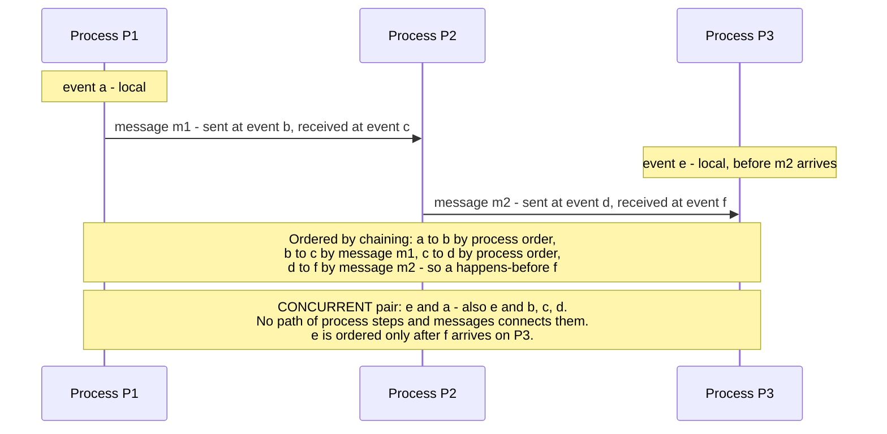
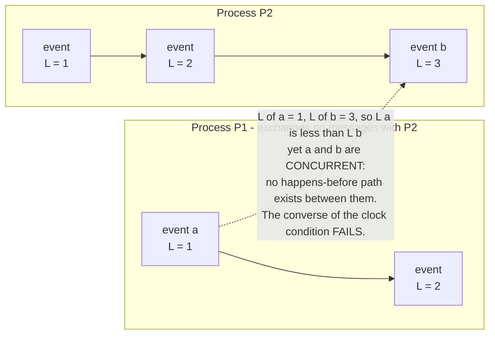
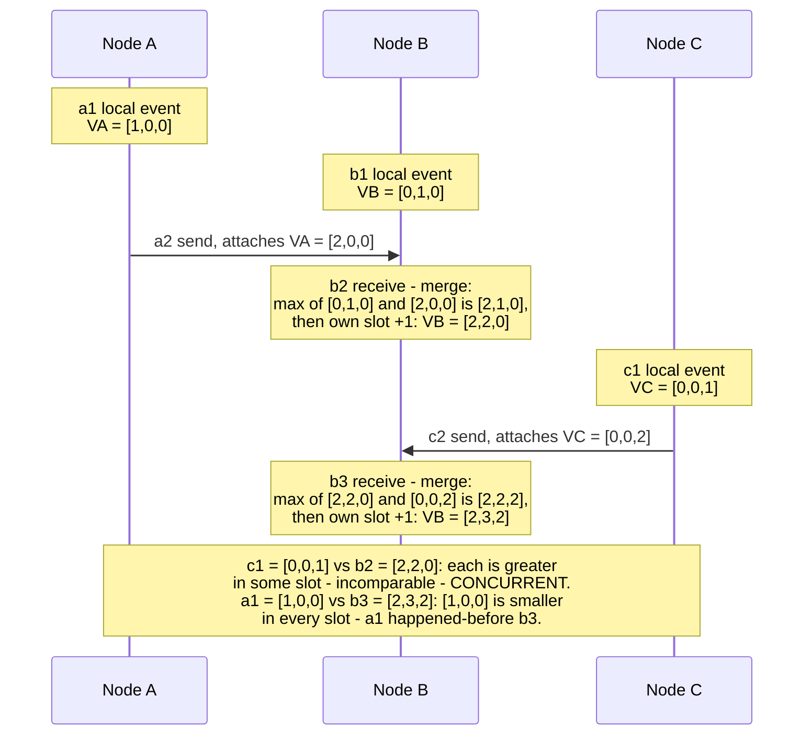
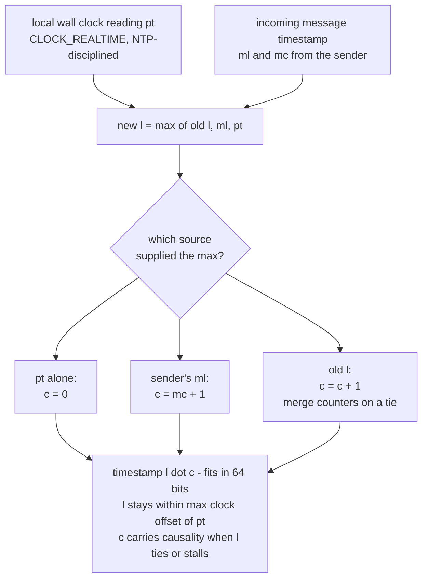
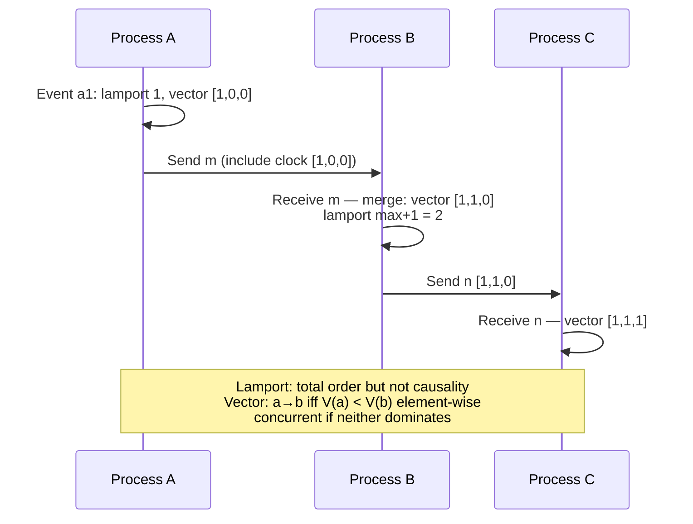
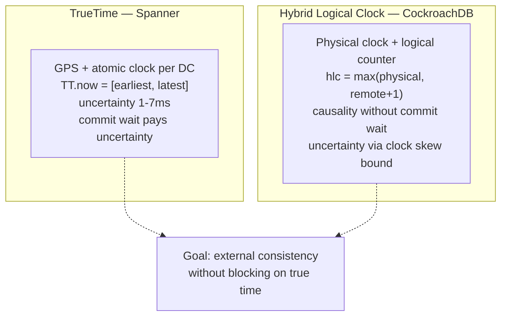
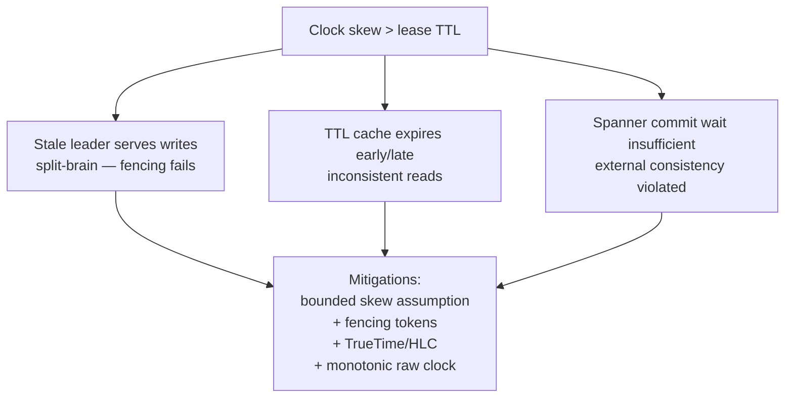

# Chapter 2 — Time, Clocks, and the Ordering of Events

**What this chapter covers.** Chapter 1 established that a distributed system has no shared clock,
and promised that this chapter would explain what can be salvaged. The answer is precise and a
little unsettling: *ordering* can be reconstructed, but *simultaneity* cannot, and physical
timestamps — the thing every engineer reaches for first — are the wrong tool for both. We begin
with the physics and the plumbing: why quartz oscillators drift, what NTP actually guarantees (far
less than assumed), why leap seconds and clock steps make wall time non-monotonic, and why the
distinction between `CLOCK_REALTIME` and `CLOCK_MONOTONIC` is not pedantry but the difference
between a working system and Cloudflare's 2017 New Year's Day outage. We then rebuild ordering
from first principles using Lamport's 1978 happens-before relation — the same relation, literally,
that Volume 4, Chapter 3 used for memory models — and the machinery erected on it: Lamport clocks,
vector clocks, and hybrid logical clocks, each with its exact guarantee and its exact failure to
guarantee. TrueTime appears briefly as the engineered endpoint of the spectrum. We close with the
practical patterns — leases, timeouts, fencing tokens, log ordering, causal metadata — and a
synthesis section mapping how every later chapter of this volume consumes what this one builds.

Learning goals — after this chapter you should be able to:

- Do the ppm arithmetic for quartz drift, state what NTP does and does not guarantee, and explain
  stepping versus slewing, asymmetric-path error, and leap-second smearing accurately.
- State the cardinal rule — never measure a duration with a wall clock — and name the bug classes
  (negative durations, mis-expired leases) that violating it produces, with the Cloudflare
  leap-second incident as the canonical case.
- Explain why timestamps cannot order events across nodes, and why last-write-wins conflict
  resolution silently loses data under skew.
- Define happens-before rigorously — program order, send-to-receive, transitivity — and explain
  why it is a partial order and what "concurrent" means, connecting it to the identical relation
  in the Java Memory Model.
- Implement Lamport clocks and state their one-way guarantee and its converse failure; implement
  vector clocks and state their two-way guarantee; distinguish version vectors from vector clocks.
- Describe the hybrid logical clock construction, what it provides, and what it cannot provide
  without TrueTime-class hardware.
- Apply the practical patterns: monotonic-clock timeouts, drift-aware leases backstopped by
  fencing tokens, sequence numbers over timestamps in logs, and causal metadata propagation.

## Physical time: what your clock actually is

Every server keeps time with a quartz crystal oscillator: a sliver of quartz that resonates at a
nominal frequency when voltage is applied, feeding a counter. The crystal is cheap, and its actual
frequency differs from nominal by an amount specified in **parts per million**. Commodity server
crystals are typically specified in the range of tens of ppm, and the error moves with
temperature, age, and manufacturing variance.

The arithmetic is worth internalizing because it converts a vague "clocks drift" into numbers you
can design against. One ppm is one microsecond of error per second, which is 86.4 milliseconds per
day. A 50 ppm crystal therefore drifts up to **4.3 seconds per day**, or roughly two minutes per
month, if left undisciplined. Two nodes drifting in opposite directions at 50 ppm diverge from
*each other* at 100 ppm — 8.6 seconds per day. An undisciplined fleet does not have "roughly the
same time"; it has fifty opinions diverging at meters-per-second scale, and any code that compares
timestamps across nodes is comparing those opinions.

Drift rate itself is not constant. Temperature is the dominant factor — a server under load runs
hotter than an idle one, and its clock drifts differently — which is why you cannot measure a
node's drift once and correct for it forever. This matters later: lease safety arguments assume a
*bound* on drift rate, and the bound must hold across the operating envelope, not just at the
temperature you measured.

### NTP: what it guarantees, and what it merely attempts

The Network Time Protocol disciplines these oscillators against reference clocks. A client
exchanges timestamped packets with a server, measures the round-trip, and estimates its offset
under one crucial assumption: **that the network path is symmetric** — that the outbound delay
equals the return delay. NTP has no way to verify this. The theoretical error bound of a single
measurement is half the round-trip time; the *undetectable* error is half the path asymmetry. If
the outbound path takes 10 ms and the return takes 30 ms — entirely plausible with asymmetric
routing, one congested direction, or asymmetric last-mile links — the offset estimate is wrong by
10 ms and NTP cannot know it. Filtering across many samples and servers reduces noise, not
systematic asymmetry.

The practical numbers: a well-run deployment syncing against nearby stratum-1/2 servers on a LAN
typically holds offsets under a millisecond; over the public internet, single-digit to tens of
milliseconds is normal; a misconfigured or partitioned node can be off by seconds or worse,
silently. NTP is a best-effort discipline loop, not a bounded-error service. Nothing in the
protocol tells an application "your clock is currently within ε of true time" with a guaranteed ε
— that absence is exactly the gap TrueTime was engineered to fill, and we return to it.

How the correction is applied matters as much as its size:

- **Slewing.** For small offsets, the daemon adjusts the clock's *rate* — running it slightly fast
  or slow until the error is absorbed. Time remains monotonic; it just flows at up to a few
  hundred ppm off nominal. Classic `ntpd` slews at most 500 ppm, so absorbing a single second of
  error takes about 33 minutes.
- **Stepping.** For larger offsets — `ntpd`'s default threshold is 128 ms — the daemon *sets* the
  clock, discontinuously. The clock jumps, and **it can jump backward**. Every wall-clock reading
  before and after a backward step is a trap for any code computing differences. (`chrony` behaves
  similarly under its `makestep` directive; both daemons will also refuse to act at all above a
  panic threshold — around 1000 s for `ntpd` — on the theory that something is badly wrong.)

So the honest model of a production wall clock is: usually within tens of milliseconds of true
time, with an unknown and unknowable error bound, subject to occasional discontinuous jumps in
either direction. Design accordingly.

### Leap seconds and smearing

UTC is kept within 0.9 s of the Earth's rotation angle by occasionally inserting a **leap
second**: a 61st second, labeled 23:59:60, at the end of June 30 or December 31. POSIX time
cannot represent 23:59:60 — Unix timestamps pretend leap seconds do not exist — so at insertion,
systems must either repeat a second (the kernel steps the clock back, and wall time visits the
same timestamps twice) or otherwise fudge. This is the one scheduled event where wall clocks on
correctly configured machines go backward by design.

The mitigation most large operators adopted is **leap smearing**: instead of inserting the second
discontinuously, the time service lies smoothly. Google's public NTP service (time.google.com)
applies a linear smear over the 24 hours centered on the leap second — noon to noon UTC — making
each second about 11.6 ppm longer, so the extra second is absorbed with no discontinuity and no
23:59:60. (Google's first smear in 2011 used a cosine-shaped adjustment over a window before the
leap; the 24-hour linear smear became their standard afterward.) AWS's Time Sync Service smears
similarly. Smearing trades a discontinuity for a deliberate error of up to 0.5 s against true UTC
during the window — and creates a new hazard: **smeared and non-smeared sources must never be
mixed** in one fleet, or nodes will disagree by up to a second while each is faithfully following
its upstream. Note also that the CGPM resolved in 2022 to discontinue leap seconds by or before
2035; until then, they remain a live operational event.

The net of this section: physical time on a real node is a disciplined-but-drifting oscillator,
corrected by a protocol with unverifiable assumptions, subject to steps in both directions, with
a scheduled backward jump every few years unless your time source smears. **Clock skew between
nodes is not an anomaly; it is the steady state.** Everything else in this chapter follows from
taking that seriously.

## Two clocks, one rule

Operating systems expose (at least) two distinct clocks, and conflating them is the single most
common time bug in backend code. On Linux (Volume 2 covers the timekeeping machinery itself):

- **`CLOCK_REALTIME`** — the wall clock. Represents UTC as best the system knows it. Settable by
  the administrator, stepped and slewed by NTP, subject to leap-second handling. Meaningful for
  *timestamps*: "this happened at 2026-08-14T09:00:00Z."
- **`CLOCK_MONOTONIC`** — a clock that only moves forward, measuring time since an arbitrary
  origin (typically boot). It is never stepped. Its *rate* is still gently adjusted by NTP
  slewing — so it is not a perfect frequency standard — but it cannot jump, and two readings can
  always be subtracted safely. Meaningful for *durations*: "12.3 ms elapsed." (Linux also offers
  `CLOCK_BOOTTIME`, which additionally advances across suspend; for servers the distinction
  rarely matters.)

The cardinal rule, worth stating as an absolute because the exceptions are negligible and the
violations are catastrophic:

> **Never measure a duration with the wall clock.** Timeouts, leases, retries, backoff, cache
> TTLs measured locally, rate limiters, latency measurements, profiling — all of these subtract
> two clock readings, and all of them must use the monotonic clock. The wall clock is for
> timestamping events for humans and for cross-referencing with the outside world, nothing else.

The bug class this rule prevents is easy to state. Subtract two wall-clock readings across an NTP
backward step and you get a **negative duration**; across a forward step, a spuriously huge one.
A negative duration fed into a timeout makes it fire instantly or never; fed into a lease-expiry
check, it makes a lease look expired while valid or valid while expired — a node continues acting
as leader after its lease is gone, which is precisely the split-brain scenario leases exist to
prevent (Chapter 1's crashed-versus-slow ambiguity, now self-inflicted); fed into a metrics
pipeline, it produces the negative latencies that ornament many a post-incident graph.

The language APIs make the distinction easy to honor once you know it exists:

```go
// Go — correct: time.Time carries a hidden monotonic reading (since Go 1.9),
// and Sub/Since use it when both operands have one.
start := time.Now()
handleRequest()
elapsed := time.Since(start) // monotonic arithmetic: immune to clock steps

// WRONG: extracting wall-clock values discards the monotonic reading.
t1 := time.Now().UnixMilli()
handleRequest()
d := time.Now().UnixMilli() - t1 // can be negative across an NTP step
_ = d
```

```java
// Java — correct: System.nanoTime is the monotonic clock.
long t0 = System.nanoTime();
handleRequest();
long elapsedNanos = System.nanoTime() - t0;   // safe: monotonic

// WRONG: currentTimeMillis is the wall clock.
long w0 = System.currentTimeMillis();
handleRequest();
long elapsedMs = System.currentTimeMillis() - w0; // can be negative
```

`System.nanoTime()` values are meaningful only as differences within one JVM — the origin is
arbitrary — which is exactly the point: a monotonic reading is not a timestamp and must never be
stored, shipped, or compared across processes.

### The canonical incident: Cloudflare, 1 January 2017

The leap second inserted at the end of 31 December 2016 gave this bug class its textbook example.
At midnight UTC, Cloudflare's authoritative DNS servers began failing for a subset of domains. The
server, RRDNS, is written in Go, and one code path selected among upstream servers using weights
derived from recent performance — computed by subtracting wall-clock readings taken with
`time.Now()`. At the leap second, the machines' wall clocks went backward, the subtraction
produced a **negative duration**, the negative value propagated into the weighting logic, and was
eventually passed to `rand.Int63n`, which panics when its argument is not positive. The panic
killed the resolution path; the visible symptom, per Cloudflare's postmortem, was failed lookups
for a fraction of queries — notably ones requiring CNAME resolution against upstreams — until a
fix was deployed in the following hours.

Two details make this canonical rather than merely embarrassing. First, the arithmetic was
innocent-looking: `now - then` on values from the standard clock API. Nothing in the code *looked*
like it assumed clocks never go backward, yet the assumption was load-bearing. Second, the
language fixed it structurally: Go 1.9 (August 2017) embedded a monotonic reading inside
`time.Time` precisely so that the natural idiom — `time.Since(start)` — became step-immune by
default. That is the correct lesson: durations from wall clocks are a latent bug that fires on
the rare backward step, and the fix belongs in the API layer where it cannot be forgotten, not in
each call site's discipline.

## Why timestamps cannot order events

Now the deeper problem — not that clocks misbehave occasionally, but that even well-behaved
clocks cannot do the job people assign them: establishing *which of two events on different nodes
happened first*.

The argument is a two-line inequality. Ordering two events by timestamp is valid only if the
inter-node clock skew is smaller than the interval between the events. Real skew under healthy
NTP is milliseconds to tens of milliseconds. Real systems generate causally related events —
request and response, write and dependent write — microseconds to a few milliseconds apart. The
skew exceeds the spacing, routinely, by orders of magnitude. So for exactly the events you most
need to order — close-together ones, the ones contending for the same key — timestamp order is
noise. Node A stamps a write at 10:00:00.005, node B stamps a *later* (causally later — it read
A's write first) write at 10:00:00.003 because B's clock runs 4 ms behind. Sorted by timestamp,
the effect precedes its cause.

This stops being philosophical the moment a system resolves conflicts by timestamp.
**Last-write-wins** replication — Cassandra's cell-level conflict resolution is the prominent
example, covered in Volume 5, Chapter 11 — keeps, of two concurrent writes to the same key,
whichever bears the larger timestamp, and silently discards the other. Under skew, "larger
timestamp" and "later" part company: a client's genuinely newer write loses to an older one
stamped by a fast clock. The update is not rejected, not logged, not conflicted — it is simply
gone, and the anti-entropy machinery will helpfully propagate the wrong survivor everywhere. This
is our running key-value store's first real design decision: when two replicas accept writes to
the same key, *something* must decide, and deciding by wall clock means deciding by whose
oscillator runs fast. The honest alternatives are to detect concurrency explicitly and keep both
(version vectors, below, and Chapter 7's Dynamo lineage) or to make concurrency harmless by
construction (Chapter 11's CRDTs).

If physical time cannot order events, what can? Lamport's 1978 answer: stop asking clocks, and
read the order off the communication structure of the system itself.

## Happens-before: causality without clocks

Lamport's observation is that in a distributed system there are exactly two ways one event can
influence another: they occur in the same process, one after the other; or one is the sending of
a message and the other is (or follows) its receipt. Everything else is chaining. Formally, the
**happens-before** relation `→` is the smallest relation on events such that:

1. **Process order.** If `a` and `b` occur in the same process and `a` precedes `b`, then `a → b`.
2. **Message order.** If `a` is the sending of a message and `b` is the receipt of that same
   message, then `a → b`.
3. **Transitivity.** If `a → b` and `b → c`, then `a → c`.

If neither `a → b` nor `b → a`, then `a` and `b` are **concurrent**, written `a ∥ b`. Concurrency
here is not about wall-clock overlap; it means *no causal path* connects the events — no chain of
process steps and messages by which one could have influenced the other. Two events years apart
on nodes that never communicated are concurrent in this sense, and that is the right call: for
consistency purposes, unrelated is unordered.

This makes `→` a **partial order** — irreflexive, transitive, and crucially *not total*. Most
pairs of events in a large system are simply incomparable, and the entire discipline of this
chapter is refusing to invent an order where none exists. If you worked through Volume 4,
Chapter 3, you have seen this relation before — not an analogue of it, the relation itself. The
Java Memory Model's happens-before is Lamport's definition with "message send/receive" replaced
by "volatile write/read" and "unlock/lock," and JSR-133 says so. Learned once, it applies twice:
a volatile write publishing prior plain writes and a message send carrying prior state are the
same edge in the same partial order, one across threads, one across machines.



The relation answers the ordering question exactly where it can be answered and refuses where it
cannot. What it does not yet give us is anything a program can *compute with*: `→` is defined
over the global execution, which no node sees. The rest of the chapter is about mechanisms that
let nodes carry enough local state to answer questions about `→` — each mechanism trading size
and complexity for how much of the relation it captures.

## Lamport clocks: timestamps consistent with causality

The first mechanism is almost embarrassingly small. Each process keeps a single integer counter
`L`, and:

- Before each local event, increment `L`; the event's timestamp is the new value.
- On sending a message, increment `L` and attach it to the message.
- On receiving a message carrying timestamp `t`, set `L = max(L, t) + 1`; that is the receive
  event's timestamp.

```python
class LamportClock:
    def __init__(self):
        self.t = 0

    def local_event(self):
        self.t += 1
        return self.t

    def send(self):
        self.t += 1
        return self.t              # attach this value to the outgoing message

    def receive(self, msg_t):
        self.t = max(self.t, msg_t) + 1
        return self.t
```

The `max` on receive is the whole trick: it drags a lagging receiver's counter forward past the
sender's, so every message edge — and by induction every happens-before chain — strictly
increases the timestamp. That yields the **clock condition**:

> If `a → b`, then `L(a) < L(b)`.

And now the part that generates production bugs when missed: **the converse is false.**
`L(a) < L(b)` does *not* imply `a → b`. Two concurrent events on nodes that have never exchanged
messages get whatever counter values their local histories produced; one will be numerically
smaller, and the comparison means nothing. A Lamport timestamp compresses a partial order into a
single integer, and the compression is lossy in exactly one direction: it can *confirm* an
ordering it was told about, but it **cannot detect concurrency** — given two timestamps, you
cannot distinguish "a caused b" from "unrelated." Any design that reads causality out of Lamport
timestamp comparisons is broken by construction.



What Lamport clocks *are* good for is manufacturing a **total order consistent with causality**.
Break ties between equal timestamps by process ID — order events by the pair `(L, pid)` — and
every node that sees the same set of events sorts them identically, with the sort never
contradicting `→`. The order is partly arbitrary (it orders concurrent events too, by fiat), but
it is *agreed*, and an agreed total order is the raw material of state machine replication:
deliver the same operations in the same order everywhere and replicas stay identical. Lamport's
own paper demonstrates this with a distributed mutual-exclusion algorithm — requests served in
`(L, pid)` order, every node maintaining the same request queue with no central lock server.
Total-order broadcast, and the term and ballot numbers of Chapters 5 and 6, are this idea
industrialized; hold that thought for the synthesis section.

## Vector clocks: capturing the whole relation

To detect concurrency, one counter is provably insufficient — the mechanism must record *whose*
history an event has absorbed, per process. That is a **vector clock**, developed independently
by Fidge and by Mattern in 1988–89. In a system of `N` processes, each process `i` keeps a vector
`V` of `N` counters, where `V[j]` means "the number of events of process `j` that this process
has heard of":

- On a local event or send, increment your own slot `V[i]`; a send attaches a copy of the whole
  vector.
- On receive, merge: take the **element-wise max** of your vector and the message's, then
  increment your own slot (the receipt is itself an event).

```python
class VectorClock:
    def __init__(self, n, i):
        self.v = [0] * n           # one slot per process
        self.i = i                 # this process's own index

    def local_event(self):
        self.v[self.i] += 1

    def send(self):
        self.v[self.i] += 1
        return list(self.v)        # attach a copy to the message

    def receive(self, msg_v):
        self.v = [max(a, b) for a, b in zip(self.v, msg_v)]
        self.v[self.i] += 1

def leq(a, b):                     # every component of a is <= that of b
    return all(x <= y for x, y in zip(a, b))

def happened_before(a, b):         # a -> b
    return leq(a, b) and a != b

def concurrent(a, b):
    return not leq(a, b) and not leq(b, a)
```

Compare vectors component-wise: `VC(a) < VC(b)` iff every component of `VC(a)` is ≤ the
corresponding component of `VC(b)` and at least one is strictly less. The guarantee is now an
**if and only if**:

> `VC(a) < VC(b)` ⟺ `a → b`, and the vectors are incomparable — each strictly greater than
> the other in some slot — ⟺ `a ∥ b`.

The vector clock *characterizes* happens-before: the partial order on events is exactly mirrored
by the partial order on vectors. Given two timestamps and nothing else, you can answer "did one
cause the other, or are they concurrent?" — the question Lamport clocks cannot.

A worked example with three nodes:



Walk the two comparisons. `c1 = [0,0,1]` versus `b2 = [2,2,0]`: `c1` is greater in slot C, `b2`
greater in slots A and B — incomparable, therefore concurrent, which is right: no message
connected C to B before `b2`. After `b3` merges C's vector, `b3 = [2,3,2]` dominates `c1` — and
indeed `c1 → c2 → b3` via the message. The mechanism detected exactly what the communication
structure created, nothing more.

### Version vectors: the same mathematics, a different question

A near-identical structure appears in replicated storage under the name **version vector**, and
the two are worth distinguishing because the literature (and more than one codebase) confuses
them. A vector clock timestamps *every event* in a computation, one slot per process. A version
vector tracks the state of *one replicated object*, one slot per replica, incremented only when
that replica *writes* the object. The comparison rule is the same element-wise partial order, but
the question answered is "does this copy of the object subsume that one, or did they diverge?" —
per-key causality, not whole-system causality.

This is the Dynamo lineage (Chapter 7 covers the full design): each object carries a version
vector; a replica accepting a write increments its slot; when a read finds copies with
incomparable vectors, the store has detected **concurrent writes** and surfaces both as
**siblings** for the application (or a merge function) to reconcile, rather than silently picking
one. Contrast that directly with last-write-wins: same situation, but LWW consults the wall clock
and destroys a branch; version vectors consult causality and preserve both. Chapter 11's CRDTs
complete the arc by making the merge automatic and principled.

### The costs

The two-way guarantee is bought with real costs, and they bound where vector clocks are usable:

- **O(N) size.** Every message and every stored version carries a vector with one slot per
  participant. Tolerable for five replicas; painful for thousands of clients.
- **Actor churn.** Slots are per-actor, and actors come and go. If *clients* get slots — as early
  Dynamo-style designs did, to correctly attribute writes — the vector grows with every client
  that ever touched the key. Riak's history documents this pressure and the move to server-side
  IDs plus **dotted version vectors**, which pin down precisely which write each slot's counter
  refers to and keep vectors sized by replica count.
- **Pruning hazards.** The tempting fix — cap the vector and evict old entries, as Dynamo did at
  ten entries — is not free: discarding a slot discards causal history, and two versions that
  were genuinely ordered can afterward appear concurrent, resurfacing conflicts the system had
  already resolved. Pruning trades bounded metadata for false concurrency; do it knowingly or
  not at all.

## Hybrid logical clocks: causality at wall-clock scale

Lamport and vector clocks share a practical annoyance: their timestamps mean nothing to humans or
to anything outside the system. You cannot look at Lamport time 4,182,331 and know it was last
Tuesday, cannot correlate it with logs, cannot use it in a `WHERE` clause a DBA would recognize.
Physical timestamps have meaning but violate causality; logical timestamps honor causality but
have no meaning. The **hybrid logical clock** (Kulkarni, Demirbas, et al., 2014) is the
construction that gets both: timestamps that respect happens-before *and* stay provably close to
physical time.

An HLC timestamp is a pair `(l, c)`: `l` is the largest *physical* clock reading the node has
encountered — its own or any message sender's — and `c` is a logical counter that breaks ties
when causally related events would otherwise share an `l`. The update rules are a Lamport clock
wearing physical time:

```go
type HLC struct {
    mu sync.Mutex
    l  int64 // max physical time seen so far (e.g., nanoseconds)
    c  int32 // logical counter, tie-break within one value of l
}

// Now: timestamp a local or send event. pt is the wall clock, e.g.
// time.Now() truncated to the chosen resolution.
func (h *HLC) Now(pt int64) (int64, int32) {
    h.mu.Lock()
    defer h.mu.Unlock()
    if pt > h.l {
        h.l, h.c = pt, 0 // physical time moved past us: adopt it, reset c
    } else {
        h.c++ // physical time stalled or behind: advance logically
    }
    return h.l, h.c
}

// Update: timestamp a receive event carrying the sender's (ml, mc).
func (h *HLC) Update(pt, ml int64, mc int32) (int64, int32) {
    h.mu.Lock()
    defer h.mu.Unlock()
    switch {
    case pt > h.l && pt > ml: // wall clock beats everything
        h.l, h.c = pt, 0
    case ml > h.l: // sender's l is the max: adopt it, go past its c
        h.l, h.c = ml, mc+1
    case h.l > ml: // our l is the max: keep it, bump c
        h.c++
    default: // h.l == ml: merge the counters
        if mc > h.c {
            h.c = mc
        }
        h.c++
    }
    return h.l, h.c
}
```

Compare timestamps lexicographically: `(l, c)` pairs ordered by `l` first, then `c`. The
properties, from the paper:

- **Causality, one-way.** If `e → f` then `hlc(e) < hlc(f)` — the Lamport clock condition,
  inherited by the same argument. (And with the same converse failure: HLCs, like Lamport clocks,
  cannot detect concurrency. They order; they do not diagnose.)
- **Bounded divergence from physical time.** `l ≥ pt` always, and `l − pt` is bounded by the
  maximum clock offset among communicating nodes: `l` can only run ahead of the local wall clock
  by adopting some other node's wall clock reading. The counter `c` is bounded too. So an HLC
  reads as "wall time, possibly a hair fast, plus a small tie-break" — close enough to real time
  for TTLs, log correlation, and human forensics.
- **One machine word.** Because `c` is small, the pair packs into 64 bits — the paper's scheme
  rounds the low-order bits of a 64-bit timestamp and stores `c` there — so an HLC drops into any
  schema, API, or protocol field designed for a plain timestamp. Monotone, causal, and
  wire-compatible with `int64` time: that is the entire sales pitch.



This is why HLCs are the workhorse of modern distributed databases — CockroachDB's transaction
timestamps and MongoDB's cluster time are HLCs, and Volume 5, Chapter 12 covered how CockroachDB
builds MVCC and its uncertainty-interval reads on top of them; the database mechanics stay there.
What matters here is the foundational boundary: **an HLC guarantees that causally related events
are correctly ordered, but says nothing about causally *unrelated* ones.** If client 1 commits at
node A, phones client 2 out of band, and client 2 then writes at node B — no message between A
and B — the HLCs may order the second write before the first, because out-of-band causality never
touched the clock. Closing that hole means bounding real clock error and *waiting out the bound*,
which is not an algorithm but a hardware-and-operations commitment.

## TrueTime: buying the bound

That commitment is Google's **TrueTime**, the other endpoint of the spectrum, presented with
Spanner in 2012 (and applied to transactions in Volume 5, Chapter 12 — foundations only here).
TrueTime changes the API: instead of a scalar, `TT.now()` returns an **interval**
`[earliest, latest]` guaranteed to contain true time. The guarantee is manufactured, not assumed:
GPS receivers and atomic clocks in every datacenter, redundant time masters cross-checking one
another, and per-machine daemons that compute the uncertainty ε from measured round-trips and
worst-case drift since last sync. The paper reports ε typically ranging up to about 7 ms,
sawtoothing as clocks are re-disciplined.

The interval enables **commit wait**: a transaction takes its commit timestamp `s` at the top of
its interval, then deliberately waits until `TT.now().earliest > s` before making the commit
visible. After the wait, `s` is unambiguously in the past on *every* node's clock, so any
transaction that starts afterward — anywhere, related by messages or not — gets a strictly larger
timestamp. That is **external consistency**: timestamp order matches real-time order even for the
out-of-band case that defeats HLCs. The price is explicit — commit latency of roughly ε on every
write, plus the clock infrastructure — and the design lesson is symmetrical: Spanner pays
milliseconds and hardware to make wall time trustworthy; HLC systems pay uncertainty handling and
weaker guarantees to avoid the hardware. There is no third option in which ordinary NTP-grade
clocks provide external consistency; a bound you did not engineer is a bound you do not have.

## Practical patterns

The theory compresses into a short list of habits that distinguish systems that survive clock
trouble from systems that discover it in production.

**Leases are clock-rate bets; fence them.** A lease — "you are the leader for the next 10
seconds" — is the workhorse liveness tool from Chapter 1, and it is built entirely on clock
assumptions: the grantor and holder measure the same 10 seconds only if both clocks run at
approximately the correct *rate*. Bounded drift makes the rate bet reasonable (100 ppm across a
10 s lease is 1 ms of error — absorbable with a small safety margin subtracted from the holder's
view). But the bet is only sound if both sides measure with monotonic clocks — a wall-clock step
can stretch or collapse the holder's view of its own lease arbitrarily — and even then it can be
lost outright: a GC pause, a VM migration, or an I/O stall can suspend the holder past expiry
with the holder none the wiser, exactly the crashed-versus-slow ambiguity again. So the lease
must be backstopped by causality rather than time: a **fencing token**, a counter that increases
with each lease grant, carried on every operation and checked by the resource, so a stale
holder's writes are rejected no matter what its clock believes (the pattern Volume 4, Chapter 2
introduced alongside locks, and Chapter 8 shows implemented with ZooKeeper's zxid and etcd's
revision numbers — both of which are, notice, Lamport-style logical counters). Time grants the
lease; causality revokes it.

**Timeout hygiene.** Every timeout, deadline, retry budget, and backoff computation uses the
monotonic clock — which in practice means using your language's duration-native APIs
(`time.Since`, `context.WithTimeout`, `System.nanoTime`, deadline objects) and never storing "the
wall time at which this expires" for local arithmetic. Audit for calls that serialize a wall-clock
expiry into a struct and compare it against `now` later; each one is a Cloudflare waiting for a
step.

**Timestamp columns, honestly.** `created_at` columns and audit logs should carry
server-assigned wall-clock timestamps — client clocks are not evidence — and consumers must treat
them as approximate and skew-bearing: fine for humans, for retention policies, and for
correlating with the outside world; not valid as an ordering key between rows written by
different nodes, and never as a uniqueness or concurrency-control mechanism. If ordering matters,
store an explicit sequence.

**In logs and streams, sequence numbers beat timestamps.** A partitioned log's real ordering
contract is the per-partition sequence — Kafka's offsets — assigned by the single broker that
owns the partition: a genuine total order within the partition, no clocks involved, and
deliberately no order across partitions. Event-time timestamps ride along as payload for
windowing and analytics (Volume 10 treats watermarks and lateness), but consumers that need "what
order did these happen" must read offsets, not timestamps. The same rule generalizes: whenever a
single writer exists, a plain sequence number is the cheapest and strongest ordering primitive
available — which is much of why systems go to such lengths (Chapters 5 and 6) to elect one.

**Propagate causal metadata explicitly.** Causality only orders what the metadata path records,
so real systems thread tokens through their calls: session tokens that encode "reads must observe
at least this state" (the session guarantees of Chapter 3 — MongoDB's causal-consistency sessions
carry an HLC value in exactly this role), and distributed-tracing context — the W3C
`traceparent` header with its trace and parent-span IDs — which is happens-before plumbing in
production dress: each span records its causal parent, and the assembled trace is a fragment of
the happens-before DAG rendered as a flame graph (Volume 11, Chapter 4). If a causal dependency
crosses a channel that carries no metadata — a phone call, a human swivel-chairing between two
UIs — no clock in this chapter sees it; only TrueTime-class bounds cover out-of-band causality.

## Synthesis: how the rest of the volume consumes this chapter

This chapter is infrastructure for every one that follows; it is worth being explicit about the
load each puts on it.

**Chapter 3 — Replication and Consistency Models** needs a definition of "afterness" before it
can define anything. Linearizability's whole content is that operations respect *real-time*
order — if operation A completes before operation B begins, B must observe A — which quietly
assumes an observer for whom "completes before" is meaningful; the formal definitions use an
idealized global time precisely because, as this chapter showed, no node has one. Causal
consistency, one rung down, is this chapter's `→` promoted to a consistency model: replicas must
agree on the order of causally related writes and are free to disagree on concurrent ones.
The ladder of consistency models is largely a ladder of how much ordering you demand.

**Chapters 5 and 6 — Paxos and Raft** — replace clocks with counters, and the counters are
Lamport clocks. A Paxos ballot number and a Raft term are logical values that only move forward,
carried on every message, with every receiver updating to the max it has seen and rejecting
messages from the past — reread the Lamport clock rules and you will recognize every clause.
Consensus is what you use when you need the *agreed total order* that Lamport timestamps sketch
but cannot make fault-tolerant on their own; where the protocols do touch physical time (Raft's
randomized election timeouts, leader leases for local reads), they inherit exactly the drift and
monotonicity caveats of this chapter.

**Chapter 7 — Quorums and Dynamo-style replication** puts version vectors to work: sibling
detection on read, read-repair deciding which copies subsume which, and the pruning trade-offs
above become operational decisions with data-loss consequences.

**Chapter 10 — Failure detection** is built on timeouts, and a timeout is a clock assumption
wearing a trench coat: "no heartbeat for T seconds" presumes the detector's T seconds bear some
relation to the peer's. Every accuracy/completeness trade-off in failure detectors is the
crashed-versus-slow ambiguity of Chapter 1 measured with the imperfect clocks of Chapter 2.

**Chapter 11 — CRDTs** takes the most radical position: abandon ordering questions wherever
possible by making the data types commutative, so concurrent updates merge to the same state in
any order. The mathematics is the partial-order toolkit of this chapter — CRDT state forms a
lattice whose join is a generalized "element-wise max," and vector-clock merge is itself the
canonical example of one.

And the tie back inward: Volume 4, Chapter 3's table mapped store buffers to replication lag and
volatile edges to message edges. You can now read that mapping with full precision — a volatile
write/read pair and a message send/receive pair are the same happens-before edge; a replica that
has not yet applied a write is a store buffer that has not yet drained; and DRF-SC's bargain
("order everything through proper edges and you may think sequentially") reappears here as the
choice among consistency models. One relation, learned once, load-bearing in both worlds.

## Key takeaways

- **Clock skew is the steady state.** Quartz drifts at tens of ppm — 50 ppm is 4.3 s/day — and
  NTP disciplines it to maybe milliseconds-to-tens-of-milliseconds with *no guaranteed bound*:
  path asymmetry is undetectable, and corrections arrive as rate slews or as discontinuous steps
  that can move the clock backward. Leap seconds add a scheduled backward step unless your time
  source smears; never mix smeared and non-smeared sources.
- **Never measure durations with the wall clock.** Timeouts, leases, backoff, profiling — all use
  `CLOCK_MONOTONIC` (`time.Since`, `System.nanoTime`). The failure class is negative or wildly
  wrong durations at clock steps; Cloudflare's 2017 outage — a leap-second backward step producing
  a negative Go duration that panicked `rand.Int63n` — is the canonical instance, and Go 1.9's
  monotonic `time.Time` is the structural fix.
- **Timestamps cannot order events across nodes** when skew exceeds event spacing, which it does
  for exactly the events that contend. Last-write-wins resolution converts that into silent data
  loss: the causally newer write can lose to the faster clock.
- **Happens-before** — process order plus send-to-receive plus transitivity — is a *partial*
  order; unordered pairs are *concurrent*, meaning no causal path exists. It is literally the
  JMM's relation from Volume 4, Chapter 3, one layer up.
- **Lamport clocks** guarantee `a → b ⟹ L(a) < L(b)` in one integer — but the converse fails:
  they cannot detect concurrency. With a node-ID tie-break they yield an agreed total order
  consistent with causality — the seed of total-order broadcast and of consensus terms/ballots.
- **Vector clocks** capture the relation exactly — `VC(a) < VC(b) ⟺ a → b`, incomparable ⟺
  concurrent — at O(N) cost per message, with actor churn and pruning as the operational hazards.
  **Version vectors** apply the same math per replicated object for sibling detection.
- **HLCs** fuse a Lamport clock with physical time: causally monotone, provably close to the wall
  clock, one 64-bit word — but one-way like Lamport clocks, and no external consistency for
  out-of-band causality. That requires **TrueTime**: an engineered uncertainty interval plus
  commit-wait, paying ε of latency and real hardware for the bound.
- **Practical defaults:** leases assume bounded drift and monotonic measurement, and must be
  fenced with tokens (causality) anyway; server-assigned timestamps are for humans, sequence
  numbers are for ordering; per-partition sequence is the real contract of a log; propagate
  causal tokens (sessions, `traceparent`) because clocks cannot see causality they were never
  told about.








## Further reading

- Lamport, L., "Time, Clocks, and the Ordering of Events in a Distributed System," *CACM* 21(7),
  1978 — the happens-before relation, logical clocks, and the mutual-exclusion example; arguably
  the most influential paper in distributed systems. https://dl.acm.org/doi/10.1145/359545.359563
- Fidge, C., "Timestamps in Message-Passing Systems That Preserve the Partial Ordering," *Proc.
  11th Australian Computer Science Conference*, 1988 — vector clocks, one of the two independent
  inventions.
- Mattern, F., "Virtual Time and Global States of Distributed Systems," *Parallel and Distributed
  Algorithms*, 1989 — the other, with the global-snapshot connection.
- Kulkarni, S., Demirbas, M., Madappa, D., Avva, B., and Leone, M., "Logical Physical Clocks and
  Consistent Snapshots in Globally Distributed Databases" (Hybrid Logical Clocks), *OPODIS*,
  2014 — the HLC construction, bounds, and 64-bit encoding.
  https://cse.buffalo.edu/tech-reports/2014-04.pdf
- Corbett, J. et al., "Spanner: Google's Globally-Distributed Database," *OSDI*, 2012 — TrueTime,
  commit wait, and external consistency.
  https://research.google/pubs/spanner-googles-globally-distributed-database/
- Graham-Cumming, J., "How and why the leap second affected Cloudflare DNS," Cloudflare blog,
  January 2017 — the canonical wall-clock-duration postmortem.
  https://blog.cloudflare.com/how-and-why-the-leap-second-affected-cloudflare-dns/
- Google, "Leap Smear" — https://developers.google.com/time/smear — the 24-hour linear smear
  used by time.google.com, with the history of the earlier cosine smear.
- Kleppmann, M., "How to do distributed locking," 2016 —
  https://martin.kleppmann.com/2016/02/08/how-to-do-distributed-locking.html — the fencing-token
  argument in full, including why clock assumptions alone cannot make locks safe.
- Preguiça, N., Baquero, C., et al., "Dotted Version Vectors: Logical Clocks for Optimistic
  Replication," 2010 — the fix for actor-churn growth in version vectors.
- *The Go Time Package* — https://pkg.go.dev/time — the documented wall/monotonic dual
  representation added in Go 1.9.
- Volume 4, Chapter 3 — Memory Models and Happens-Before — the same relation inside one process.
- Volume 5, Chapters 11 and 12 — Cassandra's LWW mechanics, and Spanner/CockroachDB's use of
  TrueTime and HLCs in transaction processing.
