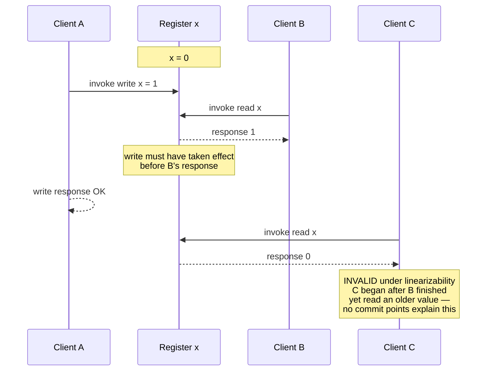
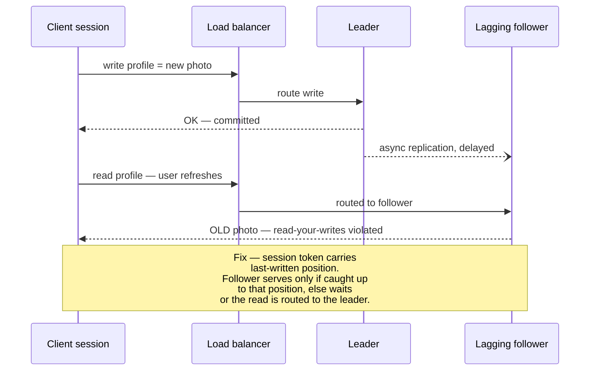
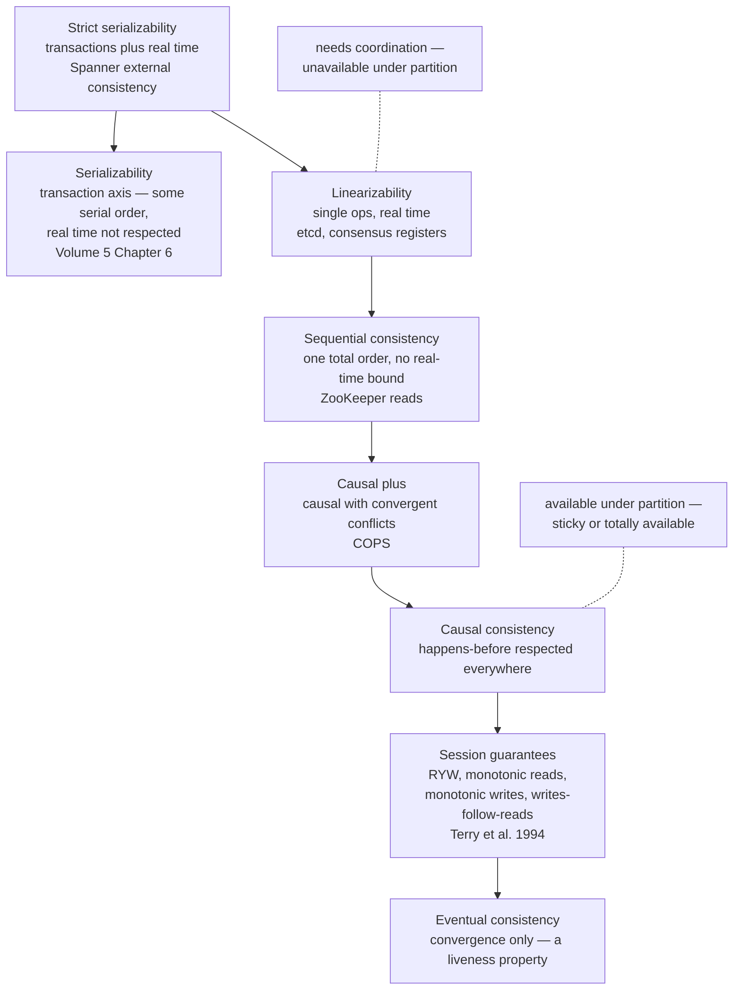
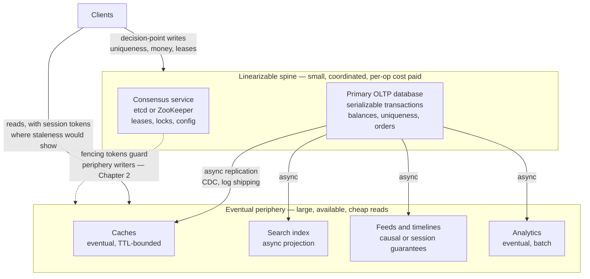

# Chapter 3 — Replication and Consistency Models

**What this chapter covers.** Volume 5, Chapter 8 — Replication covered the machinery: leaders and
followers, replication logs, synchronous versus asynchronous propagation, failover. This chapter is
about what that machinery *promises*. A consistency model is a contract between a replicated data
system and its clients, stated as a constraint on the histories of operations the system may
produce. Every replicated store implements some model, whether its documentation names it or not,
and every anomaly your users report — the comment that appears before the post it replies to, the
profile edit that vanishes on refresh, the counter that goes backwards — is the visible shape of a
contract weaker than the one your code silently assumed.

This chapter also closes a promise made in Volume 4, Chapter 3 — Memory Models and Happens-Before.
That chapter ended by claiming that memory consistency and distributed consistency are the same
design space, one layer apart. Here we cash that claim in full: sequential consistency reappears
verbatim, happens-before returns as causal consistency, the store buffer returns as replica lag,
and the DRF-SC bargain returns as the linearizable-spine architecture. If you worked through that
chapter, most of the intuitions here will feel like recognition rather than learning.

Learning goals — after this chapter you should be able to:

- Define a consistency model precisely, as a predicate over operation histories, and judge concrete
  read/write histories valid or invalid under a given model.
- State linearizability exactly (Herlihy & Wing), explain why composability makes it the gold
  standard, name what provides it, and price its coordination costs.
- Distinguish linearizability from serializability without hand-waving, and define strict
  serializability as their conjunction.
- Define sequential consistency, causal consistency, and the four session guarantees of Terry et
  al., each with the specific anomaly it forbids.
- Explain why causal consistency is the strongest model available under partition, and how vector
  clocks and dependency tracking implement it.
- Describe eventual consistency honestly — as a liveness property, not an ordering guarantee — and
  enumerate what applications must then handle themselves.
- Assemble the model lattice, place the transaction-isolation axis orthogonally to it, and read the
  Jepsen consistency map.
- Audit a real product's consistency claim: find the precise statement, identify its scope, and
  know how to test it.
- Choose models invariant-first, and design linearizable-spine / eventual-periphery systems.

## A consistency model is a contract over histories

Strip away the implementation and a replicated data system is an object — a key-value map, a
register, a queue — that many clients invoke operations on. Each operation is not a point in time
but an **interval**: it has an *invocation* (the client sends the request) and a *response* (the
client receives the result), with real time passing between them. A **history** is the record of
all invocations and responses across all clients. Two operations are **concurrent** if their
intervals overlap; otherwise one *precedes* the other in real time.

A **consistency model is a predicate on histories**: it partitions all conceivable histories into
those the system is permitted to produce and those it is not. "Strong" models admit few histories
and therefore forbid many anomalies; "weak" models admit many histories, including surprising ones.
This framing is exactly the one Volume 4, Chapter 3 used for memory models — there the operations
were loads and stores by threads against shared memory, here they are reads and writes by clients
against replicated storage — and it is the right framing because it separates the *contract* from
the *mechanism*. Volume 5, Chapter 8 showed that the same contract can be implemented by very
different machinery, and the same machinery, misconfigured, can silently deliver a much weaker
contract than intended.

Throughout this chapter we use a single register `x`, initially 0, and histories drawn as
intervals. This is not a toy simplification: registers are the standard object for defining these
models, and the definitions lift to maps and richer objects directly.

```text
Client A:  |------- write(x, 1) -------|
Client B:            |--- read(x) → ? ---|
Client C:                                    |--- read(x) → ? ---|
           ─────────────────────────────────────────────────────→ real time
```

B is concurrent with A's write; C begins after both A and B have completed. What values may B and C
legally return? The answer depends entirely on the model, and working through that question for
each model is how this chapter proceeds.

## Linearizability: the gold standard

Herlihy and Wing defined **linearizability** in 1990, and the definition rewards precision:

> A history is linearizable if every operation appears to take effect atomically at some single
> point in time — its *linearization point* — between its invocation and its response, and the
> resulting sequence of operations is a correct sequential execution of the object.

Two clauses, both load-bearing. The *atomicity* clause says each operation acts at an instant, so
the whole history collapses to a total order. The *real-time* clause — the linearization point lies
within the operation's own interval — is what makes the model strong: **if operation A completes
before operation B begins, then A's linearization point precedes B's, so A's effect is visible to
B.** No excuses, no staleness, no "the replica hadn't caught up." Once a write has returned, every
subsequent read anywhere in the system sees it or something newer.

This is the formalization of the intuition "the system behaves as if it were a single machine
processing one operation at a time." Clients cannot distinguish a linearizable replicated store
from an unreplicated one running on a single node, except by its latency and its availability.

### Judging histories

Return to the picture above. Suppose B returns 1 and C returns 1:

```text
A:  |------- write(x, 1) -------|
B:            |-- read(x) → 1 --|
C:                                    |-- read(x) → 1 --|
```

Linearizable. Place A's linearization point early in its interval, before B's; B reads 1; C reads
1. Suppose instead B returns 0 and C returns 1: also linearizable — place A's point *after* B's but
before its own response. Concurrency buys the system freedom, and both outcomes for B are legal
precisely because B overlaps the write.

Now the history that is *not* linearizable, and it is the one that matters in practice:

```text
A:  |------- write(x, 1) -------|
B:            |-- read(x) → 1 --|
C:                                    |-- read(x) → 0 --|      ← INVALID
```

B returned 1, so A's linearization point must precede B's response. C began after B's response, so
C's linearization point comes later still — yet C read 0, the value from before the write. There is
no placement of points that explains this history. The value went *backwards* in real time. This is
exactly what a lagging read replica produces: B's read hit the leader, C's hit a follower that had
not yet applied the write. The machinery from Volume 5, Chapter 8 was working as designed; the
contract it delivered was not linearizability.



### Why linearizability is the gold standard: locality

Herlihy and Wing proved a property they called **locality**, and it is the deepest reason
linearizability occupies the position it does: **a history over multiple objects is linearizable if
and only if each object's sub-history is linearizable.** Linearizable objects *compose*. Build your
lock from a linearizable register, your queue from a linearizable log, your leader election from a
linearizable compare-and-swap, and the combined system is linearizable with no further reasoning.
Sequential consistency, which we meet next, does not have this property — two individually
sequentially-consistent objects can combine into a system that is not sequentially consistent —
and that non-composability is a large part of why linearizability, not SC, became the reference
model for distributed systems even though SC came first.

Locality is also why linearizability is what you need for the classic coordination invariants:
mutual exclusion, uniqueness constraints, "exactly one leader." Each reduces to operations on one
linearizable object, and composition takes care of the rest.

### What provides it

Three families of mechanisms deliver linearizability, all of them recognizably "make it act like
one machine":

- **Consensus-backed replication.** A Paxos or Raft group (Chapters 5 and 6) serializes all writes
  through a replicated log and serves reads either through the log or via leader leases. This is
  what etcd, ZooKeeper's write path, Spanner, and CockroachDB do. It is the mainstream answer.
- **Single-leader synchronous replication** with reads at the leader — the Volume 5, Chapter 8
  configuration where followers exist for durability and failover, not for serving reads. Correct
  until failover, at which point you need consensus (or fencing) anyway to prevent two leaders.
- **Strict quorums over an unreplicated-log substrate.** The ABD algorithm (Attiya, Bar-Noy, and
  Dolev, 1995) shows that a linearizable read/write register — reads and writes only, no
  compare-and-swap — is achievable in an asynchronous message-passing system with a majority of
  nodes up, *without* consensus. The essential trick is that a read must complete a **write-back
  phase**: after collecting values from a quorum, the reader writes the freshest value back to a
  quorum before returning it, so a later reader cannot observe an older value. This is the caveat
  that bites Dynamo-style systems: overlapping quorums (`R + W > N`) alone do **not** give
  linearizability if reads return without the write-back, because two readers can straddle a
  partially-completed write and observe it in opposite orders. Cassandra's `QUORUM` reads with
  asynchronous read repair are in exactly this position, which is why linearizable operations there
  require the separate Paxos-based `SERIAL` path (Chapter 7 works through this in detail).

### What it costs

Linearizability's price is coordination on **every operation**, and the bill has three lines:

- **Latency.** An operation must be acknowledged by, or observed at, a set of nodes sufficient to
  order it against all concurrent operations — in practice at least one round trip to a quorum or
  to a leader that holds a lease. Cross-region, that is tens of milliseconds *per operation*, an
  irreducible floor set by geography, not software.
- **Throughput.** Serializing through a leader or a quorum concentrates load; the object's
  operation rate is bounded by what one coordination group can order.
- **Availability.** During a network partition, the minority side cannot know whether the majority
  is processing writes, so it must refuse to serve linearizable reads or writes. This is not an
  implementation weakness; it is the content of the CAP theorem, and Chapter 4 states it precisely.
  For now: a linearizable register cannot be available on both sides of a partition, full stop.

These costs are why the rest of this chapter exists. If linearizability were free, no other model
would be worth naming.

### Linearizability versus serializability — disambiguated

These two words are confused constantly, including in vendor documentation, and the confusion is
worth killing carefully because they constrain different things.

**Linearizability** is about *single operations on single objects*, with a *real-time* constraint.
It says nothing about transactions — there is no notion of grouping operations.

**Serializability** (Volume 5, Chapter 6 — Isolation and MVCC) is about *multi-operation
transactions over many objects*. It requires the outcome to equal *some* serial execution of the
transactions — but **any** serial order will do, with no obligation to respect real time. A
database may commit transaction T2 "before" T1 in its serial order even though T1 completed in real
time before T2 began. Serializability without a real-time constraint permits stale reads: a
serializable read-only transaction may legally observe a days-old snapshot, because ordering it
into the past is *some* serial order.

The conjunction — serializable transaction ordering *and* the real-time constraint — is **strict
serializability**: transactions appear to execute atomically, in an order consistent with real
time. This is what Spanner's TrueTime machinery buys (Volume 5, Chapter 12 called it *external
consistency*, Google's term for the same property), and it sits at the top of the lattice we
assemble below. A useful mnemonic: **linearizability = strict serializability restricted to
one-operation transactions; serializability = strict serializability minus real time.** The two
axes — how operations group into transactions, and whether real time is respected — are
independent, and the lattice section returns to this.

## Sequential consistency: the same total order, without the clock

Lamport defined sequential consistency in 1979 for multiprocessors, and Volume 4, Chapter 3 quoted
the definition in full: the result of any execution equals *some* single total order of all
operations, in which each process's operations appear in its program order. Transplanted to
distributed systems word-for-word — replace "processor" with "client session" — it is exactly the
same model, and this is the transplant that chapter promised.

Compare it to linearizability: the total order survives, the per-client program order survives, but
the **real-time constraint is gone**. The system must behave as if there were one global sequence
of operations that everyone agrees on — but that sequence may disagree with wall-clock order for
operations from *different* clients. Concretely:

```text
A:  |-- write(x, 1) --|
                              (much later, in real time)
B:                                        |-- read(x) → 0 --|   ← valid under SC
B:                                                    |-- read(x) → 0 --|   ← still valid
B:                                                            |-- read(x) → 1 --|
```

B reading 0 long after A's write completed is **legal**: order B's reads before A's write in the
total order. What SC forbids is *inconsistency in the story*: once B has observed the write, B may
never observe its absence again (that would violate B's program order against the total order), and
no two clients may observe writes to the system in contradictory orders. The intuition is **a
stale but internally consistent prefix**: every client watches the same movie, in the same scene
order; some clients are simply further behind, and no one ever sees scenes out of order or
un-happen.

The store-buffer litmus test from Volume 4, Chapter 3 — `r1 == 0 && r2 == 0` — is exactly a
sequential-consistency violation, which is why that outcome felt impossible: your intuition *is*
SC. Distributed systems that provide SC-but-not-linearizability are not exotic. ZooKeeper is the
canonical example: writes are totally ordered through the ZAB protocol, but a client reads from the
follower it happens to be connected to, which may serve a stale prefix of that order. Every client
sees the same order of updates; not every client is equally caught up. ZooKeeper's `sync()`
operation is the escape hatch — it forces the client's view up to at least the point of the call,
buying linearizable-read behavior per use — and Chapter 8 examines why that design point is
exactly right for a coordination service's read-heavy workload.

SC's cost profile explains its niche: it still requires a global total order (so writes still need
consensus or a leader), but reads escape coordination — any replica can serve its prefix. You pay
for ordering writes; reads are fast and stale.

## Causal consistency: happens-before, across machines

Drop the requirement of a single total order and keep only what actually matters to humans:
**cause precedes effect**. Causal consistency requires that writes related by **happens-before**
be observed in that order by every client, while writes that are *concurrent* — neither
happens-before the other — may be observed in different orders by different clients.

The happens-before relation here is literally Lamport's 1978 relation, which Chapter 2 developed
and which Volume 4, Chapter 3 showed is also the JMM's core: write W₁ happens-before write W₂ if
the same session issued W₁ then W₂; or if some session *read* W₁'s value and then issued W₂
(reading establishes potential causality — W₂ may depend on what was read); plus transitivity.

The canonical anomaly, and the reason this model earns its keep:

```text
Alice:   write(post, "We're getting married!")
Bob:     read(post) → "We're getting married!"
Bob:     write(comment, "Congratulations!")
Carol:   read(comment) → "Congratulations!"
Carol:   read(post) → ∅                        ← forbidden by causal consistency
```

Bob's comment causally depends on Alice's post — he read it before replying. An eventually
consistent store with independent per-key replication can deliver the comment to Carol's replica
before the post, and Carol sees a congratulation for nothing, or worse, for the previous thing
Alice posted. Causal consistency forbids exactly this while still allowing genuinely concurrent
writes — two unrelated posts by strangers — to arrive in either order, which no user will ever
notice or care about.

### Why causal is special: the strongest model under partition

Causal consistency's significance is not aesthetic; it is an impossibility frontier. Linearizable
and sequential systems must refuse service on the minority side of a partition, because a total
order cannot be maintained without communication. Causal consistency requires no total order —
each replica need only apply a write after the writes it depends on, all of which the writer had
already seen — so **a causally consistent store can keep accepting reads and writes on both sides
of a partition and converge afterwards.** Mahajan, Alvisi, and Dahlin proved the sharp version of
this in 2011: real-time causal consistency is the strongest model achievable by a system that is
always available and convergent; nothing strictly stronger is possible. The COPS paper (Lloyd et
al., SOSP 2011) made the result concrete at scale, defining **causal+** — causal consistency plus
convergent conflict handling for concurrent writes — and showing it implementable across
datacenters with local-latency reads and writes. Causal is, in a precise sense, the best you can
do without giving up availability, which is why it anchors the middle of the lattice.

### Implementation: dependency tracking

The mechanisms are Chapter 2's. Each write carries metadata identifying the writes it depends on —
a **vector clock**, or an explicit dependency list of (key, version) pairs as in COPS. A replica
receiving a write buffers it until every dependency has been applied locally, then applies it.
Reads are always local and never block. The costs are metadata (dependency information grows with
causal history and must be pruned), delayed visibility (a write waits behind its dependencies),
and — the important one — **no conflict resolution for free**: concurrent writes to the same key
are still concurrent, and the system must merge them (causal+'s convergent handler), which is the
door through which last-writer-wins and CRDTs enter below.

## Session guarantees: the contract most applications actually need

Terry et al. (1994), working on the Bayou system, isolated four properties defined **per session**
— one client's sequence of operations — rather than globally. They are the vocabulary for the most
common real-world requirement: *my own actions should look consistent to me*, even if I see other
people's actions with delay.

| Guarantee | Contract (per session) | Anomaly it prevents |
|---|---|---|
| **Read-your-writes** | A read observes all earlier writes from the same session | You update your profile photo, refresh, and see the old photo |
| **Monotonic reads** | Successive reads observe a non-decreasing set of writes | A comment is visible on one refresh and vanishes on the next |
| **Monotonic writes** | A session's writes are applied everywhere in the order issued | Your "step 2" write is applied to a replica before your "step 1" write, corrupting the result |
| **Writes-follow-reads** | A write is ordered, everywhere, after the writes whose values the session had read | Your reply propagates to a replica before the message you replied to |

Each is a small, cheap promise, and each maps to a specific support ticket. Read-your-writes and
monotonic reads are read-side guarantees violated by load-balancing reads across unequally-lagged
replicas; monotonic writes and writes-follow-reads are write-ordering guarantees violated by
multi-leader and leaderless propagation. Note the family resemblance: writes-follow-reads is
precisely the read-then-write edge of happens-before, scoped to one session. This is not
coincidence — it is a known result that the four guarantees, enforced for all sessions
simultaneously, are essentially equivalent to causal consistency. Session guarantees are causal
consistency sold by the slice.



The implementations are exactly the "mitigation toolkit" Volume 5, Chapter 8 presented for
replication-lag symptoms, and it is worth recognizing that those mitigations *were* session
guarantees in the wild, assembled ad hoc:

- **Sticky sessions**: pin each session's reads to one replica. That replica's prefix only grows,
  giving monotonic reads; pin to the leader (or to a replica the session writes through) and you
  get read-your-writes too. Fragile across failover and rebalancing.
- **Session tokens**: the durable version. Each write returns a position in the replication log (an
  LSN, an opaque causal token); the client presents its high-water mark on every read, and a
  replica serves the read only once it has applied past that mark. This is how MongoDB's causally
  consistent sessions and Cosmos DB's session consistency level work, and it is the pattern to
  reach for when you build read-your-writes over your own read replicas.

Scope discipline matters here: a "session" is a client-side object — a token holder. Log out, open
an incognito window, or switch devices, and you are a new session with no guarantees relative to
the old one. Users experience this as "it showed up on my phone but not my laptop," and no session
guarantee claims otherwise.

## Eventual consistency: a liveness property, honestly stated

The weakest interesting promise: **if no new writes are issued, all replicas eventually converge
to the same value.** Read it critically. "Eventually" carries no bound — convergence is promised
given quiescence, and a busy system is never quiescent. And nothing whatsoever is promised about
*ordering*: reads may go backwards, sessions may not see their own writes, causally related writes
may appear in any order. Strictly speaking, eventual consistency is not a consistency model in the
sense this chapter defined — it does not constrain which histories are admissible while the system
runs, only where the state ends up. **It is a liveness property, not a safety property**, and
treating it as a model is a category error that the phrase "we use eventual consistency" invites.
The honest reading of that phrase is: *the system promises convergence and nothing else; every
ordering guarantee my application needs, my application must construct.*

What the application must then handle:

- **Every anomaly in this chapter**: stale reads, non-monotonic reads, lost visibility of your own
  writes, causal inversions like comment-before-post.
- **Conflict resolution**, because concurrent writes to the same datum *will* happen and the
  replicas must converge to one answer. The options: **last-writer-wins**, which picks the write
  with the highest timestamp and silently discards the others — and, per Chapter 2, "highest
  timestamp" from unsynchronized clocks means LWW is a machine for losing acknowledged writes
  arbitrarily; **semantic merge**, where the application supplies domain logic (merge both shopping
  carts, union the tag sets) — Dynamo's original design, correct but pushed onto every reader; and
  **CRDTs**, data types whose merge is commutative, associative, and idempotent by construction,
  so replicas converge to the same value in any delivery order — Chapter 11 is devoted to them,
  and they are the principled endpoint of this line of thinking.

Eventual consistency is the right contract for real workloads — caches, feeds, presence, metrics —
where the periphery section below places it deliberately. What it is never acceptable as is a
default adopted without naming the anomalies being accepted.

## The lattice assembled

The models order by strength — every history admitted by a stronger model is admitted by a weaker
one — into a lattice, with one crucial subtlety: **transaction isolation is an orthogonal axis**,
not a rung on the same ladder. Isolation levels (Volume 5, Chapter 6) constrain how multi-object
transactions interleave; the models of this chapter constrain single-operation recency and order.
Strict serializability is the point where the axes meet.



The partition line drawn on the right is the lattice's most consequential feature: everything at
sequential consistency and above requires coordination and must sacrifice availability under
partition (Chapter 4); causal and below can remain available. That line is *why* the lattice has
its shape — each model below the line exists because someone needed to keep serving requests
during a partition and asked what was the most that could still be promised.

The standard visualization of this space is the **Jepsen consistency map**
(jepsen.io/consistency), and it is worth learning to read because it has become the industry's
shared reference. It draws the models as a directed graph — an edge from stronger to weaker —
with strict serializability at the apex branching into the transactional chain (serializable →
snapshot isolation → repeatable read → read committed → read uncommitted) on one side and the
single-object chain (linearizable → sequential → causal → the PRAM/session-guarantee cluster) on
the other, and it colors each model by availability class: unavailable under partition (the top),
*sticky available* (achievable if clients stay pinned to a replica — causal and the session
guarantees), and *totally available* (servable by any replica at any time). The map's two-branch
structure is exactly the two-axis point made above, drawn as one picture.

## Reading the contract: real systems audited

Vendors write "strong consistency" in headlines and define it in footnotes. The discipline of this
section: **find the precise claim, identify its scope, and test it.** Scope means asking, for each
guarantee: single key or multi-key? Single region or global? Single session or all clients? All
claims below are stated as of this book's writing (2025-era knowledge); consistency contracts are
exactly the kind of thing that changes between versions, so verify against current documentation
before betting an invariant on them.

**DynamoDB.** Reads default to *eventually consistent*; a per-request flag requests a *strongly
consistent read*, which reflects all writes acknowledged before the read — but the scope is one
table in one region, and strongly consistent reads are not available on global secondary indexes.
**Global tables** replicate across regions asynchronously with last-writer-wins conflict
resolution — cross-region, the contract has historically been eventual consistency with LWW's
data-loss characteristics under concurrent cross-region writes. (AWS announced multi-region
strong consistency for global tables in late 2024; treat its availability and exact semantics as
something to verify against current docs.) The audit lesson: "DynamoDB strong consistency" is a
per-request, per-region, base-table property, not a system property.

**S3.** Before December 2020, S3 offered read-after-write consistency only for new-object PUTs
under conditions, and eventual consistency for overwrites and deletes — a decade of cache-busting
workarounds encrusted around this. Since December 2020, S3 provides **strong read-after-write
consistency** for all operations: PUTs and DELETEs of new and existing objects, and LIST reflects
all completed writes. The scope caveat: this is per-object recency; S3 offers no multi-object
transactions, and concurrent writers to the same key race with last-write semantics.

**MongoDB.** The contract is assembled from knobs on both ends: `writeConcern` (how many nodes
acknowledge — `w:1` versus `w:"majority"`) and `readConcern` (`local`, `majority`,
`linearizable`). Linearizable behavior for a single document requires `readConcern:
"linearizable"` on reads *and* `writeConcern: "majority"` on writes, and such reads are served
only by the primary, which confirms it is still primary before returning. Causally consistent
sessions (3.6+) provide the session-guarantee cluster via session tokens. The honest history:
defaults were weak for years (`w:1` acknowledged writes could be rolled back after failover), and
successive Jepsen analyses found real violations at settings users believed were safe; the
defaults have since strengthened (`w:"majority"` default from 5.0). The audit lesson: the
guarantee is the *pair* of concerns, and any claim that omits one is incomplete.

**Cassandra.** Consistency is a per-query knob — `ONE`, `QUORUM`, `LOCAL_QUORUM`, `ALL` — and the
contract is arithmetic: `R + W > N` gives overlap, hence reads that observe the latest
acknowledged write *in the absence of concurrency and failures*. Per the ABD discussion above,
overlap without synchronous write-back is not linearizability, and Cassandra quorum operations are
demonstrably not linearizable under concurrent writes; the linearizable path is lightweight
transactions (`SERIAL`), which run Paxos at several times the latency. Chapter 7 treats the whole
design. The audit lesson: `QUORUM` is a recency heuristic, not a linearizability guarantee, and
the vendor documentation, read carefully, agrees.

**ZooKeeper.** As discussed: linearizable writes (totally ordered by ZAB), sequentially consistent
reads (a client may read a stale prefix from its follower), `sync()` to upgrade a read to current.
The contract is precisely documented and precisely scoped — ZooKeeper's docs are a model of how to
state a consistency contract — and Chapter 8 builds on it.

The final step of the audit discipline is **test it**: consistency contracts are falsifiable
claims about histories, and Jepsen exists to falsify them — generate concurrent operations,
inject partitions and clock skew, record the full history, and check it against the claimed model
with a checker like Knossos or Elle. Chapter 12 covers the method; the point here is cultural:
a consistency claim you have not tested, or seen tested, is marketing.

## Choosing: invariants first, then the lattice

The wrong way to choose a consistency model is by temperament ("we're a strong-consistency shop").
The right way is **invariant-driven**: enumerate the application's invariants, and for each, ask
what the weakest model is that can protect it.

Some invariants are *coordination invariants*: at most one of something, never negative, globally
unique. A username registered once; an account balance that never goes below zero under concurrent
withdrawal; exactly one holder of a lease. **These require linearizability at the decision point**
— the check and the commitment must be one atomic operation against one up-to-date authority,
because any staleness window is a window in which two clients both observe "available" and both
proceed. No amount of cleverness at a weaker model recovers this; weaker models can only detect
the violation after the fact and trigger compensation.

Most invariants are not like that. A social feed may show posts late or briefly out of
(non-causal) order; a view counter may lag; a product page may show a stale price for a second if
the checkout path revalidates. For these, causal or session-level guarantees remove the anomalies
humans notice, and eventual consistency suffices for the rest.

The architecture that falls out of this analysis is the one mature systems converge on: a
**linearizable spine with an eventual periphery**. A small consensus-backed core — often just
etcd/ZooKeeper for coordination plus the primary OLTP database for transactional invariants —
handles the decision points: uniqueness, balances, inventory decrements, leadership. Everything
derived radiates outward through asynchronous replication into caches, search indexes, feeds,
and analytics stores, each serving reads at local latency under weak guarantees, with session
tokens layered where users would otherwise notice.



Two disciplines make this architecture work rather than merely exist. First, **per-operation
mixing is the mature posture**: consistency is chosen per operation, not per system. The same
inventory service does a linearizable decrement at checkout and an eventually consistent read on
the product page; DynamoDB's per-request flag, Cassandra's per-query level, and MongoDB's
per-operation concerns all exist precisely to support this. Second, **the boundary must be
explicit**: every arrow from spine to periphery in that diagram is a place where staleness enters,
and it should be documented as such — which brings us to pricing.

## The distributed-systems lens

This chapter's lens is reflexive — the chapter *is* the distributed-systems story — so the lens
does two jobs instead: it closes the arc opened in Volume 4, Chapter 3, and it restates the
chapter economically, which is how these decisions are actually made.

**The arc from shared memory, closed.** Every correspondence that chapter's table promised has now
been delivered. The **store buffer is replica lag**: a write acknowledged to its issuer but
invisible to other observers, and "I wrote it, read it back, and it wasn't there" is the same
complaint whether the window is 40 nanoseconds of store-buffer drain or 400 milliseconds of
cross-region replication — read-your-writes is the distributed name for what program order gives a
thread for free. **Barriers are quorum waits**: an x86 `MFENCE` drains the store buffer before
proceeding exactly as a `w:"majority"` write waits for replication before acknowledging, and both
buy ordering with stalls. **Sequential consistency is the same theorem transplanted** — Lamport
wrote the definition once, in 1979, and both fields inherited it. **Happens-before is the same
relation** — Lamport 1978 — tracked by vector clocks across machines and by volatile/lock edges
within one. And **DRF-SC returns as the spine architecture**: both are the bargain *confine your
coordination to declared points, and reason simply everywhere else*. The synchronized keyword and
the consensus-backed decision point are the same design move at different scales. The one place
the analogy breaks remains instructive: memory has no partial failure — no core is partitioned
from the L3 for a minute and then reappears with divergent state — which is why this volume needs
consensus, failure detection, and Chapters 4 through 12, and Volume 4 did not.

**The economics.** Each step down the lattice is a purchase: you receive latency (local reads
instead of quorum round-trips), availability (serving through partitions), and throughput
(no serialization bottleneck), and you pay in anomalies. The engineering discipline is to **price
the anomaly against the invariant it endangers**, in expectation: a stale product-page price costs
a support ticket; a double-spent balance costs money and trust; a comment-before-post costs a
confused user for one refresh. Cheap anomalies justify deep discounts — run the feed eventually
consistent. Expensive anomalies justify the full linearizable price — run the ledger on the spine.
The failure mode in real organizations is not choosing wrongly once; it is never pricing at all,
inheriting whatever the datastore's default was, and discovering the actual contract during an
incident.

**Consistency SLOs.** The operational maturity step is to treat staleness as a **measurable,
budgeted quantity** rather than a vibe. Replica lag is observable (Volume 5, Chapter 8's lag
metrics); probes can write a timestamped canary through the spine and measure when each periphery
system serves it; and the result is a staleness distribution you can put an SLO on: "the search
index reflects catalog writes within 5 seconds at p99." Some products make the bound part of the
contract itself — Azure Cosmos DB's *bounded staleness* level guarantees reads lag writes by at
most a configured number of versions or time interval, sitting between strong and session in its
five-level menu — but you do not need a product feature to adopt the practice. A periphery with
measured, alarmed staleness bounds is an engineering artifact; a periphery that is "eventually
consistent, probably fast" is a hope.

## Key takeaways

- **A consistency model is a predicate on operation histories** — a contract, independent of
  mechanism. Volume 5, Chapter 8 built the machines; this chapter named what they promise.
- **Linearizability**: every operation takes effect atomically at a point within its own
  invocation-response interval, consistent with real time — once a write returns, every later read
  anywhere sees it. Its **locality** (linearizable objects compose) is why it is the gold
  standard; consensus groups, leader-reads, and ABD-style write-back quorums provide it; quorum
  overlap *without* read write-back does not.
- **Its price is coordination on every operation**: quorum RTT latency, leader throughput bounds,
  and unavailability on the minority side of a partition (Chapter 4).
- **Linearizability ≠ serializability**: real-time single-operation recency versus
  any-serial-order multi-operation isolation. **Strict serializability = both**, and it is
  Spanner's external consistency (Volume 5, Chapters 6 and 12).
- **Sequential consistency** is Lamport's 1979 model transplanted intact: one agreed total order,
  program order respected, no real-time bound — stale but never contradictory. ZooKeeper reads are
  the canonical instance; `sync()` upgrades on demand.
- **Causal consistency** enforces happens-before everywhere and nothing more; it forbids
  comment-before-post while permitting concurrent writes to differ in order, and it is **provably
  the strongest model compatible with availability under partition** (Mahajan et al.; COPS).
  Vector clocks and dependency tracking (Chapter 2) implement it.
- **Session guarantees** (Terry et al. 1994) — read-your-writes, monotonic reads, monotonic
  writes, writes-follow-reads — are causal consistency sold by the slice, each preventing one
  nameable anomaly, implemented with sticky routing or session tokens. Volume 5, Chapter 8's lag
  mitigations were these guarantees, unnamed.
- **Eventual consistency is a liveness property, not an ordering contract**: convergence given
  quiescence, nothing about what reads return meanwhile. Applications inherit every anomaly plus
  conflict resolution — LWW silently loses acknowledged writes (Chapter 2); CRDTs (Chapter 11) are
  the principled alternative.
- **The lattice**: strict serializability → linearizability → sequential → causal+ → causal →
  session guarantees → eventual, with transaction isolation as an orthogonal axis; the Jepsen
  consistency map is the standard drawing, with availability classes marked.
- **Audit real products**: find the precise claim, scope it (key? region? session? index?), and
  test it (Chapter 12). DynamoDB's strong reads are per-request and per-region; S3 became strongly
  read-after-write consistent in December 2020; MongoDB's guarantee is the read-concern +
  write-concern pair; Cassandra `QUORUM` is not linearizable — `SERIAL` is; ZooKeeper is
  SC-reads + linearizable-writes by design.
- **Choose invariant-first**: coordination invariants (uniqueness, balances, leases) need
  linearizability at the decision point; almost everything else tolerates less. The mature shape
  is a **linearizable spine with an eventual periphery**, mixed per operation, with staleness
  measured and budgeted as an SLO.

## Further reading

- Herlihy, M. and Wing, J., "Linearizability: A Correctness Condition for Concurrent Objects,"
  *ACM TOPLAS* 12(3), 1990 — the definition, and the locality theorem.
  https://dl.acm.org/doi/10.1145/78969.78972
- Lamport, L., "How to Make a Multiprocessor Computer That Correctly Executes Multiprocess
  Programs," *IEEE Trans. Computers* C-28(9), 1979 — sequential consistency, the shared original
  of Volume 4, Chapter 3 and this chapter.
- Lamport, L., "Time, Clocks, and the Ordering of Events in a Distributed System," *CACM* 21(7),
  1978 — happens-before, the backbone of causal consistency.
  https://dl.acm.org/doi/10.1145/359545.359563
- Terry, D. et al., "Session Guarantees for Weakly Consistent Replicated Data," *PDIS*, 1994 —
  read-your-writes, monotonic reads, monotonic writes, writes-follow-reads, from the Bayou
  project.
- Lloyd, W., Freedman, M., Kaminsky, M., and Andersen, D., "Don't Settle for Eventual: Scalable
  Causal Consistency for Wide-Area Storage with COPS," *SOSP*, 2011 — causal+ and its
  implementation.
- Mahajan, P., Alvisi, L., and Dahlin, M., "Consistency, Availability, and Convergence," UT Austin
  TR-11-22, 2011 — real-time causal as the strongest always-available convergent model.
- Attiya, H., Bar-Noy, A., and Dolev, D., "Sharing Memory Robustly in Message-Passing Systems,"
  *JACM* 42(1), 1995 — the ABD register, and why linearizable reads must write back.
- Viotti, P. and Vukolić, M., "Consistency in Non-Transactional Distributed Storage Systems," *ACM
  Computing Surveys* 49(1), 2016 — the exhaustive survey and taxonomy of the models in this
  chapter.
- Jepsen, *Consistency Models* — https://jepsen.io/consistency — the standard map of the model
  hierarchy with availability classes, plus the per-system analyses referenced throughout.
- Kleppmann, M., *Designing Data-Intensive Applications*, O'Reilly, 2017 — Chapter 5 (replication
  and its anomalies) and Chapter 9 (linearizability and ordering); the best book-length informal
  treatment.
- Volume 4, Chapter 3 — Memory Models and Happens-Before — the shared-memory ancestor of this
  chapter.
- Volume 5, Chapter 6 — Isolation and MVCC; Chapter 8 — Replication — the orthogonal transaction
  axis, and the mechanics beneath these contracts.
- This volume: Chapter 2 (clocks and vector clocks), Chapter 4 (CAP and PACELC), Chapters 5–7
  (consensus and quorums — the machinery of the strong models), Chapter 11 (CRDTs), Chapter 12
  (testing the contracts with Jepsen).
