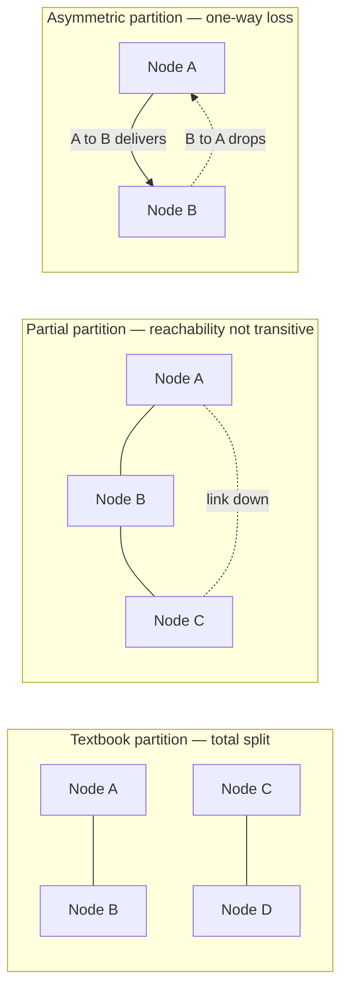
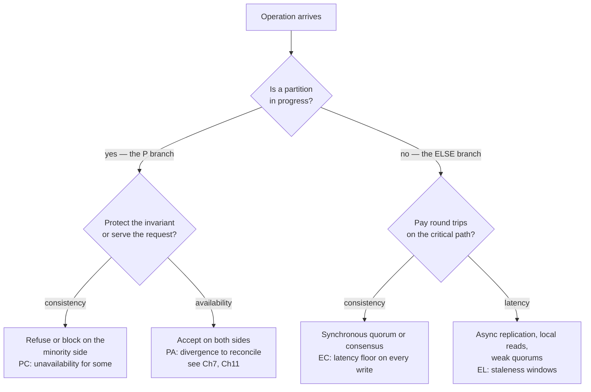
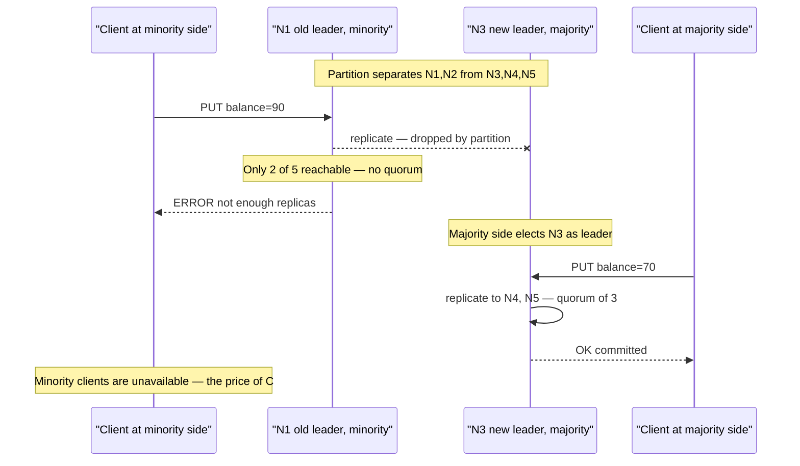
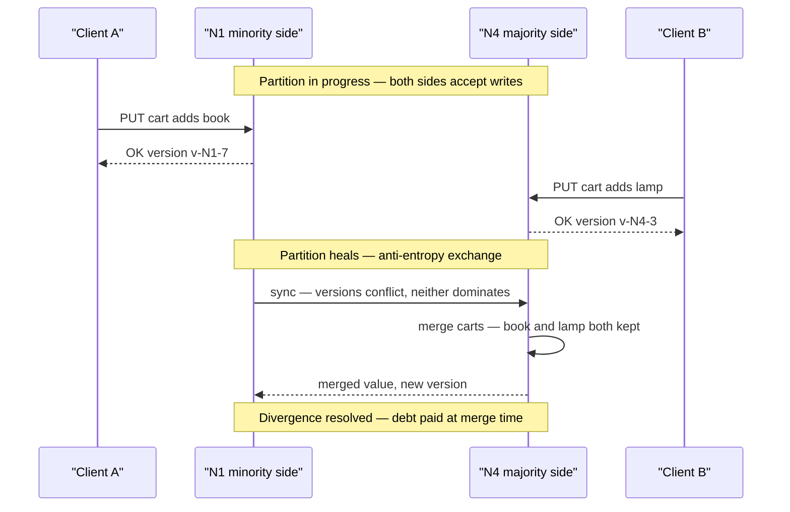

# Chapter 4 — CAP, PACELC, and the Real Trade-Offs

**What this chapter covers.** CAP is probably the most-cited and most-misstated result in
distributed systems. It appears on architecture slides as a triangle with "pick two," it is
invoked to justify decisions it says nothing about, and its three letters are routinely expanded
into definitions the theorem does not use. This chapter does three jobs. First, it states the
theorem *as the theorem it actually is* — the Gilbert & Lynch 2002 formalization of Brewer's
conjecture — with its exact model and exact definitions, because the precise statement is both
narrower and more useful than the folklore version. Second, it clears away the folklore: the
triangle, the "CP system vs AP system" labels, the conflation of CAP's C with every other C in
the field. Third, and most importantly, it replaces the folklore with the trade-off structure
that actually governs design: PACELC, which adds the latency-versus-consistency trade you pay on
every request even when the network is healthy; harvest and yield, the forgotten vocabulary for
graceful degradation; and a decision discipline for making the consistency-availability choice
per operation, pricing it honestly, and testing the partition behavior you claim to have. The
mechanics are made concrete on this volume's replicated key-value running example, and the
chapter closes by turning the lens back on Volume 4: the same trade exists inside a single
machine, and the same conclusion — coordination is the cost center — holds at every scale, now
with a theorem attached.

Learning goals — after this chapter you should be able to:

- State the CAP theorem precisely: model, the three guarantees as Gilbert & Lynch define them,
  and the one-paragraph proof — and identify which parts of the popular version are not in it.
- Explain why "partition tolerance" is not a menu option, and therefore why the real content of
  CAP is the C-versus-A choice *during* a partition.
- Explain why "CP system" and "AP system" are category errors at system granularity, using
  per-operation consistency levels as the counterexample.
- Describe what network partitions actually look like in production — partial, asymmetric,
  flapping — and summarize the empirical evidence that they occur at meaningful rates.
- State PACELC, explain why the ELSE branch dominates everyday design, and classify real systems
  in PACELC terms with appropriate hedging.
- Define harvest and yield, and use them to design degradation modes that are chosen rather than
  accidental.
- Apply a per-operation decision discipline: identify the invariant, price the latency of
  protecting it, write the partition playbook, and find the coordination hidden in dependencies.

## The theorem, stated precisely

Eric Brewer presented CAP as a conjecture in his keynote at PODC 2000. Seth Gilbert and Nancy
Lynch proved a formalization of it in 2002, and their paper — four pages, entirely readable — is
the thing people cite when they say "the CAP theorem." It is worth knowing exactly what it proves,
because the proof's power and its limits both come from the same source: the definitions are
strict and the model is specific.

### The model and the three guarantees

The setting is the **asynchronous network model**: nodes communicate only by passing messages,
messages may be delayed arbitrarily or lost, and there are no clocks — no node can distinguish "the
reply is lost" from "the reply is slow." This is the same adversarial model Chapter 1 introduced
and Chapter 2 wrestled with; it matters here because the impossibility argument leans on exactly
that indistinguishability. The object under discussion is deliberately minimal: a single
read/write register, replicated across nodes. Not a database, not a transaction system — one cell
of shared memory.

The three guarantees, as the paper defines them:

- **Consistency** means the register is **linearizable** — "atomic consistency" in the paper's
  vocabulary, which is Herlihy and Wing's linearizability applied to a single register. Chapter 3
  gave the precise definition, and CAP inherits it unchanged: there must exist a total order over
  all operations such that each appears to take effect instantaneously at some point between its
  invocation and its response, and that order must respect real time — if write W completes before
  read R begins, R must observe W (or something later). This is the strongest single-object
  consistency model on Chapter 3's map. Hold onto that; it is the pivot of a debunking below.

- **Availability** means that **every request received by a non-failing node must eventually
  result in a response**. Note the quantifier and the absence of a deadline: *every* request, to
  *any* live node, must eventually be answered — in the asynchronous model there is no time bound
  to appeal to, so "eventually" is all that can be demanded. A node that answers "try another
  replica" with an error is, for the theorem's purposes, responding to precisely nothing; an
  algorithm that lets even one live node refuse even one request has forfeited availability as
  defined.

- **Partition tolerance** means the guarantees above must hold even when **the network loses
  arbitrarily many messages between nodes**. A partition, formally, is just that: a pattern of
  message loss that separates the nodes into groups that cannot hear each other. Partition
  tolerance is not a feature a node implements; it is a clause about the adversary the other two
  guarantees must survive.

**The theorem:** in the asynchronous network model, it is impossible for a read/write register to
guarantee both availability and linearizability in all executions, including those in which
messages are lost.

### The proof, in one paragraph

Split the nodes into two non-empty groups, G1 and G2, and let the adversary drop every message
between them — a total partition, which partition tolerance obliges the algorithm to survive. A
client writes value *v1* to the register at a node in G1. By availability, that write must
eventually complete and return success; it cannot block waiting for G2, because it would wait
forever. Later, a client reads the register at a node in G2. By availability, that read must also
return. But no information about the write can have crossed the partition, so the read returns the
old value — and a read that begins after a write has completed, yet returns the pre-write value,
is a straightforward linearizability violation. Both guarantees cannot survive the same execution;
one of them yields. Gilbert and Lynch add a corollary with a sting in it: because asynchronous
nodes cannot distinguish lost messages from slow ones, an algorithm that guarantees availability
ends up violating consistency even in some executions where *no* message is actually lost — it
merely had to be prepared for the possibility. They also prove a partially-synchronous variant
(with timeouts, the sting softens: you can regain consistency within a bounded time after the
partition heals), but the headline result is the asynchronous one.

That is the entire theorem. A single register, an asynchronous network, three precisely-defined
properties, a two-group counterexample. Everything else that travels under the name "CAP" is
commentary — some of it useful, much of it wrong. The next section sorts which is which.

## What CAP does not say

The debunkings below are not pedantry. Each corresponds to a class of real design errors —
architectures justified by a theorem that does not apply, or guarantees claimed that the theorem
does not permit. And none of this is revisionism against Brewer: his own 2012 retrospective, *CAP
Twelve Years Later: How the "Rules" Have Changed*, makes several of these corrections explicitly,
and I will cite it as we go.

### "Pick two of three" — but P was never on the menu

The popular rendering is a triangle: consistency, availability, partition tolerance — choose any
two. The rendering fails because the three properties are not the same kind of thing. C and A are
guarantees your system provides. P is a statement about the *network*, and on a real network,
message loss is not something you opt out of. Switches fail, links flap, kernels drop packets
under memory pressure, a misconfigured ACL blackholes a subnet (Volume 3, Chapter 11 catalogs the
mechanisms). A "CA system" — one that chooses consistency and availability by declining partition
tolerance — is a system that simply has no defined behavior when the network misbehaves, which is
to say it has chosen to fail in an unspecified way. Brewer's retrospective says it plainly: the
"2 of 3" formulation was always misleading, because partitions are rare, and when the system is
not partitioned there is no reason to sacrifice either C or A.

That sentence contains the theorem's real content, so it bears restating:

> **CAP is not a three-way choice. It is a two-way choice — consistency versus availability —
> that only has to be made while a partition is in progress.** Outside partitions, a
> well-engineered system provides both. The theorem tells you that you must decide, in advance,
> which one you will give up during the minutes (or hours) when the network is broken.

This reframing does real work. It converts CAP from a branding exercise ("we are an AP database")
into an operational question with a concrete deliverable: *what does your system do during a
partition, and did you decide that on purpose?* Brewer's retrospective proposes exactly that
discipline — detect the partition, enter an explicit partition mode in which some operations are
limited, and run a recovery step when connectivity returns to restore consistency and compensate
for any mistakes made in the meantime. We build that playbook in a later section.

### "CP system" and "AP system" are category errors

The second folklore artifact is the label: Cassandra is AP, HBase is CP, and so on, as if the
choice were a property of the binary you deploy. It is not, for two reasons.

First, real systems make the choice **per operation and per configuration**. Cassandra is the
clean counterexample (Volume 5, Chapter 11 covers its architecture): every read and every write
carries its own consistency level. A write at `QUORUM` into a cluster split away from a majority
of replicas will fail — that operation, at that moment, chose consistency over availability. A
write at `ONE` into the same split will succeed against whatever replica is reachable and
reconcile later — that operation chose availability and accepted divergence. Same binary, same
cluster, same partition, opposite CAP behavior, selected by a parameter on the request. A system
whose requests can sit at different points of the trade-off does not *have* a CAP class; its
operations do.

Second, even for systems with less configurability, the honest label depends on which guarantee
you are asking about — reads or writes, within a region or across regions, with which durability
settings. The vocabulary "CP vs AP" survives because it is convenient shorthand, and I will use it
below as shorthand for *a choice*, but attaching it to *a system* is a category error that
conceals exactly the decisions this chapter exists to surface.

### CAP's C is linearizability — not ACID-C, and not "strong-ish"

The theorem's consistency is the linearizable register, full stop. Two conflations do damage here.

The first is with the C in ACID. ACID consistency (Volume 5, Chapter 5) means transactions
preserve application-level invariants — balances non-negative, foreign keys valid. It is a
property about *integrity constraints*, largely the application's responsibility, and it has
essentially nothing to do with the ordering-of-operations property CAP is about. A sentence like
"we relaxed CAP consistency but we're still ACID" is not wrong so much as unparseable; the two Cs
are different axes.

The second conflation is the quiet downgrade: reading CAP's C as "reasonably strong consistency"
and then concluding that any system with quorums or synchronous replication "has C." Chapter 3
built a whole hierarchy below linearizability — sequential consistency, causal consistency,
read-your-writes, bounded staleness — and the theorem's impossibility applies only to the top of
it. This cuts in both directions, and the permissive direction is the interesting one: **weaker
consistency models than linearizability can be available under partition.** Causal consistency,
notably, can be maintained on both sides of a partition simultaneously (each side keeps extending
its own causal history and merges later); it is close to the strongest model for which that is
known to hold. So "CAP says we can't have consistency during partitions" is false as stated. CAP
says you cannot have *linearizability* with full availability during partitions. If your invariant
is protected by something weaker — and many are — the theorem has no objection.

### CAP's A is a liveness guarantee that almost nobody actually claims

The theorem's availability is *every request to every non-failed node eventually gets a response*.
Measure real systems against that literal standard and something clarifying happens: most systems
that everyone calls "highly available" are not CAP-available, and do not want to be. A system
behind a load balancer that health-checks nodes out of rotation is routing around nodes that would
fail requests — fine engineering, but the theorem's A is about what those nodes would do if asked.
A leader-based store that fails minority-side requests during a partition is not CAP-available by
construction — that is exactly the sacrifice it chose. Even proudly available systems return
errors under overload, which the theorem's A does not permit. The label on the marketing page
("five nines") is a *measured* property — a fraction of requests served successfully over a window
— and is related to CAP's A roughly the way uptime is related to a liveness proof, which is to say
loosely. When you read "highly available" in a datasheet, the CAP theorem is not the claim being
made, and violating CAP is not the rebuttal.

### CAP says nothing about latency — and latency is the everyday cost

The theorem's availability has no deadline: a response in ten minutes satisfies it. That is
faithful to the asynchronous model and useless to an engineer with a 100 ms budget. And the
omission hides the trade-off that dominates real design, because the mechanisms that buy
consistency — synchronous replication, quorum round trips, consensus — charge their toll in
latency on *every operation, all the time*, not just during partitions. A partition is an event;
latency is a lifestyle. The theorem that governs the event became famous, while the trade-off you
pay every millisecond of every day went nameless for a decade — until Abadi named it, and we will
get there right after we look at what the event actually looks like.

## What partitions actually look like

The proof's partition is clean: two groups, total silence between them. Production partitions are
rarely so tidy, and the messier shapes are the ones that break systems designed against the tidy
mental model. Volume 3 (Chapters 1, 11, and 12) covers the underlying mechanisms; here is the
summary that matters for this chapter.

**Partitions are frequently partial and asymmetric.** A failing switch linecard, an asymmetric
routing change, or a unidirectional link fault can produce topologies where A can reach B, B can
reach C, but A cannot reach C — every node is "up," every node has *some* connectivity, and yet
there is no consistent global view of who can talk to whom. Failure detectors built on pairwise
heartbeats (Chapter 10) disagree with each other in exactly this situation, and protocols that
implicitly assume "reachability is transitive" or "either the network works or it doesn't"
misbehave in ways their designers never enumerated. A classic pathology: a leader that can reach a
majority of its followers but not the coordination service, or vice versa, leading to two
components each holding half of the evidence needed to act.



**Partitions flap.** Links that fail cleanly and stay failed are the kind operators like; links
that oscillate — seconds of loss, seconds of health, repeat — are the kind that turn a
leader-election protocol into a leadership carousel, each flap triggering an election whose
messages are themselves lost in the next flap. Timeout-based failure detection (Chapter 1's
slow-versus-dead problem, Chapter 10's machinery) is at its worst here, and systems can spend more
time reconfiguring than serving.

**Partitions happen at rates that matter.** The honest evidence base is Peter Bailis and Kyle
Kingsbury's 2014 survey *The Network is Reliable* — the title is ironic — which compiles published
measurement studies and practitioner postmortems. The picture it assembles, stated at the level of
certainty the sources support: a measurement study of Microsoft's datacenters (Gill et al.,
SIGCOMM 2011) found network element failures to be a daily occurrence at fleet scale, with dozens
of link failures per day across the fleet, most masked by redundancy but a meaningful minority
causing real loss; Google engineers have described a typical first year of a new cluster as
including multiple rack-wide outages and several router or switch failures; and the postmortem
record is thick with partitions caused not by hardware at all but by configuration — a bad ACL
push, a routing-protocol misadventure, a firmware bug — which redundant links do nothing to
prevent, because the redundant links receive the same bad config. WAN and cross-region links,
which multi-region architectures (Volume 7, Chapter 10) depend on, fail more often still. The
survey's conclusion is the right calibration: partitions are not a daily event for any single
small cluster, but they are far too frequent, at the scale and lifetime of a real fleet, to leave
their handling unspecified. "It basically never happens" is not a partition strategy, and the
data says it is not even true.

## PACELC: naming the trade you pay every day

Daniel Abadi's observation — a 2010 blog post, formalized in a 2012 IEEE *Computer* article — is
that CAP describes only the exceptional branch of a two-branch trade-off, and that omitting the
other branch had visibly distorted how systems were being compared. His formulation:

> **PACELC:** if there is a **P**artition, trade **A**vailability against **C**onsistency;
> **E**lse, trade **L**atency against **C**onsistency.

The ELSE branch is where a system spends almost all of its life, and the trade there is
mechanical, not theoretical. To make writes consistent across replicas, a write must not be
acknowledged until enough replicas have seen it; that is one or more network round trips *in the
critical path of every write*. Volume 5, Chapter 8 quantified this for replication: synchronous
replication to a peer in the same building adds a millisecond or less; to another region, it adds
the speed of light — tens of milliseconds that no engineering removes. Volume 5, Chapter 12 showed
the same floor under NewSQL: a consensus round (Chapters 5 and 6 of this volume) costs at minimum
one round trip from leader to a quorum of followers, so a Spanner- or CockroachDB-style commit
across regions has a physics-imposed latency floor regardless of implementation quality. Choosing
to relax consistency — asynchronous replication, local reads, weaker quorums — is choosing to
delete those round trips from the critical path. That is the EL choice, and it is made millions of
times per second in fleets where a partition has not happened for months.

This is why PACELC, not CAP, is the framework that should appear on the architecture slide. CAP
answers "what happens in the bad minutes"; PACELC also answers "what does every good millisecond
cost," and the second question is usually the one the business feels.



### Classifying real systems, with the required hedging

Abadi's article classifies systems into the four corners, and the exercise is illuminating as long
as two hedges stay attached. First, per the category-error section above, these are labels for
*defaults and design centers*, not for every operation the system can perform. Second, systems
move: several of Abadi's 2012 classifications describe defaults that have since changed, so the
table below describes design lineages, stated as of what those designs canonically are.

| PACELC class | Design center | Canonical examples | The bargain |
|---|---|---|---|
| **PA/EL** | Give up consistency in both branches | Dynamo lineage: Cassandra and Riak at weak consistency levels, DynamoDB in its eventually-consistent mode | Always writable, local-latency reads; the cost is divergence and staleness, managed by the machinery of Chapter 7 (sloppy quorums, read repair) and Chapter 11 (CRDTs) |
| **PC/EC** | Pay for consistency in both branches | Spanner, CockroachDB, ZooKeeper, etcd, VoltDB | Linearizable operations always; the cost is minority-side unavailability during partitions and a consensus round trip on every write |
| **PC/EL** | Consistent under partition, fast otherwise | Yahoo's PNUTS is Abadi's example: timeline consistency per record, with operations that degrade rather than diverge under partition | Everyday latency of a relaxed model, without accepting divergent writes when the network breaks |
| **PA/EC** | Available under partition, consistent otherwise | Abadi's example was MongoDB's then-default configuration; systems that run synchronously in the steady state but keep accepting writes when replication is impossible | The awkward corner: consistent until it matters most; usually a description of behavior discovered later rather than a design goal |

The mixed corners deserve the attention they rarely get. PC/EL says something subtle: "we will not
invent data during a partition, but we also refuse to pay quorum latency on the everyday path" —
a defensible position for read-heavy, record-oriented workloads. PA/EC describes systems that pay
for consistency precisely when it is cheap and abandon it precisely when it is hard; when that is
the outcome of an explicit failover policy with bounded loss it can be reasonable, but when it is
emergent — discovered in a postmortem rather than chosen in a design review — it is the signature
of a system that never wrote down its partition behavior. Kyle Kingsbury's Jepsen work (Chapter
12) has repeatedly caught systems in exactly that corner, advertising EC behavior while testing
revealed PA-with-data-loss behavior under partition.

## The choice made concrete: our replicated KV under partition

Return to the volume's running example: a key-value store replicated across five nodes, N1–N5,
currently led by N1 (leadership and log machinery per Chapters 5 and 6; quorum arithmetic per
Chapter 7). A partition separates {N1, N2} from {N3, N4, N5}. Note the awkward detail chosen
deliberately: the leader is on the *minority* side. Clients are attached to both sides. What
happens next is not determined by the partition — it is determined by which branch of the P
choice we configured.

### The CP choice: only a majority may write

Under the consistency choice, the rule is simple and brutal: a write commits only when a majority
of replicas (three of five) have accepted it. N1, marooned with one follower, can no longer
assemble three acknowledgments. Its writes hang and then fail; if leases are in play (below), N1
stops serving even reads once its lease expires. On the majority side, N3–N5 elect a new leader —
say N3 — which can assemble a quorum and proceeds normally. The system as a whole remains
linearizable and remains *mostly* available: clients who can reach the majority side notice
nothing, and clients attached to the minority side get errors until the partition heals or they
re-route. That asymmetric outcome — availability for some clients, refusal for others, invariants
intact for all — is what "CP" actually means operationally.



### The AP choice: both sides accept, and we go into debt

Under the availability choice, every reachable replica keeps accepting writes — there is no
majority requirement, and perhaps no leader at all (the Dynamo-style leaderless design of
Chapter 7). A client on the minority side writes `cart = [book]` through N1; a client on the
majority side writes `cart = [lamp]` through N4. Both are acknowledged. The register has now
**diverged**: two histories exist, each internally consistent, with no ordering between them.
Nothing is wrong yet in the sense the clients can observe — that is the point — but the system has
taken on a debt that comes due when the partition heals: the replicas must detect the conflict
(version vectors, Chapter 7), and something must resolve it. The resolution options are the
subject of Chapters 7 and 11 — last-writer-wins (which silently discards one write; acceptable for
a presence flag, unacceptable for money), semantic merge (union the carts), pushing the conflict
to the application, or choosing data structures whose merges are automatic and principled
(CRDTs). The one option that does not exist is not deciding: an AP configuration without a
designed conflict-resolution story has simply chosen "corrupt quietly."



### Leases and fencing: making the minority actually stop

The CP story above contains a step that deserves suspicion: "N1 stops serving." Why would it? From
N1's own point of view, the world has merely gone quiet — and Chapter 1 taught that a node cannot
distinguish a partition from everyone else being slow. If N1 keeps serving reads from its local
state while N3's side commits new writes, clients at N1 read stale data from a node that sincerely
believes it is the leader — a linearizability violation delivered with full confidence. The
standard fix is the **lease**: leadership is held for a bounded term and must be renewed through a
quorum; a leader that cannot renew must stop serving when the term expires, *even though nothing
seems wrong locally*. This converts the unanswerable question "am I partitioned?" into the
answerable one "has my lease expired?" — at the cost of a clock assumption (bounded clock drift;
Chapter 2's territory) and of a built-in unavailability window equal to the lease length. And
because a deposed leader may still hold unexpired side effects in flight, leases pair with
**fencing tokens**: every leadership term carries a monotonically increasing number, downstream
resources reject writes bearing a stale token, and the zombie leader's late-arriving writes bounce
off. Volume 4, Chapter 2 closed on exactly this construction for distributed locks; it is the same
mechanism, because it is the same problem — an actor that does not know it has lost its authority.

### Reads during partitions: staleness as the middle ground

The C-versus-A choice is starkest for writes, but reads offer a genuine middle ground that the
binary framing hides. A minority-side node cannot serve a *linearizable* read — but it can serve a
read labeled honestly: **bounded-staleness** reads ("this data is at most 5 seconds old, by local
clock"), or snapshot reads at a known-committed timestamp. Volume 5, Chapter 12 covered the
mechanism in its NewSQL form — follower reads / stale reads in Spanner and CockroachDB, where a
replica serves a read at a timestamp it can prove is fully replicated, trading recency for
locality and partition-side availability. During a partition this becomes a designed degradation:
writes on the minority side fail (CP preserved where it counts), while reads continue with an
explicit staleness bound (availability preserved where the invariant permits). Many "CP" systems'
real partition behavior is exactly this hybrid, which is one more reason the one-word labels
mislead.

The knobs that select all of the above are, in Dynamo-lineage systems, per-request:

```yaml
# Per-operation consistency selection, Cassandra-style (N = 5 replicas)
checkout_payment:
  write_consistency: QUORUM     # 3 of 5 must ack: fails on minority side (CP-ish)
  read_consistency:  QUORUM     # R + W > N: read sees latest committed write
shopping_cart:
  write_consistency: ONE        # any reachable replica: always writable (AP-ish)
  read_consistency:  ONE        # fast, possibly stale; conflicts merged via CRDT cart
product_view_counter:
  write_consistency: ANY        # even a hint suffices; loss is tolerable
  read_consistency:  ONE
```

Three operations, one cluster, three different points on the trade-off — the per-operation
discipline made literal in configuration.

## Harvest and yield: the forgotten refinement

Three years before Gilbert and Lynch's proof, Armando Fox and Eric Brewer published a short HotOS
paper — *Harvest, Yield, and Scalable Tolerant Systems* (1999) — that supplied a vocabulary the
CAP debate then mostly forgot. It deserves rescue, because it describes the degradation choices
you actually make, at a finer grain than C-versus-A.

- **Yield** is the probability that a request completes — successful requests over total requests.
  It is close to what practitioners mean by availability, and more useful than uptime: a minute of
  downtime at peak and a minute at 4 a.m. are identical uptime and wildly different yield.
- **Harvest** is the fraction of the relevant data reflected in a completed response. A search
  that consulted 9 of its 10 shards, because the tenth was on the wrong side of a partition,
  returns with harvest 0.9.

The insight is that a failure's cost can be spent from either account. When a shard is
unreachable, a search service can fail every query touching it — full harvest on the queries that
succeed, reduced yield — or answer every query from the shards it has — full yield, reduced
harvest. For search, reduced harvest is obviously right: a 90%-complete result is nearly as good
as a complete one, and infinitely better than an error. For an account-balance read, harvest
degradation is obviously wrong: 90% of your transactions is not your balance. The choice is
per-operation, again, and it is a *design* choice: systems degrade harvest gracefully only if
responses can represent partiality and callers are built to tolerate it.

| Degradation mode | What degrades | Good fit | Bad fit |
|---|---|---|---|
| Fail requests touching lost data | Yield | Invariant-bearing reads: balances, inventory, auth | Broad queries where partial answers retain most value |
| Answer from available data, flag partial | Harvest | Search, feeds, recommendations, analytics dashboards | Anything summed or counted for correctness |
| Serve stale-but-complete snapshot | Freshness — a harvest variant along the time axis | Catalogs, configuration, follower reads | Data whose staleness breaks the invariant |

Volume 4, Chapter 9's scatter-gather pattern already implemented harvest degradation in
miniature — fan out to workers, deadline arrives, return what came back and note what did not.
Volume 7, Chapter 11 builds organization-scale graceful degradation on the same two dials. The
contribution of the vocabulary is that it makes the dials *visible*: "under partition, this
endpoint degrades harvest, floor 80%, response marked partial; that endpoint degrades yield" is a
sentence that can appear in a design document and be tested against — which is more than can be
said for "we're AP."

## Decision discipline

Everything above compresses into a working method — five obligations that belong in any design
review for a stateful service.

**1. Identify the invariant, and its blast radius.** The C-versus-A choice is not made for "the
system"; it is made for an invariant. Name it: no double-spend; inventory never oversold; at most
one holder of this lock; likes eventually counted roughly right. Then price its violation. A
diverged like-counter merges with nobody harmed. A diverged account balance is money invented or
destroyed, discovered at reconciliation, escalated to a regulator. The blast radius, not the data
model, is what justifies paying for coordination — "money vs likes" is the crude but effective
first cut.

**2. Choose per operation, not per system.** The unit of choice is the operation against the
invariant. The checkout takes the quorum write and eats minority-side failures; the cart takes
`ONE` and a CRDT merge; the view counter takes fire-and-forget. Any framing of the decision as
"should we use a CP or an AP database" has already lost the resolution at which the real decision
exists — though it may still matter for picking defaults, since teams inherit their store's path
of least resistance.

**3. Price the ELSE branch, in milliseconds, against a budget.** Consistency's everyday cost is
latency, so treat it as a line item in the latency budget (Volume 11 develops budgets properly).
A cross-region synchronous commit at ~60 ms RTT inside a 100 ms p99 budget is not a philosophical
tension — it is an arithmetic failure, visible in the design review if anyone does the
arithmetic. The honest comparison is between invariant-violation cost (step 1) and round-trips ×
RTT × requests-per-day. Sometimes the answer is genuinely "pay it" — Spanner exists because
Google concluded, in their words, that it is better for engineers to deal with performance
problems than with the semantic problems of weak consistency. Sometimes the answer is a cheaper
consistency model that still protects the invariant. It should never be "we didn't price it."

**4. Write the partition playbook — and test it.** Brewer's partition-mode framing becomes a
concrete artifact: for each operation class, what *blocks*, what *degrades* (harvest? freshness?
by how much, marked how?), and what *reconciles* afterward (merge function, compensation,
operator escalation). Then treat the playbook as untested code, because that is what it is.
Partitions are rare enough that the partition path is the least-executed code in the system and
the most likely to be wrong; Chapter 12's toolkit — Jepsen-style partition injection, fault
schedules in CI, game days — exists precisely to run this code before the network does.

**5. Find the coordination hidden in your dependencies.** A service's PACELC position is the
composition of its dependencies' positions, and the strictest dependency wins. An "AP" API tier
that synchronously calls a CP database inherits minority-side unavailability, whatever its own
design says; a "low-latency" service that acquires a lock from a coordination service on every
request has a consensus round trip in its critical path, whether or not anyone budgeted it
(Chapter 8 returns to this — coordination services make coordination easy to consume, which is
their virtue and their hazard). Draw the dependency graph, mark every edge that blocks on quorum
or lock or leader, and you have the true PACELC diagram of your system — frequently a surprise to
its own architects.

## The distributed-systems lens: the same trade, all the way down

This volume's lens usually points outward from a single-machine topic to its distributed twin.
This chapter's topic *is* distributed, so point the lens the other way — back into Volume 4 —
and notice that CAP-shaped trade-offs were there all along.

A mutex is a tiny CP choice. A thread that must have the invariant blocks until it holds the
lock: consistency purchased with availability, at the scale of nanoseconds and threads rather
than minutes and datacenters. The pathologies rhyme, too — a thread that dies holding a lock is
the in-process version of a partitioned leader, and Volume 4, Chapter 5's deadlock is
coordination's liveness bill arriving all at once. Volume 4, Chapter 4's lock-free structures
make the opposite choice: some thread always makes progress — availability as a progress
guarantee — and the cost is paid in weaker, subtler intermediate states and algorithms that are
hard to get right. That menu — block for the invariant, or progress with weaker guarantees — is
the P branch of PACELC, miniaturized.

The ELSE branch was in Volume 4 as well, wearing a different name. The Universal Scalability
Law's coherency term β (Volume 4, Chapter 1) is the cost of keeping N workers' views of shared
state consistent, paid continuously, partition or no partition — cache-line ping-pong is
synchronous replication between cores, billed in cycles instead of milliseconds. When Chapter 1
concluded that driving β toward zero is the only way to keep the scaling curve rising, it was
stating the EL preference; when a team accepts eventual consistency to delete a cross-region
round trip, it is attacking the same coefficient at a larger scale.

So the moral of Volume 4 and the moral of this chapter are one moral, and it is worth stating as
the through-line for the rest of this volume: **coordination is the cost center.** Agreement —
between threads about a memory location, between replicas about a register — is the thing that
costs latency in the good times and availability in the bad times, at every scale from a cache
line to a planet. The entire engineering discipline of distributed systems can be read as a
catalog of ways to buy less of it: partitioning so writes don't contend (Chapter 7 and Volume 5,
Chapter 9), weakening models to the minimum the invariant needs (Chapter 3), making merges free
so agreement can wait (Chapter 11), batching agreement so its round trips amortize (Chapters 5
and 6). Volume 4 reached this conclusion empirically, from profilers and scaling curves. This
chapter's contribution is that the conclusion is not contingent: there is a theorem at the bottom
of it. You cannot have agreement, progress, and an unreliable medium all at once — so spend
agreement only where the invariant demands it, and know, in advance and in writing, what you
will do when the medium misbehaves.

## Key takeaways

- **CAP, precisely:** in an asynchronous network, a replicated read/write register cannot
  guarantee both linearizability and availability (every request to a non-failed node eventually
  answered) in executions with arbitrary message loss. The proof is a two-group partition: an
  available write on one side and an available read on the other cannot both respect real-time
  order.
- **P is not a choice.** Networks partition — partially, asymmetrically, and at fleet-relevant
  rates (Bailis & Kingsbury). The theorem's real content is the C-versus-A choice *during* a
  partition; outside partitions you can and should have both.
- **"CP system" and "AP system" are category errors.** Real systems choose per operation and per
  configuration — a Cassandra `QUORUM` write and a `ONE` write sit at different points of the
  trade-off in the same cluster on the same day.
- **CAP's C is linearizability specifically** — not ACID's C, not "strong-ish." Weaker models,
  causal consistency notably, remain achievable under partition; if your invariant needs less
  than linearizability, the theorem does not forbid you availability.
- **CAP's A is a literal liveness guarantee that few "highly available" systems claim**, and CAP
  says nothing about latency — which is why PACELC exists: if Partitioned, A-versus-C; Else,
  Latency-versus-C. The ELSE branch is the everyday trade, paid in round trips on every
  consistent write, with consensus RTTs as its floor.
- **PACELC corners:** PA/EL (Dynamo lineage), PC/EC (Spanner, CockroachDB, ZooKeeper), and the
  instructive mixed cases — PC/EL (PNUTS) as a deliberate bargain, PA/EC as too often an
  accidental one.
- **Mechanically,** CP means majority-side-only writes with leases and fencing to make the
  minority genuinely stop; AP means both sides accept and you owe a designed merge (Ch7, Ch11).
  Bounded-staleness and follower reads are the legitimate middle ground for reads.
- **Harvest and yield** (Fox & Brewer) name the degradation dials: yield is the probability of
  answering, harvest the completeness of the answer. Choosing which to degrade, per operation,
  is what graceful degradation means.
- **Discipline:** name the invariant and its blast radius; choose per operation; price the ELSE
  branch against a latency budget; write and *test* the partition playbook (Ch12); and audit
  dependencies for inherited coordination.
- **Coordination is the cost center** — the same conclusion Volume 4 reached inside one machine,
  now with a theorem attached. Buy agreement only where the invariant demands it.

## Further reading

- Gilbert, S. and Lynch, N., "Brewer's Conjecture and the Feasibility of Consistent, Available,
  Partition-Tolerant Web Services," *ACM SIGACT News* 33(2), 2002 — the proof itself; four pages,
  read the definitions closely. https://dl.acm.org/doi/10.1145/564585.564601
- Brewer, E., "CAP Twelve Years Later: How the 'Rules' Have Changed," *IEEE Computer* 45(2),
  February 2012 — the author's own corrections: "2 of 3" is misleading, and partition mode /
  recovery is the real design problem. https://ieeexplore.ieee.org/document/6133253
- Brewer, E., "Towards Robust Distributed Systems," PODC keynote, 2000 — where the conjecture was
  posed.
- Abadi, D., "Consistency Tradeoffs in Modern Distributed Database System Design: CAP is Only
  Part of the Story," *IEEE Computer* 45(2), February 2012 — PACELC and the system
  classifications discussed above. https://ieeexplore.ieee.org/document/6127847
- Fox, A. and Brewer, E., "Harvest, Yield, and Scalable Tolerant Systems," *HotOS-VII*, 1999 —
  the two-dial vocabulary for graceful degradation.
- Bailis, P. and Kingsbury, K., "The Network is Reliable," *ACM Queue* 12(7), 2014 — the
  evidence survey on real-world partitions. https://queue.acm.org/detail.cfm?id=2655736
- Kleppmann, M., "A Critique of the CAP Theorem," 2015, arXiv:1509.05393 — a careful examination
  of the theorem's definitions and their mismatch with practice; proposes sharper vocabulary.
- Gill, P., Jain, N., and Nagappan, N., "Understanding Network Failures in Data Centers,"
  *SIGCOMM*, 2011 — the Microsoft datacenter measurement study cited via Bailis & Kingsbury.
- Brewer, E., "Spanner, TrueTime and the CAP Theorem," Google whitepaper, 2017 — how a PC/EC
  system reasons about its own (small) availability sacrifice.
- Volume 6, Chapter 3 — Replication and Consistency Models — the precise definition of
  linearizability that CAP's C means, and the hierarchy beneath it.
- Volume 5, Chapter 8 — Replication — synchronous versus asynchronous replication, where the
  ELSE branch's latency price is quantified.
- Volume 5, Chapter 11 — NoSQL — the Dynamo lineage and per-operation consistency levels; and
  Chapter 12 — NewSQL — consensus RTT floors and follower reads.
- Volume 3, Chapter 11 — Network Reliability — what partitions are made of.
