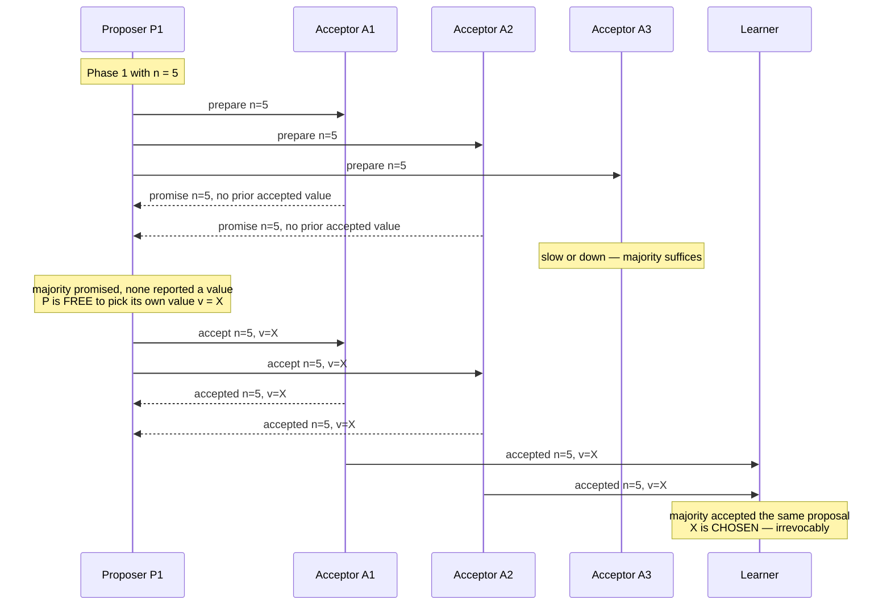
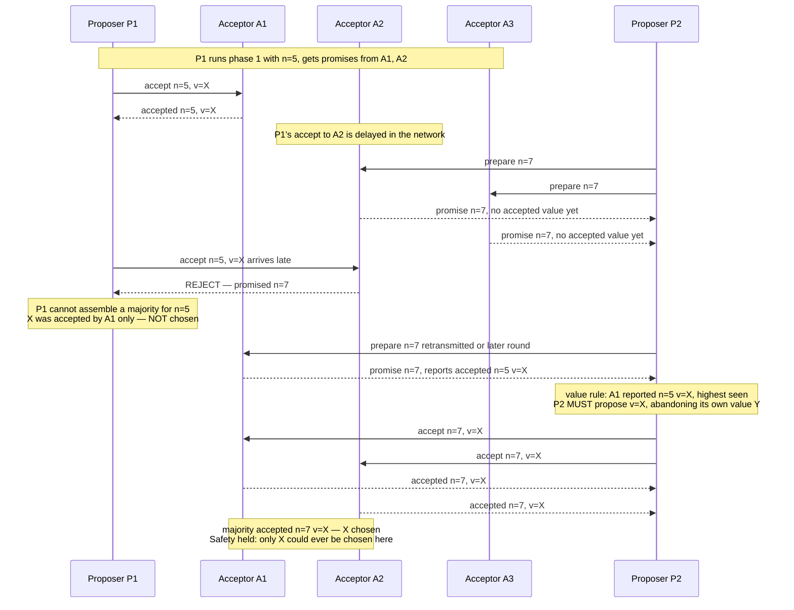
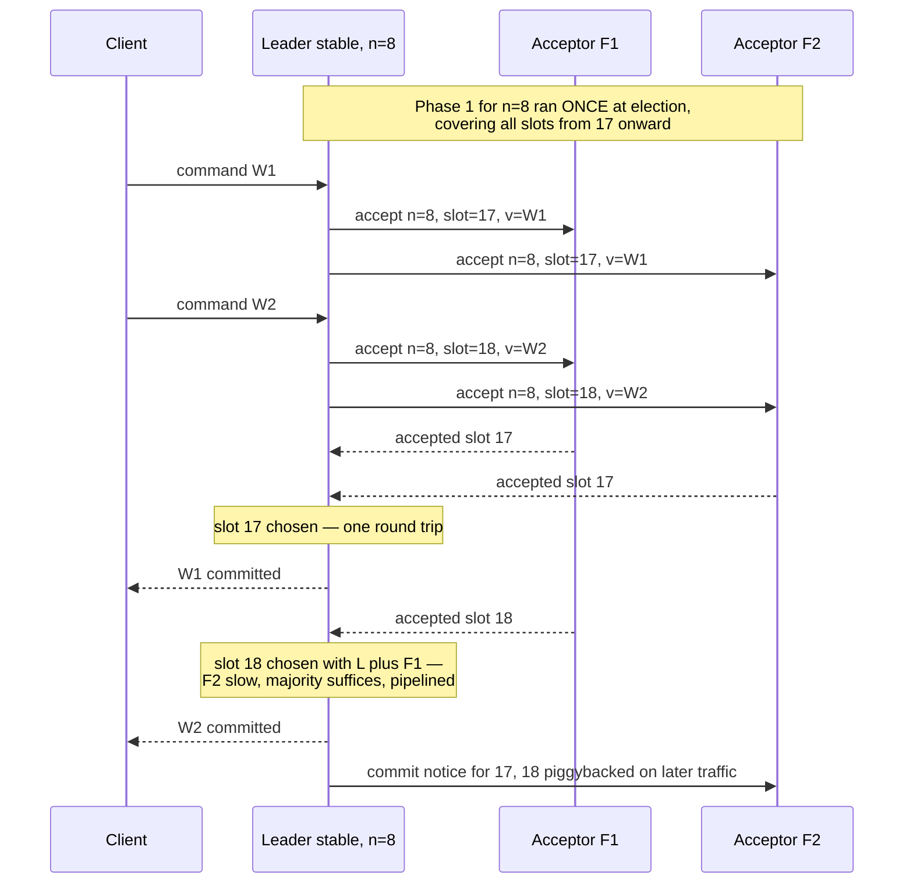
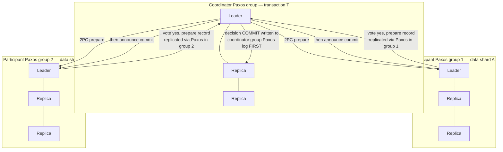
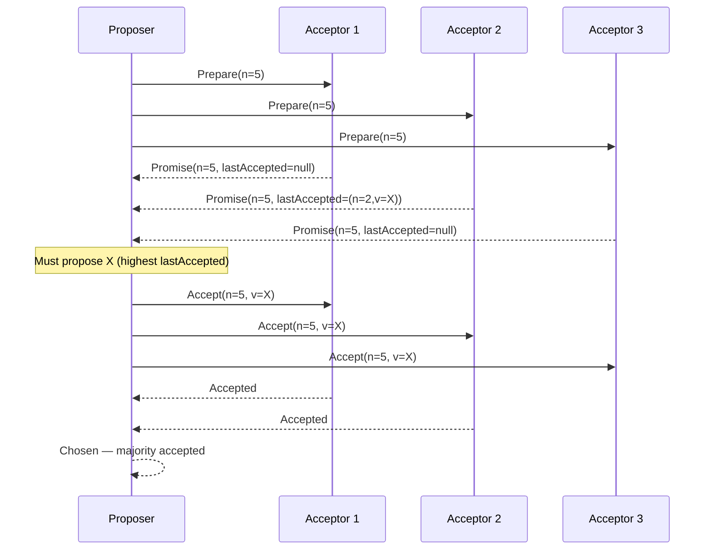
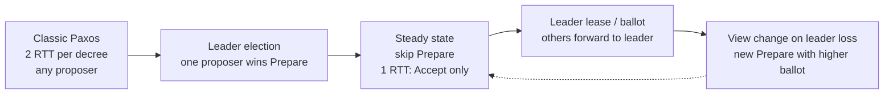
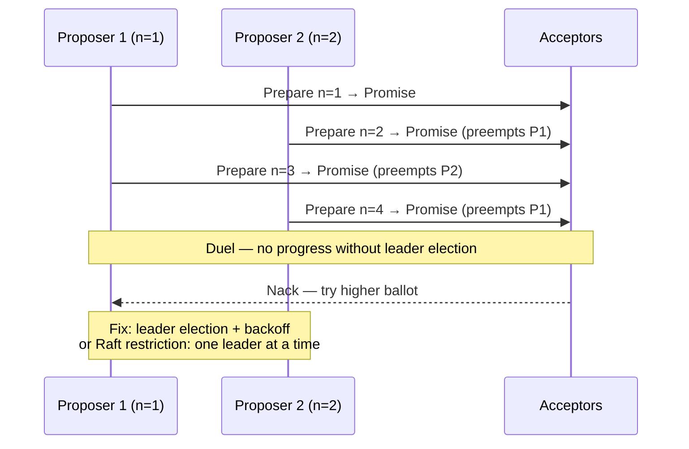

# Chapter 5 — Consensus I: Paxos

**What this chapter covers.** Chapters 1 through 4 dismantled the comfortable assumptions:
messages are delayed or lost, clocks disagree, FLP says no deterministic algorithm can guarantee
agreement in a fully asynchronous system, and CAP forces a choice when the network partitions.
This chapter builds the machine that lives inside those constraints. **Consensus** — getting a
set of machines that can crash and a network that can delay anything to agree on a single value,
and to never, under any schedule of failures, disagree — is the foundational primitive of
fault-tolerant systems. Every replicated database, every lock service, every configuration store,
every leader election you have ever depended on either solves consensus or delegates to something
that does.

The canonical solution is Paxos, published by Leslie Lamport and famous for two things: being
correct, and being incomprehensible. The second reputation is only half-deserved. The core
protocol — the single-decree Synod — is small: two phases, one non-obvious rule, and a safety
argument that fits on a page. What is genuinely hard is everything wrapped around it to make a
production system: the replicated log, leadership, log gaps, snapshots, membership change, and
recovery. We do the Synod in full rigor, walk its safety argument carefully, extend it to
Multi-Paxos and state-machine replication, survey the Paxos family honestly, and finish by
reconciling consensus with two-phase commit — the promise made in Volume 5, Chapter 10. Raft,
which repackages these same ideas for understandability, is Chapter 6; we point at it but leave
its specifics there.

Learning goals — after this chapter you should be able to:

- State the consensus problem precisely — agreement, validity, termination — and explain why
  Paxos guarantees safety unconditionally but liveness only under partial synchrony.
- Explain why consensus is *the* primitive: its equivalence to atomic broadcast and state-machine
  replication, and its identity with CAS one layer down (Volume 4, Chapter 4).
- Execute single-decree Paxos by hand: both phases, the acceptor's state machine, and the
  phase-2 value-adoption rule, stated exactly.
- Reconstruct the safety argument: why quorum intersection makes a chosen value impossible to
  un-choose.
- Explain the livelock of dueling proposers and why every practical system elects a distinguished
  proposer.
- Describe Multi-Paxos: the log of instances, the stable-leader optimization, gap filling, and
  reconfiguration.
- Place Flexible Paxos and EPaxos in the design space, in one paragraph each.
- Reconcile 2PC and consensus precisely, including Spanner's layering of 2PC over Paxos groups.

## The consensus problem, precisely

Consensus is easy to state and worth stating exactly, because every word carries weight. A set of
*n* processes each proposes a value. The protocol must satisfy:

- **Agreement.** No two correct processes decide different values.
- **Validity.** The decided value was proposed by some process. (This rules out the trivial
  "always decide 42" solution, which satisfies agreement vacuously and is useless.)
- **Termination.** Every correct process eventually decides.

Agreement and validity are **safety** properties: they say nothing bad ever happens, and a
violation is observable at a specific instant in a specific execution. Termination is a
**liveness** property: something good eventually happens. The distinction is not academic — it is
the exact seam along which Paxos is built.

Chapter 1 introduced the FLP result (Fischer, Lynch, and Paterson, 1985): **in a fully
asynchronous system, no deterministic protocol can solve consensus with even one process that may
crash.** The intuition is that in pure asynchrony a crashed process is indistinguishable from a
slow one, so any protocol can be driven by an adversarial scheduler into postponing its decision
forever — always one message away from deciding, never deciding. FLP does not say consensus is
impossible in practice; it says *termination cannot be guaranteed deterministically* under the
weakest timing assumptions.

Paxos responds by refusing to trade away the properties that matter. It guarantees **safety
always** — under any message delays, any losses, any reorderings, any number of crashes and
recoveries — and **liveness only under partial synchrony**: when the network behaves reasonably
for long enough (message delays bounded, some stable leader emerging), decisions happen. When the
network misbehaves, Paxos does not decide wrongly; it simply does not decide yet. This is the
correct engineering posture, and every serious consensus system since has adopted it. Internalize
the split now: **safety is unconditional, liveness is conditional**, and when we later find a
liveness hole in Paxos we will not panic, because the hole can never produce a wrong answer.

One more scoping note. Paxos tolerates **crash faults** — processes stop, possibly restart with
their stable storage intact — and requires a majority of the *n* acceptors to be alive and
reachable to make progress: *n = 2f + 1* nodes tolerate *f* failures. It does not tolerate
Byzantine faults (lying processes); that is a different and more expensive problem family, which
we gesture at in Chapter 12's discussion of what testing can and cannot establish.

## Why consensus is *the* primitive

Consensus looks narrow — agree on one value, once — but it is the universal ingredient, because of
a chain of equivalences worth knowing by name.

**Consensus ⟹ atomic broadcast ⟹ state-machine replication.** *Atomic broadcast* (also called
total-order broadcast) delivers messages to all processes in the same order. Given consensus, you
build it by running one consensus instance per sequence-number slot: everyone agrees on what
message occupies slot 1, then slot 2, and so on, and delivers in slot order. Given atomic
broadcast, consensus is trivial: broadcast your proposal and decide the first value delivered. The
two problems are equivalent — each implements the other. And atomic broadcast plus a
**deterministic state machine** gives you *state-machine replication* (SMR): if every replica
starts in the same state and applies the same commands in the same order, every replica passes
through the same sequence of states. Any service you can express as a deterministic state machine
— a key-value store, a lock table, a metadata catalog — becomes fault-tolerant by feeding it an
agreed log. This is Lamport's 1978 state-machine approach, and it is *the* architecture of
replicated systems; Multi-Paxos, below, is exactly this construction.

**Consensus is the distributed CAS.** Volume 4, Chapter 4 presented Herlihy's consensus hierarchy:
atomic registers have consensus number 1, and compare-and-swap has consensus number ∞ — with CAS
you can build wait-free consensus, and hence any concurrent object, for any number of threads.
The same statement holds one layer up with the roles reversed: a consensus protocol *is* a
compare-and-swap whose "memory cell" is replicated across failure domains. Single-decree Paxos is
precisely "CAS from ⊥ to *v*, exactly once, surviving the crash of any minority of the machines
implementing the cell." Cassandra makes this literal — its lightweight transactions expose an `IF`
clause that is CAS implemented by running Paxos, as we will see. The shared-memory world got its
universal primitive from the hardware vendor; the distributed world has to build it out of
unreliable parts, and this chapter is the construction.

The practical corollary: when a design says "we just need the nodes to agree on which one is
primary" or "we just need at-most-once processing of this record," it needs consensus, whether the
designer knows it or not. Systems that need consensus and improvise it instead — heartbeat-based
failover with no quorum, "the node with the lowest IP wins" — are the origin of a large fraction
of split-brain incidents. We return to this in the lens section.

## Single-decree Paxos: the Synod

The single-decree protocol — Lamport's *Synod* — chooses exactly one value, once, forever. It is
the unit of everything that follows, so we do it exactly.

### Roles and proposal numbers

Three roles, usually co-located on the same physical nodes but logically distinct:

- **Proposers** propose values and drive the protocol.
- **Acceptors** are the memory. A value is **chosen** when a majority of acceptors have accepted
  it. Acceptors are the only role whose state matters for safety.
- **Learners** find out what was chosen; they hold no protocol state.

Every proposal carries a **proposal number** *n*. Numbers must be totally ordered and unique
across proposers — the standard construction is a monotonic counter concatenated with the
proposer's node ID, so proposer 2's numbers are (1,2), (2,2), … and can never collide with
proposer 3's. A proposer that learns of a higher number in use resumes with a number higher still.

### The two phases

**Phase 1a — prepare.** A proposer picks a new proposal number *n* and sends `prepare(n)` to at
least a majority of acceptors (in practice, all of them).

**Phase 1b — promise.** An acceptor receiving `prepare(n)` compares *n* against the highest
proposal number it has ever promised. If *n* is higher, it replies with a **promise**: *"I will
never accept any proposal numbered less than n"* — and crucially, the reply also carries **the
highest-numbered proposal (number and value) this acceptor has ever accepted, if any**. If *n* is
not higher than an existing promise, the acceptor rejects (or ignores) the prepare; a rejection
carrying the higher number it has seen is a useful optimization, letting the proposer retry
intelligently rather than blindly.

**Phase 2a — accept.** If the proposer collects promises from a majority of acceptors, it sends
`accept(n, v)` to the acceptors, where the choice of *v* is governed by the one rule in Paxos that
everything else exists to serve:

> **The value rule.** If any promise in the phase-1 majority reported a previously accepted
> proposal, the proposer **must** set *v* to the value of the **highest-numbered** proposal among
> all those reported. Only if *no* acceptor in the majority reported any accepted proposal is the
> proposer free to use its own value.

This is not an optimization and not a heuristic. It is the entire safety mechanism, and the next
section is devoted to why. Note what it implies about proposers: a proposer is not an advocate for
its own value; it is a volunteer executor that will happily drive *someone else's* value to
completion if the protocol demands it.

**Phase 2b — accepted.** An acceptor receiving `accept(n, v)` accepts it — records (*n*, *v*) as
its accepted proposal — **unless** it has meanwhile promised a number greater than *n* (a later
proposer's phase 1 got there first). On accepting, it notifies the learners (or a distinguished
learner that fans out, saving messages). When any learner observes that a majority of acceptors
accepted the same proposal, the value is **chosen**, and no different value can ever be chosen.

Two engineering details that are part of the protocol, not afterthoughts. First, **acceptor state
is persistent**: the promised number and the accepted (*n*, *v*) must be written to stable storage
*before* replying. An acceptor that forgets a promise after a crash-restart can break safety —
this is the fsync-before-ack rule of Volume 5, Chapter 7, appearing in its distributed form.
Second, majorities matter because **any two majorities of the same acceptor set intersect** in at
least one acceptor. Every safety property below is bought with that intersection.

The acceptor, in full — this is genuinely all of it:

```python
class Acceptor:
    def __init__(self, stable):
        self.stable = stable                  # crash-persistent storage
        self.promised_n = stable.load("promised_n", default=MINUS_INFINITY)
        self.accepted   = stable.load("accepted",   default=None)  # (n, v) or None

    def on_prepare(self, n):
        if n > self.promised_n:
            self.promised_n = n
            self.stable.store("promised_n", n)      # persist BEFORE replying
            return Promise(n, self.accepted)        # ship prior accepted (n, v), if any
        else:
            return Reject(self.promised_n)          # optimization: tell them why

    def on_accept(self, n, v):
        if n >= self.promised_n:                    # >= : a promise permits its own n
            self.promised_n = n
            self.accepted   = (n, v)
            self.stable.store_all(promised_n=n, accepted=(n, v))   # persist BEFORE replying
            return Accepted(n, v)                   # also sent to learners
        else:
            return Reject(self.promised_n)
```

The happy path, with one proposer and three acceptors:



Two round trips, majority participation in each. Now the interesting part.

### Why it is safe

The claim to prove: **once a value is chosen, no different value can ever be chosen.** Not by a
later proposer, not after crashes, not under any message schedule. We argue it informally but
carefully; the structure is an induction on proposal numbers, and the induction step is where the
value rule earns its keep.

Suppose value *v* is chosen with proposal number *n*: some majority *Q* of acceptors accepted
(*n*, *v*). Consider any proposal numbered *n′ > n* that ever reaches phase 2 — we show its value
must also be *v*, taking *n′* to be the *smallest* number greater than *n* that reaches phase 2
(induction then extends the argument to all higher numbers).

The proposer of *n′* first completed phase 1 with promises from some majority *Q′*. **Q′ and Q
intersect** — any two majorities do — so at least one acceptor *a* is in both. Two cases for the
order of events at *a*:

1. *a* accepted (*n*, *v*) *before* promising *n′*. Then *a*'s promise reported (*n*, *v*) — or
   some other accepted proposal with a number between *n* and *n′*. But by the induction
   hypothesis every proposal in that range that reached phase 2 carries value *v*, so whatever *a*
   reported, its value is *v*. Moreover the highest-numbered proposal reported by *anyone* in
   *Q′* is at least *n* and less than *n′*, so it too carries *v*. The value rule then **forces**
   the proposer of *n′* to adopt *v*. It cannot propose anything else.

2. *a* promised *n′* *before* accepting (*n*, *v*). Then when `accept(n, v)` later arrived, *a*
   held a promise for *n′ > n* and **rejected it** — so *a* never accepted (*n*, *v*) at all,
   contradicting *a* ∈ *Q*. This case cannot occur.

Either the later proposer is forced to carry the chosen value forward, or the choosing majority
was never assembled in the first place. There is no third path, because every phase-2 acceptance
at an acceptor is either before or after its phase-1 promise, and acceptor state is persistent —
crashes do not create a third ordering.

Notice what the machinery is *for*. The promise ("I will reject anything below *n*") freezes the
past: after phase 1, no proposal older than *n′* can sneak into the intersection acceptors and
change what the proposer learned. The reported accepted values transmit the past: anything already
chosen — or possibly chosen, since the proposer cannot distinguish "chosen" from "accepted by some
acceptors" — is surfaced in phase 1 and adopted. Paxos never needs to *know* whether a value was
chosen; it maintains the stronger invariant that any value that *might* have been chosen is
preserved by every later proposal. Uncertainty is handled by conservatism, not by detection.

Here is the argument as an execution — a duel where the second proposer is forced to adopt the
first one's value:



Note the subtlety the diagram surfaces: X had been accepted by only *one* acceptor — it was not
chosen, and P2 was in principle free to choose Y. But P2 cannot tell whether A1's acceptance is a
lone straggler or the visible edge of a majority, so the rule makes it adopt X regardless. Paxos
sometimes completes a value that had not been chosen and did not need to survive. That is the
price of conservatism, and it is the right price: validity still holds (X was proposed by
someone), and agreement is never at risk.

### Liveness: dueling proposers and the livelock

Now the hole FLP promised us. Two proposers, alternating:

P1 completes phase 1 with *n* = 5. Before P1's accepts land, P2 completes phase 1 with *n* = 7 —
acceptors promise 7, and now reject P1's `accept(5, …)`. P1, seeing rejections, retries with
*n* = 9, and its prepares cause the acceptors to reject P2's `accept(7, …)`. P2 retries with 11.
Each proposer's phase 1 invalidates the other's phase 2, forever. No value is ever chosen.

This is a **livelock** — everyone is busy, nobody progresses — and it is structurally the same
failure as two threads endlessly retrying and mutually aborting a CAS loop, or the
politeness-livelock of Volume 4, Chapter 5. Note carefully what has *not* happened: no acceptor
has accepted conflicting values; safety is intact. The protocol is not wrong, it is stuck. FLP
guarantees some such execution exists for any protocol; Paxos's virtue is that its stuck
executions are merely stuck.

The fix is the one every practical system converges on: **a distinguished proposer**. Elect a
single leader — typically by timeout: if you have not heard from the current leader in *T*
milliseconds, attempt to take over with a higher proposal number, with randomized timeouts to
break symmetry — and route all proposals through it. With one active proposer, there is no duel,
and consensus completes in the two round trips of the happy path. Under partial synchrony the
election stabilizes and liveness follows; during instability there may transiently be two
self-believed leaders, and then *safety does not depend on the election being correct* — two
"leaders" are just two dueling proposers, which we have already shown cannot violate agreement.
The election only needs to be right *eventually*, for liveness. This layering — sloppy, fast
leader election on top of an unconditionally safe core — is the signature move of the entire
consensus literature, and you will see it again with different clothes in Raft's terms and
elections (Chapter 6).

## Multi-Paxos: from one decision to a replicated log

Real systems do not need one decision; they need an unbounded ordered sequence of them — a log.
The construction is direct: run an independent single-decree instance per **slot**. Instance *i*
chooses the command for log position *i*. Any majority can be down for one instance and up for
another; the instances share nothing but the acceptor nodes.

Run naively, that costs two round trips (four message delays) per command, with phase 1 executed
per slot. The **stable-leader optimization** removes most of it, and this is what "Multi-Paxos"
means in practice: when a proposer becomes leader, it runs phase 1 *once* for all slots at and
above its current position — a single `prepare(n)` covering the infinite suffix of the log.
Acceptors promise *n* for every instance ≥ the leader's start position and report any accepted
proposals they hold in that range. From then on, while its leadership is unchallenged, the leader
executes **only phase 2** per command: assign the next free slot, send `accept(n, slot, v)`, and
the command commits on a majority of acceptances — **one round trip per command**, and commands
for different slots pipeline. This is the shape of essentially every production consensus system:
steady-state replication is a single leader streaming accepts to a majority; the two-phase
machinery surfaces only at leadership change.



### Gaps, recovery, and reconfiguration

The pieces the neat picture omits are exactly the pieces that make consensus engineering hard.

**Log gaps.** A new leader's blanket phase 1 returns, for each slot, what the acceptors have
accepted — and the picture is ragged: slots 1–40 chosen, 42 accepted by one acceptor, 41 and 43
empty, because the old leader died mid-stream or a client request was lost. The new leader must
bring every unresolved slot below its write point to a decision before the state machine can
execute past it: for slots with a reported accepted value, it re-proposes that value under its own
number (the value rule, per instance); for genuinely empty slots it proposes an explicit **no-op**
command, closing the gap. Execution order is strict: a replica may apply slot *i* only when every
slot ≤ *i* is chosen and applied, so an unresolved slot stalls execution of everything after it —
a head-of-line blocking property worth remembering when you see p99 latency spikes at leader
failover.

**Reconfiguration.** Changing the acceptor set — replacing a dead node, growing from 3 to 5 — is
itself a question every replica must agree on, because "majority" is defined relative to the
membership: if half the cluster thinks membership is {A,B,C} and half thinks it is {A,B,C,D,E},
two disjoint "majorities" can choose different values for the same slot, and safety is gone.
Lamport's answer is elegantly recursive: **the configuration is state-machine state**, changed by
committing a reconfiguration command through the log itself, taking effect a bounded number of
slots later (α slots ahead, bounding the pipeline). Correct, subtle in the details, and a
significant fraction of real-world consensus bugs live here; Raft's joint-consensus and
single-server-change approaches (Chapter 6) are responses to precisely this subtlety.

### State-machine replication, assembled

Now the full stack: a deterministic state machine on each replica, fed by the agreed log.
Each replica applies chosen commands in slot order; identical initial state plus identical command
sequence yields identical state everywhere. This is the log-centric worldview of Volume 5,
Chapter 7 — the WAL *is* the database, replay *is* recovery — with one addition: the log itself is
now replicated and fault-tolerant. Snapshots complete the picture exactly as they do for a WAL: a
replica checkpoints its state-machine state at some slot and discards the log prefix, and a
lagging or fresh replica is caught up by snapshot transfer plus log suffix rather than replay from
slot zero.

**Writes** go through the log, unavoidably: one leader round trip to a majority. **Reads** are
where systems differentiate, and honesty is required:

- **Read through the log.** Submit the read as a command; it executes in slot order.
  Linearizable, trivially correct, and costs a full consensus round trip per read.
- **Leader-local reads with leases.** The leader serves reads from its local state machine, which
  is safe only if it is *still* the leader — a deposed leader serving reads is serving stale data,
  and linearizability is gone. The standard fix is a **leader lease**: the majority promises not
  to elect a new leader for an interval, and the leader serves local reads while its lease is
  provably unexpired. Fast — no network round trip per read — but now correctness rests on a
  *timing* assumption: bounded clock drift across nodes. This should make you flinch after
  Chapter 2, and the flinch is correct; leases are a measured re-admission of synchrony
  assumptions for performance, and their safety margin (the drift bound) is a config parameter
  someone has to get right. Spanner's leases work this way; so do etcd's lease-based reads.
- **Read index / quorum check.** Middle ground: the leader confirms leadership with one
  round of heartbeats to a majority (no log write), then serves the read locally at or after the
  confirmed commit index. One cheap round trip, no clock assumptions. Raft's ReadIndex —
  details in Chapter 6.

## The Paxos family

Fifteen years of variants exist; four are worth your attention, three of them briefly.

**Cheap Paxos** (Lamport & Massa, 2004) uses *f* + 1 active acceptors plus *f* idle backups that
participate only during failures — trading steady-state hardware for a more delicate
failure-handling path. **Fast Paxos** (Lamport, 2006) lets clients send proposals directly to
acceptors, skipping the leader and saving one message delay in the conflict-free case, at the
cost of larger quorums (typically ⌈2n/3⌉) and a collision-recovery protocol when concurrent
proposals conflict. Both are primarily interesting as points in the design space; neither is
common in production.

**Flexible Paxos** (Howard, Malkhi, and Spiegelman, 2016) is different: it is a *theorem about
classic Paxos* that practitioners should know. Re-examine the safety argument above: the only
intersection it ever used was between a phase-**1** quorum and a phase-**2** quorum. Nothing
requires two phase-2 quorums to intersect each other, or two phase-1 quorums to intersect each
other. So the majority-everywhere rule is stronger than necessary: **any quorum systems Q1 and Q2
work, provided every Q1 quorum intersects every Q2 quorum** — |Q1| + |Q2| > *n* for simple
counting quorums. This matters because the two phases run at wildly different frequencies: phase 2
runs *per command*, phase 1 only at *leader election*. Flexible Paxos lets you shrink the hot
phase-2 quorum and pay for it with a larger, rarely-assembled phase-1 quorum — in a 5-node
cluster, commit on 2 acceptances if elections require 4 promises. The trade is real: smaller
phase-2 quorums also mean fewer node failures tolerated for *write availability* before a
(now larger) election can even be held. But the insight reframes what a quorum is for — not
"a majority," but "an intersection guarantee between the phase that learns the past and the phase
that writes the present" — and it licensed a generation of quorum experimentation in real systems.

**EPaxos** (Egalitarian Paxos; Moraru, Andersen, and Kaminsky, 2013) attacks the leader itself:
in a geo-replicated system, a single leader is a throughput bottleneck and a latency penalty for
every client on the wrong continent. EPaxos has no leader — any replica proposes directly — and
replaces the totally-ordered log with a **dependency graph**: commands that do not conflict
(touch disjoint keys) commit independently in one round trip from whichever replica is nearest,
and only conflicting commands pay for ordering, with replicas executing strongly-connected
components of the graph in a deterministic order. Conceptually important — it shows total order
per se is not the requirement, only order among conflicts — but the execution machinery is
complex enough that production adoption has been thin, and subsequent analysis found subtle bugs
in the original recovery protocol. Its ideas resurface in leaderless and multi-leader designs,
including Cassandra's Accord.

## Why Paxos is famously hard

The reputation deserves an honest accounting, because its causes are instructive.

**The history did real damage.** Lamport wrote "The Part-Time Parliament" around 1990, presenting
the protocol through an extended allegory about the legislature of the Greek island of Paxos,
complete with pseudo-Greek names for the legislators. Reviewers found the framing baffling; the
paper sat unpublished for eight years, circulating as lore, and finally appeared in *TOCS* in
1998 mostly unchanged. By then the protocol was already load-bearing inside serious systems, but
a generation of readers bounced off the allegory. Lamport's 2001 "Paxos Made Simple" — abstract:
"The Paxos algorithm, when presented in plain English, is very simple." — is the plain
presentation, and this chapter's Synod section is essentially its content. Read it; it is short
and it delivers.

**The real difficulty was never the Synod.** The honest witness here is Google's "Paxos Made
Live" (Chandra, Griesemer, and Redstone, 2007), the experience report from building the
Chubby lock service's replicated core. Their summary is the quote every engineer should carry:
the gap between the algorithm in the literature and a production system is **non-trivial** —
Multi-Paxos details, disk corruption handling (an acceptor whose disk lies has *forgotten its
promises*, which is a safety threat, so Chubby ran checksummed disks and made a corrupted replica
rejoin as a non-voting learner until it caught up), master leases, snapshots, reconfiguration,
database transfer to new replicas, and a testing effort that dwarfed the protocol implementation.
They found bugs in their own extensions that model-checking the core would never have caught, and
noted pointedly that the fault-tolerance literature, by proving the core and hand-waving the
rest, had left them to invent and debug the rest themselves. The paper is twenty pages of exactly
the material Lamport's papers omit, and it is the single best corrective to the belief that
understanding the Synod means you can ship consensus.

**And that gap is what motivated Raft.** Ongaro and Ousterhout's 2014 paper is titled "In Search
of an Understandable Consensus Algorithm," and its explicit design criterion — evaluated by
teaching both algorithms to students and measuring quiz scores — was understandability. Raft is
not a different mathematical animal: it is leader-based log replication with quorum intersection,
the same safety skeleton, restructured so that the leader is primary (elected first, log flows
one way), the log is kept dense and ordered by construction, and the corner cases the Paxos
literature leaves as exercises are specified in one paper. Chapter 6 gives it the full treatment;
go there next.

## Where Paxos actually runs

**Chubby** (Burrows, 2006) is Google's lock service: a five-replica cell running Multi-Paxos
under a replicated database, exposing a filesystem-like namespace of small files and advisory
locks. Its consensus is an implementation detail; its *interface* is locks and small files, which
is why GFS, Bigtable, and half of Google use it for leader election and configuration — a handful
of consensus cells servicing thousands of client systems that never touch Paxos directly. Chubby
is the prototype of the "coordination service" pattern — ZooKeeper and etcd are its descendants —
covered in Chapter 8.

**Spanner** (Corbett et al., 2012) runs Paxos at planetary scale: every tablet of data belongs to
a **Paxos group** of replicas spanning datacenters, with a long-lived leader holding a lease,
replicating a write log — thousands of independent Multi-Paxos instances as the storage layer's
replication fabric (Volume 5, Chapter 12 covers Spanner whole, including TrueTime). Its use of
2PC *on top of* Paxos groups is the subject of the next section.

**Cassandra's lightweight transactions** are the CAS framing made product. `INSERT … IF NOT
EXISTS` and `UPDATE … IF value = expected` run single-decree Paxos among the replicas of the
affected partition — linearizable compare-and-set on top of an otherwise eventually-consistent
store, exactly Volume 4, Chapter 4's primitive rebuilt from quorums. The cost profile deserves
honesty: classic LWTs take **four round trips** (prepare/promise, a read of the current value,
propose/accept, commit) versus one for a normal quorum write, contending proposers can livelock
under heavy contention on hot keys — the dueling-proposers failure, live in production, because
per-key Paxos has no stable leader — and the latency multiple is real. Cassandra 4.1's Paxos v2
cut round trips and contention costs, and the Accord protocol (EPaxos lineage) is its successor
for general transactions. Use LWTs for the rare correctness-critical CAS, not as a default write
path.

## 2PC and consensus, reconciled

Volume 5, Chapter 10 ended with a promise: 2PC and consensus look confusingly similar — rounds,
votes, a coordinator — and the difference would be made precise here. It is a difference of
*problem*, not of protocol quality.

**Two-phase commit solves atomic commitment**: *n* participants each hold a local yes/no vote
(can I commit my part of this transaction?), and the outcome must be commit **only if every
participant voted yes**. Unanimity is the spec — participant votes are facts about local state
(constraints checked, locks held, redo logged), and no majority can outvote a participant whose
disk cannot commit. **Consensus solves agreement**: any proposed value may win as long as
everyone agrees; a majority suffices, and a minority's silence is tolerable. From this one
difference the operational contrast follows mechanically. 2PC requires unanimity, so it **cannot
tolerate even one relevant failure**: a coordinator crash after prepare leaves participants
in-doubt, holding locks, blocked — they cannot commit (maybe someone voted no) and cannot abort
(maybe the coordinator decided commit and told a participant that is also down). Consensus
requires a majority, so it **tolerates any minority failure, including the leader**: a new leader
runs phase 1, learns anything possibly decided, and continues. 2PC is availability-fragile by
specification; consensus is availability-robust by specification.

The synthesis — Spanner's move, and by now the industry-standard one — is to notice that 2PC's
blocking has a single root cause: **the coordinator's decision lives in one place**. So put it in
more than one place: **run the coordinator itself as a state machine replicated by Paxos.** The
decision (commit/abort) is committed to the coordinator group's Paxos log before it is announced;
if the coordinator's leader dies, the group elects a new leader that reads the decision — or its
absence — from the replicated log and resumes the protocol. Each *participant* is likewise a
Paxos group, so participant votes survive individual node deaths too. The layering is exact:
**2PC provides atomicity across groups** (unanimity where unanimity is the spec), **Paxos
provides fault tolerance within each group** (so no single machine's death blocks anything). 2PC
over Paxos is still 2PC — a partitioned-away participant *group* still blocks the transaction,
per the spec — but the classic in-doubt window from a single machine crash is engineered away.



Read the layering as a slogan: *2PC decides what all must do; Paxos makes sure nobody who decided
can forget.* When someone tells you "2PC is obsolete, consensus replaced it," they have the
relationship wrong — the problems are different, and the modern answer composes them.

## The distributed-systems lens

This volume's lens usually connects a topic outward to large-scale engineering. Consensus *is*
large-scale engineering's foundation, so the lens turns reflexive: connect it back down to
Volume 4, where every idea in this chapter has a shared-memory twin.

**Consensus is mutual exclusion writ large.** A Multi-Paxos leader is exactly a lock holder: one
agent at a time is licensed to mutate the shared resource (the log), everyone else queues behind
it, and the phase-1/election machinery is the lock acquisition path. The analogy carries the
pathologies too. Leader churn is a **lock convoy** (Volume 4, Chapters 2 and 5): every leadership
change stalls all writers behind an expensive handoff — blanket phase 1, gap resolution — so a
flapping leader (aggressive election timeouts plus a jittery network) produces the same sawtooth
throughput as a convoying mutex, and the tuning is the same in spirit: make handoffs rare and the
critical section fast. And a leader lease is precisely a lock with a timeout, which drags in the
timeout-lock's classic hazard — the holder that does not know it has been deposed — answered here
by fencing (Chapter 2) and by clock-drift safety margins.

**Quorum intersection is a memory barrier.** Volume 4, Chapter 3's acquire/release pair creates a
visibility point: everything before the release is visible to everything after the acquire.
Paxos's phase 1 is the same construction across machines. The phase-2 write to a majority is the
release — the value is now lodged where no future quorum can miss it; the new proposer's phase 1
against an intersecting quorum is the acquire — it is *forced* to observe and respect everything
released before it. The store buffer even has its twin: a value accepted by a lone acceptor is a
buffered store, written but not yet globally visible, and the value-adoption rule is the
coherence machinery that drains it into the global order rather than letting it be silently
overwritten. Same design space, one layer up — the claim from Volume 4, Chapter 3's lens table,
now witnessed from the other side.

**And the same engineering moral.** Volume 4, Chapter 4 closed with: do not write lock-free data
structures; use the ones experts shipped. The distributed edition is stronger, because the
failure modes are worse and the testing is harder (Chapter 12): **do not hand-roll consensus.
Use etcd, ZooKeeper, or your platform's equivalent** (Chapter 8 covers them as systems). The
gravitational pull to violate this is real — consensus hides inside innocuous-sounding features
like "automatic failover," "exactly-once delivery," and "distributed scheduler," and teams
implement heartbeat-plus-takeover without noticing they have reinvented leader election minus the
safety argument. The test: if two nodes could simultaneously believe they hold a role, and that
belief can corrupt data, you need real consensus underneath — a lease from etcd plus a fencing
token, not a heartbeat and a prayer. "Paxos Made Live" is the measure of what doing it properly
cost a team of strong engineers at Google with a correct algorithm in hand; your feature team
will not budget for it, and should not have to.

## Key takeaways

- **Consensus = agreement + validity + termination.** Agreement and validity are safety;
  termination is liveness. FLP forbids guaranteeing all three deterministically under pure
  asynchrony, so Paxos guarantees **safety unconditionally and liveness under partial synchrony**
  — stuck is possible, wrong is not.
- **Consensus is the universal primitive**: equivalent to atomic broadcast, which plus a
  deterministic state machine gives state-machine replication. It is CAS with consensus number ∞
  (Volume 4, Chapter 4) rebuilt across failure domains.
- **The Synod is two phases and one rule.** Phase 1: `prepare(n)` collects promises (reject
  everything below *n*) and any previously accepted proposals. Phase 2: `accept(n, v)` where
  **v must be the value of the highest-numbered accepted proposal reported in phase 1** — the
  proposer's own value only if none was reported. Acceptor state is fsync-persistent.
- **Safety = quorum intersection + the value rule.** Any later proposer's phase-1 majority
  intersects any choosing majority, so it either learns the chosen value and is forced to adopt
  it, or its promises prevented the choice from completing. Chosen values cannot be un-chosen.
- **Liveness fails via dueling proposers** — a livelock, the distributed twin of Volume 4,
  Chapter 5's — fixed by a timeout-elected distinguished proposer. The election may be sloppy:
  safety never depends on it, only liveness does.
- **Multi-Paxos = one instance per log slot + stable leader.** Phase 1 runs once per leadership
  over all slots; steady state is one round trip per command. New leaders must resolve log gaps
  (re-propose or no-op) before executing past them; reconfiguration flows through the log itself.
- **Reads are not free**: read-through-log (slow, clean), leader leases (fast, reintroduces clock
  assumptions), or quorum read-index (the middle). Know which one your system uses.
- **Flexible Paxos**: phase-1 and phase-2 quorums need only intersect *each other* — shrink the
  per-command quorum, enlarge the per-election one. **EPaxos**: no leader, order only conflicts
  via dependency graphs. Cheap and Fast Paxos exist; know the names.
- **The Synod is simple; the system is not.** "Paxos Made Live" documents the gap — gaps,
  snapshots, disk corruption, reconfiguration, testing — and that gap, not the math, is why Raft
  (Chapter 6) was designed for understandability and why Chubby, Spanner, and Cassandra LWT ship
  Paxos behind interfaces.
- **2PC ≠ consensus, precisely**: 2PC is atomic commitment (unanimity; blocks on coordinator
  failure), consensus is majority agreement (tolerates minority failure, leader included).
  Spanner composes them — 2PC across Paxos groups, the coordinator's own state on Paxos — so the
  decision can never be lost with a single machine.
- **Never hand-roll consensus.** If split-brain can corrupt your data, put etcd or ZooKeeper
  under it (Chapter 8). Same moral as "don't write lock-free structures," with higher stakes.








## Further reading

- Lamport, L., "The Part-Time Parliament," *ACM Transactions on Computer Systems* 16(2), 1998 —
  the original, allegory and all; read it second, not first.
  https://dl.acm.org/doi/10.1145/279227.279229
- Lamport, L., "Paxos Made Simple," *ACM SIGACT News* 32(4), December 2001 — the plain-English
  Synod; the single best short read on this chapter's core.
  https://lamport.azurewebsites.net/pubs/paxos-simple.pdf
- Fischer, M., Lynch, N., and Paterson, M., "Impossibility of Distributed Consensus with One
  Faulty Process," *JACM* 32(2), 1985 — FLP. https://dl.acm.org/doi/10.1145/3149.214121
- Chandra, T., Griesemer, R., and Redstone, J., "Paxos Made Live — An Engineering Perspective,"
  *PODC*, 2007 — the honest account of the paper-to-production gap; mandatory before implementing
  anything. https://dl.acm.org/doi/10.1145/1281100.1281103
- Burrows, M., "The Chubby Lock Service for Loosely-Coupled Distributed Systems," *OSDI*, 2006 —
  consensus packaged as a lock service; the ancestor of ZooKeeper and etcd.
  https://research.google/pubs/pub27897/
- Howard, H., Malkhi, D., and Spiegelman, A., "Flexible Paxos: Quorum Intersection Revisited,"
  *OPODIS*, 2016 — the generalization of Paxos's quorum requirement.
  https://arxiv.org/abs/1608.06696
- Moraru, I., Andersen, D., and Kaminsky, M., "There Is More Consensus in Egalitarian
  Parliaments," *SOSP*, 2013 — EPaxos. https://dl.acm.org/doi/10.1145/2517349.2517350
- Ongaro, D. and Ousterhout, J., "In Search of an Understandable Consensus Algorithm," *USENIX
  ATC*, 2014 — Raft; the forward pointer to Chapter 6.
  https://www.usenix.org/conference/atc14/technical-sessions/presentation/ongaro
- Corbett, J. et al., "Spanner: Google's Globally-Distributed Database," *OSDI*, 2012 — Paxos
  groups and 2PC-over-Paxos at scale; treated fully in Volume 5, Chapter 12.
  https://research.google/pubs/pub39966/
- Van Renesse, R. and Altinbuken, D., "Paxos Made Moderately Complex," *ACM Computing Surveys*
  47(3), 2015 — Multi-Paxos with all the roles and pseudo-code spelled out; the bridge between
  "Paxos Made Simple" and an implementation.
- Volume 4, Chapters 4 and 5 — CAS and the consensus hierarchy; livelock — the shared-memory
  twins of this chapter's primitive and its failure mode.
- Volume 6, Chapters 6 and 8 — Raft, and the coordination services that let you never implement
  any of this yourself.
