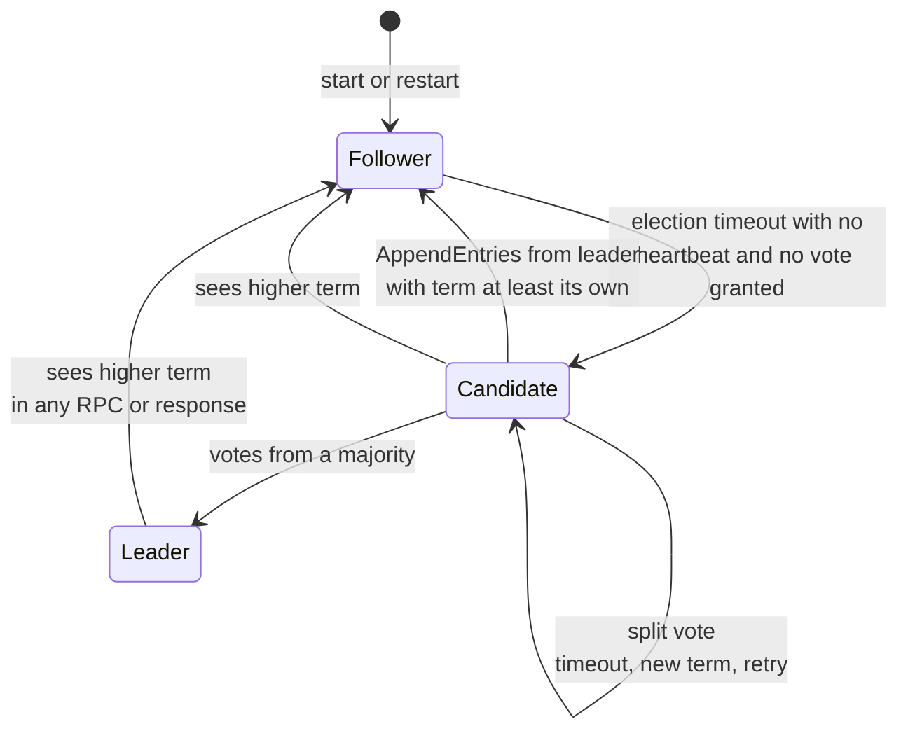
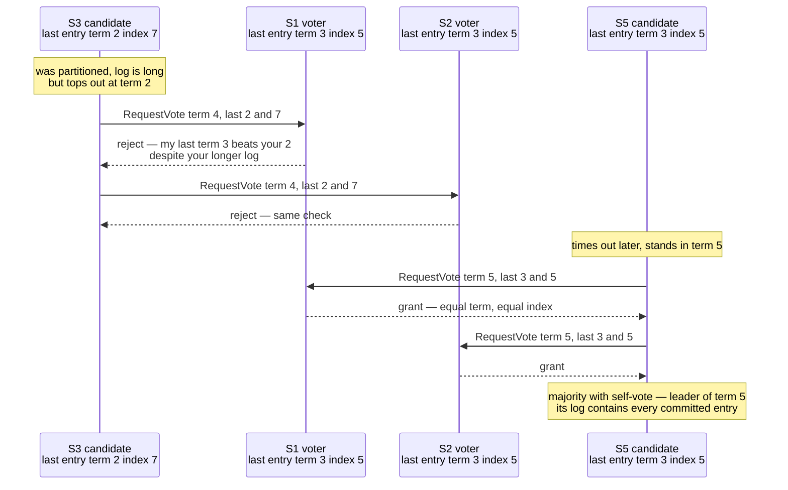
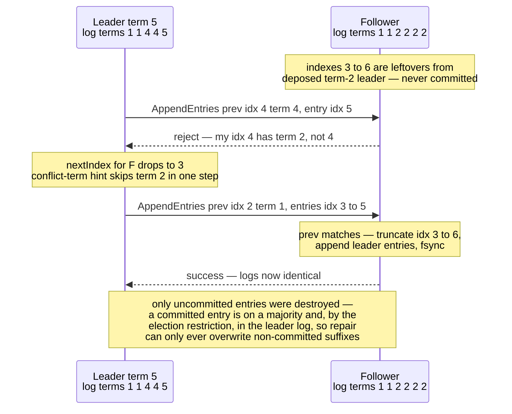
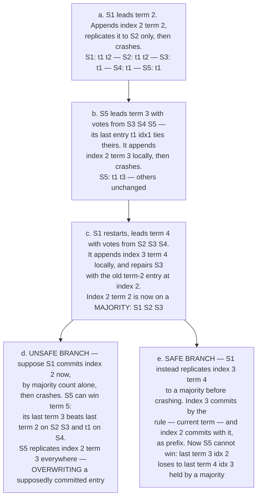

# Chapter 6 — Consensus II: Raft

**What this chapter covers.** Chapter 5 established what consensus is, why it requires majorities,
and why it cannot be both safe and live in a fully asynchronous system — and it did so through
Paxos, which solves the problem with a minimum of mechanism and a maximum of reader suffering. This
chapter presents Raft, which solves the *same* problem with the same majority mechanics and the
same partial-synchrony liveness assumptions, but with a different engineering objective stated
explicitly in its title: understandability. We take Raft apart along the seams its designers built
into it — leader election, log replication, and safety — and we are precise about the two rules
everything hangs on: the election restriction (a candidate must have a log at least as up-to-date
as each voter's) and the commitment rule (a leader counts replicas only for entries of its own
current term). The second rule is subtle enough that the paper devotes its Figure 8 to it, and we
walk that figure step by step, because it is the heart of Raft and the place where casual
understanding fails. We then cover the parts that turn the algorithm into a system: membership
changes, snapshots, client sessions, linearizable reads, PreVote, and leader transfer. Finally we
look at Raft in production — etcd, CockroachDB and TiKV's multi-raft, Consul, Kafka's KRaft — and
at the deployment arithmetic of 3 versus 5 nodes, geo-placement, and the fsync floor.

Learning goals — after this chapter you should be able to:

- Explain Raft's decomposition and state-space constraints, and why they exist.
- State the full server-state transition rules, the voting rules, and the log up-to-date check
  exactly, and explain why that check alone makes elections safe.
- State the commitment rule exactly — current-term entries commit by counting; prior-term entries
  commit only indirectly — and reproduce the Figure 8 counterexample that motivates it.
- Trace the AppendEntries consistency check through a divergent follower log, including nextIndex
  backoff and suffix truncation.
- Enumerate the five safety properties and sketch the Leader Completeness argument.
- Explain why naive membership changes are unsafe, and what joint consensus and single-server
  changes each do about it.
- Choose among ReadIndex, leader leases, and reading through the log for linearizable reads, and
  say what each assumes.
- Do the quorum arithmetic for cluster sizing and geo-placement, and identify the stale-leader
  read as the classic Raft deployment bug.

## Understandability as a design constraint

The Raft paper (Ongaro & Ousterhout, "In Search of an Understandable Consensus Algorithm," USENIX
ATC 2014) opens with an unusual claim for a systems paper: the primary design goal was not
performance, not generality, but *understandability*. The authors' argument, developed at length
in Ongaro's 2014 Stanford thesis, is that Paxos — for all its elegance as a minimal solution — had
by then a two-decade track record of being misimplemented. Single-decree Paxos is subtle;
Multi-Paxos, the version anyone actually deploys, was never fully specified in a published
algorithm, so every production system (Chubby, ZooKeeper's ZAB, Spanner's Paxos) filled the gaps
differently, and the filled-in gaps are where the bugs live. Chapter 5 made the same observation
from the other side: the distance between the Synod protocol and a running replicated state
machine is long, and Lamport left most of it as an exercise.

Raft's response is two deliberate engineering moves.

**Decomposition.** Consensus is split into three separable concerns: *leader election* (choose one
server to be in charge), *log replication* (the leader accepts commands and copies its log to
followers), and *safety* (constraints ensuring that state machines apply the same commands in the
same order). Each can be understood, specified, and tested with limited reference to the others.
Contrast Multi-Paxos, where leadership, log agreement, and recovery are entangled in one protocol
whose phases are reused for different purposes.

**State-space reduction.** Raft deliberately forbids states that Paxos permits, trading generality
for a smaller set of situations an implementer must reason about:

- **Logs never have holes.** A Raft log is a contiguous prefix of entries; a follower accepts
  entry *i* only if it already holds entries 1..*i−1* that match the leader's. Multi-Paxos allows
  slots to be chosen out of order and filled in later; Raft does not.
- **Leaders never overwrite or delete their own entries** (Leader Append-Only). A leader's log
  only grows during its term.
- **Data flows in one direction only, leader to follower.** Followers never send log entries to
  the leader, and a newly elected leader never reconstructs its log from followers — the election
  rule (below) guarantees the leader already has everything that matters. In Multi-Paxos, a new
  leader must actively query acceptors and adopt the highest-numbered values it finds; Raft
  arranges the election so that this recovery phase does not exist.

The paper backs the understandability claim with a user study: 43 students taught both algorithms
scored significantly higher on Raft questions, and by wide margins reported it easier to implement
and explain. Treat that as the paper's claim, measured on students under study conditions — but
also note the corroborating fact that within a few years of publication there were dozens of
independent Raft implementations in every mainstream language, several of production quality,
which had never happened for Multi-Paxos in twenty.

## The fundamentals: terms, states, and RPCs

### Terms are logical epochs

Raft divides time into **terms**, numbered with consecutive integers. Each term begins with an
election; at most one leader can be elected per term (Election Safety, proved below); a term with
a split vote simply ends with no leader and a new term begins. A term is exactly the kind of
logical epoch Chapter 2 developed: it is a Lamport-style counter, advanced by events rather than
by any physical clock, and it totally orders leadership eras without requiring any two servers to
agree on what time it is.

### The three states

Every server is in exactly one of three states, and the transition rules are short enough to state
completely:

- A **follower** is passive: it responds to RPCs from leaders and candidates and issues none of
  its own. If an *election timeout* elapses without hearing a valid AppendEntries from the current
  leader or granting a vote, it assumes the leader is dead and becomes a candidate.
- A **candidate** increments `currentTerm`, votes for itself, resets its election timer, and sends
  RequestVote to all peers. Three exits: it receives votes from a majority and becomes leader; it
  receives an AppendEntries from a server claiming to be leader with term ≥ its own and steps back
  to follower; or the election timer expires without either (a split vote) and it starts a new
  election in a new term.
- A **leader** sends periodic AppendEntries heartbeats to suppress elections, accepts client
  commands, and replicates. It serves until it observes a higher term, at which point it steps
  down to follower. A leader never steps down merely because of silence — an important asymmetry
  we will revisit under asymmetric partitions.



### The two RPCs

Raft needs only two RPC types (plus InstallSnapshot, added later for compaction):

- **RequestVote(term, candidateId, lastLogIndex, lastLogTerm) → (term, voteGranted)** — issued by
  candidates.
- **AppendEntries(term, leaderId, prevLogIndex, prevLogTerm, entries[], leaderCommit) → (term,
  success)** — issued by leaders, both to replicate entries and, with `entries` empty, as the
  heartbeat. Making the heartbeat the same message as replication is itself a state-space
  reduction: there is no separate liveness protocol to get wrong, and every heartbeat also carries
  the consistency check and the commit index.

Three pieces of state must be persisted to stable storage — fsynced — before responding to any
RPC: `currentTerm`, `votedFor`, and the log itself. Lose any of these across a crash and the
safety proofs collapse: a server that forgets its vote can vote twice in a term and elect two
leaders; a server that forgets log entries can break the majority-intersection argument that
commitment relies on. This is the load-bearing durability requirement, and it is where Raft's
latency floor comes from (see deployment realities below).

## Leader election

### Randomized timeouts: the livelock fix

Chapter 5 left Paxos with a liveness hole: two proposers can duel indefinitely, each new proposal
number invalidating the other's prepare phase. FLP guarantees some such hole must exist; the
engineering question is how cheaply it can be papered over in the partially synchronous case. Raft's
answer is disarmingly simple: **each server draws its election timeout uniformly at random from an
interval** — 150–300 ms in the paper's configuration. After a leader failure, one server usually
times out well before the others, wins the election before any peer even becomes a candidate, and
its heartbeats reset everyone else's timers. If two do collide and split the vote, they re-draw
random timeouts for the retry, so repeated collision is exponentially unlikely.

This is the same desynchronization trick as jitter on retry backoff (Volume 4, Chapter 5, and
every well-behaved client library): when identical deterministic timers produce a thundering herd,
randomize the timers. The paper measures it: with a 150–300 ms range, leader failure is typically
resolved in well under a second, and even adversarial schedules converge. The rule of thumb that
falls out is **broadcast RTT ≪ election timeout ≪ MTBF** — the timeout must be an order of
magnitude above network round-trip (so heartbeats reliably suppress elections) and far below the
mean time between failures (so leaderless windows are rare).

### The voting rules and the up-to-date check

A voter grants its vote if and only if all of the following hold:

1. The candidate's term is at least the voter's `currentTerm`.
2. The voter has not already voted for a *different* candidate in this term (`votedFor` is null or
   equals this candidate). One vote per term, first come first served, persisted before replying.
3. **The candidate's log is at least as up-to-date as the voter's**, where up-to-date is defined by
   comparing the last entries: the log whose last entry has the **higher term** is more up-to-date;
   if the last terms are **equal**, the **longer log** (higher last index) is more up-to-date.

Rules 1 and 2, plus majority intersection, give Election Safety: two leaders in one term would
require two disjoint majorities of voters, and majorities intersect.



### Split votes and re-election

When two candidates split the vote, neither reaches a majority, both time out, and both retry in a
higher term with fresh random timeouts. Nothing needs to be undone: the failed term simply never
had a leader, and any votes cast in it are irrelevant to later terms. The cost of a split vote is
one extra timeout interval of unavailability for writes — reads may continue under a lease, per
below. Note what happens to *reads and writes in flight* during any election: clients talking to
the old leader get failures or timeouts and must retry against the new one, which is why the client
session machinery later in this chapter is not optional.

## Log replication

### The happy path

The leader appends the client's command to its own log at the next index, tagged with
`currentTerm`, then sends AppendEntries to all followers in parallel. Each follower appends the
entries (after the consistency check, next section), fsyncs, and acknowledges. When the leader
learns that an entry is stored on a **majority of servers, itself included**, and the entry's term
is the leader's current term, it marks the entry **committed**: it advances `commitIndex`, applies
the entry to its state machine, and responds to the client. Followers learn the commit index
piggybacked on subsequent AppendEntries (`leaderCommit`) and apply in log order. Commitment of an
entry commits the entire prefix before it, always.

Two properties jointly called **Log Matching** hold at all times: if entries in two logs have the
same index and term, (a) they store the same command, and (b) the two logs are identical in all
preceding entries. Property (a) holds because a leader creates at most one entry per index in its
term and never moves it (Leader Append-Only). Property (b) is maintained inductively by the
consistency check.

### The consistency check, divergence, and repair

Every AppendEntries — heartbeats included — carries `prevLogIndex` and `prevLogTerm`: the index
and term of the entry immediately preceding the new ones. The follower's handler is the induction
step that keeps Log Matching true:

```go
func (f *Follower) handleAppendEntries(req AppendEntriesReq) AppendEntriesResp {
    if req.Term < f.currentTerm {
        return AppendEntriesResp{Term: f.currentTerm, Success: false} // stale leader: fenced
    }
    f.observeTerm(req.Term)     // adopt higher term if any; either way, revert to follower
    f.resetElectionTimer()      // a valid leader exists

    // Consistency check: do I hold the entry the leader thinks precedes this batch?
    if req.PrevLogIndex > f.log.LastIndex() ||
        f.log.TermAt(req.PrevLogIndex) != req.PrevLogTerm {
        return AppendEntriesResp{Term: f.currentTerm, Success: false} // leader will back off
    }

    for i, e := range req.Entries {
        idx := req.PrevLogIndex + uint64(i) + 1
        if idx <= f.log.LastIndex() {
            if f.log.TermAt(idx) == e.Term {
                continue // duplicate delivery; idempotent
            }
            f.log.TruncateFrom(idx) // conflict: delete this entry AND ALL THAT FOLLOW
        }
        f.log.Append(e)
    }
    f.log.Sync() // fsync before acknowledging — non-negotiable

    if req.LeaderCommit > f.commitIndex {
        f.commitIndex = min(req.LeaderCommit, f.log.LastIndex())
    }
    return AppendEntriesResp{Term: f.currentTerm, Success: true}
}
```

If the check fails, the follower's log has diverged — it is missing entries, or it holds
uncommitted leftovers from some deposed leader's term. The leader maintains a `nextIndex` per
follower, initialized optimistically to its own last index + 1. On each rejection it decrements
`nextIndex` and retries with an earlier `prevLogIndex`, probing backward until the check passes —
the first point of agreement. From there, the follower truncates its conflicting suffix and adopts
the leader's entries. Decrementing by one RPC per entry is painfully slow for a long divergence,
so real implementations use the standard backoff optimization: the rejection carries the term of
the conflicting entry and the first index the follower holds for that term, letting the leader
skip a whole term per round trip.



Truncation looks alarming — followers deleting log entries — until you observe what can be
truncated: only entries the current leader does not have, and by Leader Completeness (below) every
committed entry is in the current leader's log, so truncated entries were never committed and no
client was ever told they succeeded. This is the payoff of the one-direction data flow: repair is
purely mechanical overwriting of followers with the leader's log, no negotiation.

### The commitment rule, exactly — and Figure 8

Here is the rule, stated precisely because paraphrases of it are where implementations go wrong:

> A leader advances `commitIndex` to N only if N is stored on a majority of servers **and**
> `log[N].term == currentTerm`. Entries from earlier terms are never committed by counting
> replicas; they become committed only *indirectly*, when a later entry from the leader's current
> term commits, because commitment covers the whole prefix (Log Matching guarantees the prefix
> matches on every server holding the later entry).

Why the restriction? Because "present on a majority" is **not durable** for an old-term entry — a
server can be elected leader without it and overwrite it. The paper's Figure 8 exhibits the
counterexample, and every Raft implementer should be able to reproduce it from memory. Five
servers, S1–S5; all hold a term-1 entry at index 1.



Walk branch (d) slowly. At step (c) the term-2 entry at index 2 sits on S1, S2, S3 — a majority.
If majority presence meant commitment, S1 would apply it and acknowledge the client. But S5's log
ends in term 3, which is *newer than term 2*, so the up-to-date check lets S5 collect votes from
S2, S3, and S4 (their last terms are 2, 2, 1) and become leader of term 5 — perfectly legally —
whereupon log repair overwrites index 2 on every server with S5's term-3 entry. An acknowledged
write has vanished: State Machine Safety is gone. The problem is that the entry's *term* (2) no
longer certifies anything about election outcomes once higher terms exist; replication count alone
cannot distinguish (c) from a world where the entry is genuinely safe.

Branch (e) shows what actually makes it safe: a **current-term** entry on a majority. Once index 3
(term 4) is on a majority, any future candidate must beat term 4 at the up-to-date check on at
least one member of that majority, and any log that does so necessarily contains index 3 — and,
by Log Matching, index 2 beneath it. The current-term requirement is exactly what re-couples
"replicated on a majority" to "wins all future elections."

One practical corollary: a freshly elected leader may hold committed entries from prior terms that
it cannot yet *prove* committed (it cannot count replicas for them), so it cannot advance
`commitIndex` — or safely serve ReadIndex reads — until it commits something in its own term. Real
implementations therefore have every new leader immediately append a **no-op entry** in its new
term; committing it commits the entire inherited prefix and establishes a known commit frontier.

### The five safety properties

The paper's Figure 3 states the guarantees; all have now appeared:

| Property | Statement |
|---|---|
| Election Safety | At most one leader can be elected in a given term. |
| Leader Append-Only | A leader never overwrites or deletes entries in its own log; it only appends. |
| Log Matching | If two logs contain an entry with the same index and term, the logs are identical through that entry. |
| Leader Completeness | If an entry is committed in term T, it is present in the logs of the leaders of all terms > T. |
| State Machine Safety | If a server has applied the entry at a given index, no server ever applies a different entry at that index. |

## Practical Raft

Everything so far replicates a log among a fixed set of servers with an ever-growing log. Real
systems need to change the membership, bound the log, and talk to clients correctly.

### Membership changes

You cannot switch atomically from configuration C_old to C_new by fiat, because servers adopt the
new configuration at different times, and during the transition **a majority of C_old and a
majority of C_new can be disjoint**. Concretely: growing from 3 servers to 5, two old servers can
form a C_old majority (2 of 3) and elect one leader while three new servers form a C_new majority
(3 of 5) and elect another — two leaders in the same term, using entirely legal votes. Any
membership scheme must make such disjoint quorums impossible at every instant.

The paper's original answer is **joint consensus**: the leader first replicates a configuration
entry C_old,new under which *every* decision — elections and commitment alike — requires separate
majorities from both C_old *and* C_new. Once C_old,new commits, the leader replicates C_new, and
once that commits the old servers can be shut down. At no point can two disjoint quorums exist,
because any quorum during the transition includes a C_old majority. A distinctive wrinkle:
configuration entries take effect on each server **as soon as they are appended**, not when
committed — a server always uses the latest configuration in its log.

Two operational details. New servers should join as **non-voting learners** first, catching up on
the log without counting toward (or endangering) quorum, and be promoted only when nearly current —
otherwise adding a far-behind server can stall commitment. And a server *removed* from the
configuration no longer receives heartbeats, times out, and starts elections that disrupt the
cluster with ever-higher terms; PreVote (below) and leadership-transfer discipline mitigate this.

### Log compaction and snapshots

The log cannot grow forever. Raft's answer is the same one Volume 5, Chapter 7 gave for the WAL:
**checkpoint and truncate**. Each server independently snapshots its state machine at some applied
index, records `lastIncludedIndex` and `lastIncludedTerm` (needed so the consistency check still
works at the truncation boundary), persists the snapshot, and discards the log prefix through that
index. Snapshotting is local and requires no coordination, because everything snapshotted is
committed and immutable.

The wrinkle is a follower so far behind — or freshly added — that the entries it needs have been
compacted away. For this the leader sends **InstallSnapshot**: the snapshot itself, chunked, after
which the follower discards its conflicting log and resumes normal AppendEntries from
`lastIncludedIndex + 1`. Operationally, snapshot transfer is the expensive path — for a large
state machine it is a bulk data copy that can saturate links and stall the follower — which is why
implementations tune log retention to make it rare, and why CockroachDB and TiKV engineering blogs
spend real ink on snapshot rate-limiting and scheduling.

### Client sessions and exactly-once at the state machine

### Linearizable reads

The tempting bug: the leader serves reads from its local state machine with no protocol at all.
Wrong, twice over. First, a deposed leader that has not yet observed the new term will happily
serve values the new leader has already overwritten — a stale read that violates
linearizability. Second, even a genuine leader fresh from election may not know the true commit
frontier until its no-op commits. The three correct options, in decreasing cost:

**Read through the log.** Append the read as a log entry, commit it, apply it in order. Trivially
linearizable, costs a full replication round and log space per read. Rarely the right choice
alone, but it is the fallback semantics everything else must match.

**ReadIndex.** The leader records its current `commitIndex` as the read's index, then confirms it
is *still* leader by exchanging heartbeats with a majority, then waits for its state machine to
apply through the read index, then reads locally:

```go
// Leader-side ReadIndex: linearizable read without a log write.
func (l *Leader) LinearizableRead(ctx context.Context, query Query) (Result, error) {
    if !l.hasCommittedEntryInCurrentTerm() {
        return nil, ErrLeaderNotReady // wait for the new-term no-op to commit first
    }
    readIndex := l.commitIndex // capture BEFORE the leadership check

    // One round of heartbeats; a majority of acks proves no higher term existed
    // when they answered, hence no other leader committed past readIndex.
    if ok := l.broadcastHeartbeatsAwaitMajority(ctx); !ok {
        return nil, ErrLeadershipLost // possibly deposed: retry via current leader
    }

    l.waitUntilApplied(readIndex)      // state machine catches up to the frontier
    return l.stateMachine.Read(query), nil // local read, no log entry written
}
```

Cost: one round trip to a majority per read (batchable across many concurrent reads — one
heartbeat round can validate thousands of queued ReadIndex requests), no disk write, no log
growth. Assumptions: none beyond Raft's own. This is etcd's default for linearizable reads.

**Leader leases.** Skip even the heartbeat round: after a successful quorum round at time t, the
leader assumes leadership is safe until t + electionTimeout/clockDriftBound, and serves reads
locally within the lease window. Now correctness depends on **bounded clock rates** — precisely
the assumption Chapter 2 taught you to distrust. A VM migration, a GC pause between the clock read
and the reply, or a clock running fast can extend a stale leader's confidence past a completed
election elsewhere, and stale reads follow. Systems that take this bet (CockroachDB's leases,
TiKV's lease reads) engineer around it with conservative drift bounds and by tying leases to Raft
events; systems that refuse it (etcd's default) pay the ReadIndex round trip. This is the same
lease-caveat family as Volume 4, Chapter 2's fencing discussion: a lease is a bet on clocks, and
you either bound the clocks or verify at the resource.

**Follower reads** are stale reads unless extra machinery is added — a follower may lag
arbitrarily. Honest designs either forward a ReadIndex request through the leader and wait to
apply that far (linearizable, still one leader round trip, but the *read work* moves to the
follower), or embrace boundedly stale reads at an explicitly chosen timestamp, which is what
CockroachDB's closed-timestamp follower reads do (Volume 5, Chapter 12). Staleness chosen on
purpose and labeled is a feature; staleness by accident is the classic bug.

### PreVote and leader transfer

Two refinements from Section 9.6 of the thesis and production practice, briefly:

**Leader transfer.** For planned maintenance or load balancing, the leader stops accepting new
proposals, brings the target follower fully up to date, and sends it a TimeoutNow instruction; the
target starts an election immediately — bypassing its randomized timeout — and wins, since its log
is current. Downtime shrinks from an election-timeout detection window to about one round trip.

## Raft in the wild

**etcd** is the lineage's reference point: its Go Raft package (now the standalone
`etcd-io/raft` library) is the most battle-tested implementation in existence and deliberately
ships as a *library* — the consensus core is a pure state machine; storage, transport, and
threading are the embedder's problem. Kubernetes stores every object in etcd, which makes this
particular Raft implementation load-bearing for a substantial fraction of the industry; Chapter 8
examines etcd as a coordination service in its own right.

**CockroachDB and TiKV** run Raft at a different scale: not one group, but **one Raft group per
range/region** of the keyspace — tens of thousands of groups per node (Volume 5, Chapter 12). This
multi-raft regime has failure modes single-group deployments never see. Naively, every group
heartbeats independently: 10,000 ranges × heartbeats at 10 Hz is a heartbeat storm that melts the
network with liveness traffic. Both systems coalesce heartbeats per node-pair — one physical
message carries liveness for every group sharing that pair — and both suppress idle groups
entirely: CockroachDB *quiesces* ranges with no traffic (no heartbeats at all; node-level failure
detection wakes them), and TiKV *hibernates* regions similarly. TiKV's `raft-rs` is a Rust port of
etcd's library, so the two ecosystems share a lineage and, occasionally, bugs and fixes.

**Consul** (and Nomad and Vault) run on `hashicorp/raft`, an independent Go implementation, for
service-catalog and KV state. **Kafka's KRaft** (KIP-500 and its successors) replaced the ZooKeeper
dependency with a Raft-based metadata quorum: the controller quorum replicates the cluster metadata
log using a Raft variant that is *pull-based* — followers fetch from the leader, reusing Kafka's
replica-fetch machinery — rather than the paper's push-based AppendEntries; same safety argument,
inverted transport (Volume 10, Chapter 3). The breadth of this list is the understandability
thesis's real evidence: independent, interoperating-in-spirit, production-grade implementations in
Go, Rust, Java, and C++ within a decade.

## Raft versus Multi-Paxos, honestly

Strip the presentation away and the two are siblings. Same problem; same 2f+1 majority quorums and
the same intersection argument; same partial-synchrony liveness (both need a stable
leader/distinguished proposer to make progress, both are safe without one); comparable steady-state
message complexity (one round from leader to majority per command). Raft's terms are Paxos's
proposal numbers; Raft's election is Paxos's phase 1 amortized over a term; Raft's AppendEntries
is phase 2 over a contiguous batch of slots.

The real differences are the constraints Raft adds:

The understandability payoff is not that Raft is *smarter* — as an algorithm it is arguably less
general — but that its state space is small enough that implementations tend toward correctness,
and that claim has the empirical support Multi-Paxos never accumulated: the paper's user study
(taken as the paper's claim) plus the observed proliferation of independent implementations that
pass Jepsen-grade testing.

## Deployment realities

**3 versus 5, and why 4 is worse than both.** A cluster of 2f+1 voters tolerates f failures:
3 nodes → quorum 2 → f=1; 5 nodes → quorum 3 → f=2. Even counts buy nothing: 4 nodes → quorum
⌊4/2⌋+1 = 3 → still f=1, with a fourth machine's cost, a larger replication fan-out, and one more
node that can fail. Run odd voter counts, full stop. Three is the default; five when you need to
survive a node failure *during* maintenance on another, at the price of a bigger quorum on every
commit. Beyond five, quorum latency and heartbeat overhead climb for rarely-needed fault
tolerance — scale out with more Raft *groups* (multi-raft), not more members per group.
**Non-voting learners** serve catch-up and read scaling without quorum cost; **witness** members —
voters that store log metadata but no state-machine data — appear in some systems as a cheap
tiebreaker to place in a third site.

**Geo-placement.** With one replica per region across three regions, every commit needs the leader
plus one remote ack: commit latency is the RTT to the *nearest* remote region — equivalently, the
second-fastest of the three region RTTs from the leader. Sort your candidate regions by RTT before
choosing them, and put the leader (or leaseholder) in the region nearest the write traffic; a
mis-placed leader adds a full cross-region RTT to every write. The tension is blast radius versus
latency (Volume 7, Chapter 10): three replicas in one region commit in microseconds and die
together; three regions survive a regional failure and pay tens of milliseconds per write,
forever, on every write. There is no protocol fix — it is physics plus quorum arithmetic — only
placement choices and, in multi-raft systems, per-range placement so each range pays only for the
durability it needs.

**The fsync floor.** Every commit requires the entry durable on a quorum *before*
acknowledgment — leader and followers fsync the Raft log ahead of their acks. Raft's write latency
floor is therefore max(quorum network RTT, slowest-quorum-member fsync), and on same-AZ clusters
the fsync usually dominates (Volume 5, Chapter 7's arithmetic, now paid on a quorum). Group commit
applies exactly as it did for the WAL: batch many entries per fsync. Running the Raft log on
storage that lies about flushes — or disabling fsync for benchmarks that quietly become
production — converts a crash from a liveness event into silent log divergence; Jepsen's
filesystem- and fsync-fault testing has caught real systems here.

**Asymmetric partitions and the stale leader.** A leader cut off from a quorum does not step down
by protocol — it keeps retrying AppendEntries into the void, cannot commit, and, if it serves
reads without ReadIndex or lease discipline, serves *stale* reads while a new leader on the
majority side accepts writes. This is the classic Raft deployment bug, found by Jepsen in multiple
systems' default read paths. The standard mitigation is **CheckQuorum**: a leader that fails to
reach a majority within an election timeout steps down voluntarily. CheckQuorum plus PreVote is
the production pairing — one demotes stale leaders, the other stops rejoining nodes from deposing
healthy ones — and even then, reads are only linearizable via ReadIndex or a correctly-bounded
lease, never by leadership optimism alone.

## The distributed-systems lens

Reflexively, this time — Raft is itself the infrastructure the rest of this volume leans on, so
the lens points at the connections you should now see in both directions.

**Raft's log is the WAL, generalized.** Volume 5, Chapter 7 built durability from an append-only
log, recovery from replay, and bounded logs from checkpoint-plus-truncate. Raft is the same
machinery with the log *replicated*: recovery-by-replay is how every follower and every restarted
server reconstructs state; snapshots are checkpoints; InstallSnapshot is shipping a checkpoint to
a replica that fell off the log's tail. A single-node database recovers its own past; a Raft group
recovers any member from the quorum's shared past. Once you see this, CockroachDB and TiDB
(Volume 5, Chapter 12) stop looking exotic: a distributed database is a WAL that achieved quorum.

**The leader is a lock with a lease, and terms are fencing tokens.** Volume 4, Chapter 2 ended
with the fencing-token argument: a lease-holder that stalls can act after its lease expired, so
the *resource* must reject stale tokens. Map it across: leadership is the lock; the election
timeout is the lease; a partitioned or paused leader is exactly Kleppmann's stalled lock-holder.
Raft's fencing token is the **term**, and the resource that enforces it is the quorum itself —
every AppendEntries carries the term, and followers with a higher `currentTerm` reject the stale
leader's writes mechanically. This is why Raft is safe under arbitrary pauses while
timeout-based locking is not: the fence is checked on every single operation at the point of
acceptance, not assumed from a clock. When Chapter 8 builds locks and leader election *on top of*
etcd, the same discipline recurses one level up: etcd hands out lease revisions as fencing tokens,
and your storage must check them, because your application's stale leader is not fenced by Raft's
terms — only etcd's own state is.

**Consume Raft; do not reimplement it.** The engineering moral this volume keeps repeating applies
with maximum force here. The protocol is machine-checked; your weekend implementation of it is
not, and the bug will be in single-server membership changes, or ReadIndex during leader turnover,
or fsync ordering — the corners this chapter flagged. Use etcd or Consul when you need a
coordination service; embed `etcd-io/raft`, `hashicorp/raft`, or `raft-rs` when you need the log
in-process. And then test *your* assumptions anyway: Chapter 12's central finding is that Jepsen's
catalogue of consensus failures — stale default reads, membership-change data loss,
retry-amplified double-applies — is overwhelmingly a catalogue of *implementation and integration*
bugs in systems built on Raft, not counterexamples to Raft. The protocol being correct is
necessary. It has never once been sufficient.

## Key takeaways

- Raft is Multi-Paxos's problem solved under three deliberate constraints — no log holes, leaders
  never overwrite their own entries, data flows only leader→follower — chosen to shrink the state
  space an implementer must reason about. Understandability was the explicit design goal, and the
  proliferation of correct independent implementations is its real evidence.
- **Terms are logical epochs**: at most one leader per term, higher term always wins, stale terms
  are rejected on every RPC. Terms are fencing tokens enforced by the quorum on every operation —
  this, not timeouts, is why Raft tolerates arbitrary pauses.
- Elections are made live by **randomized timeouts** (the jitter fix for dueling candidates) and
  made safe by one rule: a voter refuses any candidate whose last entry loses the **(term, index)**
  comparison against its own. Majority intersection then guarantees every elected leader already
  holds every committed entry — no recovery phase.
- The **commitment rule, exactly**: count replicas only for current-term entries; prior-term
  entries commit only as the prefix of a current-term commit. Figure 8 is the counterexample to
  every simpler rule — an old-term entry on a majority can still be overwritten. New leaders
  commit a no-op to establish the frontier.
- The **AppendEntries consistency check** (prevLogIndex/prevLogTerm) inductively maintains Log
  Matching; divergent followers are repaired by nextIndex backoff and suffix truncation, which
  only ever destroys uncommitted entries.
- Naive membership switches allow **disjoint majorities**; use joint consensus or guarded
  single-server changes (whose original description had a real bug — use a library). Snapshots
  are checkpoint-plus-truncate; InstallSnapshot ships the checkpoint.
- Linearizable reads require discipline: **ReadIndex** (quorum heartbeat round, no clock
  assumptions), **leader leases** (cheaper, bets on bounded clock drift), or reading through the
  log. Leader-local reads with none of these are the classic stale-read bug. Deploy **PreVote +
  CheckQuorum** together.
- Sizing is quorum arithmetic: 3 nodes → f=1, 5 → f=2, even counts add cost without tolerance.
  Geo commit latency is the RTT to the nearest remote quorum member; the fsync on the Raft log is
  the latency floor underneath everything.
- Raft's log is Volume 5's WAL replicated; the leader is Volume 4's lock-with-a-lease done right.
  Consume Raft via etcd/Consul or a maintained library, and point Jepsen-style testing at your
  integration — that is where the bugs actually are.

## Further reading

- Ongaro, D. and Ousterhout, J., "In Search of an Understandable Consensus Algorithm," *USENIX ATC*,
  2014 — the Raft paper; the extended version contains the full Figure 8 discussion and the user
  study. https://raft.github.io/raft.pdf
- Ongaro, D., *Consensus: Bridging Theory and Practice*, PhD thesis, Stanford, 2014 — membership
  changes, log compaction, client sessions, ReadIndex/leases, PreVote, and the safety proof; the
  companion TLA+ specification is on the Raft site.
- Ongaro, D., "bug in single-server membership changes," raft-dev mailing list, July 2015 — the
  honest footnote to the thesis's simpler membership algorithm, with the fix.
- The Raft site — interactive visualization, the TLA+ spec, and the long list of implementations.
  https://raft.github.io/
- etcd documentation and the `etcd-io/raft` library — the reference implementation lineage,
  including ReadIndex, learners, and joint-consensus support. https://etcd.io/docs/ and
  https://github.com/etcd-io/raft
- TiKV blog, "The Design and Implementation of Multi-raft" and the `raft-rs` introduction — heartbeat
  coalescing, hibernating regions, and Raft-per-region at scale. https://tikv.org/blog/
- Cockroach Labs blog, "Scaling Raft" and the CockroachDB architecture docs on Raft, leases, and
  follower reads — quiescing ranges, leaseholders, closed timestamps.
  https://www.cockroachlabs.com/blog/
- Jepsen analyses — etcd (2014 and the 3.4.3 analysis, 2020), Consul (2015), RethinkDB (2016,
  a Raft membership-change bug in the wild), and others: implementation and integration failures
  around correct cores. https://jepsen.io/analyses
- KIP-500, "Replace ZooKeeper with a Self-Managed Metadata Quorum," and KIP-595, "A Raft Protocol
  for the Metadata Quorum" — KRaft's pull-based Raft variant.
  https://cwiki.apache.org/confluence/display/KAFKA/KIP-500
- Howard, H. and Mortier, R., "Paxos vs Raft: Have we reached consensus on distributed consensus?,"
  *PaPoC*, 2020 — a careful side-by-side that formalizes how close the two algorithms really are.
- Volume 5, Chapter 7 — Write-Ahead Logging — the single-node ancestor of the Raft log.
- Volume 4, Chapter 2 — Threads, Mutual Exclusion, and Locks — leases and fencing tokens, whose
  distributed resolution is this chapter.
- Chapter 8 — Coordination Services — building locks, leases, and discovery on top of etcd.
