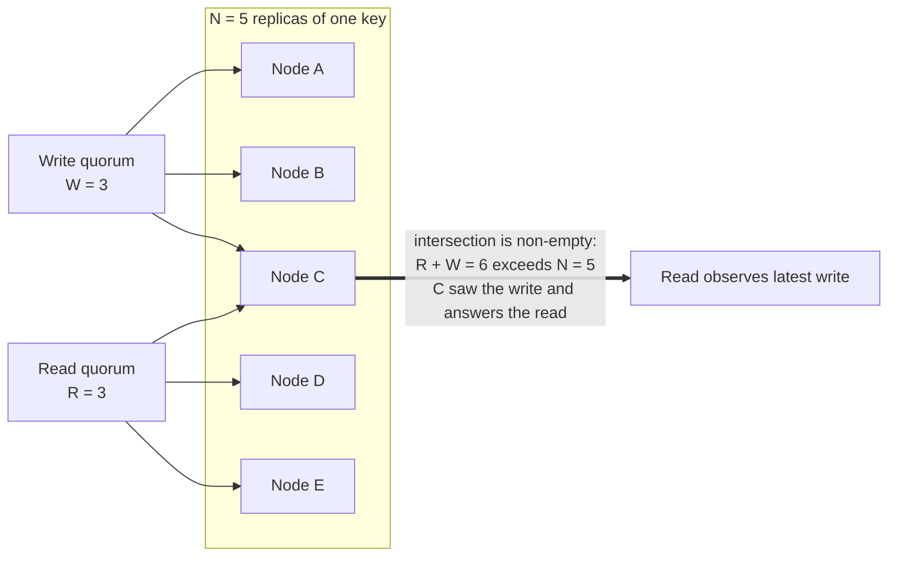
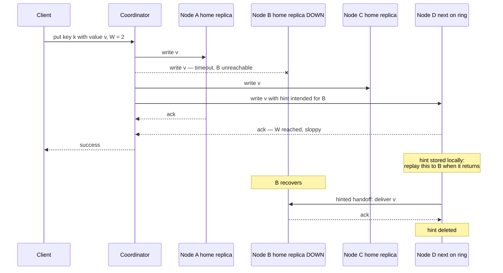
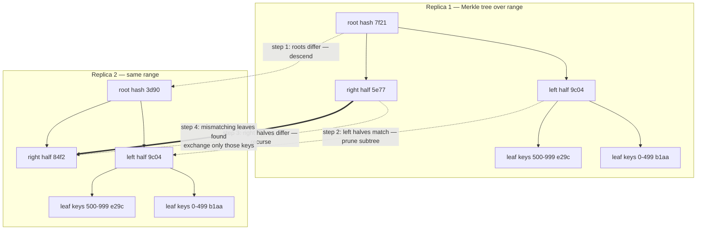
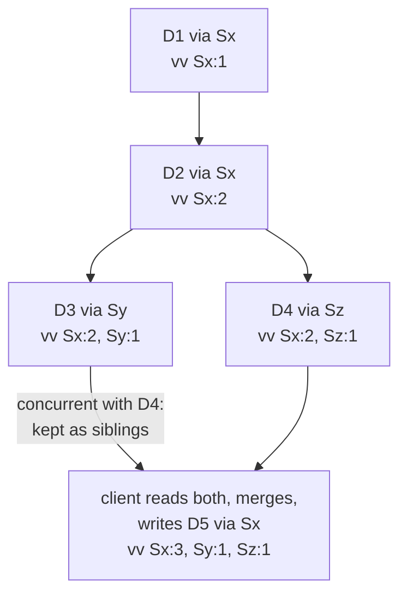

# Chapter 7 — Quorum Systems and Dynamo-Style Replication

**What this chapter covers.** Chapters 5 and 6 built the consensus machine: a leader, a log, and
a majority that agrees on a total order of operations. This chapter follows the other lineage of
replicated storage — the one that deliberately refuses to build that machine. A quorum system
keeps N copies of each value, writes to W of them, reads from R of them, and relies on nothing
more than arithmetic: if R + W > N, every read set overlaps every write set, so a read must touch
at least one replica that saw the latest write. No leader to elect, no failover pause, no log to
agree on. The price is that overlap is a much weaker property than agreement, and most of this
chapter is about being precise on exactly how much weaker.

The archetype is Amazon's Dynamo, described in a 2007 SOSP paper that is arguably the most
influential storage-systems paper of its decade — not because its techniques were individually
novel (most were not, and the paper says so), but because it assembled them into a coherent design
with an explicit priority: **an always-writable shopping cart matters more than a consistent
one.** We walk the design mechanically — the consistent-hashing ring, sloppy quorums, hinted
handoff, read repair, Merkle-tree anti-entropy, version vectors, gossip membership — and then
follow its descendants (Cassandra, Riak, Voldemort, and DynamoDB-the-service, which is not what
its name suggests) to see which parts survived contact with operations and which were quietly
traded away. Throughout, we keep consensus in view: what a quorum system cannot do that Paxos can,
why Cassandra eventually bolted Paxos on anyway, and why Raft — itself a quorum system — gets so
much more from its quorums.

Learning goals — after this chapter you should be able to:

- State the R + W > N intersection guarantee and prove it with the pigeonhole argument, and state
  what W + W > N adds and why.
- Tune N, R, and W per operation, predict the latency and availability consequences, and read a
  Cassandra consistency level as a point on that dial.
- Explain precisely why R + W > N does not give linearizability: partial writes, non-monotonic
  reads, and clock-ordered conflict resolution — and why sloppy quorums void even the overlap.
- Walk the Dynamo write and read paths end to end, including hinted handoff, read repair, and
  Merkle-tree anti-entropy, explaining the mechanism of each.
- Execute a version-vector merge by hand, explain when siblings arise, and argue why last-write-
  wins is a data-loss policy wearing a convenience costume.
- Distinguish Dynamo-the-paper from DynamoDB-the-service without hand-waving.
- Sketch ABD's read-then-write-back and say why the write-back phase is what buys linearizable
  reads.
- Compare leaderless and leader-based replication honestly, and say where each belongs in 2026.
- State precisely why a quorum read/write system does not solve consensus, and what Raft adds to
  its quorums that Dynamo does not.

## Quorums from first principles

Keep N copies of every value — N is the **replication factor**, typically 3. A write is sent to
all N replicas but the client is acknowledged after **W** of them confirm. A read queries replicas
and returns after **R** of them respond, taking the newest version among the responses. N, R, and
W are the whole configuration language of a quorum system, and one inequality does the work.

### The intersection argument

> **If R + W > N, then every read quorum intersects every write quorum: any set of R replicas
> shares at least one member with any set of W replicas.**

The proof is pigeonhole and fits in two sentences. Suppose some read set of size R and some write
set of size W were disjoint. Then the system would contain at least R + W distinct replicas; but
it contains only N, and R + W > N — contradiction. So a read that gathers R responses is
guaranteed to have heard from at least one replica that acknowledged the most recent successful
write, and if versions are comparable (a big *if* we return to shortly), the read returns that
write's value or something newer.



Notice what the argument does and does not use. It uses only counting — no synchrony assumption,
no leader, no agreement protocol. It does not care *which* W replicas acknowledged the write or
*which* R answered the read; any-W and any-R overlap. That generality is the source of the
availability win: as long as any W replicas are reachable you can write, and any R reachable you
can read, with no failover, no election, no view change. Chapter 5 used exactly the same counting
— two majorities of the same set must intersect — as the foundation of Paxos safety. The
inequality is shared. Everything else is not, and the gap between "the read touched a replica
that has the write" and "the system behaves like one copy" is the subject of the next section.

### Preventing write splits: W + W > N

A second inequality is usually wanted: **W > N/2**, equivalently W + W > N. This forces any two
write quorums to intersect, so two concurrent writes cannot both complete against disjoint replica
sets, each believing itself sole and current. With W ≤ N/2, a partition can split the replicas
into two halves that each accept a full write quorum for the same key — two "successful" writes,
neither aware of the other, and nothing in the arithmetic to say which wins. Note carefully what
W + W > N buys and what it does not: the two writes' replica sets intersect, so the overlapping
replica *sees* both — but seeing both is not ordering them. Whether the system can then say which
write is newer depends entirely on the versioning scheme, which is where quorum systems diverge
from consensus and where Dynamo's version vectors and Cassandra's timestamps enter the story.

### The tunable-consistency dial

Because R and W are just parameters, they can be chosen per table, per operation, even per
individual request — this is **tunable consistency**, and Cassandra's consistency levels (Volume
5, Chapter 11 covers the data-model surface) are its most widely deployed vocabulary. The common
points on the dial, for N = 3:

| N | W | R | R+W>N | Write survives | Read survives | Character |
|---|---|---|-------|----------------|---------------|-----------|
| 3 | 1 | 1 | no | 2 nodes down | 2 nodes down | Fastest, most available; reads routinely stale; lost-write window on failure |
| 3 | 2 | 2 | yes | 1 node down | 1 node down | The canonical QUORUM/QUORUM; balanced |
| 3 | 3 | 1 | yes | 0 nodes down | 2 nodes down | Read-optimized; a single dead node blocks all writes |
| 3 | 1 | 3 | yes | 2 nodes down | 0 nodes down | Write-optimized; a single dead node blocks all reads |
| 5 | 3 | 3 | yes | 2 nodes down | 2 nodes down | Larger cluster, same balance, more failure headroom |
| 5 | 2 | 2 | no | 3 nodes down | 3 nodes down | Deliberately weak: high availability, probabilistic freshness |

Read the table as a budget. Latency: a request completes at the speed of the W-th (or R-th)
fastest replica, so raising W or R hands your tail latency to slower nodes — with W = ALL, the
slowest replica in the set prices every write. Availability: an operation needs its quorum
reachable, so raising W or R shrinks the set of failures you tolerate; the "survives" columns are
just N − W and N − R. Freshness: only the rows where the inequality holds give the intersection
guarantee. There is no free row. This dial is Chapter 4's PACELC made concrete, and we return to
that in the lens section.

Cassandra exposes the dial per operation. In `cqlsh`:

```sql
CONSISTENCY QUORUM;
INSERT INTO orders (order_id, cart) VALUES (8843, {'sku-1129', 'sku-0077'});

CONSISTENCY ONE;      -- subsequent reads: cheap, possibly stale
SELECT cart FROM orders WHERE order_id = 8843;
```

and per statement in a driver:

```java
SimpleStatement write = SimpleStatement.builder(
        "UPDATE orders SET cart = cart + {'sku-0912'} WHERE order_id = ?")
    .addPositionalValue(8843L)
    .setConsistencyLevel(ConsistencyLevel.QUORUM)      // W: majority of replicas
    .build();

SimpleStatement audit = SimpleStatement.builder(
        "SELECT cart FROM orders WHERE order_id = ?")
    .addPositionalValue(8843L)
    .setConsistencyLevel(ConsistencyLevel.LOCAL_ONE)   // R: any local replica, fast
    .build();
```

Per-operation tuning is genuinely useful — write user actions at QUORUM, serve a recommendation
sidebar at ONE — but it means the consistency of a *read* depends on the level used by the
*write* it observes, a coupling that spans teams and codebases. Hold that thought for the
operational-realities section.

## What quorum overlap does not give you

It is tempting to read R + W > N as "consistent" — the Cassandra level is even named QUORUM, and
folklore says quorum reads see quorum writes, so all is well. The precise statement is much
narrower: **overlap guarantees the read set contains the latest acknowledged value; it does not
guarantee the system is linearizable, and in practice such systems are not.** Overlap is
necessary for a linearizable register built this way, and it is not sufficient. Three mechanisms
break it.

### Partial writes have no rollback

A write that reaches fewer than W replicas — the coordinator crashed mid-flight, or some replicas
timed out — reports failure to the client, but the replicas it did reach keep the value. There is
no rollback, no two-phase abort, nothing to undo it; the "failed" write is simply *present on
some replicas and absent on others*, and later reads observe it or not depending on which R
replicas answer. A failed write that becomes visible, then invisible, then visible again as read
sets vary is already outside linearizable behavior. Consensus systems do not have this problem
because an unchosen value is never applied; quorum systems have it structurally.

### Non-monotonic reads during replication lag

Even a fully successful quorum write is applied to its W replicas at different moments. During
that window, consider two readers. Reader 1's quorum happens to include a replica that already
has the new value; the read returns it. Moments later — in real time, strictly after — Reader 2's
quorum happens to include only replicas that have not yet applied it; the read returns the old
value. The new value appeared and then disappeared: a violation of linearizability's real-time
ordering even though every operation obeyed R + W > N. This anomaly, and the partial-write one
above, are fixable — but only by adding protocol: the reader must **write back** the newest value
it observed to a quorum before returning it, so that any later read's quorum intersects the
write-back. That read-side write phase is exactly ABD's contribution, treated below, and it is
what production Dynamo-style stores mostly do not do in the strict form (their read repair is
asynchronous and best-effort). This is also the consistent general finding of the Jepsen
analyses of Dynamo-style stores: even so-called strict quorums — R + W > N faithfully enforced —
permit lost updates and stale reads unless the read and write protocols are carefully constructed
around them, and the defaults are not.

### Conflict resolution by clocks

Overlap gives the read a *set* of versions; something must decide which is newest. If that
something is a wall-clock timestamp — as in Cassandra — then ordering between concurrent writes
is decided by clocks that Chapter 2 taught you not to trust. Two writes to the same key through
different coordinators get timestamps from different machines; with skew, the write that happened
*later* can carry the *earlier* timestamp and silently lose, at any consistency level including
ALL, because the anomaly is in the ordering rule rather than the replica counts. We take this up
properly with last-write-wins below.

Finally, everything in this section assumed the quorums are **strict**: drawn from the same fixed
set of N replicas. Dynamo's sloppy quorums abandon even that, and with it the intersection
guarantee entirely — which is the right place to begin the Dynamo walk.

## Dynamo, walked mechanically

The 2007 paper (DeCandia et al., SOSP) opens with the requirement that explains every design
decision: Amazon's shopping cart must accept writes even during network partitions and server
failures, because a rejected add-to-cart is directly lost revenue, and Amazon's measurements said
availability, not consistency, was where the money was. Dynamo is therefore an **AP** design in
Chapter 4's terms: always writable, eventually consistent, with conflict resolution pushed to
read time and, ultimately, to the application. It is a flat key-value store — `get(key)` and
`put(key, context, value)` — with no schema, no secondary indexes, and no cross-key operations.
Each of its mechanisms answers one question.

### Placement: the ring, virtual nodes, preference lists

*Which N nodes hold a given key?* Dynamo hashes each key onto a fixed circular space — a
**consistent-hashing ring** — and assigns each storage node many positions on that ring, called
**virtual nodes**. A key is stored on the first N *distinct physical* nodes encountered walking
clockwise from the key's hash position; that ordered list, extended past N with further nodes to
be used as fallbacks, is the key's **preference list**. Virtual nodes exist for load smoothing:
a physical node's departure scatters its many ring segments across many successors instead of
dumping them all on one neighbor, and heterogeneous hardware gets proportionally many virtual
nodes. Placement is also made failure-domain-aware by constructing preference lists to span
distinct racks or datacenters, so one domain failure cannot take out all N replicas. That is all
this chapter needs about the ring; the algorithmic depth — hash-space partitioning strategies,
balance bounds, jump/rendezvous/ring variants — belongs to Volume 14, Chapter 5, and stays there.

### Sloppy quorums and hinted handoff

*What happens to writes when preference-list nodes are down?* A strict quorum system answers:
if fewer than W of the N home replicas are reachable, the write fails. Dynamo refuses that answer
— availability was the whole point — and substitutes a **sloppy quorum**: the coordinator walks
further along the ring and writes to the first N *healthy* nodes it finds, counting their
acknowledgments toward W even though some of them are not home replicas for the key. A
substitute node stores the value with a **hint** — metadata naming the home replica it is
standing in for — in a local table, and periodically attempts delivery: when the home node
recovers, the substitute replays the hinted writes to it and then deletes them. This is
**hinted handoff**.



Understand precisely what has been traded. Write availability is now superb: a write succeeds as
long as *any* W nodes anywhere in the (reachable side of the) cluster are up. But the
intersection proof from the start of the chapter quietly assumed both quorums were drawn from the
same fixed N-member set. Under sloppy quorums they are not: the write above landed on {A, C, D},
and a read a moment later — with B back, or with a different set of nodes visible to a different
coordinator — may assemble its R responses from {A?, B, C}... or, in a partition where none of
the home replicas are reachable, from substitutes that never saw the value at all. **R + W > N no
longer guarantees intersection, because "N" no longer names a fixed set.** During failures — that
is, exactly when you might hope the guarantee earns its keep — a Dynamo "quorum" read can miss a
Dynamo "quorum" write entirely, until hints are replayed and anti-entropy converges. The
guarantee has been downgraded from "reads see writes" to "reads eventually see writes, with high
probability, sooner if failures are short." For a shopping cart, with a merge function that can
absorb late-arriving values, that is a defensible trade. It must be made knowingly: sloppy
quorums are an availability feature purchased with the consistency guarantee itself, and systems
that expose the option (Riak's `sloppy_quorum`, Cassandra's hinted handoff writes at low
consistency levels) should be read accordingly.

### Read repair: convergence on the read path

*How do stale replicas catch up?* The first mechanism rides on ordinary reads. A read at R > 1
already collects versions from several replicas; when the coordinator sees that some responded
with older versions (or none), it sends them the newest version after answering the client. Keys
that are read often are thus repaired continuously, for free, with the freshest data exactly
where the traffic is. Cassandra implements the same idea with an optimization: ask one replica
for full data and the others for a hash digest, and only fetch and reconcile full copies when
digests mismatch — the blocking repair then happens before the client sees the result, within
the replicas the read touched. Note the limits: read repair fixes only the replicas the read
consulted, only for keys that get read, and (in Dynamo's asynchronous form) only *after* the
client response — which is why it does not rescue linearizability, as the non-monotonic-read
anomaly showed. Cold keys are never repaired by reads at all. Something must sweep them.

### Anti-entropy with Merkle trees

*How do replicas converge on keys nobody reads?* Periodically, each pair of replicas that share
a key range runs **anti-entropy**: compare what we hold, transfer what differs. The naive
comparison — exchange every key and version — costs bandwidth proportional to the data held,
which is absurd when replicas differ in a handful of keys out of millions. The **Merkle tree**
makes the comparison cost proportional to the *difference* instead.

Each replica builds, per key range, a tree of hashes: leaves are hashes over small sub-ranges of
keys (hashing the keys and versions they contain), and each interior node is the hash of its
children's hashes. Two replicas then compare top-down. If the roots match, the ranges are
identical with overwhelming probability — one hash exchanged, comparison over. If the roots
differ, some descendant differs; recurse into the children, pruning every subtree whose hashes
match, until the mismatching *leaves* are isolated. Those leaves name the small sub-ranges that
actually diverge, and only their keys are exchanged and reconciled. A single divergent key costs
one root comparison plus one path of length log(leaves) — a few hashes — instead of a
full-range scan.



The cost that the paper is honest about, and that operators rediscover: the trees must be built,
and rebuilt as data changes. Cassandra constructs them on demand during repair by scanning and
hashing the data (a "validation compaction"), which is why full repairs are I/O-heavy events to
be scheduled, not background noise — more on this under operational realities.

### Version vectors and siblings

*When two writes race, who wins?* Dynamo's answer is: nobody, yet. Each stored value carries a
**version vector** — the paper says "vector clock," but the structure counts *updates to this
key* per coordinating node rather than all events per process, so version vector is the precise
term (Chapter 2 drew this distinction). Each `put` goes through a coordinator node, which
increments its own counter in the vector; the client supplies the vector it last read (the
opaque `context` in the API) so the new version *descends from* what the client saw. Comparison
is componentwise: vector V1 descends from V2 if every counter in V1 is ≥ its counterpart in V2.
If neither descends from the other, the writes were **concurrent** — neither writer saw the
other's update — and the store keeps *both* values as **siblings** rather than discarding
either. A subsequent read returns all siblings plus a merged context; the *client* reconciles
them and writes the merged result back, which descends from both and collapses the siblings.

Walk the paper's own example, with coordinators Sx, Sy, Sz:

1. A client writes D1 through Sx: version `[Sx:1]`.
2. The same client updates it through Sx: D2, version `[Sx:2]`. D2 descends from D1; D1 is
   garbage-collectable.
3. A client that read D2 writes through **Sy**: D3, version `[Sx:2, Sy:1]`.
4. Meanwhile another client that also read D2 writes through **Sz**: D4, version `[Sx:2, Sz:1]`.
5. Compare D3 and D4: `Sy:1 > Sy:0` but `Sz:0 < Sz:1` — neither descends from the other.
   Concurrent. A node that receives both keeps both as siblings.
6. A read now returns {D3, D4} with merged context `[Sx:2, Sy:1, Sz:1]`. The client merges the
   values and writes back through Sx: D5, version `[Sx:3, Sy:1, Sz:1]`, which descends from both
   siblings. Convergence.



What should "merge" mean? That is an application question, and the shopping cart is the
canonical answer because it has a natural one: **set union of the cart items**. Two concurrent
add-to-cart operations merge into a cart containing both items; no add is ever lost. The
paper admits the asymmetry frankly — a concurrent *deletion* can resurrect: union cannot
distinguish "item absent because never added" from "item absent because removed," so a removed
item present in the other sibling comes back. Amazon judged a rare resurrected item strictly
better than a lost one. Making deletion merge correctly requires keeping per-element metadata —
tombstones with their own causal tags — which is precisely the road that leads to CRDTs, where
Chapter 11 picks it up as the OR-set.

The alternative to all this bookkeeping is **last-write-wins**: stamp each write with a
timestamp, and on conflict keep the highest stamp and discard the rest. It is worth stating
plainly what LWW is: *a policy of silently deleting one of two acknowledged writes.* Both
clients were told "success"; one client's data is gone; nothing recorded that it ever existed.
And the choice of which write dies is made by wall clocks — Chapter 2's unreliable narrators —
so under skew the discarded write can even be the later one. LWW is the correct choice in the
narrow case where values are full overwrites and the newest-by-intent one is genuinely the only
one that matters (a sensor's latest reading, a cache). Chosen as a default for general data, it
is a data-loss policy that will execute during precisely the concurrent-update scenarios that
quorum replication exists to survive. Cassandra chose it as the default anyway; the next section
examines that trade.

### Membership by gossip

*How does every node know the ring?* Dynamo has no configuration master. Membership changes are
introduced at any node by an operator and spread by a **gossip protocol**: each node exchanges
its membership view with a random peer every second, and views converge cluster-wide in
logarithmic rounds. Each node thus knows the full ring and can coordinate any request —
symmetric, no single point of failure, at the cost of transient disagreement about membership
while gossip converges (one more reason quorum membership is fuzzy at the edges). Failure
detection is likewise local and probabilistic: a node treats a peer as down when it stops
answering, and retries later — sufficient because hinted handoff and anti-entropy make the
consequences of a wrong guess self-healing. Gossip and failure detection get their full
treatment in Chapter 10; here it is enough that Dynamo's membership layer is exactly as eventual
as its data layer, by design.

## ABD: quorums can give you a real register

Before crowning consensus as the only way to strong consistency, one theory landmark deserves a
paragraph. Attiya, Bar-Noy, and Dolev showed (1995, from a 1990 conference result) that a
**linearizable read/write register** — not consensus, just a single register with atomic reads
and writes — *can* be built from plain majority quorums in a fully asynchronous system, crashes
and all, with no leader. The trick is in the read: a reader queries a majority, takes the value
with the highest timestamp, and then — before returning — **writes that value back to a
majority**. The write-back is the whole theorem. Without it, the non-monotonic anomaly from
earlier is live: a read can observe a value that a later read fails to observe. With it, any
subsequent read's majority intersects the write-back's majority, so once a value has been
*returned* it can never un-happen. (Writers, in the multi-writer version, do a read phase first
to pick a timestamp higher than any they see.) ABD is why "quorum systems are only eventually
consistent" is false as a theoretical claim: reads cost two round trips instead of one, writes
two phases, and you get a linearizable register — but *only* a register. Reads and writes, no
read-modify-write: ABD cannot give you compare-and-swap, because that is consensus (Chapter 5,
via Herlihy's hierarchy in Volume 4, Chapter 4). Production Dynamo-style stores skip the
synchronous write-back for latency, which is a legitimate choice — but it is the reason their
quorum reads are weaker than ABD's, not an inevitability of leaderlessness.

## The descendants

### Cassandra: Dynamo's ring, Bigtable's data model, LWW's risks

Cassandra (open-sourced by Facebook in 2008; Lakshman & Malik's paper, 2010) took Dynamo's
distribution layer — ring, replication, gossip, hinted handoff, read repair, anti-entropy — and
replaced the flat key-value API with a Bigtable-style wide-column model queried through CQL
(Volume 5, Chapter 11). The consequential divergence is conflict resolution: **no version
vectors, no siblings.** Every cell carries a timestamp (microseconds, supplied by client or
coordinator), and the highest timestamp wins — LWW at cell granularity, always, at every
consistency level. The upside is real: values need no causal metadata, reads return exactly one
answer, merges are commutative timestamp comparisons, and the whole sibling-handling burden on
application code disappears. The cost is the one already stated: concurrent updates to the same
cell are resolved by clock order, so an acknowledged write can be silently discarded — and with
skewed clocks, even a QUORUM or ALL write sequence can lose the causally-later update. The
Jepsen analyses of Cassandra demonstrated exactly this class of lost updates; the general Jepsen
finding across Dynamo-style stores bears repeating — strict quorum settings do not by themselves
prevent anomalies; the resolution and read-back protocols decide.

Cassandra's own answer for the cases that cannot tolerate LWW is telling: **lightweight
transactions** — `INSERT ... IF NOT EXISTS`, `UPDATE ... IF value = expected` — implemented with
a Paxos round per operation among the key's replicas. When you need compare-and-swap, quorum
overlap is not enough, and Cassandra ships a consensus protocol (Chapter 5) in its belly to
provide it, at several round trips per operation and with its own SERIAL consistency levels.
That a flagship leaderless store embeds Paxos for its conditional writes is the cleanest
possible admission of the boundary this chapter keeps drawing.

Operationally, two Cassandra realities matter here. Deletes are **tombstones** — markers written
over the data, reconciled like any write, and purged only by compaction after `gc_grace_seconds`
(default ten days); Volume 5, Chapter 2's LSM mechanics explain why deletion must work this way
in an append-oriented store. And repair is entangled with them: a replica that misses a delete
and is not repaired within the grace window can re-spread the deleted data after the tombstone
is purged — resurrection again, this time as an operational failure mode rather than a merge
semantic. Hence the iron rule: full anti-entropy repair on every node, on a schedule shorter
than `gc_grace_seconds`, forever.

### Riak: the faithful heir

Riak was the most faithful open-source Dynamo: the ring, sloppy quorums with per-request N/R/W,
hinted handoff, and — crucially — real version vectors with siblings surfaced to the client
(`allow_mult`). Its history refined the causality mechanism itself: plain per-node version
vectors can spuriously multiply siblings under certain client interleavings, and Riak's **dotted
version vectors** fixed the bookkeeping by tagging each sibling with the exact event ("dot")
that created it. Riak's second contribution was admitting that shipping siblings to application
code was a usability tax most teams paid badly, and answering with **Riak Data Types** (2.0):
counters, sets, and maps whose merge functions are built in and mathematically guaranteed to
converge — CRDTs, the systematic completion of the shopping-cart idea, and Chapter 11's subject.

### DynamoDB-the-service is not Dynamo-the-paper

The naming has confused a decade of engineers, so be precise. **Amazon DynamoDB** (the AWS
service, 2012) shares with the 2007 paper a lineage, an availability obsession, and part of a
name — and almost none of the replication design. As described in Amazon's own USENIX ATC 2022
paper, DynamoDB partitions each table by key; **each partition is a replication group with a
leader**, elected and maintained by Multi-Paxos across three replicas in three availability
zones. Writes go to the leader and commit on a quorum of the group; an *eventually consistent*
read (the cheap default) may be served by any replica, while a *strongly consistent* read is
served by the leader. There are no sloppy quorums, no siblings, no client-side merges, no
tunable W. In this chapter's vocabulary, DynamoDB is a **leader-based, consensus-replicated
store with an optional stale-read fast path** — architecturally a cousin of Chapter 6's
Raft-based systems, not of the leaderless design that shares its name. The paper's ideas
survive in the service's spirit (predictable latency, incremental scaling, availability as a
product requirement) far more than in its mechanisms.

### Voldemort, briefly

LinkedIn's Project Voldemort (2009) was a near-direct open-source Dynamo implementation —
consistent hashing, per-store N/R/W, version vectors with client-resolved conflicts — used for
years to serve high-volume read-write workloads and, in a separate read-only mode, to serve
datasets bulk-built in Hadoop. It mattered as proof that the paper's recipe could be reproduced
outside Amazon; LinkedIn later retired it in favor of successor systems, and its historical role
is as the design's replication study.

## Leaderless versus leader-based replication

Volume 5, Chapter 8 covered single-leader replication within one database; Chapters 5 and 6 here
built consensus-backed leader replication. Set leaderless quorum replication beside them
honestly:

| Property | Leaderless quorum (Dynamo-style) | Leader-based consensus (Raft/Multi-Paxos) |
|---|---|---|
| Write availability | Any W reachable replicas suffice; with sloppy quorums, nearly always writable | Requires a live leader plus quorum; writes stall during election (seconds) |
| Failover | None — no leader to fail over | Detection + election pause; the classic availability dip |
| Latency profile | One round to W replicas; no single mandatory hop | All writes traverse the leader; leader can be remote from client |
| Ordering | None global; per-key causality at best (version vectors) or clock order (LWW) | Total order of the log, per group |
| Read-modify-write / CAS | Not natively; requires embedded consensus (Cassandra LWT) | Native — propose to the log |
| Transactions | No | Foundation for them (per-group; cross-group via 2PC over groups) |
| Conflicts | First-class: siblings or LWW loss | Cannot occur; the leader serializes |
| Hot-spot behavior | Load spreads across replicas and coordinators | Leader is the throughput ceiling per group |

The pattern is clean: leaderless buys *write availability and smooth failure behavior* by giving
up *ordering*, and everything downstream of ordering — CAS, transactions, invariants spanning
operations — goes with it. Where does each belong? Leaderless fits high-write-rate key-value
workloads whose values merge naturally or tolerate LWW, that span regions and must accept writes
in all of them, and that cannot tolerate election pauses: carts, sessions, time-series ingest,
presence, caches with durability. Leader-based fits everything that needs an invariant to hold:
metadata, configuration, coordination, financial state, anything with uniqueness or ordering
requirements. The modern convergence is visible in what gets built: new infrastructure over the
last decade — etcd, CockroachDB, TiKV, YugabyteDB, Kafka's KRaft, DynamoDB's own internals —
overwhelmingly chooses per-shard Raft/Paxos, taking consensus ordering and paying the election
pauses, while leaderless quorum systems hold the niches where merge-friendly AP semantics are a
genuine fit and Cassandra-scale write ingest is the requirement. The two lineages also
hybridize, as DynamoDB shows: quorum durability underneath, a leader for order on top.

## Operational realities

### Repair is a scheduled discipline

An unrepaired Dynamo-style cluster does not stay converged; it drifts. Every dropped hint (hint
windows are finite — Cassandra discards hints older than a few hours by default), every node
replaced from a stale backup, every write that raced a topology change adds divergence, and read
repair only sweeps the keys that traffic touches. Entropy accumulates in the cold data. The
consequences surface late and strangely: resurrected deletes after tombstone purge, reads whose
answer depends on which replicas respond, restore-from-one-replica missing data the others had.
The discipline is unglamorous and non-optional: scheduled full anti-entropy repair, every node,
every cycle, with the cycle length bounded by the tombstone grace period; monitored like backups
are monitored, because like backups, nothing visibly breaks when you stop.

### Quorum arithmetic under failure domains

Do the arithmetic before the incident does it for you. With N = 3, W = R = QUORUM = 2: one
replica down and every quorum operation still works, with zero margin; a second failure — or a
GC pause, or an overloaded node missing its timeout — and quorum operations on the affected
ranges fail outright. Now project onto failure domains: if two of a key's three replicas share a
rack, one rack switch is that second failure. This is why rack- and AZ-aware placement
(Cassandra's `NetworkTopologyStrategy`) puts each replica in a distinct domain — making
"one domain down" cost exactly one replica per key, which QUORUM absorbs — and why multi-DC
deployments use `LOCAL_QUORUM`, scoping the quorum to the local datacenter so that a WAN
partition or remote-DC outage neither blocks writes nor silently ships your latency across the
ocean. Capacity planning follows the same line: N = 5 tolerates two arbitrary replica failures
at QUORUM but pays for five copies and a slower quorum; most operators instead keep N = 3 and
spend the effort on making failure domains genuinely independent.

### Consistency-level misconfiguration as an incident class

Because the dial is per-operation and per-team, the classic incident needs no failure at all —
just two settings that do not add up. Service A writes at ONE (it was fast in the load test);
service B reads at ONE; R + W = 2 ≤ 3 = N; B's read lands on a replica the write has not reached
yet. The ticket is titled *"where did my write go,"* the data is not lost, and by the time
anyone investigates, replication has converged and nothing reproduces. Variants recur endlessly:
reads at QUORUM against writes at ONE (same arithmetic, misplaced confidence); Cassandra's ANY
level, which counts a mere hint as a successful write — durable nowhere a read can find it;
EACH_QUORUM writes stalling on a remote DC outage; a driver default of LOCAL_ONE quietly
overriding the QUORUM everyone assumed. The defenses are organizational as much as technical:
treat the (write-level, read-level) *pair* as a single reviewed contract per dataset, assert it
in code rather than config defaults, and when an engineer reports reads missing acknowledged
writes, check consistency levels before suspecting the database.

## The distributed-systems lens

**Quorums versus consensus, precisely.** Both rest on the same intersection arithmetic, so state
the difference exactly: a quorum read/write system guarantees that information *reaches* the
overlap, and nothing more — there is no proposal numbering, no acceptance protocol, no way for
the overlapping replica to rule on which of two concurrent writes is *first*. It cannot solve
consensus, and therefore cannot give you CAS or a total order; when Cassandra needed
`IF NOT EXISTS`, it had to embed Paxos (Chapter 5). Raft (Chapter 6) is the converse
demonstration: it *is* a quorum system — commit is a majority ack, election is a majority vote —
but it adds a leader and a log, and the leader is what converts quorum overlap into total order:
one process serializes proposals, the log names each slot, and intersection then guarantees the
*order* survives failures, not merely the data. Same inequality; profoundly different contract.
Flexible Paxos closes the loop from the other side: even consensus only ever needed its quorums
to intersect, not to be majorities.

**R/W tuning is PACELC made concrete.** Chapter 4's PACELC says: under partition, availability
versus consistency; else, latency versus consistency. The N/R/W dial is that abstraction with
knobs. ONE is the EL/PA corner; QUORUM with strict quorums buys overlap at quorum latency;
sloppy quorums are the PA choice in its purest form — they redefine the quorum rather than
refuse the write. What this chapter adds to Chapter 4 is the fine print: the "C" that QUORUM
buys is overlap, not linearizability, unless you also pay for ABD-style read write-backs or a
leader.

**Version vectors are version-tag reasoning at fleet scale.** Volume 4, Chapter 4 taught the ABA
problem: a value that looks unchanged may have changed and changed back, so CAS loops carry a
version tag alongside the value. A version vector is that same idea with one counter per
coordinator, and Dynamo's `put(key, context, value)` is exactly a tagged CAS-shaped update: the
context says which history this write extends, and the store detects — though, unlike CAS,
does not reject — a concurrent interleaving, surfacing it as siblings instead. The fencing
tokens of Chapter 2 are the same family: monotonic version metadata that lets a system detect
stale actors. Learn the pattern once — *never compare values; compare histories* — and it
serves from a lock-free stack to a planet-scale cart.

**Hinted handoff is store-and-forward.** A hint is a queued message with an intended recipient,
durable buffering at an intermediary, retry until delivery, and at-least-once semantics —
a message broker's contract (Volume 10) implemented inside a database's replication layer. The
correspondence runs deep: the hint window is the queue's retention, hint replay is redelivery,
and the reason hinted handoff weakens quorum guarantees is the same reason a queued message is
not yet a delivered one — durability at an intermediary is not visibility at the destination.

## Key takeaways

- **R + W > N guarantees intersection** — every read quorum shares a replica with every write
  quorum, by pigeonhole — and W + W > N prevents two disjoint write quorums. That is all the
  arithmetic guarantees: overlap, not ordering, not linearizability.
- **Strict quorums still admit anomalies**: partial writes have no rollback, replication lag
  produces non-monotonic reads, and conflict resolution decides everything the counting does
  not. ABD shows the repair — synchronous read write-back yields a linearizable register — and
  its cost explains why production stores skip it.
- **Dynamo is a coherent AP design**: ring plus virtual nodes for placement, sloppy quorums plus
  hinted handoff for write availability, read repair plus Merkle-tree anti-entropy for
  convergence, version vectors plus siblings for conflicts, gossip for membership. Every
  mechanism trades consistency for availability, deliberately.
- **Sloppy quorums void the intersection guarantee** — "N" stops naming a fixed set — precisely
  during failures. They are an availability feature bought with the freshness guarantee; enable
  them knowingly.
- **Merkle trees make anti-entropy cost proportional to the divergence**, not the dataset:
  compare roots, recurse only into mismatching subtrees, exchange only mismatching leaf ranges.
- **Siblings preserve concurrent writes; LWW silently deletes one of them**, with the victim
  chosen by wall clocks. The shopping cart merges by union; deletes need tombstone metadata; the
  systematic completion of merge semantics is CRDTs (Chapter 11).
- **The descendants diverged on exactly the conflict question**: Cassandra chose LWW and later
  embedded Paxos for CAS; Riak kept siblings and grew CRDTs; DynamoDB-the-service is a
  leader-based, Paxos-replicated system that shares little but a name with the paper.
- **Leaderless buys write availability and no failover pause; leaders buy order** — and with it
  CAS and transactions. Modern infrastructure has mostly converged on per-shard consensus, with
  leaderless holding the merge-friendly AP niches.
- **Operations are part of the design**: repair on a schedule bounded by tombstone grace,
  replicas spread across failure domains, and read/write consistency levels reviewed as a pair
  — because "write ONE, read ONE, where did my write go" is an incident class, not a puzzle.

## Further reading

- DeCandia, G. et al., "Dynamo: Amazon's Highly Available Key-value Store," *SOSP*, 2007 — the
  paper this chapter walks. https://dl.acm.org/doi/10.1145/1294261.1294281
- Attiya, H., Bar-Noy, A., and Dolev, D., "Sharing Memory Robustly in Message-Passing Systems,"
  *JACM* 42(1), 1995 — the ABD register: linearizability from quorums via read write-back.
  https://dl.acm.org/doi/10.1145/200836.200869
- Lakshman, A. and Malik, P., "Cassandra: A Decentralized Structured Storage System," *ACM SIGOPS
  Operating Systems Review* 44(2), 2010 — Dynamo's distribution under Bigtable's data model.
- Elhemali, M. et al., "Amazon DynamoDB: A Scalable, Predictably Performant, and Fully Managed
  NoSQL Database Service," *USENIX ATC*, 2022 — the service's actual architecture: Multi-Paxos
  leaders per partition. https://www.usenix.org/conference/atc22/presentation/elhemali
- Kleppmann, M., *Designing Data-Intensive Applications*, O'Reilly, 2017 — Chapter 5's treatment
  of leaderless replication and the quorum-anomaly figures; Chapter 9 for why quorums alone are
  not linearizable.
- Jepsen analyses — https://jepsen.io/analyses and the early aphyr.com Cassandra and Riak
  posts — empirical demonstrations of lost updates under LWW and of strict-quorum anomalies.
- Apache Cassandra documentation — https://cassandra.apache.org/doc/latest/ — consistency
  levels, hinted handoff, read repair, repair and `gc_grace_seconds` operational guidance.
- Riak documentation on causal context and dotted version vectors —
  https://docs.riak.com/riak/kv/latest/learn/concepts/causal-context/ — the sibling machinery
  in its most faithful production form.
- Preguiça, N., Baquero, C. et al., "Dotted Version Vectors: Logical Clocks for Optimistic
  Replication," 2010 — the fix for sibling explosion. https://arxiv.org/abs/1011.5808
- Volume 6: Chapter 2 (clocks and fencing), Chapter 4 (PACELC), Chapters 5–6 (consensus),
  Chapter 10 (gossip and failure detection), Chapter 11 (CRDTs). Volume 5: Chapter 8
  (single-system replication), Chapter 11 (Cassandra and DynamoDB surfaces). Volume 14,
  Chapter 5 (consistent-hashing algorithms in depth).
