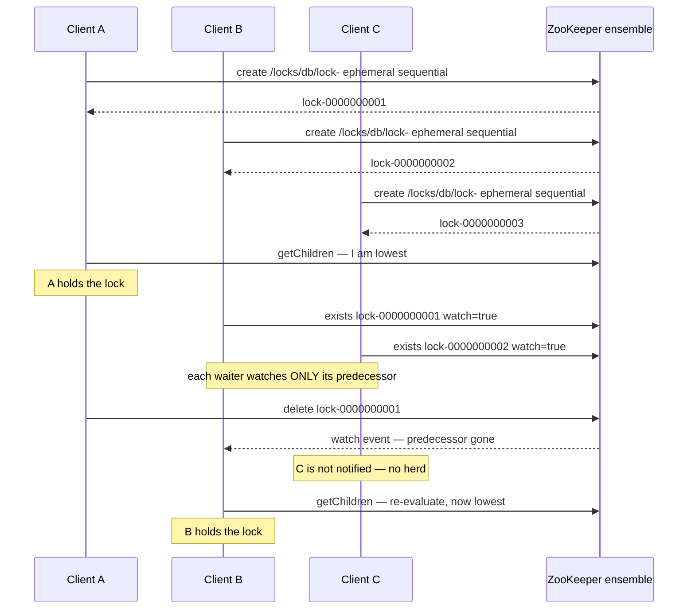
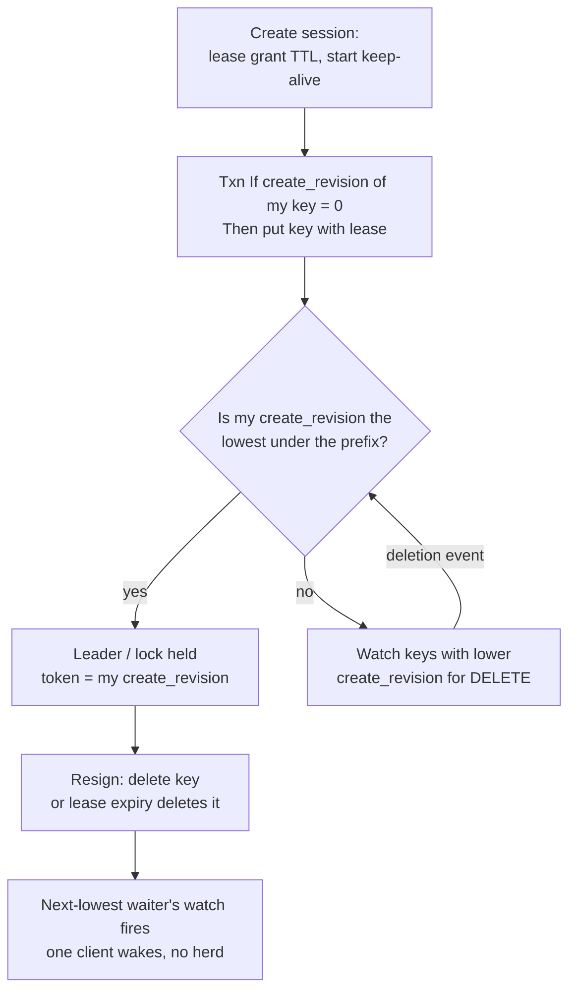
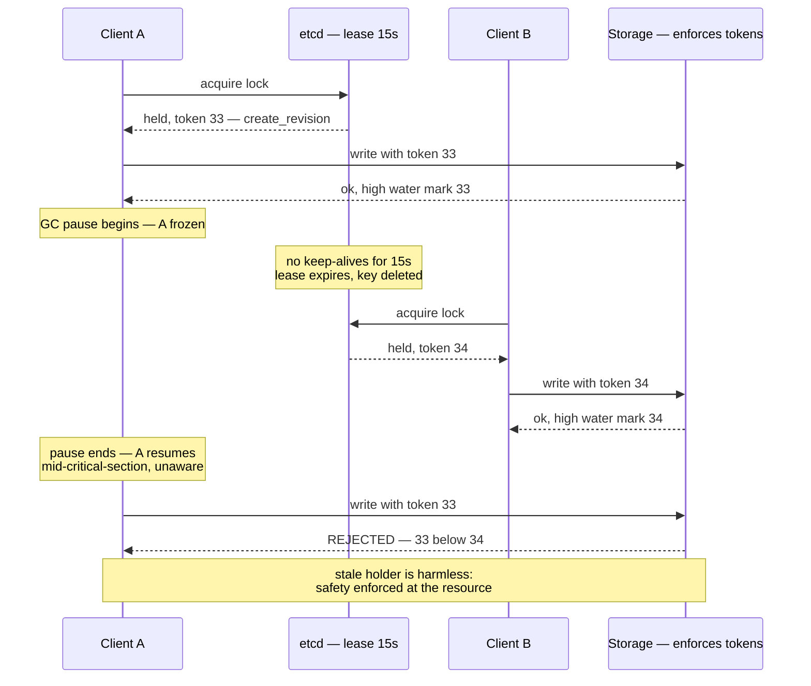
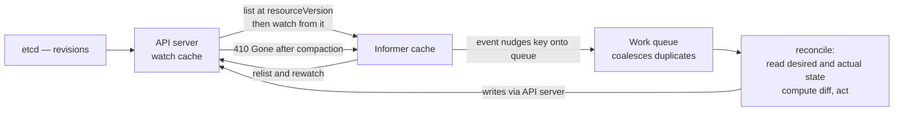
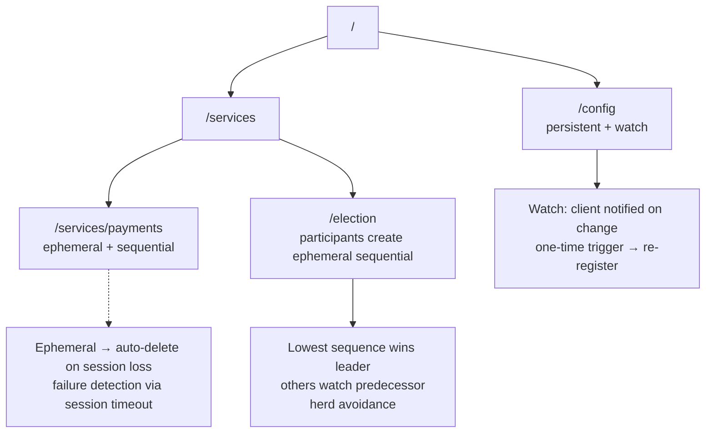
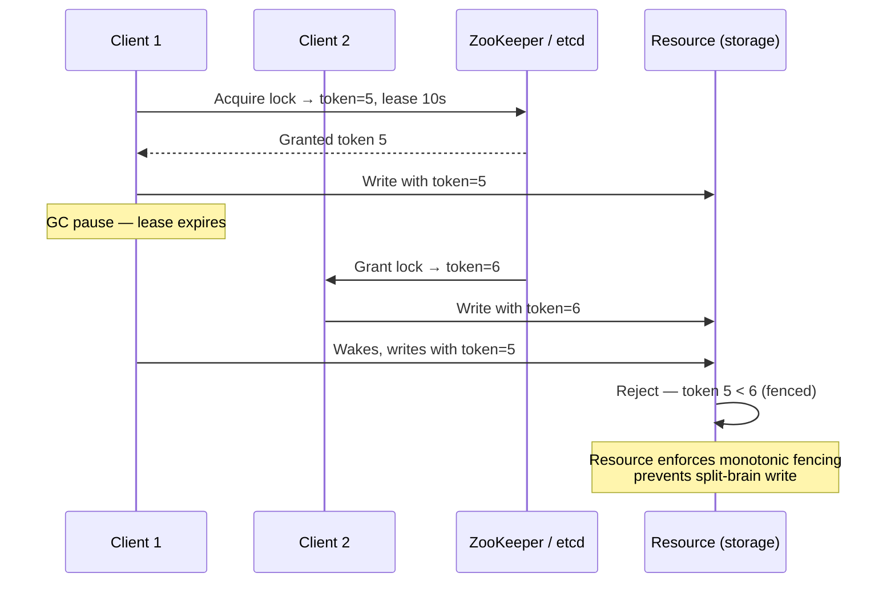
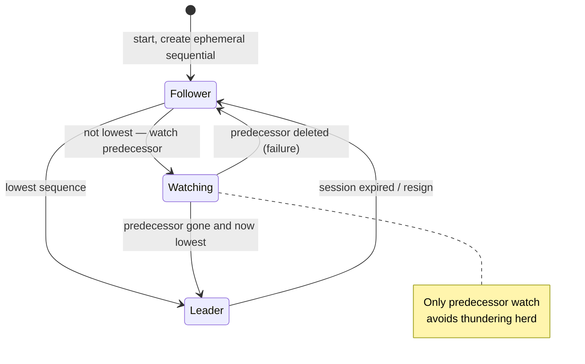

# Chapter 8 — Coordination Services: ZooKeeper and etcd

**What this chapter covers.** Chapters 5 and 6 built consensus from first principles and left an
uncomfortable conclusion: implementing Paxos or Raft correctly is a multi-year project, and the
bugs live in the parts the papers leave as exercises. This chapter is the industry's answer — do
not implement consensus, *rent* it. A coordination service is a small, strongly consistent, highly
available kernel of shared state that everything else coordinates through: consensus productized
behind an ergonomic API. We study the two that matter in mechanism-level depth: ZooKeeper's znode
tree, sessions, ephemeral nodes, and one-shot watches; etcd's MVCC revision store, leases,
resumable range watches, and compare-and-swap transactions. We derive the classic recipes — leader
election, locks, barriers, group membership — and show where the naive versions go wrong. The moral
center is the fencing imperative, paying off the promise of Volume 4, Chapter 2: a lease plus a
paused client equals two nodes that both believe they hold a lock, and only a monotonic token
*enforced by the protected resource* restores safety. We close with Kubernetes as the largest
deployed case study, the operational disciplines that keep a coordination service from becoming a
fleet-wide failure amplifier, and the cases where you should not use one at all.

Learning goals — after this chapter you should be able to:

- Explain what a coordination service is for, why centralizing coordination beats N ad-hoc
  implementations, and what blast radius you accept in exchange.
- Describe ZooKeeper's data model, session semantics (disconnected versus expired), and watch
  semantics precisely, and state its consistency guarantees without overclaiming.
- Write the correct ZooKeeper lock/election recipe, explain why watching the predecessor avoids the
  herd effect, and why a fired watch means "re-read", never "you have the lock".
- Describe etcd's revision-based MVCC model, leases, watches, and transactions, and express a lock
  or election as lease + compare-and-swap + watch.
- Walk through the paused-client scenario and implement fencing with a ZooKeeper zxid or etcd
  revision as the token, enforced at the resource.
- Summarize Chubby's design lessons: coarse-grained locks, advisory semantics, sequencers, and why
  Google built a lock *service* rather than a library.
- Explain Kubernetes' use of etcd: resourceVersion as revision, list+watch informers, and
  level-triggered reconciliation as the correct consumption pattern for lossy watches.
- Size and operate an ensemble: quorum arithmetic, session-timeout tuning against GC pauses,
  compaction and defragmentation, and the metrics that predict trouble.

## Consensus, productized

Chapter 5 ended with the observation that Multi-Paxos was never fully specified, and Chapter 6
showed how much machinery sits between "Raft, the algorithm" and "Raft, a system you would bet a
database on": snapshots, membership changes, client sessions, read paths, PreVote. A team that
embeds this machinery in its application takes on all of it, forever, times the number of
applications that do it. The alternative is to run consensus *once*, in one hardened
implementation, and expose its replicated state machine to everyone through a small API. That is a
coordination service. ZooKeeper embeds ZAB, an atomic broadcast protocol from the Paxos family;
etcd embeds Raft — literally the reference implementation whose library half the industry reuses.
Applications never see the protocol. They see a tiny filesystem-like or key-value store with
unusual guarantees: writes are agreed by a majority, survive minority failure, and are observed in
one order by everybody.

What makes such a store a *coordination* service rather than merely a small database is a second
ingredient: **liveness-coupled state**. Both systems tie data to the aliveness of the client that
created it — ZooKeeper through sessions and ephemeral znodes, etcd through leases — so a client's
death (or apparent death) is automatically converted into a visible state change that other clients
can watch for. Locks that free themselves, membership that updates itself, leaders whose
disappearance triggers re-election: every recipe in this chapter is that one mechanism plus atomic
conditional updates.

The trade is stated honestly by everyone who has run one: the coordination service becomes your
single most critical dependency. Every leader election, lock, and piece of service discovery shares
its fate; when it is down, nothing that needs coordination can make a coordination *decision*. That
is why the second half of this chapter is about blast radius, capacity discipline, and consumers
that degrade gracefully rather than stopping the world. One hardened implementation beats N ad-hoc
ones, but it is one implementation whose outage is everyone's outage.

## ZooKeeper

ZooKeeper (Hunt, Konar, Junqueira, and Reed, USENIX ATC 2010) came out of Yahoo! and is the direct
intellectual descendant of Google's Chubby, with one deliberate philosophical difference: where
Chubby exposes locks, ZooKeeper exposes *wait-free* primitives — small data objects with
notifications — from which clients build locks, elections, and barriers themselves. The paper calls
this a coordination *kernel*: mechanism in the service, policy in the client.

### The data model: znodes

The namespace is a tree of **znodes**, addressed by slash-separated paths like
`/services/checkout/members/host-17`. Every znode can hold a small blob of data (the server-side
limit, `jute.maxbuffer`, defaults to about 1 MB; well-behaved uses stay in the tens of bytes to
kilobytes) *and* have children — it is simultaneously file and directory. Three properties of
znodes carry all the weight:

- **Ephemeral znodes** exist only as long as the session that created them. When the session ends —
  cleanly via close, or by expiry — the server deletes them. Ephemerals cannot have children. This
  is the liveness coupling: an ephemeral znode is a machine-verified claim that "the client that
  created me is still alive, as far as the ensemble can tell".
- **Sequential znodes** are created with a suffix the *parent* assigns from a monotonic counter,
  zero-padded to ten digits: ask for `/locks/db/lock-` and you get `/locks/db/lock-0000000042`.
  Creation is atomic with numbering, so concurrent creators receive distinct, totally ordered
  names. Sequence plus ephemerality is the workhorse combination for locks and elections.
- **Versions**. Every znode carries a data version (bumped on each `setData`), a child version, and
  an ACL version. Conditional operations — `setData(path, data, expectedVersion)` and
  `delete(path, expectedVersion)` — fail if the version does not match. This is compare-and-swap
  (Volume 4, Chapter 4) transplanted into a replicated store, and it is what makes read-modify-write
  safe against concurrent clients.

Znodes also expose **zxids** — the ZAB transaction IDs of the operations that touched them:
`czxid` (creation), `mzxid` (last modification), `pzxid` (last child change). A zxid is a 64-bit
number, epoch in the high bits and a counter in the low bits, and it totally orders all writes the
ensemble has ever committed. File that away: zxids are natural fencing tokens.

### Sessions, precisely

A client connects to any server in the ensemble and establishes a **session** with a negotiated
timeout — the client requests one, and the server clamps it into a window derived from the
ensemble's `tickTime` (by default between 2 and 20 ticks; with the default 2-second tick, 4 to 40
seconds). The client library keeps the session alive with heartbeats, sending a ping whenever the
connection has been idle for roughly a third of the timeout, and transparently reconnects to
another server if its current one fails — the session, its ephemerals, and its watches all survive
a server change, because sessions are replicated state, not per-server state.

The session **expires** when the ensemble has not heard from the client for the timeout. Expiry is
declared by the ensemble, not the client, and this asymmetry is the single most important thing to
understand about ZooKeeper client programming. From the client's point of view there are two
distinct bad states:

- **Disconnected.** The client library has lost its TCP connection and is trying other servers. The
  session may still be perfectly alive — the ensemble's timer is still running but has not fired.
  Crucially, *the client cannot know*. It is on the wrong side of a partition and has no authority
  over the session's fate.
- **Expired.** The ensemble declared the session dead, deleted its ephemerals, and notified
  watchers. The client learns this only when it manages to reconnect and is told the session is
  gone. `Expired` is terminal: the client must construct a new session and re-create its state.

Correct clients handle both, differently. On `Disconnected`, a client holding a leadership role or
a lock must assume the worst *for actions* — stop doing things that require the lock, or make every
action individually safe via fencing — while hoping for the best *for state*, since the session
usually survives a brief blip. On `Expired`, all bets are off: ephemerals are gone, another client
may hold your lock, and you rejoin as a newcomer. Treating `Disconnected` as `Expired` causes
needless failovers on every network hiccup; treating a long disconnection as harmless causes split
brain. The window between the two is the uncertainty interval that Chapter 10 formalizes in failure
detectors; no client-side cleverness eliminates it — only fencing at the resource makes it
harmless.

### Watches

Reads (`getData`, `exists`, `getChildren`) can set a **watch**: a request to be notified once when
the watched thing changes — data watches for data changes and deletion, child watches for child
list changes. Three properties define the model:

1. **One-shot.** A watch fires at most once. If you want continued notification you must re-register
   by issuing another read.
2. **Ordered.** A client sees its watch events, its read results, and its write acknowledgements in
   a single global order consistent with the write order. In particular, a client never reads the
   new state of a znode before receiving the watch event for the change that produced it.
3. **Notification, not delivery.** The event tells you *that* something changed, not *what*. It
   carries the path and event type, not the data.

One-shot watches have an inherent race: between the event firing and your re-registration, further
changes are invisible. The discipline that makes this safe: **on watch fire, re-read the state and
re-register the watch in one operation** (every read that sets a watch does both atomically), and
derive your action from the state you read, never from the event. Multiple changes may collapse
into one notification; your code must be correct if it only ever observes the latest state. This is
the condition-variable `while` loop from Volume 4, Chapter 2, reborn: a watch event is a wakeup,
possibly stale, possibly coalesced, and the predicate must be re-tested before acting. (ZooKeeper
3.6 added persistent and recursive watches via `addWatch`, which remove the re-registration step
but not the need to read state.)

### Consistency guarantees, stated exactly

ZooKeeper's guarantees are frequently overquoted, so let us be precise. **Writes are linearizable**:
every write goes through the leader, is committed by ZAB on a majority, and all writes form a
single total order (the zxid order) respecting real time. **Reads are not linearizable by
default.** Any server answers reads from its own replica without consulting the leader — that is
where ZooKeeper's read scalability comes from — so a read may return stale data if the serving
replica lags. What you get is strong *per-client* ordering, packaged in the paper as two
guarantees: all requests from one client execute in FIFO order (so a client sees its own writes),
and a client's view never moves backward in zxid time, even across reconnection — the library
refuses to attach to a server behind the last zxid the client has seen. In Chapter 3's vocabulary:
sequential consistency with read-your-writes and monotonic reads per session, atop linearizable
writes.

When a client genuinely needs to observe all writes committed before some point — "the config was
updated and a notification sent out of band; now read the *new* config" — ZooKeeper offers
**`sync()`**: an asynchronous barrier that causes the client's server to catch up with the leader
before subsequent reads are served. `sync` followed by a read gives an effectively fresh read
without paying quorum-read cost on every read. If you find yourself calling `sync` before every
read, you wanted etcd's model or quorum reads (Chapter 7), and should say so rather than fighting
the grain of the system.

### ZAB, and how it relates to Raft

Underneath, ZooKeeper replicates via **ZAB** (ZooKeeper Atomic Broadcast; Junqueira, Reed, and
Serafini, DSN 2011), a leader-based atomic broadcast protocol for primary-backup replication. A
leader is elected, brings a quorum of followers to an identical log prefix in an explicit
*synchronization* phase (sending a diff, a truncation, or a full snapshot as needed), then
broadcasts state changes as idempotent transactions identified by zxid; commits require majority
acknowledgment. The mapping to Chapter 6 is almost mechanical: epoch ≈ term, zxid ≈ (term, index),
and ZAB's election favors the server with the most up-to-date history much as Raft's election
restriction does. The structural difference: ZAB separates recovery into its own phase — a new
leader first makes a quorum identical to itself, then resumes broadcast — whereas Raft repairs
followers lazily during normal AppendEntries traffic; and ZAB is framed as *primary order* atomic
broadcast rather than a general replicated state machine. For this chapter's purposes the systems
are peers: both yield a majority-committed, totally ordered log, the raw material every guarantee
above is made of.

### The recipes

The ZooKeeper distribution and paper describe standard client-side constructions — "recipes" — and
the details are where correctness lives. (In practice you use a vetted library, Apache Curator, for
exactly the reasons Vol 4, Ch 2 gave for not hand-rolling mutexes; but you must understand the
recipe to operate it.)

**The naive lock, and the herd.** The obvious recipe: every contender tries to
`create("/locks/db/lock", EPHEMERAL)`; the winner holds the lock; losers watch the znode and retry
when it fires. It is *correct*, but on every release the ensemble notifies every waiter, all N
stampede to create, one wins, and N−1 re-watch: the **herd effect**. Each handoff costs O(N)
messages, a full lock cycle O(N²), and the ensemble absorbs the spikes. With hundreds of waiters
this is a self-inflicted DoS of your most critical dependency.

**The correct recipe — ephemeral sequential + watch the predecessor.**

```text
lock(path):
  me = create(path + "/lock-", data, EPHEMERAL | SEQUENTIAL)   # e.g. lock-0000000042
  loop:
    children = getChildren(path, watch=false)
    if me has the lowest sequence number in children:
        return ACQUIRED                       # holders in sequence order
    pred = child with the largest sequence number below mine
    if exists(pred, watch=true):              # watch ONLY my predecessor
        wait for the watch event
    # predecessor gone — either released or its session expired;
    # loop and re-evaluate: do NOT assume the lock is mine

unlock():
  delete(me)          # or: session close / expiry deletes it for us
```

Why this shape:

- **Total order without agreement.** The sequence numbers assigned at create time *are* the queue;
  clients merely observe their position.
- **Each waiter watches exactly one znode — its predecessor.** A release or crash notifies one
  client, not N; handoff is O(1) messages at any queue depth. This is the entire fix for the herd
  effect, and the same trick MCS queue locks use in shared memory: wait on your predecessor, not on
  the shared lock word.
- **The loop is mandatory** (again). Your predecessor's znode can vanish because its *session
  expired while it was still waiting* — in which case some earlier znode may still exist and you
  are not at the head. The watch event means "re-evaluate", never "acquired".
- **Crash safety is free.** Every queue entry is ephemeral, so a crashed or expired contender —
  waiting or holding — is removed by the ensemble and the queue heals itself.

Leader election is the same recipe with a different reading: the client holding the lowest sequence
*is* the leader; everyone else is a hot standby watching its predecessor, and succession is
automatic and ordered. Patroni's PostgreSQL failover (Volume 5, Chapter 8) is exactly this pattern
over ZooKeeper or etcd, with the leader key doubling as the advertisement of who to follow.



**Barriers.** The *double barrier* enters and leaves a computation in lockstep: to enter, each
participant creates an ephemeral child under the barrier node and watches until the child count
reaches N, then proceeds; to leave, each deletes its child and waits until the children are gone.
The correctness discussion is the by-now-familiar one: watch fires are hints; the predicate is the
child count, re-read every time.

**Group membership.** Each member creates an ephemeral znode (often ephemeral-sequential, for a
stable join order) under a group parent, carrying its address as data; observers `getChildren` with
a watch. Membership is then *definitionally* live: a member that dies or partitions away is removed
by session expiry, within one session timeout. This is a failure detector (Chapter 10) with its
output materialized as data — so Chapter 10's timeout-tuning arguments apply verbatim, and we
return to them under operations.

## etcd

etcd (from the CoreOS lineage, now a CNCF project) is the same idea a decade later, revised in
light of ZooKeeper experience: a flat key-value store instead of a tree, Raft (Chapter 6) instead
of ZAB, gRPC instead of a custom protocol, and — the deepest change — an **MVCC store addressed by
revision**, which turns watches from fragile one-shot callbacks into a resumable change feed.

### Revisions: the MVCC core

Keys are opaque byte strings, and "directories" are only a convention of key prefixes plus range
queries (`Range` over `[key, range_end)`; a prefix query is a range). The store keeps multiple
versions: every mutating transaction increments a single global, monotonically increasing
**revision**, and each key version is stored indexed by the revision that wrote it — the same MVCC
construction as a versioned database engine (Volume 5, Chapter 6), applied to a coordination store.
Each key carries `create_revision` (revision of its creation), `mod_revision` (revision of its last
write), and `version` (a per-key update counter). Consequences:

- Any read can be executed *at* a revision, giving consistent point-in-time snapshots across keys.
- A watch can start *from* a revision, replaying history forward — no gap between "read the state"
  and "watch for changes", the gap that ZooKeeper's discipline exists to bridge.
- The global revision is a total order over all writes, ready-made as a fencing token.

By default etcd reads are **linearizable** — served through Raft read-index confirmation so a
minority partition or stale member cannot answer with old data — with `serializable` reads
available as an explicit opt-in for cheap, possibly stale local reads. Note the inversion of
ZooKeeper's default: etcd makes the strong read the default and the fast-stale read the option.

Old versions accumulate, so the history must be **compacted**: compaction at revision R discards
versions older than R (the operational side is covered below). Compaction is what bounds the "watch
from an old revision" capability — you can resume from any revision the store still remembers, and
no further.

### Leases

A **lease** is a first-class TTL object: `LeaseGrant(ttl)` returns a lease ID; puts may attach keys
to it; a `KeepAlive` gRPC stream refreshes it; when it expires or is revoked, *all attached keys
are deleted atomically*. This is the ZooKeeper ephemeral mechanism with the coupling made explicit
and many-to-one: one lease, refreshed by one heartbeat stream, can cover a client's entire
footprint — its membership key, its lock keys, its leader claim — and `LeaseRevoke` gives a clean,
immediate release path that does not require tearing down a connection. `LeaseTimeToLive` lets any
client inspect a lease's remaining TTL, which ZooKeeper sessions never exposed.

```bash
$ etcdctl lease grant 15
lease 694d77aabcdd0f1e granted with TTL(15s)
$ etcdctl put --lease=694d77aabcdd0f1e /members/checkout/host-17 '10.4.7.17:8443'
OK
$ etcdctl lease keep-alive 694d77aabcdd0f1e     # blocks, refreshing until killed
```

Kill the keep-alive, wait out the TTL, and `/members/checkout/host-17` disappears — observed by
every watcher, at a specific revision. The semantics warnings from ZooKeeper sessions carry over
unchanged: the *server* decides expiry; a client that cannot reach the cluster does not know
whether its lease lives; and lease expiry deleting your lock key is precisely the situation fencing
exists for.

### Watches: resumable, not one-shot

`Watch` is a gRPC stream: watch a key or range/prefix, optionally `--rev=N` to start from a past
revision, and receive every subsequent event (PUT and DELETE, each stamped with its revision) until
you cancel. Contrast each ZooKeeper pain point: not one-shot, so no re-register race;
revision-addressed, so a disconnected client resumes from `last_seen_revision + 1` and misses
nothing; range-scoped, so one watch covers a whole subsystem's prefix. Events arrive in revision
order, without gaps — with one carve-out: if the requested resume revision has been **compacted**,
the watch fails with a compaction error and the client must fall back to ZooKeeper-style behavior —
read current state, then watch from the read's revision. Every serious etcd consumer implements
this list-then-watch recovery path; Kubernetes' informers are the canonical example below.

### Transactions: If / Then / Else

etcd's write-side primitive is the mini-transaction: a guarded batch, executed atomically at one
revision.

```text
Txn:
  If      — a list of comparisons: value, version, create_revision,
            mod_revision, or lease of given keys vs. given constants
  Then    — operations (Put / Range / DeleteRange) if all comparisons hold
  Else    — operations if any comparison fails
```

This is compare-and-swap (Volume 4, Chapter 4) generalized: multi-key, comparing on MVCC metadata
rather than only values, with both branches returning results and the response carrying the
revision at which it executed. `create_revision = 0` means "the key does not exist", which makes
acquire-if-absent a one-liner. The real `etcdctl` syntax, acquiring a lock key (compares, then
success ops, then failure ops):

```bash
$ etcdctl txn -i
compares:
create("/locks/orders") = "0"

success requests (get, put, del):
put /locks/orders "holder=api-7f9c"

failure requests (get, put, del):
get /locks/orders

FAILURE

get /locks/orders
/locks/orders
holder=api-3b21
```

The transaction failed — some other holder's key exists — and the Else branch atomically tells us
who. In real use the Put attaches the client's lease (via the client API) so a dead holder's claim
self-deletes, and the Then branch's response revision is retained as the fencing token.
Everything etcd offers as higher-level sugar is this primitive composed: locks, elections,
`etcdctl put --prev-kv`, optimistic read-modify-write loops comparing `mod_revision`.

### Election and locks: lease + CAS + watch

etcd's Go client ships a `concurrency` package (and the server exposes equivalent Lock/Election
RPCs) whose construction is worth internalizing because it is the etcd translation of the
ZooKeeper recipe:

1. A **Session** wraps a lease and its keep-alive loop — the analogue of the ZooKeeper session.
2. To campaign, a client writes a key under the election prefix — keyed by its lease ID, attached
   to its lease, guarded by a `create_revision = 0` transaction so it never overwrites itself.
3. Ordering comes from `create_revision`: the contender whose key has the **lowest creation
   revision** is the leader/holder — creation revisions play the role of ZooKeeper's sequence
   numbers, assigned atomically by the store's write order.
4. Everyone else **watches for deletion of the keys with lower creation revisions than its own** —
   the watch-the-predecessor structure again, so a handoff wakes one waiter, not the herd.
5. Release is deleting your key, or your lease expiring and deleting it for you.



Nothing here is protocol magic; it is lease (liveness), CAS transaction (atomic claim), and watch
(notification), which is why the same construction ports to any store with those three primitives.

### The API surface

The full gRPC surface is small enough to enumerate, which is itself a design statement: **KV**
(Range, Put, DeleteRange, Txn, Compact), **Watch** (one bidirectional stream method), **Lease**
(Grant, Revoke, KeepAlive, TimeToLive, Leases), plus Auth, Cluster (membership), and Maintenance
(status, defragment, snapshot, alarms). A JSON/HTTP gateway fronts the same services. Compare
Chapter 6's inventory of what a production Raft system needs — this API is that inventory with the
consensus hidden behind it.

## The fencing imperative

Volume 4, Chapter 2 ended its distributed-lock discussion with a promissory note: leases trade a
liveness failure for a safety hazard, and this chapter would treat the cure properly. Here is the
debt, paid. Everything above — sessions, ephemerals, leases, elections — is unsafe without this
section whenever the lock protects an external resource.

### Two believers

Walk through it concretely. Client A holds a lock: an etcd key on a 15-second lease (the ZooKeeper
version with a session and an ephemeral is identical in every step that matters).

1. *t = 0 s* — A acquires the lock, begins a read-modify-write against shared storage.
2. *t = 5 s* — A's process enters a stop-the-world GC pause. (Or: the container is descheduled by
   the CPU quota; the VM is live-migrated; a page-fault storm; `SIGSTOP`; a network partition.
   The cause is irrelevant — what matters is that A stops running *and cannot know for how long*.)
3. *t = 15+ s* — No keep-alives have arrived. etcd expires the lease and deletes the lock key.
   From the cluster's perspective this is correct behavior — it is exactly what leases are for; the
   alternative is a lock held forever by a corpse.
4. *t = 16 s* — Client B's watch fires; B's claim transaction succeeds; B legitimately holds the
   lock and starts writing.
5. *t = 25 s* — A's GC pause ends. **A resumes exactly where it stopped, mid-critical-section,
   with no indication anything happened.** Its next line of code is a write to shared storage. The
   expiry notice is sitting unread in a socket buffer; checking the lease *before* the write only
   shrinks the window, since a pause can strike between check and write.

Two clients now believe they hold mutual exclusion, and the invariant the lock protected is gone.
Note what this is *not*: not an etcd or ZooKeeper bug, not a mistuned timeout, not fixable by
client-side checks. It is the impossibility from Chapter 1 — a paused process is indistinguishable
from a dead one — colliding with the necessity of leases. The service's view and the holder's view
*cannot* be kept synchronized through an unbounded pause.



### Fencing tokens

The fix accepts that the stale holder will act, and makes its actions harmless. A **fencing token**
is a number that (a) the lock service issues with each grant, (b) is strictly greater for every
later grant, and (c) the *protected resource* checks, rejecting any operation bearing a token lower
than the highest it has accepted. Both systems already mint suitable tokens as a side effect of
their write ordering: in ZooKeeper, the lock znode's `czxid` (or a counter znode's version); in
etcd, the lock key's `create_revision` — the `concurrency` package hands it to you as
`Mutex.Header().Revision`. Chapter 6's log index, wearing an API.

The resource-side guard is a one-line idea. Against a database:

```sql
-- schema: resource(id, payload, fence bigint not null default 0)
UPDATE resource
   SET payload = $2, fence = $1
 WHERE id = 'orders-checkpoint'
   AND fence < $1;         -- reject stale tokens
-- driver: if rows_affected == 0, we are a stale holder: abort, do not retry
```

Against a filesystem or object store, the same shape via conditional put (ETag / generation
preconditions) with the token embedded in the object. And when the protected state lives in etcd
itself, fencing collapses into a transaction — guard every write on the lock still being *your*
grant:

```go
resp, err := cli.Txn(ctx).
    If(clientv3.Compare(clientv3.CreateRevision(lockKey), "=", myToken)).
    Then(clientv3.OpPut("/state/orders-checkpoint", payload)).
    Commit()
// err == nil && !resp.Succeeded  =>  lock lost; stop.
```

Three points engineers get wrong. First, **the resource must enforce the check** — the lock service
cannot, because the whole problem is that the stale holder acts without consulting it; if the
resource cannot check a token, no lock service, however consistent, gives you mutual exclusion over
it (Kleppmann's 2016 argument, summarized in Vol 4, Ch 2's Redlock discussion). Second, the token
must come from the lock grant, not a clock — wall-clock timestamps violate strict monotonicity
under skew (Chapter 2). Third, fencing changes the goal: the lock becomes an *optimization* that
makes contention rare, while safety comes from the resource's monotonicity check — a healthier way
to think about distributed locks in general.

### Chubby's lessons

Google's Chubby (Burrows, "The Chubby lock service for loosely-coupled distributed systems", OSDI
2006) predates and shaped both systems, and the paper is a catalogue of lessons learned from
running coordination as a service, several of which the industry keeps relearning:

- **A lock service, not a library.** Burrows argues the choice deliberately: a service lets a
  system of two clients use locks without itself running consensus replicas; it centralizes
  availability engineering in one specialist team; and — subtle but decisive — electing a leader
  usually requires *advertising the result*, so the service doubles as a small consistent store for
  the winner's identity. ZooKeeper and etcd inherited all three arguments.
- **Coarse-grained locks.** Chubby is designed for locks held for hours or days — electing a
  primary — not milliseconds. Coarse grain keeps load independent of application transaction rate
  and makes brief outages survivable by holders. Fine-grained locking, Burrows advises, belongs in
  the application, optionally bootstrapped from a coarse Chubby lock.
- **Advisory, not mandatory.** Chubby locks only exclude other Chubby lock attempts; they do not
  protect the data. Every recipe in this chapter is advisory in the same sense — which is why
  fencing at the resource is the load-bearing safety mechanism, and Chubby supplies it as
  **sequencers**: an opaque string naming the lock, its mode, and a generation counter, which
  servers receiving requests from lock holders validate. Fencing tokens, 2006.
- **Sessions and KeepAlives**, with a client-side *grace period* during which a client that has
  lost its master blocks operations rather than failing them — the disconnected-versus-expired
  distinction, designed in from the start.
- **Clients will surprise you.** In practice Chubby became Google's internal name service — most
  load being reads and caching, not locking — and the paper is frank that developers neither plan
  for its unavailability nor resist storing inappropriate data in it, forcing quotas and review.
  Every ZooKeeper and etcd operator since has rediscovered both facts.

## Case study: Kubernetes

Kubernetes is etcd's biggest consumer and the best public demonstration of how to build *around* a
coordination service correctly; Volume 12, Chapter 2 covers the controller machinery in depth, so
here we take only the coordination view.

All cluster state — every object you `kubectl get` — lives in etcd under a prefix (conventionally
`/registry/...`), written and read exclusively by the API server; nothing else talks to etcd
directly, which concentrates the capacity discipline in one client. Every object carries a
`resourceVersion`, which is (opaquely) the etcd revision of its last modification, and the API's
list and watch operations are etcd's Range and Watch re-exposed: a client lists at some
resourceVersion, then watches from it, receiving every subsequent change without gaps. When a watch
is too stale to resume — the underlying revision compacted — the API returns `410 Gone` and the
client relists and rewatches: etcd's compaction recovery recipe, institutionalized in the client
libraries as the informer's list+watch loop.

The consumption pattern on top is the important lesson. Controllers are **level-triggered
reconciliation loops**: a watch event carries no instruction, it merely nudges the controller to
run `reconcile(object)`, which reads the *current* desired and actual state and computes the
difference. Missed, coalesced, or replayed events, a relist after `410` — all harmless, because
correctness depends only on eventually observing the latest state, not on observing every
transition. This is the ZooKeeper watch discipline ("the event means re-read") elevated from a
coding rule to a system architecture, and it is why a Kubernetes control plane recovers from an
etcd outage by *converging* rather than replaying: workloads keep running on their nodes
throughout, and when etcd returns, reconciliation closes whatever gap accumulated. Edge-triggered
designs — act on the event's content — are brittle under exactly the losses that distributed
watches make routine.



Controller replicas coordinate leadership through the API itself: a `Lease` object
(`coordination.k8s.io/v1`) holding `holderIdentity` and a duration; the leader renews it, and rivals
take over when renewal lapses (controller-manager defaults: 15 s lease, 10 s renew deadline, 2 s
retry). Note what this is: a *timing-based advisory* election — the client-go leaderelection
package's own documentation warns it does not guarantee only one client acts as leader. Kubernetes
tolerates that because reconciliation is idempotent and convergent, so a brief two-leaders episode
wastes work rather than corrupting state. The general rule falls out: an unfenced election is fine
when the actions are idempotent; anything else needs the previous section.

## Operational realities

**Quorum sizing.** The arithmetic is Chapter 6's, unchanged: 3 members tolerate 1 failure, 5
tolerate 2; even sizes are strictly worse (4 members still tolerate only 1, with a larger quorum
and one more machine to fail). Run 3 for most workloads, 5 to survive a failure *during*
maintenance or a zone loss; almost never more, since every write pays the majority round-trip and
the fsync floor. Spread members across failure domains, remembering from Chapter 6 that
geo-spreading a quorum moves the WAN into your write latency.

**The failure amplifier.** Because everything coordinates through it, the service's outage is a
fleet-wide coordination outage: no lock handoffs, no failovers, no membership changes, control
planes read-only or down. Two disciplines follow. *Consumers* must degrade to last-known state and
keep serving — the level-triggered pattern above; a service that halts because it cannot renew a
lease has chosen the wrong failure mode for most purposes. *Operators* must protect the service's
headroom, which mostly means saying no: coordination stores are for coordination-scale data —
identities, endpoints, leases, small configs — at low write rates. The moment application data or
high-frequency state (per-request counters, queue payloads, metrics) lands there, you have coupled
your most critical dependency's capacity to your least disciplined workload. etcd enforces some of
this mechanically: ~1.5 MiB default max request size and a backend quota (2 GiB default, 8 GiB the
advised ceiling) beyond which the cluster raises a `NOSPACE` alarm and refuses writes until
compacted, defragmented, and disarmed.

**Watch fan-out.** Watches invert write cost: one write to a key watched by 10,000 clients is
10,000 notifications, and a popular prefix can turn a modest write rate into an outbound-bandwidth
and CPU problem. Worse is the *recovery herd*: a mass reconnect (network blip, rolling restart)
triggers simultaneous relists from thousands of clients — the expensive path. Mitigations:
aggregate watchers behind a caching tier (the Kubernetes API server's watch cache exists precisely
to absorb this for etcd), watch narrow prefixes, jitter reconnects, and keep watched values small
since events carry them.

**Session and lease timeout tuning.** The timeout is a failure-detector parameter (Chapter 10
treats the dilemma formally): too tight, and an ordinary stop-the-world GC pause or CPU-throttled
container misses its heartbeats, the ensemble declares a healthy client dead, ephemerals vanish,
and leadership flaps — false failover being genuinely dangerous, since it manufactures the
two-believers scenario at higher frequency; too loose, and real failures take the whole timeout to
detect, which is your failover time. Practical notes:

```text
Session / lease timeout tuning
- Floor: > worst observed GC pause + heartbeat interval + one network RTT,
  with margin. Measure pauses (GC logs) before choosing; do not guess.
- Ceiling: your failover-time budget. An ephemeral-based election cannot
  fail over faster than the session timeout.
- ZooKeeper: timeout negotiated into [2, 20] x tickTime (default tick 2 s
  => 4 - 40 s). The 30-40 s range is common for leader locks; sub-10 s
  demands a well-tuned client runtime.
- etcd: lease TTL per lease; keep-alive interval well under TTL/3.
  Kubernetes' 15 s / 10 s / 2 s defaults are a sane reference point.
- Remember the coordination service has its OWN failure detector: etcd
  heartbeat-interval 100 ms / election-timeout 1000 ms defaults assume a
  LAN; widen them for WAN or noisy disks, or the cluster itself flaps.
- No timeout eliminates the pause problem. Timeouts bound detection time;
  fencing provides safety. Tune the former, never omit the latter.
```

**Compaction and defragmentation (etcd).** MVCC history grows without bound until compacted; run
auto-compaction (`--auto-compaction-retention`, periodic or revision mode) sized to how far back
your watchers may need to resume — compacting too aggressively converts routine reconnects into
relist storms. Compaction frees logical but not file space; periodic `etcdctl defrag` (member by
member — it briefly blocks that member) reclaims it and keeps you clear of the quota. Take
scheduled `etcdctl snapshot save` backups; a store that everything depends on and nobody can
restore is an outage with a delay timer. ZooKeeper's equivalent hygiene is snapshot/txn-log purging
via `autopurge.*`.

**Observability.** The metrics that predict trouble, roughly in order: **leader changes**
(`etcd_server_leader_changes_seen_total`; ZooKeeper leader elections) — a healthy cluster elects
almost never, and flapping means overloaded disks or network; **fsync and commit latency**
(`etcd_disk_wal_fsync_duration_seconds`, `etcd_disk_backend_commit_duration_seconds`) — consensus
sits on the fsync floor (Chapter 6), so p99s here are the write-latency early warning; **proposal
health** (`etcd_server_proposals_pending`, `proposals_failed_total`); **watcher and lease counts**
for fan-out exposure; DB size versus quota; on the ZooKeeper side, outstanding requests and average
latency from `mntr`. Alert on leader-change rate and fsync p99 first; they degrade first.

## When not to use a coordination service

The failure amplifier argument cuts both ways: every use you *avoid* shrinks the blast radius.
Decline the coordination service when:

- **The data path is high-throughput.** A majority-fsync per write and a few-GiB working set is the
  wrong engine for request-rate traffic. Coordination stores hold the *pointers* — who is primary,
  where the shards live — while the bytes flow elsewhere. If your coordination cluster's write rate
  scales with user traffic, the design is wrong.
- **You are building a queue.** Sequential znodes look temptingly like one; the result inherits
  `getChildren` scans over unbounded children, watch herds, and the 1 MiB payload ceiling. Use a
  queue (Volume 10); coordinate the queue's *consumers* here if needed.
- **Stale reads are acceptable.** Config that can lag by seconds, discovery that briefly tolerates
  a dead endpoint — DNS with TTLs, or any replicated cache, does this with none of the consensus
  tax. Paying linearizability costs for data you then cache client-side anyway is the most common
  oversubscription.
- **The lock only protects efficiency.** Vol 4, Ch 2's lock-avoidance ladder applies with more
  force here: if the worst case of two workers duplicating work is wasted compute, you want no
  lock, or an unfenced advisory one at most. Reserve the fenced apparatus for locks whose violation
  corrupts state.

The rule of thumb: a coordination service should hold data that is small, slow-changing, and worth
a consensus round-trip *because it is load-bearing for correctness*. Everything else has a cheaper
home.

## The distributed-systems lens

Step back and the chapter compresses into three ideas.

**These services are consensus with an ergonomic API — and the ergonomics are the product.** ZAB
and Raft supply the same commodity: a majority-committed total order of writes. ZooKeeper and etcd
add a *vocabulary* for spending that order — trees or keyspaces, versions and revisions,
conditional writes, notifications — so application programmers manipulate state instead of
protocols. The reason to centralize was never that consensus cannot be embedded; etcd's own Raft
library disproves that. It is that one hardened implementation, one operational practice, and one
place to enforce capacity discipline beat N independent ones — at the price that the one becomes
the most critical dependency you run.

**Sessions and leases convert liveness into state transitions.** A failure detector (Chapter 10)
ordinarily outputs a *suspicion* — a boolean with error bars, consumed by whoever polls it.
Sessions and leases materialize that suspicion as a *data change*: the ephemeral vanishes, the
lease's keys are deleted, watchers are notified in the same total order as every other write. This
is the deep trick of the genre — the timing-and-suspicion half of distributed systems becomes
consumable through the same watch-and-read API as everything else. But materializing a suspicion
does not make it true: the detector still cannot distinguish dead from slow, which is why every
liveness-coupled grant needs a fencing token, enforced at the resource rather than the service.

**The recipes are the distributed twins of Volume 4's primitives, with honest downgrades.** The
lock recipe is the mutex; the watch is the condition variable; a lease-bounded set of permit keys
is the semaphore; the double barrier is the barrier. Each twin is weaker in the same three ways:
*advisory* (nothing forces access through the lock — Chubby's frank admission), *timeout-coupled*
(ownership is a lease on someone else's clock, not a fact), and *fenced* (safety ultimately lives
in the resource's monotonicity check). The condition-variable analogy carries its discipline with
it: a watch event is a spurious-wakeup-prone `notify`, the re-read is the `while` loop, and
level-triggered reconciliation is that `while` loop promoted to an architecture — the real
Kubernetes design lesson. Under loss, coalescing, and reconnection, edge-triggered handling of
change events is unmaintainable; systems that reconcile observed state against desired state are
the ones that survive their coordination service's bad days.

## Key takeaways

- A coordination service is **consensus productized**: ZAB inside ZooKeeper, Raft inside etcd, so
  applications get majority-committed, totally ordered state without implementing a protocol. The
  price: it becomes your most critical dependency — treat its blast radius as a design input.
- ZooKeeper = **znode tree + sessions + one-shot watches**. Ephemerals tie state to session
  liveness; sequentials give atomic ordering; versions give CAS. Writes are linearizable; default
  reads are locally served and can be stale — per-session ordering plus `sync()` for freshness.
- **Disconnected is not expired.** Only the ensemble can expire a session; a disconnected client
  must stop trusting its locks without assuming they are gone. That gap is the failure detector's
  uncertainty window, and no client code can close it.
- The correct lock/election recipe is **ephemeral sequential + watch your predecessor**: total
  order from sequence numbers, O(1) handoff instead of a herd, self-healing via ephemerality — and
  a mandatory re-check loop, because a fired watch means "re-read", never "acquired".
- etcd = **MVCC revisions + leases + resumable range watches + If/Then/Else transactions**.
  Revisions give point-in-time reads, gapless watch resumption (up to compaction), and ready-made
  fencing tokens; a lock is lease + CAS on `create_revision` + watch, wearing an API.
- **Fencing is not optional** when a lock protects external state: lease expiry plus a paused
  client yields two believers, unavoidably. Use `czxid`/version (ZooKeeper) or `create_revision`
  (etcd) as a monotonic token, and have the **resource** reject lower tokens than it has seen.
- Chubby's lessons hold: **coarse-grained** locks, **advisory** semantics with sequencers, and a
  lock *service* because elections need their results advertised — plus the warning that clients
  will misuse the service unless constrained.
- Kubernetes shows the right consumption pattern: **list+watch from a revision plus level-triggered
  reconciliation**, so missed or coalesced events are harmless and etcd outages cause convergence
  delay, not corruption.
- Operate deliberately: **3 or 5 members** (even counts add cost, not tolerance), timeouts above
  worst-case GC pause but within the failover budget, compaction and defrag on a schedule, small
  values and low write rates, alerts on leader changes and fsync latency first.
- Don't use one for data paths, queues, stale-tolerant config, or efficiency-only locks — every
  avoided use shrinks the blast radius of the one dependency everything else shares.








## Further reading

- Hunt, P., Konar, M., Junqueira, F., and Reed, B., "ZooKeeper: Wait-free coordination for
  Internet-scale systems," *USENIX ATC 2010* — the system paper: data model, guarantees, recipes,
  and the coordination-kernel philosophy.
- Burrows, M., "The Chubby lock service for loosely-coupled distributed systems," *OSDI 2006* —
  the design rationale for a lock service, coarse-grained locks, sequencers, and a candid account
  of how clients actually behave.
- Junqueira, F., Reed, B., and Serafini, M., "Zab: High-performance broadcast for primary-backup
  systems," *DSN 2011* — the ZAB protocol paper.
- Kleppmann, M., "How to do distributed locking" (2016) — the fencing-token argument this chapter's
  central section builds on. https://martin.kleppmann.com/2016/02/08/how-to-do-distributed-locking.html
- etcd documentation — API guarantees, KV/Watch/Lease APIs, and the operations guide (compaction,
  defragmentation, quotas, metrics). https://etcd.io/docs/
- Apache ZooKeeper documentation — the programmer's guide (sessions, watches, consistency
  guarantees) and the recipes page. https://zookeeper.apache.org/doc/current/
- Kubernetes documentation — "Operating etcd clusters for Kubernetes" and the API concepts page
  covering resourceVersion, watch semantics, and the list+watch pattern.
  https://kubernetes.io/docs/tasks/administer-cluster/configure-upgrade-etcd/
- Ongaro, D. and Ousterhout, J., "In Search of an Understandable Consensus Algorithm," *USENIX ATC
  2014* — the protocol under etcd; read alongside Chapter 6.
- Volume 4, Chapter 2 — Threads, Mutual Exclusion, and Locks — the in-process primitives whose
  distributed twins this chapter derives, and the original statement of the fencing problem.
- Chapter 10 — Failure Detection — the formal treatment of the timeout dilemma that session and
  lease tuning instantiates.
