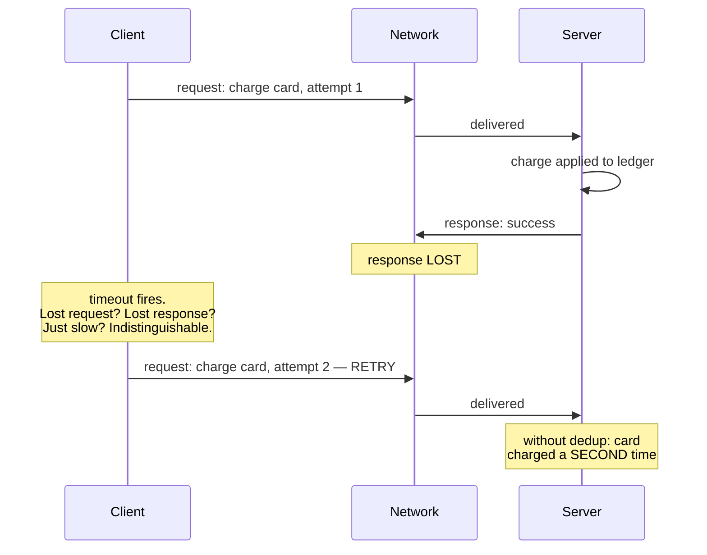
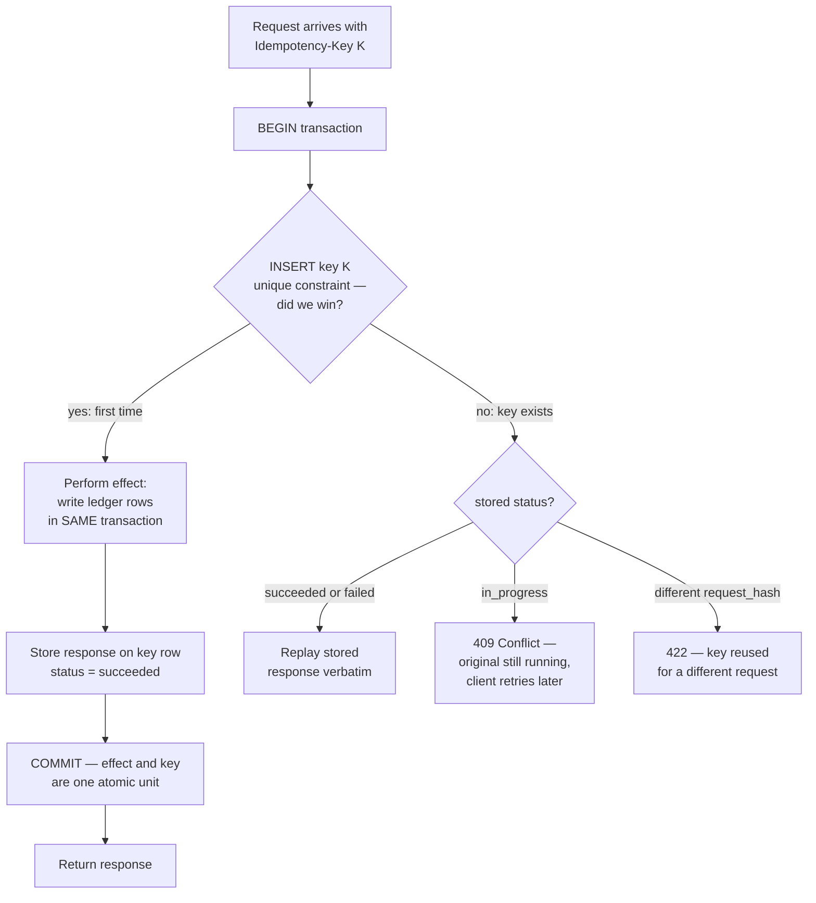
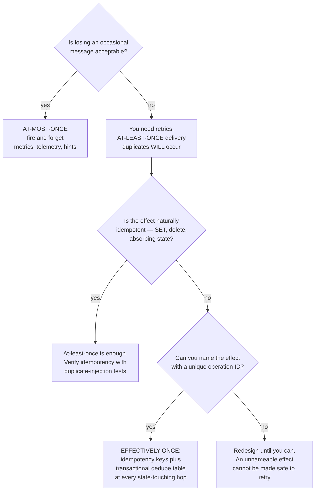
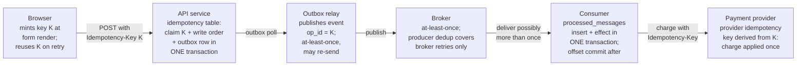
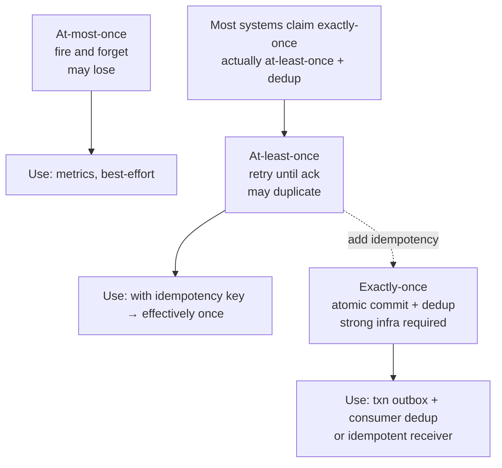
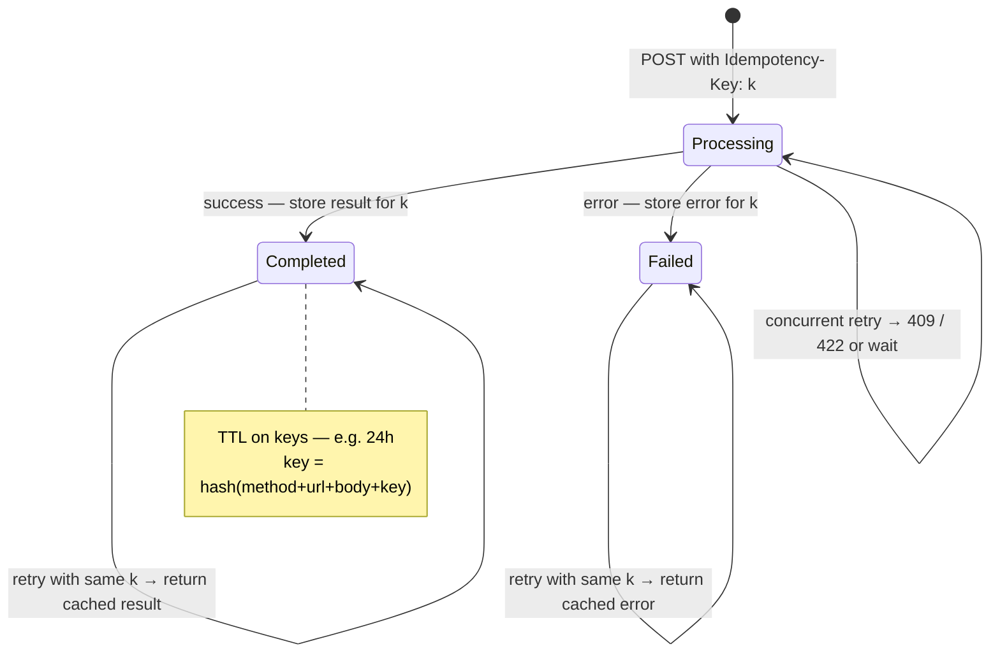
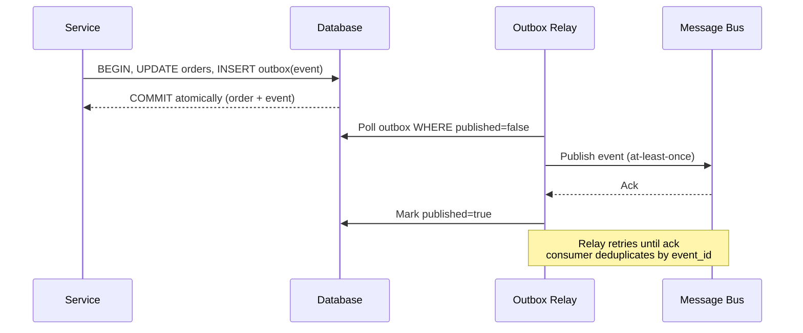

# Chapter 9 — Idempotency, Deduplication, and Exactly-Once

**What this chapter covers.** Every reliability mechanism in a distributed system — TCP
retransmission, HTTP client retries, message-broker redelivery, workflow re-execution —
is a retry, and every retry can create a duplicate. This chapter explains why that is not
an implementation weakness but a mathematical consequence of asynchronous networks with
failures, and then builds the complete engineering response to it. The central claims are
worth stating up front, because much vendor marketing depends on blurring them:
**exactly-once *delivery* is impossible** in the presence of failures, while **exactly-once
*processing* is achievable** — but only as an end-to-end application property, assembled
from at-least-once delivery plus idempotent effects. Nothing in the middle of the stack can
give it to you; every hop that touches state must supply its own discipline.

We start from the root cause — the sender's irreducible ambiguity when an acknowledgment
fails to arrive, the same Two Generals problem from Chapter 1 — and derive the delivery-
semantics taxonomy precisely. We then define idempotency formally and practically, and
develop the single most important design move in this space: converting non-idempotent
operations into idempotent ones by *naming the effect*. From there the chapter is concrete:
the idempotency-key protocol end to end (client discipline, the server-side atomic
check-and-record algorithm, storage choices, Stripe's public design), deduplication at each
layer of a real stack (TCP, Kafka, SQS, and the consumer-side table that is the reliable
backstop), a full payment-flow walkthrough showing that the chain is only as idempotent as
its weakest link, and the retry hygiene and state-machine patterns that make the whole
thing safe to operate. We close by connecting idempotency back to Volume 4's compare-and-swap
and to the consensus machinery of Chapter 6.

Learning goals — after this chapter you should be able to:

- State precisely why a sender that receives no acknowledgment cannot distinguish a lost
  request from a lost ack from a slow response, and why this forces at-least-once semantics
  on any system that retries.
- Define at-most-once, at-least-once, and exactly-once processing rigorously, state what
  each costs, and choose correctly for a given workload.
- Explain the end-to-end argument and why exactly-once processing cannot be delegated to a
  transport or broker.
- Convert a non-idempotent operation into an idempotent one by naming the effect, and
  explain why "apply payment P123" differs fundamentally from "add $50".
- Implement the idempotency-key pattern correctly: the atomicity requirement, the broken
  check-then-act version and its race, response replay, and in-progress duplicate handling.
- Describe what Kafka's idempotent producer and SQS FIFO deduplication actually guarantee —
  and, more importantly, what they do not.
- Build the consumer-side dedupe table pattern with correct offset-commit ordering.
- Apply retry hygiene: HTTP method semantics, idempotency keys on unsafe methods, backoff
  with jitter, and retry budgets.
- Explain how Raft-based systems achieve exactly-once command application via client
  sessions, and why the dedupe table is a distributed compare-and-swap on operation identity.

## The root cause: silence is ambiguous

Consider the smallest possible distributed interaction: a client sends a request to a
server and waits for a response. The request is "charge this card $50." The client waits,
and the response does not come. What happened?

Exactly one of three things, and the client cannot tell which:

1. **The request was lost.** The server never saw it. The charge did not happen.
2. **The response was lost.** The server processed the charge, debited the card, and sent
   an acknowledgment that died in the network. The charge *did* happen.
3. **Everything is merely slow.** The request is queued, or the server is garbage-collecting,
   or the response is in flight. The charge may happen at any moment, or may already have.

These three situations are **observationally identical** from the client's side: silence.
No amount of waiting resolves the ambiguity, because case 3 has no upper bound in an
asynchronous network — a response could always arrive one second after any deadline you
pick. This is the Two Generals problem from Chapter 1 wearing work clothes: two parties
communicating over a lossy channel cannot reach common knowledge that a message was
delivered, no matter how many acknowledgments and acknowledgments-of-acknowledgments they
exchange. The last message sent is always unacknowledged, so someone is always uncertain.



Faced with this ambiguity, the client has exactly two options, and they define the two
implementable delivery semantics:

- **Give up.** Report failure or uncertainty upward and never resend. If the request was
  lost, the operation never happens. This is **at-most-once**: zero or one executions.
- **Retry.** Resend the request until an acknowledgment arrives. If the original was
  actually processed (case 2), the server now receives it twice. This is
  **at-least-once**: one or more executions.

There is no third option. "Exactly-once delivery" would require the client to retry
*only when the request was truly lost* — which requires distinguishing case 1 from case 2,
which is precisely what cannot be done. Any protocol claiming exactly-once delivery over a
lossy network is either quietly at-most-once (it can lose messages), quietly at-least-once
(it can duplicate them, and something downstream deduplicates), or quietly assuming a
failure-free network. This is not a theoretical nicety. It is the reason your payment
service double-charged a customer during last quarter's network blip, and it is the reason
every serious messaging system documents itself as at-least-once and pushes the remaining
work to you.

The inescapable conclusion, and the thesis of this chapter: **reliability requires
retries, retries create duplicates, and therefore the only end-to-end contract you can
actually build is at-least-once delivery plus deduplication.** Everything that follows is
technique for making that contract cheap and safe.

## Delivery semantics, precisely

The three terms get used loosely; here are the rigorous definitions. For a given logical
operation sent once by the application:

| Semantics | Executions | Mechanism | What it costs | Where it is right |
|---|---|---|---|---|
| **At-most-once** | 0 or 1 | Send, never retry. Fire-and-forget. | Silent loss under failure. No duplicate risk, no state. | Metrics, logs, telemetry, cache invalidation hints — anything where a gap is cheaper than the machinery. |
| **At-least-once** | 1 or more | Retry until acknowledged. Durable send buffers, broker redelivery. | Duplicates under failure. Receiver must tolerate or deduplicate. | The default for anything that matters. The transport layer of every serious system. |
| **Exactly-once processing** | Effects of exactly 1 | At-least-once delivery **plus** idempotent or deduplicated processing at every state-touching hop. | Dedup state, atomicity discipline at each hop, bounded windows to manage. | Money, orders, inventory, anything where duplicate effects are incidents. |

Note the deliberate wording in the third row: **exactly-once *processing***, sometimes
called *effectively-once*. Messages may arrive twice; the *effect* happens once. The
distinction between delivery and processing is the load-bearing wall of this whole topic:

> **Delivery** is an event at the transport: bytes arriving at a process. **Processing**
> is a state change in the application: a row written, a balance debited, an email sent.
> Exactly-once *delivery* is impossible. Exactly-once *processing* is an application
> property you can build, because the application — unlike the transport — can recognize
> an operation it has already performed and decline to perform it again.

This is a direct instance of the **end-to-end argument** of Saltzer, Reed, and Clark
(1984): a function that requires knowledge available only at the endpoints cannot be
completely implemented in the middle of the stack. The transport does not know what an
"operation" is — it moves bytes. Only the application knows that two byte-sequences
arriving five seconds apart are the same logical payment, and only the application can
consult its own state to see whether that payment has already been applied. Lampson makes
the same point in "Hints for Computer System Design": lower layers should provide
performance, not attempted perfection, because the ends must implement end-to-end
correctness anyway. A broker that worked heroically to suppress duplicates would still not
save you — the producer's application-level retry (a user clicking twice, a crashed
service replaying its outbox) enters the broker as a *new message* the broker has no way
to recognize. Dedup in the middle is an optimization; dedup at the ends is the guarantee.

One consequence worth internalizing: the phrase "exactly-once" on a product datasheet is
always a claim about a *bounded scope*. Kafka's "exactly-once semantics" is exactly-once
within a Kafka-to-Kafka pipeline under its transaction protocol. It is a real and useful
guarantee — and the moment your consumer writes to Postgres or calls Stripe, you have left
its scope and are back to building effectively-once yourself. We return to this in the
layer-by-layer section.

## Idempotency: the property that makes duplicates harmless

Deduplication is one response to duplicates: detect and drop them. **Idempotency** is the
other, and the more elegant: make the operation such that performing it twice has the same
effect as performing it once, and duplicates become harmless without being detected.

Formally, an operation `f` is idempotent when `f(f(x)) = f(x)` — applying it to its own
result changes nothing. For our purposes the useful reading is over system state: an
operation is idempotent if executing it N ≥ 1 times leaves the system in the same state
(and, ideally, returns the same answer) as executing it once.

Some operations have this property naturally:

- **Absolute assignment.** `SET balance = 100`, `PUT /users/42` with a full representation,
  `UPDATE orders SET status = 'shipped' WHERE id = 7`. Setting a value to `v` twice yields `v`.
- **Deletion by identity.** `DELETE FROM sessions WHERE id = 'abc'`. The second execution
  deletes zero rows; the state is the same. (The *response* may differ — 404 versus 200 —
  which matters for the caller but not for the state. Design the response to be stable too
  where you can: "the thing is gone" is true both times.)
- **Transitions into absorbing states.** A state machine where `cancelled` has no outgoing
  edges: cancelling a cancelled order is a no-op by construction. Absorbing states are
  idempotency you get from your domain model, and a reason to design status fields as
  explicit state machines rather than free-form strings.
- **Set insertion.** Adding element `e` to a set that already contains `e` — the algebraic
  heart of the CRDTs in Chapter 11.

And some operations are naturally *not* idempotent — precisely the ones businesses care
most about:

- **Relative updates.** `balance = balance + 50`, counters, `INSERT` of a new row per call,
  appending to a log.
- **Effects in the outside world.** Charge a card, send an email, ship a parcel. Doing it
  twice does it twice.

The essential design move — the one idea to take from this chapter if you take only one —
is that **any non-idempotent operation can be made idempotent by naming the effect**.
"Add $50 to the balance" is not idempotent because the instruction carries no identity: two
copies are indistinguishable from two intentional deposits. But "apply *payment P123*, a
$50 deposit" is idempotent, because P123 either has been applied or has not, and the
system can check. The imperative *increment* has become a declarative *fact*, and facts
can be recorded at most once:

```sql
-- Non-idempotent: two deliveries, two increments, corrupted balance.
UPDATE accounts SET balance = balance + 50 WHERE id = 42;

-- Idempotent: the effect is NAMED. The ledger row is the fact;
-- the unique constraint makes the fact insertable at most once.
INSERT INTO ledger (payment_id, account_id, amount)
VALUES ('P123', 42, 50)
ON CONFLICT (payment_id) DO NOTHING;
-- balance is derived from the ledger, or updated in the same
-- transaction ONLY when the insert actually inserted a row.
```

Pat Helland calls this pattern out in "Idempotence Is Not a Medical Condition": in a world
of retried messages, the receiver must treat incoming requests as *statements about an
operation with an identity*, not as anonymous commands. The table of named effects — a
ledger keyed by payment ID, a dedupe table keyed by message ID, an idempotency-key table
keyed by client-chosen key — is the same structure at every layer, and the rest of this
chapter is that structure in different costumes. Everything downstream of this point is a
variation on: *give every logical operation a unique name, record the name atomically with
the effect, and refuse to repeat a name you have already recorded.*

## Idempotency keys: the end-to-end protocol

The idempotency-key pattern is "name the effect" industrialized for request/response APIs.
It has a client half and a server half, and both halves carry discipline that is easy to
get subtly wrong.

### The client's half: one key per logical operation, reused across retries

The client generates a unique key — a UUIDv4 is standard — for each **logical operation**,
attaches it to the request, and, critically, **reuses the same key for every retry of that
operation**. This reuse is the entire mechanism. A fresh key per attempt is
indistinguishable from a fresh operation per attempt, and the server will dutifully
execute each one; you have built elaborate machinery that dedupes nothing.

The subtle part is defining "logical operation," because it decides where the key is
generated. If the user clicks *Pay* and your frontend calls your API, which calls the
payment service: is the operation the click, the API call, or the internal call? The key
must be minted at the level whose duplicates you need to suppress. A key generated
per-HTTP-call by an SDK's retry wrapper protects against network retries but not against
the user double-clicking, because the second click gets a second key. Robust systems mint
the key as early as the logical intent exists — often in the frontend when the payment
form is rendered — and thread it through every hop. Keys should also be **scoped**: to an
API key or account (so tenants cannot collide with or probe each other's keys) and to an
endpoint or operation type (so a key used on `POST /charges` says nothing about
`POST /refunds`).

Keys carry a **TTL** decision. The server must remember keys long enough to cover the
longest plausible retry horizon — client-side retry loops, queued jobs, a mobile app
coming back from a tunnel — but not forever, or the table grows without bound. Stripe
retains keys for 24 hours and states so publicly; after expiry, a reused key is treated
as new. Whatever window you pick, the crucial honesty is to *have* a stated window and to
know what falls outside it. Every dedup window in this chapter is finite; we will keep
meeting this caveat.

### The server's half: check and record must be one atomic action

The server's algorithm sounds trivial: if you have seen this key, return the stored
result; otherwise execute the operation and remember key plus result. Here is the version
every team writes first, and it is broken:

```python
# BROKEN — check-then-act race. Do not deploy.
def handle(request):
    existing = db.query("SELECT response FROM idempotency_keys WHERE key = %s",
                        request.idempotency_key)          # (1) check
    if existing:
        return existing.response
    result = perform_charge(request)                       # (2) effect
    db.execute("INSERT INTO idempotency_keys ...")         # (3) record
    return result
```

Two copies of the same request — a timeout-triggered retry racing the slow original, or a
double-click fanned out across two app servers — both execute (1) before either executes
(3). Both find nothing. Both perform the charge. This is exactly the check-then-act race
of Volume 4, Chapter 1, relocated from two threads sharing memory to two requests sharing
a database, and the fix is the same shape: the check and the act must be **one atomic
step**, here a single database transaction with a uniqueness guarantee doing the work a
CAS did in shared memory.

The correct structure claims the key *first*, inside the same transaction that will
perform the effect, and lets the database's unique constraint arbitrate the race:

```sql
CREATE TABLE idempotency_keys (
    key             text        NOT NULL,
    account_id      bigint      NOT NULL,
    endpoint        text        NOT NULL,          -- key is scoped
    request_hash    text        NOT NULL,          -- detect key reuse with different body
    status          text        NOT NULL DEFAULT 'in_progress',
                                 -- 'in_progress' | 'succeeded' | 'failed'
    response_code   int,
    response_body   jsonb,
    created_at      timestamptz NOT NULL DEFAULT now(),
    PRIMARY KEY (account_id, endpoint, key)
);
```

```python
def handle(request):
    with db.transaction() as tx:
        # (1) Atomically claim the key. Exactly one concurrent request wins.
        claimed = tx.execute("""
            INSERT INTO idempotency_keys (key, account_id, endpoint, request_hash)
            VALUES (%s, %s, %s, %s)
            ON CONFLICT (account_id, endpoint, key) DO NOTHING
            RETURNING key
        """, request.key, request.account, request.endpoint, hash(request.body))

        if not claimed:
            row = tx.query("SELECT * FROM idempotency_keys WHERE ...")
            if row.request_hash != hash(request.body):
                return error(422, "idempotency key reused with different request")
            if row.status == 'in_progress':
                return error(409, "original request still processing; retry later")
            return (row.response_code, row.response_body)   # (2) replay stored result

        # (3) Effect and key-completion in the SAME transaction.
        result = perform_charge(tx, request)                # writes ledger rows via tx
        tx.execute("""
            UPDATE idempotency_keys
            SET status = 'succeeded', response_code = %s, response_body = %s
            WHERE ...
        """, result.code, result.body)
    return result
```

Three properties of this structure deserve explicit attention.

**The effect and the key-record commit together or not at all.** Because
`perform_charge` writes through the same transaction, a crash after the charge's rows are
written but "before" the key is marked cannot occur — they are one commit. If the process
dies mid-transaction, everything rolls back: no charge, no completed key, and the client's
retry starts clean. Recording the key in a *different* store than the effect reopens a
window: crash between the two writes and you have either a charge with no key (retry
double-charges) or a key with no charge (retry is wrongly suppressed and the operation is
silently lost — arguably worse). This is why **storing idempotency state in the same
database as the effect is the default choice**: atomicity is free. It is the same insight
that motivates the transactional outbox of Volume 5, Chapter 10 — there, "publish this
event" is made atomic with the business write by making the event a row in the same
database; here, "remember this key" is made atomic the same way. Outbox and idempotency
table are siblings: both smuggle a second concern into the one commit you can actually
make atomic.

**Duplicates get the stored response, not a re-execution.** The table stores the response
code and body, and a duplicate — arriving seconds or hours later — receives a byte-replay
of the original outcome, including original failures. This is what makes retries *safe
from the client's perspective*: retrying cannot make the world different, only reveal what
already happened. Replaying stored failures is a design decision with nuance: Stripe, for
example, stores and replays outcomes, but a validation error that consumed the key would
trap the client, so implementations commonly release or overwrite keys for request-invalid
errors while pinning them for anything that might have had effects.

**In-progress duplicates need an answer.** The awkward case is a duplicate arriving while
the original is still executing. There is no stored response to replay and re-executing is
forbidden. Three honest options: **block** the duplicate until the original commits
(simple; ties up a connection; in Postgres you get this by making the losing `INSERT` wait
on the winner's row lock — though the idiomatic `ON CONFLICT DO NOTHING` shown above
returns immediately instead); **reject** with `409 Conflict` and let the client retry
after a delay (Stripe's documented behavior); or **return 202 with a polling location**.
Rejecting with 409 is the most common and composes best with standard retry loops.

### Redis as the key store: honest caveats

Teams reach for Redis to keep idempotency state out of the primary database:
`SET key value NX PX <ttl>` is an atomic claim, fast, with built-in expiry. Two caveats
must be stated plainly. First, **you have reintroduced the two-store atomicity gap**: the
Redis claim and the database effect are separate operations, and a crash between them
leaves a claimed key with no effect (lost operation) — so you need reconciliation, an
in-progress state with a short TTL, or acceptance of that failure mode. Second, **Redis
durability is configurable and by default is not a database's**: with asynchronous
replication and default persistence, a failover can lose recent writes, i.e., forget
recently-claimed keys, i.e., let a duplicate through. For rate-limiter-grade dedup —
where a rare duplicate is tolerable — Redis is a fine, cheap choice. For money, put the
keys next to the money.

### Stripe's design, as the canonical public example

Stripe's API is the reference implementation most engineers have touched. At the concept
level, accurately: clients send an `Idempotency-Key` header on `POST` requests, with a
recommended random UUID per logical operation, reused on retry. Stripe records the key
with the *result* of the first request — status code and body — and replays that stored
response for any subsequent request with the same key, whether the first attempt
succeeded or failed. Keys are scoped to the account and expire after 24 hours. Reusing a
key with a different request body is an error, which is why the `request_hash` column
appears in the DDL above — a client bug that reuses keys across different operations
should be loudly rejected, not quietly given someone else's cached response. A duplicate
arriving while the original is in flight receives an error rather than blocking. The
wire-level exchange:

```http
POST /v1/charges HTTP/1.1
Host: api.stripe.com
Authorization: Bearer sk_live_...
Idempotency-Key: 8b2e4d9c-1f5a-4c47-9b3e-2a6f8e0d7c11
Content-Type: application/x-www-form-urlencoded

amount=5000&currency=usd&source=tok_visa

HTTP/1.1 200 OK
Idempotency-Key: 8b2e4d9c-1f5a-4c47-9b3e-2a6f8e0d7c11

{ "id": "ch_3Nx...", "amount": 5000, "status": "succeeded", ... }
```

The client times out, retries with the **same header**, and receives the same `200` and
the same `ch_3Nx...` body — replayed from the key store, no second charge. The whole
protocol, drawn once:



## Deduplication layer by layer: what each hop actually gives you

A real request crosses many hops, and several of them advertise deduplication. The honest
inventory matters, because the recurring failure mode is trusting a layer's dedup beyond
its actual scope.

**TCP** deduplicates and orders segments *within a single connection* via sequence
numbers — a retransmitted segment is recognized and dropped (Volume 3). The guarantee
evaporates at connection boundaries, which is exactly where application retries live: your
HTTP client timed out, *closed the connection*, and resent on a new one. TCP sees two
unrelated byte streams. Transport dedup is real and it is not the dedup you need — the
end-to-end argument's canonical illustration.

**Kafka's idempotent producer** (on by default since Kafka 3.0) assigns each producer a
producer ID and a per-partition monotonically increasing sequence number to each batch;
the broker tracks the highest sequences per producer-partition and drops duplicates that
arise from the *producer's internal retries* — a batch acked but whose ack was lost, then
resent. Read the scope precisely: it dedupes **broker-side retry duplicates from a single
producer session to a single partition**. It does nothing about application-level
duplicates: if your service crashes after `send()` succeeds but before recording that
fact, restarts, and sends the "same" event again, that is a new message from (typically) a
new producer session, and the broker cannot know otherwise. Kafka's **transactional
producer** extends this: with a stable `transactional.id`, a producer can atomically
commit a batch of writes to multiple partitions *together with its consumer offsets*,
giving genuine exactly-once for **consume-transform-produce pipelines whose input and
output are both Kafka** — a consumer under `read_committed` never sees uncommitted or
aborted results, and reprocessing after a crash cannot double-emit. This is a real
achievement (KIP-98). Its boundary is Kafka itself: the moment the transform writes to an
external database or calls an external API, that side effect is outside the transaction
and can happen twice. The mechanics — epochs, zombie fencing, the transaction
coordinator — belong to Volume 10, Chapter 3; here you need only the scope.

**SQS FIFO queues** deduplicate on a `MessageDeduplicationId` (explicit, or a SHA-256 of
the body with content-based dedup enabled) — but only within a **five-minute window**. A
producer that retries within five minutes is deduped; an outbox relay that crashes and
replays a send six minutes later produces a delivered duplicate. This limitation
generalizes and deserves promotion to a principle: **every dedup window is finite.**
TCP's window is the connection. Kafka's is the producer session and the broker's
per-producer sequence state. SQS's is five minutes. Your idempotency-key table's is its
TTL. Each layer forgets; plan explicitly for the duplicate that arrives after the layer
in front of you has forgotten — which is why the *last* hop before the effect must dedupe
against durable state whose window is as long as the effect matters.

**Consumer-side deduplication is that last hop**, and it is the reliable backstop of the
whole architecture. The pattern: a `processed_messages` table keyed by the message's
logical operation ID (the *named effect* again — an ID minted at the source and carried
in the payload, not a broker offset, so it survives re-partitioning and replays), written
**in the same transaction as the effect**:

```python
def on_message(msg):
    op_id = msg.value["operation_id"]        # named effect, minted at the source
    with db.transaction() as tx:
        inserted = tx.execute("""
            INSERT INTO processed_messages (operation_id)
            VALUES (%s) ON CONFLICT DO NOTHING RETURNING operation_id
        """, op_id)
        if inserted:
            apply_effect(tx, msg.value)      # same transaction: dedup + effect commit together
        # duplicate: transaction commits having changed nothing
    consumer.commit_offsets(msg)             # (4) AFTER the transaction commits
```

The offset commit at (4) is deliberately last, and the ordering is the whole point.
Committing offsets *before* the effect commits is at-most-once: crash between them and
the message is consumed-but-unprocessed, gone forever. Committing *after* is
at-least-once: crash between the database commit and the offset commit and the broker
redelivers a message you already processed — which is precisely the redelivery window the
dedupe table exists to absorb. The insert hits the conflict, the transaction is a no-op,
the offset gets committed on the second pass. At-least-once delivery below, idempotent
processing above: effectively-once, built by hand, from parts you can see.

## Choosing semantics: what does a duplicate cost, what does a loss cost?

The taxonomy becomes a decision by pricing two failure modes. **What does losing one
message cost?** **What does applying one message twice cost?** At-most-once is right when
loss is cheap and machinery is not: a dropped metrics datapoint costs nothing measurable,
and nobody builds dedupe tables for gauge samples. At-least-once alone (no dedup) is
right when duplicates are naturally harmless — the effect is a SET, a delete, an
absorbing-state transition. Full effectively-once — at-least-once plus keys and dedupe
tables — is mandatory when duplicates are incidents: charges, orders, inventory
movements, anything a finance team reconciles. Metrics can drop; money cannot; and the
common estimating error is assessing the *message* rather than the *effect*: an innocuous-
looking "user signed up" event that triggers a welcome credit is a money message.



The last box is not a joke. If you cannot attach an identity to an operation, you cannot
distinguish a duplicate from a legitimate repeat, even in principle — no infrastructure
can rescue a protocol in which "add $50" twice-on-purpose and "add $50" twice-by-retry
are the same bytes. The fix is always upstream, in the protocol: make the client say
which $50 this is.

## The full chain: a payment, end to end

Assemble the pieces into the flow you will actually build. A user pays for an order; the
API records it and returns quickly; a consumer fulfills the charge against a payment
provider asynchronously.



Walk the hops and name each one's discipline. The **browser** mints key `K` when the
payment form renders, so a double-click and a timeout-retry carry the same key. The
**API** claims `K` in its idempotency table, writes the order, and writes an outbox row —
one transaction, so the order and the promise-to-publish are atomic (Volume 5,
Chapter 10). The **outbox relay** is itself a retrier — it publishes and only then marks
the row sent, so a crash in between re-publishes: at-least-once, by design, and the event
carries `K` as its operation ID for exactly this reason. The **broker** delivers
at-least-once; its producer-side dedup absorbs its own retry duplicates and nothing more.
The **consumer** dedupes on the operation ID transactionally with its effect and commits
offsets last. The **provider call** — the one effect that lives outside all of your
transactions — is protected the only way an external effect can be: by the provider's own
idempotency key, derived deterministically from `K`, so a consumer crash straddling the
call re-issues it with the same key and Stripe returns the stored charge instead of
making a new one.

Six hops, six disciplines — and the sobering observation that motivates the diagram:
**the chain is exactly as idempotent as its weakest link.** Skip the discipline at any
single hop and duplicates flow through it: a fresh key per browser retry, an outbox write
outside the order's transaction, a consumer that commits offsets first, a provider call
without a key — any one of these reintroduces the double-charge that every other hop was
built to prevent. There is no hop whose neighbors can cover for it; that, once more, is
the end-to-end argument, now with a price tag.

## Retry hygiene: the sender's half of the contract

Idempotency is the receiver's discipline; it has a sender's counterpart, because retries
are also a *load* phenomenon, and because retrying the wrong thing is how duplicates are
minted in the first place.

**Never automatically retry a non-idempotent operation without an idempotency key.**
HTTP's method semantics, per RFC 9110 §9.2.2, encode which operations are safe to retry
blind: GET, HEAD, OPTIONS, and TRACE are *safe* (read-only); PUT and DELETE are
*idempotent* (multiple identical requests have the same effect as one — which is why PUT
carries a full representation rather than a delta); POST and PATCH carry **no**
idempotency guarantee. Proxies, load balancers, and HTTP client libraries take these
semantics seriously — many will transparently retry an idempotent method on connection
failure and refuse to retry POST — and so must your retry middleware: a config flag that
retries POSTs "for resilience," without keys, is a duplicate generator with good
intentions. The `Idempotency-Key` header is the escape hatch that makes POST retryable;
it is Stripe/PayPal/Square-style industry practice, and the subject of an IETF
Internet-Draft in the HTTPAPI working group (`draft-ietf-httpapi-idempotency-key-header`)
— which, to state its status honestly, remains a draft and not a published RFC as of this
writing, so the header's semantics are convention, standardized per-API rather than by
the protocol. API-design implications — key requirements per endpoint, documenting replay
behavior — are Volume 8's territory.

**Back off, jitter, and budget.** A retry is deferred load: when a service browns out,
every client's timeout fires together, and synchronized retries arrive as a wave that
ensures the service never recovers — the retry storm, the distributed cousin of the
livelock of Volume 4, Chapter 5, treated operationally in Volume 11. The standard
discipline: exponential backoff (double the delay per attempt, capped), full jitter
(randomize each delay over its whole range, decorrelating the herd), and a **retry
budget** — cap retries as a fraction of total traffic per client (3 attempts is a policy;
so is "retries may not exceed 10% of requests") so that a hard-down dependency degrades
your traffic rather than multiplying it. Retries also multiply *across layers*: three
attempts at the HTTP client inside three attempts at the job runner inside a browser
user hammering refresh is twenty-seven-plus executions of one intent. Retry at one
well-chosen layer; the layers above should surface failure, not silently multiply.

**Hedging is deliberate duplication.** Tail-latency hedging — send to a second replica
when the first is slow, take the first answer — differs from timeout-retry only in not
waiting. Both create in-flight duplicates on purpose; hedge only reads or keyed
operations, and treat "the loser's response arrives anyway" as normal, not exceptional.
Timeout-then-retry has one more trap worth naming: the timeout does not *cancel* the
original request. The server may still be executing it; your retry races your original.
This is why the in-progress arm of the idempotency algorithm exists, and why "just make
the timeout longer" is sometimes the correct dedup fix.

## State machines and re-entrancy: idempotency for multi-step work

Sagas and workflow engines (Volume 5, Chapter 10) add a wrinkle: the unit that retries is
not a single request but a *step* in a long-running process, and the executor guarantees
each step runs at-least-once — after a crash, the step re-runs from the top. Steps must
therefore be **re-entrant**: written to be entered again after partial execution.

The core pattern is **check current state, then act** — where, unlike the broken
check-then-act of the idempotency section, the check-and-transition is made atomic with a
guard on the transition itself:

```sql
-- Step: move order to 'charged' and record the charge.
-- Guarded transition: only fires from the expected prior state.
UPDATE orders
SET status = 'charged', charge_id = 'ch_3Nx...'
WHERE id = 42 AND status = 'payment_pending';
-- 0 rows updated => step already ran (or state moved on): do nothing, succeed.
```

The `WHERE status = 'payment_pending'` clause is a conditional write — a compare-and-swap
on the state column, in exactly the sense of Volume 4, Chapter 4 — and it makes the
transition idempotent: the second execution finds the precondition false and changes
nothing. Explicit state machines with guarded transitions turn "this step may re-run" from
a hazard into a non-event, and absorbing terminal states (`completed`, `cancelled`) make
whole tails of the workflow trivially re-entrant. Where steps run on multiple workers with
possible overlap — a presumed-dead worker limps back and resumes its step — guards should
also carry a **version or fencing token** (Volume 4, Chapter 8; Chapter 8 of this volume):
`WHERE version = 17` or `WHERE fencing_token <= 42`, so a stale executor's late write hits
a false precondition instead of clobbering newer state. Guarded transition, named effect,
claimed key: by now you can see these are one idea — *make the write conditional on the
world still being in the state your decision assumed.*

## Testing: duplicates are an input, not an anomaly

If at-least-once is the contract, duplicate delivery is a *normal input* to your system,
and untested code paths handle it the way untested code paths handle everything. The
property to assert is crisp — **for every logical operation, N deliveries (N ≥ 1) produce
exactly the effect of one** — and it is mechanically checkable: wrap your test harness's
delivery step so every message is delivered twice (or a random 1–3 times, at random
delays, interleaved with other traffic), and assert the same final state and ledger
contents as the single-delivery run. Teams that flip this switch on an existing test suite
usually learn something within the hour. Add the crash-shaped variants deliberately:
redeliver *after* the effect committed but *before* the offset/ack was recorded (the
redelivery window), and race two copies of the same request concurrently (the
check-then-act window). Both are two-line fault injections in a harness and both find real
bugs. Deterministic-simulation and jepsen-style approaches that make such schedules
reproducible are Chapter 12's subject; the habit that belongs in this chapter is smaller:
no consumer or handler is done until its tests deliver everything twice.

## The distributed-systems lens: recovering atomicity without shared memory

Step back and place this chapter in the arc of the suite, because its patterns are not
new inventions — they are old friends from Volume 4, rebuilt for a world with partial
failure.

**The dedupe table is a distributed compare-and-swap on operation identity.** In Volume
4, Chapter 4, atomicity came from hardware: CAS succeeds for exactly one contending
thread, and the losers learn they lost. Across machines there is no shared cache line to
CAS — but `INSERT ... ON CONFLICT DO NOTHING RETURNING` on a unique key is *precisely* a
CAS: one winner, informed losers, arbitrated by the database's own internal concurrency
control rather than a coherence protocol. Where shared-memory CAS compares a *named
version* of a memory word, the idempotency insert compares a *named effect* against the
set of effects already applied — versioned values there, named operations here, the same
move. And the guarded transition of the previous section (`WHERE status = ...`,
`WHERE version = ...`) is literally conditional-write CAS, unchanged. Volume 4 taught
that atomic claim-then-act is how you make progress safe under concurrency; distributed
systems lose the hardware primitive and re-derive it from uniqueness constraints and
transactions. Idempotency is not a new discipline; it is *the* discipline, ported.

**Consensus does not exempt you — Raft clients need this chapter too.** It is tempting
to think a replicated log (Chapter 6) solves duplication: entries are totally ordered and
applied once per replica. But the *client* of a Raft-based system faces the same silence
ambiguity as every other client — it proposed a command, the leader crashed after commit
but before responding, and the retry (to the new leader) appends the *same command as a
second entry*, which every replica will faithfully apply twice. Consensus guarantees each
log entry is applied once; it does not guarantee your operation appears in the log once.
The standard remedy, described in Ongaro's Raft dissertation, is exactly this chapter's
pattern embedded in the state machine: clients attach a session ID and a per-command
serial number — a named effect — and the state machine keeps, *as part of its replicated
state*, the latest serial and cached response per session, discarding duplicates and
replaying stored answers. The dedupe table rides inside the state machine so that
snapshots and leader changes preserve it. At-least-once proposal plus dedup-in-the-
state-machine equals exactly-once application: the formula does not change even at the
bottom of the stack, on top of the strongest primitive we have.

**Reliability is an end-to-end property assembled from unreliable parts.** This is the
recurring moral of the volume, met first in Chapter 1: TCP builds ordered streams from
duplicating datagrams; quorums build durable reads from failing nodes (Chapter 7); and
effectively-once processing builds "it happened exactly once" from a network that cannot
even promise "it happened." No layer hands the guarantee down; each layer contributes a
mechanism, and the ends compose them. The engineer's version of the moral: when a vendor
says exactly-once, ask *within what scope, over what window, atomic with which of my
writes* — and when the answer runs out, that is where your dedupe table goes.

## Key takeaways

- **Silence is ambiguous.** A sender with no acknowledgment cannot distinguish lost
  request, lost response, and slow response — the Two Generals frame. The only choices
  are give up (at-most-once) or retry (at-least-once). Exactly-once *delivery* is
  impossible.
- **Exactly-once *processing* is real but end-to-end**: at-least-once delivery plus
  idempotent or deduplicated effects at every state-touching hop. No transport or broker
  can supply it for you — the end-to-end argument, applied.
- **Name the effect.** "Apply payment P123," not "add $50." A named operation can be
  recorded at most once; an anonymous imperative cannot even define what a duplicate is.
  Naturally idempotent shapes — SET, delete-by-id, absorbing states — need no further
  machinery; everything else gets an ID.
- **Idempotency keys work only with discipline on both ends**: the client reuses one key
  per logical operation across all retries; the server claims the key and performs the
  effect in **one transaction**, stores the response, and replays it to duplicates.
  Check-then-act across two steps is a race — the claim must be the atomic first act.
- **Same store as the effect = free atomicity** — the outbox's sibling insight. Redis
  keys are fine for tolerable-duplicate dedup; for money, the keys live next to the money.
- **Every dedup window is finite**: TCP's connection, Kafka's producer session, SQS
  FIFO's five minutes, your key TTL. Kafka's idempotent producer dedupes only its own
  broker-side retries; its transactions are exactly-once only Kafka-to-Kafka. The durable
  consumer-side dedupe table, transactional with the effect, offsets committed after, is
  the reliable backstop.
- **Price both failure modes**: loss versus duplicate. Metrics can drop; money cannot.
  Judge the *effect* triggered, not the message's apparent importance.
- **The chain is as idempotent as its weakest link.** Client key, API table, outbox,
  broker, consumer table, provider key: every hop needs its own discipline, and no hop
  can compensate for a neighbor.
- **Retry hygiene is the sender's half**: never auto-retry POST without a key (RFC 9110
  defines GET/PUT/DELETE idempotent; POST is not; the Idempotency-Key header is still an
  IETF draft), backoff with full jitter, retry budgets, retry at one layer, and remember
  a timeout does not cancel the original.
- **Steps re-run; write them re-entrant**: guarded transitions (`WHERE status = ...`,
  version/fencing predicates) are conditional-write CAS and make re-execution a no-op.
- **Test with duplicates as normal input**: the property is N deliveries ⇒ 1 effect;
  deliver everything twice in tests and inject the crash between effect-commit and ack.
- **The dedupe table is distributed CAS on operation identity**, and even Raft needs one:
  client sessions with serial numbers inside the replicated state machine are this
  chapter's pattern at the bottom of the stack.








## Further reading

- Saltzer, J., Reed, D., and Clark, D., "End-to-End Arguments in System Design," *ACM
  TOCS* 2(4), 1984 — the argument this whole chapter instantiates.
  https://web.mit.edu/Saltzer/www/publications/endtoend/endtoend.pdf
- Lampson, B., "Hints for Computer System Design," *SOSP*, 1983 — including the case for
  end-to-end reliability with lower layers as optimization.
- Helland, P., "Idempotence Is Not a Medical Condition," *ACM Queue* 10(4), 2012 — the
  definitive treatment of messaging idempotency and naming effects.
  https://queue.acm.org/detail.cfm?id=2187821
- Leach, B., "Designing robust and predictable APIs with idempotency," Stripe blog, 2017 —
  and the Stripe API idempotency documentation. https://stripe.com/blog/idempotency,
  https://docs.stripe.com/api/idempotent_requests
- RFC 9110, *HTTP Semantics*, §9.2 — the definitions of safe and idempotent methods.
  https://www.rfc-editor.org/rfc/rfc9110#section-9.2.2
- *The Idempotency-Key HTTP Header Field*, IETF HTTPAPI working group Internet-Draft
  (draft-ietf-httpapi-idempotency-key-header) — note its status: a draft, not a published
  RFC. https://datatracker.ietf.org/doc/draft-ietf-httpapi-idempotency-key-header/
- KIP-98, "Exactly Once Delivery and Transactional Messaging," and the Apache Kafka
  documentation on the idempotent producer (`enable.idempotence`) and transactions.
  https://kafka.apache.org/documentation/
- AWS documentation, *Exactly-once processing* and *Using the message deduplication ID*,
  Amazon SQS FIFO queues — the five-minute deduplication interval, stated plainly.
- Ongaro, D., *Consensus: Bridging Theory and Practice*, Stanford PhD dissertation, 2014,
  §6.3 — client sessions and duplicate command detection in Raft.
  https://web.stanford.edu/~ouster/cgi-bin/papers/OngaroPhD.pdf
- Treat, T., "You Cannot Have Exactly-Once Delivery," *Brave New Geek*, 2015 — a concise
  informal statement of the delivery/processing distinction.
  https://bravenewgeek.com/you-cannot-have-exactly-once-delivery/
- Gray, J., "Notes on Data Base Operating Systems," 1978 — the classic early treatment of
  message retries, duplicates, and transaction atomicity.
- Volume 5, Chapter 10 — sagas and the transactional outbox, the write-side sibling of
  the idempotency table. Volume 10, Chapters 2, 3, and 6 — delivery semantics, Kafka
  mechanics, and the outbox relay in depth. Volume 8 — idempotency keys as API-design
  surface. Volume 4, Chapters 1, 4, and 8 — check-then-act, CAS, and fencing, the
  shared-memory ancestors of everything here.
