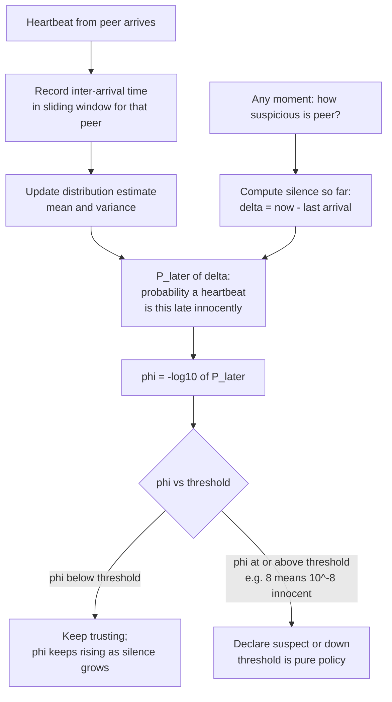
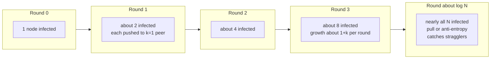
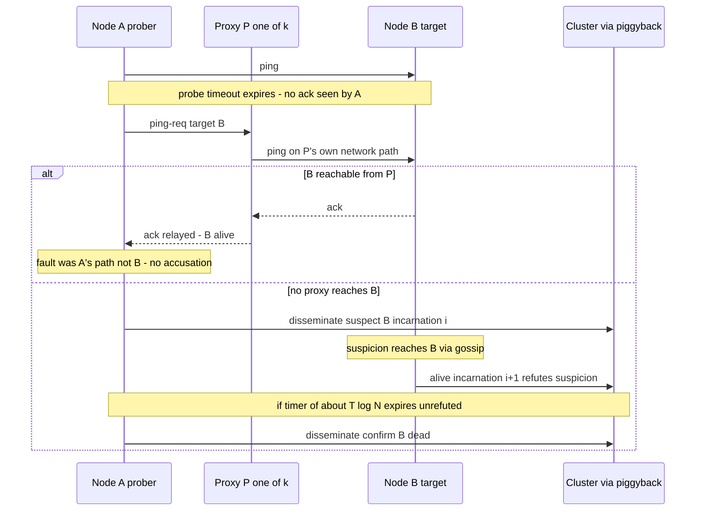
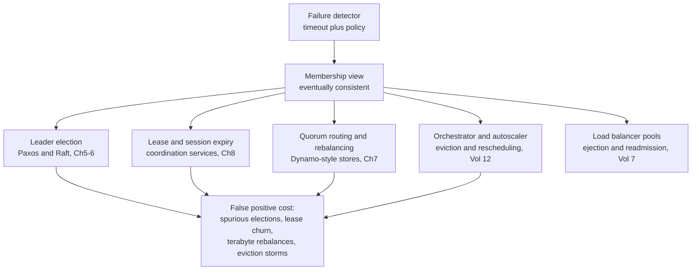

# Chapter 10 — Failure Detection and Membership: Gossip and SWIM

**What this chapter covers.** Chapter 1 established the ambiguity that defines this volume: in an
asynchronous system, a crashed node and a slow node are indistinguishable. Chapters 5 through 8
then built protocols that all quietly depend on answering exactly the question that ambiguity says
cannot be answered: *who is alive right now?* This chapter confronts that dependency. We start
from the impossibility and its consequence — every practical failure detector is a timeout plus a
policy, trading false positives against detection latency — and the theory that makes the
trade-off precise: Chandra and Toueg's unreliable failure detectors, and why "eventually accurate"
is enough for consensus to make progress. We then work through the mechanics — heartbeats versus
probes, the fragility of fixed timeouts, the phi accrual detector's continuous suspicion level —
and the monitoring topologies that carry them, from all-to-all to gossip. Epidemic protocols get a
full treatment: infection-style spread in O(log N) rounds, push versus pull, anti-entropy versus
rumor-mongering, and the eventually-consistent membership views they produce. The centerpiece is
SWIM, the protocol under HashiCorp's Serf, Consul, and Nomad: randomized probing, indirect probes
that distinguish "my path is broken" from "the target is dead," suspicion with refutation by
incarnation number, and dissemination piggybacked on the probes themselves. We close with the
operational reality — gray failures, flapping, GC-pause false positives, correlated rack
failures — and the synthesis: the detector's output is an input to every stateful protocol above
it, so its error rate multiplies through the stack.

Learning goals — after this chapter you should be able to:

- Explain why perfect failure detection is impossible in an asynchronous system, connect that to
  FLP, and state what every practical detector therefore is: a timeout plus a policy.
- Define completeness and accuracy for unreliable failure detectors, place ◇P as the realistic
  target, and explain in one paragraph why eventual accuracy suffices for consensus liveness.
- Describe the phi accrual detector mechanically — the inter-arrival window, the suspicion level
  φ, and what a threshold of 8 actually means — and tune it with intent.
- Compare heartbeating topologies (all-to-all, centralized, hierarchical, gossip) by message load,
  detection latency, and failure modes of the detector itself.
- Walk the arithmetic of epidemic dissemination: why infection reaches N nodes in O(log N) rounds,
  and when push, pull, or push-pull is the right mode.
- Specify SWIM precisely: randomized probing, ping-req through k proxies, the
  suspect → refute-or-confirm state machine, incarnation numbers, and piggybacked dissemination —
  plus Lifeguard's local-health refinements.
- Distinguish membership *change* from failure *detection*, and gray failure from crash failure —
  and argue for application-level health signals with honest awareness of their cascade risks.
- Trace a false positive through the stack: from one late heartbeat to elections, lease churn,
  rebalancing storms, and orchestrator evictions.

## The impossibility, and what a detector actually is

Recall the shape of the problem from Chapter 1. Node A messages node B and hears nothing back. At
least four worlds are consistent with that observation: B crashed before receiving; B received and
crashed before replying; B is alive but slow — a GC pause, a saturated run queue, a full accept
backlog; or B is fine and the network delayed or dropped a message in either direction. In an
asynchronous system — no bound on message delay or relative processing speed — these worlds are
*observationally identical*. No finite wait resolves them, because any finite wait is consistent
with "the reply is still coming."

This is not a corollary of FLP; it is closer to being its engine. The Fischer–Lynch–Paterson
result (1985; Chapters 1 and 5) says no deterministic consensus protocol can guarantee termination
in an asynchronous system where even one process may crash, and the heart of the proof is exactly
this ambiguity: the adversary keeps the protocol forever uncertain whether a decisive process is
dead or merely delayed, so it can neither safely wait (perhaps forever, for a corpse) nor safely
proceed (the "corpse" may wake and contradict the decision). Reliable failure detection is
precisely the capability FLP proves unimplementable in the pure asynchronous model — with a
perfect detector, consensus would be easy — which is why Chapter 5's protocols are safe always but
live only when timing cooperates.

Since perfection is off the table, every practical failure detector — every one, from a load
balancer's health check to Raft's election timer to SWIM — reduces to the same two components:

1. **A timeout.** Some expectation of when evidence of life should arrive, and a clock that
   notices when it has not. (Per Chapter 2's rule, a *monotonic* clock: wall-clock adjustments
   must not manufacture or suppress timeouts.)
2. **A policy.** What to do with the observation "evidence is late": how late is suspicious, how
   suspicious is convicting, who gets told, and what they are allowed to do about it.

The policy is where the engineering lives, because the timeout embodies an unavoidable trade
between the only two ways a detector can be wrong:

- **False positives** — declaring a live node dead. Costs: unnecessary failovers and elections,
  lease churn, split-brain *risk* when the "dead" node keeps serving (Chapter 8's fencing problem;
  Volume 5, Chapter 8 documents database failovers triggered by exactly this), and rebalancing
  work that must be redone when the node turns out to be fine.
- **Detection latency** — the window during which a genuinely dead node is still in the
  membership. Costs: lost capacity that the load balancer keeps routing to, requests misdirected
  at a corpse and burned on timeouts, and — for protocols that need the dead node's role filled —
  unavailability until detection completes.

Shorten the timeout and you buy detection latency at the price of false positives; lengthen it
and the exchange runs the other way. There is no third option, only better and worse curves — and
the rest of this chapter is about buying a better curve: adaptive timeouts flatten it, indirect
probing removes one whole class of false positives, and suspicion periods give victims a chance to
object before the verdict lands.

## Unreliable failure detectors: the theory that made timeouts respectable

Chandra and Toueg's 1996 paper "Unreliable Failure Detectors for Reliable Distributed Systems"
did something quietly profound: instead of pretending detectors could be perfect, it axiomatized
their imperfection and asked how much imperfection consensus can tolerate. A detector is modeled
as an oracle at each process outputting a list of suspects, characterized on two independent axes:

- **Completeness** — does it eventually suspect processes that really crashed? *Strong
  completeness*: every crashed process is eventually suspected by every correct process.
- **Accuracy** — does it avoid suspecting processes that are alive? *Strong accuracy*: no correct
  process is ever suspected. *Eventual* accuracy: it may make mistakes for an arbitrary finite
  period, but eventually stops suspecting correct processes.

Completeness is cheap: suspect everyone you have not heard from lately, and every crashed process
is eventually suspected, since the crashed genuinely stop sending. Accuracy is the expensive
axis — accuracy is exactly the crashed-versus-slow problem. The interesting classes combine strong
completeness with weakening grades of accuracy: **P** (the perfect detector — strong accuracy,
unimplementable in asynchrony) and **◇P** ("eventually perfect" — strong completeness plus
*eventual* strong accuracy: after some unknown time, no correct process is suspected). Chandra and
Toueg showed consensus is solvable with detectors weaker still (◇S; in the companion paper with
Hadzilacos, the leader oracle Ω is the weakest sufficient one), given a majority of correct
processes. But ◇P is the class worth memorizing, because it is what a timeout-based detector under
*partial synchrony* (Chapter 1's realistic model) actually gives you: while the network
misbehaves, your timeouts fire wrongly; once it stabilizes and your timeout has adapted above the
true delay bound, mistakes stop.

Here is the one paragraph that makes "eventually accurate" respectable rather than a cop-out.
Well-designed protocols never let the failure detector touch *safety* — agreement in Paxos and
Raft is enforced by quorums and epochs/terms regardless of what any detector believes, which is
why a false suspicion can trigger a useless election but never two contradictory commits. The
detector is consulted only for *liveness*: deciding when to stop waiting for someone and elect a
replacement. A detector that lies for a while therefore costs only time — wasted elections,
stalled progress — and one that eventually stops lying eventually stops costing time, letting some
leader survive long enough to drive the protocol to termination. Eventual accuracy is precisely
what makes "we will terminate eventually" true, and nothing stronger is needed because safety was
never resting on the detector. That division of labor — safety from quorums, liveness from the
detector — is the most important design pattern in this volume, already seen without the name in
Chapters 5, 6, and 8.

## Detector mechanics: heartbeats, probes, and adaptive timeouts

### Push versus probe

There are two elementary ways to gather evidence of life. **Heartbeating** (push): the monitored
node periodically announces "I am alive"; silence past a deadline raises suspicion. **Probing**
(ping): the monitor asks and expects an answer within a timeout. The difference is not cosmetic. A
heartbeat's absence conflates *the node* with *the path from the node to you* — and with the
node's ability to schedule its heartbeat thread, which is exactly what a GC pause or CPU
throttling takes away. A probe establishes the round-trip freshly and lets the prober control the
schedule, but a single prober still cannot distinguish "target dead" from "my link to the target
is degraded." SWIM's central insight, below, is that *multiple vantage points* can.

### Fixed timeouts and their fragility

The naive detector — heartbeat every T, declare dead after k·T of silence — has one knob, and the
knob has no right setting. The timeout must exceed heartbeat interval plus network delay plus
processing jitter, with margin for the tail; but delay and jitter are not constants. They differ
between a rack-local link and a cross-AZ link, between 2 a.m. and peak, and they spike during the
very overload and partial-partition scenarios in which you most need the detector to be right. A
fixed timeout tuned for the median is a false-positive machine at the tail (Volume 3's RTT
distributions apply directly); one tuned for the p999 is somnolent the rest of the time. And one
global constant is shared across heterogeneous pairs: the timeout generous enough for the flaky
WAN pair is absurdly slow for two nodes on the same switch.

The fix is the one TCP reached decades ago for retransmission (Volume 3): stop guessing a constant
and *measure the distribution*.

### The phi accrual detector

The phi accrual failure detector (Hayashibara, Défago, Yared, and Katayama, SRDS 2004) makes two
moves. First, it adapts: each monitor keeps a sliding window (commonly the last few hundred
samples) of inter-arrival times of heartbeats from each peer, and maintains estimates of their
distribution — mean and variance in the paper's normal-distribution formulation. Second, and more
interestingly, it changes the *output type*. Instead of a boolean "up/down," it outputs a
continuous **suspicion level**:

```
φ(t_now) = −log10( P_later(t_now − t_last) )
```

where `t_last` is the arrival time of the most recent heartbeat and `P_later(Δt)` is the
probability, under the estimated distribution, that a heartbeat would arrive *later* than Δt — the
probability that the current silence is innocent. The negative log-base-10 gives φ a direct
reading: **φ is the number of nines of confidence that the node is down.** Convict at φ = 1 and,
in the long run, about 1 in 10 convictions is a false positive (the heartbeat was merely late); at
φ = 2, 1 in 100; at φ = 3, 1 in 1,000. The arithmetic intuition: suppose a peer's heartbeats
arrive every 1,000 ms with standard deviation 100 ms. At 1,100 ms of silence, lateness is
ordinary — P_later is large, φ well under 1. At 1,500 ms (five standard deviations), P_later has
collapsed and φ has climbed past 6. The *same* 1,500 ms silence from a noisy peer — σ of 400 ms —
yields φ near 1: nothing to see. The detector automatically demands more silence before suspecting
jittery peers and less for metronomic ones — exactly the per-link, per-load adaptivity the fixed
timeout lacked.

The threshold is now honest, tunable *policy*, separated from measurement. Cassandra convicts at
`phi_convict_threshold` (default 8; its documentation recommends 10–12 on cloud networks with fat
latency tails), approximating the distribution as exponential rather than normal — cheaper, more
pessimistic in the tail, same shape of behavior. Akka Cluster implements the paper's design with a
configurable threshold (historically 8) plus a floor on the standard deviation so an eerily
regular heartbeat stream does not become hair-trigger sensitive. Two practical subtleties: the
window must be primed before φ is meaningful (implementations seed it conservatively), and a node
that *pauses* — GC, CPU throttle — poisons its own statistics on resumption until enough fresh
samples arrive.



One more virtue of the continuous output: different consumers can apply different thresholds to
the *same* detector — a load balancer stops routing at φ = 3 (cheap to be wrong, expensive to be
slow) while the rebalancer that migrates terabytes waits for φ = 10. A boolean detector forces one
policy on everyone; an accrual detector lets each consumer buy its own point on the curve.

## Heartbeating topologies: who watches whom

A detector between one pair of nodes is only half the design; a cluster needs to decide *who
monitors whom*, and the topology determines message load, detection latency, and — often
forgotten — the failure modes of the detection machinery itself.

**All-to-all.** Every node heartbeats every other. Detection is direct and fast, with no
privileged component to lose — but the load is O(N²) messages per interval (at N = 1,000 and one
heartbeat per second, a million messages per second cluster-wide just for liveness), and every
node maintains timers and windows for N − 1 peers. Fine for small, fixed clusters — essentially
what a 3–5 node Raft group does; disqualifying at fleet scale.

**Centralized.** Every node heartbeats one monitor. Load is O(N) and the view conveniently
global — but the monitor is a single point of failure *and* a single point of ambiguity. Partition
the monitor from a rack and it cannot distinguish "rack died" from "my link to the rack died"; it
will confidently mark a healthy rack dead — the detector's own partition becomes everyone's false
positive. Practical centralized systems replicate the monitor and its store — Kubernetes is
exactly this shape, kubelets renewing per-node Lease objects against the apiserver/etcd with a
node controller applying grace periods (Volume 12) — and must apply the mass-failure safeguards
discussed later, because the central vantage point sees correlated ambiguity at full cluster
width.

**Hierarchical.** Monitors per rack or zone, aggregated upward. Load and latency scale well, and
the topology can mirror failure domains, which helps attribute correlated failures. The cost is
machinery: each layer needs its own detector for the layer below plus a monitor-failover story —
you have recursed on the problem rather than solved it.

**Gossip-based.** No distinguished monitors at all: liveness information itself is replicated
epidemically, so every node converges on a full membership view with per-node load that is O(1)
messages per round and cluster load O(N). Detection latency and dissemination take O(log N)
rounds. This is the design that scales, and it needs a section of its own.

## Gossip: epidemic dissemination and eventually-consistent membership

### The mechanism and the math

The template, from Demers et al.'s 1987 epidemic algorithms paper (built for replica
synchronization in Xerox's Clearinghouse directory): time is divided into rounds (say, one per
second); each round, each node picks k random peers (the *fanout*, typically 1–3) and exchanges
state with them. That is the whole protocol. Its power is the arithmetic of infection. Call a node
"infected" once it holds a given piece of news; one node starts infected. In push mode, each
infected node pushes to k random peers per round, so while the infected are a small minority
almost every push lands on a susceptible peer and the infected population multiplies by roughly
(1 + k) per round — exponential growth, hence essentially all N nodes reached in O(log N) rounds.
At N = 10,000 with k = 1 and one round per second, saturation arrives in on the order of 15–20
seconds; double the cluster and you add about one round. The randomness also buys robustness:
there is no spanning tree to break, and losing half the nodes mid-epidemic delays saturation by a
round or two.

The mode matters at the margins. **Push** is efficient early (every transmission likely informs
someone new) but wasteful late — when 99% are infected, 99% of pushes are redundant, and the last
stragglers wait for a lucky dart. **Pull** inverts this: a susceptible node asking random peers
"what's new?" almost always succeeds late in the epidemic, closing the tail fast but wasting
queries early. **Push-pull** — both directions in one contact — gets both regimes' strengths and
is the standard choice; Cassandra's gossiper and SWIM-family implementations use it in their
synchronization paths.

Demers et al. also drew a distinction worth keeping crisp. **Anti-entropy** periodically
reconciles *entire* states with a random peer, guaranteeing any difference is eventually repaired,
at a per-contact cost proportional to state size (tamed with digests or Merkle trees — Chapter 7
showed Dynamo doing exactly this for replica data). **Rumor-mongering** spreads only recent
*updates*, hot and cheap, but because it loses interest in old rumors (stop forwarding after m
redundant contacts, or with probability 1/m), a rumor can die out before reaching everyone.
Production systems run both: rumors for speed, a slow anti-entropy sweep as the backstop.



### Gossiping membership itself

To turn gossip into a failure detector, make the payload the membership list: a map from node
identity to (address, status, **version**). In the classic heartbeat-counter design, each node
increments its own counter every round; entries merge by keeping, per node, the version-wise
newest record — per-entry last-writer-wins where "time" is a logical version, not a wall clock,
exactly Chapter 2's discipline. (Cassandra versions entries with a *generation* — bumped on
restart — plus a monotonic version within it, so a rebooted node's fresh state always supersedes
its pre-crash state.) Each node runs a local detector — Cassandra runs phi accrual — over the
freshness of each peer's entry as seen through gossip, and each node's *conclusions* ("I mark X
down") spread the same way.

Two properties of the resulting view are permanent, not bugs. First, **staleness is graded by
distance**: a node's information about itself is fresh; about others, delayed by however many
gossip hops the news has traveled — detection through gossiped heartbeats is inherently a few
rounds slower than direct probing. Second, and most often mishandled: **the view is eventually
consistent**. During the O(log N) spread window, different nodes *simultaneously hold different
membership views*, all locally justified. Consumers must tolerate this: two Cassandra coordinators
may briefly disagree about whether a replica is up and route differently, which is acceptable
precisely because Chapter 7's quorum reads and writes, hinted handoff, and read repair absorb it.
Dynamo made the same bet explicitly — gossiped, eventually-consistent membership and ring state,
with the data path engineered to survive disagreement. If a consumer *cannot* tolerate divergent
views — if two nodes acting on different membership must never both act — gossip membership alone
is not enough, and that decision needs Chapter 5–6 consensus or Chapter 8 leases layered on top.
Knowing which decisions need which is precisely the skill.

## SWIM: separating detection from dissemination

SWIM — Scalable Weakly-consistent Infection-style process group Membership, from Das, Gupta, and
Motivala (DSN 2002) — begins from a criticism of heartbeat-gossip designs: they entangle *failure
detection* (noticing) with *dissemination* (telling everyone), forcing both to scale together.
SWIM splits them, and fixes the false-positive problem while it is at it.

### The probe cycle

Each node runs a protocol period T (think 1 second). Each period, it picks **one** member and
pings it directly — in practice from a randomized round-robin shuffle of the membership list
rather than independent draws, which bounds worst-case time-to-first-probe: every member is probed
within one pass through the list. An ack within the probe timeout (a small fraction of T, sized
near the RTT ceiling — Volume 3) ends the period happily. Per node that is O(1) detection load
regardless of cluster size; cluster-wide, O(N) — and because every node probes independently, a
dead node's silence is noticed by *someone* within about one period in expectation (the paper puts
expected time-to-first-detection near T/(1 − e⁻¹) ≈ 1.6 T, independent of N).

### Indirect probes: the ping-req insight

Here is the move that earns SWIM its place in this book. When A's direct ping to B times out, A
concludes **nothing**. A silent timeout is one vantage point's evidence, and A's vantage point
includes A's own NIC, switch, uplink, and scheduler — any of which could be the culprit. So A
selects k other members (k = 3 is typical) and sends each a **ping-req**: "please ping B and relay
the result." The proxies probe B over *their* network paths. If any proxy reaches B, A learns B is
alive — and implicitly that the failure was A's path, not B. Only if the direct probe *and* all k
indirect probes fail within the period does A move against B, and now the accusation is backed by
k + 1 independent path failures rather than one. This is the structural remedy for
single-observer ambiguity: it cannot tell A anything about a node that is truly down, but it
slashes the false positives caused by local congestion, a flapping link, or a one-way partition
between A and B — which, in production, outnumber true crashes handily.

### Suspicion, refutation, and incarnation numbers

Even k + 1 failed paths do not prove death — B may be paused, or partitioned from all k + 1
observers but not from the cluster's majority. So SWIM's verdict is not "dead" but **suspect**: a
state, disseminated like any other update, that starts a timer proportional to T·log N (sized so
the news can plausibly reach B before it expires). A suspected member is still a member — still
probed, still routable — and the suspicion message doubles as a summons: on learning it is
suspected, B **refutes** by asserting *alive* with a higher **incarnation number**. Incarnation
numbers are the protocol's versioning device (Chapter 2 again): only B may increment B's own
incarnation, and messages about B are totally ordered by (incarnation, status severity) — *alive*
at incarnation i + 1 overrides *suspect* at i, while at equal incarnation *suspect* overrides
*alive* and *confirm-dead* overrides both. Every false accusation thus gets a bounded window in
which the victim can override it with a strictly newer fact about itself, and the merge function
gets the conflict-resolution rule plain heartbeat counters lacked. If the timer expires unrefuted,
the suspector promotes B to **confirmed dead** and disseminates that; confirmation is terminal for
that incarnation — a partitioned node that returns must rejoin as a fresh member.

The suspicion window is the false-positive/latency trade-off made explicit and *bought at a
discount*: it adds latency only to the suspicion-to-confirm tail, in exchange for catching nearly
all false accusations before they become membership changes.



### Infection-style dissemination, piggybacked

SWIM's second separation: there is no broadcast channel and no separate gossip subsystem.
Membership updates — joins, suspicions, refutations, confirmations — ride as piggybacked payload
on the ping, ping-req, and ack messages the detector is *already sending*. Each node keeps a small
queue of updates, attaches the freshest few to every outgoing detector message, and retransmits
each update O(log N) times before retiring it — rumor-mongering with a bounded retransmit budget,
achieving epidemic O(log N)-round spread with zero additional messages. Detection load per node
stays constant as the cluster grows; dissemination latency grows only logarithmically. That
scaling signature is what lets SWIM-family clusters run at thousands of nodes.

### Lifeguard: the accused might be the problem

HashiCorp's production experience with SWIM (in memberlist, the library under Serf, Consul, and
Nomad) surfaced a systematic bias: many false accusations are made *by* unhealthy nodes. A node
deep in GC or CPU starvation fails to process acks in time and begins suspecting healthy peers —
the detector's own degradation reads as everyone else's death. Lifeguard (Dadgar, Phillips, and
Currey, 2018) adds three local refinements: **Local Health Aware Probe** — each node maintains a
local-health multiplier (a counter of self-evidencing failures: missed acks, failing to refute in
time) and scales *its own* probe timeouts and protocol period up when the counter is high — "when
I show signs of being slow, I trust my own timeouts less"; **Local Health Aware Suspicion** —
suspicion timeouts start long and shrink as *independent* confirmations arrive from other members,
so a lone accuser cannot fast-track a conviction but corroborated suspicion converges quickly; and
the **Buddy System** — a suspected node is prioritized for direct notification so it can refute
sooner. HashiCorp reported these cut false positives dramatically (roughly an order of magnitude
in their published experiments) for single-digit-percent increases in detection latency — buying a
better point on the curve rather than sliding along it.

### The knobs, with arithmetic

The parameters of a SWIM deployment and how they compose (values are memberlist's LAN defaults;
its WAN and local profiles scale the same knobs):

| Parameter | memberlist LAN default | Role in the arithmetic |
|---|---|---|
| Probe interval (protocol period T) | 1 s | Expected time-to-first-detection ≈ 1.6 T; every knob below is in units of it |
| Probe timeout | 500 ms | Direct-ping deadline; should sit above the RTT tail, far below T |
| Indirect probes k | 3 | False accusation now requires k + 1 = 4 independent path failures |
| Suspicion multiplier | 4 | Suspicion timeout = mult × log₁₀(N + 1) × T → at N = 100, 4 × 2 × 1 s ≈ 8 s to refute |
| Max suspicion multiplier (Lifeguard) | 6 | Ceiling before independent confirmations shrink the window |
| Gossip interval / fanout | 200 ms / 3 nodes | Piggyback dissemination pace; O(log N) rounds to saturate |
| Retransmit multiplier | 4 | Each update retransmitted ≈ mult × log₁₀(N + 1) times |

End-to-end, with LAN defaults at N = 100: a crashed node is first missed within ~1.6 s, survives
as a suspect for ~8 s awaiting refutation, and the confirmation saturates the cluster in a few
200 ms gossip rounds — call it 10–12 s from crash to cluster-wide confirmed-dead, with the
suspicion window dominating. That window is not waste; it is the insurance premium against
convicting the living.

```go
// hashicorp/memberlist — the SWIM knobs, annotated with what each one buys.
// These are the LAN defaults; DefaultWANConfig and DefaultLocalConfig scale
// the same knobs for higher-latency and same-host deployments respectively.
conf := memberlist.DefaultLANConfig()
conf.ProbeInterval = 1 * time.Second        // protocol period T; lower = faster
                                            // detection, more traffic, tighter
                                            // deadlines under load
conf.ProbeTimeout = 500 * time.Millisecond  // direct-ping deadline; must clear
                                            // your RTT p99 or you fabricate
                                            // suspicion under congestion
conf.IndirectChecks = 3                     // k proxies for ping-req; each adds
                                            // an independent vantage point
conf.SuspicionMult = 4                      // suspicion window = mult * log10(N+1) * T;
                                            // the victim's time to refute
conf.SuspicionMaxTimeoutMult = 6            // Lifeguard ceiling, shrunk by
                                            // independent confirmations
conf.GossipInterval = 200 * time.Millisecond
conf.GossipNodes = 3                        // fanout per gossip tick
conf.RetransmitMult = 4                     // each update sent ~mult*log10(N+1) times
```

Consul surfaces these same knobs as the `gossip_lan` / `gossip_wan` stanzas in agent
configuration, and its documentation is admirably blunt that the defaults are the right answer for
almost everyone — the honest annotation for the snippet above is that you should change
`ProbeTimeout` if your RTT tail demands it, consider the WAN profile across regions, and
otherwise leave the arithmetic alone.

## Membership change is not failure detection

A membership protocol answers two questions worth separating: *who is in the group*
(administrative intent) and *who is currently alive* (observation). Conflating them causes real
damage. In SWIM-family systems, membership is a small versioned state machine per node —
`alive → suspect → dead`, plus `left` — whose transitions carry (incarnation, status) versions and
merge by the ordering given earlier. **Join** is explicit: the newcomer contacts any member,
push-pull syncs the full membership state, and an *alive* record at a fresh incarnation spreads
epidemically. **Graceful leave** is likewise explicit: the departing node announces *left* and the
record spreads *before* the silence begins — which is the point. A graceful leaver triggers no
suspicion machinery and no refutation window, and lets consumers distinguish "drained on purpose"
from "died mid-write": Serf keeps the distinction (`leave` versus `failed`) so operators and
reconcilers can react differently, and Consul reaps *failed* nodes only after a long deadline (72
hours by default) while *left* nodes exit promptly. The rule follows: **deployment tooling should
always leave, never just kill** — every avoidable suspicion event is an avoidable dice-roll on the
false-positive machinery. Note the asymmetry: *dead* is a third party's claim at some incarnation;
*left* is self-asserted and needs no refutation window.

## Where each design lives

These designs are fits to different contexts, not alternatives on a menu — worth a tour, because
you operate all of them already.

**Raft embeds its detector in the protocol** (Chapter 6). AppendEntries heartbeats from the leader
are the liveness evidence; a follower's randomized election timeout (canonically 150–300 ms
against a much smaller heartbeat interval) *is* the timeout-plus-policy, and the policy is "start
an election." All-to-all monitoring is irrelevant at N = 3–5; what matters is that false positives
are cheap by design — a spurious election costs milliseconds and a term number, never safety —
the Chandra–Toueg division of labor implemented in 300 lines.

**Kubernetes is the replicated-centralized topology** (Volume 12). Kubelets renew per-node Lease
objects against the apiserver every ~10 s; the node controller applies a grace period (40 s by
default) before marking a node NotReady, then waits further (the 5-minute default toleration)
before evicting pods. Pod-level liveness/readiness/startup probes run *locally* on the kubelet — a
deliberate two-layer design: node-level detection through the central store, application-level
health at the edge, each with its own timeout and policy, and with the eviction safeguards below
as the policy's adult supervision.

**Cassandra and Akka Cluster run phi accrual over gossip** — adaptive per-peer suspicion atop
epidemic dissemination, conviction thresholds as configuration. **Consul, Serf, and Nomad run
SWIM with Lifeguard** via memberlist — Consul for agent liveness and its catalog's health, Nomad
for client-node liveness. **Load balancers and service meshes** run the humblest and most
ubiquitous detector: active health checks (periodic HTTP/TCP probes with consecutive-success and
consecutive-failure thresholds — hysteresis by construction) and passive checks (outlier detection
à la Envoy: eject a backend on consecutive 5xx or latency deviation, for a bounded time, with a
cap on the ejectable fraction of the pool — a mass-failure safeguard we will meet again below).
Volume 7, Chapter 4 covers the data-plane mechanics; Volume 11 the SRE practice.

## Operational wisdom

### Timeout tuning is SLO engineering

The timeout is not a config value; it is a business decision wearing a config value's clothes.
Detection latency bounds failover time, which bounds the availability you can promise;
false-positive rate drives failover *frequency*, which drives both risk (every failover is a
chance to discover a new bug) and toil. So tune like an SLO engineer: decide what detection
latency the availability target requires, measure the false-positive rate you are paying for it
(refuted suspicions in SWIM, nodes returning NotReady→Ready without a restart, LB ejections that
self-heal — countable events; count them), and move along the curve deliberately. The classic
false-positive sources are not network at all: **GC pauses and CPU throttling** stop the
heartbeat thread while the node is, by any external definition, alive. This is precisely
Chapter 8's session-timeout dilemma — the ZooKeeper client that misses its session deadline
during a stop-the-world pause and finds its ephemeral nodes gone, leadership revoked by its own
garbage collector — and it is what Lifeguard's local-health multiplier attacks from the other
side: let the slow node distrust itself before others must. If your convict thresholds are
tighter than your GC p99.9 pause plus scheduling jitter, you have configured a self-DoS; fix it
by raising the threshold, fixing the pauses (Volume 2), or moving heartbeat emission out of the
pause domain.

### Gray failure: alive is not the same as working

Huang et al.'s HotOS 2017 paper named the pattern liveness detection is structurally blind to:
**gray failure**, where a component is degraded in a way some observers see and the detector does
not. The canonical case is the node whose ping handler — a trivial code path — answers promptly
while its request path fails: disk errors on the data volume, a wedged worker pool, an exhausted
dependency connection pool. The paper's sharper point is *differential observability*: the failure
is fully visible to clients and invisible to the detector; systems fall over not because failures
are undetectable but because the detector and the victims are watching different things. The
remedy is to make health mean "doing its job": application-level signals — error rate on real
requests, queue depth, end-to-end canary probes exercising the actual serving path — which is what
readiness probes and LB passive checks (observing *real* request outcomes) approximate. But deep
health checks carry their own trap, and honesty requires stating it: a check that transitively
interrogates dependencies converts one dependency outage into an "unhealthy" verdict for *every*
caller — the whole fleet fails its checks at once, the LB ejects everyone, and a partial outage
becomes a total one. The discipline (developed in Volume 11): a health check should report on
*that node's own* ability to do its work, degrade to partial-health rather than binary death when
a dependency is impaired, and never let "all backends unhealthy" produce an empty pool — fail
open, or eject up to a capped fraction, exactly as Envoy's outlier detection does.

### Flapping, hysteresis, and dampening

A node oscillating across the conviction threshold — marginal link, load-correlated pauses —
generates a membership *event stream*, and every event costs consumers real work (rebalancing,
elections, route updates). Detectors therefore need **hysteresis** — separate, stickier thresholds
for leaving the healthy state than for re-entering it (the LB's consecutive-success count to
readmit versus consecutive-failure count to eject) — and **dampening/quarantine** for repeat
offenders: a node that fails and recovers n times in a window is readmitted on a longer probation
each time, the design BGP route-flap dampening standardized decades ago. SWIM has a mild
structural advantage — a refutation cycle costs an incarnation bump and some gossip, not a
topology change — but a flapper still spams the update stream, and memberlist does not itself
quarantine chronic flappers; that policy belongs to the layer above.

### Correlated failure and mass-suspicion safeguards

Chapter 1's failure models were mostly independent; racks and AZs are not. A ToR switch dies or a
zone partitions, and the detector — working exactly as designed — produces a **mass suspicion
event**: dozens or hundreds of simultaneous convictions. If every consumer reacts as it would to
one death, the reaction is the outage: re-replicating every "lost" partition saturates the network
(a rebalancing stampede, which slows heartbeats and manufactures *more* suspicion — a metastable
feedback loop, Volume 11), and when the partition heals, all that work reverses. Mature systems
therefore rate-limit the *reaction* and treat correlated suspicion as grounds for less confidence,
not more: Kubernetes's node controller caps eviction rate (0.1 nodes/s by default), slows further
when a zone exceeds an unhealthy fraction, and stops evicting entirely when a zone is largely
unhealthy — encoding "if 60% of a zone looks dead, disbelieve the detector before the zone." Envoy
caps the ejectable fraction of a cluster; Elasticsearch delays re-allocating shards from a
departed node (`delayed_timeout`, 1 m by default), betting on quick returns; Cassandra marks nodes
down without moving data at all, leaving re-replication to explicit operator action. The shared
principle: **detection can be fast, but irreversible reaction must be damped in proportion to how
correlated the evidence is** — failure-domain awareness belongs in the policy even when the
detector is domain-blind.

## The distributed-systems lens: the detector is everyone's input

Step back and look at where the detector's output flows. Leader election consumes it
(Chapters 5–6): a false suspicion is a spurious election. Lease and session expiry consume it
(Chapter 8): a false expiry revokes locks whose holders still believe. Quorum systems and
rebalancers consume it (Chapter 7): a false death triggers data movement measured in terabytes.
Orchestrators and autoscalers consume it (Volume 12): a false NotReady evicts real workloads.
Volume 5, Chapter 8's promised payoff lands here: database failover false positives are not a
database problem — they are this chapter's curve surfacing in the replication layer, the same late
heartbeat promoted into a promotion.



Because the detector sits under all of them, its error rate does not add through the stack — it
*multiplies*. One flapping node convicted five times a day, in a cluster where conviction triggers
an election, a lease sweep, and a rebalance, is not five small events; it is five cluster-wide
churn cycles, each a fresh opportunity for the metastable feedback loop above. Hence the moral
operators of large fleets learn exactly once: **detector storms cause outages bigger than the
failures they detect.** The corollary is that detector *quality* — a lower false-positive rate at
the same latency, via phi accrual's adaptivity, SWIM's indirect probes, Lifeguard's
self-awareness, suspicion windows, damped reactions — is among the highest-leverage reliability
investments in the stack, because it is amortized across every consumer at once.

And at the bottom, the shape of the thing is Chapter 1's lesson made permanent. The timeout under
every abstraction in this diagram is the tax the asynchronous model levies: FLP says you cannot
know, partial synchrony says you can eventually guess well, Chandra–Toueg says eventual good
guessing is enough for liveness if safety never depends on the guess — and Chapter 2's
monotonic-clock rule says at least measure your guesses with a clock that cannot run backward.
Every system in this volume is a machine for living gracefully with a detector that is guaranteed
to be wrong sometimes. The ones that survive production budgeted for it.

## Key takeaways

- **Perfect failure detection is impossible in asynchrony** — crashed and slow are
  observationally identical, the engine of FLP. Every practical detector is a **timeout plus a
  policy**, trading false positives (unneeded failovers, split-brain risk, rebalance churn)
  against detection latency (dead capacity, misrouted requests).
- **Chandra–Toueg made the imperfection precise**: completeness (suspect the crashed — cheap)
  versus accuracy (spare the living — expensive). ◇P is what timeouts under partial synchrony
  really give you, and it suffices because well-built protocols take safety from quorums and use
  the detector only for liveness — mistakes cost time, never correctness.
- **Fixed timeouts are fragile; measure the distribution.** Phi accrual keeps per-peer
  inter-arrival statistics and outputs φ = −log₁₀ P(this silence is innocent) — nines of
  confidence — making the threshold explicit per-consumer policy (Cassandra
  `phi_convict_threshold` 8; Akka).
- **Topology decides scaling and the detector's own failure modes**: all-to-all is O(N²);
  centralized monitors are a SPOF whose own partition becomes everyone's false positive; gossip
  gives O(1) per-node load and O(log N) spread with no privileged component.
- **Gossip membership is eventually consistent by construction** — nodes briefly, legitimately
  disagree. Consumers must tolerate divergent views (as Dynamo's quorums do) or layer consensus
  on top for the decisions that cannot.
- **SWIM separates detection from dissemination**: one random probe per period (~1.6 periods to
  first detection), **ping-req through k proxies** to distinguish "my path failed" from "the
  target failed," a **suspect → refute → confirm** machine with **incarnation numbers** so
  victims can override accusations, and updates piggybacked on the probes. Lifeguard adds
  self-distrust — a slow node inflates its own timeouts before accusing others.
- **Leave is not death**: graceful departure is a self-asserted, versioned transition that skips
  the suspicion machinery. Deploy tooling should always leave, never just kill.
- **Liveness is not health**: gray-failed nodes answer pings while failing requests. "Healthy"
  must mean "doing its job" — but dependency-deep checks can convert one outage into everyone's
  conviction, so cap ejections and fail open.
- **Damp the reaction, not just the detection**: hysteresis and quarantine against flapping;
  rate-limited, failure-domain-aware responses to mass suspicion, because correlated convictions
  usually indict the network or the detector, not the nodes.
- **The detector's output feeds every stateful protocol above it** — elections, leases, quorums,
  orchestration — so its false-positive rate multiplies through the stack. Detector storms cause
  outages bigger than the failures; detector quality is amortized leverage.

## Further reading

- Das, A., Gupta, I., and Motivala, A., "SWIM: Scalable Weakly-consistent Infection-style Process
  Group Membership Protocol," *DSN 2002* — the protocol itself, with the load and
  detection-latency analysis. <https://www.cs.cornell.edu/projects/Quicksilver/public_pdfs/SWIM.pdf>
- Hayashibara, N., Défago, X., Yared, R., and Katayama, T., "The φ Accrual Failure Detector,"
  *SRDS 2004* — suspicion as a continuous, adaptively-estimated quantity.
- Chandra, T. D. and Toueg, S., "Unreliable Failure Detectors for Reliable Distributed Systems,"
  *Journal of the ACM* 43(2), 1996 — completeness, accuracy, and the detector hierarchy; with
  Chandra, Hadzilacos, and Toueg, "The Weakest Failure Detector for Solving Consensus," *JACM*
  43(4), 1996.
- Dadgar, A., Phillips, J., and Currey, J., "Lifeguard: Local Health Awareness for More Accurate
  Failure Detection," *DSN 2018 industry track* — the local-health refinements to SWIM, with
  measured false-positive reductions. <https://arxiv.org/abs/1707.00788>
- Huang, P. et al., "Gray Failure: The Achilles' Heel of Cloud-Scale Systems," *HotOS 2017* —
  differential observability and why liveness detection misses what clients see.
  <https://www.microsoft.com/en-us/research/publication/gray-failure-achilles-heel-cloud-scale-systems/>
- Demers, A. et al., "Epidemic Algorithms for Replicated Database Maintenance," *PODC 1987* —
  anti-entropy and rumor-mongering, and the analysis behind O(log N) spread.
- Fischer, M., Lynch, N., and Paterson, M., "Impossibility of Distributed Consensus with One
  Faulty Process," *JACM* 32(2), 1985 — the impossibility this chapter's machinery works around.
- HashiCorp `memberlist` — the production SWIM + Lifeguard implementation and its configuration
  surface. <https://github.com/hashicorp/memberlist> — and the Serf gossip documentation, which
  walks the protocol's convergence behavior. <https://developer.hashicorp.com/serf/docs/internals/gossip>
- DeCandia, G. et al., "Dynamo: Amazon's Highly Available Key-value Store," *SOSP 2007* —
  gossiped, eventually-consistent membership consumed by a quorum data path (Chapter 7's subject).
- Chapter 1 — Foundations — the system models and the crashed-versus-slow ambiguity; Chapter 2 —
  the logical-clock and monotonic-clock discipline this chapter's versioning leans on; Chapter 8 —
  the session-timeout dilemma, the same problem wearing coordination-service clothes.
