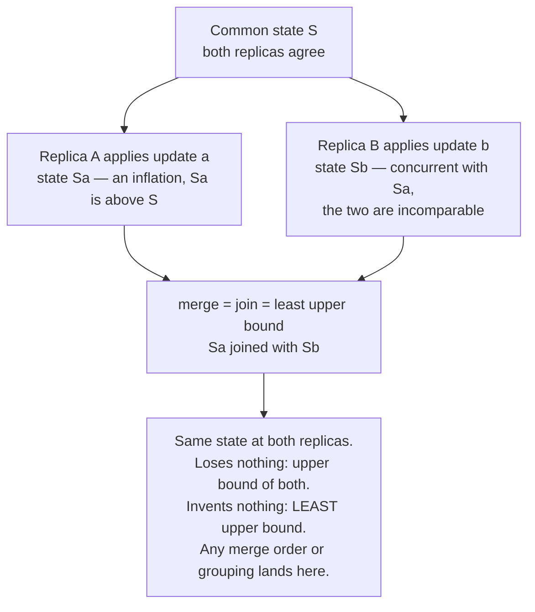
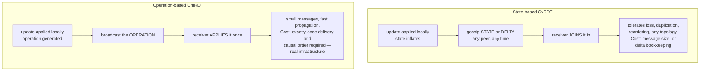
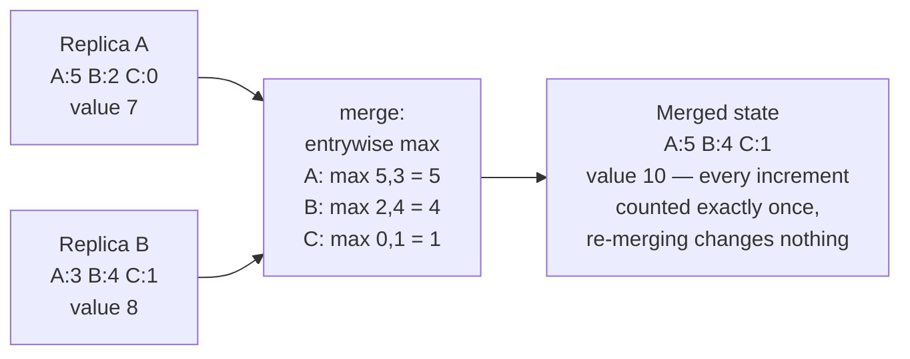
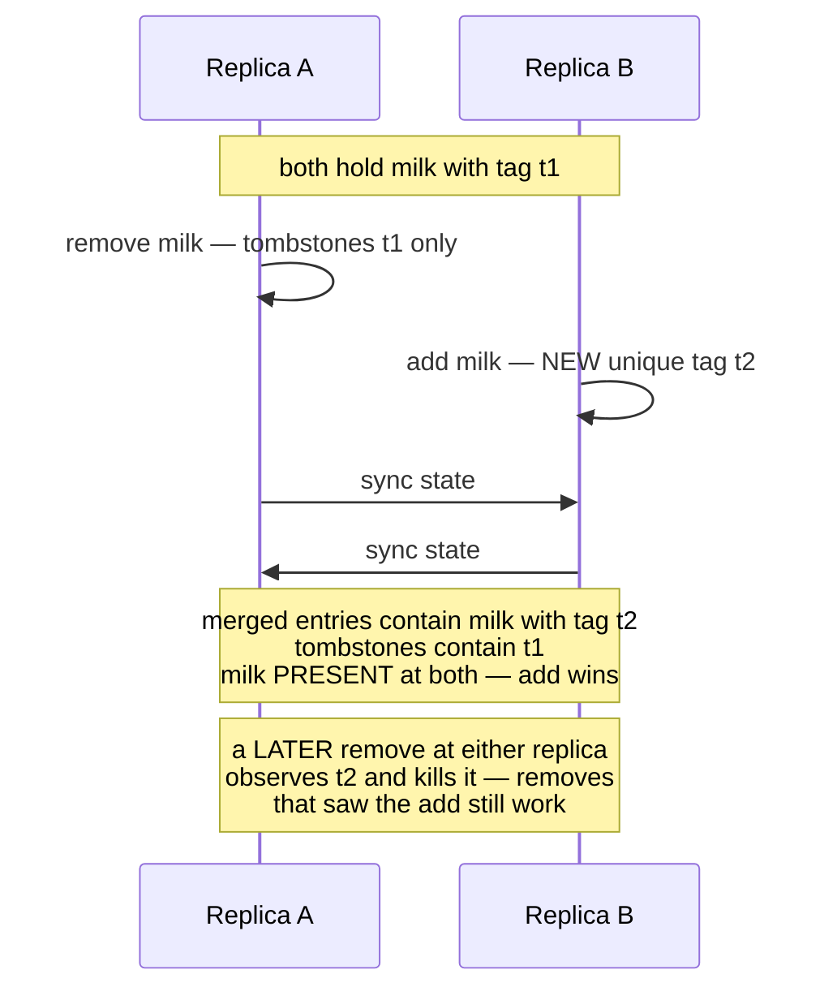

# Chapter 11 — CRDTs and Eventual Consistency

**What this chapter covers.** This volume has offered two answers to the same question — what do
you do when concurrent updates land at different replicas? Chapter 7 gave the Dynamo answer:
accept both, keep siblings, and push the merge problem up to the application, where it is solved
badly or not at all. Chapters 5 and 6 gave the consensus answer: prevent the conflict from
existing by serializing every write through a quorum, and pay for it in latency on every
operation, partition or no partition. This chapter covers the third way: **conflict-free
replicated data types**, data types whose merge function is built into the type itself and is
mathematically guaranteed to converge, so that replicas can accept writes independently, sync in
any order, over any topology, with duplicates and delays — and still end up in the same state.
The guarantee comes from a small piece of order theory, the join-semilattice, and we develop it
properly because the three algebraic properties involved are not decoration: they are precisely
what makes anti-entropy free, deduplication unnecessary, and convergence a theorem rather than a
hope. We walk the standard type catalog with mechanics — counters, sets, registers, sequences —
including the observed-remove set in enough depth to see why naive replicated sets are broken.
We then draw the honest boundary: the invariants CRDTs cannot protect, the metadata they
accumulate, and the escrow patterns that hybridize them with coordination. The chapter closes a
promise made in Volume 4, Chapter 4 — Atomics, CAS, and Lock-Free Data Structures — whose
`LongAdder` was introduced as "the in-process form of a CRDT counter." Here is the other half of
that sentence.

Learning goals — after this chapter you should be able to:

- Define a join-semilattice and explain why a commutative, associative, idempotent merge makes
  replica divergence impossible to sustain and at-least-once sync safe.
- State Strong Eventual Consistency precisely and explain how it strengthens plain eventual
  consistency.
- Distinguish state-based and operation-based CRDTs by their delivery requirements, and explain
  what delta-CRDTs fix.
- Walk the mechanics of G-Counter, PN-Counter, G-Set, 2P-Set, OR-Set, LWW-Register, and
  MV-Register, including the concurrent add/remove case that breaks naive sets.
- Explain why sequence CRDTs make collaborative text editing work, at the level of position
  identifiers, without the algorithmic details.
- Identify invariants that no CRDT can protect, explain why via invariant confluence, and apply
  escrow/reservation patterns as the hybrid.
- Choose merge semantics deliberately (add-wins vs remove-wins, LWW's loss acceptance) as a
  business decision, and property-test convergence.

## The problem: concurrent updates with no coordinator

Recall where Chapter 7 left us. A Dynamo-style store accepts a write at any replica, and when
two clients write the same key concurrently on opposite sides of a partition — or merely through
different coordinators in the same healthy datacenter — the system ends up holding two causally
concurrent versions. Version vectors detect this honestly: neither write descends from the
other. But detection is not resolution. The store hands both siblings to the application, and
the application must merge them. Amazon's shopping-cart example made this look tractable — union
the carts — but the folklore result was the resurrected deletion: union cannot distinguish "item
removed on one side" from "item added on the other," so deleted items reappear. The general
lesson from Chapter 7 stands: **app-side merge is a correctness obligation that most
applications silently fail**, usually by configuring last-write-wins and losing data quietly.

The consensus chapters solved the problem from the other end: if every write flows through
Raft's leader or a Paxos quorum, concurrent conflicting updates never both commit, so there is
nothing to merge. The price is written into Chapter 4's PACELC vocabulary: a round trip to a
quorum on the write path — else-latency paid on every operation — and unavailability on the
minority side of every partition. For a global counter of page views, that price is absurd. For
a collaborative document edited from three continents, it is fatal: nobody will accept 150 ms of
consensus per keystroke.

Multi-primary database replication, which Volume 5, Chapter 8 covered, sits in the worst spot of
all: it accepts concurrent writes like Dynamo but resolves them with ad hoc rules — last-writer-
wins, priority of one site over another, or "log it and call a human" — none of which come with
a convergence argument, and some of which (LWW on skewed clocks, per Chapter 2) discard
committed data. That chapter promised a principled treatment of conflict resolution. This is it.

The CRDT move is to change *where the merge lives*. Instead of a store that replicates opaque
blobs and an application that merges on read, the replicated object is a **data type** — a
counter, a set, a map, a sequence — whose interface includes a merge function, and whose merge
function is constrained by algebra so that convergence is guaranteed no matter when, how often,
or in what order replicas exchange state. Conflicts are not detected and resolved; they are
*defined away*, because the merge is total: every pair of states has a well-defined, agreed
combination. The question shifts from "how do we resolve conflicts?" to "which types have such a
merge, and what semantics can they express?" — and the answer to the second part is the honest
boundary of this chapter.

## The mathematics: join-semilattices

The theory is small and worth owning, because every design decision in the rest of the chapter
traces back to it.

A **partial order** on a set of states is a relation ⊑ that is reflexive, antisymmetric, and
transitive — "s ⊑ t" reads as "t knows at least as much as s." Partial means exactly what it
says: two states can be incomparable, and incomparable states are precisely the concurrent ones,
each holding information the other lacks. A **join-semilattice** is a partially ordered set in
which every pair of states has a **least upper bound** (a *join*, written s ⊔ t): the smallest
state that is ⊒ both. "Upper bound" means the join loses nothing from either input; "least"
means it adds nothing that neither input contained. A CRDT's merge function *is* the join.

Any join operation automatically has three properties, and each one neutralizes a specific
distributed-systems pathology:

| Property | Algebra | Pathology it kills |
|---|---|---|
| Commutative | s ⊔ t = t ⊔ s | Message *reordering*: replicas may receive states in any order |
| Associative | (s ⊔ t) ⊔ u = s ⊔ (t ⊔ u) | Arbitrary *grouping and topology*: gossip pairwise, via relays, in batches — the result is the same |
| Idempotent | s ⊔ s = s | *Duplication*: re-delivering a state is a no-op, so at-least-once sync is safe with zero dedup machinery |

Read that third row against Chapter 9, because it is this chapter's quiet superpower. Chapter 9
spent its length building idempotency keys, dedup tables, and exactly-once illusions on top of
at-least-once delivery, and concluded that the cheapest deduplication is a *naturally
idempotent operation* that needs none. A CRDT merge is exactly that. Anti-entropy between CRDT
replicas needs no sequence numbers, no acknowledgment tracking, no retransmission bookkeeping
beyond "try again later": push your state as often as you like, to whomever you like, and
nothing can be double-counted. The entire apparatus of reliable delivery collapses into
"eventually, every replica's state reaches every other replica along some path" — which is what
a gossip protocol from Chapter 10 provides almost by accident.

Convergence then follows in two lines. Merging only moves states *upward* in the order (s ⊑
s ⊔ t always), and updates are designed to be **inflations** — an increment or an add produces a
state strictly above the old one, never off to the side or below. So every replica's state
climbs a single shared lattice, and two replicas that have absorbed the same set of updates sit
at the join of those updates — the *same point*, regardless of the path taken to it. Divergence
cannot persist because there is nowhere for it to live: any two states, however they came about,
have a defined meeting point above them, and anti-entropy pushes both there.



### Strong Eventual Consistency, precisely

Chapter 3 defined eventual consistency and was candid about its weakness: "if updates stop,
replicas eventually agree" says nothing about *what* they agree on, *when*, or what happens
while updates continue. Shapiro, Preguiça, Baquero, and Zawirski (2011) defined the guarantee
CRDTs actually provide, and named it **Strong Eventual Consistency (SEC)**:

> **Eventual delivery** — an update delivered at one correct replica is eventually delivered at
> all correct replicas; **convergence** — any two correct replicas that have delivered the *same
> set* of updates are in *equivalent states*, immediately; **termination** — all method
> executions terminate.

The word doing the work is *immediately*. Vanilla eventual consistency promises agreement in
some unspecified future after a hypothetical quiescence that production systems never reach. SEC
promises that state is a *function of the set of delivered updates* — not of their arrival
order, not of the sync topology, not of how many duplicates were seen. Two replicas with the
same update set do not "eventually reconcile"; there is nothing to reconcile, because there is
no execution in which they differ. Conflict *resolution* has no step in the protocol at which
it could occur, because merge is total and deterministic. SEC is, in a precise sense, the
strongest guarantee available without coordination: it is achievable with zero synchronous
communication, while anything stronger (per Chapter 3's hierarchy — linearizability, and even
some session guarantees under failures) provably requires waiting for other replicas. Place it
on Chapter 3's spectrum as the principled *far end*: not a shrug, but a fixed point.

## State-based versus operation-based

The lattice story above is the **state-based** (CvRDT, convergent) formulation: replicas apply
updates locally and periodically ship their *state*; the receiver joins it in. Its delivery
requirements are as weak as requirements get — messages may be lost (retry later), duplicated
(idempotence), reordered (commutativity), and routed arbitrarily (associativity). If states
occasionally reach a replica through three different gossip paths, nothing whatsoever goes
wrong. The cost is bandwidth: the state of a large set is large, and shipping the whole thing
per sync round is absurd at scale.

**Delta-CRDTs** (Almeida, Shoker, Baquero) are the standard fix: instead of the full state, a
replica ships a *delta* — a small state, itself a lattice element, representing just the recent
inflations (the entries touched since the last exchange with that peer). Deltas are joined into
the receiver's state exactly like full states, so all the delivery tolerance survives; full-state
exchange remains available as the fallback that repairs anything a lost delta missed. Riak and
Akka Distributed Data both ship this. The mental model: full state sync is anti-entropy, delta
sync is the fast path, and because both are joins, mixing them freely is safe.

**Operation-based** CRDTs (CmRDT, commutative) invert the trade. Replicas broadcast
*operations* — "add('milk')", "increment by 3" — which are small, and each replica applies every
operation once. The algebra moves from the merge to the operations: **concurrent operations must
commute**, so that replicas applying them in different orders agree. But the delivery substrate
must now do real work: each operation must be delivered to each replica **exactly once** (or be
made idempotent by tagging — Chapter 9 again), and for most types delivery must be in **causal
order** — an operation must not arrive before operations it causally depends on, in Chapter 2's
sense. Removing an element before its add has arrived is the canonical disaster. Causal
broadcast is buildable (vector clocks plus buffering, per Chapter 2) and libraries provide it,
but it is genuine infrastructure with genuine failure modes, and it is the tax op-based designs
pay for their small messages and low latency of propagation.



The two formulations are a **duality**, not a rivalry: Shapiro et al. prove each can emulate the
other (ship operations that describe state deltas; ship states that carry operation logs), so
they are equally expressive. The choice is an engineering one about where you would rather pay —
bandwidth and merge computation, or delivery infrastructure. Databases and infrastructure
systems (Riak, Akka, Redis Enterprise) lean state/delta-based because gossip tolerance matches
their membership churn; collaborative-editing systems lean op-based or hybrid because a
keystroke is an operation and latency of propagation is the product.

## The type catalog

### G-Counter: the LongAdder debt, paid

A **G-Counter** (grow-only counter) is a map from replica ID to a non-negative count. A replica
increments *only its own entry*. The value is the sum of all entries. The merge is the
**entrywise maximum**.

```python
class GCounter:
    def __init__(self, replica_id, n_replicas):
        self.i = replica_id
        self.counts = [0] * n_replicas

    def increment(self, by=1):
        self.counts[self.i] += by           # only ever your own entry

    def value(self):
        return sum(self.counts)

    def merge(self, other):
        self.counts = [max(a, b) for a, b in zip(self.counts, other.counts)]
```

Why max and not sum? Because each entry has a **single writer** and only grows, the larger of
two values for entry *k* is simply the more recent knowledge of replica *k*'s count — max takes
the freshest fact about each stripe. Summing would double-count: merge the same state twice
(which at-least-once sync *will* do) and the counter inflates. Max is idempotent; sum is not.
This is the whole design in one decision, and it is worth checking the lattice properties
against it: states ordered entrywise, join = entrywise max — commutative, associative,
idempotent by inspection, and increment is an inflation. Convergence follows from the theory
with nothing further to prove.



Now pay the Volume 4 debt in full. `LongAdder` replaced one contended `AtomicLong` with striped
per-thread cells summed on read, trading an instantaneously exact value for contention-free
writes. The G-Counter is *the same object* with the sharing assumption removed. In-process, the
cells live in shared memory, so "merge" is trivial — `sum()` just reads them all. Across
replicas nothing is shared, so the cells must travel, and the single-writer discipline that in
`LongAdder` merely avoided cache-line ping-pong now *enables the max-merge*: because only
replica *k* writes entry *k*, and only upward, entrywise max losslessly reconciles any two
snapshots however stale. Contention → striping → aggregate-on-read was Volume 4's arc;
coordination → per-replica state → join is this volume's; they are one idea at two scales, and
the trade is the same at both: writes scale freely, and the read is exact only at quiescence.

Cost, honestly: state is O(number of replicas that ever incremented), which is fine for a
cluster of storage nodes and unbounded for "every browser tab is a replica" — client-side
designs interpose servers or prune IDs for this reason.

### PN-Counter

Decrement breaks the grow-only trick — a decrement is not an inflation of the max-merged map.
The **PN-Counter** fixes it with the standard CRDT maneuver, *two monotone things instead of one
non-monotone thing*: a P G-Counter for increments, an N G-Counter for decrements, value = P − N,
merge = merge both halves. The value can now move both ways while the *state* still only grows.
Note what is not promised: nothing stops the value going negative, because no replica can see
concurrent decrements elsewhere. Hold that thought for the boundary section.

### Sets: G-Set, 2P-Set, and why naive sets break

A **G-Set** is a set with only `add`; merge is union — the simplest lattice there is. Useful
whenever removal genuinely never happens (issued certificate serials, seen-event IDs).

A **2P-Set** adds removal via a second G-Set of tombstones: present = added and not removed.
It converges, but with a semantics almost nobody wants: **an element removed once can never be
re-added** — the tombstone is forever, and merge resurrects it to kill any later add. It also
answers the wrong question for concurrent add/remove: remove wins even against an add it never
observed. The 2P-Set matters mostly as the cautionary midpoint between "union resurrects
deletions" (Chapter 7's cart) and the type that gets it right.

### OR-Set: the one to actually understand

The **observed-remove set** (OR-Set) is the workhorse replicated set — Riak's set, Akka's
`ORSet`, the model for Redis Enterprise sets — and its design principle generalizes: **make
removal act on evidence, not on names.**

Every `add(e)` attaches a globally **unique tag** (replica ID + local counter, or a UUID) to the
element; the state holds (element, tag) pairs. `remove(e)` does not remove the *name* "e" — it
tombstones exactly the *tags of e that this replica has observed*. An add that this remove never
saw carries a tag the remove did not tombstone, so it survives the merge. Concurrent add and
remove of the same element therefore resolve **add-wins**, deterministically:

```python
class ORSet:
    def __init__(self, replica_id):
        self.i, self.n = replica_id, 0
        self.entries = set()        # {(elem, tag)} — live evidence of adds
        self.tombstones = set()     # {(elem, tag)} — observed and removed

    def add(self, e):
        self.n += 1
        self.entries.add((e, (self.i, self.n)))    # fresh unique tag

    def remove(self, e):
        seen = {(x, t) for (x, t) in self.entries if x == e}
        self.tombstones |= seen                    # kill only what was OBSERVED
        self.entries -= seen

    def contains(self, e):
        return any(x == e for (x, _) in self.entries)

    def merge(self, other):
        self.tombstones |= other.tombstones
        self.entries = (self.entries | other.entries) - self.tombstones
```

The state (entries ∪ tombstones ordered by inclusion, with tombstones dominating) is a lattice;
merge is unions with tombstone subtraction; all three properties hold. Walk the case that breaks
naive sets:



Contrast every alternative: plain union resurrects the deletion permanently; 2P-Set kills the
concurrent add it never saw; LWW flips a coin weighted by clock skew. The OR-Set gives a
*chosen* answer — an add concurrent with a remove survives — and applies it deterministically
everywhere. Whether add-wins is the *right* answer is a business question (a remove-wins
variant exists and is sometimes correct — think access revocation, where the safe default is
out); the point is that the answer is picked at type-selection time, not improvised per
conflict.

Two costs need naming. Tags make the set grow with *add operations*, not with distinct
elements. Tombstones grow with removes and, naively, live forever. The **optimized OR-Set**
(Bieniusa et al. 2012, the "ORSWOT" — observed-remove set without tombstones — that Riak ships)
replaces explicit tombstones with a version vector summarizing what each replica has seen:
an entry absent from a state whose vector *covers* the entry's tag has provably been removed, so
absence-plus-causality encodes the tombstone. Delta variants ship only recently changed entries.
The semantics are unchanged; the metadata drops from O(operations) toward O(elements +
replicas). This pattern — replace explicit per-operation evidence with a causal summary — recurs
across every optimized CRDT, and its limits reappear in the boundary section.

### Registers: LWW and MV

A register — one opaque value, `set` and `get` — has no internal structure to merge, so its
CRDTs are really policies about concurrent writes.

The **LWW-Register** totally orders writes by (timestamp, replica-ID tiebreak); merge keeps the
larger. It converges, it is tiny, and every popular "CRDT-ish" store leans on it — Cassandra's
cell-level reconciliation is exactly this. Its two sins were prosecuted in Chapter 2 and Chapter
7 and both convictions stand. First, of two *concurrent* writes, one is silently discarded —
"last" is a fiction imposed on writes that had no order; an update can be accepted, acknowledged,
and later vaporized by a merge, with no error surfaced anywhere. Second, with wall-clock
timestamps, skew decides *which* one dies — a replica with a fast clock wins arguments for
seconds at a time, and the discarded write can be the causally *later* one. LWW is a legitimate
choice only when overwrite-loss is genuinely acceptable (mutable profile fields, cache-like
data, "any recent value is fine"). In practice its blast radius is contained by granularity:
**per-field LWW** inside a CRDT map (Riak maps, Redis Enterprise hashes) loses, at worst, one
concurrently-edited field rather than one of two whole documents — concurrent edits to
*different* fields both survive. That single design decision eliminates most real-world LWW
grief, without fixing the concurrent-same-field case.

The **MV-Register** is the honest register: guarded by a version vector, its merge keeps *all*
causally concurrent values as siblings and discards only dominated ones. It refuses to invent an
order that does not exist — precisely Chapter 7's Dynamo behavior, now stated as a type. The
application still faces the siblings on read, so the MV-Register is less a solution than an
honest interface to the problem; its virtue is that the *state* converges deterministically and
no write is silently dropped. Use it where loss is unacceptable and a human or a domain rule can
adjudicate; use a real structured CRDT where one can express the merge.

### Sequences: the collaborative-editing showcase

Text is the hardest case: an ordered sequence where concurrent users insert *at positions*, and
positions shift under each other's edits. Sending "insert at index 12" is meaningless once a
concurrent edit has moved index 12. Sequence CRDTs all share one move: **replace indices with
stable position identifiers** that name a location densely — between any two identifiers,
another can always be minted — so an insertion names its neighbors once and is thereafter
order-independent.

**RGA** (Roh et al. 2011) links each character to the identifier of the character it was
inserted after, breaking concurrent-sibling ties by timestamp; deletion tombstones the
character. **Logoot** and its LSEQ refinement (Weiss et al. 2009) instead give each character a
position from a dense ordered space — variable-length digit paths, so a fresh position always
fits between neighbors — making characters totally ordered by identifier with no tombstone-free
lunch either. The **Yjs/YATA** lineage and **Automerge** (Kleppmann's RGA-derived design) are
the production embodiments: heavily engineered identifier encodings, run-length compression of
consecutive insertions, and delta sync, bringing per-character metadata down from the
naive-academic estimates that once made text CRDTs look hopeless to overheads that real editors
ship. Honesty requires naming the known wart: **interleaving anomalies**. Kleppmann, Mulligan,
and Gomes showed that several published sequence CRDTs can interleave two users' concurrent
insertions at the same spot character-by-character — "Alice" and "Bob" typed concurrently
merging as "ABlobice"-style shuffles — converged, consistent, and wrong to any human reader.
Newer designs constrain this; it is a live research edge, not a solved detail.

Collaborative editors are *the* CRDT showcase for a structural reason: the workload is almost
entirely insertions, which commute beautifully once positions are identifiers; users are the
replicas, offline work is the feature, and per-keystroke consensus is unthinkable. When the data
type fits this well, CRDTs are not a compromise — they are simply the correct architecture.

| Type | State | Merge | Concurrent-conflict semantics |
|---|---|---|---|
| G-Counter | per-replica counts | entrywise max | none possible — increments commute |
| PN-Counter | two G-Counters | both halves | none — but no floor invariant |
| G-Set | set | union | none — adds commute |
| 2P-Set | add-set + tombstones | unions | remove wins, forever; no re-add |
| OR-Set | tagged entries + causal context | union minus observed tags | **add-wins** (remove-wins variant exists) |
| LWW-Register | value + timestamp | keep larger timestamp | one write silently lost; clocks decide |
| MV-Register | values + version vector | keep concurrent siblings | surfaced to reader — no loss, no decision |
| RGA / Logoot / Yjs | identified elements | positional | intention-preserving order, mostly; interleaving edge cases |

## What CRDTs cannot do

This section is the difference between using CRDTs and being burned by them.

**Global invariants that span concurrent updates need coordination — no data type dodges this.**
Uniqueness ("one account per email"), non-negativity ("balance ≥ 0"), capacity ("at most N
seats"): each of these can be violated by two operations that are *individually* legal and
concurrently applied. Two replicas each check "9 seats left," each sell 5, each locally valid —
merged, the invariant is dead, and no merge function can un-sell a ticket. This is not a
weakness of the catalog above; it is Chapter 4's theorem wearing a different coat. Bailis et
al. made it a usable test, **invariant confluence**: an invariant is preservable without
coordination if and only if merging any two invariant-satisfying states yields an
invariant-satisfying state. "Total ≥ 0" fails the test (two states each at −0 distance from the
floor merge below it); "this ID was generated by exactly one replica" fails; "the set only
grows" passes; "each replica's entry is its own writes" passes. Run your invariant through this
test *before* choosing a CRDT. If it fails, you need consensus for those operations — or the
hybrid below.

**Escrow and reservations: pre-partition the invariant.** The classical move (O'Neil's escrow
transactions, 1986; revived as *bounded counters* by Balegas et al.) is to spend coordination
*ahead of time, in bulk*, so the hot path needs none: split the global allowance into
per-replica allotments, and let each replica consume only its own share, coordination-free.

```python
# Invariant: total sold <= 100. Coordinate ONCE to split the allowance:
rights = {"eu-west": 25, "us-east": 25, "us-west": 25, "ap-south": 25}

def sell(replica, n):
    if rights[replica] >= n:
        rights[replica] -= n      # local decision, invariant provably safe:
        return "SOLD"             #   no merge can overspend a partitioned right
    return "TRANSFER_NEEDED"      # borrow rights from a peer — coordination,
                                  #   but rare, async-refillable, off the hot path
```

The invariant is safe *by construction* — a replica cannot spend rights it does not hold, and
rights-transfers are the only coordinated operation, needed only near exhaustion. This is
Volume 5, Chapter 9's shard-local-invariant moral, replayed at replica granularity: an invariant
you can partition is an invariant you can enforce locally. The residue is a familiar trade:
a replica can refuse a sale while global stock remains (its allotment is empty, a peer's is
not) — you have converted potential overselling into potential false scarcity, which for most
businesses is the right direction to be wrong in.

**Cross-object transactions don't compose.** Each CRDT converges *individually*; nothing makes
two of them converge *in step*. "Move item from cart A to cart B atomically" is not expressible
as independent merges — an observer can see both or neither mid-sync. CRDT maps give you one
composite object with a joint merge, which covers many cases; true multi-object atomicity is
back in Volume 5's territory.

**Metadata and garbage are the operational tax.** Version vectors grow with the number of
actors ever seen (Chapter 10's churn problem, again); OR-Set contexts grow with operations until
compacted; sequence CRDTs tombstone deletions. Compaction is not free-running: discarding a
tombstone is safe only when it is **causally stable** — provably delivered at *every* replica —
and "every replica" is a membership question, which is why CRDT garbage collection is entangled
with Chapter 10's failure detection. A replica that is partitioned-but-not-removed blocks
stability forever, exactly as Volume 4, Chapter 4's stalled thread blocked epoch-based
reclamation: same shape, one process wide there, one cluster wide here. Production systems
bound actors (Riak's per-object actor limits), lease replica IDs, or accept operator-triggered
compaction. Budget for this; it is where CRDT deployments actually hurt.

## Real deployments, honestly described

**Riak** shipped the first serious database CRDT suite (Riak 2.0's data types: counters, sets,
maps, flags, registers, built on the optimized OR-Set work) — the direct answer to its own
siblings problem from Chapter 7. **Redis Enterprise's Active-Active** geo-replication implements
its types as CRDTs conceptually equivalent to the catalog above — counters merge per-replica
contributions, sets are observed-remove, strings offer LWW — giving multi-region writes with
typed merges rather than Volume 5 Chapter 8's ad hoc rules. **Akka Distributed Data** provides
`ORSet`, `PNCounter`, `LWWMap` and friends replicated by gossip with delta propagation, as
cluster-internal shared state. **Phoenix Presence** is a lovely small example: "who is online in
this channel" tracked per-node as an observed-remove structure and merged by gossip — no central
presence store, and a node crash simply stops contributing state. **Automerge and Yjs** anchor
the local-first ecosystem: full document CRDTs (maps, lists, text, counters) embedded in
applications, syncing peer-to-peer or through dumb relays.

The pattern in what fits: **shopping carts, counters and metrics, presence and membership,
feature flags, collaborative documents** — data where the merge semantics of the catalog match
the domain's own answer to "what should happen?" The anti-fit is equally clear: **ledgers and
inventory** — anything whose essence is a non-confluent invariant. Sell inventory with a
PN-Counter and you have chosen overselling; keep a balance in one and you have chosen overdraft.
Those need consensus, or escrow, and a vendor page saying "CRDT-based" does not repeal the
theorem.

## Using CRDTs well

**Choose semantics first, type second.** The type catalog is really a menu of *answers to
business questions*, and picking the type is picking the answer. Concurrent add and remove:
should the item stay (cart — add-wins OR-Set) or go (access revocation — remove-wins variant)?
Concurrent writes to one field: is losing one acceptable (LWW) or must both surface
(MV-Register)? Write the chosen answer down where product owners can see it, because it *is* a
product decision — "concurrent re-add beats delete" changes user-visible behavior. Teams that
skip this step rediscover it in production as a bug report that is actually a semantics dispute.

**Design the sync topology deliberately.** State/delta CRDTs compose naturally with Chapter
10's gossip and Chapter 7's anti-entropy: periodic pairwise exchange with random peers gives
propagation in O(log N) rounds with per-node cost independent of cluster size, and CRDT
idempotence means the gossip layer needs no reliability features at all. Op-based types need the
causal-broadcast substrate — buy it from a library (Akka, Automerge's sync protocol, Yjs
providers) rather than building it; its edge cases are Chapter 2's edge cases.

**Test convergence the only way that works: property-based, in random orders.** Convergence
bugs are order-dependent by definition; example-based tests cannot find them. Generate random
operations at random replicas, sync in random pairwise orders with duplication, and assert
equality — a direct check of commutativity, associativity, and idempotence in one property:

```python
from hypothesis import given, strategies as st
import random

ops = st.lists(st.tuples(st.integers(0, 2),                  # originating replica
                         st.sampled_from(["add", "remove"]),
                         st.sampled_from("abc")), max_size=40)

@given(ops=ops, seed=st.integers(0, 2**32))
def test_orset_strong_convergence(ops, seed):
    rs = [ORSet(i) for i in range(3)]
    for rid, op, elem in ops:
        getattr(rs[rid], op)(elem)                 # ops applied at home replica only
    rng = random.Random(seed)
    for _ in range(30):                            # random gossip, WITH duplicates
        i, j = rng.sample(range(3), 2)
        rs[i].merge(rs[j])
    for i in range(3):                             # one final full exchange so all
        for j in range(3):                         # updates are delivered everywhere
            rs[i].merge(rs[j])
    assert rs[0].entries == rs[1].entries == rs[2].entries   # SEC: same updates,
                                                             # same state. Period.
```

Note what the final full exchange encodes: SEC promises identical state given the same
*delivered* set, so the test forces full delivery, while the random middle section stresses
every order, grouping, and duplication on the way there. Extend it with partitions (withhold
merges between groups for a while) and semantic assertions ("a remove that observed an add
deletes it"). This slots directly into Chapter 12's toolbox — the same move as
simulation testing, applied to a data type — and it is cheap enough that there is no excuse for
shipping a hand-rolled merge without it. Which is also the moment to repeat Volume 4's advice
verbatim: prefer the library (Riak, Akka, Automerge, Yjs) to your own implementation; the
optimized variants especially are subtle, and published ones have shipped with bugs.

## The distributed-systems lens

CRDTs close the arc this volume has been drawing since Chapter 3, and the closing thought is
about *when coordination is necessary at all*.

Chapter 3 laid out the consistency spectrum and priced its strong end; Chapter 4 said the real
everyday trade is PACELC's ELSE branch — latency versus consistency on the healthy path.
CRDTs are the EL corner made *rigorous*: not "we relaxed consistency and hope the conflicts are
rare," but a precise guarantee (SEC), achieved with zero synchronous coordination, with conflict
handling that is total, deterministic, and chosen in advance. The spectrum's weak end, done
properly, turns out to have a theory as sharp as the strong end's.

The generalization is the **CALM theorem** (Hellerstein and Alvaro): a program has a
consistent, coordination-free distributed implementation *if and only if* it is expressible in
monotone logic — logic where new information can only produce new conclusions, never retract old
ones. Monotone questions ("has this event been seen?", "what is the union so far?") never need
to wait, because no future message can make a "yes" wrong. Non-monotone questions ("is this
name unique?", "is the balance still positive?", anything with negation or an aggregate over
*all* data) must wait, because answering requires knowing that nothing is missing — and knowing
that is what coordination *is*. CRDTs are CALM's data-structure face: a join-semilattice is
monotonicity made concrete (state only inflates), and invariant confluence is the working
engineer's version of the same test. Together they turn "can we skip consensus here?" from a
matter of taste into a property you can check per operation — this volume's most practical
sentence.

And the full circle: Volume 4, Chapter 4 ended by promising that `LongAdder` was a CRDT counter
in miniature. You can now read the whole progression as one idea crossing scales. A contended
`AtomicLong` and a Raft leader are the same design: one serialization point, exact answers,
throughput bounded by coordination. `LongAdder` cells and G-Counter entries are the same escape:
give every participant its own monotone stripe, let stripes meet in a join, read an answer
that is exact only at rest. Cache-line ping-pong and consensus round trips are the same cost;
striping and SEC are the same purchase. The trajectory of the field runs the same direction:
**local-first software** (Kleppmann et al.'s program: your data on your device, servers as
sync accelerators rather than owners) and edge computing both need writes accepted far from any
quorum, and both are pushing CRDTs from research darling to default infrastructure. The
coordination-avoidance principle underneath is this volume's parting moral: coordinate where
the invariant demands it — and prove, not assume, that it demands it — because everywhere else,
the lattice is free.

## Key takeaways

- CRDTs are the third answer to concurrent updates: not app-side merge (Chapter 7), not
  serialize-everything (Chapters 5–6), but types whose **merge is built in and provably
  convergent**.
- The math is the **join-semilattice**: states form a partial order, merge is the least upper
  bound, and its three properties each kill a pathology — commutativity kills reordering,
  associativity kills topology sensitivity, **idempotence kills duplication and makes
  at-least-once anti-entropy safe with no dedup machinery** (Chapter 9's dream primitive).
- **Strong Eventual Consistency**: replicas that have delivered the same set of updates are in
  the same state *immediately* — convergence is a function of the update set, not of order,
  and there is no conflict-resolution step because merge is total.
- **State-based** CRDTs need only eventual, unreliable delivery but ship state (delta-CRDTs fix
  the bandwidth); **op-based** CRDTs ship small operations but require exactly-once, causally
  ordered delivery. The two are formally equivalent; the delivery requirements decide.
- Know the catalog by its semantics: G-Counter (single-writer entries, max-merge — `LongAdder`
  across machines), PN-Counter (two G-Counters, no floor), OR-Set (**unique tags; removes kill
  only observed tags; add-wins**), LWW-Register (silently loses concurrent writes and trusts
  clocks — Chapter 2's warning applies; per-field LWW contains the damage), MV-Register (honest
  siblings), sequence CRDTs (stable position identifiers; interleaving anomalies are a real
  edge).
- The boundary is **invariant confluence**: uniqueness, non-negativity, and capacity invariants
  are not confluent and require consensus — or **escrow/reservations**, which pre-partition the
  invariant so the hot path is coordination-free. Ledgers and inventory are the anti-fit.
- Metadata is the operational tax: causal contexts and tombstones grow, and compaction requires
  **causal stability**, entangling CRDT GC with membership (Chapter 10) — a lost-but-not-removed
  replica blocks GC like a stalled thread blocks epoch reclamation.
- Use them well: **pick merge semantics as an explicit business decision first**, gossip for
  state-based sync, library-provided causal broadcast for op-based, and **property-test
  convergence** under random orders, duplication, and partitions (Chapter 12).
- The synthesis: CRDTs are the principled far end of Chapter 3's spectrum, the rigorous EL of
  Chapter 4's PACELC, and the data-structure face of **CALM** — monotone logic needs no
  coordination. Coordinate only where a non-confluent invariant forces it.

## Further reading

- Shapiro, M., Preguiça, N., Baquero, C., Zawirski, M., "Conflict-free Replicated Data Types,"
  *SSS 2011* — the SEC definition and the CvRDT/CmRDT framework.
  https://inria.hal.science/hal-00932836
- Shapiro, M., Preguiça, N., Baquero, C., Zawirski, M., "A Comprehensive Study of Convergent and
  Commutative Replicated Data Types," INRIA Research Report RR-7506, 2011 — the type catalog in
  full formal detail. https://inria.hal.science/inria-00555588
- Almeida, P. S., Shoker, A., Baquero, C., "Delta State Replicated Data Types," *JPDC* 111,
  2018 — delta-CRDTs. https://arxiv.org/abs/1603.01529
- Bieniusa, A. et al., "An Optimized Conflict-free Replicated Set," INRIA RR-8083, 2012 — the
  tombstone-free OR-Set behind Riak's implementation. https://arxiv.org/abs/1210.3368
- Hellerstein, J. M., Alvaro, P., "Keeping CALM: When Distributed Consistency Is Easy," *CACM*
  63(9), 2020 — the CALM theorem, accessibly. https://arxiv.org/abs/1901.01930
- Bailis, P. et al., "Coordination Avoidance in Database Systems," *VLDB* 2015 — invariant
  confluence. https://arxiv.org/abs/1402.2237
- Balegas, V. et al., "Putting Consistency Back into Eventual Consistency," *EuroSys* 2015 —
  bounded counters and reservation-style invariant enforcement.
- Kleppmann, M., "CRDTs: The Hard Parts" (talk, 2020) — tombstones, metadata overhead, and
  sequence-CRDT subtleties from the Automerge author.
  https://martin.kleppmann.com/2020/07/06/crdt-hard-parts-hydra.html
- Kleppmann, M., Mulligan, D. P., Gomes, V. B. F., et al., "Interleaving Anomalies in
  Collaborative Text Editors," *PaPoC* 2019 — the interleaving problem, precisely.
- Kleppmann, M., Wiggins, A., van Hardenberg, P., McGranaghan, M., "Local-first Software: You
  Own Your Data, in Spite of the Cloud," *Onward! 2019* —
  https://www.inkandswitch.com/local-first/
- Automerge documentation — https://automerge.org/docs/ — and Yjs documentation —
  https://docs.yjs.dev/ — the production document-CRDT libraries.
- Riak Data Types documentation — https://docs.riak.com/riak/kv/latest/developing/data-types/
  — the first mainstream database CRDT suite.
- Chapter 2 — Time, Clocks, and Ordering — causal delivery, version vectors, and why LWW's
  timestamps lie.
- Chapter 7 — Quorum Systems and Dynamo-Style Replication — the siblings problem CRDTs answer.
- Chapter 12 — Testing Distributed Systems — the property-based and simulation techniques the
  convergence test belongs to.
- Volume 4, Chapter 4 — Atomics, CAS, and Lock-Free Data Structures — `LongAdder`, the
  in-process ancestor of the G-Counter.
