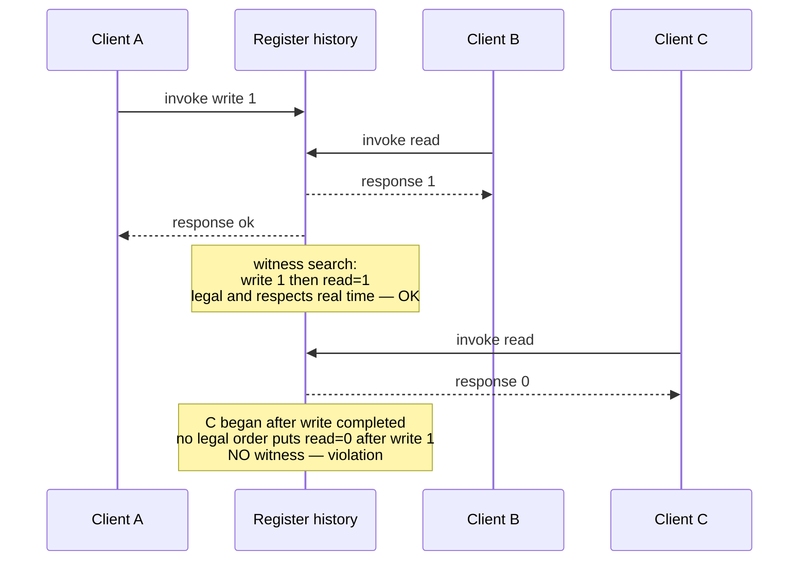
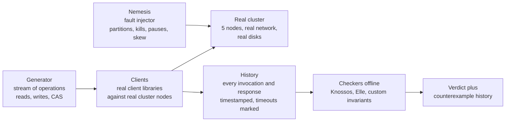
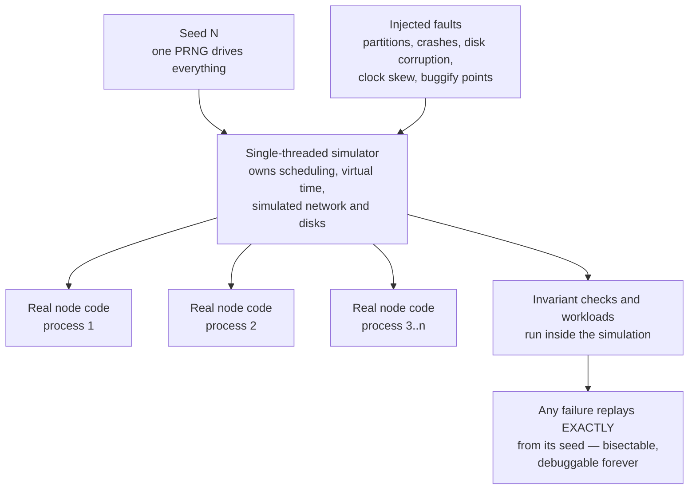
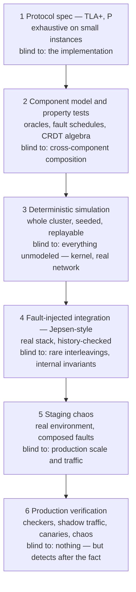

# Chapter 12 — Testing Distributed Systems: Jepsen, Chaos, and Simulation

**What this chapter covers.** Volume 4, Chapter 10 — Testing and Debugging Concurrent Systems
closed with a promise: every technique there has a distributed sibling, and this chapter is where
the sibling lives. It is also where this volume settles its accounts. Eleven chapters have made
claims — that a linearizable register behaves like *this*, that Raft elects at most one leader per
term, that a CRDT converges, that an idempotent consumer survives duplicate delivery — and claims
that cannot be checked are marketing. This chapter is about checking them: what the properties even
are (histories, safety, liveness, consistency contracts as testable predicates); how Jepsen-style
testing records concurrent histories against a real cluster under injected faults and checks them
offline; fault injection as a discipline with a menu mapped to Chapter 1's failure models;
deterministic simulation testing in the FoundationDB lineage, the strongest current practice; TLA+
and its relatives for the design layer; property-based testing for distributed components; and the
verification that continues after deploy. The synthesis artifact is a testing pyramid for
distributed systems — six layers from protocol spec to production checkers, each with stated
coverage and stated blind spots — because no single layer is sufficient and every layer is cheap
precisely where the layers above it are blind.

Learning goals — after this chapter you should be able to:

- Explain why the cross-node interleaving space defeats conventional testing even more thoroughly
  than the single-machine case, and why no compiler-level instrumentation chokepoint exists to
  rescue it.
- Define history-based correctness checking precisely: record invocations and responses, search for
  a legal sequential witness respecting real-time order; state why the search is NP-hard and how
  Knossos and Porcupine cope in practice.
- Describe the Jepsen method as a method — generators, clients, nemesis, checker — including the
  standard fault repertoire and nemesis composition patterns, and characterize the classes of
  findings it has produced without overclaiming specifics.
- Build a fault-injection toolkit mapped to Chapter 1's failure models, using iptables, tc netem,
  toxiproxy, and mesh-level injection, and manage the reproducibility problem with seeds and
  shrinking.
- Explain deterministic simulation testing: what the simulator must own, what the architecture
  costs up front, why seeded replayable universes invert the economics of rare bugs, and how the
  modern tools (TigerBeetle's simulator, Antithesis, madsim/turmoil) differ.
- Decide when TLA+ pays, write and read a simple invariant, and state the refinement gap honestly.
- Position production verification — invariant checkers, shadow traffic, canaries, chaos with blast
  radius — as the pyramid's top layer, with the practice and culture deferred to Volume 11.

## Why the network makes it worse

Start from Volume 4, Chapter 10's arithmetic: *n* threads of *k* steps generate an astronomical
interleaving space, a unit test samples one boringly fair schedule per run, and everything that
works either extracts more evidence per run, explores schedules systematically, or shrinks the
space by design. Every clause of that argument survives the move to distributed systems, and every
clause gets worse.

First, the space itself grows new dimensions. On one machine the nondeterminism is scheduling:
which thread runs next. Across machines, the schedule is joined by the network — every message may
be delayed arbitrarily, reordered against its siblings, duplicated by a retry layer, or dropped;
links may fail asymmetrically (A hears B, B does not hear A); partitions may isolate any subset
from any other, including the partial and overlapping partitions of Chapter 10 — Failure Detection
that no clean "split into two halves" mental model captures. Add clock skew (Chapter 2: every node
has its own idea of now, and NTP merely bounds the disagreement on a good day), and add partial
failure itself — any node may crash at any step and, in the crash-recovery model, return with its
disk but not its memory. The single-machine interleaving space was the multinomial coefficient of
thread steps. The distributed space is that, per node, *multiplied* by every subset of messages
that could be delayed past every other, *multiplied* by every fault the failure model admits at
every point. Nobody writes this number down; the point is that sampling it uniformly is not on the
menu.

Second — and this is the deeper problem — the chokepoint is gone. A race detector works because a
compiler can instrument *every* access to shared memory and a runtime can maintain happens-before
over all of them: one process, one address space, total visibility. There is no analogous vantage
point across machines. State is shared by messages that traverse NICs, kernels, switches, and
cloud fabric you do not control; the closest thing to "instrument every access" would be
instrumenting the network itself, and even then you would see packets, not intentions. This is why
the entire distributed testing tradition pivots from *instrumenting the mechanism* to *checking
the history*: observe the system only at its client boundary — operations invoked, responses
returned — and ask whether that observable history is one the claimed consistency contract permits.
The internal mechanism becomes a black box; the contract, in the sense of Chapter 3, becomes the
test oracle.

Third, the failure modes live precisely where unit tests never go. A distributed bug is almost
never inside one node's code path, which unit tests cover fine; it is in the *cross-node
interleaving* — the leader that commits an entry while a partition is forming, the client whose
lease expires during a GC pause (Chapter 8's paused-client, the single most reliable producer of
split-brain war stories), the read served by a replica that missed one message. No test that runs
a single process can even *express* these schedules. And production, as always, is the flakiest
scheduler you own: Chapter 1's asynchronous model — no bound on message delay, no bound on
processing time — is not a theoretician's abstraction but a description of a congested top-of-rack
switch at 2 a.m. Production will eventually visit the interleaving your tests could not express.
The techniques below are all ways of visiting it first.

## What are we even checking

Before any tool, the vocabulary — because "we tested it and it worked" is meaningless until you
can say what property held.

### Safety, liveness, and histories

Chapter 1's partition of properties governs everything here. A **safety** property says nothing
bad ever happens: no two leaders in one term, no committed write lost, no read returns a value
that was never written. Safety violations are *finite* evidence — a specific history prefix that
is already wrong — which makes them the natural target of testing: a checker can hold up a
concrete history and say *this* is the violation. A **liveness** property says something good
eventually happens: elections eventually complete, replicas eventually converge. No finite
observation refutes "eventually," so liveness testing is necessarily cruder — timeouts standing in
for eventually, with the attendant false alarms. Every serious distributed test suite is
overwhelmingly a safety suite, with liveness checked as "made progress within a generous bound,"
and you should read any test report with that asymmetry in mind.

The object being checked is a **history**: a sequence of invocation and response events, recorded
at the clients, each tagged with the process, the operation, and its wall-clock interval.
Operations whose intervals overlap are concurrent; operations where one's response precedes the
other's invocation are ordered in real time. Everything downstream — linearizability checking,
Elle's anomaly search, Jepsen's verdicts — is a predicate over histories.

### Linearizability checking, precisely

Chapter 3 defined linearizability: every operation appears to take effect atomically at some
instant between its invocation and its response, consistently with the object's sequential
specification. The definition is directly operational. To check a recorded history, search for a
**sequential witness**: a total order of all completed operations that (a) is a legal execution of
the sequential object — reads return the latest preceding write — and (b) respects real time —
if operation X completed before operation Y began, X precedes Y in the witness. If a witness
exists, the history is linearizable; if none exists, you hold a correctness violation regardless
of what the implementation did internally, which is the entire charm of black-box checking.

Walk one tiny history for a single register, initially 0, with three clients:

```text
A:  |---- write(1) ----|                       ok at t=30
B:        |-- read --|                         returns 1 at t=20
C:                          |-- read --|       returns 0 at t=50
```

Consider first only A and B. B's read overlaps A's write and returns 1. Witness: `write(1), read=1`
— the write linearizes early in its interval, before B's read. Legal, real-time respected: the
history so far is linearizable. Now add C: a read that *begins after A's write completed* (t=40 >
t=30) and returns 0. Any witness must place C's read after `write(1)` by real-time order, and a
legal register cannot return 0 after 1 was written with no intervening write. No witness exists —
the history is not linearizable. This exact shape, a **stale read after a completed write**, is
the most common real-world verdict: it is what a replica serving reads behind a partition looks
like from the outside.



The search is expensive in principle: deciding linearizability of an arbitrary history is
**NP-complete** (Gibbons and Korach, 1997), because concurrent operations can be permuted
combinatorially and each choice constrains the rest. Practical checkers survive on three
observations. The **Wing–Gong / WGL** approach is a backtracking search: pick a minimal operation
(one no other completed operation must precede), apply it to the sequential model, recurse, undo
on failure — with memoization of already-refuted configurations doing most of the saving.
**Knossos**, Jepsen's checker, implements this lineage in Clojure; **Porcupine** (Go) is the
implementation most engineers will actually embed in their own tests, checking histories against a
user-supplied sequential model with partitioning tricks — a history over independent keys splits
into per-key histories checked separately, which converts many exponential problems into many
small ones. The operational consequence: keep checked histories *short and contended*. A thousand
operations on one hot key is a strong test and a feasible check; a million operations sprayed over
a million keys is neither.

One recording subtlety matters more than any algorithm: a client that times out does not know
whether its operation executed. The checker must treat such an operation as *possibly present,
possibly absent, possibly taking effect at any later point* — an indeterminacy that both bloats
the search and is absolutely mandatory for soundness, because counting a timed-out write as
definitely-absent will flag correct systems and counting it as definitely-present will excuse
broken ones. Chapter 9's two-generals shadow falls across the test harness too.

### Checking weaker contracts

Most systems do not claim linearizability, and checking a system against a contract it never
signed is noise. The weaker models of Chapter 3 have their own predicates. **Sequential
consistency** drops the real-time constraint: some total order must explain all results,
per-process order preserved — strictly easier to satisfy, still expensive to check. **Causal
consistency** and the **session guarantees** (read-your-writes, monotonic reads) are checked as
graph conditions over the history: build the order that must hold — program order, writes-into
order — and look for cycles or for a read observing a state that its session's past forbids.

For transactions, the state of the art is **Elle** (Kingsbury and Alvaro, 2020), and its idea is
worth understanding even if you never run it. Rather than searching for a witness, Elle searches
for *anomalies* — the cycles that Adya's formalization of weak isolation (Volume 5, Chapter 6's
anomaly zoo) proved must exist when isolation is violated. The trick is to make version order
*inferable*: operate on data types whose history reveals ordering — appends to a list, whose
successive reads expose exactly which writes happened in which order — so the test can reconstruct
a write-follows-write graph without any access to database internals. Then combine the inferred
version order with per-transaction read/write dependencies and search the combined graph for
cycles: a write-write cycle is **G0** (dirty write territory), cycles involving reads of
uncommitted or intermediate data are **G1** violations, a cycle with exactly one anti-dependency
is **G-single** — the signature of snapshot isolation's write skew. Every cycle found is a
*certificate*: a concrete set of transactions that no serial (or SI, or RC — depending on the
claimed level) execution could produce. Cycle search in a graph is polynomial, which is how Elle
checks histories of millions of transactions that would be hopeless for a witness search — the
trade being that it checks for known anomaly patterns rather than proving full conformance.

## Jepsen: the method, not the lore

Jepsen is famous for its findings; what deserves study is the method, because it is reusable by
any team against any stateful system, and because each stage embodies a decision you will face
when you build your own harness.



The pipeline: a **generator** emits a randomized stream of operations — for a register test,
reads, writes, and compare-and-sets on a small set of hot keys; for a transactional test, Elle's
list-append transactions. **Clients** — real client libraries, speaking the system's real wire
protocol, because the client library's retry and failover behavior is part of the system under
test — execute these against a small real cluster, typically five nodes, while recording every
invocation and response into the history. Concurrently, the **nemesis** injects faults into the
cluster on its own schedule. When the run ends, the harness heals all faults, waits for the
cluster to settle, performs final reads, and hands the complete history to **checkers** offline.
The separation is the design's power: fault injection needs no knowledge of the consistency model,
and the checker needs no knowledge of the faults — the history is the only interface between them.

The nemesis repertoire is mundane Unix, which is a feature — every fault is one you can explain to
an auditor. Partitions are iptables rules dropping traffic between chosen node subsets. Process
crashes are `kill -9`; crash-recovery is kill plus restart with the data directory intact.
Process *pauses* are `SIGSTOP`/`SIGCONT` — and pause deserves emphasis, because it is the
**GC-pause simulator**: a stopped process is exactly Chapter 8's paused client, the one whose
session lease expires while it holds a lock it believes is still valid, and systems that survive
crashes routinely fail under pause because a paused node *comes back and keeps talking* with stale
beliefs, which a crashed node never does. Clock skew is injected by stepping or slewing node
clocks — the direct test of every "assuming well-synchronized clocks" clause from Chapter 2, and
of every last-write-wins scheme that quietly bet on one.

Partition *shape* matters as much as partition presence, and the named patterns each target a
different protocol weakness. A **majority/minority** split (3–2) tests the basic quorum story of
Chapters 5–7: the majority side should retain availability, the minority side should refuse or
degrade per the model, and — the actual test — writes accepted by the minority before it noticed
must not be silently lost on heal. A **bridge** partition puts one node in both halves — A and B
see each other only through C — attacking protocols that implicitly assume connectivity is
transitive. **Partial**, asymmetric partitions (A reaches B, B cannot reach A) target failure
detectors (Chapter 10) and any leader-lease design where "I can hear the followers" is mistaken
for "the followers can hear me." Composed nemeses interleave these with pauses and clock jumps in
randomized sequences, because real incidents are compositions too.

What has a decade of Jepsen analyses actually found? Characterized as classes — the specifics live
in the published reports, and the reports are the citable record: **stale and dirty reads under
partition** in systems claiming strong consistency, usually a replica or a deposed leader serving
reads it should have refused; **lost updates and lost writes** in systems using last-write-wins
conflict resolution over skewed clocks — Chapter 2's warning and Chapter 7's Dynamo-lineage
trade-off made empirical, acknowledged writes disappearing after heal; **transactional isolation
weaker than advertised** — systems documenting serializable or snapshot isolation exhibiting
Elle-detectable anomalies of levels below their claims; **split-brain during leader election** —
two nodes simultaneously believing themselves leader across a partition or a pause, each accepting
writes, violating precisely the single-leader-per-term invariant Chapter 6 proved for correct
Raft; and **retry-amplified duplicate effects** where client libraries retried non-idempotent
operations across failover (Chapter 9's territory). Two meta-observations matter more than any
single class. First, most findings needed *composed* faults and would not reproduce under any
single clean fault — the bugs live in the corners. Second, the ecosystem effect: a large fraction
of analyzed systems shipped fixes in response, and several vendors subsequently built Jepsen-style
harnesses into their own CI. The method's public legacy is less "database X was broken in 2015"
than the normalization of adversarial, history-checked testing as table stakes for anyone
claiming a consistency model.

The limits are structural, and Jepsen's own documentation is candid about them. It is
**black-box**: it observes the client boundary, so an internal invariant violation that never
surfaces in client-visible results is invisible. It is **probabilistic**: a run samples the fault
space, so the absence of a counterexample is evidence, not proof — a clean ten-hour run means the
faults tried, in the orders tried, at the moments tried, produced no visible violation. Runs are
**slow and poorly reproducible**: real clusters, real timing, so a failure seen once may take days
to see again, and bisecting a fix against a probabilistic failure is miserable. And checking cost
bounds history size, which bounds how much load the test can even generate. These limits are
exactly the ones deterministic simulation exists to remove — at a price Jepsen does not charge,
namely that Jepsen tests your *real stack*, JVM and kernel and client library included.

## Fault injection as a discipline

Strip the harness away and the nemesis remains: deliberately inflicting the failure model on a
running system. Done casually — "let's kill a pod and see" — it produces anecdotes. Done as a
discipline, it starts from Chapter 1's failure hierarchy and asks, for each model the design
claims to tolerate, *have we actually inflicted it?*

| Failure model (Ch. 1) | Injection | Notes |
|---|---|---|
| Crash-stop | `kill -9`, VM terminate | The easy one; most systems survive it |
| Crash-recovery | Kill, restart with disk intact | Tests recovery code and log replay; corrupt or truncate the tail of the log for the honest version |
| Omission / partition | iptables drop, netem loss, link removal | Include *asymmetric* drops; symmetric partitions flatter your failure detector |
| Timing | `SIGSTOP`/`SIGCONT`, clock step/slew, netem delay | The pause is the GC/VM-migration simulator; most valuable and least practiced |
| Byzantine | Message corruption, lying nodes | Out of scope for most shops — say so explicitly in the test plan rather than pretending; Chapter 1's argument for when 3f+1 is worth it stands |

The standard Linux toolkit covers most of the menu. `tc netem` shapes a link's behavior — delay
with jitter, loss, reordering, duplication — and `iptables` implements partitions:

```bash
# Degrade eth0: 100ms +/- 50ms delay, 1% loss, 0.3% duplication, reordering
tc qdisc add dev eth0 root netem delay 100ms 50ms loss 1% duplicate 0.3% reorder 25% 50%

# Partition: node 10.0.0.3 becomes unreachable in BOTH directions...
iptables -A INPUT  -s 10.0.0.3 -j DROP
iptables -A OUTPUT -d 10.0.0.3 -j DROP

# ...or asymmetric: we hear them, they never hear us (drop only outbound)
iptables -A OUTPUT -d 10.0.0.3 -j DROP

# Heal
iptables -F && tc qdisc del dev eth0 root
```

eBPF-based tools refine this with per-flow and per-syscall precision — dropping only heartbeats,
only packets larger than a threshold, only the third retransmission — which is how you reach faults
netem's uniform randomness will practically never compose. One layer up, **Toxiproxy**
(Shopify) proxies a TCP upstream and injects "toxics" per connection, which is the right tool for
application-level tests: your service's connection pool, timeouts, and retry policy exercised
against a dependency that is slow, half-duplex-broken, or resetting — without touching kernels:

```bash
toxiproxy-cli create --listen 0.0.0.0:26379 --upstream redis.internal:6379 redis
toxiproxy-cli toxic add --type latency  --attribute latency=800 --attribute jitter=300 redis
toxiproxy-cli toxic add --type limit_data --attribute bytes=1024 --downstream redis
```

Service meshes lift the same idea to HTTP/gRPC — Istio and friends can inject delay and abort
faults per route by configuration, which makes fault injection deployable to a staging environment
without owning any node (mechanics in Volume 12's mesh chapters). The general rule: inject at the
lowest layer that produces the failure honestly. A mesh-injected HTTP 503 does not test your TCP
keepalive handling; a netem-blackholed connection does.

The discipline's hard problem is **reproducibility**. A fault-injected test that fails once and
never again has negative value — it consumed an engineer-week and returned a ghost. The
mitigations are unglamorous and non-optional: **seed everything** — the operation generator, the
fault scheduler, every random choice — and print the seed in the failure report; **log
everything** — the full operation history and the full fault schedule with timestamps, so the
failing run is at least forensically analyzable even if it will not rerun; and **shrink** —
property-testing's minimization applied to fault schedules, replaying with faults removed one at a
time to find a minimal schedule that still fails. Shrinking against a real cluster is expensive
and only statistically valid (the bug is probabilistic), which is one more finger pointing at the
same conclusion: if you want *exact* replay, the environment itself must be deterministic.

## Deterministic simulation testing

That conclusion has a name, and its canonical implementation is **FoundationDB** — the story told
properly in Will Wilson's Strange Loop talk and the FDB testing documentation, and the direct
escalation of Volume 4, Chapter 10's deterministic-simulation section from one process to a
cluster.

FoundationDB is written in Flow, a C++ extension compiling actor-style concurrency to a
single-threaded event loop. In simulation, an *entire cluster* — every process, plus the network,
the disks, and the clocks — runs inside **one ordinary OS process**, single-threaded, driven by
one seeded PRNG. The network is a simulated network delivering simulated packets with randomized
delays, drops, and partitions; the disk is a simulated disk with randomized latencies, reorderable
writes, and injectable corruption; time is a virtual clock that advances only when the simulator
advances it, so a "60-second election timeout" costs microseconds of wall clock and a simulated
week of cluster time fits in a coffee break. Crucially, the code being tested is the **real
implementation** — the same Flow code that ships — compiled against simulated interfaces rather
than a model of the code. On top, the simulator injects faults at rates no physical environment
approaches, including *buggify* points: deliberate rare-behavior amplifiers the production code
carries (buffer this write, return this error early, pick the worst timeout) that only activate
in simulation.



The payoff is an inversion of the flaw of averages that governs all probabilistic testing. A
Jepsen run samples the fault space at wall-clock speed and cannot rerun a hit. A simulation fleet
runs *hundreds of thousands of seeded universes per night*, each one faster than real time, each
one biased toward disaster — and any failure, however rare its trigger, **replays exactly** from
its seed, every time, forever. The seed is the bug report. Irreproducibility — the property that
makes distributed bugs expensive — is simply deleted, and with it most of the cost of the
long-tail bug. The cultural consequence at FoundationDB, widely cited and consistent with the
public record, is that the team found essentially all of its serious correctness bugs in
simulation before users could, to the point that the engine's reliability became its reputation
— and that when a rare production issue did appear, the reflex was to ask why the simulator had
not found it, then extend the simulator.

The price is architectural and paid entirely up front: **all nondeterminism must flow through the
simulator.** Every timestamp, every random number, every network call, every disk write, every
spawn of concurrent work must go through an interface the simulator can own; one direct call to
`gettimeofday` or one real thread torpedoes determinism silently. This is Volume 4, Chapter 10's
inject-the-clock-and-executor discipline escalated from good practice to load-bearing constraint,
and it is why retrofitting DST onto an existing codebase ranges from expensive to impossible —
FoundationDB built Flow *before* building the database, and considered the simulator the more
important artifact.

The modern wave divides by where determinism is enforced. **TigerBeetle** (a financial-ledger
database) follows the FDB path — its VOPR simulator runs whole clusters deterministically with
storage-fault injection down to misdirected and torn writes, and the project treats
simulator-hours as a first-class engineering metric. In the Rust ecosystem, **madsim** and
**turmoil** provide simulated runtimes — deterministic executors plus simulated networks — so that
code written against the right abstractions (tokio-style, with time and I/O injected) can run
thousands of seeded cluster-simulations in ordinary tests; they demand the same discipline (no
raw `Instant::now()`, no raw sockets) at library rather than language level. **Antithesis** —
founded by FoundationDB alumni — moves the enforcement *below* the code: a deterministic
hypervisor executes an entire unmodified software stack (containers, kernels, your binaries)
deterministically, injecting faults and exploring branches, with snapshot-and-rewind used to
steer execution toward interesting states. Conceptually it buys FDB-style replayability *without*
the architectural rewrite, at the cost of running inside a specialized platform and of guidance:
a hypervisor does not know your invariants, so you still write the workloads and the checks.

Position DST against Jepsen honestly, because you want both and they blind-spot each other:

| | Jepsen-style | Deterministic simulation |
|---|---|---|
| Stack under test | Real binaries, real kernel, real network, real client libraries | Real logic, simulated environment |
| Reproducibility | Statistical; failures may never recur | Exact, from seed |
| Throughput of fault space | Wall-clock bound | Thousands of universes nightly, faster than real time |
| Blind spots | Rare interleavings; internal invariants | Everything the simulator does not model: kernel bugs, TCP corner cases, real disk firmware, GC behavior |
| Cost | A harness and a cluster; weeks | The architecture itself; must be designed in |
| Adoptable mid-life? | Yes | Rarely, absent Antithesis-style hypervisors |

A simulation pass plus a Jepsen pass is strong evidence. Either alone is one eye open.

## Formal methods, pragmatically

Everything so far tests an *implementation*. A different class of bug lives above implementations:
the protocol itself is wrong, and every correct implementation of it will fail. Testing cannot
reliably surface design bugs whose triggers need five nodes, two partitions, and a specific
message order — but **model checking** can, because at the design level the state space of a small
instance is exhaustively enumerable.

**TLA+** is the working engineer's tool here. You specify the protocol as a state machine —
variables, an initial predicate, a next-state relation — plus the invariants and temporal
properties it claims, and the TLC model checker enumerates *every* reachable state of a small
instance (three nodes, two keys, a handful of messages) and checks every claim in every state,
producing a minimal counterexample trace on failure. The flavor, in two lines any Raft reader can
verify against Chapter 6:

```tla
\* Election safety: at most one leader per term
ElectionSafety ==
    \A t \in Terms :
        Cardinality({s \in Servers : state[s] = "Leader" /\ currentTerm[s] = t}) <= 1
```

An invariant like this, checked over every reachable state of a five-server model, is a different
kind of evidence than any test run: within the model's bounds, it is exhaustive. PlusCal, an
algorithm-shaped syntax that translates to TLA+, lowers the entry cost for engineers who want
sequential-looking pseudocode rather than raw temporal logic.

The credible industrial witness is Amazon's experience report, "How Amazon Web Services Uses
Formal Methods" (*CACM*, 2015): teams including S3 and DynamoDB used TLA+ on production-critical
designs and reported finding subtle, serious bugs in *designs that had already passed careful
human review* — bugs whose shortest counterexample traces ran to dozens of steps, which is
precisely the depth code review and testing do not reach. Equally telling, the report's authors
found the specifications valuable as *documentation*: a spec is the one precise, executable
statement of what the protocol assumes and guarantees, immune to the drift that afflicts design
docs. That experience — design bugs found pre-implementation, "exhaustively testable design" as a
goal — is the honest sales pitch, and it comes from teams whose failure costs justify the effort.

The limits, equally honestly. **The spec is not the code.** TLC verifies the model you wrote, and
the implementation can diverge from it in any way it likes — the *refinement gap*. Unless you do
refinement proofs (heroic, rare in industry) or conformance-check the implementation against the
spec (an active area; some shops replay implementation traces against the model), the spec's
guarantee stops at the design boundary. Model checking is also bounded: TLC exhausts *small*
instances, and while small-scope experience says most design bugs appear at small scale, that is
an empirical regularity, not a theorem. Neighbors worth knowing: the **P** language (used in
Windows device drivers and at AWS) specifies systems as communicating state machines and checks
them with the pleasant property that specs look like programs; **Alloy** does bounded relational
checking, strong for data-model and configuration invariants.

When does it pay? The honest heuristic: when the protocol is *novel*, when it is
*consensus-adjacent* (leases, leader election, membership, replication — anything where Chapter 5
and 6 subtleties lurk), or when it *moves money or data irrecoverably*. A week of TLA+ on a new
cross-region replication protocol is cheap insurance. TLA+ on a CRUD service is procrastination
with extra steps: the failure modes there are not protocol-deep, and the spec will model a
framework you do not control.

## Property-based and model-based component testing

Between the protocol spec and the full-cluster harness sits a layer that most teams under-invest
in: the distributed *component* — the retry wrapper, the idempotent consumer, the replication
buffer, the CRDT — tested exhaustively in one process. This is Volume 4, Chapter 10's Lincheck
pattern with the schedule replaced by a delivery schedule: generate randomized *operation
sequences and fault schedules*, run them against the component, and compare against a simple
**model oracle** — the obviously-correct sequential implementation of the same contract.

The duplicate-delivery test every Chapter 9 consumer deserves, in Hypothesis:

```python
from hypothesis import given, strategies as st

# Commands with unique idempotency keys
commands = st.lists(
    st.tuples(st.uuids(), st.sampled_from(["credit", "debit"]), st.integers(1, 100)),
    min_size=1, max_size=30,
)

@given(cmds=commands, chaos=st.randoms())
def test_at_least_once_delivery_is_effectively_once(cmds, chaos):
    # Build a hostile delivery schedule: duplicates and reorderings,
    # as an at-least-once broker is entitled to produce.
    schedule = list(cmds)
    for c in cmds:
        if chaos.random() < 0.5:
            schedule.insert(chaos.randrange(len(schedule)), c)  # duplicate, anywhere

    account = IdempotentAccount()            # system under test
    for cmd in schedule:
        account.apply(cmd)                   # may dedupe, may crash-recover internally

    model = SimpleAccount()                  # oracle: each unique command once
    for cmd in cmds:
        model.apply(cmd)

    assert account.balance() == model.balance()
```

When this fails, Hypothesis **shrinks**: it re-runs with smaller command lists and fewer
duplicates until it presents a minimal counterexample — typically two commands and one duplicate
in one specific position — which is the reproducibility discipline of the fault-injection section,
handed to you by the framework. The same skeleton tests everything with an algebraic contract:
retry wrappers (inject failures before/after the effect — the *after* case is the one that finds
bugs, per Chapter 9), replication buffers (inject reorder, assert log matching), and above all
**CRDTs**, whose contract from Chapter 11 is pure algebra: generate arbitrary operation sets,
deliver them to N replicas in different orders with different duplications, merge pairwise in
arbitrary patterns, and assert convergence — all replicas equal — plus commutativity and
idempotency of merge directly. A CRDT implementation that survives a night of randomized-delivery
property tests has had its actual mathematical claim checked, not vibes-checked; this is the
testing note Chapter 11 promised, discharged.

## Verification in production

The pyramid does not end at deploy, because Chapter 1's asynchronous reality guarantees production
will eventually produce an environment no test did. What follows is the mechanics; the practice,
culture, and organizational discipline of operating these live in Volume 11, and this section
deliberately stops short of them.

**Continuous checkers** are the workhorse: background jobs that *audit* invariants the way a test
checker audits a history, but forever, against the live system. Replica-divergence checkers walk
replicas of the same shard comparing merkle trees or checksums and alarm on divergence — Chapter 7's
anti-entropy machinery repurposed from repair to *detection*. Orphaned-state detectors sweep for
the debris of interrupted sagas and half-completed workflows: the reservation with no order, the
ledger entry with no matching journal line. Reconciliation jobs recompute derived state from
source-of-truth and diff. This is the "trust but verify" layer, and it embodies this chapter's
epistemology: every invariant a design document asserts should have a process, somewhere, actively
trying to catch it false. A checker that has run for a year without firing is a far stronger
statement than a test suite that passed once.

**Shadow traffic and dark launches** de-risk protocol changes specifically: mirror production
traffic to the new implementation, discard its responses, diff its behavior — the highest-fidelity
workload generator you will ever have, at the cost of side-effect hygiene (shadows must not send
the email twice; Chapter 9 again). **Canaries with automated rollback** are the last detector:
a slice of real traffic on the new version, promoted or reverted on metrics. And **chaos
engineering**, positioned precisely: it is this chapter's fault injection graduated to production,
with blast-radius control, steady-state hypotheses, and an abort switch. The *mechanics* — what a
partition is, what SIGSTOP simulates, why asymmetric faults matter — are this chapter's; the
*discipline* — game days, safety culture, organizational learning — is Volume 11, Chapter 8's,
and conflating the two produces teams that kill pods for sport and learn nothing.

## The pyramid, assembled

The synthesis: six layers, cheap where bugs are cheap, each covering the blind spots of its
neighbors.



Read it economically. The bug-cost curve is the steepest in software: a protocol bug found in TLC
costs a counterexample trace and an afternoon; the same bug found by a component test costs a
debugging session; found in simulation, a seed and a day; found by Jepsen, a week of
non-reproducible investigation; found in production, an incident, a postmortem, and — for the
lost-write class — customers you cannot make whole. The layers are ordered by exactly this
gradient, and the lower layers are cheap *per bug* precisely because they are exhaustive within
their scope: enumeration at the bottom, sampling in the middle, detection at the top. The common
budgeting error is inverting the investment — an elaborate staging chaos program atop components
that were never property-tested and a protocol nobody specified — which buys expensive discovery
of cheap bugs. Fund the bottom first. (Where this pyramid meets the ordinary unit/integration/e2e
pyramid and the organization's overall strategy is Volume 15, Chapter 1's subject.)

## The distributed-systems lens: closing the volume

Testing is where this volume stops being a survey and becomes an audit, because every chapter's
claims turn out to be *checkable*, and the checking machinery is this chapter's:

- **Chapter 1** defined the failure models — and they became the fault menu: crash-stop is `kill
  -9`, crash-recovery is restart-with-disk, omission is the partition, timing is SIGSTOP and skew,
  Byzantine is the row most shops rightly leave unfunded. A system is tested *against its model*,
  and a test plan that names no model is not a plan.
- **Chapter 2**'s clock skepticism became an injection: step the clocks and watch every LWW
  resolution and lease assumption defend itself or die.
- **Chapter 3**'s consistency contracts became the checkers' oracles: linearizability as witness
  search, causal and session guarantees as graph conditions, isolation as Elle's cycle hunt.
- **Chapters 5 and 6** supplied the invariants — single leader per term, log matching, committed
  entries survive — as TLA+ invariants at the bottom of the pyramid and simulation assertions in
  its middle.
- **Chapter 8**'s paused client became SIGSTOP, the nemesis move that finds more real bugs than
  any other. **Chapter 9**'s idempotency became the duplicate-injection property test.
  **Chapter 10**'s failure-detection limits became the asymmetric-partition scenarios.
  **Chapter 11**'s convergence claim became a property checked by randomized delivery.

The volume's running key-value store ends here too: after eleven chapters of upgrades — replication,
consensus, quorums, leases, idempotent APIs, CRDT-merged registers — its final upgrade is not a
feature but a harness: a spec for its replication protocol, property tests for its components,
seeded simulation if it was built for one, a nemesis-driven history check before every release,
and a divergence checker that never stops running. That is the difference between the store the
volume built and the stores the volume's cautionary tales were about.

And that is the closing claim, stated plainly: **distributed systems are not made correct by
cleverness; they are made correct by adversarial verification against explicit models.** Every
impossibility result in Chapter 1 says the environment is allowed to be your adversary; every
Jepsen report says shipped systems routinely lose to that adversary in ways their designers did
not imagine; every FoundationDB-style success says the way to win is to be a *worse* adversary to
your own system than production will be — more partitions, more pauses, more skew, more crashes,
replayable at will, checked against contracts written down before the fight. A design is a
conjecture. Verification is what promotes it. That discipline — not the elegance of the protocol,
not the pedigree of the paper it came from — is what separates systems that work from systems
that have merely worked so far.

## Key takeaways

- **The network is the scheduler, and nobody can instrument it.** The distributed interleaving
  space adds message delay, reorder, loss, partitions, skew, and partial failure to Volume 4's
  arithmetic, and no compiler-level chokepoint exists across machines — so distributed testing
  pivots from instrumenting mechanisms to checking histories at the client boundary.
- **Say the property first.** Safety violations are finite, checkable evidence; liveness is only
  ever "progress within a bound." Histories of invocations and responses are the universal object;
  consistency contracts (Chapter 3) are the oracles.
- **Linearizability checking is witness search**: a total order that is legal for the sequential
  object and respects real time. NP-complete in general; Knossos and Porcupine make it practical
  via WGL-style backtracking and per-key partitioning. Keep checked histories short and contended,
  and treat timeouts as indeterminate.
- **Elle checks transactions by hunting cycles**, inferring version order from list-append
  histories and finding G0/G1/G-single anomalies in polynomial time — certificates, not vibes.
- **Jepsen is a method**: generate real operations, inject composed faults (iptables partitions —
  majority/minority, bridge, partial; SIGSTOP as the GC-pause simulator; clock skew), record the
  full history, check offline. Its finding classes — stale reads under partition, LWW-lost writes,
  under-delivered isolation, election split-brain — reshaped the field. Its limits — black-box,
  probabilistic, poorly reproducible — are structural.
- **Fault injection is a discipline**: map the menu to Chapter 1's failure models, inject at the
  lowest honest layer (netem/iptables/eBPF, toxiproxy, mesh), and seed, log, and shrink or the
  failures you find are ghosts.
- **Deterministic simulation is the strongest current practice**: one seeded process owning all
  time, network, disk, and randomness under real implementation code; thousands of hostile
  universes nightly; exact replay from seed. The price is architectural and up-front — all
  nondeterminism through the simulator — which is why FDB and TigerBeetle designed for it and why
  Antithesis pushes determinism into a hypervisor instead. DST and Jepsen blind-spot each other;
  run both.
- **TLA+ finds design bugs testing cannot**, exhaustively on small instances, as Amazon's CACM
  report documents from S3 and DynamoDB experience — but the spec is not the code, and the
  refinement gap is real. Spend it on novel, consensus-adjacent, or irrecoverable-loss protocols,
  not CRUD.
- **Property-based tests with model oracles** cover the middle: duplicate-and-reorder schedules
  against idempotent consumers, convergence algebra against CRDTs, with shrinking as built-in
  reproducibility.
- **Verification continues in production**: divergence checkers, orphan sweeps, reconciliation,
  shadow traffic, canaries — and chaos engineering is this chapter's mechanics under Volume 11's
  discipline.
- **Fund the pyramid bottom-up.** Exhaustive layers are cheap per bug; production detection is the
  most expensive place to learn anything. A conjecture becomes a system through adversarial
  verification against explicit models — nothing else promotes it.

## Further reading

- Kingsbury, K., the Jepsen analyses and methodology docs — <https://jepsen.io/analyses> — the
  primary record of the findings characterized in this chapter, with per-system reports.
- Kingsbury, K. and Alvaro, P., "Elle: Inferring Isolation Anomalies from Experimental
  Observations," *VLDB*, 2020 — cycle-based transactional checking;
  <https://github.com/jepsen-io/elle>.
- Herlihy, M. and Wing, J., "Linearizability: A Correctness Condition for Concurrent Objects,"
  *ACM TOPLAS*, 1990 — the definition every checker implements.
- Wing, J. and Gong, C., "Testing and Verifying Concurrent Objects," *JPDC*, 1993 — the WGL
  checking algorithm; Gibbons, P. and Korach, E., "Testing Shared Memories," *SIAM J. Computing*,
  1997 — the NP-completeness result.
- Knossos — <https://github.com/jepsen-io/knossos>; Porcupine (Athalye) —
  <https://github.com/anishathalye/porcupine> — practical linearizability checkers.
- Wilson, W., "Testing Distributed Systems with Deterministic Simulation," Strange Loop, 2014 —
  the FoundationDB story; and the FDB testing documentation,
  <https://apple.github.io/foundationdb/testing.html>.
- TigerBeetle, "VOPR" and simulation testing docs —
  <https://docs.tigerbeetle.com/> — a contemporary DST implementation with storage-fault depth.
- Antithesis documentation — <https://antithesis.com/docs/> — hypervisor-level deterministic
  testing of unmodified stacks.
- madsim — <https://github.com/madsim-rs/madsim> — and turmoil —
  <https://github.com/tokio-rs/turmoil> — deterministic simulation for Rust services.
- Newcombe, C. et al., "How Amazon Web Services Uses Formal Methods," *CACM* 58(4), 2015 — the
  industrial TLA+ experience report cited throughout the formal-methods section.
- Lamport, L., *Specifying Systems* and the TLA+ home —
  <https://lamport.azurewebsites.net/tla/tla.html>; the P language —
  <https://p-org.github.io/P/>; Alloy — <https://alloytools.org/>.
- Shopify Toxiproxy — <https://github.com/Shopify/toxiproxy>; Linux `tc-netem` man page — the
  fault-injection workhorses.
- Volume 4, Chapter 10 — Testing and Debugging Concurrent Systems — the single-machine sibling;
  Volume 11, Chapter 8 — chaos engineering as practice and culture; Volume 15, Chapter 1 — where
  this pyramid meets overall testing strategy.
