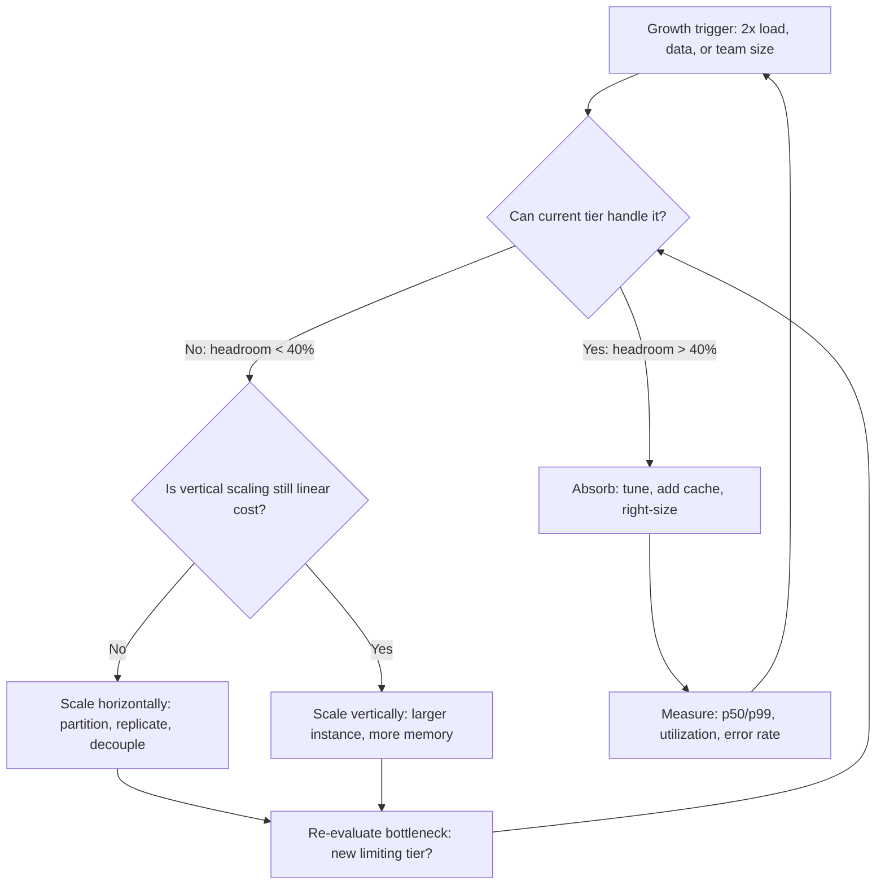
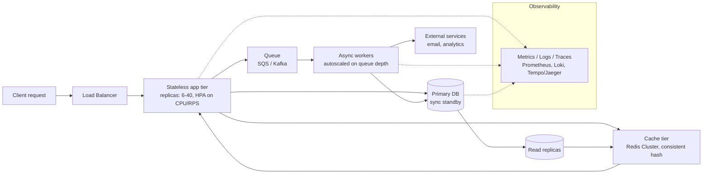
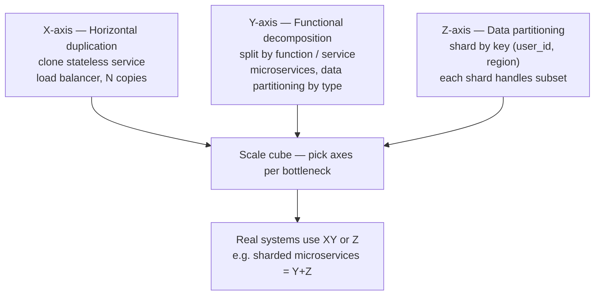
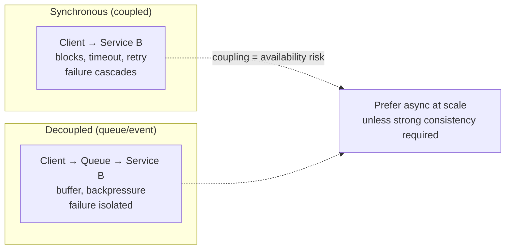
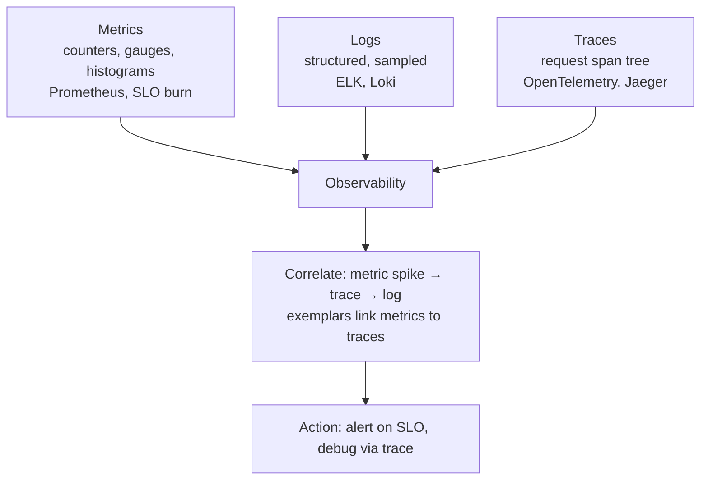

# Chapter 1 — Principles of Scalable System Design

**What this chapter covers.** Every system design interview starts with "design Twitter" and every production system starts with "why is this slow at 10× load?" This chapter builds the vocabulary and mental models that make the rest of the volume coherent. Scalability is not a feature you bolt on; it is a set of deliberate trade-offs — between consistency and availability, latency and throughput, simplicity and flexibility — applied consistently across every layer. We define what scalability means along its four axes (load, data volume, geographic distribution, organizational scale), introduce six principles that recur in every large system from Google's Borg to a three-service startup that survived product-market fit, show how to quantify scale with Little's Law and queueing theory, and walk through a reference architecture that maps each principle to concrete components. The chapter closes with the antipatterns that turn scalable designs back into distributed monoliths.

Learning goals — after this chapter you should be able to:

- Distinguish scalability (handling growth) from performance (speed at a fixed load) and elasticity (speed of scaling), and name the four dimensions along which a backend system must scale.
- State and apply six principles — horizontal scaling with stateless services, partitioning, replication, decoupling, designing for failure, and operability — to a greenfield design discussion.
- Use Little's Law and basic queueing intuition to relate concurrency, throughput, and latency, and explain why utilization above ~70% is a warning sign even when latency still looks acceptable.
- Sketch a canonical three-tier-plus-async reference architecture and justify the placement of load balancers, caches, queues, and databases within it.
- Identify common scalability antipatterns (stateful app servers, synchronous fan-out, single-writer bottlenecks, unbounded queues) in an architecture review.
- Explain where this volume's concerns end and neighboring volumes begin: Vol 3 for wire-level load balancing, Vol 6 for consistency theory, Vol 11 for operational resilience, and Vol 8 for API contracts.

---

## What "scalable" actually means

Engineers use "scalable" the way food packaging uses "natural" — enthusiastically and imprecisely. A useful definition must be falsifiable. A system is *scalable* with respect to a growth dimension if the marginal cost of handling additional load along that dimension grows at most linearly, and ideally sublinearly, while preserving its correctness and latency SLOs.

Four dimensions matter for backend systems:

| Dimension | What grows | Canonical question | Bottleneck that appears first |
|-----------|-----------|--------------------|-------------------------------|
| **Load** (request volume) | Requests/sec, concurrent connections | "Can we handle 10× traffic after a launch?" | CPU, thread pools, connection limits |
| **Data** (volume + velocity) | Rows, bytes, events/sec | "What happens when the primary table hits 2 TB?" | Storage, index size, replication lag |
| **Geography** (distribution) | Regions, edge PoPs, user distance | "Can a user in Jakarta get p95 < 200 ms?" | Speed of light, cross-region consistency |
| **Organization** (team scale) | Services, repositories, deploy frequency | "Can 40 teams deploy independently?" | Coupling, coordination cost, blast radius |

A system can be scalable along one axis and brittle along another. A single beefy Postgres instance with a large buffer pool may handle 10× read load via replicas (load-scalable) but collapse when the dataset no longer fits on one machine's storage (not data-scalable) or when 15 teams contend on one schema migration (not organizationally scalable). Naming the axis forces honesty about what was designed for and what was not.

Three terms are routinely conflated with scalability and must be separated:

- **Performance** is a point measurement: latency or throughput at a *fixed* load. A system can be fast and unscalable (a hand-tuned single-node cache) or scalable and not yet fast (a correctly partitioned system running on under-provisioned hardware).
- **Elasticity** is the *speed and automation* of scaling. A system that requires a weekend maintenance window and a DBA to add a shard is scalable (it can grow) but not elastic.
- **Availability** is the fraction of time the system serves correctly. Scalability and availability are allies — horizontal scaling removes single points of failure — but they are not the same. Adding nodes can improve availability while hurting scalability if coordination costs rise superlinearly.

> **Boundary note.** This chapter frames scalability decisions at the *system* level — which components to replicate, partition, or decouple. The mechanism of distributing traffic among replicas at the *wire* level (L4/L7 algorithms, consistent hashing on the data path, health checking) is covered in Vol 3, Chapter 9 — Load Balancing: L4, L7, and Algorithms and revisited for system-level traffic policy in Chapter 4 of this volume. Consistency models and impossibility results that constrain how far replication can go are in Vol 6 — Distributed Systems. Operational aspects of scaling (autoscaling, capacity planning in production) are in Vol 11 and Vol 12.

### Scalability is an economic claim

Every scalability argument is implicitly an economic one. "We scale horizontally" means "we can add capacity in small, commodity increments whose cost is predictable." Vertical scaling — a bigger machine — is not wrong; it is often the cheapest path to 5–10× growth. It becomes wrong when the cost curve goes vertical: the next-larger instance type costs 4× for 1.6× performance, or the largest available machine is simply not large enough. The inflection point is where the economics flip, and the architecture must already be ready for horizontal scaling before that point arrives. Retrofitting statelessness onto a stateful system under load is the most expensive migration most teams will ever attempt.



*Figure 1-1: The scaling decision loop. Most systems cycle through "absorb → vertical → horizontal" as they grow; the key is detecting the cost inflection before it becomes an emergency.*

---

## Principle 1 — Scale horizontally with stateless services

The single most consequential architectural decision is whether application servers hold state that matters across requests. A *stateless* service stores no session, no local cache that must be coherent, and no in-memory queue that would be lost on restart. Any instance can handle any request; any instance can die without data loss.

Statelessness is what makes horizontal scaling trivial. If N instances handle R requests per second, N+1 instances handle roughly R × (N+1)/N, minus load-balancer overhead. No data migration, no rebalancing, no "drain this node before terminating."

Achieving statelessness requires pushing state to the right place:

- **Session state** → external store (Redis, database) or stateless tokens (JWTs validated with a shared key; see Vol 9, Chapter 5).
- **Local caches** → external caches (Redis, Memcached) or accept per-instance caches with explicit staleness bounds.
- **In-flight work** → durable queues (Kafka, SQS) so a crash does not lose tasks.

A minimal stateless service behind a load balancer looks like this in practice:

```yaml
# kubernetes deployment — 12-factor stateless app (Kubernetes v1.29)
apiVersion: apps/v1
kind: Deployment
metadata:
  name: api
  labels: { app: api }
spec:
  replicas: 6
  selector:
    matchLabels: { app: api }
  strategy:
    type: RollingUpdate
    rollingUpdate: { maxSurge: 2, maxUnavailable: 1 }
  template:
    metadata:
      labels: { app: api }
    spec:
      containers:
        - name: api
          image: registry.internal/api:1.42.0
          ports: [{ containerPort: 8080 }]
          env:
            - name: REDIS_URL
              value: "redis://redis.internal:6379/0"
            - name: DATABASE_URL
              valueFrom: { secretKeyRef: { name: db-creds, key: url } }
            - name: PORT
              value: "8080"
          readinessProbe:
            httpGet: { path: /healthz, port: 8080 }
            periodSeconds: 5
            failureThreshold: 3
          livenessProbe:
            httpGet: { path: /healthz, port: 8080 }
            periodSeconds: 10
          resources:
            requests: { cpu: "500m", memory: "512Mi" }
            limits:   { cpu: "1000m", memory: "1Gi" }
---
apiVersion: v1
kind: Service
metadata: { name: api }
spec:
  selector: { app: api }
  ports: [{ port: 80, targetPort: 8080 }]
  type: ClusterIP
---
apiVersion: autoscaling/v2
kind: HorizontalPodAutoscaler
metadata: { name: api }
spec:
  scaleTargetRef: { apiVersion: apps/v1, kind: Deployment, name: api }
  minReplicas: 6
  maxReplicas: 40
  metrics:
    - type: Resource
      resource: { name: cpu, target: { type: Utilization, averageUtilization: 65 } }
    - type: Pods
      pods: { metric: { name: http_requests_per_second }, target: { type: AverageValue, averageValue: "800" } }
```

With this manifest, `kubectl scale deployment api --replicas=12` or the HPA doubles capacity without touching application code — *because* no instance holds state the others need.

```
$ kubectl get hpa api --watch
NAME   REFERENCE        TARGETS              MINPODS   MAXPODS   REPLICAS
api    Deployment/api   62%/65%, 742/800     6         40        6
api    Deployment/api   88%/65%, 1180/800    6         40        6
api    Deployment/api   88%/65%, 1180/800    6         40        9   # scaled up
api    Deployment/api   54%/65%, 610/800     6         40        9   # load spread
```

**Distributed-systems lens.** Stateless services push the hard problems — consistency, durability, coordination — into the stateful tier (databases, caches, queues). That is deliberate. Databases have spent 40 years solving those problems; reimplementing them poorly inside application processes is how outages are made. The trade-off is network dependency: every request now needs at least one round-trip to the state tier, so latency, timeout, and retry semantics (Vol 3, Chapter 11) become first-class concerns.

---

## Principle 2 — Partition everything that cannot fit on one machine

When data or load exceeds what a single node can handle — storage capacity, write throughput, memory for indexes — the answer is *partitioning*: split the dataset so each partition lives on a different node and most operations touch only one partition.

Partitioning strategies:

| Strategy | How it maps keys → partitions | Strength | Weakness |
|----------|-------------------------------|----------|----------|
| **Range** | Key ranges (e.g., `user_id 0–1M → shard 0`) | Range scans are local | Hot ranges, rebalancing is expensive |
| **Hash** | `hash(key) % N` | Uniform distribution | Rehashing on N change moves ~all data |
| **Consistent hash** | Hash ring with virtual nodes | Minimal movement on membership change | Slight imbalance without enough vnodes |
| **Directory** | Lookup service (e.g., shard map in ZooKeeper) | Arbitrary placement, easy to move | Directory is a critical dependency |

Consistent hashing is the default for caches and many KV stores because it minimizes disruption when nodes join or leave:

```python
# consistent_hash.py — minimal consistent hash ring (Python 3.11)
import hashlib, bisect

class ConsistentHashRing:
    def __init__(self, nodes: list[str], vnodes: int = 150):
        self.vnodes = vnodes
        self.ring: dict[int, str] = {}
        self.sorted_keys: list[int] = []
        for node in nodes:
            self.add_node(node)

    def _hash(self, key: str) -> int:
        return int(hashlib.md5(key.encode()).hexdigest(), 16)

    def add_node(self, node: str) -> None:
        for i in range(self.vnodes):
            h = self._hash(f"{node}:{i}")
            self.ring[h] = node
            bisect.insort(self.sorted_keys, h)

    def remove_node(self, node: str) -> None:
        for i in range(self.vnodes):
            h = self._hash(f"{node}:{i}")
            self.ring.pop(h, None)
            idx = bisect.bisect_left(self.sorted_keys, h)
            if idx < len(self.sorted_keys) and self.sorted_keys[idx] == h:
                self.sorted_keys.pop(idx)

    def get_node(self, key: str) -> str:
        if not self.ring:
            raise ValueError("empty ring")
        h = self._hash(key)
        idx = bisect.bisect_right(self.sorted_keys, h) % len(self.sorted_keys)
        return self.ring[self.sorted_keys[idx]]

# demo
ring = ConsistentHashRing(["cache-1", "cache-2", "cache-3"])
for k in ["user:42", "user:99", "order:1001", "session:abc"]:
    print(f"{k:15s} -> {ring.get_node(k)}")
```

```
user:42         -> cache-2
user:99         -> cache-1
order:1001      -> cache-3
session:abc     -> cache-2
```

Adding `cache-4` moves only ~1/(N+1) of keys — roughly 25% when going from 3 to 4 nodes — versus ~75% with naive modulo hashing.

**What partitioning costs.** Every cross-partition operation (a query that touches two shards, a transaction that spans shards) is an order of magnitude more expensive and complex than a single-partition operation. The discipline is to choose a *partition key* that keeps the common case local. For a multi-tenant SaaS, `tenant_id` is usually correct; for a social feed, `user_id` is; for time-series, `metric + time bucket` is. Get the partition key wrong and the system will spend its life doing scatter-gather.

> **Boundary note.** Physical partitioning mechanics (range vs. hash, rebalancing protocols, shard placement) overlap with Vol 5, Chapter 9 — Partitioning and Sharding, which treats storage-engine specifics. This chapter treats partitioning as an *architectural* choice; Vol 5 treats it as a *storage* implementation.

---

## Principle 3 — Replicate for availability, and pay the consistency price consciously

If partitioning is about *capacity*, replication is about *survivability*. Every critical piece of data and every critical service should exist in more than one place so the failure of one replica does not become a user-visible outage.

Replication introduces the central tension of distributed systems: the more replicas you have, and the more available you want them to be during partitions, the harder it is to keep them consistent. This is the CAP/PACELC trade-off covered formally in Vol 6, Chapters 3–4. At the system-design level, the practical question is:

*For this piece of data, what happens if two replicas diverge for 5 seconds?*

- **If the answer is "nothing bad"** (session cache, precomputed recommendations, CDN content): use asynchronous, eventually consistent replication. Availability wins.
- **If the answer is "we double-charge or lose money"** (ledger, inventory, seat reservation): use synchronous replication or consensus, and accept higher latency and lower availability during partitions.

```mermaid
sequenceDiagram
    participant C as Client
    participant L as Leader
    participant F1 as Follower 1
    participant F2 as Follower 2

    Note over C,F2: Synchronous replication (strong consistency)
    C->>L: write(key, value)
    L->>F1: replicate
    L->>F2: replicate
    F1-->>L: ack
    F2-->>L: ack
    L-->>C: ack (after quorum)
    Note over C,F2: Latency = slowest replica; unavailable if quorum unreachable

    Note over C,F2: Asynchronous replication (eventual consistency)
    C->>L: write(key, value)
    L-->>C: ack (immediately after local write)
    L->>F1: replicate (background)
    L->>F2: replicate (background)
    Note over C,F2: Low latency, highly available; followers may lag
```

*Figure 1-2: Synchronous versus asynchronous replication. The same three replicas make radically different trade-offs depending on when the client is acknowledged.*

Real systems mix both. A common pattern:

```
                    ┌─────────────┐
  Client ──────────▶│  Primary DB  │──sync──▶ Standby (failover)
                    │  (RDS/Aurora)│
                    └──────┬──────┘
                           │ async (binlog / WAL)
                    ┌──────▼──────┐
                    │ Read replicas│──▶ Cache (Redis) ──▶ App servers
                    │  (async)     │
                    └─────────────┘
```

Writes go to the primary and are synchronously replicated to a standby for failover (durability + availability). Reads fan out to asynchronous replicas and caches (scalability). The replication lag window — typically 10–100 ms for Aurora/MySQL, occasionally seconds under load — is the *inconsistency window* the application must tolerate. If the application cannot tolerate it (e.g., "read your own writes" after a user updates their profile), it must read from the primary for that user's recent writes — a *read-after-write* routing rule.

```bash
# Aurora MySQL — observe replication lag (MySQL 8.0, Aurora 3.x)
$ mysql -h aurora-primary.internal -e "SHOW SLAVE STATUS\G" 2>/dev/null | grep -E "Seconds_Behind|Replica_Lag"
Seconds_Behind_Master: 0
AuroraReplicaLag: 12   # milliseconds — healthy

$ mysql -h aurora-replica.internal -e "SELECT Replica_lag_in_msec FROM information_schema.replica_host_status\G"
Replica_lag_in_msec: 47

# During a bulk load — lag spikes, application must handle staleness
$ mysql -h aurora-replica.internal -e "SELECT Replica_lag_in_msec FROM information_schema.replica_host_status\G"
Replica_lag_in_msec: 1843
```

---

## Principle 4 — Decouple in time and space

Synchronous calls couple caller and callee in *time* (both must be up simultaneously) and in *space* (caller must know callee's address). Each synchronous hop adds latency, reduces availability (availability multiplies: 99.9% × 99.9% × 99.9% ≈ 99.7%), and creates backpressure that propagates instantly.

Decoupling — via queues, event logs, or async workers — breaks one or both couplings:

| Coupling | Synchronous | Decoupled |
|----------|-------------|-----------|
| **Time** | Caller blocks until callee responds | Caller enqueues and continues; callee processes when ready |
| **Space** | Caller knows callee endpoint | Caller publishes to a topic; any subscriber can consume |

A concrete example. An e-commerce checkout that synchronously calls inventory, payment, email, and analytics:

```
Checkout → Inventory (80 ms) → Payment (200 ms) → Email (50 ms) → Analytics (30 ms)
Total: ~360 ms, and any failure fails the checkout
```

Refactored with a queue:

```
Checkout → Inventory (80 ms) → Payment (200 ms) → Enqueue {order events}
Total user-visible: ~280 ms
Background: Email worker ← queue, Analytics worker ← queue (retries independently)
```

```python
# producer — checkout service (Python 3.11, boto3 1.34)
import boto3, json, uuid, time

sqs = boto3.client("sqs", region_name="us-east-1")
QUEUE_URL = "https://sqs.us-east-1.amazonaws.com/123456789012/order-events"

def place_order(user_id: str, items: list[dict]) -> str:
    order_id = str(uuid.uuid4())
    # synchronous: only what the user must wait for
    reserve_inventory(items)
    charge_payment(user_id, items)

    # asynchronous: everything else
    sqs.send_message(
        QueueUrl=QUEUE_URL,
        MessageBody=json.dumps({
            "event": "order.placed",
            "order_id": order_id,
            "user_id": user_id,
            "items": items,
            "ts": int(time.time()),
        }),
        MessageGroupId=user_id,          # FIFO ordering per user if using FIFO queue
        MessageDeduplicationId=order_id,  # exactly-once enqueue with FIFO
    )
    return order_id
```

```python
# consumer — email worker (long poll, visibility timeout handles crashes)
import boto3, json

sqs = boto3.client("sqs", region_name="us-east-1")
QUEUE_URL = "https://sqs.us-east-1.amazonaws.com/123456789012/order-events"

while True:
    resp = sqs.receive_message(
        QueueUrl=QUEUE_URL,
        MaxNumberOfMessages=10,
        WaitTimeSeconds=20,          # long poll — no busy loop
        VisibilityTimeout=30,        # if worker dies, message reappears after 30s
    )
    for msg in resp.get("Messages", []):
        event = json.loads(msg["Body"])
        try:
            send_confirmation_email(event["user_id"], event["order_id"])
            sqs.delete_message(QueueUrl=QUEUE_URL, ReceiptHandle=msg["ReceiptHandle"])
        except Exception as e:
            # don't delete — message becomes visible again for retry / DLQ
            print(f"failed {event['order_id']}: {e}")
```

The queue absorbs bursts, survives consumer outages, and lets email and analytics scale independently of checkout. The cost is *eventual* side effects (email arrives seconds later) and the need to handle duplicate deliveries (SQS at-least-once; see Vol 10, Chapter 2 for delivery semantics).

> **Boundary note.** Queue and log internals (Kafka partitions, SQS visibility timeout, exactly-once via idempotency keys and the outbox pattern) are in Vol 10 — Messaging, Streaming, and Event Systems. This chapter uses queues as an architectural primitive; Vol 10 explains how they work and fail.

---

## Principle 5 — Design for failure as the normal case

In a system with hundreds of instances, failure is not exceptional — it is the steady state. Disks fail, nodes get preempted, deploys roll out bad code, a downstream dependency times out. A scalable architecture treats failure handling as a first-class design activity, not an afterthought.

Three patterns recur:

1. **Timeouts everywhere, with budgets.** Every outbound call gets a timeout derived from the caller's SLO. If the caller's p99 budget is 500 ms and it makes two sequential calls, neither can have a 400 ms timeout. Budgets compose.

2. **Retries with backoff and jitter, but only for safe operations.** Retrying a non-idempotent `POST /charge` without an idempotency key doubles the charge. Retrying a `GET` is safe. Exponential backoff with jitter prevents thundering herds:

    ```python
    # retry.py — exponential backoff with decorrelated jitter
    import random, time

    def retry_with_backoff(fn, max_attempts=5, base_ms=50, cap_ms=5000):
        delay_ms = base_ms
        for attempt in range(1, max_attempts + 1):
            try:
                return fn()
            except TransientError as e:
                if attempt == max_attempts:
                    raise
                # decorrelated jitter: random between base and 3*current delay
                delay_ms = random.uniform(base_ms, min(cap_ms, delay_ms * 3))
                time.sleep(delay_ms / 1000.0)
    ```

3. **Circuit breakers and bulkheads.** When a downstream is failing, stop calling it for a while (circuit open) and shed load gracefully rather than queuing indefinitely. Bulkheads isolate failure domains so one slow dependency does not starve all threads.

    ```mermaid
    stateDiagram-v2
        [*] --> Closed
        Closed --> Open : failure rate > threshold (e.g. 50% in 10s window)
        Open --> HalfOpen : after cooldown (e.g. 30s)
        HalfOpen --> Closed : trial succeeds
        HalfOpen --> Open : trial fails
        Closed --> Closed : success resets counter
        note right of Open : Fail fast — return fallback or error\nwithout calling downstream
        note right of HalfOpen : Allow one probe request\nto test recovery
    ```

    *Figure 1-3: Circuit breaker state machine. Without it, a failing downstream turns every caller into a thread-pool exhaustion incident.*

Real-world defaults that have survived production:

```yaml
# resilience4j-style config (Spring Boot 3.2, resilience4j 2.1)
resilience4j.circuitbreaker:
  configs:
    default:
      slidingWindowType: COUNT_BASED
      slidingWindowSize: 100
      failureRateThreshold: 50
      slowCallRateThreshold: 80
      slowCallDurationThreshold: 2s
      permittedNumberOfCallsInHalfOpenState: 5
      waitDurationInOpenState: 30s
      minimumNumberOfCalls: 20
resilience4j.bulkhead:
  configs:
    default:
      maxConcurrentCalls: 40
      maxWaitDuration: 10ms
```

---

## Principle 6 — Make the system observable and operable

A system that cannot be understood cannot be scaled. Observability is not "we have dashboards" — it is the ability to answer *why* the system behaved a certain way from its outputs, without needing to reproduce the behavior.

The three pillars, with backend-specific emphasis:

- **Metrics** (counters, gauges, histograms) — for alerting and capacity planning. Use histograms (Prometheus) or DDSketch, not averages. Alert on symptoms (latency, error rate) not causes (CPU).
- **Logs** (structured, sampled) — for forensics. Log request IDs, not just messages. At scale, log volume is a cost and performance concern; sample aggressively and index selectively.
- **Traces** (distributed, sampled) — for understanding fan-out. A single user request that touches 12 services is invisible without tracing.

Operability is the other half: can you *change* the system safely? That means:

- **Feature flags and progressive delivery** so new code can be enabled for 1% of traffic and rolled back without a deploy.
- **Runbooks and automation** for common operations (shard rebalancing, cache warming, failover) so they do not require tribal knowledge at 3 AM.
- **Capacity headroom and load shedding** so overload degrades gracefully rather than cascading.

```bash
# Prometheus — query p99 latency by service, the only latency worth alerting on (PromQL)
$ curl -s 'http://prometheus.internal:9090/api/v1/query?query=histogram_quantile(0.99, sum by (le)(rate(http_request_duration_seconds_bucket{service="api"}[5m])))' | jq .

# Jaeger — find traces where checkout exceeded 500ms
$ curl -s 'http://jaeger.internal:16686/api/traces?service=checkout&minDuration=500ms&limit=20' | jq '.data[].traceID'

# kubectl — progressive delivery via Argo Rollouts (analysis template checks error rate)
$ kubectl argo rollouts get rollout api --watch
Name:            api
Strategy:        Canary
  Step:          2/5
  Canary weight: 20%
  Analysis:      successRate (current: 99.92%, threshold: 99.5%) — Successful
```

> **Boundary note.** Full treatment of SLIs/SLOs, metrics/tracing/logging, incident response, and deployment strategies is in Vol 11 — Reliability, Observability, and SRE. This chapter notes what must be designed in from day one; Vol 11 shows how to operate it.

---

## Quantifying scale: Little's Law and queueing intuition

Intuition about scale is often wrong. Queueing theory gives two simple tools that are right often enough to be useful.

### Little's Law

For any stable system:

> **L = λ × W**

- **L** = average number of items in the system (concurrency)
- **λ** = average arrival rate (throughput, requests/sec)
- **W** = average time an item spends in the system (latency, seconds)

Rearranged, it answers practical questions:

- "We handle λ = 2,000 req/s at W = 150 ms average latency. How many concurrent requests are in the system?" → L = 2000 × 0.15 = **300 concurrent**.
- "We have a thread pool of 400. At 200 ms latency, what throughput can we sustain before queueing?" → λ = L / W = 400 / 0.2 = **2,000 req/s**. Beyond that, requests queue and latency rises.

```python
# littles_law.py — capacity check
def max_throughput(concurrency: int, latency_s: float) -> float:
    return concurrency / latency_s

def required_concurrency(throughput_rps: float, latency_s: float) -> float:
    return throughput_rps * latency_s

print(f"400 threads @ 200ms -> {max_throughput(400, 0.2):.0f} rps")
print(f"Need for 5000 rps @ 100ms -> {required_concurrency(5000, 0.1):.0f} concurrent slots")
```

```
400 threads @ 200ms -> 2000 rps
Need for 5000 rps @ 100ms -> 500 concurrent slots
```

This is why adding threads is not free: each thread consumes memory (stack, buffers) and increases context-switching and GC pressure (Vol 1, Chapter 2; Vol 13). The scalable answer to higher λ is usually *lower W* (faster handlers, caching, async) or *more instances*, not a larger pool on one box.

### Utilization and the knee

As utilization (ρ = λ / μ, where μ is service rate) approaches 1, queue length and latency grow hyperbolically. The M/M/1 queue — the simplest model — gives mean queue length = ρ / (1 − ρ):

| Utilization (ρ) | Mean queue length | What it feels like |
|-----------------|-------------------|--------------------|
| 0.50 | 1.0 | Comfortable |
| 0.70 | 2.3 | Warm — watch closely |
| 0.80 | 4.0 | Hot — tail latency rising |
| 0.90 | 9.0 | Saturated — p99 spiking |
| 0.95 | 19.0 | Overloaded — retries make it worse |

The practical rule: **target 60–70% utilization for latency-sensitive services**. The remaining headroom is not waste; it is the buffer that absorbs bursts without queueing. Autoscaling thresholds should fire at ~65% so new capacity is ready before the knee.



*Figure 1-4: Reference architecture that embodies all six principles — stateless app tier, partitioned cache, replicated database with async read path, decoupled async workers, and observability as a sidecar concern.*

---

## Common antipatterns

| Antipattern | Why it feels natural | How it breaks at scale | Fix |
|-------------|---------------------|------------------------|-----|
| **Stateful app servers** (sticky sessions) | "Just keep it in memory" | Cannot scale or restart without user impact; LB becomes stateful | External session store or stateless tokens |
| **Synchronous fan-out** (one request → N sequential RPCs) | Simple to code | Latency adds, availability multiplies, one slow dep blocks all | Parallelize with timeouts, or make non-critical calls async |
| **Single-writer bottleneck** (all writes through one node/row) | Strong consistency is comforting | Write throughput capped at one machine | Partition by key, or use CRDTs / conflict resolution where allowed |
| **Unbounded queues / thread pools** | "Don't reject work" | OOM, GC storms, cascading latency | Bounded pools + backpressure + load shedding |
| **Chatty clients** (N+1 queries, large payloads) | ORM defaults | Network round-trips dominate latency | Batching, DataLoader, pagination, field selection |
| **Shared database as integration** (services join each other's tables) | "It's right there" | Coupling, contention, impossible to split | API or event-based integration; each service owns its data |

---

## Key takeaways

- Scalability is not "fast" — it is the ability to handle growth along load, data, geography, and organizational axes at predictable marginal cost. Name the axis before proposing a solution.
- Six principles — stateless horizontal scaling, partitioning, replication with explicit consistency trade-offs, decoupling via queues, designing for failure, and observability/operability — are the recurring toolkit. Every large system is a composition of them.
- Horizontal scaling requires stateless services. Push session, cache, and queue state into infrastructure that is designed to manage it, and accept the network round-trip as the price.
- Partition to increase capacity, replicate to increase availability. Partitioning makes cross-partition operations expensive — choose the partition key that keeps the common case local. Replication forces a consistency choice — synchronous for correctness, asynchronous for scale.
- Decouple synchronous request paths from asynchronous side effects with durable queues. Durability and idempotency handling are the hard parts; the queue itself is simple.
- Failure is steady-state. Timeouts with budgets, retries only for idempotent operations with jittered backoff, circuit breakers, and bulkheads are not optional extras — they are the difference between a degraded dependency and a site-wide outage.
- Little's Law (L = λW) and the utilization knee are the two quantitative intuitions that prevent most capacity misjudgments. Target 60–70% utilization and autoscale before the knee, not after.
- Know the boundaries: wire-level load balancing is Vol 3, consistency theory is Vol 6, observability and SRE practice is Vol 11, and API contracts are Vol 8. This chapter is the map; those volumes are the territories.








## Further reading

- Kleppmann, M. *Designing Data-Intensive Applications* (O'Reilly, 2017), Chapters 1–2, 5–6, 8–9, 12 — the most complete single treatment of partitioning, replication, and consistency for practitioners. https://dataintensive.net/
- Brewer, E. "CAP Twelve Years Later: How the 'Rules' Have Changed" (*Computer*, 45(2), 2012) — Brewer's own correction of CAP oversimplifications and introduction of the harvest/yield framing. https://ieeexplore.ieee.org/document/6133253
- Abadi, D. "Consistency Tradeoffs in Modern Distributed Database System Design" (*Computer*, 45(2), 2012) — the PACELC paper: what happens *else* when there is no partition. https://cs-www.cs.yale.edu/homes/dna/papers/abadi-pacelc.pdf
- Beyer, B., Jones, C., Petoff, J., Murphy, N. *Site Reliability Engineering* (O'Reilly, 2016), Chapters 2–3, 20–22 — Google's SRE framing of scalability as an economic and organizational problem. https://sre.google/sre-book/table-of-contents/
- Dean, J. and Barroso, L. A. "The Tail at Scale" (*CACM*, 56(2), 2013) — why p99 matters more than the mean and how to tame tail latency at scale. https://research.google/pubs/the-tail-at-scale/
- AWS Builders' Library — "Challenges with Distributed Systems" and "Timeouts, Retries and Backoff with Jitter" — short, experience-driven pieces from Amazon's internal practices. https://aws.amazon.com/builders-library/
- Nygard, M. *Release It!* 2nd ed. (Pragmatic Bookshelf, 2018), Chapters 4–5 — the original popularization of circuit breakers, bulkheads, and stability patterns. https://pragprog.com/titles/mnee2/release-it-second-edition/
- Little, J. D. C. "A Proof for the Queuing Formula: L = λW" (*Operations Research*, 9(3), 1961) — the three-page proof of Little's Law; worth reading once to see why it holds regardless of arrival distribution. https://www.jstor.org/stable/167570

---

*Next: Chapter 2 — Back-of-the-Envelope Estimation and Capacity Planning — turns these principles into numbers: how to estimate QPS, storage, bandwidth, and instance counts on a whiteboard, with enough accuracy to choose an architecture before writing code.*
