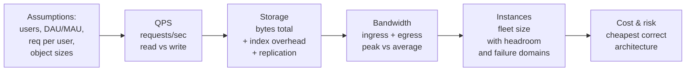
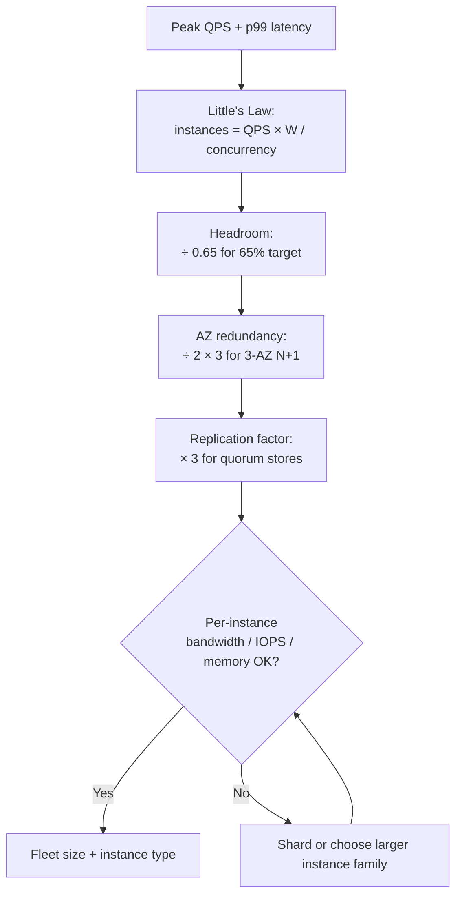
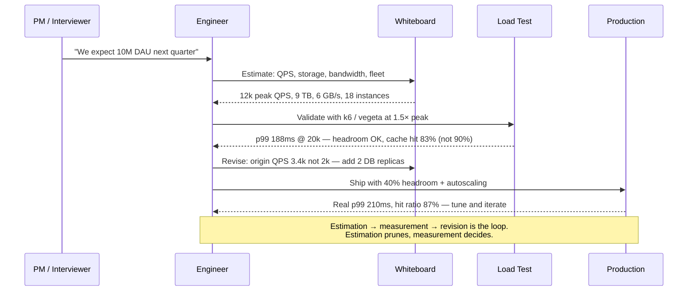
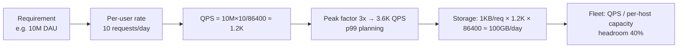
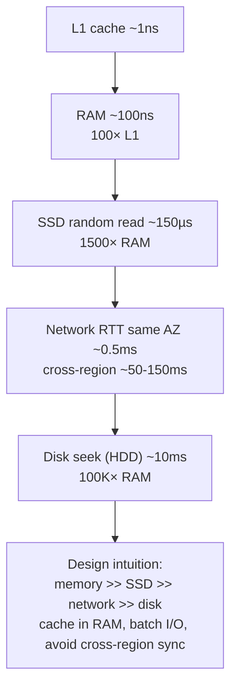
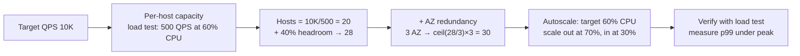
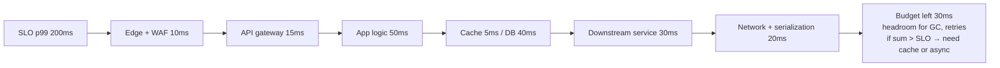

# Chapter 2 — Back-of-the-Envelope Estimation and Capacity Planning

**What this chapter covers.** System design lives or dies on numbers. Before choosing databases, drawing boxes, or debating microservices, you must answer: how many requests per second, how many bytes stored, how much bandwidth, how many machines? Back-of-the-envelope estimation is the shared language that turns hand-waving into engineering. This chapter teaches the estimation toolkit — powers of ten, latency numbers every engineer should know, storage and bandwidth arithmetic — and applies it to five canonical workloads (read-heavy feed, write-heavy ingest, search, chat, and blob delivery). We then connect estimation to capacity planning: Little's Law and queueing models from Chapter 1 become provisioning formulas, and we show how to size instance fleets, database tiers, and cache layers with headroom, replication overhead, and failure domains included. The goal is fluency: you should be able to walk into a whiteboard interview or an architecture review and produce defensible numbers in under ten minutes.

Learning goals — after this chapter you should be able to:

- Recall latency, throughput, and capacity numbers to one significant figure — L1 cache through cross-region round-trips, disk and network bandwidth, and common request rates — and use them without looking them up.
- Decompose any estimation prompt into four quantities — QPS, storage, bandwidth, and instance count — and compute each from first principles with explicit assumptions.
- Apply powers-of-two and decimal approximations (2^10 ≈ 10^3, 1 KB ≈ 10^3 bytes) fluently to do mental math at whiteboard speed.
- Run five canonical estimation templates (feed, ingest, search, chat, blob/CDN) and adapt them to novel products by swapping assumptions, not frameworks.
- Translate QPS and latency SLOs into fleet size via Little's Law, add headroom and replication factors, and produce a capacity plan that survives one AZ failure.
- Identify when estimation must defer to measurement — tail latency, GC pauses, and cache hit ratios cannot be estimated from first principles — and propose the load test that would close the gap.

---

## Why estimation comes before architecture

A common failure mode in design discussions is to start with components: "We need Kafka, Cassandra, and Kubernetes." Without numbers, component choice is aesthetics. With numbers, it becomes constrained engineering:

- At 100 writes/sec, a single Postgres instance is the simplest correct answer. At 500,000 writes/sec, it is not an answer at all — you need partitioning or a log-structured store before the first line of code.
- At 10 GB of data, indexes fit in RAM on any machine. At 10 TB with random access, working-set size and IOPS dominate every decision.
- At 1,000 QPS with p50 = 50 ms, a single AZ of 8 app servers has headroom. At 80,000 QPS, you are reasoning about load balancer tiers, connection pooling, and whether your service discovery can handle the churn.

Estimation prunes the design space early. It also forces explicit assumptions — "we assume 20% DAU/MAU, average 3 requests per session, 400-byte average payload" — that reviewers can challenge. An estimate with stated assumptions is useful even when wrong; a design without estimates is unfalsifiable.

> **Boundary note.** This chapter covers *pre-build* estimation and provisioning math — the whiteboard and spreadsheet phase. Continuous capacity management in production (autoscaling signals, burn-rate alerting, load testing at scale) is in Vol 11, Chapter 7 — Load Testing and Capacity Planning, and cloud cost and quota management is in Vol 12, Chapters 8–9. Algorithmic analysis of why certain data structures and rate limiters scale the way they do is in Vol 14. This chapter gives you the numbers to *choose* an architecture; those volumes show how to *operate* it.

---

## The numbers every backend engineer should know

Memorize these to one significant figure. Precise values change yearly; orders of magnitude do not.

### Latency

| Operation | Latency | Notes |
|-----------|---------|-------|
| L1 cache reference | ~1 ns | Per core, no coherence miss |
| L2 cache reference | ~4 ns | |
| Main memory reference | ~100 ns | Random access, TLB hit |
| SSD random read (NVMe) | ~80–150 µs | 4 KB, queue depth 1 |
| SSD sequential read | ~3–7 GB/s | PCIe 4.0 ×4 NVMe |
| HDD seek | ~5–10 ms | Mechanical; why HDDs are archival |
| Send 1 KB over 1 Gbps network | ~10 µs | Serialization + wire; real RTT dominates |
| Round-trip within one AZ | ~0.3–0.6 ms | AWS us-east-1a intra-AZ p50 |
| Round-trip cross-AZ (same region) | ~0.8–2 ms | Depends on region and fiber path |
| Round-trip cross-region (US East → West) | ~60–75 ms | Speed of light in fiber |
| Round-trip US → Europe | ~90–120 ms | |
| Round-trip US → Asia | ~150–200 ms | |
| TLS 1.3 handshake (full, no resumption) | ~1–2 RTT + crypto | ~100–250 ms cross-continent |
| DNS lookup (cached at resolver) | ~1–10 ms | Uncached + recursive: 50–150 ms |

The cross-region numbers deserve emphasis: you cannot beat the speed of light. A system that requires a synchronous cross-region round-trip on every user request has a hard floor of 60–150 ms before any application logic runs. Multi-region designs (Chapter 10) exist largely to avoid paying that tax on the hot path.

### Throughput and bandwidth

| Resource | Throughput | Notes |
|----------|-----------|-------|
| Single CPU core | ~3–4 GHz, ~10–30 GB/s memory bandwidth | Per core; Vol 1 for NUMA effects |
| 1 Gbps NIC | ~120 MB/s | Usable ~100 MB/s after overhead |
| 10 Gbps NIC | ~1.2 GB/s | Standard for cloud instances ≥ 4 vCPU |
| 25/100 Gbps NIC | ~3 / 12 GB/s | Common for storage-optimized instances |
| EBS gp3 (per volume) | 125–1000 MB/s, 3k–16k IOPS | Baseline 3k IOPS + burst |
| S3 single-object GET | ~50–100 MB/s per connection | Scales with parallel connections |
| Single Postgres instance (tuned) | ~5k–30k TPS (small rows) | Highly workload-dependent |
| Redis single shard | ~80k–120k ops/s | In-memory, pipelined |
| Kafka single broker | ~50–100 MB/s sustained write | Sequential I/O, zero-copy |
| Kafka single partition | ~10–30 MB/s | Limited by leader follower replication |

### Powers of ten (decimal approximations — sufficient for estimation)

```
1 thousand  = 10^3  ≈ 2^10        1 KB ≈ 10^3 bytes
1 million   = 10^6  ≈ 2^20        1 MB ≈ 10^6 bytes
1 billion   = 10^9  ≈ 2^30        1 GB ≈ 10^9 bytes
1 trillion  = 10^12 ≈ 2^40        1 TB ≈ 10^12 bytes
1 quadrillion = 10^15 ≈ 2^50      1 PB ≈ 10^15 bytes

Time:
86,400 sec/day ≈ 10^5 sec/day    (use 10^5 for mental math; real 86.4k)
30 days ≈ 2.6M sec ≈ 2.5 × 10^6
1 year ≈ 3.15 × 10^7 sec ≈ π × 10^7  (handy for annual projections)

Request math:
1M DAU × 10 req/user/day ≈ 10M req/day ≈ 115 req/s average
Peak is typically 3–10× average (diurnal, flash crowd)
p99 capacity ≈ 3–5× observed p50 for burstable services
```

The single most useful approximation for whiteboards: **86,400 ≈ 10^5**. It makes daily ↔ per-second conversions trivial and the 15% error is smaller than your assumption uncertainty.

---

## The four quantities

Every estimation decomposes into four quantities. Compute them in order — each constrains the next.



*Figure 2-1: Estimation flow. Assumptions are explicit inputs; each quantity is derived, not guessed. Changing an assumption ripples forward automatically.*

### 1. QPS (queries per second)

```
QPS = (DAU × avg requests per user per day) / 86,400
Peak QPS ≈ 3–10 × average QPS
Write QPS vs Read QPS — read:write ratio drives store choice
```

Example: "30M MAU, 20% DAU, each active user makes ~15 API calls/day, 90% reads":

```
DAU = 30M × 0.20 = 6M
Total req/day = 6M × 15 = 90M
Average QPS = 90M / 86,400 ≈ 1,040
Peak QPS ≈ 5 × 1,040 ≈ 5,200
Read QPS ≈ 4,680   Write QPS ≈ 520
```

### 2. Storage

```
Total bytes = (objects per day × avg object size × retention days) × replication factor
Index overhead ≈ 10–30% for B-tree indexes; ~0 for pure log stores
```

Always state retention and replication explicitly. "We store 500 bytes of metadata per object for 3 years, replicated 3×" is verifiable; "we need a lot of storage" is not.

### 3. Bandwidth

```
Ingress (write) bandwidth = Write QPS × avg write payload
Egress (read) bandwidth  = Read QPS × avg read payload
CDN/edge egress often dominates — factor in cache hit ratio
```

Bandwidth determines NIC provisioning and, in the cloud, a surprising fraction of cost. Egress pricing ($0.05–0.09/GB on AWS/GCP) makes a 10 Gbps sustained egress stream cost tens of thousands per month before any compute.

### 4. Instance count

```
Instances = ceil( Peak QPS × p99_latency / concurrency_per_instance )
Then add: headroom (30–40%), failure domain (N+1 AZ), replication factor
```

This is Little's Law from Chapter 1, now used as a provisioning formula. `concurrency_per_instance` is threads, connections, or event-loop slots — whichever limits the runtime.

---

## Five canonical templates

### Template A — Read-heavy feed (Twitter/X home timeline, Instagram feed)

Assumptions:

```
MAU 300M, DAU 60M (20%), each user follows ~200 accounts
Each user reads feed 20×/day, posts 0.5×/day (read:write ≈ 40:1)
Timeline = 50 posts, each post metadata ~400 bytes + media pointers
Fan-out: naive push to all followers is infeasible at scale
```

| Quantity | Calculation | Result |
|----------|-------------|--------|
| Read QPS | 60M × 20 / 86,400 | ~13,900 avg, ~70k peak |
| Write QPS | 60M × 0.5 / 86,400 | ~350 avg, ~1,800 peak |
| Storage (new posts) | 30M posts/day × 400 B × 365 days | ~4.4 TB/year (metadata only) |
| Media storage | 30M × 40% with media × 2 MB avg | ~24 TB/day → ~8.8 PB/year |
| Bandwidth (timeline reads) | 13.9k × 50 × 400 B | ~278 MB/s avg egress for metadata |

Architecture implication: the bottleneck is not write throughput but *fan-out*. Pushing each tweet to 200 followers' precomputed timelines costs 200 writes per post; at 350 posts/sec that is 70k timeline writes/sec. The standard answer is hybrid fan-out — push for normal users, pull (read-time merge) for celebrities with millions of followers — covered in Chapter 12's case study.

### Template B — Write-heavy ingest (metrics, logs, IoT telemetry)

Assumptions:

```
10M devices, each sends 1 reading/sec, each reading 200 bytes
Retention: 30 days hot, 1 year cold
Read pattern: recent data (last hour) queried 100×/sec, historical rarely
```

| Quantity | Calculation | Result |
|----------|-------------|--------|
| Ingest QPS | 10M × 1 | **10M writes/sec** |
| Ingress bandwidth | 10M × 200 B | **2 GB/s** |
| Storage (30 days) | 10M × 200 B × 86,400 × 30 | **~5.2 PB** |
| Storage (1 year, cold with 5× compression) | 5.2 PB × 12 / 5 | **~12.5 PB** |

Architecture implication: 10M writes/sec rules out any row-store OLTP database. The answer is a log-structured path — Kafka/Kinesis for ingest buffering (sequential I/O, ~100 MB/s per broker → ~20 brokers for 2 GB/s with replication), then tiered storage (Kafka → ClickHouse/TimescaleDB hot → S3/Parquet cold). See Vol 5, Chapter 2 for LSM-tree write amplification and Vol 10, Chapter 3 for Kafka sizing.

### Template C — Search (full-text over 1B documents)

Assumptions:

```
1B documents, avg 5 KB text, inverted index ~30% of corpus
Query: 20k QPS, avg 2 terms, p99 latency SLO 200 ms
Index updates: 5k docs/sec
```

| Quantity | Calculation | Result |
|----------|-------------|--------|
| Corpus | 1B × 5 KB | 5 TB raw |
| Index | 5 TB × 30% | ~1.5 TB (plus stored fields → ~3 TB) |
| Query QPS | 20k (given) | 20k |
| Bandwidth (queries) | 20k × 1 KB req + 20 KB resp | ~420 MB/s egress |

Architecture implication: inverted indexes must be sharded (by document hash or term) and replicated. Each shard holds a Lucene/Elasticsearch segment; query fan-out across shards and merge is the latency-critical path. 20k QPS at 200 ms p99 with, say, 50 shards per query means each shard must respond in single-digit milliseconds — hence extensive caching of posting lists and filter bitsets (Chapter 3).

### Template D — Chat (WhatsApp/WeChat-style messaging)

Assumptions:

```
500M MAU, 100M DAU, avg user sends 20 messages/day, avg message 200 bytes
Group chats: 15% of messages, avg group size 12
Presence: each user has ~50 contacts whose online status is tracked
```

| Quantity | Calculation | Result |
|----------|-------------|--------|
| Message QPS | 100M × 20 / 86,400 | ~23k avg, ~120k peak |
| With group fan-out | 23k × (0.85×1 + 0.15×12) | ~60k deliveries/sec |
| Storage (messages, 1 year) | 2B msgs/day × 200 B × 365 | ~146 TB/year |
| Bandwidth (deliveries) | 60k × 200 B | ~12 MB/s (metadata only; media separate) |
| Presence QPS | 100M online × heartbeat/30s | ~3.3M presence updates/sec |

Architecture implication: the hard part is *presence* and *delivery guarantees*. 3.3M presence updates/sec is higher than message throughput and requires an in-memory system (Redis, custom) with careful fan-out. Message delivery needs at-least-once with idempotent dedup on the client, and offline storage for disconnected recipients (mailbox per user). WebSocket connection count — 100M concurrent — dominates instance sizing (see below).

### Template E — Blob / CDN delivery (YouTube thumbnails, image CDN)

Assumptions:

```
100M objects, avg object 800 KB, accessed 50×/day avg, Zipfian (top 10% gets 80% of reads)
Origin → edge cache hit ratio 85%, edge → client hit ratio 90% (browser cache)
```

| Quantity | Calculation | Result |
|----------|-------------|--------|
| Total reads/day | 100M × 50 | 5B reads/day → ~58k reads/sec avg |
| Origin reads (15% miss) | 58k × 15% | ~8.7k origin fetches/sec |
| Origin egress | 8.7k × 800 KB | ~7 GB/s |
| Edge egress | 58k × 800 KB | ~46 GB/s |
| Storage (origin) | 100M × 800 KB × 3× replication | ~240 TB |

Architecture implication: egress dominates cost. At $0.08/GB, 46 GB/s = ~4 TB/s-hour? Let's compute properly:

```
46 GB/s × 86,400 s/day = ~3.97 PB/day egress
3.97 PB × $0.08/GB ≈ $317k/day without CDN
```

With a CDN (CloudFront/Fastly) caching 85%+ at the edge, origin egress drops to ~7 GB/s and CDN egress pricing (~$0.02/GB blended) roughly halves the bill. The CDN *is* the architecture for this workload.

---

## From estimation to fleet size

Estimation gives QPS, storage, and bandwidth. Capacity planning turns those into machines, with failure domains and headroom.

### Step 1 — Per-instance concurrency

Determine how many concurrent requests one instance can handle. For thread-per-request runtimes (JVM, Python WSGI):

```
concurrency_per_instance = thread_pool_size
  e.g., Tomcat maxThreads=200, pgbouncer pool=100
```

For event-loop runtimes (Go goroutines, Node.js, Netty):

```
concurrency_per_instance = limited by CPU or downstream connections, not threads
  e.g., Go service: ~5k–10k concurrent goroutines before scheduler pressure
```

For WebSocket / long-lived connections:

```
concurrency_per_instance = max_connections (file descriptors + memory per conn)
  e.g., 50k–100k conns per 8 GB instance with tuned ulimits (see Vol 2, Ch 7)
```

Check the real limit with a load test — do not trust defaults.

### Step 2 — Apply Little's Law

```
instances_needed = ceil( peak_QPS × p99_latency / concurrency_per_instance )
```

Worked example — API tier:

```
Peak QPS: 20,000
p99 latency (downstream included): 120 ms = 0.12 s
Concurrency per instance (Tomcat, 200 threads, 70% usable to avoid queueing): 140

instances_needed = 20,000 × 0.12 / 140 ≈ 17.1 → 18 instances
```

### Step 3 — Add headroom, AZ redundancy, and replication

```
instances_with_headroom = ceil(18 / 0.65) ≈ 28   (target 65% utilization)
instances_across_AZs    = ceil(28 / 2) × 3       (spread across 3 AZs, survive 1 AZ loss)
                        = 14 × 3 = 42            (but 28 active + spares; see below)
```

The precise AZ math depends on whether you require N+1 redundancy (survive one AZ failure without degradation) or merely survival (degraded but up). For N+1 across 3 AZs with 28 needed:

```
instances_per_AZ = ceil(28 / 2) = 14   (any 2 AZs must handle full load)
total            = 14 × 3 = 42
active under normal = 28, spare capacity = 14 (one AZ worth)
```

For databases, multiply by replication factor (3× for quorum, 2× for primary-standby) and add backup storage.

### Step 4 — Verify bandwidth and storage per instance

```
Per-instance egress = total_egress / instances
Per-instance IOPS   = total_IOPS / shards
Check: does per-instance demand exceed NIC, disk, or memory?
```

If it does, the tier needs sharding or a different instance family, not just more replicas.



*Figure 2-2: Fleet sizing pipeline. Each step is multiplicative; skipping AZ redundancy or headroom is the most common capacity error in practice.*

### A complete worked example — URL shortener (interview-sized)

Prompt: "Design a URL shortener like TinyURL. 100M new URLs per month, 10B redirects per month, 500-byte average URL record, 5-year retention."

```
Assumptions
  New URLs: 100M/month ≈ 3.3M/day ≈ 38 writes/sec avg, ~200 peak
  Redirects: 10B/month ≈ 333M/day ≈ 3,850 reads/sec avg, ~20k peak
  Read:write ≈ 100:1 — classic read-heavy, cache-friendly

Storage
  New records: 100M × 500 B = 50 GB/month → 600 GB/year → 3 TB / 5 years
  With 3× replication (primary + 2 replicas or Dynamo-style): ~9 TB
  Index on short code (8-byte hash): negligible vs data

Bandwidth
  Write: 200 × 500 B ≈ 100 KB/s — trivial
  Read: 20k × 500 B (redirect metadata) + HTTP 301 ≈ 10 MB/s avg, ~50 MB/s peak
  With 80% cache hit ratio (top URLs are hot): origin read ≈ 4k/sec

Instances
  App tier: 20k peak × 0.05 s (p99 with cache) / 140 concurrency ≈ 8 → 12 with headroom → 18 across 3 AZs
  Cache: Redis cluster, 3 shards × 2 replicas, ~2 GB per shard for hot set (see Ch 3)
  DB: Postgres with read replicas or DynamoDB on-demand; single primary handles 200 writes/sec easily

Cost sanity check (AWS us-east-1, 2024 pricing)
  App: 18 × m7g.large ($0.07/hr) ≈ $900/month
  Cache: 6 × cache.r7g.large ($0.19/hr) ≈ $820/month
  DB: db.r7g.large Multi-AZ ($0.29/hr) + storage ≈ $260/month
  Bandwidth: 10 MB/s × 2.6M sec/month ≈ 26 TB/month egress × $0.09 ≈ $2,340/month
  → Bandwidth dominates, as usual for read-heavy services
```

This is the level of detail an interviewer expects in 6–8 minutes: one line per quantity, explicit assumptions, a conclusion about which quantity drives the architecture (here: read cacheability and egress cost).

---

## Latency budgeting

Every user-facing SLO implies a latency budget that must be *allocated* across tiers. If the SLO is p99 < 500 ms for a checkout flow that touches API → inventory → payment → queue, you cannot give each tier 400 ms.

```
SLO: p99 < 500 ms end-to-end
Budget allocation:
  Edge / CDN:            20 ms  (TLS, Anycast)
  Load balancer:          5 ms
  API gateway + auth:    30 ms  (JWT validation, rate limiting — Ch 8, 9)
  App logic:             80 ms
  Cache lookups (2×):    10 ms  (2 × 5 ms Redis p99)
  Primary DB (1 query):  40 ms  (p99 for indexed lookup)
  Payment RPC:          200 ms  (external, with timeout + circuit breaker)
  Queue enqueue:         15 ms
  Margin:               100 ms
  ──────────────────────────
  Total:                500 ms
```

If payment's p99 is actually 350 ms under load, the budget is blown before any other tier misbehaves. The fix is either a higher SLO, a faster payment integration, or making payment asynchronous (Chapter 1, Principle 4) — not optimizing the cache from 5 ms to 3 ms.

```bash
# Measure p50/p90/p99 from access logs (OpenResty / nginx, 2024 format)
$ awk '{print $NF}' /var/log/nginx/access.log | sort -n | \
  awk '{a[NR]=$1} END {
    printf "p50  %.1f ms\n", a[int(NR*0.50)]*1000
    printf "p90  %.1f ms\n", a[int(NR*0.90)]*1000
    printf "p99  %.1f ms\n", a[int(NR*0.99)]*1000
    printf "p99.9 %.1f ms\n", a[int(NR*0.999)]*1000
  }'
p50  18.3 ms
p90  47.1 ms
p99  142.8 ms
p99.9 612.4 ms

# Prometheus histogram quantile — the production source of truth (PromQL, Prometheus 2.50+)
# histogram_quantile(0.99, sum by (le) (rate(http_request_duration_seconds_bucket[5m])))
```

Tail amplification matters: a request that fans out to 10 shards and waits for all of them has p99 ≈ (per-shard p99) amplified. If each shard has p99 = 20 ms and p90 = 8 ms, the fan-out p99 is not 20 ms — roughly, `1 − (1 − 0.01)^10 ≈ 9.6%` of fan-out requests hit at least one slow shard. This is why tail-at-scale techniques (hedged requests, tied requests) exist — Vol 3, Chapter 11.

---

## What estimation cannot do

Estimation is powerful and limited. It cannot predict:

- **Tail latency** — GC pauses (Vol 13), lock contention (Vol 4), and noisy neighbors make p99 5–50× p50 in ways no whiteboard captures.
- **Cache hit ratios** — depend on access skew (Zipfian α), object size distribution, and eviction policy. A 90% hit ratio assumption is a guess until measured from production traces.
- **Database performance under contention** — B-tree page splits, WAL fsync stalls, and replication lag spikes are workload-specific.
- **Human factors** — deploy frequency, on-call load, and operational complexity do not appear in QPS math but dominate total cost of ownership.

The correct response is not to avoid estimation but to *bound* it and then measure:

```bash
# k6 load test — validate the app tier estimate (k6 v0.49, 2024)
$ cat load.js
import http from 'k6/http';
import { check } from 'k6';
export const options = {
  stages: [
    { duration: '2m', target: 5000 },   // ramp to expected peak
    { duration: '5m', target: 20000 },  // sustain peak
    { duration: '2m', target: 30000 },  // burst beyond peak — find the knee
  ],
  thresholds: {
    http_req_duration: ['p(99)<200'],   // SLO
    http_req_failed:   ['rate<0.01'],
  },
};
export default function () {
  const r = http.get('https://api.staging.internal/v1/feed?user_id=42');
  check(r, { 'status 200': (x) => x.status === 200 });
}

$ k6 run load.js
...
  http_req_duration..............: avg=47ms  p90=82ms  p99=188ms  max=1.2s
  http_reqs......................: 1847234  3078/s
  iteration_duration.............: avg=58ms
  ✗ p(99)<200  — p99=188ms (pass, but near threshold)

# vegeta — quick validation of a single endpoint (vegeta 12.8)
$ echo "GET https://api.staging.internal/healthz" | vegeta attack -rate=20000 -duration=60s | vegeta report
Requests      [total, rate, throughput]  1200000, 20000, 19982
Duration      [total, attack, wait]      60s, 60s, 12ms
Latencies     [mean, 50, 95, 99, max]    11ms, 9ms, 18ms, 34ms, 210ms
Success       [ratio]                    99.97%
Status Codes  [code:count]               200:1199640  503:360
```

The load test found the knee: at 20k RPS, p99 is 188 ms (healthy); at 30k it will likely breach. That validates headroom and tells you where to set the HPA threshold — information no whiteboard can provide.



*Figure 2-3: The estimation → validation → revision loop. Whiteboard numbers are hypotheses; load tests and production metrics are evidence.*

---

## Key takeaways

- Estimation is the first design activity, not an afterthought. Without QPS, storage, bandwidth, and instance counts, component choices are unconstrained and architecture reviews become opinion contests.
- Memorize latency and throughput orders of magnitude — AZ round-trips, disk and network bandwidth, per-instance throughput — to one significant figure. They are the constants in every whiteboard equation.
- Every prompt decomposes into four quantities in order: QPS (from DAU × per-user rate), storage (objects × size × retention × replication), bandwidth (QPS × payload, with cache hit ratios), and instance count (Little's Law plus headroom and AZ redundancy). State assumptions explicitly so they can be challenged.
- Five templates — read-heavy feed, write-heavy ingest, search, chat, and blob/CDN — cover most interview and real-world workloads. Adapt them by swapping assumptions, not by inventing new frameworks.
- Fleet sizing is Little's Law (instances = QPS × latency / concurrency) multiplied by headroom (÷ 0.65), AZ redundancy (× 3/2 for 3-AZ N+1), and replication factor. Verify per-instance bandwidth and IOPS — if one dimension exceeds instance capacity, shard or choose a different family.
- Latency budgets compose: allocate an SLO across tiers and enforce timeout budgets that sum to less than the SLO. Fan-out amplifies tails — a request waiting for 10 shards has ~10× the chance of hitting a slow shard.
- Estimation cannot predict tail latency, hit ratios, or contention effects. Use it to prune the design space and produce a load-test plan, then let measurement close the gap. The loop is estimate → load test → revise → ship with headroom → observe → iterate.










## Further reading

- Dean, J. "Designs, Lessons and Advice from Building Large Distributed Systems" (2009) — the original "numbers every engineer should know" talk and paper; latency and throughput constants with Google's production context. https://research.google/pubs/designs-lessons-and-advice-from-building-large-distributed-systems/
- Barroso, L. A., Clidaras, J., and Hölzle, U. *The Datacenter as a Computer* 3rd ed. (Morgan & Claypool, 2018), Chapter 1 — cost and provisioning models for warehouse-scale machines; how to reason about machine, power, and network as a unified resource. https://www.datacenterasacputer.com/
- Kleppmann, M. *Designing Data-Intensive Applications* (O'Reilly, 2017), Chapters 1–2 — data systems framing of load, storage, and reliability numbers. https://dataintensive.net/
- AWS Builders' Library — "Ensuring Rollback Safety During Deployments" and "Avoiding Overload in Distributed Systems by Putting the Smaller Service in Control" — short, quantitative pieces on capacity and backpressure from Amazon's experience. https://aws.amazon.com/builders-library/
- Beyer, B., Jones, C., Petoff, J., Murphy, N. *Site Reliability Engineering* (O'Reilly, 2016), Chapters 25–27 — capacity planning as practiced at Google; demand forecasting, resource classes, and the role of headroom. https://sre.google/sre-book/table-of-contents/
- Gregg, B. *Systems Performance* 2nd ed. (Pearson, 2021), Chapters 2, 6 — USE and RED methods for connecting utilization, saturation, and errors to capacity decisions. https://www.brendangregg.com/systems-performance-2nd-edition-book.html
- Hellerstein, J. et al. "Serverless Capacity Planning" and related work on right-sizing — modern treatment of provisioning for autoscaled and serverless workloads where instance count is not static. https://www.vldb.org/pvldb/vol13/p633-hellerstein.pdf
- k6 and vegeta documentation — practical load-testing tools referenced in this chapter; their threshold and reporting models are worth studying before you need them under pressure. https://k6.io/docs/  https://github.com/tsenart/vegeta

---

*Next: Chapter 3 — Caching Strategies at Scale — takes the single most effective lever for read-heavy systems and shows how to use it without creating a consistency nightmare: eviction policies, write strategies, thundering herds, and distributed cache topologies.*
