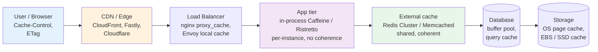
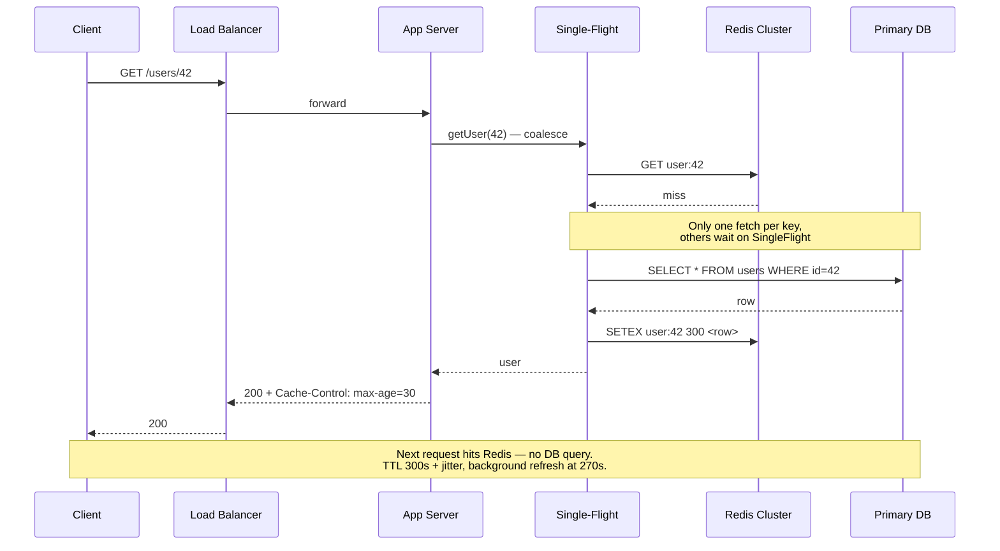
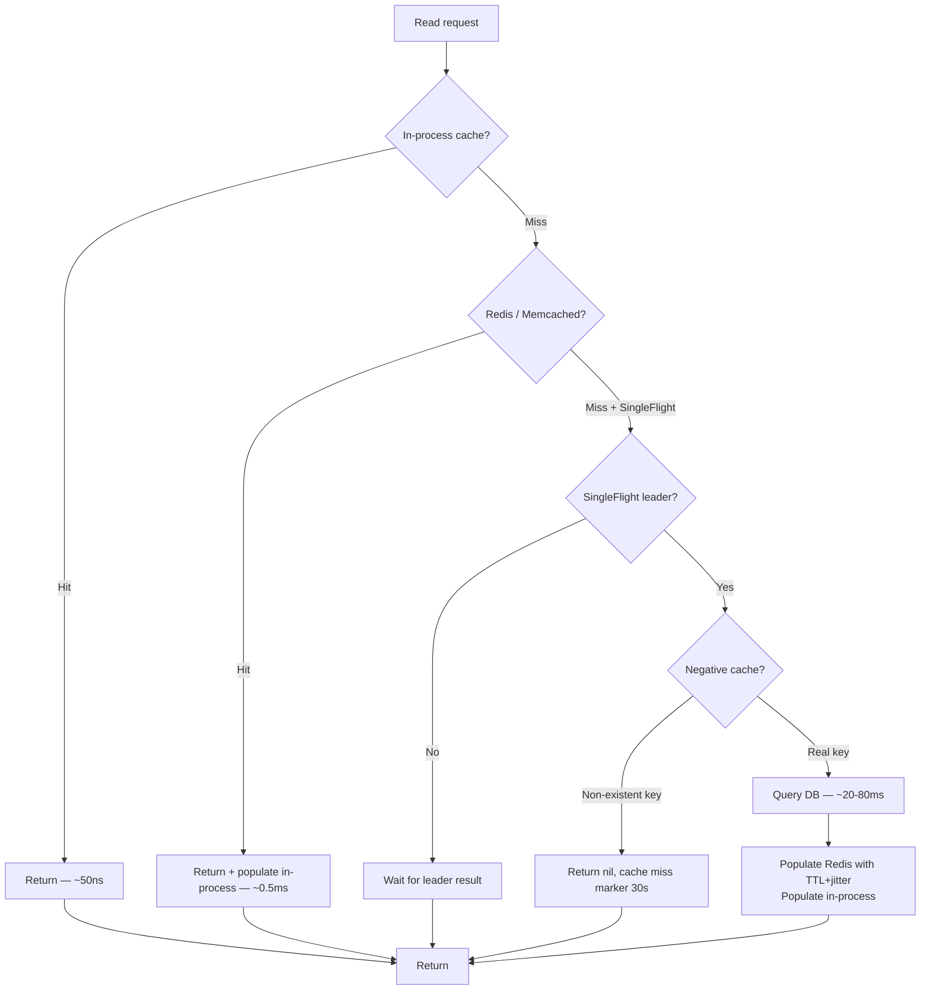
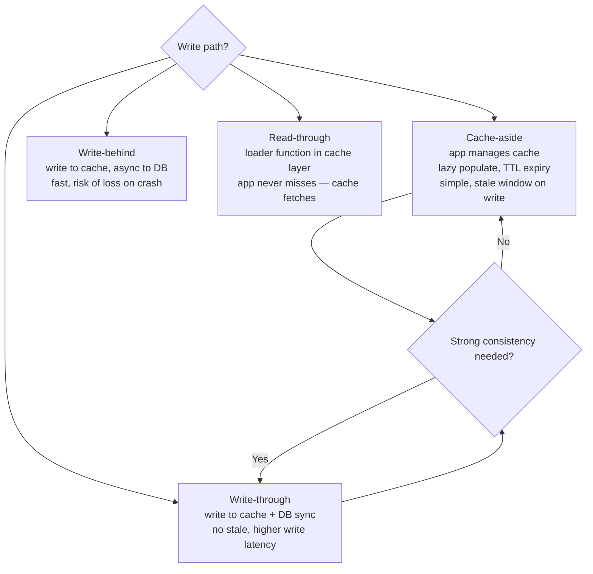
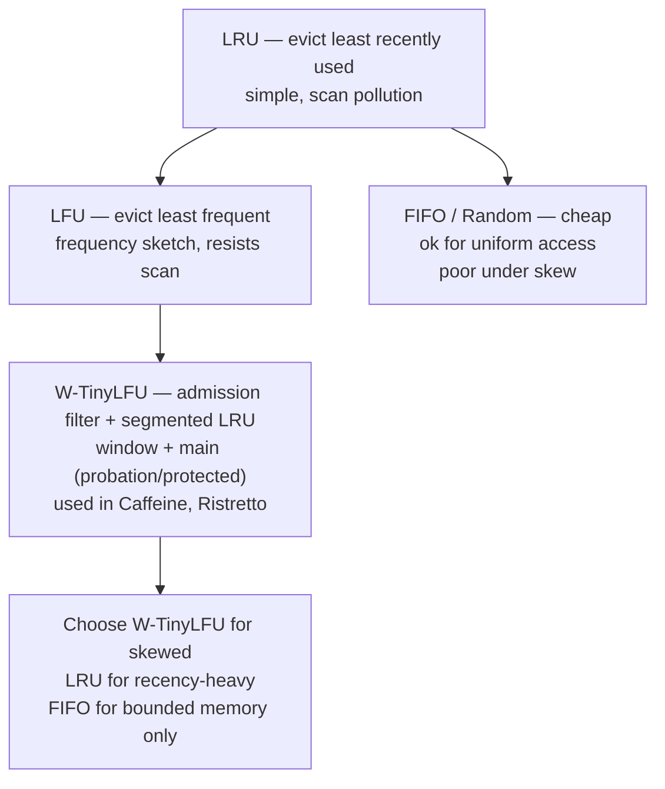
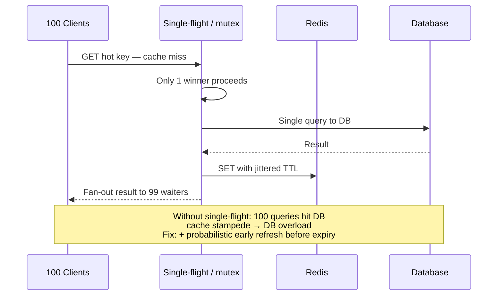
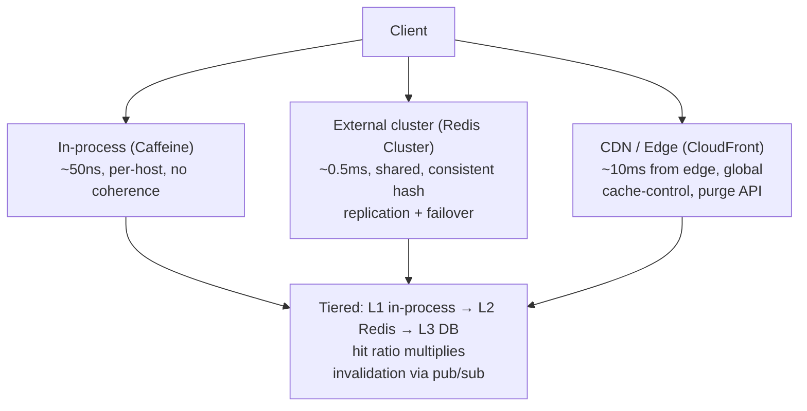

# Chapter 3 — Caching Strategies at Scale

**What this chapter covers.** Caching is the closest thing distributed systems has to a free lunch — and the most reliable source of subtle outages. For skewed workloads (α ≈ 0.9–1.0 — see Zipf analysis below), a well-placed cache can absorb roughly 80–90% of read traffic, cut p99 latency by an order of magnitude, and reduce database cost by more than half — but all three outcomes are workload-dependent, not universal. A poorly managed one can serve stale prices during a flash sale, amplify a cold start into a cascading failure, or silently corrupt data when an eviction policy interacts badly with access skew. This chapter builds caching from first principles: why it works (locality), where it lives (every layer from CPU to CDN), and the four decisions that define any caching strategy — what to cache, when to populate, when to invalidate, and what to do on a miss. We then cover eviction policies, write strategies, thundering-herd defenses, and distributed cache topologies (sidecar, external cluster, and CDN/edge), with failure modes and operational guidance for each. The chapter closes with cache sizing, hit-ratio math, and a checklist for cache reviews.

Learning goals — after this chapter you should be able to:

- Explain why caching works in terms of temporal and spatial locality and Zipfian access skew, and estimate hit ratios from access distributions.
- Name the caching layers in a modern backend stack — client, CDN/edge, load balancer, application, and database — and decide which layer to cache at for a given workload.
- Choose among cache-aside, read-through, write-through, and write-behind strategies, and state the consistency and failure semantics of each.
- Compare eviction policies (LRU, LFU, TinyLFU/W-TinyLFU, FIFO, random) and explain why modern caches use admission filters and segmented LRU rather than pure LRU.
- Design defenses against thundering herds, cache stampedes, and cold starts using single-flight, probabilistic early expiration, and warming strategies.
- Operate a distributed cache — Redis Cluster and Memcached — including consistent hashing, replication, persistence choices, and failure handling.
- Size a cache tier from working-set estimates and explain why hit ratio, not cache size, is the metric that drives cost and latency.

---

## Why caching works: locality and skew

Caching exploits two empirical properties of real workloads:

- **Temporal locality** — recently accessed items are likely to be accessed again soon. A user who viewed a product will view it again; a service that read a feature flag will read it again on the next request.
- **Spatial locality** — items near recently accessed items are likely to be accessed soon. Less relevant for KV caches than for CPU caches, but visible in range scans and prefix queries.

Together they produce **skew**: a small fraction of keys accounts for most accesses. Formally, many workloads follow a Zipfian distribution where the k-th most popular item's frequency is proportional to 1/k^α. For α ≈ 0.9–1.0 (common in web workloads), the top 10% of keys serves ~70–80% of requests. That is why a cache holding 10% of the dataset can achieve 80% hit ratio — and why hit ratio is non-linear in cache size.

```
Requests
  ^
  |*
  |**
  |***
  |*****
  |********
  |****************
  |****************************
  +--------------------------------> Key rank (most → least popular)
  |<-- 10% of keys -->|<-- 90% of keys -->|
  |<-- 80% of reqs -->|<-- 20% of reqs -->|
         Hot set              Long tail
```

If accesses were uniform (every key equally likely), caching would be pointless — hit ratio would equal cache-size / dataset-size. Skew is what makes caching effective, and measuring your workload's skew is the first step in any caching decision.

```python
# hit_ratio.py — estimate hit ratio from a Zipfian access trace (Python 3.11)
import random, collections

def zipf_keys(n_keys: int, alpha: float = 1.0) -> list[int]:
    weights = [1.0 / (k ** alpha) for k in range(1, n_keys + 1)]
    total = sum(weights)
    probs = [w / total for w in weights]
    # sample 1M requests
    return random.choices(range(n_keys), weights=probs, k=1_000_000)

def hit_ratio(trace: list[int], cache_size: int) -> float:
    # optimal offline: cache the hottest keys (upper bound for any policy)
    freq = collections.Counter(trace)
    hottest = {k for k, _ in freq.most_common(cache_size)}
    hits = sum(1 for k in trace if k in hottest)
    return hits / len(trace)

for cs in [100, 1000, 10000]:
    for alpha in [0.8, 1.0, 1.2]:
        trace = zipf_keys(100_000, alpha=alpha)
        print(f"cache={cs:5d}  alpha={alpha:.1f}  hit={hit_ratio(trace, cs):.1%}")
```

```
cache=  100  alpha=0.8  hit=28.4%
cache=  100  alpha=1.0  hit=41.2%
cache= 1000  alpha=1.0  hit=58.7%
cache=10000  alpha=1.0  hit=74.3%
cache=  100  alpha=1.2  hit=56.1%
cache= 1000  alpha=1.2  hit=71.8%
```

Higher α (more skew) means a smaller cache achieves the same hit ratio. Measure α from production access logs before sizing — an assumption of α = 1.0 when reality is 0.7 can halve your expected hit ratio.

> **Boundary note.** CPU and OS page caches (Vol 1, Chapter 3; Vol 2, Chapters 4, 6) exploit the same locality principles in hardware and the kernel. CDN and edge caching overlap with Vol 3, Chapter 10 — Proxies, Service Mesh, and CDNs, which covers anycast, cache hierarchies, and invalidation at the network edge. This chapter focuses on *application and data* caching — the tier the backend team owns and operates.

---

## Where caches live

A request traverses multiple caching layers. Each has different scope, coherence cost, and blast radius:



*Figure 3-1: Caching layers from client to storage. Lower layers are larger and more shared; upper layers are smaller and closer to the user. Most latency wins come from the top; most hit-ratio wins come from the middle.*

| Layer | Scope | Typical hit ratio | Invalidation cost |
|-------|-------|-------------------|-------------------|
| Browser / client | Per user | High for static assets, low for API | `Cache-Control` + `ETag` / `If-None-Match` |
| CDN / edge | Global, per PoP | 80–95% for cacheable content | Purge API (seconds–minutes) or TTL |
| LB / reverse proxy | Per PoP or per LB | 30–60% for API responses | Config reload or TTL |
| In-process (Caffeine) | Per instance | 20–50% (small, no coherence) | Local only — no coordination needed |
| External (Redis) | Shared across fleet | 70–90% (the main lever) | Explicit delete or TTL |
| DB buffer pool | Per DB node | 90–99% for working set (if it fits in RAM) | Automatic on write |

The right layer depends on the invalidation story:

- **Immutable or slowly changing** (images, JS bundles, product catalog snapshots) → CDN with long TTL + content-addressed URLs (change the URL, not the content).
- **Per-user, read-heavy, staleness-tolerant** (feed, recommendations, profile) → external cache with TTL + explicit invalidation on write.
- **Latency-critical, tiny working set** (feature flags, config, authZ decisions) → in-process cache with short TTL (seconds) and background refresh, backed by external cache.

Caching at multiple layers is multiplicative. A request that hits the CDN never reaches the app tier; one that hits the app's in-process cache never reaches Redis; one that hits Redis never reaches the database. But each layer adds staleness risk — a CDN serving a 5-minute-old price while Redis holds a 30-second-old price can produce inconsistencies visible to the user.

---

## The four decisions

Every caching strategy answers four questions. Get any one wrong and the cache becomes a liability.

### 1. What to cache

Not everything benefits. Cache when:

- Reads dominate writes (read:write > 10:1 is a good heuristic).
- Computation or I/O cost per miss is high (DB query, aggregation, external API).
- Access skew is significant (Zipfian α > 0.7).

Do not cache:

- Rapidly changing data where staleness is unacceptable (real-time inventory counts during a flash sale — cache with 1-second TTL and accept brief oversell, or do not cache at all).
- Per-request unique data (search results with many distinct queries — hit ratio will be near zero).
- Large objects that evict many small hot objects (consider a separate cache tier or size-aware admission).

### 2. When to populate (read path)

Three read strategies dominate:

**Cache-aside (lazy loading)** — the application manages the cache explicitly. On a read, check the cache; on a miss, read the database, populate the cache, and return.

```python
# cache_aside.py — the most common application-level pattern
import redis, json

r = redis.Redis(host="redis.internal", port=6379, decode_responses=True)

def get_user(user_id: str) -> dict | None:
    key = f"user:{user_id}"
    cached = r.get(key)
    if cached is not None:
        return json.loads(cached)          # hit

    # miss — load from database
    row = db.query("SELECT id, name, email FROM users WHERE id = %s", (user_id,))
    if row is None:
        # cache negative result to avoid DB hammer on missing keys (with short TTL)
        r.setex(f"user:{user_id}:miss", 30, "1")
        return None

    r.setex(key, 300, json.dumps(row))     # populate with 5-min TTL
    return row
```

Pros: only requested data is cached (efficient for sparse access); cache failures do not block reads (fall through to DB). Cons: first request after eviction always misses; application code is cache-aware.

**Read-through** — the cache sits in front of the database and loads on miss transparently. The application talks only to the cache.

```
App → Cache → (miss) → DB → Cache → App
```

Common with sidecar caches (e.g., `mcrouter` for Memcached) or database-integrated caches. Simpler application code, but the cache becomes a critical path component — if it is down, reads fail unless the cache proxies through.

**Refresh-ahead / background refresh** — a background process reloads data before it expires, so foreground reads never block on a miss. Best for latency-sensitive paths where even a cache miss is too slow. Implemented via probabilistic early expiration (see below) or explicit refresh workers.

### 3. When to invalidate (write path)

The two hard problems in computer science are cache invalidation, naming things, and off-by-one errors. Invalidation strategies:

| Strategy | How it works | Staleness | Complexity |
|----------|-------------|-----------|------------|
| **TTL expiration** | Entry expires after fixed time | Bounded by TTL | Trivial; no coordination |
| **Explicit invalidation** | Writer deletes/updates cache entry on write | Minimal (if delete succeeds) | Must handle delete failures |
| **Write-through** | Every write goes to cache and DB synchronously | Zero (if both succeed) | Higher write latency; cache is on write path |
| **Write-behind (write-back)** | Write to cache, async flush to DB | Window of durability risk | Complex; needs WAL and recovery |

TTL is the default for most systems because it bounds staleness without coordination. The choice of TTL is a direct staleness-vs-hit-ratio trade-off:

```
Hit ratio ≈ 1 − (TTL_miss_rate)
Effective staleness = TTL (worst case)
Short TTL (30s): low staleness, lower hit ratio, more DB load
Long TTL (5 min): higher staleness, higher hit ratio, less DB load
```

Explicit invalidation reduces staleness but introduces a failure mode: if the cache delete fails (network blip, Redis down), stale data persists until TTL expiry. The safe pattern combines both — explicit delete *plus* a TTL as a safety net:

```python
# write path — explicit invalidation with TTL safety net
def update_user(user_id: str, fields: dict) -> None:
    db.execute("UPDATE users SET name=%s WHERE id=%s", (fields["name"], user_id))
    try:
        r.delete(f"user:{user_id}")        # explicit invalidation
    except redis.ConnectionError:
        # delete failed — stale data will persist until TTL expiry (5 min)
        # options: enqueue retry, or rely on TTL, or use cache stampede guard
        enqueue_cache_invalidation(f"user:{user_id}")
        logger.warning("cache delete failed, enqueued retry", extra={"user_id": user_id})
```

Write-through and write-behind place the cache on the write path, which couples cache availability to write availability. They are appropriate when the cache *is* the primary store (e.g., Redis as a session store) but not when the database is authoritative.

### 4. What to do on a miss

The miss path is where outages happen. A cache miss is not just "read the DB" — at scale, it is "thousands of concurrent requests all miss simultaneously and hammer the DB."

---

## Eviction policies

When the cache is full, which entry to evict determines hit ratio. The optimal offline policy (Belady's — evict the entry whose next use is farthest in the future) is unimplementable; real policies approximate it.

| Policy | What it evicts | Strength | Weakness |
|--------|---------------|----------|----------|
| **LRU** (least recently used) | Oldest access | Simple, good for recency | Scan pollution: a one-time scan evicts the hot set |
| **LFU** (least frequently used) | Lowest frequency | Good for skew | Stale frequency: old hot keys never decay |
| **FIFO** | Oldest insertion | Trivial | Ignores access pattern entirely |
| **Random** | Random entry | Surprisingly competitive at large sizes | No adaptivity |
| **TinyLFU / W-TinyLFU** | Admission filter + segmented LRU | Near-optimal, scan-resistant | More complex |
| **ARC / LIRS** | Adaptive recency/frequency balance | Self-tuning | Complex to implement |

Modern caches do not use pure LRU. Two improvements matter:

**Segmented LRU (as in Caffeine/Ristretto).** The cache is split into an admission window (small, LRU) and a main space (larger, frequency-biased). New entries enter the window; only entries that prove themselves (accessed again while in the window) are promoted to the main space. This resists scan pollution — a burst of cold keys fills the window but does not evict the hot set.

**TinyLFU admission filter.** Before admitting a new entry, estimate whether it is worth caching by comparing its frequency to the eviction candidate's frequency. A Count-Min Sketch tracks approximate frequencies with minimal memory. If the new entry is less frequent than the candidate, it is not admitted — the cache is not polluted.

```
New entry → TinyLFU filter → Admit? → Window (LRU, 1% of cache)
                              No → discard
                              Yes → Window → promoted to Main on re-access
                                              Main = Eden (binned LRU) + Main probation
```

Caffeine (Java, widely used as an in-process cache) implements W-TinyLFU. Its hit ratio is within a few percent of optimal for most workloads and it is the default choice for JVM in-process caching:

```java
// Caffeine — W-TinyLFU in-process cache (Java 17, Caffeine 3.1)
import com.github.benmanes.caffeine.cache.Caffeine;
import com.github.benmanes.caffeine.cache.Cache;
import java.time.Duration;

Cache<String, User> cache = Caffeine.newBuilder()
    .maximumSize(10_000)                          // entry count, or maximumWeight with weigher
    .expireAfterWrite(Duration.ofMinutes(5))     // TTL
    .expireAfterAccess(Duration.ofMinutes(2))    // idle expiration — evict if not read
    .recordStats()                                // for hit ratio monitoring
    .build();

// usage — explicit loading (cache-aside style)
User user = cache.get(userId, key -> db.findUser(key));

// metrics
System.out.println(cache.stats());
// CacheStats{hitCount=847231, missCount=48210, hitRate=0.946, evictionCount=12043}
```

Redis and Memcached use simpler policies by default (Redis: `allkeys-lru` with sampled approximation; Memcached: LRU per slab class) but support LFU modes:

```bash
# Redis — eviction policy (redis.conf, Redis 7.2)
maxmemory 4gb
maxmemory-policy allkeys-lru        # or allkeys-lfu, volatile-lru, noeviction
maxmemory-samples 5                 # LRU approximation: sample 5 keys, evict least recent
# LFU mode — better for skewed workloads, decay over time
maxmemory-policy allkeys-lfu
lfu-log-factor 10
lfu-decay-time 1                    # minutes until counter decay

# Memcached — slab-aware LRU (Memcached 1.6)
# -M: return error on OOM instead of evicting (for critical caches)
# -o modern: enables segmented LRU + better memory efficiency
$ memcached -m 4096 -c 8192 -o modern -M
```

---

## Thundering herds, stampedes, and cold starts

Three related failure modes share a cause: many concurrent requests miss the same cache entry simultaneously and all hit the backing store.

**Thundering herd** — a popular key expires and thousands of requests miss at once. The database receives a spike equal to the request rate for that key, not the normal miss rate.

**Cache stampede** — a variant where the recomputation is expensive (aggregation, report generation) and concurrent recomputations waste resources and contend.

**Cold start** — the cache is empty (deploy, failover, restart) and every request misses until the cache warms. Equivalent to a herd across all keys.

### Defense 1 — Single-flight (request coalescing)

Only one request fetches the data; others wait for the result.

```python
# singleflight.py — coalesce concurrent fetches for the same key
import threading

class SingleFlight:
    def __init__(self):
        self._lock = threading.Lock()
        self._inflight: dict[str, threading.Event] = {}
        self._results: dict[str, object] = {}

    def do(self, key: str, fn):
        with self._lock:
            if key in self._inflight:
                event = self._inflight[key]
            else:
                event = threading.Event()
                self._inflight[key] = event
                # we are the leader — fetch outside the lock
                do_fetch = True
                event = event
                # use a flag to track leadership
                self._results[key + ":leader"] = True
                do_fetch_key = key
                # release lock before I/O
                self._lock.release()
                try:
                    result = fn()
                    with self._lock:
                        self._results[key] = result
                        event.set()
                        del self._inflight[key]
                    return result
                except Exception as e:
                    with self._lock:
                        self._results[key + ":err"] = e
                        event.set()
                        del self._inflight[key]
                    raise
                finally:
                    if 'do_fetch' not in dir():
                        pass
                # non-leader path needs re-lock
                do_fetch = False

            # non-leader: wait for leader's result
            # (simplified — real impl uses double-check + event wait outside lock)
            self._lock.release()
            event.wait(timeout=5.0)
            with self._lock:
                if key + ":err" in self._results:
                    raise self._results[key + ":err"]
                return self._results.get(key)

# Go's singleflight is the canonical implementation (golang.org/x/sync/singleflight)
# Python equivalent above; in production use cachetools + threading or asyncio equivalent
```

In Go, this is a one-liner with `singleflight.Group`:

```go
// singleflight in Go (Go 1.21, golang.org/x/sync/singleflight)
import "golang.org/x/sync/singleflight"

var g singleflight.Group

func getUser(userID string) (*User, error) {
    v, err, _ := g.Do(userID, func() (interface{}, error) {
        // only one goroutine executes this per userID; others wait
        if cached := redis.Get("user:" + userID); cached != nil {
            return cached, nil
        }
        user, err := db.FindUser(userID)
        if err == nil {
            redis.SetEx("user:"+userID, 300, user)
        }
        return user, err
    })
    if err != nil {
        return nil, err
    }
    return v.(*User), nil
}
```

### Defense 2 — Probabilistic early expiration (x-fetch / early recomputation)

Instead of letting a key expire and causing a miss spike, refresh it *before* expiry with probability that increases as expiry approaches. Commonly called "x-fetch" or "probabilistic early expiration":

```python
# probabilistic early expiration (based on nginx proxy_cache_use_stale + background update)
import time, random, math

def get_with_early_refresh(key: str, ttl_s: int = 300, beta: float = 1.0):
    entry = r.get(key)
    if entry is None:
        return fetch_and_cache(key, ttl_s)

    # entry stores (value, expiry_timestamp)
    value, expiry = deserialize(entry)
    now = time.time()

    # gap = how close to expiry; larger gap → higher refresh probability
    gap = now - (expiry - ttl_s)  # time since birth
    # x-fetch formula: refresh if now - delta*beta*log(rand) >= expiry
    # simplified: probability increases as we approach expiry
    if now + beta * math.log(random.random()) >= expiry:
        # background refresh — serve stale value immediately, refresh async
        enqueue_background_refresh(key, ttl_s)
        # optionally add jitter to expiry to desynchronize concurrent refreshes
    return value
```

Simpler variant — add jitter to TTL so keys do not expire simultaneously:

```python
# TTL jitter — desynchronize expirations
base_ttl = 300
jitter = random.uniform(-0.1, 0.1) * base_ttl  # ±10%
r.setex(key, int(base_ttl + jitter), value)
# 1000 keys that would have expired at T=300 now expire across T=270..330
```

### Defense 3 — Warming and stale-while-revalidate

- **Warming on deploy**: before cutting traffic to new instances, pre-populate their in-process caches from the external cache or a snapshot. Kubernetes `postStart` hooks or init containers can do this.
- **Warming after failover**: keep a standby cache (replica) warm via replication, not empty.
- **Stale-while-revalidate (SWR)**: serve stale data while refreshing in the background. HTTP `Cache-Control: stale-while-revalidate=60` and Redis `GET` + async `SET` implement this.

```http
# HTTP stale-while-revalidate — the CDN and browser do this natively
HTTP/1.1 200 OK
Cache-Control: max-age=60, stale-while-revalidate=30
ETag: "abc123"

# Client: within 60s → fresh (no origin fetch)
# Client: 60–90s → serve stale immediately, revalidate in background
# Client: after 90s → must revalidate before serving
```

```bash
# nginx — stale-while-revalidate for API responses (nginx 1.25)
proxy_cache_path /var/cache/nginx levels=1:2 keys_zone=api:100m inactive=5m;
server {
    location /api/ {
        proxy_cache api;
        proxy_cache_valid 200 60s;
        proxy_cache_use_stale error timeout updating;  # serve stale on origin error
        proxy_cache_background_update on;               # revalidate in background
        proxy_cache_lock on;                            # single-flight at nginx layer
        proxy_pass http://app_backend;
    }
}
```

### Defense 4 — Circuit breaker on the miss path

If the database is overloaded, cache misses should not add more load. A circuit breaker on the DB path (Chapter 1, Principle 5) that fails fast when the DB is slow prevents the cache miss storm from becoming a DB outage.

---

## Distributed cache topologies

### Memcached — simple, sharded, no replication

Memcached is a shared-nothing, sharded cache. Clients hash keys to servers (consistent hashing via client library like `mcrouter` or `ketama`); each key lives on exactly one server. If a server fails, its keys are simply missed — no failover, no replication.

```
Client (ketama ring) ─┬─▶ memcached-1 (33% of keys)
                      ├─▶ memcached-2 (33% of keys)
                      └─▶ memcached-3 (33% of keys)
         One server dies → 33% miss spike until rehashed
```

Pros:极简, predictable, scales linearly by adding nodes, no replication lag. Cons: no persistence, no replication, rehashing on membership change causes a miss storm (mitigated by consistent hashing but not eliminated). Best for: large, transient caches where a miss is cheap (HTML fragments, session-adjacent data).

```bash
# mcrouter — Meta's Memcached router with consistent hashing and failover (mcrouter 2024)
$ cat /etc/mcrouter/config.json
{
  "pools": {
    "cache": {
      "servers": ["memcached-1:11211", "memcached-2:11211", "memcached-3:11211"],
      "hash": "ketama"
    }
  },
  "route": {
    "type": "OperationSelectorRoute",
    "operation": "get",
    "default_policy": "RouteToAll",
    "policies": {
      "get": { "type": "HashRoute", "hash_func": "Ch3", "children": "PoolRoute|cache" },
      "set": { "type": "AllSyncRoute", "children": "PoolRoute|cache" }
    }
  }
}

# Observe hit ratio
$ echo "stats" | nc memcached-1 11211 | grep -E "get_hits|get_misses|evictions"
STAT get_hits 4823102
STAT get_misses 892341
STAT evictions 12043
# hit ratio = 4823102 / (4823102 + 892341) ≈ 84.4%
```

### Redis Cluster — sharded with replication

Redis Cluster partitions data into 16,384 hash slots, each owned by a primary shard with 1–2 replicas. Failover is automatic via Raft-like election among replicas. Persistence (RDB + AOF) is optional — most caches run without it for performance.

```
Client (cluster-aware) ─┬─▶ Primary 0 (slots 0-5460)    ──▶ Replica 0a
                        ├─▶ Primary 1 (slots 5461-10922) ──▶ Replica 1a
                        └─▶ Primary 2 (slots 10923-16383)──▶ Replica 2a
         Primary 1 dies → Replica 1a promoted, ~1s failover
```

```bash
# Redis Cluster setup (Redis 7.2, 2024)
$ redis-cli --cluster create 10.0.1.1:6379 10.0.1.2:6379 10.0.1.3:6379 \
  --cluster-replicas 1 --cluster-yes
>>> Performing hash slots allocation on 6 nodes...
    M: 10.0.1.1:6379  slots:0-5460
    M: 10.0.1.2:6379  slots:5461-10922
    M: 10.0.1.3:6379  slots:10923-16383
    R: 10.0.1.4:6379  replica of 10.0.1.1
    R: 10.0.1.5:6379  replica of 10.0.1.2
    R: 10.0.1.6:6379  replica of 10.0.1.3

# Observe cluster health and hit stats
$ redis-cli -h 10.0.1.1 -p 6379 cluster info
cluster_state:ok
cluster_slots_assigned:16384
cluster_known_nodes:6
cluster_size:3

$ redis-cli -h 10.0.1.1 info stats | grep -E "keyspace_hits|keyspace_misses|evicted_keys"
keyspace_hits:4823102
keyspace_misses:892341
evicted_keys:12043
# hit ratio ≈ 84.4% — same workload as Memcached above

# Latency check — Redis p99 should be < 5ms within AZ
$ redis-cli --latency-history -h 10.0.1.1
min: 0, max: 3, avg: 0.42 (435 samples)  # ms — healthy
```

Redis Cluster handles slot migration for resharding (`CLUSTER SETSLOT ... MIGRATING`) with minimal disruption — keys move one at a time, not all at once.

### Choosing between them

| Criterion | Memcached | Redis Cluster |
|-----------|-----------|---------------|
| Data model | String only | Strings, hashes, sets, sorted sets, streams, JSON |
| Replication / HA | None (client must handle) | Built-in primary-replica + auto-failover |
| Persistence | None | RDB + AOF (optional) |
| Memory efficiency | Slab allocator, some waste | More overhead per key, but richer types |
| Operations | Simpler, fewer failure modes | More knobs, more to misconfigure |
| When to choose | Large transient cache, miss is cheap | Cache that is also a data store (sessions, leaderboards, rate-limit counters) |

Many teams run both: Memcached for large, low-value caches (rendered HTML, API responses) and Redis for small, high-value caches that need persistence or data structures (sessions, locks, counters for rate limiting — Chapter 9).



*Figure 3-2: Read path with coalesced cache-aside, TTL with jitter, and background refresh. The single-flight prevents herds; the TTL bounds staleness; the jitter desynchronizes expirations.*

---

## Sizing and hit-ratio math

Cache sizing starts from the working set — the data that is hot enough to matter.

```
Working set = hot keys × avg value size
Cache size  = working set / target_load_factor
  target_load_factor ≈ 0.6–0.75 for Redis (hash table overhead)
  For Memcached, usable ≈ configured × 0.85 (slab overhead)
```

Example:

```
Hot keys: 5M users × 1 KB profile = 5 GB working set
Target load factor: 0.65
Cache needed: 5 GB / 0.65 ≈ 7.7 GB
With 3 shards × 2 replicas (6 nodes): ~1.3 GB per node → r7g.large (16 GB) is ample
But with replication factor 2 (primary + replica): active data per shard = 7.7/3 ≈ 2.6 GB
Each primary holds 2.6 GB, each replica holds 2.6 GB → 15.6 GB total cluster memory
```

Hit ratio drives the economics. Suppose a database handles 10k QPS at p99 = 80 ms, and each query costs $0.001 in provisioned capacity. With no cache, cost = 10k × $0.001 = $10/sec. With a cache at hit ratio h:

```
DB QPS with cache = (1 − h) × 10k
DB cost with cache = (1 − h) × $10/sec
Cache cost (Redis, 3 shards): ~$0.60/hr ≈ $0.00017/sec — negligible vs DB

h = 80% → DB QPS 2k → cost $2/sec (5× savings)
h = 90% → DB QPS 1k → cost $1/sec (10× savings)
h = 95% → DB QPS 500 → cost $0.50/sec (20× savings)
```

Each additional 5% of hit ratio beyond 80% halves the database load. That is why cache tuning — admission filters, proper TTLs, and avoiding scan pollution — has outsized ROI. A cache that achieves 95% instead of 85% does not save 10% of database cost; it saves 66%.

Monitor hit ratio continuously:

```bash
# Prometheus — Redis hit ratio (PromQL, redis_exporter 1.55)
$ curl -s 'http://prometheus.internal:9090/api/v1/query?query=sum(rate(redis_keyspace_hits_total[5m])) / (sum(rate(redis_keyspace_hits_total[5m])) + sum(rate(redis_keyspace_misses_total[5m])))' | jq .
0.872   # 87.2% — healthy; alert if < 80% for 10m

# Application-level hit ratio (micrometer / Prometheus client)
# Counter: cache.gets{result="hit"} and cache.gets{result="miss"}
# hit_ratio = hit / (hit + miss)

# Caffeine stats via Micrometer (Spring Boot 3.2)
management.metrics.cache.enabled=true
# → /actuator/metrics/cache.gets?tag=result:hit
```

---

## Cache review checklist

Before shipping or reviewing any caching layer, walk through this list:

- [ ] **Hit ratio target and measurement**: What hit ratio do you expect, how is it measured, and what alerts fire when it drops?
- [ ] **Staleness budget**: What is the maximum acceptable staleness for this data? Does the TTL + invalidation strategy respect it?
- [ ] **Invalidation path**: On every write, is the cache entry deleted or updated? What happens if the delete fails? Is there a TTL safety net?
- [ ] **Thundering herd**: Is there single-flight, TTL jitter, or probabilistic early expiration for hot keys? What happens during a cold start?
- [ ] **Negative cache**: Are misses for non-existent keys cached (with short TTL) to prevent DB hammer on enumeration attacks?
- [ ] **Eviction policy**: Is the policy appropriate for the access skew? Is the cache large enough that eviction is rare for the hot set?
- [ ] **Failure mode**: If the cache is down, does the system degrade to DB reads (with circuit breaker) or fail entirely? Has this been tested?
- [ ] **Sizing and cost**: Is the cache sized to the working set with headroom? Is the cost of the cache justified by the DB cost it saves?
- [ ] **Consistency**: If multiple caches hold the same data (in-process + Redis + CDN), what is the maximum divergence window? Is it acceptable?
- [ ] **Security**: Are cached entries scoped correctly (no cross-tenant leakage via shared cache keys)? Are cache keys constructed to prevent injection?



*Figure 3-3: Complete read path with layered caching, single-flight, and negative caching. Every branch has bounded latency; no path hammers the database without coalescing.*

---

## Key takeaways

- Caching works because real workloads are skewed (Zipfian) — a small hot set serves most requests. Measure your workload's skew (α) before sizing; an assumption of high skew when reality is uniform leads to severe under-provisioning.
- Cache at the layer that matches the invalidation story: CDN for immutable/slow-changing content, external cache (Redis/Memcached) for shared application data, in-process (Caffeine) for tiny latency-critical working sets. Multiple layers multiply hit ratios but also multiply staleness windows.
- Four decisions define any caching strategy: what to cache (read-heavy, high-cost, skewed), when to populate (cache-aside for sparse access, read-through for simplicity, refresh-ahead for latency-sensitive), when to invalidate (TTL as default, explicit delete with TTL safety net for lower staleness), and what to do on a miss (single-flight, jitter, early expiration).
- Eviction policy matters more than cache size beyond a point. Modern caches use segmented LRU and TinyLFU admission filters to resist scan pollution and achieve near-optimal hit ratios. Do not use pure LRU for large caches with mixed hot/cold access.
- Thundering herds, stampedes, and cold starts are the primary cache-induced outage modes. Defend with single-flight coalescing, TTL jitter, probabilistic early expiration, warming, and stale-while-revalidate. A cache that is empty (deploy, failover) is a loaded gun pointed at the database.
- Distributed cache topology is a trade-off: Memcached is simpler and scales linearly but has no replication; Redis Cluster provides replication and richer data structures but has more operational complexity. Many teams run both for different tiers.
- Hit ratio is the metric that drives economics. Going from 85% to 95% hit ratio halves database load. Monitor it continuously, alert on drops, and treat cache tuning as high-ROI work. Size the cache to the working set with headroom; beyond that, policy matters more than bytes.










## Further reading

- Caffeine cache design — Ben Manes, "Caffeine: A High Performance Caching Library for Java" — the W-TinyLFU paper and implementation that replaced Guava cache; explains segmented LRU and TinyLFU admission with benchmarks. https://github.com/ben-manes/caffeine
- Einziger, G., Friedman, R., and Manes, B. "TinyLFU: A Highly Efficient Cache Admission Policy" (*ACM Transactions on Storage*, 2017) — the TinyLFU paper; how a Count-Min Sketch admission filter achieves near-optimal hit ratios with minimal memory. https://arxiv.org/abs/1511.03012
- Redis documentation — "Redis Cluster Specification" and "Eviction Policies" (Redis 7.2, 2024) — authoritative reference for slot allocation, failover, and maxmemory policies. https://redis.io/docs/reference/cluster-spec/  https://redis.io/docs/reference/eviction/
- Memcached documentation and mcrouter — Meta's mcrouter and Memcached slab allocator; practical guidance on sharding and consistent hashing at scale. https://memcached.org/  https://github.com/facebook/mcrouter
- Nishtala, R. et al. "Scaling Memcache at Facebook" (NSDI 2013) — how Facebook scaled Memcached to billions of requests per second; consistent hashing, replication, and failure handling in production. https://www.usenix.org/system/files/conference/nsdi13/nisthala.pdf
- Huang, Q. et al. "An Analysis of Facebook Photo Caching" (SOSP 2013) — workload analysis of a petabyte-scale cache; Zipfian skew, TTL selection, and the cost of staleness. https://www.cs.cmu.edu/~chensm/BigDataPage.html
- Bronson, N. et al. "TAO: Facebook's Distributed Data Store for the Social Graph" (ATC 2013) — how Facebook layered caching (TAO) over MySQL for the social graph; cache consistency and invalidation at planetary scale. https://www.usenix.org/conference/atc13/technical-sessions/presentation/bronson
- Gabriel, S. "Stale-While-Revalidate, Stale-If-Error" (RFC 5861, 2010) — the HTTP cache extension that formalizes serving stale data during revalidation; basis for CDN and browser SWR behavior. https://datatracker.ietf.org/doc/html/rfc5861

---

*Next: Chapter 4 — Load Balancing and Traffic Management — moves from caching (reducing load) to distributing it: L4/L7 load balancing at system scale, traffic shaping, and the control plane that makes traffic policy safe to change.*
