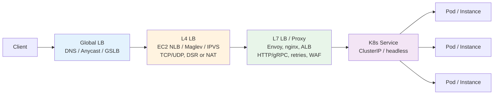
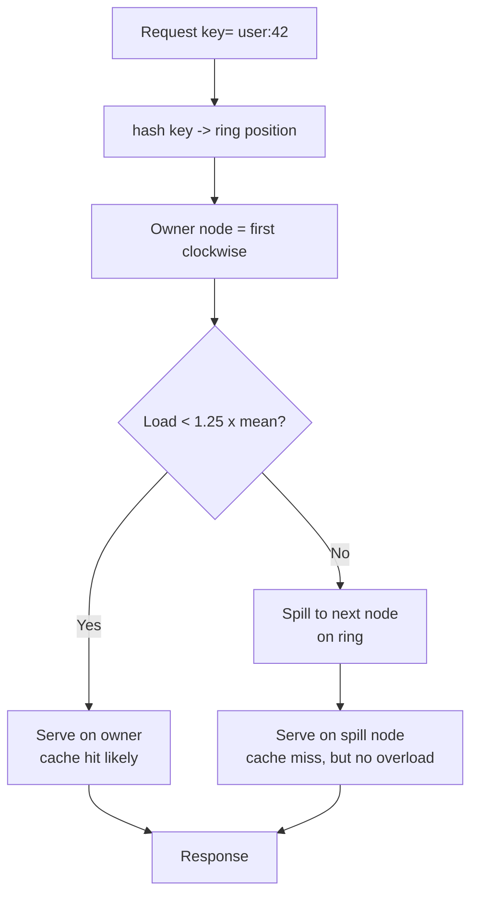
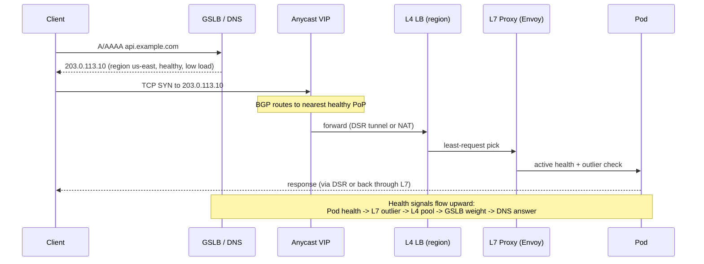

# Chapter 4 — Load Balancing and Traffic Management

**What this chapter covers.** Load balancing is where system design meets wire reality. Chapter 1 said "scale horizontally with stateless services" and Chapter 2 sized the fleet; this chapter decides how traffic *finds* those instances, how it *chooses* among them, and what happens when an instance is slow, failing, or warming up. We build the taxonomy — L3/L4/L7, client-side versus proxy, global versus local — and compare the algorithms that matter at scale (round-robin, least-request, EWMA/p2c, consistent hash, rendezvous). We then make those algorithms operational: health checking, outlier detection, slow-start, connection draining, and retry budgets. The second half is concrete: Envoy 1.30 listener/cluster/route configuration with outlier detection and circuit breaking, Kubernetes Service (ClusterIP, headless, topology-aware), Ingress NGINX and Gateway API (v1.1) HTTPRoute with traffic splitting, and global traffic management via DNS, anycast, and GSLB. The chapter closes with capacity-aware load balancing and the distributed-systems lens on why the load balancer is the most consequential single point of failure in a fleet.

Learning goals — after this chapter you should be able to:

- Distinguish L3, L4, and L7 load balancing, state when each is the right layer, and explain DSR versus proxy (NAT) return paths.
- Compare round-robin, least-request, EWMA, power-of-two-choices, consistent hash, and rendezvous hashing on uniformity, state, and behavior under heterogeneity.
- Configure Envoy (1.30) clusters with health checking, outlier detection, circuit breakers, and slow-start, and explain what each field does on the data path.
- Configure Kubernetes Services, Ingress, and Gateway API HTTPRoutes for traffic splitting, and explain kube-proxy iptables versus IPVS versus eBPF (Cilium) data paths.
- Reason about global load balancing — DNS TTL limits, anycast BGP, and GSLB health-driven steering — and its interaction with local balancing.
- Design capacity-aware and latency-aware routing (least-request with EWMA, panic thresholds, and retry budgets) that avoids amplifying tail latency.

---

## The contract of a load balancer

A load balancer promises five things, rarely all perfectly: **distribution** (spread load evenly), **availability** (skip failed backends without client impact), **observability** (know where traffic went), **controllability** (shift traffic deliberately — canary, blue/green, drain), and **performance** (add negligible latency and handle failures faster than clients can). Every design choice trades among them.



*Figure 4-1: The load balancing stack. Global steering picks a region; L4 picks a node without parsing HTTP; L7 picks an instance with full request semantics; the Service abstraction picks a pod. Each layer sees less traffic and makes a more informed decision.*

> **Boundary note.** Wire-level mechanics (ECMP, Maglev consistent hashing, GUE/DSR encapsulation, QUIC connection migration) are covered in Vol 3, Chapter 9 — Load Balancing: L4, L7, and Algorithms and Chapter 10 — Proxies, Mesh, and CDNs. This chapter uses those mechanisms as *system-design primitives* and focuses on algorithm choice, configuration, and failure behavior at the fleet level.

---

## Layers: L3, L4, L7 — and where the client sits

| Layer | Sees | Decision key | Typical product | Latency added |
|-------|------|-------------|----------------|---------------|
| **Global (DNS/anycast)** | Hostname → region/PoP | Geography, health, latency | Route 53, Cloudflare, GSLB | 0 ms on data path (control plane) |
| **L4 (transport)** | TCP/UDP 5-tuple | Connection hash, least-conn | NLB, Maglev, IPVS, GCP ILB | < 0.1 ms (kernel/eBPF) |
| **L7 (application)** | HTTP method/path/headers, gRPC service/method | URL, header, cookie, latency | Envoy, nginx, ALB, Istio | 0.3–2 ms (parse + route) |
| **Client-side** | Full app context + history | Latency, error rate, locality | gRPC LB, Finagle, service mesh sidecar | 0 ms extra hop (in-process) |

Two return-path patterns determine L4 performance:

- **Proxy (NAT):** return traffic flows back through the LB. Simple, but the LB is bandwidth-bound.
- **Direct Server Return (DSR):** the backend replies directly to the client with the VIP as source, via tunneling (IPIP/GRE/GUE) or local VIP on loopback. The LB handles only ingress. Used by Google Maglev and Meta Katran; essential above ~100 Gbps per VIP.

Client-side balancing removes a hop entirely. A gRPC client with `xDS` or a mesh sidecar (Envoy) maintains its *own* view of the backend set and applies EWMA/least-request locally — lower latency, richer signal, but every client must get the right backend list.

---

## Algorithms: what they optimize and what they cost

No single algorithm wins everywhere. The choice depends on request cost uniformity, backend heterogeneity, and whether affinity matters.

| Algorithm | State | Uniformity | Handles heterogeneity | Affinity | When to use |
|-----------|-------|-----------|----------------------|----------|-------------|
| **Round-robin** | None | Even by count | No — slow host gets same share | No | Uniform, CPU-bound, equally sized instances |
| **Least-request / least-conn** | Active count per host | Even by concurrency | Partially | No | Variable request cost, long-lived connections |
| **EWMA + p2c** | EWMA latency per host | Even by *latency* | Yes | No | Heterogeneous instances, noisy neighbors |
| **Consistent hash (ketama)** | Ring | By key, not by load | No | Yes | Cache locality, sharded state |
| **Rendezvous (HRW)** | None | By key, deterministic | No | Yes | Stateless consistent routing without a ring |
| **Maglev / bounded-load CH** | Ring + load cap | Bounded imbalance | Yes (cap) | Yes | Large L4 fleets needing minimal churn |

### Round-robin and weighted round-robin

Trivial, stateless, and optimal when requests are uniform and backends are identical. Weighted round-robin assigns `weight ∝ capacity`.

```python
# weighted_round_robin.py — smooth weighted RR (nginx algorithm, Python 3.11)
class SmoothWRR:
    def __init__(self, backends: list[tuple[str, int]]):
        # backends: (name, weight)
        self.backends = [{"name": n, "weight": w, "current": 0} for n, w in backends]
        self.total = sum(w for _, w in backends)

    def next(self) -> str:
        best = max(self.backends, key=lambda b: b["current"])
        best["current"] += best["weight"]
        for b in self.backends:
            b["current"] -= b["weight"] if b is best else 0
            # nginx variant: subtract total from winner only; above is equivalent
        # corrected smooth algorithm (nginx): increment all by weight, pick max, subtract total
        # simpler to implement as:
        for b in self.backends:
            b["current"] += b["weight"]
        chosen = max(self.backends, key=lambda b: b["current"])
        chosen["current"] -= self.total
        return chosen["name"]
```

### Least-request and why least-conn lies

`least_conn` tracks open connections. For HTTP/1.1 with one request per connection it tracks load; for HTTP/2 or gRPC with multiplexed streams it does not — one connection can carry 100 streams while another carries 1. Envoy's `LEAST_REQUEST` therefore tracks *active requests* (streams), not connections, and optionally weights by response time. Without that, a slow backend that holds requests longer appears *more* loaded (more active requests) and correctly receives fewer new ones — a useful negative feedback loop.

### EWMA and power of two choices (p2c)

EWMA tracks an exponentially weighted moving average of per-host latency; p2c samples two random hosts and picks the lower-EWMA one. Together (Finagle, Envoy's `LEAST_REQUEST` with `choiceCount: 2`) they approximate global least-latency routing with O(1) state and no coordination.

```
pick = argmin( EWMA(host_a), EWMA(host_b) )  where a,b sampled uniformly
EWMA_new = α * observed_latency + (1 - α) * EWMA_old    # α ≈ 0.1–0.3
```

Under heterogeneity (one AZ has noisy neighbors, one instance is on a degraded host), p2c + EWMA sheds load from slow hosts within seconds, while round-robin keeps hammering them.

### Consistent hashing and bounded loads

When affinity matters — cache locality (Chapter 3), shard ownership — consistent hashing (Vol 1, Chapter 3) is correct. The operational concern is *imbalance under failure*: if a node dies, its keys redistribute to neighbors, spiking them. **Bounded-load consistent hashing** caps each node's share (e.g., at `1.25 × mean`) and spills excess to the next node, trading a few extra cache misses for overload protection. Google's Maglev and Cloudflare's consistent hash both implement bounded variants.



*Figure 4-2: Bounded-load consistent hashing. Affinity is preserved when possible, but an explicit load cap prevents a hot shard from cascading into neighbor overload.*

---

## Health checking, outlier detection, and slow start

A load balancer that cannot detect failure is a failure amplifier. Three mechanisms compose:

**Active health checking** probes backends out-of-band (`HTTP /healthz`, TCP connect, gRPC health protocol). It removes dead hosts even with no traffic, but has a detection delay (interval × threshold).

**Passive outlier detection** watches *live traffic* for errors and ejections — `5xx`, timeouts, or `p99` spikes — and ejects the host from the pool without waiting for the next probe. It is faster and catches gray failures (slow, not dead) that active checks miss.

**Slow start** ramps traffic to a newly added or recently recovered host, avoiding a thundering herd that knocks it over again during warmup (JIT, cache cold, connection pool fill).

The interaction matters: active checks *re-add* hosts; outlier detection *removes* them; slow start *ramps* them. Misconfigure the timing and a flapping host oscillates in and out, each re-add spiking error rate.

---

## Envoy in depth — the control plane's data plane

Envoy (CNCF, v1.30 — April 2024) is the reference L7 proxy: every major mesh (Istio, Cilium, App Mesh) and edge (Contour, Emissary) programs it via xDS. The configuration below wires a realistic service `api` with least-request, active health checking, outlier detection, circuit breaking, and slow start.

```yaml
# envoy.yaml — Envoy 1.30 static config with least-request + outlier detection
# In production this is delivered via xDS (CDS/EDS/RDS/LDS); static here for clarity.
static_resources:
  listeners:
    - name: ingress
      address: { socket_address: { address: 0.0.0.0, port_value: 8080 } }
      filter_chains:
        - filters:
            - name: envoy.filters.network.http_connection_manager
              typed_config:
                "@type": type.googleapis.com/envoy.extensions.filters.network.http_connection_manager.v3.HttpConnectionManager
                stat_prefix: ingress_http
                codec_type: AUTO
                route_config:
                  name: api_route
                  virtual_hosts:
                    - name: api
                      domains: ["api.internal", "api.internal:8080"]
                      routes:
                        - match: { prefix: "/" }
                          route:
                            cluster: api
                            timeout: 2s
                            retry_policy:
                              retry_on: "5xx,reset,connect-failure"
                              num_retries: 2
                              per_try_timeout: 1s
                              retry_back_off: { base_interval: 25ms, max_interval: 250ms }
                              # retry budget: never retry more than 20% of active requests
                              # (Envoy >=1.28: retry_concurrency_window via runtime)
                http_filters:
                  - name: envoy.filters.http.router
                    typed_config:
                      "@type": type.googleapis.com/envoy.extensions.filters.http.router.v3.Router
  clusters:
    - name: api
      connect_timeout: 200ms
      lb_policy: LEAST_REQUEST
      least_request_config: { choice_count: 2 }   # p2c
      # slow start — ramp from 10% to 100% over 30s after host added
      slow_start_config:
        slow_start_window: 30s
        aggression: 1.0
        min_weight_percent: 10
      circuit_breakers:
        thresholds:
          - priority: DEFAULT
            max_connections: 8192
            max_pending_requests: 4096
            max_requests: 4096
            max_retries: 3
            track_remaining: true
      health_checks:
        - timeout: 2s
          interval: 5s
          unhealthy_threshold: 3
          healthy_threshold: 2
          interval_jitter_percent: 10
          http_health_check: { path: /healthz }
      outlier_detection:
        consecutive_5xx: 5
        interval: 5s
        base_ejection_time: 30s
        max_ejection_percent: 50          # never eject more than half the cluster
        min_health_percent: 50            # panic threshold — stop ejecting below this
        enforcing_consecutive_5xx: 100
        enforcing_success_rate: 100       # also eject on success-rate outlier
        success_rate_minimum_hosts: 5
        success_rate_stale_time: 30s
      load_assignment:
        cluster_name: api
        endpoints:
          - lb_endpoints:
              - endpoint: { address: { socket_address: { address: 10.0.1.10, port_value: 8080 } } }
              - endpoint: { address: { socket_address: { address: 10.0.1.11, port_value: 8080 } } }
              - endpoint: { address: { socket_address: { address: 10.0.2.10, port_value: 8080 } } }
```

Key fields and why they matter:

- `LEAST_REQUEST` with `choice_count: 2` implements p2c; without EWMA weighting it is still better than round-robin for variable-cost requests. Envoy's `ROUND_ROBIN` with `slow_start` is fine for uniform workloads.
- `max_ejection_percent: 50` prevents outlier detection from ejecting the entire cluster during a correlated failure (bad deploy). `enforcing_*` at 100 means ejections actually happen; lower values shadow-eject for canary analysis.
- `min_health_percent: 50` is Envoy's **panic threshold** — below this, Envoy ignores health and outlier state and sends to all hosts, preferring degraded service over black-holing.
- `retry_policy` with `per_try_timeout` bounds each attempt; without it, a slow upstream consumes the full `timeout` per retry.
- `circuit_breakers` are per-cluster, per-priority; they shed load *before* the upstream collapses, at the cost of `503` with `x-envoy-overloaded: true` to the caller.

```bash
# Envoy admin — inspect cluster health and outlier state (Envoy 1.30)
$ curl -s http://localhost:9901/clusters | grep -E "api::|health|eject"
api::10.0.1.10:8080::health_flags::/healthy
api::10.0.1.11:8080::health_flags::/failed_active_hc
api::10.0.1.11:8080::eject_active::true  ejection_time=27s
api::10.0.2.10:8080::health_flags::/healthy
api::circuit_breakers.default.rq_pending_open::0
api::circuit_breakers.default.rq_open::0
api::membership_healthy::2/3
```

---

## Kubernetes: Service, kube-proxy, Ingress, and Gateway API

Kubernetes load balancing has four layers, each with a different data path.

### Service — the in-cluster VIP

```yaml
# k8s-service.yaml — Kubernetes v1.30
apiVersion: v1
kind: Service
metadata:
  name: api
  labels: { app: api }
spec:
  selector: { app: api }
  ports:
    - name: http
      port: 80
      targetPort: 8080
      protocol: TCP
  type: ClusterIP          # VIP only inside cluster; kube-proxy programs the datapath
---
# Headless service — DNS returns pod IPs directly; client or mesh does LB
apiVersion: v1
kind: Service
metadata: { name: api-headless }
spec:
  selector: { app: api }
  clusterIP: None
  ports: [{ port: 80, targetPort: 8080 }]
---
# Topology-aware routing — prefer same-zone endpoints (K8s 1.30, stable)
apiVersion: v1
kind: Service
metadata:
  name: api
  annotations:
    service.kubernetes.io/topology-mode: Auto  # same-zone preferred, fallback cross-zone
spec:
  selector: { app: api }
  ports: [{ port: 80, targetPort: 8080 }]
  trafficDistribution: PreferClose              # KEP-4444, K8s 1.31+ field (replaces hint)
```

The `Service` VIP is virtual — no process listens on it. `kube-proxy` programs the datapath:

| kube-proxy mode | Mechanism | Scale | Notes |
|-----------------|-----------|-------|-------|
| `iptables` | DNAT rules, random per-packet | ~1k Services, ~5k endpoints | O(n) rule traversal; deprecated path |
| `ipvs` | Kernel IPVS (hash table, multiple schedulers: `rr`, `lc`, `sh`) | ~10k Services | O(1) lookup; supports `sh` (consistent hash) |
| `nftables` (KEP-3866, beta 1.31) | nft set/map | Similar to IPVS, cleaner | Replacement for iptables |
| `eBPF` (Cilium, no kube-proxy) | eBPF programs on cgroup/TC | 100k+ endpoints | Maglev consistent hash, socket LB, no iptables |

For gRPC or any L7-aware routing, a headless Service plus a mesh sidecar (Envoy/Istio) or a client-side LB is preferred — the Service VIP with `iptables` cannot do least-request or outlier detection.

### Ingress and Gateway API — north-south

```yaml
# ingress.yaml — Ingress NGINX 1.10 (ingress-nginx/controller v1.10, K8s 1.30)
apiVersion: networking.k8s.io/v1
kind: Ingress
metadata:
  name: api
  annotations:
    nginx.ingress.kubernetes.io/proxy-connect-timeout: "200ms"
    nginx.ingress.kubernetes.io/proxy-read-timeout: "2s"
    nginx.ingress.kubernetes.io/upstream-hash-by: "$request_uri"  # consistent hash opt-in
    nginx.ingress.kubernetes.io/canary: "false"
spec:
  ingressClassName: nginx
  rules:
    - host: api.example.com
      http:
        paths:
          - path: /v1
            pathType: Prefix
            backend: { service: { name: api, port: { number: 80 } } }
---
# Canary ingress — 10% to canary (NGINX canary annotations)
apiVersion: networking.k8s.io/v1
kind: Ingress
metadata:
  name: api-canary
  annotations:
    nginx.ingress.kubernetes.io/canary: "true"
    nginx.ingress.kubernetes.io/canary-weight: "10"
spec:
  ingressClassName: nginx
  rules:
    - host: api.example.com
      http:
        paths:
          - path: /v1
            pathType: Prefix
            backend: { service: { name: api-canary, port: { number: 80 } } }
```

Ingress is effectively frozen; **Gateway API (v1.1, 2024)** is the replacement with typed, role-oriented resources:

```yaml
# gateway-api.yaml — Gateway API v1.1 (gateway.networking.k8s.io/v1)
apiVersion: gateway.networking.k8s.io/v1
kind: Gateway
metadata: { name: edge, namespace: default }
spec:
  gatewayClassName: istio          # or cilium, kong, gke-l7-glb
  listeners:
    - name: https
      port: 443
      protocol: HTTPS
      hostname: api.example.com
      tls: { mode: Terminate, certificateRefs: [{ name: api-tls }] }
      allowedRoutes: { namespaces: { from: Same } }
---
apiVersion: gateway.networking.k8s.io/v1
kind: HTTPRoute
metadata: { name: api-route, namespace: default }
spec:
  parentRefs: [{ name: edge }]
  hostnames: ["api.example.com"]
  rules:
    - matches: [{ path: { type: PathPrefix, value: /v1 } }]
      backendRefs:
        - name: api
          port: 80
          weight: 90
        - name: api-canary
          port: 80
          weight: 10
      timeouts: { request: 2s, backendRequest: 1s }
      filters:
        - type: RequestHeaderModifier
          requestHeaderModifier: { add: [{ name: X-Route, value: stable-or-canary }] }
        - type: ResponseHeaderModifier
          responseHeaderModifier: { add: [{ name: X-Served-By, value: edge }] }
```

Gateway API's advantages for traffic management: `weight` is first-class (no annotation hack), `HTTPRoute` can attach `BackendTLSPolicy` for mTLS to backends, and `GRPCRoute` (v1.1) routes on gRPC service/method.

---

## Global traffic management

Local balancing picks an instance; global balancing picks a *region*. Three mechanisms, often combined:

**DNS-based GSLB** (Route 53 latency/routing, GCP Cloud DNS routing policies, NS1). Health checks drive DNS answers; clients cache them for TTL seconds. TTL is the agility knob — 10 s gives fast failover but 10× more DNS QPS and resolver variance; 60 s is the common compromise. DNS cannot steer mid-connection and is blind to client-to-edge latency (it sees the resolver, not the client — EDNS Client Subnet partially fixes this).

**Anycast** advertises the same VIP from every PoP via BGP; the internet's routing picks the nearest (fewest AS hops). Latency-optimal and instant failover (BGP reconvergence in seconds), but all PoPs must serve the same content and capacity planning is harder — traffic follows BGP, not load.

**GSLB with health and load feedback** (Cloudflare Load Balancing, F5 BIG-IP DNS, Aviatrix). A control plane pushes region weights based on health, latency, and capacity; data-plane proxies or DNS answer accordingly. The distributed-systems concern is **split-brain steering** — if the GSLB control plane partitions, two regions may both believe they are primary.



*Figure 4-3: Global to local traffic path and health propagation. A failing pod is ejected locally (outlier), a failing region is drained globally (GSLB), and anycast provides sub-second PoP failover without DNS TTL delay.*

---

## Capacity-aware and latency-aware routing

Naive least-request still sends equal share to a host that is twice as slow (same active count, higher latency). Two refinements:

**EWMA least-request** (Envoy `LEAST_REQUEST` with `choiceCount: 2` plus success-rate outlier detection) approximates latency-aware routing without explicit weights.

**Load-aware consistent hashing** — when affinity is required but hot keys exist, combine consistent hashing with per-host load caps (bounded-load) or with a two-choice spillover: hash to primary, if overloaded try secondary hash.

**Retry budgets** prevent the LB from amplifying failure. Envoy's `retry_budget` (or gRPC's `retryThrottling` in service config) allows retries only when success rate justifies them — if the cluster is 95% failing, retries would double the load with near-zero benefit.

```json
// gRPC service config — retry budget (gRFC A6, gRPC 1.65)
{
  "methodConfig": [{
    "name": [{ "service": "api.Search" }],
    "retryPolicy": {
      "maxAttempts": 3,
      "initialBackoff": "0.025s",
      "maxBackoff": "0.25s",
      "backoffMultiplier": 2,
      "retryableStatusCodes": ["UNAVAILABLE", "RESOURCE_EXHAUSTED"]
    }
  }],
  "retryThrottling": {
    "maxTokens": 100,
    "tokenRatio": 0.1
  }
}
```

```yaml
# Istio DestinationRule — outlier + circuit breaker + locality (Istio 1.22)
apiVersion: networking.istio.io/v1beta1
kind: DestinationRule
metadata: { name: api }
spec:
  host: api.default.svc.cluster.local
  trafficPolicy:
    loadBalancer:
      consistentHash:  # or simple: LEAST_REQUEST
        httpHeaderName: x-user-id
      localityLbSetting:
        enabled: true
        failover:
          - from: us-east-1a
            to: us-east-1b
    outlierDetection:
      consecutive5xxErrors: 5
      interval: 5s
      baseEjectionTime: 30s
      maxEjectionPercent: 50
      minHealthPercent: 50
    connectionPool:
      tcp: { maxConnections: 8192 }
      http: { http1MaxPendingRequests: 4096, maxRequestsPerConnection: 1000 }
```

---

## Distributed-systems lens

Load balancing is the fleet's nervous system, and like a nervous system it can cause the failure it is meant to prevent.

**Herding.** A naive health check that marks a host healthy after one success, combined with no slow-start, produces a *thundering herd*: all LBs simultaneously return a recovering host to the pool, its queue fills in milliseconds, it fails health again, and every LB ejects it — oscillation forever. The fix is hysteresis (require N consecutive successes) plus slow-start ramping plus jittered health intervals.

**Retry amplification.** A 5% error rate with 2 retries and no budget becomes a 15% retry load; at 50% error rate it becomes 100% retry load — more load when the system is least able to handle it. Always bound retries as a *fraction of success*, not a multiple of failure.

**Consistency of the backend set.** Each LB has a slightly different view of which hosts are healthy (propagation delay from EDS/SDS). During membership churn, two LBs may disagree — one sends to a host the other has ejected. This is acceptable for stateless services but fatal for consistent-hash affinity: two LBs may route the same key to different hosts, doubling cache misses. Mitigate with a shared assignment (consistent ring versioned and distributed) or by accepting the miss.

**The LB as a single point of failure.** Every tier's LB is itself a fleet that must be load-balanced. The pattern is recursive — VIP → ECMP → L4 fleet → L7 fleet → Service — and each layer needs its own health checking, capacity headroom (N+1), and deployment strategy (rolling, with connection draining). Connection draining on shutdown is non-negotiable:

```yaml
# Kubernetes — graceful termination with draining (K8s 1.30)
spec:
  terminationGracePeriodSeconds: 60
  containers:
    - name: api
      lifecycle:
        preStop:
          exec:
            command: ["/bin/sh", "-c", "sleep 5; /app/drain --grace 50s"]
          # 5s sleep lets the endpoint be removed from Service/EDS before SIGTERM
      readinessProbe:
        httpGet: { path: /readyz, port: 8080 }
        periodSeconds: 5
      # Envoy sidecar drains via /healthcheck/fail then waits drain duration
```

Without draining, a rolling deploy that restarts 10% of pods drops 10% of in-flight requests — a self-inflicted partial outage on every deploy.

---

## Key takeaways

- Choose the layer deliberately: global (DNS/anycast) for region, L4 for node, L7 for instance, client-side/mesh for latency-optimal. Mixing layers without understanding the return path (NAT vs DSR) creates bandwidth or latency surprises.
- Algorithms trade uniformity for state and affinity. Round-robin is optimal for uniform work; least-request/EWMA+p2c for heterogeneous or variable-cost work; consistent hash/rendezvous for affinity; bounded-load variants for affinity under hot keys.
- Envoy is the lingua franca: `LEAST_REQUEST` with `choiceCount: 2`, `outlier_detection` with `max_ejection_percent` and `min_health_percent` (panic threshold), `circuit_breakers`, `health_checks`, and `slow_start_config` compose into a production-grade data path. Understand each field's effect on the packet, not just its name.
- Kubernetes Services are virtual; the real datapath is kube-proxy (iptables/IPVS/nftables) or eBPF (Cilium). For L7-aware routing, use a headless Service plus a mesh or Gateway API HTTPRoute with weighted `backendRefs`.
- Gateway API (v1.1) replaces Ingress for traffic management: typed `Gateway`/`HTTPRoute`/`GRPCRoute`, first-class `weight`, and `BackendTLSPolicy` for mTLS.
- Global balancing blends DNS GSLB (agile via TTL, but TTL-bound), anycast (instant, BGP-driven), and health-propagating control planes. Design for the case where the GSLB control plane partitions.
- Capacity-aware routing (EWMA, bounded-load hashing, retry budgets) and slow-start are not optimizations — they are stability requirements. Without them, a single slow host or a single bad deploy cascades.
- The load balancer fleet itself must be highly available (N+1, ECMP, draining). A deploy that does not drain connections is a partial outage.

## Further reading

- Envoy Proxy documentation — Load balancing, outlier detection, circuit breaking, health checking (Envoy 1.30 — April 2024). https://www.envoyproxy.io/docs/envoy/v1.30/
- Kubernetes SIG Network — Service, EndpointSlice, kube-proxy, Gateway API v1.1. https://kubernetes.io/docs/concepts/services-networking/service/ and https://gateway-api.sigs.k8s.io/
- Google Maglev — Eisenbud et al., \"Maglev: A Fast and Reliable Software Network Load Balancer\" (NSDI 2016). https://research.google/pubs/maglev-a-fast-and-reliable-software-network-load-balancer/
- Meta Katran — \"Katran: A high performance layer 4 load balancer\" and L4 DSR with eBPF/XDP. https://github.com/facebookincubator/katran and https://engineering.fb.com/2018/05/22/open-source/open-sourcing-katran-a-scalable-network-load-balancer/
- Cilium — eBPF-based kube-proxy replacement, Maglev consistent hashing, socket LB. https://docs.cilium.io/en/stable/network/kubernetes/kubeproxy-free/
- gRPC load balancing — Pollard et al., gRFC A6 (retry throttling) and gRPC xDS LB policies. https://github.com/grpc/proposal/blob/master/A6-client-retries.md
- Dean, J. and Barroso, L. A. \"The Tail at Scale\" (CACM, 56(2), 2013) — why tail-aware balancing matters under fan-out. https://research.google/pubs/the-tail-at-scale/
- AWS Elastic Load Balancing — NLB/ALB/GWLB documentation, target health, slow start, cross-zone. https://docs.aws.amazon.com/elasticloadbalancing/

---
*Next: Chapter 5 — Data Modeling for Scale — turns traffic estimates into shapes on disk and in memory: how to model data so that the common case is local, the hot path is indexed, and the schema can evolve without a flag-day migration.*
