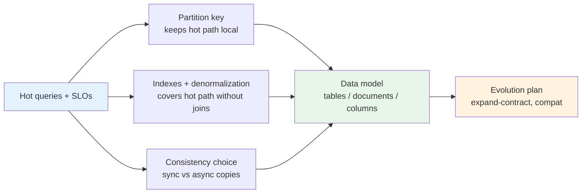
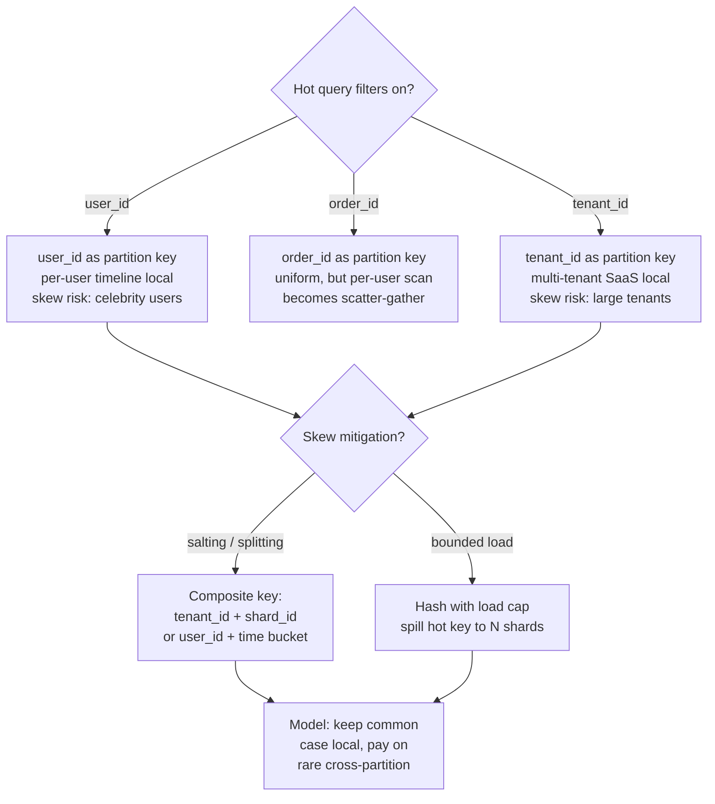
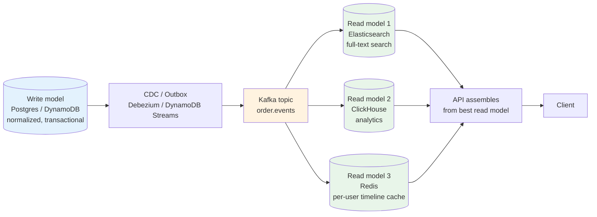
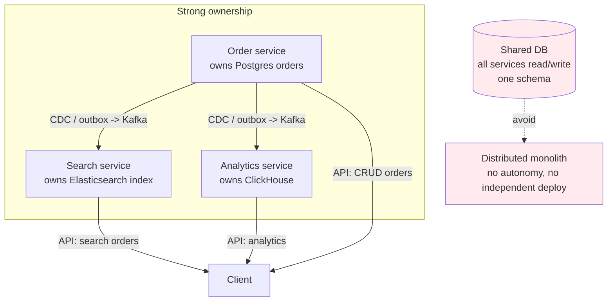
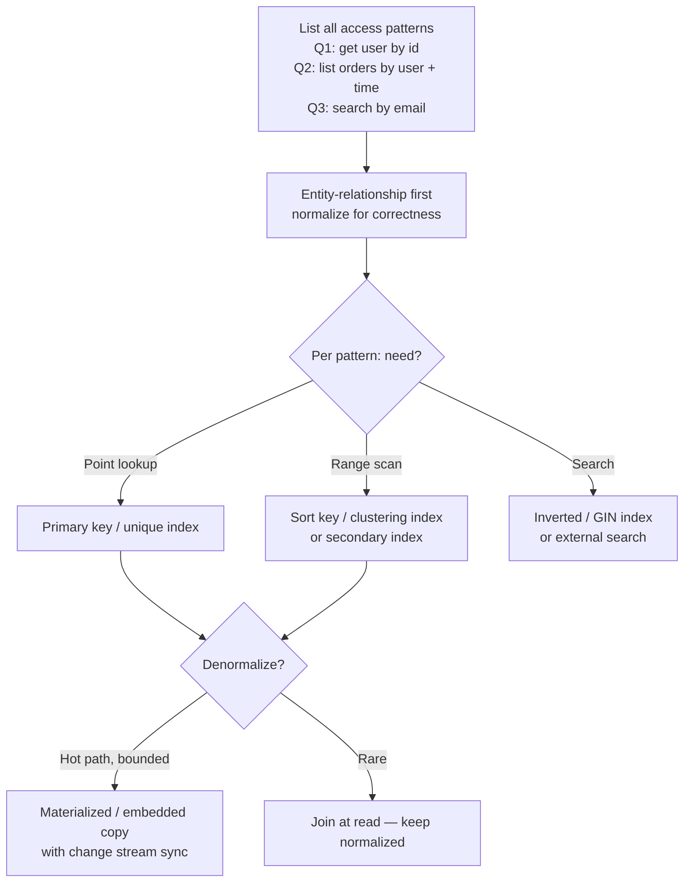
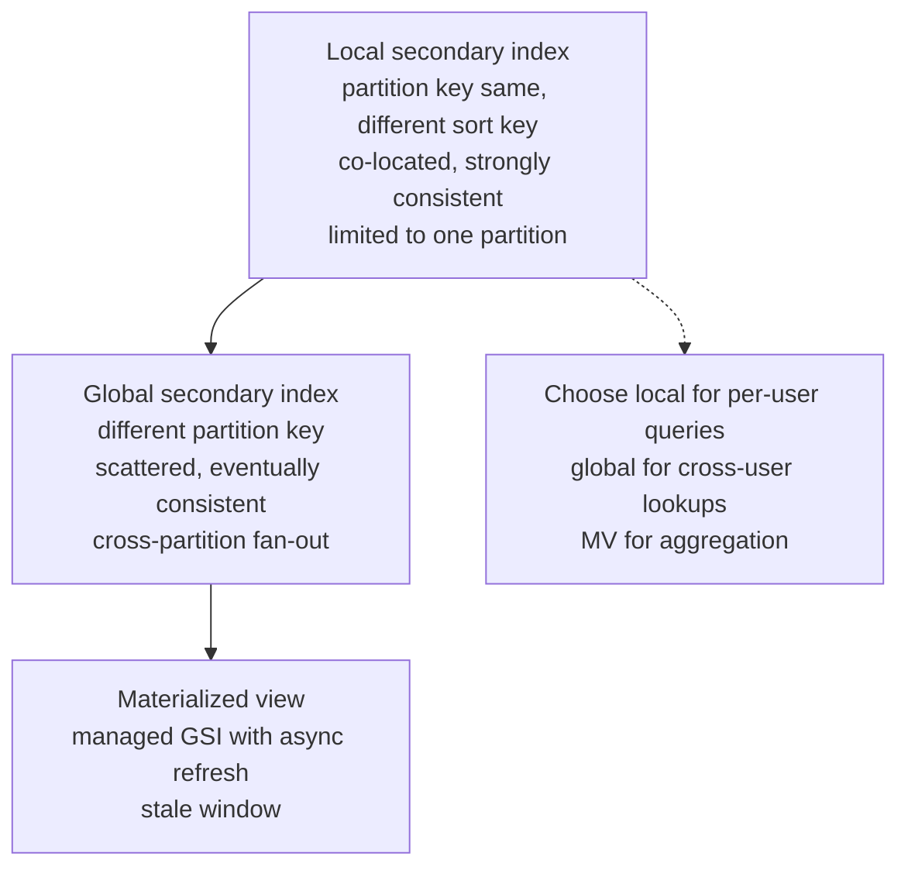
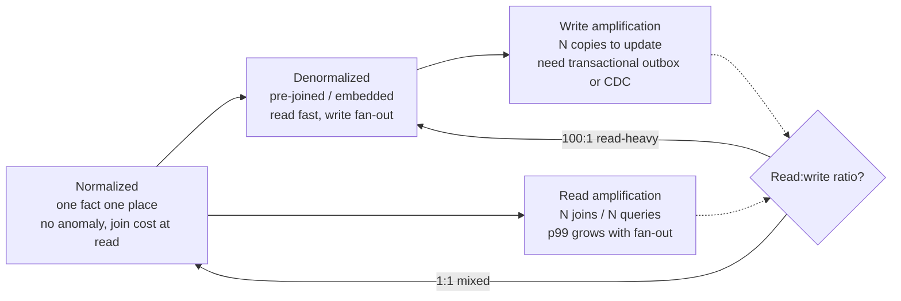

# Chapter 5 — Data Modeling for Scale

**What this chapter covers.** Chapter 2 asked how much data you have; Chapter 3 cached the hot working set; this chapter decides how that data is *shaped* — what the rows, documents, columns, and events look like, how they are partitioned and indexed, and how the shape evolves without breaking production. A model that is correct at 10 GB can become pathological at 10 TB: a missing partition key turns a point lookup into a scatter-gather, a chatty normalized schema turns one user request into twelve joins, and a schema change without compatibility discipline turns a rolling deploy into a deserialization outage. We build from first principles — entities, relationships, access patterns — through relational modeling for scale (normalization versus denormalization, indexing, partitioning), NoSQL families (document, wide-column, key-value, graph) and when each wins, time-series and search shapes, and the discipline of schema evolution (Avro/Protobuf compatibility, expand-contract, versioning). The second half is operational: secondary indexes, materialized views, CQRS read models, polyglot persistence, and the distributed-systems lens on why data modeling is where consistency, availability, and team autonomy actually collide.

Learning goals — after this chapter you should be able to:

- Derive a data model from access patterns (not just entities), and explain why "model the queries, not just the domain" is the scaling rule.
- Choose normalization versus denormalization per workload, and quantify the join versus duplication trade-off.
- Select a partition key that keeps the common case local, explain hot-partition failure modes, and design composite keys that avoid scatter-gather.
- Compare relational, document, wide-column, key-value, graph, and search/time-series models on write path, read path, and evolution cost, and pick the right family per service.
- Design indexes (primary, secondary, covering, LSM-friendly) and know when to replace an index with a materialized view or CQRS read model.
- Evolve schemas safely via Avro/Protobuf compatibility rules and the expand-contract (parallel change) pattern without flag-day migrations.
- Apply polyglot persistence without creating a distributed monolith — one service, one primary store, explicit ownership.

---

## Model the access patterns, not just the entities

Textbook ER modeling starts with entities and relationships. At scale the starting point is different: **what queries must be fast, at what QPS, with what latency SLO, and at what consistency**. The entity model follows; the query model leads. Two systems with identical entities (users, orders, messages) can have radically different models because their hot paths differ.

| Question | Why it drives the model |
|----------|------------------------|
| What is the p99 read path? | Determines partition key, covering indexes, denormalization |
| What is the write:read ratio? | Write-heavy favors LSM/append; read-heavy favors B-tree + cache |
| What is the consistency requirement? | Strong consistency keeps normalized joins viable; eventual allows denormalized copies |
| What is the cardinality and skew? | High-cardinality keys partition well; skewed keys need salting or bounded-load hashing |
| What is the evolution rate? | Fast-evolving domains need schemaless or schema-on-read; stable domains benefit from strict schemas |



*Figure 5-1: Access-pattern-driven modeling. The hot queries select the partition key and indexes; those choices select the store family and shape; the evolution plan protects the shape over time.*

> **Boundary note.** Storage-engine internals — B-tree versus LSM-tree, WAL, compaction, buffer pools, and physical partitioning mechanics — are in Vol 5 — Databases and Storage Systems. This chapter treats the *modeling* decision — what shape to store and how it maps to queries — and references those internals only as they constrain the model.

---

## Relational modeling for scale

### Normalization and when to violate it

Normalization (1NF–3NF/BCNF) eliminates redundancy and preserves invariants: one fact in one place, enforced by the database. At scale it has a cost — every join is a potential cross-partition hop, and every foreign key is a write-time check that limits partition independence.

| Normal form | What it guarantees | Cost at scale |
|-------------|-------------------|---------------|
| 1NF | Atomic values, no repeating groups | None — always do this |
| 2NF | No partial-key dependencies | Slight — composite keys matter |
| 3NF/BCNF | No transitive dependencies | Join cost; denormalization pressure |

**Rule of thumb:** normalize until the hot read path hurts, then denormalize deliberately — with a plan for keeping copies consistent (change data capture, outbox, or application-level dual write with verification; see Vol 10, Chapter 6).

Example — an orders service. Normalized:

```sql
-- orders_normalized.sql — PostgreSQL 16, 3NF
CREATE TABLE users (
  user_id    BIGINT PRIMARY KEY,
  email      TEXT NOT NULL UNIQUE,
  name       TEXT NOT NULL
);

CREATE TABLE orders (
  order_id   BIGINT PRIMARY KEY,
  user_id    BIGINT NOTORGANICNULL REFERENCES users(user_id),
  status     TEXT NOT NULL CHECK (status IN ('pending','paid','shipped','cancelled')),
  created_at TIMESTAMPTZ NOT NULL DEFAULT now(),
  -- partition by range on created_at for retention and locality
  CONSTRAINT orders_created_check CHECK (created_at >= '2024-01-01')
) PARTITION BY RANGE (created_at);

CREATE TABLE orders_2024_q1 PARTITION OF orders
  FOR VALUES FROM ('2024-01-01') TO ('2024-04-01');
CREATE TABLE orders_2024_q2 PARTITION OF orders
  FOR VALUES FROM ('2024-04-01') TO ('2024-07-01');

CREATE TABLE order_items (
  order_id   BIGINT NOT NULL REFERENCES orders(order_id),
  sku        TEXT NOT NULL,
  qty        INT NOT NULL CHECK (qty > 0),
  unit_price NUMERIC(10,2) NOT NULL,
  PRIMARY KEY (order_id, sku)
);
CREATE INDEX ON order_items (sku);  -- for "all orders containing sku X"

-- Hot path: "recent orders for user 42 with items" — requires two joins
-- At 20k QPS this join is the bottleneck
```

Denormalized for the hot path — pre-join into a read-optimized shape:

```sql
-- orders_denormalized.sql — same Postgres, read-optimized
CREATE TABLE user_orders_denorm (
  user_id    BIGINT NOT NULL,
  order_id   BIGINT NOT NULL,
  status     TEXT NOT NULL,
  created_at TIMESTAMPTZ NOT NULL,
  -- denormalized: embed items as JSONB to avoid second lookup
  items      JSONB NOT NULL,  -- [{"sku":"A123","qty":2,"unit_price":19.99}]
  total      NUMERIC(10,2) NOT NULL,
  PRIMARY KEY (user_id, created_at, order_id)
  -- partition key user_id keeps per-user timeline local; sort key created_at keeps range scans local
) PARTITION BY HASH (user_id);

-- Covering index for status-filtered timeline (avoids heap fetch)
CREATE INDEX ON user_orders_denorm (user_id, status, created_at DESC)
  INCLUDE (total) WHERE status IN ('pending','paid');

-- The write path now does: INSERT into orders + INSERT into user_orders_denorm
-- Keep them consistent via transactional outbox (Vol 10, Ch 6), not ad-hoc dual write
```

Trade-off made explicit: the denormalized table duplicates item data, costs more on write (two writes, CDC or outbox), but serves `GET /users/42/orders?status=paid` as a single partition-local range scan with no join — p99 8 ms versus 45 ms under load.

### Partition keys and hot partitions

The partition key is the single most consequential modeling decision. A good key has three properties: **high cardinality** (many distinct values), **uniform distribution** (no single key dominates), and **query locality** (the hot query filters on it).



*Figure 5-2: Partition key selection. The hot query's filter dictates the key; skew dictates the mitigation. A key that is perfect for one query is pessimal for another — that tension is why secondary indexes and CQRS exist.*

Hot-partition antipattern — `status` as a partition key with three values (`pending`, `paid`, `shipped`) — puts one-third of all data on one node and makes every write contend on the same partition. Cardinality matters.

### Indexing for the hot path

| Index type | When it wins | Cost |
|------------|-------------|------|
| **Primary (partition + sort key)** | Point lookup and range scan on the hot path | None — it *is* the table order |
| **Secondary (GSI/LSI)** | Alternate access pattern without duplicating the table | Extra storage, write amplification, eventual lag on GSI |
| **Covering (INCLUDE)** | Avoids heap/clustered-index lookup for known projections | Larger index, faster reads |
| **LSM-friendly (write-optimized)** | Write-heavy, range-scan-heavy on LSM stores | Compaction cost; bloom filter tuning |

```sql
-- covering_index.sql — PostgreSQL 16
-- Without covering: index scan + heap fetch per row (random I/O)
-- With covering: index-only scan (sequential in index order)
EXPLAIN (ANALYZE, BUFFERS)
SELECT order_id, total FROM user_orders_denorm
WHERE user_id = 42 AND status = 'paid' ORDER BY created_at DESC LIMIT 20;
-- Index Scan using user_orders_denorm_user_id_status_created_idx on user_orders_denorm
--   Index Cond: (user_id = 42 AND status = 'paid')
--   Buffers: shared hit=4  (index-only; no heap hits due to INCLUDE)

-- DynamoDB GSI — alternate access pattern without full table scan
# DynamoDB — orders table with GSI for "orders by sku"
# Primary: PK=user_id, SK=order_id#created_at  (per-user timeline)
# GSI1:    PK=sku, SK=created_at  (per-sku lookup — pay write amplification)
```

```yaml
# dynamodb-orders.yaml — DynamoDB (AWS, 2024) with GSI
AWSTemplateFormatVersion: '2010-09-09'
Resources:
  OrdersTable:
    Type: AWS::DynamoDB::Table
    Properties:
      TableName: orders
      BillingMode: PAY_PER_REQUEST
      AttributeDefinitions:
        - { AttributeName: user_id, AttributeType: S }
        - { AttributeName: sk, AttributeType: S }          # order_id#created_at
        - { AttributeName: sku, AttributeType: S }          # GSI PK
        - { AttributeName: created_at, AttributeType: S }  # GSI SK
      KeySchema:
        - { AttributeName: user_id, KeyType: HASH }
        - { AttributeName: sk, KeyType: RANGE }
      GlobalSecondaryIndexes:
        - IndexName: gsi1-sku-time
          KeySchema:
            - { AttributeName: sku, KeyType: HASH }
            - { AttributeName: created_at, KeyType: RANGE }
          Projection: { ProjectionType: INCLUDE, NonKeyAttributes: [total, status] }
      PointInTimeRecoverySpecification: { PointInTimeRecoveryEnabled: true }
      SSESpecification: { SSEEnabled: true }
```

GSI lag is a modeling consideration, not just an operational one — a GSI is eventually consistent (typically single-digit ms, occasionally seconds under burst). If the application requires read-after-write on the GSI path, it must read the primary or tolerate staleness.

---

## NoSQL families — choosing the shape

No single store handles all shapes well. The family determines the write path, the read path, and the evolution cost.

| Family | Shape | Write path | Read path | Evolution | When it wins |
|--------|-------|-----------|-----------|-----------|-------------|
| **Relational (Postgres, MySQL)** | Tables, rows, joins | B-tree or LSM, ACID | Joins, secondary indexes, window functions | Migrations (expand-contract) | Strong invariants, ad-hoc queries, transactions |
| **Document (MongoDB, DynamoDB)** | JSON/BSON per item | Per-document atomic | Key + secondary indexes, aggregation pipeline | Schemaless per document, app-enforced | Evolving schemas, per-entity locality |
| **Wide-column (Cassandra, ScyllaDB, Bigtable)** | Partition key + clustering columns, wide rows | LSM, append-only, tunable consistency | Partition-local range scans; no joins | Add columns cheaply; no renames | Write-heavy, time-series, partition-local scans |
| **Key-value (Redis, DynamoDB KV mode)** | Opaque value per key | In-memory or LSM | Point lookup only | Opaque — app owns shape | Cache, session, feature flags, counters |
| **Graph (Neo4j, Neptune)** | Nodes, edges, properties | Index on labels/edges | Traversals, path queries | Add labels/props cheaply | Highly connected queries (fraud, recommendations) |
| **Search (Elasticsearch, OpenSearch)** | Inverted index + stored fields | Segment merge (LSM-like) | Full-text, faceting, geo | Mapping evolution is painful | Full-text, log analytics |
| **Time-series (ClickHouse, TimescaleDB)** | Metrics + tags + timestamp | Columnar LSM, compression | Range + aggregation over time | Add columns/tags | Metrics, logs, IoT telemetry |

Wide-column example — the shape that makes Cassandra fast is also the shape that makes it inflexible:

```cql
-- cassandra-time-series.cql — Cassandra 4.1 / ScyllaDB 5.4 (CQL)
-- Model the query: "all readings for device 42 in the last hour, newest first"
CREATE TABLE device_readings (
  device_id  uuid,
  -- bucket by hour to bound partition size (avoid unbounded partitions)
  hour_bucket timestamp,          -- truncated to hour
  ts         timestamp,
  metric     text,
  value      double,
  tags       map<text,text>,
  PRIMARY KEY ((device_id, hour_bucket), ts, metric)
) WITH CLUSTERING ORDER BY (ts DESC, metric ASC)
  AND compaction = {'class': 'TimeWindowCompactionStrategy',
                    'compaction_window_unit': 'HOURS',
                    'compaction_window_size': '1'}
  AND gc_grace_seconds = 86400;

-- Point read: one partition, one range slice — fast (single replica set)
SELECT * FROM device_readings
WHERE device_id = ? AND hour_bucket = ? AND ts >= ? AND ts < ?;

-- Anti-pattern: WHERE metric = 'cpu' without device_id — scatter-gather across all partitions
-- Fix: denormalize into a second table partitioned by (metric, hour_bucket) if that query is hot
```

Document example — flexible but with its own discipline:

```javascript
// mongodb-orders.js — MongoDB 7.0 — document shape with schema discipline
// One document per order; items embedded (no join), user denormalized minimally
{
  _id: ObjectId("..."),
  orderId: "ord_9f3a1c",
  userId: "user_42",
  status: "paid",              // indexed
  createdAt: ISODate("2024-08-15T14:02:00Z"),  // indexed
  items: [                     // embedded — one fetch, no join
    { sku: "A123", qty: 2, unitPrice: 19.99 },
    { sku: "B456", qty: 1, unitPrice: 49.00 }
  ],
  total: 88.98,
  // schema version — application enforces evolution, not the database
  schemaVersion: 3
}
db.orders.createIndex({ userId: 1, createdAt: -1 });
db.orders.createIndex({ status: 1, createdAt: -1 });  // for operational queries

// Query: per-user timeline — covered by first index, no aggregation needed
db.orders.find({ userId: "user_42" }).sort({ createdAt: -1 }).limit(20);
```

The document trade-off: embedding avoids joins and keeps the hot path local, but unbounded arrays (e.g., embedding thousands of events per order) create large documents that are expensive to update (rewrite the whole document) and exceed the 16 MB limit. Rule: embed when the child is always fetched with the parent and is bounded; reference when it is large, shared, or independently queried.

---

## Time-series and search shapes

Time-series data is append-only, naturally partitioned by time, and queried by range + aggregation. Columnar stores (ClickHouse, DuckDB, Redshift) compress it 5–20× and scan it 10–100× faster than row stores for analytical queries, at the cost of expensive point updates.

Search data is write-once, read-many, and queried by relevance, not key. Inverted indexes (Lucene/Elasticsearch) tokenize, stem, and index every term — powerful for full-text, but mapping changes (e.g., changing a `text` field to `keyword`) require reindexing.

Both are typically *derived* stores — populated from the primary via CDC or a stream (Kafka → ClickHouse/Elasticsearch) — not primaries. The primary owns durability and transactions; the derived store owns query speed for a specific pattern. That separation is CQRS in practice.

---

## Secondary indexes, materialized views, and CQRS

A secondary index answers "the same data, different key" without duplicating application logic. A materialized view pre-joins or pre-aggregates for a specific query. CQRS generalizes both: separate read models, each optimized for one query, populated asynchronously from the write model.



*Figure 5-3: CQRS with CDC. The write model is normalized and transactional; each read model is denormalized for one hot query and lags the write model by milliseconds to seconds. The API picks the right read model per endpoint.*

The cost is **lag and divergence**. Each read model is eventually consistent with the write model; a user who writes and immediately reads via a different model may see stale data. Mitigations: read-after-write routing (read the primary for the writer's own data for N seconds), version vectors, or `read-your-writes` via a cache that the writer populates.

Materialized views inside the database (Postgres `MATERIALIZED VIEW`, Cassandra MV — the latter notoriously problematic in production) are simpler but couple the read model to the primary's availability and scaling. External read models scale independently at the cost of operational complexity.

---

## Schema evolution — compatibility as a contract

Every long-lived system changes its schema while old and new code run simultaneously (rolling deploys, consumers lagging producers). Compatibility is not optional — it is a deployment invariant.

### Avro and Protobuf compatibility rules

| Change | Avro | Protobuf (proto3) | Safe? |
|--------|------|-------------------|-------|
| Add optional field with default | Forward + backward | Add `optional` or with default | Yes — the compatible change |
| Remove optional field | Forward breaks if reader requires it | Reserved field number, never reuse | Conditional |
| Rename field | Breaks (name matters in Avro) | Safe (number matters, not name) | Avro no, Protobuf yes |
| Change type (int → string) | Breaks | Breaks (wire type changes) | No |
| Add required field without default | Breaks | Breaks | No |

```protobuf
// order.proto — Protobuf 3 (protoc 4.x), evolution-safe
syntax = "proto3";
package orders.v1;

message Order {
  string order_id = 1;
  string user_id = 2;
  // status as enum — adding values is safe; removing/renumbering is not
  enum Status {
    STATUS_UNSPECIFIED = 0;
    PENDING = 1;
    PAID = 2;
    SHIPPED = 3;
    CANCELLED = 4;
    // never reuse numbers; reserve removed values
    reserved 5 to 10;
  }
  Status status = 3;
  repeated Item items = 4;
  int64 created_at_ms = 5;  // epoch millis — adding is safe

  // Added in v1.1 — optional with presence tracking
  optional string coupon_code = 6;
  // Added in v1.2 — new message, old readers ignore it
  Discount discount = 7;

  message Item {
    string sku = 1;
    int32 qty = 2;
    // Prices as string or int64 cents — never float (precision)
    int64 unit_price_cents = 3;
  }
  message Discount {
    int64 amount_cents = 1;
    string reason = 2;
  }
}
```

```json
// Avro schema evolution — orders.avsc (Avro 1.11)
{
  "type": "record", "name": "Order", "namespace": "orders.v1",
  "fields": [
    {"name": "order_id", "type": "string"},
    {"name": "user_id", "type": "string"},
    {"name": "status", "type": {"type": "enum", "name": "Status",
      "symbols": ["PENDING","PAID","SHIPPED","CANCELLED"]}},
    {"name": "items", "type": {"type": "array", "items": {
      "type": "record", "name": "Item",
      "fields": [
        {"name": "sku", "type": "string"},
        {"name": "qty", "type": "int"},
        {"name": "unit_price_cents", "type": "long"}
      ]}}},
    {"name": "created_at_ms", "type": "long"},
    {"name": "coupon_code", "type": ["null","string"], "default": null},
    {"name": "discount", "type": ["null", {
      "type": "record", "name": "Discount",
      "fields": [
        {"name": "amount_cents", "type": "long"},
        {"name": "reason", "type": "string"}
      ]}], "default": null}
  ]
}
```

### Expand-contract (parallel change)

The only safe migration pattern for zero-downtime evolution. No flag day.

```
Phase 1 — Expand:  add new column/field, dual-write, backfill
  DB: ALTER TABLE orders ADD COLUMN coupon_code TEXT;  -- nullable, no default rewrite
  App: write both old and new; read old
  Backfill: UPDATE orders SET coupon_code = ... WHERE coupon_code IS NULL (batched, throttled)

Phase 2 — Migrate: switch reads to new
  App: read new, write both; verify parity (shadow read, compare)

Phase 3 — Contract: remove old
  App: stop writing old
  DB: ALTER TABLE orders DROP COLUMN old_coupon;  -- after no reader needs it
```

```sql
-- expand_contract.sql — PostgreSQL 16, zero-downtime column rename (really: add + backfill + drop)
-- Step 1: expand — add new column, nullable, no table rewrite (metadata-only in PG 11+)
ALTER TABLE orders ADD COLUMN coupon_code TEXT;

-- Step 2: backfill in batches (avoid long transactions that bloat WAL and hold locks)
-- Run from a job, not a single UPDATE
-- pseudocode for batched backfill (Python, psycopg 3.1):
-- while True:
--   n = cur.execute("UPDATE orders SET coupon_code = legacy_coupon "
--                   "WHERE order_id IN (SELECT order_id FROM orders "
--                   "WHERE coupon_code IS NULL LIMIT 1000) RETURNING 1").rowcount
--   conn.commit()
--   if n == 0: break
--   time.sleep(0.05)  -- throttle to avoid replica lag

-- Step 3: contract — after all readers use coupon_code, drop old
-- ALTER TABLE orders DROP COLUMN legacy_coupon;
```

For Protobuf/Avro over Kafka, the Schema Registry (Confluent 7.6, Apicurio 2.5) enforces compatibility at produce time — a producer cannot publish a schema that breaks the configured `BACKWARD` or `FORWARD` rule.

---

## Polyglot persistence without a distributed monolith

Polyglot persistence — using the right store per service — is correct and dangerous. Correct because no single store is optimal for transactions, search, analytics, and caching simultaneously. Dangerous because each additional store is an operational burden and a consistency boundary, and "each service picks its store" without ownership discipline becomes a distributed monolith where every service joins every other service's tables.

The discipline:

- **One service, one primary store** it owns and is the sole writer to. Other services read via API or async events, not direct DB access.
- **Derived stores are populated via CDC/stream**, not dual writes. Dual writes without a transaction (or outbox) lose data on partial failure.
- **Shared-nothing by default.** If two services *must* share a database (rare, e.g., legacy), they share nothing at the table level — separate schemas, no cross-service joins, no foreign keys across service boundaries — so the split can be completed later.



*Figure 5-4: Polyglot persistence with strong ownership. Each service owns its store; derived stores are populated via streams, not shared tables. The anti-pattern — a shared database with cross-service joins — couples deploy, scale, and failure.*

---

## Distributed-systems lens

Data modeling is where distributed-systems trade-offs become schema.

**Partitioning is a consistency boundary.** A transaction that touches one partition is local and fast; one that touches N partitions requires 2PC or Saga and is slow and failure-prone (Vol 6, Chapters 5–6; Vol 5, Chapter 10). Every cross-partition query you model in is a distributed transaction you will operate at 3 AM. The model should make the common case single-partition and make cross-partition explicit and rare.

**Denormalization is replication.** Two copies of the same fact (normalized row plus denormalized read model) must be kept consistent — which is the replication problem (Vol 6, Chapter 3) at the application layer. CDC/outbox gives at-least-once delivery; consumers must be idempotent. Without idempotency, a retried CDC event doubles a counter.

**Schema evolution is a rolling-deploy problem.** Old and new code coexist for minutes to hours. A schema change that is not forward- and backward-compatible turns a rolling deploy into a deserialization outage — new producers write a field old consumers cannot read, or old producers omit a field new consumers require. Compatibility rules are not bureaucratic — they are the contract that makes independent deploys safe (Vol 11, Chapter 9).

**Ownership is a failure-domain boundary.** A service that reads another service's tables directly inherits that service's availability, scaling, and migration constraints. When the owning service needs to re-partition, the reader breaks. API or event-based integration decouples fate at the cost of latency and staleness — a deliberate, per-endpoint trade-off.

---

## Key takeaways

- Model the hot queries first — their filters select the partition key, their projections select the indexes and denormalization, their consistency needs select the replication strategy. Entities alone do not determine the model.
- Normalize until the hot read path hurts, then denormalize deliberately with a CDC/outbox plan for keeping copies consistent. Every denormalized copy is a replication problem.
- The partition key must be high-cardinality, uniform, and query-local. Low-cardinality keys create hot partitions; keys that do not match the hot filter create scatter-gather. Mitigate skew with salting, time-bucketing, or bounded-load hashing.
- Pick the store family per service by write/read shape: relational for invariants and joins, document for evolving per-entity locality, wide-column for write-heavy partition-local scans, search for full-text, columnar for time-series analytics. Polyglot persistence is correct when each service owns one primary store.
- Secondary indexes, materialized views, and CQRS read models all answer "same data, different key" — each adds write amplification and lag. Design for the lag (read-after-write routing, staleness budgets) rather than pretending it does not exist.
- Evolve schemas via expand-contract with forward/backward compatibility (Avro/Protobuf rules, Schema Registry enforcement). No flag-day migrations; old and new code must coexist during rolling deploys.
- One service, one primary store, sole writer. Derived stores via CDC/stream, not dual writes or shared tables. Cross-service table access is a distributed monolith.








## Further reading

- Kleppmann, M. *Designing Data-Intensive Applications* (O'Reilly, 2017), Chapters 2–4, 6 — data models, encoding/evolution, partitioning, replication. https://dataintensive.net/
- Sadalage, P. and Fowler, M. *NoSQL Distilled* (Addison-Wesley, 2012) — concise family comparison and modeling guidance.
- Confluent Schema Registry — Avro/Protobuf/JSON Schema compatibility rules (Confluent Platform 7.6). https://docs.confluent.io/platform/current/schema-registry/fundamentals/schema-evolution.html
- Protobuf Language Specification — proto3, field numbers, reserved, compatibility (protoc 4.x). https://protobuf.dev/programming-guides/proto3/
- Fowler, M. \"Parallel Change\" (expand-contract) — the migration pattern. https://martinfowler.com/bliki/ParallelChange.html
- Kleppmann, M. et al. \"Turning the Database Inside Out with Apache Samza\" (2014) — CDC-driven CQRS and stream-table duality. https://samza.apache.org/learn/documentation/0.7.0/container/streams-and-tables.html
- DynamoDB Best Practices — partition keys, GSIs, adaptive capacity (AWS, 2024). https://docs.aws.amazon.com/amazondynamodb/latest/developerguide/bp-partition-key.html
- Cassandra Data Modeling — CQL, partition keys, clustering order, compaction strategies (Cassandra 4.1 / ScyllaDB 5.4). https://cassandra.apache.org/doc/latest/cassandra/data_modeling/

---
*Next: Chapter 6 — Monolith, Microservices, and Between — takes the data and traffic decisions from Chapters 4–5 and asks how to carve them into deployable, team-owned units without creating a distributed monolith that is worse than the monolith it replaced.*
