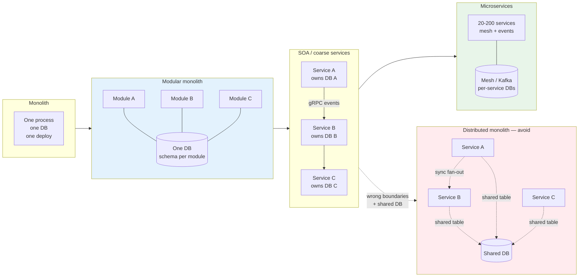
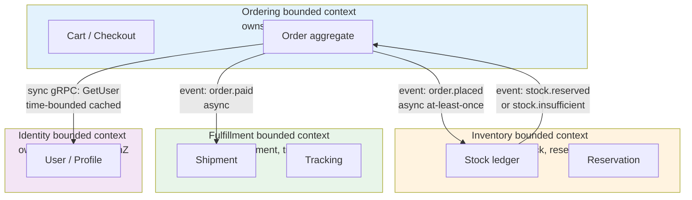
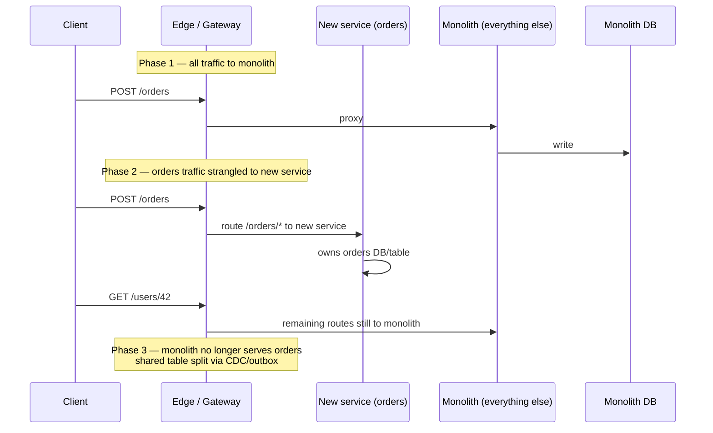
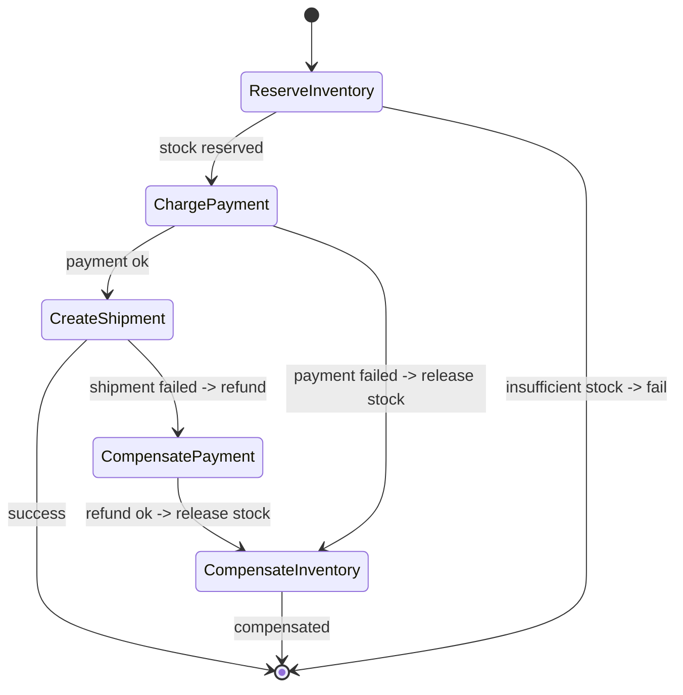
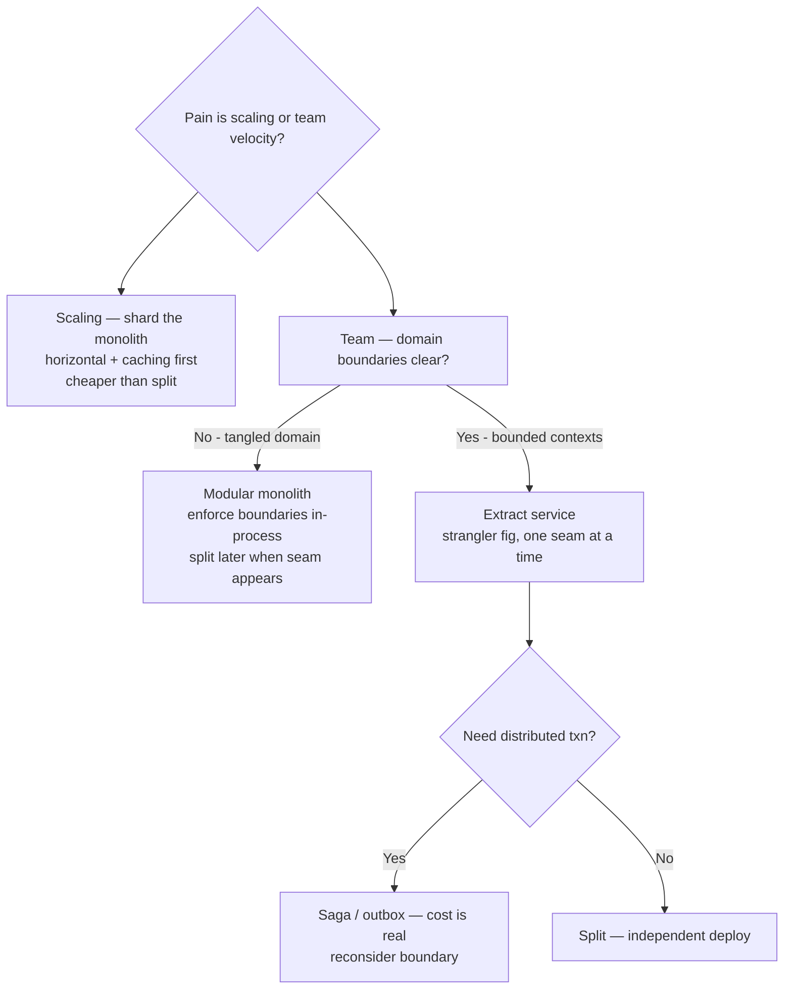
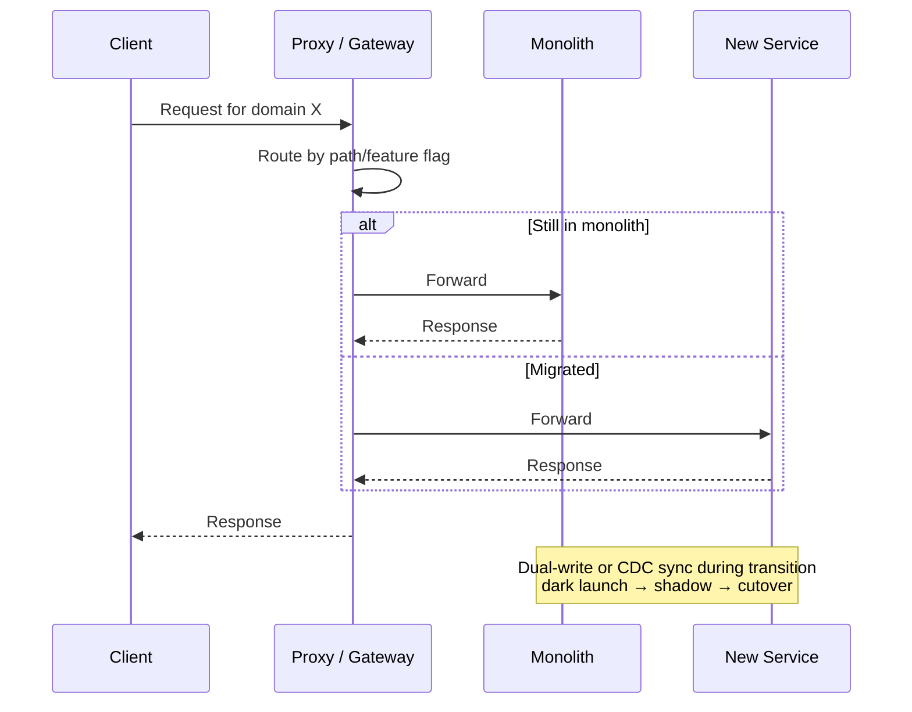
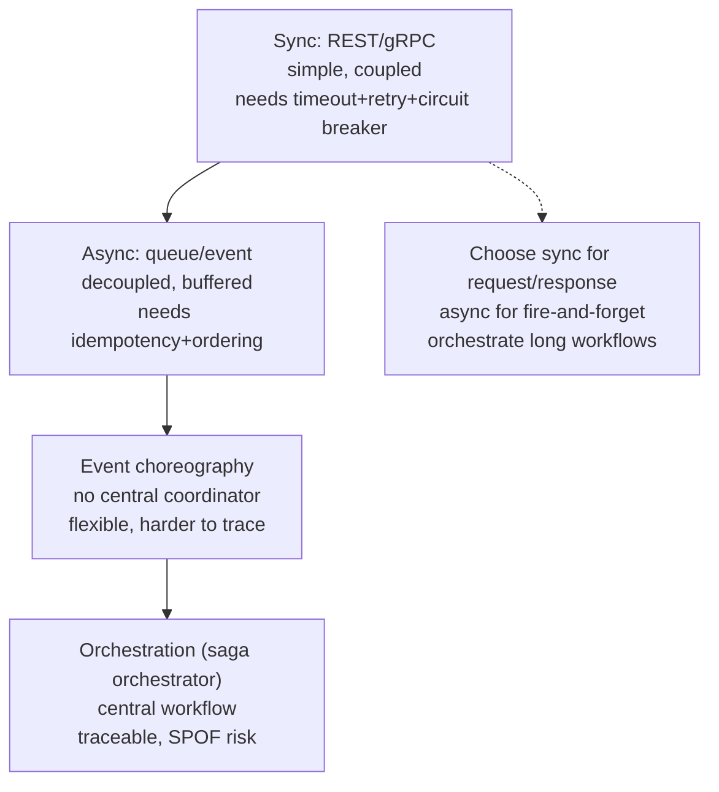

# Chapter 6 — Monolith, Microservices, and Between

**What this chapter covers.** Chapters 4 and 5 decided how traffic moves and how data is shaped; this chapter decides how those decisions are packaged into *deployable, team-owned units*. The monolith-versus-microservices debate is usually framed as a binary, which is why it produces bad decisions. In reality there is a spectrum — single-deployable monolith, modular monolith, service-oriented architecture, microservices, and the distributed monolith you get when you do microservices badly — and the right point on that spectrum is determined by team scale, domain boundaries, and operational maturity, not by fashion. We define each shape precisely, compare them on deploy, scale, failure, and team autonomy, then make the hard parts operational: how to carve boundaries (domain-driven design, bounded contexts), how to decompose without a big-bang rewrite (strangler fig, branch by abstraction, anti-corruption layer), how to own data per service (database per service, Saga versus 2PC), and how to observe and deploy a fleet of services (service mesh, contract testing, progressive delivery). The chapter closes with the distributed-systems lens on why the monolith is often the correct starting point and when it stops being so.

Learning goals — after this chapter you should be able to:

- Distinguish monolith, modular monolith, SOA, microservices, and distributed monolith on deploy, data, and team axes, and name the failure mode of each.
- Apply Conway's Law and bounded contexts to propose service boundaries from a domain model, and identify boundaries that will chatter.
- Plan a strangler-fig migration with branch-by-abstraction, anti-corruption layers, and expand-contract data splits — no big-bang rewrites.
- Choose per-service data ownership (database per service) and cross-service consistency (Saga/choreography/orchestration versus 2PC) per workflow, and explain the operational cost of each.
- Design inter-service communication — sync (gRPC/HTTP) versus async (events) — and apply idempotency, deadline propagation, and retry budgets at service boundaries.
- Operate a service fleet: service discovery, mesh (Envoy/Istio), contract testing, and progressive delivery with automated rollback.
- Argue when *not* to split — the organizational and operational preconditions for microservices and the cost of splitting too early.

---

## The spectrum, not the binary

"Monolith versus microservices" as a binary hides the most useful options in the middle. Five shapes matter; most real systems live in the middle two and aspire badly to the last.

| Shape | Deploy units | Data | Team coupling | Scales to | Characteristic failure |
|-------|-------------|------|---------------|-----------|----------------------|
| **Monolith** | 1 | 1 DB, shared schema | All teams on one repo/deploy | ~20–40 engineers, ~1k RPS per AZ | Merge conflicts, deploy queue, single failure domain |
| **Modular monolith** | 1 deploy, N modules with enforced boundaries | 1 DB, schema per module, no cross-module joins | Teams own modules, shared deploy | ~40–80 engineers | Boundary erosion without enforcement |
| **Service-oriented (SOA)** | ~5–20 services, coarse-grained | DB per service, sync calls | Teams own services, shared governance | ~80–200 engineers | Distributed monolith if boundaries are wrong |
| **Microservices** | 20–200+ services, fine-grained | DB per service, events + APIs | Teams own services + data + deploy, fully autonomous | 200+ engineers | Operational complexity, observability cost, eventual consistency everywhere |
| **Distributed monolith** | N services, tightly coupled | Shared DB or N DBs with distributed transactions | Teams cannot deploy independently | Any scale — but badly | Same coupling as monolith with added network latency and partial failure |

The distributed monolith is not a shape you choose — it is a shape you *get* when you split a monolith along the wrong boundaries, keep a shared database, or make every service synchronously call every other service on the hot path. It has the worst of both: the coupling of a monolith and the failure modes of a distributed system.



*Figure 6-1: The architecture spectrum and the cliff. Movement right increases team autonomy but also operational cost; the distributed monolith is the failure mode of moving right without fixing data ownership or boundaries.*

> **Boundary note.** Service communication wire mechanics (HTTP/2, gRPC streaming, REST semantics, versioning) are in Vol 8 — APIs and Service Design. Transactional outbox, CDC, and exactly-once stream processing are in Vol 10 — Messaging, Streaming, and Event Systems. This chapter treats the *packaging and ownership* decision; those volumes treat the *communication and consistency* mechanisms.

---

## When to split — and when not to

Conway's Law — "organizations design systems that mirror their communication structures" — is usually quoted as a warning; it is better used as a planning tool. If three teams constantly merge-conflict on one codebase and queue behind one deploy, the system *already* wants three deployables — the architecture is lagging the organization. If one team of six owns the whole product, splitting it into twelve services creates twelve deploys for one team — pure overhead.

| Signal | Interpretation |
|--------|----------------|
| Small team (< 20 engineers), few deploys/week, one domain | Stay monolith or modular monolith. Splitting adds latency, failure modes, and on-call load for no autonomy gain. |
| Merge queue > 1 day, deploy queue blocks hotfixes | Modular monolith first; extract the hottest contention point as a service if needed. |
| One component needs independent scaling (10× others) or independent failure domain (payments) | Extract that component — the scaling/failure boundary is a service boundary. |
| Multiple teams, independent roadmaps, need to deploy without coordinating | Services per bounded context — the team boundary is a service boundary. |
| Regulatory or blast-radius isolation (PII, payments) | Separate service + data store regardless of team size — the compliance boundary is a service boundary. |

Shopify, Stack Overflow, and Basecamp run monoliths or modular monoliths at very large scale — hundreds of engineers, millions of RPS — because their domains and teams allow it. Uber and Netflix run hundreds of microservices because their team scale and domain diversity require it. Both are correct *for their context*. The error is cargo-culting one into the other's context.

**Operational preconditions for microservices.** Do not split until you have, at minimum: automated deploys with progressive delivery and rollback (Vol 11, Chapter 9), distributed tracing and correlated logs (Vol 11, Chapters 3–4), service discovery and health checking (Chapter 4), and per-service runbooks and SLOs. Without these, each new service *decreases* availability.

---

## Finding boundaries — bounded contexts

Domain-driven design (DDD — Evans, 2003) gives the vocabulary: a **bounded context** is a domain boundary within which a single ubiquitous language and a single model are consistent. `Order` means one thing in the ordering context (a cart being built) and a different thing in the fulfillment context (a shipment to track) — that linguistic seam is a service seam.

Heuristics for boundaries that will *not* chatter:

- **Lifecycle cohesion** — entities created, updated, and deleted together belong together. Orders and order items share a lifecycle; orders and user profiles do not.
- **Invariant scope** — a constraint that must be transactional ("an order's total equals the sum of its items") must live inside one service. Constraints that can be eventual ("inventory eventually reflects orders") can span services.
- **Rate and scale mismatch** — a write-heavy ingest path and a read-heavy serving path want different stores and scaling policies — separate them even if the entities overlap.
- **Team ownership** — if two teams will own the data on either side of a boundary, make the boundary explicit and contractual (API + events), not a shared table.



*Figure 6-2: Bounded contexts for an e-commerce slice. Ordering, inventory, fulfillment, and identity each own their data and invariants; cross-context communication is via events (eventual) or bounded sync calls (with cache and timeout). The `Order` aggregate appears only in ordering — other contexts see projections.*

Boundaries that chatter — a service calling another in a tight loop per request — are a sign the boundary is wrong. If service A *always* calls service B to complete a request, they may be one service, or the data B owns should be replicated to A via CDC.

---

## Decomposing without a big bang

Big-bang rewrites fail at a rate approaching certainty. Three patterns make strangulation incremental and reversible.

### Strangler fig

Incrementally intercept traffic at the edge and route it to the new service, while the monolith continues to serve the rest. Over months, the monolith shrinks.



Edge routing for strangulation is a Gateway API or Envoy route — the same primitive as Chapter 4's traffic management:

```yaml
# strangler-gateway.yaml — Gateway API v1.1, strangling /orders/* to new service
apiVersion: gateway.networking.k8s.io/v1
kind: HTTPRoute
metadata: { name: orders-strangler, namespace: default }
spec:
  parentRefs: [{ name: edge }]
  hostnames: ["api.example.com"]
  rules:
    - matches: [{ path: { type: PathPrefix, value: /orders } }]
      backendRefs:
        - name: orders-service    # new service
          port: 80
          weight: 100
    - matches: [{ path: { type: PathPrefix, value: / } }]
      backendRefs:
        - name: monolith          # everything else still to monolith
          port: 80
          weight: 100
```

### Branch by abstraction

When the extraction requires changing call sites *inside* the monolith, introduce an abstraction (interface) over the old implementation, add the new implementation behind it, switch callers one by one, then remove the old.

```java
// BranchByAbstraction.java — Java 17, strangling a monolith module
interface OrderRepository {
    Order findById(String id);
    void save(Order order);
}

// Old: direct DB access inside monolith
class MonolithOrderRepository implements OrderRepository {
    public Order findById(String id) { return jdbc.query("SELECT ... WHERE id=?", id); }
    public void save(Order o) { jdbc.update("INSERT ...", o.fields()); }
}

// New: calls extracted service via gRPC (behind same interface)
class ServiceOrderRepository implements OrderRepository {
    private final OrderServiceGrpc.OrderServiceBlockingStub stub;
    public Order findById(String id) {
        return fromProto(stub.getOrder(GetOrderRequest.newBuilder().setId(id).build()));
    }
    public void save(Order o) {
        stub.createOrder(toProto(o));
    }
}

// Wiring — feature-flagged switch, per-request or per-instance
OrderRepository repo = featureFlags.enabled("orders-service-extraction", userId)
    ? new ServiceOrderRepository(stub)
    : new MonolithOrderRepository(jdbc);
```

### Anti-corruption layer (ACL)

When the new service's model differs from the monolith's (and it should — that is the point of a bounded context), an ACL translates between them so neither model is polluted by the other. The ACL lives in the new service or as a sidecar, not in the monolith.

```
Monolith model: Order { id, userId, legacyCoupon, totalCents, statusInt }
                         ↕ ACL translates
New model:      Order { orderId, userId, couponCode, total { amount, currency }, status enum }
```

### Data split — the hardest part

Code splits are reversible; data splits are not (easily). The safe sequence:

```
1. Monolith owns table orders (single DB)
2. Add new service with its own table orders_new (same DB, separate schema) — dual-write via outbox
3. Backfill orders_new from orders (batched, throttled)
4. Switch reads to new service (shadow read + compare)
5. Move orders_new to a separate database instance (logical split → physical split)
6. Stop dual-write; monolith table becomes read-only, then is dropped
```

Each step is independently deployable and reversible until step 6. The outbox (Vol 10, Chapter 6) is load-bearing — without it, a crash between the two writes loses data.

---

## Data per service and cross-service consistency

**Database per service** is the rule that makes services independently deployable and scalable. Shared databases reintroduce the coupling that services were meant to remove — a schema change in one service breaks another, and a slow query in one service contends with all.

Cross-service workflows then need a consistency strategy:

| Pattern | Consistency | Availability during partition | Complexity | When to use |
|---------|-------------|-------------------------------|------------|-------------|
| **2PC / XA** | Strong (atomic commit) | Blocks — coordinator is SPOF | High; rarely used in microservices | Only when strong cross-service atomicity is truly required (rare) |
| **Saga (orchestrated)** | Eventual, with compensations | Available — compensates on failure | Medium — orchestrator state machine | Multi-step workflows with clear compensations (order → payment → inventory) |
| **Saga (choreographed)** | Eventual, via events | Available — each service reacts | Low per service, high emergent complexity | Few participants, simple flows |
| **Outbox + CDC + idempotent consumers** | Eventual | Available | Low — the default for most flows | Any async cross-service side effect |

Saga example — orchestrated, with compensations:



```python
# saga_orchestrator.py — orchestrated saga (Python 3.11, durable via DB + outbox)
import uuid, json, psycopg

def place_order_saga(user_id: str, items: list[dict]) -> str:
    order_id = str(uuid.uuid4())
    saga_id = str(uuid.uuid4())
    # orchestrator persists state — crash-recoverable
    db.execute("INSERT INTO saga_state (saga_id, order_id, step, status) VALUES (%s,%s,'reserve', 'running')",
               (saga_id, order_id))
    try:
        inventory.reserve(order_id, items)          # step 1 — compensable
        db.execute("UPDATE saga_state SET step='charge' WHERE saga_id=%s", (saga_id,))
        payment.charge(user_id, order_id, items)    # step 2 — compensable (refund)
        db.execute("UPDATE saga_state SET step='ship' WHERE saga_id=%s", (saga_id,))
        fulfillment.create_shipment(order_id)         # step 3
        db.execute("UPDATE saga_state SET status='succeeded' WHERE saga_id=%s", (saga_id,))
        return order_id
    except InventoryError:
        db.execute("UPDATE saga_state SET status='failed_insufficient_stock' WHERE saga_id=%s", (saga_id,))
        raise
    except PaymentError:
        inventory.release(order_id)                   # compensate step 1
        db.execute("UPDATE saga_state SET status='compensated_payment_failed' WHERE saga_id=%s", (saga_id,))
        raise
    except FulfillmentError:
        payment.refund(order_id)                      # compensate step 2
        inventory.release(order_id)                   # compensate step 1
        db.execute("UPDATE saga_state SET status='compensated_fulfillment_failed' WHERE saga_id=%s", (saga_id,))
        raise
```

Choreographed sagas (each service listens for events and acts) are simpler per service but harder to reason about — there is no single place that shows the workflow, and debugging a stuck saga requires correlating logs across N services. Prefer orchestration when the workflow has more than three steps or needs visible state for operations.

---

## Communication — sync versus async at service boundaries

| Mode | Latency | Coupling | Failure handling | When |
|------|---------|----------|------------------|------|
| **Sync gRPC/HTTP** | Low (one RTT + handler) | Temporal + spatial | Timeout, retry budget, circuit breaker | Read path, user-waiting writes |
| **Async events (Kafka/SQS)** | Higher (enqueue + poll) | Decoupled | Retry, DLQ, idempotent consumer | Side effects, cross-context workflows, fan-out |

Both need the same three disciplines at every boundary:

**Idempotency.** Every handler must tolerate duplicate delivery — at-least-once is the only practical guarantee for queues and for retried RPCs. Key by business idempotency key (`order_id`, `Idempotency-Key` header), not by transport dedup.

```python
# idempotent_handler.py — Python 3.11, Postgres-backed dedup
def handle_order_placed(event: dict) -> None:
    key = event["order_id"]
    # INSERT ... ON CONFLICT DO NOTHING is the idempotency gate
    n = db.execute(
        "INSERT INTO processed_events (event_id, at) VALUES (%s, now()) ON CONFLICT DO NOTHING",
        (key,)
    ).rowcount
    if n == 0:
        return  # already processed — duplicate delivery, safe to ignore
    # ... actual work ...
    db.commit()
```

**Deadline propagation.** A user request with a 2 s SLO that fans out to three services cannot give each 2 s. Propagate remaining budget (gRPC `grpc-timeout`, or `x-request-timeout-ms` over HTTP) and enforce it server-side with `context.WithTimeout`.

**Retry budgets.** Never retry without a budget. Envoy/gRPC retry budgets (Chapter 4) apply at service boundaries too — retries that amplify failure into outage are the most common microservices failure mode.

---

## Operating the fleet

### Service discovery and mesh

In Kubernetes, discovery is DNS (`orders.default.svc.cluster.local`) plus EndpointSlices. A service mesh (Istio 1.22, Cilium Service Mesh, Linkerd 2.14) adds L7 policy — mTLS, retries, outlier detection, and traffic splitting — without per-service library changes, by injecting an Envoy sidecar or via eBPF.

```yaml
# istio-traffic.yaml — Istio 1.22: canary + outlier + mTLS (PeerAuthentication)
apiVersion: networking.istio.io/v1beta1
kind: VirtualService
metadata: { name: orders }
spec:
  hosts: [orders.default.svc.cluster.local]
  http:
    - match: [{ headers: { x-canary: { exact: "true" } } }]
      route: [{ destination: { host: orders.default.svc.cluster.local, subset: canary } }]
    - route:
        - destination: { host: orders.default.svc.cluster.local, subset: stable }
          weight: 90
        - destination: { host: orders.default.svc.cluster.local, subset: canary }
          weight: 10
      timeout: 2s
      retries: { attempts: 2, perTryTimeout: 1s, retryOn: "5xx,reset,connect-failure" }
---
apiVersion: networking.istio.io/v1beta1
kind: DestinationRule
metadata: { name: orders }
spec:
  host: orders.default.svc.cluster.local
  subsets:
    - name: stable
      labels: { version: stable }
    - name: canary
      labels: { version: canary }
  trafficPolicy:
    loadBalancer: { simple: LEAST_REQUEST }
    outlierDetection:
      consecutive5xxErrors: 5
      interval: 5s
      baseEjectionTime: 30s
      maxEjectionPercent: 50
    connectionPool:
      tcp: { maxConnections: 8192 }
      http: { http1MaxPendingRequests: 4096 }
    tls: { mode: ISTIO_MUTUAL }  # mTLS — identity via SPIFFE (Vol 9, Ch 10)
```

### Contract testing

In a fleet, a breaking change in one service breaks its consumers — often silently until production. Consumer-driven contract testing (Pact, Spring Cloud Contract) makes the contract explicit and verifiable in CI, without requiring integrated end-to-end environments per PR.

```
Consumer (orders) defines expectation: "GET /users/{id} returns {id, email, name}"
  → Pact file committed
Provider (users) verifies: "can I still satisfy this Pact?" in CI
  → break the contract → PR fails before merge
```

### Progressive delivery

Every service deploy is a partial outage if done as a rolling restart without draining (Chapter 4). Progressive delivery — canary or blue/green with automated analysis — limits blast radius:

```yaml
# rollout.yaml — Argo Rollouts 1.7 (Kubernetes, progressive delivery)
apiVersion: argoproj.io/v1alpha1
kind: Rollout
metadata: { name: orders }
spec:
  replicas: 10
  strategy:
    canary:
      steps:
        - setWeight: 10
        - pause: { duration: 5m }
        - analysis:
            templates: [{ templateName: success-rate }]
            args: [{ name: service, value: orders }]
        - setWeight: 50
        - pause: { duration: 10m }
        - analysis:
            templates: [{ templateName: success-rate }]
      trafficRouting:
        istio:
          virtualService: { name: orders }
          destinationRule: { name: orders, canarySubsetName: canary, stableSubsetName: stable }
  template:
    spec:
      terminationGracePeriodSeconds: 60
      containers:
        - name: orders
          image: registry.internal/orders:1.43.0
          ports: [{ containerPort: 8080 }]
          lifecycle:
            preStop: { exec: { command: ["/bin/sh","-c","sleep 5; /app/drain --grace 50s"] } }
          readinessProbe: { httpGet: { path: /readyz, port: 8080 }, periodSeconds: 5 }
---
apiVersion: argoproj.io/v1alpha1
kind: AnalysisTemplate
metadata: { name: success-rate }
spec:
  metrics:
    - name: success-rate
      successCondition: result[0] >= 0.995
      provider:
        prometheus:
          address: http://prometheus.monitoring:9090
          query: |
            sum(rate(http_requests_total{service="{{args.service}}",code=~"2.."}[2m]))
            /
            sum(rate(http_requests_total{service="{{args.service}}"[2m]))
```

If success rate drops below 99.5% during the canary, Argo Rollouts automatically rolls back — no human in the loop for the common case.

---

## Distributed-systems lens

Splitting a system changes its failure modes from local to distributed, which is a strict superset.

**Partial failure.** A monolith fails as a unit — up or down, easy to reason about. A fleet of services fails *partially* — orders is up but inventory is slow, so checkouts degrade but browsing works. Handling partial failure requires the patterns from Chapter 1, Principle 5 at every boundary: timeouts with budgets, retries with budgets, circuit breakers, bulkheads, and fallbacks. Without them, one slow service cascades via thread-pool exhaustion into a site-wide outage.

**Consistency scope.** A monolith's single database gives ACID transactions for free across the whole domain. A service fleet gives ACID only *within* one service; cross-service workflows are eventually consistent and require Sagas or outbox/CDC. The modeling decision (Chapter 5) determines how often cross-service transactions are needed — good boundaries minimize them, bad boundaries make every write a distributed transaction.

**Observability cost.** A request that touched one process and one database now touches five services, two queues, and three data stores. Without distributed tracing (trace ID propagated via `traceparent` / `x-request-id` at every hop) and correlated logs (Vol 11, Chapters 3–4), that request is undebuggable. The cost of observability in a service fleet is not optional tooling — it is a prerequisite for operating the system at all.

**Team autonomy versus coordination cost.** Services give teams independent deploys, but every service boundary is a contract that must be versioned, tested, and evolved (Vol 8). The coordination cost grows with the number of boundaries. A modular monolith with enforced module boundaries and a single deploy can give 80% of the autonomy with 20% of the operational cost — which is why it is the right answer for most teams under ~80 engineers.

---

## Key takeaways

- There is a spectrum — monolith, modular monolith, SOA, microservices, distributed monolith — not a binary. The distributed monolith (tightly coupled services with shared data or sync fan-out) is the failure mode to avoid, not a shape to choose.
- Split when team, scaling, or failure-domain boundaries demand it — not before. The preconditions are automated deploys, tracing, discovery, and per-service SLOs; without them, each new service reduces availability.
- Boundaries come from bounded contexts — lifecycle cohesion, invariant scope, and rate/scale mismatch. A boundary that chatters (tight sync loop per request) is the wrong boundary; replicate data via CDC instead.
- Decompose incrementally: strangler fig at the edge, branch by abstraction inside the monolith, anti-corruption layers between models, and expand-contract for data splits. No big-bang rewrites; each step independently reversible until the final contract.
- One service, one primary store, sole writer. Cross-service workflows use orchestrated Sagas with compensations or outbox/CDC with idempotent consumers — not 2PC, not shared tables.
- At every service boundary enforce idempotency, deadline propagation, and retry budgets. Retries without budgets turn partial failure into cascading failure.
- Operate the fleet with a mesh (mTLS, outlier detection, traffic splitting), contract testing (Pact), and progressive delivery (Argo Rollouts with automated analysis). A deploy without draining and canary analysis is a partial outage.
- The monolith is often the correct starting point. A modular monolith with enforced boundaries is the pragmatic default for most teams; services are extracted when a boundary earns its operational cost.








## Further reading

- Evans, E. *Domain-Driven Design* (Addison-Wesley, 2003), Chapters 1–3, 14 — bounded contexts, ubiquitous language, anti-corruption layers.
- Newman, S. *Monolith to Microservices* 2nd ed. (O'Reilly, 2024) — strangler fig, branch by abstraction, data splits, with worked examples.
- Fowler, M. \"Strangler Fig Application\" and \"Branch by Abstraction\" — the incremental decomposition patterns. https://martinfowler.com/bliki/StranglerFigApplication.html and https://martinfowler.com/bliki/BranchByAbstraction.html
- Richardson, C. *Microservices Patterns* (Manning, 2018), Chapters 4–6, 9 — Saga, outbox, CDC, and service discovery patterns.
- Istio documentation — VirtualService, DestinationRule, PeerAuthentication, mTLS (Istio 1.22). https://istio.io/latest/docs/
- Argo Rollouts — progressive delivery with analysis templates (Argo Rollouts 1.7). https://argoproj.github.io/argo-rollouts/
- Pact — consumer-driven contract testing. https://docs.pact.io/
- Vol 8 — APIs and Service Design and Vol 10 — Messaging, Streaming, and Event Systems — companion volumes for contract and event mechanics referenced here.

---
*Next: Chapter 7 — Event-Driven Architecture — takes the async side of Chapter 6's communication and makes it the primary design paradigm: when to model the system as events and streams rather than requests and responses, and how to do it without losing ordering, exactly-once, or sanity.*
