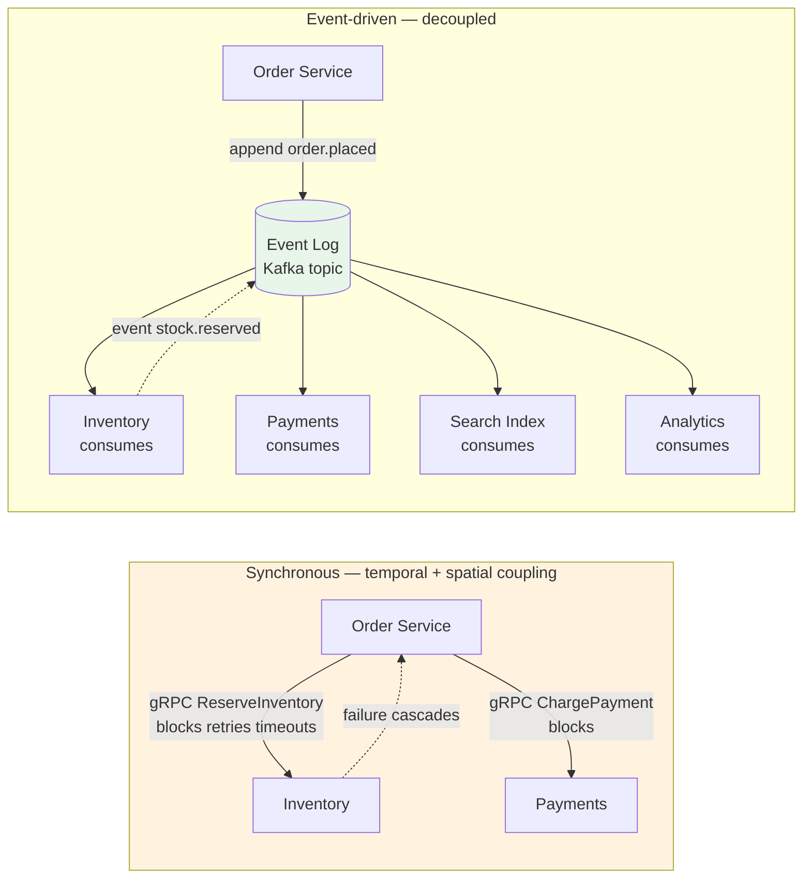
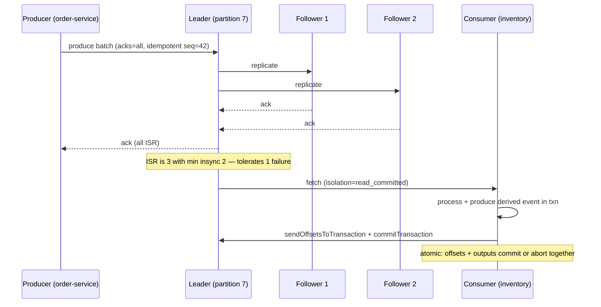
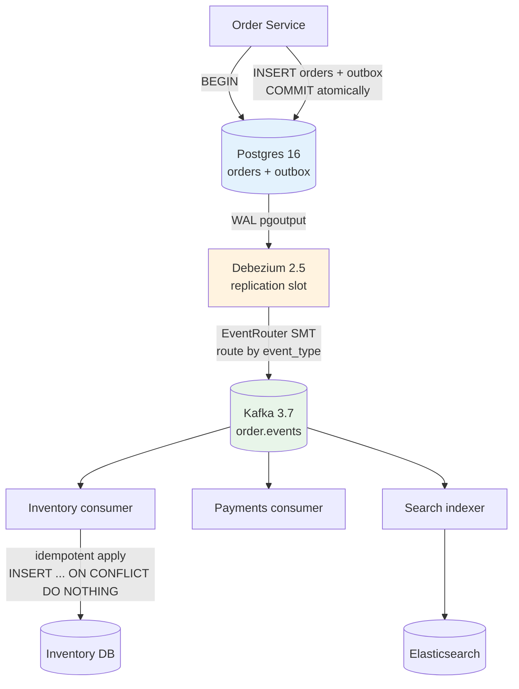
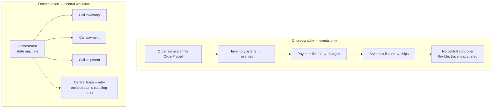
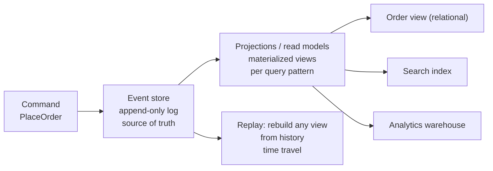

# Chapter 7 — Event-Driven Architecture

**What this chapter covers.** Chapters 4–6 separated how traffic moves and how data is owned; this chapter replaces synchronous call chains with *events* as the connective tissue. Event-driven architecture (EDA) promises decoupling in time, space, and version — producers do not know who consumes, consumers do not need producers to be alive, and both can evolve independently — but it trades that flexibility for a harder consistency model, operational complexity in ordering and delivery, and a new category of failure modes where "it was delivered" does not mean "it was processed correctly." We define the vocabulary precisely (event vs. command vs. message, queue vs. log vs. pub/sub), show when events beat synchronous RPC and when they do not, then make EDA operational: Apache Kafka 3.7 topic and producer configuration with replication and exactly-once semantics, Change Data Capture with Debezium 2.5 and the transactional outbox pattern that solves the dual-write problem, choreography versus orchestration (Saga) for cross-service workflows, event schema evolution with Avro and Confluent Schema Registry 7.6, and the non-negotiables for production events — idempotency, partitioning for ordering, dead-letter handling, and observability with trace propagation through events. The chapter closes with the distributed-systems lens on why events are the right default for state propagation but the wrong default for request-response.

Learning goals — after this chapter you should be able to:

- Distinguish events, commands, and domain events, and decide per interaction whether synchronous RPC, asynchronous events, or a hybrid is appropriate.
- Compare queues, logs, and pub/sub on durability, ordering, fan-out, and replay, and select the right primitive for a given workflow.
- Configure a production Kafka topic and producer (replication factor, `acks`, `enable.idempotence`, `transactional.id`) and explain what each setting guarantees after a broker or producer crash.
- Implement Change Data Capture with Debezium and the transactional outbox pattern to eliminate dual writes, with real configuration and failure analysis.
- Choose between choreography and orchestration (Saga) for multi-service workflows, name the failure mode of each, and design compensation and observability for both.
- Design event schemas for evolution (Avro + Schema Registry compatibility modes) and enforce idempotent, ordered consumption with partition keys and consumer group semantics.
- Reason about the distributed-systems trade-offs of EDA: eventual consistency windows, ordering vs. availability, replay as a recovery tool and a hazard, and when to keep a synchronous path.

---

## Events are facts, commands are requests

The most common misuse of "event-driven" is to emit events that are actually commands with a different name. The distinction matters because it determines who owns the decision and what coupling remains.

| Concept | Meaning | Who decides | Example | Coupling |
|---------|---------|-------------|---------|----------|
| **Event** | A fact about something that *has happened*, immutable | Producer (source of truth) | `order.placed {order_id, user_id, total, placed_at}` | Producer knows nothing about consumers |
| **Command** | A request for something *to happen*, may be rejected | Consumer (recipient validates) | `ReserveInventory {sku, qty, order_id}` | Sender expects a specific handler and a result |
| **Domain event** | An event with business meaning inside a bounded context (DDD) | Owning aggregate | `payment.authorized`, `shipment.dispatched` | Ubiquitous language boundary — see Chapter 6 |
| **Message** | Generic envelope — may carry event or command | Depends on payload | Any pub/sub payload | Transport concept, not a domain concept |

An event is a *notification* — "this happened." A command is an *instruction* — "please do this." Conflating them creates hidden coupling: if `OrderService` emits `SendEmail {to, template}` it is commanding the email service through an event bus, and the ordering service now breaks when the email service changes its contract. The correct event is `order.placed`; the email service decides independently to react to it.

Three dimensions of decoupling explain why teams adopt EDA:

- **Temporal decoupling** — producer and consumer need not be alive at the same time. A `user.created` event written to a log at 02:00 is consumed at 02:15 after the consumer deploys.
- **Spatial decoupling** — producers address a *topic*, not a host. Adding a new consumer (fraud detection, analytics, search index) requires zero changes to the producer.
- **Version decoupling** — with schema evolution rules, producers can add optional fields without breaking consumers — if the contract discipline holds.

The cost is that the system becomes *eventually consistent* by construction. After `order.placed` is emitted, inventory, payments, recommendations, and the read model each converge at different times. Clients must be taught that "order placed" does not mean "order ready" — a UX and API contract change, not just an infrastructure change.



*Figure 7-1: Synchronous fan-out couples availability and latency across services; event-driven fan-out decouples them but introduces eventual consistency and consumer autonomy.*

> **Boundary note.** This chapter treats EDA as a *system-design pattern* — when to use events, how to scope them to service boundaries, and how to choose choreography vs. orchestration. The *mechanisms* underneath — queue vs. log internals, delivery semantics (at-most/at-least/exactly-once), Kafka broker architecture, stream processing, the outbox pattern in depth, and backpressure — are the subject of Volume 10 — Messaging, Streaming, and Event Systems. Consistency models that constrain what events can guarantee are in Volume 6. Wire-level reliability primitives (timeouts, retries, hedging) are in Volume 3, Chapter 11.

---

## Building blocks: queues, logs, and pub/sub

Three primitives are routinely conflated under "message queue." They differ on the questions that matter at scale.

| Primitive | Durability | Ordering | Fan-out | Replay | Competing consumers | Representative |
|-----------|-----------|----------|---------|--------|---------------------|---------------|
| **Queue (point-to-point)** | Durable until ack | Per-queue FIFO (usually) | One consumer gets each message | No (deleted on ack) | Yes — work queue | SQS Standard/FIFO, RabbitMQ queue, ActiveMQ |
| **Log (partitioned, append-only)** | Durable, retained by time/size | Per-partition total order | Each consumer group gets every message | Yes — rewind offset | Yes — within a group, partitions assigned | Kafka, Redpanda, Pulsar (partitioned), Kinesis |
| **Pub/sub topic (broadcast)** | Broker-dependent; often ephemeral | Best-effort or per-publisher | Every subscriber gets every message | Usually no | Depends — push vs pull | SNS, Redis Pub/Sub, NATS core, Google Pub/Sub |

The decision tree:

- Need **work distribution** where exactly one worker handles each task (send email, resize image)? Use a **queue** with competing consumers and visibility timeouts.
- Need **state propagation** where multiple services react to the same fact and must be able to re-process after a deploy or bug (order placed → inventory, payments, search, analytics)? Use a **log** with retention and replay.
- Need **ephemeral broadcast** with minimal operational overhead and no replay (cache invalidation ping, presence)? Use **pub/sub**.

Most backend systems that claim to be "event-driven" actually need a **log** but adopt a queue — and then rebuild replay, ordering, and fan-out poorly on top. If more than one consumer needs the same message, or if you will ever want to re-process history, start with a log.

### The envelope matters

Every event should carry metadata that makes it operable without parsing the payload:

```json
{
  "event_id": "evt_01HQ8X2K3F9A2B7C6D5E4F3G2H",
  "event_type": "order.placed",
  "event_version": "1.2",
  "occurred_at": "2026-08-20T14:32:11.142Z",
  "producer": "order-service",
  "partition_key": "order_9f3a2b1c",
  "correlation_id": "req_7e1d4c8a",
  "traceparent": "00-4bf92f3577b34da6a3ce929d0e0e4736-00f067aa0ba902b7-01",
  "payload": {
    "order_id": "ord_9f3a2b1c",
    "user_id": "usr_42",
    "total_cents": 4999,
    "currency": "USD",
    "items": [{"sku": "sku_123", "qty": 2}]
  }
}
```

`event_id` enables idempotent deduplication. `partition_key` pins ordering. `correlation_id` and `traceparent` (W3C Trace Context) stitch distributed traces across async hops — without them, an event bus is an observability black hole.

---

## Kafka as the event log — configuration that matters

Apache Kafka 3.7 is the de facto log for event-driven systems at scale. Understanding its replication and producer semantics is non-optional; misconfiguring them is how teams lose events while believing they are durable.

### Topic and broker layout

A topic is partitioned; each partition is replicated across `replication.factor` brokers. One replica is the leader; followers replicate via the ISR (in-sync replica) set. Only ISR members are eligible to become leader without data loss when `unclean.leader.election.enable=false` (which it must be).

```yaml
# kafka-topics.sh — production topic creation (Kafka 3.7, KRaft mode)
# Run against a KRaft cluster (no ZooKeeper since 3.3+)
bin/kafka-topics.sh --create \
  --topic order.events \
  --partitions 24 \
  --replication-factor 3 \
  --config min.insync.replicas=2 \
  --config retention.ms=604800000 \
  --config retention.bytes=107374182400 \
  --config max.message.bytes=1048576 \
  --config compression.type=lz4 \
  --config cleanup.policy=delete \
  --bootstrap-server kafka-1:9092,kafka-2:9092,kafka-3:9092

# Compacted topic for changelog / KTable source (retains latest key)
bin/kafka-topics.sh --create \
  --topic user.profile \
  --partitions 12 \
  --replication-factor 3 \
  --config cleanup.policy=compact \
  --config min.insync.replicas=2 \
  --config segment.ms=600000 \
  --bootstrap-server kafka-1:9092,kafka-2:9092,kafka-3:9092
```

Key choices:

- **Partitions = parallelism ceiling.** A consumer group can have at most one active consumer per partition. 24 partitions → at most 24 consumers in the group scale out. Pick enough for peak throughput but not so many that rebalances become expensive (hundreds is fine; thousands needs tuning).
- **`min.insync.replicas=2` with `replication.factor=3`** tolerates one replica down while still accepting writes. With `min.insync.replicas=1`, a single remaining replica could ack and then be lost.
- **`retention.ms=7 days`** is the replay window. For audit or reprocessing, 7–30 days is typical; for compacted changelogs, retention is "forever latest value."

### Producer guarantees — the three settings that determine durability

```properties
# producer.properties — safe producer (Kafka clients 3.7.x)
bootstrap.servers=kafka-1:9092,kafka-2:9092,kafka-3:9092
acks=all
enable.idempotence=true
max.in.flight.requests.per.connection=5
retries=2147483647
delivery.timeout.ms=120000
request.timeout.ms=30000
linger.ms=10
batch.size=65536
compression.type=lz4
transactional.id=order-service-tx-01
# For exactly-once across consume-transform-produce (read-process-write):
# use initTransactions() + begin/commitTransaction around the loop
```

What each does on the failure path:

- **`acks=all`** — leader waits for all ISR replicas to ack before responding. Without this, `acks=1` or `acks=0` can ack before replication — a leader crash loses the message silently. Latency cost is one network RTT to followers (~1–3 ms intra-AZ); the durability cost of not paying it is data loss.
- **`enable.idempotence=true`** — producer gets a PID and sequence numbers; the broker deduplicates retries. Without it, a retried `send()` after a timeout can duplicate the event. Requires `acks=all`, `retries>0`, and `max.in.flight ≤ 5`.
- **`transactional.id`** — enables the transactional API for atomic multi-partition writes and consume-transform-produce (the building block for exactly-once stream processing). Transactions add a transaction coordinator and require `isolation.level=read_committed` on consumers to avoid reading aborted messages.

```java
// Exactly-once consume-transform-produce (Kafka 3.7, Java client)
// OrderService consumes order.placed, emits stock.reserve commands atomically
Properties props = new Properties();
props.put(ProducerConfig.TRANSACTIONAL_ID_CONFIG, "order-service-tx-01");
props.put(ProducerConfig.ENABLE_IDEMPOTENCE_CONFIG, "true");
props.put(ProducerConfig.ACKS_CONFIG, "all");
KafkaProducer<String, byte[]> producer = new KafkaProducer<>(props);
producer.initTransactions();

KafkaConsumer<String, byte[]> consumer = new KafkaConsumer<>(consumerProps);
consumer.subscribe(List.of("order.events"));

while (true) {
    ConsumerRecords<String, byte[]> records = consumer.poll(Duration.ofMillis(500));
    if (records.isEmpty()) continue;
    producer.beginTransaction();
    for (ConsumerRecord<String, byte[]> r : records) {
        // transform: produce derived events
        ProducerRecord<String, byte[]> out =
            new ProducerRecord<>("inventory.commands", r.key(), buildReserve(r));
        producer.send(out);
    }
    // atomically commit consumed offsets with produced records
    producer.sendOffsetsToTransaction(
        Map.of(new TopicPartition("order.events", 0),
               new OffsetAndMetadata(consumer.position(new TopicPartition("order.events", 0)))),
        consumer.groupMetadata());
    producer.commitTransaction();
}
```

Consumer isolation:

```properties
# consumer.properties
bootstrap.servers=kafka-1:9092,kafka-2:9092,kafka-3:9092
group.id=inventory-service
isolation.level=read_committed
enable.auto.commit=false
auto.offset.reset=earliest
max.poll.interval.ms=300000
session.timeout.ms=10000
```

`read_committed` hides aborted transactional messages. `enable.auto.commit=false` with manual `commitSync()` (or transactional commit as above) prevents committing an offset before processing succeeded — otherwise a crash after commit but before processing loses the event.



*Figure 7-2: Kafka replication and transactional consume-transform-produce. The `acks=all` + idempotence + transaction trio is the only path to no-loss, no-duplicate semantics without application-level deduplication.*

---

## Change Data Capture and the outbox — eliminating dual writes

The most common source of lost events in production is not Kafka — it is the **dual write**: `UPDATE orders SET status='placed'` and `producer.send(orderPlaced)` as two separate operations with no atomicity. If the DB commits but the send fails (process crash between the two), the event is lost. If the send succeeds but the DB rolls back, a phantom event is emitted. Retrying naively doubles one side.

### The transactional outbox

Write the event to an `outbox` table *in the same DB transaction* as the business update. A relay publishes outbox rows to Kafka, then marks them sent. The DB transaction is the atomic boundary; at-least-once delivery to Kafka follows.

```sql
-- Postgres 16 — outbox table co-located with business tables
CREATE TABLE outbox (
    id              UUID PRIMARY KEY DEFAULT gen_random_uuid(),
    aggregate_type  TEXT NOT NULL,          -- 'order'
    aggregate_id    TEXT NOT NULL,          -- 'ord_9f3a2b1c'
    event_type      TEXT NOT NULL,          -- 'order.placed'
    event_version   TEXT NOT NULL DEFAULT '1.0',
    payload         JSONB NOT NULL,
    headers         JSONB NOT NULL DEFAULT '{}',
    created_at      TIMESTAMPTZ NOT NULL DEFAULT now(),
    published_at    TIMESTAMPTZ,
    -- idempotency: one row per business fact (unique on aggregate + event)
    UNIQUE (aggregate_type, aggregate_id, event_type, event_version)
);
CREATE INDEX outbox_unpublished_idx ON outbox (created_at) WHERE published_at IS NULL;

-- Business transaction — single atomic commit
BEGIN;
  INSERT INTO orders (id, user_id, total_cents, status) VALUES ('ord_9f3a2b1c', 'usr_42', 4999, 'placed');
  INSERT INTO outbox (aggregate_type, aggregate_id, event_type, payload, headers)
  VALUES ('order', 'ord_9f3a2b1c', 'order.placed',
          '{"order_id":"ord_9f3a2b1c","user_id":"usr_42","total_cents":4999}',
          '{"traceparent":"00-4bf92f3577b34da6a3ce929d0e0e4736-00f067aa0ba902b7-01"}');
COMMIT;
```

Relay options, in order of preference:

1. **Debezium CDC (log-based)** — tails the Postgres WAL / MySQL binlog; no polling, no extra write path, survives relay restarts. Correct choice at scale.
2. **Polling publisher** — `SELECT ... WHERE published_at IS NULL FOR UPDATE SKIP LOCKED` in a loop. Simple, but adds read load and has a polling delay. Acceptable for low throughput.
3. **Triggers / logical decoding plugins** — avoid; operational burden and version coupling.

### Debezium 2.5 with Postgres 16 — outbox relay

```yaml
# debezium-connector-outbox.json — Kafka Connect REST (Debezium 2.5, Kafka 3.7)
{
  "name": "orders-outbox-connector",
  "config": {
    "connector.class": "io.debezium.connector.postgresql.PostgresConnector",
    "database.hostname": "pg-primary.internal",
    "database.port": "5432",
    "database.user": "debezium",
    "database.password": "${file:/secrets/pg.properties:password}",
    "database.dbname": "orders",
    "topic.prefix": "orders",
    "table.include.list": "public.outbox",
    "plugin.name": "pgoutput",
    "slot.name": "debezium_orders_outbox",
    "publication.name": "debezium_pub",
    "tombstones.on.delete": "false",
    "transforms": "outbox",
    "transforms.outbox.type": "io.debezium.transforms.outbox.EventRouter",
    "transforms.outbox.table.field.event.id": "id",
    "transforms.outbox.table.field.event.key": "aggregate_id",
    "transforms.outbox.table.field.event.payload": "payload",
    "transforms.outbox.table.fields.additional.placement": "headers:header:traceparent",
    "transforms.outbox.route.by.field": "event_type",
    "transforms.outbox.route.topic.replacement": "order.events",
    "key.converter": "org.apache.kafka.connect.storage.StringConverter",
    "value.converter": "io.confluent.connect.avro.AvroConverter",
    "value.converter.schema.registry.url": "http://schema-registry:8081",
    "snapshot.mode": "initial",
    "snapshot.locking.mode": "none"
  }
}
```

```yaml
# Alternative: Debezium Server (standalone, no Kafka Connect) — debezium-server.properties
debezium.source.connector.class=io.debezium.connector.postgresql.PostgresConnector
debezium.source.database.hostname=pg-primary.internal
debezium.source.plugin.name=pgoutput
debezium.source.topic.prefix=orders
debezium.source.table.include.list=public.outbox
debezium.sink.type=kafka
debezium.sink.kafka.producer.bootstrap.servers=kafka-1:9092,kafka-2:9092
debezium.sink.kafka.producer.acks=all
debezium.transforms=outbox
debezium.transforms.outbox.type=io.debezium.transforms.outbox.EventRouter
```

Operational notes:

- **WAL retention** — Debezium holds a replication slot; if the connector is down, WAL accumulates on the primary. Monitor `pg_replication_slots.active` and `pg_wal_lsn_diff`; alert if lag exceeds retention.
- **Exactly-once to Kafka** — Debezium's Kafka sink is at-least-once by default; consumers must be idempotent (see below). Debezium with Kafka transactions is possible but adds coordinator overhead; most teams accept at-least-once + idempotent consumers.
- **Ordering** — CDC preserves commit order per table; the `aggregate_id` as Kafka key preserves per-aggregate order end-to-end if the producer partitions by that key.



*Figure 7-3: Transactional outbox with Debezium CDC. The database transaction is the atomic boundary; WAL tailing provides at-least-once, ordered relay to Kafka without polling or dual writes.*

> **Boundary note.** Full CDC operational detail — snapshot modes, schema history topics, handling DDL, backfilling, and the interaction with logical replication slots — is in Volume 10, Chapter 6 — The Outbox Pattern and the Dual-Write Problem. Volume 5, Chapter 8 covers physical vs. logical replication as a storage-engine primitive.

---

## Choreography vs. orchestration — coordinating workflows without distributed transactions

A single business workflow often spans services: `place order → reserve inventory → charge payment → schedule shipment`. Each step can fail and must be compensatable. Two coordination styles exist; most mature systems use both, per workflow.

### Choreography — each service reacts to events independently

No central coordinator. `OrderService` emits `order.placed`; `InventoryService` consumes it and emits `stock.reserved` or `stock.insufficient`; `PaymentService` reacts to `stock.reserved`; and so on. Each service knows only its predecessor's events.

Pros: fully decoupled, no single point of coordination, easy to add new reactors.
Cons: workflow is implicit — spread across N services' handlers. Debugging "why did order ord_123 stall?" requires correlating logs across N consumers. Failure handling is distributed; compensations must be designed per service.

### Orchestration — a coordinator drives the workflow (Saga orchestration)

A dedicated orchestrator (Temporal/Cadence, AWS Step Functions, or a bespoke saga coordinator) holds workflow state, invokes services (via commands or events), and runs compensations on failure. The workflow is explicit and visible in one place.

Pros: workflow is a first-class artifact — versioned, visualized, replayable. Compensation and timeout policy live together. Easier to reason about and to operate.
Cons: orchestrator is a stateful component to run. At very high scale, it can become a bottleneck or a coupling point if every workflow routes through one cluster.

| Criterion | Choreography | Orchestration (Saga) |
|-----------|-------------|----------------------|
| Workflow visibility | Distributed — must be reconstructed from logs | Central — state machine / workflow definition |
| Coupling | Low — services know only events they care about | Higher — orchestrator knows service interfaces |
| Failure handling | Each service compensates locally | Coordinator triggers compensations |
| When to use | Simple fan-out (notify N consumers), no rollback needed | Multi-step with compensations, timeouts, human approval |

**Rule of thumb:** fan-out notifications → choreography; multi-step transactions that must be rolled back → orchestration.

```mermaid
sequenceDiagram
    participant O as Order Service
    participant K as Kafka (order.events)
    participant I as Inventory
    participant P as Payments
    participant S as Shipment
    participant DLQ as Dead-letter topic

    Note over O,S: Choreography — no coordinator
    O->>K: order.placed
    K->>I: order.placed
    I->>K: stock.reserved
    K->>P: stock.reserved
    P->>K: payment.charged
    K->>S: payment.charged
    S->>K: shipment.scheduled
    Note over I: on failure: emits stock.insufficient
    K->>O: stock.insufficient
    O->>K: order.cancelled (compensation)
    Note over P: poison message → DLQ after 5 retries
    P-->>DLQ: payment.charged — failed
```



*Figure 7-4: Choreographed workflow with compensation events. Each service is autonomous but the end-to-end trace must be reconstructed from correlated events; a poison message is isolated to a dead-letter topic rather than blocking the partition.*

Compensation example (orchestrated saga with Temporal — Go SDK):

```go
// saga_orchestrator.go — Temporal workflow (temporal.io/sdk-go v1.30)
func PlaceOrderWorkflow(ctx workflow.Context, order Order) error {
    ao := workflow.ActivityOptions{
        StartToCloseTimeout: 30 * time.Second,
        RetryPolicy: &temporal.RetryPolicy{MaximumAttempts: 3},
    }
    ctx = workflow.WithActivityOptions(ctx, ao)

    // Step 1 — reserve inventory (compensatable)
    if err := workflow.ExecuteActivity(ctx, ReserveInventory, order).Get(ctx, nil); err != nil {
        return err // nothing to compensate yet
    }
    // ensure compensation runs if later steps fail
    defer func() {
        if err != nil {
            _ = workflow.ExecuteActivity(ctx, ReleaseInventory, order).Get(ctx, nil)
        }
    }()

    // Step 2 — charge payment (compensatable)
    if err := workflow.ExecuteActivity(ctx, ChargePayment, order).Get(ctx, nil); err != nil {
        return err // defer releases inventory
    }
    defer func() {
        if err != nil {
            _ = workflow.ExecuteActivity(ctx, RefundPayment, order).Get(ctx, nil)
        }
    }()

    // Step 3 — schedule shipment (final)
    if err := workflow.ExecuteActivity(ctx, ScheduleShipment, order).Get(ctx, nil); err != nil {
        return err // defers refund + release
    }
    return workflow.ExecuteActivity(ctx, ConfirmOrder, order).Get(ctx, nil)
}
```

Temporal persists workflow state in its own store (backed by Cassandra/Postgres/MySQL), retries activities with backoff, and replays deterministically after worker crashes — the orchestrator itself is fault-tolerant. The alternative without an orchestrator is to hand-roll state machines in each service and reconcile via events, which is where most homegrown saga implementations become unmaintainable.

---

## Schema, versioning, and idempotency — the non-negotiables

Events are an API. Without schema discipline, "decoupled" becomes "unknowingly coupled to whatever JSON the producer happened to emit last Tuesday."

### Schema Registry and compatibility

Confluent Schema Registry 7.6 (or Apicurio 2.6) stores Avro/Protobuf/JSON Schema versions and enforces compatibility on produce. Producers register schemas; consumers fetch them by ID embedded in the message.

```json
// Avro schema — order.placed v1.1 (backward compatible: adds optional field)
{
  "type": "record",
  "name": "OrderPlaced",
  "namespace": "com.example.orders",
  "fields": [
    {"name": "order_id", "type": "string"},
    {"name": "user_id", "type": "string"},
    {"name": "total_cents", "type": "int"},
    {"name": "currency", "type": "string", "default": "USD"},
    {"name": "coupon_code", "type": ["null", "string"], "default": null}
  ]
}
```

Compatibility modes:

- **BACKWARD** — new schema can read old data (consumers can upgrade before producers). Required default for most topics: add only optional fields with defaults.
- **FORWARD** — old schema can read new data (producers can upgrade before consumers). Useful when you control consumer rollouts tightly.
- **FULL** — both. Safest, most restrictive.
- **NONE** — no checks. Do not use in production.

```bash
# Register and set compatibility (Confluent Schema Registry 7.6)
curl -s -X POST http://schema-registry:8081/subjects/order.events-value/versions \
  -H "Content-Type: application/vnd.schemaregistry.v1+json" \
  -d '{"schema": "{\"type\":\"record\",\"name\":\"OrderPlaced\",...}"}'

curl -s -X PUT http://schema-registry:8081/config/order.events-value \
  -H "Content-Type: application/vnd.schemaregistry.v1+json" \
  -d '{"compatibility":"BACKWARD"}'
```

Producer and consumer wiring (Confluent Kafka Avro serializer, v7.6.x):

```java
// Producer — Avro + Schema Registry
props.put(ProducerConfig.VALUE_SERIALIZER_CLASS_CONFIG, KafkaAvroSerializer.class);
props.put("schema.registry.url", "http://schema-registry:8081");
props.put("auto.register.schemas", "false"); // CI registers schemas, not prod

// Consumer — specific Avro record
props.put(ConsumerConfig.VALUE_DESERIALIZER_CLASS_CONFIG, KafkaAvroDeserializer.class);
props.put("schema.registry.url", "http://schema-registry:8081");
props.put(KafkaAvroDeserializerConfig.SPECIFIC_AVRO_READER_CONFIG, true);
```

### Idempotency and ordering

At-least-once delivery means consumers *will* see duplicates (retries, rebalances, transactional aborts visible before `read_committed` filtering in some clients). Every consumer must be idempotent.

Patterns:

- **Natural idempotency** — `PUT /inventory/{sku}` with absolute quantity or `SET status='reserved' WHERE status='pending'` is idempotent by semantics.
- **Idempotency key table** — `INSERT INTO processed_events(event_id) VALUES ($1) ON CONFLICT DO NOTHING;` if inserted, process; if conflict, skip.
- **Deduplication window** — Redis `SET event_id 1 NX EX 86400` for 24-hour dedup where DB writes are expensive.

```python
# idempotent_consumer.py — Python 3.11, confluent-kafka 2.4, psycopg 3.1
import psycopg, redis
from confluent_kafka import Consumer

r = redis.Redis(host="redis", decode_responses=True)
conn = psycopg.connect("postgresql://app@pg-primary/orders")

consumer = Consumer({
    "bootstrap.servers": "kafka-1:9092",
    "group.id": "inventory-service",
    "isolation.level": "read_committed",
    "enable.auto.commit": False,
})

consumer.subscribe(["order.events"])
while True:
    msg = consumer.poll(1.0)
    if msg is None or msg.error():
        continue
    event_id = msg.headers().get("event_id")
    # 24h dedup window in Redis before hitting Postgres
    if not r.set(f"dedup:{event_id}", "1", nx=True, ex=86400):
        consumer.commit(msg)  # duplicate — skip but advance offset
        continue
    with conn.transaction():
        # business logic — also guarded by DB unique constraint as fallback
        process(msg)
        conn.execute("INSERT INTO processed_events(event_id) VALUES (%s) ON CONFLICT DO NOTHING", (event_id,))
    consumer.commit(msg)
```

**Ordering:** Kafka orders only *within a partition*. To guarantee that all events for `order_9f3a2b1c` are processed in order, produce them with the same key so they land on the same partition:

```java
ProducerRecord<String, byte[]> rec =
    new ProducerRecord<>("order.events", /* key= */ orderId, /* value= */ avroBytes);
// DefaultPartitioner hashes key → partition deterministically
producer.send(rec);
```

Consumers must not parallelize *across* events for the same key if order matters. Within a partition, a single consumer thread processes sequentially; scaling out means more partitions, not more threads per partition.

---

## Putting it together — when to use events and when not to

Events are not a universal replacement for RPC. The decision hinges on whether the caller needs a timely answer.

| Need | Pattern | Example |
|------|---------|---------|
| "Do this and tell me if it succeeded, now" | Synchronous RPC (gRPC/HTTP) with timeout + retry budget | Charge payment, check authZ, fetch user profile |
| "This happened; others may care, eventually" | Event to log, fan-out to consumers | Order placed → inventory, search, analytics |
| "Do this workflow with compensations" | Orchestrated Saga (Temporal/Step Functions) | Checkout spanning 4 services with rollback |
| "Propagate state change to many readers" | CDC / event log (Kafka + Debezium) | DB write → cache invalidation, read-model projection |
| "Need request-response but decoupled in time" | Request-reply over events (correlation ID + reply topic) | Rarely — prefer RPC; async reply adds latency and complexity |

The distributed-systems lens:

- **Consistency window** — after `order.placed`, there is a window where the order exists but inventory has not been reserved. Clients reading their order must handle `status=pending` explicitly. The window's p99 is a function of consumer lag (`consumer_group_lag` metric), not producer latency.
- **Backpressure** — slow consumers cause lag growth, not producer throttling (unless you add it). Monitor `kafka_consumer_lag` and `kafka_log_end_offset - kafka_consumer_offset` per partition; autoscale consumers or shed low-priority event types before the log retention window expires.
- **Replay is a superpower and a hazard.** Replaying `order.events` from 7 days ago rebuilds a projection after a bug — but also re-emits side effects if consumers are not idempotent. Separate *state-rebuilding* replays (to new consumer groups or new topics) from *side-effecting* replays.
- **Schema is the contract.** A breaking schema change is a distributed outage that deploys gradually. Enforce registry compatibility in CI; never set `auto.register.schemas=true` in production.

---

## Key takeaways

- Events are immutable facts about the past; commands are requests that may be rejected — naming them correctly prevents hidden coupling through the event bus.
- Queues distribute work to one consumer, logs propagate state to many consumers with replay, pub/sub broadcasts ephemerally — choose the primitive by fan-out and replay needs, not by fashion.
- Kafka durability depends on `acks=all` + `min.insync.replicas≥2` + `replication.factor=3`; producer idempotence prevents duplicates on retry and transactions make consume-transform-produce atomic.
- The dual-write problem (DB commit + event send) is solved by the transactional outbox with CDC (Debezium tailing the WAL) — never attempt two independent commits and hope they align.
- Choreography suits fan-out notifications; orchestration (Saga via Temporal/Step Functions) suits multi-step workflows with compensations — most systems need both.
- At-least-once delivery is the reality; every consumer must be idempotent (key table or dedup window). Ordering is per-partition only — partition by aggregate key when order matters.
- Schema evolution with a registry and backward compatibility is the only way to keep decoupled services actually decoupled — breaking schema changes are silent distributed outages.






```mermaid
sequenceDiagram
    participant Prod as Producer
    participant Bus as Event Bus (at-least-once)
    participant Cons as Consumer
    participant DB as Consumer DB
    Prod->>Bus: Publish event id=abc (may duplicate)
    Bus->>Cons: Deliver id=abc
    Cons->>DB: BEGIN; INSERT processed(id=abc) IF NOT EXISTS
    alt First delivery
        DB-->>Cons: Inserted — process
        Cons->>DB: Business update + COMMIT
    else Duplicate delivery
        DB-->>Cons: Already exists — skip
        Cons-->>Bus: Ack (idempotent)
    end
```

## Further reading

- Kleppmann, M. *Designing Data-Intensive Applications*, Chapters 11–12 (stream processing, future of data systems) — O'Reilly, 2017.
- Apache Kafka 3.7 documentation — replication, producer configs, transactions: https://kafka.apache.org/documentation/#replication and https://kafka.apache.org/documentation/#producerconfigs
- Debezium 2.5 documentation — Postgres connector, outbox SMT, replication slots: https://debezium.io/documentation/reference/2.5/connectors/postgresql.html
- Confluent Schema Registry 7.6 — compatibility types and Avro integration: https://docs.confluent.io/platform/current/schema-registry/fundamentals/schema-evolution.html
- Richardson, C. *Microservices Patterns*, Chapter 3 (inter-service communication) and Chapter 4 (Saga): https://microservices.io/patterns/communication-style/event-driven.html
- Temporal documentation — saga and workflow patterns: https://docs.temporal.io/workflows
- W3C Trace Context — `traceparent` propagation for async traces: https://www.w3.org/TR/trace-context/
